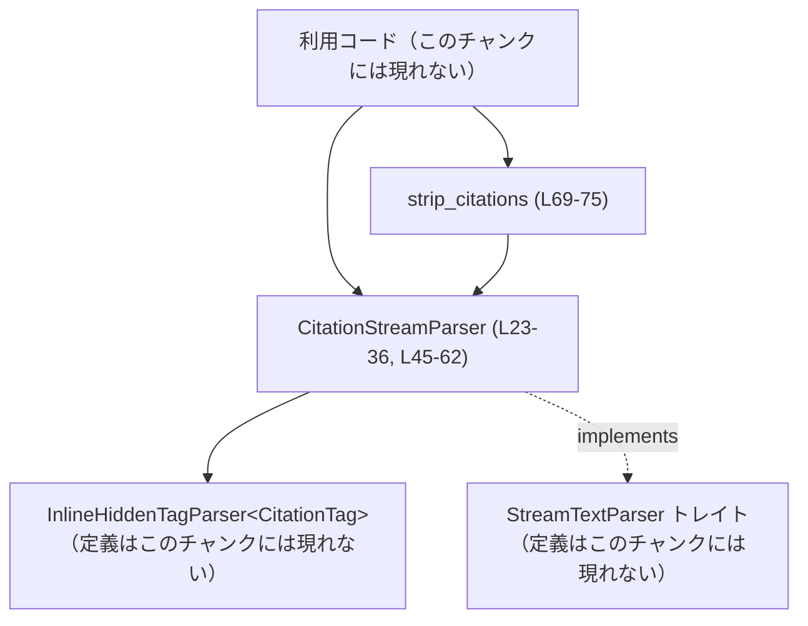

# utils/stream-parser/src/citation.rs

## 0. ざっくり一言

`<oai-mem-citation>...</oai-mem-citation>` タグを**ストリーム形式で取り除きつつ、中身だけを別途収集するパーサ**を提供するモジュールです（utils/stream-parser/src/citation.rs:L14-21, L23-25, L45-62, L69-75）。

---

## 1. このモジュールの役割

### 1.1 概要

- このモジュールは、ストリームとして流れてくるテキストから  
  `<oai-mem-citation>...</oai-mem-citation>` 区間を検出し、
  - 目に見えるテキストからは **タグごと削除**
  - タグの中身（citation 本文）は **別ベクタとして抽出**
  する問題を解決します（L11-12, L14-21, L48-54, L56-62）。
- 内部では、汎用の `InlineHiddenTagParser` をラップした `CitationStreamParser` を提供し、
  完全な文字列に対して一括処理する `strip_citations` も提供します（L23-36, L69-75）。

### 1.2 アーキテクチャ内での位置づけ

このファイルは、より汎用的なストリームパーサ基盤の上に構築された「citation 専用ラッパ」です。

- 依存関係（このチャンクから分かる範囲）  
  - 依存先
    - `InlineHiddenTagParser<CitationTag>`（定義はこのチャンクには現れない）をフィールドとして保持し、実際のタグ検出処理を委譲（L23-25, L30-34, L49, L57）。
    - `InlineTagSpec` を使って `<oai-mem-citation>` タグの仕様（open/close）を渡す（L30-34）。
    - 共通インタフェース `StreamTextParser` を実装し、呼び出し側からは抽象化されたストリームパーサとして扱える（L3-4, L45-62）。
  - 利用される側
    - クレート外のコード（このチャンクには現れない）が `CitationStreamParser` を直接使うか、
      完全な文字列処理用の `strip_citations` を呼び出す想定です（L23-36, L69-75）。

依存関係を簡略化した図です：



### 1.3 設計上のポイント

（すべて utils/stream-parser/src/citation.rs から読み取れる範囲に基づきます）

- **薄いラッパ設計**  
  - `CitationStreamParser` 自身はタグ検出ロジックを持たず、`InlineHiddenTagParser` に処理を委譲し、結果の型変換だけ行います（L23-25, L30-34, L48-54, L56-62）。
- **ストリーミング対応**  
  - `push_str` で部分文字列を順次流し込み、`finish` で EOF を通知する形のストリーム API になっています（L45-62）。  
  - テスト `collect_chunks` は複数チャンクを統合するユーティリティであり、ストリーム的な利用を前提としていることがわかります（L86-100）。
- **タグ非ネスト・リテラルマッチ**  
  - ドキュメントコメントとテストから、タグは**ネスト非対応・リテラル一致**であることが明示されています（L14-21, L171-177）。
- **エラーを返さない API**  
  - `push_str` / `finish` / `strip_citations` はいずれも `Result` ではなく、エラーを返さない作りです（L48-62, L69-75）。
  - 「不正なタグ構造」に対しては、ドキュメントに記載の「自動クローズ」「非ネスト」といった**定義済み挙動**で吸収します（L14-21, L135-141, L171-177）。
- **状態を持つ構造体**  
  - `CitationStreamParser` は内部に `InlineHiddenTagParser` を持ち、`&mut self` を通じてストリーム状態を更新します（L23-25, L45, L48, L56）。

---

## 2. 主要な機能一覧

このモジュールが提供する主な機能は次のとおりです。

- `CitationStreamParser`: `<oai-mem-citation>` タグを**隠しタグ**として扱うストリームパーサ（L23-25, L45-62）。
- `CitationStreamParser::new`: 上記パーサを citation タグ用設定で初期化するコンストラクタ（L28-36）。
- `CitationStreamParser` の `StreamTextParser` 実装:
  - `push_str`: チャンク文字列を与え、可視テキストと抽出された citation 本文を返す（L48-54）。
  - `finish`: EOF を通知し、残りの可視テキストと citation 本文を返す（L56-62）。
- `strip_citations`: 完全な文字列から citation タグを取り除き、  
  `(visible_text, Vec<citation_body>)` を一括で返すユーティリティ関数（L69-75）。

テストモジュールでは、これらの仕様を確認する以下のテストが含まれます（L102-177）。

- チャンク境界をまたぐタグ処理
- 部分的なタグプリフィックスの扱い
- 終端されないタグの自動クローズ
- 終端されないタグプリフィックスのリテラル扱い
- 複数 citation の収集
- ネストされたタグがサポートされないことの確認

---

## 3. 公開 API と詳細解説

### 3.1 型一覧（構造体・列挙体など）

| 名前 | 種別 | 公開範囲 | 役割 / 用途 | 定義位置 |
|------|------|----------|-------------|----------|
| `CitationTag` | 列挙体 | 非公開 | `InlineHiddenTagParser` 用のタグ種別。現在は `Citation` のみを持つ（L7-8）。 | utils/stream-parser/src/citation.rs:L6-9 |
| `CitationStreamParser` | 構造体 | `pub` | `<oai-mem-citation>` タグを隠しタグとして処理するストリームパーサ。内部に `InlineHiddenTagParser<CitationTag>` を保持する（L23-25）。 | utils/stream-parser/src/citation.rs:L23-25 |

関連する定数：

| 名前 | 種別 | 公開範囲 | 内容 | 定義位置 |
|------|------|----------|------|----------|
| `CITATION_OPEN` | `&'static str` 定数 | 非公開 | 開始タグ文字列 `"<oai-mem-citation>"`（L11）。 | utils/stream-parser/src/citation.rs:L11 |
| `CITATION_CLOSE` | `&'static str` 定数 | 非公開 | 終了タグ文字列 `"</oai-mem-citation>"`（L12）。 | utils/stream-parser/src/citation.rs:L12 |

### 3.2 関数詳細（主要 4 件）

#### `CitationStreamParser::new() -> Self`  

（utils/stream-parser/src/citation.rs:L28-36）

**概要**

- `InlineHiddenTagParser` に `<oai-mem-citation>` タグ仕様を 1 件だけ渡して初期化し、そのラッパとして `CitationStreamParser` を生成します（L28-36）。

**引数**

- なし。

**戻り値**

- `CitationStreamParser`  
  - `<oai-mem-citation>` タグを隠しタグとして扱うストリームパーサ。

**内部処理の流れ**

1. `InlineHiddenTagParser::new` に、`InlineTagSpec` のベクタを 1 要素だけ含む形で渡します（L30-34）。
2. `InlineTagSpec` には以下を設定します（L30-34）。
   - `tag: CitationTag::Citation`
   - `open: CITATION_OPEN`（`"<oai-mem-citation>"`、L11）
   - `close: CITATION_CLOSE`（`"</oai-mem-citation>"`、L12）
3. 生成した `InlineHiddenTagParser` を `inner` フィールドに格納した `CitationStreamParser` を返します（L28-36）。

**Examples（使用例）**

```rust
// CitationStreamParser を作成する
let mut parser = CitationStreamParser::new(); // new() で内部の InlineHiddenTagParser も初期化される
```

**Errors / Panics**

- コードからは、`InlineHiddenTagParser::new` が panic したりエラーを返すかどうかは分かりません（このチャンクには定義が現れません）。
- `new` 自体は `Result` を返さず、エラー情報を返す手段はありません（L28-36）。

**Edge cases（エッジケース）**

- 引数がないため、初期化に伴うエッジケースは特にありません。

**使用上の注意点**

- `CitationStreamParser` の設定（対象タグ名）を変更したい場合は、`CITATION_OPEN` / `CITATION_CLOSE` や `InlineTagSpec` の定義を変更する必要があります（L11-12, L30-34）。
- `InlineHiddenTagParser` の動作仕様自体はこのファイルには現れないため、より深い挙動の変更には該当モジュールの確認が必要です。

---

#### `impl StreamTextParser for CitationStreamParser::push_str(&mut self, chunk: &str) -> StreamTextChunk<String>`  

（utils/stream-parser/src/citation.rs:L45-54）

**概要**

- ストリームに新しい文字列チャンクを押し込み、可視テキストと新たに検出された citation 本文を返します。
- 内部では `InlineHiddenTagParser` に処理を委譲し、抽出結果から `tag.content` だけを取り出して `Vec<String>` に変換します（L48-53）。

**引数**

| 引数名 | 型 | 説明 |
|--------|----|------|
| `chunk` | `&str` | ストリームに追加するテキストチャンク。タグの一部または全部を含んでいてもよい（L48）。 |

**戻り値**

- `StreamTextChunk<String>`（定義はこのチャンクには現れないが、フィールド利用から以下が読める）:
  - `visible_text: String` — このチャンクまでを処理した結果の**可視テキストの差分**（L51）。
  - `extracted: Vec<String>` — このチャンク処理により新たに抽出された citation 本文（タグ内の内容）（L52-53）。

**内部処理の流れ**

1. `self.inner.push_str(chunk)` を呼び出し、内部パーサに処理を委譲します（L49）。
2. 戻り値 `inner` は `StreamTextChunk` であり、少なくとも以下のフィールドを持ちます（L51-52）。
   - `inner.visible_text`
   - `inner.extracted`（イテレート可能で、各要素に `.content` フィールドがある）
3. 新しい `StreamTextChunk` を組み立てます（L50-53）。
   - `visible_text` に `inner.visible_text` をそのまま設定（L51）。
   - `extracted` には  
     `inner.extracted.into_iter().map(|tag| tag.content).collect()` を設定し、  
     タグ構造から本文（`content`）だけを取り出した `Vec<String>` に変換します（L52-53）。

**Examples（使用例）**

以下は、1 回の `push_str` で `<oai-mem-citation>` を含む文字列を処理する例です：

```rust
let mut parser = CitationStreamParser::new();         // citation 用のストリームパーサを生成
let chunk = "a<oai-mem-citation>one</oai-mem-citation>b"; // citation タグを含む文字列

let out = parser.push_str(chunk);                     // チャンクを一度に処理

// 可視テキストにはタグが除去される
assert_eq!(out.visible_text, "ab".to_string());       // "a" + "b" が残ることが想定される（挙動は tests から類推）

// 抽出結果には citation 本文のみが入る
assert_eq!(out.extracted, vec!["one".to_string()]);   // タグ内の "one" が抽出される
```

※ 上記の具体的な戻り値はファイル内テストの `strip_citations_collects_all_citations`（L153-160）から類推しています。

**Errors / Panics**

- この関数は `Result` を返しません（L48-54）。
- `inner.push_str` の挙動はこのチャンクからは不明ですが、ここで明示的に panic を起こしていません。

**Edge cases（エッジケース）**

テストから推測できる代表的なケース：

- **チャンク境界でタグが分割される場合**  
  - `"Hello <oai-mem-"` と `"citation>source A</oai-mem-"`、`"citation> world"` の 3 チャンクに分割しても、
    citation は正しく抽出され、可視テキストが `"Hello  world"` となることが確認されています（L102-116）。
- **部分的な開始タグプリフィックス**  
  - `"abc <oai-mem-"` を push した時点では可視テキスト `"abc "`、抽出結果なし（L122-125）。
  - 続く `"citation>x</oai-mem-citation>z"` により、`"x"` が citation として抽出され、可視テキストには `"z"` のみが出る（L126-131）。

**使用上の注意点**

- `push_str` は内部状態を更新するため、同じ `CitationStreamParser` インスタンスを**複数スレッドから同時に `&mut` で使用することはできません**（Rust の借用ルール上も不可能です）。
- すべての入力を処理し終わったら、必ず `finish` を呼び出す必要があります。そうしないと、終端されないタグが自動クローズされず、抽出結果が欠落する可能性があります（L135-141, L163-167）。

---

#### `impl StreamTextParser for CitationStreamParser::finish(&mut self) -> StreamTextChunk<String>`  

（utils/stream-parser/src/citation.rs:L56-62）

**概要**

- ストリーム終端（EOF）を通知し、内部バッファに残っている可視テキストと citation 本文をすべて返します（L56-62）。
- 特に、終端されていない `<oai-mem-citation>` タグを**自動的にクローズ**して citation として抽出する挙動を持ちます（ドキュメントコメントとテストより、L14-21, L135-141, L163-167）。

**引数**

| 引数名 | 型 | 説明 |
|--------|----|------|
| `self` | `&mut self` | ストリームパーサ自身。内部状態を EOF に応じて更新します（L56）。 |

**戻り値**

- `StreamTextChunk<String>`:
  - `visible_text: String` — EOF まで処理した後で、直前の `push_str` 以降に新たに可視になったテキスト（L59）。
  - `extracted: Vec<String>` — EOF によって確定した citation 本文（例: 終端されていなかったタグの内容など）（L60）。

**内部処理の流れ**

1. `self.inner.finish()` を呼び出し、内部パーサに EOF 通知します（L57）。
2. 戻り値 `inner` の `visible_text` と `extracted` を受け取ります（L59-60）。
3. `push_str` と同様に、`inner.extracted.into_iter().map(|tag| tag.content).collect()` で `Vec<String>` に変換したうえで、新しい `StreamTextChunk<String>` として返します（L58-61）。

**Examples（使用例）**

`push_str` と組み合わせた典型的な使用例です：

```rust
let mut parser = CitationStreamParser::new();              // パーサを作成
let first = parser.push_str("x<oai-mem-citation>source");  // 終了タグを含まないチャンクを処理
let tail = parser.finish();                                // EOF を通知して残りを取得

// first.visible_text は "x" のみが含まれることが tests から分かる（L135-141）
assert_eq!(first.visible_text, "x");

// tail.visible_text は空（追加の可視テキストがない）、extract には "source"
assert_eq!(tail.visible_text, "");
assert_eq!(tail.extracted, vec!["source".to_string()]);
```

※ 上記の具体的値は `citation_parser_auto_closes_unterminated_tag_on_finish` テスト（L135-141）を参考にしています。

**Errors / Panics**

- `finish` も `Result` を返さず、エラーを表現する手段はありません（L56-62）。
- `inner.finish` の内部挙動はこのチャンクには現れません。

**Edge cases（エッジケース）**

- **終端されない `<oai-mem-citation>` タグ**  
  - `"x<oai-mem-citation>source"` のように終了タグがない場合でも、`finish` 時に `"source"` が citation として抽出されます（L135-141）。
- **未完成の開始タグプリフィックス**  
  - `"hello <oai-mem-"` のように `CITATION_OPEN` 全体に満たないプリフィックスだけが残る場合、`finish` してもそれはタグとは見なされず、可視テキストにそのまま残ります（L143-150）。

**使用上の注意点**

- ストリーム処理の最後には必ず 1 回だけ `finish` を呼び、同じパーサインスタンスに対して複数回呼び出さない設計が想定されます（`collect_chunks` の使い方から、L86-100）。
- `finish` 呼び出し後の `push_str` 挙動はこのチャンクには現れないため、安全かどうかは不明です。通常は「EOF 後に入力しない」前提で設計されていると考えるのが自然です。

---

#### `pub fn strip_citations(text: &str) -> (String, Vec<String>)`  

（utils/stream-parser/src/citation.rs:L69-75）

**概要**

- 1 つの完全な文字列から `<oai-mem-citation>...</oai-mem-citation>` をすべて取り除き、  
  - citation を取り除いた可視テキスト
  - 抽出された citation 本文のベクタ
  のタプルを返すユーティリティです（L65-69）。

**引数**

| 引数名 | 型 | 説明 |
|--------|----|------|
| `text` | `&str` | 入力文字列全体。ストリーミングではなく、一括処理用（L69）。 |

**戻り値**

- `(String, Vec<String>)`
  - `0` 番目: citation タグを除去した可視テキスト（L73-75）。
  - `1` 番目: すべての citation 本文（タグ順に抽出された `Vec<String>`）（L73-75）。

**内部処理の流れ**

1. `CitationStreamParser::new()` でローカルなパーサを作成します（L70）。
2. `parser.push_str(text)` を呼び、最初の `StreamTextChunk` を `out` として受け取ります（L71）。
3. `parser.finish()` を呼び、EOF 時の残りを `tail` として受け取ります（L72）。
4. `out.visible_text` に `tail.visible_text` を追記します（L73）。
5. `out.extracted` に `tail.extracted` の内容を `extend` で追加します（L74）。
6. `(out.visible_text, out.extracted)` のタプルを返します（L75）。

**Examples（使用例）**

テストに近い形の実用例です（L153-160）：

```rust
let text = "a<oai-mem-citation>one</oai-mem-citation>\
            b<oai-mem-citation>two</oai-mem-citation>c"; // citation タグを 2 つ含む文字列

let (visible, citations) = strip_citations(text);      // 一括処理でタグ除去と citation 抽出を行う

assert_eq!(visible, "abc".to_string());                // citation 部分が削除されたテキスト
assert_eq!(citations, vec!["one".to_string(),          // 1 つ目の citation
                           "two".to_string()]);        // 2 つ目の citation
```

**Errors / Panics**

- `strip_citations` は `Result` を返さず、エラーを表現しません（L69-75）。
- 内部で使用する `CitationStreamParser`/`InlineHiddenTagParser` の実装に依存する panic の可能性については、このチャンクからは不明です。

**Edge cases（エッジケース）**

テストから確認できる挙動：

- **終端されない citation**  
  - `"x<oai-mem-citation>y"` に対して、可視テキスト `"x"`、citation `["y"]` が返る（L163-167）。
- **ネストされた citation**（非サポート）  
  - `"a<oai-mem-citation>x<oai-mem-citation>y</oai-mem-citation>z</oai-mem-citation>b"` では（L171-177）  
    - 可視テキスト: `"az</oai-mem-citation>b"`  
      → 内側の citation 終了タグ以降が文字列として残る  
    - citation: `["x<oai-mem-citation>y"]`  
      → 最初の `<oai-mem-citation>` から最初の `</oai-mem-citation>` までが一塊として扱われる  
  - これにより「ネストはサポートされず、最初の開始タグと次の終了タグのみを対応付ける」仕様が確認できます（L14-21, L171-177）。

**使用上の注意点**

- `strip_citations` は内部でストリーム API を 1 回 `push_str` + `finish` で呼んでいるだけなので、**比較的短い文字列一括処理に向いています**（L69-75）。
- ネストした citation タグを正しく扱いたい場合には、この関数および `CitationStreamParser` は要件を満たしません（L14-21, L171-177）。

---

### 3.3 その他の関数

本ファイルに定義されている補助関数・テスト関数の一覧です。

| 関数名 | 公開範囲 | 役割（1 行） | 定義位置 |
|--------|----------|--------------|----------|
| `CitationStreamParser::default()` | `impl Default` | `new()` を呼び出すデフォルト実装。`Default` トレイトにより `CitationStreamParser::default()` で同じ初期化を提供する（L39-43）。 | utils/stream-parser/src/citation.rs:L39-43 |
| `collect_chunks<P>`（tests 内） | 非公開 | 任意の `StreamTextParser` 実装に対し、複数チャンクを順に `push_str` & 最後に `finish` して結果を結合するテスト用ヘルパー（L86-100）。 | utils/stream-parser/src/citation.rs:L86-100 |
| `citation_parser_streams_across_chunk_boundaries` | `#[test]` | チャンク境界をまたぐ `<oai-mem-citation>` を正しく処理できることを検証（L102-116）。 | utils/stream-parser/src/citation.rs:L102-116 |
| `citation_parser_buffers_partial_open_tag_prefix` | `#[test]` | 部分的な開始タグプリフィックスをバッファし、完全なタグになるまで可視テキストとして出さない挙動を検証（L118-132）。 | utils/stream-parser/src/citation.rs:L118-132 |
| `citation_parser_auto_closes_unterminated_tag_on_finish` | `#[test]` | 終了タグを持たない citation が EOF 時に自動クローズされることを検証（L134-141）。 | utils/stream-parser/src/citation.rs:L135-141 |
| `citation_parser_preserves_partial_open_tag_at_eof_if_not_a_full_tag` | `#[test]` | 開始タグのプリフィックスだけで最後まで終わった場合、その部分が可視テキストとして残ることを検証（L143-150）。 | utils/stream-parser/src/citation.rs:L143-150 |
| `strip_citations_collects_all_citations` | `#[test]` | 複数 citation が存在する文字列で、可視テキスト・citation の両方が期待どおりに収集されることを検証（L153-160）。 | utils/stream-parser/src/citation.rs:L153-160 |
| `strip_citations_auto_closes_unterminated_citation_at_eof` | `#[test]` | `strip_citations` 経由でも終端されない citation が EOF 時に自動クローズされることを確認（L162-167）。 | utils/stream-parser/src/citation.rs:L163-167 |
| `citation_parser_does_not_support_nested_tags` | `#[test]` | ネストされた citation タグがサポートされていないこと、具体的な可視テキストと citation 結果を検証（L171-177）。 | utils/stream-parser/src/citation.rs:L171-177 |

---

## 4. データフロー

ここでは、`strip_citations` を使って 1 つの文字列を処理する場面を例に、データの流れを説明します。

### 4.1 `strip_citations` 呼び出し時のフロー

`strip_citations (L69-75)` → `CitationStreamParser::push_str (L48-54)` → `CitationStreamParser::finish (L56-62)` → `InlineHiddenTagParser` という流れになります。

```mermaid
sequenceDiagram
    participant C as 呼び出し側コード
    participant S as strip_citations (L69-75)
    participant P as CitationStreamParser (L23-36, L45-62)
    participant I as InlineHiddenTagParser&lt;CitationTag&gt;（定義はこのチャンクには現れない）

    C->>S: strip_citations(text: &str)
    S->>P: CitationStreamParser::new()（L70）
    S->>P: push_str(text)（L71）
    P->>I: inner.push_str(text)（L49）
    I-->>P: StreamTextChunk&lt;TagType&gt;（visible_text, extracted[*].content）（L49-52）
    P-->>S: StreamTextChunk&lt;String&gt; out（L50-53）
    S->>P: finish()（L72）
    P->>I: inner.finish()（L57）
    I-->>P: StreamTextChunk&lt;TagType&gt; tail_inner（L57-60）
    P-->>S: StreamTextChunk&lt;String&gt; tail（L58-61）
    S->>S: out.visible_text.push_str(&tail.visible_text)（L73）
    S->>S: out.extracted.extend(tail.extracted)（L74）
    S-->>C: (out.visible_text, out.extracted)（L75）
```

この図から分かる要点：

- `CitationStreamParser` は `InlineHiddenTagParser` の戻り値を受け取り、`TagType` から `content` だけを取り出して `String` に変換しています（L50-53, L58-61）。
- `strip_citations` は 1 回の `push_str` と 1 回の `finish` で内部パーサを使い切り、最後に `visible_text` と `extracted` を結合しています（L71-75）。

---

## 5. 使い方（How to Use）

### 5.1 基本的な使用方法

#### ストリームとして使う（複数チャンク）

`CitationStreamParser` を直接使い、テキストを複数チャンクに分けて処理する例です。

```rust
// CitationStreamParser を作成する
let mut parser = CitationStreamParser::new();          // L28-36 に相当する初期化

// 3 つのチャンクに分割された入力
let chunks = [
    "Hello <oai-mem-",                                 // 開始タグの前半
    "citation>source A</oai-mem-",                     // 開始タグの後半と本文、終了タグの前半
    "citation> world",                                 // 終了タグの後半と残りテキスト
];

let mut visible = String::new();                       // 可視テキストを貯めるバッファ
let mut citations: Vec<String> = Vec::new();           // 抽出された citation を貯めるベクタ

for chunk in &chunks {
    let out = parser.push_str(chunk);                  // 各チャンクをストリーム処理（L48-54）
    visible.push_str(&out.visible_text);               // 可視テキストを追加
    citations.extend(out.extracted);                   // 抽出された citation を追加
}

let tail = parser.finish();                            // EOF 通知（L56-62）
visible.push_str(&tail.visible_text);                  // 残りの可視テキストを追加
citations.extend(tail.extracted);                      // 残りの citation を追加

assert_eq!(visible, "Hello  world".to_string());       // L102-116 のテストと整合
assert_eq!(citations, vec!["source A".to_string()]);
```

### 5.2 よくある使用パターン

#### 完全な文字列に対して一括処理する

`strip_citations` を使うと、ストリーム管理を自前で行う必要がありません（L69-75）。

```rust
let input = "x<oai-mem-citation>y";                    // 終端されていない citation を含む文字列
let (visible, citations) = strip_citations(input);     // 一括処理（L69-75）

assert_eq!(visible, "x".to_string());                  // 可視テキスト
assert_eq!(citations, vec!["y".to_string()]);          // EOF 時に自動クローズされた citation（L163-167）
```

#### ジェネリックなストリーム処理の一部として使う

テストの `collect_chunks` のように、`StreamTextParser` トレイトに対して抽象化した処理も可能です（L86-100）。

```rust
fn process_stream<P>(parser: &mut P, chunks: &[&str]) -> StreamTextChunk<P::Extracted>
where
    P: StreamTextParser,                               // StreamTextParser トレイトを前提とする
{
    let mut all = StreamTextChunk::default();          // 全結果を集約するバッファ（L90）
    for chunk in chunks {
        let out = parser.push_str(chunk);              // 任意のパーサにチャンクを渡す
        all.visible_text.push_str(&out.visible_text);  // 可視テキストを集約
        all.extracted.extend(out.extracted);           // 抽出結果を集約
    }
    let tail = parser.finish();                        // 最後に EOF 通知（L96）
    all.visible_text.push_str(&tail.visible_text);
    all.extracted.extend(tail.extracted);
    all
}
```

上記は tests 内の `collect_chunks` と同等のパターンであり、`CitationStreamParser` 以外のパーサにも適用できる設計であることが分かります（L86-100）。

### 5.3 よくある間違い

#### 間違い例: `finish` を呼ばずに結果を確定してしまう

```rust
let mut parser = CitationStreamParser::new();
let out = parser.push_str("x<oai-mem-citation>source"); // 終了タグなし

// 間違い: finish を呼ばずにここで処理を終了してしまう
// この時点では "source" はまだ抽出されていない可能性がある（L135-141 参照）
```

#### 正しい例: 最後に必ず `finish` を呼ぶ

```rust
let mut parser = CitationStreamParser::new();
let out = parser.push_str("x<oai-mem-citation>source");
let tail = parser.finish();                              // EOF 通知で自動クローズ（L56-62）

// out.visible_text は "x"、tail.extracted[0] は "source" になることが tests から分かる（L135-141）
```

#### 間違い例: ネストした citation を期待する

```rust
let input = "a<oai-mem-citation>x<oai-mem-citation>y</oai-mem-citation>z</oai-mem-citation>b";
let (visible, citations) = strip_citations(input);

// 「x」「y」の 2 つの citation が抽出されると期待すると誤り
```

#### 実際の挙動

```rust
assert_eq!(visible, "az</oai-mem-citation>b".to_string());    // 内側のタグは文字列として残る（L171-177）
assert_eq!(citations, vec!["x<oai-mem-citation>y".to_string()]);
```

このように、**ネストはサポートされない**ことが仕様です（L14-21, L171-177）。

### 5.4 使用上の注意点（まとめ）

- **ストリーム終端の通知が必須**  
  - `CitationStreamParser` を直接使用する場合、すべてのチャンクを `push_str` した後に必ず `finish` を呼ぶ必要があります（L86-100, L56-62）。
- **ネスト非対応**  
  - ネストされた `<oai-mem-citation>` タグはサポートされず、最初の開始タグと最初の終了タグだけが対応付けられます（L14-21, L171-177）。
- **部分的開始タグの扱い**  
  - 開始タグのプリフィックスが途中で現れ、その後タグ全体に達しない場合、最終的には可視テキストとして残ります（L143-150）。
- **並行性**  
  - `push_str` / `finish` が `&mut self` を要求することから、1 つの `CitationStreamParser` インスタンスを複数スレッドで同時に操作することはできません（L45, L48, L56）。  
    スレッドごとに別インスタンスを生成するのが前提と考えられます。
- **安全性**  
  - このファイル内には `unsafe` ブロックは存在せず、API はすべて安全な Rust の範囲で実装されています（全体参照）。

---

## 6. 変更の仕方（How to Modify）

### 6.1 新しい機能を追加する場合

このチャンクから分かる範囲で、変更の入口を整理します。

- **タグ文字列を変更したい場合**
  - `CITATION_OPEN` / `CITATION_CLOSE` を変更することで、対象とするタグ名を変更できます（L11-12）。
  - ただし、他のモジュールが `<oai-mem-citation>` という名前を前提にしている可能性は、このチャンクからは分かりません。
- **別種のタグ用パーサを追加したい場合**
  - `CitationStreamParser` の構造（`inner: InlineHiddenTagParser<T>` + `InlineTagSpec` で設定）を参考に、別のタグ用のラッパ構造体を追加することが考えられます（L23-36）。
  - ただし、`InlineHiddenTagParser` の汎用性や前提条件は、このチャンクには現れません。

### 6.2 既存の機能を変更する場合

- **`CitationStreamParser` の返り値型変更**
  - `StreamTextParser for CitationStreamParser` の `type Extracted = String` を変更すると、`strip_citations` を含むすべての利用箇所に影響します（L45-47, L69-75, L86-100, L102-177）。
- **ネストサポートを追加したい場合**
  - 現在の非ネスト挙動は `InlineHiddenTagParser` の実装に依存している可能性が高く、このファイル側では `inner` の結果を単に受け取っているだけです（L49-53, L57-61）。
  - そのため、ネスト対応の変更は主に `InlineHiddenTagParser` 側に対する修正が必要になると考えられますが、具体的な手順はこのチャンクには現れません。
- **テストの確認**
  - 挙動変更を行う前後で、tests モジュール内のテスト（L102-177）が期待どおりに通るかを確認する必要があります。これらは仕様の一部を明示的に表現しています。

---

## 7. 関連ファイル

このモジュールと密接に関係するが、このチャンクには定義が現れない要素を列挙します。

| パス / シンボル | 役割 / 関係 |
|-----------------|------------|
| `crate::InlineHiddenTagParser` | `CitationStreamParser` の内部で使用される汎用ストリームパーサ。タグ仕様に基づき、可視テキストとタグ内容を分離する（L1, L23-25, L30-34, L49, L57）。定義ファイルのパスはこのチャンクには現れません。 |
| `crate::InlineTagSpec` | `InlineHiddenTagParser` に渡すタグ仕様（タグ種別、開始/終了文字列）を表す型（L2, L30-34）。定義位置はこのチャンクには現れません。 |
| `crate::StreamTextChunk` | ストリーム処理の結果（`visible_text` と `extracted`）を保持する汎用的な構造体（L3, L48-53, L56-62, L86-100）。定義位置はこのチャンクには現れません。 |
| `crate::StreamTextParser` | ストリームパーサの共通インタフェースを定義するトレイト。`CitationStreamParser` はこれを実装しています（L4, L45-62, L86-89）。定義位置はこのチャンクには現れません。 |

以上が、utils/stream-parser/src/citation.rs の公開 API とコアロジック、データフロー、エッジケースを中心に整理した解説です。
