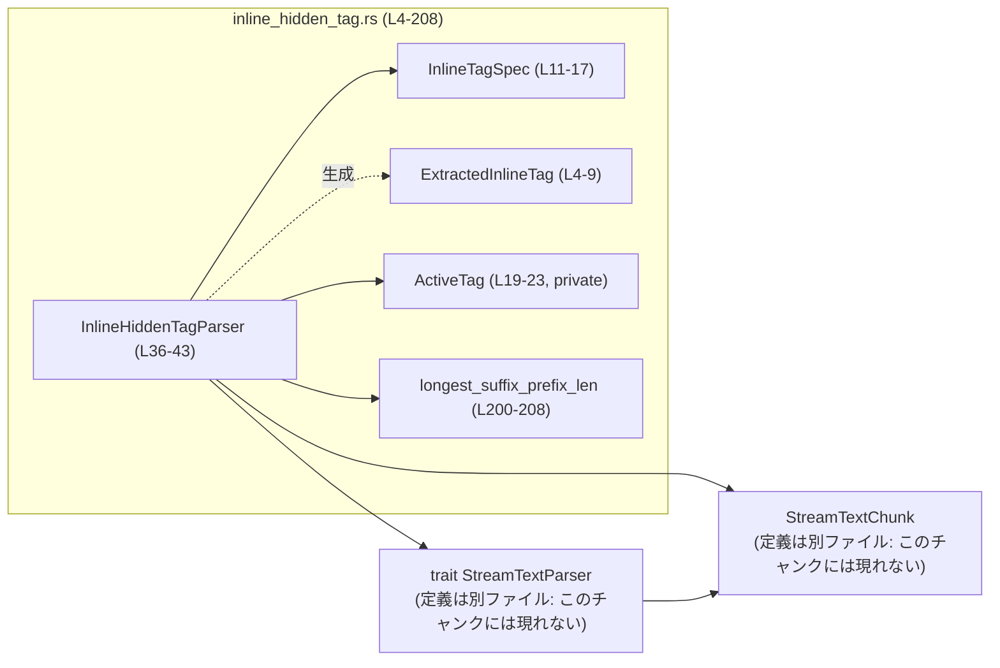
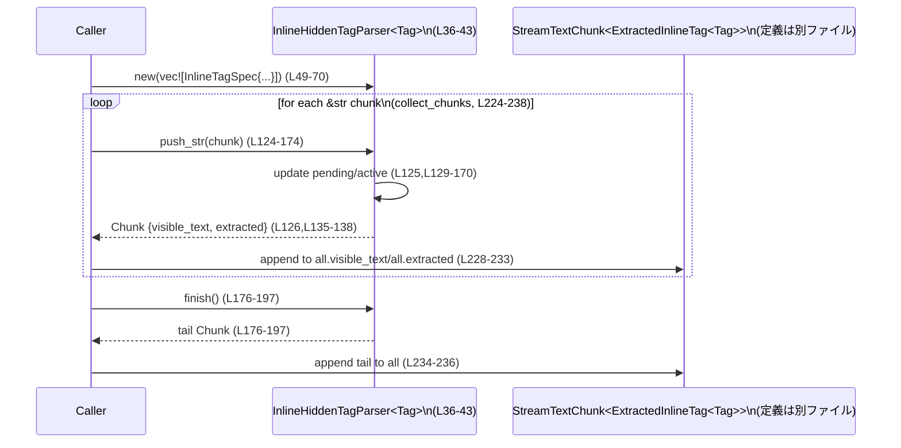

# utils/stream-parser/src/inline_hidden_tag.rs コード解説

## 0. ざっくり一言

このファイルは、ストリーム状のテキストから「特定のインラインタグで囲まれた部分」を **見えないように削除しつつ、その中身だけを別途抽出する** 汎用ストリーミングパーサを提供します（`inline_hidden_tag.rs:L4-9,L26-43,L118-198`）。

---

## 1. このモジュールの役割

### 1.1 概要

- 解決する問題  
  プレーンテキストのストリーミング処理中に、「`<tag> ... </tag>` のようなマーカーで囲まれた部分だけを抽出したいが、元のテキストの表示用にはそれらを隠したい」という要件を扱います（`inline_hidden_tag.rs:L26-34`）。
- 提供する機能  
  - 複数種類のインラインタグ（開き/閉じデリミタ）を登録し（`InlineTagSpec<T>`、`inline_hidden_tag.rs:L11-17`）  
  - ストリームとして受け取るテキスト断片ごとに `push_str` でパースし（`inline_hidden_tag.rs:L124-174`）  
  - 「見えるテキスト」と「抽出されたタグ内容」を `StreamTextChunk` で返します（`inline_hidden_tag.rs:L122,L126,L135-138`）。

タグは **文字列をそのまま比較するリテラルマッチ** で、**入れ子構造は扱わない** ことがコメントで明示されています（`inline_hidden_tag.rs:L33-34`）。

### 1.2 アーキテクチャ内での位置づけ

- このモジュールは、クレート全体で使われるストリーミングパーサ用トレイト `StreamTextParser` の一実装です（`inline_hidden_tag.rs:L1-2,L118-123`）。
- 入出力には共通のチャンク型 `StreamTextChunk<E>` を利用し、その `visible_text` / `extracted` フィールドを直接操作しています（`inline_hidden_tag.rs:L126,L135-138,L177-196,L228-237`）。
- 内部状態としては
  - 未処理のテキストバッファ `pending: String`（`inline_hidden_tag.rs:L41`）
  - 現在開いているタグ `active: Option<ActiveTag<T>>`（`inline_hidden_tag.rs:L42`）
  を保持し、ストリームの境界をまたいでタグの開始/終了を検出します。



### 1.3 設計上のポイント

- **責務の分割**
  - `InlineTagSpec<T>`: タグ種別と、その開き/閉じデリミタ文字列の仕様を表現（`inline_hidden_tag.rs:L11-17`）。
  - `InlineHiddenTagParser<T>`: ストリーミングパーサ本体。`specs`, `pending`, `active` という状態を持つ（`inline_hidden_tag.rs:L36-43`）。
  - `ActiveTag<T>`: 現在開いている 1 つのタグの情報（`inline_hidden_tag.rs:L19-23`）。
  - `ExtractedInlineTag<T>`: 抽出結果 1 件分（タグ種別＋内容）（`inline_hidden_tag.rs:L4-9`）。
- **状態管理**
  - `pending`: まだ処理されていないテキストを保持し、タグの境界がチャンクをまたぐ場合でも正しく検出するために利用（`inline_hidden_tag.rs:L41,L124-171`）。
  - `active`: 「今、あるタグの中を読み取り途中であるかどうか」を表し、`Some` の間は閉じデリミタだけを探索（`inline_hidden_tag.rs:L42,L129-152`）。
- **エラーハンドリング方針**
  - APIとして明示的な `Result` は返さず、**仕様違反は `assert!` によるパニック** で検出します。
    - `specs` が空の場合（`inline_hidden_tag.rs:L51-54`）
    - 各 `InlineTagSpec` の `open` / `close` が空文字列の場合（`inline_hidden_tag.rs:L55-63`）
  - `push_str` / `finish` 内には `unwrap` や追加の `assert!` はなく、通常はパニックしません（`inline_hidden_tag.rs:L124-197`）。
- **文字列と UTF-8 の安全性**
  - 部分一致の探索には `longest_suffix_prefix_len` を用い、`needle.is_char_boundary(k)` で UTF-8 の文字境界を尊重したスライスのみを行います（`inline_hidden_tag.rs:L200-204`）。
  - これにより、マルチバイト文字を分断してパニックする `&str` スライスが発生しないようになっています。
- **並行性**
  - すべてのメソッドは `&mut self` を受け取り、内部で `unsafe` や `RefCell` などの内部可変性は使っていません（`inline_hidden_tag.rs:L45-116,L118-198,L200-208`）。
  - 通常の Rust のルールに従い、「同時に複数スレッドから 1 つのパーサインスタンスを操作する」ことはコンパイル時に禁止されます。

---

## 2. 主要な機能一覧（コンポーネントインベントリー含む）

### 2.1 機能の一覧

- **インラインタグ仕様の登録**  
  `InlineTagSpec<T>` でタグ種別と `open` / `close` デリミタを定義し、それらのベクタから `InlineHiddenTagParser::new` でパーサを構築します（`inline_hidden_tag.rs:L11-17,L49-70`）。

- **ストリーミングなテキストパース (`push_str`)**  
  テキスト断片を順次 `push_str` で流し込み、  
  - タグ外のテキスト → `visible_text` へ  
  - タグ内のテキスト → `ExtractedInlineTag<T>` として `extracted` へ  
  を分離します（`inline_hidden_tag.rs:L124-174`）。

- **ストリーム終端処理 (`finish`)**  
  解析途中の `pending` / `active` を使って、  
  - 未処理のタグ外テキストを `visible_text` に追加  
  - 開きタグのみが残っている場合は **自動的に閉じたものとみなし、中身を `extracted` に返す**（`inline_hidden_tag.rs:L33-34,L176-197`）。

- **マルチバイト対応の部分一致検出**  
  タグの開き/閉じデリミタがチャンクの境界で分断されても検出できるように、`longest_suffix_prefix_len` で「`pending` の末尾がデリミタの接頭辞にどこまで一致しているか」を計算します（`inline_hidden_tag.rs:L90-96,L144-151,L168-170,L200-208`）。

- **複数タグ種別・オーバーラップするデリミタへの対応**  
  - 複数の `InlineTagSpec` を同時に扱えます（`inline_hidden_tag.rs:L36-41,L72-88`）。  
  - 同じ位置に複数の開きデリミタがマッチする場合は、**より長いデリミタを優先**するアルゴリズムになっています（`inline_hidden_tag.rs:L72-88`。テスト `generic_inline_parser_prefers_longest_opener_at_same_offset`, `inline_hidden_tag.rs:L281-302` で検証）。

### 2.2 型インベントリー（このファイル内で定義）

| 名前 | 種別 | 可視性 | 行範囲 | 役割 / 用途 |
|------|------|--------|--------|-------------|
| `ExtractedInlineTag<T>` | 構造体 | `pub` | `inline_hidden_tag.rs:L4-9` | 1 つの抽出済みインラインタグを表現。タグ種別 `tag: T` とその中身 `content: String` を保持。 |
| `InlineTagSpec<T>` | 構造体 | `pub` | `inline_hidden_tag.rs:L11-17` | 1 種類のタグの仕様。タグ種別 `tag: T` と開き/閉じデリミタ文字列 `open`, `close` を保持。 |
| `ActiveTag<T>` | 構造体 | private | `inline_hidden_tag.rs:L19-23` | パース中に「現在開いているタグ」の情報を保持する内部用構造体。 |
| `InlineHiddenTagParser<T>` | 構造体 | `pub` | `inline_hidden_tag.rs:L36-43` | ストリーミングパーサ本体。`specs`, `pending`, `active` を内部状態として持つ。 |
| `Tag` | 列挙体 | private（テスト用） | `inline_hidden_tag.rs:L218-222` | テストにおけるタグ種別の例。`A`, `B` の 2 値。 |

### 2.3 依存する外部コンポーネント（定義は別ファイル）

> このチャンクには定義が現れないため、役割は使用箇所からの推測になります。

| 名前 | 種別 | 行範囲（使用側） | 役割 / 用途 |
|------|------|------------------|-------------|
| `StreamTextChunk<E>` | 構造体と推定 | 使用: `inline_hidden_tag.rs:L1,L124-127,L135-138,L177-196,L224-237` | ストリーミングパーサの出力バッファ。少なくとも `visible_text`（`String`）と `extracted`（`Vec<E>`）フィールドを持つことが使用から分かる。定義位置はこのチャンクには現れない。 |
| `StreamTextParser` | トレイト | 使用: `inline_hidden_tag.rs:L2,L118-124,L176,L224-236` | ストリーミングパーサの共通インターフェース。少なくとも `type Extracted` と `fn push_str(&mut self, &str)` / `fn finish(&mut self)` を持つことが分かる。定義位置はこのチャンクには現れない。 |

---

## 3. 公開 API と詳細解説

### 3.1 公開型の概要

上記 2.2 の型のうち、外部から直接利用される可能性が高いのは次の 3 つです。

- `InlineTagSpec<T>`（`inline_hidden_tag.rs:L11-17`）
- `InlineHiddenTagParser<T>`（`inline_hidden_tag.rs:L36-43`）
- `ExtractedInlineTag<T>`（`inline_hidden_tag.rs:L4-9`）

これらを用いて、`StreamTextParser` トレイト経由で `push_str` / `finish` を呼び出す構成になっています（`inline_hidden_tag.rs:L118-197`）。

### 3.2 関数詳細（7 件）

#### 1. `InlineHiddenTagParser::new(specs: Vec<InlineTagSpec<T>>) -> Self`（L49-70）

```rust
impl<T> InlineHiddenTagParser<T>
where
    T: Clone + Eq,
{
    /// Create a parser for one or more hidden inline tags.
    pub fn new(specs: Vec<InlineTagSpec<T>>) -> Self { /* ... */ }
}
```

**概要**

- 1 つ以上の `InlineTagSpec<T>` を受け取り、それらを認識する `InlineHiddenTagParser<T>` を構築します（`inline_hidden_tag.rs:L49-50,L65-69`）。
- `specs` の妥当性（空でない、各デリミタが空文字でない）を `assert!` で検証します（`inline_hidden_tag.rs:L51-63`）。

**引数**

| 引数名 | 型 | 説明 |
|--------|----|------|
| `specs` | `Vec<InlineTagSpec<T>>` | 認識させたいタグ仕様のリスト。各要素にタグ種別 `T`、開きデリミタ `open`、閉じデリミタ `close` を含む（`inline_hidden_tag.rs:L11-17`）。 |

**戻り値**

- `InlineHiddenTagParser<T>`：指定した `specs` を内部に保持し、`pending` / `active` を空に初期化したパーサ（`inline_hidden_tag.rs:L65-69`）。

**内部処理の流れ**

1. `specs` が空でないことを `assert!(!specs.is_empty(), "...")` で検査（`inline_hidden_tag.rs:L51-54`）。
2. 各 `spec` について、`open` / `close` が空でないことを `assert!` で検査（`inline_hidden_tag.rs:L55-63`）。
3. `InlineHiddenTagParser` を `Self { specs, pending: String::new(), active: None }` で構築（`inline_hidden_tag.rs:L65-69`）。

**Examples（使用例）**

> モジュールパスはこのチャンクからは分からないため、以下は同じモジュール内にある前提の擬似コードです。

```rust
// タグ種別の定義（任意の Eq + Clone な型でかまわない）
#[derive(Debug, Clone, Copy, PartialEq, Eq)]
enum Tag { Citation }

// Citation タグの仕様を定義
let specs = vec![
    InlineTagSpec {
        tag: Tag::Citation,                  // 抽出結果に付与されるタグ種別
        open: "<oai-mem-citation>",          // 開きデリミタ
        close: "</oai-mem-citation>",        // 閉じデリミタ
    }
];

// パーサを初期化
let mut parser = InlineHiddenTagParser::new(specs); // new が前提条件をチェックしてくれる
```

**Errors / Panics**

- `specs.is_empty()` の場合にパニックします（`inline_hidden_tag.rs:L51-54`）。
- いずれかの `InlineTagSpec` で `open` が空文字列のときにパニックします（`inline_hidden_tag.rs:L55-59`）。
- いずれかの `InlineTagSpec` で `close` が空文字列のときにパニックします（`inline_hidden_tag.rs:L60-63`）。
- テスト `generic_inline_parser_rejects_empty_open_delimiter` / `generic_inline_parser_rejects_empty_close_delimiters` で検証されています（`inline_hidden_tag.rs:L304-322`）。

**Edge cases（エッジケース）**

- `specs` に同一の `open` / `close` を持つ仕様を複数入れても、`new` 自体は許可します。この場合の動作は `find_next_open` の優先順位に従います（後述）。
- `T` に制約は `Clone + Eq` のみであり、タグ種別が同じ `T` の値を複数仕様に使うことも技術的には可能です（`inline_hidden_tag.rs:L36-38`）。

**使用上の注意点**

- ランタイムエラーではなく `assert!` によるパニックなので、「ユーザー入力に基づいてタグ仕様を動的生成する」場合は、事前にアプリ側で検証してから `new` を呼ぶのが安全です。
- デリミタ文字列は `&'static str` なので、基本的には **文字列リテラル** を使う設計になっています（`inline_hidden_tag.rs:L15-16`）。動的なデリミタを使う場合でも `'static` ライフタイムを満たす必要があります。

---

#### 2. `InlineHiddenTagParser::find_next_open(&self) -> Option<(usize, usize)>`（L72-88）

**概要**

- `pending` バッファ内で、全ての `InlineTagSpec` の `open` デリミタのうち **最も手前に現れるもの** を探します（`inline_hidden_tag.rs:L72-88`）。
- 戻り値は `(位置, spec のインデックス)` です。

**引数**

| 引数名 | 型 | 説明 |
|--------|----|------|
| `&self` | `&InlineHiddenTagParser<T>` | 現在のパーサ。内部の `pending` と `specs` を参照します（`inline_hidden_tag.rs:L40-41`）。 |

**戻り値**

- `Some((open_idx, spec_idx))`:
  - `open_idx`: `pending` 内での開きデリミタの開始位置（バイトオフセット）。
  - `spec_idx`: `specs` ベクタ内のインデックス。
- `None`: どの `open` デリミタも `pending` 内に見つからなかった場合。

**内部処理の流れ**

1. `self.specs.iter().enumerate()` で `(idx, spec)` を列挙（`inline_hidden_tag.rs:L73-76`）。
2. 各 `spec` について `self.pending.find(spec.open)` を実行し、`Some(pos)` の場合に `(pos, spec.open.len(), idx)` を生成（`inline_hidden_tag.rs:L76-79`）。
3. 上記タプルの中から `.min_by(...)` で「もっとも小さいもの」を選択（`inline_hidden_tag.rs:L81-86`）。
   - 第 1 キー: `pos`（出現位置）。より小さい位置を優先。
   - 第 2 キー: `len_b.cmp(len_a)` による比較。  
     `pos` が同じ場合、**より長い `open` を優先**するための工夫です（`inline_hidden_tag.rs:L81-85`）。
   - 第 3 キー: `idx`（インデックス）。位置と長さが同じとき、より小さいインデックス（先に登録された spec）を優先。
4. 選ばれたタプルから `(pos, idx)` を取り出して返します（`inline_hidden_tag.rs:L87`）。

**Examples（使用例）**

> この関数自体は private ですが、挙動はテストで確認できます。

- テスト `generic_inline_parser_prefers_longest_opener_at_same_offset`（`inline_hidden_tag.rs:L281-302`）で、`"<a>"` と `"<ab>"` が同じ位置に現れた場合に `"<ab>"` が優先されることが確認されています。

**Errors / Panics**

- `find_next_open` 自体には `panic!` の要素はありません。
- 使用している `self.pending.find(...)` は標準ライブラリの安全なメソッドであり、UTF-8 に関するパニックは発生しません。

**Edge cases**

- どの `spec.open` も `pending` に含まれていない場合は `None` を返します（`inline_hidden_tag.rs:L72-88`）。
- 同じ位置に長さの異なる複数の開きデリミタがある場合、最も長いものが選ばれます（`inline_hidden_tag.rs:L81-86`）。
- 長さも同じ場合は `specs` 内の先頭に近いものが選ばれます（`inline_hidden_tag.rs:L81-86`）。

**使用上の注意点**

- 直接呼び出すことはありませんが、「どのタグが優先されるか」を理解するのに重要な関数です。仕様変更（例: 優先順位を `specs` の順にしたいなど）はここを変更することになります。

---

#### 3. `InlineHiddenTagParser::max_open_prefix_suffix_len(&self) -> usize`（L90-96）

**概要**

- `pending` の末尾が、どの `open` デリミタの接頭辞に最長で一致しているかを調べ、その長さを返します（`inline_hidden_tag.rs:L90-96`）。
- チャンク境界で `open` が分断されるケースに対応するために、「最後の数文字だけ `pending` に残す」ための長さとして利用されます（`inline_hidden_tag.rs:L168-170`）。

**戻り値**

- `usize`: `pending` の末尾と各 `spec.open` の接頭辞の一致部分の最大長。  
  一致がない場合は `0`。

**内部処理の流れ**

1. `self.specs.iter()` で全ての `spec` を巡回（`inline_hidden_tag.rs:L91`）。
2. 各 `spec` について `longest_suffix_prefix_len(&self.pending, spec.open)` を計算（`inline_hidden_tag.rs:L92-93`）。
3. それらの最大値を `.max().map_or(0, std::convert::identity)` で返します（`inline_hidden_tag.rs:L94-95`）。

**Errors / Panics**

- `longest_suffix_prefix_len` は安全な範囲でスライス操作を行うため、通常の入力でパニックは発生しない前提です（`inline_hidden_tag.rs:L200-208`）。
- `spec.open` は `new` で非空が保証されており（`inline_hidden_tag.rs:L55-59`）、`needle.len().saturating_sub(1)` の計算も問題ありません。

**使用上の注意点**

- 返される長さは「完全一致 (`open` 全体)」を含みません。`longest_suffix_prefix_len` が `needle.len().saturating_sub(1)` を上限としているためです（`inline_hidden_tag.rs:L201`）。  
  → 完全な `open` が `pending` の末尾にある場合は、`find_next_open` の方で検出し、ここでは保持されません。

---

#### 4. `InlineHiddenTagParser::drain_visible_to_suffix_match(&mut self, out: &mut StreamTextChunk<ExtractedInlineTag<T>>, keep_suffix_len: usize)`（L104-115）

**概要**

- `pending` のうち「タグ開始の部分一致として残したい末尾 `keep_suffix_len` バイト」を除き、それ以前の部分を **可視テキストとして `out.visible_text` に流す** 関数です（`inline_hidden_tag.rs:L109-115`）。

**引数**

| 引数名 | 型 | 説明 |
|--------|----|------|
| `&mut self` | `&mut InlineHiddenTagParser<T>` | `pending` を更新するための可変参照。 |
| `out` | `&mut StreamTextChunk<ExtractedInlineTag<T>>` | 出力先のチャンク。`visible_text` に文字列を追加します（`inline_hidden_tag.rs:L113`）。 |
| `keep_suffix_len` | `usize` | `pending` の末尾から保持しておきたいバイト長（`inline_hidden_tag.rs:L104-108`）。 |

**戻り値**

- なし（`()`）。`self.pending` と `out.visible_text` が副作用として変更されます。

**内部処理の流れ**

1. `take = self.pending.len().saturating_sub(keep_suffix_len)` を計算（`inline_hidden_tag.rs:L109`）。
2. `take == 0` の場合は何もせず return（`inline_hidden_tag.rs:L110-111`）。
3. `self.pending[..take]` を `push_visible_prefix` 経由で `out.visible_text` に追加（`inline_hidden_tag.rs:L113, L98-102`）。
4. `self.pending.drain(..take)` で、追加済みの部分を `pending` から削除（`inline_hidden_tag.rs:L114`）。

**Errors / Panics**

- `take` の計算は `saturating_sub` を使っているため、`keep_suffix_len` が `pending.len()` より大きい場合でも 0 となり安全です（`inline_hidden_tag.rs:L109-112`）。
- `self.pending[..take]` のスライスは UTF-8 の文字境界に整合するように `keep_suffix_len` が計算されているため（`max_open_prefix_suffix_len` / `longest_suffix_prefix_len` 経由）、インデックスエラーは起こらない前提です（`inline_hidden_tag.rs:L90-96,L200-204`）。

**使用上の注意点**

- `keep_suffix_len` には `max_open_prefix_suffix_len` の結果を渡すことを前提として設計されており（`inline_hidden_tag.rs:L168-170`）、それ以外の値を渡すと UTF-8 的に不正な境界でスライスされる可能性があります。

---

#### 5. `InlineHiddenTagParser::push_str(&mut self, chunk: &str) -> StreamTextChunk<Self::Extracted>`（L124-174）

**概要**

- ストリームから受け取ったテキスト断片 `chunk` を `pending` に追加し、可能なところまでパースして
  - タグ外テキスト → `visible_text`
  - 抽出されたタグ → `extracted: Vec<ExtractedInlineTag<T>>`
  を含む `StreamTextChunk` を返します（`inline_hidden_tag.rs:L124-174`）。
- 中途半端なタグやデリミタは `pending` / `active` に保持され、次回以降の `push_str` で処理されます。

**引数**

| 引数名 | 型 | 説明 |
|--------|----|------|
| `&mut self` | `&mut InlineHiddenTagParser<T>` | 内部状態を更新するための可変参照。 |
| `chunk` | `&str` | 新しく受け取ったテキスト断片。UTF-8 文字列。 |

**戻り値**

- `StreamTextChunk<Self::Extracted>`:  
  - `visible_text: String`: この `chunk` の処理によって確定した可視テキスト。  
  - `extracted: Vec<ExtractedInlineTag<T>>`: この `chunk` までで完結したタグの抽出結果。

**内部処理の流れ（概要）**

1. `self.pending.push_str(chunk)` で新しいテキストを末尾に追加（`inline_hidden_tag.rs:L125`）。
2. `out` を `StreamTextChunk::default()` で初期化（`inline_hidden_tag.rs:L126`）。
3. `loop` で `pending` がこれ以上進めなくなるまで反復（`inline_hidden_tag.rs:L128-171`）。

   **(a) タグ内 (`active` が `Some`) の場合: `close` デリミタの処理**

   - `if let Some(close) = self.active.as_ref().map(|active| active.close)` で閉じデリミタを取得（`inline_hidden_tag.rs:L129`）。
   - `self.pending.find(close)` で閉じデリミタの位置を探索（`inline_hidden_tag.rs:L130`）。
     - 見つかった場合:
       1. `self.active.take()` で `active` を取り出す（`inline_hidden_tag.rs:L131-133`）。
       2. `close` 直前までを `active.content` に追加（`inline_hidden_tag.rs:L134`）。
       3. 完成した `ExtractedInlineTag { tag: active.tag, content: active.content }` を `out.extracted` に `push`（`inline_hidden_tag.rs:L135-138`）。
       4. `close` を含めて `pending` から削除（`inline_hidden_tag.rs:L139-140`）。
       5. `continue` して次のループへ（`inline_hidden_tag.rs:L141`）。
     - 見つからない場合:
       1. `keep = longest_suffix_prefix_len(&self.pending, close)` で `close` の部分一致長を計算（`inline_hidden_tag.rs:L144`）。
       2. `take = self.pending.len().saturating_sub(keep)` を算出し（`inline_hidden_tag.rs:L145`）、`take > 0` なら
          - その部分を `active.content` に追加し（`inline_hidden_tag.rs:L147-148`）
          - `pending` から削除（`inline_hidden_tag.rs:L150`）。
       3. これ以上進めないので `break`（`inline_hidden_tag.rs:L152`）。

   **(b) タグ外 (`active` が `None`) の場合: 開きデリミタの処理**

   - `find_next_open` で次の開きデリミタを探索（`inline_hidden_tag.rs:L155`）。
     - 見つかった場合:
       1. デリミタ直前までを `visible_text` に流し（`push_visible_prefix`、`inline_hidden_tag.rs:L155-157,L98-102`）
       2. `open` を `pending` から削除（`inline_hidden_tag.rs:L157-160`）。
       3. `active` に新しい `ActiveTag` を設定（`tag: spec.tag.clone(), close: spec.close`）（`inline_hidden_tag.rs:L160-164`）。
       4. 次のループへ（`inline_hidden_tag.rs:L165`）。
     - 見つからない場合:
       1. `keep = self.max_open_prefix_suffix_len()` を計算し（`inline_hidden_tag.rs:L168`）
       2. `drain_visible_to_suffix_match(out, keep)` で、末尾の一部だけ残してそれ以前を `visible_text` に流す（`inline_hidden_tag.rs:L169-170`）。
       3. `break`（`inline_hidden_tag.rs:L170`）。

4. `out` を返す（`inline_hidden_tag.rs:L173`）。

**Examples（使用例）**

テスト `collect_chunks` と合わせた使用例（`inline_hidden_tag.rs:L224-238,L241-263`）と同様のコードです。

```rust
// テストと同様の Tag 定義
#[derive(Debug, Clone, Copy, PartialEq, Eq)]
enum Tag { A, B }

// パーサを初期化
let mut parser = InlineHiddenTagParser::new(vec![
    InlineTagSpec { tag: Tag::A, open: "<a>", close: "</a>" },
    InlineTagSpec { tag: Tag::B, open: "<b>", close: "</b>" },
]);

// ストリームから受け取った複数チャンク
let chunks = ["1<a>x</a>2", "<b>y</b>3"]; // チャンクの分割位置は任意

let mut all = StreamTextChunk::default();      // 最終結果を蓄積
for c in &chunks {
    let out_chunk = parser.push_str(c);        // 1 チャンク分をパース
    all.visible_text.push_str(&out_chunk.visible_text); // 可視テキストを連結
    all.extracted.extend(out_chunk.extracted);          // 抽出結果も連結
}
let tail = parser.finish();                    // ストリーム終端処理
all.visible_text.push_str(&tail.visible_text);
all.extracted.extend(tail.extracted);

// all.visible_text == "123"
// all.extracted[0].content == "x", tag == Tag::A
// all.extracted[1].content == "y", tag == Tag::B
```

**Errors / Panics**

- コード内に `assert!` や `unwrap` はなく、通常の入力で `push_str` がパニックするケースは見当たりません（`inline_hidden_tag.rs:L124-174`）。
- ただし、極端に大きな入力に対しては `String` / `Vec` の拡張時にメモリ確保エラーが起こる可能性は一般的な Rust と同様に存在します。

**Edge cases**

- `chunk` が空文字列でも、`pending` に対して何も変化がなければ `out` も空のまま返ります（`inline_hidden_tag.rs:L124-126` の動作から）。
- タグが開いたまま閉じられずに EOF になった場合、その時点では `push_str` では抽出されず、`finish` でまとめて抽出されます（`inline_hidden_tag.rs:L129-152,L176-188`）。
- タグの入れ子はサポートされません。`active` が `Some` の間は **開きデリミタを一切探さず**、閉じデリミタだけを探す実装になっています（`inline_hidden_tag.rs:L129-152`）。

**使用上の注意点**

- `push_str` の戻り値はそのチャンクで「確定した分」だけであり、ストリーム全体の結果ではありません。テストの `collect_chunks` のように、自前で累積する必要があります（`inline_hidden_tag.rs:L224-238`）。
- 1 つの論理ストリームを処理し終えた後に再利用する場合は、必ず `finish` を呼び出して状態をクリアしてから、新しいデータを流すようにする必要があります。

---

#### 6. `InlineHiddenTagParser::finish(&mut self) -> StreamTextChunk<Self::Extracted>`（L176-197）

**概要**

- ストリームの終端時に呼び出し、`pending` と `active` に残っているデータを最終的な結果として `StreamTextChunk` にまとめて返します（`inline_hidden_tag.rs:L176-197`）。
- 未クローズのタグがあった場合、その内容を **自動的にクローズされたものとして抽出** します（`inline_hidden_tag.rs:L179-188`）。

**引数**

| 引数名 | 型 | 説明 |
|--------|----|------|
| `&mut self` | `&mut InlineHiddenTagParser<T>` | 内部状態を読み出し・クリアするための可変参照。 |

**戻り値**

- `StreamTextChunk<Self::Extracted>`:  
  - 未処理の可視テキスト（タグ外）を `visible_text` に、  
  - 未クローズも含むタグ内テキストを `extracted` に含めたチャンク。

**内部処理の流れ**

1. `out` を `StreamTextChunk::default()` で初期化（`inline_hidden_tag.rs:L177`）。
2. `if let Some(mut active) = self.active.take()` で、未クローズのタグがあるかをチェック（`inline_hidden_tag.rs:L179`）。
   - あれば：
     1. `pending` に残っている文字列をすべて `active.content` に追加し（`inline_hidden_tag.rs:L180-182`）
     2. `pending` をクリア（`inline_hidden_tag.rs:L182`）
     3. `ExtractedInlineTag { tag: active.tag, content: active.content }` を `out.extracted` に追加（`inline_hidden_tag.rs:L184-187`）
     4. その `out` を即座に `return`（`inline_hidden_tag.rs:L188`）。
3. `active` がなかった場合、`pending` に残っている文字列をすべて `visible_text` に追加し（`inline_hidden_tag.rs:L191-193`）、`pending` をクリア（`inline_hidden_tag.rs:L193`）。
4. `out` を返す（`inline_hidden_tag.rs:L196`）。

**Errors / Panics**

- `finish` 内に `assert!` や `unwrap` はなく、正常系でパニックする要素はありません（`inline_hidden_tag.rs:L176-197`）。

**Edge cases**

- 未クローズのタグが **複数** 存在するケースは、設計上発生しません。`active` は常に 0 か 1 個（`Option<ActiveTag<T>>`）のためです（`inline_hidden_tag.rs:L42,L160-164`）。
- `active` が `Some` のとき、`pending` にある文字列はすべて「タグの中身」とみなされ、可視テキストには一切出力されません（`inline_hidden_tag.rs:L179-188`）。
- `active` が `None` で `pending` が空の場合、空の `StreamTextChunk` が返ります（`inline_hidden_tag.rs:L191-197`）。

**使用上の注意点**

- `finish` を呼ばずにパーサを破棄すると、`pending` や `active` に蓄えられていたデータが失われます。ストリームごとに 1 回、必ず `finish` を呼び出すことが前提条件です。
- 別のストリームを同じパーサで扱う場合も、前のストリームの `active` や `pending` をクリアするために `finish` を先に呼ぶ必要があります。

---

#### 7. `fn longest_suffix_prefix_len(s: &str, needle: &str) -> usize`（L200-208）

**概要**

- 文字列 `s` の末尾と、`needle` の先頭部分との一致のうち、「最も長いものの長さ」を返します。ただし、**`needle` 全体の長さは除外**します（`needle.len().saturating_sub(1)` を上限）（`inline_hidden_tag.rs:L200-201`）。
- タグデリミタがチャンクの境界をまたいで断片化しているとき、その「断片長」を安全に計算するのに使われます（`inline_hidden_tag.rs:L90-96,L144-145,L168-170`）。

**引数**

| 引数名 | 型 | 説明 |
|--------|----|------|
| `s` | `&str` | 現在の `pending` など、末尾を調べたい文字列。 |
| `needle` | `&str` | 開き/閉じデリミタとなる対象文字列。 |

**戻り値**

- `usize`: `s` の末尾と `needle` 先頭との最長一致長（バイト数）。一致がなければ 0。

**内部処理の流れ**

1. `max = s.len().min(needle.len().saturating_sub(1))` を計算し、比較する最大長を決める（`inline_hidden_tag.rs:L201`）。
2. `for k in (1..=max).rev()` で、`k = max, max-1, ..., 1` の順に長さを減らしながら試す（`inline_hidden_tag.rs:L202`）。
3. 各 `k` について
   - `needle.is_char_boundary(k)`：`needle[..k]` が UTF-8 の文字境界で切れるか確認（`inline_hidden_tag.rs:L203`）。
   - `s.ends_with(&needle[..k])`：`s` の末尾が `needle[..k]` に一致するか確認（`inline_hidden_tag.rs:L203`）。
   - 両方とも真なら `k` を返す（`inline_hidden_tag.rs:L203-204`）。
4. 全て一致しなければ `0` を返す（`inline_hidden_tag.rs:L207`）。

**Errors / Panics**

- `needle[..k]` のスライスは `is_char_boundary(k)` をチェックしてから行っているため、UTF-8 的に不正な境界で切られることはありません（`inline_hidden_tag.rs:L203`）。
- `s.ends_with(&needle[..k])` は安全な操作です。
- `needle` が空文字列でも、`needle.len().saturating_sub(1)` が 0 になり、`1..=0` のループは実行されないため、安全です。ただし、この関数の呼び出し元では `open` / `close` の非空性が保証されています（`inline_hidden_tag.rs:L51-63`）。

**Edge cases**

- `s` が空の場合、常に 0 を返します（`max = 0` → ループ非実行 → `0`）。
- `needle` が 1 文字（1 バイト）しかない場合、`needle.len().saturating_sub(1)` は 0 であり、常に 0 を返します。  
  → そのような非常に短いデリミタは、部分一致を保持する必要がないためです。
- `needle` がマルチバイト文字を含む場合でも、`is_char_boundary` を使うことで中途半端な部分文字を扱わないようになっています（`inline_hidden_tag.rs:L203`）。  
  テスト `generic_inline_parser_supports_non_ascii_tag_delimiters` で `<é>` / `</é>` と `中` の組み合わせが検証されています（`inline_hidden_tag.rs:L265-279`）。

**使用上の注意点**

- モジュール外から直接呼び出すことはありませんが、「チャンク境界でどの程度 `pending` に残すか」を決める重要な部分です。  
  デリミタ長が長いほど `pending` に残る最大バイト数も増えますが、それでも「デリミタ長 - 1」以下に抑えられます。

---

### 3.3 その他の関数・テスト関数

| 関数名 | 行範囲 | 役割（1 行） |
|--------|--------|--------------|
| `InlineHiddenTagParser::push_visible_prefix` | `inline_hidden_tag.rs:L98-102` | `pending` の先頭部分を `visible_text` に追加するだけの小さなヘルパ。空文字列は無視。 |
| `collect_chunks<P>`（テスト内） | `inline_hidden_tag.rs:L224-238` | 任意の `StreamTextParser` 実装に対し、`push_str` と `finish` を全チャンクに適用して結果をまとめるユーティリティ。 |
| `generic_inline_parser_supports_multiple_tag_types` | `inline_hidden_tag.rs:L240-263` | 複数のタグ種別 `A` / `B` に対して正しく抽出されることを検証。 |
| `generic_inline_parser_supports_non_ascii_tag_delimiters` | `inline_hidden_tag.rs:L265-279` | 非 ASCII デリミタ（`<é>` / `</é>`）やマルチバイト文字を含むコンテンツに対する動作を検証。 |
| `generic_inline_parser_prefers_longest_opener_at_same_offset` | `inline_hidden_tag.rs:L281-302` | 同じ位置に複数の開きデリミタがあるとき、長い方が優先されることを検証。 |
| `generic_inline_parser_rejects_empty_open_delimiter` | `inline_hidden_tag.rs:L304-312` | `open == ""` のタグ仕様に対して `new` がパニックすることを検証。 |
| `generic_inline_parser_rejects_empty_close_delimiters` | `inline_hidden_tag.rs:L314-322` | `close == ""` のタグ仕様に対して `new` がパニックすることを検証。 |

---

## 4. データフロー

ここでは、テスト `generic_inline_parser_supports_multiple_tag_types` のシナリオ（`"1<a>x</a>2<b>y</b>3"`）を例に、データの流れを示します（`inline_hidden_tag.rs:L241-263`）。



- 各 `push_str` 呼び出しごとに、パーサは `pending` に新しい `chunk` を追加し（`inline_hidden_tag.rs:L125`）、それ以降の処理で `pending` / `active` / `out` を更新します（`inline_hidden_tag.rs:L128-171`）。
- `collect_chunks` はこれらのチャンクをすべて連結して最終的な `visible_text` と `extracted` を構成しています（`inline_hidden_tag.rs:L224-238`）。

この構造により、入力ストリームのチャンク分割位置に依存しない結果が得られます（特にマルチバイト文字とタグデリミタの境界については、テストで確認済みです。`inline_hidden_tag.rs:L265-279`）。

---

## 5. 使い方（How to Use）

### 5.1 基本的な使用方法

もっとも単純な例として、「1 種類のタグ `<a>...</a>` を隠しつつ中身だけ抽出する」ケースです。

```rust
// タグ種別。Eq + Clone を満たす任意の型で良い。
#[derive(Debug, Clone, Copy, PartialEq, Eq)]
enum Tag { A }

// タグ仕様を定義する
let specs = vec![
    InlineTagSpec {
        tag: Tag::A,          // 抽出結果に付くタグ識別子
        open: "<a>",          // 開きデリミタ
        close: "</a>",        // 閉じデリミタ
    }
];

// パーサを生成する（前提条件: specs は空でない、open/close は非空）
let mut parser = InlineHiddenTagParser::new(specs);

// 入力ストリームをチャンクに分けたものとする
let chunks = ["1<a>x</a>2", "3"];

// 最終結果をためるバッファ
let mut all = StreamTextChunk::default();           // visible_text と extracted を保持

for c in &chunks {
    let out = parser.push_str(c);                   // 1 チャンク分をパース
    all.visible_text.push_str(&out.visible_text);   // 可視テキストを連結
    all.extracted.extend(out.extracted);           // 抽出結果を連結
}

// ストリーム終端時の後処理
let tail = parser.finish();                         // 残りの pending/active を処理
all.visible_text.push_str(&tail.visible_text);
all.extracted.extend(tail.extracted);

// all.visible_text == "123"
// all.extracted[0].tag == Tag::A
// all.extracted[0].content == "x"
```

### 5.2 よくある使用パターン

1. **複数タグ種別を扱う**

   テスト `generic_inline_parser_supports_multiple_tag_types`（`inline_hidden_tag.rs:L241-263`）に相当します。

   ```rust
   #[derive(Debug, Clone, Copy, PartialEq, Eq)]
   enum Tag { A, B }

   let mut parser = InlineHiddenTagParser::new(vec![
       InlineTagSpec { tag: Tag::A, open: "<a>", close: "</a>" },
       InlineTagSpec { tag: Tag::B, open: "<b>", close: "</b>" },
   ]);

   let all = collect_chunks(&mut parser, &["1<a>x</a>2<b>y</b>3"]);
   // all.visible_text == "123"
   // 抽出結果 0: tag == Tag::A, content == "x"
   // 抽出結果 1: tag == Tag::B, content == "y"
   ```

2. **非 ASCII デリミタとマルチバイトコンテンツ**

   テスト `generic_inline_parser_supports_non_ascii_tag_delimiters`（`inline_hidden_tag.rs:L265-279`）と同様です。

   ```rust
   #[derive(Debug, Clone, Copy, PartialEq, Eq)]
   enum Tag { A }

   let mut parser = InlineHiddenTagParser::new(vec![
       InlineTagSpec { tag: Tag::A, open: "<é>", close: "</é>" },
   ]);

   // デリミタとコンテンツをチャンク境界で分断しても動作する
   let all = collect_chunks(&mut parser, &["a<", "é>中</", "é>b"]);

   // all.visible_text == "ab"
   // all.extracted[0].tag == Tag::A
   // all.extracted[0].content == "中"
   ```

   `longest_suffix_prefix_len` と `is_char_boundary` により、マルチバイト文字を含むデリミタ/本文が安全に扱われていることが確認できます（`inline_hidden_tag.rs:L200-204`）。

### 5.3 よくある間違い

1. **`finish` を呼ばない**

```rust
// 間違い例: finish を呼ばずに結果を使ってしまう
let mut parser = InlineHiddenTagParser::new(specs);
let out1 = parser.push_str("1<a>x");
// ここで out1 を見ると、"x" はまだ抽出されていない可能性がある

// 正しい例: ストリーム終端で finish を呼んでから結果をまとめる
let mut parser = InlineHiddenTagParser::new(specs);
let out1 = parser.push_str("1<a>x");
let out2 = parser.push_str("</a>2");
let tail = parser.finish(); // 未処理の active/pending を確定させる
```

- `finish` を呼ばない場合、`active` に残っているタグの中身や、`pending` の末尾に残ったテキストが結果に含まれません（`inline_hidden_tag.rs:L176-197`）。

1. **入れ子タグを期待してしまう**

```rust
// 想定してしまいがちな入力（入れ子になっている）
"outer <a>inner <a>nested</a> end</a> text"

// 実際の挙動: active が Some の間は閉じデリミタしか探さないため、
// 2 個目の "<a>" は単なる文字列として扱われ、中身はすべて最初の Tag::A の content になります。
```

- コメントにも「Matching is literal and non-nested」とあり（`inline_hidden_tag.rs:L33-34`）、入れ子は仕様外です。

1. **空のデリミタを指定する**

```rust
// 間違い例: open や close を空文字にすると new 時にパニックする
let _ = InlineHiddenTagParser::new(vec![InlineTagSpec {
    tag: Tag::A,
    open: "",             // NG
    close: "</a>",
}]);
```

- `assert!` によってパニックし、テストでも `#[should_panic]` が指定されています（`inline_hidden_tag.rs:L304-322`）。

### 5.4 使用上の注意点（まとめ：契約・安全性・パフォーマンスなど）

- **前提条件（契約）**
  - `InlineHiddenTagParser::new` の入力 `specs` は空であってはならず、各 `InlineTagSpec` の `open` / `close` は非空であること（`inline_hidden_tag.rs:L51-63`）。
  - 1 つのパーサインスタンスは「1 本の論理ストリーム」に対応させ、ストリームごとに `finish` を呼んで状態を終了させること（`inline_hidden_tag.rs:L176-197,L224-238`）。

- **エラー・パニックの条件**
  - `new` の前提条件違反による `assert!` のパニック（`inline_hidden_tag.rs:L51-63`）。
  - `push_str` / `finish` には明示的なパニックはありませんが、極端なメモリ使用状況では標準の `String` / `Vec` 拡張に伴うエラーが起こり得ます。

- **並行性の注意**
  - API が `&mut self` を要求するため、「同一インスタンスを複数スレッドから同時に使う」ことは Rust の型システム上できません（`inline_hidden_tag.rs:L124,L176`）。
  - ただし、もしユーザー側で `Mutex<InlineHiddenTagParser<_>>` などに包んで同時にロックを取る設計にした場合は、標準的なミューテックスに伴うボトルネックが発生します。内部に追加のロックや `unsafe` は存在しません（`inline_hidden_tag.rs:L1-208`）。

- **パフォーマンス / スケーラビリティ**
  - 各 `push_str` 呼び出しで `pending` はほぼ全てが消費され、最大でも「最長デリミタ長 - 1」バイト程度しか残りません（`inline_hidden_tag.rs:L109-115,L201`）。
  - 各チャンク処理における計算量はおおむね `O(len(chunk) * (#specs))` 程度で、`#specs` が多いとコストが増えます（`inline_hidden_tag.rs:L72-88,L90-96`）。
  - 長大な入力ストリームでも、`pending` が小さいためメモリ使用量は入力サイズに対してサブリニアになります。

- **セキュリティ上の観点**
  - デリミタ検出は純粋な文字列一致のみであり、構文解析や評価は行っていません（`inline_hidden_tag.rs:L72-88,L124-171`）。
  - 抽出内容はそのまま `String` として返されるため、この後に HTML 等に埋め込む場合は、呼び出し側で適切なエスケープ処理が必要です。
  - 空デリミタは禁止されているため、無限ループ的なパースは起こりにくい設計です（`inline_hidden_tag.rs:L51-63`）。

- **オブザーバビリティ（観測性）**
  - このファイル内にはログ出力やメトリクス送信などの仕組みはありません（`inline_hidden_tag.rs:L1-208`）。  
    パースの様子を観測したい場合は、呼び出し側で `push_str` / `finish` の入出力をラップしてログを取る設計になります。

---

## 6. 変更の仕方（How to Modify）

### 6.1 新しい機能を追加する場合

1. **新しいタグ種別を扱いたい場合**
   - コード変更は不要です。`InlineTagSpec<T>` を追加して `new` に渡すだけで新しいタグ種別に対応できます（`inline_hidden_tag.rs:L49-70`）。
   - 例: テスト `generic_inline_parser_supports_multiple_tag_types` のように `Tag::A` / `Tag::B` を同時に扱う（`inline_hidden_tag.rs:L241-263`）。

2. **入れ子タグのサポートなど、パース仕様を変えたい場合**
   - 入れ子をサポートするには、以下の箇所を中心に検討する必要があります。
     - `active: Option<ActiveTag<T>>` をスタック構造（`Vec<ActiveTag<T>>` など）に変更（`inline_hidden_tag.rs:L42`）。
     - `push_str` 内の `active` の扱い（`inline_hidden_tag.rs:L129-152`）を、スタックトップのみでなくネストに対応するように変更。
   - 現在の実装は「非入れ子・1 個だけ active」という前提で設計されているため、仕様変更の影響範囲は広くなります。

3. **デリミタ検出ロジックを変えたい場合**
   - 開きデリミタの優先順位に関する仕様は `find_next_open` に集中しています（`inline_hidden_tag.rs:L72-88`）。
   - 例えば「長いデリミタを優先せず、`specs` の順番だけで決める」ようにしたい場合には、`min_by` の比較ロジックを変更することになります。

### 6.2 既存の機能を変更する場合

- **影響範囲の確認方法**
  - パースロジックの中心は `push_str` / `finish` / `longest_suffix_prefix_len` に集約されています（`inline_hidden_tag.rs:L124-174,L176-197,L200-208`）。
  - 開きデリミタ検出や部分一致保持ロジックは `find_next_open` / `max_open_prefix_suffix_len` にあります（`inline_hidden_tag.rs:L72-96`）。
  - テストモジュール `tests` は、代表的なシナリオを網羅しているため、仕様変更時にはこれらのテストの挙動を指標にすると良いです（`inline_hidden_tag.rs:L210-323`）。

- **契約（前提条件・返り値の意味）に関する注意**
  - `new` の `assert!` は API 契約の一部となっており、これを削除・変更すると `#[should_panic]` テストが失敗します（`inline_hidden_tag.rs:L51-63,L304-322`）。
  - `push_str` / `finish` の返す `StreamTextChunk` が「その呼び出しで確定した分のみ」である、という性質は `collect_chunks` のようなユーティリティの前提になっています（`inline_hidden_tag.rs:L224-238`）。

- **テストの再確認**
  - 仕様を変更した場合は、以下の種別のテストケースを再確認 / 追加する必要があります。
    - 複数タグ種別の組み合わせ（`inline_hidden_tag.rs:L240-263`）。
    - 非 ASCII デリミタやマルチバイト文字を含むケース（`inline_hidden_tag.rs:L265-279`）。
    - デリミタがチャンク境界で切れるケース（`inline_hidden_tag.rs:L273` など）。
    - 前提条件（空デリミタなど）に関するパニック挙動（`inline_hidden_tag.rs:L304-322`）。

---

## 7. 関連ファイル

このファイルと密接に関係する型・モジュールは次の通りです。

| パス / 名前 | 役割 / 関係 |
|------------|------------|
| `crate::StreamTextChunk` | ストリーミングパーサの出力チャンク型。`visible_text` と `extracted` フィールドを持つことが使用から分かるが、定義ファイルはこのチャンクには現れません（`inline_hidden_tag.rs:L1,L126,L177,L224-237`）。 |
| `crate::StreamTextParser` | ストリーミングパーサ共通トレイト。`InlineHiddenTagParser<T>` がこれを実装していますが、トレイト本体の定義はこのチャンクには現れません（`inline_hidden_tag.rs:L2,L118-124,L224-236`）。 |
| `utils/stream-parser/src/inline_hidden_tag.rs::tests` | 本ファイル内のテストモジュール。`InlineHiddenTagParser` の主要な振る舞い（複数タグ、非 ASCII、デリミタ優先順位、前提条件違反時のパニック）を検証しています（`inline_hidden_tag.rs:L210-323`）。 |

このファイル自体は 1 チャンク（1/1）に収まっているため、ここに記載した以外の関数や構造体は存在しません。
