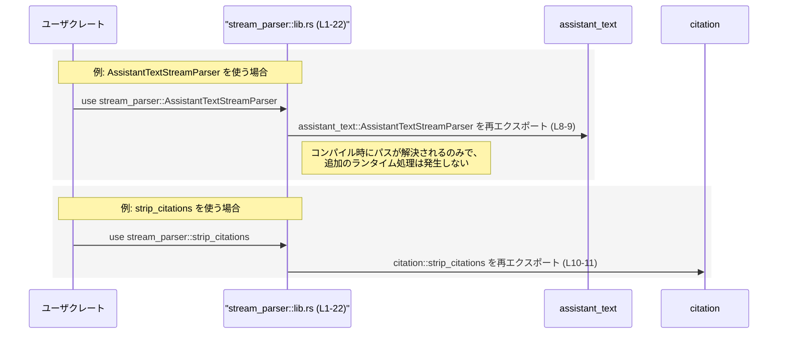

# utils/stream-parser/src/lib.rs コード解説

## 0. ざっくり一言

- `utils/stream-parser/src/lib.rs` は、このクレート内の各種ストリームパーサーモジュール（`assistant_text`, `citation` など）を宣言し、それらが提供する主要な型・関数を **再エクスポートするファサード** です（`lib.rs:L1-22`）。

---

## 1. このモジュールの役割

### 1.1 概要

- このモジュールは、`assistant_text`, `citation`, `inline_hidden_tag`, `proposed_plan`, `stream_text`, `tagged_line_parser`, `utf8_stream` といった内部モジュールを宣言します（`lib.rs:L1-7`）。
- さらに、それらのモジュールが定義する複数の公開アイテム（型や関数・マクロなど）を `pub use` で再エクスポートし、**クレートの公開APIの入口** として機能します（`lib.rs:L8-22`）。
- このファイル自身にはロジック（関数本体やメソッド実装）は存在せず、**API の構造を整える役割のみ** を持ちます。

### 1.2 アーキテクチャ内での位置づけ

- Rust では `src/lib.rs` がクレートのルートモジュールです。このファイルはまさにその位置にあり、他のクレートから `stream_parser::...` のように参照される際の **名前解決の起点** になります。
- `mod ...;` によって内部モジュールを宣言し（`lib.rs:L1-7`）、`pub use ...;` によってそれらのモジュール内のアイテムを上位（クレートルート）に引き上げています（`lib.rs:L8-22`）。

この関係をモジュールレベルの依存図で示します。

```mermaid
graph TD
    subgraph "lib.rs (L1-22)"
        root["クレートルート<br/>utils/stream-parser/src/lib.rs"]
    end

    root --> M1["assistant_text モジュール (L1)"]
    root --> M2["citation モジュール (L2)"]
    root --> M3["inline_hidden_tag モジュール (L3)"]
    root --> M4["proposed_plan モジュール (L4)"]
    root --> M5["stream_text モジュール (L5)"]
    root --> M6["tagged_line_parser モジュール (L6)"]
    root --> M7["utf8_stream モジュール (L7)"]

    %% 再エクスポートされるアイテム
    root -.pub use .-> A1["AssistantTextChunk など (L8-9)"]
    root -.pub use .-> C1["CitationStreamParser, strip_citations (L10-11)"]
    root -.pub use .-> H1["InlineHiddenTag 系 (L12-14)"]
    root -.pub use .-> P1["ProposedPlan 系 (L15-18)"]
    root -.pub use .-> S1["StreamText 系 (L19-20)"]
    root -.pub use .-> U1["Utf8StreamParser, Utf8StreamParserError (L21-22)"]
```



> この図は **lib.rs から見た宣言・再エクスポート関係** のみを表します。モジュール同士が互いに呼び出し合っているかどうかは、このチャンクのコードからは分かりません。

### 1.3 設計上のポイント

コードから読み取れる範囲での特徴は次の通りです。

- **ファサード的な公開**  
  - クレート利用者は `stream_parser::AssistantTextStreamParser` のように、サブモジュール名を意識せずに利用できます（`lib.rs:L8-22`）。
- **責務の分離**  
  - 実際のパースロジックやエラーハンドリングは各モジュール側にあり、このファイルは **モジュール構成と公開範囲の定義だけ** を担当しています（`lib.rs:L1-7, L8-22`）。
- **エラーモデル・並行性の情報は含まれない**  
  - `Utf8StreamParserError` というエラーらしき型名が再エクスポートされていることは分かりますが（`lib.rs:L22`）、その中身（エラー種別や発生条件）、およびスレッド安全性や非同期対応などは、ここからは読み取れません。

---

## 2. 主要なコンポーネント一覧

このセクションでは、**このチャンクから確認できるコンポーネント** を一覧化します。

### 2.1 内部モジュール一覧

| モジュール名 | 種別 | 役割 / 用途（このチャンクから分かる範囲） | 根拠 |
|--------------|------|-------------------------------------------|------|
| `assistant_text` | モジュール | `AssistantTextChunk`, `AssistantTextStreamParser` の定義元モジュール | `lib.rs:L1, L8-9` |
| `citation` | モジュール | `CitationStreamParser`, `strip_citations` の定義元モジュール | `lib.rs:L2, L10-11` |
| `inline_hidden_tag` | モジュール | `ExtractedInlineTag`, `InlineHiddenTagParser`, `InlineTagSpec` の定義元モジュール | `lib.rs:L3, L12-14` |
| `proposed_plan` | モジュール | `ProposedPlanParser`, `ProposedPlanSegment`, `extract_proposed_plan_text`, `strip_proposed_plan_blocks` の定義元モジュール | `lib.rs:L4, L15-18` |
| `stream_text` | モジュール | `StreamTextChunk`, `StreamTextParser` の定義元モジュール | `lib.rs:L5, L19-20` |
| `tagged_line_parser` | モジュール | `lib.rs` からはアイテムが再エクスポートされておらず、詳細不明 | `lib.rs:L6` |
| `utf8_stream` | モジュール | `Utf8StreamParser`, `Utf8StreamParserError` の定義元モジュール | `lib.rs:L7, L21-22` |

> モジュール間の依存関係（どのモジュールがどれを使うか）は、このチャンクには現れていません。

### 2.2 再エクスポートされる公開アイテム一覧

Rust の慣習として、**先頭が大文字の識別子は型（構造体・列挙体など）であることが多く、先頭が小文字の識別子は関数やマクロであることが多い** です。  
このファイルのみからは厳密な種別は断定できませんが、この慣習に基づいて暫定的に分類し、推測であることを明示します。

| 公開名 | 想定される種別※ | 役割 / 用途（事実ベース） | 定義元モジュール | 根拠 |
|--------|------------------|--------------------------|------------------|------|
| `AssistantTextChunk` | 型と推測 | `assistant_text` モジュールから再エクスポートされる公開アイテム | `assistant_text` | `lib.rs:L8` |
| `AssistantTextStreamParser` | 型と推測 | 同上 | `assistant_text` | `lib.rs:L9` |
| `CitationStreamParser` | 型と推測 | `citation` モジュールから再エクスポートされる公開アイテム | `citation` | `lib.rs:L10` |
| `strip_citations` | 関数/マクロと推測 | `citation` モジュールから再エクスポートされる公開アイテム | `citation` | `lib.rs:L11` |
| `ExtractedInlineTag` | 型と推測 | `inline_hidden_tag` モジュールから再エクスポートされる公開アイテム | `inline_hidden_tag` | `lib.rs:L12` |
| `InlineHiddenTagParser` | 型と推測 | 同上 | `inline_hidden_tag` | `lib.rs:L13` |
| `InlineTagSpec` | 型と推測 | 同上 | `inline_hidden_tag` | `lib.rs:L14` |
| `ProposedPlanParser` | 型と推測 | `proposed_plan` モジュールから再エクスポートされる公開アイテム | `proposed_plan` | `lib.rs:L15` |
| `ProposedPlanSegment` | 型と推測 | 同上 | `proposed_plan` | `lib.rs:L16` |
| `extract_proposed_plan_text` | 関数/マクロと推測 | 同上 | `proposed_plan` | `lib.rs:L17` |
| `strip_proposed_plan_blocks` | 関数/マクロと推測 | 同上 | `proposed_plan` | `lib.rs:L18` |
| `StreamTextChunk` | 型と推測 | `stream_text` モジュールから再エクスポートされる公開アイテム | `stream_text` | `lib.rs:L19` |
| `StreamTextParser` | 型と推測 | 同上 | `stream_text` | `lib.rs:L20` |
| `Utf8StreamParser` | 型と推測 | `utf8_stream` モジュールから再エクスポートされる公開アイテム | `utf8_stream` | `lib.rs:L21` |
| `Utf8StreamParserError` | 型と推測（エラー型） | 同上 | `utf8_stream` | `lib.rs:L22` |

※「型と推測」「関数/マクロと推測」は、**Rust の命名慣例に基づく推測** です。実際の定義内容は各モジュール側を確認する必要があります。

---

## 3. 公開 API と詳細解説

### 3.1 型一覧（構造体・列挙体など）

このファイルは型と関数の両方を再エクスポートしていますが、実体は別モジュールにあります。  
ここでは「型と思われる公開アイテム」をまとめます（推測であることを明示します）。

| 名前 | 種別（推測） | 役割 / 用途（lib.rs から分かる範囲） | 定義元 | 根拠 |
|------|--------------|----------------------------------------|--------|------|
| `AssistantTextChunk` | 構造体/列挙体などの型と推測 | `assistant_text` モジュールから公開される「チャンク」関連の型 | `assistant_text` | `lib.rs:L8` |
| `AssistantTextStreamParser` | 構造体などのパーサ型と推測 | `assistant_text` モジュールから公開されるストリームパーサ型 | `assistant_text` | `lib.rs:L9` |
| `CitationStreamParser` | パーサ型と推測 | `citation` モジュールが提供するストリームパーサ型 | `citation` | `lib.rs:L10` |
| `ExtractedInlineTag` | 型と推測 | `inline_hidden_tag` モジュールが提供する「タグ抽出結果」的な型 | `inline_hidden_tag` | `lib.rs:L12` |
| `InlineHiddenTagParser` | パーサ型と推測 | `inline_hidden_tag` モジュールが提供するパーサ型 | `inline_hidden_tag` | `lib.rs:L13` |
| `InlineTagSpec` | 設定/仕様を表す型と推測 | `inline_hidden_tag` モジュールが提供する「タグ仕様」的な型 | `inline_hidden_tag` | `lib.rs:L14` |
| `ProposedPlanParser` | パーサ型と推測 | `proposed_plan` モジュールが提供するパーサ型 | `proposed_plan` | `lib.rs:L15` |
| `ProposedPlanSegment` | セグメント型と推測 | `proposed_plan` モジュールが提供する「計画の一部」的な型 | `proposed_plan` | `lib.rs:L16` |
| `StreamTextChunk` | 型と推測 | `stream_text` モジュールが提供するストリームテキストのチャンク型 | `stream_text` | `lib.rs:L19` |
| `StreamTextParser` | パーサ型と推測 | `stream_text` モジュールが提供するストリームテキスト用パーサ型 | `stream_text` | `lib.rs:L20` |
| `Utf8StreamParser` | パーサ型と推測 | `utf8_stream` モジュールが提供する UTF-8 ストリーム用パーサ型 | `utf8_stream` | `lib.rs:L21` |
| `Utf8StreamParserError` | エラー型と推測 | `utf8_stream` のパーサに関連するエラー型 | `utf8_stream` | `lib.rs:L22` |

> 具体的なフィールド、メソッド、トレイト実装などは、このチャンクには現れていません。

### 3.2 関数詳細（最大 7 件）

このファイルには関数本体の定義は存在せず、**関数らしき識別子の再エクスポートのみ** が行われています。

- `strip_citations`（`lib.rs:L11`）
- `extract_proposed_plan_text`（`lib.rs:L17`）
- `strip_proposed_plan_blocks`（`lib.rs:L18`）

これらが実際に関数であるかマクロであるかは、このチャンクからは判定できません。また、引数・戻り値・エラー型などの情報も一切含まれていません。

そのため、テンプレート形式での詳細解説（シグネチャ、内部アルゴリズム、エラー条件、エッジケースなど）は **このファイル単体からは作成できません**。  
詳細を知るには、それぞれの定義元モジュール（`citation`, `proposed_plan`）の実装を参照する必要があります。

### 3.3 その他の関数

- このファイル自身には関数定義がありません（`fn` キーワードが存在しません、`lib.rs:L1-22`）。
- 再エクスポートされている関数／マクロのシグネチャやロジックは、すべて別ファイルにあります。

---

## 4. データフロー

このファイルには実行時の処理ロジックはありませんが、**型や関数がどのように名前解決されるか** という意味での「データ（識別子）の流れ」は読み取れます。

### 4.1 名前解決レベルでのフロー

クレート利用者から見た識別子解決の流れを、シーケンス図で表現します。



要点：

- `pub use` はコンパイル時のパスのエイリアスであり、**ランタイムのオーバーヘッドや並行性への影響はありません**。
- エラー処理・スレッド安全性・非同期性などの振る舞いは、実際の実装がある各モジュール側に完全に委ねられています。

---

## 5. 使い方（How to Use）

### 5.1 基本的な使用方法

このファイルを通じて公開されているアイテムは、他クレートから次のようにインポートできます。

```rust
// Cargo.toml 側でこのクレートを依存として追加している前提

// クレートルート（lib.rs）から、必要なパーサー型や関数をインポートする
use stream_parser::{
    AssistantTextStreamParser,
    CitationStreamParser,
    strip_citations,
    StreamTextParser,
    Utf8StreamParser,
    Utf8StreamParserError,
    // ほか必要に応じて…
};

fn main() {
    // ここで実際にパーサーを生成したり関数を呼び出したりします。
    // ただし、具体的なコンストラクタ名やメソッドはこのチャンクからは分からないため、
    // assistant_text / citation / utf8_stream など各モジュールの定義を参照する必要があります。
}
```

ポイント：

- 利用側が `assistant_text::AssistantTextStreamParser` のような **内部モジュールパスを意識する必要がない** ように設計されています。
- 具体的なメソッド（例: `new`, `parse` など）が存在するかどうかは、このファイルからは分かりません。

### 5.2 よくある使用パターン

このチャンクからは API の詳細が分からないため、**呼び出しパターン（同期/非同期など）を特定することはできません**。

考えられる一般的なパターンとしては次のようなものがありますが、これはあくまで Rust の一般論であり、このクレート固有の仕様とは限りません。

- ストリームパーサ型（`...StreamParser` と名付けられた型）のインスタンスを生成し、入力ストリームを渡して逐次パースする。
- エラー型らしき `Utf8StreamParserError` で UTF-8 パース時の失敗を表現する。

これらの点は **名前からの推測** にとどまり、コードからの事実ではありません。

### 5.3 よくある間違い（このファイルに関するもの）

このファイルに関係しそうな注意点は、次のようなものです。

```rust
// あまり好ましくない例: 内部モジュールに直接依存する
use stream_parser::assistant_text::AssistantTextStreamParser;
// 将来 lib.rs の再エクスポートが変更された場合に対応しにくくなる

// 推奨される例: クレートルートから再エクスポートされた名前を使う
use stream_parser::AssistantTextStreamParser;
```

- 内部モジュールに直接パス依存すると、モジュール構成の変更に弱くなります。
- このファイルはまさにそのために再エクスポートを提供していると考えられるため、**公開 API として lib.rs から見えるパスを優先的に使う** 方が、API 利用者にとって安定性が高くなります。

### 5.4 使用上の注意点（まとめ）

- **前提条件**  
  - このファイル自体には前提条件はありませんが、再エクスポートされた各型・関数には個別の前提条件が存在する可能性があります（入力形式、スレッド安全性など）。それらは各モジュールの実装を参照する必要があります。
- **エラー・パニック**  
  - `Utf8StreamParserError` というエラー型が公開されているため、UTF-8 パース周りでエラーが返される設計になっていると推測されますが、具体的な発生条件や挙動は不明です。
- **並行性**  
  - このファイルは `pub use` のみで構成されており、スレッドや非同期実行に関するコードは含まれていません。並行性に関する契約は各パーサ型の実装側で決まります。

---

## 6. 変更の仕方（How to Modify）

### 6.1 新しい機能を追加する場合

このファイルに新しい公開機能を追加する場合の典型的な手順は次の通りです。

1. **新しいモジュールまたは既存モジュールに実装を追加する**  
   - 例: `src/new_parser.rs` に新しいパーサ型 `NewParser` を実装する。
2. **`lib.rs` に `mod` 宣言を追加する（新規モジュールの場合）**  

   ```rust
   mod new_parser; // lib.rs に追加（行番号は状況に応じて）
   ```

3. **`pub use` で公開する**  

   ```rust
   pub use new_parser::NewParser;
   ```

4. **公開 API の一貫性を確認する**  
   - 既存の命名規則（`...Parser`, `...Chunk`, `...Error` など）に合わせる。
   - 必要に応じて関連するエラー型も合わせて公開する。

このファイルはロジックを持たないため、**変更の影響は「どの識別子が外部から見えるか」に限定されます**。

### 6.2 既存の機能を変更する場合

- **公開範囲の変更**  
  - あるアイテムを公開しないようにするには、`pub use` の該当行を削除またはコメントアウトします（例: `lib.rs:L8-22` のいずれか）。
  - これは **API 互換性に直接影響する破壊的変更** になる可能性が高いため、利用箇所の調査が必須です。
- **名前の変更（リネーム）**  
  - 実装側で名前を変更し、`lib.rs` の `pub use` も合わせて変更する必要があります。
  - 旧名から新名への移行期間が必要な場合は、両方を一時的に `pub use` するなどの対応が考えられます（ただし、このチャンクからはその方針は読み取れません）。
- **テストの確認**  
  - このファイルにはテストコードは含まれていません（`#[cfg(test)]` や `mod tests` が無いことから、`lib.rs:L1-22`）。  
    テストは別ファイルに存在する可能性があるため、公開 API の変更後は関連テストを実行する必要があります。

---

## 7. 関連ファイル

このモジュールと密接に関係するファイル（実装が存在すると推測される場所）を整理します。

| パス（推定） | 役割 / 関係 | 根拠 |
|--------------|------------|------|
| `utils/stream-parser/src/assistant_text.rs` または `.../assistant_text/mod.rs` | `AssistantTextChunk`, `AssistantTextStreamParser` の実装を含むモジュール | `mod assistant_text;` と `pub use assistant_text::...`（`lib.rs:L1, L8-9`） |
| `utils/stream-parser/src/citation.rs` または `.../citation/mod.rs` | `CitationStreamParser`, `strip_citations` の実装を含むモジュール | `lib.rs:L2, L10-11` |
| `utils/stream-parser/src/inline_hidden_tag.rs` または `.../inline_hidden_tag/mod.rs` | `ExtractedInlineTag`, `InlineHiddenTagParser`, `InlineTagSpec` の実装を含むモジュール | `lib.rs:L3, L12-14` |
| `utils/stream-parser/src/proposed_plan.rs` または `.../proposed_plan/mod.rs` | `ProposedPlanParser`, `ProposedPlanSegment`, `extract_proposed_plan_text`, `strip_proposed_plan_blocks` の実装を含むモジュール | `lib.rs:L4, L15-18` |
| `utils/stream-parser/src/stream_text.rs` または `.../stream_text/mod.rs` | `StreamTextChunk`, `StreamTextParser` の実装を含むモジュール | `lib.rs:L5, L19-20` |
| `utils/stream-parser/src/tagged_line_parser.rs` または `.../tagged_line_parser/mod.rs` | 再エクスポートされていないが、内部で利用される可能性のあるパーサ関連モジュール | `lib.rs:L6` |
| `utils/stream-parser/src/utf8_stream.rs` または `.../utf8_stream/mod.rs` | `Utf8StreamParser`, `Utf8StreamParserError` の実装を含むモジュール | `lib.rs:L7, L21-22` |

> ファイルパス（`.rs` / `mod.rs`）は Rust の一般的なモジュール構成規約に基づく推測であり、実際のレイアウトはリポジトリを確認する必要があります。

---

### 安全性・エラー・並行性に関するまとめ（このファイルに限って）

- **安全性（メモリ・型）**  
  - このファイルは `mod` と `pub use` のみで構成されており、ポインタ操作や `unsafe` ブロックは含まれていません（`lib.rs:L1-22`）。  
    よって、このファイル単体ではメモリ安全性を損なう要素は見当たりません。
- **エラー処理**  
  - `Utf8StreamParserError` というエラー型が公開されていることから、エラー処理は各パーサ実装側で `Result` などを通じて行われている可能性がありますが、詳細は不明です。
- **並行性 / 非同期性**  
  - スレッド・`async` / `await`・非同期ランタイムなどに関する記述は一切なく、このファイルは **並行性に関して中立な構造定義のみ** を行っています。  
  - 各パーサ型が `Send` / `Sync` かどうか、非同期 API を提供するかどうかは、このチャンクでは判断できません。
