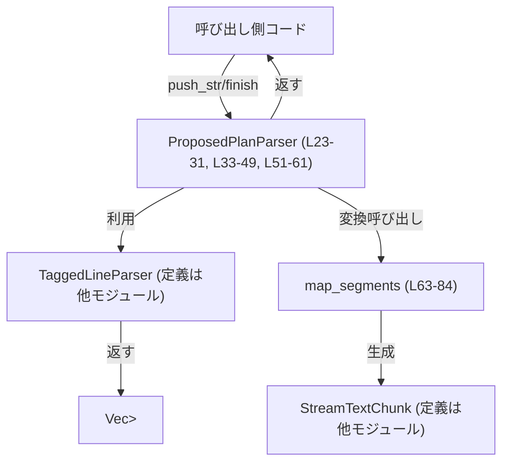
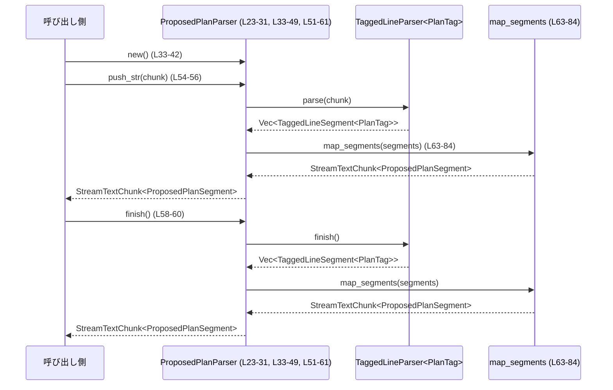

# utils/stream-parser/src/proposed_plan.rs コード解説

---

## 0. ざっくり一言

`<proposed_plan> ... </proposed_plan>` というタグ付きブロックをストリームでパースし、

- 表示用テキスト（タグ付きブロックを除いたテキスト）
- 抽出用セグメント列（プラン開始/差分/終了イベント）

を生成するモジュールです（`proposed_plan.rs:L7-8`, `L15-21`, `L23-31`, `L51-61`）。

---

## 1. このモジュールの役割

### 1.1 概要

このモジュールは **アシスタントの「plan mode」で出力される `<proposed_plan>` ブロック** を処理するためのストリームパーサを提供します。

- 問題: ストリームで流れてくるテキストから、`<proposed_plan>` ブロックだけを抽出・加工したい
- 解決: `StreamTextParser` トレイトを実装した `ProposedPlanParser` と、ユーティリティ関数で
  - 通常表示用テキストからプランブロックを除去
  - プラン本文テキストだけを抽出
  できるようにしています（`proposed_plan.rs:L23-31`, `L51-61`, `L86-91`, `L93-115`）。

### 1.2 アーキテクチャ内での位置づけ

依存関係は以下のようになっています。

- このモジュールは crate 内の
  - `StreamTextParser` トレイト
  - `StreamTextChunk` 構造体
  - `tagged_line_parser` モジュールの `TagSpec`, `TaggedLineParser`, `TaggedLineSegment`
  に依存しています（`proposed_plan.rs:L1-5`）。
- `ProposedPlanParser` は `TaggedLineParser<PlanTag>` を内部に持ち、行単位・タグ単位の解析を委譲しています（`proposed_plan.rs:L23-31`, `L33-42`）。



> `TaggedLineParser` や `StreamTextChunk` の具体的な定義場所（ファイルパス）は、このチャンクには現れません。

### 1.3 設計上のポイント

- **責務の分割**
  - タグの検出と行単位の解析は `TaggedLineParser` に委譲し、このモジュールでは
    - `PlanTag` によるタグ種別の定義（`proposed_plan.rs:L10-13`）
    - `TaggedLineSegment<PlanTag>` から `ProposedPlanSegment` への写像
    を担当しています（`proposed_plan.rs:L15-21`, `L63-84`）。
- **ストリーミング処理**
  - `StreamTextParser` トレイトを実装し、`push_str` で部分文字列を渡し、最後に `finish` を呼ぶ流れになっています（`proposed_plan.rs:L51-61`）。
  - タグがチャンク境界をまたぐケースも、テストからサポートされていることが分かります（`proposed_plan.rs:L143-166`）。
- **エラーハンドリング**
  - 公開 API では例外・Result を使わず、`extract_proposed_plan_text` のみ `Option<String>` を返します（`proposed_plan.rs:L93-115`）。
  - 未クローズのプランブロックは `finish` 時にクローズされる設計であることがテストから分かります（`proposed_plan.rs:L182-195`）。
- **状態管理**
  - `ProposedPlanParser` 自体は `TaggedLineParser<PlanTag>` 1つをフィールドに持つだけの軽量なラッパです（`proposed_plan.rs:L23-31`）。
  - `extract_proposed_plan_text` はローカル変数 `plan_text` とフラグ `saw_plan_block` で状態を管理し、最後に検出したプランブロックの本文だけを返します（`proposed_plan.rs:L93-115`）。
- **並行性**
  - スレッド間共有や非同期処理に関するコードはこのファイルには現れません。
  - `ProposedPlanParser` 自体が `Send`/`Sync` かどうかは、`TaggedLineParser` の実装に依存し、このチャンクからは分かりません。

---

## 2. 主要な機能一覧

### 2.1 コンポーネント一覧（型・関数インベントリー）

| 名前 | 種別 | 公開 | 役割 / 用途 | 根拠 |
|------|------|------|-------------|------|
| `OPEN_TAG` | 定数 &str | 非公開 | 開始タグ `<proposed_plan>` のリテラル | `proposed_plan.rs:L7` |
| `CLOSE_TAG` | 定数 &str | 非公開 | 終了タグ `</proposed_plan>` のリテラル | `proposed_plan.rs:L8` |
| `PlanTag` | enum | 非公開 | `TaggedLineParser` 用のタグ種別。ここでは `ProposedPlan` のみ | `proposed_plan.rs:L10-13` |
| `ProposedPlanSegment` | enum | 公開 | プラン関連のセグメントを表すドメイン型（通常テキスト/開始/差分/終了） | `proposed_plan.rs:L15-21` |
| `ProposedPlanParser` | struct | 公開 | `<proposed_plan>` ブロック専用のストリーミングパーサ | `proposed_plan.rs:L23-31` |
| `ProposedPlanParser::new` | 関数（関連関数） | 公開 | タグ設定済みの `ProposedPlanParser` を構築 | `proposed_plan.rs:L33-42` |
| `Default for ProposedPlanParser` | impl | 公開 | `Default` を `new()` に委譲 | `proposed_plan.rs:L45-49` |
| `StreamTextParser for ProposedPlanParser` | impl | 公開 | ストリームパースの共通インターフェースを実装 | `proposed_plan.rs:L51-61` |
| `push_str` | メソッド | 公開（トレイト経由） | チャンク文字列をパースし、セグメントと可視テキストを返す | `proposed_plan.rs:L54-56` |
| `finish` | メソッド | 公開（トレイト経由） | パースを終了し、残りのセグメントを返す | `proposed_plan.rs:L58-60` |
| `map_segments` | 関数 | 非公開 | `TaggedLineSegment<PlanTag>` 列を `StreamTextChunk<ProposedPlanSegment>` に変換 | `proposed_plan.rs:L63-84` |
| `strip_proposed_plan_blocks` | 関数 | 公開 | テキストから `<proposed_plan>` ブロック全体を除去して返す | `proposed_plan.rs:L86-91` |
| `extract_proposed_plan_text` | 関数 | 公開 | テキストから `<proposed_plan>` ブロックの本文のみを抽出 | `proposed_plan.rs:L93-115` |
| `collect_chunks` | 関数（テスト用） | 非公開 | テストで複数チャンクをまとめてパースするヘルパ | `proposed_plan.rs:L127-141` |
| テスト 5件 | 関数（テスト） | 非公開 | 動作検証（ストリーミング、非タグ行保持、未クローズブロック、strip/extract） | `proposed_plan.rs:L143-211` |

### 2.2 主要な機能（機能視点）

- `<proposed_plan>` ブロックのストリーミングパースとセグメント列生成（`ProposedPlanParser`, `ProposedPlanSegment`）（`proposed_plan.rs:L15-21`, `L23-31`, `L51-61`, `L63-84`）
- 出力用テキストから `<proposed_plan>` ブロックを除去するユーティリティ（`strip_proposed_plan_blocks`）（`proposed_plan.rs:L86-91`）
- 入力テキストから `<proposed_plan>` ブロックの本文だけを抽出するユーティリティ（`extract_proposed_plan_text`）（`proposed_plan.rs:L93-115`）

---

## 3. 公開 API と詳細解説

### 3.1 型一覧（構造体・列挙体など）

公開されている主要な型をまとめます。

| 名前 | 種別 | 役割 / 用途 | フィールド / バリアント | 根拠 |
|------|------|-------------|--------------------------|------|
| `ProposedPlanSegment` | 列挙体 | プラン解析結果の 1 セグメントを表すドメイン型 | `Normal(String)`, `ProposedPlanStart`, `ProposedPlanDelta(String)`, `ProposedPlanEnd` | `proposed_plan.rs:L15-21` |
| `ProposedPlanParser` | 構造体 | `<proposed_plan>` ブロックを扱う `StreamTextParser` 実装 | フィールド: `parser: TaggedLineParser<PlanTag>` | `proposed_plan.rs:L23-31` |

`ProposedPlanSegment` は、元テキストの順序を保ちながらプラン関連のイベントを表現するために使われます（コメントにも「includes `Normal(...)` segments for ordering fidelity」と記載されています、`proposed_plan.rs:L23-27`）。

---

### 3.2 関数詳細（主要 API）

#### `ProposedPlanParser::new() -> Self`

**概要**

- `<proposed_plan>` タグを認識するように構成された `ProposedPlanParser` を生成します（`proposed_plan.rs:L33-42`）。

**引数**

- なし

**戻り値**

- `ProposedPlanParser`  
  `TaggedLineParser<PlanTag>` を内部に持ち、`<proposed_plan>` / `</proposed_plan>` を 1 種類のタグとして扱うパーサインスタンスです（`proposed_plan.rs:L36-40`）。

**内部処理の流れ**

1. `TagSpec` を 1 要素持つ `Vec` を作成する。
   - `open` に `OPEN_TAG` (`"<proposed_plan>"`) を設定（`proposed_plan.rs:L7`, `L36-37`）。
   - `close` に `CLOSE_TAG` (`"</proposed_plan>"`) を設定（`proposed_plan.rs:L8`, `L38`）。
   - `tag` に `PlanTag::ProposedPlan` を設定（`proposed_plan.rs:L10-13`, `L39`）。
2. `TaggedLineParser::new(...)` にその `Vec<TagSpec<PlanTag>>` を渡して内部パーサを構築（`proposed_plan.rs:L36-40`）。
3. それを `parser` フィールドに保持した `ProposedPlanParser` を返す（`proposed_plan.rs:L35-41`）。

**Examples（使用例）**

```rust
use crate::utils::stream_parser::ProposedPlanParser; // 実際のパスはこのチャンクには現れません

fn main() {
    let mut parser = ProposedPlanParser::new(); // プラン専用パーサを作成（L33-42）

    // 1チャンク分のテキストをパース
    let chunk = "before\n<proposed_plan>\n- step\n</proposed_plan>\nafter";
    let result = parser.push_str(chunk);        // StreamTextParser 実装（L51-56）

    println!("visible_text = {}", result.visible_text);
    // => "before\nafter" が得られることが strip_proposed_plan_blocks のテストから分かる（L199-202）
}
```

**Errors / Panics**

- 明示的な `Result` や `panic!` はありません。
- メモリ確保に関連する標準ライブラリの挙動（`String` や `Vec` の拡張）が失敗した場合の挙動は、このコードでは特別に扱っていません。

**Edge cases（エッジケース）**

- タグ設定は固定であり、`<proposed_plan>` / `</proposed_plan>` 以外のタグは認識しません。
- タグの認識ルール（先頭・末尾の空白などを許容するかどうか）は `TaggedLineParser` の実装に依存し、このチャンクからは詳細不明です。ただし `"  <proposed_plan> extra\n"` はタグとして扱われないことがテストで確認されています（`proposed_plan.rs:L168-179`）。

**使用上の注意点**

- 新しいタグ種別を追加したい場合、この `new` 関数と `PlanTag` 列挙体を変更する必要があります。ただし、他のモジュールとの整合性はこのチャンクからは分かりません。

---

#### `impl StreamTextParser for ProposedPlanParser { fn push_str, fn finish }`

ここでは `StreamTextParser` 実装の 2 つのメソッドをセットで説明します（`proposed_plan.rs:L51-61`）。

##### `push_str(&mut self, chunk: &str) -> StreamTextChunk<Self::Extracted>`

**概要**

- 受け取った文字列チャンクをパースし、  
  - 表示用テキスト（`visible_text`）
  - プラン関連セグメント列（`extracted`）
 からなる `StreamTextChunk<ProposedPlanSegment>` を返します（`proposed_plan.rs:L51-56`, `L63-84`）。

**引数**

| 引数名 | 型 | 説明 |
|--------|----|------|
| `chunk` | `&str` | 新たに受け取ったテキストチャンク。タグの一部や行の一部であってもよい |

**戻り値**

- `StreamTextChunk<ProposedPlanSegment>`  
  `visible_text` と `extracted` を持つ構造体で、`map_segments` によって生成されます（`proposed_plan.rs:L63-84`）。

**内部処理の流れ**

1. `self.parser.parse(chunk)` で、チャンクから `Vec<TaggedLineSegment<PlanTag>>` を生成（`proposed_plan.rs:L54-55`）。
2. そのベクタを `map_segments` に渡し、`StreamTextChunk<ProposedPlanSegment>` に変換（`proposed_plan.rs:L54-56`, `L63-84`）。
3. 変換結果を返す。

**Errors / Panics**

- `parse` のエラー扱いは `TaggedLineParser` の実装に依存し、このチャンクからは読み取れません。
- このメソッド内に明示的なパニックはありません。

**Edge cases**

- タグがチャンク境界をまたぐ場合でも、`TaggedLineParser` が内部バッファで処理する設計であることがテストから推測されます（`"Intro text\n<prop"` と `"osed_plan>\n- step 1\n"` をまたいだケースが正しく処理されています、`proposed_plan.rs:L143-166`）。ただし詳細な実装はこのチャンクには現れません。
- チャンクが空文字列でも、`parse("")` の結果に応じた空または変化のないチャンクが返ると考えられますが、テスト上の明示例はありません。

**使用上の注意点**

- ストリーミング利用の場合は、すべての入力チャンクを `push_str` に渡した後、必ず `finish()` を呼ぶ必要があります。呼ばない場合、未確定のタグやバッファに残った行が処理されない可能性があります（`collect_chunks` テストヘルパが必ず最後に `finish()` を呼んでいる点が根拠です、`proposed_plan.rs:L127-141`）。

---

##### `finish(&mut self) -> StreamTextChunk<Self::Extracted>`

**概要**

- パース処理を終了し、内部バッファに残っている未処理のセグメント（未クローズなタグを含む）をすべて返します（`proposed_plan.rs:L58-60`）。

**引数**

- なし（`&mut self` のみ）

**戻り値**

- `StreamTextChunk<ProposedPlanSegment>`  
  内部パーサ `TaggedLineParser` の `finish()` 結果を `map_segments` で変換したものです。

**内部処理の流れ**

1. `self.parser.finish()` を呼び出し、`Vec<TaggedLineSegment<PlanTag>>` を受け取る（`proposed_plan.rs:L58-59`）。
2. そのベクタを `map_segments` に渡し、`StreamTextChunk<ProposedPlanSegment>` に変換（`proposed_plan.rs:L58-60`, `L63-84`）。
3. 変換結果を返す。

**Edge cases**

- 未クローズな `<proposed_plan>` ブロックがある場合、`TaggedLineParser::finish()` が `TagEnd` セグメントを補ってくれることがテストから分かります（`proposed_plan.rs:L182-195`）。  
  これにより、`ProposedPlanSegment::ProposedPlanEnd` が必ず出力されます。

**使用上の注意点**

- ストリーム処理完了時に必ず呼び出す前提で設計されています（`collect_chunks` がその前提で書かれている、`proposed_plan.rs:L127-141`）。

---

#### `map_segments(segments: Vec<TaggedLineSegment<PlanTag>>) -> StreamTextChunk<ProposedPlanSegment>`

**概要**

- 低レベルなタグ付きセグメント `TaggedLineSegment<PlanTag>` 列を、  
  表示テキスト＋`ProposedPlanSegment` 列にまとめた `StreamTextChunk` に変換するコアロジックです（`proposed_plan.rs:L63-84`）。

**引数**

| 引数名 | 型 | 説明 |
|--------|----|------|
| `segments` | `Vec<TaggedLineSegment<PlanTag>>` | `TaggedLineParser` が返したセグメント列 |

**戻り値**

- `StreamTextChunk<ProposedPlanSegment>`  
  - `visible_text`: プランブロックを除いた通常テキスト
  - `extracted`: プラン関連を含む `ProposedPlanSegment` 列（順序保持のため、通常テキストも含む）  
  （`proposed_plan.rs:L64-82`）

**内部処理の流れ**

1. `StreamTextChunk::default()` で空の出力を作成（`proposed_plan.rs:L64`）。
2. `segments` を 1 つずつループ（`proposed_plan.rs:L65`）。
3. 各 `TaggedLineSegment` を `match` し、`ProposedPlanSegment` に写像（`proposed_plan.rs:L66-77`）。
   - `Normal(text)` → `ProposedPlanSegment::Normal(text)`
   - `TagStart(PlanTag::ProposedPlan)` → `ProposedPlanSegment::ProposedPlanStart`
   - `TagDelta(PlanTag::ProposedPlan, text)` → `ProposedPlanSegment::ProposedPlanDelta(text)`
   - `TagEnd(PlanTag::ProposedPlan)` → `ProposedPlanSegment::ProposedPlanEnd`
4. `mapped` が `ProposedPlanSegment::Normal(text)` の場合だけ `visible_text` に `text` を追記（`proposed_plan.rs:L78-80`）。
5. すべての `mapped` を `out.extracted` に push（`proposed_plan.rs:L81-82`）。
6. 最後に `out` を返す（`proposed_plan.rs:L83`）。

**Examples（使用例）**

`map_segments` 自体は非公開関数のため、直接呼び出すことはありませんが、概念的には以下のような写像を行っています。

```rust
// 低レベルセグメント（イメージ）
let segments = vec![
    TaggedLineSegment::Normal("Intro\n".to_string()),
    TaggedLineSegment::TagStart(PlanTag::ProposedPlan),
    TaggedLineSegment::TagDelta(PlanTag::ProposedPlan, "- step 1\n".to_string()),
    TaggedLineSegment::TagEnd(PlanTag::ProposedPlan),
];

// map_segments の結果イメージ（L63-84）
let out = map_segments(segments);

assert_eq!(out.visible_text, "Intro\n"); // Normal テキストのみ（L78-80）
assert_eq!(
    out.extracted,
    vec![
        ProposedPlanSegment::Normal("Intro\n".to_string()),
        ProposedPlanSegment::ProposedPlanStart,
        ProposedPlanSegment::ProposedPlanDelta("- step 1\n".to_string()),
        ProposedPlanSegment::ProposedPlanEnd,
    ]
);
```

**Errors / Panics**

- `match` の全パターンが `PlanTag::ProposedPlan` のみで網羅されているため、タグ種別が増えた場合にはコンパイルエラーになります（`proposed_plan.rs:L66-76`）。
- 明示的なパニックはありません。

**Edge cases**

- プランタグ外のテキストはすべて `Normal` として扱われ、`visible_text` にそのまま連結されます（`proposed_plan.rs:L66-68`, `L78-80`）。
- プランブロック内の本文は `ProposedPlanDelta` として `visible_text` には含まれません（`proposed_plan.rs:L71-73`, `L78-80`）。
- 現在は `PlanTag` が 1 種類しかないため、他種のタグとの混在はこのチャンクでは想定されていません。

**使用上の注意点**

- 将来 `PlanTag` にバリアントを追加する場合、この関数に対応する変換ロジックを追加する必要があります。

---

#### `strip_proposed_plan_blocks(text: &str) -> String`

**概要**

- 入力文字列から `<proposed_plan> ... </proposed_plan>` ブロックをすべて除去し、残りのテキストを返すユーティリティです（`proposed_plan.rs:L86-91`）。

**引数**

| 引数名 | 型 | 説明 |
|--------|----|------|
| `text` | `&str` | 元のテキスト全体 |

**戻り値**

- `String`  
  `<proposed_plan>` ブロックを取り除いたテキスト。テストにより `"before\nafter"` のように期待どおりになることが確認されています（`proposed_plan.rs:L199-202`）。

**内部処理の流れ**

1. `ProposedPlanParser::new()` でパーサを作成（`proposed_plan.rs:L87`）。
2. `parser.push_str(text)` を呼び、その `visible_text` を `out` に代入（`proposed_plan.rs:L88`）。
3. `parser.finish()` の `visible_text` を `out` に追記（`proposed_plan.rs:L89`）。
4. `out` を返す（`proposed_plan.rs:L90`）。

**Examples（使用例）**

```rust
let text = "before\n<proposed_plan>\n- step\n</proposed_plan>\nafter";
let stripped = strip_proposed_plan_blocks(text); // L86-91

assert_eq!(stripped, "before\nafter");          // テストで検証済み（L199-202）
```

**Errors / Panics**

- 例外や `Result` は使用していません。
- `String` の拡張でのメモリ確保失敗以外のパニック要因は、コード上はありません。

**Edge cases**

- `<proposed_plan>` ブロックが存在しない場合  
  → すべてのセグメントが `Normal` になり、そのまま `visible_text` に連結されるため、結果は入力と同じになります（`map_segments` の挙動より、`proposed_plan.rs:L66-68`, `L78-80`）。
- 未クローズの `<proposed_plan>` ブロックがある場合  
  → `finish()` が暗黙にクローズする設計であるため（テスト参照、`proposed_plan.rs:L182-195`）、ブロック内のテキストはすべて削除されると考えられます。

**使用上の注意点**

- すべての `<proposed_plan>` ブロックを除去する動作であり、ブロック内のテキストを保持する手段は提供していません。
- ストリームではなく、**1 つの完成した文字列** を処理する用途を想定しています。

---

#### `extract_proposed_plan_text(text: &str) -> Option<String>`

**概要**

- 入力テキストから `<proposed_plan>` ブロックの本文テキストだけを抽出し `Some(String)` で返します。  
  ブロックが存在しなければ `None` を返します（`proposed_plan.rs:L93-115`）。

**引数**

| 引数名 | 型 | 説明 |
|--------|----|------|
| `text` | `&str` | 元のテキスト全体 |

**戻り値**

- `Option<String>`
  - `Some(plan_text)` : 少なくとも 1 つ `<proposed_plan>` ブロックがあり、その最後のブロックの本文を含む
  - `None` : `<proposed_plan>` ブロックが一度も出現しなかった場合  
  （`proposed_plan.rs:L96-97`, `L114-115`）

**内部処理の流れ**

1. `ProposedPlanParser::new()` でパーサを作成（`proposed_plan.rs:L94`）。
2. `plan_text`（抽出中の本文）と `saw_plan_block`（ブロックを見つけたかどうかのフラグ）を初期化（`proposed_plan.rs:L95-96`）。
3. `parser.push_str(text).extracted.into_iter().chain(parser.finish().extracted)` で、全セグメントを順に走査（`proposed_plan.rs:L97-102`）。
4. 各セグメントに対して `match`（`proposed_plan.rs:L103-111`）:
   - `ProposedPlanSegment::ProposedPlanStart`  
     → `saw_plan_block = true` にし、`plan_text.clear()` でバッファを空にする（`proposed_plan.rs:L104-107`）。
   - `ProposedPlanSegment::ProposedPlanDelta(delta)`  
     → `plan_text` に `delta` を追記（`proposed_plan.rs:L108-110`）。
   - `ProposedPlanSegment::ProposedPlanEnd` / `ProposedPlanSegment::Normal(_)`  
     → 何もしない（`proposed_plan.rs:L111`）。
5. ループ終了後、`saw_plan_block.then_some(plan_text)` で、ブロックがあれば `Some(plan_text)`、なければ `None` を返す（`proposed_plan.rs:L114-115`）。

**Examples（使用例）**

```rust
let text = "before\n<proposed_plan>\n- step\n</proposed_plan>\nafter";
let plan = extract_proposed_plan_text(text);        // L93-115

assert_eq!(plan, Some("- step\n".to_string()));    // テストで検証済み（L205-210）
```

**Errors / Panics**

- `Option` で結果を表現しており、異常時にパニックするコードは含まれていません。

**Edge cases**

- `<proposed_plan>` ブロックが 1 つもない場合  
  → `saw_plan_block` が `false` のままなので `None` が返ります（`proposed_plan.rs:L96`, `L114-115`）。
- `<proposed_plan>` ブロックが複数ある場合  
  → 各 `ProposedPlanStart` で `plan_text.clear()` されるため**最後に出現したブロックの本文のみ**が返ります（`proposed_plan.rs:L104-107`）。
- 未クローズなブロックがある場合  
  → `finish()` がクローズ用セグメントを補うため、本文は `ProposedPlanDelta` としてすべて `plan_text` に追加され、`Some(...)` として返ることが `closes_unterminated_plan_block_on_finish` テストから推測できます（`proposed_plan.rs:L182-195`）。

**使用上の注意点**

- 複数のプランブロックをすべて取得したい場合は、この実装を変更して `Vec<String>` などを返す必要があります。
- ブロック内で行の区切りなどをどのように表現するかは `TaggedLineParser` の `TagDelta` 生成ルールに依存します（このチャンクには現れません）。

---

### 3.3 その他の関数

| 関数名 | 役割（1 行） | 根拠 |
|--------|--------------|------|
| `collect_chunks<P>` | テスト内で、任意の `StreamTextParser` 実装に対して複数チャンクを順に `push_str` し、最後に `finish` して結果をまとめるヘルパ | `proposed_plan.rs:L127-141` |

---

## 4. データフロー

### 4.1 代表的な処理シナリオ：ストリームパース

ストリーミング入力を処理する典型的な流れは以下のとおりです。

1. 呼び出し側が `ProposedPlanParser` を生成（`ProposedPlanParser::new`、`proposed_plan.rs:L33-42`）。
2. 入力が届くたびに `push_str(chunk)` を呼ぶ（`proposed_plan.rs:L54-56`）。
3. 各 `push_str` の返す `StreamTextChunk` から `visible_text` と `extracted` を処理。
4. 入力完了後に `finish()` を呼び、残りのセグメントを受け取る（`proposed_plan.rs:L58-60`）。



`strip_proposed_plan_blocks` と `extract_proposed_plan_text` は、この流れを 1 つの文字列に対してまとめて行うラッパ関数になっています（`proposed_plan.rs:L86-91`, `L93-115`）。

---

## 5. 使い方（How to Use）

### 5.1 基本的な使用方法（ストリーミング版）

`StreamTextParser` を直接使って、ストリーム入力からプラン情報を取り除いたテキストと、プランセグメント列を得る例です。

```rust
use crate::StreamTextParser;           // StreamTextParser トレイト（L2）
use crate::StreamTextChunk;           // StreamTextChunk 構造体（L1）
use crate::ProposedPlanParser;        // 実際のパスはこのチャンクには現れません
use crate::ProposedPlanSegment;

fn handle_stream(chunks: &[&str]) {
    let mut parser = ProposedPlanParser::new(); // パーサ初期化（L33-42）

    let mut all = StreamTextChunk::default();   // 集約用（L64, L131）
    for chunk in chunks {
        let next = parser.push_str(chunk);      // 各チャンクをパース（L54-56）
        all.visible_text.push_str(&next.visible_text);
        all.extracted.extend(next.extracted);
    }

    let tail = parser.finish();                 // 残りをパース（L58-60）
    all.visible_text.push_str(&tail.visible_text);
    all.extracted.extend(tail.extracted);

    // ここで all.visible_text はプランブロックを除いたテキスト
    // all.extracted は ProposedPlanSegment の列
    for seg in all.extracted {
        match seg {
            ProposedPlanSegment::ProposedPlanStart => {
                // プラン開始イベント
            }
            ProposedPlanSegment::ProposedPlanDelta(text) => {
                // プラン本文の差分
                println!("plan delta: {text}");
            }
            ProposedPlanSegment::ProposedPlanEnd => {
                // プラン終了イベント
            }
            ProposedPlanSegment::Normal(_) => {
                // 通常テキスト（順序維持のため含まれる）
            }
        }
    }
}
```

`collect_chunks` テストヘルパは、ほぼこのコードと同じ処理を一般化したものになっています（`proposed_plan.rs:L127-141`）。

### 5.2 よくある使用パターン

1. **完成したテキストからプランブロックを除去する**

   ```rust
   let text = "before\n<proposed_plan>\n- step\n</proposed_plan>\nafter";
   let visible = strip_proposed_plan_blocks(text); // L86-91
   // visible == "before\nafter" （テスト参照、L199-202）
   ```

2. **完成したテキストからプラン本文のみ取得する**

   ```rust
   let text = "before\n<proposed_plan>\n- step\n</proposed_plan>\nafter";
   if let Some(plan) = extract_proposed_plan_text(text) { // L93-115
       // plan == "- step\n" （テスト参照、L205-210）
   }
   ```

3. **ストリーミング入力からリアルタイムにプランイベントを監視する**

   - 5.1 のストリーミング例のように、`ProposedPlanParser` を保持しつつ `push_str` のたびに `extracted` をチェックします。
   - プラン開始・終了をトリガとして、UI やログに反映することができます。

### 5.3 よくある間違い

```rust
// (誤り) finish() を呼ばずに終了してしまう
let mut parser = ProposedPlanParser::new();
let out = parser.push_str(text);
// ここで処理終了 → 未処理のセグメントや未クローズブロックが残る可能性がある

// (正しい例) 最後に finish() を必ず呼ぶ
let mut parser = ProposedPlanParser::new();
let mut out = parser.push_str(text);
let tail = parser.finish();                // L58-60
out.visible_text.push_str(&tail.visible_text);
out.extracted.extend(tail.extracted);
```

```rust
// (誤り) 複数プランブロックがあるテキストから、最初のプランを取りたいのに extract_proposed_plan_text を使う
let plan = extract_proposed_plan_text(text);
// 実際には「最後の」プランブロックのみが返る（L104-107）

// (対策の一例) StreamTextParser を直接使い、最初の Start/End 範囲を自前で抽出する
// もしくは extract_proposed_plan_text の実装を Vec<String> 返り値に変更するなど
```

### 5.4 使用上の注意点（まとめ）

- `finish()` を呼ばないと、未クローズの `<proposed_plan>` ブロックがクローズされず、セグメントが取りこぼされる可能性があります（`collect_chunks` や `closes_unterminated_plan_block_on_finish` テストが finish 前提である点、`proposed_plan.rs:L127-141`, `L182-195`）。
- `extract_proposed_plan_text` は複数ブロックがある場合に「最後のブロックのみ」を返す実装です（`proposed_plan.rs:L104-107`）。すべてのブロックを扱いたい場合は、この前提に注意する必要があります。
- `<proposed_plan>` に似た文字列でも、`TaggedLineParser` のルールに合致しない場合は通常テキストとして扱われます。例えば `"  <proposed_plan> extra\n"` はタグとみなされないことがテストで確認されています（`proposed_plan.rs:L168-179`）。
- このモジュール自体にはログ出力やメトリクスなどの観測機構はありません。挙動を確認したい場合は呼び出し側で `extracted` をログするなどの工夫が必要です。

---

## 6. 変更の仕方（How to Modify）

### 6.1 新しい機能を追加する場合

例: 複数プランブロックの本文をすべて取得したい (`Vec<String>` で返したい) 場合。

1. `extract_proposed_plan_text` をベースに、新関数を定義するか既存関数を書き換える（`proposed_plan.rs:L93-115`）。
2. ループ内で `ProposedPlanSegment::ProposedPlanStart` を見るたびに、現在の `plan_text` を `Vec<String>` に push するなどして複数収集する。
3. 戻り値型を `Option<Vec<String>>` か、空でも `Vec<String>` を返すように設計する。
4. 新しいユースケースに対応したテストを `tests` モジュールに追加する（`proposed_plan.rs:L117-211`）。

### 6.2 既存の機能を変更する場合

- **タグ認識ルールを変えたい場合**
  - `OPEN_TAG` / `CLOSE_TAG` の定数値を変更する（`proposed_plan.rs:L7-8`）。
  - 変更により既存テキストとの互換性が失われるため、呼び出し側の仕様確認が必要です。
- **可視テキストの扱いを変えたい場合**
  - `map_segments` 内の `if let ProposedPlanSegment::Normal(text) = &mapped` 部分を修正し、必要に応じて `ProposedPlanDelta` なども `visible_text` に含めるように変更できます（`proposed_plan.rs:L78-80`）。
- **影響範囲の確認方法**
  - `ProposedPlanSegment` のバリアントの追加・変更は、`map_segments` と `extract_proposed_plan_text` の `match` にコンパイルエラーとして現れます（`proposed_plan.rs:L66-76`, `L103-111`）。
  - `strip_proposed_plan_blocks` は `visible_text` のみを使うため、`visible_text` の生成ロジック変更の影響を受けます（`proposed_plan.rs:L86-91`）。

---

## 7. 関連ファイル

このモジュールと密接に関係する他モジュールは、`use` 宣言から次のように読み取れます（`proposed_plan.rs:L1-5`）。

| パス / モジュール名 | 役割 / 関係 |
|---------------------|------------|
| `crate::StreamTextChunk` | ストリームパース結果を保持する構造体。`visible_text` と `extracted` をフィールドに持つことが、テストと実装から分かります（`proposed_plan.rs:L1`, `L64-65`, `L81`, `L88-89`, `L127-141`）。ファイルパスはこのチャンクには現れません。 |
| `crate::StreamTextParser` | `push_str` と `finish` を持つトレイト。本モジュールの `ProposedPlanParser` が実装しています（`proposed_plan.rs:L2`, `L51-61`, `L127-141`）。 |
| `crate::tagged_line_parser::TagSpec` | タグの開始・終了文字列とタグ識別子をまとめる型。`ProposedPlanParser::new` で `<proposed_plan>` タグの設定に使用しています（`proposed_plan.rs:L3`, `L36-40`）。 |
| `crate::tagged_line_parser::TaggedLineParser` | 行・タグ単位でテキストを解析する汎用パーサ。本モジュールは `<proposed_plan>` 専用のラッパとして利用しています（`proposed_plan.rs:L4`, `L23-31`, `L33-42`, `L51-61`）。 |
| `crate::tagged_line_parser::TaggedLineSegment` | `TaggedLineParser` が生成するセグメント型。`map_segments` で `ProposedPlanSegment` に変換されます（`proposed_plan.rs:L5`, `L63-77`）。 |
| `pretty_assertions::assert_eq` | テスト用のアサーションマクロ。表示を改善するために利用されています（`proposed_plan.rs:L125`, `L143-211`）。 |

これらのモジュールの具体的な実装はこのチャンクには現れないため、詳細な仕様・制約は元ファイルを参照する必要があります。

---
