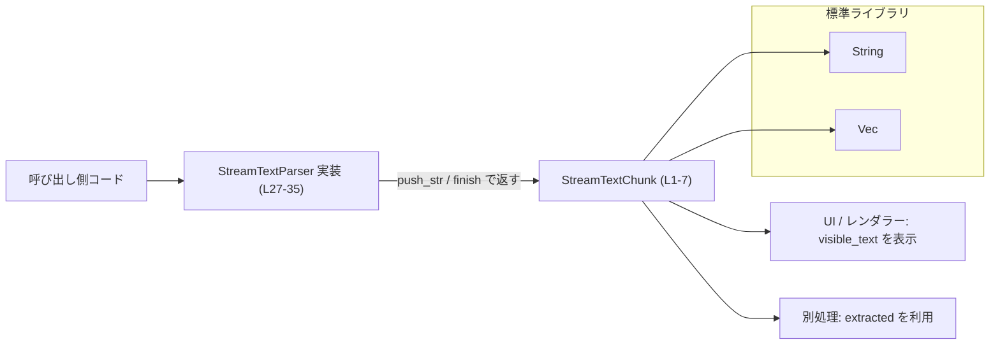
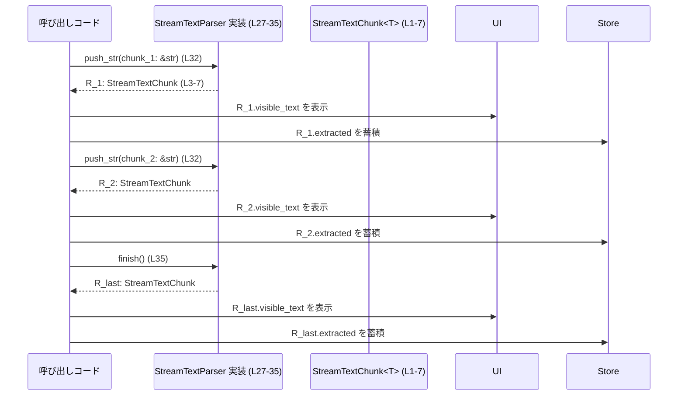

# utils/stream-parser/src/stream_text.rs

## 0. ざっくり一言

ストリーム状のテキストを段階的にパースするための **結果オブジェクト `StreamTextChunk`** と、  
それを生成する **ストリームパーサー用トレイト `StreamTextParser`** を定義しているファイルです  
（`utils/stream-parser/src/stream_text.rs:L1-36`）。

---

## 1. このモジュールの役割

### 1.1 概要

- このモジュールは、テキストをチャンク（部分文字列）ごとに受け取りながら処理する **インクリメンタルパーサー** のための共通インターフェースを提供します。
- 具体的には、1 回の `push_str` または `finish` 呼び出しの結果として返される
  `StreamTextChunk<T>` 構造体と、それを返すパーサートレイト `StreamTextParser` を定義しています  
 （`stream_text.rs:L1-7`, `L26-35`）。
- パーサーは、**即座に表示してよいテキスト (`visible_text`)** と、  
  **テキスト中から抽出された非表示のペイロード (`extracted`)** を区別して返す設計になっています
  （例: 引用情報などというコメントが付いています `L28`）。

### 1.2 アーキテクチャ内での位置づけ

このファイル単体から見える範囲の依存関係と役割は次のとおりです。



- このモジュールは **標準ライブラリの `String` と `Vec<T>`** の上に薄い抽象を載せているだけで、他クレートや他モジュールへの依存はコード上には現れません（`L5`, `L7`）。
- 実際のパーサーロジック（どのように文字列からペイロードを抽出するか）は、  
  `StreamTextParser` を実装する別の型に委ねられています。このファイル内には具体実装はありません。

### 1.3 設計上のポイント

コードから読み取れる設計上の特徴を列挙します。

- **結果とパーサーの分離**  
  - パース結果を表す `StreamTextChunk<T>`（`L1-7`）と、  
    その結果を生成するトレイト `StreamTextParser`（`L27-35`）を分離しています。
- **ジェネリックなペイロード型**  
  - `StreamTextChunk<T>` の `extracted` と `StreamTextParser::Extracted` はジェネリック型 `T` を使用し、  
    抽出されるペイロードの型をパーサーごとに自由に決められるようになっています（`L3`, `L29`）。
- **インクリメンタル処理を前提とした API**  
  - 新しいチャンクを受け取る `push_str(&mut self, chunk: &str)`（`L32`）と、  
    ストリーム終端で状態をフラッシュする `finish(&mut self)`（`L35`）という 2 段構えの API になっています。
- **エラーは型としては表現されていない**  
  - どのメソッドも `Result` や `Option` を返さず、常に `StreamTextChunk` を返します（`L32`, `L35`）。  
    エラー表現や無効入力の扱いは、実装側に委ねられています（このファイルからは方針は読み取れません）。
- **安全性と並行性**  
  - このファイル内に `unsafe` コードはありません。  
  - `StreamTextParser` のメソッドは `&mut self` を受け取るため、  
    Rust の所有権・借用ルールにより同時に複数スレッドから同じインスタンスを可変利用することはコンパイル時に制限されます。

---

## 2. 主要な機能一覧

このモジュールが提供する主要な機能は次のとおりです。

- `StreamTextChunk<T>`: 1 回のパーサー呼び出しで得られる **可視テキスト + 抽出ペイロード** のセットを表現（`L1-7`）。
- `StreamTextChunk::default()`: 空のチャンク（可視テキストもペイロードもない状態）を生成（`L10-16`）。
- `StreamTextChunk::is_empty()`: 可視テキスト・抽出ペイロードともに空かどうかを判定（`L19-23`）。
- `StreamTextParser` トレイト:
  - `type Extracted`: 抽出されるペイロードの型を指定（`L28-29`）。
  - `push_str(&mut self, &str)`: 新しいテキストチャンクをパーサーに与え、パース結果を返す（`L31-32`）。
  - `finish(&mut self)`: ストリーム末尾でバッファされた状態をフラッシュし、最終的なパース結果を返す（`L34-35`）。

---

## 3. 公開 API と詳細解説

### 3.1 型一覧（構造体・列挙体など）

| 名前 | 種別 | 役割 / 用途 | 定義箇所 |
|------|------|------------|----------|
| `StreamTextChunk<T>` | 構造体 | 1 回分のパース結果。即時表示可能なテキスト `visible_text` と、テキストから抽出されたペイロード `extracted` を保持します。 | `stream_text.rs:L1-7` |
| `StreamTextParser` | トレイト | ストリーム状のテキストをチャンクごとに受け取り、`StreamTextChunk` を返すパーサーのインターフェースです。 | `stream_text.rs:L26-35` |

`StreamTextChunk<T>` のフィールド詳細:

| フィールド名 | 型 | 説明 | 定義箇所 |
|--------------|----|------|----------|
| `visible_text` | `String` | 直ちにレンダリングしてよいテキスト。未完成の構文片などは含めない想定です。 | `stream_text.rs:L4-5` |
| `extracted` | `Vec<T>` | テキスト中から抽出された非表示のペイロード（例: 引用の本文など）。要素型 `T` はパーサーごとに異なります。 | `stream_text.rs:L6-7` |

### 3.2 関数詳細

重要な 4 つのメソッド／関数について、詳細に説明します。

---

#### `impl<T> Default for StreamTextChunk<T>::default() -> StreamTextChunk<T>`

**概要**

- 空の `StreamTextChunk` を生成します。  
  可視テキストは空文字列、`extracted` は空のベクタになります（`stream_text.rs:L10-16`）。

**引数**

- なし。

**戻り値**

- `StreamTextChunk<T>`  
  - `visible_text` が `String::new()` の状態  
  - `extracted` が `Vec::new()` の状態

**内部処理の流れ**

コード（`L10-16`）から読み取れる処理は次のとおりです。

1. `Self { ... }` 構文で `StreamTextChunk` のインスタンスを生成する（`L12`）。
2. `visible_text` フィールドに `String::new()` を代入する（`L13`）。
3. `extracted` フィールドに `Vec::new()` を代入する（`L14`）。
4. 生成した構造体を返す（`L12-15`）。

**Examples（使用例）**

```rust
use utils::stream_parser::stream_text::StreamTextChunk; // 仮のパス名

fn main() {
    // ジェネリック T に対して空のチャンクを作成する
    let chunk: StreamTextChunk<u32> = StreamTextChunk::default();

    assert!(chunk.visible_text.is_empty()); // 可視テキストは空
    assert!(chunk.extracted.is_empty());    // 抽出ペイロードも空
}
```

**Errors / Panics**

- `String::new()` / `Vec::new()` はパニックしない標準ライブラリ関数であり、  
  この実装にはパニック要因は含まれていません。

**Edge cases（エッジケース）**

- 特定の入力を受け取る関数ではないため、入力に関するエッジケースはありません。
- 型パラメータ `T` に制約はなく、どのような型でも `StreamTextChunk::<T>::default()` はコンパイル可能です（`L10` に境界はありません）。

**使用上の注意点**

- 「空の結果」を明示したいときに利用できます。  
  例: `finish()` の結果が何も返さない場合に `StreamTextChunk::default()` を返すなど。
- `is_empty()` と組み合わせると、「何も生成しなかったステップ」を表現できます。

---

#### `impl<T> StreamTextChunk<T>::is_empty(&self) -> bool`

**概要**

- 可視テキスト `visible_text` と抽出ペイロード `extracted` の両方が空かどうかを返します（`stream_text.rs:L19-23`）。

**引数**

| 引数名 | 型 | 説明 |
|--------|----|------|
| `self` | `&self` | 参照のみで、自身を変更しません（共有参照）。 |

**戻り値**

- `bool`  
  - `true`: `visible_text.is_empty()` かつ `extracted.is_empty()` の両方が `true` のとき（`L21-22`）。  
  - `false`: 上記いずれかが非空のとき。

**内部処理の流れ**

1. `self.visible_text.is_empty()` を評価（`L22`）。
2. `self.extracted.is_empty()` を評価（`L22`）。
3. それら 2 つの論理積（`&&`）を返します（`L22`）。

**Examples（使用例）**

```rust
use utils::stream_parser::stream_text::StreamTextChunk;

fn main() {
    let mut chunk: StreamTextChunk<&str> = StreamTextChunk::default();

    assert!(chunk.is_empty()); // どちらも空なので true

    chunk.visible_text.push_str("hello");
    assert!(!chunk.is_empty()); // 可視テキストが非空なので false

    chunk.visible_text.clear();
    chunk.extracted.push("payload");
    assert!(!chunk.is_empty()); // extracted が非空なので false
}
```

**Errors / Panics**

- `is_empty()` は `String::is_empty()` と `Vec::is_empty()` のみを呼び出しており、  
  これらはいずれもパニックしない関数です。  
  このメソッド自体にパニック要因はありません（`L21-22`）。

**Edge cases（エッジケース）**

- `visible_text` が空、`extracted` が非空 → `false` を返します。  
  抽出ペイロードだけが生成されたケースを識別できます。
- `visible_text` が非空、`extracted` が空 → `false` を返します。  
  テキストのみ生成されたケースを識別できます。
- 両方空 → `true`。`default()` 直後の状態と同値です。

**使用上の注意点**

- 「このチャンクでユーザー向けの更新や新しいペイロードが発生したか」を判定するのに利用できます。
- `is_empty()` が `true` の場合でも、パーサー内部では状態更新が行われている可能性があります。  
  `is_empty()` はあくまで「外部に公開された結果がない」ことだけを表します。

---

#### `StreamTextParser::push_str(&mut self, chunk: &str) -> StreamTextChunk<Self::Extracted>`

**概要**

- ストリームから受け取った **新しいテキストチャンク** をパーサーに与え、  
  そのチャンクに対応する `StreamTextChunk` を返すメソッドです（`stream_text.rs:L31-32`）。

**引数**

| 引数名 | 型 | 説明 |
|--------|----|------|
| `self` | `&mut self` | パーサー内部状態を更新するための可変参照です（`L32`）。 |
| `chunk` | `&str` | 新たに到着したテキストチャンク。UTF-8 文字列スライスです（`L32`）。 |

**戻り値**

- `StreamTextChunk<Self::Extracted>`  
  - パース結果としての可視テキストと抽出ペイロードを含むチャンクです（`L32`）。
  - `Self::Extracted` はトレイトの関連型で、実装ごとに異なる型が指定されます（`L29`）。

**内部処理の流れ（期待される契約）**

- このファイルには `StreamTextParser` の具体的な実装は存在しないため（`L26-35`）、  
  正確なアルゴリズムは「このチャンクには現れません」。
- コメントから読み取れる期待される挙動は次のとおりです（`L26-31`）。
  1. `chunk` を内部バッファや状態と組み合わせて解析する。
  2. 即座に表示してよい部分だけを `visible_text` にまとめる。
  3. テキストから抽出されたペイロードを `extracted` に格納する。
  4. それらを `StreamTextChunk` として返す。

**Examples（使用例）**

以下は単純な「エコー」パーサー（そのままテキストを可視テキストとして返し、ペイロードは空）の例です。

```rust
use utils::stream_parser::stream_text::{StreamTextChunk, StreamTextParser};

// 抽出ペイロードを持たないシンプルなパーサー
struct EchoParser;

// Extracted は単位型 () とする
impl StreamTextParser for EchoParser {
    type Extracted = ();

    fn push_str(&mut self, chunk: &str) -> StreamTextChunk<Self::Extracted> {
        StreamTextChunk {
            visible_text: chunk.to_owned(), // 受け取った文字列をそのまま可視テキストに
            extracted: Vec::new(),          // ペイロードは何も抽出しない
        }
    }

    fn finish(&mut self) -> StreamTextChunk<Self::Extracted> {
        StreamTextChunk::default() // 終端で返すものは特にない
    }
}

fn main() {
    let mut parser = EchoParser;
    let chunk = parser.push_str("hello ");
    assert_eq!(chunk.visible_text, "hello ");
    assert!(chunk.extracted.is_empty());
}
```

**Errors / Panics**

- このメソッドのシグネチャには `Result` などのエラー型が含まれません（`L32`）。
- したがって、**パースエラーをどのように扱うかは実装側次第** です。
  - 例: 不正な入力を無視する／ログ出力する／`extracted` にエラー情報を入れる など。
- このファイルからは、パースエラーの扱い方針やパニックの有無は判断できません。

**Edge cases（エッジケース）**

このファイルでは `push_str` の実装が提供されていないため、入力に対する挙動は不明です。  
考慮すべき代表的な入力ケースだけ列挙します（挙動は「実装次第」となります）。

- `chunk` が空文字列 `""` の場合。
- `chunk` が非常に長い文字列の場合。
- `chunk` を連続して何度も呼び出す場合（インクリメンタル処理）。
- マルチバイト文字（日本語・絵文字など）がチャンク境界で分割される場合。

**使用上の注意点**

- `&mut self` を取るため、同じパーサーインスタンスを複数のスレッドから同時に呼び出すことはできません（Rust の借用規則によりコンパイルエラーになります）。  
  並行処理を行う場合は、スレッドごとに別インスタンスを持つか、外側で同期（`Mutex` 等）を行う必要があります。
- `push_str` だけ呼び出し、`finish` を呼ばない場合、実装によってはバッファされたテキストが出力されない可能性があります。  
  ストリーム終端では必ず `finish` を呼び出す設計になっていることがコメントから読み取れます（`L34-35`）。

---

#### `StreamTextParser::finish(&mut self) -> StreamTextChunk<Self::Extracted>`

**概要**

- ストリームの終端（または 1 アイテムの終端）で呼び出され、  
  パーサー内部に残っているバッファや未完の構文をフラッシュするメソッドです（コメント `L34`）。

**引数**

| 引数名 | 型 | 説明 |
|--------|----|------|
| `self` | `&mut self` | 内部バッファや状態を消費・リセットするための可変参照です（`L35`）。 |

**戻り値**

- `StreamTextChunk<Self::Extracted>`  
  - フラッシュされた結果としての可視テキストと抽出ペイロードを保持するチャンクです（`L35`）。

**内部処理の流れ（期待される契約）**

- このチャンクには実装が現れないため、正確な処理は不明です。
- コメントから読み取れる期待される動作（`L34`）は以下です。
  1. 内部バッファに残っている未出力の `visible_text` をまとめて出力する。
  2. まだ `extracted` に追加されていないペイロードを出力する。
  3. 内部状態を「新しいストリームを処理できる状態」にリセットするか、そのまま使い捨てとする。

**Examples（使用例）**

先ほどの `EchoParser` の例では、`finish` は空チャンクを返すだけの実装でした。

```rust
fn main() {
    let mut parser = EchoParser;

    parser.push_str("hello ");
    parser.push_str("world");

    // ストリームの終端とみなし finish を呼ぶ
    let tail = parser.finish();

    // EchoParser では終端で追加出力はしない設計
    assert!(tail.visible_text.is_empty());
    assert!(tail.extracted.is_empty());
}
```

より複雑なパーサーでは、`finish` が最後の未完部分（例: 閉じカッコ待ちの構文など）を処理して返すことが考えられますが、  
そのような挙動はこのファイルからは読み取れません。

**Errors / Panics**

- 戻り値にエラー型は含まれておらず、エラー処理の方針は実装に依存します（`L35`）。
- 内部バッファの消費やリセット中にパニックがあるかどうかも、このファイルからは不明です。

**Edge cases（エッジケース）**

- ストリーム開始直後に `finish` のみを呼ぶ場合（`push_str` が一度も呼ばれていない）。  
  → 典型的には空のチャンクを返すと想定されますが、実際の挙動は実装依存です。
- すでに `finish` を呼んだパーサーに再度 `finish` を呼ぶ場合。  
  → 再利用を許すかどうかも含め、このファイルからは契約は読み取れません。

**使用上の注意点**

- コメントに "end-of-stream (or end-of-item)" とあるため（`L34`）、  
  ストリームの区切りごとに必ず呼び出すことが前提の設計と解釈できます。
- `finish` を呼び忘れると、内部に残ったテキストやペイロードが取りこぼされる実装があり得ます。

---

### 3.3 その他の関数

- このファイルには、上記以外の関数・メソッド定義は存在しません（`L1-36` を通覧）。

---

## 4. データフロー

### 4.1 代表的な処理シナリオ

典型的な利用シナリオは、次のような流れです。

1. 呼び出し側がストリーム（例: ネットワークからの SSE、チャットモデルのストリーム出力など）からテキストチャンクを受け取る。
2. 受け取ったチャンクを順に `StreamTextParser::push_str` に渡し、その都度 `StreamTextChunk` を受け取る。
3. 各チャンクの `visible_text` を UI に追記表示し、`extracted` は別途蓄積・処理する。
4. ストリーム終端で `finish` を呼び出し、残っていたテキストやペイロードを取得する。

### 4.2 シーケンス図



- 図中の `StreamTextParser 実装 (L27-35)` は、このファイルで定義されたトレイトを実装した任意の型を表します。
- `StreamTextChunk<T> (L1-7)` は、可視テキストと抽出ペイロードのコンテナです。

---

## 5. 使い方（How to Use）

### 5.1 基本的な使用方法

ここでは、簡単なパーサー実装と、その利用コードを示します。  
ペイロードは文字列の長さ（`usize`）だけを記録する単純な例です。

```rust
use utils::stream_parser::stream_text::{StreamTextChunk, StreamTextParser};

// 各チャンクの長さを extracted に記録しつつ、テキストはそのまま表示するパーサー
struct LengthRecordingParser {
    total_len: usize, // これまでに処理した長さの合計
}

// トレイト実装
impl StreamTextParser for LengthRecordingParser {
    type Extracted = usize; // 各チャンクの長さをペイロードとして扱う

    fn push_str(&mut self, chunk: &str) -> StreamTextChunk<Self::Extracted> {
        let len = chunk.len();              // 今回のチャンクのバイト長
        self.total_len += len;              // 合計長を更新

        StreamTextChunk {
            visible_text: chunk.to_owned(), // チャンクをそのまま表示用テキストに
            extracted: vec![len],           // 今回のチャンク長を 1 件だけ extracted に入れる
        }
    }

    fn finish(&mut self) -> StreamTextChunk<Self::Extracted> {
        // この例では終端で追加出力はしない
        StreamTextChunk::default()
    }
}

fn main() {
    let mut parser = LengthRecordingParser { total_len: 0 };

    // チャンク 1
    let c1 = parser.push_str("hello ");
    assert_eq!(c1.visible_text, "hello ");
    assert_eq!(c1.extracted, vec![6]);

    // チャンク 2
    let c2 = parser.push_str("world");
    assert_eq!(c2.visible_text, "world");
    assert_eq!(c2.extracted, vec![5]);

    // 終端
    let tail = parser.finish();
    assert!(tail.is_empty()); // tail では何も返さない設計
}
```

この例では:

- 可視テキストはそのまま `visible_text` に渡され、
- 各チャンクの長さが `extracted` ペイロードとして返されています。

### 5.2 よくある使用パターン

1. **UI への逐次レンダリング**

   - `push_str` のたびに `visible_text` を UI に追記し、ユーザーにストリーミング表示を行う。
   - `extracted` は、メタデータ（引用・脚注・トークン数情報など）として別ストアに保存する。

2. **全文再構築**

   - 各 `StreamTextChunk` の `visible_text` を連結して、最終的な全文を構築する。
   - 終端では `finish` から返された `visible_text` も連結に含める。

3. **ペイロード中心の処理**

   - `visible_text` を無視し、`extracted` のみを集計・分析する（例えば引用の一覧など）。

### 5.3 よくある間違い

推測ではなく、この API から合理的に考えられる誤用例を挙げます。

```rust
// 誤り例: ストリーム終端で finish を呼んでいない
fn wrong_usage<P: StreamTextParser>(parser: &mut P, chunks: Vec<String>) {
    for c in chunks {
        let _ = parser.push_str(&c);
    }
    // finish を呼ばないため、内部バッファに残ったテキストやペイロードを取りこぼす実装があり得る
}

// 正しい例: 終端で finish を呼んで結果を回収する
fn correct_usage<P: StreamTextParser>(parser: &mut P, chunks: Vec<String>) {
    for c in chunks {
        let _ = parser.push_str(&c);
    }
    let tail = parser.finish(); // 最後のチャンクを取得
    let _ = tail; // 可視テキスト／ペイロードを処理する
}
```

その他の典型的な誤用:

- **`is_empty()` の意味の誤解**  
  - `visible_text` が空でも `extracted` が非空であれば `is_empty()` は `false` を返します。  
    「テキストが増えなかった」ことと「何も起こらなかった」ことは区別されます。

- **スレッド間での `StreamTextParser` の共有**  
  - `&mut self` メソッドであるため、`Arc<Mutex<P>>` などで同期しない限り複数スレッドから同時に呼び出すことはできません。

### 5.4 使用上の注意点（まとめ）

- **前提条件**
  - ストリーム終端で `finish` を呼び出すことが前提の設計になっています（`L34-35`）。
  - `push_str` は UTF-8 文字列 `&str` を受け取るため、呼び出し側が入力を UTF-8 として用意する必要があります。

- **エラー処理**
  - この API にはエラー型が含まれていないため、パースエラーは実装側で吸収する設計になっています。  
    エラーを呼び出し側で扱いたい場合は、`Extracted` 型にエラー情報を含めるなどの方針をとる必要があります。

- **並行性**
  - `StreamTextChunk` 自体は `Debug, Clone, PartialEq, Eq` を実装しており（`L2`）、  
    `T` が `Clone + PartialEq + Eq + Debug` であれば、比較・複製・デバッグ表示が可能です。
  - `StreamTextParser` は `&mut self` のため、1 インスタンスを 1 スレッドで順次利用する形が自然です。

---

## 6. 変更の仕方（How to Modify）

### 6.1 新しい機能を追加する場合

1. **ペイロードにメタ情報を追加したい場合**
   - 一般には、`StreamTextChunk` 自体を拡張するよりも、`Extracted` 型の側を構造体にするなどしてメタ情報を持たせる方が、  
     この共通インターフェースを壊さずに済みます。
   - 例えば `Extracted` を `struct Citation { id: String, offset: usize }` などにすることが考えられます（実際の型はこのファイルでは定義されていません）。

2. **チャンクごとのメタデータを追加したい場合**
   - `StreamTextChunk<T>` に新たなフィールド（例: `pub metadata: ChunkMeta`）を追加することもできますが、  
     これは公開 API の互換性に影響します。  
     既存コードが構造体の構築を位置指定フィールドではなく、構造体リテラルで行っている場合、変更が必要になります。

### 6.2 既存の機能を変更する場合

- `is_empty()` の意味を変更する（例: `visible_text` だけを見る）ことは、  
  呼び出し側のロジックに影響するため注意が必要です。現状は「両方空なら空」という契約です（`L21-22`）。
- `StreamTextParser` トレイトのシグネチャを変更すると、このトレイトを実装している全ての型に影響が及びます。
  - `push_str` の引数型や戻り値の変更は特に破壊的です。
  - エラーを返すようにする場合は、`Result<StreamTextChunk<_>, E>` などに変更する必要がありますが、  
    それもまた互換性に影響します。

- 変更時には以下を確認する必要があります。
  - `StreamTextParser` を実装している全ての型のコンパイル可否。
  - `StreamTextChunk` のフィールドに直接アクセスしている箇所の修正箇所。

---

## 7. 関連ファイル

このチャンク内には他ファイルのパスやモジュール参照が現れないため、  
`StreamTextParser` を実装している具体的な型がどのファイルにあるかは「このチャンクには現れません」。

現時点で確実に言える関連は標準ライブラリのみです。

| パス / モジュール | 役割 / 関係 |
|------------------|------------|
| `std::string::String` | `StreamTextChunk.visible_text` の型。可視テキストを保持します（`L5`）。 |
| `std::vec::Vec` | `StreamTextChunk.extracted` のコンテナ。任意型 `T` のペイロードを複数保持します（`L7`）。 |

テストコードや具体的なパーサー実装ファイルとの関係は、  
このファイル単体からは **不明** です。
