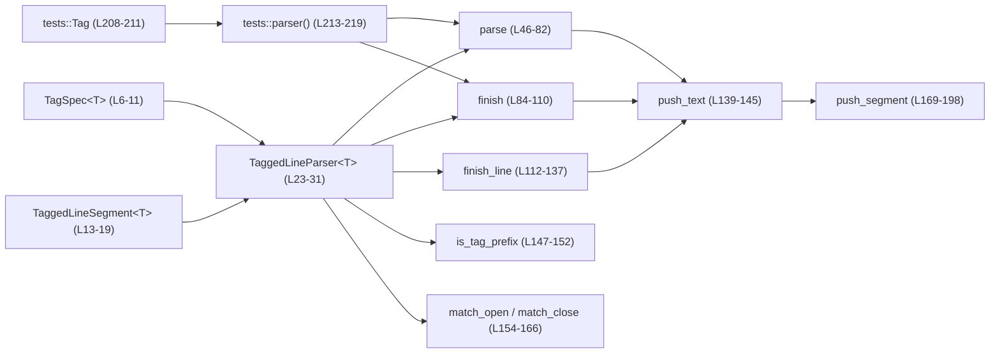
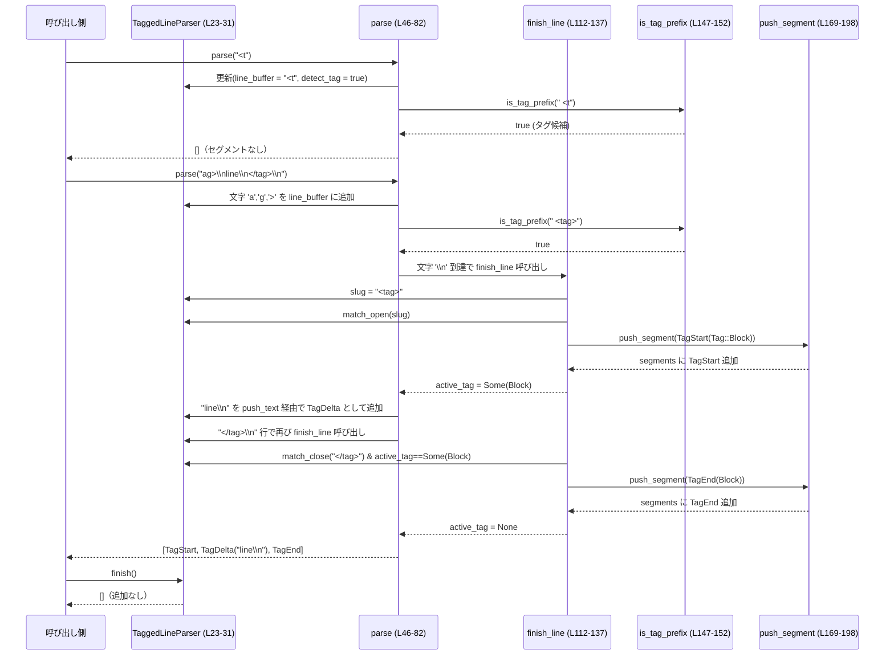

# utils/stream-parser/src/tagged_line_parser.rs コード解説

## 0. ざっくり一言

- ストリームで流れてくるテキストを「行」単位で処理し、特定のタグ行で囲まれたブロックを検出して、通常テキストとタグ区間を分割するための状態付きパーサです（`tagged_line_parser.rs:L1-4,21-31`）。

---

## 1. このモジュールの役割

### 1.1 概要

- このモジュールは、**「行単位でタグ行を検出し、ストリームテキストをタグブロックごとに分割する」**問題を解決するために存在します（`tagged_line_parser.rs:L1-4,21-31`）。
- タグは `TagSpec<T>` によって「開き文字列」「閉じ文字列」として定義され、`TaggedLineParser<T>` はストリーム入力を受け取り、`TaggedLineSegment<T>` の列に変換します（`tagged_line_parser.rs:L6-19,23-31`）。
- タグとして扱うには、「その行にタグ以外の文字が含まれていない（前後の空白のみ許可）」という制約があります（`finish_line` / `finish` の判定より, `tagged_line_parser.rs:L112-123,88-103`）。

### 1.2 アーキテクチャ内での位置づけ

- ファイルパスから、このモジュールは `utils::stream-parser` サブシステムの一部であることが分かりますが、**他のモジュールからの呼び出し関係はこのチャンクには現れません**。
- 本ファイル内の関係は次の通りです：



- `TaggedLineParser<T>` が中心となり、`TagSpec<T>` に基づいてタグ開始・終了を判定し、`push_segment` で `TaggedLineSegment<T>` の列を生成します。

### 1.3 設計上のポイント

- **状態を持つストリームパーサ**  
  - `TaggedLineParser<T>` は `active_tag`, `detect_tag`, `line_buffer` を内部状態として持ちます（`tagged_line_parser.rs:L27-30`）。
  - 同一インスタンスをストリーム（複数チャンク）に対して継続利用する前提の設計です（テストでも複数回 `parse` を呼んでいます, `tagged_line_parser.rs:L223-226`）。

- **タグ判定の方針（行単位・プレフィックスバッファリング）**  
  - 行の先頭からの文字列を `line_buffer` に貯め、**「タグ開閉文字列のプレフィックスである限り」**テキストとして出力せずに保留します（`parse`, `is_tag_prefix`, `tagged_line_parser.rs:L50-67,147-152`）。
  - 途中でプレフィックス条件を満たさなくなった時点で、その行全体を通常テキストとして吐き出し、その行の残りはタグ検出を行わないモードになります（`detect_tag = false`, `tagged_line_parser.rs:L64-67,70-74`）。

- **タグ行は「タグのみの行」に限定**  
  - 行末の改行を除き、前後の空白を取り除いた文字列が `open` / `close` に完全一致した場合のみタグ開始・終了として扱います（`finish_line`, `finish`, `match_open`, `match_close`, `tagged_line_parser.rs:L112-123,88-103,154-166`）。
  - その行に余分なテキストがある場合は、**行全体が通常テキスト**になります（テスト `rejects_tag_lines_with_extra_text`, `tagged_line_parser.rs:L239-247`）。

- **単一のアクティブタグ**  
  - `active_tag: Option<T>` で **同時に 1 つのタグ種別のみアクティブ**にします（`tagged_line_parser.rs:L28`）。
  - `active_tag` が Some のときは、タグ開始行は無視され、閉じタグ行だけが認識されます（`finish_line` の条件, `tagged_line_parser.rs:L117-133`）。

- **安全性・エラーハンドリング**  
  - `unsafe` は一切使用していません。
  - 明示的なエラー型（`Result`）は返さず、タグとして認識できないものはすべて通常テキストとして扱う方針です（`parse`, `finish` の戻り値, `tagged_line_parser.rs:L46-82,84-110`）。
  - パニックを起こし得る `unwrap` 等は使用していません（`strip_suffix` は `unwrap_or` でフォールバック, `tagged_line_parser.rs:L88-89,114-115`）。

- **並行性**  
  - `parse` / `finish` ともに `&mut self` を要求するため、**1 インスタンスは 1 スレッドから順次利用する前提**です（`tagged_line_parser.rs:L46,84`）。
  - 内部に同期プリミティブはなく、スレッドセーフ性は呼び出し側で担保する必要があります。

---

## 2. 主要な機能一覧とコンポーネントインベントリー

### 2.1 主要な機能（機能レベル）

- ストリーム入力の逐次解析: `parse(&mut self, delta: &str)` で入力の一部文字列を受け取り、タグ区間情報を含むセグメント列に変換します（`tagged_line_parser.rs:L46-82`）。
- ストリーム終了時の後処理: `finish(&mut self)` で最後の行バッファや未閉タグを処理し、残りのセグメントを返します（`tagged_line_parser.rs:L84-110`）。
- タグ定義の保持: `TagSpec<T>` がタグの開き・閉じ文字列とタグ種別 `T` を保持します（`tagged_line_parser.rs:L6-11`）。
- 出力セグメントの表現: `TaggedLineSegment<T>` が通常テキスト / タグ開始 / タグ内テキスト / タグ終了を区別して表現します（`tagged_line_parser.rs:L13-19`）。
- セグメントのマージ最適化: `push_segment` が同種の連続セグメントをマージし、出力を簡潔に保ちます（`tagged_line_parser.rs:L169-198`）。

### 2.2 コンポーネントインベントリー（型・関数一覧）

#### プロダクションコード

| 名前 | 種別 | 役割 / 用途 | 定義位置 |
|------|------|-------------|----------|
| `TagSpec<T>` | 構造体 | タグの開き文字列・閉じ文字列・タグ種別 `T` をまとめて保持する | `tagged_line_parser.rs:L6-11` |
| `TaggedLineSegment<T>` | 列挙体 | 出力トークン。通常テキスト・タグ開始・タグ内テキスト・タグ終了を表現する | `tagged_line_parser.rs:L13-19` |
| `TaggedLineParser<T>` | 構造体 | ストリームテキストを行単位で解析する状態付きパーサ | `tagged_line_parser.rs:L21-31` |
| `TaggedLineParser::new` | メソッド | パーサの初期化。タグ仕様リストを受け取り内部状態を初期化 | `tagged_line_parser.rs:L37-44` |
| `TaggedLineParser::parse` | メソッド | 入力チャンクを解析し、`TaggedLineSegment<T>` のベクタを返す | `tagged_line_parser.rs:L46-82` |
| `TaggedLineParser::finish` | メソッド | 最終的なバッファ処理・未閉タグのクローズを行う | `tagged_line_parser.rs:L84-110` |
| `TaggedLineParser::finish_line` | メソッド（非公開） | 1 行分のバッファからタグ行かどうかを判定し、セグメントに変換 | `tagged_line_parser.rs:L112-137` |
| `TaggedLineParser::push_text` | メソッド（非公開） | `active_tag` に応じて通常テキスト / タグ内テキストのセグメントを追加 | `tagged_line_parser.rs:L139-145` |
| `TaggedLineParser::is_tag_prefix` | メソッド（非公開） | バッファ先頭がタグ開閉文字列のプレフィックスになっているかを判定 | `tagged_line_parser.rs:L147-152` |
| `TaggedLineParser::match_open` | メソッド（非公開） | 行スラッグが開きタグ文字列と完全一致するか判定 | `tagged_line_parser.rs:L154-159` |
| `TaggedLineParser::match_close` | メソッド（非公開） | 行スラッグが閉じタグ文字列と完全一致するか判定 | `tagged_line_parser.rs:L161-166` |
| `push_segment` | 関数（汎用） | `TaggedLineSegment` をベクタに追加し、同種連結をマージ | `tagged_line_parser.rs:L169-198` |

#### テストコード

| 名前 | 種別 | 役割 / 用途 | 定義位置 |
|------|------|-------------|----------|
| `tests::Tag` | 列挙体 | テスト用のタグ種別（ここでは `Block` のみ） | `tagged_line_parser.rs:L208-211` |
| `tests::parser` | 関数 | テスト用に `TaggedLineParser<Tag>` を生成するヘルパー | `tagged_line_parser.rs:L213-219` |
| `buffers_prefix_until_tag_is_decided` | テスト関数 | タグか否かが判定できるまでプレフィックスをバッファする挙動を検証 | `tagged_line_parser.rs:L221-236` |
| `rejects_tag_lines_with_extra_text` | テスト関数 | タグ文字列＋余分なテキストを含む行は通常テキストとみなすことを検証 | `tagged_line_parser.rs:L238-247` |

---

## 3. 公開 API と詳細解説

### 3.1 型一覧（構造体・列挙体など）

| 名前 | 種別 | フィールド / バリアント | 役割 / 用途 | 定義位置 |
|------|------|-------------------------|-------------|----------|
| `TagSpec<T>` | 構造体 | `open: &'static str`, `close: &'static str`, `tag: T` | タグの開き・閉じ文字列と、それに対応する論理タグ種別 `T` をまとめる | `tagged_line_parser.rs:L6-11` |
| `TaggedLineSegment<T>` | 列挙体 | `Normal(String)`, `TagStart(T)`, `TagDelta(T, String)`, `TagEnd(T)` | パース結果の単位。通常テキスト / タグ開始行 / タグ内テキスト / タグ終了行を表現 | `tagged_line_parser.rs:L13-19` |
| `TaggedLineParser<T>` | 構造体 | `specs: Vec<TagSpec<T>>`, `active_tag: Option<T>`, `detect_tag: bool`, `line_buffer: String` | タグ仕様を保持しつつ、現在のタグ状態・行バッファを管理するストリームパーサ | `tagged_line_parser.rs:L21-31` |
| `tests::Tag` | 列挙体 | `Block` | テスト専用のタグ種別。`TagSpec<Tag>` で使用される | `tagged_line_parser.rs:L208-211` |

### 3.2 関数詳細（主要 7 件）

#### `TaggedLineParser::new(specs: Vec<TagSpec<T>>) -> Self`（L37-44）

**概要**

- 指定されたタグ仕様リスト `specs` を使って、新しい `TaggedLineParser` を初期化します（`tagged_line_parser.rs:L37-43`）。
- `active_tag` は未設定 (`None`)、タグ検出は有効 (`detect_tag = true`)、行バッファは空から開始します。

**引数**

| 引数名 | 型 | 説明 |
|--------|----|------|
| `specs` | `Vec<TagSpec<T>>` | 利用可能なタグの開き・閉じ文字列とタグ種別のリスト |

**戻り値**

- 初期状態の `TaggedLineParser<T>` インスタンス。

**内部処理の流れ**

1. フィールド `specs` に引数をそのまま格納。
2. `active_tag` を `None` に設定。
3. `detect_tag` を `true` に設定（次の行の先頭からタグ判定する状態）（`tagged_line_parser.rs:L40-41`）。
4. `line_buffer` を空文字列で初期化。

**Examples（使用例）**

```rust
// テストと同様のタグ仕様を使ったパーサ初期化例
#[derive(Debug, Clone, Copy, PartialEq, Eq)]
enum Tag {
    Block,
}

let specs = vec![TagSpec {
    open: "<tag>",          // タグ開始行の文字列
    close: "</tag>",        // タグ終了行の文字列
    tag: Tag::Block,        // 対応するタグ種別
}];

let mut parser = TaggedLineParser::new(specs); // パーサを作成
```

**Errors / Panics**

- エラー値は返しません。
- `specs` が空・重複している・矛盾している場合も、そのまま内部に保持されます（挙動は `is_tag_prefix` / `match_open` / `match_close` に依存します, `tagged_line_parser.rs:L147-166`）。

**Edge cases（エッジケース）**

- `specs` が空の場合、**どの行もタグとして認識されず**、すべて `Normal` / `TagDelta` になります。

**使用上の注意点**

- `TaggedLineParser<T>` は `specs` をクローンせずに保持するので、`specs` に含まれる `&'static str` が実際に `'static` であること（リテラルなど）が前提です（`TagSpec` の型定義より, `tagged_line_parser.rs:L6-10`）。
- 同一タグペアを複数回登録した場合の扱いは明示されていませんが、`match_open` / `match_close` は最初にマッチしたものを利用します（`iter().find(...)`, `tagged_line_parser.rs:L155-159,162-165`）。

---

#### `TaggedLineParser::parse(&mut self, delta: &str) -> Vec<TaggedLineSegment<T>>`（L46-82）

**概要**

- 入力文字列チャンク `delta` を 1 文字ずつ処理し、タグ開始・終了行および通常テキストを `TaggedLineSegment<T>` の列として返します（`tagged_line_parser.rs:L46-82`）。
- 内部状態（`active_tag`, `detect_tag`, `line_buffer`）は保持されるため、複数回の `parse` 呼び出しでストリームを処理できます（テストにおける複数回呼び出し参照, `tagged_line_parser.rs:L223-226`）。

**引数**

| 引数名 | 型 | 説明 |
|--------|----|------|
| `delta` | `&str` | ストリームから読み込まれたテキストチャンク。任意の位置で分割されてよい |

**戻り値**

- `Vec<TaggedLineSegment<T>>`  
  - このチャンクを処理した結果生成されたセグメント列。
  - ただし、**現在の行がまだ確定していない場合のバッファ（`line_buffer`）はここでは出力されません**（`finish` で処理）。

**内部処理の流れ**

1. ローカル変数 `segments`（出力）、`run`（`detect_tag == false` のときの連続テキスト）を初期化（`tagged_line_parser.rs:L47-48`）。
2. `delta.chars()` で 1 文字ずつループ（`tagged_line_parser.rs:L50`）。
3. `detect_tag == true` の場合（行頭〜タグ判定フェーズ, `tagged_line_parser.rs:L51-68`）:
   - `run` に溜まっているテキストがあれば `push_text` で吐き出す（`tagged_line_parser.rs:L52-53`）。
   - 現在の文字を `line_buffer` に追加（`tagged_line_parser.rs:L55`）。
   - 改行なら `finish_line` を呼び、その行をタグ行か通常行かに分類して処理し、次の文字へ（`tagged_line_parser.rs:L56-58`）。
   - 改行でない場合、`line_buffer` の先頭の空白を除いた `slug` を計算し（`tagged_line_parser.rs:L60`）、
     - `slug` が空、または `is_tag_prefix(slug)` が `true` なら、まだタグ候補の行としてバッファを続行（`tagged_line_parser.rs:L61-62`）。
     - そうでなければ、その行はタグにはなり得ないと判断し、`line_buffer` 全体を `push_text` で出力、`detect_tag = false` として残りの文字は通常テキストとして処理（`tagged_line_parser.rs:L64-67`）。
4. `detect_tag == false` の場合（その行はタグ行にならないと判定済み, `tagged_line_parser.rs:L70-74`）:
   - 文字を `run` に追加。
   - 改行に到達したら、その行の残りを `push_text` で出力し、次の行から再びタグ判定を行うため `detect_tag = true` に戻す。
5. ループ終了後、`run` に残りがあれば `push_text` で出力（`tagged_line_parser.rs:L77-79`）。
6. `segments` を返す（`tagged_line_parser.rs:L81`）。

**Examples（使用例）**

ストリームを 2 チャンクに分けてパースする例です。

```rust
#[derive(Debug, Clone, Copy, PartialEq, Eq)]
enum Tag { Block }

let specs = vec![TagSpec {
    open: "<tag>",          // 開きタグ行
    close: "</tag>",        // 閉じタグ行
    tag: Tag::Block,
}];

let mut parser = TaggedLineParser::new(specs);

// 1 チャンク目（タグ行の途中で分割）
let mut segments = parser.parse("<t");

// 2 チャンク目（タグ行の残り＋中身＋閉じタグ）
segments.extend(parser.parse("ag>\nline\n</tag>\n"));

// ストリーム終了
segments.extend(parser.finish());

assert_eq!(
    segments,
    vec![
        TaggedLineSegment::TagStart(Tag::Block),
        TaggedLineSegment::TagDelta(Tag::Block, "line\n".to_string()),
        TaggedLineSegment::TagEnd(Tag::Block),
    ]
);
```

この挙動はテスト `buffers_prefix_until_tag_is_decided` と一致しています（`tagged_line_parser.rs:L221-236`）。

**Errors / Panics**

- エラー値は返しません。
- `delta` 内の不正な UTF-8 は、そもそも `&str` として渡せないため、ここでは扱われません。
- `unwrap` 等によるパニックはありません。

**Edge cases（エッジケース）**

- **タグの途中でチャンクが切れる場合**  
  - プレフィックスが `TagSpec` の `open` / `close` のプレフィックスである限り、タグかどうか判定保留とし、テキストとして出力しません（`is_tag_prefix`, `tagged_line_parser.rs:L50-62,147-152`）。
- **タグ行＋余分なテキスト**  
  - `<tag> extra\n` のようにタグ文字列の後にテキストが続く行は、行全体が `Normal` として出力されます（`tagged_line_parser.rs:L60-67`）。テストで検証済みです（`tagged_line_parser.rs:L239-247`）。
- **最後の行に改行がない場合**  
  - `parse` だけでは `line_buffer` に残る可能性があり、**`finish` を呼ぶまで出力されません**（`tagged_line_parser.rs:L86-103`）。

**使用上の注意点**

- `parse` は状態を更新するため、同一インスタンスへの同時呼び出しは想定されていません（`&mut self` 制約, `tagged_line_parser.rs:L46`）。複数スレッドで使う場合は外側で同期が必要です。
- ストリームの終端で必ず `finish()` を呼ばないと、最後の行や未閉タグが処理されません（`finish` の説明参照）。

---

#### `TaggedLineParser::finish(&mut self) -> Vec<TaggedLineSegment<T>>`（L84-110）

**概要**

- ストリームの終端で呼び出し、`line_buffer` に残っている最後の行や、閉じられていないタグを処理します（`tagged_line_parser.rs:L84-110`）。

**引数**

- なし（`&mut self` のみ）。

**戻り値**

- 追加生成された `TaggedLineSegment<T>` のベクタ。
  - 残りのテキストや、暗黙的にクローズされる `TagEnd` が含まれます。

**内部処理の流れ**

1. `segments` を空で初期化（`tagged_line_parser.rs:L85`）。
2. `line_buffer` に内容があれば取り出し（`std::mem::take`）、末尾の改行を取り除いた `without_newline` を作る（`tagged_line_parser.rs:L86-88`）。
3. `without_newline` の前後空白を除いた `slug` を作成（`tagged_line_parser.rs:L89`）。
4. 次の優先順位で処理（`tagged_line_parser.rs:L91-103`）:
   - `slug` が `match_open` に一致し、かつ `active_tag.is_none()` の場合、`TagStart` を出力し、`active_tag = Some(tag)`。
   - そうでなく、`slug` が `match_close` に一致し、かつ `active_tag == Some(tag)` の場合、`TagEnd` を出力し、`active_tag = None`。
   - いずれでもない場合、`buffered` 全体をテキストとして `push_text`。
5. その後、`active_tag` がまだ `Some(tag)` であれば、暗黙的に `TagEnd(tag)` を出力し、`active_tag` をクリア（`tagged_line_parser.rs:L105-107`）。
6. `detect_tag = true` に戻し、`segments` を返す（`tagged_line_parser.rs:L108-109`）。

**Examples（使用例）**

```rust
// 改行のない最後のタグ行
let mut parser = parser();                   // テストの helper と同等
let mut segments = parser.parse("<tag>\nline"); // line の後ろに改行がない
segments.extend(parser.finish());           // 最後の行と未閉タグを処理

// 期待される出力イメージ:
// TagStart(Tag::Block)
// TagDelta(Tag::Block, "line".to_string())
// TagEnd(Tag::Block)
```

※この例はコードから推測される挙動であり、テストでは直接検証されていません。

**Errors / Panics**

- エラー値は返しません。
- `strip_suffix('\n')` は `unwrap_or` を使用しており、パニックしません（`tagged_line_parser.rs:L88-89`）。

**Edge cases（エッジケース）**

- **未閉タグの自動クローズ**  
  - `active_tag` が `Some(tag)` のまま `finish` すると、自動的に `TagEnd(tag)` が追加されます（`tagged_line_parser.rs:L105-107`）。
- **最後の行がタグ行かどうかの判定**  
  - 最後の行の `slug` が開き/閉じタグと完全一致する場合のみ、タグ開始/終了として扱われます（`tagged_line_parser.rs:L91-100`）。

**使用上の注意点**

- `finish` は **ストリームごとに 1 回** 呼び出す前提です。同一 `TaggedLineParser` インスタンスで再利用する場合は、新しいストリーム用に再度 `new` することが安全です。
- `finish` の呼び出し忘れは、最後の行や未閉タグが出力されない原因になります。

---

#### `TaggedLineParser::finish_line(&mut self, segments: &mut Vec<TaggedLineSegment<T>>)`（L112-137）

**概要**

- 改行に到達したときに、その行 (`line_buffer`) をタグ行か通常行か判断し、適切なセグメントを `segments` に追加します（`tagged_line_parser.rs:L112-137`）。

**引数**

| 引数名 | 型 | 説明 |
|--------|----|------|
| `segments` | `&mut Vec<TaggedLineSegment<T>>` | 生成したセグメントを追加する出力ベクタ |

**戻り値**

- なし（副作用として `segments` と内部状態を更新）。

**内部処理の流れ**

1. `line_buffer` を `line` として取り出し、末尾の改行を取り除いた `without_newline` を得る（`tagged_line_parser.rs:L113-114`）。
2. `without_newline` の前後空白を除いた `slug` を作成（`tagged_line_parser.rs:L115`）。
3. 次の優先順位で判定（`tagged_line_parser.rs:L117-133`）:
   - `slug` が `match_open` に一致し、かつ `active_tag.is_none()` の場合:
     - `TagStart(tag)` を `push_segment` で追加。
     - `active_tag = Some(tag)`、`detect_tag = true` にして終了。
   - 上記でなければ、`slug` が `match_close` に一致し、かつ `active_tag == Some(tag)` の場合:
     - `TagEnd(tag)` を追加し、`active_tag = None`、`detect_tag = true` にして終了。
   - それ以外の場合:
     - `detect_tag = true` にした上で、行全体 (`line`、改行含む) を `push_text` でテキストとして追加（`tagged_line_parser.rs:L135-136`）。

**Examples（使用例）**

`finish_line` は直接呼び出す API ではありませんが、`parse` 内で改行に到達したときに呼ばれます（`tagged_line_parser.rs:L56-57`）。例えば `<tag>\n` の行で呼ばれると `TagStart` セグメントが生成されます。

**Errors / Panics**

- エラー値は返さず、パニックも起こしません。

**Edge cases（エッジケース）**

- `active_tag` が `Some(_)` の状態で開きタグ行が現れても、タグ開始としては認識されず、行全体がテキストになります（`if self.active_tag.is_none()` 条件, `tagged_line_parser.rs:L117-123`）。
- 閉じタグ行が現在の `active_tag` と異なるタグ種別であれば、閉じタグとして認識されず、通常テキストになります（`self.active_tag == Some(tag)`, `tagged_line_parser.rs:L126-132`）。

**使用上の注意点**

- 1 行につきタグ開始またはタグ終了の **どちらか 1 つのみ** を扱う設計になっています（1 行に複数タグがあっても、文字列一致の結果次第で 1 つとして扱われるか、全体がテキストになります）。

---

#### `TaggedLineParser::push_text(&self, text: String, segments: &mut Vec<TaggedLineSegment<T>>)`（L139-145）

**概要**

- `active_tag` の有無に応じて、テキストを `Normal` もしくは `TagDelta` として `segments` に追加します（`tagged_line_parser.rs:L139-145`）。
- 実際のベクタ操作は `push_segment` に委譲します。

**引数**

| 引数名 | 型 | 説明 |
|--------|----|------|
| `text` | `String` | 追加するテキスト（改行を含むことがある） |
| `segments` | `&mut Vec<TaggedLineSegment<T>>` | 追加先のセグメントベクタ |

**戻り値**

- なし。

**内部処理の流れ**

1. `active_tag` が `Some(tag)` なら `TagDelta(tag, text)` を `push_segment` に渡す（`tagged_line_parser.rs:L140-141`）。
2. それ以外（タグ非アクティブ）の場合は `Normal(text)` を `push_segment` に渡す（`tagged_line_parser.rs:L142-143`）。

**Errors / Panics**

- エラー値は返さず、パニックもありません。

**Edge cases（エッジケース）**

- `text` が空文字列の場合は、`push_segment` 内で無視されます（`delta.is_empty()` チェック, `tagged_line_parser.rs:L175-176,185-186`）。

**使用上の注意点**

- `push_text` 自体は `&self` を受け取るため、内部状態は変更しません。タグ状態の変更は呼び出し元（`parse` / `finish_line` / `finish`）側で行われます。

---

#### `TaggedLineParser::is_tag_prefix(&self, slug: &str) -> bool`（L147-152）

**概要**

- 行先頭からのテキスト `slug` が、いずれかのタグ開き/閉じ文字列のプレフィックスになっているかどうかを判定します（`tagged_line_parser.rs:L147-152`）。
- タグ判定保留のためのヘルパーです。

**引数**

| 引数名 | 型 | 説明 |
|--------|----|------|
| `slug` | `&str` | 行先頭からの部分文字列（既に左側の空白は取り除かれている想定） |

**戻り値**

- `bool` — `slug` の末尾空白を無視した上で、`spec.open` または `spec.close` の先頭と一致する場合に `true`。

**内部処理の流れ**

1. `slug.trim_end()` で末尾の空白を取り除く（`tagged_line_parser.rs:L148`）。
2. すべての `spec` に対して `spec.open.starts_with(slug)` または `spec.close.starts_with(slug)` をチェック（`tagged_line_parser.rs:L149-151`）。
3. どれか 1 つでも `true` であれば `true` を返す。

**Errors / Panics**

- エラー値は返さず、パニックもありません。

**Edge cases（エッジケース）**

- `slug` が完全に空白の場合、呼び出し元側で `slug.is_empty()` をチェックしており、`is_tag_prefix` には渡されません（`tagged_line_parser.rs:L60-62`）。
- 1 文字ずつ増えていくプレフィックスに対し、タグ文字列の範囲内であれば `true` のままになります（テストの `<t` / `<ta` / `<tag` のバッファリング挙動, `tagged_line_parser.rs:L221-226`）。

**使用上の注意点**

- タグ文字列同士がプレフィックス関係にある場合（例: `<tag>` と `<tag2>`）でも、とりあえず「タグ候補」として扱われます。どのタグと解釈されるかは、最終的に `match_open` / `match_close` の完全一致で決まります。

---

#### `push_segment<T>(segments: &mut Vec<TaggedLineSegment<T>>, segment: TaggedLineSegment<T>)`（L169-198）

**概要**

- 新しい `TaggedLineSegment<T>` を `segments` に追加する際に、空文字列のスキップや隣接する同種セグメントのマージを行います（`tagged_line_parser.rs:L169-198`）。
- 出力の冗長さを減らすためのユーティリティです。

**引数**

| 引数名 | 型 | 説明 |
|--------|----|------|
| `segments` | `&mut Vec<TaggedLineSegment<T>>` | 追加・マージ対象のベクタ |
| `segment` | `TaggedLineSegment<T>` | 追加したいセグメント |

**戻り値**

- なし。

**内部処理の流れ**

1. `match segment` でバリアントごとに処理を分岐（`tagged_line_parser.rs:L173-198`）。
2. `Normal(delta)` の場合（`tagged_line_parser.rs:L174-183`）:
   - `delta` が空なら何もしない。
   - 直前の要素が `Normal(existing)` なら、`existing.push_str(&delta)` で連結。
   - そうでなければ新しい `Normal(delta)` を push。
3. `TagDelta(tag, delta)` の場合（`tagged_line_parser.rs:L184-195`）:
   - `delta` が空なら何もしない。
   - 直前要素が同じタグ種別の `TagDelta(existing_tag, existing)` なら、`existing.push_str(&delta)` で連結。
   - そうでなければ新しい `TagDelta(tag, delta)` を push。
4. `TagStart(tag)` / `TagEnd(tag)` の場合は、そのまま push（`tagged_line_parser.rs:L196-197`）。

**Errors / Panics**

- エラー値は返さず、パニックもありません。

**Edge cases（エッジケース）**

- 長いテキストが多数の小さなチャンクに分割されても、同種セグメントとしてマージされるため、最終出力のセグメント数は抑えられます。
- `TagStart` と `TagEnd` はマージされず、1 行ごとに 1 セグメントです。

**使用上の注意点**

- この関数は `T: Copy + Eq` 制約を持つため（`tagged_line_parser.rs:L170-171`）、タグ種別 `T` はコピー可能である必要があります。

---

### 3.3 その他の関数

| 関数名 | 役割（1 行） | 定義位置 |
|--------|--------------|----------|
| `TaggedLineParser::match_open` | `slug` が `spec.open` と完全一致する `TagSpec` を探し、対応するタグ種別 `T` を返す | `tagged_line_parser.rs:L154-159` |
| `TaggedLineParser::match_close` | `slug` が `spec.close` と完全一致する `TagSpec` を探し、対応するタグ種別 `T` を返す | `tagged_line_parser.rs:L161-166` |
| `tests::parser` | テストにおいて、`Tag::Block` 用の `TaggedLineParser` を生成する | `tagged_line_parser.rs:L213-219` |

---

## 4. データフロー

ここでは、テスト `buffers_prefix_until_tag_is_decided` と同様に、タグ行が 2 つのチャンクに分割されるケースのデータフローを示します（`tagged_line_parser.rs:L221-236`）。

### 4.1 処理の要点

- 最初のチャンク `"<t"` を受け取った段階では、`"<t"` がタグ開き文字列 `<tag>` のプレフィックスなので、行はタグ候補としてバッファされるだけで、出力セグメントは生成されません（`is_tag_prefix`, `tagged_line_parser.rs:L50-62,147-152`）。
- 次のチャンク `"ag>\nline\n</tag>\n"` を処理する中で、`"<tag>"` という完全なタグ行が確定し、`TagStart` が出力されます。その後の `"line\n"` は `TagDelta` として出力され、`"</tag>"` 行で `TagEnd` が出力されます（`finish_line`, `tagged_line_parser.rs:L112-133`）。
- `finish` は、このケースでは追加のセグメントを生成しません（`line_buffer` が空 & `active_tag` が `None`, `tagged_line_parser.rs:L86-107`）。

### 4.2 シーケンス図



---

## 5. 使い方（How to Use）

### 5.1 基本的な使用方法

タグで囲まれたブロックを検出しつつ、ストリームテキストを処理する最小構成例です。

```rust
use utils::stream_parser::tagged_line_parser::{
    TagSpec, TaggedLineParser, TaggedLineSegment,
}; // 実際のパスはクレート構成に依存します（このチャンクからは不明）

#[derive(Debug, Clone, Copy, PartialEq, Eq)]
enum Tag {
    Block, // タグ種別
}

fn main() {
    // 1. タグ仕様を定義（tagged_line_parser.rs:L6-11）
    let specs = vec![TagSpec {
        open: "<tag>",      // 開きタグ行（前後空白は許容）
        close: "</tag>",    // 閉じタグ行
        tag: Tag::Block,
    }];

    // 2. パーサを初期化（tagged_line_parser.rs:L37-44）
    let mut parser = TaggedLineParser::new(specs);

    // 3. ストリームからの入力をチャンクごとに parse する（ここではまとめて 1 回）
    let mut segments = parser.parse("<tag>\nline1\nline2\n</tag>\n");

    // 4. ストリーム終端で finish を呼ぶ（tagged_line_parser.rs:L84-110）
    segments.extend(parser.finish());

    // 5. セグメント列を利用する
    for seg in segments {
        match seg {
            TaggedLineSegment::TagStart(Tag::Block) => {
                println!("--- BLOCK START ---");
            }
            TaggedLineSegment::TagDelta(Tag::Block, text) => {
                print!("{text}");
            }
            TaggedLineSegment::TagEnd(Tag::Block) => {
                println!("--- BLOCK END ---");
            }
            TaggedLineSegment::Normal(text) => {
                print!("{text}");
            }
        }
    }
}
```

### 5.2 よくある使用パターン

1. **行指向ストリームの逐次処理**

   - 入力が TCP ストリームや stdin などで行単位に来る場合、1 行ずつ `parse(line)` し、最後に `finish()` を呼ぶ形が自然です。
   - このとき、タグ行は「その行全体」が `<tag>` 等である必要があります（前後空白のみ許容, `tagged_line_parser.rs:L112-123`）。

2. **チャンク境界が行境界と一致しないストリーム**

   - テストのように、タグ文字列の途中でチャンクが切れても、`is_tag_prefix` により誤判定を避けることができます（`tagged_line_parser.rs:L147-152,221-236`）。
   - この場合も、**チャンクごとに `parse` → 最後に `finish`** という流れは同じです。

### 5.3 よくある間違い

```rust
// 間違い例 1: finish() を呼ばない
let mut parser = parser();                    // テストの helper と同等
let segments = parser.parse("<tag>\nline");   // 最後に改行がない
// segments には line 部分がまだ出てこない可能性がある
// -> finish() を呼ばないと未出力の行や未閉タグが残る

// 正しい例:
let mut parser = parser();
let mut segments = parser.parse("<tag>\nline");
segments.extend(parser.finish()); // 最後の行と暗黙の TagEnd が追加される
```

```rust
// 間違い例 2: タグとテキストを同じ行に書いてタグ行だと思う
let mut parser = parser();
let mut segments = parser.parse("<tag> body\n");
segments.extend(parser.finish());
// 期待: TagStart + TagDelta("body\n") かもしれないが
// 実際: Normal("<tag> body\n") のみ（テストで検証済み, tagged_line_parser.rs:L239-247）

// 正しい例: タグ行は単独行にする
let mut parser = parser();
let mut segments = parser.parse("<tag>\nbody\n</tag>\n");
segments.extend(parser.finish());
// => TagStart, TagDelta("body\n"), TagEnd
```

```rust
// 間違い例 3: 同一パーサインスタンスを複数スレッドから同時に更新
use std::sync::Arc;
use std::thread;

let parser = Arc::new(std::sync::Mutex::new(parser()));

// 正しくは Mutex 等で同期しつつ 1 スレッドずつ parse/finish を呼ぶ必要がある
// &mut self を要求するので、ロックなしで複数スレッドから直接触るとコンパイルエラーになる
```

### 5.4 使用上の注意点（まとめ）

- **finish の呼び出し必須**  
  - `parse` では `line_buffer` に残った行や未閉タグが処理されない場合があります。**ストリームごとに必ず 1 回 `finish` を呼ぶ**必要があります（`tagged_line_parser.rs:L86-107`）。

- **タグ行の書式**  
  - 行スラッグ（前後空白除去後）が `TagSpec.open` / `TagSpec.close` と完全一致したときにのみタグ行と認識されます（`tagged_line_parser.rs:L88-90,115-117`）。

- **ネストされたタグはサポートしていない**  
  - `active_tag` が 1 つだけ（`Option<T>`）であるため、タグの入れ子は表現されません（`tagged_line_parser.rs:L28,117-123`）。必要であれば設計変更が要ります。

- **並行性**  
  - `parse` / `finish` は `&mut self` なので、**1 インスタンスに対する並行呼び出しはコンパイル時に禁止**されます。複数スレッドで使う場合は、スレッドごとに別インスタンスを持つか、外側で同期を取る必要があります。

- **セキュリティ観点**  
  - このモジュールは文字列操作のみであり、外部コマンド実行やファイルアクセスは行いません。
  - タグとして認識されなかった行はそのままテキストとして扱われるため、タグ判定による情報漏えい等は想定されません。

---

## 6. 変更の仕方（How to Modify）

### 6.1 新しい機能を追加する場合

1. **新しいタグ種別の追加**
   - 新しいタグを扱いたい場合は、呼び出し側でタグ種別 `T` にバリアントを追加し、`TagSpec<T>` を増やします（`tagged_line_parser.rs:L6-11,213-219`）。
   - このファイル側の変更は不要ですが、タグのネストや複数同時アクティブを扱いたい場合は次項を参照します。

2. **ネストされたタグへの対応**
   - 現在は `active_tag: Option<T>` で 1 つだけ状態を持っています（`tagged_line_parser.rs:L28`）。
   - ネストを扱うには、`Vec<T>` 等のスタック構造に変更し、`TagDelta` も最内側のタグに紐づくようロジックを変更する必要があります（`finish_line` / `finish` / `push_text` の分岐, `tagged_line_parser.rs:L112-137,84-110,139-145`）。

3. **タグ以外のメタ情報をセグメントに追加**
   - 例えば行番号などを持たせたい場合、`TaggedLineSegment<T>` のバリアントに追加フィールドを持たせる、または別のメタ情報構造体を導入し、`push_segment` を含む全呼び出し箇所を書き換える必要があります（`tagged_line_parser.rs:L13-19,169-198`）。

### 6.2 既存の機能を変更する場合

- **影響範囲の確認方法**
  - タグ判定ロジックを変更する場合は、`parse` / `finish` / `finish_line` / `is_tag_prefix` / `match_open` / `match_close` を一貫して確認する必要があります（`tagged_line_parser.rs:L46-82,84-110,112-137,147-166`）。
  - セグメント出力形式を変更する場合は、`TaggedLineSegment` と `push_segment`、およびこの型を利用する呼び出し側コード（このチャンク外）を確認します（`tagged_line_parser.rs:L13-19,169-198`）。

- **契約（前提条件・返り値の意味）**
  - 現状の契約：
    - タグ行は「タグ文字列＋前後空白のみ」で構成される行のみを対象とする。
    - 未閉タグは `finish` 時に暗黙的に閉じられる。
    - ネストされたタグはサポートしない。
  - これらを変える場合、既存利用コードやテストが前提としている挙動を壊さないかを検討する必要があります（特にテスト `buffers_prefix_until_tag_is_decided` / `rejects_tag_lines_with_extra_text`, `tagged_line_parser.rs:L221-247`）。

- **テストの更新**
  - 挙動変更を行った場合は、既存テストの期待値更新や追加テストの作成が必要です（`tagged_line_parser.rs:L201-247`）。

---

## 7. 関連ファイル

このチャンクには他ファイルのコードは含まれていないため、**外部モジュールとの具体的な関係は不明**です。ただし、パスおよびテストから推測できる範囲で整理します（推測であることを明示します）。

| パス | 役割 / 関係 |
|------|------------|
| `utils/stream-parser/src/tagged_line_parser.rs` | 本ファイル。行ベースのタグブロックパーサの実装と、その単体テストを含む（`tagged_line_parser.rs:L1-249`）。 |
| `utils/stream-parser/src/*.rs` | ファイルパスから、本モジュールは「ストリームパーサ」ユーティリティ群の一部と想定されますが、具体的な依存関係はこのチャンクには現れません。 |

---

### 付記：テスト・カバレッジと潜在的エッジケース

- **テストでカバーされている点**（`tagged_line_parser.rs:L221-247`）
  - タグプレフィックスがチャンク境界を跨いでも正しくタグとして認識されること。
  - タグ文字列＋余分なテキストを含む行は、タグではなく通常テキストとして扱われること。

- **まだテストされていないが重要そうなエッジケース（コードから読み取れる範囲）**
  - 複数種類のタグを `specs` に与えた場合の挙動。
  - ネストしたタグや、異なるタグ種別が交差するケース。
  - 最後の行に改行がない状態で終端するケース（`finish` の挙動のみが頼り, `tagged_line_parser.rs:L84-110`）。

これらは、必要に応じて追加テストを用意すると挙動がより明確になります。
