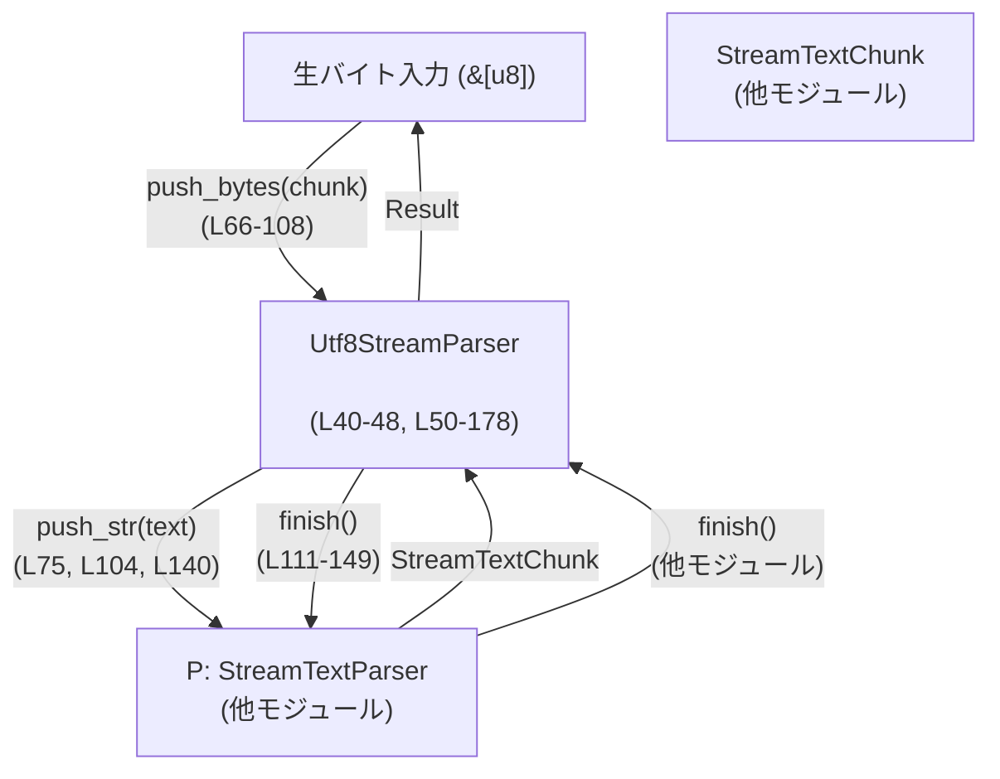
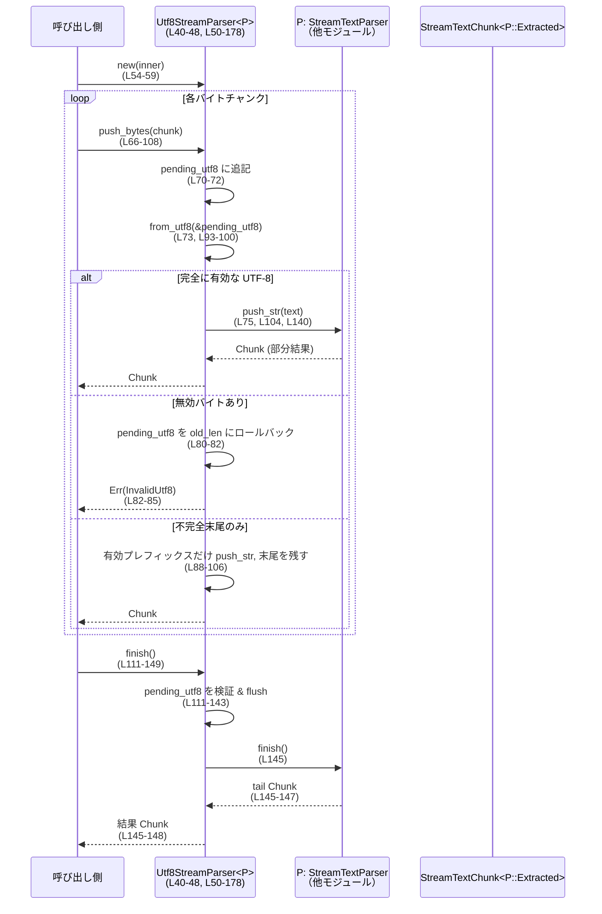

# utils/stream-parser/src/utf8_stream.rs コード解説

## 0. ざっくり一言

- 生のバイト列（`&[u8]`）を受け取り、UTF-8 文字境界をまたぐ部分コードポイントを安全にバッファしながら、内部の `StreamTextParser` に「完全な UTF-8 文字列」として渡すラッパーです（`utf8_stream.rs:L40-48, L50-78`）。
- 無効な UTF-8 シーケンスやストリーム終端での未完成コードポイントを検出し、専用のエラー型で通知します（`utf8_stream.rs:L7-19, L61-107, L111-148, L154-169`）。

---

## 1. このモジュールの役割

### 1.1 概要

- このモジュールは **ストリーミングで到着するバイト列を UTF-8 として切れ目なく処理する** ためのラッパーを提供します。
- 具体的には、`Utf8StreamParser<P>` が内部の `P: StreamTextParser` へ渡す前段として、バイト列を UTF-8 として検証・分割し、コードポイントがチャンク境界で分断されても正しく連結します（`utf8_stream.rs:L40-48, L50-78`）。
- 無効な UTF-8 が含まれる場合は、**そのチャンク全体をロールバック** し内部パーサーに影響を与えないようにしつつ、`Utf8StreamParserError` で詳細なエラー情報（位置と長さ）を返します（`utf8_stream.rs:L61-66, L70-86`）。

### 1.2 アーキテクチャ内での位置づけ

`Utf8StreamParser` は「生バイト入力」と「テキストストリームパーサー」の間に挟まる変換レイヤです。



- `StreamTextParser` と `StreamTextChunk` は同一 crate 内の他モジュールで定義されており、本ファイルからは **トレイト境界と利用方法のみ** が読み取れます（`utf8_stream.rs:L4-5, L75, L104, L140, L145-147`）。

### 1.3 設計上のポイント

- **責務分離**  
  - `Utf8StreamParser` は UTF-8 のバイト境界処理とエラーハンドリングに専念し、テキストの意味的なパースは `P: StreamTextParser` に委譲しています（`utf8_stream.rs:L40-48, L50-53, L75, L104, L140, L145`）。
- **状態管理**  
  - 内部状態は 2 つだけです：
    - `inner: P` — 内部の文字列ストリームパーサー（`utf8_stream.rs:L46`）
    - `pending_utf8: Vec<u8>` — チャンク境界にまたがる可能性のある部分 UTF-8 シーケンスを保持（`utf8_stream.rs:L47`）
- **エラーハンドリング方針**  
  - 無効な UTF-8 バイト（`error_len` が `Some`）は即座に `InvalidUtf8` エラーとして返し、**そのチャンクに由来するバイトをすべてロールバック** します（`utf8_stream.rs:L80-86`）。
  - 不完全な UTF-8 シーケンス（`error_len` が `None`）は「将来のチャンクで完了する可能性がある」とみなし、**エラーにはせずバッファに残す** か、EOF 時に `IncompleteUtf8AtEof` としてエラーにします（`utf8_stream.rs:L88-106, L111-123, L154-169`）。
- **並行性・安全性**  
  - すべての更新系メソッドは `&mut self` を受け取り、同一インスタンスへの同時アクセスをコンパイル時に禁止します（`utf8_stream.rs:L66-69, L111, L154`）。
  - UTF-8 検証は `std::str::from_utf8` を利用しており、`unsafe` は一切使用していません（`utf8_stream.rs:L73, L93-100, L113-120, L130-137, L158-167`）。

---

## 2. 主要な機能一覧

- 生バイトストリーム処理: `push_bytes` でチャンクごとのバイト列を受け取り、UTF-8 として検証・部分コードポイントをバッファ（`utf8_stream.rs:L61-109`）
- ストリーム終端処理: `finish` でバッファ内の未処理 UTF-8 を flush し、内部パーサーの `finish` を呼び出して残りをすべて取り出す（`utf8_stream.rs:L111-149`）
- 内部パーサーの取り出し: `into_inner` / `into_inner_lossy` でラップしている `P` を取り出す（`utf8_stream.rs:L151-177`）
- UTF-8 エラー表現: `Utf8StreamParserError` で無効な UTF-8 シーケンスや EOF 時の不完全シーケンスを表現（`utf8_stream.rs:L7-19`）
- テストユーティリティ: `collect_bytes` による複数チャンク入力の集約テストヘルパー（`utf8_stream.rs:L190-203`）

---

## 3. 公開 API と詳細解説

### 3.1 型一覧（構造体・列挙体など）

#### 本モジュールで定義される主な型

| 名前 | 種別 | 役割 / 用途 | 定義位置 |
|------|------|------------|----------|
| `Utf8StreamParserError` | 列挙体 | UTF-8 デコード時のエラーを表す。無効シーケンスと EOF 時の不完全シーケンスの 2 種類。 | `utf8_stream.rs:L7-19` |
| `Utf8StreamParser<P>` | 構造体 | `P: StreamTextParser` をラップし、チャンク化された `&[u8]` を UTF-8 文字列として供給するストリームパーサー。 | `utf8_stream.rs:L40-48` |

#### 依存する外部型（このファイルには定義なし）

| 名前 | 種別 | 役割 / 用途（読み取れる範囲） | 利用位置 |
|------|------|------------------------------|----------|
| `StreamTextParser` | トレイト | `push_str(&str)` と `finish()` によってテキストストリームを処理し、`StreamTextChunk` を返すパーサーと推定されます（テストから）。詳細定義はこのチャンクには現れません。 | `utf8_stream.rs:L4-5, L50-53, L75, L104, L140, L145` |
| `StreamTextChunk<T>` | 構造体 | 可視テキストと抽出結果（`extracted`）を持つチャンク。`default`, `is_empty`, `visible_text`, `extracted` などが使われています。詳細定義はこのチャンクには現れません。 | `utf8_stream.rs:L4, L70, L90, L127-148, L190-203, L220-221, L232, L255-257, L281-283` |
| `CitationStreamParser` | 構造体 | テスト用の具体的 `StreamTextParser` 実装。引用タグらしきものを処理していると推測されますが、実装はこのチャンクには現れません。 | `utf8_stream.rs:L184, L214, L226, L262, L287, L304, L321` |

### 3.2 関数・メソッド詳細（主要 5 件）

#### `Utf8StreamParser::new(inner: P) -> Utf8StreamParser<P>`

**概要**

- 内部パーサー `inner` をラップし、空の UTF-8 バッファを持つ `Utf8StreamParser` インスタンスを生成します（`utf8_stream.rs:L54-59`）。

**引数**

| 引数名 | 型 | 説明 |
|--------|----|------|
| `inner` | `P` | ラップ対象となる `StreamTextParser` 実装。 |

**戻り値**

- `Utf8StreamParser<P>`: `inner` を保持し、`pending_utf8` が空の新しいパーサー。

**内部処理の流れ**

1. `inner` をフィールドにそのまま格納（`utf8_stream.rs:L55-56`）。
2. `pending_utf8` を空 `Vec::new()` で初期化（`utf8_stream.rs:L57`）。

**Examples（使用例）**

```rust
use crate::Utf8StreamParser;
use crate::CitationStreamParser; // この型は別モジュールに定義

// UTF-8 ストリームパーサーを CitationStreamParser で初期化
let inner = CitationStreamParser::new();                       // utf8_stream.rs:L214 参照
let mut parser = Utf8StreamParser::new(inner);                 // utf8_stream.rs:L54-59

assert!(parser.finish().unwrap().is_empty());                  // まだ何も食わせていないので空（utf8_stream.rs:L111-149）
```

**Errors / Panics**

- `new` 自体はエラーもパニックもしません（単純な構造体初期化のみ）。

**Edge cases（エッジケース）**

- 特記事項なし。`inner` がどのような状態でもそのまま保持します。

**使用上の注意点**

- `inner` には `StreamTextParser` 制約が付きます（`utf8_stream.rs:L50-53`）。
- 生成後は `push_bytes` / `finish` を通してのみストリームを操作します。

---

#### `Utf8StreamParser::push_bytes(&mut self, chunk: &[u8]) -> Result<StreamTextChunk<P::Extracted>, Utf8StreamParserError>`

**概要**

- 生バイトチャンク `chunk` を内部バッファ `pending_utf8` に追加し、UTF-8 として解釈可能な部分を `inner.push_str` に渡します（`utf8_stream.rs:L66-78, L93-106`）。
- 無効な UTF-8 バイトが含まれる場合は、そのチャンクに由来する変更を **ロールバック** し、`Utf8StreamParserError::InvalidUtf8` を返します（`utf8_stream.rs:L70-72, L80-86`）。
- 不完全な末尾コードポイントはバッファに残し、エラーにはしません（`utf8_stream.rs:L88-106`）。

**引数**

| 引数名 | 型 | 説明 |
|--------|----|------|
| `chunk` | `&[u8]` | 新たにストリームに追加するバイト列チャンク。 |

**戻り値**

- 成功 (`Ok`) 時: `StreamTextChunk<P::Extracted>`  
  - 新たに `inner` から出力された可視テキストと抽出結果。  
  - チャンク境界をまたぐ未完成コードポイントは `pending_utf8` に残るため、この戻り値には含まれません。
- 失敗 (`Err`) 時: `Utf8StreamParserError`  
  - `InvalidUtf8 { valid_up_to, error_len }` のみ（この関数では `IncompleteUtf8AtEof` は発生しません）。

**内部処理の流れ**

1. **現在のバッファ長を保存**  
   - `let old_len = self.pending_utf8.len();`（`utf8_stream.rs:L70`）。
2. **新チャンクを追記**  
   - `pending_utf8.extend_from_slice(chunk);`（`utf8_stream.rs:L71`）。
3. **全体を UTF-8 として検証**  
   - `std::str::from_utf8(&self.pending_utf8)` を実行（`utf8_stream.rs:L73`）。
4. ケース 1: `Ok(text)` の場合（完全に有効な UTF-8）
   - `inner.push_str(text)` を呼び出してテキストを渡す（`utf8_stream.rs:L74-76`）。
   - `pending_utf8.clear()` でバッファを空にし（`utf8_stream.rs:L76`）、`out` をそのまま返す（`utf8_stream.rs:L77-78`）。
5. ケース 2: `Err(err)` の場合
   1. `err.error_len()` が `Some(error_len)`（無効バイトを含む）なら:
      - `pending_utf8.truncate(old_len);` で **今回のチャンク分の追記をロールバック**（`utf8_stream.rs:L80-82`）。
      - `Utf8StreamParserError::InvalidUtf8 { valid_up_to: err.valid_up_to(), error_len }` を返す（`utf8_stream.rs:L82-85`）。
   2. `error_len` が `None`（末尾が不完全な UTF-8 シーケンス）なら:
      - `let valid_up_to = err.valid_up_to();` を取得（`utf8_stream.rs:L88`）。
      - `valid_up_to == 0`（全体が「未完成」）なら:
        - 何も `inner` に渡さず、空の `StreamTextChunk::default()` を返す（`utf8_stream.rs:L89-91`）。  
          このとき `pending_utf8` には全バイトが残ります。
      - `valid_up_to > 0`（先頭に有効な UTF-8 がある）なら:
        - 先頭 `valid_up_to` バイトを `from_utf8` で再度検証（`utf8_stream.rs:L93-100`）。
        - ここが不正な場合はロールバック＆`InvalidUtf8`（`utf8_stream.rs:L95-101`）。
        - 有効なら `inner.push_str(text)` へ渡す（`utf8_stream.rs:L104`）。
        - `pending_utf8.drain(..valid_up_to)` で有効なプレフィックス部分をバッファから削除し、末尾の不完全シーケンスのみ残す（`utf8_stream.rs:L105`）。

**Examples（使用例）**

1. **チャンクをまたぐコードポイント（正常系）**

```rust
use crate::{Utf8StreamParser, CitationStreamParser, StreamTextChunk};

// "é" が 0xC3 0xA9 に分割されて到着するケース（utf8_stream.rs:L207-222 を簡略化）
let mut parser = Utf8StreamParser::new(CitationStreamParser::new());

let out1 = parser.push_bytes(b"A\xC3").unwrap();
assert!(out1.is_empty());                                  // 末尾が未完成なので何も確定しない

let out2 = parser.push_bytes(b"\xA9Z").unwrap();           // é + Z が確定
assert_eq!(out2.visible_text, "AéZ");                      // utf8_stream.rs:L220 参照
```

1. **無効な UTF-8 によるロールバック**

```rust
use crate::{Utf8StreamParser, CitationStreamParser, Utf8StreamParserError};

let mut parser = Utf8StreamParser::new(CitationStreamParser::new());

// 0xC3 は 2 バイト文字のリードバイトなので単独では未完成（utf8_stream.rs:L225-233）
let first = parser.push_bytes(&[0xC3]).unwrap();
assert!(first.is_empty());

// 次のチャンクが不正な継続バイト 0x28 なのでエラー（utf8_stream.rs:L234-244）
let err = parser.push_bytes(&[0x28]).unwrap_err();
assert_eq!(
    err,
    Utf8StreamParserError::InvalidUtf8 { valid_up_to: 0, error_len: 1 }
);
```

**Errors / Panics**

- `Err(Utf8StreamParserError::InvalidUtf8 { .. })` が発生する条件:
  - `pending_utf8`（以前のバイト + 今回の `chunk`）に **無効な UTF-8 バイトシーケンス** が含まれるとき（`utf8_stream.rs:L80-86`）。
- `IncompleteUtf8AtEof` はこの関数では返りません（EOF の概念は `finish` 側にあります）。
- パニックの可能性:
  - 標準ライブラリ呼び出しと範囲チェック付きスライスのみを使用しており、明示的な `panic!` や `unwrap` はありません（`utf8_stream.rs:L70-107`）。  
    `from_utf8` による `valid_up_to` は常にスライス長以下であるため、`[..valid_up_to]` と `drain(..valid_up_to)` は安全です。

**Edge cases（エッジケース）**

- **空チャンク `chunk.is_empty()`**  
  - `pending_utf8.extend_from_slice(chunk)` は no-op となり、その時点の `pending_utf8` を UTF-8 として再検証します（`utf8_stream.rs:L70-73`）。  
    - すでに完全な UTF-8 であれば `inner.push_str` が呼ばれます。
    - 不完全な UTF-8 であれば `valid_up_to == 0` となり、空チャンクが返るだけです。
- **常に「未完成」のシーケンスを送り続ける場合**  
  - `error_len == None` かつ `valid_up_to == 0` のルートでは、`pending_utf8` が縮小されないため、入力に応じてバッファが増え続ける可能性があります（`utf8_stream.rs:L88-91`）。  
    悪意ある入力でメモリ圧迫を招きうる点に注意が必要です。
- **有効なプレフィックス + 未完成末尾**  
  - 先頭部分のみ `inner` に渡し、末尾の未完成バイトは次チャンクまで保留されます（`utf8_stream.rs:L88-106`）。  
    テスト `utf8_stream_parser_handles_split_code_points_across_chunks` がこの挙動を確認しています（`utf8_stream.rs:L207-222`）。

**使用上の注意点**

- 戻り値の `Err` は必ずハンドリングする必要があります。無視すると内部状態が古いまま残り、アプリケーション全体の整合性が崩れる可能性があります。
- 同一インスタンスに対して並行に `push_bytes` を呼び出すことはコンパイル時に禁止されますが（`&mut self`）、複数スレッドから別インスタンスを利用することは `P` の `Send`/`Sync` 実装に依存します（このファイルからは不明）。
- UTF-8 でないバイト列を受け取る可能性があるストリームの場合、エラー発生時のリトライ戦略やログ出力を上位で設計する必要があります。

---

#### `Utf8StreamParser::finish(&mut self) -> Result<StreamTextChunk<P::Extracted>, Utf8StreamParserError>`

**概要**

- これ以上バイトが到着しないことを示す EOF 処理です。
- `pending_utf8` に残っているバイトを UTF-8 として検証し、完全なコードポイントであれば `inner.push_str` へ渡して flush します（`utf8_stream.rs:L111-143`）。
- 最後に `inner.finish()` を呼び出し、その結果を返り値のチャンクにマージします（`utf8_stream.rs:L145-148`）。

**引数**

| 引数名 | 型 | 説明 |
|--------|----|------|
| （なし） |  | `&mut self` のみ。 |

**戻り値**

- 成功 (`Ok`) 時: 直前の `push_bytes` 以降に確定した可視テキストと抽出結果をまとめた `StreamTextChunk<P::Extracted>`。
- 失敗 (`Err`) 時:  
  - `Utf8StreamParserError::InvalidUtf8`  
  - または `Utf8StreamParserError::IncompleteUtf8AtEof`（未完成コードポイントが残っている場合）

**内部処理の流れ**

1. `pending_utf8` が空かどうかを確認（`utf8_stream.rs:L111-112`）。
2. 空でない場合、`from_utf8(&self.pending_utf8)` を試みる（`utf8_stream.rs:L113`）。
   - 成功 (`Ok(_)`) なら何もしない（後で再度 decode して flush、`utf8_stream.rs:L114`）。
   - 失敗 (`Err(err)`) なら:
     - `err.error_len().is_some()` → `InvalidUtf8` エラーを返して終了（`utf8_stream.rs:L116-120`）。
     - `error_len == None` → `IncompleteUtf8AtEof` を返して終了（`utf8_stream.rs:L122`）。
3. ここまで来た時点で `pending_utf8` は
   - 空、または
   - 完全に有効な UTF-8 で構成された状態とみなせます。
4. `pending_utf8.is_empty()` を再度確認し（`utf8_stream.rs:L127`）:
   - 空なら `out = StreamTextChunk::default()`（`utf8_stream.rs:L127-129`）。
   - 空でないなら:
     - `from_utf8(&self.pending_utf8)` でテキストを取得（`utf8_stream.rs:L130-132`）。
     - エラー時は `InvalidUtf8` を返す（理論上ここには到達しない想定ですが、コード上は再チェックされています、`utf8_stream.rs:L132-137`）。
     - `inner.push_str(text)` を呼び出し、`pending_utf8.clear()` でバッファを空にする（`utf8_stream.rs:L140-142`）。
5. `let mut tail = self.inner.finish();` で内部パーサーの終端処理を呼ぶ（`utf8_stream.rs:L145`）。
6. `out.visible_text.push_str(&tail.visible_text);` および `out.extracted.append(&mut tail.extracted);` で出力をマージ（`utf8_stream.rs:L146-147`）。
7. `Ok(out)` を返す（`utf8_stream.rs:L148`）。

**Examples（使用例）**

```rust
use crate::{Utf8StreamParser, CitationStreamParser};

// テストヘルパー collect_bytes と同等の使い方（utf8_stream.rs:L190-203）
let mut parser = Utf8StreamParser::new(CitationStreamParser::new());

for chunk in [b"A\xC3", b"\xA9", b"Z"] {
    let _ = parser.push_bytes(chunk).unwrap();
}

// 全ての入力を終えたら finish を呼び出す
let out = parser.finish().unwrap();
println!("visible = {}", out.visible_text);
```

**Errors / Panics**

- `Err(Utf8StreamParserError::InvalidUtf8)`:
  - `pending_utf8` に無効な UTF-8 バイト列が含まれる場合（`utf8_stream.rs:L113-121` または `L130-137`）。
- `Err(Utf8StreamParserError::IncompleteUtf8AtEof)`:
  - `pending_utf8` が不完全なコードポイントで終了しており、`error_len == None` のケース（`utf8_stream.rs:L113-123`）。
  - テスト `utf8_stream_parser_errors_on_incomplete_code_point_at_eof` がこのケースを検証しています（`utf8_stream.rs:L286-300`）。
- パニックは明示的にはありません。

**Edge cases（エッジケース）**

- **`pending_utf8` が空**  
  - すぐに `StreamTextChunk::default()` を初期出力として使い、`inner.finish()` の結果だけが反映されます（`utf8_stream.rs:L127-129, L145-148`）。
- **EOF 時に未完成コードポイントが残る**  
  - 例: `[0xE2, 0x82]` のように 3 バイト文字の 2 バイトだけが残っている場合、`IncompleteUtf8AtEof` を返します（`utf8_stream.rs:L289-299`）。
- **`inner.finish()` が非空のチャンクを返す**  
  - `out` にマージされるので、クライアント側からは `push_bytes` 最後の戻り値 + `finish` の戻り値を単に足し合わせたのと同等の結果になります（`utf8_stream.rs:L145-148`）。

**使用上の注意点**

- ストリーム処理を終了する際は **必ず `finish()` を 1 回だけ呼び出す** 前提で設計されています。複数回呼び出すと、`inner.finish()` の挙動によっては二重終了になる可能性があります（`inner.finish()` の仕様はこのチャンクには現れません）。
- `finish()` の前に未処理バイトを残したまま `into_inner()` を呼ぶと、`IncompleteUtf8AtEof` または `InvalidUtf8` が返る可能性があります（`utf8_stream.rs:L154-169`）。

---

#### `Utf8StreamParser::into_inner(self) -> Result<P, Utf8StreamParserError>`

**概要**

- ラップしている内部パーサー `P` を取り出します。
- ただし、UTF-8 として検証済みでない `pending_utf8` が残っている場合はエラーを返して取り出しを拒否します（`utf8_stream.rs:L151-169`）。

**引数**

| 引数名 | 型 | 説明 |
|--------|----|------|
| （なし） |  | `self` を所有権ごとムーブします。 |

**戻り値**

- 成功 (`Ok`) 時: 内部パーサー `P`。
- 失敗 (`Err`) 時:
  - `InvalidUtf8` または `IncompleteUtf8AtEof`。

**内部処理の流れ**

1. `pending_utf8.is_empty()` を確認し、空であれば `Ok(self.inner)` を返す（`utf8_stream.rs:L155-157`）。
2. 空でない場合:
   - `std::str::from_utf8(&self.pending_utf8)` で UTF-8 検証（`utf8_stream.rs:L158`）。
   - `Ok(_)` なら `Ok(self.inner)` を返す（`utf8_stream.rs:L159-160`）。  
     ※ このとき `pending_utf8` 内の有効なテキストは **内部パーサーには渡されません**。
   - `Err(err)` なら:
     - `err.error_len().is_some()` → `InvalidUtf8`（`utf8_stream.rs:L161-165`）。
     - `error_len == None` → `IncompleteUtf8AtEof`（`utf8_stream.rs:L167`）。

**Examples（使用例）**

```rust
use crate::{Utf8StreamParser, CitationStreamParser, Utf8StreamParserError};

let mut parser = Utf8StreamParser::new(CitationStreamParser::new());

// 部分コードポイントをバッファ（utf8_stream.rs:L303-310 と同様）
let _ = parser.push_bytes(&[0xC3]).unwrap();

// pending_utf8 が残っているので into_inner はエラー（utf8_stream.rs:L312-317）
let err = parser.into_inner().unwrap_err();
assert_eq!(err, Utf8StreamParserError::IncompleteUtf8AtEof);
```

**Errors / Panics**

- `InvalidUtf8`:
  - `pending_utf8` に無効な UTF-8 バイトが含まれているとき（`utf8_stream.rs:L158-165`）。
- `IncompleteUtf8AtEof`:
  - `pending_utf8` が不完全なコードポイントのままであるとき（`error_len == None`、`utf8_stream.rs:L167`）。
- パニックはありません。

**Edge cases（エッジケース）**

- **`pending_utf8` が有効な UTF-8 だが未 flush の場合**  
  - `from_utf8` は `Ok(_)` となり、そのまま `inner` を返しますが、`pending_utf8` の内容は `inner` に渡されず **ドロップされます**（`utf8_stream.rs:L158-160`）。  
    このケースはドキュコメントで「flush したければ `finish` を先に呼ぶように」と注意書きがあります（`utf8_stream.rs:L151-153`）。
- **`finish` 前に `into_inner` を使うケース**  
  - テストで直接はカバーされていませんが、仕様上「未 flush のテキストを捨ててよいかどうか」を呼び出し側が判断する必要があります。

**使用上の注意点**

- **テキストを失いたくない場合は、必ず `finish()` を先に呼び、その後で `into_inner()` を使う** 必要があります（`utf8_stream.rs:L151-153`）。
- UTF-8 エラーを厳密に扱うための API であり、バッファに不正/未完成 UTF-8 が残っている場合は `P` を返さない設計になっています。  
  バイト列を完全に消費できていることの確認に利用できます。

---

#### `Utf8StreamParser::into_inner_lossy(self) -> P`

**概要**

- `pending_utf8` の内容を一切検証・flush せず、そのまま内部パーサー `P` を取り出します（`utf8_stream.rs:L172-177`）。
- ドキュコメントにある通り、**chunk 境界にまたがる部分コードポイントが黙って破棄される可能性** があります（`utf8_stream.rs:L172-175`）。

**引数**

| 引数名 | 型 | 説明 |
|--------|----|------|
| （なし） |  | `self` を所有権ごとムーブします。 |

**戻り値**

- 内部パーサー `P`。`pending_utf8` のバイト列は破棄されます。

**内部処理の流れ**

1. 何も検証せず `self.inner` をそのまま返す（`utf8_stream.rs:L175-176`）。

**Examples（使用例）**

```rust
use crate::{Utf8StreamParser, CitationStreamParser};

let mut parser = Utf8StreamParser::new(CitationStreamParser::new());

// 部分コードポイントをバッファ（utf8_stream.rs:L323-327 と同様）
let _ = parser.push_bytes(&[0xC3]).unwrap();

// バッファ内容を気にせず内部パーサーを取り出す
let mut inner = parser.into_inner_lossy();

// inner.finish() しても何も出力されない（バッファは捨てられている、utf8_stream.rs:L329-331）
assert!(inner.finish().is_empty());
```

**Errors / Panics**

- エラーは返しません。
- パニックもありません。

**Edge cases（エッジケース）**

- `pending_utf8` に無効または未完の UTF-8 が含まれていても、何も検証されずに破棄されます。
- `inner` 側が内部にバッファを持っている場合、その内容には影響しません。`inner.finish()` の挙動は `StreamTextParser` の仕様次第です。

**使用上の注意点**

- テキストロスを許容するケース（例: エラー回復のために内部パーサーだけ再利用したい場合）でのみ使用するべきです。
- UTF-8 の整合性を保証したい場合は、`finish()` と `into_inner()` を組み合わせることを推奨します。

---

### 3.3 その他の関数（補助・テスト用）

| 関数名 | 種別 | 役割（1 行） | 定義位置 |
|--------|------|--------------|----------|
| `fmt(&self, f: &mut fmt::Formatter<'_>)` | メソッド（`impl Display`） | `Utf8StreamParserError` を人間可読なメッセージに整形する（`invalid UTF-8...` など）。 | `utf8_stream.rs:L21-35` |
| `collect_bytes(parser, chunks)` | テストヘルパー関数 | 指定したチャンク列を順に `push_bytes` し、最後に `finish` して結果を 1 つの `StreamTextChunk` にまとめる。 | `utf8_stream.rs:L190-203` |
| 各種 `#[test]` 関数 | テスト | UTF-8 分割/ロールバック/EOF/into_inner 系の挙動を検証する（詳細は後述）。 | `utf8_stream.rs:L206-332` |

---

## 4. データフロー

### 4.1 代表的シナリオ：複数チャンクからのテキスト復元

以下は `collect_bytes` テストヘルパー（`utf8_stream.rs:L190-203`）と、`utf8_stream_parser_handles_split_code_points_across_chunks` テスト（`utf8_stream.rs:L207-222`）から読み取れる典型的な処理フローです。



この図から分かるポイント:

- `Utf8StreamParser` は入力ごとに **1 回の UTF-8 検証** を行い、必要に応じて前方プレフィックスだけを `inner` に送ります。
- ストリーム終端時には、`pending_utf8` と `inner` の両方を flush して 1 つの `StreamTextChunk` にまとめています（`utf8_stream.rs:L127-148`）。

---

## 5. 使い方（How to Use）

### 5.1 基本的な使用方法

ストリーミング入力（ネットワーク、ファイルなど）のバイトチャンクを、UTF-8 として正しく扱いながら `StreamTextParser` に渡す基本パターンです。

```rust
use crate::{Utf8StreamParser, CitationStreamParser, StreamTextChunk};
use std::io::{self, Read};

// 1. 内部パーサーを用意してラップする（utf8_stream.rs:L54-59）
let inner = CitationStreamParser::new();
let mut parser = Utf8StreamParser::new(inner);

// 2. 入力ストリームからバイトチャンクを読み取りつつ push_bytes
let mut stdin = io::stdin();
let mut buf = [0u8; 4096];

loop {
    let n = stdin.read(&mut buf)?;
    if n == 0 {
        break; // EOF
    }

    // エラーを必ずハンドリングする（utf8_stream.rs:L80-86 の InvalidUtf8 など）
    let chunk: StreamTextChunk<String> = match parser.push_bytes(&buf[..n]) {
        Ok(c) => c,
        Err(e) => {
            eprintln!("invalid UTF-8: {e}");
            // 適宜リトライ・中断などを判断
            break;
        }
    };

    // 中間結果の利用
    if !chunk.is_empty() {
        println!("visible: {}", chunk.visible_text);
        for extracted in chunk.extracted {
            println!("extracted: {}", extracted);
        }
    }
}

// 3. 最後に finish() で残りを flush（utf8_stream.rs:L111-149）
let tail = parser.finish()?;
if !tail.is_empty() {
    println!("tail visible: {}", tail.visible_text);
}
```

### 5.2 よくある使用パターン

1. **テスト用のまとめ処理（`collect_bytes` パターン）**

   - テストヘルパー `collect_bytes`（`utf8_stream.rs:L190-203`）は、複数チャンクをまとめて 1 つの結果に統合する実装例です。

   ```rust
   use crate::{Utf8StreamParser, CitationStreamParser, StreamTextChunk};
   use crate::Utf8StreamParserError;

   fn collect_bytes(
       parser: &mut Utf8StreamParser<CitationStreamParser>,
       chunks: &[&[u8]],
   ) -> Result<StreamTextChunk<String>, Utf8StreamParserError> {
       let mut all = StreamTextChunk::default();           // L194
       for chunk in chunks {
           let next = parser.push_bytes(chunk)?;           // L196
           all.visible_text.push_str(&next.visible_text);  // L197
           all.extracted.extend(next.extracted);           // L198
       }
       let tail = parser.finish()?;                        // L200
       all.visible_text.push_str(&tail.visible_text);      // L201
       all.extracted.extend(tail.extracted);               // L202
       Ok(all)
   }
   ```

2. **UTF-8 エラーからのリカバリ**

   - `utf8_stream_parser_rolls_back_on_invalid_utf8_chunk` テスト（`utf8_stream.rs:L224-258`）では、無効なチャンクで一度エラーになっても、次のチャンクで正常動作に戻れることを検証しています。

   ```rust
   let mut parser = Utf8StreamParser::new(CitationStreamParser::new());

// ...中略...

   // 無効なチャンクでエラー
   let err = parser.push_bytes(&[0x28]).unwrap_err();

   // その後の有効チャンクは正常に処理される（状態はロールバック済み）
   let second = parser.push_bytes(&[0xA9, b'x']).unwrap();

   ```

### 5.3 よくある間違い

```rust
use crate::{Utf8StreamParser, CitationStreamParser};

// 間違い例: finish() を呼ばずに into_inner() だけ呼ぶ
let mut parser = Utf8StreamParser::new(CitationStreamParser::new());
let _ = parser.push_bytes(b"A\xC3").unwrap();       // "A" + 部分コードポイント

// まだ pending_utf8 が残っているので Err になる可能性がある（utf8_stream.rs:L154-169）
let inner = parser.into_inner().unwrap();           // <-- IncompleteUtf8AtEof の可能性（誤用）

// 正しい例: まず finish() で flush する
let mut parser = Utf8StreamParser::new(CitationStreamParser::new());
let _ = parser.push_bytes(b"A\xC3\xA9").unwrap();
let _tail = parser.finish().unwrap();               // pending_utf8 が空になる
let inner = parser.into_inner().unwrap();           // ここで安全に inner が取り出せる
```

その他の誤用例:

- `push_bytes` の `Result` を無視する（`?` や `unwrap` で必ず扱うべき）。
- 無効な UTF-8 を頻繁に送信するストリームで、エラー時のログやアラートを設計しない。
- `into_inner_lossy` を誤って使い、テキストロスが起きていることに気づかない。

### 5.4 使用上の注意点（まとめ）

- **UTF-8 の前提**:  
  - このモジュールは「入力が UTF-8 であること」を前提としつつ、エラー時に呼び出し側で復旧戦略を取れるように設計されています。
- **エラー処理**:
  - `InvalidUtf8` はチャンク自体が無効なケースで発生し、チャンク由来の変更はロールバックされます（`utf8_stream.rs:L80-86`）。
  - `IncompleteUtf8AtEof` は EOF 時や `into_inner` 時に未完成コードポイントが残っている場合に発生します（`utf8_stream.rs:L111-123, L154-169`）。
- **並行性**:
  - `&mut self` により同一インスタンスへの並列アクセスはコンパイル時に禁止されます。`Utf8StreamParser` 自体はスレッドセーフかどうかのトレイト境界（`Send`, `Sync`）は設けておらず、`P` の実装に依存します（このチャンクには情報がありません）。
- **メモリ使用**:
  - 不正・未完成 UTF-8 を延々と送り続けると `pending_utf8` が増大する可能性があります（`utf8_stream.rs:L88-91`）。信頼できない入力源に対しては上位レイヤーで入力サイズ制限などを検討する必要があります。

---

## 6. 変更の仕方（How to Modify）

### 6.1 新しい機能を追加する場合

例として、「UTF-8 エラー発生時にログ出力を行いたい」場合の変更の入口を示します。

1. **エラー検出箇所の特定**
   - `push_bytes` 内の `InvalidUtf8` 生成部分（`utf8_stream.rs:L80-86, L95-101`）。
   - `finish` 内の `InvalidUtf8` / `IncompleteUtf8AtEof` 生成部分（`utf8_stream.rs:L113-123, L130-137`）。
   - `into_inner` 内のエラー生成部分（`utf8_stream.rs:L158-167`）。
2. **ログの挿入**
   - 例えば `Err` を返す直前に `log::warn!` などを追加する。
3. **テストの追加**
   - 既存テスト `utf8_stream_parser_rolls_back_on_invalid_utf8_chunk` などを参考に、エラーが発生するパスを使ったテストを追加する（`utf8_stream.rs:L224-283`）。

### 6.2 既存の機能を変更する場合

#### UTF-8 エラー時のロールバック戦略を変えたい場合

- 関連箇所:
  - `push_bytes` 内の `pending_utf8.truncate(old_len)`（`utf8_stream.rs:L80-82, L96-101`）。
- 影響範囲:
  - この振る舞いに依存しているテスト:
    - チャンク全体ロールバック: `utf8_stream_parser_rolls_back_entire_chunk_when_invalid_byte_follows_valid_prefix`（`utf8_stream.rs:L260-283`）。
    - ロールバック後も続行可能であること: `utf8_stream_parser_rolls_back_on_invalid_utf8_chunk`（`utf8_stream.rs:L224-258`）。
- 注意点:
  - ロールバックせず「有効プレフィックスだけ採用する」設計に変えると、現在のテスト期待値と互換性がなくなります。既存利用コードがチャンクのアトミック性を前提にしている場合にも影響します。

#### EOF 時の扱いを緩和したい場合

- 関連箇所:
  - `finish` 内の `IncompleteUtf8AtEof` 返却部分（`utf8_stream.rs:L111-123`）。
  - `into_inner` 内の同様のパス（`utf8_stream.rs:L158-167`）。
- 注意点:
  - EOF で未完成シーケンスを黙って捨てるように変更すると、現在のテスト `utf8_stream_parser_errors_on_incomplete_code_point_at_eof` と `utf8_stream_parser_into_inner_errors_when_partial_code_point_is_buffered` の期待値が変わります（`utf8_stream.rs:L285-317`）。

---

## 7. 関連ファイル・モジュール

このモジュールと密接に関係するが、このチャンクには実装が現れないものを一覧にします。

| パス / 型名 | 役割 / 関係 |
|------------|------------|
| `crate::StreamTextParser` | `Utf8StreamParser<P>` の内部で利用されるトレイト。`push_str(&str) -> StreamTextChunk<P::Extracted>` と `finish() -> StreamTextChunk<P::Extracted>` に類するインターフェースを持つと推測されますが、定義はこのチャンクには現れません（`utf8_stream.rs:L4-5, L50-53, L75, L104, L140, L145`）。 |
| `crate::StreamTextChunk<T>` | 可視テキストと抽出された値を格納するチャンク。`Utf8StreamParser` の入出力に使われます（`utf8_stream.rs:L4, L70, L90, L127-148, L190-203`）。 |
| `crate::CitationStreamParser` | テストで使用される具体的な `StreamTextParser` 実装。`Utf8StreamParser` の典型的な利用例として参照できます（`utf8_stream.rs:L184, L214, L226, L262, L287, L304, L321`）。 |

---

以上が、本ファイル `utils/stream-parser/src/utf8_stream.rs` に基づく機能・データフロー・エラー挙動の整理です。このチャンク以外のコードは参照していないため、それらに関する詳細（`StreamTextParser` の厳密なインターフェースや `StreamTextChunk` の全フィールドなど）は「このチャンクには現れない」情報として不明です。
