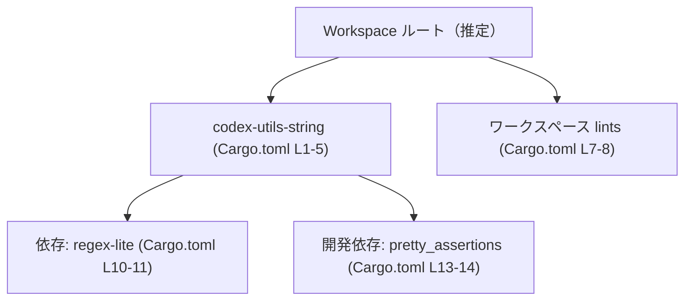
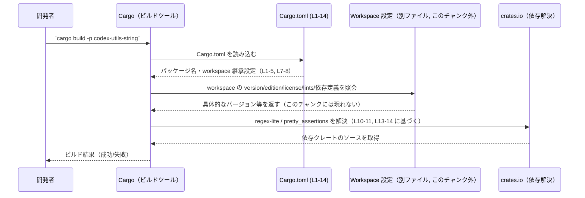

# utils/string/Cargo.toml

## 0. ざっくり一言

`codex-utils-string` クレートの Cargo マニフェストファイルであり、パッケージ情報・ワークスペース継承設定・lint 設定・依存関係（通常／テスト用）を定義しています。  
（根拠: `Cargo.toml:L1-5, L7-8, L10-11, L13-14`）

---

## 1. このモジュールの役割

### 1.1 概要

- このファイルは、Rust クレート `codex-utils-string` の **ビルド設定と依存関係** を Cargo に伝えるための設定ファイルです。（根拠: `Cargo.toml:L1-3`）
- バージョン・エディション・ライセンス・lint 設定・依存クレートをすべて **ワークスペース側の設定から継承する構成** になっています。（根拠: `Cargo.toml:L3-5, L8, L11, L14`）

### 1.2 アーキテクチャ内での位置づけ

- `codex-utils-string` は、Cargo ワークスペースに属する 1 クレートであり、`version` / `edition` / `license` / `lints` / `regex-lite` / `pretty_assertions` をワークスペースから継承するように指定されています。（根拠: `Cargo.toml:L2-5, L7-8, L10-11, L13-14`）
- 実行時に利用される依存関係として `regex-lite`、開発時（テストなど）に利用される依存関係として `pretty_assertions` が定義されていますが、その具体的な利用箇所・API はこのファイルからは分かりません。（根拠: `Cargo.toml:L10-11, L13-14`）

依存関係の構造を簡略化した Mermaid 図です（ビルド時の依存関係レベルの関係を示す図であり、実行時データフローではありません）。



> Workspace ルート自体のファイル（例: ルートの `Cargo.toml`）はこのチャンクには含まれていないため、ノード `Workspace ルート` は Cargo の一般的な構造に基づく概念的なものです。

### 1.3 設計上のポイント

- **ワークスペース継承を徹底**  
  - `version.workspace = true` / `edition.workspace = true` / `license.workspace = true` により、これらの値はワークスペース側で一元管理されます。（根拠: `Cargo.toml:L3-5`）
  - `[lints]` テーブルでも `workspace = true` が指定され、lint 設定も共通化されています。（根拠: `Cargo.toml:L7-8`）
- **依存バージョンの一元管理**  
  - `regex-lite = { workspace = true }` / `pretty_assertions = { workspace = true }` とすることで、依存クレートのバージョンもワークスペース側で統一されています。（根拠: `Cargo.toml:L10-11, L13-14`）
- **状態やロジックは持たない設定ファイル**  
  - このファイルは TOML 形式の設定のみであり、関数・構造体・実行ロジックやエラーハンドリング・並行処理の実装は含まれていません。（根拠: コード中に Rust ソースコードらしき定義が一切存在しないこと `Cargo.toml:L1-14`）

---

## 2. 主要な機能一覧（このファイルが担う役割）

このファイルはコードではないため「関数の機能」はありませんが、設定上の役割を機能として整理します。

- パッケージ宣言: クレート名 `codex-utils-string` と、その version / edition / license をワークスペースから継承する設定。（根拠: `Cargo.toml:L1-5`）
- lint 設定の継承: `[lints]` テーブルで、ワークスペース共通の lint 設定を利用する指定。（根拠: `Cargo.toml:L7-8`）
- 実行時依存関係の宣言: `regex-lite` をワークスペースで定義された内容で利用する指定。（根拠: `Cargo.toml:L10-11`）
- 開発時（テスト等）依存関係の宣言: `pretty_assertions` をワークスペースで定義された内容で利用する指定。（根拠: `Cargo.toml:L13-14`）

---

## 3. 公開 API と詳細解説

このファイルには関数・構造体・列挙体などの **Rust の公開 API 定義は存在しません**。  
以下では、要求された「インベントリー表」などを、このファイルの性質に合わせて示します。

### 3.1 型一覧（構造体・列挙体など）

- このファイルは Cargo の設定ファイルであり、Rust の型定義は一切含まれていません。（根拠: `Cargo.toml:L1-14`）

| 名前 | 種別 | 役割 / 用途 | 定義位置 |
|------|------|-------------|----------|
| なし | -    | -           | -        |

### 3.1 補足: コンポーネントインベントリー（このファイルから分かる単位）

コードではなく設定単位の「コンポーネント」を整理します。

| コンポーネント | 種別 | 役割 / 内容 | 定義位置 |
|----------------|------|-------------|----------|
| `codex-utils-string` | パッケージ | ワークスペース内の 1 クレートとして宣言。名前のみから用途は推測できますが、API や中身はこのファイルからは不明です。 | `Cargo.toml:L1-2` |
| `version.workspace = true` | 設定 | クレートのバージョンをワークスペース側から継承する指定。 | `Cargo.toml:L3` |
| `edition.workspace = true` | 設定 | Rust エディション（例: 2021 など）をワークスペース側から継承する指定。 | `Cargo.toml:L4` |
| `license.workspace = true` | 設定 | ライセンス表記をワークスペース側から継承する指定。 | `Cargo.toml:L5` |
| `[lints]` + `workspace = true` | lint 設定 | lint 設定をワークスペースの共通設定から継承する指定。 | `Cargo.toml:L7-8` |
| `regex-lite`（workspace） | 依存関係 | 実行時に利用する依存クレートを、ワークスペース側の定義で参照する設定。クレートの具体的な機能はこのファイルからは不明です。 | `Cargo.toml:L10-11` |
| `pretty_assertions`（workspace） | 開発依存関係 | テスト等の開発時に利用する依存クレートを、ワークスペース側の定義で参照する設定。具体的な用途はこのファイルからは不明です。 | `Cargo.toml:L13-14` |

### 3.2 関数詳細（最大 7 件）

- このファイルには関数が存在しないため、詳細解説対象となる関数も存在しません。（根拠: `Cargo.toml:L1-14`）
- 公開 API やエラー処理・並行性の扱いは、**クレート本体の Rust ソースコード側** に実装されていると考えられますが、それらはこのチャンクには現れていません。（このファイルからは不明）

### 3.3 その他の関数

- 該当なし（設定ファイルのため Rust 関数は定義されていません）。（根拠: `Cargo.toml:L1-14`）

---

## 4. データフロー

このファイルには「実行時のデータフロー」や「関数呼び出し」は定義されていません。  
ここでは、**ビルド時に Cargo がこのファイルをどのように利用するか** という観点での処理フローを示します。

### 4.1 ビルド時の処理フロー（概念図）



- 上記は Cargo の一般的な挙動に基づく高レベルなイメージ図であり、**実際の実装は Cargo 側にあり、このリポジトリのコードには含まれていません**。
- このファイル自体からは、どの関数がどの依存クレートをどう呼び出すかといった詳細なコールグラフやデータフローは分かりません。

---

## 5. 使い方（How to Use）

### 5.1 基本的な使用方法（このファイルの役割）

- 開発者はこの `Cargo.toml` を編集することで、`codex-utils-string` クレートの **依存関係やメタデータ** を管理します。（根拠: `Cargo.toml:L1-5, L10-11, L13-14`）
- 実際の利用は `cargo build`, `cargo test`, `cargo run` などの Cargo コマンドを通じて行われます。（このチャンクには Cargo コマンドの呼び出しは書かれていませんが、Cargo の通常の使い方として一般的です）

#### 例: 依存クレートを追加する場合のイメージ

以下は、このクレート専用の依存クレートを追加したい場合の例です（実際のファイルには存在しない追記例です）。

```toml
[dependencies]                         # 依存クレートの一覧セクション（Cargo.toml:L10）
regex-lite = { workspace = true }     # 既存の依存。バージョンは workspace から継承（L11）
serde = "1.0"                          # 例: このクレートだけで使う serde を直書きする場合
```

- 実際のファイルでは `serde` の行は存在しませんが、このように `[dependencies]` セクションに追記する形になります。
- 既存コードやワークスペースの方針によっては、`serde = { workspace = true }` のように **ワークスペース継承** を使う必要があるかもしれません。このプロジェクトがどうしているかは、このチャンクだけからは分かりません。

### 5.2 よくある使用パターン

- **ワークスペースで一元管理するパターン**  
  - 本ファイルのように `*.workspace = true` を多用し、バージョンや依存をワークスペースで一元管理する。（根拠: `Cargo.toml:L3-5, L8, L11, L14`）
- **クレート固有の依存を追加するパターン**  
  - 特定クレートのみで使う追加依存がある場合 `[dependencies]` に直接バージョンを書くパターンが一般的です（このチャンクにはそのような行はありません）。

### 5.3 よくある間違い

このファイル構成で起こり得る典型的な問題を、Cargo の仕様に基づいて挙げます。

```toml
[package]
name = "codex-utils-string"
version.workspace = true      # workspace で version が未定義だとビルドエラー
edition.workspace = true      # workspace で edition が未定義でもビルドエラー
license.workspace = true      # 同様に、未定義ならエラーになる
```

- ワークスペース側（ルート `Cargo.toml` など）に、対応する `workspace.package.version` / `workspace.package.edition` / `workspace.package.license` が定義されていない場合、Cargo はビルド時にエラーを出します。  
  （ワークスペース側の定義はこのチャンクには現れないため、実際に定義されているかは不明です）

```toml
[dependencies]
regex-lite = { workspace = true }  # workspace.dependencies.regex-lite が未定義だとエラー
```

- 同様に、`workspace.dependencies.regex-lite` がワークスペース側で定義されていない場合もエラーになります。（根拠: `Cargo.toml:L10-11`）

### 5.4 使用上の注意点（まとめ）

- **ワークスペース側の設定が前提**  
  - `*.workspace = true` で参照しているキーは、ワークスペースルートに定義されている必要があります。未定義だとビルドエラーになります。（根拠: `Cargo.toml:L3-5, L8, L11, L14`）
- **依存追加時の整合性**  
  - 新たな依存を追加する場合、ワークスペース全体でバージョンを統一したいなら、まずワークスペース側に `workspace.dependencies.***` を定義し、本ファイル側では `{ workspace = true }` を使う、という流れが一般的です。このプロジェクトがその方針かどうかは、このチャンクからは不明です。
- **安全性・エラー・並行性**  
  - ランタイムの安全性（panic の有無、エラー処理、並行性設計など）は、このファイルではなく Rust ソースコード側に依存します。このファイルだけから、それらの方針を読み取ることはできません。（根拠: `Cargo.toml:L1-14`）

---

## 6. 変更の仕方（How to Modify）

### 6.1 新しい機能を追加する場合（依存を追加するケース）

1. **ワークスペース共通にするか判断する**  
   - 追加したい機能（依存クレート）がワークスペース内の他クレートでも使われる可能性があるかを検討します。（この判断はこのチャンクからは不明です）
2. **ワークスペースで管理する場合**  
   - ルート `Cargo.toml` の `[workspace.dependencies]` に新しい依存を追加し、バージョン等を指定します（ワークスペース側のファイルはこのチャンクには存在しません）。
   - 本ファイルの `[dependencies]` に `foo = { workspace = true }` のように追記します。（根拠: `Cargo.toml:L10-11` の既存記述と同じ形式）
3. **このクレートだけの依存にする場合**  
   - 本ファイルの `[dependencies]` に `foo = "x.y"` のように直接バージョンを書く形で追記します。

### 6.2 既存の機能を変更する場合（設定変更の注意点）

- **バージョン・エディション・ライセンスを個別管理にする場合**  
  - `version.workspace = true` を `version = "..."` に変更するなどして、このクレート固有の設定に切り替えられます。（根拠: `Cargo.toml:L3-5`）
  - ただし、ワークスペース内での一貫性が失われるため、他クレートとの整合性を確認する必要があります（この影響範囲はこのチャンクからは不明です）。
- **依存クレートのバージョンを変える場合**  
  - `regex-lite = { workspace = true }` をやめて、個別に `regex-lite = "..."` を指定することも可能ですが、同様にワークスペース内の整合性に注意が必要です。（根拠: `Cargo.toml:L10-11`）
- **lint 設定のカスタマイズ**  
  - `[lints]` セクションで `workspace = true` をやめて個別の lint 設定を書くと、このクレートだけ lint 設定が変わります。（根拠: `Cargo.toml:L7-8`）
  - プロジェクト方針によっては lint 設定を統一していることもあるため、チームのルールを確認する必要があります（このポリシーはこのチャンクからは不明です）。

---

## 7. 関連ファイル

このチャンクには、このクレートに対応する Rust ソースファイルやワークスペースルート `Cargo.toml` などは含まれていません。そのため、**実際にどのファイルが関連しているかはこの情報だけでは特定できません**。

| パス | 役割 / 関係 |
|------|------------|
| （不明） | この `Cargo.toml` と同じディレクトリ配下の `src/` 以下に Rust ソースが存在することが一般的ですが、本チャンクにはソースファイルが含まれておらず、実際の構成は不明です。 |
| （ワークスペースルートの Cargo.toml） | `*.workspace = true` で参照されている設定（version, edition, license, lints, dependencies）はワークスペースルート側に定義されている必要がありますが、そのファイルはこのチャンクには現れていません。（根拠: `Cargo.toml:L3-5, L7-8, L10-11, L13-14`） |

---

### Bugs / Security / Contracts / Edge Cases / Tests / Performance について（このファイルから分かる範囲）

- **Bugs**  
  - このファイル単体から特定のバグは確認できません。`*.workspace = true` が参照するワークスペース設定が存在しない場合、ビルド時にエラーになる可能性があります。
- **Security**  
  - セキュリティ特性は主に依存クレートと本体コードに依存し、このマニフェストだけからは評価できません。依存バージョン管理をワークスペースで一元化しているため、アップデートやパッチ適用を一括しやすい構成になっています。（根拠: `Cargo.toml:L3-5, L11, L14`）
- **Contracts / Edge Cases**  
  - 契約条件として、「ワークスペース側に対応するキーが存在すること」が前提です。存在しない場合は Cargo がビルドエラーを返します。（根拠: `Cargo.toml:L3-5, L7-8, L10-11, L13-14`）
- **Tests**  
  - `pretty_assertions` を開発依存にしていることから、テストや検証コードが存在する可能性がありますが、その有無・内容はこのチャンクからは不明です。（根拠: `Cargo.toml:L13-14`）
- **Performance / Scalability**  
  - このファイル自体はビルド設定のみであり、パフォーマンスやスケーラビリティは主にコード実装と依存クレートの選定に依存します。依存クレートを増やすとビルド時間が延びる可能性がある点は一般的な注意事項です。
