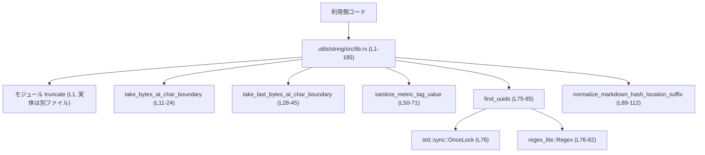
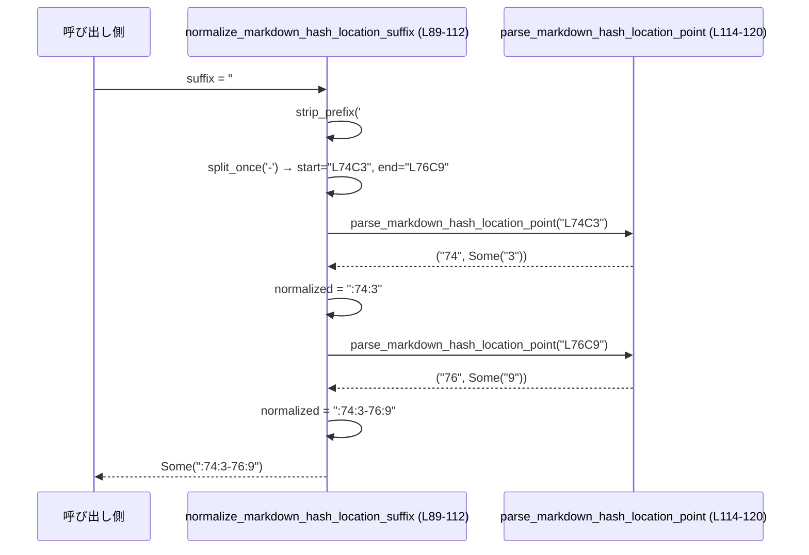

utils\string\src\lib.rs コード解説

---

## 0. ざっくり一言

このモジュールは、文字列処理のユーティリティをまとめたモジュールです。  
トークン数ベースのトランケーション用関数（`truncate` モジュールからの再公開）に加え、UTF-8 文字境界でのバイト制限トリミング、メトリック用タグ値のサニタイズ、UUID 検出、および Markdown 風ハッシュロケーションの正規化を提供します。

---

## 1. このモジュールの役割

### 1.1 概要

- このモジュールは **文字列を安全かつ一貫したルールで加工するための共通処理** を提供します。
- 主な機能は次の 4 系統です。
  - トークン数・バイト数に基づく文字列のトランケーション（`truncate` サブモジュール由来, `L1-7`）
  - UTF-8 文字境界を守った先頭／末尾のバイト数トリミング（`take_bytes_at_char_boundary`, `take_last_bytes_at_char_boundary`, `L11-45`）
  - メトリックタグ値のサニタイズ（`sanitize_metric_tag_value`, `L50-71`）
  - UUID 抽出と Markdown 風位置指定の正規化（`find_uuids`, `normalize_markdown_hash_location_suffix`, `L73-112`）

### 1.2 アーキテクチャ内での位置づけ

外部からはこの `lib.rs` を通じて関数群が利用されます。UUID 検出のみが外部クレート `regex_lite` と `std::sync::OnceLock` に依存します。



- `truncate` モジュールの実体（`truncate.rs` など）はこのチャンクには含まれていません（`mod truncate;`, `L1`）。

### 1.3 設計上のポイント

- **ステートレスな API**  
  すべて関数ベースで、グローバルな状態は UUID 用正規表現の `OnceLock` によるキャッシュのみです（`L76-82`）。
- **UTF-8 安全なスライス**  
  文字列スライスは必ず `char_indices()` を使って文字境界を求めてからスライスしており、UTF-8 を壊さない実装になっています（`L16-23`, `L34-45`）。
- **エラーは戻り値で表現**  
  例外やパニックを基本的に使わず、`Option<String>` で無効なロケーション指定を表現するなど、Rust らしい明示的なエラーハンドリングになっています（`L89-112`）。

---

## 2. 主要な機能一覧（コンポーネントインベントリー）

このファイルに定義・再公開されている主なコンポーネントと、その行番号です。

| 名前 | 種別 | 公開範囲 | 役割 / 用途 | 定義位置（根拠） |
|------|------|----------|-------------|-------------------|
| `truncate` | モジュール | crate 内（非 `pub`） | トークン数・バイト数に基づく文字列トランケーション処理を保持（実体はこのチャンクには現れない） | `utils\string\src\lib.rs:L1-1` |
| `approx_bytes_for_tokens` | 関数（re-export） | `pub` | トークン数から概算バイト数を求める関数を再公開（本体は `truncate` 内で未掲載） | `utils\string\src\lib.rs:L3-3` |
| `approx_token_count` | 関数（re-export） | `pub` | バイト列に対する概算トークン数計算（本体不明） | `utils\string\src\lib.rs:L4-4` |
| `approx_tokens_from_byte_count` | 関数（re-export） | `pub` | バイト数から概算トークン数への変換（本体不明） | `utils\string\src\lib.rs:L5-5` |
| `truncate_middle_chars` | 関数（re-export） | `pub` | 文字列中央を省略するトランケーション（本体不明） | `utils\string\src\lib.rs:L6-6` |
| `truncate_middle_with_token_budget` | 関数（re-export） | `pub` | トークン予算に基づく中央省略トランケーション（本体不明） | `utils\string\src\lib.rs:L7-7` |
| `take_bytes_at_char_boundary` | 関数 | `pub` | 先頭から指定バイト数以内で UTF-8 文字境界を保って切り出す | `utils\string\src\lib.rs:L11-24` |
| `take_last_bytes_at_char_boundary` | 関数 | `pub` | 末尾側から指定バイト数以内で UTF-8 文字境界を保って切り出す | `utils\string\src\lib.rs:L28-45` |
| `sanitize_metric_tag_value` | 関数 | `pub` | メトリック用タグ値を許可文字のみになるようサニタイズし、空や非英数字のみなら `"unspecified"` にする | `utils\string\src\lib.rs:L48-71` |
| `find_uuids` | 関数 | `pub` | 文字列中の UUID をすべて検出し、文字列のベクタとして返す | `utils\string\src\lib.rs:L73-85` |
| `normalize_markdown_hash_location_suffix` | 関数 | `pub` | `#L..` 形式の Markdown 風ロケーションサフィックスを `:line[:col][-line[:col]]` 形式に変換 | `utils\string\src\lib.rs:L87-112` |
| `parse_markdown_hash_location_point` | 関数 | `fn`（非公開） | `LxxCy` 形式の 1 点を `(line, column)` へ分解する補助関数 | `utils\string\src\lib.rs:L114-120` |
| `tests` | モジュール | テスト用 | 公開関数の挙動を単体テストで検証する | `utils\string\src\lib.rs:L122-185` |

---

## 3. 公開 API と詳細解説

### 3.1 型一覧

このファイルには、公開される構造体・列挙体などの独自型は定義されていません。  
すべて「関数」として提供され、必要な型は標準ライブラリおよび外部クレートの型をそのまま利用しています（`String`, `Vec<String>`, `Option<String>`, `OnceLock`, など）。

### 3.2 重要関数の詳細

#### `take_bytes_at_char_boundary(s: &str, maxb: usize) -> &str`（L11-24）

**概要**  
UTF-8 文字列 `s` の先頭から、**最大 `maxb` バイト以内**で切り出した部分文字列を返します。切り出し位置は常に文字境界になるため、返り値は常に有効な UTF-8 です（`L16-23`）。

**引数**

| 引数名 | 型 | 説明 |
|--------|----|------|
| `s` | `&str` | 元の UTF-8 文字列 |
| `maxb` | `usize` | 許可する最大バイト数（文字数ではない点に注意） |

**戻り値**

- `&str` — `s` の先頭から `maxb` バイト以内で、最後に収まる文字境界までの部分文字列（`utils\string\src\lib.rs:L23-23`）。

**内部処理の流れ**

（`utils\string\src\lib.rs:L11-23`）

1. `s.len() <= maxb` の場合はそのまま `s` を返す（`L12-14`）。
2. `last_ok` を 0 で初期化（`L15`）。
3. `s.char_indices()` で各文字の先頭バイトインデックス `i` と文字 `ch` を順に走査（`L16`）。
4. その文字を含んだときのバイト数 `nb = i + ch.len_utf8()` を算出（`L17`）。
5. `nb > maxb` ならループを打ち切り（`L18-20`）、そうでなければ `last_ok = nb` を更新（`L21`）。
6. 最後に `&s[..last_ok]` を返す（`L23`）。`last_ok` は常に文字境界なので、UTF-8 として安全です。

**Examples（使用例）**

```rust
// ASCII のみの例（1 文字 = 1 バイト）
let s = "Hello, world!";
let t = take_bytes_at_char_boundary(s, 5);
assert_eq!(t, "Hello");

// 絵文字を含む例（🙂 は 4 バイト）
let s = "🙂abc";
let t = take_bytes_at_char_boundary(s, 4);
assert_eq!(t, "🙂"); // 4バイト分だけだが、文字境界を守っている

let t2 = take_bytes_at_char_boundary(s, 3);
assert_eq!(t2, ""); // 先頭の絵文字が4バイトなので、3バイトでは文字が収まらず空文字になる
```

**Errors / Panics**

- パニック条件は特にありません。`&s[..last_ok]` はループ内で常に文字境界を計算しているため、スライスは UTF-8 的に安全です。
- `maxb` が非常に大きくても（`usize` の範囲内なら）問題はありません。ただし `s.len() <= maxb` で早期に `s` を返します（`L12-14`）。

**Edge cases（エッジケース）**

- `maxb == 0` のとき  
  - ループには入るものの、最初の文字で `nb > 0` となり `last_ok` は 0 のままなので、空文字列 `""` が返ります。
- `maxb` が最初の文字のバイト長より小さい場合（例: `s = "🙂abc", maxb = 3`）  
  - 一文字も収まらず、結果は空文字列です。
- ASCII のみの文字列では「バイト数 == 文字数」なので直感通りの挙動になります。

**使用上の注意点**

- `maxb` は「文字数」ではなく「バイト数」である点に注意が必要です。多バイト文字が含まれると、「思ったより短くなる」ことがあります。
- 関数は元の文字列 `s` を借用するだけで所有権を移動しないため、呼び出し後も `s` はそのまま使用できます（Rust の借用の性質）。

---

#### `take_last_bytes_at_char_boundary(s: &str, maxb: usize) -> &str`（L28-45）

**概要**  
`take_bytes_at_char_boundary` の末尾版で、`s` の末尾から **最大 `maxb` バイト以内**で切り出した部分文字列を返します。こちらも常に UTF-8 文字境界を守るよう実装されています（`L34-45`）。

**引数**

| 引数名 | 型 | 説明 |
|--------|----|------|
| `s` | `&str` | 元の UTF-8 文字列 |
| `maxb` | `usize` | 末尾側から許可する最大バイト数 |

**戻り値**

- `&str` — `s` の末尾から `maxb` バイト以内で入る最大の文字列を返します（`utils\string\src\lib.rs:L45-45`）。

**内部処理の流れ**

（`utils\string\src\lib.rs:L28-45`）

1. `s.len() <= maxb` なら `s` をそのまま返す（`L29-31`）。
2. `start = s.len()`, `used = 0` で初期化（`L32-33`）。
3. `s.char_indices().rev()` で末尾の文字から順に走査（`L34`）。
4. 各文字のバイト長 `nb = ch.len_utf8()` を取得（`L35`）。
5. `used + nb > maxb` ならループを終了（`L36-37`）。
6. そうでなければ `start = i`, `used += nb` を更新し（`L39-40`）、`start == 0` ならすべて収まったので打ち切り（`L41-43`）。
7. 最終的に `&s[start..]` を返します（`L45`）。

**Examples（使用例）**

```rust
let s = "Hello, world!";
let t = take_last_bytes_at_char_boundary(s, 6);
assert_eq!(t, "world!");

// 絵文字を末尾に含む例
let s = "abc🙂";
let t = take_last_bytes_at_char_boundary(s, 4);
assert_eq!(t, "🙂");  // 絵文字1つ分だけ返る

let t2 = take_last_bytes_at_char_boundary(s, 3);
assert_eq!(t2, "");  // 4バイトの絵文字が収まらないので空になる
```

**Errors / Panics**

- `&s[start..]` の `start` は常に `char_indices()` による文字境界として計算されるため、パニックは発生しません。
- 極端に大きい `maxb` では `s` 全体が返るだけです。

**Edge cases（エッジケース）**

- `maxb == 0` のとき、ループは 1 回も条件を満たさないため `start` は `s.len()` のままで、空文字列が返ります。
- 文字列が空 (`s == ""`) のときは `s.len() == 0 <= maxb` なので、常に `""` が返ります。
- 多バイト文字と ASCII が混在する場合、末尾からの切り詰め時に「1 文字も返らない」ケースがあり得ます（例は上記）。

**使用上の注意点**

- ログやメッセージを「末尾優先で残したい」ケース（例: スタックトレース末尾）に適しています。
- `maxb` はバイト単位なので、多バイト文字を含む言語（日本語、絵文字など）では、実際の表示上の文字数とは異なります。

---

#### `sanitize_metric_tag_value(value: &str) -> String`（L50-71）

**概要**  
メトリックシステムのタグ値として使用する文字列を、**許可された文字のみ**を含む形に変換します。  
許可されるのは ASCII の英数字と `.` `_` `-` `/` のみで、それ以外の文字は `_` に置換されます（`L55-59`）。  
最終的な有効なタグ値が空、もしくは英数字を含まない場合は `"unspecified"` を返します（`L62-65`）。

**引数**

| 引数名 | 型 | 説明 |
|--------|----|------|
| `value` | `&str` | 元のタグ値文字列 |

**戻り値**

- `String` — サニタイズ済みのタグ値。全ての文字が許可された文字か `"unspecified"` になります（`L64-70`）。

**内部処理の流れ**

（`utils\string\src\lib.rs:L50-71`）

1. `MAX_LEN` を 256 に定義（`L51`）。
2. `value.chars().map(...)` で各文字を走査し、  
   - ASCII 英数字または `.` `_` `-` `/` はそのまま（`L55-57`）  
   - それ以外は `_` に置換（`L58-59`）  
   して `sanitized` を生成（`L52-61`）。
3. `sanitized.trim_matches('_')` で前後の `_` を除いた `trimmed` を得る（`L62`）。
4. `trimmed` が空、または ASCII 英数字を一切含まなければ `"unspecified"` を返す（`L63-65`）。
5. `trimmed.len() <= MAX_LEN` なら `trimmed.to_string()` を返し、それを超える場合は先頭から 256 文字までを `String` にして返す（`L66-70`）。  
   ここでの文字列は ASCII のみなので、`[..MAX_LEN]` はバイトスライスとしても UTF-8 的に安全です。

**Examples（使用例）**

```rust
// 許可された文字だけの場合はそのまま（長さが 256 以下なら）
assert_eq!(sanitize_metric_tag_value("ok.value-123"), "ok.value-123");

// 不正な文字は '_' に置換される
assert_eq!(sanitize_metric_tag_value("bad value!"), "bad_value");

// 英数字を含まない場合は "unspecified"
assert_eq!(sanitize_metric_tag_value("///"), "unspecified");

// 非 ASCII を含む場合の例（全て '_' に）
assert_eq!(sanitize_metric_tag_value("タグ😀"), "unspecified"); // 全て '_' → トリム → 英数字なし
```

**Errors / Panics**

- 例外やパニックは想定されていません。  
  置換とトリミング、長さチェックのみを行っており、境界を超えるようなスライスは行っていません。

**Edge cases（エッジケース）**

- `value == ""`：  
  - `sanitized == ""` → `trimmed == ""` → `"unspecified"` を返します。
- `value` が `_` のみからなる場合（例: `"___"`）：  
  - `sanitized == "___"` → `trimmed == ""` → `"unspecified"` になります。
- 英数字以外の許可文字（`"."`, `"-"`, `/`, `_`）だけからなる場合（例: `"___///---"`）  
  - 英数字が 1 つもないため `"unspecified"` を返します（`L63-65`）。
- 256 文字を超える場合  
  - 先頭 256 文字だけが保持されます。  
    すべて ASCII のため、バイトスライスでも文字が途中で切れることはありません。

**使用上の注意点**

- 返り値が `"unspecified"` となる条件は「**英数字を含まない**」という点がポイントです。  
  許可文字だけで構成されていても英数字がないと `"unspecified"` になります。
- タグ値として一意性を重要視する場合、入力によっては `"unspecified"` にまとめられる可能性がある点に注意が必要です。

---

#### `find_uuids(s: &str) -> Vec<String>`（L75-85）

**概要**  
文字列 `s` の中から、UUID 形式の文字列をすべて検出して `Vec<String>` で返します。  
パターンは 8-4-4-4-12 の 16 進数＋ハイフン形式に一致するものです（`L79-80`）。

**引数**

| 引数名 | 型 | 説明 |
|--------|----|------|
| `s` | `&str` | 走査対象の文字列 |

**戻り値**

- `Vec<String>` — 見つかった UUID 文字列を格納したベクタ。見つからない場合は空ベクタ（`L84-85`）。

**内部処理の流れ**

（`utils\string\src\lib.rs:L75-85`）

1. `static RE: OnceLock<regex_lite::Regex>` を定義し、正規表現オブジェクトをスレッドセーフにキャッシュ（`L76`）。
2. 初回呼び出し時に `RE.get_or_init(|| { Regex::new(pattern).unwrap() })` で正規表現を構築（`L77-82`）。  
   - パターンはリテラル文字列で、UUID の一般的な形式を表します（`L79-80`）。
   - `unwrap()` はパターンがコンパイル不可能な場合のパニック要因ですが、コメントに「テストが保証」とあります（`L81`）。
3. `re.find_iter(s)` により、入力文字列中の非オーバーラップなマッチをすべて列挙（`L84`）。
4. 各マッチの `m.as_str().to_string()` を集めて `Vec<String>` にして返します（`L84-84`）。

**並行性（スレッドセーフティ）**

- `OnceLock` は標準ライブラリのスレッドセーフな一度きり初期化コンテナであり、複数スレッドから同時に `find_uuids` を呼び出しても、正規表現の初期化は安全に一度だけ行われます（`L76-82`）。
- 一度初期化された Regex オブジェクトはイミュータブルに共有されるため、その利用もスレッドセーフです。

**Examples（使用例）**

```rust
let input = "x 00112233-4455-6677-8899-aabbccddeeff-k \
             y 12345678-90ab-cdef-0123-456789abcdef";

let uuids = find_uuids(input);
assert_eq!(
    uuids,
    vec![
        "00112233-4455-6677-8899-aabbccddeeff".to_string(),
        "12345678-90ab-cdef-0123-456789abcdef".to_string(),
    ]
);

// 不正な UUID 形式は検出されない
let input2 = "not-a-uuid-1234-5678-9abc-def0-123456789abc";
assert!(find_uuids(input2).is_empty());
```

**Errors / Panics**

- 正規表現のコンパイル時に `unwrap()` が呼ばれますが、パターンは固定文字列であり、  
  コードが変更されない限りここからのパニックは発生しません（`L79-82`）。
- 入力 `s` によって新たなパニックが起こることはありません。`regex_lite` 側で UTF-8 を前提とした安全なマッチングが行われます。

**Edge cases（エッジケース）**

- 非 ASCII 文字を含む入力（例: 絵文字）のテストがあり（`L150-155`）、  
  UUID 部分のみが正しく抽出され、余分な文字は含まれないことが確認されています。
- 部分的に UUID に似た文字列でも、パターンに完全一致しなければマッチしません（`L143-147` のテスト参照）。

**使用上の注意点**

- この関数は単に **パターンマッチ** を行うだけで、UUID のバージョンや予約ビットなどの「意味的な妥当性」はチェックしません。
- 入力が長い文字列の場合、正規表現マッチングのコストが支配的になります。大量ログに対する高頻度利用ではパフォーマンスに注意が必要です。

---

#### `normalize_markdown_hash_location_suffix(suffix: &str) -> Option<String>`（L89-112）

**概要**  
Markdown でよく使われる `#L10C5-L12C3` といった **行／列情報を含むフラグメント** を、  
ターミナルフレンドリーな `:10:5-12:3` 形式に変換します。（`L87-88`）。  
無効な形式の場合は `None` を返します（`L90-95`）。

**引数**

| 引数名 | 型 | 説明 |
|--------|----|------|
| `suffix` | `&str` | 元のサフィックス文字列（例: `"#L74C3-L76C9"`） |

**戻り値**

- `Option<String>` —  
  - 成功時: `Some(":line[:column][-line[:column]]")`  
  - 無効な形式のとき: `None`（`L89-95`, `L102-111`）

**内部処理の流れ**

（`utils\string\src\lib.rs:L89-111`）

1. 先頭の `'#'` を `strip_prefix('#')?` で剥がす（なければ `None`）（`L90`）。
2. `fragment.split_once('-')` で範囲指定の有無を判定し、  
   - `Some((start, end))` の場合は `(start, Some(end))`  
   - そうでなければ `(fragment, None)` として扱う（`L91-94`）。
3. `parse_markdown_hash_location_point(start)?` で開始位置を `(start_line, start_column)` に分解（`L95`）。
4. `normalized` に `":" + start_line` を追加し、列があれば `":"+column` を追加（`L96-101`）。
5. 終了位置 `end` がある場合は、同様に `parse_markdown_hash_location_point(end)?` で解析し、  
   `"-" + end_line[+ ":" + end_column]` を追加（`L102-110`）。
6. すべてのパースが成功すれば `Some(normalized)` を返す（`L111`）。

**補助関数 `parse_markdown_hash_location_point` の挙動（L114-120）**

- 先頭の `'L'` を `strip_prefix('L')?` で剥がし、なければ `None`（`L115`）。
- `split_once('C')` で列指定の有無を判定し、  
  - あれば `(line, Some(column))`、なければ `(point, None)` を返します（`L116-119`）。
- 数値としての妥当性はチェックせず、**文字列の構造のみ**を検査します。

**Examples（使用例）**

```rust
// 単一位置
assert_eq!(
    normalize_markdown_hash_location_suffix("#L74C3"),
    Some(":74:3".to_string())
);

// 範囲指定
assert_eq!(
    normalize_markdown_hash_location_suffix("#L74C3-L76C9"),
    Some(":74:3-76:9".to_string())
);

// 無効な形式（'#' がない）
assert_eq!(normalize_markdown_hash_location_suffix("L10C2"), None);

// L がない
assert_eq!(normalize_markdown_hash_location_suffix("#10C2"), None);
```

**Errors / Panics**

- `strip_prefix` や `split_once`、`?` 演算子による早期リターンのみで、パニック要因はありません。
- 数値変換を行っていないため、数値オーバーフローなどの懸念もありません。

**Edge cases（エッジケース）**

- `suffix` が `"#"` だけの場合  
  - `fragment == ""` → `parse_markdown_hash_location_point("")` で `strip_prefix('L')?` が失敗 → `None`。
- `suffix` が `"#L10-"` のように終端だけ空の場合  
  - `split_once('-')` で `start == "L10"`, `end == ""` となり、後半の `parse_markdown_hash_location_point("")` が `None` を返し、全体として `None` になります。
- 行・列が数値でない場合（例: `#LfooCbar-LxCy`）  
  - 構造さえ合っていれば、その文字列のまま結果に入ります（例: `":foo:bar-x:y"`）。  
    **数値としてのバリデーションは行っていません。**

**使用上の注意点**

- 返り値が `None` になりうる条件は、  
  - 先頭が `'#'` でない  
  - `'L'` から始まらない位置指定  
  - 上記のいずれかのポイントが欠けている  
  といった **構造上の不正** の場合です。
- 行・列が実際に有効な数値かどうかを確認したい場合は、呼び出し側で `parse::<u64>()` などを使ってチェックする必要があります。

---

### 3.3 その他の関数・再公開 API

このチャンクには実装本体が現れない関数については、名称と取得場所のみ記載します。

| 関数名 | 種別 | 公開範囲 | 役割（推測レベルの説明は避ける） | 定義位置（根拠） |
|--------|------|----------|----------------------------------|-------------------|
| `approx_bytes_for_tokens` | 関数（re-export） | `pub` | `truncate` モジュール内の同名関数を再公開。機能詳細はこのチャンクには現れない。 | `utils\string\src\lib.rs:L3-3` |
| `approx_token_count` | 関数（re-export） | `pub` | 同上。 | `utils\string\src\lib.rs:L4-4` |
| `approx_tokens_from_byte_count` | 関数（re-export） | `pub` | 同上。 | `utils\string\src\lib.rs:L5-5` |
| `truncate_middle_chars` | 関数（re-export） | `pub` | 同上。 | `utils\string\src\lib.rs:L6-6` |
| `truncate_middle_with_token_budget` | 関数（re-export） | `pub` | 同上。 | `utils\string\src\lib.rs:L7-7` |
| `parse_markdown_hash_location_point` | 関数 | 非公開 | `normalize_markdown_hash_location_suffix` 用の内部ヘルパー。 | `utils\string\src\lib.rs:L114-120` |

---

## 4. データフロー

ここでは代表的なシナリオとして、`normalize_markdown_hash_location_suffix` によるロケーション文字列正規化のデータフローを示します。

### 4.1 `normalize_markdown_hash_location_suffix` の処理フロー



- 文字列は `&str` として参照渡しされ、**所有権は移動しません**。
- `parse_markdown_hash_location_point` はあくまで「文字列を分解するだけ」で、数値チェックは行っていません。
- `?` 演算子により、どのパースステップでも失敗した瞬間に `None` が呼び出し側へ返ります。

---

## 5. 使い方（How to Use）

### 5.1 基本的な使用方法の例

複数の関数を組み合わせてログメッセージを処理する例です。

```rust
use utils::string::{
    take_bytes_at_char_boundary,
    take_last_bytes_at_char_boundary,
    sanitize_metric_tag_value,
    find_uuids,
    normalize_markdown_hash_location_suffix,
};

// ログメッセージを長すぎないように先頭優先で切り詰める
fn shorten_log_message(msg: &str) -> &str {
    // 最大 1024 バイトまで残す（先頭側）
    take_bytes_at_char_boundary(msg, 1024)
}

// エラータグをサニタイズしてメトリックに送る
fn metric_tag_from_error(raw_tag: &str) -> String {
    sanitize_metric_tag_value(raw_tag)
}

// ログの中から UUID を拾い出す
fn uuids_from_log(msg: &str) -> Vec<String> {
    find_uuids(msg)
}

// Markdown 風ロケーションを CLI 表示用に変換する
fn format_location_suffix(suffix: &str) -> String {
    normalize_markdown_hash_location_suffix(suffix)
        .unwrap_or_else(|| "".to_string())  // 無効な形式なら空文字
}
```

### 5.2 よくある使用パターン

1. **先頭／末尾トランケーションの使い分け**

```rust
// 先頭を優先して残したい（例: メッセージの冒頭が重要）
let prefix = take_bytes_at_char_boundary("長いメッセージ...", 200);

// 末尾を優先して残したい（例: スタックトレース末尾）
let suffix = take_last_bytes_at_char_boundary("長いスタックトレース...", 200);
```

1. **サニタイズ＋メトリック送信**

```rust
let raw_user_agent = "Some Browser 😀/1.0";
let tag_value = sanitize_metric_tag_value(raw_user_agent);
// -> "unspecified" になる可能性があることを前提に扱う
send_metric("requests", &[("user_agent", tag_value)]);
```

1. **UUID 抽出でリクエスト ID を拾う**

```rust
let log_line = "req_id=55e5d6f7-8a7f-4d2a-8d88-123456789012 status=200";
if let Some(req_id) = find_uuids(log_line).into_iter().next() {
    println!("Request ID: {}", req_id);
}
```

### 5.3 よくある間違いとその修正例

```rust
// 間違い例: maxb を「文字数」として解釈している
let s = "🙂🙂🙂";                 // 実際には 3 文字だが 12 バイト
let bad = take_bytes_at_char_boundary(s, 3);
// 期待と違い、空文字列が返る可能性がある

// 正しい例: 「バイト数」であることを意識し、多バイト文字を考慮する
let good = take_bytes_at_char_boundary(s, 12);
assert_eq!(good, "🙂🙂🙂");
```

```rust
// 間違い例: normalize_markdown_hash_location_suffix の返り値を必ず Some と仮定
let loc = normalize_markdown_hash_location_suffix("L10C2"); // '#' がない → None
println!("{}", loc.unwrap()); // パニック

// 正しい例: Option を扱う
let loc = normalize_markdown_hash_location_suffix("#L10C2")
    .unwrap_or_else(|| ":10:2".to_string());
println!("{}", loc);
```

### 5.4 使用上の注意点（まとめ）

- **バイト数 vs 文字数**  
  - `take_bytes_at_char_boundary` / `take_last_bytes_at_char_boundary` はどちらも **バイト数** を受け取るため、多バイト文字を含む場合に想定よりも短く（あるいは空に）なりえます。
- **Option / Result の扱い**  
  - `normalize_markdown_hash_location_suffix` は無効な入力で `None` を返すので、`unwrap()` などで **決め打ちしない** ことが重要です。
- **サニタイズ後の `"unspecified"`**  
  - `sanitize_metric_tag_value` が `"unspecified"` を返すケースがあるため、メトリック集計ではこの値を特別扱いする設計が多くなります。
- **並行実行**  
  - `find_uuids` 内部の `OnceLock` により、正規表現の初期化はスレッドセーフです。  
    追加の排他制御は不要ですが、非常に高頻度な呼び出しでは正規表現マッチングのコストを考慮する必要があります。

---

## 6. 変更の仕方（How to Modify）

### 6.1 新しい機能を追加する場合

1. **文字列ユーティリティの追加**  
   - 同様の自立した文字列処理関数を追加する場合、この `lib.rs` に `pub fn ...` を追加するのが自然です。
   - UTF-8 スライスが関係する処理では、既存の `take_*_bytes_at_char_boundary` を参考に、`char_indices()` を使って境界を計算すると安全です。
2. **トークン関連の拡張**  
   - トークン数やトランケーションロジックの拡張は `mod truncate;` で宣言されているサブモジュール（実体ファイルはこのチャンクには含まれません）側に追加するのが一貫しています。
   - 追加した関数を外部公開したい場合は、この `lib.rs` で `pub use truncate::new_function;` を追加します。
3. **Markdown ロケーション形式の拡張**  
   - `normalize_markdown_hash_location_suffix` / `parse_markdown_hash_location_point` 周りの仕様を変える場合は、  
     まず既存テスト（`mod tests` 内, `L130-183`）を確認・追加し、振る舞いを明文化してから変更するのが安全です。

### 6.2 既存の機能を変更する場合の注意点

- **契約（前提・保証）の維持**
  - `take_*_bytes_at_char_boundary`  
    - 「返り値が常に有効な UTF-8 であること」「パニックしないこと」は重要な契約です。  
      インデックス計算を変更する場合も `char_indices()` による境界計算を守る必要があります。
  - `sanitize_metric_tag_value`  
    - 「許可文字以外は現れない」「英数字を含まない場合は `"unspecified"`」という仕様は、テストでカバーされており（`L158-167`）、メトリック利用側の前提となっている可能性があります。
  - `find_uuids`  
    - 正規表現パターンを変更すると、抽出される UUID の範囲が変わります。既存テスト（`L130-156`）で確認されているケース（複数マッチ、非 ASCII 混在など）を壊さないようにする必要があります。
  - `normalize_markdown_hash_location_suffix`  
    - 構造エラー時に `None` を返す仕様と、数値バリデーションをしていない点（文字列のまま返す点）は、既存の利用コードに影響しうるため、変更時は利用箇所の確認が必要です。

- **テストの更新**
  - 新しい振る舞いを導入する場合は、既存の `mod tests` 内にテストケースを追加・修正し、  
    **エッジケース（空文字・非 ASCII・境界長など）** を中心にカバーすることが望ましいです。

---

## 7. 関連ファイル

このモジュールと密接に関係するファイル・コンポーネントは次の通りです。

| パス / コンポーネント | 役割 / 関係 |
|----------------------|------------|
| `mod truncate;`（`utils\string\src\lib.rs:L1-1`） | トークン数・バイト数に基づく文字列トランケーション処理を提供するサブモジュール。`approx_*` や `truncate_middle_*` 関数の本体がここにあると推測されますが、このチャンクにはコードが含まれていません。 |
| `mod tests`（`utils\string\src\lib.rs:L122-185`） | 本ファイル内の関数（特に `find_uuids`, `sanitize_metric_tag_value`, `normalize_markdown_hash_location_suffix`）の挙動を検証する単体テスト群です。 |

このチャンクには `truncate` モジュールの実装が含まれていないため、トークン関連関数（`approx_*`, `truncate_middle_*`）の詳細な挙動はコードからは読み取れません。
