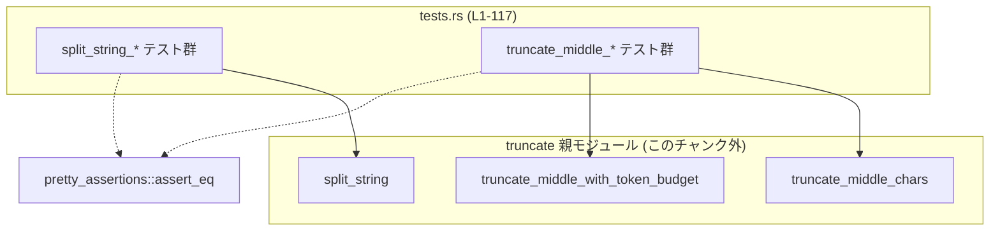
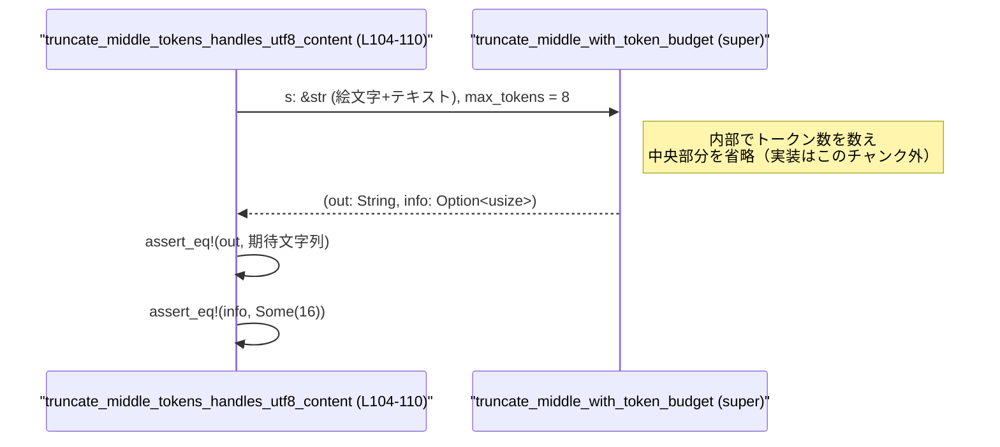
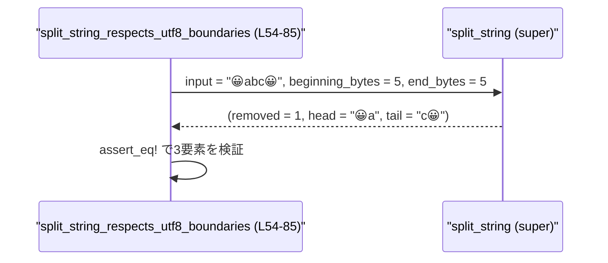

utils/string/src/truncate/tests.rs コード解説
=========================================

## 0. ざっくり一言

このファイルは、親モジュール（`super`）で定義されている文字列トランケーション系関数の **振る舞い仕様をテストで定義しているファイル** です。  
特に、UTF-8 文字境界を壊さない分割・バイト／トークン予算に基づく中央省略・省略量のカウントを検証しています。

---

## 1. このモジュールの役割

### 1.1 概要

- このモジュールは、親モジュールにある次の 3 関数の挙動をテストしています。  
  - `split_string`  
  - `truncate_middle_with_token_budget`  
  - `truncate_middle_chars`  
  （インポート: `tests.rs:L1-3`）
- 主な目的は、これらの関数が
  - 空文字列や予算 0 などの **エッジケースを正しく処理すること**
  - **UTF-8 文字境界を尊重して分割・トランケーションすること**
  - **どれだけ削ったか（文字数／トークン数）を適切に報告すること**
  を保証することです。  
  （根拠: 個別テスト群 `tests.rs:L6-85`, `L87-117`）

### 1.2 アーキテクチャ内での位置づけ

このファイルは `truncate` モジュール内のテスト専用サブモジュールであり、親モジュールの関数をブラックボックス的に呼び出して検証しています。

- 依存関係:
  - 親モジュール（`super`）  
    - `split_string`（`tests.rs:L1`）
    - `truncate_middle_chars`（`tests.rs:L2`）
    - `truncate_middle_with_token_budget`（`tests.rs:L3`）
  - 外部クレート `pretty_assertions::assert_eq`（`tests.rs:L4`）

これを簡略化した依存関係図は次の通りです。



- 親モジュール内で `A/B/C` が互いにどう呼び合っているかは、このチャンクには現れません（不明です）。

### 1.3 設計上のポイント（テストから読み取れる方針）

テストコードから、次のような設計方針が読み取れます。

- **UTF-8 安全な文字列操作**
  - マルチバイト絵文字を含む文字列でも、途中でコードポイントを分断しないように分割・トランケーションすることが期待されています。  
    （例: `split_string_respects_utf8_boundaries`, `tests.rs:L54-85`）
- **バイト予算／トークン予算に基づく中央トリミング**
  - `split_string` は「先頭バイト予算」「末尾バイト予算」に基づき中央を削除し、削除された「文字数」を返します。  
    （`tests.rs:L6-52`, `L54-85`）
  - `truncate_middle_with_token_budget` は「トークン数上限」に基づき中央を削除し、元のトークン数（と解釈できる値）を返します。  
    （`tests.rs:L87-102`, `L104-110`）
  - `truncate_middle_chars` は「バイト上限」を超えないように中央を削り、その削除文字数をメッセージとして内部に埋め込んだ文字列を返します。  
    （`tests.rs:L112-117`）
- **省略量の可視化**
  - 出力文字列中に `"…N tokens truncated…"`, `"…N chars truncated…"` というメッセージを挿入し、どれだけ削ったかを人間が読める形で残しています。  
    （`tests.rs:L97-101`, `L104-110`, `L112-117`）
- **単純な同期 API**
  - テストはすべて普通の同期関数呼び出しであり、`async` やスレッドなどは登場しません（`tests.rs:L6-117`）。  
    → 並行性に関する情報はこのチャンクからは得られません。

---

## 2. 主要な機能一覧（テスト対象）

このファイルが検証している主な機能は次の通りです。

- `split_string`:
  - 文字列を「先頭バイト数」「末尾バイト数」の予算に基づいて 3 つに分解し、
    - 中央で除去された **文字数**
    - 先頭部分の文字列
    - 末尾部分の文字列
    を返します。  
    （使用箇所: `tests.rs:L8-19`, `L24-27`, `L32-35`, `L40-43`, `L48-51`, `L56-83`）
- `truncate_middle_with_token_budget`:
  - トークン数上限 `max_tokens` を超える文字列を中央で省略し、
    - 省略済みの文字列
    - 必要に応じて、**元のトークン数**（と解釈できる値）を `Option<usize>` で返します。  
    （使用箇所: `tests.rs:L88-93`, `L97-101`, `L105-109`）
- `truncate_middle_chars`:
  - UTF-8 文字列に対して、「最大バイト数」を超えないよう中央を省略し、
    - 省略済みの文字列（省略された **文字数 N** を `"…N chars truncated…"` として埋め込む）
    を返します。  
    （使用箇所: `tests.rs:L113-116`）

---

## 3. 公開 API と詳細解説

### 3.1 型・関数一覧（テスト対象）

このファイル自身は新しい構造体・列挙体を定義していません。  
テスト対象およびテスト関数を「コンポーネント」として整理すると次のようになります。

| 名前 | 種別 | 役割 / 用途 | 根拠 |
|------|------|-------------|------|
| `split_string` | 関数（親モジュール定義） | `&str` と 2 つのバイト数予算から、中央除去文字数・先頭部分・末尾部分を返す | インポートと使用: `tests.rs:L1`, `L8-19`, `L24-27`, `L32-35`, `L40-43`, `L48-51`, `L56-83` |
| `truncate_middle_with_token_budget` | 関数（親モジュール定義） | トークン数上限に収まるよう中央を省略し、結果文字列と `Option<usize>` を返す | インポートと使用: `tests.rs:L3`, `L88-93`, `L97-101`, `L105-109` |
| `truncate_middle_chars` | 関数（親モジュール定義） | バイト数上限に収まるよう中央を省略し、省略文字数をメッセージとして埋め込んだ文字列を返す | インポートと使用: `tests.rs:L2`, `L113-116` |
| `split_string_works` ほか | テスト関数 | 上記 3 関数の正常系・エッジケースを検証するユニットテスト | 定義: `tests.rs:L6-85`, `L87-117` |
| `pretty_assertions::assert_eq` | 外部マクロ | 通常の `assert_eq!` と互換の API で、差分を見やすく表示する | インポートと使用: `tests.rs:L4`, 各 `assert_eq!` 行 |

> 注: 3 つのテスト対象関数の **正確なシグネチャ（所有権/ライフタイムなど）** は、このチャンクには現れません。  
> 以下の解説では、テストコードから読み取れる範囲で挙動を説明します。

---

### 3.2 関数詳細（テスト対象のコア関数）

#### `split_string(input, beginning_bytes, end_bytes) -> (removed, head, tail)`（推測）

**概要**

- 文字列 `input` の先頭に `beginning_bytes`、末尾に `end_bytes` の **バイト数予算** を割り当て、  
  その範囲外にある中央部分を削除する関数と解釈できます。
- 戻り値は  
  - `removed`: 削除された **文字数（UTF-8 1 文字単位）**  
  - `head`: 先頭側に残した部分文字列  
  - `tail`: 末尾側に残した部分文字列  
  という 3 要素タプルになっています（テストの期待値より）。  
  （根拠: `tests.rs:L8-19`, `L24-27`, `L32-35`, `L40-43`, `L48-51`, `L56-83`）

**引数（テストから読み取れる情報）**

| 引数名 | 型（推測） | 説明 |
|--------|-----------|------|
| `input` | `&str` | 分割対象の文字列。UTF-8 文字列である前提。`tests.rs` では ASCII と絵文字の両方を使用（`L10`, `L17`, `L25`, `L33`, `L41`, `L49`, `L57`, `L62-63`, `L71-72`, `L79-80`）。 |
| `beginning_bytes` | `usize` | 先頭側に確保するバイト数予算。例: `5` など（`tests.rs:L11`, `L17`, `L25`, `L33`, `L41`, `L49`, `L57`, `L64-65`, `L72-73`, `L80-81`）。 |
| `end_bytes` | `usize` | 末尾側に確保するバイト数予算。例: `5`, `0`, `3` など。 |

**戻り値（推測）**

- タプル `(removed_chars: usize, head: &str or String, tail: &str or String)` のような形で使われています。
  - `removed_chars`:
    - 実際に削除された **Unicode 文字数** と解釈すると、すべてのテストと整合します。  
      例:
      - `"hello world"` → `(1, "hello", "world")`  
        → スペース 1 文字が削除されたと読める（`tests.rs:L8-15`）。
      - `"abc"` かつ予算 0/0 → `(3, "", "")`  
        → 3 文字すべて削除（`tests.rs:L16-19`）。
      - `"😀abc😀"` → `(1, "😀a", "c😀")`  
        → 中央の `'b'` 1 文字だけ削除（`tests.rs:L56-59`）。
  - `head` / `tail`:
    - `input` の先頭／末尾から抽出した部分文字列。UTF-8 文字境界を壊していません（`tests.rs:L56-83`）。

**内部処理の流れ（推測アルゴリズム）**

実装はこのチャンクにはありませんが、テストから次のように解釈できます。

1. `input` の全体長（バイト数）を計算する。
2. `beginning_bytes` + `end_bytes` が全体バイト数以上であれば、  
   - 文字列を一切削除せず、`removed_chars = 0`、`head = input[..]`、`tail` は残り（あるいは空）とする。  
     → `"abcdef"`, 4+4 のケースで `(0, "abcd", "ef")`（`tests.rs:L48-51`）。
3. そうでなければ、先頭と末尾から「UTF-8 文字境界に沿って」バイトを消費して `head` と `tail` を構築する。
   - 予算がコードポイント 1 つ分未満（例: 1 バイト）しかない場合、その側の部分文字列は空文字列になる。  
     → `"😀😀😀😀😀"` に対して先頭 1 バイト／末尾 1 バイトで `(5, "", "")`（`tests.rs:L61-67`）。
   - 予算が十分な場合は、複数文字を含むことがある。  
     → `"😀😀😀😀😀"`, 7/7 のケースで `(3, "😀", "😀")`（`tests.rs:L69-76`）。  
       `"😀😀😀😀😀"`, 8/8 のケースで `(1, "😀😀", "😀😀")`（`tests.rs:L77-83`）。
4. `removed_chars` は `input` の総「文字数」から `head.len()` と `tail.len()` の文字数を引いた値と推測されます。

**Examples（使用例）**

テストから抜粋した例です。

```rust
// スペース 1 文字だけを中央から削る例
let (removed, head, tail) = split_string("hello world", 5, 5);
// removed == 1, head == "hello", tail == "world"  （tests.rs:L8-15）

// すべて削る例（予算 0/0）
let (removed, head, tail) = split_string("abc", 0, 0);
// removed == 3, head == "", tail == ""  （tests.rs:L16-19）

// UTF-8 絵文字を含む例（UTF-8 境界を守って分割）
let (removed, head, tail) = split_string("😀abc😀", 5, 5);
// removed == 1, head == "😀a", tail == "c😀"  （tests.rs:L56-59）
```

**Errors / Panics**

- このチャンクには `Result` やエラー処理の記述は一切登場しません。
- Rust の `&str` をバイトインデックスでスライスする場合、不正な UTF-8 境界でスライスするとパニックしますが、  
  テストの存在（特に `split_string_respects_utf8_boundaries`）から、
  **実装側で境界チェックを行っていることを期待している**と解釈できます。  
  （根拠: `tests.rs:L54-85`）
- 負の予算値などの異常入力はテストされておらず、そうしたケースでの挙動はこのチャンクからは分かりません。

**Edge cases（エッジケース）**

テストで明示的にカバーされているケース:

- 空文字列:  
  - 入力 `""`, 予算 4/4 → `(0, "", "")`  
    （削除文字数 0、先頭・末尾とも空）  
    （根拠: `tests.rs:L22-27`）
- 予算 0 の場合:
  - 末尾予算 0 → 末尾は空、先頭のみ保持: `"abcdef"`, 3/0 → `(3, "abc", "")`（`tests.rs:L30-35`）。
  - 先頭予算 0 → 先頭は空、末尾のみ保持: `"abcdef"`, 0/3 → `(3, "", "def")`（`tests.rs:L38-43`）。
- 予算合計が長さ以上のとき:
  - `"abcdef"`, 4/4 → `(0, "abcd", "ef")`（`tests.rs:L46-51`）。  
    → 何も削除されない（`removed_chars == 0`）。
- UTF-8 絵文字と小さなバイト予算:
  - `"😀😀😀😀😀"`, 1/1 → `(5, "", "")`（`tests.rs:L61-67`）。  
    → どちら側も 1 バイトではコードポイント 1 つも取れないため、全 5 文字削除。

**使用上の注意点**

- 予算は「バイト数」であり、「文字数」ではありません。  
  絵文字などマルチバイト文字を含む場合、  
  - 「先頭に 5 バイト」のような指定でも、実際に取れる文字数は 1〜数文字に変動します。
- `removed` はバイトではなく「文字数」と解釈できるため、  
  「何文字削れたか」の指標として利用できますが、「何バイト削れたか」はこの値からは直接分かりません。
- このチャンクでは、負の値や極端に大きな値などの異常な予算指定の挙動は不明です。  
  安全に使うには、予算を `input.len()` 程度までに収めるのが無難です（一般的な指針であり、このコードからの確証ではありません）。

---

#### `truncate_middle_with_token_budget(input, max_tokens) -> (out, info)`（推測）

**概要**

- 文字列の「トークン数」を数え、`max_tokens` を超える場合に **中央部分を省略** する関数と解釈できます。
- 戻り値は
  - `out`: 省略済み文字列（中央に `"…N tokens truncated…"` というメッセージが挿入される）
  - `info`: `Option<usize>` 型と推測され、**元のトークン数**を表していると解釈すると、テスト結果と整合します。  
    （根拠: `tests.rs:L87-93`, `L97-102`, `L104-110`）

**引数（テストから読み取れる情報）**

| 引数名 | 型（推測） | 説明 |
|--------|-----------|------|
| `input` | `&str` | 対象の文字列。ASCII 文字列と絵文字＋改行を含む文字列でテストされています（`tests.rs:L89`, `L98`, `L106`）。 |
| `max_tokens` | `usize` | 許容する最大トークン数。例: 100, 0, 8（`tests.rs:L90`, `L99`, `L107`）。 |

**戻り値（推測）**

- `(out: String, info: Option<usize>)` のような形で使われています。

テストから読み取れる具体的な挙動:

1. **トークン数が上限以下の場合**  
   - 入力 `"short output"`, 上限 `100`:
     - `out == "short output"`（元の文字列と同じ）  
     - `info == None`  
       （根拠: `tests.rs:L88-93`）  
     → トランケーションは行われず、「情報」も返さない。
2. **上限が 0 の場合**  
   - 入力 `"abcdef"`, 上限 `0`:
     - `out == "…2 tokens truncated…"`  
     - `info == Some(2)`  
       （根拠: `tests.rs:L97-101`）  
     → もともと 2 トークンであり、**すべて削って 2 トークンが削除された**と読めます。
3. **UTF-8 コンテンツでのトランケーション**  
   - 入力: `"😀😀😀😀😀😀😀😀😀😀\nsecond line with text\n"`  
     上限: `8`  
     - `out == "😀😀😀😀…8 tokens truncated… line with text\n"`  
     - `info == Some(16)`  
       （根拠: `tests.rs:L105-109`）  

この 2 つのテストを両立させるためには、`info` を **元のトークン数** と解釈するのが自然です。

- 上限 0 のケース:
  - 元のトークン数 = 2 → `info == Some(2)` → `"…2 tokens truncated…"`（全部削除）
- UTF-8 のケース:
  - `info == Some(16)` → 元のトークン数が 16  
  - 上限 `max_tokens == 8` → 削除されたトークン数は `16 - 8 == 8`  
  - メッセージ `"…8 tokens truncated…"` は「削除されたトークン数」を表示していると考えられます。

**内部処理の流れ（推測アルゴリズム）**

実装はこのチャンクにはありませんが、テストから次のように推測できます。

1. `input` を何らかのルールでトークン分割し、総トークン数 `total_tokens` を数える。
2. もし `total_tokens <= max_tokens` なら:
   - `out = input.to_owned()`  
   - `info = None`  
   （根拠: `tests.rs:L88-93`）
3. そうでなければ:
   - トークン列の先頭側と末尾側から、合計 `max_tokens` 個のトークンを残すように分割する（先頭と末尾の具体的な割り当て比率は、このチャンクからは不明）。
     - UTF-8 のケースでは、先頭に `"😀😀😀😀"`, 末尾側に `" line with text\n"` が残されています（`tests.rs:L105-109`）。
   - 中央部分は削除し、その代わりに `"…X tokens truncated…"` というメッセージを挿入する。
     - ここで `X = total_tokens - max_tokens` と解釈できます。
   - `out` にこの新しい文字列を格納する。
   - `info = Some(total_tokens)` を返す。

**Examples（使用例）**

テストに近い形の利用例:

```rust
let s = "very long log message ...";          // 対象文字列
let max_tokens = 50;                          // ログとして許容するトークン数上限

let (out, total_tokens) = truncate_middle_with_token_budget(s, max_tokens);

match total_tokens {
    None => {
        // トランケーションなし、out は s と同じ内容
        println!("Full text: {out}");
    }
    Some(total) => {
        // トランケーション済み
        println!("Truncated text: {out}");
        println!("Original token count: {total}"); // total は元のトークン数と解釈
    }
}
```

**Errors / Panics**

- テストでは、関数がパニックを起こすケースは登場しません。
- `max_tokens` が 0 の場合にも正常に文字列を返すことが確認されています（`tests.rs:L97-101`）。
- トークン化のルールや、極端に大きい `max_tokens` のときの挙動、トークンカウント処理中のエラー等については、このチャンクからは一切分かりません。

**Edge cases（エッジケース）**

- `max_tokens` が十分大きい場合:
  - トランケーションされず、`info == None`（`tests.rs:L88-93`）。
- `max_tokens == 0` の場合:
  - 入力が 2 トークンのとき `"…2 tokens truncated…"` だけが返る（`tests.rs:L97-101`）。
- UTF-8 絵文字・改行を含む長文:
  - 絵文字を含む先頭側・末尾側を残しつつ中央を省略する（`tests.rs:L105-109`）。
- `max_tokens` とトークン数の相関:
  - UTF-8 のケースで、`info == Some(16)` かつ `"…8 tokens truncated…"`, `max_tokens == 8`  
    → 元のトークン数が 16 であり、そのうち 8 トークンが削除されたと読めます。

**使用上の注意点**

- `info` の `Some(n)` が「元のトークン数」であるかどうかは実装を見ないと断定できませんが、  
  **テスト値とは整合します**。この値を利用する場合は、その前提でコードを記述する必要があります。
- トークン化のルール（空白区切りか、サブワードトークンか等）はこのチャンクからは分かりません。  
  「トークン数」の意味は、実装あるいは別ドキュメントを参照する必要があります。
- 大きな文字列に対して複雑なトークン化を行う場合、トークンカウントにコストがかかる可能性がありますが、  
  このファイルからはパフォーマンス特性は読み取れません。

---

#### `truncate_middle_chars(input, max_bytes) -> out`（推測）

**概要**

- 文字列 `input` のバイト長が `max_bytes` を超える場合に、  
  UTF-8 文字境界を壊さないように中央部分を削除し、その削除文字数を `"…N chars truncated…"` というメッセージとして埋め込む関数と解釈できます。  
  （根拠: `tests.rs:L112-117`）

**引数（テストから読み取れる情報）**

| 引数名 | 型（推測） | 説明 |
|--------|-----------|------|
| `input` | `&str` | 対象文字列。UTF-8 絵文字と ASCII の混在した文字列でテストされています（`tests.rs:L114`）。 |
| `max_bytes` | `usize` | 許容する最大バイト数。例では `20`（`tests.rs:L115`）。 |

**戻り値（推測）**

- `out: String` のような所有型文字列と解釈できます。
- テストでは、次のような文字列が返っています。  
  - 入力: `"😀😀😀😀😀😀😀😀😀😀\nsecond line with text\n"`  
    `max_bytes == 20` のとき:
    - `out == "😀😀…21 chars truncated…with text\n"`  
      （根拠: `tests.rs:L113-116`）

ここから、次のことが読み取れます。

- 先頭 `"😀😀"`（絵文字 2 つ）と末尾 `"with text\n"` を残して中央を削除。
- 削除された文字数は 21 で、それが `"…21 chars truncated…"` としてメッセージに埋め込まれている。

**内部処理の流れ（推測アルゴリズム）**

1. `input` を UTF-8 文字（Rust の `char`）単位で数え、文字列全体の長さを求める。
2. そのままだと `max_bytes` を超える場合のみ、中央トランケーションを行う。
3. 先頭・末尾から UTF-8 文字境界に沿って一部を残し、中央の `N` 文字を削除する。
4. `"…N chars truncated…"` というメッセージを中央に挿入し、 `max_bytes` を超えない範囲に収める。
5. 結果を `String` として返す。

**Examples（使用例）**

```rust
let s = "😀😀😀😀😀😀😀😀😀😀\nsecond line with text\n";
let out = truncate_middle_chars(s, 20);
// out == "😀😀…21 chars truncated…with text\n"  （tests.rs:L113-116）
```

**Errors / Panics**

- エラー型は返されておらず、テストでもパニックが一切確認されていません。
- UTF-8 境界を誤って扱うとパニックになるはずですが、  
  テストが UTF-8 含むケースを通過していることから、実装は境界を考慮していると期待できます。

**Edge cases（テストから分かる範囲）**

- `max_bytes` が十分大きく、入力がそれを超えない場合の挙動はこのチャンクではテストされていません（不明）。
- UTF-8 絵文字＋ASCII の混在した入力で、バイト数制限をかけるときに、
  - 先頭・末尾に それぞれ UTF-8 境界に沿った部分文字列を残し、
  - 中央の削除数を「文字数」としてメッセージに埋め込む、
  という挙動が少なくとも 1 ケースで確認されています（`tests.rs:L113-116`）。

**使用上の注意点**

- `max_bytes` はバイト単位の制限であり、**文字数ではありません**。  
  マルチバイト文字を多く含む場合、`max_bytes` に対して残せる文字数は少なくなります。
- 戻り値には削除文字数 `N` の情報が埋め込まれていますが、  
  API 上から直接 `N` を数値として取得する方法（例えば別途戻り値で `usize` を返すなど）はこのチャンクからは読み取れません。

---

### 3.3 その他の関数（テスト関数）

このファイルで定義されているテスト関数の一覧です。

| 関数名 | 役割（1 行） | 行番号 |
|--------|--------------|--------|
| `split_string_works` | `split_string` の基本ケース（通常の ASCII 文字列と 0/0 予算）を検証します。 | `tests.rs:L6-20` |
| `split_string_handles_empty_string` | 空文字列に対する挙動（削除文字数 0, head/tail が空）を検証します。 | `tests.rs:L22-28` |
| `split_string_only_keeps_prefix_when_tail_budget_is_zero` | 末尾予算 0 のとき、先頭のみが残る挙動を検証します。 | `tests.rs:L30-36` |
| `split_string_only_keeps_suffix_when_prefix_budget_is_zero` | 先頭予算 0 のとき、末尾のみが残る挙動を検証します。 | `tests.rs:L38-44` |
| `split_string_handles_overlapping_budgets_without_removal` | 予算合計が文字列長以上のときに何も削除しないことを検証します。 | `tests.rs:L46-52` |
| `split_string_respects_utf8_boundaries` | 絵文字を含む文字列で UTF-8 境界を壊さずに分割することを複数ケースで検証します。 | `tests.rs:L54-85` |
| `truncate_with_token_budget_returns_original_when_under_limit` | トークン数上限が十分大きい場合に入力がそのまま返ることを検証します。 | `tests.rs:L87-94` |
| `truncate_with_token_budget_reports_truncation_at_zero_limit` | 上限 0 のとき、すべてのトークンが削られ、削除トークン数が報告されることを検証します。 | `tests.rs:L96-102` |
| `truncate_middle_tokens_handles_utf8_content` | 絵文字とテキストを含む文字列をトークン数上限 8 でトランケーションする挙動を検証します。 | `tests.rs:L104-110` |
| `truncate_middle_bytes_handles_utf8_content` | 絵文字とテキストを含む文字列をバイト数上限 20 でトランケーションする挙動を検証します。 | `tests.rs:L112-117` |

---

## 4. データフロー

このファイル内で確認できる代表的なデータフローは「テスト → 対象関数 → 戻り値検証」です。  
対象関数同士の呼び出し関係（例えば `truncate_middle_with_token_budget` が内部で `split_string` を使うかどうか）は、このチャンクには現れません。

### 4.1 例: トークン数制限付きトランケーションのフロー

`truncate_middle_tokens_handles_utf8_content` テストを題材にしたフローです（`tests.rs:L104-110`）。



### 4.2 例: UTF-8 安全な分割のフロー

`split_string_respects_utf8_boundaries` の 1 ケース（`tests.rs:L56-59`）を簡略化した図です。



---

## 5. 使い方（How to Use）

※ 実際のモジュールパス（`crate::...`）はこのチャンクからは分からないため、  
ここでは「同一モジュール内にある」と仮定した簡略例を示します。

### 5.1 基本的な使用方法

#### 先頭・末尾を残して中央を省略（`split_string`）

```rust
// ログの一部だけを残して表示したいケースの例

let input = "2024-01-01T00:00:00Z INFO very long message body ...";
let beginning_bytes = 20;  // 先頭側に 20 バイト分残す
let end_bytes = 20;        // 末尾側に 20 バイト分残す

let (removed, head, tail) = split_string(input, beginning_bytes, end_bytes);

println!("head: {head}");
println!("tail: {tail}");
println!("removed chars: {removed}");
```

#### トークン数制限でのトランケーション（`truncate_middle_with_token_budget`）

```rust
let prompt = "user: ... long content ... assistant: ...";
let max_tokens = 1024;

let (shortened, total_tokens) = truncate_middle_with_token_budget(prompt, max_tokens);

if let Some(total) = total_tokens {
    // total を元のトークン数としてログなどに残す
    eprintln!("Original token count: {total}");
}

println!("{shortened}");
```

#### バイト数制限でのトランケーション（`truncate_middle_chars`）

```rust
let content = "😀😀😀😀😀😀😀😀😀😀\nsecond line with text\n";

// 例えばログ行を 200 バイト程度に収めたい場合
let shortened = truncate_middle_chars(content, 200);

println!("{shortened}");
```

### 5.2 よくある使用パターン

- **ログやエラーメッセージの省略**
  - トークン数ベースの制限（`truncate_middle_with_token_budget`）は LLM へのプロンプト制御などに向いています。
  - バイト数ベースの制限（`truncate_middle_chars`）はログ行やストレージサイズ制限に適しています。
- **UI 表示の省略**
  - `split_string` を使うと、「先頭と末尾は見せたいが中央は省略したい」という UI で役に立ちます。

### 5.3 よくある間違い（起こり得る誤用例）

このチャンクから直接は分かりませんが、テストから想像しやすい誤用例を 1 つ挙げます。

```rust
// （誤りの例）max_tokens を 0 にしたまま本番で使ってしまう
let (out, _) = truncate_middle_with_token_budget("some text", 0);
// out は "…N tokens truncated…" のようなメッセージだけになり、内容がすべて失われる

// （安全な例）上限は 1 以上にし、トランケーションの有無を判定する
let max_tokens = 100;
let (out, total) = truncate_middle_with_token_budget("some text", max_tokens);
if total.is_some() {
    eprintln!("Truncated from {} tokens", total.unwrap());
}
println!("{out}");
```

### 5.4 使用上の注意点（まとめ）

- **UTF-8 とバイト数の違い**
  - 予算は「バイト数」で指定される箇所が多く、絵文字などマルチバイト文字を含む場合に結果の文字数が直感と異なる可能性があります。
- **トークン数の意味**
  - `truncate_middle_with_token_budget` の「トークン」が何を意味するか（単語か、サブワードか等）は、このチャンクからは分かりません。  
    → 実装や周辺ドキュメントの確認が必要です。
- **エラーハンドリング**
  - ここで扱う関数はいずれも `Result` を返しておらず、エラー時にはパニックもしくは内部での無視という挙動があり得ますが、  
    実装が見えないため具体的な保証はできません。
- **並行性**
  - テストはすべてシングルスレッド・同期コンテキストで行われており、  
    これらの関数がスレッドセーフかどうかは、このチャンクだけからは判断できません。

---

## 6. 変更の仕方（How to Modify）

### 6.1 新しい機能を追加する場合（テスト観点）

実装ファイルはこのチャンクには含まれませんが、テストファイルとしての変更手順の観点で整理します。

1. **新しい振る舞いを決める**
   - 例えば「`split_string` に負の予算を渡した場合の挙動を定義する」など。
2. **テストケースを追加する**
   - 対応する `#[test]` 関数を `tests.rs` に追加し、  
     入力と期待する出力（タプルや文字列）を `assert_eq!` で明示します。
3. **親モジュールの実装を変更する**
   - `use super::...` でインポートされている親モジュール側の関数定義を修正し、  
     新しいテストが通るようにします（実装ファイルはこのチャンクには現れません）。
4. **UTF-8・エッジケースを併せてテストする**
   - 新機能追加時には、ASCII だけでなく絵文字なども含んだテストを追加すると、  
     既存のスタイルに沿ったテストになります（`tests.rs:L54-85`, `L104-117` に倣う）。

### 6.2 既存の機能を変更する場合（仕様変更）

- **影響範囲の確認**
  - `split_string` / `truncate_middle_with_token_budget` / `truncate_middle_chars` の仕様を変えると、  
    このファイルの複数テストが同時に失敗する可能性があります。
- **契約の把握**
  - 例えば、`split_string` の第 1 戻り値が「削除された文字数」であるという前提を変える場合、  
    その前提に依存しているすべてのテスト条件（`tests.rs:L8-19`, `L24-27`, `L32-35`, `L40-43`, `L48-51`, `L56-83`）を見直す必要があります。
  - `truncate_middle_with_token_budget` の `Option<usize>` を「元のトークン数」として利用しているコードがある場合、  
    仕様変更により混乱を招きやすい点に注意が必要です（`tests.rs:L97-101`, `L105-109`）。
- **テストの更新**
  - 振る舞いを変える場合は、既存テストを修正するか、新旧仕様の違いを明示したテストを追加します。
  - UTF-8 境界に関するテスト（`tests.rs:L54-85`, `L113-116`）は、安全性の観点から特に重視して維持するのがよいです。

---

## 7. 関連ファイル

このファイルと密接に関係しているのは、`super` にあたるトランケーションロジックの実装ファイル群です。  
具体的なファイル名はこのチャンクには現れませんが、少なくとも次のような関係が存在します。

| パス（推測レベルを明示） | 役割 / 関係 |
|--------------------------|------------|
| 親モジュール（`super`）内の `split_string` 定義ファイル | `tests.rs` 冒頭の `use super::split_string;` から、親モジュールに実装が存在することが分かります（`tests.rs:L1`）。 |
| 親モジュール（`super`）内の `truncate_middle_with_token_budget` 定義ファイル | トークン数ベースのトランケーションロジックが実装されている場所です（`tests.rs:L3`, `L88-93`, `L97-101`, `L105-109`）。 |
| 親モジュール（`super`）内の `truncate_middle_chars` 定義ファイル | バイト数ベースのトランケーションロジックが実装されている場所です（`tests.rs:L2`, `L113-116`）。 |
| `pretty_assertions` クレート | `assert_eq!` の拡張版を提供し、テスト失敗時の差分表示に利用されています（`tests.rs:L4`）。 |

> 親モジュールの具体的なファイル構成（`mod.rs` や `lib.rs` など）は、このチャンクには含まれておらず、  
> 正確なパスは「不明」となります。
