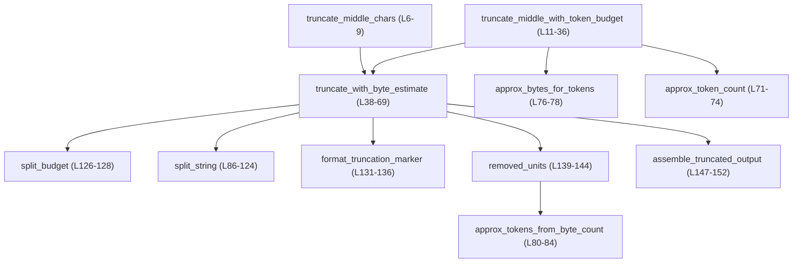
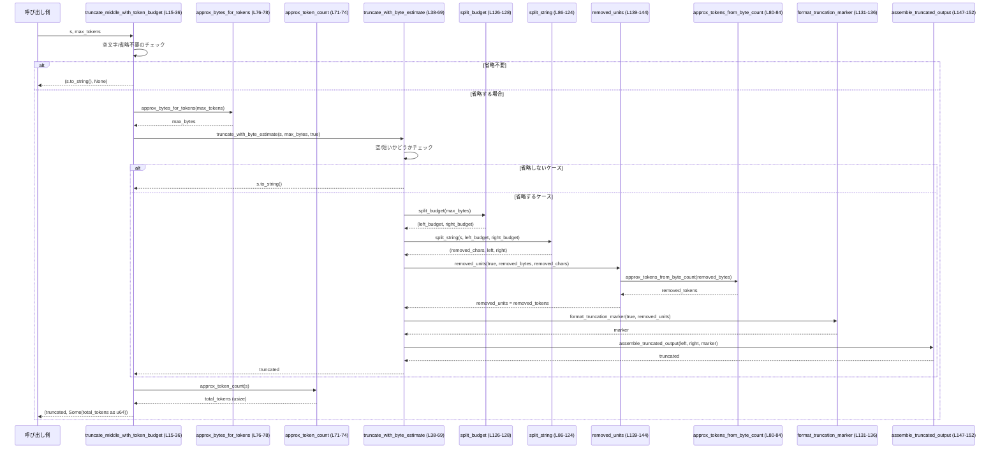

utils\string\src\truncate.rs

---

## 0. ざっくり一言

UTF-8 文字列の「真ん中」を安全に省略しつつ、先頭と末尾を残すためのユーティリティです。  
同時に「1 トークン ≒ 4 バイト」という前提で、トークン数の概算とトークン数ベースの省略も行います（根拠: `truncate.rs:L1-4`）。

---

## 1. このモジュールの役割

### 1.1 概要

- このモジュールは **長い文字列をログや UI に表示する際、全体ではなく先頭と末尾だけを残したい** という問題を解決するために存在します。
- UTF-8 文字列を **バイト境界ではなく文字境界**（コードポイント境界）で安全に分割し、省略部分にマーカー（`…123 chars truncated…` など）を挿入します（根拠: `truncate.rs:L38-69`, `L86-124`, `L131-136`）。
- トークン数を厳密に数えるのではなく、**「4 バイト ≒ 1 トークン」という簡易モデル**に基づいて、トークン数の概算とトークン数ベースの省略を提供します（根拠: `truncate.rs:L4`, `L71-74`, `L76-84`, `L139-144`）。

### 1.2 アーキテクチャ内での位置づけ

このファイルは純粋な文字列ユーティリティであり、外部クレートや他モジュールへの依存はありません。  
内部では、公開関数がいくつかの非公開ヘルパー関数を呼び出す構造になっています。

以下の Mermaid 図は、このファイル内の関数依存関係を示します（対象範囲: `truncate.rs:L4-152`）。



### 1.3 設計上のポイント

- **責務分割**
  - 公開関数は「API 形態の違い」（バイト上限 / トークン上限 / 概算計算）を提供し、実際の省略ロジックは `truncate_with_byte_estimate` と `split_string` に集中しています（根拠: `truncate.rs:L6-9`, `L11-36`, `L38-69`, `L86-124`）。
- **UTF-8 の安全性**
  - 文字列の分割には `chars()` / `char_indices()` を使用し、スライスは常に文字境界で行っています。これにより UTF-8 の途中で切ることによるパニックを避けています（根拠: `truncate.rs:L43`, `L98-103`, `L120-121`）。
- **オーバーフローとエラー耐性**
  - トークン数・バイト数の計算には `saturating_add`, `saturating_mul`, `saturating_sub` を使用し、整数オーバーフローを防いでいます（根拠: `truncate.rs:L72-73`, `L76-77`, `L82-83`, `L92`, `L113`, `L63`）。
  - `u64::try_from` の失敗時や `try_from` のオーバーフローは `unwrap_or(u64::MAX)` で丸め、パニックしない設計です（根拠: `truncate.rs:L29`, `L143`）。
- **副作用なし・並行性**
  - 全ての関数は引数のみに依存し、グローバル状態を変更しません。`unsafe` も使用していないため、任意のスレッドから安全に同時呼び出し可能な純粋関数群です（根拠: `truncate.rs:L1-152` に `static mut` や `unsafe` が存在しないこと）。

---

## 2. 主要な機能一覧

- 中央省略（バイト上限）: `truncate_middle_chars` – 最大バイト数を指定して中央を省略し、削除した「文字数」をマーカーで表示（根拠: `truncate.rs:L6-9`, `L45-49`）。
- 中央省略（トークン上限）: `truncate_middle_with_token_budget` – 概算トークン数上限で中央を省略し、削除前の概算トークン数も返す（根拠: `truncate.rs:L11-36`）。
- 概算トークン数計算: `approx_token_count` – 文字列長（バイト数）から概算トークン数（ceil(len/4)）を計算（根拠: `truncate.rs:L71-74`）。
- トークン⇔バイト変換（概算）:
  - `approx_bytes_for_tokens` – トークン数から概算バイト数に変換（根拠: `truncate.rs:L76-78`）。
  - `approx_tokens_from_byte_count` – バイト数から概算トークン数（u64）に変換（根拠: `truncate.rs:L80-84`）。

---

## 3. 公開 API と詳細解説

### 3.1 コンポーネントインベントリー（定数・関数・モジュール）

| 名前 | 種別 | 公開 | 役割 / 用途 | 根拠 |
|------|------|------|-------------|------|
| `APPROX_BYTES_PER_TOKEN` | 定数 | 非公開 | 1 トークンあたりの概算バイト数（固定で 4 バイト） | `truncate.rs:L4` |
| `truncate_middle_chars` | 関数 | 公開 | 最大バイト数を指定して中央を省略し、「削除された文字数」を表示するマーカーを付加 | `truncate.rs:L6-9` |
| `truncate_middle_with_token_budget` | 関数 | 公開 | 概算トークン数の上限で中央を省略し、元テキストの概算トークン数を `Option` で返す | `truncate.rs:L11-36` |
| `approx_token_count` | 関数 | 公開 | 文字列の概算トークン数（ceil(len/4)）を計算 | `truncate.rs:L71-74` |
| `approx_bytes_for_tokens` | 関数 | 公開 | トークン数から概算必要バイト数 (tokens×4) を計算 | `truncate.rs:L76-78` |
| `approx_tokens_from_byte_count` | 関数 | 公開 | バイト数から概算トークン数（ceil(bytes/4)）を計算 | `truncate.rs:L80-84` |
| `truncate_with_byte_estimate` | 関数 | 非公開 | バイト上限とトークン/文字モードに基づき実際の中央省略を行うコアロジック | `truncate.rs:L38-69` |
| `split_string` | 関数 | 非公開 | 先頭・末尾のバイト予算に従って UTF-8 境界で prefix/suffix を切り出し、削除された文字数も返す | `truncate.rs:L86-124` |
| `split_budget` | 関数 | 非公開 | バイト予算をおおよそ左半分・右半分に分割 | `truncate.rs:L126-128` |
| `format_truncation_marker` | 関数 | 非公開 | トークン数/文字数を埋め込んだ省略マーカー (`"…N tokens truncated…"`) を生成 | `truncate.rs:L131-136` |
| `removed_units` | 関数 | 非公開 | 削除範囲を「トークン数」または「文字数」に変換し、u64 に収める | `truncate.rs:L139-144` |
| `assemble_truncated_output` | 関数 | 非公開 | prefix + marker + suffix を結合した最終的な文字列を構築 | `truncate.rs:L147-152` |
| `tests` | モジュール | 非公開（テスト時のみ） | このモジュールに対するテスト。別ファイルに定義されており、本チャンクには内容は含まれない | `truncate.rs:L155-156` |

---

### 3.2 関数詳細（主要 7 件）

#### `truncate_middle_chars(s: &str, max_bytes: usize) -> String`

**概要**

- 文字列 `s` を最大 `max_bytes` バイトに収まるよう中央を省略し、削除された「文字数」を示すマーカーを挿入した新しい `String` を返します（根拠: `truncate.rs:L6-9`, `L45-49`）。
- トークンではなく「文字数」を基準にマーカーを表示します。

**引数**

| 引数名 | 型 | 説明 |
|--------|----|------|
| `s` | `&str` | 対象となる UTF-8 文字列 |
| `max_bytes` | `usize` | 返される文字列の最大バイト数（目標）。0 の場合は全体が省略され、マーカーのみになります（根拠: `truncate.rs:L45-49`）。 |

**戻り値**

- `String`: 中央が省略された（またはそのままの）新しい所有文字列です。元の `s` が返されることはなく、常に新しい `String` が生成されます（根拠: `truncate.rs:L40`, `L52-53`, `L68-69`, `L147-152`）。

**内部処理の流れ**

- 実際の処理はすべて `truncate_with_byte_estimate(s, max_bytes, false)` に委譲します（根拠: `truncate.rs:L7-8`）。
- `use_tokens = false` によって、マーカーに表示される単位が「chars」になります（根拠: `truncate.rs:L45-49`, `L131-136`, `L139-144`）。
- `truncate_with_byte_estimate` 側の処理詳細は後述します。

**Errors / Panics**

- 明示的なエラー型は返しません。
- 潜在的なパニック要因:
  - `assemble_truncated_output` 内の `prefix.len() + marker.len() + suffix.len() + 1` の加算が理論上 `usize` をオーバーフローすると、デバッグビルドではパニックする可能性があります（根拠: `truncate.rs:L147-148`）。ただし `prefix.len() + suffix.len() <= s.len()` かつ `marker` は短い文字列のため、現実的な長さの文字列では問題になりにくいと考えられます。

**Edge cases（エッジケース）**

- `s` が空文字列: 空の `String` を返します（根拠: `truncate.rs:L38-41`）。
- `max_bytes == 0`:
  - 文字列本体は一切含まれず、`"…N chars truncated…"` 形式のマーカーのみを返します（根拠: `truncate.rs:L45-49`, `L131-136`, `L139-144`）。
- `s.len() <= max_bytes`:
  - 省略されず、そのまま `s.to_string()` が返されます（根拠: `truncate.rs:L52-53`）。

**使用上の注意点**

- `max_bytes` はバイト数であり、文字数ではありません。
  - 例: 日本語などマルチバイト文字を含む場合、`max_bytes` より少ない文字数しか残らないことがあります（UTF-8 の性質）。
- この関数は常に新しい `String` を作成するため、大量・高頻度に呼び出すとヒープ割り当てが増えます（根拠: `truncate.rs:L40`, `L52-53`, `L147-152`）。
- 先頭・末尾は必ず残り、中間のみ削除されるため、秘匿したい情報が先頭や末尾にある場合には意図したマスキングにならない可能性があります（根拠: `truncate.rs:L86-124`）。

---

#### `truncate_middle_with_token_budget(s: &str, max_tokens: usize) -> (String, Option<u64>)`

**概要**

- 概算トークン数 `max_tokens` を上限として、文字列の中央を省略します（根拠: `truncate.rs:L11-15`）。
- 戻り値は `(truncated, Some(original_token_count))` または `(original, None)` で、**省略の有無** と **元の概算トークン数** を示します（根拠: `truncate.rs:L24-35`）。

**引数**

| 引数名 | 型 | 説明 |
|--------|----|------|
| `s` | `&str` | 対象となる UTF-8 文字列 |
| `max_tokens` | `usize` | 概算トークン数の上限。0 の場合、全体が省略されてマーカーだけになります（根拠: `truncate.rs:L20-28`, `L76-78`, `L45-49`）。 |

**戻り値**

- `(String, Option<u64>)`:
  - 第 1 要素 `String`: 中央が省略された結果文字列（または元の文字列のコピー）。
  - 第 2 要素 `Option<u64>`:
    - 省略が発生した場合: `Some(total_tokens)` – 元の文字列の概算トークン数（`approx_token_count` の結果を u64 に変換）。（根拠: `truncate.rs:L29`, `L34-35`）
    - 省略されなかった場合: `None`（根拠: `truncate.rs:L20-22`, `L31-32`）。

**内部処理の流れ**

1. 空文字列なら `(String::new(), None)` を返す（根拠: `truncate.rs:L16-18`）。
2. `max_tokens > 0` かつ `s.len() <= approx_bytes_for_tokens(max_tokens)` の場合:
   - 省略は不要とみなして `s.to_string()` と `None` を返す（根拠: `truncate.rs:L20-22`, `L76-78`）。
3. 上記以外は、`max_tokens` から概算バイト上限を求める:
   - `approx_bytes_for_tokens(max_tokens)` で `max_bytes` を計算（根拠: `truncate.rs:L24-28`, `L76-78`）。
4. `truncate_with_byte_estimate(s, max_bytes, true)` を呼び出し、トークン単位モードで省略を実施（根拠: `truncate.rs:L24-28`, `L38-69`）。
5. `approx_token_count(s)` で元の概算トークン数を計算し、`u64::try_from` で u64 に変換（失敗時は `u64::MAX` に丸め）。（根拠: `truncate.rs:L29`, `L71-74`）
6. 実際に省略されたかどうかを `if truncated == s` で判定し、`None`/`Some(total_tokens)` を切り替える（根拠: `truncate.rs:L31-35`）。

**Errors / Panics**

- 明示的なエラー型は返しません。
- `u64::try_from(approx_token_count(s)).unwrap_or(u64::MAX)` により、オーバーフロー時もパニックせず `u64::MAX` になります（根拠: `truncate.rs:L29`）。
- 他の潜在的なパニック要因は `truncate_middle_chars` と同様、`assemble_truncated_output` の内部加算オーバーフローが理論上あり得ます（根拠: `truncate.rs:L147-148`）。

**Edge cases（エッジケース）**

- `s` が空文字列: `(String::new(), None)`（根拠: `truncate.rs:L16-18`）。
- `max_tokens == 0`:
  - `approx_bytes_for_tokens(0)` は 0 を返すため（根拠: `truncate.rs:L76-78`）、`max_bytes = 0` として `truncate_with_byte_estimate` が呼ばれます。
  - その結果、文字列本体は一切出力されず、`"…N tokens truncated…"` 形式のマーカーのみを含む `String` と `Some(total_tokens)` が返ります（根拠: `truncate.rs:L45-49`, `L59-66`, `L131-136`, `L139-144`）。
- `max_tokens > 0` かつ `s.len() <= approx_bytes_for_tokens(max_tokens)`:
  - 省略は行われず、`(s.to_string(), None)` が返ります（根拠: `truncate.rs:L20-22`）。
  - この場合でも文字列はコピーされ、新規の `String` が生成されます。

**使用上の注意点**

- トークン数は **厳密ではなく概算** です。
  - 4 バイトを 1 トークンとみなしているため、実際のトークナイザの結果とは異なる可能性があります（根拠: `truncate.rs:L4`, `L71-74`, `L76-84`）。
  - 厳密なトークン上限を保証したい用途（API 制限など）では別途の検証が必要です。
- `max_tokens == 0` は「何も残さない」という挙動になるため、「無制限」として扱いたい場合には `usize::MAX` などの大きな値を渡す必要があります。
- 返り値の `Option<u64>` が `None` のときは「省略されていない」ことを示します。  
  単にトークン数を知りたいだけなら `approx_token_count` を直接呼ぶ方が明示的です。

---

#### `approx_token_count(text: &str) -> usize`

**概要**

- 文字列のバイト長 `len` から概算トークン数を計算します。
- 計算式は `ceil(len / 4)` に相当します（根拠: `truncate.rs:L71-74`, `L4`）。

**引数**

| 引数名 | 型 | 説明 |
|--------|----|------|
| `text` | `&str` | 対象文字列 |

**戻り値**

- `usize`: 概算トークン数。`len` が大きすぎる場合でも `saturating_add` により `usize::MAX` 付近で飽和します（根拠: `truncate.rs:L72-73`）。

**内部処理の流れ**

1. `len = text.len()` でバイト数を取得（根拠: `truncate.rs:L72`）。
2. `len.saturating_add(APPROX_BYTES_PER_TOKEN.saturating_sub(1)) / APPROX_BYTES_PER_TOKEN` を計算（根拠: `truncate.rs:L72-73`）。
   - `APPROX_BYTES_PER_TOKEN` は 4 なので、`(len + 3) / 4` と同等です。

**Errors / Panics**

- `saturating_add` を使っているため、加算時のオーバーフローでパニックすることはありません（根拠: `truncate.rs:L72-73`）。
- 除算は 4 で固定のため、ゼロ除算も起こりません（根拠: `truncate.rs:L4`, `L73`）。

**Edge cases**

- `text` が空文字列 (`len == 0`): 戻り値は `0` です。
- `len` が非常に大きい場合:
  - `saturating_add` により `len + 3` が `usize::MAX` を超える場合は `usize::MAX` で飽和します。
  - その後 4 で割るため、返り値は高々 `usize::MAX / 4` です。

**使用上の注意点**

- この値は、`truncate_middle_with_token_budget` の `Option<u64>` と一致するとは限りません（`u64::try_from` 時に `u64::MAX` に丸められる可能性があるため）（根拠: `truncate.rs:L29`）。
- トークナイザ固有のルールを考慮していないため、「大雑把な目安」として扱う前提の関数です。

---

#### `approx_bytes_for_tokens(tokens: usize) -> usize`

**概要**

- トークン数から、必要となる概算バイト数を計算します。
- 計算式は `tokens * 4` で、`saturating_mul` によりオーバーフローを防ぎます（根拠: `truncate.rs:L4`, `L76-78`）。

**引数**

| 引数名 | 型 | 説明 |
|--------|----|------|
| `tokens` | `usize` | 概算トークン数 |

**戻り値**

- `usize`: 必要バイト数（概算）。オーバーフロー時は `usize::MAX` に飽和します。

**内部処理の流れ**

1. `tokens.saturating_mul(APPROX_BYTES_PER_TOKEN)` を返します（根拠: `truncate.rs:L76-77`）。

**Errors / Panics**

- `saturating_mul` により乗算オーバーフロー時にもパニックしません。

**Edge cases**

- `tokens == 0`: 戻り値は 0 です。
- `tokens` が非常に大きい場合: 結果は `usize::MAX` で飽和します。

**使用上の注意点**

- `truncate_middle_with_token_budget` では `max_tokens` をバイト予算に変換する際にこの関数を使います（根拠: `truncate.rs:L24-28`）。  
  そのため、「トークン数上限」も実際にはバイト上限に変換された上で使われます。

---

#### `approx_tokens_from_byte_count(bytes: usize) -> u64`

**概要**

- バイト数から概算トークン数（u64）を計算します。
- `ceil(bytes / 4)` を `u64` で表現した値です（根拠: `truncate.rs:L80-84`, `L4`）。

**引数**

| 引数名 | 型 | 説明 |
|--------|----|------|
| `bytes` | `usize` | バイト数 |

**戻り値**

- `u64`: 概算トークン数。`saturating_add` によりオーバーフロー時でも `u64::MAX` 付近で飽和します（根拠: `truncate.rs:L81-83`）。

**内部処理の流れ**

1. `let bytes_u64 = bytes as u64;` で u64 にキャスト（根拠: `truncate.rs:L81`）。
2. `bytes_u64.saturating_add(3) / 4` 相当の計算を行います（根拠: `truncate.rs:L81-83`）。

**Errors / Panics**

- `usize` → `u64` のキャストはコンパイラが保証する範囲ではパニックしません。
- `saturating_add` によりオーバーフローによるパニックは防がれます。

**Edge cases**

- `bytes == 0`: 戻り値は `0` です。
- 極端に大きな `bytes` の場合、`bytes_u64.saturating_add(3)` が `u64::MAX` に飽和し、結果も `u64::MAX / 4` 程度になります。

**使用上の注意点**

- `removed_units` 内で削除されたバイト数から削除トークン数を求めるために使用されます（根拠: `truncate.rs:L139-144`）。
- あくまで概算値であり、厳密なトークン数ではありません。

---

#### `truncate_with_byte_estimate(s: &str, max_bytes: usize, use_tokens: bool) -> String`

**概要**

- 文字列 `s` を最大 `max_bytes` バイトに収めるよう中央を省略し、削除範囲に応じたマーカーを挿入するコア関数です。
- `use_tokens` により、マーカー内の単位を「トークン数」か「文字数」に切り替えます（根拠: `truncate.rs:L38-69`, `L131-136`, `L139-144`）。

**引数**

| 引数名 | 型 | 説明 |
|--------|----|------|
| `s` | `&str` | 対象文字列 |
| `max_bytes` | `usize` | 出力文字列の目標最大バイト数 |
| `use_tokens` | `bool` | `true` なら削除量をトークン数で、`false` なら文字数で表示 |

**戻り値**

- `String`: 中央省略後の新しい文字列。`s` が空の場合は空の `String`、長さが小さい場合は `s.to_string()` を返します（根拠: `truncate.rs:L38-41`, `L52-53`）。

**内部処理の流れ**

1. 空文字列チェック:
   - `if s.is_empty() { return String::new(); }`（根拠: `truncate.rs:L38-41`）。
2. 文字数カウント:
   - `total_chars = s.chars().count();` を計算（根拠: `truncate.rs:L43`）。  
     これは後で `removed_units` に渡すために使用します。
3. `max_bytes == 0` の特別扱い:
   - 文字列本体を一切残さず、削除された「トークン数または文字数」のみでマーカーを生成して返します（根拠: `truncate.rs:L45-49`）。
4. 文字列がすでに短い場合:
   - `if s.len() <= max_bytes { return s.to_string(); }` としてそのまま返します（根拠: `truncate.rs:L52-53`）。
5. 省略すべき場合:
   - `total_bytes = s.len();`（根拠: `truncate.rs:L56`）。
   - `(left_budget, right_budget) = split_budget(max_bytes);` で予算を左右に分割（根拠: `truncate.rs:L57`, `L126-128`）。
   - `(removed_chars, left, right) = split_string(s, left_budget, right_budget);` で prefix / suffix を切り出し、削除文字数を取得（根拠: `truncate.rs:L58`, `L86-124`）。
   - `removed_bytes = total_bytes.saturating_sub(max_bytes)` を使い、削除された「単位数」を `removed_units` で計算（根拠: `truncate.rs:L61-65`, `L139-144`）。
   - `format_truncation_marker(use_tokens, removed_units(...))` でマーカー文字列を生成（根拠: `truncate.rs:L59-66`, `L131-136`）。
   - 最後に `assemble_truncated_output(left, right, &marker)` で prefix + marker + suffix を結合（根拠: `truncate.rs:L68`, `L147-152`）。

**Errors / Panics**

- `max_bytes == 0` など特別なケースも明示的に処理しているため、境界条件でのパニックは避けられています（根拠: `truncate.rs:L45-53`）。
- UTF-8 境界:
  - `split_string` は `char_indices` を用い、スライスも文字境界で採るため、UTF-8 途中切りによるパニックは発生しません（根拠: `truncate.rs:L98-103`, `L120-121`）。
- 潜在的なパニックは前述の `with_capacity` の加算オーバーフローのみです（根拠: `truncate.rs:L147-148`）。

**Edge cases**

- `s` が空文字: 空の `String` を返す（根拠: `truncate.rs:L38-41`）。
- `max_bytes == 0`: マーカーだけが返る（根拠: `truncate.rs:L45-49`）。
- `s.len() <= max_bytes`: コピーを返し、省略しない（根拠: `truncate.rs:L52-53`）。
- `max_bytes` が非常に小さい:
  - `left_budget` と `right_budget` がそれぞれ 0 または 1 バイト程度となり、prefix/suffix のどちらか、または両方が空になる可能性があります（根拠: `truncate.rs:L57`, `L126-128`, `L86-124`）。

**使用上の注意点**

- この関数は非公開であり、通常は `truncate_middle_chars` または `truncate_middle_with_token_budget` 経由で利用されます。
- 2 回のパス（`chars().count()` と `char_indices()` のループ）を行うため、文字列が極端に長い場合は処理コストに注意が必要です（根拠: `truncate.rs:L43`, `L98-113`）。
- 返り値は常に新しい `String` であり、引数 `s` のライフタイムとは独立しています。

---

#### `split_string(s: &str, beginning_bytes: usize, end_bytes: usize) -> (usize, &str, &str)`

**概要**

- 文字列 `s` に対して、先頭 `beginning_bytes` バイトと末尾 `end_bytes` バイトを優先的に残し、その間を削除対象として扱う関数です。
- 戻り値として「削除された文字数」と「prefix/suffix のスライス」を返します（根拠: `truncate.rs:L86-124`）。

**引数**

| 引数名 | 型 | 説明 |
|--------|----|------|
| `s` | `&str` | 対象文字列 |
| `beginning_bytes` | `usize` | 先頭側に割り当てるバイト予算 |
| `end_bytes` | `usize` | 末尾側に割り当てるバイト予算 |

**戻り値**

- `(removed_chars, before, after)`:
  - `removed_chars: usize` – 中央で削除された文字数（コードポイント数）（根拠: `truncate.rs:L95`, `L113`, `L123`）。
  - `before: &str` – 先頭の prefix。`s[..prefix_end]` のスライス（根拠: `truncate.rs:L93`, `L100-103`, `L120`）。
  - `after: &str` – 末尾の suffix。`s[suffix_start..]` のスライス（根拠: `truncate.rs:L94`, `L105-110`, `L121`）。

**内部処理の流れ**

1. `s` が空のときは `(0, "", "")` を返す（根拠: `truncate.rs:L87-88`）。
2. `len = s.len()` と `tail_start_target = len.saturating_sub(end_bytes)` を計算（根拠: `truncate.rs:L91-92`）。
3. ループで `for (idx, ch) in s.char_indices()` を走査し、各文字について:
   - `char_end = idx + ch.len_utf8()` を計算（根拠: `truncate.rs:L98-99`）。
   - もし `char_end <= beginning_bytes` なら、その文字は prefix に含め、`prefix_end = char_end` とする（根拠: `truncate.rs:L100-102`）。
   - それ以外で `idx >= tail_start_target` の場合:
     - suffix 側に属する文字とみなし、最初の文字で `suffix_start = idx; suffix_started = true` をセット（根拠: `truncate.rs:L105-109`）。
   - 上記どちらでもない場合は中央部分とみなし、`removed_chars` を 1 増やす（根拠: `truncate.rs:L111-113`）。
4. ループ終了後、`suffix_start < prefix_end` の場合は `suffix_start = prefix_end` に揃え、prefix と suffix が重ならないようにする（根拠: `truncate.rs:L116-118`）。
5. `before = &s[..prefix_end]; after = &s[suffix_start..];` を生成して返す（根拠: `truncate.rs:L120-123`）。

**Errors / Panics**

- `char_indices` を利用し、スライスの開始位置・終了位置は常に文字境界となるため、UTF-8 境界違反によるパニックを避けています（根拠: `truncate.rs:L98-103`, `L120-121`）。
- `tail_start_target = len.saturating_sub(end_bytes)` により、`end_bytes > len` の場合も 0 まで飽和し、負になることはありません（根拠: `truncate.rs:L91-92`）。

**Edge cases**

- `s` が空文字: `(0, "", "")`（根拠: `truncate.rs:L87-88`）。
- `beginning_bytes == 0` かつ `end_bytes == 0`:
  - 全ての文字が中央部分となり、`before` と `after` は空文字列になります（根拠: `truncate.rs:L91-92`, `L100-113`, `L120-123`）。
- `beginning_bytes + end_bytes >= len`:
  - prefix と suffix が重なりうるため、最後に `suffix_start = prefix_end` へ調整し、重複しないようにしています（根拠: `truncate.rs:L116-118`）。
- `end_bytes >= len`:
  - `tail_start_target` が 0 になり、全ての文字が suffix 側として扱われます。その場合、prefix は `beginning_bytes` に応じて残る可能性がありますが、結果として `before` と `after` が `s` の部分列として整合的になります。

**使用上の注意点**

- この関数は現在 `truncate_with_byte_estimate` からのみ呼ばれ、戻り値の `&str` スライスはその場で新しい `String` にコピーされるため、外部にはライフタイムの制約が露出しません（根拠: `truncate.rs:L58`, `L147-152`）。
- 将来的にこの関数を外部公開する場合、`before`/`after` は `s` のライフタイムに依存することを明示する必要があります。

---

### 3.3 その他の関数

| 関数名 | 役割（1 行） | 根拠 |
|--------|--------------|------|
| `split_budget(budget: usize) -> (usize, usize)` | バイト予算を左右におおよそ半分ずつ（`budget/2` と `budget - left`）に分ける単純な関数です。 | `truncate.rs:L126-128` |
| `format_truncation_marker(use_tokens: bool, removed_count: u64) -> String` | `use_tokens` に応じて `"…N tokens truncated…"` または `"…N chars truncated…"` の文字列を生成します。 | `truncate.rs:L131-136` |
| `removed_units(use_tokens: bool, removed_bytes: usize, removed_chars: usize) -> u64` | 削除した範囲を「トークン数」または「文字数」に変換します。トークンモードでは削除バイト数から概算トークン数を計算し、文字モードでは削除文字数を u64 に変換して返します。 | `truncate.rs:L139-144` |
| `assemble_truncated_output(prefix: &str, suffix: &str, marker: &str) -> String` | 指定された prefix, marker, suffix を順に結合した新しい `String` を作成します。容量をあらかじめ見積もって `with_capacity` を呼んでいます。 | `truncate.rs:L147-152` |

---

## 4. データフロー

ここでは、`truncate_middle_with_token_budget` を使って長い文字列を省略する典型的なフローを説明します。

### 処理の要点

- 呼び出し側は `s` と `max_tokens` を渡します。
- 関数内部で「省略不要」かどうかを判定し、必要ならバイト予算に変換して `truncate_with_byte_estimate` を呼び出します（根拠: `truncate.rs:L20-28`）。
- 省略が発生する場合、`split_budget`・`split_string` などのヘルパー関数を通じて prefix/suffix と削除量を決定し、マーカー付きの出力文字列を組み立てます（根拠: `truncate.rs:L56-68`, `L86-124`, `L126-152`）。

### シーケンス図

対象範囲: `truncate.rs:L11-36`, `L38-69`, `L71-78`, `L80-84`, `L86-124`, `L126-152`



このように、データは `&str` → バイト数/トークン数 → prefix/suffix スライス → 新しい `String` という流れで処理されます。  
途中で共有状態や I/O は一切発生しないため、並列に複数スレッドから同様の呼び出しを行っても相互干渉はありません。

---

## 5. 使い方（How to Use）

### 5.1 基本的な使用方法

ここでは、同じモジュール内から呼び出す想定でのシンプルな例を示します。

```rust
fn main() {
    // 非常に長いログメッセージを想定する
    let long_log = "BEGIN: ".to_owned()
        + &"x".repeat(10_000) // 長い本体
        + " :END";

    // 1. バイト上限で中央省略する例
    let truncated_bytes = truncate_middle_chars(&long_log, 100); // 最大 100 バイトに収める
    println!("byte-based: {}", truncated_bytes);

    // 2. 概算トークン数上限で中央省略する例
    let max_tokens = 50; // 概算 50 トークン分だけ残す
    let (truncated_tokens, original_token_count) =
        truncate_middle_with_token_budget(&long_log, max_tokens);

    println!("token-based: {}", truncated_tokens);
    match original_token_count {
        Some(count) => println!("original approx tokens = {}", count),
        None => println!("no truncation occurred"),
    }

    // 3. トークン数の概算だけ知りたい場合
    let approx = approx_token_count(&long_log);
    println!("approx tokens (ceil(len/4)) = {}", approx);
}
```

- この例では `truncate_middle_chars` と `truncate_middle_with_token_budget` の両方を利用しています。
- どちらも元の文字列 `long_log` は変更せず、新しい `String` を返します（根拠: `truncate.rs:L40`, `L52-53`, `L147-152`）。

### 5.2 よくある使用パターン

1. **ログの省略**

   - 大量のログを出力する際、1 行の長さを制限する用途。

   ```rust
   fn log_request_body(body: &str) {
       // 4KB 以上のボディは中央省略してログに出す
       let max_bytes = 4 * 1024;
       let shortened = truncate_middle_chars(body, max_bytes);
       println!("[request body] {}", shortened);
   }
   ```

2. **LLM 入力の概算トークン制御**

   - 正確なトークナイザ無しで、おおよそのトークン数を制限したい場合。

   ```rust
   fn prepare_prompt(prompt: &str) -> (String, usize) {
       let max_tokens = 2048;

       let (truncated, original_tokens_opt) =
           truncate_middle_with_token_budget(prompt, max_tokens);

       let used_tokens = approx_token_count(&truncated);
       let original_tokens = original_tokens_opt
           .unwrap_or_else(|| approx_token_count(prompt) as u64);

       println!("original ≒ {}, used ≒ {}", original_tokens, used_tokens);

       (truncated, used_tokens)
   }
   ```

### 5.3 よくある間違い

```rust
// 誤り例: max_bytes を「文字数」と誤解している
let s = "あいうえお"; // 各文字 3 バイト (UTF-8)
let truncated = truncate_middle_chars(&s, 3); // 3 "文字" ではなく 3 "バイト" の予算

// 正しい認識: max_bytes はバイト数
let truncated = truncate_middle_chars(&s, 15); // 5 文字 × 3 バイト = 15 バイトなので、すべて残る
```

```rust
// 誤り例: max_tokens == 0 を「無制限」として使っている
let (truncated, info) = truncate_middle_with_token_budget(&s, 0);
// -> 実際には全体が省略され、マーカーだけになる

// 正しい例: 非常に大きなトークン数を渡して「実質無制限」にする
let (truncated, info) = truncate_middle_with_token_budget(&s, usize::MAX);
```

### 5.4 使用上の注意点（まとめ）

- **単位の違い**
  - `truncate_middle_chars` の `max_bytes` はバイト数、
  - `truncate_middle_with_token_budget` の `max_tokens` は概算トークン数（4 バイト単位）であることに注意します。
- **情報の残り方**
  - アルゴリズムは必ず先頭と末尾を残し、中央のみを削除します（根拠: `truncate.rs:L86-124`）。
  - セキュリティ的に秘匿したい情報が先頭や末尾にある場合、この方式だけでは不十分な可能性があります。
- **並列実行**
  - すべての関数は副作用を持たず、共有可変状態もないため、複数スレッドから同時に安全に呼び出すことができます（根拠: `truncate.rs:L1-152` に `unsafe` や `static mut` が存在しないこと）。

---

## 6. 変更の仕方（How to Modify）

### 6.1 新しい機能を追加する場合

例: 「先頭だけを残して残りを省略」「末尾だけを残す」といったバリエーションを追加したい場合。

1. **エントリポイントの追加**
   - `truncate_middle_chars` と同様のシグネチャで、新しい公開関数を追加するのが自然です（例: `truncate_head_only`）。（追加先: `truncate.rs` の公開関数群付近 `L6-36`）
2. **内部実装の利用**
   - 既存の `truncate_with_byte_estimate` / `split_string` を流用する場合は、予算をどう分配するかを設計し直す必要があります。
   - 例えば「先頭のみ残す」場合は `end_bytes = 0` とした `split_string` 相当の関数を新設することも考えられます（現在の `split_string` は両側に予算を分配する前提です: `truncate.rs:L91-92`）。
3. **マーカーの拡張**
   - マーカー文言を変えたい場合は `format_truncation_marker` を拡張します（根拠: `truncate.rs:L131-136`）。
   - 既存フォーマットとの互換性が重要であれば、既存関数はそのまま残し、別の関数として実装する方が安全です。

### 6.2 既存の機能を変更する場合

変更時に確認すべきポイント:

- **UTF-8 境界の維持**
  - `split_string` で利用している `char_indices` とスライスの関係を崩すと、UTF-8 境界でない位置でスライスしてパニックを引き起こす可能性があります（根拠: `truncate.rs:L98-103`, `L120-121`）。
- **オーバーフロー対策**
  - 概算トークン数計算には `saturating_*` が使われています（根拠: `truncate.rs:L72-73`, `L76-77`, `L82-83`, `L92`, `L113`）。  
    新しい計算式を導入する場合も、極端な入力に対するオーバーフローを避けるため、同様のアプローチを維持するのが望ましいです。
- **契約の維持**
  - `truncate_middle_with_token_budget` の契約:
    - 省略が発生しない場合 `Option<u64>` は `None` であること（根拠: `truncate.rs:L20-22`, `L31-32`）。
    - 省略が発生した場合のみ `Some(original_token_count)` を返すこと（根拠: `truncate.rs:L34-35`）。
  - これを変更すると、呼び出し側が「省略有無を `Option` で判定する」前提を崩すことになります。
- **テストの更新**
  - `#[cfg(test)] mod tests;` が定義されているため（根拠: `truncate.rs:L155-156`）、仕様変更時は該当テストの内容も確認・更新する必要があります。
  - テストモジュールの実体はこのチャンクに含まれないため、別ファイル（通常は `truncate/tests.rs` または `truncate/tests/mod.rs`）を確認する必要があります。

---

## 7. 関連ファイル

| パス / モジュール | 役割 / 関係 |
|------------------|------------|
| `tests`（モジュール名、パスは本チャンク外） | `#[cfg(test)] mod tests;` により、このファイル用のテストモジュールが存在することが示されています（根拠: `truncate.rs:L155-156`）。通常は同ディレクトリ配下の別ファイルにテストが定義されていると考えられますが、本チャンクからは具体的なパスや内容は分かりません。 |

このファイル単体では、外部モジュールや外部クレートとの直接的な依存は見られません（根拠: `truncate.rs:L1-156` に `use` 文や外部クレート参照がないこと）。  
したがって、このモジュールは「自己完結した文字列省略ユーティリティ」として、他の任意のコードから安全に再利用できる構造になっています。
