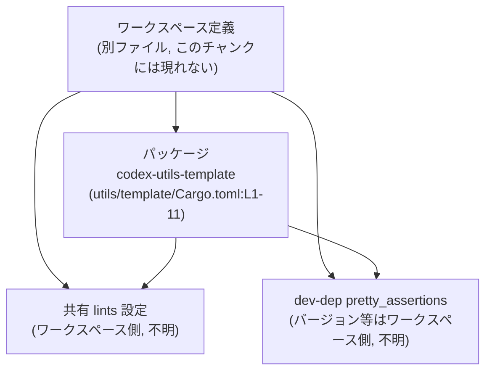
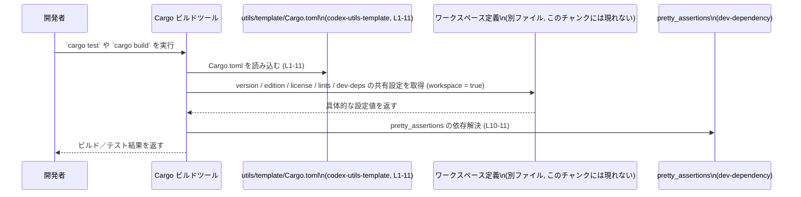

# utils/template/Cargo.toml コード解説

---

## 0. ざっくり一言

`utils/template/Cargo.toml` は、Cargo ワークスペース内のパッケージ `codex-utils-template` のメタデータと、ワークスペース共有設定・開発用依存クレートを指定する設定ファイルです（根拠: `Cargo.toml:L1-5,L7-11`）。

---

## 1. このモジュールの役割

### 1.1 概要

- このファイルは Rust のビルドツール Cargo が読む設定ファイルであり、パッケージ `codex-utils-template` の **名前** と、**バージョン / edition / license / lints をワークスペースから継承する** ことを指定しています（根拠: `Cargo.toml:L1-5,L7-8`）。
- 開発時・テスト時のみ利用する dev-dependency として、`pretty_assertions` クレートをワークスペース共有設定から参照するよう指定しています（根拠: `Cargo.toml:L10-11`）。

### 1.2 アーキテクチャ内での位置づけ

このファイルは、Cargo ワークスペースにおける 1 パッケージの設定と、ワークスペース共通設定・開発用クレートとの関係を定義しています。

- `version.workspace = true` などの指定により、バージョンや edition、license はワークスペース側の定義に依存します（根拠: `Cargo.toml:L3-5`）。
- `[lints] workspace = true` により、コンパイル時の lint 設定もワークスペース側で一元管理されます（根拠: `Cargo.toml:L7-8`）。
- `[dev-dependencies]` の `pretty_assertions = { workspace = true }` により、このパッケージのテスト等で `pretty_assertions` が利用可能になりますが、実際のバージョン指定はワークスペースに委ねられます（根拠: `Cargo.toml:L10-11`）。

ワークスペース全体の構造はこのチャンクには現れませんが、一般的には次のような関係になります。



### 1.3 設計上のポイント

コード（設定）から読み取れる特徴は次のとおりです。

- **メタデータの集中管理**  
  - `version.workspace = true`, `edition.workspace = true`, `license.workspace = true` により、バージョン・edition・ライセンスはワークスペース側で一括定義する設計になっています（根拠: `Cargo.toml:L3-5`）。
- **lint 設定の一元化**  
  - `[lints] workspace = true` により、コンパイル時の lint 設定もワークスペースで統一されます（根拠: `Cargo.toml:L7-8`）。
- **開発用依存関係のワークスペース共有**  
  - `pretty_assertions = { workspace = true }` により、このパッケージの dev-dependency のバージョンもワークスペースと共有されます（根拠: `Cargo.toml:L10-11`）。
- **状態を持たない設定ファイル**  
  - 実行時の状態やロジックはなく、すべてビルド時に Cargo が解釈する静的設定です（根拠: `Cargo.toml:L1-11` にコード（Rust ソース）が一切ないこと）。

---

## 2. 主要な機能一覧（コンポーネントインベントリー）

このファイルが提供する「機能」は、ビルド設定上の役割として整理できます。

| コンポーネント / 機能 | 説明 | 根拠 |
|-----------------------|------|------|
| パッケージ名定義 | パッケージ名を `codex-utils-template` に設定する | `Cargo.toml:L1-2` |
| バージョンのワークスペース継承 | `version.workspace = true` により、バージョン番号をワークスペース共通設定から継承する | `Cargo.toml:L3` |
| edition のワークスペース継承 | `edition.workspace = true` により、Rust edition をワークスペース共通設定から継承する | `Cargo.toml:L4` |
| license のワークスペース継承 | `license.workspace = true` により、ライセンス表記をワークスペース共通設定から継承する | `Cargo.toml:L5` |
| lint 設定のワークスペース継承 | `[lints] workspace = true` により、lint 設定をワークスペース共通設定から継承する | `Cargo.toml:L7-8` |
| 開発用依存 `pretty_assertions` の共有 | テスト等で利用する `pretty_assertions` を dev-dependency として宣言し、バージョンなどをワークスペースに委ねる | `Cargo.toml:L10-11` |

箇条書きとしてまとめると:

- パッケージ名の宣言: `codex-utils-template`（根拠: `Cargo.toml:L1-2`）
- バージョン・edition・license のワークスペース共有設定（根拠: `Cargo.toml:L3-5`）
- lint 設定のワークスペース共有（根拠: `Cargo.toml:L7-8`）
- 開発用 dev-dependency `pretty_assertions` のワークスペース共有（根拠: `Cargo.toml:L10-11`）

---

## 3. 公開 API と詳細解説

このファイルには Rust の関数や型定義は存在しません。ここでは「API」の代わりに、Cargo 設定エントリを扱います。

### 3.1 型一覧（構造体・列挙体など）

- このファイルは TOML 形式の設定のみを含み、Rust の構造体・列挙体・型定義は存在しません（根拠: `Cargo.toml:L1-11`）。

### 3.2 関数詳細（最大 7 件）

- 関数やメソッドの定義は一切含まれていません（根拠: `Cargo.toml:L1-11`）。
- したがって、本セクションで解説すべき「呼び出し可能な公開関数」はありません。

### 3.3 その他の関数

- 補助関数やラッパー関数も存在しません（根拠: `Cargo.toml:L1-11`）。

---

## 4. データフロー（ビルド時の利用フロー）

このファイルは実行時のデータを扱いませんが、Cargo がビルド・テスト時にどのように設定を解釈するかという「処理フロー」を示します。

### 4.1 処理の要点

- 開発者が `codex-utils-template` をビルドまたはテストするとき、Cargo はまずこの `Cargo.toml` を読み込み、パッケージ名や workspace 継承設定を解釈します（根拠: `Cargo.toml:L1-5`）。
- その後、ワークスペース側の `Cargo.toml`（このチャンクには現れない）から `version`, `edition`, `license`, `lints`, `pretty_assertions` の具体的な値を取得します（根拠: `Cargo.toml:L3-5,L7-8,L10-11`）。
- dev-dependency である `pretty_assertions` は通常、テスト実行時にのみ解決され、テストコードから利用されます（dev-dependency の一般的な挙動に基づく説明）。

### 4.2 シーケンス図



> 注: ワークスペース定義ファイル（通常はリポジトリルートの `Cargo.toml`）は、このチャンクには含まれていないため、具体的な中身は「不明」としています。

---

## 5. 使い方（How to Use）

### 5.1 基本的な使用方法

このファイルは Cargo によって自動的に読み込まれるため、通常は明示的に「呼び出す」必要はありません。利用者の視点から見た基本フローは次の通りです。

1. リポジトリルート（ワークスペース）で `cargo build` や `cargo test` を実行する。
2. Cargo が `codex-utils-template` パッケージを処理する際に、この `utils/template/Cargo.toml` を読む。
3. ワークスペース共有設定（version / edition / license / lints / dev-dependencies）を解決し、その設定に従ってコンパイル・テストを行う。

開発用依存 `pretty_assertions` の一般的な利用例を示します（このリポジトリ内に同一のコードが存在するかどうかは、このチャンクからは分かりません）。

```rust
// tests/example.rs などのテストコード例（一般的な使用イメージ）

use pretty_assertions::assert_eq; // dev-dependency として追加したクレートをインポートする

#[test]
fn comparison_is_pretty() {
    // 期待値と実際の値を比較する
    assert_eq!("expected", "expected"); // 差分がある場合、見やすい diff を表示してくれる
}
```

この例を実行するためには、`pretty_assertions` が dev-dependency として解決されている必要があります（根拠: `Cargo.toml:L10-11`）。

### 5.2 よくある使用パターン

- **ワークスペースで共通化されたメタデータをそのまま使う**  
  - 個別パッケージでは `version.workspace = true` 等を記述するだけにして、具体的なバージョン値はワークスペースで管理します（根拠: `Cargo.toml:L3-5`）。
- **全パッケージで共通の lint 設定を適用する**  
  - `[lints] workspace = true` により、ワークスペースで設定した clippy などの lint 方針を全パッケージに適用します（根拠: `Cargo.toml:L7-8`）。
- **テスト時のみ `pretty_assertions` を利用する**  
  - `[dev-dependencies]` にのみ `pretty_assertions` を記述しているため、本番バイナリにはリンクされず、テストやベンチマークなどの開発フェーズでのみ利用されます（根拠: `Cargo.toml:L10-11`）。

### 5.3 よくある間違い

この種の設定ファイルで起こりがちな誤用を、一般的な例として挙げます（本リポジトリで実際に起きているわけではありません）。

```toml
# 間違い例: ワークスペースで定義していないのに workspace = true を書く
[dev-dependencies]
pretty_assertions = { workspace = true }  # ルートの workspace で pretty_assertions が定義されていないと解決エラーになる

# 正しい例: ルート workspace 側でバージョンを定義してから共有する
# （この定義は別ファイルに書かれる想定であり、このチャンクには現れません）
[workspace.dependencies]
pretty_assertions = "1.4"
```

```toml
# 間違い例: 本番コードでも使いたいのに dev-dependencies に書いてしまう
[dev-dependencies]
serde = { workspace = true }

# 正しい例: 本番コードから参照するなら [dependencies] に記述する
[dependencies]
serde = { workspace = true }
```

### 5.4 使用上の注意点（まとめ）

- `*.workspace = true` を使う場合、対応する設定がワークスペース側に存在している必要があります。存在しない場合、Cargo が設定を解決できずエラーになります（一般的な Cargo の仕様に基づく注意点）。
- dev-dependency は本番バイナリには含まれないため、本番コードから `pretty_assertions` を使うとコンパイルエラーになります（根拠: `Cargo.toml:L10-11` で `[dev-dependencies]` にのみ記述されていること）。
- lint 設定をワークスペースに完全に委ねているため、このパッケージ単体で lint を緩和・変更したい場合は、ワークスペース側の設定を変更する必要があります（根拠: `Cargo.toml:L7-8`）。

---

## 6. 変更の仕方（How to Modify）

### 6.1 新しい機能を追加する場合（設定・依存追加）

このファイルに対して現実的に行う「機能追加」は、依存クレートや設定の追加です。

- **新しい dev-dependency を追加する場合**
  1. ワークスペース全体で共有したい場合  
     - ルートのワークスペース定義側に依存クレートを追加した上で（このチャンクには現れません）、  
       本ファイルでは次のように `workspace = true` を用いて参照します（一般的なパターン）。

       ```toml
       [dev-dependencies]
       pretty_assertions = { workspace = true }   # 既存
       insta = { workspace = true }               # 新規追加例
       ```

  2. このパッケージ専用の dev-dependency にしたい場合  
     - 本ファイル側で直接バージョンなどを指定します。

       ```toml
       [dev-dependencies]
       pretty_assertions = { workspace = true } # 共有のまま
       insta = "1.39"                           # このパッケージ専用
       ```

- **パッケージ固有の version / edition / license を持たせたい場合**

  ```toml
  [package]
  name = "codex-utils-template"
  version = "0.1.0"        # workspace 継承をやめて固定値に変更
  edition = "2021"
  license = "MIT OR Apache-2.0"
  ```

  このような変更を行うと、バージョンなどの管理がワークスペースと分離されるため、管理ポリシーに注意が必要です。

### 6.2 既存の機能を変更する場合（影響範囲と契約）

- **ワークスペース継承の解除・変更**

  - `version.workspace = true` などを削除または変更すると、このパッケージだけ別バージョンや別ライセンスになる可能性があります（根拠: `Cargo.toml:L3-5`）。
  - その場合、パッケージ間の整合性（バージョン整合、一括ライセンス管理など）が崩れないか確認する必要があります。

- **lint 設定の変更**

  - `[lints] workspace = true` を変更して個別の lint 設定を書き始めると、他パッケージと lint 方針が異なる状態になります（根拠: `Cargo.toml:L7-8`）。
  - CI やチームのスタイルガイドとの整合性を確認することが前提になります。

- **dev-dependency の変更**

  - `pretty_assertions = { workspace = true }` を削除・変更すると、このパッケージのテストがコンパイルできなくなる可能性があります（根拠: `Cargo.toml:L10-11`）。
  - `workspace = true` をやめて個別バージョンに変更する場合、ワークスペース内の他パッケージとバージョンがずれていないかを確認する必要があります。

---

## 7. 関連ファイル

このチャンクには他ファイルの内容は現れませんが、Cargo の挙動と `workspace = true` の仕様から、関連する構成要素を整理します。

| パス / コンポーネント | 役割 / 関係 | このチャンクから分かること |
|------------------------|------------|----------------------------|
| ワークスペースルートの `Cargo.toml` | `version`, `edition`, `license`, `lints`, `pretty_assertions` などの共有設定を定義していると推定されます | `*.workspace = true` の指定から、何らかのワークスペース定義が存在することは分かりますが、実際のパス・中身はこのチャンクには現れません |
| `utils/template/Cargo.toml`（本ファイル） | パッケージ `codex-utils-template` の設定を定義し、ワークスペース共有設定と dev-dependency を参照します | 内容は本レポートで全てカバーしています（根拠: `Cargo.toml:L1-11`） |
| `pretty_assertions` クレート | 本パッケージのテスト・開発用に利用可能な dev-dependency | `[dev-dependencies]` に名前が現れることから利用可能であることは分かりますが、具体的な利用箇所はこのチャンクには現れません（根拠: `Cargo.toml:L10-11`） |

---

### Bugs / Security / Edge Cases（設定ファイルとしての注意点）

- **ビルドエラー（設定不整合）の可能性**
  - ワークスペース側で `version` や `pretty_assertions` が定義されていない場合、`workspace = true` による解決が失敗し、ビルド／テストがエラーになります（一般的な Cargo の挙動）。
- **セキュリティ面**
  - このファイル自体には実行可能なロジックはなく、直接的なセキュリティホールは含まれません（根拠: `Cargo.toml:L1-11` にコードが存在しないこと）。
  - ただし、ワークスペース側で指定する依存クレートのバージョン選択（例: `pretty_assertions` のバージョン）は、間接的にセキュリティに影響しうるため、ワークスペース側の管理が重要です（依存管理に関する一般的な注意点）。
- **並行性・パフォーマンス**
  - 実行時の並行処理やパフォーマンスに直接影響するロジックは含まれません（設定ファイルのみであるため）。  
  - ただし、開発用依存が増えるとビルド・テスト時間は間接的に増加しうる点は一般的な注意点として挙げられます。

このファイルは、主に「ワークスペース共通設定を参照する薄いフロント」として機能している、という理解で十分です。
