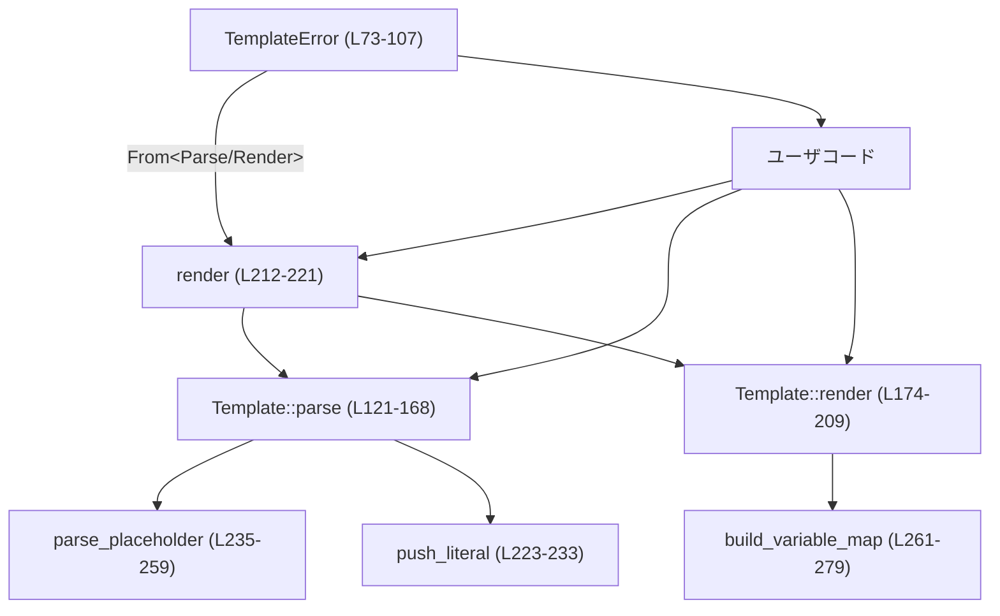
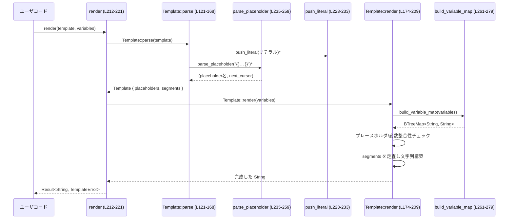

# utils/template/src/lib.rs 解説レポート

## 0. ざっくり一言

`utils/template/src/lib.rs` は、`{{ name }}` 形式のプレースホルダを持つ非常にシンプルで「厳密」なテンプレートエンジンを提供するモジュールです（lib.rs:L1-L6）。  
パース時とレンダリング時に厳密な検査を行い、「未使用の値」や「未定義のプレースホルダ」などをすべてエラーにします。

---

## 1. このモジュールの役割

### 1.1 概要

- このモジュールは **シンプルなテキストテンプレート** を安全かつ厳密に扱うために存在し、次の機能を提供します。
  - テンプレート文字列のパースと検証（`Template::parse`）（lib.rs:L121-L168）
  - パース結果（`Template`）を使った再利用可能なレンダリング（`Template::render`）（lib.rs:L174-L209）
  - 1ステップでパース＋レンダリングを行うヘルパ関数（`render`）（lib.rs:L212-L221）
  - 詳細なエラー種別（パース／レンダリング）を表す公開エラー型（lib.rs:L13-L19, L48-L53, L73-L77）

### 1.2 アーキテクチャ内での位置づけ

このファイル単体で完結しており、外部依存は標準ライブラリのみです。  
内部の依存関係は次のようになっています。



- `render` 関数は、高レベルの「入口」として `Template::parse` と `Template::render` を連結します。
- `Template::parse` は内部ヘルパ `parse_placeholder`・`push_literal` を用いてテンプレート構造を構築します。
- `Template::render` は内部ヘルパ `build_variable_map` を用いて変数マップを構築します。
- `TemplateError` は `TemplateParseError` / `TemplateRenderError` からの `From` 実装でラップされます（lib.rs:L97-L107）。

### 1.3 設計上のポイント

- **責務分割**
  - パースとレンダリングを `Template` 型にまとめつつも、1ステップ関数 `render` も提供（lib.rs:L121-L221）。
  - パースエラーとレンダリングエラーを別 enum に分離し、それらを `TemplateError` でラップ（lib.rs:L13-L19, L48-L53, L73-L77）。
- **厳密性**
  - プレースホルダ名が空、ネスト、未終端、余分な `}}` などをすべてエラーとする（lib.rs:L13-L19, L128-L168, L235-L259）。
  - テンプレートが使わない変数が提供された場合もエラー（`ExtraValue`）（lib.rs:L190-L194）。
  - 同じ変数名を複数回渡すとエラー（`DuplicateValue`）（lib.rs:L269-L277）。
- **状態管理**
  - `Template` はパース結果（プレースホルダ集合＋セグメント列）を保持し、レンダリング時は読み取り専用（`&self`）です（lib.rs:L115-L119, L174-L209）。
  - 内部に可変・グローバル状態はなく、関数はすべて純粋な計算に近い動作をします。
- **エラーハンドリング**
  - すべて `Result` ベースのエラー処理で、パニックは使っていません。
  - 各エラーは `std::error::Error` を実装しており、上位レイヤでチェインしやすい構造になっています（lib.rs:L21-L46, L55-L71, L79-L107）。
- **並行性**
  - `Template::render` は `&self` を取り内部状態を書き換えないため、同じ `Template` を複数スレッドから同時に使うことができます（型システム的に安全）（lib.rs:L174-L209）。
  - グローバル変数や `unsafe` は使用していません（このチャンクには現れません）。

---

## 2. 主要な機能一覧

- テンプレート文字列のパース（`Template::parse`）: `{{...}}` 構文を解析し、プレースホルダ集合とセグメント列を構築する（lib.rs:L121-L168）。
- プレースホルダ名一覧の取得（`Template::placeholders`）: テンプレートが要求する変数名をソート済みで列挙する（lib.rs:L170-L172）。
- テンプレートのレンダリング（`Template::render`）: 与えられた変数を埋め込み、整合性を厳密にチェックした上で文字列を生成する（lib.rs:L174-L209）。
- 高レベルヘルパ（`render` 関数）: 生の文字列テンプレートから直接レンダリングするワンショット API（lib.rs:L212-L221）。
- 内部パーサヘルパ（`parse_placeholder`）: `{{ ... }}` 内部のテキストを抽出・検証する（lib.rs:L235-L259）。
- 内部レンダリングヘルパ（`build_variable_map`）: 変数の重複を検出しつつ `BTreeMap` にまとめる（lib.rs:L261-L279）。
- リテラル処理ヘルパ（`push_literal`）: 隣接リテラルの連結など、セグメント列の正規化を行う（lib.rs:L223-L233）。
- エラー型群（`TemplateParseError`, `TemplateRenderError`, `TemplateError`）: それぞれの失敗パターンを区別しやすく表現する（lib.rs:L13-L19, L48-L53, L73-L77）。

### 2.1 コンポーネント一覧（型・関数インベントリー）

| 名前 | 種別 | 公開 | 行範囲 | 役割 |
|------|------|------|--------|------|
| `TemplateParseError` | enum | pub | lib.rs:L13-L19 | テンプレート構文のパース時エラー種別 |
| `TemplateRenderError` | enum | pub | lib.rs:L48-L53 | レンダリング時エラー種別 |
| `TemplateError` | enum | pub | lib.rs:L73-L77 | パース／レンダリングをラップする高レベルエラー |
| `Segment` | enum | private | lib.rs:L109-L113 | パース済みテンプレートの1要素（リテラルかプレースホルダ） |
| `Template` | struct | pub | lib.rs:L115-L119 | パース済みテンプレート本体 |
| `Template::parse` | 関数（assoc） | pub | lib.rs:L121-L168 | テンプレート文字列のパース |
| `Template::placeholders` | 関数（メソッド） | pub | lib.rs:L170-L172 | プレースホルダ名の列挙 |
| `Template::render` | 関数（メソッド） | pub | lib.rs:L174-L209 | パース済みテンプレートのレンダリング |
| `render` | 関数 | pub | lib.rs:L212-L221 | 文字列テンプレートのワンショットレンダリング |
| `push_literal` | 関数 | private | lib.rs:L223-L233 | リテラルセグメントの追加・結合 |
| `parse_placeholder` | 関数 | private | lib.rs:L235-L259 | `{{ ... }}` パートの解析・検証 |
| `build_variable_map` | 関数 | private | lib.rs:L261-L279 | 変数のマップ化と重複検出 |
| `tests` モジュール内各テスト | 関数 | private | lib.rs:L282-L441 | 仕様検証用ユニットテスト群 |

---

## 3. 公開 API と詳細解説

### 3.1 型一覧（構造体・列挙体など）

| 名前 | 種別 | 役割 / 用途 | 行範囲 |
|------|------|-------------|--------|
| `TemplateParseError` | enum | プレースホルダ構文や区切りの問題など、テンプレートのパース時に発生しうるエラーを表します。 | lib.rs:L13-L19 |
| `TemplateRenderError` | enum | 変数の欠如・重複・未使用など、レンダリング時の不整合を表します。 | lib.rs:L48-L53 |
| `TemplateError` | enum | パースエラーとレンダリングエラーをまとめて扱うラッパー型です。 | lib.rs:L73-L77 |
| `Template` | struct | パース済みテンプレートを保持し、再利用可能なレンダリングを提供する中心的な型です。 | lib.rs:L115-L119 |

#### `TemplateParseError` のバリアント（lib.rs:L13-L19）

- `EmptyPlaceholder { start: usize }`  
  `{{ }}` の中身が空（空白のみ）だった場合のエラー。`start` はテンプレート先頭からのバイト位置。
- `NestedPlaceholder { start: usize }`  
  プレースホルダ内部にさらに `{{` が現れた場合のエラー。
- `UnmatchedClosingDelimiter { start: usize }`  
  対応する `{{` がない `}}` が現れた場合のエラー。
- `UnterminatedPlaceholder { start: usize }`  
  `{{` で始まったプレースホルダが `}}` で閉じられずに入力が終わった場合のエラー。

#### `TemplateRenderError` のバリアント（lib.rs:L48-L53）

- `DuplicateValue { name: String }`  
  同じキー名の変数が複数回指定された場合。
- `ExtraValue { name: String }`  
  テンプレートで使われていない変数が渡された場合。
- `MissingValue { name: String }`  
  テンプレートで要求されるプレースホルダに対応する変数が渡されていない場合。

#### `TemplateError`（lib.rs:L73-L77, L79-L107）

- `Parse(TemplateParseError)`  
  パースエラーのラップ。
- `Render(TemplateRenderError)`  
  レンダリングエラーのラップ。

`From<TemplateParseError>` および `From<TemplateRenderError>` の実装により、自動的に `TemplateError` に変換されます（lib.rs:L97-L107）。

### 3.2 関数詳細（代表 7 件）

#### `Template::parse(source: &str) -> Result<Template, TemplateParseError>`

**概要**

- テンプレート文字列から `Template` 構造を構築します（lib.rs:L121-L168）。
- プレースホルダ `{{ name }}` とリテラル部分を分割し、プレースホルダ名集合も同時に構築します。

**引数**

| 引数名 | 型 | 説明 |
|--------|----|------|
| `source` | `&str` | テンプレート元文字列。UTF-8 文字列として扱われます。 |

**戻り値**

- `Ok(Template)`  
  パース成功時。`Template` にはプレースホルダ集合（`BTreeSet<String>`）とセグメント列（`Vec<Segment>`）が格納されます（lib.rs:L115-L119）。
- `Err(TemplateParseError)`  
  構文エラーがあった場合。詳細はバリアントで区別されます。

**内部処理の流れ（アルゴリズム）**

1. 空の `placeholders`（`BTreeSet`）と `segments`（`Vec`）、`literal_start`・`cursor` を初期化（lib.rs:L123-L126）。
2. `cursor < source.len()` の間ループし、`rest = &source[cursor..]` を取得（lib.rs:L128-L129）。
3. 先頭マッチの優先順位で判定（lib.rs:L130-L155）:
   - `{{{{` → 直前までのリテラルを `push_literal` で追加し、リテラル `"{{"` を追加（lib.rs:L130-L135）。
   - `}}}}` → 同様に `"}}“` をリテラルとして追加（lib.rs:L137-L142）。
   - `{{` → 直前までのリテラルを追加後、`parse_placeholder` に渡してプレースホルダ名と次の位置を取得（lib.rs:L144-L147）。プレースホルダ名を集合に登録し、`Segment::Placeholder` を `segments` に追加（lib.rs:L147-L149）。
   - `}}` → 対応する `{{` が無いとみなし `UnmatchedClosingDelimiter` エラー（lib.rs:L153-L155）。
4. 上記どれにもマッチしない場合は、先頭の Unicode 1 文字を `chars().next()` で取得し、その UTF-8 長だけ `cursor` を進める（lib.rs:L157-L160）。
5. ループ終了後、最後の `literal_start` 以降のリテラルを `push_literal` で追加（lib.rs:L163-L167）。
6. `Template { placeholders, segments }` を返す（lib.rs:L163-L167）。

**Errors / Panics**

- `TemplateParseError::EmptyPlaceholder`  
  `{{   }}` のように、中身が空白だけだった場合（lib.rs:L245-L248）。
- `TemplateParseError::NestedPlaceholder`  
  プレースホルダ内に `{{` が現れた場合（lib.rs:L241-L243）。
- `TemplateParseError::UnmatchedClosingDelimiter`  
  `}}` が余分に現れた場合（lib.rs:L153-L155）。
- `TemplateParseError::UnterminatedPlaceholder`  
  `{{` に対応する `}}` が無いまま入力が終わった場合（lib.rs:L239-L259）。

パニックは使用していません。

**Edge cases（エッジケース）**

- 空文字列 `""`  
  `placeholders` 空、`segments` 空の `Template` が生成されます（ループを一度も通らず、最後の `push_literal` で何も追加しない）（lib.rs:L128-L168）。
- 全てリテラルでプレースホルダ無し  
  `placeholders` は空、`segments` はリテラル1要素（または結合された複数リテラル）になります。
- エスケープされたデリミタ
  - `{{{{` → リテラル `"{{"` として扱われます（lib.rs:L130-L135）。
  - `}}}}` → リテラル `"}}"` として扱われます（lib.rs:L137-L142）。
- マルチバイト文字  
  文字単位で `cursor` を進めているため、UTF-8 の境界を壊すことなく安全にスライスしています（lib.rs:L157-L160, L252-L255）。

**使用上の注意点**

- プレースホルダ名内部で `{{` や `}}` を使用することはできません（構文エラーになります）（lib.rs:L239-L245）。
- プレースホルダ名は空白をトリムした結果が空だとエラーです（lib.rs:L245-L248）。
- プレースホルダ名にどの文字を使うかの制限はコード上明示されておらず、トリム後に空でなければ `String` としてそのまま使われます。

---

#### `Template::placeholders(&self) -> impl ExactSizeIterator<Item = &str>`

**概要**

- テンプレート内で使用されるプレースホルダ名を、ソート済みかつ重複なしで列挙するイテレータを返します（lib.rs:L170-L172）。

**引数**

- なし（`&self` のみ）。

**戻り値**

- `impl ExactSizeIterator<Item = &str>`  
  `&str` のイテレータ。内部的には `BTreeSet<String>` のイテレータを `map(String::as_str)` したものです。

**内部処理**

- `self.placeholders.iter().map(String::as_str)` を返すだけの薄いラッパです（lib.rs:L170-L172）。

**Edge cases**

- プレースホルダが無いテンプレートでは、長さ 0 のイテレータになります。
- 並び順は `BTreeSet` による辞書順です（テストでも確認）（lib.rs:L320-L324）。

**使用上の注意点**

- `Iterator` を消費すると再利用できないため、複数回必要な場合は `collect::<Vec<_>>()` などで材料を確保する必要があります。

---

#### `Template::render<I, K, V>(&self, variables: I) -> Result<String, TemplateRenderError>`

**概要**

- パース済みテンプレートに対して、与えられた変数マップを埋め込んで最終文字列を生成します（lib.rs:L174-L209）。
- 変数の「不足」「余剰」「重複」をすべてエラーとする点が特徴です。

**引数**

| 引数名 | 型 | 説明 |
|--------|----|------|
| `variables` | `I` where `I: IntoIterator<Item = (K, V)>` | `(名前, 値)` ペアの反復子。`K` と `V` は `AsRef<str>` を実装していればよいので、`&str`, `String` などを渡せます。 |

**戻り値**

- `Ok(String)`  
  プレースホルダがすべて埋め込まれた完成文字列。
- `Err(TemplateRenderError)`  
  以下のいずれか：
  - `DuplicateValue`（同じ名前の変数が複数回）
  - `MissingValue`（必要な変数が不足）
  - `ExtraValue`（テンプレートが使わない変数が渡された）

**内部処理の流れ**

1. `build_variable_map(variables)?` で `BTreeMap<String, String>` に変換しつつ、重複名を検出（lib.rs:L180-L181, L261-L279）。
2. `self.placeholders` に含まれる全ての名前について、`variables` にキーが存在するかチェック。なければ `MissingValue` を返す（lib.rs:L182-L188）。
3. 逆に、`variables` のキーのうち `self.placeholders` に存在しないものがあれば `ExtraValue` を返す（lib.rs:L190-L194）。
4. `segments` を順に走査し、`Literal` なら文字列をそのまま追加、`Placeholder` なら対応する値を取得して追加（lib.rs:L196-L207）。
   - この時点で再度 `MissingValue` をチェックしていますが、2 の検査により通常は発生しません（lib.rs:L199-L203）。
5. 完成した `rendered` を返します（lib.rs:L196-L208）。

**Errors / Panics**

- `TemplateRenderError::DuplicateValue`  
  `variables` 内に同じ名前のペアが複数ある場合（lib.rs:L269-L277）。
- `TemplateRenderError::MissingValue`  
  - プレースホルダ名に対応する変数が `variables` に存在しない場合（事前の検査）（lib.rs:L182-L188）。
  - あるいはセグメント走査中に見つからなかった場合（理論上は起きないが再チェック）（lib.rs:L201-L203）。
- `TemplateRenderError::ExtraValue`  
  テンプレート内のプレースホルダ集合に含まれない名前の変数が提供された場合（lib.rs:L190-L194）。

パニックは使われていません。

**Edge cases**

- 変数が1つも渡されないテンプレート
  - `placeholders` が空であれば成功（全リテラル）。
  - `placeholders` が非空なら `MissingValue` エラー（lib.rs:L182-L188）。
- 変数が余計に渡された場合  
  `ExtraValue` としてエラー（lib.rs:L190-L194）。
- 同じ変数名を複数回渡した場合  
  `build_variable_map` が `DuplicateValue` を返す（lib.rs:L269-L277）。
- 大文字・小文字の扱い  
  プレースホルダ名と変数名は完全一致が必要で、大文字・小文字は区別されます（コード中に case-insensitive 処理はありません）。

**使用上の注意点**

- この実装は「厳密」なので、「使われない変数を許容したい」といったユースケースにはそのままでは合いません。その場合は呼び出し側で変数集合を調整する必要があります。
- `Template` はパース結果を保持するだけで、`render` は `&self` を借用するだけなので、同じテンプレートを複数回、複数スレッドから安全に再利用可能です（lib.rs:L115-L119, L174-L209）。

**Examples（使用例）**

```rust
use utils::template::Template; // パスは仮想的なものです

// パース済みテンプレートを作成する
let template = Template::parse("Hello, {{ name }}.").unwrap();

// 必要な変数だけを渡してレンダリングする
let rendered = template
    .render([("name", "Codex")])   // (キー, 値) のイテレータ
    .unwrap();

assert_eq!(rendered, "Hello, Codex.");
```

---

#### `pub fn render<I, K, V>(template: &str, variables: I) -> Result<String, TemplateError>`

**概要**

- 文字列テンプレートを 1 回だけ使いたいケース向けの高レベル API です（lib.rs:L212-L221）。
- 内部で `Template::parse` と `Template::render` を呼び出し、エラーを `TemplateError` にラップします。

**引数**

| 引数名 | 型 | 説明 |
|--------|----|------|
| `template` | `&str` | テンプレート文字列。 |
| `variables` | `I` where `I: IntoIterator<Item = (K, V)>` | `(名前, 値)` のペア列。`K`, `V` は `AsRef<str>`。 |

**戻り値**

- `Ok(String)` 成功時。
- `Err(TemplateError)` 失敗時。中の `TemplateError::Parse` / `TemplateError::Render` によって失敗フェーズが特定できます。

**内部処理**

```rust
Template::parse(template)?
    .render(variables)
    .map_err(Into::into)
```

という1行で実装されています（lib.rs:L218-L220）。

- `?` により、`TemplateParseError` は `From` 実装経由で `TemplateError::Parse` に変換されます（lib.rs:L97-L100）。
- `render` の結果の `TemplateRenderError` も `Into::<TemplateError>::into` によって `TemplateError::Render` に変換されます（lib.rs:L103-L107, L218-L220）。

**Examples（使用例）**

```rust
use utils::template::render; // 仮のモジュールパス

let result = render(
    "Hello, {{ name }}. You are in {{ place }}.",
    [("name", "Codex"), ("place", "codex-rs")],
);

assert_eq!(
    result.unwrap(),
    "Hello, Codex. You are in codex-rs."
);
```

**Edge cases / 注意点**

- パース段階で構文エラーがあると `TemplateError::Parse(...)` が返ります（lib.rs:L421-L428）。
- 構文は正しいが変数が不足などの場合は `TemplateError::Render(...)` になります（lib.rs:L432-L440）。
- 何度も同じテンプレートを使う場合は、毎回パースが走るため、`Template::parse` + `Template::render` で再利用するほうが効率的です（lib.rs:L305-L317）。

---

#### `fn push_literal(segments: &mut Vec<Segment>, literal: &str)`

**概要**

- リテラル文字列を `segments` に追加しますが、直前もリテラルなら結合して 1 セグメントにまとめます（lib.rs:L223-L233）。

**引数**

| 引数名 | 型 | 説明 |
|--------|----|------|
| `segments` | `&mut Vec<Segment>` | セグメント列。`Segment::Literal` と `Segment::Placeholder` が混在します。 |
| `literal` | `&str` | 追加したいリテラル文字列。空文字列の場合は何もしません。 |

**戻り値**

- なし。

**内部処理**

1. `literal` が空なら即 return（lib.rs:L223-L226）。
2. `segments` の最後の要素が `Segment::Literal(existing)` なら、`existing.push_str(literal)` で連結（lib.rs:L228-L230）。
3. そうでなければ、新しい `Segment::Literal(literal.to_string())` を `segments` に push（lib.rs:L231-L232）。

**使用上の注意点**

- 外部 API ではなく、`Template::parse` 内部のみから使用されます（lib.rs:L131-L139, L145-L146, L163）。
- 「隣接リテラルをまとめる」ことによって不要な分割を避け、レンダリング時のループ回数を抑えています。

---

#### `fn parse_placeholder(source: &str, start: usize) -> Result<(String, usize), TemplateParseError>`

**概要**

- `source[start..]` が `{{` から始まることを前提に、対応する `}}` までをスキャンし、プレースホルダ名を抽出・検証します（lib.rs:L235-L259）。
- 抽出したプレースホルダ名は前後の空白をトリムします。

**引数**

| 引数名 | 型 | 説明 |
|--------|----|------|
| `source` | `&str` | 元のテンプレート文字列。 |
| `start` | `usize` | `source` 中で `{{` が始まるバイトオフセット。 |

**戻り値**

- `Ok((placeholder, next_cursor))`  
  `placeholder` はトリム済みの名前。`next_cursor` は `}}` 直後のバイト位置。
- `Err(TemplateParseError)`  
  ネスト、空、未終端などのエラー。

**内部処理（要約）**

1. `placeholder_start = start + "{{".len()` を計算し、`cursor = placeholder_start` からループ開始（lib.rs:L236-L237）。
2. ループ中で `rest = &source[cursor..]` を取り、次を判定（lib.rs:L239-L245）。
   - `rest.starts_with("{{")` → `NestedPlaceholder` エラー（lib.rs:L241-L243）。
   - `rest.starts_with("}}")` → `source[placeholder_start..cursor].trim()` を取り、空なら `EmptyPlaceholder` エラー、それ以外なら `Ok((placeholder.to_string(), cursor + "}}".len()))` を返す（lib.rs:L244-L250）。
   - どちらにもマッチしない → 先頭の1文字を取得し、その UTF-8 長だけ `cursor` を進める（lib.rs:L252-L255）。
3. ループ終了（文字列終端）まで `}}` が見つからなければ `UnterminatedPlaceholder` エラー（lib.rs:L258-L259）。

**使用上の注意点**

- 外部公開されておらず、`Template::parse` からのみ呼ばれます（lib.rs:L145-L147）。
- `start` が `{{` 以外の位置で呼ばれると、期待しない動作になりますが、そのような呼び出しはこのファイルには現れません。

---

#### `fn build_variable_map<I, K, V>(variables: I) -> Result<BTreeMap<String, String>, TemplateRenderError>`

**概要**

- ユーザから渡された `(名前, 値)` イテレータを `BTreeMap<String, String>` に変換し、同時に「名前の重複」を検出します（lib.rs:L261-L279）。

**引数**

| 引数名 | 型 | 説明 |
|--------|----|------|
| `variables` | `I` where `I: IntoIterator<Item = (K, V)>` | `(名前, 値)` ペア列。`K`, `V` は `AsRef<str>`。 |

**戻り値**

- `Ok(BTreeMap<String, String>)`  
  名前でソート済みの変数マップ。
- `Err(TemplateRenderError::DuplicateValue { name })`  
  同じ名前がすでにマップに存在した場合（lib.rs:L269-L277）。

**内部処理**

1. 空の `BTreeMap<String, String>` を生成（lib.rs:L269）。
2. イテレータから `(name, value)` を順に取り出し、`name.as_ref().to_string()` と `value.as_ref().to_string()` に変換（lib.rs:L270-L273）。
3. `map.insert(name.clone(), value_string)` の戻り値が `Some(_)` なら重複とみなし `DuplicateValue` エラー（lib.rs:L272-L277）。
4. すべて挿入できればマップを返す（lib.rs:L279）。

**使用上の注意点**

- キー・値ともに `to_string` されるため、レンダリング時には元のバッファを再利用しません。大きな文字列を多用する場合にはコストに注意が必要です。
- 変数名の順序は `BTreeMap` の辞書順になりますが、レンダリングの論理には影響しません。

---

### 3.3 その他の関数・実装

| 名前 | 役割 | 行範囲 |
|------|------|--------|
| `impl fmt::Display for TemplateParseError` | エラーメッセージを人間可読な英語文字列に整形（lib.rs:L21-L44）。 |
| `impl Error for TemplateParseError` | 標準の `Error` トレイト実装（lib.rs:L46）。 |
| `impl fmt::Display for TemplateRenderError` | レンダリングエラーの説明文字列を生成（lib.rs:L55-L68）。 |
| `impl Error for TemplateRenderError` | 標準の `Error` 実装（lib.rs:L71）。 |
| `impl fmt::Display for TemplateError` | 中身のエラーの表示に委譲（lib.rs:L79-L86）。 |
| `impl Error for TemplateError` | `source()` をオーバーライドし、中身のエラーへ委譲（lib.rs:L88-L95）。 |
| `impl From<TemplateParseError> for TemplateError` | `TemplateError::Parse` への変換（lib.rs:L97-L101）。 |
| `impl From<TemplateRenderError> for TemplateError` | `TemplateError::Render` への変換（lib.rs:L103-L107）。 |

---

## 4. データフロー

### 4.1 代表的シナリオ：`render` 関数による 1 回きりのレンダリング

ユーザが `render("Hello, {{ name }}.", [("name", "Codex")])` を呼ぶときの処理の流れです（lib.rs:L212-L221）。



- `parse` 時に構文の妥当性・プレースホルダ名の取得が行われ、`Template` に保存されます。
- `render` 時には変数集合が `Template` のプレースホルダ集合と完全一致するか検査されます（不足・余剰の検査）。
- すべて問題なければ、セグメント列に従って文字列が構築され、ユーザに返されます。

---

## 5. 使い方（How to Use）

### 5.1 基本的な使用方法

#### 1回だけ使うテンプレートの場合（`render` 関数）

```rust
use utils::template::render; // 実際のクレートパスは利用側の構成に依存します

fn main() -> Result<(), Box<dyn std::error::Error>> {
    // テンプレート文字列と変数を渡して一度だけレンダリングする
    let rendered = render(
        "Hello, {{ name }}. You are in {{ place }}.",
        [("name", "Codex"), ("place", "codex-rs")], // (キー, 値) の配列
    )?;

    println!("{rendered}"); // "Hello, Codex. You are in codex-rs."
    Ok(())
}
```

#### パース済みテンプレートを再利用する場合（`Template`）

```rust
use utils::template::Template;

fn main() -> Result<(), Box<dyn std::error::Error>> {
    // 一度だけパース
    let template = Template::parse("{{greeting}}, {{ name }}!")?;

    // 何度でもレンダリングできる
    let hello = template.render([("greeting", "Hello"), ("name", "Codex")])?;
    let hi = template.render([("greeting", "Hi"), ("name", "builder")])?;

    assert_eq!(hello, "Hello, Codex!");
    assert_eq!(hi, "Hi, builder!");

    Ok(())
}
```

### 5.2 よくある使用パターン

1. **入力検証としての利用**  
   - フロントエンドや設定ファイルからテンプレート文字列を受け取り、`Template::parse` だけを行って構文チェックに使う（lib.rs:L351-L366）。
2. **静的テンプレートの多言語化**  
   - ソースコード内で定義したテンプレートに対し、`Template::render` でロケールごとのメッセージを埋め込む。
3. **マルチラインテンプレート**  
   - 改行を含むテンプレートをそのまま扱えます（lib.rs:L327-L335）。

```rust
let rendered = render(
    "Line 1: {{first}}{{second}}\nLine 2: {{ third }}",
    [("first", "A"), ("second", "B"), ("third", "C")],
).unwrap();

assert_eq!(rendered, "Line 1: AB\nLine 2: C");
```

### 5.3 よくある間違い

#### 余計な変数を渡してしまう

```rust
use utils::template::Template;

// 誤り: テンプレートで使われていない変数 `unused` を渡している
let template = Template::parse("Hello, {{ name }}.").unwrap();
let result = template.render([("name", "Codex"), ("unused", "extra")]);
// => Err(TemplateRenderError::ExtraValue { name: "unused".to_string() }) （lib.rs:L398-L406）
```

**正しい例**

```rust
let template = Template::parse("Hello, {{ name }}.").unwrap();
let result = template.render([("name", "Codex")]); // 使われる変数だけ渡す
assert_eq!(result.unwrap(), "Hello, Codex.");
```

#### 必要な変数を渡し忘れる

```rust
let template = Template::parse("Hello, {{ name }}.").unwrap();
let result = template.render(Vec::<(&str, &str)>::new());
// => Err(TemplateRenderError::MissingValue { name: "name".to_string() }) （lib.rs:L385-L394）
```

#### デリミタのエスケープ忘れ

```rust
// 誤り: リテラル "{{" を書きたいが、そのまま書いているとプレースホルダ開始と解釈される
let err = Template::parse("literal open: {{, value: {{ name }}").unwrap_err();

// 正しい例: "{{{{" で "{{" を表現する
let rendered = render(
    "literal open: {{{{, value: {{ name }}",
    [("name", "Codex")],
).unwrap();

assert_eq!(rendered, "literal open: {{, value: Codex");
```

### 5.4 使用上の注意点（まとめ）

- **前提条件**
  - テンプレートの構文は `{{...}}` と `{{{{` / `}}}}` の組み合わせのみで、条件分岐やループのような機能はありません（このチャンクには現れません）。
  - プレースホルダ名は前後の空白がトリムされ、空になるとパースエラーになります（lib.rs:L245-L248）。
- **禁止事項 / 想定外の使い方**
  - プレースホルダ内部に `{{` を含めることはできません（ネストとしてエラー）（lib.rs:L241-L243）。
  - テンプレートで使わない変数を渡すと `ExtraValue` エラーになります（lib.rs:L190-L194）。
- **エラーと契約**
  - **契約**: `Template::render` に渡す変数集合は、テンプレートの `placeholders()` が返す名前集合と**ちょうど一致**している必要があります（lib.rs:L182-L194, L320-L324）。
- **並行性**
  - `Template` は内部を変更せず、`render` が `&self` を取り、グローバル状態もないため、同じ `Template` を複数スレッドで共有して読み取り専用で使うことができます（lib.rs:L115-L119, L174-L209）。

---

## 6. 変更の仕方（How to Modify）

### 6.1 新しい機能を追加する場合

例: 「デフォルト値付きプレースホルダ `{{ name | default }}`」をサポートしたい、など。

1. **構文拡張**
   - トークン化・構文解析のロジックは `Template::parse` と `parse_placeholder` に集中しています（lib.rs:L121-L168, L235-L259）。
   - 追加の構文を解釈したい場合、`parse_placeholder` で `placeholder` 文字列を解析し、新しい `Segment` のバリアントを増やす、という方向が自然です（lib.rs:L109-L113）。
2. **レンダリング拡張**
   - `Template::render` のセグメント走査部分（`for segment in &self.segments`）に、新しい `Segment` バリアントに対応した分岐を追加します（lib.rs:L196-L207）。
3. **エラー設計**
   - 特有のエラーがあれば、`TemplateParseError` / `TemplateRenderError` にバリアントを追加し、`Display` 実装を更新します（lib.rs:L13-L19, L21-L44, L48-L53, L55-L68）。
4. **テスト追加**
   - 既存のテスト群（lib.rs:L291-L440）と同様のスタイルで、成功・失敗両方のケースを追加します。

### 6.2 既存の機能を変更する場合

変更の際に意識すべき契約や影響範囲:

- **`Template::render` の契約**（lib.rs:L182-L194）
  - 現状、「変数の不足」「余剰」「重複」をすべてエラーとする**厳密**な契約があります。
  - これを緩和（例: 余剰変数を許容）したい場合は、呼び出し側の期待値や既存テスト（`render_errors_when_extra_value_is_provided` など）（lib.rs:L397-L406）を確認し、必要に応じて仕様変更として整理する必要があります。
- **パースロジックの境界条件**（lib.rs:L128-L168, L235-L259）
  - `NestedPlaceholder`、`EmptyPlaceholder` などのエラー条件を変更すると、多くのテストが影響を受けます（lib.rs:L351-L373）。
- **文字列処理の安全性**
  - `cursor` の増加は常に `ch.len_utf8()` を使っており、UTF-8 境界を守っています（lib.rs:L157-L160, L252-L255）。
  - この性質を壊さないよう、バイト単位でインデックス操作を行う場合は十分に注意が必要です。

---

## 7. 関連ファイル

このチャンクには、`Template` を使用している他モジュールや、外部公開用の `mod` 宣言は現れていません。  
本モジュールは単体で完結しており、外部との接点は次の公開 API を通じて行われると考えられます（コード上の根拠は行番号のみ）:

| パス / シンボル | 役割 / 関係 |
|-----------------|------------|
| `Template`（lib.rs:L115-L209） | パース済みテンプレートとして外部から直接利用されることを意図した型。 |
| `render`（lib.rs:L212-L221） | 利用側からの高レベルな入口となるユーティリティ関数。 |

その他のファイルやクレート構成については、このチャンクには現れないため不明です。
