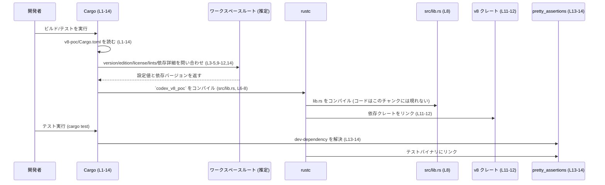

# v8-poc/Cargo.toml コード解説

## 0. ざっくり一言

このファイルは、Rust クレート `codex-v8-poc` の Cargo マニフェストであり、ライブラリターゲットの基本設定と、`v8` などの依存クレートをワークスペース経由で指定しています（Cargo.toml:L1-14）。

---

## 1. このモジュールの役割

### 1.1 概要

- このファイルは **Rust パッケージマネージャ Cargo の設定ファイル** です。
- `codex-v8-poc` というパッケージをライブラリクレートとして定義し（Cargo.toml:L1-2,6-8）、共通化されたワークスペース設定・依存関係を利用するよう構成されています（Cargo.toml:L3-5,9-12,14）。
- 実際の公開 API やコアロジックは `src/lib.rs` に配置されますが、その中身はこのチャンクには現れません（Cargo.toml:L8）。

### 1.2 アーキテクチャ内での位置づけ

`codex-v8-poc` クレートと依存クレートの関係を、Cargo.toml (L1-14) に基づいて図示します。

```mermaid
graph TD
    subgraph "codex-v8-poc パッケージ (Cargo.toml L1-14)"
        P["[package] name = \"codex-v8-poc\" (L1-2)"]
        L["[lib] codex_v8_poc / src/lib.rs (L6-8)"]
        P --> L
    end

    L -->|"依存 (通常)"| V8["v8 クレート (workspace 依存, L11-12)"]
    L -->|"依存 (テストのみ)"| PA["pretty_assertions クレート (dev-dependency, L13-14)"]

    W["ワークスペース定義 (パス不明, L3-5,10-12,14 から推定)"]
    P -. "version / edition / license を継承" .-> W
    V8 -. "バージョンなどを定義" .-> W
    PA -. "バージョンなどを定義" .-> W
```

- `codex-v8-poc` はライブラリクレートであり（Cargo.toml:L6-8）、その実装から `v8` クレートを利用する前提で構成されます（Cargo.toml:L11-12）。
- テストコードでは `pretty_assertions` が利用される前提です（Cargo.toml:L13-14）。
- 具体的な関数呼び出しやデータフローは `src/lib.rs` 側にあり、このチャンクには現れません。

### 1.3 設計上のポイント

コード（Cargo.toml:L1-14）から読み取れる設計上の特徴をまとめます。

- **ワークスペース前提の構成**
  - `version.workspace = true` / `edition.workspace = true` / `license.workspace = true` により、バージョン・エディション・ライセンスはワークスペースの設定を共用します（Cargo.toml:L3-5）。
  - lint 設定も `[lints] workspace = true` によりワークスペースで一元管理されます（Cargo.toml:L9-10）。
- **ライブラリ専用クレート**
  - `[lib]` セクションのみ定義されており、バイナリターゲット（`[[bin]]`）はこのチャンクには現れません（Cargo.toml:L6-8）。
  - クレート名は `codex_v8_poc` で、エントリポイントは `src/lib.rs` です（Cargo.toml:L6-8）。
- **依存関係の方針**
  - 本番コードで使用する依存は `v8` のみが明示されています（Cargo.toml:L11-12）。
  - テスト専用の依存として `pretty_assertions` が設定されています（Cargo.toml:L13-14）。
- **安全性・エラー・並行性に関する情報**
  - このファイルには Rust の関数や型の実装が含まれないため、メモリ安全性・エラーハンドリング・並行性の詳細な設計は読み取れません。
  - それらは `src/lib.rs` などコード側に存在すると考えられますが、このチャンクには現れません。

---

## 2. 主要な機能一覧（このファイルが担う役割）

このファイル自体は実行時機能を持つコードではありませんが、ビルド・構成上の役割を次のように整理できます。

- パッケージ定義: `codex-v8-poc` パッケージを定義し、ワークスペース設定を継承する（Cargo.toml:L1-5）。
- ライブラリターゲット定義: クレート名 `codex_v8_poc` とエントリポイント `src/lib.rs` を指定する（Cargo.toml:L6-8）。
- Lint 設定: コンパイラの警告レベルなどをワークスペース共通設定に委ねる（Cargo.toml:L9-10）。
- ランタイム依存の指定: `v8` クレートへの依存をワークスペース経由で設定する（Cargo.toml:L11-12）。
- テスト用依存の指定: テスト時に `pretty_assertions` を利用可能にする（Cargo.toml:L13-14）。

---

## 3. 公開 API と詳細解説

### 3.1 型一覧（構造体・列挙体など）

このファイル自体には Rust の型定義は含まれていません。

| 名前 | 種別 | 役割 / 用途 | 根拠 |
|------|------|-------------|------|
| なし | - | このファイルは設定ファイルのみであり、Rust の構造体・列挙体などの型は定義されていません | Cargo.toml:L1-14（TOML セクションのみ） |

※ 実際の型（構造体・列挙体など）は `src/lib.rs` 側に存在すると考えられますが、このチャンクには現れません。

### コンポーネントインベントリー（クレート／ターゲット／依存）

ユーザー指定の「コンポーネント一覧」に対応して、本チャンクから分かるコンポーネントを整理します。

| コンポーネント名 | 種別 | 説明 | 根拠 |
|------------------|------|------|------|
| `codex-v8-poc`   | パッケージ | Rust パッケージ（ワークスペースメンバー） | Cargo.toml:L1-2 |
| `codex_v8_poc`   | ライブラリターゲット（クレート名） | `src/lib.rs` をエントリポイントとするライブラリクレート | Cargo.toml:L6-8 |
| `src/lib.rs`     | ソースファイルパス | ライブラリクレートのルートファイル。公開 API やコアロジックが定義される想定 | Cargo.toml:L8 |
| `v8`             | 依存クレート | ランタイムで利用する依存クレート。詳細はワークスペース側で定義 | Cargo.toml:L11-12 |
| `pretty_assertions` | dev 依存クレート | テスト時のみ利用するアサーション支援クレート（詳細はワークスペース側） | Cargo.toml:L13-14 |
| ワークスペースルート | 設定・依存の定義元 | version / edition / license / lints / 依存の詳細をまとめる Cargo.toml（パスはこのチャンクでは不明） | Cargo.toml:L3-5,9-12,14 から推定 |

### 3.2 関数詳細

このファイルには Rust の関数定義が存在しないため、「関数詳細」セクションに対応する対象はありません。

- 公開 API（関数・メソッド）は **すべて `src/lib.rs` などのソースファイル側** にあり、このチャンクには現れません（Cargo.toml:L8）。
- 従って、コアロジックのエラーハンドリング・並行性・安全性に関する詳細も、このファイルからは読み取れません。

### 3.3 その他の関数

- 該当なし（関数定義がこのファイルには存在しません）。

---

## 4. データフロー（ビルド〜実行の観点）

このファイルは実行時コードではないため、ここでは **ビルド〜リンク時のフロー** を「データフロー」に相当するものとして整理します。

### フロー概要

1. Cargo が `v8-poc/Cargo.toml` を読み込み、パッケージ・ターゲット・依存関係を解決します（Cargo.toml:L1-14）。
2. ワークスペースルートの設定を参照し、`version` / `edition` / `license` / `lints` / 各依存クレートのバージョンなどを補完します（Cargo.toml:L3-5,9-12,14）。
3. Rust コンパイラが `src/lib.rs` をライブラリクレート `codex_v8_poc` としてコンパイルします（Cargo.toml:L6-8）。
4. コンパイル時に、`v8` クレートが依存として解決・リンクされます（Cargo.toml:L11-12）。
5. テスト実行時には `pretty_assertions` も依存として解決・リンクされます（Cargo.toml:L13-14）。

これをシーケンス図で表すと次のようになります（Cargo.toml L1-14 に基づく）。



### 安全性・エラー・並行性（このファイルからわかる範囲）

- **ビルド時エラー**
  - `src/lib.rs` が存在しない場合、`[lib] path = "src/lib.rs"`（Cargo.toml:L8）によりコンパイルエラーになります。
  - ワークスペース側で `v8` や `pretty_assertions` が定義されていない場合、依存解決時にエラーになります（Cargo.toml:L11-12,13-14）。
- **ランタイムのメモリ安全性・並行性・エラーハンドリング**
  - これらは `src/lib.rs` および依存クレート（`v8` など）の実装に依存し、このチャンクからは詳細が分かりません。
  - 従って、「どの関数がどのようにエラーを返すか」「どの型が Send/Sync か」といった情報は、このファイルだけからは不明です。

---

## 5. 使い方（How to Use）

### 5.1 基本的な使用方法（クレートとして利用する）

このファイルにより、`codex_v8_poc` はライブラリクレートとしてビルドされます（Cargo.toml:L6-8）。  
別のクレートから利用する場合の、典型的な依存指定例を示します（バージョン番号はワークスペース外から利用する場合の一般的な書き方です）。

```toml
# 別プロジェクト側の Cargo.toml の例
[dependencies]
codex-v8-poc = "x.y.z"  # 実際のバージョンはワークスペース設定に依存し、このチャンクからは不明
```

- こう設定すると、Rust コードからは `codex_v8_poc` というクレート名で参照できるのが一般的です（Cargo.toml:L6）。
- ただし、**どのモジュールや関数が公開されているかは `src/lib.rs` 側の実装次第であり、このチャンクには現れません。**

### 5.2 よくある使用パターン（設定レベル）

この Cargo.toml に対する典型的な操作パターンを挙げます。

1. **新しい依存クレートの追加**

   ```toml
   [dependencies]
   v8 = { workspace = true }        # 既存
   serde = { version = "1", features = ["derive"] }  # 例：新規追加（仮）
   ```

   - ただし、`serde` のような新規依存はこのチャンクには現れず、ここでは追加例として示しています。

2. **バイナリターゲットの追加（まだ存在しない）**

   ```toml
   [[bin]]
   name = "codex-v8-poc-cli"
   path = "src/main.rs"
   ```

   - このような `[[bin]]` セクションは現在のファイルには存在しません（Cargo.toml:L1-14）。追加すると CLI などが作れます。

3. **ワークスペース共通設定の活用**
   - `version.workspace = true` / `edition.workspace = true` となっているため（Cargo.toml:L3-4）、バージョンやエディションはワークスペース側を変更することで一括管理できます。

### 5.3 よくある間違い

Cargo.toml の内容から推測できる、起こりがちな設定ミスを示します。

```toml
# 間違い例: lib.path と実ファイルが不一致
[lib]
name = "codex_v8_poc"
path = "src/main.rs"  # 実際には lib.rs しか存在しない場合など

# 正しい例: 実際の lib.rs と一致させる
[lib]
name = "codex_v8_poc"
path = "src/lib.rs"   # このチャンクの設定 (Cargo.toml:L6-8)
```

```toml
# 間違い例: workspace=true としながらワークスペース側に定義がない
[dependencies]
v8 = { workspace = true }  # しかし、ワークスペースルートに `v8` の定義がない

# 正しい例: ワークスペースルート側で依存を定義しておく
# (ワークスペース側のファイルはこのチャンクには現れない)
[dependencies]
v8 = "x.y.z"
```

### 5.4 使用上の注意点（まとめ）

- **ワークスペース依存の前提**
  - `version` / `edition` / `license` / `lints` / `v8` / `pretty_assertions` はすべてワークスペースで管理されます（Cargo.toml:L3-5,9-12,14）。  
    ワークスペースルート側の設定が不十分な場合、依存解決やビルド時にエラーになります。
- **ライブラリ専用構成**
  - 現時点でバイナリターゲットの記述はなく、`src/lib.rs` だけがエントリポイントです（Cargo.toml:L6-8）。CLI 等を追加する場合は `[[bin]]` セクションの追加が必要です。
- **公開 API の確認場所**
  - 公開 API（モジュール・関数・型）は `src/lib.rs` などソースコード側にあり、このファイルからは中身が分かりません。API 仕様を確認するにはそちらを参照する必要があります。

---

## 6. 変更の仕方（How to Modify）

### 6.1 新しい機能を追加する場合（設定レベル）

このファイルに対する変更の入口は、主に「ターゲットの追加」と「依存関係の追加」です。

1. **新しいライブラリやバイナリを追加したい場合**
   - ライブラリ:

     ```toml
     [lib]
     name = "codex_v8_poc"
     path = "src/lib.rs"
     # 上記セクションを変更・追加（既に存在）
     ```

   - バイナリ:

     ```toml
     [[bin]]
     name = "codex-v8-poc-cli"
     path = "src/main.rs"
     ```

   - こうしたターゲット追加は、既存の `[lib]` セクション（Cargo.toml:L6-8）を参考に行います。

2. **新規依存クレートの導入**
   - ランタイム依存の追加は `[dependencies]` セクションに追記します（Cargo.toml:L11-12 を参照）。
   - テスト専用であれば `[dev-dependencies]` セクションに追加します（Cargo.toml:L13-14）。

3. **ワークスペース共通設定の利用・変更**
   - バージョンやエディションなどを統一的に管理したい場合は、`workspace = true` のままワークスペースルート側を編集します（Cargo.toml:L3-5,9-12,14）。

### 6.2 既存の機能を変更する場合

- **影響範囲の確認**
  - `[lib] name` を変更すると、他クレートからの `extern crate` / `use` のパスが変わるため、関連箇所の修正が必要になります（Cargo.toml:L6）。
  - `[lib] path` を変更する場合は、実ファイルの場所も合わせる必要があります（Cargo.toml:L8）。
- **依存関係の変更**
  - `v8` の依存を削除・バージョン変更する場合、`src/lib.rs` 側で `v8` の API を利用している箇所への影響が発生します。このチャンクではその利用箇所は不明です。
  - `pretty_assertions` の削除・変更はテストコードに影響し、`assert_eq!` などのマクロ利用箇所を確認する必要がありますが、このチャンクにはテストコードは現れません。
- **契約（前提条件）の維持**
  - ライブラリ名やターゲット構成を変更すると、他プロジェクトの Cargo.toml における依存指定との整合性が崩れる可能性があります。そのため、公開済みパッケージでは慎重な変更が必要です。

---

## 7. 関連ファイル

この Cargo.toml と密接に関係するファイル・ディレクトリを整理します。

| パス / 場所 | 役割 / 関係 | 根拠 |
|-------------|------------|------|
| `src/lib.rs` | ライブラリクレート `codex_v8_poc` のルートファイル。公開 API やコアロジックが実装される。 | Cargo.toml:L6-8 |
| ワークスペースルートの `Cargo.toml` | `version` / `edition` / `license` / `lints` / `v8` / `pretty_assertions` などの共通設定・依存詳細を定義していると推定される。 | Cargo.toml:L3-5,9-12,14 |
| テストコード（パス不明） | `pretty_assertions` を利用するテストが存在すると考えられるが、このチャンクには現れない。 | Cargo.toml:L13-14 からの推定 |

---

### このチャンクで分からないこと（明示）

- `src/lib.rs` 内のモジュール構成・関数・型・エラーハンドリング・並行性の扱いは、このチャンクには現れません。
- `v8` / `pretty_assertions` の具体的なバージョン・機能のうち、このプロジェクトがどこまで利用しているかも、このファイルからは不明です。
- ワークスペースルートの構造（ディレクトリ名やパス）は、このチャンクでは分かりません。
