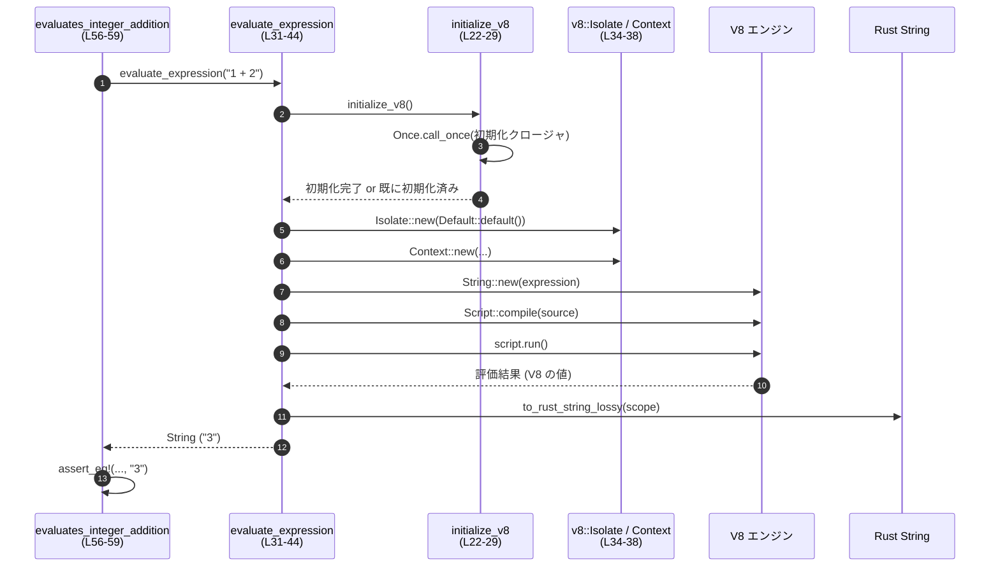

# v8-poc/src/lib.rs コード解説

> 以下の行番号は、提示されたコードチャンクの先頭行を 1 行目として数えた相対的な番号です。

---

## 0. ざっくり一言

Bazel から参照するための **Bazel ラベル** と、組み込み済み **V8 JavaScript エンジンのバージョン文字列** を返すだけの、非常に薄いラッパークレートです（`v8-poc/src/lib.rs:L1-13`）。  
テストコード内で V8 を初期化し、簡単な式の評価が行われています（`L15-64`）。

---

## 1. このモジュールの役割

### 1.1 概要

- **解決する問題**  
  Bazel ベースのビルド環境において、「このクレートを指す Bazel ラベル」と「埋め込み V8 のバージョン」を Rust 側から取得できるようにすることです（`L1-13`）。

- **提供する機能**
  - `bazel_target`: この PoC クレートの Bazel ラベルを返す（`L3-7`）
  - `embedded_v8_version`: バンドルされている V8 のバージョン文字列を返す（`L9-13`）

### 1.2 アーキテクチャ内での位置づけ

このファイル単体で見ると、公開 API は 2 つの関数だけで、外部の `v8` クレートに依存して V8 のバージョンを取得しています。  
テストモジュールでは、`v8` クレートの API を使って V8 の初期化・コンテキスト生成・スクリプト実行を行っています（`L22-43`）。

主要コンポーネント間の依存関係は次のようになります。

```mermaid
graph TD
    subgraph "ライブラリ (v8-poc/src/lib.rs L1-13)"
        A["bazel_target (L3-7)"]
        B["embedded_v8_version (L9-13)"]
    end

    subgraph "テスト (L15-64)"
        Tmod["tests モジュール (L15-64)"]
        I["initialize_v8 (L22-29)"]
        E["evaluate_expression (L31-44)"]
        T1["exposes_expected_bazel_target (L46-49)"]
        T2["exposes_embedded_v8_version (L51-53)"]
        T3["evaluates_integer_addition (L56-59)"]
        T4["evaluates_string_concatenation (L61-63)"]
    end

    subgraph "外部クレート / 標準ライブラリ"
        V8["v8 クレート"]
        PA["pretty_assertions"]
        ONCE["std::sync::Once"]
    end

    A -->|文字列リテラル| T1
    B -->|V8 バージョン文字列| T2

    Tmod --> I
    Tmod --> E
    I --> ONCE
    E --> V8

    T1 --> PA
    T2 --> "std::assert!"
    T3 --> E
    T4 --> E
```

### 1.3 設計上のポイント

- **非常に薄い公開 API**  
  - 2 つの関数とも戻り値は `&'static str` のみで、副作用がありません（`L3-13`）。
  - `#[must_use]` 属性が付与されており、戻り値を無視するとコンパイル時に警告が出る設計です（`L4`, `L10`）。

- **状態管理はテストに限定**  
  - 実運用向け API では状態を一切持たず、V8 の初期化や実行はすべて `#[cfg(test)]` のテストモジュール内に閉じ込められています（`L15-64`）。

- **並行性を考慮した V8 初期化**  
  - `std::sync::Once` を使って V8 の初期化コードを一度だけ実行するようになっており、テストが並列実行されても安全に初期化される設計です（`L22-29`）。

- **エラーハンドリング方針（テスト内）**  
  - V8 による式評価は `.expect(...)` でラップされており、エラー時はテストが panic して失敗する方針です（`L39-41`）。

---

## 2. 主要な機能一覧

### 2.0 主要機能（概要）

- `bazel_target`: この PoC クレートの Bazel ラベル文字列を返す（`L3-7`）
- `embedded_v8_version`: 組み込み V8 のバージョン文字列を返す（`L9-13`）
- （テスト専用）`evaluate_expression`: 渡された JavaScript 式を V8 で評価し、文字列として返す（`L31-44`）

### 2.1 関数・モジュール インベントリー（行番号付き）

| 名前 | 種別 | 公開範囲 | 定義位置 | 役割 / 用途 |
|------|------|----------|----------|-------------|
| `bazel_target` | 関数 | `pub` | `v8-poc/src/lib.rs:L3-7` | このクレートを指す Bazel ラベル `"//codex-rs/v8-poc:v8-poc"` を返す |
| `embedded_v8_version` | 関数 | `pub` | `v8-poc/src/lib.rs:L9-13` | `v8::V8::get_version()` による V8 のバージョン文字列を返す |
| `tests` | モジュール | `#[cfg(test)]` | `v8-poc/src/lib.rs:L15-64` | テストコード一式を保持するモジュール |
| `initialize_v8` | 関数 | テスト内 | `v8-poc/src/lib.rs:L22-29` | `std::sync::Once` を使って V8 プラットフォームと V8 を一度だけ初期化する |
| `evaluate_expression` | 関数 | テスト内 | `v8-poc/src/lib.rs:L31-44` | V8 の `Isolate` と `Context` を作り、渡された式文字列を V8 で評価して結果文字列を返す |
| `exposes_expected_bazel_target` | 関数（テスト） | `#[test]` | `v8-poc/src/lib.rs:L46-49` | `bazel_target()` の戻り値が期待どおりのラベルか検証する |
| `exposes_embedded_v8_version` | 関数（テスト） | `#[test]` | `v8-poc/src/lib.rs:L51-53` | `embedded_v8_version()` の結果が空文字列でないことを検証する |
| `evaluates_integer_addition` | 関数（テスト） | `#[test]` | `v8-poc/src/lib.rs:L56-59` | `evaluate_expression("1 + 2")` が `"3"` を返すことを検証する |
| `evaluates_string_concatenation` | 関数（テスト） | `#[test]` | `v8-poc/src/lib.rs:L61-63` | `evaluate_expression("'hello ' + 'world'")` が `"hello world"` を返すことを検証する |

---

## 3. 公開 API と詳細解説

### 3.1 型一覧（構造体・列挙体など）

このファイルには、公開されている構造体・列挙体・型エイリアスは定義されていません（`L1-64` 全体を確認）。

### 3.2 重要な関数の詳細

#### `bazel_target() -> &'static str`（`v8-poc/src/lib.rs:L3-7`）

**概要**

この PoC クレートを指す Bazel ラベル `"//codex-rs/v8-poc:v8-poc"` を返す関数です。  
`#[must_use]` が付いているため、戻り値を無視するとコンパイル時警告となります（`L4`）。

**引数**

なし。

**戻り値**

- `&'static str`  
  ビルド定義上、このクレートを参照するために使う Bazel ラベル文字列です（`"//codex-rs/v8-poc:v8-poc"`、`L5`）。

**内部処理の流れ**

1. 関数本体は、ハードコードされた文字列リテラル `"//codex-rs/v8-poc:v8-poc"` を返すだけです（`L5`）。

**Examples（使用例）**

```rust
// v8-poc クレートから関数をインポートする
use v8_poc::bazel_target;

fn main() {
    // Bazel ラベルを取得する
    let label = bazel_target(); // 戻り値は &'static str

    // ログや設定などに利用できる
    println!("This crate's Bazel target: {label}");
}
```

**Errors / Panics**

- 関数内部にエラー処理や `panic!` 呼び出しはありません（`L3-7`）。
- 文字列リテラルを返すだけなので、この関数自体が失敗する条件はコードからは確認できません。

**Edge cases（エッジケース）**

- 引数がないため、入力に関するエッジケースはありません。
- 返す文字列は固定なので、実行環境やビルドモードによる変化もコードからは見られません。

**使用上の注意点**

- ラベル文字列を変更した場合は、テスト `exposes_expected_bazel_target`（`L46-49`）も更新する必要があります。
- Bazel のビルド設定側とこの文字列の整合性を保つことが前提となります（Bazel 設定ファイル側はこのチャンクには現れません）。

---

#### `embedded_v8_version() -> &'static str`（`v8-poc/src/lib.rs:L9-13`）

**概要**

リンクされている V8 JavaScript エンジンのバージョン文字列を返す関数です。  
実体は `v8::V8::get_version()` の薄いラッパーです（`L12`）。

**引数**

なし。

**戻り値**

- `&'static str`  
  `v8::V8::get_version()` が返す V8 のバージョン文字列です（`L12`）。

**内部処理の流れ**

1. `v8::V8::get_version()` を呼び出す（`L12`）。
2. 得られた `&'static str` をそのまま呼び出し元に返します。

**Examples（使用例）**

```rust
use v8_poc::embedded_v8_version;

fn main() {
    // 組み込み V8 のバージョンを取得
    let version = embedded_v8_version();

    println!("Embedded V8 version: {version}");
}
```

**Errors / Panics**

- この関数内にはエラー処理や `panic!` 呼び出しはありません（`L9-13`）。
- `v8::V8::get_version()` がどのような条件で失敗するか、またはしないかは、このファイルからは分かりません（外部クレートの仕様のため）。

**Edge cases（エッジケース）**

- テスト `exposes_embedded_v8_version` では、戻り値が **空でないこと** のみを検証しており（`L51-53`）、具体的な形式（例: `"X.Y.Z"`）までは制約していません。
- そのため、バージョン文字列のフォーマットに依存したロジックを組む場合は、v8 クレート側の仕様を確認する必要があります。

**使用上の注意点**

- V8 の初期化が必要かどうかは、この関数からは読み取れません。テストでは `embedded_v8_version()` の前に V8 を初期化していないため（`L51-53`）、少なくともこの呼び出しには初期化は不要と想定されていますが、最終的な仕様は v8 クレートに依存します。
- 戻り値は `&'static str` のため、どのスレッドからも安全に共有・参照できます（所有権が静的データにあるため）。

---

#### `initialize_v8()`（テスト用、`v8-poc/src/lib.rs:L22-29`）

**概要**

テスト実行時に V8 のプラットフォームと V8 自体を一度だけ初期化する関数です。  
`std::sync::Once` を用いることで、複数回呼び出されても初期化処理は 1 回だけ実行されます。

**引数**

なし。

**戻り値**

- `()`（戻り値なし）。副作用として V8 を初期化します。

**内部処理の流れ**

1. `static INIT: Once = Once::new();` で、グローバルな `Once` を定義する（`L23`）。
2. `INIT.call_once(|| { ... })` によって、クロージャ内の初期化コードを 1 度だけ実行する（`L25`）。
3. クロージャ内で:
   - `v8::new_default_platform(0, false).make_shared()` でプラットフォームを生成（`L26`）。
   - `v8::V8::initialize_platform(...)` でプラットフォームを V8 に登録（`L26`）。
   - `v8::V8::initialize()` で V8 を初期化する（`L27`）。

**Examples（使用例）**

この関数はテスト内のヘルパーとして使われています。

```rust
fn evaluate_expression(expression: &str) -> String {
    // V8 を初期化（最初の一回だけ実行され、それ以外は即時復帰）
    initialize_v8();

    // 以下で V8 の Isolate / Context を用いて式評価を行う…
    # String::new()
}
```

（`evaluate_expression` 内の利用: `L31-33`）

**Errors / Panics**

- 関数内部で `expect` などによる明示的な `panic!` は使用されていません（`L22-29`）。
- `v8::V8::initialize_platform` や `v8::V8::initialize` が panic するかどうかは、このファイルからは分かりません。

**Edge cases（エッジケース）**

- `initialize_v8` が複数のテストから並行して呼ばれても、`Once` により初期化処理は一回だけ実行されます（`L23-25`）。
- 初期化に失敗した場合のリトライや状態管理は行っていません（コードからはそのような処理は見えません）。

**使用上の注意点**

- 現状、この関数は `#[cfg(test)]` モジュール内にあり、テスト専用です（`L15-29`）。
- ライブラリ API として V8 を使う機能を追加する場合は、同様の一回限りの初期化パターンが必要になる可能性がありますが、その設計はこのファイルからは定義されていません。

---

#### `evaluate_expression(expression: &str) -> String`（テスト用、`v8-poc/src/lib.rs:L31-44`）

**概要**

引数として与えられた文字列を JavaScript ソースコードとして V8 に渡し、その評価結果を Rust の `String` として返すテスト用ヘルパー関数です。

**引数**

| 引数名 | 型 | 説明 |
|--------|----|------|
| `expression` | `&str` | 評価したい JavaScript 式のソースコード文字列（UTF-8 を想定、`L31`） |

**戻り値**

- `String`  
  V8 で評価した結果を `to_rust_string_lossy` で変換した文字列です（`L43`）。

**内部処理の流れ（アルゴリズム）**

1. `initialize_v8()` を呼び出し、V8 が初期化されていることを保証する（`L32`）。
2. `v8::Isolate::new(Default::default())` で新しい `Isolate` を作り、それへの可変参照を取得する（`L34`）。
3. `v8::scope!(let scope, isolate);` マクロでスコープを作成し、V8 ハンドルのライフタイムを管理する（`L35`）。
4. `v8::Context::new(scope, Default::default())` で新しい JavaScript コンテキストを生成（`L37`）。
5. `v8::ContextScope::new(scope, context)` でコンテキストスコープを作成し、以降の操作をこのコンテキスト内で行う（`L38`）。
6. `v8::String::new(scope, expression)` で `expression` を V8 の文字列として生成し、`expect("expression should be valid UTF-8")` で失敗時に panic するようにしている（`L39`）。
7. `v8::Script::compile(scope, source, None)` でスクリプトをコンパイルし、`expect("expression should compile")` でコンパイル失敗時に panic（`L40`）。
8. `script.run(scope)` でスクリプトを実行し、`expect("expression should evaluate")` で評価失敗時に panic（`L41`）。
9. 得られた結果を `result.to_rust_string_lossy(scope)` で Rust の `String` に変換して返す（`L43`）。

**Examples（使用例）**

テストコード内での利用例（`L56-59`, `L61-63`）:

```rust
#[test]
fn evaluates_integer_addition() {
    // "1 + 2" を V8 で評価し、結果が "3" であることを検証
    assert_eq!(evaluate_expression("1 + 2"), "3");
}

#[test]
fn evaluates_string_concatenation() {
    // 文字列連結を V8 で評価し、結果が "hello world" であることを検証
    assert_eq!(evaluate_expression("'hello ' + 'world'"), "hello world");
}
```

**Errors / Panics**

`evaluate_expression` 自体は `Result` を返さず、失敗時には panic します。

panic の可能性がある箇所:

- `v8::String::new(scope, expression)` の `expect("expression should be valid UTF-8")`（`L39`）
  - ここが `None` を返した場合、メッセージ付きで panic します。
  - `expression` は Rust の `&str` なので、既に UTF-8 であることが保証されており、通常この条件では失敗しません。
- `v8::Script::compile(scope, source, None)` の `expect("expression should compile")`（`L40`）
  - 構文エラーなどでコンパイルに失敗すると panic します。
- `script.run(scope)` の `expect("expression should evaluate")`（`L41`）
  - 実行時エラーや例外が発生すると panic します。

`initialize_v8()` や V8 の内部呼び出しが panic するか否かは、このコードからは分かりません。

**Edge cases（エッジケース）**

- **構文エラーのある式**  
  - 例: `"1 +"` のような不完全な式を渡すと、コンパイルに失敗し `expect` によって panic する可能性があります（`L40`）。
- **実行時エラーを引き起こす式**  
  - V8 内部で例外が発生した場合、`script.run` が `None` を返して `expect` により panic する可能性があります（`L41`）。
- **非常に長い式や重い計算**  
  - この関数にはタイムアウトやリソース制限がありません。長時間実行する式を渡すとテストが長くかかったり、ハングに近い状態になる可能性があります（この挙動は V8 と環境依存で、このファイルからは詳細は分かりません）。

**使用上の注意点**

- この関数は `#[cfg(test)]` モジュール内にあり、テスト専用です（`L15-44`）。
- 任意の JavaScript コードを実行するため、外部から渡された文字列をそのまま評価すると「任意コード実行」と同等の挙動になります。現在はテスト内で定数文字列を使っているため、そのリスクは限定的です。
- エラーを `Result` で返さず `expect` で即座に panic する設計のため、失敗時には原因メッセージとともにテストが中断されます。

---

### 3.3 その他の関数

テスト関数は、公開 API の検証や V8 動作確認を行うシンプルなラッパーです。

| 関数名 | 定義位置 | 役割（1 行） |
|--------|----------|--------------|
| `exposes_expected_bazel_target` | `v8-poc/src/lib.rs:L46-49` | `bazel_target()` が `"//codex-rs/v8-poc:v8-poc"` を返すことを検証する |
| `exposes_embedded_v8_version` | `v8-poc/src/lib.rs:L51-53` | `embedded_v8_version()` の戻り値が空文字列でないことを検証する |
| `evaluates_integer_addition` | `v8-poc/src/lib.rs:L56-59` | `evaluate_expression("1 + 2")` が `"3"` を返すことを検証する |
| `evaluates_string_concatenation` | `v8-poc/src/lib.rs:L61-63` | `evaluate_expression("'hello ' + 'world'")` が `"hello world"` を返すことを検証する |

---

## 4. データフロー

ここでは、テスト `evaluates_integer_addition` がどのように JavaScript 式 `"1 + 2"` を評価し、結果 `"3"` に至るかのデータフローを示します。

### 4.1 処理の要点

1. テスト `evaluates_integer_addition` が `"1 + 2"` を引数に `evaluate_expression` を呼び出す（`L56-59`）。
2. `evaluate_expression` は V8 の初期化（`initialize_v8`）を行った後、`Isolate` と `Context` を生成し、式をコンパイル・実行する（`L31-43`）。
3. 実行結果は `to_rust_string_lossy` によって Rust の `String` に変換され、テスト側で期待値 `"3"` と比較されます（`L43`, `L58`）。

### 4.2 シーケンス図



---

## 5. 使い方（How to Use）

### 5.1 基本的な使用方法

このモジュールの公開 API は 2 関数のみです。典型的な利用は次のようになります。

```rust
use v8_poc::{bazel_target, embedded_v8_version};

fn main() {
    // Bazel ラベルを取得
    let label = bazel_target();
    println!("Bazel target: {label}");

    // 組み込み V8 のバージョンを取得
    let v8_ver = embedded_v8_version();
    println!("Embedded V8 version: {v8_ver}");
}
```

- 初期化やコンフィグレーションは不要で、どこからでも同期的に呼び出せます。
- どちらも `&'static str` を返すだけなので、コストは非常に小さく、スレッド間で共有しても追加の同期は不要です。

### 5.2 よくある使用パターン

1. **ログやメトリクスへの出力**

   ```rust
   fn log_build_info() {
       log::info!("v8-poc target: {}", v8_poc::bazel_target());
       log::info!("v8 version: {}", v8_poc::embedded_v8_version());
   }
   ```

2. **ヘルスチェック / デバッグエンドポイント**
   - Web サーバーの `/status` や `/debug/info` のレスポンスに V8 バージョンを含める、といった用途が考えられます。
   - 具体的な Web フレームワークとの統合コードは、このチャンクには現れません。

### 5.3 よくある間違い（起こりうる誤用）

このファイルから読み取れる範囲での注意点です。

```rust
// 誤用例: V8 を利用する API があると誤解してしまう
// let result = v8_poc::evaluate_expression("1 + 2"); // ← そもそも公開されていない（tests モジュール内）

// 正しい理解: 公開 API は情報取得のみ
let label = v8_poc::bazel_target();
let version = v8_poc::embedded_v8_version();
```

- V8 自体を操作する API (`initialize_v8`, `evaluate_expression`) はテストモジュール内にあり、ライブラリの公開 API ではありません（`L15-44`）。
- V8 を使った実行機能が提供されていると誤解して依存すると、後からテスト構造の変更で壊れる可能性があります。

### 5.4 使用上の注意点（まとめ）

- **公開 API の範囲**  
  - このファイルで外部に公開されているのは `bazel_target` と `embedded_v8_version` のみです（`L3-13`）。
- **スレッド安全性**  
  - どちらも固定の `&'static str` を返すだけで、内部に共有可変状態を持たないため、Rust の観点ではどのスレッドから呼び出してもデータ競合の心配はありません。
- **エラーハンドリング**  
  - 公開 API には `Result` や `Option` は使われておらず、エラーを返すコードはありません。
  - v8 クレート内部の挙動によるエラーや panic は、このファイルからは判断できません。

---

## 6. 変更の仕方（How to Modify）

### 6.1 新しい機能を追加する場合

このファイルに新しい機能（例: V8 を用いた軽量な評価 API）を追加する場合の、入口の整理です。

1. **どこにコードを追加するか**
   - ライブラリの公開 API として追加する場合は、`pub fn` をこの `lib.rs` のテストモジュール外（`L1-13` 付近）に定義するのが自然です。
   - V8 を使ったロジックをテスト専用に留める場合は、`#[cfg(test)] mod tests` の中（`L15-64`）に追加します。

2. **既存のどの関数・型に依存すべきか**
   - V8 初期化の再利用が必要であれば、`initialize_v8` のパターン（`Once` による一回限りの初期化）を参考にできます（`L22-29`）。
   - Bazel ラベルやバージョン文字列への依存だけであれば、`bazel_target` / `embedded_v8_version` の戻り値を利用します。

3. **追加機能の呼び出し元**
   - CLI やサーバーから呼ぶ場合は、それらのコードが存在する別ファイル（このチャンクには現れません）から `v8_poc` クレートを参照する形になります。

### 6.2 既存の機能を変更する場合

1. **影響範囲の確認**
   - `bazel_target` の戻り値を変更する場合:
     - テスト `exposes_expected_bazel_target`（`L46-49`）が失敗するため、期待値文字列も更新する必要があります。
     - Bazel 側のビルド設定でこのラベルを参照している箇所との整合性も確認する必要があります（Bazel 設定ファイルはこのチャンクには現れません）。
   - `embedded_v8_version` の実装を変更する場合:
     - テスト `exposes_embedded_v8_version`（`L51-53`）は、空でないかどうかだけを確認しているため、エクスポート形式を変えても多くの場合テストは通りますが、下流の利用箇所の仕様も確認する必要があります。

2. **契約（前提条件・返り値の意味）を守る**
   - `bazel_target`: 「このクレートを一意に指すラベルである」という意味は保つ必要があります。
   - `embedded_v8_version`: 「組み込み V8 のバージョン情報を表す文字列である」という意味を保つことが望まれます。

3. **テストの再確認**
   - 変更後は `tests` モジュール内の関連するテストを実行し、期待どおりに動作しているか確認します（`L46-63`）。

---

## 7. 関連ファイル

このチャンクには `v8-poc/src/lib.rs` 以外のファイルの情報は含まれていないため、プロジェクト内の他ファイルとの関係は不明です。  
ただし、このファイルから参照している外部クレートや標準ライブラリとの関係は次のとおりです。

| パス / クレート | 役割 / 関係 |
|-----------------|------------|
| `crate v8` | `embedded_v8_version` で `v8::V8::get_version()` を使用（`L12`）。テスト内で V8 のプラットフォーム初期化やスクリプト実行 API を使用（`L22-27`, `L34-43`）。 |
| `crate pretty_assertions` | テスト内で `assert_eq!` の拡張版として利用（`L17`, `L48`, `L58`, `L63`）。 |
| `std::sync::Once` | `initialize_v8` で V8 初期化処理を一度だけ実行するために利用（`L18`, `L22-25`）。 |

プロジェクト内の他の Rust ファイル（例: `main.rs` や他のモジュール）、Bazel の `BUILD` ファイルなどは、このチャンクには現れないため、ここでは解説できません。
