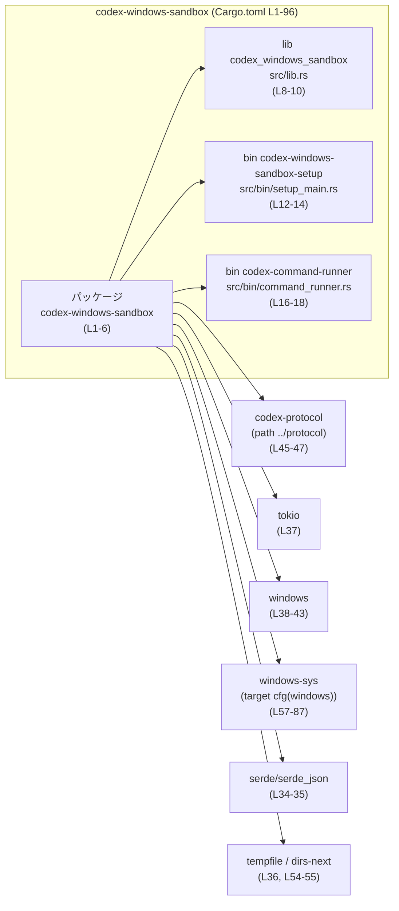
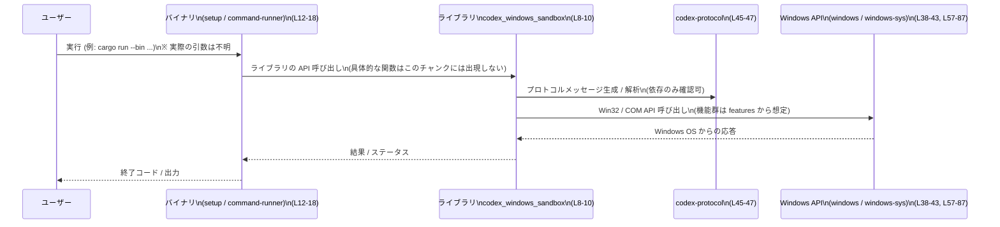

# windows-sandbox-rs/Cargo.toml

## 0. ざっくり一言

`codex-windows-sandbox` クレートのビルド設定と依存関係（ライブラリ 1 つ・バイナリ 2 つ・Windows API まわりのクレートなど）を定義している Cargo 設定ファイルです（Cargo.toml:L1-6, L8-18, L23-87）。

---

## 1. このモジュールの役割

### 1.1 概要

- このファイルは Rust クレート `codex-windows-sandbox` の **パッケージ情報とビルドターゲット** を定義します（Cargo.toml:L1-6）。
- ライブラリターゲット `codex_windows_sandbox`（`src/lib.rs`）と、2 つのバイナリターゲットを持つことが分かります（Cargo.toml:L8-10, L12-18）。
- Windows API（`windows`, `windows-sys`）や非同期ランタイム（`tokio`）などへの依存関係が列挙されており、Windows 向けの機能を持つクレートであることが読み取れます（Cargo.toml:L23-43, L57-87）。

※ 実際にどのような API / ロジックを提供しているかは `src/lib.rs` 等の中身がこのチャンクには含まれていないため不明です。

### 1.2 アーキテクチャ内での位置づけ

Cargo 設定から読み取れる、クレート内コンポーネントと外部クレートの関係を示します。



この図は、Cargo.toml 内に現れるターゲットと主要依存クレートの関係を示しています。  
ライブラリ・バイナリは同一パッケージ `codex-windows-sandbox` に属し、`codex-protocol` や Windows API ラッパーに依存する構成になっています（Cargo.toml:L23-47, L57-87）。

### 1.3 設計上のポイント

Cargo 設定から読み取れる設計上の特徴を列挙します。

- **ワークスペース前提**  
  - `edition`, `license`, `version` がすべて `workspace = true` で管理されており、バージョンやライセンスはワークスペースルートで一元管理されています（Cargo.toml:L3-6）。
- **lib + 複数 bin 構成**  
  - 1 つのライブラリ（`src/lib.rs`）と 2 つのバイナリ（`src/bin/setup_main.rs`, `src/bin/command_runner.rs`）という構成です（Cargo.toml:L8-10, L12-18）。
- **Windows 向けの低レベル API 利用**  
  - `windows` クレートで COM・Firewall などの高レベルラッパーを（Cargo.toml:L38-43）、`windows-sys` クレートで Win32 の多くのサブシステムを有効化しています（Cargo.toml:L57-85）。  
    これにより、プロセス、ジョブオブジェクト、セキュリティ、ファイルシステム、レジストリ等の Windows 機能を利用していることが推測されますが、実際の呼び出し内容はこのチャンクからは分かりません。
- **非同期ランタイムの利用**  
  - `tokio` に依存し、`sync`, `rt` 機能を有効化しているため（Cargo.toml:L37）、非同期処理やスレッドプールを利用した並行実行を行う設計である可能性があります。
- **独自ユーティリティ群との連携**  
  - `codex-utils-pty`, `codex-utils-absolute-path`, `codex-utils-string` など、同一プロジェクト内と思われるユーティリティクレートに依存しており（Cargo.toml:L30-32）、プロセス・パス・文字列処理などを共通化している構成です。
- **ビルドスクリプトあり**  
  - `build = "build.rs"` および `winres` ビルド依存から、ビルド時に Windows リソース（アイコンやバージョン情報など）を埋め込む処理を行っていることが分かります（Cargo.toml:L2, L92-93）。

---

## 2. 主要な機能一覧

Cargo.toml そのものが「処理」を持つわけではありませんが、この設定から分かる主要コンポーネント（機能の入口）をまとめます。

- ライブラリターゲット定義: `codex_windows_sandbox` ライブラリを `src/lib.rs` からビルドする（Cargo.toml:L8-10）。
- バイナリターゲット `codex-windows-sandbox-setup`: セットアップ系の CLI 実行ファイルを `src/bin/setup_main.rs` からビルドする（Cargo.toml:L12-14）。
- バイナリターゲット `codex-command-runner`: コマンド実行系の CLI 実行ファイルを `src/bin/command_runner.rs` からビルドする（Cargo.toml:L16-18）。
- Windows API 連携: `windows`, `windows-sys` クレートを通じて広範囲な Win32 / COM 機能にアクセスする（Cargo.toml:L38-43, L57-85）。
- 非同期処理基盤: `tokio` を用いた非同期・並行処理の基盤を提供する（Cargo.toml:L37）。
- 日付・時刻や一時ファイル・ディレクトリ操作: `chrono`, `tempfile`, `dirs-next` などを利用する（Cargo.toml:L26-29, L36, L54-55）。
- シリアライズ/デシリアライズ: `serde`, `serde_json` を用いた JSON などのデータ交換（Cargo.toml:L34-35）。
- 内部プロトコルとの連携: パス依存の `codex-protocol` クレートを通じて、上位システムとデータをやりとりする（Cargo.toml:L45-47）。

### 2.1 コンポーネント・インベントリー（このファイルから分かる範囲）

| コンポーネント名 | 種別 | 役割 / 用途 | 定義位置 |
|------------------|------|-------------|----------|
| `codex-windows-sandbox` | パッケージ | 本クレート全体のパッケージ定義。ビルドスクリプト `build.rs` を利用 | Cargo.toml:L1-6 |
| `codex_windows_sandbox` | ライブラリターゲット | 公開 API を提供するライブラリ（実装は `src/lib.rs`） | Cargo.toml:L8-10 |
| `codex-windows-sandbox-setup` | バイナリターゲット | セットアップ関連の CLI 実行ファイル（実装は `src/bin/setup_main.rs`） | Cargo.toml:L12-14 |
| `codex-command-runner` | バイナリターゲット | コマンド実行用 CLI 実行ファイル（実装は `src/bin/command_runner.rs`） | Cargo.toml:L16-18 |
| `codex-protocol` | 依存クレート（ローカル） | `../protocol` ディレクトリのクレート。プロトコル定義やメッセージ形式を提供すると推測される | Cargo.toml:L45-47 |
| `codex-utils-pty` | 依存クレート（ローカル or ワークスペース） | 擬似ターミナル(PTY) 操作用ユーティリティと推測される | Cargo.toml:L30 |
| `codex-utils-absolute-path` | 依存クレート（ローカル or ワークスペース） | 絶対パス処理ユーティリティと推測される | Cargo.toml:L31 |
| `codex-utils-string` | 依存クレート（ローカル or ワークスペース） | 文字列処理ユーティリティと推測される | Cargo.toml:L32 |
| `windows` | 依存クレート | 高レベル Windows API バインディング | Cargo.toml:L38-43 |
| `windows-sys` | 依存クレート（target cfg(windows)） | 低レベル Win32 API バインディング | Cargo.toml:L57-87 |
| `tokio` | 依存クレート | 非同期ランタイム / 並行処理基盤 | Cargo.toml:L37 |
| `serde`, `serde_json` | 依存クレート | シリアライズ / JSON 処理 | Cargo.toml:L34-35 |
| `chrono` | 依存クレート | 日時処理 | Cargo.toml:L26-29 |
| `tempfile`, `dirs-next` | 依存クレート | 一時ファイル・ディレクトリ操作 | Cargo.toml:L36, L54-55 |
| `winres` | ビルド依存クレート | Windows リソース埋め込み用 | Cargo.toml:L92-93 |
| `pretty_assertions` | 開発依存クレート | テストでの差分表示改善 | Cargo.toml:L89-90 |

### 2.2 関数・構造体インベントリー

このファイル（Cargo.toml）は設定ファイルであり、Rust の関数や構造体定義は含まれていません。  
そのため、「関数 / 構造体インベントリー」はこのチャンクでは空です。

---

## 3. 公開 API と詳細解説

### 3.1 型一覧（構造体・列挙体など）

Rust の型定義は `src/lib.rs` や各 `src/bin/*.rs` に存在するはずですが、このチャンクにはそれらの中身が含まれていません。

| 名前 | 種別 | 役割 / 用途 | 定義位置 |
|------|------|-------------|----------|
| なし | - | Cargo.toml には Rust の型定義は存在しません | - |

> 実際の公開 API（構造体・列挙体・関数）は `src/lib.rs` 側を参照する必要があります（Cargo.toml:L8-10 から存在だけが分かります）。

### 3.2 関数詳細（最大 7 件）

このチャンクには関数・メソッド定義が一切含まれていません。  
したがって、ここで説明できる「関数詳細」はありません。

- ライブラリの公開関数は `src/lib.rs` に、バイナリ固有のエントリポイント（`fn main`）は `src/bin/setup_main.rs` および `src/bin/command_runner.rs` に存在すると考えられますが、そのシグネチャ・処理内容はこのファイルだけでは分かりません（Cargo.toml:L8-10, L12-18）。

### 3.3 その他の関数

上記と同様の理由で、Cargo.toml からは関数定義が読み取れません。

---

## 4. データフロー

ここでは、「クレート内のコンポーネント間の依存関係」という意味でのデータフローを、Cargo.toml から読み取れる範囲で整理します。

### 4.1 代表的なフロー（推測可能な粒度まで）

Cargo 設定から推測できる典型的な流れは、次のようになります。

1. ユーザーが `codex-windows-sandbox-setup` または `codex-command-runner` バイナリを実行する（Cargo.toml:L12-18）。
2. それぞれの `main` 関数から、共通ロジックを提供するライブラリ `codex_windows_sandbox`（`src/lib.rs`）が呼び出されると考えられます（Cargo.toml:L8-10, L12-18）。
3. ライブラリは `codex-protocol` を通じて上位のプロトコル/メッセージ形式とやりとりし（Cargo.toml:L45-47）、`windows` / `windows-sys` を通じて Windows OS の機能を呼び出します（Cargo.toml:L38-43, L57-87）。
4. 非同期処理が必要な箇所では `tokio` が利用され、必要に応じて `chrono`, `tempfile`, `dirs-next` などのユーティリティが使われると考えられます（Cargo.toml:L26-29, L36-37, L54-55）。

この流れは依存関係からの**構造的な推測**であり、実際の関数呼び出しやデータ構造はソースコード側を確認する必要があります。

### 4.2 シーケンス図（依存関係レベル）



この図は Cargo.toml (L1-96) に表れた依存関係に基づく構造イメージです。  
実際にどの API が呼ばれているか、どのようなデータが流れているかは、このファイルだけからは分かりません。

---

## 5. 使い方（How to Use）

ここでは、この Cargo 設定から分かる範囲での「利用方法」を説明します。

### 5.1 基本的な使用方法（バイナリとして）

バイナリをビルド・実行する基本的なコマンド例です。  
このクレートは Windows 用依存（`windows-sys`）を持つため、Windows 環境での利用が前提になります（Cargo.toml:L57-87）。

```bash
# セットアップ用バイナリをビルドして実行する
cargo run --bin codex-windows-sandbox-setup   # (Cargo.toml:L12-14)

# コマンド実行用バイナリをビルドして実行する
cargo run --bin codex-command-runner         # (Cargo.toml:L16-18)
```

- どのようなコマンドライン引数を受け付けるか、出力の形式などは `src/bin/*.rs` の実装に依存し、このチャンクからは分かりません。

### 5.2 ライブラリとしての利用（他クレートから）

このクレートを別のクレートからライブラリとして利用する場合の Cargo.toml の例を示します。  
本リポジトリ内で相対パス依存として使う例です。

```toml
[dependencies]
codex-windows-sandbox = { path = "../windows-sandbox-rs" }  # パスはプロジェクト構成に合わせる
```

- 実際にどのモジュール（例: `codex_windows_sandbox::...`）や関数を使うかは、`src/lib.rs` の公開 API を確認する必要があります（Cargo.toml:L8-10）。
- バージョン番号はワークスペースで決まるため、このファイル単体からは具体的な `version = "..."` 値は分かりません（Cargo.toml:L6）。

### 5.3 よくある使用パターン（Cargo レベル）

Cargo 設定から推測できる、いくつかのパターンを挙げます。

1. **Windows 専用バイナリとして利用**  
   - Windows 環境でのみビルド・実行する。`windows-sys` の依存が `cfg(windows)` 付きで宣言されているため（Cargo.toml:L57）、コード側も `cfg(windows)` でガードされていることが期待されます。

2. **プロトコル定義との一体利用**  
   - 同一ワークスペースまたは親ディレクトリの `../protocol` クレート（`codex-protocol`）と組み合わせて利用する構成です（Cargo.toml:L45-47）。

3. **ビルドスクリプトを含む Windows アプリケーション**  
   - `build.rs` + `winres` により、バイナリに Windows のバージョン情報やアイコンなどを埋め込んだアプリケーションとして配布するパターンです（Cargo.toml:L2, L92-93）。

### 5.4 使用上の注意点（まとめ）

Cargo.toml から読み取れる範囲での注意点を整理します。

- **対象プラットフォーム**  
  - `windows-sys` 依存に `target.'cfg(windows)'` セクションを利用しているため（Cargo.toml:L57-87）、Windows 以外のプラットフォーム向けにビルドする場合は、コード内の `cfg(windows)` ガード等が適切でないとビルドエラーになる可能性があります。
- **Windows API 利用に伴う安全性**  
  - `windows` / `windows-sys` は低レベルな OS API へのアクセスを提供するため、ライブラリ内部では `unsafe` コードやハンドル管理などの注意が必要になると考えられます。ただし、どの API をどのように扱っているかはこのファイルからは分かりません（Cargo.toml:L38-43, L57-87）。
- **非同期ランタイムの利用**  
  - `tokio` を依存に含めているため（Cargo.toml:L37）、ライブラリの一部 API が `async fn` であったり、`tokio` ランタイムを前提とする可能性があります。呼び出し側で複数のランタイムを併用すると問題になるケースがあるため、実装側の前提条件を確認する必要があります。
- **依存クレートのバージョン管理**  
  - `base64`, `codex-utils-*` などがワークスペース依存になっているため（Cargo.toml:L25, L30-32）、ワークスペース全体でバージョンを揃える設計になっています。ワークスペース側でのバージョン変更の影響範囲に注意が必要です。
- **Sandbox / セキュリティの一般的注意**  
  - クレート名や Windows API の feature（Firewall, Security など）から、サンドボックスやセキュリティに関連する処理を含む可能性があります（Cargo.toml:L40-41, L61-63）。  
    ただし「どの程度の隔離が保証されるか」「権限昇格を防げているか」など具体的な安全性は、このファイルだけからは評価できません。

---

## 6. 変更の仕方（How to Modify）

Cargo.toml を変更して機能追加・変更する場合の観点を示します。

### 6.1 新しい機能を追加する場合（Cargo 側）

1. **新しいバイナリを追加したい場合**
   - 新しいエントリポイントを `src/bin/新しい名前.rs` に作成し、Cargo.toml に `[[bin]]` セクションを追加します。

   ```toml
   [[bin]]
   name = "codex-new-tool"              # 実行ファイル名
   path = "src/bin/new_tool_main.rs"    # 対応するソースファイル
   ```

   - 既存の定義（Cargo.toml:L12-18）を参考にすると構造をそろえやすくなります。

2. **新しい依存クレートを追加する場合**
   - 一般的な依存であれば `[dependencies]` に追加します（Cargo.toml:L23-37）。
   - Windows 固有の依存で、非 Windows ビルドを想定する場合は `[target.'cfg(windows)'.dependencies]` の形で追加するのが一貫性があります（Cargo.toml:L57-87）。

3. **機能ゲート（features）を追加したい場合**
   - このファイルには `features` セクションはありませんが、必要であれば `[features]` セクションを追加し、依存クレートとの連動を定義します。  
     既存の `windows` / `windows-sys` の features 設定（Cargo.toml:L38-43, L57-85）を参考にすると、どの Windows 機能をどこまで有効化しているかが整理しやすくなります。

### 6.2 既存の機能を変更する場合（Cargo 側）

変更時に注意すべき点を列挙します。

- **Windows API feature の削減 / 追加**
  - `windows` および `windows-sys` の `features` を変更する場合（Cargo.toml:L38-43, L57-85）、  
    - 対応する API を利用しているコードがコンパイルできなくなる
    - 不要な機能を切り落とすことでバイナリサイズを縮小できる  
    といった影響があります。  
    どの feature がどの API に対応しているかは `windows` / `windows-sys` のドキュメントを確認する必要があります。
- **依存バージョンの更新**
  - `chrono`, `rand`, `serde`, `tokio` などを更新する場合（Cargo.toml:L24-29, L34-37, L49-52）、  
    型や API の破壊的変更がないか、ワークスペース全体の整合性が保たれるかを確認する必要があります。
- **build.rs / winres の扱い**
  - `build = "build.rs"` を削除または変更する場合（Cargo.toml:L2）、ビルド時のリソース埋め込み等が行われなくなる可能性があります。  
    `winres` 依存（Cargo.toml:L92-93）との関係を確認する必要があります。

---

## 7. 関連ファイル

Cargo.toml から参照されている、密接に関係するファイルやディレクトリを一覧にします。

| パス | 役割 / 関係 | 根拠 |
|------|-------------|------|
| `src/lib.rs` | ライブラリターゲット `codex_windows_sandbox` の実装ファイル。公開 API の本体 | Cargo.toml:L8-10 |
| `src/bin/setup_main.rs` | バイナリ `codex-windows-sandbox-setup` のエントリポイント | Cargo.toml:L12-14 |
| `src/bin/command_runner.rs` | バイナリ `codex-command-runner` のエントリポイント | Cargo.toml:L16-18 |
| `build.rs` | ビルドスクリプト。`winres` を使って Windows リソースを設定する可能性が高い | Cargo.toml:L2, L92-93 |
| `../protocol` | ローカル依存クレート `codex-protocol` のルートディレクトリ | Cargo.toml:L45-47 |
| （ワークスペースルート） | `edition`, `license`, `version` などの共通設定を管理する場所 | Cargo.toml:L3-6 |
| `codex-utils-pty` 等のクレートディレクトリ | プロジェクト内ユーティリティクレート群。PTY / パス / 文字列処理などを提供 | Cargo.toml:L30-32 |

> これらのファイルの具体的な内容はこのチャンクには含まれていないため、詳細な API やロジックを理解するには、それぞれのソースコードを参照する必要があります。
