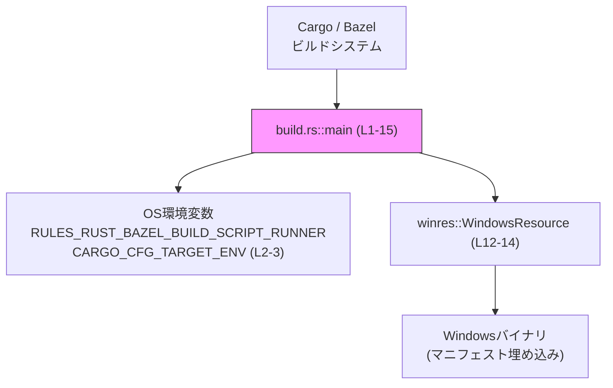

# windows-sandbox-rs\build.rs

## 0. ざっくり一言

このファイルは、Cargo のビルド時に実行される **build スクリプト**で、  
Windows 用バイナリにマニフェストを埋め込む処理を行い、特定の Bazel + GNU 環境ではその処理をスキップします。  
（根拠: `fn main` 内の環境変数判定と `winres::WindowsResource` 利用部分  
`windows-sandbox-rs\build.rs:L1-15`）

---

## 1. このモジュールの役割

### 1.1 概要

- Cargo がこの crate をビルドする際に実行される `build.rs` のエントリポイントです。
- Bazel（`RULES_RUST_BAZEL_BUILD_SCRIPT_RUNNER`）かつ `CARGO_CFG_TARGET_ENV=gnu` の環境では、マニフェスト埋め込みをスキップします。（`return;` で早期終了）  
  （根拠: `if` 条件と `return`  
  `windows-sandbox-rs\build.rs:L2-4,9`）
- それ以外の環境では、`winres` クレートを使って `"codex-windows-sandbox-setup.manifest"` をビルド成果物に埋め込みます。  
  （根拠: `WindowsResource::new` → `set_manifest_file` → `compile`  
  `windows-sandbox-rs\build.rs:L12-14`）

### 1.2 アーキテクチャ内での位置づけ

このファイルは crate ルートにある `build.rs` として、**アプリケーション本体とは別にビルドプロセスを拡張する位置**にあります。

- Cargo / Bazel から呼ばれるだけで、アプリケーションコードから直接呼び出されることはありません。
- 外部の `winres` クレートを利用して Windows リソース（マニフェスト）を生成します。
- OS の環境変数からビルド環境（Bazel かどうか、`gnu` かどうか）を判定します。

#### 1.2.1 コンポーネント一覧

| コンポーネント名 | 種別 | 役割 / 用途 | 定義/利用位置 |
|------------------|------|-------------|----------------|
| `main` | 関数 | build スクリプトのエントリポイント。環境変数を見て、マニフェスト埋め込みの有無を決定し、必要なら `winres` を呼び出す | 定義: `windows-sandbox-rs\build.rs:L1-15` |
| `std::env::var_os` | 外部関数（標準ライブラリ） | 環境変数 `RULES_RUST_BAZEL_BUILD_SCRIPT_RUNNER` を OS 文字列として取得し、設定有無を判定する | 利用: `windows-sandbox-rs\build.rs:L2` |
| `std::env::var` | 外部関数（標準ライブラリ） | 環境変数 `CARGO_CFG_TARGET_ENV` を UTF-8 文字列として取得し、`"gnu"` かどうかを判定する | 利用: `windows-sandbox-rs\build.rs:L2-3` |
| `matches!` | マクロ（標準ライブラリ） | `std::env::var` の戻り値が `Ok("gnu")` かどうかをパターンマッチで簡潔に判定する | 利用: `windows-sandbox-rs\build.rs:L2-3` |
| `winres::WindowsResource` | 外部構造体（`winres` クレート） | Windows バイナリに埋め込むリソース（マニフェストなど）を設定・生成する | 利用: `windows-sandbox-rs\build.rs:L12-14` |

#### 依存関係図（build.rs 全体: L1-15）



### 1.3 設計上のポイント

- **環境による分岐**  
  Bazel の Windows lint/test レーン（`RULES_RUST_BAZEL_BUILD_SCRIPT_RUNNER` が設定され、`CARGO_CFG_TARGET_ENV="gnu"`）では `return` で早期終了し、`winres` によるマニフェスト埋め込みを行いません。  
  （根拠: `if` 条件とコメント  
  `windows-sandbox-rs\build.rs:L2-9`）

- **ビルド失敗の回避優先**  
  `res.compile()` の戻り値は `_` に束縛して即座に破棄しており、成功/失敗をこのコードでは判定していません。マニフェスト生成に失敗しても、build スクリプト自体はエラー扱いにしない意図があると解釈できます。  
  （根拠: `let _ = res.compile();`  
  `windows-sandbox-rs\build.rs:L14`）

- **状態は持たない**  
  `main` はローカル変数 `res` だけを生成し、グローバルな状態や共有可変状態を扱っていません。並行実行やスレッド安全性を意識した処理は見られません。  
  （根拠: ファイル全体にグローバル変数やスレッド API が存在しない  
  `windows-sandbox-rs\build.rs:L1-15`）

---

## 2. 主要な機能一覧

- Bazel + GNU ターゲット環境の検出: 特定の環境下ではマニフェスト埋め込み処理をスキップすることで、Bazel の Windows lint/test レーンでのビルド問題を回避する。（`windows-sandbox-rs\build.rs:L2-9`）
- Windows マニフェストの埋め込み: `winres::WindowsResource` を使って `"codex-windows-sandbox-setup.manifest"` をビルド成果物に組み込む。（`windows-sandbox-rs\build.rs:L12-14`）

---

## 3. 公開 API と詳細解説

このファイルは build スクリプト用であり、外部から呼び出される「公開 API」は実質的に `main` 関数のみです（Cargo / Bazel が呼び出し元になります）。

### 3.1 型一覧（構造体・列挙体など）

このファイル内で新しく定義される型はありません。  
利用している主要な外部型は次のとおりです。

| 名前 | 種別 | 役割 / 用途 | 定義/利用位置 |
|------|------|-------------|----------------|
| `winres::WindowsResource` | 外部構造体（`winres` クレート） | Windows リソース（マニフェストなど）の設定と生成を行うビルダー的オブジェクト | 利用: `windows-sandbox-rs\build.rs:L12-14` |

※ `WindowsResource` の具体的なフィールドやメソッド一覧は、このチャンクには現れないため不明です。詳細は `winres` クレートのドキュメントを参照する必要があります。

### 3.2 関数詳細（最大 7 件）

#### `main()`

**概要**

- Cargo / Bazel によってビルド時に自動実行されるエントリポイントです。
- Bazel + `windows-gnullvm` 相当の環境を検出すると、マニフェスト埋め込み処理をスキップして即時終了します。
- それ以外の環境では `winres::WindowsResource` を用いて指定のマニフェストファイルをビルド成果物に埋め込みます。  
  （根拠: `fn main` の内部の条件分岐と `WindowsResource` 利用  
  `windows-sandbox-rs\build.rs:L1-15`）

**引数**

引数はありません。

| 引数名 | 型 | 説明 |
|--------|----|------|
| なし | - | build スクリプトの `main` であるため、引数は受け取りません |

**戻り値**

- 戻り値の型は `()`（何も返さない）です。
- ビルド結果は副作用（マニフェストの生成・埋め込み）によって決まります。

**内部処理の流れ（アルゴリズム）**

1. **Bazel 実行環境フラグの取得**  
   `std::env::var_os("RULES_RUST_BAZEL_BUILD_SCRIPT_RUNNER")` を呼び出し、Bazel の build スクリプトランナーが有効かどうかを `Option` で取得します。  
   その上で `is_some()` により「環境変数が設定されているか」を判定します。  
   （根拠: `var_os(...).is_some()`  
   `windows-sandbox-rs\build.rs:L2`）

2. **ターゲット環境の取得と GNU 判定**  
   `std::env::var("CARGO_CFG_TARGET_ENV")` でターゲット環境文字列（例: `"gnu"`, `"msvc"`）を取得し、`as_deref()` で `Result<String, _>` を `Result<&str, _>` に変換した上で、`matches!` マクロにより `Ok("gnu")` かどうかを判定します。  
   （根拠: `matches!(std::env::var("CARGO_CFG_TARGET_ENV").as_deref(), Ok("gnu"))`  
   `windows-sandbox-rs\build.rs:L2-3`）

3. **Bazel + GNU 環境のときの早期リターン**  
   上記 1 と 2 の判定がどちらも `true` の場合、`if` 本体に入って `return;` で `main` を即時終了します。  
   コメントによれば、これは Bazel の Windows lint/test レーン（`windows-gnullvm` ターゲット）において、`winres` が利用可能でない `resource` link directive を出してしまう問題を回避するためです。  
   （根拠: `if` 条件・コメント・`return`  
   `windows-sandbox-rs\build.rs:L2-9`）

4. **WindowsResource の生成**  
   `let mut res = winres::WindowsResource::new();` でリソースビルダーオブジェクトを生成します。可変変数 `res` として保持されます。  
   （根拠: `WindowsResource::new` の呼び出し  
   `windows-sandbox-rs\build.rs:L12`）

5. **マニフェストファイルの設定**  
   `res.set_manifest_file("codex-windows-sandbox-setup.manifest");` を呼び出し、埋め込み対象のマニフェストファイルを指定します。  
   ファイルパスは `"codex-windows-sandbox-setup.manifest"` という相対パス文字列です。どのディレクトリを基準とするかはこのチャンクには現れませんが、通常の Rust の build スクリプトでは crate ルート（`Cargo.toml` のあるディレクトリ）が基準になります。  
   （根拠: `set_manifest_file` 呼び出し  
   `windows-sandbox-rs\build.rs:L13`）

6. **リソースのコンパイル（マニフェスト埋め込み）**  
   `let _ = res.compile();` を呼び出し、リソース（マニフェスト）をコンパイルしてビルド成果物に組み込みます。戻り値は `_` に束縛することでコンパイラ警告を抑制しつつ破棄されています。  
   戻り値の型やエラー内容はこのチャンクには現れませんが、成功/失敗をこのコードではチェックしていない点が重要です。  
   （根拠: `let _ = res.compile();`  
   `windows-sandbox-rs\build.rs:L14`）

**Examples（使用例）**

`build.rs` の `main` は Cargo / Bazel が自動的に呼び出すため、通常はコードから直接呼び出しません。ここでは「どういった環境でどう動くか」の例を示します。

1. **通常の Cargo ビルド（マニフェスト埋め込みが行われるケース）**

```bash
# RULES_RUST_BAZEL_BUILD_SCRIPT_RUNNER を設定しない
unset RULES_RUST_BAZEL_BUILD_SCRIPT_RUNNER

# Cargo が MSVC ターゲットなどを用いてビルドしている（CARGO_CFG_TARGET_ENV="msvc" など）
# この環境変数は Cargo/rustc が内部で設定するもので、ユーザが明示的に設定する必要は通常ありません。
cargo build
```

- この場合、`var_os("RULES_RUST_BAZEL_BUILD_SCRIPT_RUNNER").is_some()` は `false` となり、`if` 条件全体が `false` になります。  
  （根拠: 環境変数未設定時の `var_os` の挙動  
  `windows-sandbox-rs\build.rs:L2`）
- したがって `return` には到達せず、`WindowsResource::new` → `set_manifest_file` → `compile` の流れが実行され、マニフェストが埋め込まれます。  
  （根拠: `if` に入らない場合の後続処理  
  `windows-sandbox-rs\build.rs:L12-14`）

1. **Bazel + GNU ターゲット相当の環境（マニフェスト埋め込みをスキップするケース）**

```bash
# Bazel の rules_rust が build スクリプトを起動する状況を模した環境
export RULES_RUST_BAZEL_BUILD_SCRIPT_RUNNER=1
export CARGO_CFG_TARGET_ENV=gnu

cargo build  # 実際には Bazel 経由で rustc が実行される想定
```

- `RULES_RUST_BAZEL_BUILD_SCRIPT_RUNNER` が設定されているため `var_os(...).is_some()` は `true` になります。
- `CARGO_CFG_TARGET_ENV` が `"gnu"` なので `matches!(..., Ok("gnu"))` も `true` になり、`if` 条件全体が `true` になります。
- `return;` により、`WindowsResource` の生成・コンパイルは実行されません。  
  （根拠: 条件式と `return`  
  `windows-sandbox-rs\build.rs:L2-4,9`）

**Errors / Panics**

- `std::env::var_os`  
  - 戻り値は `Option` であり、存在しない環境変数に対しては `None` を返します。ここでは `is_some()` のみを利用しているため、この部分でエラーや panic は発生しません。  
    （根拠: `var_os(...).is_some()` のみ使用  
    `windows-sandbox-rs\build.rs:L2`）
- `std::env::var`  
  - 戻り値は `Result` ですが、`matches!(..., Ok("gnu"))` によるパターンマッチで `Err` の場合も問題なく処理されています（`Err(_)` は `false` として扱われる）。したがってこの部分でも panic は発生しません。  
    （根拠: `matches!` で `Ok("gnu")` のみ比較  
    `windows-sandbox-rs\build.rs:L2-3`）
- `winres::WindowsResource::new`, `set_manifest_file`, `compile`  
  - 戻り値の具体的な型やエラー条件はこのチャンクには現れません。  
  - `compile` の戻り値を `_` に束縛しているため、`compile` がエラー情報を返していてもここではそれを検査していません。エラーが実際にどのように扱われるか（ログ出力だけなのか、ビルドを失敗にするのか）は `winres` の実装に依存し、このコードだけからは断定できません。  
    （根拠: `let _ = res.compile();` で戻り値未使用  
    `windows-sandbox-rs\build.rs:L14`）

**Edge cases（エッジケース）**

- **`RULES_RUST_BAZEL_BUILD_SCRIPT_RUNNER` 未設定**  
  - `var_os` は `None` を返し、`is_some()` は `false` になります。マニフェスト埋め込み処理は通常どおり行われます。  
    （根拠: `is_some()` チェックのみ  
    `windows-sandbox-rs\build.rs:L2`）
- **`CARGO_CFG_TARGET_ENV` 未設定、または非 UTF-8**  
  - `std::env::var` は `Err(_)` を返しますが、`matches!(..., Ok("gnu"))` は `false` を返すため、Bazel + GNU 判定にはなりません。マニフェスト埋め込みは実行されます。  
    （根拠: `Ok("gnu")` 以外をすべて `false` として扱う `matches!`  
    `windows-sandbox-rs\build.rs:L2-3`）
- **`CARGO_CFG_TARGET_ENV="gnu"` だが `RULES_RUST_BAZEL_BUILD_SCRIPT_RUNNER` 未設定**  
  - 片方だけでは条件が満たされないため、マニフェスト埋め込みはスキップされず、通常どおり実行されます。  
    （根拠: `&&` 条件  
    `windows-sandbox-rs\build.rs:L2-3`）
- **マニフェストファイルが存在しない / パスが誤っている**  
  - その場合に `compile` がどう振る舞うか（ビルド失敗にするか、無視するか）はこのコードからは分かりません。ただし、戻り値をチェックしていないため、少なくともこの `build.rs` 側ではエラー検知やメッセージ出力などは行っていません。  
    （根拠: `let _ = res.compile();` 以外にエラーハンドリングがない  
    `windows-sandbox-rs\build.rs:L14`）

**使用上の注意点**

- **環境変数に依存した分岐**  
  - `RULES_RUST_BAZEL_BUILD_SCRIPT_RUNNER` と `CARGO_CFG_TARGET_ENV` の組み合わせが挙動を変えます。Bazel 以外の環境でこれらを不意に設定すると、意図せずマニフェスト埋め込みがスキップされる可能性があります。  
    （根拠: `if` 条件全体  
    `windows-sandbox-rs\build.rs:L2-3`）
- **エラー情報の見逃し**  
  - `compile` の結果を破棄しているため、マニフェスト生成の失敗が静かに無視される形になる可能性があります。マニフェストの有無が重要な場合は、`compile` の戻り値をチェックする変更が必要になります。  
    （根拠: `let _ = res.compile();`  
    `windows-sandbox-rs\build.rs:L14`）
- **並行性・スレッド安全性**  
  - `main` は単一スレッドで実行される前提の build スクリプトであり、共有可変状態は扱っていません。そのため、典型的なデータ競合やロックといった並行性の問題はこのコードからは生じません。  
    （根拠: スレッド関連 API 不使用  
    `windows-sandbox-rs\build.rs:L1-15`）
- **セキュリティ観点**  
  - 挙動は OS の環境変数によって変わりますが、ファイルパスは固定のリテラル文字列であり、外部入力を直接ファイルパスに反映しているわけではありません。このため、このコード単独から見たセキュリティリスクは限定的です。  
    （根拠: 環境変数名と固定文字列 `"codex-windows-sandbox-setup.manifest"`  
    `windows-sandbox-rs\build.rs:L2-3,13`）

### 3.3 その他の関数

このファイル内で定義されている関数は `main` のみですが、利用している外部関数・メソッドを整理します。

| 関数 / メソッド名 | 役割（1 行） | 利用位置 |
|-------------------|--------------|----------|
| `std::env::var_os` | 環境変数を OS 文字列として取得し、有無のみを判定するために使う | `windows-sandbox-rs\build.rs:L2` |
| `std::env::var` | 環境変数を UTF-8 文字列として取得し、`"gnu"` かどうかを判定するために使う | `windows-sandbox-rs\build.rs:L2-3` |
| `matches!` マクロ | `std::env::var` の戻り値が `Ok("gnu")` かどうかを簡潔にチェックする | `windows-sandbox-rs\build.rs:L2-3` |
| `winres::WindowsResource::new` | リソースビルダーオブジェクトを生成する | `windows-sandbox-rs\build.rs:L12` |
| `WindowsResource::set_manifest_file` | 埋め込み対象のマニフェストファイルパスを設定する | `windows-sandbox-rs\build.rs:L13` |
| `WindowsResource::compile` | 設定済みのリソースをコンパイルしビルド成果物に埋め込む | `windows-sandbox-rs\build.rs:L14` |

---

## 4. データフロー

このセクションでは、ビルド実行時に `main` がどのようにデータ（環境変数・マニフェストファイル）を扱うかを示します。

### ビルド時のデータフロー（`main` 関数: L1-15）

1. ビルドシステム（Cargo / Bazel）が `build.rs::main` を起動します。
2. `main` は OS の環境変数から Bazel 実行フラグとターゲット環境を取得し、条件に応じてマニフェスト埋め込みをスキップするかどうかを決定します。  
   （根拠: `std::env::var_os`, `std::env::var`  
   `windows-sandbox-rs\build.rs:L2-3`）
3. スキップしない場合、`WindowsResource` を生成し、マニフェストファイルパスを設定してコンパイルを実行します。  
   （根拠: `WindowsResource::new`, `set_manifest_file`, `compile`  
   `windows-sandbox-rs\build.rs:L12-14`）

```mermaid
sequenceDiagram
    participant B as "ビルドシステム\n(Cargo/Bazel)"
    participant M as "build.rs::main (L1-15)"
    participant E as "OS環境変数\n(L2-3)"
    participant W as "winres::WindowsResource\n(L12-14)"
    participant Bin as "Windowsバイナリ\n(リソース付き)"

    B->>M: 実行開始
    M->>E: var_os("RULES_RUST_BAZEL_BUILD_SCRIPT_RUNNER")
    E-->>M: Option<OsString>
    M->>E: var("CARGO_CFG_TARGET_ENV")
    E-->>M: Result<String, VarError>
    M->>M: matches!(..., Ok("gnu")) で判定

    alt Bazel + gnu (if 条件が true, L2-4)
        M-->>B: return;（マニフェスト埋め込みをスキップ）
    else 通常の環境
        M->>W: WindowsResource::new()
        M->>W: set_manifest_file("codex-windows-sandbox-setup.manifest")
        M->>W: compile()
        W-->>Bin: マニフェストを埋め込んだバイナリ生成
        M-->>B: 正常終了
    end
```

---

## 5. 使い方（How to Use）

### 5.1 基本的な使用方法

`build.rs` は crate ルートに置かれているだけで、Cargo によってビルド時に自動的に実行されます。アプリケーションコードから直接呼び出す必要はありません。

典型的な利用フローは次のようになります。

1. `build.rs`（本ファイル）と、`codex-windows-sandbox-setup.manifest` をプロジェクトに配置する。
2. `cargo build` または Bazel のルールを使ってビルドを実行する。
3. Windows ターゲット向けにビルドされたバイナリにマニフェストが埋め込まれる（Bazel + gnu 環境ではスキップされる）。

Rust コード側は何も特別な処理を行う必要はありません。

### 5.2 よくある使用パターン

1. **通常の Windows ビルド（MSVC など）**

   - `RULES_RUST_BAZEL_BUILD_SCRIPT_RUNNER` は未設定。
   - `CARGO_CFG_TARGET_ENV` は `"msvc"` など（Cargo / rustc が設定）。  
   - マニフェスト埋め込みが実行されます。

2. **CI 上の Bazel Windows lint/test レーン**

   - `RULES_RUST_BAZEL_BUILD_SCRIPT_RUNNER` が Bazel によって設定される。
   - `CARGO_CFG_TARGET_ENV` が `"gnu"`（`windows-gnullvm` ターゲット）。  
   - `if` 条件が成立し、マニフェスト埋め込みをスキップしてビルドが進行します。  
     （根拠: コメントの説明と条件式  
     `windows-sandbox-rs\build.rs:L2-9`）

### 5.3 よくある間違い

このファイルの設計意図に反する可能性がある使い方の例を挙げます。

```rust
// （誤った前提の例）環境変数を手動で設定して挙動を変えようとする
// 実際の CI / Bazel が設定する値と異なると、意図しないスキップや実行が起きる可能性があります。
//
// 例: ローカルでデバッグ中に RULES_RUST_BAZEL_BUILD_SCRIPT_RUNNER=1 だけを
// 設定してビルドすると、CARGO_CFG_TARGET_ENV が "gnu" でない環境では
// スキップされず、Bazel の挙動を正しく再現できません。
```

正しい運用としては、これらの環境変数は通常 CI やビルドシステム（Bazel / Cargo）が設定するものであり、ローカルで手動設定して挙動を変えるよりも、ビルドシステムの設定を通じて制御するほうが整合性が保たれます。

### 5.4 使用上の注意点（まとめ）

- **環境変数に依存した分岐**  
  - Bazel と gnu ターゲットの組み合わせのみ特別扱いされるため、ビルド環境を変更する際は `RULES_RUST_BAZEL_BUILD_SCRIPT_RUNNER` と `CARGO_CFG_TARGET_ENV` の値に注意が必要です。
- **マニフェストファイルの存在**  
  - `"codex-windows-sandbox-setup.manifest"` が見つからない場合の挙動は `winres` 依存で、このコードからは分かりません。マニフェストが必須であれば、このファイルの存在と内容を CI などで別途チェックするのが安全です。
- **エラーの黙殺の可能性**  
  - `compile` の戻り値を破棄しているため、エラーが発生しても検知されない可能性があります。ビルド失敗で明示したい場合は、戻り値を `Result` と仮定して `?` 演算子や `expect` で処理するような変更が必要です（ただし、これは `winres` の API 仕様を確認した上で行う必要があります）。
- **パフォーマンス**  
  - build スクリプトはビルドごとに一度だけ実行されるのが一般的であり、この程度の処理（環境変数読み取りとリソース生成）はパフォーマンス面で大きな影響はないと考えられます。この点についても特別な最適化は行われていません。  
    （根拠: ループや重い計算が存在しない  
    `windows-sandbox-rs\build.rs:L1-15`）

---

## 6. 変更の仕方（How to Modify）

### 6.1 新しい機能を追加する場合

**例: 追加の Windows リソースを埋め込みたい場合**

1. `WindowsResource` に対する設定を行っている部分（`res` 変数）を特定します。  
   （根拠: `let mut res = ...;` と `set_manifest_file`  
   `windows-sandbox-rs\build.rs:L12-13`）
2. 追加したいリソースに対応する `winres` のメソッド（例: アイコン、バージョン情報など）を `set_manifest_file` の前後に追記します。  
   - 具体的なメソッド名や引数は `winres` クレートのドキュメントを確認する必要があります。このチャンクには現れていません。
3. そのまま `res.compile();` を呼び出せば、追加された設定も含めてリソースがコンパイルされます。

### 6.2 既存の機能を変更する場合

- **Bazel / gnu 環境の判定条件を変更したい場合**
  - 判定ロジックは `if std::env::var_os(...).is_some() && matches!(...)` の部分に集中しているため、ここを変更します。  
    （根拠: `if` 条件式  
    `windows-sandbox-rs\build.rs:L2-3`）
  - 影響範囲:  
    - Bazel でのビルド（特に `windows-gnullvm` ターゲット）におけるマニフェスト埋め込みの有無が変わります。
    - CI やリリースビルドでマニフェストが必要かどうかを確認した上で変更する必要があります。

- **マニフェストファイル名・場所を変えたい場合**
  - `set_manifest_file("codex-windows-sandbox-setup.manifest");` の引数のみを変更すれば、ビルドスクリプトの観点では完結します。  
    （根拠: ファイルパスを指定している唯一の箇所  
    `windows-sandbox-rs\build.rs:L13`）
  - ただし、ファイルパスの基準ディレクトリや、実際のファイル構成についてはこのチャンクには現れないため、プロジェクト全体のレイアウトと整合性を取る必要があります。

- **エラーをビルド失敗として扱いたい場合**
  - `let _ = res.compile();` の部分を、戻り値を変数に受けて `?` 演算子などで扱う形に変更することが考えられます。  
    （例: `res.compile().expect("...");` など）
  - ただし、`compile` の戻り値型が何であるかはこのチャンクには記載されていないため、`winres` の API を確認した上で行う必要があります。

---

## 7. 関連ファイル

このファイルと密接に関係しそうなファイル・リソースを整理します。なお、ここで挙げるファイルの具体的な内容や場所は、このチャンクには現れないものも含まれます。

| パス | 役割 / 関係 |
|------|------------|
| `windows-sandbox-rs\codex-windows-sandbox-setup.manifest`（推定） | `set_manifest_file("codex-windows-sandbox-setup.manifest")` で指定されているマニフェストファイル。実際のディレクトリ構成はこのチャンクからは不明です。 (`windows-sandbox-rs\build.rs:L13`) |
| `windows-sandbox-rs\Cargo.toml` | この crate のビルド設定を保持するファイル。`build.rs` が存在することで、Cargo によるビルド時に本スクリプトが自動的に実行されることになると考えられますが、具体的な設定内容はこのチャンクには現れません。 |
| `winres` クレート | 外部依存として利用されているリソースコンパイル用ライブラリ。本ファイルでは `winres::WindowsResource` のみ利用しており、その他の API はこのチャンクには現れません。 (`windows-sandbox-rs\build.rs:L12-14`) |

このファイル単体からはテストコードや追加のサポートユーティリティは読み取れません。ビルドやマニフェストに関するテストが存在するかどうかは、他のディレクトリ（例: `tests/`, CI 設定ファイルなど）を確認する必要があります。
