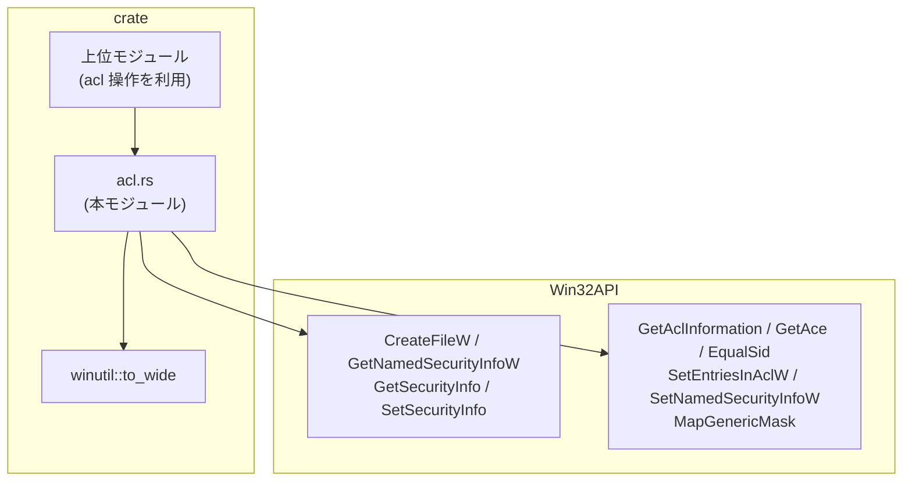
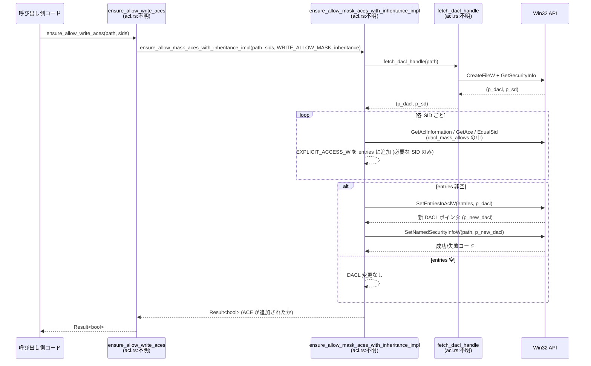

# windows-sandbox-rs/src/acl.rs

## 0. ざっくり一言

Windows のファイル／ディレクトリ／カーネルオブジェクトに対して、DACL (Discretionary ACL) を取得・検査・変更するためのユーティリティ関数群を提供するモジュールです。SID ごとのアクセス許可／拒否 ACE を追加・確認・取り消す処理がまとまっています。

> 行番号について: このチャンクには元ソースの行番号情報が含まれていないため、根拠は `acl.rs:不明-不明` という形式で記載します。

---

## 1. このモジュールの役割

### 1.1 概要

- このモジュールは **Windows オブジェクト（ファイル／ディレクトリ／NUL デバイスなど）の DACL を操作する問題** を解決するために存在し、以下の機能を提供します。
  - パスまたはハンドルから DACL を取得する
  - 指定した SID 群が与えられたアクセス マスクを満たしているか判定する
  - 指定した SID に対して allow / deny ACE を追加する
  - 指定した SID に対する ACE を取り消す
  - NUL デバイスに対する SID のアクセス権を設定する

### 1.2 アーキテクチャ内での位置づけ

- 依存関係（このファイルに現れる範囲）:
  - `crate::winutil::to_wide`: Rust の `Path` や文字列を Windows の UTF-16 ワイド文字列に変換
  - `windows_sys::Win32::*`: Win32 API 群（ACL／セキュリティ／ファイル I/O）
  - `anyhow::Result`: エラーラップ用の汎用エラー型
- 比較的低レベルな「ACL 操作ユーティリティ」であり、上位のサンドボックス構成モジュールから呼び出されることが想定されます（呼び出し元はこのチャンクには現れません）。

依存関係を簡略化して図示すると次のようになります。



※ すべてのノードは `acl.rs:不明-不明` から読み取った関係です。

### 1.3 設計上のポイント

コードから読み取れる設計上の特徴は次の通りです（根拠: `acl.rs:不明-不明`）。

- **API の粒度**
  - 「DACL を取得する」「マスクで許可を判定する」といった低レベル関数と、
    「書き込みを許可／拒否する ACE を確実に追加する」といった高レベル関数が分かれています。
- **unsafe 境界の配置**
  - Win32 API 呼び出しとポインタ操作を行う関数は多くが `pub unsafe fn` になっています。
  - ただし `path_mask_allows` のように `&[*mut c_void]`（raw ポインタ配列）を引数に取りつつ `unsafe` でない関数もあり、Rust の型システムだけではポインタの妥当性を保証していません。
- **エラーハンドリング方針**
  - 一部の関数（例: `fetch_dacl_handle`, `ensure_allow_mask_aces_with_inheritance_impl` など）は Win32 API の戻りコードを検査し、`anyhow::Error` にラップして `Result` で返します。
  - 一方で `add_allow_ace` や `add_deny_write_ace`, `revoke_ace`, `allow_null_device` では、一部 Win32 API の失敗を呼び出し側にエラーとして伝えず、boolean や `()` を返す設計になっています。
- **リソース管理**
  - `LocalFree` によるセキュリティ記述子や新しい DACL の解放、`CloseHandle` によるハンドル解放が行われています。
  - 取得したセキュリティ記述子 (`p_sd`) の解放責任が、関数によっては呼び出し側、関数内の双方に振り分けられています（`fetch_dacl_handle` では呼び出し側、その他は関数内で `LocalFree`）。
- **DACL の最適化された更新**
  - 既に必要な allow ACE / deny ACE が存在する場合は DACL の書き換え (`SetEntriesInAclW`) を行わずに早期 return することで、不要な Win32 呼び出しを回避しています（例: `add_allow_ace`, `ensure_allow_mask_aces_with_inheritance_impl`）。

---

## 2. 主要な機能一覧

このモジュールが提供する主な機能（関数）を箇条書きで示します（すべて `acl.rs:不明-不明` に定義）。

- `fetch_dacl_handle`: パスからファイルハンドルを開き、`GetSecurityInfo` で DACL とセキュリティ記述子を取得する。
- `dacl_mask_allows`: DACL 内の ACE を走査し、指定した SID 群に対してアクセス マスクが満たされているか判定する。
- `path_mask_allows`: パスから DACL を取得して `dacl_mask_allows` でマスク判定を行う高レベルラッパー。
- `dacl_has_write_allow_for_sid`: 指定 SID に対する書き込み許可 ACE が存在するか判定する。
- `dacl_has_write_deny_for_sid`: 指定 SID に対する書き込み系の deny ACE が存在するか判定する。
- `ensure_allow_mask_aces_with_inheritance`: 指定 SID 群が特定マスクの allow ACE を持つことを保証（不足していれば追加）する。
- `ensure_allow_mask_aces`: 上記の継承フラグ付き版（コンテナ／オブジェクト継承付き）。
- `ensure_allow_write_aces`: 読み取り・書き込み・実行＋削除系の WRITE_ALLOW_MASK を許可する ACE を SID 群に保証する。
- `add_allow_ace`: 単一 SID に対して read/write/execute を許可する ACE を追加する（既に書き込み許可があれば何もしない）。
- `add_deny_write_ace`: 単一 SID に対して書き込み／追加／削除系を拒否する ACE を追加する（既に deny ACE があれば何もしない）。
- `revoke_ace`: 単一 SID に対する ACE を `REVOKE_ACCESS` モードで取り消す。
- `allow_null_device`: `\\.\NUL` デバイスに対して指定 SID に read/write/execute を許可する ACE を追加し、標準出力／エラーのリダイレクト用途を支援する。

---

## 3. 公開 API と詳細解説

### 3.0 関数・定数インベントリー

このファイル内の関数・定数の一覧です（根拠はすべて `acl.rs:不明-不明`）。

#### 関数一覧

| 名前 | 種別 | 公開 | 役割 / 用途 | 根拠 |
|------|------|------|-------------|------|
| `fetch_dacl_handle` | 関数 | `pub unsafe` | パスから DACL とセキュリティ記述子を取得する | `acl.rs:不明-不明` |
| `dacl_mask_allows` | 関数 | `pub unsafe` | DACL を走査して SID 群に対するマスク許可を判定する | 同上 |
| `path_mask_allows` | 関数 | `pub` | `fetch_dacl_handle` と `dacl_mask_allows` を組み合わせたパスベースの判定 | 同上 |
| `dacl_has_write_allow_for_sid` | 関数 | `pub unsafe` | 単一 SID に対する書き込み許可 ACE 存在チェック | 同上 |
| `dacl_has_write_deny_for_sid` | 関数 | `pub unsafe` | 単一 SID に対する書き込み系 deny ACE 存在チェック | 同上 |
| `ensure_allow_mask_aces_with_inheritance_impl` | 関数 | `unsafe`（非 pub） | SID 群に対する allow ACE を不足分だけ追加する内部実装 | 同上 |
| `ensure_allow_mask_aces_with_inheritance` | 関数 | `pub unsafe` | 上記実装の公開ラッパー | 同上 |
| `ensure_allow_mask_aces` | 関数 | `pub unsafe` | 継承フラグを固定した `ensure_allow_mask_aces_with_inheritance` のラッパー | 同上 |
| `ensure_allow_write_aces` | 関数 | `pub unsafe` | WRITE_ALLOW_MASK を許可する ACE を SID 群に保証する高レベル API | 同上 |
| `add_allow_ace` | 関数 | `pub unsafe` | 単一 SID に対する read/write/execute 許可 ACE を追加 | 同上 |
| `add_deny_write_ace` | 関数 | `pub unsafe` | 単一 SID に対する書き込み拒否 ACE を追加 | 同上 |
| `revoke_ace` | 関数 | `pub unsafe` | 単一 SID に対する ACE を REVOKE_ACCESS で取り消し | 同上 |
| `allow_null_device` | 関数 | `pub unsafe` | `\\.\NUL` の DACL に SID 用の allow ACE を追加 | 同上 |

#### 定数一覧

| 名前 | 役割 / 用途 | 根拠 |
|------|-------------|------|
| `SE_KERNEL_OBJECT` | `GetSecurityInfo` / `SetSecurityInfo` 用のオブジェクト種別値 (6) | `acl.rs:不明-不明` |
| `INHERIT_ONLY_ACE` | `AceFlags` のビットフラグ。継承専用 ACE 判定に使用 | 同上 |
| `GENERIC_WRITE_MASK` | 書き込み用の GENERIC マスク値 (0x4000_0000) | 同上 |
| `DENY_ACCESS` | `EXPLICIT_ACCESS_W.grfAccessMode` に渡す deny 指定 (3) | 同上 |
| `WRITE_ALLOW_MASK` | READ/WRITE/EXECUTE + 削除系の複合マスク | 同上 |
| `CONTAINER_INHERIT_ACE` | 子コンテナ継承用 ACE フラグ (0x2) | 同上 |
| `OBJECT_INHERIT_ACE` | 子オブジェクト継承用 ACE フラグ (0x1) | 同上 |

### 3.1 型一覧（構造体・列挙体など）

このファイル内で新たに定義される Rust の構造体・列挙体はありません。使用している主な外部型は次の通りです（すべて `windows_sys` 由来）。

| 名前 | 種別 | 役割 / 用途 |
|------|------|-------------|
| `ACL` | C構造体 | DACL を表す Windows の ACL 構造体 |
| `ACL_SIZE_INFORMATION` | C構造体 | ACL の ACE 数やサイズ情報を格納 |
| `ACE_HEADER` | C構造体 | ACE 共通ヘッダ（タイプ・フラグ・サイズ） |
| `ACCESS_ALLOWED_ACE` | C構造体 | アクセス許可 ACE の構造体（ヘッダ＋マスク＋SID） |
| `EXPLICIT_ACCESS_W` | C構造体 | ACL 編集 API に渡す ACE 設定情報 |
| `TRUSTEE_W` | C構造体 | EXPLICIT_ACCESS_W 内の trustee（SID など） |
| `GENERIC_MAPPING` | C構造体 | GENERIC_READ/WRITE/EXECUTE/ALL の実マスク展開定義 |

### 3.2 関数詳細（主要 7 件）

以下では特に重要と思われる 7 関数について詳しく説明します。

---

#### `fetch_dacl_handle(path: &Path) -> Result<(*mut ACL, *mut c_void)>`

**概要**

- ファイルまたはディレクトリのパスから `CreateFileW` でハンドルを開き、`GetSecurityInfo` により DACL (`*mut ACL`) とセキュリティ記述子 (`*mut c_void`) を取得します（根拠: `acl.rs:不明-不明`）。
- 返されたセキュリティ記述子は呼び出し側で `LocalFree` により解放する必要があります。

**安全性 (Safety)**

- 関数自体が `pub unsafe fn` であり、ドキュメンテーションコメントにも「Caller must free the returned security descriptor with `LocalFree` and pass an existing path.」とあります。
- `path` が実在しない場合やアクセス権不足の場合は Win32 API が失敗し、`Err` が返されます。

**引数**

| 引数名 | 型 | 説明 |
|--------|----|------|
| `path` | `&Path` | 対象とするファイルまたはディレクトリのパス |

**戻り値**

- `Ok((p_dacl, p_sd))`:
  - `p_dacl: *mut ACL` — DACL を指すポインタ。NULL になり得ます（DACL が存在しない場合等）。
  - `p_sd: *mut c_void` — セキュリティ記述子 (`PSECURITY_DESCRIPTOR`)。`LocalFree` で解放が必要です。
- `Err(anyhow::Error)`:
  - `CreateFileW` または `GetSecurityInfo` がエラーコードを返した場合。

**内部処理の流れ**

1. `to_wide(path)` で UTF-16 のパスバッファを生成。
2. `CreateFileW` を `READ_CONTROL` 権限と共有フラグ付きで呼び出し、既存オブジェクトを開く。
3. ハンドルが `INVALID_HANDLE_VALUE` の場合、`Err(anyhow!("CreateFileW failed ..."))` を返す。
4. `GetSecurityInfo` を `DACL_SECURITY_INFORMATION` フラグ付きで呼び出し、`p_dacl` と `p_sd` を取得。
5. ハンドルを `CloseHandle` で閉じる。
6. `GetSecurityInfo` の戻りコードが `ERROR_SUCCESS` でなければ `Err(anyhow!("GetSecurityInfo failed ...: code"))`。
7. 成功した場合、`Ok((p_dacl, p_sd))` を返す。

**Examples（使用例）**

```rust
use std::path::Path;
use windows_sys::Win32::Foundation::LocalFree;
use windows_sys::Win32::Security::ACL;
use std::ffi::c_void;

fn main() -> anyhow::Result<()> {
    let path = Path::new(r"C:\temp\file.txt");          // 対象パスを指定

    // セキュリティ記述子取得は unsafe
    let (p_dacl, p_sd): (*mut ACL, *mut c_void) = unsafe {
        crate::acl::fetch_dacl_handle(path)?           // DACL と SD を取得
    };

    // ... p_dacl を使って ACL を解析する ...

    // セキュリティ記述子を解放（契約事項）
    if !p_sd.is_null() {
        unsafe { LocalFree(p_sd as windows_sys::Win32::Foundation::HLOCAL); }
    }

    Ok(())
}
```

**Errors / Panics**

- `Err` になる条件:
  - `CreateFileW` の戻り値が `INVALID_HANDLE_VALUE` の場合。
  - `GetSecurityInfo` の戻りコードが `ERROR_SUCCESS` 以外の場合。
- panic を起こすコードは含まれていません。

**Edge cases（エッジケース）**

- パスが存在しない／アクセス不能: `CreateFileW` が失敗し、`Err` を返します。
- DACL が付いていないオブジェクト: `GetSecurityInfo` の仕様次第ですが、`p_dacl` が NULL の可能性があります。呼び出し側で NULL チェックを行う必要があります。

**使用上の注意点**

- 返される `p_sd` の所有権は呼び出し側にあり、必ず `LocalFree` で解放する必要があります。
- この関数自体は DACL を変更しませんが、ハンドルのオープンに必要な権限 (`READ_CONTROL`) が不足していると失敗します。
- `unsafe` であるため、ポインタの使用やリソース解放管理は呼び出し側の責任になります。

---

#### `dacl_mask_allows(p_dacl: *mut ACL, psids: &[*mut c_void], desired_mask: u32, require_all_bits: bool) -> bool`

**概要**

- DACL (`*mut ACL`) に含まれる ACCESS_ALLOWED ACE を走査し、指定した SID 群のいずれか（または複数）が `desired_mask` に示すアクセス権を持っているかを判定します（根拠: `acl.rs:不明-不明`）。
- `require_all_bits = true` のときは `desired_mask` の全ビットが満たされている場合のみ `true`、`false` のときは一部のビットが許可されていれば `true` となります。

**引数**

| 引数名 | 型 | 説明 |
|--------|----|------|
| `p_dacl` | `*mut ACL` | 対象 DACL ポインタ。NULL の場合は即座に `false`。 |
| `psids` | `&[*mut c_void]` | チェック対象とする SID ポインタのスライス。 |
| `desired_mask` | `u32` | 必要とするアクセス マスク。GENERIC ビットを含んでもよい。 |
| `require_all_bits` | `bool` | `true` の場合は `desired_mask` の全ビットが含まれることを要求。 |

**戻り値**

- `true`:
  - DACL 内に、`psids` のいずれかの SID に対する ACCESS_ALLOWED ACE が存在し、その ACE を GENERIC_MAPPING を通じて展開した結果として `desired_mask` 条件が満たされている場合。
- `false`:
  - DACL が NULL／取得に失敗／ACE が 1 つも条件を満たさない場合。

**内部処理の流れ**

1. `p_dacl` が NULL なら即 `false`。
2. `GetAclInformation` で `ACL_SIZE_INFORMATION` を取得し、ACE の個数を得る。失敗なら `false`。
3. `GENERIC_MAPPING` に FILE_GENERIC_READ/WRITE/EXECUTE/ALL を設定。
4. ACE index 0..AceCount-1 をループ:
   - `GetAce` で ACE ポインタ (`p_ace`) を取得。失敗なら次へ。
   - `p_ace` を `ACE_HEADER` として解釈し、`AceType != 0`（ACCESS_ALLOWED_ACE_TYPE 以外）ならスキップ。
   - `AceFlags & INHERIT_ONLY_ACE != 0`（継承専用 ACE）ならスキップ。
   - ACE 本体を `ACCESS_ALLOWED_ACE` として解釈し、その直後の SID ポインタを計算。
   - 引数 `psids` の各 SID と `EqualSid` で比較し、一致する SID がなければ次へ。
   - 一致する SID があれば、`ace.Mask` をコピーした `mask` に `MapGenericMask` を適用。
   - `require_all_bits` に応じて `(mask & desired_mask)` を評価し、条件を満たせば `true` を返す。
5. 最後まで見つからなければ `false`。

**Examples（使用例）**

```rust
use std::path::Path;
use std::ffi::c_void;
use windows_sys::Win32::Security::{FILE_GENERIC_READ, FILE_GENERIC_WRITE};

fn check_write_allowed(path: &Path, sid: *mut c_void) -> anyhow::Result<bool> {
    // SID を 1 要素の配列にする
    let sids = [sid];

    // パスベースのラッパーで呼ぶ方が通常は簡便
    let allowed = crate::acl::path_mask_allows(
        path,
        &sids,
        FILE_GENERIC_READ | FILE_GENERIC_WRITE,   // 読み書き両方を要求
        true,                                     // 全ビット必要
    )?;

    Ok(allowed)
}
```

（内部的には `dacl_mask_allows` が unsafe で実行されます。）

**Errors / Panics**

- `dacl_mask_allows` 自体は `bool` を返すのみで、エラーを返しません。
- `GetAclInformation` / `GetAce` が失敗しても `false` を返すだけで、エラーコードは呼び出し側には渡りません。
- panic を起こすコードは含まれていません。

**Edge cases（エッジケース）**

- `p_dacl == NULL`: 直ちに `false`。
- `psids` が空スライス: どの SID にもマッチしないため、最終的に `false`。
- すべての ACE が `INHERIT_ONLY_ACE` の場合: 現オブジェクトには適用されない ACE ばかりなので、`false`。
- GENERIC ビットが含まれる `desired_mask`: `MapGenericMask` により展開されてから判定されるため、GENERIC_* を含んでも正しく判定されます。

**使用上の注意点**

- `psids` に含まれる SID ポインタの妥当性はチェックされません。無効なポインタを渡すと、`EqualSid` 呼び出しで未定義動作になる可能性があります。
- この関数は DACL を変更せず読み取り専用ですが、unsafe 関数であるため、呼び出し側でポインタのライフタイム・アラインメントなどを保証する必要があります。
- エラー理由が必要な場合は、この関数を直接使うのではなく、呼び出し前後の Win32 呼び出しを個別に行う必要があります。

---

#### `path_mask_allows(path: &Path, psids: &[*mut c_void], desired_mask: u32, require_all_bits: bool) -> Result<bool>`

**概要**

- `fetch_dacl_handle` でパスから DACL を取得し、`dacl_mask_allows` によるマスク判定を行う高レベルラッパーです（根拠: `acl.rs:不明-不明`）。
- 取得したセキュリティ記述子は関数内で `LocalFree` により解放されます。

**引数**

| 引数名 | 型 | 説明 |
|--------|----|------|
| `path` | `&Path` | 対象パス |
| `psids` | `&[*mut c_void]` | チェック対象 SID 配列 |
| `desired_mask` | `u32` | 要求するアクセス マスク |
| `require_all_bits` | `bool` | 全ビット要求するかのフラグ |

**戻り値**

- `Ok(true/false)`:
  - `true` なら `dacl_mask_allows` が `true` を返した場合。
  - `false` なら DACL が条件を満たさない場合。
- `Err(anyhow::Error)`:
  - `fetch_dacl_handle` が `Err` を返した場合（CreateFileW / GetSecurityInfo の失敗）。

**内部処理の流れ**

1. `unsafe` ブロック内で `fetch_dacl_handle(path)` を呼び出し、`(p_dacl, sd)` を取得。
2. `dacl_mask_allows(p_dacl, psids, desired_mask, require_all_bits)` を呼び出し、`has` を得る。
3. `sd` が NULL でなければ `LocalFree(sd)` を呼び出して解放。
4. `Ok(has)` を返す。

**Examples（使用例）**

```rust
use std::path::Path;
use std::ffi::c_void;
use windows_sys::Win32::Security::FILE_GENERIC_WRITE;

fn main() -> anyhow::Result<()> {
    let path = Path::new(r"C:\temp\file.txt");          // パス
    let my_sid: *mut c_void = get_my_sid_somehow()?;    // 何らかの方法で SID を取得したと仮定
    let sids = [my_sid];                                // 配列にまとめる

    // path_mask_allows 自体は safe 関数
    let can_write = crate::acl::path_mask_allows(
        path,
        &sids,
        FILE_GENERIC_WRITE,
        false,                                          // 一部ビットでも良い
    )?;

    println!("write allowed? {}", can_write);
    Ok(())
}
```

**Errors / Panics**

- `fetch_dacl_handle` がエラーを返した場合、そのまま `Err` として伝播されます。
- `dacl_mask_allows` 内部での Win32 API 失敗は `false` 扱いとなり、エラーとしては返されません。

**Edge cases（エッジケース）**

- パスが存在しない／アクセス不能: `fetch_dacl_handle` の段階で `Err`。
- `psids` が空: 常に `Ok(false)`。
- DACL が NULL: `dacl_mask_allows` の仕様により `false`。

**使用上の注意点**

- 関数シグネチャは safe ですが、内部で raw ポインタを FFI に渡しています。したがって、**`psids` に含まれる SID ポインタの妥当性は呼び出し側で保証する必要があります**（Rust の型システムでは保護されません）。
- セキュリティ記述子の解放は関数内で行われるため、呼び出し側は返り値の `bool` にのみ注目すればよい設計です。

---

#### `ensure_allow_mask_aces_with_inheritance(path: &Path, sids: &[*mut c_void], allow_mask: u32, inheritance: u32) -> Result<bool>`

**概要**

- 指定した SID 群それぞれが、対象パスの DACL において `allow_mask` を持つ ACCESS_ALLOWED ACE を持つことを保証します（不足している SID についてのみ ACE を追加）（根拠: `acl.rs:不明-不明`）。
- `inheritance` フラグにより、追加される ACE の継承動作（コンテナ／オブジェクト継承など）を制御します。
- 1 つ以上の ACE を追加した場合は `Ok(true)`、変更がなかった場合は `Ok(false)`。

**引数**

| 引数名 | 型 | 説明 |
|--------|----|------|
| `path` | `&Path` | 対象パス |
| `sids` | `&[*mut c_void]` | 対象 SID 群 |
| `allow_mask` | `u32` | 付与したいアクセス マスク |
| `inheritance` | `u32` | ACE の継承フラグ（例: `CONTAINER_INHERIT_ACE | OBJECT_INHERIT_ACE`） |

**戻り値**

- `Ok(true)`:
  - 1 つ以上の SID に対して新しい ACE が追加され、DACL が更新された場合。
- `Ok(false)`:
  - すべての SID が既に必要なマスクを持っており、DACL に変更がなかった場合。
- `Err(anyhow::Error)`:
  - `SetEntriesInAclW` または `SetNamedSecurityInfoW` がエラーコードを返した場合。

**内部処理の流れ（実体は `ensure_allow_mask_aces_with_inheritance_impl`）**

1. `fetch_dacl_handle(path)` を使って `(p_dacl, p_sd)` を取得。
2. 空の `Vec<EXPLICIT_ACCESS_W>` を用意。
3. 各 `sid` について:
   - `dacl_mask_allows(p_dacl, &[*sid], allow_mask, true)` を呼び出し、既に ACE があるかチェック。
   - ない場合は `EXPLICIT_ACCESS_W` 構造体を作成し、`entries` ベクタに push。
4. `entries` が空なら、`p_sd` を `LocalFree` して `Ok(false)` を返す。
5. `entries` が非空なら:
   - `SetEntriesInAclW(entries.len(), entries.as_ptr(), p_dacl, &mut p_new_dacl)` で新しい DACL を作成。
   - 成功 (`ERROR_SUCCESS`) なら `SetNamedSecurityInfoW` で対象パスの DACL を `p_new_dacl` に更新。
   - `SetNamedSecurityInfoW` が成功したら `added = true` とし、`p_new_dacl` を `LocalFree`。
   - 失敗した場合は `p_new_dacl` / `p_sd` を解放した上で `Err(anyhow!("SetNamedSecurityInfoW failed: {code3}"))`。
   - `SetEntriesInAclW` 自体が失敗した場合も `p_sd` を解放し `Err(anyhow!("SetEntriesInAclW failed: {code2}"))`。
6. 最後に `p_sd` を解放し、`Ok(added)` を返す。

**Examples（使用例）**

```rust
use std::path::Path;
use std::ffi::c_void;
use windows_sys::Win32::Security::{
    FILE_GENERIC_READ, FILE_GENERIC_WRITE, FILE_GENERIC_EXECUTE,
};

fn ensure_full_access(path: &Path, sid: *mut c_void) -> anyhow::Result<bool> {
    let sids = [sid];

    // 付与したいマスク (読み書き実行)
    let allow_mask = FILE_GENERIC_READ | FILE_GENERIC_WRITE | FILE_GENERIC_EXECUTE;

    // 継承フラグを明示して呼び出し
    let added = unsafe {
        crate::acl::ensure_allow_mask_aces_with_inheritance(
            path,
            &sids,
            allow_mask,
            crate::acl::CONTAINER_INHERIT_ACE | crate::acl::OBJECT_INHERIT_ACE,
        )?
    };

    Ok(added)
}
```

**Errors / Panics**

- `Err` になる条件:
  - `fetch_dacl_handle` が失敗した場合。
  - `SetEntriesInAclW` が `ERROR_SUCCESS` 以外のコードを返した場合。
  - `SetNamedSecurityInfoW` が `ERROR_SUCCESS` 以外のコードを返した場合。
- panic を起こすコードは含まれていません。

**Edge cases（エッジケース）**

- すべての SID がすでに `allow_mask` を満たしている場合:
  - `entries` が空になり、DACL 書き換えなく `Ok(false)`。
- DACL が NULL の場合:
  - `dacl_mask_allows` の仕様上、既存 ACE がないとみなされるため、すべての SID に対して新規 ACE が作成される可能性があります。
- `sids` が空:
  - `entries` は常に空になり、`Ok(false)`。

**使用上の注意点**

- `sids` 内の SID ポインタの妥当性は呼び出し側の責任です。
- DACL の変更は排他的ではなく、他プロセス／スレッドが同じ DACL を同時に変更し得るため、競合更新に対する OS レベルの考慮が必要になる場合があります。
- ファイルシステムの種類により、一部の権限フラグが無視されることがあります（これは Win32 の仕様であり、このモジュールでは検査していません）。

---

#### `ensure_allow_mask_aces(path: &Path, sids: &[*mut c_void], allow_mask: u32) -> Result<bool>`

**概要**

- `ensure_allow_mask_aces_with_inheritance` の継承フラグを `CONTAINER_INHERIT_ACE | OBJECT_INHERIT_ACE` に固定したラッパーです（根拠: `acl.rs:不明-不明`）。
- ディレクトリ／ツリーに対して子オブジェクトに ACE を継承させる用途を想定していると解釈できます。

**引数**

| 引数名 | 型 | 説明 |
|--------|----|------|
| `path` | `&Path` | 対象パス |
| `sids` | `&[*mut c_void]` | 対象 SID 群 |
| `allow_mask` | `u32` | 許可したいアクセス マスク |

**戻り値**

- `ensure_allow_mask_aces_with_inheritance` と同じ意味で `Result<bool>`。

**内部処理**

- 単に次を呼び出します。

```rust
ensure_allow_mask_aces_with_inheritance(
    path,
    sids,
    allow_mask,
    CONTAINER_INHERIT_ACE | OBJECT_INHERIT_ACE,
)
```

**Examples（使用例）**

```rust
use std::path::Path;
use std::ffi::c_void;

fn ensure_inherited_permission(path: &Path, sid: *mut c_void, allow_mask: u32)
    -> anyhow::Result<bool>
{
    let sids = [sid];

    let added = unsafe {
        crate::acl::ensure_allow_mask_aces(path, &sids, allow_mask)?
    };

    Ok(added)
}
```

**Errors / Edge cases / 注意点**

- 基本的に `ensure_allow_mask_aces_with_inheritance` と同様です。
- ディレクトリに対して使用すると、子オブジェクトに ACE が継承されるように設定されます（Windows ACL の仕様に依存）。

---

#### `ensure_allow_write_aces(path: &Path, sids: &[*mut c_void]) -> Result<bool>`

**概要**

- `WRITE_ALLOW_MASK`（`FILE_GENERIC_READ | FILE_GENERIC_WRITE | FILE_GENERIC_EXECUTE | DELETE | FILE_DELETE_CHILD`）を付与する ACE を SID 群に保証する高レベル API です（根拠: `acl.rs:不明-不明`）。
- 書き込み可能なアクセス権一式を簡単に付与するためのショートカットです。

**引数**

| 引数名 | 型 | 説明 |
|--------|----|------|
| `path` | `&Path` | 対象パス |
| `sids` | `&[*mut c_void]` | 対象 SID 群 |

**戻り値**

- `ensure_allow_mask_aces` と同様に `Result<bool>`。

**内部処理**

- 単に次を呼び出します。

```rust
ensure_allow_mask_aces(path, sids, WRITE_ALLOW_MASK)
```

**Examples（使用例）**

```rust
use std::path::Path;
use std::ffi::c_void;

fn grant_write_to_user(path: &Path, sid: *mut c_void) -> anyhow::Result<bool> {
    let sids = [sid];

    let added = unsafe {
        crate::acl::ensure_allow_write_aces(path, &sids)?
    };

    if added {
        println!("ACE was added.");
    } else {
        println!("ACE already existed or no change required.");
    }

    Ok(added)
}
```

**注意点**

- `WRITE_ALLOW_MASK` の具体的な意味は Windows ファイルシステムの権限モデルに依存します。
- 書き込みだけでなく削除権限 (`DELETE`, `FILE_DELETE_CHILD`) も含まれることに注意が必要です。

---

#### `add_allow_ace(path: &Path, psid: *mut c_void) -> Result<bool>`

**概要**

- 指定パスの DACL に対し、単一 SID へ read/write/execute（`FILE_GENERIC_READ | FILE_GENERIC_WRITE | FILE_GENERIC_EXECUTE`）を許可する ACE を 1 つ追加します（根拠: `acl.rs:不明-不明`）。
- すでに書き込み許可 ACE が存在する場合は DACL 書き換えを行わず `Ok(false)` を返します。

**引数**

| 引数名 | 型 | 説明 |
|--------|----|------|
| `path` | `&Path` | 対象パス |
| `psid` | `*mut c_void` | 対象 SID |

**戻り値**

- `Ok(true)`:
  - 新しい allow ACE を追加しようとし、`SetEntriesInAclW` / `SetNamedSecurityInfoW` が成功した場合、かつ元々 write 許可 ACE が存在しなかった場合に設定されます。
- `Ok(false)`:
  - 既に write 許可 ACE が存在したため何もせず終了した場合。
  - あるいは `SetNamedSecurityInfoW` が失敗した場合（その場合でも `Err` ではなく `Ok(false)` が返されます）。
- `Err(anyhow::Error)`:
  - `GetNamedSecurityInfoW` が失敗した場合。

**内部処理の流れ**

1. `GetNamedSecurityInfoW` で `(p_sd, p_dacl)` を取得。失敗なら `Err("GetNamedSecurityInfoW failed: code")`。
2. `dacl_has_write_allow_for_sid(p_dacl, psid)` を呼び出し、既に write 許可 ACE があるかチェック。
   - `true` の場合: `p_sd` を `LocalFree` して `Ok(false)`。
3. `TRUSTEE_W` と `EXPLICIT_ACCESS_W` を構築（`grfAccessPermissions = FILE_GENERIC_READ | FILE_GENERIC_WRITE | FILE_GENERIC_EXECUTE`）。
4. `SetEntriesInAclW(1, &explicit, p_dacl, &mut p_new_dacl)` 実行。
5. `SetEntriesInAclW` が成功した場合:
   - `SetNamedSecurityInfoW` により DACL を新しいものに更新。
   - `code3 == ERROR_SUCCESS` なら `added = !dacl_has_write_allow_for_sid(p_dacl, psid)`（元の DACL を再確認）。
   - `p_new_dacl` を `LocalFree`。
6. 最後に `p_sd` を `LocalFree` し、`Ok(added)`。

**注意すべき挙動（Bugs/Security 観点）**

- `SetNamedSecurityInfoW` の戻りコードが `ERROR_SUCCESS` 以外でも、エラーを `Err` としては返さず、単に `added` が `false` のまま `Ok(false)` が返される可能性があります。
  - 呼び出し側からは「ACE を追加する必要がなかった」のか「追加に失敗した」のか区別がつきません。
- `added` は「元の DACL に write 許可がなかったかどうか」で決まり、新しい DACL (`p_new_dacl`) に対する実際の確認は行っていません（元 DACL を再チェック）。このため、OS 側での適用失敗があっても `added` が `true` になる可能性はコード上はありませんが、成功確認が完全ではありません。

**Examples（使用例）**

```rust
use std::path::Path;
use std::ffi::c_void;

fn add_user_ace(path: &Path, sid: *mut c_void) -> anyhow::Result<()> {
    let added = unsafe { crate::acl::add_allow_ace(path, sid)? };

    if added {
        println!("Allow ACE added.");
    } else {
        println!("No ACE added (already present or OS rejected without error reporting).");
    }
    Ok(())
}
```

**Edge cases / 使用上の注意点**

- `psid` が無効ポインタの場合、`dacl_has_write_allow_for_sid` 内の `EqualSid` 呼び出しで未定義動作の可能性があります。
- すでに別の ACE（たとえば read のみ許可）が存在している場合でも、この関数は write 許可の有無のみを見ており、詳細な調整は行いません。
- deny ACE が既に存在する場合の挙動は、この関数内では考慮していません（Windows ACL の評価順に依存）。

---

#### `add_deny_write_ace(path: &Path, psid: *mut c_void) -> Result<bool>`

**概要**

- 指定 SID に対して、書き込み／追記／拡張属性／属性変更／削除などの権限をまとめて拒否する ACE を追加します（根拠: `acl.rs:不明-不明`）。
- すでに deny ACE が存在する場合は何もしません。

**引数**

| 引数名 | 型 | 説明 |
|--------|----|------|
| `path` | `&Path` | 対象パス |
| `psid` | `*mut c_void` | 対象 SID |

**戻り値**

- `Ok(true)`:
  - 新しい deny ACE を追加しようとし、`SetEntriesInAclW`／`SetNamedSecurityInfoW` が成功した場合。
- `Ok(false)`:
  - 既に `dacl_has_write_deny_for_sid` が `true` を返した場合（deny ACE が存在する）か、`SetEntriesInAclW`／`SetNamedSecurityInfoW` が失敗した場合。
- `Err(anyhow::Error)`:
  - `GetNamedSecurityInfoW` が失敗した場合。

**内部処理の流れ**

1. `GetNamedSecurityInfoW` により `(p_sd, p_dacl)` を取得。失敗時は `Err("GetNamedSecurityInfoW failed: code")`。
2. `dacl_has_write_deny_for_sid(p_dacl, psid)` が `false` の場合のみ処理継続。
3. `TRUSTEE_W` と `EXPLICIT_ACCESS_W` を構築:
   - `grfAccessPermissions` に write/append/delete 系のすべてを OR。
   - `grfAccessMode = DENY_ACCESS` (3)。
   - `grfInheritance = CONTAINER_INHERIT_ACE | OBJECT_INHERIT_ACE`。
4. `SetEntriesInAclW` で新 DACL を作成。
5. 成功した場合のみ `SetNamedSecurityInfoW` を呼び出し、成功なら `added = true`。
6. `p_new_dacl` は必ず `LocalFree`。
7. 最後に `p_sd` を `LocalFree` し、`Ok(added)`。

**Bugs/Security 観点のポイント**

- `SetEntriesInAclW` または `SetNamedSecurityInfoW` が失敗しても `Err` は返さず、`Ok(false)` になります。
  - 呼び出し側からは「deny ACE が既にあった」のか「追加に失敗した」のか区別できません。
- deny ACE を追加することはアクセス拒否の強い制約を加えるため、期待どおりに反映されなかった場合の検出手段が乏しいことがセキュリティ上の注意点になります。

**Examples（使用例）**

```rust
use std::path::Path;
use std::ffi::c_void;

fn deny_user_write(path: &Path, sid: *mut c_void) -> anyhow::Result<bool> {
    let added = unsafe { crate::acl::add_deny_write_ace(path, sid)? };

    if added {
        println!("Deny ACE added.");
    } else {
        println!("No deny ACE added (already existed or OS rejected).");
    }

    Ok(added)
}
```

---

### 3.3 その他の関数

補助的または単純なラッパーとみなせる関数です（説明は簡略）。

| 関数名 | 役割（1 行） |
|--------|--------------|
| `dacl_has_write_allow_for_sid` | 指定 SID に対する書き込み許可 ACE の存在をチェックする。 |
| `dacl_has_write_deny_for_sid` | 指定 SID に対する書き込み系 deny ACE の存在をチェックする。 |
| `revoke_ace` | 指定 SID の ACE を `REVOKE_ACCESS` モードで削除（失敗してもエラーは返さない）。 |
| `allow_null_device` | `\\.\NUL` デバイスに対して SID に read/write/execute を許可する ACE を追加する。 |

---

## 4. データフロー

ここでは、典型的なシナリオとして「`ensure_allow_write_aces` により SID に書き込み権限を付与する」場合のデータフローを示します。

### 4.1 処理の要点

- 呼び出し側は SID とパスを渡して `ensure_allow_write_aces` を呼び出します。
- 関数は DACL を取得し、必要に応じて EXPLICIT_ACCESS_W エントリを作成します。
- 追加が必要な場合のみ `SetEntriesInAclW` と `SetNamedSecurityInfoW` を呼び出し、DACL を更新します。
- 成功時には `true` が返り、どの SID に対して ACE が追加されたかは呼び出し元の SID リストから把握します。

### 4.2 シーケンス図



※ 正確な行番号は不明ですが、ロジックの流れは `acl.rs:不明-不明` に基づいています。

---

## 5. 使い方（How to Use）

### 5.1 基本的な使用方法

ここでは、以下のフローの例を示します。

1. SID を取得する（このモジュール外の処理）。
2. ファイルに対して SID に書き込み権限を付与する。
3. 付与結果を確認する。

```rust
use std::path::Path;
use std::ffi::c_void;
use windows_sys::Win32::Security::FILE_GENERIC_WRITE;

// 仮: どこかで SID を取得してくる関数
fn get_user_sid() -> anyhow::Result<*mut c_void> {
    // 実装はこのモジュール外 (LUID -> SID 変換など)
    unimplemented!()
}

fn main() -> anyhow::Result<()> {
    let path = Path::new(r"C:\temp\file.txt");            // 対象ファイル
    let sid = get_user_sid()?;                            // ユーザー SID を取得
    let sids = [sid];                                     // 配列へ

    // 1. 書き込み権限を付与 (WRITE_ALLOW_MASK)
    let added = unsafe {
        crate::acl::ensure_allow_write_aces(path, &sids)? // ACE 追加
    };
    println!("ACE added? {}", added);

    // 2. 実際に書き込み権限があるかマスクで確認
    let allowed = crate::acl::path_mask_allows(
        path,
        &sids,
        FILE_GENERIC_WRITE,
        false,                                            // 一部ビットでも良い
    )?;
    println!("write allowed? {}", allowed);

    Ok(())
}
```

### 5.2 よくある使用パターン

1. **特定ユーザーにファイル書き込みを許可する**
   - `ensure_allow_write_aces` を使う。
2. **一部の SID に対してだけ特定マスクの ACE を追加したい**
   - `ensure_allow_mask_aces_with_inheritance` を使い、`allow_mask` と `inheritance` を個別に指定。
3. **書き込み禁止ポリシーを適用する**
   - `add_deny_write_ace` で deny ACE を追加。
   - 必要に応じて `revoke_ace` で ACE を削除。

### 5.3 よくある間違い

```rust
use std::path::Path;
use std::ffi::c_void;

fn wrong_usage(path: &Path, sid: *mut c_void) -> anyhow::Result<()> {
    // 間違い例: SID ポインタの妥当性を確保していない
    let sids = [sid];

    // sid が無効なポインタであってもコンパイルは通る
    let _allowed = crate::acl::path_mask_allows(path, &sids, 0, false)?; // 実行時に未定義動作の可能性

    Ok(())
}
```

```rust
use std::path::Path;
use std::ffi::c_void;

// 正しい例: SID を OS から取得し、ライフタイム内でのみ使用する
fn correct_usage(path: &Path) -> anyhow::Result<()> {
    let sid: *mut c_void = get_user_sid_safely()?;          // OS API で取得し、メモリ有効期間を管理

    let sids = [sid];
    let allowed = crate::acl::path_mask_allows(path, &sids, 0, false)?; // 0 マスクは常に false だが呼び出しは安全

    println!("allowed: {}", allowed);
    Ok(())
}
```

### 5.4 使用上の注意点（まとめ）

- **ポインタの妥当性**
  - すべての unsafe 関数、および `path_mask_allows` は SID を指す生ポインタ `*mut c_void` を前提としており、その妥当性・ライフタイム・アラインメントは呼び出し側が保証する必要があります。
- **リソース解放**
  - `fetch_dacl_handle` の返す `p_sd` は呼び出し側で `LocalFree` する必要があります。
  - 他の関数（`add_allow_ace`, `add_deny_write_ace` など）は内部で `LocalFree` を行うため、追加の解放は不要です。
- **エラー伝播の違い**
  - `ensure_allow_*` 群は Win32 API 失敗時に `Err` を返しますが、`add_allow_ace` / `add_deny_write_ace` / `revoke_ace` / `allow_null_device` は一部の失敗を `Err` とせず、`false` や `()` を返すだけです。
  - セキュリティ上、ACE の追加が確実に成功したかを判定したい場合は、この点を考慮する必要があります。
- **並行性**
  - モジュール内に共有可変状態はなく、Rust レベルではスレッドセーフと見なせますが、ACL は OS 共有のメタデータであり、他プロセス／スレッドも変更し得ます。並行更新時の最終状態は OS の実装に依存します。
- **パフォーマンス**
  - DACL の ACE 数が多い場合、`dacl_mask_allows` や `ensure_allow_*` で ACE をループ走査するコストが増加しますが、通常のファイル ACL で問題になる規模ではないことが多いと考えられます（コードからは ACE 数の上限は分かりません）。

---

## 6. 変更の仕方（How to Modify）

### 6.1 新しい機能を追加する場合

このモジュールに新しい ACL 関連機能を追加したい場合の一般的な方針です（コードから推測できる範囲）。

1. **パターンを把握する**
   - 既存の実装（`ensure_allow_mask_aces_with_inheritance_impl` や `add_allow_ace`）を参照し、Win32 API の呼び出しパターン（`GetNamedSecurityInfoW` / `SetEntriesInAclW` / `SetNamedSecurityInfoW`）を確認します。
2. **低レベル関数と高レベル関数を分ける**
   - `fetch_dacl_handle` のように DACL を取得する低レベル関数と、それを組み合わせた高レベル関数を分けて実装すると、再利用しやすくなります。
3. **unsafe 境界の決定**
   - 生ポインタや Win32 API 呼び出しを伴う処理を `unsafe fn` 内に閉じ込め、その上に safe ラッパーを提供するかどうかを決めます。
4. **リソース解放の責任範囲を決める**
   - セキュリティ記述子や新 DACL の解放をどこで行うかを明示し、`LocalFree` の呼び出し漏れがないようにします。

### 6.2 既存の機能を変更する場合

- **影響範囲の確認**
  - 変更する関数が他のどの関数から呼ばれているか（例: `ensure_allow_write_aces` → `ensure_allow_mask_aces` → `ensure_allow_mask_aces_with_inheritance_impl`）を確認します。
- **契約（前提条件・返り値の意味）の尊重**
  - 例えば `ensure_allow_*` 系の `bool` は「ACE が追加されたかどうか」を表しており、この意味を変えると呼び出し側のロジックに影響します。
- **エラー伝播の一貫性**
  - 一部の関数が Win32 API 失敗を `Err` ではなく `Ok(false)` として扱っていることを踏まえ、仕様上どちらが期待されているかを整理する必要があります（このチャンクからは期待値までは分かりません）。
- **テストと検証**
  - このファイル内にテストコードは存在しないため（`acl.rs:不明-不明`）、変更後は別ファイル（テストモジュールなど）で Win32 ACL の実際の挙動を確認することが望ましいと考えられます。

---

## 7. 関連ファイル

このモジュールと密接に関係しそうなファイル・モジュール（このチャンクに現れる範囲）を挙げます。

| パス | 役割 / 関係 |
|------|------------|
| `crate::winutil`（特に `to_wide` 関数） | Rust の `Path` や &str から UTF-16 配列を生成し、`CreateFileW` や `GetNamedSecurityInfoW` 等の Win32 API 呼び出しに利用されます。 |
| `windows_sys::Win32::Security::*` | ACL / セキュリティ関連の構造体・定数・関数（`ACL`, `ACE_HEADER`, `GetAclInformation`, `SetEntriesInAclW` など）を提供します。 |
| `windows_sys::Win32::Storage::FileSystem::*` | ファイルハンドルの取得 (`CreateFileW`) やアクセス マスク用の定数 (`FILE_GENERIC_READ` など) を提供します。 |
| `windows_sys::Win32::Foundation::*` | `ERROR_SUCCESS`, `HANDLE`, `LocalFree`, `CloseHandle` など、基礎的な Win32 型・関数を提供します。 |

このチャンクにはテスト専用ファイルは現れていないため、ACL 操作のテストコードがどこにあるかは不明です。
