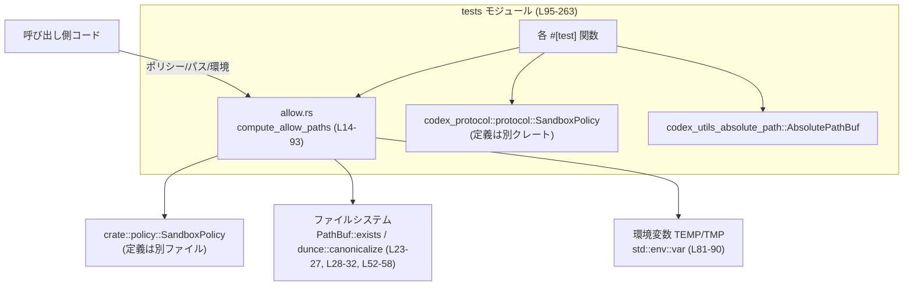
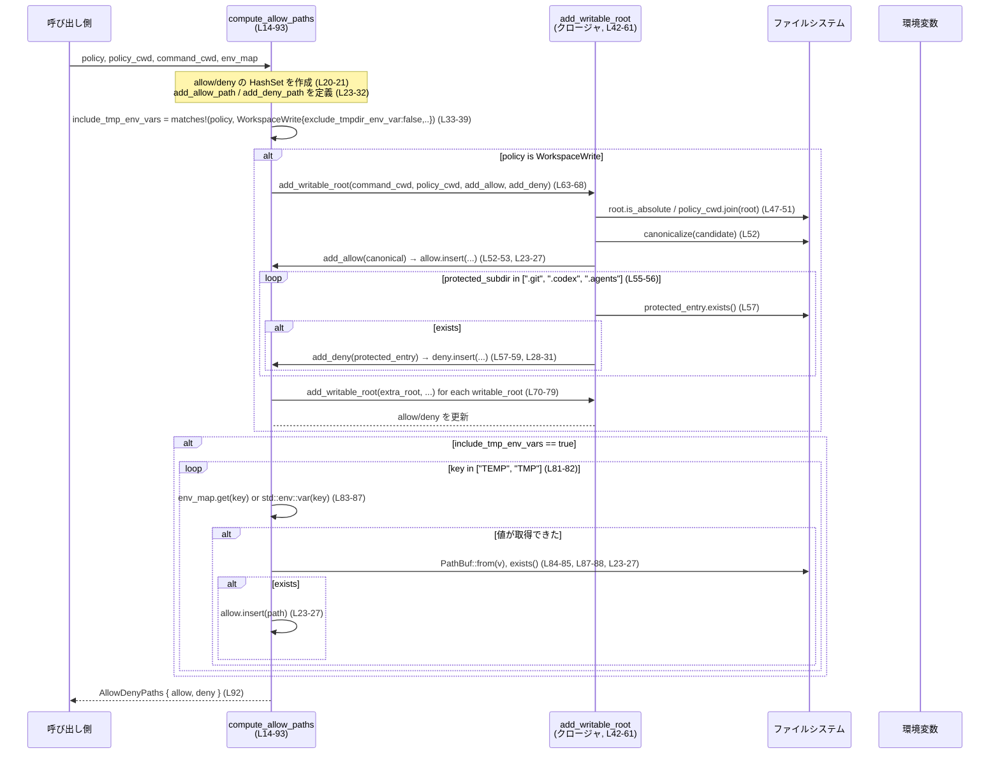

# windows-sandbox-rs/src/allow.rs

## 0. ざっくり一言

`SandboxPolicy` から「書き込みを許可するパス」と「書き込みを禁止するパス」の集合を計算するヘルパーモジュールです（`compute_allow_paths`）。主に `WorkspaceWrite` ポリシー向けに、ワークスペースや追加の書き込みルートを許可しつつ、`.git` / `.codex` / `.agents` などを deny として分離します。  
（windows-sandbox-rs/src/allow.rs:L1-93）

---

## 1. このモジュールの役割

### 1.1 概要

- このモジュールは **SandboxPolicy に基づき、ファイルシステム上のどのパスに書き込みを許可／禁止するか** を決めるために存在し、  
  **許可パス集合 `allow` と禁止パス集合 `deny` を持つ `AllowDenyPaths` を返す関数 `compute_allow_paths`** を提供します（L8-12, L14-93）。
- 特に `SandboxPolicy::WorkspaceWrite` 変種に対して、以下を行います（L33-41, L70-80）。
  - コマンド実行ディレクトリと追加の writable root を allow に入れる。
  - それらの直下にある `.git`, `.codex`, `.agents` を deny に入れる（存在する場合のみ）（L55-60）。
  - 設定に応じて TEMP/TMP ディレクトリも allow に含める（L33-39, L81-90）。

### 1.2 アーキテクチャ内での位置づけ

`compute_allow_paths` がどのコンポーネントに依存しているかを簡略化した図です。



- 実際の `SandboxPolicy` の定義や Sandbox 実行部分はこのチャンクには現れません。
- このモジュール自身は「許可・禁止パス集合を計算するだけ」で、実際にファイルアクセスを制御する処理は別コンポーネントが担当していると考えられます（コードから見える範囲での推測）。

### 1.3 設計上のポイント

コードから読み取れる特徴をまとめると次のとおりです。

- **純粋な計算モジュール（状態なし）**  
  - グローバルな可変状態は持たず、入力（ポリシー・パス・環境変数マップ）から `AllowDenyPaths` を構築して返すだけです（L14-21, L92）。
- **HashSet による集合表現**  
  - `allow` / `deny` ともに `HashSet<PathBuf>` で管理し、重複を自然に排除しています（L8-11, L20-21）。
- **ファイルシステムの実在チェック**  
  - 追加する前に `PathBuf::exists()` を用いて、実際に存在するパスのみを集合に入れます（L23-27, L28-32）。  
    → 不存在パスを許可／禁止しても意味がないための防御的実装と読めます。
- **パスの正規化（canonicalize）**  
  - 書き込みルートは `dunce::canonicalize` で正規化されてから allow に追加されます（L42-53）。  
  - canonicalize に失敗した場合は元のパスをそのまま使うため、ここでパニックは起こりません（`unwrap_or` 使用, L52）。
- **保護サブディレクトリの deny**  
  - `.git`, `.codex`, `.agents` を「ワークスペースの中でも特別に保護すべきパス」として deny 側に分離しています（L55-60）。  
  - 存在するかどうかをチェックし、存在するものだけを deny に入れます（L57-59）。
- **環境変数に基づく一時ディレクトリの管理**  
  - `WorkspaceWrite` かつ `exclude_tmpdir_env_var == false` のときのみ、TEMP/TMP のディレクトリも allow に追加します（L33-39, L81-90）。
- **非同期・並行性**  
  - `async` やスレッドは使っておらず、同期的にローカル変数だけを操作します。  
  - グローバル可変状態に触れていないため、この関数自体は複数スレッドから並列に呼び出してもデータ競合は生じません（標準ライブラリの `std::env::var` は内部で同期処理を行いますが、その詳細はこのチャンクからは分かりません）。

---

## 2. 主要な機能一覧

このモジュールが提供する主要機能は次のとおりです。

- **許可／禁止パス集合の型定義**:  
  - `AllowDenyPaths` 構造体で、`allow` / `deny` の 2 つの `HashSet<PathBuf>` をまとめて扱えるようにします（L8-11）。
- **SandboxPolicy から許可／禁止パスを計算**:  
  - `compute_allow_paths` が、`SandboxPolicy::WorkspaceWrite` の内容・カレントディレクトリ・環境変数を基に `AllowDenyPaths` を構築します（L14-93）。
- **書き込み可能ルートの追加と保護サブディレクトリの除外**:  
  - 内部クロージャ `add_writable_root` により、ワークスペースや追加 writable root を allow に入れつつ、直下の `.git` / `.codex` / `.agents` を deny に入れます（L42-61）。
- **TEMP/TMP 環境変数に応じた一時ディレクトリの許可**:  
  - TEMP/TMP が存在する場合、それらを allow に含めるかをポリシーで切り替えます（L33-39, L81-90）。

---

## 3. 公開 API と詳細解説

### 3.1 型一覧（構造体・列挙体など）

| 名前 | 種別 | 役割 / 用途 | 主なフィールド | 定義位置 |
|------|------|-------------|----------------|----------|
| `AllowDenyPaths` | 構造体 | 許可パス集合 `allow` と禁止パス集合 `deny` をまとめて保持するための型です。Sandbox 構成や実行エンジンに渡す想定と解釈できます。 | `allow: HashSet<PathBuf>` / `deny: HashSet<PathBuf>` | windows-sandbox-rs/src/allow.rs:L8-12 |

補足:

- `#[derive(Debug, Default, PartialEq, Eq)]` が付いているため、デバッグ表示・デフォルト値生成・等価比較が可能です（L8）。
  - `Default` 実装により、`AllowDenyPaths::default()` で空集合の allow/deny を作れます。
  - `PartialEq, Eq` により、テストで期待値との比較が容易です（実際にテストで使用, L175-183 など）。

### 3.2 関数詳細

#### `compute_allow_paths(policy: &SandboxPolicy, policy_cwd: &Path, command_cwd: &Path, env_map: &HashMap<String, String>) -> AllowDenyPaths`

**概要**

- 与えられた `SandboxPolicy` とカレントディレクトリ情報、および環境変数マップから、  
  **書き込み許可パス (`allow`) と書き込み禁止パス (`deny`) の集合を計算して返す関数**です（L14-19, L92）。
- 現状のロジックは `SandboxPolicy::WorkspaceWrite` 変種に対してのみ具体的な処理を行い、それ以外のポリシーでは allow/deny とも空のまま返します（L41-80）。

**引数**

| 引数名 | 型 | 説明 |
|--------|----|------|
| `policy` | `&SandboxPolicy` | サンドボックスのポリシー。ここでは主に `SandboxPolicy::WorkspaceWrite { .. }` で分岐しています（L33-39, L41-42, L70-80）。この型の定義自体は別ファイルにあります。 |
| `policy_cwd` | `&Path` | ポリシーに記述された相対パスを解決する基準となるディレクトリです。`writable_roots` が相対パスの場合、これと結合して絶対パスにします（L42-51, L74）。 |
| `command_cwd` | `&Path` | 実際にコマンドを実行するワークスペースのルートディレクトリです。必ず writable root として allow に追加されます（L63-68）。 |
| `env_map` | `&HashMap<String, String>` | TEMP/TMP など環境変数のオーバーライド用マップです。ここに存在すればそれを優先し、なければ `std::env::var` から取得します（L81-90）。 |

**戻り値**

- `AllowDenyPaths`（L92）
  - `allow: HashSet<PathBuf>`: 書き込みを許可するディレクトリパスの集合。
  - `deny: HashSet<PathBuf>`: 書き込みを禁止するディレクトリ／ファイルの集合。
- 実際に `PathBuf::exists()` が true であるパスのみが各集合に入ります（L23-32, L55-59）。

**内部処理の流れ（アルゴリズム）**

処理は大きく以下のステップに分かれます。

1. **空の集合とヘルパー関数の初期化**（L20-32）  
   - `allow`, `deny` を空の `HashSet<PathBuf>` として作成します（L20-21）。
   - `add_allow_path`, `add_deny_path` という 2 つのクロージャを定義し、  
     与えられた `PathBuf` が存在する場合のみ、各集合に追加するようにしています（L23-32）。

2. **TEMP/TMP を含めるかどうかのフラグ計算**（L33-39）  
   - `matches!` マクロで `policy` が `SandboxPolicy::WorkspaceWrite { exclude_tmpdir_env_var: false, .. }` かを判定し、  
     そうであれば `include_tmp_env_vars` を true にします（L33-39）。
   - それ以外（`WorkspaceWrite` 以外、または `exclude_tmpdir_env_var: true`）では false になります。

3. **WorkspaceWrite ポリシーの場合の処理**（L41-80）

   3-1. **`add_writable_root` ヘルパーの定義**（L42-61）  
   このクロージャは「書き込みルート 1 つ」を allow/deny に反映します。

   - 引数:
     - `root: PathBuf`（書き込みルート候補）
     - `policy_cwd: &Path`
     - `add_allow: &mut dyn FnMut(PathBuf)`
     - `add_deny: &mut dyn FnMut(PathBuf)`
   - 処理:
     1. `root` が絶対パスならそのまま、相対パスなら `policy_cwd.join(root)` により基準ディレクトリからのパスに変換します（L47-51）。
     2. `dunce::canonicalize(&candidate)` で正規化を試み、失敗した場合は `candidate` をそのまま使います（L52）。
     3. 正規化結果 `canonical` を allow 側に追加します（L53）。
     4. `canonical` 直下の `".git"`, `".codex"`, `".agents"` の 3 つを順にチェックし、存在したものを deny に追加します（L55-60）。

   3-2. **コマンド実行ディレクトリを writable root に追加**（L63-68）  
   - `command_cwd.to_path_buf()` を引数として `add_writable_root` を呼び出し、  
     コマンド実行ディレクトリを allow に追加し、必要なら `.git` などを deny に追加します（L63-68）。

   3-3. **追加 writable roots の処理**（L70-79）  
   - `policy` が `SandboxPolicy::WorkspaceWrite { writable_roots, .. }` とマッチした場合、`writable_roots` をループします（L70-72）。
   - 各 `root` に対して `root.clone().into()` で `PathBuf` に変換し、同様に `add_writable_root` を呼び出します（L72-77）。

4. **TEMP/TMP ディレクトリの追加（オプション）**（L81-90）  
   - `include_tmp_env_vars` が true のとき、`["TEMP", "TMP"]` の 2 つのキーをループします（L81-82）。
   - `env_map.get(key)` で値が見つかればそれを優先し、見つからなければ `std::env::var(key)` でプロセス環境変数から取得します（L83-87）。
   - 取得した文字列から `PathBuf::from(v)` を作り、`add_allow_path` を通して allow 集合に追加します（L84-85, L87-88）。
     - `add_allow_path` 内で `exists()` チェックを行うため、存在しない TEMP/TMP パスは無視されます（L23-27）。

5. **`AllowDenyPaths` として返却**（L92）  
   - 構築された `allow` / `deny` を `AllowDenyPaths { allow, deny }` に束ねて返します。

**Examples（使用例）**

1. **基本的な WorkspaceWrite ポリシーでの使用例**

```rust
use std::collections::HashMap;                            // HashMap 型を使う
use std::path::Path;                                      // Path 型を使う

use crate::allow::{compute_allow_paths, AllowDenyPaths};  // 本モジュールの公開 API
use crate::policy::SandboxPolicy;                         // ポリシー型（定義は別モジュール）

fn build_paths_example(policy_cwd: &Path, command_cwd: &Path) -> AllowDenyPaths {
    // WorkspaceWrite ポリシーを仮定した例
    let policy = SandboxPolicy::WorkspaceWrite {
        writable_roots: vec![],                           // 追加の writable root はなし
        read_only_access: Default::default(),             // 他フィールドはテストに倣ってデフォルト
        network_access: false,
        exclude_tmpdir_env_var: false,                    // TEMP/TMP を allow に含める
        exclude_slash_tmp: false,
    };

    // 特に上書きしたい環境変数がなければ空の HashMap を渡せる
    let env_map: HashMap<String, String> = HashMap::new();

    // 許可／禁止パス集合を計算する
    compute_allow_paths(&policy, policy_cwd, command_cwd, &env_map)
}
```

この例では、`command_cwd` をルートとし、その配下の `.git` / `.codex` / `.agents` を deny しつつ、TEMP/TMP のディレクトリも allow に追加されます（TEMP/TMP が存在し、`exclude_tmpdir_env_var` が false の場合）。

1. **テストに近い形で、追加 writable root を含めた例**  
（L103-128 の `includes_additional_writable_roots` を簡略化）

```rust
use std::collections::HashMap;
use std::fs;
use std::path::Path;

use codex_utils_absolute_path::AbsolutePathBuf;
use crate::allow::compute_allow_paths;
use crate::policy::SandboxPolicy;

fn example_with_extra_root(base: &Path) {
    let command_cwd = base.join("workspace");
    let extra_root = base.join("extra");

    fs::create_dir_all(&command_cwd).unwrap();
    fs::create_dir_all(&extra_root).unwrap();

    let policy = SandboxPolicy::WorkspaceWrite {
        writable_roots: vec![AbsolutePathBuf::try_from(extra_root.as_path()).unwrap()],
        read_only_access: Default::default(),
        network_access: false,
        exclude_tmpdir_env_var: false,
        exclude_slash_tmp: false,
    };

    let paths = compute_allow_paths(&policy, &command_cwd, &command_cwd, &HashMap::new());

    // allow に command_cwd と extra_root の両方が含まれていることを想定
    assert!(paths.allow.contains(&dunce::canonicalize(&command_cwd).unwrap()));
    assert!(paths.allow.contains(&dunce::canonicalize(&extra_root).unwrap()));
}
```

**Errors / Panics**

コードから読み取れるエラー／パニックの振る舞いは次のとおりです。

- **パニックの可能性**
  - `compute_allow_paths` 本体では `unwrap` や `expect` を使用しておらず、`canonicalize(&candidate).unwrap_or(candidate)` によりエラーを握りつぶしているため、この関数内から明示的なパニックは発生しません（L52）。
  - ただし、呼び出し側が渡す `policy_cwd` / `command_cwd` の取得時やテストコード内では `expect("tempdir")` などがあり、そちらではパニックしうる点に注意が必要です（L105, L132 など）。これは本関数の外側の責任です。
- **I/O エラーの扱い**
  - `dunce::canonicalize` が `io::Error` を返した場合でも、`unwrap_or(candidate)` により、元の `candidate` パスをそのまま使うため、エラーは呼び出し元に伝播しません（L52）。
  - `std::env::var` で環境変数取得に失敗した場合も、`if let Ok(v) = std::env::var(key)` でエラーを無視し、単に TEMP/TMP を追加しないだけです（L86-87）。
- **Result / Option の戻り値**
  - この関数自体は `Result` や `Option` ではなく、常に `AllowDenyPaths` を返します（L92）。

**Edge cases（エッジケース）**

コードから分かる代表的なエッジケースと挙動です。

- **policy が `WorkspaceWrite` 以外の場合**  
  - `if matches!(policy, SandboxPolicy::WorkspaceWrite { .. })` に入らないため、`add_writable_root` は一度も呼ばれず、TEMP/TMP も追加されません（L41-42, L81-82）。  
  - 結果として、`AllowDenyPaths { allow: {}, deny: {} }` が返されます（L20-21, L92）。  
  - これが仕様なのかどうかは、このチャンクからは判断できません。
- **writable root が存在しない場合**  
  - `add_writable_root` 内では canonicalize 後に `add_allow` に渡します（L52-53）。  
  - 現在の実装では `add_allow` として `add_allow_path` が渡されており、その中で `exists()` チェックが行われています（L23-27, L63-68, L72-77）。  
  - 従って、存在しない writable root は allow に入りません。
- **`.git` / `.codex` / `.agents` が存在しない場合**  
  - `protected_entry.exists()` が false になり、deny に追加されません（L55-59）。  
  - テスト `skips_protected_subdirs_when_missing` でこの挙動が確認されています（L247-263）。
- **TEMP/TMP が存在しない場合**  
  - `env_map` にも `std::env::var` にも値がない場合、そのキーは無視され、対応するパスは allow に含まれません（L81-90）。
- **TEMP/TMP がファイルである場合**  
  - `exists()` は true になりますが、ファイルなのかディレクトリなのかのチェックは行っていません（L23-27, L84-85, L87-88）。  
  - そのため、TEMP/TMP がファイルを指していても allow に追加されます。この挙動が意図されたものかどうかはコードだけでは分かりません。

**使用上の注意点**

- **ポリシー変種による挙動の違い**
  - `WorkspaceWrite` 以外のポリシーでは allow/deny が空になるため、その場合に何を期待するかは上位レイヤーで明確にしておく必要があります（L41-42, L92）。
- **パスの比較は canonicalize されたものと行う**
  - writable root は `dunce::canonicalize` 済みのパスで `allow` に入るため、呼び出し側で比較する場合も同様に canonicalize しておくと安全です（テストでもそうしています, L175-179, L203-207, L231-237）。
- **一時ディレクトリの許可有無はポリシーで制御される**
  - TEMP/TMP を許可したくない場合は `exclude_tmpdir_env_var: true` を指定する必要があります（L33-39, L138-143）。
- **環境変数の優先順位**
  - `env_map` を使うと、プロセス環境変数よりもこちらが優先されます（L83-87）。  
  - テストやツール内で一時的に TEMP/TMP を差し替えたい場合に有効です。
- **スレッド安全性**
  - 関数内部はローカル変数のみで完結し、`unsafe` ブロックもありません。  
  - したがって同じ `policy` を複数スレッドから参照しながら `compute_allow_paths` を呼び出しても、この関数内でのデータ競合は発生しません（ただし、ファイルシステム側の状態変化は別問題です）。

### 3.3 その他の関数（テスト）

テストモジュール内の関数はすべて `#[test]` で、公開 API には含まれませんが、挙動の理解に役立つため一覧化します。

| 関数名 | 役割（1 行） | 定義位置 |
|--------|--------------|----------|
| `includes_additional_writable_roots` | `writable_roots` に指定した追加ルートが `allow` に含まれることを確認します。 | windows-sandbox-rs/src/allow.rs:L103-128 |
| `excludes_tmp_env_vars_when_requested` | `exclude_tmpdir_env_var: true` のとき TEMP/TMP が `allow` に含まれないことを確認します。 | L130-157 |
| `denies_git_dir_inside_writable_root` | ワークスペース直下の `.git` ディレクトリが `deny` に入ることを確認します。 | L159-184 |
| `denies_git_file_inside_writable_root` | `.git` がファイルであっても `deny` に入ることを確認します。 | L186-212 |
| `denies_codex_and_agents_inside_writable_root` | `.codex` と `.agents` ディレクトリが `deny` に入ることを確認します。 | L214-244 |
| `skips_protected_subdirs_when_missing` | 保護サブディレクトリが存在しない場合、deny が空のままであることを確認します。 | L246-263 |

---

## 4. データフロー

### 4.1 代表的な処理シナリオ

シナリオ:  

- ポリシーは `SandboxPolicy::WorkspaceWrite` で、追加 writable root と TEMP/TMP を許可する設定。
- `command_cwd` 内には `.git` と `.codex` が存在する。
- `env_map` には `TEMP` が設定されている。

このときのデータフローは以下のようになります。



要点:

- **allow 集合** には、canonicalize 済みの `command_cwd` と各 `writable_root`、および存在する TEMP/TMP ディレクトリが追加されます（L52-53, L63-68, L72-77, L81-90）。
- **deny 集合** には、各 writable root 直下に実在する `.git`, `.codex`, `.agents` が追加されます（L55-60）。
- `env_map` に値があればそれを優先し、なければプロセス環境変数を参照します（L83-87）。

---

## 5. 使い方（How to Use）

### 5.1 基本的な使用方法

同一クレート内で `compute_allow_paths` を利用する最小構成の例です。

```rust
use std::collections::HashMap;                           // 環境変数マップ用
use std::path::Path;                                     // パス型

use crate::allow::{compute_allow_paths, AllowDenyPaths}; // 本モジュールの API
use crate::policy::SandboxPolicy;                        // ポリシー型（別モジュール定義）

fn build_allow_deny(policy_cwd: &Path, command_cwd: &Path) -> AllowDenyPaths {
    // WorkspaceWrite ポリシーを仮定した例                // 他のフィールド値はテストの例を踏襲
    let policy = SandboxPolicy::WorkspaceWrite {
        writable_roots: vec![],
        read_only_access: Default::default(),
        network_access: false,
        exclude_tmpdir_env_var: false,                   // TEMP/TMP を許可
        exclude_slash_tmp: false,
    };

    // 特に上書きしない場合は空のマップを渡す           // env_map にキーが無い場合は std::env::var が使われる
    let env_map: HashMap<String, String> = HashMap::new();

    // 許可/禁止パス集合を計算する
    compute_allow_paths(&policy, policy_cwd, command_cwd, &env_map)
}
```

呼び出し側は返ってきた `AllowDenyPaths` を使って、サンドボックス実行エンジンに「どのパスへの書き込みを許可／禁止するか」を設定することになります（実際の適用処理はこのチャンクには現れません）。

### 5.2 よくある使用パターン

1. **テストやツールで TEMP/TMP を強制的に差し替える**

```rust
use std::collections::HashMap;
use std::path::Path;

use crate::allow::compute_allow_paths;
use crate::policy::SandboxPolicy;

fn use_custom_temp(policy_cwd: &Path, command_cwd: &Path, custom_temp: &Path) {
    let policy = SandboxPolicy::WorkspaceWrite {
        writable_roots: vec![],
        read_only_access: Default::default(),
        network_access: false,
        exclude_tmpdir_env_var: false,          // TEMP/TMP を許可
        exclude_slash_tmp: false,
    };

    let mut env_map = HashMap::new();
    env_map.insert("TEMP".into(), custom_temp.to_string_lossy().to_string());

    let paths = compute_allow_paths(&policy, policy_cwd, command_cwd, &env_map);

    // paths.allow に custom_temp が含まれていることを期待
    assert!(paths.allow.contains(&dunce::canonicalize(custom_temp).unwrap()));
}
```

これは `excludes_tmp_env_vars_when_requested` の逆ケースで、`env_map` を使って TEMP を指定し、`exclude_tmpdir_env_var: false` にすることで TEMP を allow に含めるパターンです（L81-90, L138-147）。

1. **追加 writable root を指定する**

テスト `includes_additional_writable_roots` と同様に、`writable_roots` に複数のディレクトリを追加することで、ワークスペース外にも書き込み可能な領域を増やせます（L103-128）。

### 5.3 よくある間違い

コードから推測できる誤用パターンと、その修正例です。

```rust
use std::collections::HashMap;
use std::path::Path;
use crate::allow::compute_allow_paths;
use crate::policy::SandboxPolicy;

// 誤り例: WorkspaceWrite 以外のポリシーで allow/deny が空のままになることに気づかない
fn wrong_usage(policy_cwd: &Path, command_cwd: &Path) {
    let policy = SandboxPolicy::/* 他の変種 */;

    // ここで paths.allow / paths.deny が空でも "正しく設定された" と誤解する可能性がある
    let paths = compute_allow_paths(&policy, policy_cwd, command_cwd, &HashMap::new());

    // ... 空集合をそのまま適用してしまう ...
}

// 正しい例: WorkspaceWrite のときだけこの関数を使う、あるいは空の場合の扱いを決めておく
fn correct_usage(policy_cwd: &Path, command_cwd: &Path, policy: &SandboxPolicy) {
    let paths = compute_allow_paths(policy, policy_cwd, command_cwd, &HashMap::new());

    if paths.allow.is_empty() && paths.deny.is_empty() {
        // WorkspaceWrite 以外 or 特殊な条件の可能性                   // 上位で別の処理を行うなど契約を明示
        // ここでログを出したり、別のパス計算ロジックを呼び出すなどを検討
    }

    // paths をサンドボックス設定に反映
}
```

### 5.4 使用上の注意点（まとめ）

- **仕様上の前提・契約**
  - この関数は `WorkspaceWrite` ポリシーに特化した実装になっており、その他の変種では allow/deny が空になり得ることを前提とした設計です（L41-42, L70-80）。
  - 書き込みルート直下の `.git`, `.codex`, `.agents` は常に deny 側に回されるため、これらのディレクトリ内での書き込みが必要なケースでは、別途設計を考える必要があります（L55-60）。
- **セキュリティ・安全性の観点**
  - `.git` を deny にしていることで、Git 管理情報への誤書き込みや破壊を防ぐ意図が読み取れます（L55-60, L159-184, L186-212）。  
  - `.codex` / `.agents` も同様に保護対象として扱われ、Sandbox 下のツール自身のメタデータやエージェント設定が変更されることを防いでいます（L55-60, L214-244）。
- **パフォーマンス上の注意**
  - 各 writable root ごとに `.git` / `.codex` / `.agents` の存在チェックを行う程度で、ファイル走査は行っていません（L55-59）。  
    一般的な用途では性能問題になりにくい設計です。
- **テストとの整合性**
  - 期待される挙動（追加 writable root の allow 追加、TEMP/TMP の扱い、保護ディレクトリ deny、存在しない場合のスキップ）はすべてテストでカバーされています（L103-263）。  
  - 挙動を変更する場合は、これらのテストの意図を確認した上で更新する必要があります。

---

## 6. 変更の仕方（How to Modify）

### 6.1 新しい機能を追加する場合

例として「新しい保護サブディレクトリ `.secrets` を追加する」ケースを考えます。

1. **`add_writable_root` の保護リストに追加**  
   - `for protected_subdir in [".git", ".codex", ".agents"]` に `".secrets"` を加える変更になります（L55-56）。
2. **対応するテストの追加**  
   - `denies_codex_and_agents_inside_writable_root` と同様に、`.secrets` ディレクトリを作成して `deny` に入ることを確認するテストを新規追加するのが自然です（L214-244）。
3. **契約の見直し**
   - `.secrets` 内の書き込みを禁止することが他のコンポーネントの期待と矛盾しないかを確認する必要があります。

その他の拡張例:

- TEMP/TMP 以外の環境変数（例: `USERPROFILE` など）からの allow パス追加ロジックを入れる場合は、L81-90 のループにキーを追加し、テストを整備します。

### 6.2 既存の機能を変更する場合

既存ロジックを修正する際に注意すべきポイントです。

- **影響範囲の確認**
  - この関数の直接的な呼び出し箇所はこのチャンクには現れませんが、テストでは `compute_allow_paths` を通じて挙動を検証しています（L119, L148, L174, L202, L231, L260）。  
  - 改修時には、上位モジュール（`crate::policy` を利用する部分）との契約も確認する必要があります。
- **契約の維持**
  - 「writable root は allow だが、その直下の `.git` / `.codex` / `.agents` は deny」という契約を変える場合、テストの期待値（L175-183, L203-211, L231-243）を変更することになります。
  - TEMP/TMP の扱い（`exclude_tmpdir_env_var` フラグ）を変えると、`excludes_tmp_env_vars_when_requested` テストの意味も変わるため、テスト名・内容の見直しも必要です（L130-157）。
- **エッジケースの再確認**
  - 存在しないパスを allow/deny に追加しない、という現状の挙動（L23-32, L55-59）は安全側の仕様です。  
    これを変えると、`AllowDenyPaths` に「存在しないが論理的に禁止されているパス」を含める設計に変わるため、利用側での扱いも再設計する必要があります。

---

## 7. 関連ファイル

このモジュールと密接に関係する型・外部モジュールです（このチャンクには定義がありません）。

| パス / モジュール | 役割 / 関係 |
|-------------------|------------|
| `crate::policy::SandboxPolicy` | 本モジュールの公開関数 `compute_allow_paths` の引数として使用されるポリシー型です（L1, L14-19）。`WorkspaceWrite` 変種を持つ enum であることがコードから分かりますが、定義は別ファイルにあります。 |
| `codex_protocol::protocol::SandboxPolicy` | テストコードで使われている `SandboxPolicy` 型です（L98）。`crate::policy` の別名、または関連する型と推測されますが、このチャンクからは断定できません。 |
| `codex_utils_absolute_path::AbsolutePathBuf` | テストで追加 writable root の指定に使用される絶対パス表現です（L99, L111-117）。本モジュールでは `PathBuf` への変換結果だけを利用します（L72-73）。 |
| `dunce::canonicalize` | パスを OS 依存の正規化ルールで canonicalize する関数です（L2, L52, テストでも比較用に使用 L123-126, L175-179 等）。 |
| `tempfile::TempDir` | テストで一時ディレクトリを作成するために使用されます（L101, L105, L132, L161, L188, L216, L248）。 |
| `std::path::Path` / `PathBuf` | パス操作の基本型として、ポリシー引数・コマンド実行ディレクトリ・環境変数からのパスなどに利用されています（L5-6, L14-19, L42-51 ほか）。 |

---

このチャンクに現れる情報からは、`compute_allow_paths` は **Windows サンドボックスの書き込み制御のためのパス集合を計算する中核ユーティリティ**として設計されており、  
特に `.git` / `.codex` / `.agents` の保護と TEMP/TMP ディレクトリの扱いが重要な契約になっていると整理できます。
