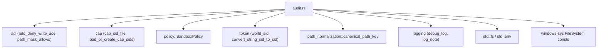
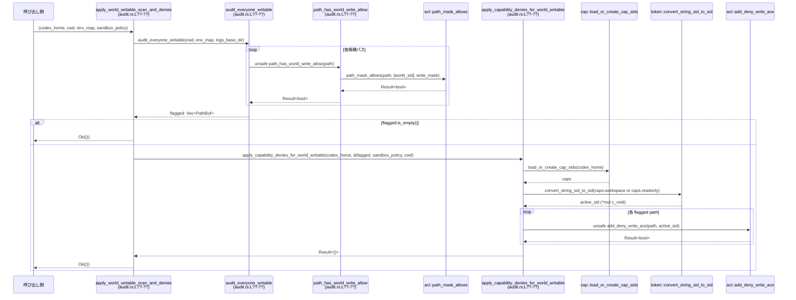

# windows-sandbox-rs/src/audit.rs

## 0. ざっくり一言

Windows 環境で「Everyone（world）」が書き込み可能なディレクトリをスキャンし、必要に応じて Capability SID 用の「書き込み拒否 ACE（deny ACE）」を付与するための監査・適用ロジックをまとめたモジュールです。

> 注: この回答に含まれるコードには行番号情報が含まれていないため、`audit.rs:L??-??` のように「行番号不明」を表記しています。

---

## 1. このモジュールの役割

### 1.1 概要

- このモジュールは、サンドボックス実行時に **世界書き込み（Everyone が書き込み許可を持つ）ディレクトリ** を検出し、サンドボックスの Capability SID に対して書き込み拒否 ACE を付けることで、安全性を高める役割を持ちます。
- 具体的には:
  - `audit_everyone_writable` で CWD や PATH/TEMP 等を起点にディレクトリをスキャンし、world-writable なパス一覧を返します。
  - `apply_world_writable_scan_and_denies` / `apply_capability_denies_for_world_writable` で SandboxPolicy に応じて Capability SID を決定し、検出ディレクトリに deny ACE を付与します。

### 1.2 アーキテクチャ内での位置づけ

このモジュールは、ACL 操作・Capability SID 管理・パス正規化・ポリシー判定・ログ出力と連携します。



### 1.3 設計上のポイント

- **責務分割**
  - スキャン専用関数 (`audit_everyone_writable`) と、検出結果をポリシーに基づき適用する関数 (`apply_world_writable_scan_and_denies`, `apply_capability_denies_for_world_writable`) が分離されています。
  - 環境変数からの候補パス収集は `gather_candidates` に切り出されています。
- **状態管理**
  - グローバルな可変状態は持たず、関数内のローカル変数と引数のみで完結しています。
- **エラーハンドリング**
  - 外部とのインターフェースは `anyhow::Result` を用いてエラーを伝播します。
  - ACL 読み取りエラーなど「監査としては致命的でないエラー」はログに記録しつつ「world-writable ではない」と扱うことで、スキャン全体を中断しない方針です（`audit_everyone_writable` 内クロージャ）。
- **安全性と `unsafe`**
  - Windows の SID ポインタや ACL 操作のための `unsafe` ブロックがあり、FFI 呼び出し部分のみを最小限に閉じ込めています。
- **パフォーマンス制御**
  - スキャン時間 (`AUDIT_TIME_LIMIT_SECS`) とチェック数 (`MAX_CHECKED_LIMIT`) に上限を設け、起動時間延長を防ぐ設計です。
  - 各ディレクトリの読み取り件数も `MAX_ITEMS_PER_DIR` で制限しています。

---

## 2. 主要な機能一覧

- world-writable 監査: `audit_everyone_writable`  
  指定 CWD と環境変数を起点に、Everyone が書き込み可能なディレクトリを検出します。
- Capability deny ACE 適用（高レベル）: `apply_world_writable_scan_and_denies`  
  監査 → SandboxPolicy に応じた deny ACE 付与を一括で行います。
- Capability deny ACE 適用（詳細）: `apply_capability_denies_for_world_writable`  
  SandboxPolicy から有効 SID とワークスペース root を決定し、検出ディレクトリに deny ACE を付けます。
- スキャン候補パスの収集: `gather_candidates`  
  CWD, TEMP/TMP, USERPROFILE/PUBLIC, PATH, C: ドライブ等からスキャン開始パス集合を構築します。
- ACL チェックヘルパ: `path_has_world_write_allow`  
  指定パスが world SID に対し書き込み許可を持つかどうかを判定します（unsafe）。
- 重複排除付き push: `unique_push`  
  canonicalize したパスを Set と Vec に追加するユーティリティです。

---

## 3. 公開 API と詳細解説

### 3.1 型一覧（構造体・列挙体など）

このファイル自身では、新しい構造体や列挙体の公開定義はありません。  
外部の `SandboxPolicy` 列挙体を利用しています。

| 名前 | 種別 | 役割 / 用途 | 定義位置 |
|------|------|-------------|----------|
| `SandboxPolicy` | 列挙体（他モジュール） | サンドボックスのモードや書き込み可能 root を表現し、どの Capability SID を使うかを決めるために利用されます。 | policy モジュール（このチャンクには定義が現れません） |

---

### 3.1.5 コンポーネントインベントリー（関数・定数）

行番号情報が無いため、`L??-??` と表記しています。

| 名前 | 種別 | 公開 | 役割 / 用途 | 定義位置（推定） |
|------|------|------|-------------|------------------|
| `MAX_ITEMS_PER_DIR` | 定数 | 非公開 | ディレクトリ内で `read_dir` により処理する最大エントリ数 | audit.rs:L??-?? |
| `AUDIT_TIME_LIMIT_SECS` | 定数 | 非公開 | 監査全体の時間上限（秒） | audit.rs:L??-?? |
| `MAX_CHECKED_LIMIT` | 定数 | 非公開 | チェック対象パス数の上限 | audit.rs:L??-?? |
| `SKIP_DIR_SUFFIXES` | 定数 | 非公開 | 一段下スキャン時にスキップするディレクトリ suffix（Windows システム系等） | audit.rs:L??-?? |
| `unique_push` | 関数 | 非公開 | canonicalize したパスを Set で重複排除しつつ Vec に追加 | audit.rs:L??-?? |
| `gather_candidates` | 関数 | 非公開 | CWD, TEMP/TMP, USERPROFILE, PUBLIC, PATH, C:\, C:\Windows からスキャン候補パスを収集 | audit.rs:L??-?? |
| `path_has_world_write_allow` | 関数（unsafe） | 非公開 | 指定パスが world SID に対して書き込み許可を持つかを判定 | audit.rs:L??-?? |
| `audit_everyone_writable` | 関数 | 公開 | world-writable なディレクトリ一覧を検出して返すコア監査関数 | audit.rs:L??-?? |
| `apply_world_writable_scan_and_denies` | 関数 | 公開 | 監査を実行し、必要なら Capability deny ACE を適用する高レベル API | audit.rs:L??-?? |
| `apply_capability_denies_for_world_writable` | 関数 | 公開 | SandboxPolicy に応じて Capability SID を決定し、検出ディレクトリに deny ACE を付与 | audit.rs:L??-?? |
| `tests::gathers_path_entries_by_list_separator` | テスト関数 | 非公開 | PATH 文字列を `;` 区切りで正しく候補に追加できるか検証 | audit.rs:L??-?? |

---

### 3.2 関数詳細（主要 5 件）

#### `gather_candidates(cwd: &Path, env: &HashMap<String, String>) -> Vec<PathBuf>`

**概要**

- world-writable 監査の開始地点となるディレクトリ候補一覧を構築する関数です。
- CWD（カレントディレクトリ）、TEMP/TMP、ユーザー関連ディレクトリ、PATH の各エントリ、および `C:\`, `C:\Windows` を対象にします。

**引数**

| 引数名 | 型 | 説明 |
|--------|----|------|
| `cwd` | `&Path` | 監査の基準となるカレントディレクトリ |
| `env` | `&HashMap<String, String>` | 環境変数のスナップショット（少なくとも `PATH`, `TEMP`, `TMP` が関連） |

**戻り値**

- `Vec<PathBuf>`: canonicalize に成功した一意なディレクトリパスのリストです。
  - 重複は `unique_push` によって排除されます。
  - canonicalize に失敗したパスは候補から外れます。

**内部処理の流れ**

1. `set: HashSet<PathBuf>` と `out: Vec<PathBuf>` を初期化します。
2. CWD を `unique_push` で追加します。
3. `"TEMP"`, `"TMP"` 環境変数を `env` または `std::env::var` から取得して、各値を `unique_push` で追加します。
4. `"USERPROFILE"`, `"PUBLIC"` を `std::env::var_os` から取得し、`unique_push` で追加します。
5. `"PATH"` を `env` または `std::env::var` から取得し、`std::env::split_paths` で区切って各エントリを `unique_push` で追加します。
6. 最後に `C:/` と `C:/Windows` を `unique_push` で追加し、`out` を返します。

**Examples（使用例）**

```rust
use std::{collections::HashMap, path::Path};
use windows_sandbox_rs::audit::audit_everyone_writable;

// env_map は事前に std::env::vars などで構築しておく
let cwd = std::env::current_dir().expect("cwd");
let env_map: HashMap<String, String> = std::env::vars().collect();

// gather_candidates は公開されていないため、通常は audit_everyone_writable を通じて利用されます。
// ここではテストコードと同様に、直接候補だけを見たいケースを示します。
let candidates = windows_sandbox_rs::audit::tests::gather_candidates_for_test(&cwd, &env_map);
// ※ 実際には tests モジュールは cfg(test) 付きなので、ライブラリ利用側からは参照できません。
```

> 注: `gather_candidates` は `pub` ではないため、通常は `audit_everyone_writable` 経由でのみ利用されます。

**Errors / Panics**

- この関数自体は `Result` を返さず、エラーは内部で握りつぶされる形です。
  - `canonicalize` 失敗時は、そのパスが候補に追加されないだけです。
- パニックを起こしうる箇所はありません（`unwrap` / `expect` は使用していません）。

**Edge cases（エッジケース）**

- 環境変数が存在しない場合:
  - 該当する候補が単に追加されないだけです（例: `TEMP` 未設定）。
- PATH に空要素が含まれる場合:
  - `split_paths` の結果が空文字列であれば `if !part.as_os_str().is_empty()` 判定でスキップされます。
- 存在しないパスが環境変数に設定されている場合:
  - `canonicalize` が失敗し、そのパスは候補に含まれません。

**使用上の注意点**

- 大量の PATH エントリがある場合も、一度 `unique_push` で重複排除されるため、同じディレクトリを何度もスキャンすることはありません。
- Windows 固有のパス（`C:/`, `C:/Windows`）がハードコードされているため、別ドライブ環境などではカバー範囲が限定されます。

---

#### `unsafe fn path_has_world_write_allow(path: &Path) -> Result<bool>`

**概要**

- 指定されたパスに対して、Windows の「world（Everyone）」SID に書き込み権限が許可されているかどうかを確認する関数です。
- ACL チェックのために `unsafe` FFI を用いています。

**引数**

| 引数名 | 型 | 説明 |
|--------|----|------|
| `path` | `&Path` | チェック対象のファイルまたはディレクトリのパス |

**戻り値**

- `Result<bool>`:
  - `Ok(true)`  : world SID に対して「何らかの書き込み権限」が許可されていると判定された場合。
  - `Ok(false)` : 許可されていない場合。
  - `Err(e)`    : SID の取得や ACL の解析に失敗した場合。

**内部処理の流れ**

1. `world_sid()` を呼び出して world 用 SID バッファを取得します。  
   - 関数名と使われ方から、「Everyone」グループの SID を取得すると想定されますが、このファイルだけでは断定できません。
2. `as_mut_ptr() as *mut c_void` で、SID バッファ先頭への `*mut c_void` ポインタを得ます。
3. `FILE_WRITE_DATA | FILE_APPEND_DATA | FILE_WRITE_EA | FILE_WRITE_ATTRIBUTES` を OR した書き込みマスクを構築します。
4. `path_mask_allows(path, &[psid_world], write_mask, false)` を呼び出し、指定パスの ACL が world SID に対し上記マスクを許可しているか確認します。

**安全性 (`unsafe`) に関する注意**

- `world` バッファのライフタイム中にのみ `psid_world` ポインタを有効とみなせます。この関数は `world` がスコープ内にある間に `path_mask_allows` を同期的に呼ぶだけなので、ポインタの寿命は保たれています。
- 呼び出し側は `unsafe` で包む必要がありますが、主な危険性は FFI 側（`path_mask_allows` 実装）に依存します。

**Errors / Panics**

- `world_sid()` または `path_mask_allows()` 内部でエラーが起きた場合、`Err(e)` を返します。
- パニックは発生しません（内部で `unwrap` 等は使用していません）。

**Edge cases**

- `path` が存在しない、または ACL が取得できない場合:
  - `Err(e)` になります。実際の利用箇所では、このエラーはキャッチされ「world-writable ではない」とみなされます（`audit_everyone_writable` 内クロージャ参照）。

**使用上の注意点**

- 直接呼び出す場合は `unsafe` ブロックが必要です。
- 監査用途では `audit_everyone_writable` がエラー処理とログ出力をカプセル化しているため、通常はこちらを利用する方が安全です。

---

#### `pub fn audit_everyone_writable(cwd: &Path, env: &HashMap<String, String>, logs_base_dir: Option<&Path>) -> Result<Vec<PathBuf>>`

**概要**

- CWD と環境変数を起点に、一定の制限付きでディレクトリツリーを走査し、world-writable なディレクトリの一覧を返す関数です。
- 監査の結果はログにも記録されます（成功／失敗のいずれも）。

**引数**

| 引数名 | 型 | 説明 |
|--------|----|------|
| `cwd` | `&Path` | スキャンの中心となるカレントディレクトリ |
| `env` | `&HashMap<String, String>` | 環境変数のスナップショット |
| `logs_base_dir` | `Option<&Path>` | ログ出力のベースディレクトリ（ログモジュールにそのまま渡されます） |

**戻り値**

- `Result<Vec<PathBuf>>`:
  - `Ok(flagged_paths)` : world-writable と判定されたディレクトリの一覧（空の場合もあります）。
  - `Err(e)`           : ファイルシステムアクセス等で致命的なエラーが発生した場合。

**内部処理の流れ**

1. 開始時間 `start = Instant::now()` と、`flagged: Vec<PathBuf>`, `seen: HashSet<String>`, `checked: usize` を初期化します。
2. `check_world_writable` というクロージャを定義します。
   - `unsafe { path_has_world_write_allow(path) }` を呼び、  
     - `Ok(has)` → そのまま bool を返す  
     - `Err(err)` → `debug_log` でログ出力し、`false`（world-writable ではない）として扱う
3. **CWD 直下のディレクトリを高速チェック**:
   - `std::fs::read_dir(cwd)` に成功した場合のみ処理。
   - 最初の `MAX_ITEMS_PER_DIR` 件までで、ディレクトリかつ非シンボリックリンクのものだけを対象とします。
   - 時間制限 (`AUDIT_TIME_LIMIT_SECS`) とチェック数制限 (`MAX_CHECKED_LIMIT`) を随時確認し、超過したらループを中断します。
   - world-writable なら `canonical_path_key(&p)` をキーに `seen` で重複チェックしつつ `flagged` に追加します。
4. `gather_candidates(cwd, env)` で広範な候補 root リストを取得します。
5. 各 `root` について:
   - 時間とチェック数の制限を確認。
   - `check_world_writable(root)` → world-writable なら `flagged` に追加。
   - `std::fs::read_dir(root)` に成功した場合:
     - 一段下のエントリを `MAX_ITEMS_PER_DIR` 件まで読みます。
     - シンボリックリンクはスキップします。
     - パス文字列を小文字化し `\` を `/` に変換したものに対し、`SKIP_DIR_SUFFIXES` のいずれかで `ends_with` する場合はスキップします（ノイジーな Windows システムディレクトリを除外）。
     - ディレクトリであれば `check_world_writable` でチェックし、world-writable なら `flagged` に追加します。
6. スキャン完了後:
   - `elapsed_ms = start.elapsed().as_millis()` を計算します。
   - `flagged` が非空なら:
     - `flagged` の一覧を整形し、`log_note` で `"FAILED"` メッセージをログ出力し、`Ok(flagged)` を返します。
   - 空なら:
     - `"OK"` メッセージを `log_note` に出力し、`Ok(Vec::new())` を返します。

**Examples（使用例）**

```rust
use std::{collections::HashMap, path::Path};
use windows_sandbox_rs::audit::audit_everyone_writable;

fn main() -> anyhow::Result<()> {
    let cwd = std::env::current_dir()?;                  // 現在の作業ディレクトリ
    let env_map: HashMap<String, String> = std::env::vars().collect(); // 環境変数のスナップショット

    let flagged = audit_everyone_writable(&cwd, &env_map, None)?;     // 監査を実行
    if flagged.is_empty() {
        println!("World-writable ディレクトリは検出されませんでした");
    } else {
        println!("検出された world-writable ディレクトリ:");
        for p in flagged {
            println!(" - {}", p.display());
        }
    }
    Ok(())
}
```

**Errors / Panics**

- `std::fs::read_dir`, `ent.file_type()` などのエラーは基本的にスキップとして扱っており、この関数としてはエラーを返しません。
- `path_has_world_write_allow` のエラーはログ出力後、`false` として扱われます（監査上は「未検出」の方向に倒れる＝ false negative の可能性があります）。
- `canonical_path_key(&p)` でパニックが起きる可能性は、コードからは読み取れませんが、通常はパニックしないユーティリティ想定です。
- この関数内には `unwrap` / `expect` は存在しないため、直接的なパニック要因はありません。

**Edge cases（エッジケース）**

- 非常に大きなディレクトリや PATH が長い環境:
  - 時間制限（2 秒）またはチェック数制限（50,000）のどちらかで早期停止し、一部ディレクトリが監査対象外になる可能性があります。
- ACL の読み取り権限がないディレクトリ:
  - エラーとしてログに残るものの、そのディレクトリは world-writable ではないと推定されます（false negative になり得ます）。
- シンボリックリンク:
  - スキャンの際にスキップされます。リンク先の ACL は監査されません。

**使用上の注意点**

- 監査結果はあくまで「検出できた範囲」の情報であり、時間・件数制限や ACL 読み取りエラーにより漏れがあり得ることを前提とする必要があります。
- ログ出力には `logs_base_dir` が渡されますが、その実際の意味や出力先は `logging` モジュールに依存します。
- ファイルではなくディレクトリを前提とした使用ですが、コード上は `Path` 一般に対して動作します（ファイルパスを渡した場合の扱いは ACL 依存で、このファイルからは詳細不明です）。

---

#### `pub fn apply_world_writable_scan_and_denies(...) -> Result<()>`

```rust
pub fn apply_world_writable_scan_and_denies(
    codex_home: &Path,
    cwd: &Path,
    env_map: &HashMap<String, String>,
    sandbox_policy: &SandboxPolicy,
    logs_base_dir: Option<&Path>,
) -> Result<()>
```

**概要**

- `audit_everyone_writable` を実行し、その結果に応じて `apply_capability_denies_for_world_writable` を呼び出す高レベルなラッパーです。
- サンドボックス起動時に「監査 → 必要なら deny ACE 適用」を一括実行するためのエントリポイントと解釈できます。

**引数**

| 引数名 | 型 | 説明 |
|--------|----|------|
| `codex_home` | `&Path` | Capability 情報ファイル等を格納する基準ディレクトリ |
| `cwd` | `&Path` | 監査対象のカレントディレクトリ |
| `env_map` | `&HashMap<String, String>` | 環境変数スナップショット（監査で利用） |
| `sandbox_policy` | `&SandboxPolicy` | 現在のサンドボックスポリシー |
| `logs_base_dir` | `Option<&Path>` | ログベースディレクトリ |

**戻り値**

- `Result<()>`:
  - 監査が成功し、その後の deny ACE 適用で致命的エラーがなければ `Ok(())`。
  - 監査時（`audit_everyone_writable`）に致命的なエラーがあれば `Err(e)`。

**内部処理の流れ**

1. `audit_everyone_writable(cwd, env_map, logs_base_dir)?` を呼び出し、`flagged` を取得します。
2. `flagged.is_empty()` なら何もせず `Ok(())` を返します（deny ACE 適用不要）。
3. 空でなければ `apply_capability_denies_for_world_writable` を呼び出します。
   - ここでエラーが発生した場合は `log_note` に `"failed to apply capability deny ACEs"` をログ出力しますが、**戻り値としては `Ok(())` を返します**（エラーを握りつぶす挙動）。
4. 最終的に常に `Ok(())` を返します（監査エラーは既に `?` で伝播済み）。

**Examples（使用例）**

```rust
use std::{collections::HashMap, path::PathBuf};
use windows_sandbox_rs::policy::SandboxPolicy;
use windows_sandbox_rs::audit::apply_world_writable_scan_and_denies;

fn setup_sandbox() -> anyhow::Result<()> {
    let codex_home = PathBuf::from("C:\\codex_home");
    let cwd = std::env::current_dir()?;
    let env_map: HashMap<String, String> = std::env::vars().collect();

    let sandbox_policy: SandboxPolicy = /* ここで適切に構築する（このファイルには定義がありません） */;

    apply_world_writable_scan_and_denies(
        &codex_home,
        &cwd,
        &env_map,
        &sandbox_policy,
        None,
    )?;
    Ok(())
}
```

**Errors / Panics**

- 監査中の致命的エラー（例: `Instant` 等には特段のエラー要因は見えませんが、`audit_everyone_writable` が `Err` を返した場合）は `?` により呼び出し元に伝播します。
- deny ACE 適用中のエラーはログに記録されますが、この関数の戻り値としては `Ok(())` が返されます。
- パニックを引き起こすコードは含まれていません。

**Edge cases**

- world-writable ディレクトリが見つからない場合:
  - 監査ログは `"OK"` と記録され、deny ACE 適用処理は呼ばれません。
- deny ACE 適用が一部失敗した場合:
  - ログにはエラーが残りますが、呼び出し側には成功として扱われます。  
    → 「監査は通すが、保護が完全には効いていない」状態になり得ます。

**使用上の注意点**

- 「deny ACE 適用の失敗をエラーとして扱いたい」場合、この関数ではなく `apply_capability_denies_for_world_writable` を直接呼び、戻り値をチェックする必要があります。
- ログ監査が重要なシステムでは、`logs_base_dir` を設定し、ログを定期的に確認することが前提になります。

---

#### `pub fn apply_capability_denies_for_world_writable(...) -> Result<()>`

```rust
pub fn apply_capability_denies_for_world_writable(
    codex_home: &Path,
    flagged: &[PathBuf],
    sandbox_policy: &SandboxPolicy,
    cwd: &Path,
    logs_base_dir: Option<&Path>,
) -> Result<()>
```

**概要**

- 既に検出された world-writable ディレクトリ群 (`flagged`) に対して、SandboxPolicy に応じた Capability SID の書き込み拒否 ACE を追加します。
- ワークスペース（書き込み許可したい root）配下は除外し、それ以外のみ保護対象とします。

**引数**

| 引数名 | 型 | 説明 |
|--------|----|------|
| `codex_home` | `&Path` | Capability SID 情報ファイルの保存先ディレクトリ |
| `flagged` | `&[PathBuf]` | world-writable と検出されたパス群 |
| `sandbox_policy` | `&SandboxPolicy` | サンドボックスポリシー（WorkspaceWrite / ReadOnly / DangerFullAccess / ExternalSandbox） |
| `cwd` | `&Path` | 現在のワークスペース root の一つとして扱われる CWD |
| `logs_base_dir` | `Option<&Path>` | ログベースディレクトリ |

**戻り値**

- `Result<()>`:
  - Capability SID 読み込み・ファイル書き込み・ACE 追加処理がすべて成功した場合に `Ok(())`。
  - 各種 IO や SID 変換の失敗時には `Err(e)`。

**内部処理の流れ**

1. `flagged.is_empty()` なら何もせず `Ok(())` を返します。
2. `std::fs::create_dir_all(codex_home)?` で `codex_home` を作成します。
3. `cap_path = cap_sid_file(codex_home)` を取得し、`load_or_create_cap_sids(codex_home)?` で Capability 設定を読み込みます。
4. `serde_json::to_string(&caps)?` の結果を `std::fs::write(&cap_path, ...)` で書き出します。
5. `sandbox_policy` に応じて `(active_sid, workspace_roots)` を決定します。
   - `SandboxPolicy::WorkspaceWrite { writable_roots, .. }` の場合:
     - `caps.workspace` を `convert_string_sid_to_sid` で SID ポインタに変換し、`active_sid` とします。
     - `workspace_roots` には:
       - `cwd` を `dunce::canonicalize(cwd).unwrap_or_else(|_| cwd.to_path_buf())` で正規化したもの
       - `writable_roots` 各要素を同様に canonicalize したもの
   - `SandboxPolicy::ReadOnly { .. }` の場合:
     - `caps.readonly` を `convert_string_sid_to_sid` で SID に変換し、`active_sid` とします。
     - `workspace_roots` は空ベクタ。
   - `SandboxPolicy::DangerFullAccess` および `SandboxPolicy::ExternalSandbox { .. }` の場合:
     - 何もせず `Ok(())` を返します（deny ACE は付与しません）。
6. 各 `path` in `flagged` について:
   - `workspace_roots.iter().any(|root| path.starts_with(root))` の場合はスキップします（ワークスペース内は保護対象外）。
   - それ以外は `unsafe { add_deny_write_ace(path, active_sid) }` を呼びます。
     - `Ok(true)` : deny ACE を追加できた → `log_note` で成功ログ。
     - `Ok(false)`: 変化無し（すでに設定済み等と推測されますが、コードからは断定できません）→ ログ無し。
     - `Err(err)` : エラー → `log_note` で失敗ログ。

**Examples（使用例）**

```rust
use std::path::PathBuf;
use windows_sandbox_rs::policy::SandboxPolicy;
use windows_sandbox_rs::audit::{
    audit_everyone_writable,
    apply_capability_denies_for_world_writable,
};

fn protect_world_writable() -> anyhow::Result<()> {
    let codex_home = PathBuf::from("C:\\codex_home");
    let cwd = std::env::current_dir()?;
    let env_map: std::collections::HashMap<String, String> = std::env::vars().collect();

    let flagged = audit_everyone_writable(&cwd, &env_map, None)?;

    // SandboxPolicy の構築はこのファイルには出てこないため、ここでは既成の値を仮定します。
    let policy: SandboxPolicy = /* 既存のポリシーを渡す */;

    apply_capability_denies_for_world_writable(
        &codex_home,
        &flagged,
        &policy,
        &cwd,
        None,
    )?;
    Ok(())
}
```

**Errors / Panics**

- `create_dir_all`, `load_or_create_cap_sids`, `serde_json::to_string`, `std::fs::write` などのエラーは `?` により `Err(e)` として呼び出し元へ返されます。
- `convert_string_sid_to_sid` が `None` を返した場合は `anyhow!("ConvertStringSidToSidW failed ...")` で `Err` になります。
- `dunce::canonicalize` 失敗時は `unwrap_or_else` でフォールバックしているためパニックはしません。
- `add_deny_write_ace` は `Result<bool>` を返し、`Err` の場合もパニックではなくログ出力にとどまります。
- この関数内には `unwrap` や `expect` はありません。

**Edge cases**

- `flagged` が空:
  - 早期に `Ok(())` を返し、`codex_home` ディレクトリの作成や Capability ファイル更新も行いません。
- `SandboxPolicy::DangerFullAccess` / `ExternalSandbox`:
  - 保護処理そのものがスキップされます。  
    → sandbox がフルアクセスを許容するモードであることを前提としていると推測されますが、このモジュール単独では詳細不明です。
- `workspace_roots` と `flagged` の重なり:
  - `path.starts_with(root)` による判定でワークスペース配下は除外されるため、ワークスペース内の world-writable ディレクトリはそのまま残ります。

**使用上の注意点**

- Capability SID を文字列から SID に変換する `convert_string_sid_to_sid` のエラーを厳密に扱っているため、Capability 設定ファイルの内容が不正な場合はここでエラーになります。
- `add_deny_write_ace` は `unsafe` 呼び出しです。FFI 側の実装次第では ACL を破壊する可能性もあるため、テスト環境での検証が重要です。

---

### 3.3 その他の関数

| 関数名 | 役割（1 行） | 備考 |
|--------|--------------|------|
| `unique_push(set, out, p)` | `p.canonicalize()` に成功した場合のみ Set で重複排除しつつ Vec に追加します。 | canonicalize に失敗したパスは無視されます。 |

---

## 4. データフロー

### 4.1 全体フロー（監査 + deny ACE 適用）

以下は `apply_world_writable_scan_and_denies` を起点とする一連のデータフローです。



**要点**

- 監査段階では `path_has_world_write_allow` → `path_mask_allows` により ACL をチェックし、世界書き込み許可の有無を判定します。
- 適用段階では `load_or_create_cap_sids` と `convert_string_sid_to_sid` により使用する Capability SID を決定し、`add_deny_write_ace` で deny ACE を付与します。
- SandboxPolicy の種別により、`active_sid` や保護対象パス集合が変化します。

---

## 5. 使い方（How to Use）

### 5.1 基本的な使用方法

もっとも典型的なのは、サンドボックス環境を起動する際に `apply_world_writable_scan_and_denies` を一度呼ぶパターンです。

```rust
use std::{collections::HashMap, path::PathBuf};
use windows_sandbox_rs::audit::apply_world_writable_scan_and_denies;
use windows_sandbox_rs::policy::SandboxPolicy;

fn main() -> anyhow::Result<()> {
    // codex_home: Capability 設定などを格納するディレクトリ
    let codex_home = PathBuf::from("C:\\codex_home");

    // 監査対象となる CWD と環境変数
    let cwd = std::env::current_dir()?;
    let env_map: HashMap<String, String> = std::env::vars().collect();

    // SandboxPolicy の具体的な構築方法は、このファイルには現れません。
    // ライブラリ利用側で適切に用意する必要があります。
    let sandbox_policy: SandboxPolicy = /* ポリシーを構築 */;

    apply_world_writable_scan_and_denies(
        &codex_home,
        &cwd,
        &env_map,
        &sandbox_policy,
        None, // ログのベースディレクトリ（必要に応じて Some(path) を渡す）
    )?;

    // 以降、サンドボックス内での処理を実行
    Ok(())
}
```

### 5.2 よくある使用パターン

1. **監査のみ行いたい場合**

   - deny ACE を実際には付けたくないが、world-writable なディレクトリを把握したい場合。

   ```rust
   use std::{collections::HashMap, path::Path};
   use windows_sandbox_rs::audit::audit_everyone_writable;

   fn audit_only(cwd: &Path) -> anyhow::Result<()> {
       let env_map: HashMap<String, String> = std::env::vars().collect();
       let flagged = audit_everyone_writable(cwd, &env_map, None)?;

       for p in flagged {
           println!("world-writable: {}", p.display());
       }
       Ok(())
   }
   ```

2. **ポリシーごとの動作確認**

   - `SandboxPolicy::WorkspaceWrite` と `SandboxPolicy::ReadOnly` とで保護対象がどう変わるかをテストする用途で `apply_capability_denies_for_world_writable` を直接呼び出すことが考えられます。

### 5.3 よくある間違い

```rust
// 間違い例: 環境変数スナップショットを空の HashMap にしてしまう
let env_map = std::collections::HashMap::new();
let flagged = audit_everyone_writable(&cwd, &env_map, None)?;
// → この場合、PATH/TEMP など環境変数依存の候補が監査対象から漏れる可能性があります。
```

```rust
// 正しい例: 実際の環境変数から env_map を構築する
let env_map: std::collections::HashMap<String, String> = std::env::vars().collect();
let flagged = audit_everyone_writable(&cwd, &env_map, None)?;
```

### 5.4 使用上の注意点（まとめ）

- **監査範囲の制限**:
  - 2 秒 / 50,000 件の制限により、大規模なファイルシステムでは一部ディレクトリが未監査になる可能性があります。
- **ACL エラー時の挙動**:
  - ACL 読み取りエラーは「world-writable ではない」として扱われるため、安全性の観点では false negative を許容する設計です。
- **ポリシーによる動作差**:
  - `SandboxPolicy::DangerFullAccess` / `ExternalSandbox` の場合は deny ACE が付与されません。
- **Windows 依存**:
  - `windows-sys` のファイルシステム定数や SID、ACE に依存しており、Windows 以外の OS では意味を持ちません。

---

## 6. 変更の仕方（How to Modify）

### 6.1 新しい機能を追加する場合

- **スキャン対象の追加**:
  - 例えば特定の環境変数や追加ドライブを常に監査したい場合、`gather_candidates` に候補追加ロジックを足すのが自然です。
- **スキップ対象の調整**:
  - あるディレクトリを監査対象から外したい場合、`SKIP_DIR_SUFFIXES` に suffix を追加する形で対応できます。
- **ログの詳細化**:
  - 監査結果や deny ACE 適用の詳細を増やしたい場合、`audit_everyone_writable` や `apply_capability_denies_for_world_writable` 内の `log_note` 呼び出しを拡張します。

### 6.2 既存の機能を変更する場合

- **契約（前提条件）の確認**
  - `audit_everyone_writable`:  
    - CWD が読み取り可能なディレクトリであることが前提です。
    - 時間制限と件数制限を変更する場合は、呼び出し側の期待（起動時間など）に影響します。
  - `apply_capability_denies_for_world_writable`:  
    - `codex_home` への書き込み権限が必要です。
    - `SandboxPolicy` の各バリアントと `caps` 構造体の対応関係（`workspace`, `readonly` フィールド）が崩れないようにする必要があります。
- **影響範囲**
  - `SKIP_DIR_SUFFIXES` やスキャン上限定数を変更すると、監査結果（flagged の内容）の意味が変わるため、これに依存している他モジュール（例えば UI やレポート出力）があればテストの見直しが必要です。
- **テスト**
  - 現状テストは `gather_candidates` の PATH 分割のみを検証しています。  
    監査ロジックに手を入れる場合は、モックディレクトリ構造を用いた追加テストが望ましいです（このモジュールには含まれていません）。

---

## 7. 関連ファイル

| パス | 役割 / 関係 |
|------|------------|
| `src/acl.rs` | `add_deny_write_ace`, `path_mask_allows` を提供し、ACL の読み取りと deny ACE の追加を担っていると解釈できます（このチャンクには実装なし）。 |
| `src/cap.rs` | `cap_sid_file`, `load_or_create_cap_sids` を提供し、Capability SID 情報の永続化と読み書きを担当します。 |
| `src/path_normalization.rs` | `canonical_path_key` を提供し、パスの正規化と重複検出に使用されます。 |
| `src/policy.rs` | `SandboxPolicy` 列挙体を定義し、サンドボックスモードと Capability の選択方針を表します。 |
| `src/token.rs` | `world_sid`, `convert_string_sid_to_sid` を提供し、Windows SID の生成・変換を担当します。 |
| `src/logging.rs` | `debug_log`, `log_note` を提供し、監査結果やエラー状況をログとして記録します。 |
| `tests`（このファイル内の `mod tests`） | PATH 環境変数からの候補収集が期待通りに機能することを検証しています。 |

---

### テストについて

- `gathers_path_entries_by_list_separator` テストでは:
  - 一時ディレクトリ内に `"Tools"`, `"Bin"`, `"Program Files"` を作成。
  - `PATH` に `dir_a;dir_b;dir_space` を設定した `env_map` を作成。
  - `gather_candidates` の結果にそれぞれの canonicalized パスが含まれることを `assert!(candidates.contains(&canon_*))` で検証しています。
- このテストにより、少なくとも:
  - `env` 経由の `"PATH"` を優先的に利用すること
  - `;` 区切りとスペースを含むパスが正しく認識されること  
  が保証されています。

---

このレポートは、提示された `audit.rs` のコード断片に基づいて記述しており、ここに現れない他ファイルの実装や挙動については推測を交えないよう配慮しています。
