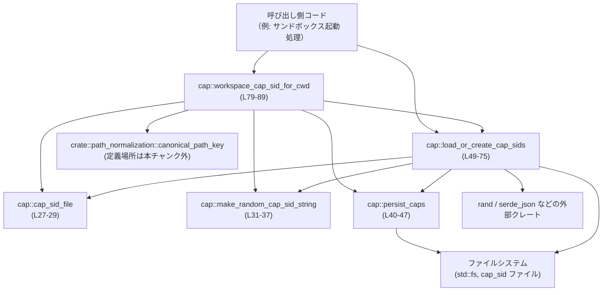
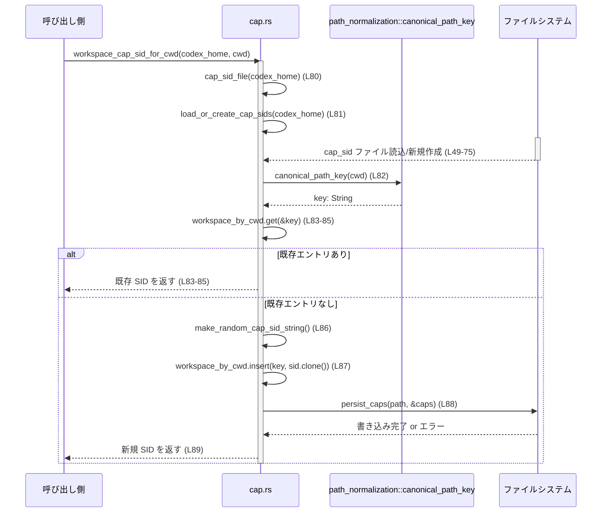

# windows-sandbox-rs/src/cap.rs コード解説

## 0. ざっくり一言

`cap.rs` は、Windows サンドボックス用と思われる「capability SID（セキュリティ識別子）」を生成・永続化し、ワークスペースごとの SID を管理するモジュールです（根拠: `CapSids` 構造体とコメント、およびファイル入出力処理。windows-sandbox-rs/src/cap.rs:L14-25, L40-46, L49-75, L79-89）。

---

## 1. このモジュールの役割

### 1.1 概要

このモジュールは、次の問題を扱います。

- 各「Codex ホーム」ディレクトリごとに、サンドボックス用の capability SID を管理したい  
- 同じワークスペースでも CWD（カレントディレクトリ）の表記ゆれ（パスの大小文字・セパレータの違い）を吸収して同じ SID を使いたい  

そのために、以下の機能を提供しています。

- ランダムな SID 文字列（`S-1-5-21-...` 形式）の生成（windows-sandbox-rs/src/cap.rs:L31-37）
- SID 情報（`CapSids`）の JSON ファイルへの保存・読み込み（windows-sandbox-rs/src/cap.rs:L40-46, L49-75）
- CWD ごとのワークスペース専用 SID の取得・自動生成（windows-sandbox-rs/src/cap.rs:L79-89）

### 1.2 アーキテクチャ内での位置づけ

`cap.rs` は、ファイルシステムと乱数生成、パス正規化モジュールに依存しながら、SID 情報を一箇所に集約する役割を持ちます。



- CWD の正規化は `canonical_path_key` に委譲されており、その詳細はこのチャンクには現れません（windows-sandbox-rs/src/cap.rs:L82）。
- ファイルフォーマット（JSON / レガシー文字列）と永続化の詳細は `cap.rs` 内で完結しています（windows-sandbox-rs/src/cap.rs:L40-46, L49-75）。

### 1.3 設計上のポイント

- **状態の永続化**  
  - 状態はすべて `CapSids` として JSON ファイル（`codex_home/cap_sid`）に保存されます（windows-sandbox-rs/src/cap.rs:L27-29, L40-46）。
  - メモリ上では `CapSids` を操作し、変更は `persist_caps` でファイルに書き戻します（windows-sandbox-rs/src/cap.rs:L40-47, L79-89）。
- **フォーマット互換性**  
  - 既存ファイルが JSON ならそのままパースし、そうでなく非空の単一文字列ならレガシー形式として扱い、新しい `CapSids` 形式に変換して再保存します（windows-sandbox-rs/src/cap.rs:L51-67）。
- **ワークスペースごとの分離**  
  - `CapSids.workspace_by_cwd` により、CWD（正規化済み文字列）単位で SID を分離して管理します（windows-sandbox-rs/src/cap.rs:L18-24）。
  - コメントから、このマップはワークスペースごとの書き込みや deny 設定（例: `CWD/.codex`）を他ワークスペースと切り離すために使われることが分かります（windows-sandbox-rs/src/cap.rs:L18-22）。
- **エラー処理**  
  - 戻り値には `anyhow::Result` を使い、`with_context` により原因を含むメッセージを付与しています（windows-sandbox-rs/src/cap.rs:L40-43, L45, L49-53）。
- **並行性**  
  - ファイルアクセスにロックは使っておらず、複数スレッドまたは複数プロセスから同時に `cap_sid` ファイルを読み書きした場合の整合性は、コードからは保証されません（観察: `std::fs::{read_to_string, write}` の単純呼び出しのみ。windows-sandbox-rs/src/cap.rs:L40-46, L51-53, L88）。

---

## 2. 主要な機能一覧

- CapSids 構造体の定義とシリアライズ/デシリアライズ
- `cap_sid_file`: Codex ホームディレクトリから SID 設定ファイルのパスを作成
- `load_or_create_cap_sids`: SID 設定ファイルの読み込み、必要なら初期化と保存
- `workspace_cap_sid_for_cwd`: CWD ごとのワークスペース SID を取得し、なければ生成して保存
- 内部用ヘルパ:
  - `make_random_cap_sid_string`: ランダムな SID 文字列を生成
  - `persist_caps`: `CapSids` を JSON としてファイルに保存

---

## 3. 公開 API と詳細解説

### 3.1 型一覧（構造体・列挙体など）

| 名前 | 種別 | フィールド | 役割 / 用途 | 定義位置 |
|------|------|------------|-------------|----------|
| `CapSids` | 構造体 | `workspace: String` | ワークスペース全体で使う capability SID | windows-sandbox-rs/src/cap.rs:L14-17 |
| | | `readonly: String` | 読み取り専用用途の capability SID と推測されます（名前から。コード上の用途はこのチャンクには現れません） | windows-sandbox-rs/src/cap.rs:L16-17 |
| | | `workspace_by_cwd: HashMap<String, String>` | 正規化済み CWD 文字列をキーにした、ワークスペース固有の SID | windows-sandbox-rs/src/cap.rs:L18-24 |

※ `CapSids` は `Serialize`, `Deserialize`, `Clone`, `Debug` を実装しており、JSON シリアライズ／ログ出力／複製に利用できます（windows-sandbox-rs/src/cap.rs:L14）。

---

### 3.2 関数詳細

以下では、本モジュール内の主要 5 関数を詳しく説明します。

#### `cap_sid_file(codex_home: &Path) -> PathBuf`  

（定義: windows-sandbox-rs/src/cap.rs:L27-29）

**概要**

- `codex_home` 直下にある設定ファイル `cap_sid` のパスを作成します。

**引数**

| 引数名 | 型 | 説明 |
|--------|----|------|
| `codex_home` | `&Path` | Codex ホームディレクトリへのパス |

**戻り値**

- `PathBuf` : `codex_home.join("cap_sid")` の結果（windows-sandbox-rs/src/cap.rs:L28）。

**内部処理の流れ**

1. `Path::join("cap_sid")` で `codex_home/cap_sid` のパスを生成します（windows-sandbox-rs/src/cap.rs:L28）。

**Examples（使用例）**

```rust
use std::path::Path;
use crate::cap::cap_sid_file;

fn example() {
    let codex_home = Path::new("C:/codex-home");          // Codex ホームディレクトリ
    let cap_file = cap_sid_file(codex_home);             // "C:/codex-home/cap_sid" に相当
    println!("{}", cap_file.display());                  // パスを表示
}
```

**Errors / Panics**

- この関数自体はエラーを返しません。単にパスを結合するだけです。

**Edge cases（エッジケース）**

- `codex_home` が相対パスでも、そのまま相対パスに対する `join` を行います。  
  例: `Path::new("foo")` → `"foo/cap_sid"`。

**使用上の注意点**

- 実際のファイル I/O でのエラー処理は、`load_or_create_cap_sids` や `workspace_cap_sid_for_cwd` 側で行われます。

---

#### `make_random_cap_sid_string() -> String`  

（定義: windows-sandbox-rs/src/cap.rs:L31-38）

**概要**

- ランダムな 4 つの `u32` 値から、`S-1-5-21-<a>-<b>-<c>-<d>` 形式の SID 文字列を生成します。

**引数**

- なし

**戻り値**

- `String` : `S-1-5-21-...` 形式の文字列。

**内部処理の流れ**

1. `SmallRng::from_entropy()` で乱数生成器を初期化します（windows-sandbox-rs/src/cap.rs:L32）。
2. `rng.next_u32()` を 4 回呼び出し、`a`, `b`, `c`, `d` を得ます（windows-sandbox-rs/src/cap.rs:L33-36）。
3. `format!("S-1-5-21-{a}-{b}-{c}-{d}")` で SID 文字列を組み立てます（windows-sandbox-rs/src/cap.rs:L37）。

**Examples（使用例）**

```rust
use crate::cap::make_random_cap_sid_string;

fn example() {
    let sid = make_random_cap_sid_string();              // ランダムな SID を生成
    println!("Generated SID: {sid}");
}
```

**Errors / Panics**

- `SmallRng::from_entropy` や `next_u32` がパニックするかどうかは rand クレートの仕様によりますが、このコードからは分かりません。  
  少なくとも明示的な `panic!` や `unwrap` は使用していません（windows-sandbox-rs/src/cap.rs:L31-37）。

**Edge cases**

- 特定の入力を取らないため、通常の意味でのエッジケースはありません。
- 連続呼び出しで同じ SID が生成される可能性は理論上はありますが、その確率や前提はコードからは分かりません。

**使用上の注意点**

- 生成される SID のランダム性の強度（暗号論的かどうか）はこのチャンクからは判断できません。セキュリティ要件が強い用途に使う場合は、別途 rand クレートの仕様を確認する必要があります。

---

#### `persist_caps(path: &Path, caps: &CapSids) -> Result<()>`  

（定義: windows-sandbox-rs/src/cap.rs:L40-47）

**概要**

- `CapSids` 構造体を JSON 文字列にシリアライズし、指定されたパスに書き込みます。
- ディレクトリが存在しない場合は作成します。

**引数**

| 引数名 | 型 | 説明 |
|--------|----|------|
| `path` | `&Path` | `cap_sid` ファイルのパス |
| `caps` | `&CapSids` | 保存対象の SID 情報 |

**戻り値**

- `Result<()>` (`anyhow::Result`) : 成功時は `Ok(())`、I/O やシリアライズに失敗した場合は `Err`。

**内部処理の流れ**

1. `path.parent()` で親ディレクトリを取得します（windows-sandbox-rs/src/cap.rs:L41）。
2. 親ディレクトリが `Some(dir)` の場合、`fs::create_dir_all(dir)` でディレクトリを作成（存在していれば成功扱い）し、失敗時は文脈付きエラーを返します（windows-sandbox-rs/src/cap.rs:L41-43）。
3. `serde_json::to_string(caps)` で `CapSids` を JSON 文字列に変換します（windows-sandbox-rs/src/cap.rs:L44）。
4. `fs::write(path, json)` でファイルに書き込み、失敗時は文脈付きエラーを返します（windows-sandbox-rs/src/cap.rs:L45）。
5. 成功した場合は `Ok(())` を返します（windows-sandbox-rs/src/cap.rs:L46）。

**Examples（使用例）**

```rust
use std::path::Path;
use std::collections::HashMap;
use anyhow::Result;
use crate::cap::{CapSids, persist_caps};

fn save_example() -> Result<()> {
    let caps = CapSids {
        workspace: "S-1-5-21-1-2-3-4".to_string(),      // 任意の SID
        readonly: "S-1-5-21-5-6-7-8".to_string(),
        workspace_by_cwd: HashMap::new(),
    };

    let path = Path::new("codex-home").join("cap_sid");  // 保存先パス
    persist_caps(&path, &caps)?;                        // JSON として保存
    Ok(())
}
```

**Errors / Panics**

- ディレクトリ作成に失敗した場合（権限不足・パス不正など）、`Err` となりメッセージには `"create cap sid dir <path>"` が含まれます（windows-sandbox-rs/src/cap.rs:L41-43）。
- JSON シリアライズに失敗した場合、`serde_json::to_string` が `Err` を返し、それがそのまま `anyhow::Error` に変換されます（windows-sandbox-rs/src/cap.rs:L44）。
- ファイル書き込みに失敗した場合、`"write cap sid file <path>"` のコンテキスト付きで `Err` が返ります（windows-sandbox-rs/src/cap.rs:L45）。

**Edge cases**

- `path.parent()` が `None`（親ディレクトリなし）の場合、ディレクトリ作成はスキップされます（`if let Some(dir)`）。この場合もファイル書き込みには進みます（windows-sandbox-rs/src/cap.rs:L41-42）。
- 既にディレクトリが存在している場合でも `create_dir_all` は成功扱いです。

**使用上の注意点**

- ファイルロックは行っていないため、他のプロセス／スレッドと同じパスに同時書き込みすると競合する可能性があります。
- JSON フォーマットは `serde_json::to_string` のデフォルトに依存しており、外部ツールと連携する場合は内容を確認する必要があります。

---

#### `load_or_create_cap_sids(codex_home: &Path) -> Result<CapSids>`  

（定義: windows-sandbox-rs/src/cap.rs:L49-76）

**概要**

- `codex_home` 直下の `cap_sid` ファイルを読み込み、`CapSids` を返します。
- ファイルが存在しない、または対応できない形式の場合は新しい `CapSids` を生成して保存します。
- レガシーな「単一 SID 文字列」形式から現在の `CapSids` 形式への移行も行います（windows-sandbox-rs/src/cap.rs:L51-67）。

**引数**

| 引数名 | 型 | 説明 |
|--------|----|------|
| `codex_home` | `&Path` | Codex ホームディレクトリのパス |

**戻り値**

- `Result<CapSids>` : 読み込んだ、または新規作成した `CapSids`。

**内部処理の流れ**

1. `cap_sid_file(codex_home)` で設定ファイルパスを求めます（windows-sandbox-rs/src/cap.rs:L50）。
2. `path.exists()` でファイルの存在を確認します（windows-sandbox-rs/src/cap.rs:L51）。
3. 存在する場合:
   1. `fs::read_to_string(&path)` でファイルを読み込み、失敗時は `"read cap sid file <path>"` コンテキスト付きでエラー（windows-sandbox-rs/src/cap.rs:L51-53）。
   2. `trim()` で前後の空白を除いた文字列 `t` を得ます（windows-sandbox-rs/src/cap.rs:L54）。
   3. `t` が `{` で始まり `}` で終わる場合、JSON とみなし `serde_json::from_str::<CapSids>(t)` を試みます（windows-sandbox-rs/src/cap.rs:L55-57）。成功したら `Ok(obj)` を返します。
   4. それ以外で `t` が空でない場合、レガシー形式とみなし:
      - `workspace = t.to_string()`
      - `readonly = make_random_cap_sid_string()`
      - `workspace_by_cwd = HashMap::new()`
      の `CapSids` を作成し（windows-sandbox-rs/src/cap.rs:L60-64）、`persist_caps` で保存した上で `Ok(caps)` を返します（windows-sandbox-rs/src/cap.rs:L65-66）。
4. ファイルが存在しない、または既存ファイルが JSON 形式でない・空文字列などで上記の条件にマッチしなかった場合:
   1. `workspace` と `readonly` に `make_random_cap_sid_string()` を用いて新しい SID を割り当て、空の `workspace_by_cwd` を持つ `CapSids` を作成します（windows-sandbox-rs/src/cap.rs:L69-73）。
   2. `persist_caps` で保存し、`Ok(caps)` を返します（windows-sandbox-rs/src/cap.rs:L74-75）。

**Examples（使用例）**

```rust
use std::path::Path;
use anyhow::Result;
use crate::cap::load_or_create_cap_sids;

fn init_caps() -> Result<()> {
    let codex_home = Path::new("C:/codex-home");         // Codex ホーム
    let caps = load_or_create_cap_sids(codex_home)?;     // 既存ファイルを読み込み or 新規作成
    println!("Workspace SID: {}", caps.workspace);       // workspace SID を利用
    Ok(())
}
```

**Errors / Panics**

- ファイル読み込み時の I/O エラー（存在しない場合は `exists()` により回避）や権限エラーの場合、`Err` となります（windows-sandbox-rs/src/cap.rs:L51-53）。
- JSON パース失敗時は、`if let Ok(obj)` により単に無視され、フォールバックとして新規 `CapSids` 生成パスに進みます（windows-sandbox-rs/src/cap.rs:L55-57, L69-75）。  
  つまり、壊れた JSON ファイルは自動的に上書きされ、エラーにはなりません。
- `persist_caps` 内でディレクトリ作成またはファイル書き込みに失敗した場合は `Err` となります（windows-sandbox-rs/src/cap.rs:L40-46, L65, L74）。

**Edge cases**

- **壊れた JSON**  
  - `t.starts_with('{') && t.ends_with('}')` だが `from_str::<CapSids>` に失敗した場合、エラーではなく「ファイルなし」とほぼ同じ扱いで、新しい SID が生成されます（windows-sandbox-rs/src/cap.rs:L55-57, L69-75）。
- **空ファイル or 空文字列のみ**  
  - `t.is_empty()` の場合はレガシー文字列パスにも入らないため、新しい `CapSids` を生成します（windows-sandbox-rs/src/cap.rs:L54, L59, L69-75）。
- **レガシー文字列ファイル**  
  - JSON ではなく、非空文字列が 1 つ入っている場合は、その文字列を `workspace` に採用し、`readonly` は新規生成されます（windows-sandbox-rs/src/cap.rs:L59-63）。

**使用上の注意点**

- 既存ファイルが壊れていたり、手動編集で無効な JSON になっている場合でも、エラーにはならず自動的に新しい SID に置き換えられます。  
  これにより、意図せず既存の SID が失われる可能性があります。
- ファイルフォーマットのバージョン管理などは行っておらず、判定は `{...}` の構文と `serde_json` の成否に依存しています。

---

#### `workspace_cap_sid_for_cwd(codex_home: &Path, cwd: &Path) -> Result<String>`  

（定義: windows-sandbox-rs/src/cap.rs:L78-90）

**概要**

- 指定された CWD に対応する「ワークスペース専用 capability SID」を返します。
- 既に存在すればそれを返し、なければ生成して `cap_sid` ファイルに保存します。

**引数**

| 引数名 | 型 | 説明 |
|--------|----|------|
| `codex_home` | `&Path` | Codex ホームディレクトリのパス |
| `cwd` | `&Path` | 対象ワークスペースの CWD パス |

**戻り値**

- `Result<String>` : CWD に紐づいたワークスペース SID の文字列。

**内部処理の流れ**

1. `cap_sid_file(codex_home)` で設定ファイルパスを得ます（windows-sandbox-rs/src/cap.rs:L80）。
2. `load_or_create_cap_sids(codex_home)` で既存の `CapSids` を読み込みます（windows-sandbox-rs/src/cap.rs:L81）。
3. `canonical_path_key(cwd)` で CWD を正規化し、マップのキー文字列 `key` を取得します（windows-sandbox-rs/src/cap.rs:L82）。
4. `caps.workspace_by_cwd.get(&key)` を確認し、既存の SID があればクローンして返します（windows-sandbox-rs/src/cap.rs:L83-85）。
5. 既存エントリがない場合:
   1. `make_random_cap_sid_string()` で新しい SID を生成します（windows-sandbox-rs/src/cap.rs:L86）。
   2. `caps.workspace_by_cwd.insert(key, sid.clone())` でマップに登録します（windows-sandbox-rs/src/cap.rs:L87）。
   3. `persist_caps(&path, &caps)` で更新された `CapSids` を保存します（windows-sandbox-rs/src/cap.rs:L88）。
   4. 生成した SID を返します（windows-sandbox-rs/src/cap.rs:L89）。

**Examples（使用例）**

テストコードに近い形での使用例です（windows-sandbox-rs/src/cap.rs:L99-119）。

```rust
use std::path::PathBuf;
use anyhow::Result;
use crate::cap::workspace_cap_sid_for_cwd;

fn example() -> Result<()> {
    let codex_home = PathBuf::from("C:/codex-home");     // Codex ホーム
    let workspace = PathBuf::from("C:/work/ProjectA");   // ワークスペースの CWD

    let sid1 = workspace_cap_sid_for_cwd(&codex_home, &workspace)?; // 初回: 新規作成＋保存
    let sid2 = workspace_cap_sid_for_cwd(&codex_home, &workspace)?; // 2回目: 同じ SID を取得

    assert_eq!(sid1, sid2);                              // 同じ CWD なら SID は一致
    Ok(())
}
```

**Errors / Panics**

- `load_or_create_cap_sids` 内での I/O エラーやシリアライズエラーがそのまま伝播します（`?` 演算子。windows-sandbox-rs/src/cap.rs:L81）。
- `persist_caps` でのディレクトリ作成・書き込み失敗も `Err` として返ります（windows-sandbox-rs/src/cap.rs:L88）。
- `canonical_path_key(cwd)` のエラー処理はこのチャンクからは分かりません。関数は戻り値を使っているだけで、エラー型等は見えません（windows-sandbox-rs/src/cap.rs:L82）。

**Edge cases**

- テスト `equivalent_cwd_spellings_share_workspace_sid_key` から、パス表記の違い（バックスラッシュ／スラッシュ、大小文字の違い）であっても同じ SID が割り当てられることが分かります（windows-sandbox-rs/src/cap.rs:L100-119）。
  - 正規化前: `canonical` と `alt_spelling` という 2 種類のパスを生成（windows-sandbox-rs/src/cap.rs:L108-109）。
  - 両者に対する `workspace_cap_sid_for_cwd` の戻り値が等しいことをアサート（windows-sandbox-rs/src/cap.rs:L111-116）。
  - 最終的に `caps.workspace_by_cwd.len() == 1` となっているため、内部キーは 1 つに正規化されていると分かります（windows-sandbox-rs/src/cap.rs:L118-119）。
- `workspace_by_cwd` に非常に多くのエントリが追加された場合でも、アクセスは HashMap による平均 O(1) です。ただし毎回 JSON を丸ごと書き戻すため、ファイルサイズに比例して I/O コストは増加します（windows-sandbox-rs/src/cap.rs:L40-46, L87-88）。

**使用上の注意点**

- 毎回 `load_or_create_cap_sids` でファイルを読み込み、変更があれば `persist_caps` で全体を書き戻します。高頻度で呼び出す場合は、I/O 負荷が増加します。
- 同じ `codex_home` に対して複数スレッド／プロセスが同時に `workspace_cap_sid_for_cwd` を呼び出すと、レースコンディションにより上書きや SID 重複・欠落が起こる可能性があります。ロック機構などはこのモジュールにはありません。

---

### 3.3 その他の関数

上記 3.2 で本モジュール内の全関数（テストを除く）を扱っています。  
このチャンクには、補助的なラッパー関数や他の小さな関数は存在しません。

---

## 4. データフロー

ここでは、`workspace_cap_sid_for_cwd` を呼び出して CWD の SID を取得する典型的なフローを示します。

### 4.1 処理の要約

- 呼び出し側コードは `workspace_cap_sid_for_cwd` に `codex_home` と `cwd` を渡します。
- モジュール内で:
  - `cap_sid_file` がファイルパスを決定し、
  - `load_or_create_cap_sids` が `CapSids` を読み込みまたは生成し、
  - `canonical_path_key` が CWD を正規化し、
  - 必要に応じて新しい SID を生成し、`persist_caps` で保存します。

### 4.2 シーケンス図



---

## 5. 使い方（How to Use）

### 5.1 基本的な使用方法

Codex ホームディレクトリを前提に、ワークスペースの CWD に対する SID を取得する基本的な流れです。

```rust
use std::path::PathBuf;
use anyhow::Result;
use crate::cap::{load_or_create_cap_sids, workspace_cap_sid_for_cwd};

fn main_flow() -> Result<()> {
    // Codex ホームディレクトリを決定
    let codex_home = PathBuf::from("C:/codex-home");

    // 初期化として CapSids を読み込む／作成する
    let caps = load_or_create_cap_sids(&codex_home)?;    // ここで workspace / readonly などが用意される
    println!("Global workspace SID: {}", caps.workspace);

    // あるワークスペースの CWD
    let cwd = PathBuf::from("C:/work/ProjectA");

    // CWD に対応するワークスペース SID を取得（なければ作成）
    let ws_sid = workspace_cap_sid_for_cwd(&codex_home, &cwd)?;
    println!("Workspace SID for ProjectA: {ws_sid}");

    Ok(())
}
```

### 5.2 よくある使用パターン

1. **同じ CWD から繰り返し SID を取得する**

   ```rust
   use std::path::Path;
   use anyhow::Result;
   use crate::cap::workspace_cap_sid_for_cwd;

   fn reuse_sid(codex_home: &Path, cwd: &Path) -> Result<()> {
       let sid1 = workspace_cap_sid_for_cwd(codex_home, cwd)?;
       let sid2 = workspace_cap_sid_for_cwd(codex_home, cwd)?;
       assert_eq!(sid1, sid2);                          // 同じ CWD なら同じ SID
       Ok(())
   }
   ```

2. **CWD 表記が異なる場合でも同じ SID を共有**

   テストに倣い、パスの大小文字・区切り文字が違っていても同じ SID が割り当てられる想定です（windows-sandbox-rs/src/cap.rs:L108-119）。

   ```rust
   use std::path::PathBuf;
   use anyhow::Result;
   use crate::cap::workspace_cap_sid_for_cwd;

   fn equivalent_paths(codex_home: &PathBuf, canonical: &PathBuf) -> Result<()> {
       // 文字列上の別表記を作る（例: 大文字化）
       let alt_spelling = PathBuf::from(
           canonical.to_string_lossy()
               .replace('\\', "/")
               .to_ascii_uppercase()
       );

       let sid1 = workspace_cap_sid_for_cwd(codex_home, canonical)?;
       let sid2 = workspace_cap_sid_for_cwd(codex_home, &alt_spelling)?;
       assert_eq!(sid1, sid2);                          // 正規化により同一キーとなる
       Ok(())
   }
   ```

### 5.3 よくある間違い

```rust
use std::path::PathBuf;
use crate::cap::CapSids;

// 間違い例: CapSids を直接変更し、ファイルに保存されることを期待する
fn wrong_usage(codex_home: &PathBuf) {
    let mut caps = CapSids {
        workspace: "S-...".to_string(),
        readonly: "S-...".to_string(),
        workspace_by_cwd: Default::default(),
    };
    caps.workspace_by_cwd.insert("KEY".to_string(), "S-...".to_string());
    // ここでは persist_caps が呼ばれていないので cap_sid ファイルは更新されない
}

// 正しい例: workspace_cap_sid_for_cwd / load_or_create_cap_sids を通じて更新する
```

- `persist_caps` はプライベート関数であり、外部から直接呼び出すことはできません。このファイル内でのみ `CapSids` の永続化が行われる設計になっています（windows-sandbox-rs/src/cap.rs:L40, L65, L74, L88）。

### 5.4 使用上の注意点（まとめ）

- **エラー処理**  
  - すべての公開関数は `anyhow::Result` を返します。`?` 演算子で上位に伝播させるスタイルと相性が良いです（windows-sandbox-rs/src/cap.rs:L49, L79）。
- **ファイル競合**  
  - ロック機構がないため、複数の並行呼び出しで `cap_sid` ファイルが競合する可能性があります。
- **フォーマット破損**  
  - 無効な JSON ファイルはエラーにはならず新しい `CapSids` に置き換えられます。既存 SID を保ちたい環境では、ファイルを手動編集する際に注意が必要です。
- **セキュリティ（アクセス権）**  
  - ファイル作成時に専用の権限設定は行っていません。OS のデフォルト権限に依存しており、より厳格な保護が必要かどうかはシステム全体の設計に依存します（windows-sandbox-rs/src/cap.rs:L42-45）。

---

## 6. 変更の仕方（How to Modify）

### 6.1 新しい機能を追加する場合

例として、「別種の SID（例: admin 用）」を追加したい場合を考えます。

1. **`CapSids` 構造体の拡張**  
   - 新しいフィールドを `CapSids` に追加します（windows-sandbox-rs/src/cap.rs:L14-24）。
   - `Serialize` / `Deserialize` が derive されているため、フィールド名と型に応じて JSON 形式が自動的に拡張されます。
2. **初期化ロジックの更新**  
   - `load_or_create_cap_sids` の新規生成パスで、新フィールドをどのように初期化するかを追加します（windows-sandbox-rs/src/cap.rs:L69-73）。
   - レガシー文字列形式からの変換時にも新フィールドの値をどうするかを決めます（windows-sandbox-rs/src/cap.rs:L60-64）。
3. **永続化**  
   - `persist_caps` は構造体全体を JSON 化しているため、通常は変更不要です（windows-sandbox-rs/src/cap.rs:L44-45）。
4. **新しい公開 API の追加**  
   - 新しい SID を利用する API を追加する場合は、`workspace_cap_sid_for_cwd` に倣い、`make_random_cap_sid_string` と `persist_caps` を活用する形で実装します（windows-sandbox-rs/src/cap.rs:L31-37, L40-47, L79-89）。

### 6.2 既存の機能を変更する場合

- **ファイルフォーマット**  
  - JSON 形式の変更は、`load_or_create_cap_sids` のパース/フォールバックロジックに影響します（windows-sandbox-rs/src/cap.rs:L55-57, L69-75）。
  - 互換性を保ちたい場合、レガシー形式の分岐（`else if !t.is_empty()`）のように、複数フォーマットを扱う分岐を追加するのが一つのパターンです。
- **パス正規化のポリシー**  
  - CWD の正規化は `canonical_path_key` に委譲されているため、そのモジュール側の実装を変更することでキー生成ポリシーを変えられます（windows-sandbox-rs/src/cap.rs:L82）。  
    このチャンクではその実装は見えないため、変更時には該当モジュールのコードとテストの確認が必要です。
- **テストの更新**  
  - `equivalent_cwd_spellings_share_workspace_sid_key` はパス表記ゆれを 1 エントリに正規化することを前提にしています（windows-sandbox-rs/src/cap.rs:L99-119）。  
    正規化ポリシーを変えた場合は、このテストの期待値も合わせて見直す必要があります。

---

## 7. 関連ファイル

| パス / モジュール | 役割 / 関係 |
|------------------|------------|
| `crate::path_normalization`（実ファイルパスはこのチャンクには現れない） | `canonical_path_key(cwd)` を提供し、CWD の正規化ポリシーを一元管理すると考えられます（windows-sandbox-rs/src/cap.rs:L82）。 |
| `windows-sandbox-rs/src/cap.rs` 内 `tests` モジュール | `workspace_cap_sid_for_cwd` と `load_or_create_cap_sids` の連携、および CWD 表記ゆれの正規化動作を検証します（windows-sandbox-rs/src/cap.rs:L92-120）。 |

### テストの概要（このファイル内）

- `equivalent_cwd_spellings_share_workspace_sid_key`（windows-sandbox-rs/src/cap.rs:L99-119）
  - 一時ディレクトリ配下に Codex ホームとワークスペースを作成。
  - ワークスペースパスの「正規パス」と「大文字＋スラッシュ変換」版の 2 通りを用意（windows-sandbox-rs/src/cap.rs:L105-109）。
  - 両方について `workspace_cap_sid_for_cwd` を呼び出し、SID が一致することを確認（windows-sandbox-rs/src/cap.rs:L111-116）。
  - `load_or_create_cap_sids` で読み出した `CapSids.workspace_by_cwd.len()` が 1 であることを確認し、内部キーが 1 つであることを検証（windows-sandbox-rs/src/cap.rs:L118-119）。

これにより、本モジュールの中核となるデータフローとパス正規化の前提がテストで保護されていることが分かります。
