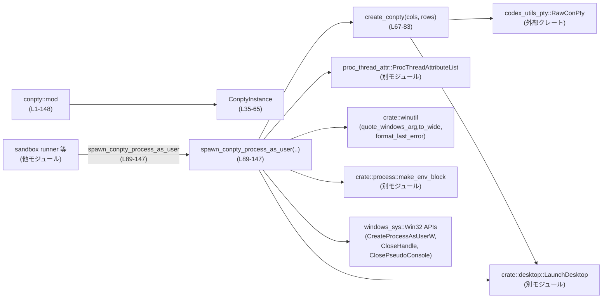
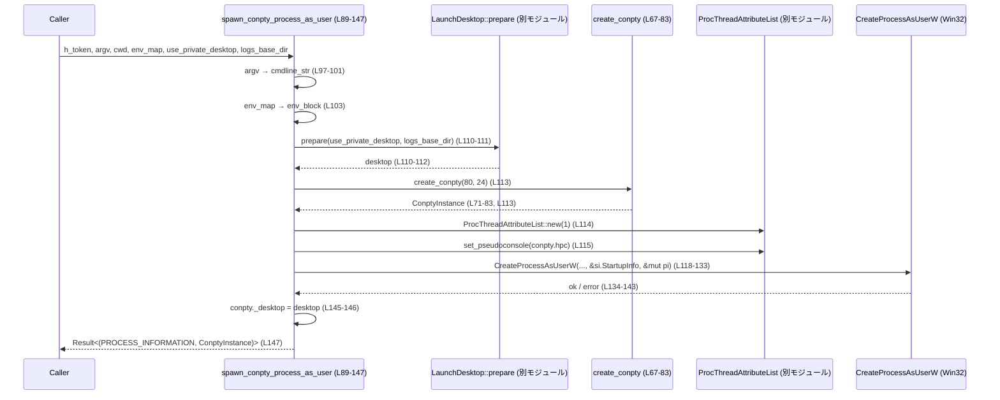
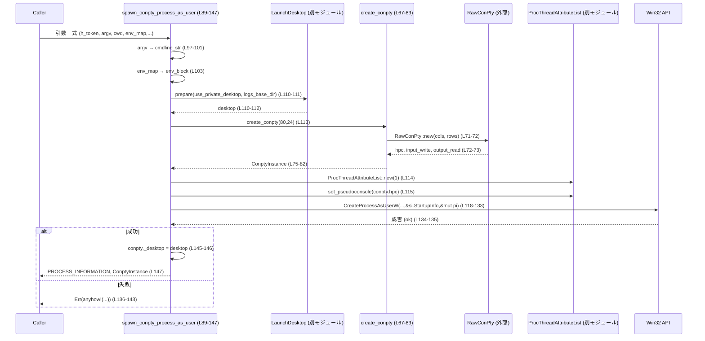

# windows-sandbox-rs/src/conpty/mod.rs

## 0. ざっくり一言

Windows の ConPTY（Pseudo Console）を使って、**サンドボックス化されたプロセスを PTY 付きで起動するためのヘルパー**を提供するモジュールです（`mod.rs:L1-7, L85-88`）。ConPTY ハンドルとバックエンドのパイプを RAII で管理する `ConptyInstance` と、`CreateProcessAsUserW` を使った起動関数が公開 API になっています。

---

## 1. このモジュールの役割

### 1.1 概要

このモジュールは、Windows 上で **ConPTY を作成し、それを紐づけた子プロセスを指定トークンで起動する**ための機能をまとめています。

- ConPTY（擬似コンソール）とそのバックエンドのパイプハンドルをラップする `ConptyInstance` を提供します（`mod.rs:L35-41`）。
- ConPTY の生成（`create_conpty`）と、それを利用した `CreateProcessAsUserW` によるプロセス生成（`spawn_conpty_process_as_user`）を行います（`mod.rs:L67-83, L89-147`）。
- 起動先デスクトップ（通常/プライベート）を `LaunchDesktop` で準備し、プロセス起動時に適用します（`mod.rs:L12, L110-112`）。

### 1.2 アーキテクチャ内での位置づけ

主な依存関係とこのモジュールの位置づけは次の通りです。

- 呼び出し元（例: legacy restricted‑token パス / elevated runner パス）は、このモジュールの `spawn_conpty_process_as_user` を呼び出して、ConPTY 付きでプロセスを起動します（`mod.rs:L4-6, L85-88`）。
- ConPTY 自体の作成には外部クレート `codex_utils_pty::RawConPty` を利用します（`mod.rs:L17, L71-73`）。
- Win32 API との接続には `windows_sys` を直接使用し、ConPTY ハンドルや子プロセス情報を扱います（`mod.rs:L21-31, L118-133`）。
- 起動デスクトップは `crate::desktop::LaunchDesktop` に委譲されます（`mod.rs:L12, L40, L79-81, L110-112, L145-146`）。
- プロセス環境変数ブロック生成は `crate::process::make_env_block` に委譲されます（`mod.rs:L33, L103`）。
- コマンドラインのクォートや文字列→UTF-16 変換は `crate::winutil` に委譲しています（`mod.rs:L13-15, L97-102, L129`）。
- Pseudo Console のスレッド属性設定は、同一ディレクトリの `proc_thread_attr` モジュールの `ProcThreadAttributeList` が担当します（`mod.rs:L9, L11, L114-116`）。



※ 呼び出し元モジュールの具体的な名前・パスは、このチャンクには現れません。

### 1.3 設計上のポイント

コードから読み取れる設計上の特徴は次の通りです。

- **RAII によるリソース管理**  
  - `ConptyInstance` が ConPTY ハンドルとパイプハンドルを保持し、`Drop` 実装で Win32 リソースを解放します（`mod.rs:L35-41, L43-56`）。
- **ConPTY とデスクトップの寿命の紐づけ**  
  - `ConptyInstance` は `LaunchDesktop` を `_desktop` フィールドとして保持し、ConPTY が生きている間は対応するデスクトップも存続するように構成されています（`mod.rs:L40-41, L75-82, L110-112, L145-146`）。
- **Win32 API 呼び出しのカプセル化**  
  - Pseudo Console の作成は `RawConPty`、スレッド属性設定は `ProcThreadAttributeList` に隠蔽し、このモジュールでは主に組み合わせと高レベルのフローに集中しています（`mod.rs:L11, L17, L71-73, L113-116`）。
- **エラー処理**  
  - ほとんどの操作は `anyhow::Result` を返し、`?` 演算子でエラーを伝播します（`mod.rs:L16, L71-72, L79-82, L89-96, L103, L110-111, L113-115`）。
  - `CreateProcessAsUserW` の失敗時には `GetLastError` と `format_last_error` を用いた詳細なメッセージを生成します（`mod.rs:L118-143`）。
- **安全性と unsafe の局所化**  
  - `unsafe` ブロックは Win32 API 呼び出しや `mem::zeroed` に限定され、その他は安全な Rust コードで書かれています（`mod.rs:L45-55, L72, L104-105, L118-133, L135`）。

---

## 2. 主要な機能一覧

このモジュールが提供する主要な機能は次の通りです。

- `ConptyInstance`: ConPTY ハンドルと入出力パイプを所有し、Drop 時に自動解放する RAII ラッパー（`mod.rs:L35-41, L43-56`）。
- `ConptyInstance::into_raw`: ConPTY インスタンスを消費し、ハンドルをクローズせずに生の Win32 `HANDLE` として取り出す（`mod.rs:L59-64`）。
- `create_conpty(cols, rows)`: 指定された桁数・行数で ConPTY を生成し、`ConptyInstance` として返す（`mod.rs:L67-83`）。
- `spawn_conpty_process_as_user(...)`: 指定トークン・カレントディレクトリ・環境変数・デスクトップ設定で ConPTY 付きのプロセスを `CreateProcessAsUserW` で起動する（`mod.rs:L89-147`）。

---

## 3. 公開 API と詳細解説

### 3.1 型一覧（構造体・列挙体など）

| 名前 | 種別 | 公開 | 役割 / 用途 | 定義箇所 |
|------|------|------|-------------|----------|
| `ConptyInstance` | 構造体 | `pub` | ConPTY ハンドル (`hpc`) と、その入出力に対応するパイプハンドル（`input_write`, `output_read`）を所有し、`Drop` 実装でそれらを解放する | `mod.rs:L35-41` |

補足フィールド:

- `hpc: HANDLE` – ConPTY 本体のハンドル（`mod.rs:L37`）。
- `input_write: HANDLE` – 入力側パイプの書き込みハンドル（ホストから子プロセスへ）（`mod.rs:L38`）。
- `output_read: HANDLE` – 出力側パイプの読み取りハンドル（子プロセスからホストへ）（`mod.rs:L39`）。
- `_desktop: LaunchDesktop` – 関連する Windows デスクトップを保持するためのフィールド（外部モジュール定義）（`mod.rs:L40`）。

### 3.2 関数詳細

#### `ConptyInstance::into_raw(self) -> (HANDLE, HANDLE, HANDLE)`（L59-64）

**概要**

`ConptyInstance` を消費し、保持している ConPTY ハンドルとパイプハンドルを **クローズせずに** 生の `HANDLE` として取り出します（`mod.rs:L60-64`）。RAII による自動解放を無効化したい場合に使用されます。

**引数**

| 引数名 | 型 | 説明 |
|--------|----|------|
| `self` | `ConptyInstance` | 所有している ConPTY・パイプ・デスクトップのハンドルを含むインスタンス（ムーブされる） |

**戻り値**

- `(HANDLE, HANDLE, HANDLE)`  
  - 1 要素目: ConPTY ハンドル（`hpc`）  
  - 2 要素目: 入力パイプ書き込みハンドル（`input_write`）  
  - 3 要素目: 出力パイプ読み取りハンドル（`output_read`）  

いずれも、以降は呼び出し側が責任をもってクローズする必要があります。

**内部処理の流れ**

1. `self` を `std::mem::ManuallyDrop::new(self)` で `ManuallyDrop` に包み、`Drop` が呼ばれないようにします（`mod.rs:L62`）。
2. その `ManuallyDrop` から `hpc`, `input_write`, `output_read` をタプルとして返します（`mod.rs:L63`）。

**Examples（使用例）**

ConPTY とパイプハンドルを取得し、Win32 API を直接使って操作するケースの例です。

```rust
use crate::conpty::create_conpty;
use windows_sys::Win32::Foundation::HANDLE;

fn use_raw_handles() -> anyhow::Result<()> {
    // 80x24 の ConPTY を作成し、RAII 管理の ConptyInstance を取得する
    let conpty = create_conpty(80, 24)?; // mod.rs:L71-83

    // RAII を解除し、生の HANDLE を取り出す
    let (hpc, input_write, output_read): (HANDLE, HANDLE, HANDLE) = conpty.into_raw();

    // ここから先は、呼び出し側が CloseHandle / ClosePseudoConsole 等で
    // 適切にハンドルをクローズする責任を負う
    // （具象的なクローズ処理はこのチャンクには現れません）

    Ok(())
}
```

**Errors / Panics**

- `into_raw` 自体は `Result` を返さず、内部で `unwrap` 等も使用していないため、通常の使用で **エラーや panic は発生しません**（`mod.rs:L59-64`）。
- ただし、返されたハンドルを Win32 API で誤用した場合の挙動は、この関数の責任範囲外です。

**Edge cases（エッジケース）**

- `ConptyInstance` が持つハンドルが `0` や `INVALID_HANDLE_VALUE` の場合でも、そのまま返されます。ハンドルの妥当性チェックは行いません（`mod.rs:L59-64`）。

**使用上の注意点**

- この関数を呼び出すと、`ConptyInstance` の `Drop` が呼ばれないため、`CloseHandle` / `ClosePseudoConsole` は自動では行われません（`mod.rs:L43-56, L59-63`）。
- `_desktop: LaunchDesktop` も `Drop` されないため、`LaunchDesktop` 側が保持するリソースも自動解放されなくなります。この影響の詳細は `LaunchDesktop` の実装がこのチャンクにないため不明です。
- 返された `HANDLE` は、呼び出し側で必ず適切なタイミングで閉じる必要があります。

---

#### `create_conpty(cols: i16, rows: i16) -> Result<ConptyInstance>`（L67-83）

**概要**

指定された列数 (`cols`) と行数 (`rows`) を持つ ConPTY を作成し、その ConPTY ハンドルとパイプハンドルを所有する `ConptyInstance` を返します（`mod.rs:L67-83`）。低レベルな PTY 設定が必要な呼び出し元で利用できるよう公開されています。

**引数**

| 引数名 | 型 | 説明 |
|--------|----|------|
| `cols` | `i16` | ConPTY の列数（横幅） |
| `rows` | `i16` | ConPTY の行数（縦の行数） |

**戻り値**

- `Result<ConptyInstance>`  
  成功時に、ConPTY とバックエンドパイプを所有する `ConptyInstance` を返します。失敗時のエラー型は `anyhow::Error` です（`mod.rs:L16, L71-83`）。

**内部処理の流れ**

1. `RawConPty::new(cols, rows)?` を呼び出し、指定サイズの ConPTY を作成します（`mod.rs:L71-72`）。  
   - ここでエラーが発生した場合は `?` で呼び出し元へ伝播されます。
2. `raw.into_raw_handles()` で `RawConPty` から Win32 ハンドル（`hpc`, `input_write`, `output_read`）を取り出します（`mod.rs:L71-73`）。
3. `LaunchDesktop::prepare(false, None)?` を呼び出して `_desktop` を準備し（`mod.rs:L79-81`）、これを含めた `ConptyInstance` を構築して `Ok(...)` で返します（`mod.rs:L75-82`）。  
   - `use_private_desktop` 引数に `false` を渡しているため、ここではプライベートデスクトップは使用していません（`mod.rs:L79-81`）。

**Examples（使用例）**

最小限の PTY を作成して、入出力パイプのハンドルを取得する例です。

```rust
use crate::conpty::create_conpty;
use windows_sys::Win32::Foundation::HANDLE;

fn create_simple_conpty() -> anyhow::Result<()> {
    // 80x24 の ConPTY を作成する
    let conpty = create_conpty(80, 24)?; // mod.rs:L71-83

    // 必要に応じてハンドルにアクセスする
    let hpc: HANDLE = conpty.hpc;
    let input_write: HANDLE = conpty.input_write;
    let output_read: HANDLE = conpty.output_read;

    // ConptyInstance をスコープから抜けさせると Drop により
    // CloseHandle / ClosePseudoConsole が自動実行される（mod.rs:L43-56）

    Ok(())
}
```

**Errors**

`Err(anyhow::Error)` で返される可能性がある主なケース:

- `RawConPty::new(cols, rows)` が失敗した場合（具体的な条件は `RawConPty` の実装がこのチャンクにないため不明）（`mod.rs:L71-72`）。
- `LaunchDesktop::prepare(false, None)` が失敗した場合（具体的な失敗条件は `LaunchDesktop` 実装がこのチャンクにないため不明）（`mod.rs:L79-81`）。

**Edge cases（エッジケース）**

- `cols` や `rows` に 0 または負の値を渡した場合の挙動は、`RawConPty::new` の実装に依存し、このチャンクからは分かりません（`mod.rs:L71-72`）。
- 非常に大きな `cols` / `rows` を指定した場合のメモリ・リソース消費も、`RawConPty` および Windows ConPTY の実装に依存します。

**使用上の注意点**

- この関数単体ではデスクトップは常に `use_private_desktop = false` で準備されます（`mod.rs:L79-81`）。プライベートデスクトップ上での実行を行いたい場合は、`spawn_conpty_process_as_user` を使用する必要があります。
- `ConptyInstance` をドロップすると、ConPTY とパイプが閉じられます。子プロセスがまだ ConPTY に接続されている場合、その I/O が切断される点に注意が必要です（`mod.rs:L43-56`）。

---

#### `spawn_conpty_process_as_user(

    h_token: HANDLE,
    argv: &[String],
    cwd: &Path,
    env_map: &HashMap<String, String>,
    use_private_desktop: bool,
    logs_base_dir: Option<&Path>,
) -> Result<(PROCESS_INFORMATION, ConptyInstance)>`（L89-147）

**概要**

指定されたユーザートークン `h_token` の下で、新しいプロセスを ConPTY に接続して起動する高レベルな関数です（`mod.rs:L85-88, L89-96`）。プロセスの標準入出力は Pseudo Console に接続され、環境変数やカレントディレクトリ、使用するデスクトップ（通常/プライベート）を制御できます。

**引数**

| 引数名 | 型 | 説明 |
|--------|----|------|
| `h_token` | `HANDLE` | `CreateProcessAsUserW` で使用されるユーザートークンのハンドル（`mod.rs:L90, L118-132`）。有効な primary token である必要があります（Win32 API の仕様）。 |
| `argv` | `&[String]` | 起動するコマンドラインの引数配列。各要素は `quote_windows_arg` により Windows 形式で適切にクォートされ、1 本のコマンドライン文字列 `cmdline_str` に結合されます（`mod.rs:L91, L97-102`）。 |
| `cwd` | `&Path` | 新プロセスのカレントディレクトリ（`CreateProcessAsUserW` の `lpCurrentDirectory` に渡される）（`mod.rs:L92, L129`）。 |
| `env_map` | `&HashMap<String, String>` | 新プロセスに設定する環境変数マップ。`make_env_block` により Windows 形式の環境ブロックに変換されます（`mod.rs:L93, L103`）。 |
| `use_private_desktop` | `bool` | プロセスをプライベートデスクトップ上で起動するかどうかを指定します。`LaunchDesktop::prepare` に渡されます（`mod.rs:L94, L110`）。 |
| `logs_base_dir` | `Option<&Path>` | デスクトップ関連のログ出力ベースディレクトリを表すオプション。`LaunchDesktop::prepare` に渡されます（`mod.rs:L95, L110`）。詳細な使われ方はこのチャンクには現れません。 |

**戻り値**

- `Result<(PROCESS_INFORMATION, ConptyInstance)>`  
  - `PROCESS_INFORMATION`: `CreateProcessAsUserW` によって返されるプロセス情報構造体。プロセス/スレッドハンドルと ID を含みます（`mod.rs:L29, L118-132, L145-147`）。
  - `ConptyInstance`: 作成された ConPTY を表すインスタンス。子プロセスの標準入出力はこの ConPTY に接続されます（`mod.rs:L113-116, L145-147`）。

**内部処理の流れ（アルゴリズム）**

1. **コマンドライン構築**  
   - `argv` の各要素を `quote_windows_arg` で適切にクォートし（`mod.rs:L97-100`）、スペース区切りで結合して `cmdline_str` を作成します（`mod.rs:L97-101`）。
   - `cmdline_str` を UTF-16 (`Vec<u16>`) に変換して `cmdline` とします（`mod.rs:L102`）。

2. **環境ブロック作成**  
   - `env_map` を `make_env_block(env_map)` に渡して Windows 形式の UTF-16 環境ブロックを作成します（`mod.rs:L103`）。

3. **`STARTUPINFOEXW` 準備**  
   - `std::mem::zeroed()` で `STARTUPINFOEXW` をゼロ初期化し、サイズを設定します（`mod.rs:L104-105`）。
   - `dwFlags` に `STARTF_USESTDHANDLES` を設定し（`mod.rs:L106`）、`hStdInput`, `hStdOutput`, `hStdError` を `INVALID_HANDLE_VALUE` に設定します（`mod.rs:L107-109`）。
   - `LaunchDesktop::prepare(use_private_desktop, logs_base_dir)?` でデスクトップを準備し、その `lpDesktop` を `startup_info.lpDesktop` にセットします（`mod.rs:L110-112`）。

4. **ConPTY と属性リストのセットアップ**  
   - `create_conpty(80, 24)?` で 80x24 の ConPTY を作成します（`mod.rs:L113`）。
   - `ProcThreadAttributeList::new(1)?` で属性リストを作成し（`mod.rs:L114`）、`set_pseudoconsole(conpty.hpc)?` で ConPTY ハンドルを Pseudo Console 属性として追加します（`mod.rs:L115`）。
   - `si.lpAttributeList` に属性リストのポインタを設定します（`mod.rs:L116`）。

5. **`CreateProcessAsUserW` 呼び出し**  
   - `PROCESS_INFORMATION` を `zeroed` で初期化し（`mod.rs:L118`）、`CreateProcessAsUserW` を `unsafe` ブロック内で呼び出します（`mod.rs:L118-133`）。
   - フラグには `EXTENDED_STARTUPINFO_PRESENT | CREATE_UNICODE_ENVIRONMENT` を設定し（`mod.rs:L127`）、環境ブロックや `cwd`、`&si.StartupInfo` を渡します（`mod.rs:L128-130`）。

6. **エラー処理**  
   - `CreateProcessAsUserW` の戻り値 `ok` が 0（失敗）の場合、`GetLastError` を取得し（`mod.rs:L135`）、`anyhow!` で詳細なエラーメッセージを生成して `Err` を返します（`mod.rs:L136-143`）。

7. **デスクトップと ConPTY の関連付け & 戻り値**  
   - `conpty` を `mut` として再束縛し（`mod.rs:L145`）、`conpty._desktop = desktop` により、ConPTY インスタンスが最終的に使用する `LaunchDesktop` を差し替えます（`mod.rs:L145-146`）。
   - `(pi, conpty)` のタプルを `Ok` で返します（`mod.rs:L147`）。

**Mermaid フロー（関数内処理）**



**Examples（使用例）**

ユーザートークンを既に取得済みで、そのユーザーの環境でプログラムを ConPTY 付きで実行する前提の例です。

```rust
use crate::conpty::spawn_conpty_process_as_user;
use std::collections::HashMap;
use std::path::Path;
use windows_sys::Win32::Foundation::HANDLE;

fn launch_with_conpty(h_token: HANDLE) -> anyhow::Result<()> {
    // 実行するコマンドライン（例: cmd.exe /C echo hello）
    let argv = vec![
        "C:\\Windows\\System32\\cmd.exe".to_string(),
        "/C".to_string(),
        "echo".to_string(),
        "hello".to_string(),
    ];

    // カレントディレクトリ
    let cwd = Path::new("C:\\");

    // 環境変数
    let mut env_map = HashMap::new();
    env_map.insert("PATH".to_string(), std::env::var("PATH")?);

    // プライベートデスクトップは使わずに起動する例
    let (pi, conpty) = spawn_conpty_process_as_user(
        h_token,
        &argv,
        cwd,
        &env_map,
        /*use_private_desktop*/ false,
        /*logs_base_dir*/ None,
    )?;

    // pi: PROCESS_INFORMATION にはプロセス/スレッドハンドルが入っている（mod.rs:L118-132）
    // conpty: 子プロセスの標準入出力に接続された ConPTY インスタンス（mod.rs:L113-116, L145-147）

    // ConptyInstance がスコープを抜けると ConPTY とパイプが閉じられる（mod.rs:L43-56）
    // PROCESS_INFORMATION 内のハンドルは、別途 CloseHandle する必要がある点に注意（Win32 APIの仕様）

    Ok(())
}
```

**Errors / Panics**

- エラーはすべて `Result::Err(anyhow::Error)` で返されます。主なエラー源は以下です。
  - `LaunchDesktop::prepare` が失敗した場合（`mod.rs:L110-111`）。
  - `create_conpty` が失敗した場合（`mod.rs:L113`）。
  - `ProcThreadAttributeList::new` または `set_pseudoconsole` が失敗した場合（`mod.rs:L114-115`）。
  - `CreateProcessAsUserW` が 0 を返した場合（`mod.rs:L118-134`）。
- `CreateProcessAsUserW` 失敗時には、Win32 エラーコードとその文字列表現、`cwd`、`cmdline_str`、環境ブロック長がエラーメッセージに含まれます（`mod.rs:L136-143`）。
- この関数内で `panic!` は直接使われておらず、`unwrap` も存在しません（`mod.rs:L89-147`）。したがって、エラーは `Result` で表現されます。

**Edge cases（エッジケース）**

- `argv` が空配列の場合、`cmdline_str` は空文字列になり、その状態で `CreateProcessAsUserW` が呼ばれます（`mod.rs:L97-102`）。この場合の挙動（エラーコードなど）は Win32 API の仕様に依存し、このチャンクからは分かりません。
- `cwd` が存在しないディレクトリを指している場合の挙動も `CreateProcessAsUserW` や `to_wide` の実装に依存します（`mod.rs:L129`）。
- `env_map` に無効な環境変数名や値が含まれている場合の扱いは `make_env_block` の実装によります（`mod.rs:L103`）。
- `use_private_desktop = true` の場合のセキュリティ境界の詳細は、`LaunchDesktop` 側の実装がこのチャンクにないため不明です。

**使用上の注意点**

- **ハンドル寿命**  
  - 返された `ConptyInstance` をドロップすると、ConPTY とそのパイプがクローズされます（`mod.rs:L43-56`）。子プロセスの I/O が切断されるため、必要な間は `ConptyInstance` を保持する必要があります。
- **PROCESS_INFORMATION のハンドル管理**  
  - `PROCESS_INFORMATION` 内のプロセス/スレッドハンドルのクローズは、この関数では行いません。呼び出し側で `CloseHandle` する必要があります（`mod.rs:L118-132`。CloseHandle 自体は `mod.rs:L21` でインポートされていますが、ここでは使っていません）。
- **並行性**  
  - 関数自体は同期的に動作し、スレッド生成や非同期 I/O を行っていません。`ConptyInstance` が `Send` / `Sync` かどうかは、`LaunchDesktop` の実装や自動導出に依存し、このチャンクからは判断できません。
- **unsafe の前提**  
  - `CreateProcessAsUserW` へのポインタ引数は `unsafe` ブロック内で直接渡されています（`mod.rs:L118-133`）。構造体の初期化・ライフタイムは関数内で完結しており、このコード範囲内では未初期化メモリアクセスは避けられています。

---

### 3.3 その他の関数 / 実装

| 名称 | 種別 | 役割（1 行） | 定義箇所 |
|------|------|--------------|----------|
| `impl Drop for ConptyInstance::drop(&mut self)` | メソッド | `ConptyInstance` がドロップされる際に、`input_write`, `output_read` を `CloseHandle` で閉じ、`hpc` を `ClosePseudoConsole` で閉じる | `mod.rs:L43-56` |

`Drop` の挙動（安全性ポイント）:

- 各ハンドルは `0` か `INVALID_HANDLE_VALUE` でないことを確認してから閉じます（`mod.rs:L46-52`）。
- `CloseHandle` と `ClosePseudoConsole` は `unsafe` ブロック内で呼び出されています（`mod.rs:L45-55`）。

---

## 4. データフロー

代表的なシナリオとして、「ConPTY を作成し、それに接続したプロセスを起動する」場合のデータフローを示します。

1. 呼び出し元が `spawn_conpty_process_as_user` に `h_token`, `argv`, `cwd`, `env_map`, `use_private_desktop`, `logs_base_dir` を渡します（`mod.rs:L89-96`）。
2. この関数内でコマンドライン文字列と環境ブロックが構築されます（`mod.rs:L97-103`）。
3. `LaunchDesktop::prepare` により使用するデスクトップが準備され、`STARTUPINFOEXW.lpDesktop` に設定されます（`mod.rs:L104-112`）。
4. `create_conpty(80,24)` により ConPTY とパイプハンドルを持つ `ConptyInstance` が生成されます（`mod.rs:L113, L71-83`）。
5. `ProcThreadAttributeList` に Pseudo Console 属性が追加され、それが `lpAttributeList` として `CreateProcessAsUserW` に渡されます（`mod.rs:L114-116, L118-132`）。
6. Win32 API により子プロセスが起動し、標準入出力が ConPTY に接続されます。
7. 成功時、`PROCESS_INFORMATION` と `ConptyInstance` が呼び出し元に返却されます（`mod.rs:L145-147`）。



---

## 5. 使い方（How to Use）

### 5.1 基本的な使用方法

典型的なフローは、「既に取得済みのユーザートークンで ConPTY 付きサンドボックスプロセスを起動し、戻り値の ConPTY で I/O を行う」という形です。

```rust
use crate::conpty::spawn_conpty_process_as_user;
use std::collections::HashMap;
use std::path::Path;
use windows_sys::Win32::Foundation::HANDLE;

fn run_in_sandbox_with_tty(h_token: HANDLE) -> anyhow::Result<()> {
    // 実行コマンドを argv 形式で指定
    let argv = vec![
        "C:\\Windows\\System32\\WindowsPowerShell\\v1.0\\powershell.exe".to_string(),
        "-NoProfile".to_string(),
    ];

    // カレントディレクトリ
    let cwd = Path::new("C:\\");

    // 環境変数マップを構築
    let mut env_map = HashMap::new();
    env_map.insert("PATH".to_string(), std::env::var("PATH")?);

    // プライベートデスクトップで起動する例
    let (pi, conpty) = spawn_conpty_process_as_user(
        h_token,
        &argv,
        cwd,
        &env_map,
        /*use_private_desktop*/ true,
        /*logs_base_dir*/ None,
    )?;

    // ここで pi.hProcess / pi.hThread は Win32 の CloseHandle で解放する必要がある
    // conpty.hpc, conpty.input_write, conpty.output_read を使って
    // 子プロセスの標準入出力へアクセスできる（I/O の具体的な方法はこのチャンクには現れません）

    // 必要な処理が終わったら ConptyInstance がスコープを抜けるようにして、
    // Drop によるリソース解放に任せる（mod.rs:L43-56）

    Ok(())
}
```

### 5.2 よくある使用パターン

1. **プロセス起動と ConPTY を一度に行う（高レベル API）**  
   - `spawn_conpty_process_as_user` を呼び出し、戻り値の `ConptyInstance` を使って I/O を行う。
   - デスクトップの種類（通常/プライベート）は `use_private_desktop` で切り替える（`mod.rs:L94-95, L110`）。

2. **ConPTY だけを先に作成し、後続の処理で利用する（低レベル API）**  
   - `create_conpty(cols, rows)` で `ConptyInstance` を取得し（`mod.rs:L71-83`）、必要に応じて `into_raw` でハンドルを取り出して他の Win32 API やライブラリと連携する（`mod.rs:L59-64`）。
   - プロセス起動は別のコードパス（このチャンク外）で行う。

3. **RAII 管理を解除したうえで、カスタムな解放戦略を取る**  
   - `ConptyInstance::into_raw` を用いて RAII を解除し、`HANDLE` を手動で管理する（`mod.rs:L59-64`）。
   - 特殊なライフサイクル制御や、外部ライブラリへの引き渡しが必要な場合に選択されるパターンです。

### 5.3 よくある間違いと注意点

```rust
use crate::conpty::create_conpty;

fn wrong_usage() -> anyhow::Result<()> {
    // 誤り例: ConptyInstance を即座にドロップしてしまう
    let conpty = create_conpty(80, 24)?;
    // ここで関数を抜けると、Drop により ConPTY とパイプが閉じられる（mod.rs:L43-56）
    Ok(())
}

// 正しい使い方の一例:
fn correct_usage() -> anyhow::Result<()> {
    let conpty = create_conpty(80, 24)?; // ConptyInstance をスコープ上位に保持する

    // conpty を使って I/O を行う処理...

    // 処理が終わったタイミングでスコープを抜けさせて Drop に任せる
    Ok(())
}
```

注意点:

- **ConptyInstance の寿命**  
  - `ConptyInstance` のスコープが早く終わると、子プロセスの I/O が予期せず切れる可能性があります。
- **`into_raw` の誤用**  
  - RAII を解除したあとにハンドルをクローズし忘れると、ハンドルリークを引き起こします。
  - `_desktop` によるデスクトップリソースも `Drop` されなくなるため、そのライフサイクルを別途考慮する必要があります（`mod.rs:L40-41, L59-63`）。
- **argv の扱い**  
  - `argv` の各要素は **生の引数** を渡すことが前提で、`quote_windows_arg` によってクォートされます（`mod.rs:L97-100`）。既に自前でクォート済みの文字列を渡すと、二重クォートになる可能性があります。

### 5.4 使用上の注意点（まとめ）

- このモジュールは Win32 の `HANDLE` を直接扱うため、**所有権と寿命の管理**が重要です。`ConptyInstance` をドロップした後にハンドルを使用しないことが前提になります（`mod.rs:L35-41, L43-56`）。
- `spawn_conpty_process_as_user` は `CreateProcessAsUserW` を同期的に呼び出します。プロセス起動が重い場合、呼び出しスレッドがブロックされる点に留意する必要があります（`mod.rs:L118-133`）。
- プライベートデスクトップの挙動やセキュリティ境界は `LaunchDesktop` の設計に依存しており、このチャンクだけでは詳細が分かりません（`mod.rs:L12, L40, L79-81, L110-112, L145-146`）。

---

## 6. 変更の仕方（How to Modify）

### 6.1 新しい機能を追加する場合

例として、「ConPTY のサイズを呼び出し元から指定できる `spawn_conpty_process_as_user` の亜種を追加したい」ケースを考えます。

1. **新関数の追加場所**  
   - `spawn_conpty_process_as_user` と同じモジュール（`mod.rs`）に、新しい関数 `spawn_conpty_process_as_user_with_size` などを追加するのが自然です（`mod.rs:L89-147` 付近）。
2. **再利用するコンポーネント**  
   - `create_conpty(cols, rows)` を流用し、サイズの指定を差し替える（`mod.rs:L71-83, L113`）。
   - コマンドライン構築や環境ブロック生成、`LaunchDesktop::prepare` の呼び出しなどは、既存実装をコピー or 抽出して共通化することができます（`mod.rs:L97-112`）。
3. **Win32 呼び出しの一貫性**  
   - `CreateProcessAsUserW` の呼び出しパラメータは既存関数と同じフラグを維持し、異なる点を明確にすることで、動作の一貫性を保ちやすくなります（`mod.rs:L118-133`）。

### 6.2 既存の機能を変更する場合

変更時には、以下の点の影響範囲を確認する必要があります。

- **`ConptyInstance` のフィールドや Drop 処理**  
  - フィールドを追加・削除する場合は、`Drop` 実装の `CloseHandle` / `ClosePseudoConsole` 呼び出しと整合性を取る必要があります（`mod.rs:L35-41, L43-56`）。
- **`spawn_conpty_process_as_user` の契約**  
  - 引数や戻り値の意味を変更すると、この関数を呼び出す他モジュール（legacy restricted‑token path / elevated runner path 等）に影響します（`mod.rs:L4-6, L85-88, L89-96`）。
  - 特に、`use_private_desktop` と `logs_base_dir` の扱いはセキュリティやログポリシーに関係する可能性があります（`mod.rs:L94-95, L110`）。
- **エラーメッセージの形式**  
  - `CreateProcessAsUserW` 失敗時のエラー文字列は、外部ログや診断に利用される可能性があるため、フォーマットを変更する場合は利用箇所を確認する必要があります（`mod.rs:L136-143`）。
- **unsafe ブロックの変更**  
  - Win32 API 呼び出し部分は `unsafe` であり、パラメータの変更はメモリ安全性に直結します（`mod.rs:L45-55, L72, L104-105, L118-133, L135`）。構造体サイズやライフタイムを確実に満たすようにする必要があります。

---

## 7. 関連ファイル・モジュール

このモジュールと密接に関連する他のモジュール・型は、`use` と `mod` 宣言から次のように読み取れます。

| パス / モジュール | 役割 / 関係 |
|-------------------|------------|
| `crate::conpty::proc_thread_attr` | `ProcThreadAttributeList` 型を提供し、ConPTY を `PROC_THREAD_ATTRIBUTE_PSEUDOCONSOLE` としてスレッド属性リストに設定する機能を持ちます（`mod.rs:L9, L11, L114-116`）。 |
| `crate::desktop::LaunchDesktop` | サンドボックス化されたプロセスを起動するデスクトップ（通常/プライベート）を準備し、そのライフタイムを管理する RAII 型です（`mod.rs:L12, L40, L79-81, L110-112, L145-146`）。 |
| `crate::winutil::{quote_windows_arg, to_wide, format_last_error}` | Windows のコマンドライン引数クォート、文字列から UTF-16 への変換、およびエラーコードからのメッセージ整形を行うユーティリティです（`mod.rs:L13-15, L97-102, L129, L139`）。 |
| `crate::process::make_env_block` | `HashMap<String, String>` から Windows 形式の UTF-16 環境ブロック (`Vec<u16>`) を生成する関数です（`mod.rs:L33, L103`）。 |
| 外部クレート `codex_utils_pty::RawConPty` | ConPTY とそれに紐づくパイプの作成と、ハンドル抽出 (`into_raw_handles`) を提供します（`mod.rs:L17, L71-73`）。 |
| 外部クレート `windows_sys::Win32::*` | Win32 API (`CreateProcessAsUserW`, `CloseHandle`, `ClosePseudoConsole`, 各種フラグ/構造体) を低レベルに呼び出すために使用されます（`mod.rs:L21-31, L118-133`）。 |

テストコードや、このモジュールを呼び出す上位モジュールの具体的なパスは、このチャンクには現れません。
