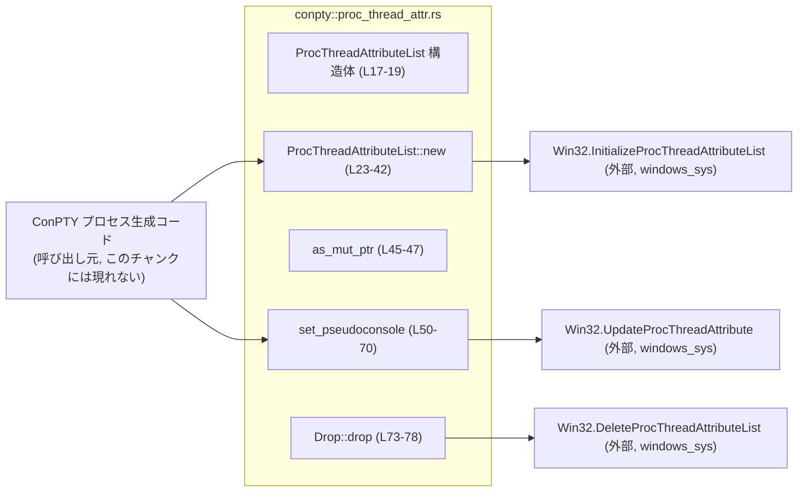
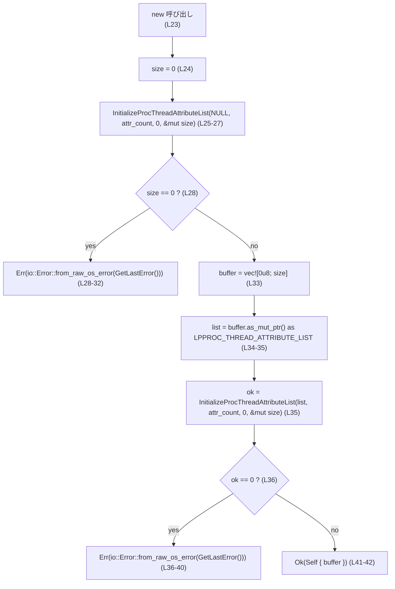
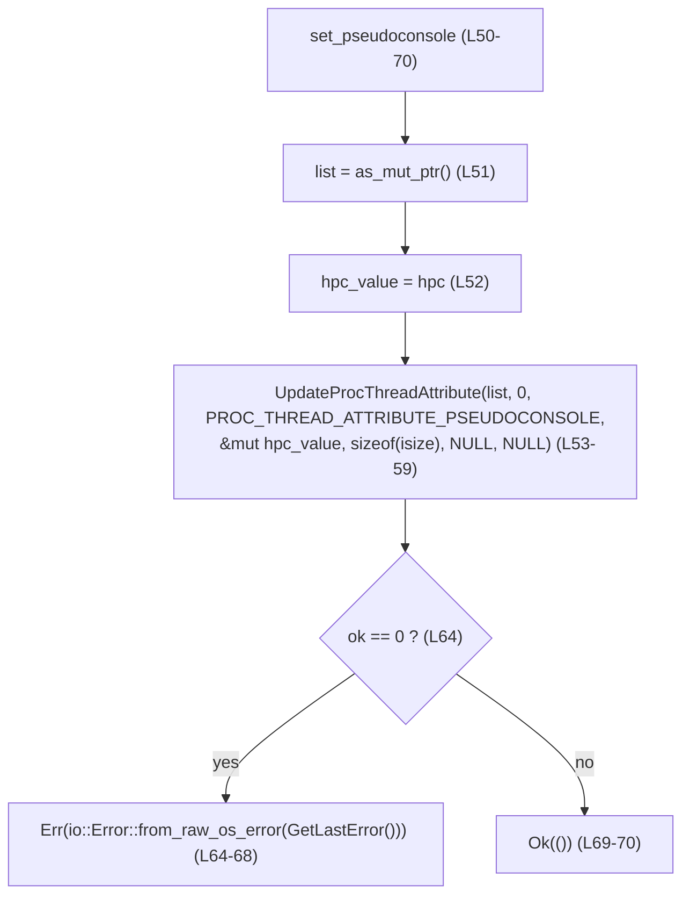
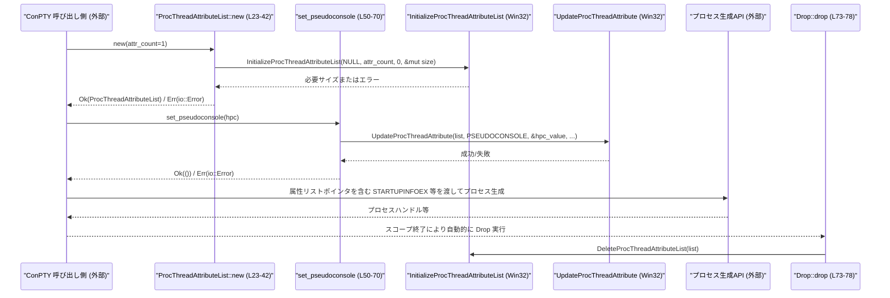

# windows-sandbox-rs/src/conpty/proc_thread_attr.rs コード解説

## 0. ざっくり一言

- Windows の `PROC_THREAD_ATTRIBUTE_LIST` を RAII で扱うための薄いラッパーです（ConPTY 用擬似コンソールハンドルを子プロセスに渡すための属性リストを管理します）【proc_thread_attr.rs:L1-5, L16-19, L49-50】。

---

## 1. このモジュールの役割

### 1.1 概要

- このモジュールは、Windows の低レベル API `PROC_THREAD_ATTRIBUTE_LIST` を扱うための安全なラッパーを提供します【proc_thread_attr.rs:L1-5, L16-19】。
- ConPTY（擬似コンソール）ハンドルを新しく生成する子プロセスに紐付けるために、属性リストのメモリ確保・初期化・解放・属性更新を行います【proc_thread_attr.rs:L1-5, L21-42, L49-70, L73-78】。

### 1.2 アーキテクチャ内での位置づけ

- 依存関係:
  - Rust 標準ライブラリの `std::io` を `io::Result` と OS エラー変換に利用します【proc_thread_attr.rs:L7】。
  - `windows_sys` クレート経由で Win32 API 群を直接呼び出します【proc_thread_attr.rs:L8-12】。
- 利用される側:
  - ファイル先頭コメントにより、「ConPTY spawn」「legacy/elevated unified_exec paths」から利用されることが示唆されていますが、呼び出し元コード自体はこのチャンクには現れません【proc_thread_attr.rs:L1-5】。



### 1.3 設計上のポイント

- RAII（Resource Acquisition Is Initialization）
  - `ProcThreadAttributeList` がスコープを抜けると、自動的に `DeleteProcThreadAttributeList` が呼ばれ、ネイティブリソースが解放されます【proc_thread_attr.rs:L17-19, L73-78】。
- 状態管理
  - 内部状態は `Vec<u8>` のバッファのみで、そこに Win32 の `PROC_THREAD_ATTRIBUTE_LIST` が構築されます【proc_thread_attr.rs:L17-19, L33-35】。
- エラーハンドリング
  - すべての Win32 呼び出しの失敗は `GetLastError` を使って `io::Error` に変換され、`io::Result` として Rust 側に返されます【proc_thread_attr.rs:L23-32, L35-41, L50-70】。
- 安全性
  - Win32 API 呼び出しは `unsafe` ブロック内に閉じ込められ、公開 API は安全な Rust 関数として定義されています【proc_thread_attr.rs:L24-27, L35, L53-63, L75-76】。
- ConPTY 特化
  - 属性の種類は `PROC_THREAD_ATTRIBUTE_PSEUDOCONSOLE` に限定されており、ConPTY 向けのハンドル設定専用です【proc_thread_attr.rs:L14, L49-59】。

---

## 2. 主要な機能一覧

- `ProcThreadAttributeList` の確保・初期化（Win32 `InitializeProcThreadAttributeList` のラップ）【proc_thread_attr.rs:L23-42】。
- `PROC_THREAD_ATTRIBUTE_PSEUDOCONSOLE` 属性の設定（ConPTY ハンドルの紐付け）【proc_thread_attr.rs:L49-70】。
- 属性リストの生ポインタ取得（Win32 プロセス生成 API に渡すため）【proc_thread_attr.rs:L44-47】。
- スコープ終了時に `DeleteProcThreadAttributeList` でネイティブリソースを解放【proc_thread_attr.rs:L73-78】。

---

## 3. 公開 API と詳細解説

### 3.1 型一覧（構造体・列挙体など）

| 名前 | 種別 | 役割 / 用途 | 定義位置 |
|------|------|------------|----------|
| `ProcThreadAttributeList` | 構造体 | Win32 `PROC_THREAD_ATTRIBUTE_LIST` を保持し、RAII で初期化・解放を行うラッパー | `proc_thread_attr.rs:L17-19` |

内部フィールド:

- `buffer: Vec<u8>`: `PROC_THREAD_ATTRIBUTE_LIST` 実体を格納するメモリ領域【proc_thread_attr.rs:L17-19, L33-35】。

---

### 3.2 関数詳細

#### `ProcThreadAttributeList::new(attr_count: u32) -> io::Result<Self>`

**概要**

- 指定した属性数 `attr_count` を持つ `PROC_THREAD_ATTRIBUTE_LIST` を確保・初期化し、それを保持する `ProcThreadAttributeList` を生成します【proc_thread_attr.rs:L21-42】。

**引数**

| 引数名 | 型 | 説明 |
|--------|----|------|
| `attr_count` | `u32` | 属性リストに含める属性数（Win32 API にそのまま渡されます）【proc_thread_attr.rs:L23-27, L35】 |

**戻り値**

- `Ok(ProcThreadAttributeList)`: 属性リストの確保と初期化に成功した場合【proc_thread_attr.rs:L41-42】。
- `Err(io::Error)`: Win32 API が失敗し `GetLastError` で取得したエラーコードを元に `io::Error` を生成した場合【proc_thread_attr.rs:L28-32, L35-40】。

**内部処理の流れ（アルゴリズム）**

1. サイズ計算用に `size: usize` を 0 で初期化【proc_thread_attr.rs:L24】。
2. `InitializeProcThreadAttributeList(NULL, attr_count, 0, &mut size)` を呼び出して必要なバッファサイズを取得【proc_thread_attr.rs:L25-27】。
3. `size == 0` の場合はエラーとみなし、`GetLastError()` の値から `io::Error` を生成して返す【proc_thread_attr.rs:L28-32】。
4. `size` バイトの `Vec<u8>` バッファを確保し、そのポインタを `LPPROC_THREAD_ATTRIBUTE_LIST` にキャスト【proc_thread_attr.rs:L33-35】。
5. 2 回目の `InitializeProcThreadAttributeList(list, attr_count, 0, &mut size)` を呼び出して、バッファ上に属性リストを初期化【proc_thread_attr.rs:L35】。
6. 2 回目の呼び出しが 0（失敗）を返した場合は、直近のエラーコードから `io::Error` を生成して返す【proc_thread_attr.rs:L36-40】。
7. 成功した場合は `ProcThreadAttributeList { buffer }` を返す【proc_thread_attr.rs:L41-42】。



**Examples（使用例）**

> 一般的な初期化の例です。`attr_count` は後で設定する属性の個数に合わせます。

```rust
use std::io;
use windows_sandbox_rs::conpty::proc_thread_attr::ProcThreadAttributeList; // 仮のパス名

fn prepare_attr_list() -> io::Result<ProcThreadAttributeList> {
    // 今回は属性を1つ（ConPTYのみ）設定する前提で 1 を指定する
    let attrs = ProcThreadAttributeList::new(1)?;
    Ok(attrs)
}
```

**Errors / Panics**

- `Err(io::Error)` になる条件:
  - 1 回目または 2 回目の `InitializeProcThreadAttributeList` が失敗した場合【proc_thread_attr.rs:L25-27, L35-40】。
  - 具体的なエラーコードは Win32 側に依存し、このコードからは不明です（`GetLastError()` の値をそのまま `io::Error` に変換）【proc_thread_attr.rs:L28-32, L36-40】。
- panic 条件:
  - この関数内では `panic!` 呼び出しはなく、`Vec` の確保に伴う潜在的な panic（メモリ不足など）以外には、明示的な panic はありません【proc_thread_attr.rs:L33】。

**Edge cases（エッジケース）**

- `attr_count == 0`:
  - この値はそのまま Win32 に渡されます【proc_thread_attr.rs:L25-27, L35】。結果が成功かどうかは Win32 の仕様に依存し、このチャンクだけからは挙動を断定できません。
- 非常に大きい `attr_count`:
  - 必要サイズが大きくなり、`vec![0u8; size]` がメモリ不足で panic する可能性があります【proc_thread_attr.rs:L33】。
- `InitializeProcThreadAttributeList` がエラーを返し、`size` を更新しない場合:
  - `size == 0` により早期に `Err` が返されます【proc_thread_attr.rs:L28-32】。

**使用上の注意点**

- `attr_count` は、後で実際に設定する属性の個数以上を指定する必要があります（そうでないと Win32 側で `UpdateProcThreadAttribute` が失敗し得ますが、このコードからは具体的なエラー内容は不明です）。
- 成功後、返された `ProcThreadAttributeList` は `Drop` 実装により自動解放されるため、明示的に `DeleteProcThreadAttributeList` を呼び出してはなりません【proc_thread_attr.rs:L73-78】。

---

#### `ProcThreadAttributeList::as_mut_ptr(&mut self) -> LPPROC_THREAD_ATTRIBUTE_LIST`

**概要**

- 内部の `PROC_THREAD_ATTRIBUTE_LIST` を指す可変ポインタを Win32 API 用に取得します【proc_thread_attr.rs:L44-47】。

**引数**

| 引数名 | 型 | 説明 |
|--------|----|------|
| `&mut self` | `&mut ProcThreadAttributeList` | 属性リストを保持する自身への可変参照 |

**戻り値**

- `LPPROC_THREAD_ATTRIBUTE_LIST`（型エイリアス）:
  - Win32 API に渡すための生ポインタです【proc_thread_attr.rs:L45-47】。

**内部処理の流れ**

1. `self.buffer.as_mut_ptr()` で `Vec<u8>` の先頭ポインタを取得【proc_thread_attr.rs:L46】。
2. それを `LPPROC_THREAD_ATTRIBUTE_LIST` にキャストして返却【proc_thread_attr.rs:L45-47】。

**Examples（使用例）**

> プロセス生成 API に渡す際にポインタを得る例です（Win32 API 側は疑似コード）。

```rust
fn use_attr_list_in_win32(mut attrs: ProcThreadAttributeList) {
    // Win32 API に渡すためのポインタを取得
    let list_ptr = attrs.as_mut_ptr(); // list_ptr は PROC_THREAD_ATTRIBUTE_LIST* 相当

    // ここで list_ptr を CreateProcessW 等の構造体にセットする想定
    // 実際の呼び出しはこのファイルには存在せず、この例は一般的な利用イメージです。
}
```

**Errors / Panics**

- この関数自体はエラーも panic も発生させません（単なるポインタ演算のみ）【proc_thread_attr.rs:L45-47】。

**Edge cases**

- `self.buffer` が空（`new` に失敗したインスタンス）はそもそも生成されないため、通常は空ポインタになる状況はありません【proc_thread_attr.rs:L23-42】。
- ポインタの有効性は `ProcThreadAttributeList` のライフタイムに依存し、ドロップ後に使用すると未定義動作になる点に注意が必要です（一般的な生ポインタの性質であり、コードには直接記述されていません）。

**使用上の注意点**

- `as_mut_ptr` の戻り値は **所有権を移動しません**。`ProcThreadAttributeList` が生存している間のみ有効です。
- 取得したポインタを別スレッドなどに保存して長期間使う場合は、`ProcThreadAttributeList` のライフタイム管理を慎重に行う必要があります（コードからはスレッド安全性に関する情報は読み取れません）。

---

#### `ProcThreadAttributeList::set_pseudoconsole(&mut self, hpc: isize) -> io::Result<()>`

**概要**

- ConPTY の擬似コンソールハンドル `hpc` を `PROC_THREAD_ATTRIBUTE_PSEUDOCONSOLE` 属性として属性リストに追加します【proc_thread_attr.rs:L49-59】。

**引数**

| 引数名 | 型 | 説明 |
|--------|----|------|
| `&mut self` | `&mut ProcThreadAttributeList` | 更新対象の属性リスト |
| `hpc` | `isize` | 擬似コンソールハンドル（おそらく `HPCON` 相当だが、このチャンク内では型定義は不明）【proc_thread_attr.rs:L50】 |

**戻り値**

- `Ok(())`: Win32 の `UpdateProcThreadAttribute` が成功した場合【proc_thread_attr.rs:L69-70】。
- `Err(io::Error)`: `UpdateProcThreadAttribute` が 0（失敗）を返した場合【proc_thread_attr.rs:L64-68】。

**内部処理の流れ**

1. `self.as_mut_ptr()` で属性リストのポインタ `list` を取得【proc_thread_attr.rs:L51】。
2. 引数 `hpc` をローカル変数 `hpc_value` にコピー【proc_thread_attr.rs:L52】。
3. `&mut hpc_value` を `*mut isize` に変換し、それを void ポインタにキャストして `UpdateProcThreadAttribute` に渡す【proc_thread_attr.rs:L53-59】。
4. 第 3 引数として `PROC_THREAD_ATTRIBUTE_PSEUDOCONSOLE` 定数（`0x00020016`）を指定【proc_thread_attr.rs:L14, L57】。
5. `UpdateProcThreadAttribute` が 0 を返した場合、`GetLastError` を `io::Error` に変換して `Err` として返す【proc_thread_attr.rs:L64-68】。
6. 成功した場合は `Ok(())` を返す【proc_thread_attr.rs:L69-70】。



**Examples（使用例）**

> 擬似コンソールハンドルを属性リストに紐付ける典型的な流れです（`hpc` の取得方法はこのチャンクには現れないため省略し、仮の値とします）。

```rust
fn attach_conpty(mut attrs: ProcThreadAttributeList, hpc: isize) -> std::io::Result<()> {
    // 擬似コンソールハンドルを属性として設定する
    attrs.set_pseudoconsole(hpc)?; // 失敗時は io::Error が返る

    // 以降、attrs を使って子プロセスを生成するコードが続く想定
    Ok(())
}
```

**Errors / Panics**

- `Err(io::Error)` になる条件:
  - `UpdateProcThreadAttribute` が 0 を返した場合【proc_thread_attr.rs:L53-59, L64-68】。
- panic 条件:
  - 本関数内で明示的な `panic!` はなく、`std::mem::size_of::<isize>()` 等も panic を起こしません【proc_thread_attr.rs:L59】。

**Edge cases（エッジケース）**

- `hpc` が無効なハンドル値:
  - `UpdateProcThreadAttribute` の結果がどうなるかは Win32 の仕様に依存し、このコードからは不明ですが、失敗した場合は `Err(io::Error)` になります【proc_thread_attr.rs:L53-59, L64-68】。
- 複数回 `set_pseudoconsole` を呼ぶ場合:
  - 上書きされるのか、エラーになるのかは Win32 側の挙動であり、このチャンク単体からは断定できません。
- `attr_count` が足りない状態で呼び出した場合:
  - `UpdateProcThreadAttribute` がエラーを返す可能性がありますが、具体的なエラーコードは `io::Error` に包まれるのみで、このコードからは詳細不明です【proc_thread_attr.rs:L23-27, L35, L53-59, L64-68】。

**使用上の注意点**

- `set_pseudoconsole` を呼ぶ前に、必ず `ProcThreadAttributeList::new` が成功している必要があります【proc_thread_attr.rs:L23-42, L50-51】。
- ハンドル `hpc` のライフタイムと有効性は呼び出し元で保証する必要があります（このモジュールは単に値をコピーして属性として渡すだけです）【proc_thread_attr.rs:L52-59】。

---

#### `Drop for ProcThreadAttributeList::drop(&mut self)`

**概要**

- `ProcThreadAttributeList` のインスタンスが破棄される際に、対応する Win32 `DeleteProcThreadAttributeList` を呼び出してネイティブリソースを解放します【proc_thread_attr.rs:L73-78】。

**引数**

| 引数名 | 型 | 説明 |
|--------|----|------|
| `&mut self` | `&mut ProcThreadAttributeList` | 破棄されるインスタンス |

**戻り値**

- 戻り値はなく、`()`（Unit 型）です【Rust の Drop 特性仕様】。

**内部処理の流れ**

1. `self.as_mut_ptr()` を呼び出して `PROC_THREAD_ATTRIBUTE_LIST` のポインタを取得【proc_thread_attr.rs:L75-76】。
2. そのポインタを引数として `DeleteProcThreadAttributeList` を呼び出す【proc_thread_attr.rs:L75-76】。

**Examples（使用例）**

> `Drop` は直接呼び出さず、スコープから外れたときに自動的に実行されます。

```rust
fn scoped_attrs_example(hpc: isize) -> std::io::Result<()> {
    {
        let mut attrs = ProcThreadAttributeList::new(1)?;  // ここで Initialize が行われる
        attrs.set_pseudoconsole(hpc)?;                     // 属性を設定
        // attrs を使って子プロセスを生成する処理がある想定
    } // ここで attrs がスコープを抜け、Drop::drop が呼ばれて DeleteProcThreadAttributeList が実行される

    Ok(())
}
```

**Errors / Panics**

- `DeleteProcThreadAttributeList` の戻り値やエラーコードは取得していません【proc_thread_attr.rs:L73-78】。
  - したがって、解放に失敗しても呼び出し側には通知されません。
- 明示的な panic はありません。

**Edge cases**

- `new` が途中で失敗した場合、`ProcThreadAttributeList` は生成されないため、この `drop` は呼ばれません【proc_thread_attr.rs:L23-42】。
- もし内部の `buffer` が不整合な状態であれば（たとえば FFI を不適切に扱った場合）、`DeleteProcThreadAttributeList` に不正なポインタが渡される可能性がありますが、そのような状態はこのモジュールの公開 API だけを通る限り起きにくい設計です【proc_thread_attr.rs:L17-19, L23-42, L75-76】。

**使用上の注意点**

- 呼び出し側は `Drop` を直接呼び出すべきではありません（Rust の一般ルール）。
- `ProcThreadAttributeList` をヒープに置いて `Box::leak` するなど、意図的にリークさせた場合には `DeleteProcThreadAttributeList` は呼ばれません。

---

### 3.3 その他の関数

- このファイルには、上記以外の補助的な関数やラッパー関数は定義されていません【proc_thread_attr.rs:全体】。

---

## 4. データフロー

ここでは、「ConPTY の属性付きプロセス生成」を行う典型的なシナリオにおけるデータフローを示します。呼び出し元やプロセス生成 API はこのチャンクには登場しないため、一般的なイメージとして記述します。



要点:

- `new` で属性リスト用のメモリ確保と Win32 側の初期化が行われ、`Vec<u8>` に保持されます【proc_thread_attr.rs:L23-42】。
- `set_pseudoconsole` で、ConPTY 用ハンドルが `PROC_THREAD_ATTRIBUTE_PSEUDOCONSOLE` 属性としてリストに追加されます【proc_thread_attr.rs:L49-59】。
- 呼び出し元は `as_mut_ptr` を通じてポインタを取得し、プロセス生成 API（一般には `STARTUPINFOEX` に埋め込んで `CreateProcessW` 等を呼ぶ）に渡します【proc_thread_attr.rs:L44-47】。
- 最後に `ProcThreadAttributeList` がドロップされると、`DeleteProcThreadAttributeList` によりネイティブリソースも解放されます【proc_thread_attr.rs:L73-78】。

---

## 5. 使い方（How to Use）

### 5.1 基本的な使用方法

以下は、このモジュールを利用して「ConPTY ハンドル付きで子プロセスを生成する」までの典型的なフローを、簡略化した疑似コードで示したものです。

```rust
use std::io;
use windows_sandbox_rs::conpty::proc_thread_attr::ProcThreadAttributeList; // 仮のパス
// use windows_sys::Win32::System::Threading::CreateProcessW; // 実際の API 呼び出しは省略

fn spawn_with_conpty(hpc: isize) -> io::Result<()> {
    // 1. 属性リストを作成（ConPTY 属性 1 つだけを想定）
    let mut attrs = ProcThreadAttributeList::new(1)?; // InitializeProcThreadAttributeList が内部で呼ばれる

    // 2. ConPTY ハンドルを属性として設定
    attrs.set_pseudoconsole(hpc)?; // UpdateProcThreadAttribute が内部で呼ばれる

    // 3. Win32 プロセス生成構造体に属性リストを埋め込む（疑似コード）
    let attr_ptr = attrs.as_mut_ptr(); // STARTUPINFOEX などにセットするためのポインタ

    // let mut startup_info_ex = ...;             // STARTUPINFOEXW を初期化
    // startup_info_ex.lpAttributeList = attr_ptr;
    // CreateProcessW(..., &mut startup_info_ex.StartupInfo, ...);

    // attrs はこの関数の最後で Drop され、DeleteProcThreadAttributeList が呼ばれる
    Ok(())
}
```

> 注意: 実際の `CreateProcessW` 呼び出しや `STARTUPINFOEXW` の操作はこのファイルには含まれていないため、上記はあくまで一般的な利用イメージです。

### 5.2 よくある使用パターン

- ConPTY 属性のみ設定する
  - `attr_count = 1` で `new` を呼び、直後に `set_pseudoconsole` のみ呼ぶパターン【proc_thread_attr.rs:L23-27, L49-59】。
- 複数属性を設定する
  - 他の属性も追加する場合は `attr_count` を増やし、別の `set_xxx` メソッド（このファイルには未定義）を追加した上で複数回 `UpdateProcThreadAttribute` を呼ぶ想定です。

### 5.3 よくある間違い

```rust
// 間違い例: new に対する attr_count が実際に設定する属性数より小さい
let mut attrs = ProcThreadAttributeList::new(0)?; // 属性を設定するのに 0 は不整合の可能性
attrs.set_pseudoconsole(hpc)?;                   // Win32 側でエラーになる可能性が高い

// 正しい例: 設定する属性数以上の attr_count を渡す
let mut attrs = ProcThreadAttributeList::new(1)?; // ConPTY 属性 1 つを設定する前提
attrs.set_pseudoconsole(hpc)?;
```

```rust
// 間違い例: Drop 後にポインタを使用する
let ptr = {
    let mut attrs = ProcThreadAttributeList::new(1)?;
    let ptr = attrs.as_mut_ptr();
    ptr  // attrs はここでドロップされ、ptr は無効になる
};
// ここで ptr を Win32 に渡すのは未定義動作になりうる

// 正しい例: attrs のライフタイム内で ptr を使用する
let mut attrs = ProcThreadAttributeList::new(1)?;
let ptr = attrs.as_mut_ptr();
// ここでプロセス生成など、ptr を使う処理を完了させる
// attrs がスコープを抜けるのは ptr を使い終わった後
```

### 5.4 使用上の注意点（まとめ）

- `attr_count` は、実際に設定する属性数以上を指定する必要がある（不足すると Win32 API 側でエラーが発生しうる）【proc_thread_attr.rs:L23-27, L35, L53-59】。
- `as_mut_ptr` から得たポインタは `ProcThreadAttributeList` のライフタイム内のみ有効であり、ドロップ後に使ってはならない【proc_thread_attr.rs:L45-47, L73-78】。
- `set_pseudoconsole` に渡すハンドル `hpc` の有効性は呼び出し元で保証する必要がある【proc_thread_attr.rs:L50-52, L53-59】。
- リソース解放の失敗は検知されずログなども行われないため、障害解析の観点では OS 側のデバッグ手段に頼る必要があります【proc_thread_attr.rs:L73-78】。

---

## 6. 変更の仕方（How to Modify）

### 6.1 新しい機能を追加する場合

> 例: 別種の `PROC_THREAD_ATTRIBUTE_*` を設定するメソッドを追加したい場合。

1. **属性定数の追加**
   - 新しい Win32 属性 ID を `const` で定義します（`PROC_THREAD_ATTRIBUTE_PSEUDOCONSOLE` と同様）【proc_thread_attr.rs:L14】。
2. **メソッドの追加**
   - `impl ProcThreadAttributeList` ブロック内に `set_xxx(&mut self, value: ...) -> io::Result<()>` 形式のメソッドを追加し、`set_pseudoconsole` と同様に `UpdateProcThreadAttribute` を呼び出します【proc_thread_attr.rs:L49-70】。
3. **attr_count の見直し**
   - 呼び出し側で `ProcThreadAttributeList::new` に渡す `attr_count` を、追加する属性分だけ増やす必要があります【proc_thread_attr.rs:L23-27】。
4. **FFI 型の確認**
   - 新しい属性に必要な値の型とサイズを `std::mem::size_of` で正しく指定する必要があります【proc_thread_attr.rs:L58-59】。

### 6.2 既存の機能を変更する場合

- 影響範囲の確認
  - `new` の挙動を変えると、属性リストのメモリレイアウトや初期化状態が変わり、そのポインタを使用するすべての Win32 呼び出しに影響します【proc_thread_attr.rs:L23-42, L44-47】。
  - `set_pseudoconsole` のシグネチャや内部処理を変えると、ConPTY 統合部分の全ての呼び出しに影響します【proc_thread_attr.rs:L49-70】。
- 前提条件の維持
  - `Drop` 実装は `DeleteProcThreadAttributeList` を必ず一度だけ呼び出すという前提に基づいているため、バッファの所有権やポインタの扱いを変更する際はこの前提を崩さないようにする必要があります【proc_thread_attr.rs:L17-19, L73-78】。
- テスト・呼び出し箇所の確認
  - このチャンクにはテストコードは含まれておらず、どのテストが存在するかは不明です。
  - 変更後は、ConPTY を利用したプロセス生成パス（コメントにある "legacy"／"elevated unified_exec"）に対して統合テストを行うことが望ましいと考えられます【proc_thread_attr.rs:L1-5】。

---

## 7. 関連ファイル

このモジュールと密接に関係しそうなファイルは、コードコメントやパス構造から次のように推測されます。ただし、実際のファイル内容はこのチャンクには現れません。

| パス | 役割 / 関係 |
|------|------------|
| `src/conpty/mod.rs` など | ConPTY 周りのエントリポイント／高レベル API を提供し、本モジュールを通じて属性リストを構築している可能性があります（このチャンクには現れません）。 |
| `src/conpty/unified_exec.rs` 等 | コメントにある "elevated unified_exec paths" の実装があると推測されますが、実際の構造は不明です【proc_thread_attr.rs:L1-5】。 |
| `windows_sys` クレート | `GetLastError`, `InitializeProcThreadAttributeList`, `UpdateProcThreadAttribute`, `DeleteProcThreadAttributeList` などの Win32 FFI 定義を提供します【proc_thread_attr.rs:L8-12】。 |

> 上記のうち、リポジトリ内の具体的なファイル名・構成はこのチャンクだけからは断定できません。不明な点は実際のコードベースを参照する必要があります。
