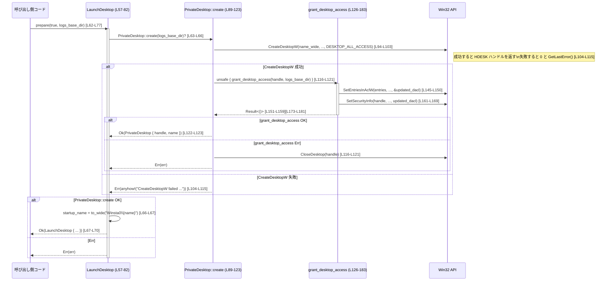

# windows-sandbox-rs\\src\\desktop.rs コード解説

## 0. ざっくり一言

- Windows の「デスクトップオブジェクト」を扱い、  
  既定デスクトップまたは専用のプライベートデスクトップ上でプロセスを起動するための準備（デスクトップ作成・ACL 設定・ポインタ取得）を行うモジュールです。  
  [windows-sandbox-rs\src\desktop.rs:L57-L82][L84-L123][L126-L183]

---

## 1. このモジュールの役割

### 1.1 概要

- このモジュールは **サンドボックス用プロセスをどのデスクトップ上で起動するかを準備する** ために存在し、次の機能を提供します。  
  [windows-sandbox-rs\src\desktop.rs:L57-L82]

  - 既定デスクトップ (`Winsta0\Default`) を使うか、ランダム名のプライベートデスクトップを新規作成するかを切り替える。[L63-L76][L90-L93]
  - プライベートデスクトップの ACL（アクセス制御リスト）を現在ログオン中のユーザー SID に対して設定する。[L126-L142][L145-L169]
  - Win32 API に渡すためのワイド文字列デスクトップ名ポインタを提供する。[L57-L60][L79-L81]

### 1.2 アーキテクチャ内での位置づけ

このファイル内の主要コンポーネントと、他モジュール／Win32 API との関係を示します。

```mermaid
graph TD
  Caller["他モジュールの呼び出し側"]
  LD["LaunchDesktop (L57-82)"]
  PD["PrivateDesktop (L84-123, L186-193)"]
  GDA["grant_desktop_access (L126-183)"]
  LOG["logging モジュール (use logging; L1)"]
  TOKEN["token モジュール (get_current_token_for_restriction, get_logon_sid_bytes; L2-3)"]
  WINUTIL["winutil モジュール (to_wide, format_last_error; L4-5)"]
  WIN32["Win32 API<br/>CreateDesktopW, SetSecurityInfo など (L29, L21-22, L27)"]

  Caller -->|prepare()| LD
  LD -->|プライベートを使う場合| PD
  PD -->|作成時に呼び出し| GDA
  GDA --> TOKEN
  GDA --> WIN32
  GDA --> LOG
  PD --> WIN32
  PD --> LOG
  LD --> WINUTIL
```

- 呼び出し側は `LaunchDesktop::prepare` を通じてデスクトップ準備を行います。[L62-L77]
- プライベートデスクトップ利用時は `PrivateDesktop::create` が Win32 の `CreateDesktopW` でデスクトップを作成し、続けて `grant_desktop_access` で ACL を設定します。[L90-L103][L116-L121][L126-L183]
- Windows ハンドルの寿命管理は `PrivateDesktop` の `Drop` 実装が担当します。[L84-L87][L186-L193]

### 1.3 設計上のポイント

- **RAII によるデスクトップハンドル管理**  
  - `PrivateDesktop` が `handle: isize` を保持し、`Drop` で `CloseDesktop` を呼び出すことで、スコープ終了時に確実にクローズされる構造になっています。[L84-L87][L186-L193]
- **プライベートデスクトップの寿命を `LaunchDesktop` に紐付け**  
  - `LaunchDesktop` は `_private_desktop: Option<PrivateDesktop>` をフィールドとして保持し、インスタンスが生存している間プライベートデスクトップも保持されるようになっています。[L57-L60][L63-L70]
- **エラーハンドリングとログ出力の分離**  
  - Win32 API 呼び出しが失敗した場合、`logging::debug_log` で詳細なエラー情報をログに出しつつ、`anyhow::Result` で呼び出し元にエラーを返します。[L104-L115][L151-L159][L173-L181]
- **ACL 設定処理の分離と `unsafe` の局所化**  
  - デスクトップ作成後の ACL 設定は `unsafe fn grant_desktop_access` に分離されており、`PrivateDesktop::create` から `unsafe` ブロックでのみ呼び出されます。[L89-L90][L94-L103][L116-L121][L126-L183]
- **Windows 固有のワイド文字列取り扱い**  
  - デスクトップ名は `Vec<u16>`（UTF-16, 末尾 NUL を含む想定）として保持し、Win32 API が要求する `*mut u16` へのポインタとして提供します。[L57-L60][L66-L67][L79-L81][L93-L97]

---

## 2. 主要な機能一覧

### 2.1 機能の箇条書き

- プロセス起動用デスクトップ名の準備（既定／プライベートの選択）。  
  [L62-L77]
- プライベートデスクトップの作成と Win32 ハンドル管理。  
  [L84-L87][L89-L123][L186-L193]
- プライベートデスクトップの ACL を、現在ログオンユーザー SID に対して設定。  
  [L126-L142][L145-L169]
- Win32 `STARTUPINFO` 等に渡すためのデスクトップ名ポインタの提供。  
  [L57-L60][L79-L81]

### 2.2 コンポーネントインベントリー（定義位置付き）

#### 型・定数

| 名前 | 種別 | 公開 | 役割 / 用途 | 定義位置 |
|------|------|------|-------------|----------|
| `DESKTOP_ALL_ACCESS` | 定数 (`u32`) | 非公開 | デスクトップオブジェクトに対するフルアクセス権限のビットフラグをまとめた値。Win32 の各 `DESKTOP_*` フラグを OR 結合して定義。 | windows-sandbox-rs\src\desktop.rs:L43-L55 |
| `LaunchDesktop` | 構造体 | `pub` | プロセス起動時に使用するデスクトップ名（既定 or プライベート）と、そのプライベートデスクトップの所有権を保持する RAII ラッパ。 | windows-sandbox-rs\src\desktop.rs:L57-L60 |
| `PrivateDesktop` | 構造体 | 非公開 | Win32 のデスクトップハンドルと、その名前を保持し、`Drop` で `CloseDesktop` を呼ぶ RAII 型。外部から直接は利用されない。 | windows-sandbox-rs\src\desktop.rs:L84-L87 |

#### 関数・メソッド

| 名前 | 種別 | 公開 | 役割 / 用途 | 定義位置 |
|------|------|------|-------------|----------|
| `LaunchDesktop::prepare` | メソッド | `pub` | 既定デスクトップかプライベートデスクトップかを選択して `LaunchDesktop` を構築するエントリポイント。 | windows-sandbox-rs\src\desktop.rs:L62-L77 |
| `LaunchDesktop::startup_info_desktop` | メソッド | `pub` | Win32 API に渡すためのデスクトップ名（`WCHAR*` 相当）のポインタを返す。 | windows-sandbox-rs\src\desktop.rs:L79-L81 |
| `PrivateDesktop::create` | 関数（関連メソッド） | 非公開 | ランダムな名前のプライベートデスクトップを `CreateDesktopW` で作成し、ACL を設定したうえで `PrivateDesktop` を返す。 | windows-sandbox-rs\src\desktop.rs:L89-L123 |
| `grant_desktop_access` | 関数（`unsafe`） | 非公開 | `SetEntriesInAclW` と `SetSecurityInfo` を用いて、指定デスクトップの DACL に現在ログオンユーザー SID の ACE を追加／設定する。 | windows-sandbox-rs\src\desktop.rs:L126-L183 |
| `Drop for PrivateDesktop::drop` | メソッド | 非公開 | RAII により、`PrivateDesktop` 破棄時に `CloseDesktop` を呼びハンドルを解放する。 | windows-sandbox-rs\src\desktop.rs:L186-L193 |

---

## 3. 公開 API と詳細解説

### 3.1 型一覧（構造体・列挙体など）

公開されている主要な型は `LaunchDesktop` です。

| 名前 | 種別 | 役割 / 用途 | フィールド概要 | 定義位置 |
|------|------|-------------|----------------|----------|
| `LaunchDesktop` | 構造体 | デスクトップ準備の結果を表すハンドラ。既定／プライベートデスクトップのいずれかを内部に保持し、そのデスクトップ名ワイド文字列へのポインタを公開します。 | `_private_desktop: Option<PrivateDesktop>` … プライベートデスクトップの RAII オブジェクト。`None` の場合は既定デスクトップを使用。[L57-L60] / `startup_name: Vec<u16>` … `Winsta0\...` 形式のワイド文字列（末尾 NUL 含む想定）。[L57-L60] | windows-sandbox-rs\src\desktop.rs:L57-L60 |

`PrivateDesktop` は非公開ですが、`LaunchDesktop` のリソース管理に密接に関わるため、内部仕様として後述します。[L84-L87]

---

### 3.2 関数詳細

ここでは重要な 4 関数（メソッドを含む）について詳細に説明します。

---

#### `LaunchDesktop::prepare(use_private_desktop: bool, logs_base_dir: Option<&Path>) -> Result<Self>`

**概要**

- デスクトップを準備するためのファクトリメソッドです。[L62-L77]
- `use_private_desktop == true` の場合はプライベートデスクトップを新規作成し、その名前を起動デスクトップ名として設定します。[L63-L70]
- `use_private_desktop == false` の場合は既定デスクトップ `"Winsta0\Default"` を使用します。[L71-L75]

**引数**

| 引数名 | 型 | 説明 |
|--------|----|------|
| `use_private_desktop` | `bool` | `true` の場合プライベートデスクトップを作成・使用し、`false` の場合は既定デスクトップ (`Winsta0\Default`) を使用します。[L63-L76] |
| `logs_base_dir` | `Option<&Path>` | ログ出力のベースディレクトリ。エラー時に `logging::debug_log` に渡されます。`None` の場合の挙動は `logging` モジュール依存で、このファイルからは分かりません。[L63-L66][L104-L113][L151-L155][L173-L177] |

**戻り値**

- 成功時: `Ok(LaunchDesktop)` を返します。[L67-L70][L72-L76]
- 失敗時: `Err(anyhow::Error)` を返します。主に内部の `PrivateDesktop::create` の失敗に起因します。[L63-L66][L89-L123]

**内部処理の流れ**

1. `use_private_desktop` の値をチェックします。[L63-L64]
2. `true` の場合  
   1. `PrivateDesktop::create(logs_base_dir)?` を呼び、プライベートデスクトップを作成します。[L63-L66]
   2. 生成された `private_desktop.name` を `"Winsta0\{name}"` 形式の文字列にして `to_wide` で UTF-16 `Vec<u16>` に変換し、`startup_name` として保持します。[L66-L67]
   3. `_private_desktop: Some(private_desktop)` と `startup_name` をフィールドにもつ `LaunchDesktop` を返します。[L67-L70]
3. `false` の場合  
   1. `"Winsta0\\Default"` を `to_wide` で UTF-16 に変換し、`startup_name` に設定します。[L72-L75]
   2. `_private_desktop: None` と `startup_name` をフィールドにもつ `LaunchDesktop` を返します。[L72-L75]

**Examples（使用例）**

> 注意: ここでは、このモジュールの利用側が `LaunchDesktop` を作成し、Win32 `STARTUPINFO` に設定する想定例を示します。実際のリポジトリ内利用方法は、このファイルだけからは分かりません。

```rust
use std::path::Path;
use anyhow::Result;
// 他: windows_sys など Win32 起動用のインポートが必要になります

fn run_sandboxed_process() -> Result<()> {
    // ログベースディレクトリを指定（ここではカレントディレクトリと仮定）
    let logs_base_dir = Path::new("logs");

    // プライベートデスクトップ上でプロセスを起動するための準備を行う
    let launch_desktop = LaunchDesktop::prepare(true, Some(logs_base_dir))?; // [L62-L70]

    // Win32 STARTUPINFOW 構造体にデスクトップ名ポインタを設定する想定
    // （実際の定義は windows_sys の STARTUPINFOW などを参照）
    /*
    let mut si: STARTUPINFOW = unsafe { std::mem::zeroed() };
    si.cb = std::mem::size_of::<STARTUPINFOW>() as u32;
    si.lpDesktop = launch_desktop.startup_info_desktop(); // [L79-L81]
    */

    // ここで CreateProcessW 等を呼んでプロセス起動 …（省略）

    Ok(()) // 正常終了
}
```

**Errors / Panics**

- `PrivateDesktop::create` 内部でのエラーにより `Err` となる可能性があります（`use_private_desktop == true` の場合）。[L63-L66][L89-L123]
  - `CreateDesktopW` の失敗。[L104-L115]
  - `grant_desktop_access` の失敗。[L116-L121][L151-L159][L173-L181]
- `use_private_desktop == false` の経路では、この関数内で OS 呼び出しを行っていないため、このファイル上からは `to_wide` 実装に依存しますが、明示的なエラー処理はありません。[L72-L75]

**Edge cases（エッジケース）**

- `use_private_desktop == false` の場合  
  - `PrivateDesktop::create` は呼ばれず、OS ハンドルも生成されません。[L71-L76]
- `logs_base_dir == None` の場合  
  - エラー時にも `logging::debug_log` に `logs_base_dir` がそのまま渡されるため、ログ出力先の扱いは `logging` モジュール依存です。[L104-L113][L151-L155][L173-L177]
- プライベートデスクトップ作成時に名前が衝突するなどで `CreateDesktopW` が失敗した場合  
  - エラーコードがログに記録され、`Err(anyhow::Error)` として呼び出し元に伝播します。[L104-L115]

**使用上の注意点**

- `LaunchDesktop` インスタンスは、Win32 API にデスクトップ名ポインタを渡しているあいだは破棄しない必要があります。  
  理由: `startup_info_desktop` が返すポインタは `self.startup_name` 内部バッファを指す生ポインタであり、`LaunchDesktop` がドロップされると無効になります。[L57-L60][L79-L81]
- `use_private_desktop == true` の場合、作成されるデスクトップへのアクセス権は `grant_desktop_access` の内容に依存し、現在のログオン SID に DESKTOP_ALL_ACCESS を付与します。Windows のセキュリティコンテキストとの整合性に注意が必要です。[L126-L142][L132-L133]
- 並列処理（複数スレッド）から利用する場合、このファイル中には明示的な同期処理や `Send` / `Sync` 制御が存在しません。  
  どの程度安全に共有できるかは、上位レイヤーの使用方法と Win32 ハンドルのスレッドセーフ性に依存し、このファイルだけからは判断できません。

---

#### `LaunchDesktop::startup_info_desktop(&self) -> *mut u16`

**概要**

- `LaunchDesktop` に保持されているデスクトップ名（ワイド文字列）へのポインタを返します。[L79-L81]
- 主に Win32 API の `STARTUPINFOW.lpDesktop` 等に渡す用途が想定されますが、このファイルからは実際の利用箇所は分かりません。

**引数**

| 引数名 | 型 | 説明 |
|--------|----|------|
| `&self` | `&LaunchDesktop` | 事前に `prepare` で初期化されたインスタンスへの参照。[L62-L77][L79-L81] |

**戻り値**

- `*mut u16`  
  `Vec<u16>` 内部バッファの先頭要素へのポインタを `*mut u16` にキャストしたものです。[L57-L60][L79-L81]

**内部処理の流れ**

1. `self.startup_name.as_ptr()` で内部の `Vec<u16>` の先頭ポインタを取得します。[L79-L80]
2. `as *mut u16` で `*const u16` を `*mut u16` にキャストして返します。[L79-L80]

このキャストは、Win32 API が「書き込みの可能性があるポインタ型」を要求する一方で、実際には読み取りのみを行う典型的な FFI パターンに対応するためと考えられます。ただし、この点はコードのみからは確定できません。

**Examples（使用例）**

```rust
// LaunchDesktop::prepare でインスタンスを構築した後にポインタを取得する例
fn use_startup_desktop_ptr(ld: &LaunchDesktop) {
    // デスクトップ名 (UTF-16) への生ポインタを取得
    let desktop_ptr: *mut u16 = ld.startup_info_desktop(); // [L79-L81]

    // ここで desktop_ptr を Win32 API に渡すことが想定される
    // 例: STARTUPINFOW.lpDesktop = desktop_ptr;
}
```

**Errors / Panics**

- この関数自体は `Result` を返さず、内部でパニックを起こす処理も行っていません。[L79-L81]
- ただし、返されたポインタを不適切に使用した場合（`LaunchDesktop` ドロップ後の利用など）は未定義動作を引き起こす可能性があります。これは Rust の安全性の外側（FFI 側）の問題です。

**Edge cases（エッジケース）**

- `startup_name` が空の `Vec<u16>` になるケースは、このファイルの処理からは発生しません。`prepare` の両経路とも `to_wide` に `"Winsta0\..."` の文字列を渡しており、少なくとも終端 NUL を含むはずです。[L66-L67][L72-L75]
- `&self` が有効である限り、返されたポインタは `startup_name` の再割当てが起きないため安定しています。このファイル内では `startup_name` の再割当てや変更は行っていません。[L57-L60][L62-L82]

**使用上の注意点**

- 返されたポインタは **Rust の型システムによる安全保証の外** にあるため、使用者側でライフタイムとスレッド安全性を保証する必要があります。
- `LaunchDesktop` がドロップされると `startup_name` のバッファは解放され、ポインタはダングリングポインタになります。そのため、`LaunchDesktop` より長生きする場所にポインタを保存しないことが前提条件です。[L57-L60][L79-L81]

---

#### `PrivateDesktop::create(logs_base_dir: Option<&Path>) -> Result<Self>`

**概要**

- ランダムな名前の Windows デスクトップオブジェクトを `CreateDesktopW` で作成し、  
  その後 `grant_desktop_access` で ACL を設定したうえで `PrivateDesktop` を返します。[L89-L123]
- 作成や ACL 設定に失敗した場合、ハンドルをクローズしてからエラーを返します。[L104-L121]

**引数**

| 引数名 | 型 | 説明 |
|--------|----|------|
| `logs_base_dir` | `Option<&Path>` | ACL 設定やデスクトップ作成に失敗した場合のログ出力先。`logging::debug_log` に渡されます。[L90-L90][L104-L113][L151-L155][L173-L177] |

**戻り値**

- 成功時: `Ok(PrivateDesktop { handle, name })` を返します。[L122-L123]
- 失敗時: `Err(anyhow::Error)` を返します。  
  - 失敗時には `CreateDesktopW` のハンドルが開かれていれば `CloseDesktop` で閉じたうえでエラーを返します。[L116-L121]

**内部処理の流れ**

1. `SmallRng::from_entropy()` で乱数生成器を初期化します。[L91-L91]
2. `rng.r#gen::<u128>()` で 128bit のランダム値を生成し、`"CodexSandboxDesktop-{:x}"` 形式の 16 進文字列としてデスクトップ名 `name` を作成します。[L92-L92]
3. `to_wide(&name)` で UTF-16 `Vec<u16>` に変換します。[L93-L93]
4. `CreateDesktopW` を `unsafe` ブロック内で呼び出し、`handle` を取得します。[L94-L103]
5. `handle == 0` の場合  
   1. `GetLastError` でエラーコードを取得し、`logging::debug_log` でメッセージを記録します。[L104-L113]
   2. `Err(anyhow::anyhow!(...))` でエラーを返します。[L114-L115]
6. `handle != 0` の場合  
   1. `unsafe { grant_desktop_access(handle, logs_base_dir) }` を呼び出し、ACL を設定します。[L116-L121]
   2. `grant_desktop_access` が `Err` を返した場合、`CloseDesktop(handle)` を呼び出してからエラーを返します。[L116-L121]
7. ACL 設定が成功した場合、`Ok(Self { handle, name })` を返します。[L122-L123]

**Examples（使用例）**

> この関数は非公開であり、外部から直接呼び出されることはありません。  
> ここでは `LaunchDesktop::prepare` からの呼び出し関係を示します。

```rust
impl LaunchDesktop {
    pub fn prepare(use_private_desktop: bool, logs_base_dir: Option<&Path>) -> anyhow::Result<Self> {
        if use_private_desktop {
            // PrivateDesktop::create を通じて Win32 デスクトップを作成
            let private_desktop = PrivateDesktop::create(logs_base_dir)?; // [L63-L66][L89-L123]

            let startup_name = to_wide(format!("Winsta0\\{}", private_desktop.name)); // [L66-L67]
            Ok(Self {
                _private_desktop: Some(private_desktop),
                startup_name,
            })
        } else {
            // 既定デスクトップ利用時は PrivateDesktop を作成しない
            Ok(Self {
                _private_desktop: None,
                startup_name: to_wide("Winsta0\\Default"),
            })
        }
    }
}
```

**Errors / Panics**

- `CreateDesktopW` が 0 を返した場合  
  - `GetLastError` のコードがログに記録され、`Err(anyhow::Error)` として返されます。[L104-L115]
- `grant_desktop_access` が `Err` を返した場合  
  - そのエラーがそのまま上位に伝播します。  
  - このとき `CloseDesktop(handle)` が事前に呼ばれるため、ハンドルリークは発生しません。[L116-L121]
- 関数内でパニック（`panic!`）を明示的に呼び出している箇所はありません。

**Edge cases（エッジケース）**

- 非常にまれですが、ランダムに生成したデスクトップ名が既存のデスクトップと衝突した場合  
  - 通常、`CreateDesktopW` はエラーとなり、上記のエラーハンドリング経路を通ります。[L92-L92][L104-L115]  
  - この挙動は Windows API の仕様に依存し、コードから直接は確認できません。
- `logs_base_dir == None` の場合  
  - ログの出力先は `logging::debug_log` の実装依存であり、このファイルからは分かりませんが、エラー時にログ呼び出しは行われます。[L104-L113]
- `grant_desktop_access` 内で OS リソースのエラーが起きた場合  
  - `PrivateDesktop::create` 側でハンドルクローズが保証されるため、ハンドルリークは発生しない設計になっています。[L116-L121][L186-L193]

**使用上の注意点**

- `PrivateDesktop::create` は Win32 API 呼び出しを含むため、コストの高い操作です。大量ループ内で頻繁に呼び出す用途は想定されていないと考えられます。[L94-L103][L126-L183]
- この関数自体は `unsafe` ではありませんが、内部で `unsafe` な FFI を行っています。  
  `unsafe` の責任はこの関数内で完結するように設計されています。[L94-L103][L116-L121]
- ランダム名は `SmallRng` により生成されますが、暗号学的な強度については、このファイルでは特に保証されていません。[L91-L92]

---

#### `unsafe fn grant_desktop_access(handle: isize, logs_base_dir: Option<&Path>) -> Result<()>`

**概要**

- 作成済みデスクトップオブジェクトに対して、現在ログオン中のユーザー SID に `DESKTOP_ALL_ACCESS` を付与するための ACL を構成し、`SetSecurityInfo` を用いて DACL を設定します。[L126-L183]
- `unsafe fn` として宣言されており、呼び出し側が `handle` の有効性などを保証する必要があります。[L126-L126]

**引数**

| 引数名 | 型 | 説明 |
|--------|----|------|
| `handle` | `isize` | 対象とするデスクトップオブジェクトのハンドル。`CreateDesktopW` から取得した値を想定。`0` でない有効なハンドルであることが前提です。[L94-L103][L126-L126] |
| `logs_base_dir` | `Option<&Path>` | エラー時のログ出力ベースディレクトリ。`logging::debug_log` に渡されます。[L126-L126][L151-L155][L173-L177] |

**戻り値**

- 成功時: `Ok(())`。[L183-L183]
- 失敗時: `Err(anyhow::Error)`。  
  - `SetEntriesInAclW` あるいは `SetSecurityInfo` のエラーコードを内包します。[L151-L159][L173-L181]

**内部処理の流れ**

1. `get_current_token_for_restriction()` で現在スレッド／プロセスのトークンハンドルを取得します。[L127-L127]
2. `get_logon_sid_bytes(token)` でトークンからログオン SID を抽出し、その生バイト列を `Vec<u8>` として取得します。[L128-L128]
3. トークンハンドルを `CloseHandle(token)` で閉じます。[L129-L129]
4. `EXPLICIT_ACCESS_W` 構造体の配列 `entries` を 1 要素で定義します。[L131-L142]
   - `grfAccessPermissions: DESKTOP_ALL_ACCESS`。[L132-L132]
   - `grfAccessMode: GRANT_ACCESS`。[L133-L133]
   - `Trustee.TrusteeForm: TRUSTEE_IS_SID` とし、`ptstrName` に `logon_sid.as_mut_ptr()` を `*mut c_void` 経由で `*mut u16` にキャストして設定します。[L135-L141]
5. `SetEntriesInAclW` を呼び出し、新しい DACL (`updated_dacl`) を構成します。[L145-L150]
6. `set_entries_code != ERROR_SUCCESS` の場合  
   - ログを出力し、エラーとして返します。[L151-L159]
7. `SetSecurityInfo` を呼び出して、デスクトップオブジェクトの DACL を `updated_dacl` で設定します。[L161-L169]
8. `updated_dacl` が非 NULL の場合、`LocalFree` で解放します。[L170-L172]
9. `set_security_code != ERROR_SUCCESS` の場合  
   - ログを出力し、エラーとして返します。[L173-L181]
10. 両方成功した場合、`Ok(())` を返します。[L183-L183]

**Examples（使用例）**

> 非公開かつ `unsafe` な関数であり、直接利用されるのは `PrivateDesktop::create` のみです。[L116-L121]

```rust
impl PrivateDesktop {
    fn create(logs_base_dir: Option<&Path>) -> anyhow::Result<Self> {
        // CreateDesktopW によって handle を生成 …（省略） [L94-L103]
        let handle = /* ... */;

        unsafe {
            // ここで grant_desktop_access を呼び、ACL を設定する
            if let Err(err) = grant_desktop_access(handle, logs_base_dir) { // [L116-L121][L126-L183]
                let _ = CloseDesktop(handle); // 失敗時にハンドルを閉じる [L116-L121]
                return Err(err);
            }
        }

        Ok(Self { handle, name: String::new() })
    }
}
```

**Errors / Panics**

- `get_current_token_for_restriction` または `get_logon_sid_bytes` の内部でエラーが発生した場合  
  - `?` 演算子により呼び出し元へ `Err` がそのまま伝播します。[L127-L128]
- `SetEntriesInAclW` が `ERROR_SUCCESS` 以外を返した場合  
  - ログが出力され、`Err` が返されます。[L145-L159]
- `SetSecurityInfo` が `ERROR_SUCCESS` 以外を返した場合  
  - ログが出力され、`Err` が返されます。[L161-L181]
- 関数内でパニックは明示的に使用されていません。

**Edge cases（エッジケース）**

- `updated_dacl` が `NULL` のまま `SetSecurityInfo` に渡されるケース  
  - `SetEntriesInAclW` が成功した場合、通常は非 NULL になるはずですが、このファイルでは `SetEntriesInAclW` の仕様に依存しています。[L144-L150][L161-L169]
  - いずれにせよ、`SetSecurityInfo` 失敗時にはログと `Err` が返されます。[L173-L181]
- `CloseHandle(token)` の失敗  
  - 戻り値は確認されず、ログも出していません。[L129-L129]  
  - したがって、トークンハンドルクローズの失敗は呼び出し元で知ることができません。
- Windows セキュリティポリシーや権限不足により ACL 更新が拒否されるケース  
  - この場合も `SetEntriesInAclW` または `SetSecurityInfo` のエラーとしてログに記録され、`Err` が返されます。[L151-L159][L173-L181]

**使用上の注意点**

- `unsafe fn` であるため、呼び出し側 (`PrivateDesktop::create`) は `handle` が有効であることを保証する必要があります。[L94-L103][L116-L121][L126-L126]
- `logon_sid` のバッファ (`Vec<u8>`) はスタック上のローカル変数ですが、FFI 呼び出し（`SetEntriesInAclW`）中はスコープ内で生存しており、ポインタの有効性は保たれています。[L128-L142][L145-L150]
- Windows API の仕様上、DACL の設定はプロセスのセキュリティコンテキストに依存するため、本関数の成功＝期待どおりのセキュリティが保証されるとは限りません。  
  実際のセキュリティ要件に応じた追加チェックやテストが別途必要です。

---

### 3.3 その他の関数

補助的ないくつかの関数・メソッドを一覧でまとめます。

| 関数名 | 役割（1 行） | 定義位置 |
|--------|--------------|----------|
| `Drop for PrivateDesktop::drop(&mut self)` | `PrivateDesktop` がドロップされる際に `CloseDesktop` を呼び出し、ハンドルを解放します。ハンドルが 0 の場合は何もしません。 | windows-sandbox-rs\src\desktop.rs:L186-L193 |

---

## 4. データフロー

ここでは、プライベートデスクトップを使ってプロセス起動を準備する際の典型的なデータフローを示します。

### 4.1 フロー概要

1. 呼び出し側が `LaunchDesktop::prepare(true, logs_base_dir)` を呼び出します。[L62-L77]
2. `PrivateDesktop::create` がランダムな名前のデスクトップを `CreateDesktopW` で作成します。[L89-L103]
3. 作成したデスクトップハンドルに対して `grant_desktop_access` が ACL を設定します。[L116-L121][L126-L183]
4. `LaunchDesktop` は `startup_name` と `_private_desktop` を保持し、Win32 API に渡すデスクトップ名ポインタを提供します。[L57-L60][L66-L70][L79-L81]

### 4.2 シーケンス図



---

## 5. 使い方（How to Use）

### 5.1 基本的な使用方法

`LaunchDesktop` を用いてデスクトップを準備し、そのポインタを Win32 API に渡す典型的なコードフローの例です。

```rust
use std::path::Path;
use anyhow::Result;
// Win32 起動用の型は windows_sys 等からインポートすると仮定
// use windows_sys::Win32::System::Threading::{CreateProcessW, STARTUPINFOW, PROCESS_INFORMATION};

fn launch_on_private_desktop() -> Result<()> {
    // ログ出力のベースディレクトリ
    let logs_dir = Path::new("logs");

    // プライベートデスクトップを準備
    let ld = LaunchDesktop::prepare(true, Some(logs_dir))?; // [L62-L70]

    // STARTUPINFOW を初期化し、デスクトップ名ポインタを設定（想定例）
    /*
    let mut si: STARTUPINFOW = unsafe { std::mem::zeroed() };
    si.cb = std::mem::size_of::<STARTUPINFOW>() as u32;
    si.lpDesktop = ld.startup_info_desktop(); // [L79-L81]

    let mut pi: PROCESS_INFORMATION = unsafe { std::mem::zeroed() };

    // CreateProcessW(..., &mut si, &mut pi) を呼ぶなど
    */

    // ld がスコープを抜けるとき、プライベートデスクトップは Drop で CloseDesktop される [L186-L193]

    Ok(())
}
```

- 重要な点は、`lpDesktop` 等に渡したポインタが有効である期間は `LaunchDesktop`（および内部の `PrivateDesktop`）が生存している必要があることです。[L57-L60][L79-L81]

### 5.2 よくある使用パターン

1. **既定デスクトップでの起動**

```rust
fn launch_on_default_desktop() -> anyhow::Result<()> {
    // 既定デスクトップを使うため、use_private_desktop = false
    let ld = LaunchDesktop::prepare(false, None)?; // [L71-L76]

    // 得られるポインタは "Winsta0\\Default" のワイド文字列を指す [L72-L75]
    let desktop_ptr = ld.startup_info_desktop(); // [L79-L81]

    // 以降、Win32 の STARTUPINFOW.lpDesktop などに desktop_ptr を渡して使用する想定

    Ok(())
}
```

1. **プライベートデスクトップ＋ログディレクトリ指定**

```rust
fn launch_with_logs() -> anyhow::Result<()> {
    let log_dir = std::path::Path::new("C:\\sandbox_logs"); // ログベースディレクトリ

    // プライベートデスクトップを使い、失敗時には log_dir 以下にログが出ることが期待される [L104-L113][L151-L155][L173-L177]
    let ld = LaunchDesktop::prepare(true, Some(log_dir))?;

    // 必要に応じて ld.startup_info_desktop() を使用 …

    Ok(())
}
```

### 5.3 よくある間違い

```rust
// 間違い例: LaunchDesktop をすぐにドロップしてしまう
fn wrong_usage() -> anyhow::Result<()> {
    let desktop_ptr = {
        let ld = LaunchDesktop::prepare(true, None)?; // [L62-L70]
        ld.startup_info_desktop() // [L79-L81]
    }; // ここで ld がドロップされ、ポインタが無効になる [L186-L193]

    // ここで desktop_ptr を Win32 API に渡すと未定義動作になりうる
    // CreateProcessW(..., lpDesktop = desktop_ptr, ...); // 危険

    Ok(())
}

// 正しい例: LaunchDesktop をポインタ利用期間中は生かしておく
fn correct_usage() -> anyhow::Result<()> {
    let ld = LaunchDesktop::prepare(true, None)?; // LaunchDesktop を外側スコープに保持 [L62-L70]
    let desktop_ptr = ld.startup_info_desktop();  // [L79-L81]

    // desktop_ptr を使用する Win32 API 呼び出しは、このスコープ内で行う
    // CreateProcessW(..., lpDesktop = desktop_ptr, ...);

    Ok(())
} // ここで ld がドロップされ、デスクトップがクリーンアップされる [L186-L193]
```

### 5.4 使用上の注意点（まとめ）

- **ライフタイム管理**  
  - `startup_info_desktop` で取得したポインタは `LaunchDesktop` のライフタイムに依存します。`LaunchDesktop` が生存している間だけ有効と見なす必要があります。[L57-L60][L79-L81]
- **エラー処理**  
  - `LaunchDesktop::prepare(true, ..)` は Win32 API によるデスクトップ作成と ACL 設定に依存しており、環境やユーザー権限によっては失敗して `Err` を返します。[L89-L123][L126-L183]
- **ログ出力**  
  - 失敗時には `logging::debug_log` によるログ出力が行われますが、`logs_base_dir` が `None` の場合の挙動は `logging` モジュール依存です。[L104-L113][L151-L155][L173-L177]
- **並行性**  
  - このファイル内で明示的な同期機構（`Mutex` 等）や `Send` / `Sync` の制御は行っていません。  
    同じ `LaunchDesktop` / `PrivateDesktop` を複数スレッドで共有する場合の安全性は、上位レイヤーの設計と Win32 ハンドルの仕様に依存します。
- **セキュリティ**  
  - `grant_desktop_access` は現在のログオン SID に `DESKTOP_ALL_ACCESS` を付与します。[L126-L142][L132-L133]  
    サンドボックスの要件によっては、より制限的な権限に調整したい場合がありますが、その変更は Win32 セキュリティモデルの理解を前提とします。

---

## 6. 変更の仕方（How to Modify）

### 6.1 新しい機能を追加する場合

例として、「プライベートデスクトップに対して追加の ACL を設定したい」機能を検討します。

1. **エントリポイントの検討**  
   - `LaunchDesktop::prepare` にフラグや設定値を追加するか、新しいファクトリメソッドを追加するのが自然です。[L62-L77]
2. **ACL 設定ロジックの拡張**  
   - 既存の `grant_desktop_access` は 1 つの `EXPLICIT_ACCESS_W` エントリのみを構成しています。[L131-L142]  
     追加の ACE を設定したい場合は、`entries` 配列を拡張するか、新たな `unsafe fn` を追加して処理を分割することが考えられます。
3. **Win32 API 呼び出し部分の再利用**  
   - `SetEntriesInAclW` や `SetSecurityInfo` の呼び出しパターンは既に書かれているため、これを参考に引数を増やす形で実装を追加するのが自然です。[L145-L150][L161-L169]
4. **ログ出力**  
   - エラー時には既存コードと同様に `logging::debug_log` を用いることで、動作ログの一貫性を保てます。[L104-L113][L151-L159][L173-L181]

### 6.2 既存の機能を変更する場合

- **影響範囲の確認**
  - `LaunchDesktop` は公開型のため、クレート外からも利用されている可能性があります。[L57-L60]  
    フィールド構造やメソッドシグネチャの変更は広範な影響を与える可能性があります。
  - `PrivateDesktop` と `grant_desktop_access` はこのモジュール内でのみ使われており、変更の影響範囲は限定されます。[L84-L87][L89-L123][L126-L183]
- **契約（前提条件・返り値の意味）の確認**
  - `LaunchDesktop::prepare` の契約:
    - `use_private_desktop == false` のときには OS リソースを確保しない。[L71-L76]
    - エラー時には `anyhow::Error` を返し、パニックは起こさない。[L62-L77][L89-L123]
  - `grant_desktop_access` の契約:
    - `handle` は有効なデスクトップハンドルであり、関数内でクローズしない。[L126-L126][L161-L169]
- **テストと使用箇所の確認**
  - このファイル内にはテストコードは含まれていません。  
    変更時には、`LaunchDesktop` を利用している他ファイル（このチャンクには現れません）を検索し、期待される挙動（特にエラー処理とログ出力）との整合性を確認する必要があります。

---

## 7. 関連ファイル

このモジュールと密接に関係する他ファイル・モジュール（import されているもの）は以下のとおりです。

| パス / モジュール名 | 役割 / 関係 |
|---------------------|------------|
| `crate::logging` | エラー発生時にデバッグログを出力するために使用されています。ログの具体的な出力先やフォーマットは、このファイルからは分かりません。[windows-sandbox-rs\src\desktop.rs:L1][L104-L113][L151-L155][L173-L177] |
| `crate::token::get_current_token_for_restriction` | ACL 設定のために現在のトークンハンドルを取得する関数です。どのトークンを返すか（プロセス／スレッドなど）はこのチャンクには現れません。[L2][L127] |
| `crate::token::get_logon_sid_bytes` | トークンからログオン SID を抽出し、生バイト列として返す関数です。SID の具体的な構造やエラーハンドリングはこのファイルからは分かりません。[L3][L128] |
| `crate::winutil::format_last_error` | `GetLastError` の値を人間可読な文字列に変換するユーティリティです。[L4][L104-L113] |
| `crate::winutil::to_wide` | Rust の文字列を UTF-16（`Vec<u16>`）に変換するユーティリティで、デスクトップ名のワイド文字列化に使用されています。[L5][L66-L67][L72-L75][L93-L93] |
| `windows_sys::Win32::System::StationsAndDesktops` 系列 | `CreateDesktopW`, `CloseDesktop` など、デスクトップオブジェクトを扱う Win32 API 群です。[L27-L41][L94-L103][L186-L193] |
| `windows_sys::Win32::Security::Authorization` 系列 | `EXPLICIT_ACCESS_W`, `SetEntriesInAclW`, `SetSecurityInfo` など、ACL／セキュリティ情報を扱う Win32 API 群です。[L18-L26][L131-L142][L145-L150][L161-L169] |

---

**注記**

- この解説は、与えられた `windows-sandbox-rs\src\desktop.rs` のコードのみを根拠としており、他ファイルの実装詳細や実際の利用箇所については「不明」と明示しています。
- Windows API の挙動についての記述は、一般的な公式ドキュメントに基づくものであり、本リポジトリ特有のカスタマイズが存在するかどうかは、このチャンクからは分かりません。
