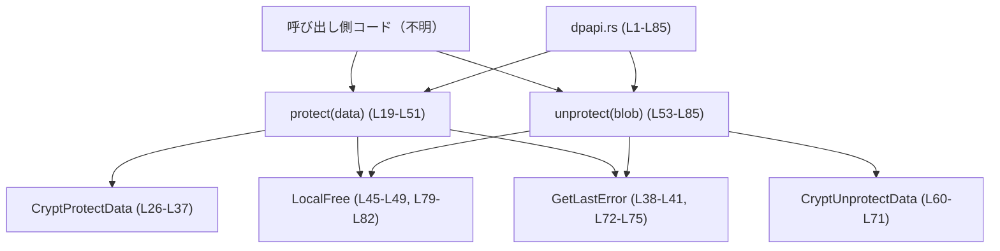
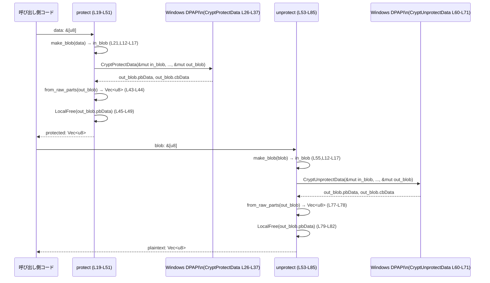

# windows-sandbox-rs/src/dpapi.rs コード解説

## 0. ざっくり一言

Windows の DPAPI（Data Protection API）を使って、バイト列を暗号化・復号するための薄いラッパーモジュールです。`protect` と `unprotect` の 2 つの公開関数を提供し、機械スコープ（ローカルマシン全体）での保護を行います（`CRYPTPROTECT_LOCAL_MACHINE` フラグ、`windows-sandbox-rs\src\dpapi.rs:L26-L37`, `L60-L71`）。

---

## 1. このモジュールの役割

### 1.1 概要

- このモジュールは、**Windows 固有の DPAPI を使ってシークレットを安全に保存・読み出しする問題**を解決するために存在し、シンプルな関数インターフェースで **暗号化（protect）と復号（unprotect）** を提供します（`windows-sandbox-rs\src\dpapi.rs:L19-L51`, `L53-L85`）。
- 呼び出し側は `&[u8]` を渡すだけで、Windows API の呼び出しやメモリ解放などの詳細を意識せずに利用できます。

### 1.2 アーキテクチャ内での位置づけ

- 依存先:
  - エラー管理に `anyhow::Result` / `anyhow!` を利用します（`L1-L2`, `L38-L41`, `L72-L75`）。
  - Windows API 群 `CryptProtectData`, `CryptUnprotectData`, `LocalFree`, `GetLastError` などを `windows_sys` 経由で呼び出します（`L3-L10`, `L26-L37`, `L60-L71`, `L45-L49`, `L79-L82`）。
- 依存元:
  - このチャンク内には、このモジュールを呼び出している他モジュールは現れません。呼び出し側（例: `lib.rs` や CLI コマンドなど）は**不明**です。

モジュール間の位置づけイメージは次のとおりです。



### 1.3 設計上のポイント

- **完全にステートレス**  
  - グローバル状態や内部キャッシュを持たず、すべての関数は入力から出力を計算するだけです（`protect`/`unprotect` の中でフィールドや静的変数にアクセスしていません, `L19-L51`, `L53-L85`）。
- **FFI（外国関数インターフェース）をカプセル化**  
  - エクスポートされる関数は安全な Rust シグネチャ (`&[u8]` → `Result<Vec<u8>>`) で、内部でのみ `unsafe` ブロックで Windows API を呼び出します（`L26-L37`, `L43-L49`, `L60-L71`, `L77-L82`）。
- **メモリ管理の責務を閉じ込める**  
  - `CryptProtectData` / `CryptUnprotectData` が確保したバッファを `LocalFree` で解放する処理を関数内部で完結させ、呼び出し側に裸ポインタを渡さない設計です（`L43-L49`, `L77-L82`）。
- **機械スコープでの保護**  
  - `CRYPTPROTECT_LOCAL_MACHINE` フラグにより、同一マシン上の別プロセス・別ユーザーでも復号できる設定になっています（`L33-L35`, `L67-L69`）。ユーザーごとではなくマシン全体の秘密共有を意図した構成と解釈できます（コード上のコメントより, `L33-L35`, `L67-L69`）。

---

## 2. 主要な機能一覧

### 2.1 コンポーネント一覧（関数・外部 API）

| 名前 | 種別 | 役割 / 用途 | 定義/利用位置 |
|------|------|-------------|----------------|
| `make_blob` | 関数（プライベート） | `&[u8]` から `CRYPT_INTEGER_BLOB` を構築し、Windows API に渡すための BLOB を作る | 定義: `L12-L17`, 利用: `L21`, `L55` |
| `protect` | 関数（公開） | 平文のバイト列を DPAPI で暗号化し、暗号化済みバイト列を返す | 定義: `L19-L51` |
| `unprotect` | 関数（公開） | DPAPI で暗号化されたバイト列を復号し、平文バイト列を返す | 定義: `L53-L85` |
| `CryptProtectData` | Windows API | `protect` から呼ばれる DPAPI 暗号化関数 | 利用: `L26-L37` |
| `CryptUnprotectData` | Windows API | `unprotect` から呼ばれる DPAPI 復号関数 | 利用: `L60-L71` |
| `LocalFree` | Windows API | DPAPI によって確保された出力バッファを解放する | 利用: `L47-L48`, `L81-L82` |
| `GetLastError` | Windows API | DPAPI 呼び出しに失敗したときのエラーコード取得に使用 | 利用: `L38-L41`, `L72-L75` |

---

## 3. 公開 API と詳細解説

### 3.1 型一覧（構造体・列挙体など）

このファイル自体は新しい公開型を定義していませんが、重要な外部型として次が使われています。

| 名前 | 種別 | 役割 / 用途 | 定義/利用位置 |
|------|------|-------------|----------------|
| `CRYPT_INTEGER_BLOB` | 外部構造体（Windows） | `cbData`（サイズ）と `pbData`（ポインタ）から成る汎用バイト列（BLOB）を表す。DPAPI の入出力バッファとして利用 | インポート: `L10`, 利用: `L12-L17`, `L22-L25`, `L56-L59` |
| `HLOCAL` | 外部ハンドル型（Windows） | `LocalFree` で解放されるローカルメモリへのハンドル型。DPAPI が確保したバッファの解放に使用 | インポート: `L5`, 利用: `L47-L48`, `L81-L82` |

### 3.2 関数詳細

#### `protect(data: &[u8]) -> Result<Vec<u8>>`（`windows-sandbox-rs\src\dpapi.rs:L19-L51`）

**概要**

- 入力のバイトスライス `data` を DPAPI に渡し、暗号化済みバイト列 `Vec<u8>` を返します。
- 暗号化には UI を伴わず（`CRYPTPROTECT_UI_FORBIDDEN`）、マシン全体で復号可能なスコープ（`CRYPTPROTECT_LOCAL_MACHINE`）が使われます（`L33-L35`）。

**引数**

| 引数名 | 型 | 説明 |
|--------|----|------|
| `data` | `&[u8]` | 暗号化したい任意のバイト列。空でもよい（`make_blob` で長さ 0 の BLOB が作られます, `L12-L17`, `L21`）。 |

**戻り値**

- `Result<Vec<u8>>`（`L20`）  
  - `Ok(Vec<u8>)`: DPAPI によって暗号化されたデータ。
  - `Err(anyhow::Error)`: `CryptProtectData` が失敗した場合に、`GetLastError` の結果を含むエラーメッセージを格納（`L38-L41`）。

**内部処理の流れ（アルゴリズム）**

1. 入力スライスから `CRYPT_INTEGER_BLOB` を作る  
   - `make_blob(data)` で `cbData` と `pbData` をセット（`L21`, `L12-L17`）。
2. 出力用 `CRYPT_INTEGER_BLOB` を 0 初期化  
   - `cbData = 0`, `pbData = null_mut()`（`L22-L25`）。
3. `unsafe` ブロック内で `CryptProtectData` を呼び出し  
   - 入力・出力 BLOB、各種パラメータ、フラグを渡す（`L26-L37`）。
4. 戻り値 `ok` をチェック  
   - `ok == 0` の場合は失敗とみなし、`GetLastError()` でエラーコードを取得して `Err(anyhow!(...))` を返す（`L38-L41`）。
5. 成功時、`out_blob` が指すメモリから `Vec<u8>` を作る  
   - `std::slice::from_raw_parts(out_blob.pbData, out_blob.cbData as usize)` でスライスを生成し、`to_vec()` でコピー（`L43-L44`）。
6. DPAPI が確保した `out_blob.pbData` を解放  
   - `LocalFree(out_blob.pbData as HLOCAL)` を `unsafe` ブロック内で呼び出し（`L45-L49`）。
7. 最後に暗号化済みの `Vec<u8>` を `Ok` で返す（`L50`）。

**Examples（使用例）**

基本的な暗号化の使用例です。

```rust
use anyhow::Result;                                      // anyhow::Result をインポート
use windows_sandbox_rs::dpapi;                           // 仮のクレート/モジュールパス

fn store_secret() -> Result<()> {                        // エラーを呼び出し元に伝播する関数
    let secret = b"my-password";                         // 暗号化したいシークレット（バイト列）
    let protected = dpapi::protect(secret)?;             // DPAPI で暗号化（失敗時は ? で早期 return）
    // ここで、protected をファイルやレジストリに保存するなどの処理を行う
    println!("暗号化済みデータ長: {}", protected.len()); // 長さをログ出力
    Ok(())                                               // 正常終了
}
```

**Errors / Panics**

- `Err` になる条件
  - `CryptProtectData` が 0 を返した場合（`L38-L41`）。
  - エラーメッセージには `GetLastError()` の数値が埋め込まれます（`L38-L41`）。
- パニック
  - この関数内で明示的な `panic!` は呼び出していません。
  - ただし `unsafe` な `from_raw_parts` の契約（ポインタとサイズが有効であること）が破られた場合は、未定義動作になる可能性があります（`L43-L44`）。DPAPI が正しいポインタとサイズを返すことを前提とした設計です。

**Edge cases（エッジケース）**

- `data` が空スライス `&[]` の場合
  - `cbData` が 0 の BLOB が作成され（`L12-L15`）、そのまま DPAPI に渡されます。挙動は DPAPI の仕様に依存しますが、コード上は特別扱いしていません。
- 非常に大きなデータ
  - 長さに制限チェックは行っていません（`L19-L51`）。サイズ制限がある場合は DPAPI 側で失敗し、`Err` になります。
- 並行呼び出し
  - 関数内部はローカル変数のみを使用しており共有可変状態はありません（`L21-L25`, `L43-L49`）。Rust 側の観点では、複数スレッドから同時に `protect` を呼び出してもデータ競合は発生しない構造です。

**使用上の注意点**

- **プラットフォーム依存**  
  - `windows_sys` の Windows API に依存しており、Windows 以外ではコンパイルできません（`L3-L10`）。
- **機械スコープのセキュリティ特性**  
  - `CRYPTPROTECT_LOCAL_MACHINE` により、同一マシンの他ユーザー・他プロセスでも復号可能です（`L33-L35`）。ユーザーごとに秘密を分離したいケースには適合しません。
- **メモリ上の秘密データ**  
  - 復号前の `data` および暗号化後の `Vec<u8>` は通常のメモリ上に保持され、ゼロクリアなどは行いません（`L19-L51`）。より強いメモリ上の保護が必要な場合は呼び出し側で対処する必要があります。
- **エラー情報の粒度**  
  - 返されるエラーは `anyhow::Error` でラップされており、型安全なエラー分類は行っていません（`L1-L2`, `L38-L41`）。呼び出し側で詳細なエラー分類を行いたい場合は、エラーメッセージから `GetLastError` の値を解析する必要があります。

---

#### `unprotect(blob: &[u8]) -> Result<Vec<u8>>`（`windows-sandbox-rs\src\dpapi.rs:L53-L85`）

**概要**

- DPAPI によって暗号化されたバイト列 `blob` を復号し、元の平文バイト列 `Vec<u8>` として返します（`L54-L85`）。
- 暗号化時と同じく、UI なし・機械スコープでの復号（`CRYPTPROTECT_UI_FORBIDDEN | CRYPTPROTECT_LOCAL_MACHINE`）を行います（`L67-L69`）。

**引数**

| 引数名 | 型 | 説明 |
|--------|----|------|
| `blob` | `&[u8]` | `protect` などで DPAPI により暗号化されたバイト列。 |

**戻り値**

- `Result<Vec<u8>>`（`L54`）  
  - `Ok(Vec<u8>)`: 復号された平文データ。
  - `Err(anyhow::Error)`: `CryptUnprotectData` が失敗した場合に、`GetLastError` の結果を含むエラー（`L72-L75`）。

**内部処理の流れ（アルゴリズム）**

1. 入力 BLOB の構築  
   - `make_blob(blob)` で `cbData` と `pbData` を設定（`L55`, `L12-L17`）。
2. 出力 BLOB の 0 初期化  
   - `cbData = 0`, `pbData = null_mut()`（`L56-L59`）。
3. `CryptUnprotectData` の呼び出し  
   - `unsafe` ブロックで `&mut in_blob` と `&mut out_blob` を渡し、復号を実行（`L60-L71`）。
4. 戻り値 `ok` をチェック  
   - `ok == 0` の場合は失敗として、`GetLastError()` の結果を含む `anyhow!` エラーを返す（`L72-L75`）。
5. 成功時は `out_blob` の指すメモリから `Vec<u8>` を生成  
   - `std::slice::from_raw_parts` でスライス → `to_vec()` でコピー（`L77-L78`）。
6. DPAPI が確保したバッファの解放  
   - `LocalFree(out_blob.pbData as HLOCAL)` を呼び出し（`L79-L82`）。
7. 平文 `Vec<u8>` を `Ok` で返す（`L84`）。

**Examples（使用例）**

`protect` と組み合わせた往復例（暗号化→復号）です。

```rust
use anyhow::Result;                                      // anyhow::Result をインポート
use windows_sandbox_rs::dpapi;                           // 仮のクレート/モジュールパス

fn round_trip() -> Result<()> {                          // 暗号化→復号の往復テスト
    let original = b"top-secret";                        // 元のシークレット
    let protected = dpapi::protect(original)?;           // 暗号化（失敗時は ? で早期 return）
    let decrypted = dpapi::unprotect(&protected)?;       // 復号（暗号化済みデータを渡す）

    assert_eq!(original.to_vec(), decrypted);            // 復号結果が元と同じであることを確認
    Ok(())                                               // 正常終了
}
```

エラー時の扱い例（ログ出力など）:

```rust
use windows_sandbox_rs::dpapi;                           // dpapi モジュール
use anyhow::Result;                                      // anyhow::Result

fn load_secret(blob: &[u8]) -> Result<Vec<u8>> {         // 暗号化済みデータから復号する関数
    match dpapi::unprotect(blob) {                       // unprotect の戻り値を match で分岐
        Ok(plaintext) => Ok(plaintext),                  // 成功した場合はそのまま返す
        Err(e) => {                                      // 失敗した場合
            eprintln!("復号に失敗しました: {e}");        // エラー内容を標準エラーに出力
            Err(e)                                       // エラーを呼び出し元にも返す
        }
    }
}
```

**Errors / Panics**

- `Err` になる条件
  - `CryptUnprotectData` が 0 を返した場合（`L60-L71`, `L72-L75`）。
- パニック
  - 明示的な `panic!` 呼び出しはありません。
  - こちらも `unsafe` な `from_raw_parts` に依存しており、DPAPI が返すポインタ・サイズが不正な場合は未定義動作となる可能性があります（`L77-L78`）。

**Edge cases（エッジケース）**

- `blob` の内容が壊れている / 別マシンで生成されたデータ
  - DPAPI が復号に失敗し `ok == 0` となり、`Err(anyhow!(...))` が返されます（`L60-L71`, `L72-L75`）。
- 空の `blob`（`&[]`）が渡された場合
  - `make_blob` により `cbData = 0` の BLOB が渡されます（`L55`, `L12-L17`）。挙動自体は DPAPI の仕様に依存し、コード側で特別なチェックはありません。
- 暗号化時と異なるスコープ・条件
  - この関数は常に `CRYPTPROTECT_UI_FORBIDDEN | CRYPTPROTECT_LOCAL_MACHINE` で呼び出しており（`L67-L69`）、暗号化時も同じ条件であることを前提としています。異なる条件で作られた `blob` は復号できない可能性があります。

**使用上の注意点**

- **入力検証は行っていない**  
  - `blob` が任意のバイト列でもそのまま DPAPI に渡します（`L55-L71`）。形式チェックは DPAPI に一任されています。
- **復号結果の扱い**  
  - 復号されたデータは `Vec<u8>` として通常のヒープに載るため、機密性の高いデータの場合、呼び出し側でゼロクリアやメモリ管理を検討する必要があります（`L77-L84`）。
- **ログ出力への注意**  
  - エラーをログに出す際、`anyhow!` メッセージに含まれる `GetLastError` の値自体は問題ありませんが、復号データを誤ってログに出さないよう注意が必要です。

---

### 3.3 その他の関数

| 関数名 | 役割（1 行） | 定義位置 |
|--------|--------------|----------|
| `make_blob(data: &[u8]) -> CRYPT_INTEGER_BLOB` | スライスの長さとポインタから `CRYPT_INTEGER_BLOB` を構築するヘルパー関数。DPAPI への引数準備に使用される | `windows-sandbox-rs\src\dpapi.rs:L12-L17` |

---

## 4. データフロー

ここでは、典型的な「平文データを暗号化し、後で復号する」シナリオにおけるデータの流れを示します。

1. 呼び出し側が平文 `&[u8]` を `protect` に渡します（`L19-L21`）。
2. `protect` が `CRYPT_INTEGER_BLOB` に変換し、`CryptProtectData` を呼び出します（`L21-L37`）。
3. Windows DPAPI が暗号化したデータを新しいバッファに書き込み、ポインタとサイズを `out_blob` に設定して返します（`L22-L25`, `L26-L37`）。
4. `protect` はそのバッファを `Vec<u8>` にコピーし、元のバッファを `LocalFree` で解放します（`L43-L49`）。
5. 後で呼び出し側が `unprotect` に暗号化済み `&[u8]` を渡します（`L53-L55`）。
6. `unprotect` も同様に `CryptUnprotectData` を呼び出し、復号されたデータを受け取り `Vec<u8>` にコピーし、DPAPI が確保したメモリを解放します（`L55-L82`）。



---

## 5. 使い方（How to Use）

### 5.1 基本的な使用方法

シンプルなラウンドトリップ（暗号化→永続化→復号）の例です。

```rust
use anyhow::Result;                                      // anyhow::Result 型を使用
use std::fs;                                             // ファイル入出力用
use windows_sandbox_rs::dpapi;                           // dpapi モジュール（仮のパス）

fn main() -> Result<()> {                                // メイン関数、エラーは anyhow::Result
    let secret = b"api-token-123";                       // 保存したいシークレット（バイト列）

    // 1. 暗号化
    let protected = dpapi::protect(secret)?;             // エラー時は ? で即 return

    // 2. ファイルに保存
    fs::write("secret.bin", &protected)?;                // 暗号化済みデータをファイルに書き込む

    // 3. 後で読み出して復号
    let loaded = fs::read("secret.bin")?;                // 保存したファイルを読み出す
    let decrypted = dpapi::unprotect(&loaded)?;          // DPAPI で復号する

    assert_eq!(secret.to_vec(), decrypted);              // 元の値と同じであることを確認
    Ok(())                                               // 正常終了
}
```

### 5.2 よくある使用パターン

- **設定ファイルやレジストリに保存するシークレットの暗号化**  
  - 保存前に `protect` し、読み込み時に `unprotect` する（`L19-L51`, `L53-L85`）。
- **トークン／パスワードなど小さめのシークレットの保護**  
  - DPAPI は小さなシークレットの保護に向いており、このモジュールも任意長の `&[u8]` をサポートしています（`L12-L17`, `L21`, `L55`）。

### 5.3 よくある間違い

**誤用例: `Result` を無視する**

```rust
// 誤った例: エラー処理をしていない
// let protected = dpapi::protect(b"secret").unwrap();   // unwrap で即 panic する可能性がある
```

**正しい例: `?` や `match` でエラーを扱う**

```rust
// 正しい例: ? で上位に伝播させる
fn do_protect() -> anyhow::Result<Vec<u8>> {             // anyhow::Result を返す関数
    let protected = dpapi::protect(b"secret")?;          // 失敗時は Err がそのまま返る
    Ok(protected)                                        // 成功時だけ Vec<u8> を返す
}
```

**誤用例: 他マシンでの復号を期待する**

- この実装は `CRYPTPROTECT_LOCAL_MACHINE` を使っており（`L33-L35`, `L67-L69`）、**同じマシン** でしか復号できません。別マシンにファイルをコピーすると復号に失敗し `Err` になります。

### 5.4 使用上の注意点（まとめ）

- **OS 依存性**
  - Windows 専用コードであり、他の OS では使用できません（`windows_sys` を使用, `L3-L10`）。
- **セキュリティスコープ**
  - マシン全体スコープで保護されるため、同じマシン上の別ユーザーでも復号可能です（`CRYPTPROTECT_LOCAL_MACHINE`, `L33-L35`, `L67-L69`）。ユーザーごとの隔離が必要な場合には適しません。
- **メモリ上の機密情報**
  - 平文データは `Vec<u8>` として通常のヒープメモリに残り、ゼロ化などは行っていません（`L19-L51`, `L53-L85`）。より強固な秘匿が必要な場合は、呼び出し側で上書きや保護領域の利用を検討する必要があります。
- **テスト**
  - このファイル内にユニットテストやドキュメントテストは含まれていません（`L1-L85` に `#[cfg(test)]` などは存在しません）。動作検証用には、上記のようなラウンドトリップテストを別ファイルで用意するのが有用です。
- **並行実行**
  - 関数はステートレスであり、内部で共有可変状態を持たないため、Rust の観点では複数スレッドから同時に呼び出しても安全な構造になっています（`L21-L25`, `L56-L59`）。ただし、DPAPI 自体のスレッド安全性はこのチャンクからは判断できません。

---

## 6. 変更の仕方（How to Modify）

### 6.1 新しい機能を追加する場合

例: 「ユーザースコープでの暗号化も選べるようにしたい」場合。

1. **新しい関数またはフラグ指定を追加**
   - `protect_user` のような新関数を `protect` に倣って追加し、`CRYPTPROTECT_LOCAL_MACHINE` を外したバージョンを実装するのが自然です（既存の `CryptProtectData` 呼び出し部分 `L26-L37` を参考にします）。
2. **フラグの扱いを抽象化**
   - フラグ計算を別関数に切り出す場合は、`protect` / `unprotect` のフラグ指定部分（`L33-L35`, `L67-L69`）を共通化しつつ、既存の動作と互換性を保つ必要があります。
3. **FFI 呼び出しパターンの再利用**
   - `make_blob` と `LocalFree` を使う部分（`L12-L17`, `L43-L49`, `L77-L82`）は、他の DPAPI 関数を使う場合にも再利用できます。

### 6.2 既存の機能を変更する場合の注意点

- **契約（コントラクト）の維持**
  - `protect` と `unprotect` が互いに逆変換である、という前提は呼び出し側にとって重要です。フラグや引数を変更する場合、既存データがこれまで通り復号できるか確認する必要があります（`L33-L35`, `L67-L69`）。
- **メモリ解放の整合性**
  - `out_blob.pbData` を `LocalFree` で **ちょうど一度だけ** 解放していることが重要です（`L45-L49`, `L79-L82`）。処理の途中で早期 return を追加するときは、リークや二重解放が発生しないように注意します。
- **エラーの扱い**
  - 現在は Windows のエラーコードをそのまま `anyhow!` に埋め込んでいます（`L38-L41`, `L72-L75`）。エラーのフォーマットを変えると、既存のログ解析などに影響する可能性があります。
- **スレッド安全性**
  - 新たにグローバル変数や `static mut` を導入しない限り、現状のステートレスな特性（`L19-L51`, `L53-L85`）は保たれます。共有状態を導入する場合は `Sync` / `Send` の性質を慎重に検討する必要があります。

---

## 7. 関連ファイル

このチャンクには、`dpapi` モジュールをどこから利用しているか、または関連する設定・テストコードがどこにあるかを示す情報は含まれていません。

| パス | 役割 / 関係 |
|------|------------|
| （不明） | `protect` / `unprotect` を呼び出す側のコード（このチャンクには現れません） |
| （不明） | `dpapi` のラウンドトリップをテストするユニットテストまたは統合テストファイル（このチャンクには現れません） |

このファイルは、Windows DPAPI 呼び出しをカプセル化する純粋なユーティリティとして位置付けられており、具体的な利用シナリオはリポジトリ内の他ファイルに委ねられています。
