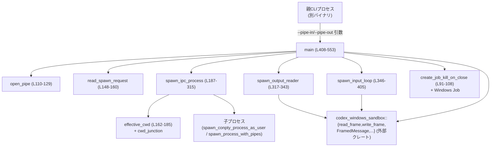
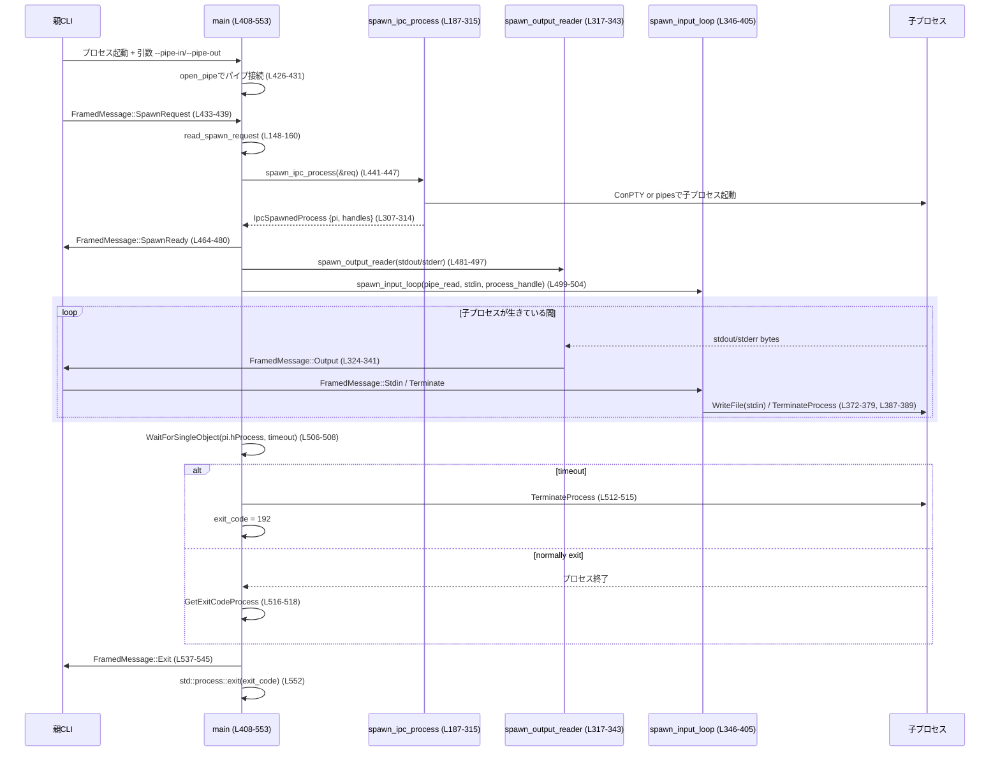

# windows-sandbox-rs/src/elevated/command_runner_win.rs コード解説

## 0. ざっくり一言

Windows 上で「昇格サンドボックス」用のコマンドを実行するための **サブプロセスランナー**です。  
親プロセスと名前付きパイプで IPC を行い、`SpawnRequest` を受け取ってサンドボックス用トークンを作成し、ConPTY またはパイプ経由で子プロセスを起動し、その標準入出力をフレーム化してやり取りします。

---

## 1. このモジュールの役割

### 1.1 概要

このモジュールは、Windows サンドボックスの **elevated** パスで使用される「コマンド実行バイナリ」の実装です（`//!` コメントより: `command_runner_win.rs:L1-L8`）。

- 親 CLI がサンドボックスユーザーとしてこのバイナリを起動し、`--pipe-in` / `--pipe-out` で名前付きパイプ名を渡します（`main`: `command_runner_win.rs:L408-L427`）。
- ランナーは入力パイプからフレーム化された `SpawnRequest` を読み取り（`read_spawn_request`: `L148-L160`）、サンドボックスポリシーに応じた制限トークンを作成して子プロセスを起動します（`spawn_ipc_process`: `L187-L315`）。
- その後、子プロセスの stdout / stderr を Output フレームとして親に送り返し（`spawn_output_reader`: `L317-L343`）、stdin / Terminate フレームを受け取って子プロセスに転送します（`spawn_input_loop`: `L346-L405`）。
- 最終的に、子プロセスの終了コードとタイムアウト有無を `Exit` フレームとして送信し、同じコードで `std::process::exit` します（`main`: `L510-L553`）。

### 1.2 アーキテクチャ内での位置づけ

このファイルは単体のバイナリエントリポイントであり、外部とは以下のコンポーネントを通じて連携します。

- 親 CLI プロセス（別バイナリ）
- `codex_windows_sandbox` クレートの IPC・ポリシー・トークン関連ユーティリティ（`use` 群: `L15-L41`）
- Windows API（ハンドル、ジョブオブジェクト、ConPTY、WaitForSingleObject など: `L50-L71`）
- 補助モジュール `cwd_junction` と `read_acl_mutex`（`L73-L78`）

依存関係の概略を以下の Mermaid 図に示します（本ファイル範囲: `command_runner_win.rs:L1-L553`）。



### 1.3 設計上のポイント

コードから読み取れる設計上の特徴を列挙します。

- **責務の分割**  
  - 起動準備と IPC 全体の制御は `main` が担います（`L408-L553`）。
  - 子プロセス起動まわりは `spawn_ipc_process` に切り出され、ログディレクトリやトークン生成・CWD 判定などを一箇所で処理します（`L187-L315`）。
  - 出力読み取りと入力処理はそれぞれ別スレッド (`spawn_output_reader`, `spawn_input_loop`) によって非同期に行われます（`L317-L405`）。

- **状態管理**  
  - 子プロセスの OS ハンドル (`pi.hProcess`) は `Arc<StdMutex<Option<HANDLE>>>` で共有され、Terminate メッセージ処理から参照可能です（`main` における `process_handle`: `L462-L463`, `spawn_input_loop`: `L348-L350`）。
  - 子プロセス起動時のメタ情報は `IpcSpawnedProcess` 構造体でまとめて返されます（`L82-L89`, `L307-L314`）。

- **エラーハンドリング方針**  
  - ほぼ全体で `anyhow::Result` を使用し、説明的なメッセージで早期 `bail!` しています（例: `read_spawn_request`: `L150-L159`、`spawn_ipc_process`: `L200-L210`）。
  - 重大な初期化エラー（パイプオープンや spawn 失敗）は、親に `Error` フレームを送信した上で `Err` を返し、最終的にプロセスは異常終了します（`send_error`: `L131-L146`, `main`: `L433-L438`, `L441-L446`）。
  - ストリーム読み書き失敗など、実行中のエラーはログ出力してループを終了するものの、親への Error フレームは送っていません（`spawn_output_reader`: `L334-L341`, `spawn_input_loop`: `L357-L363`）。

- **安全性（unsafe 使用）**  
  - Windows API 呼び出し（ハンドル操作、トークン操作、WriteFile など）は `unsafe` ブロックでラップされています（例: `create_job_kill_on_close`: `L91-L108`, `spawn_ipc_process` 内のトークン操作: `L212-L240`, `spawn_input_loop` の WriteFile: `L372-L379`）。
  - `#![allow(unsafe_op_in_unsafe_fn)]` により、unsafe 関数内での unsafe 呼び出しに対する追加警告は抑制されています（`L11`）。

- **プロセスライフサイクル管理**  
  - Windows ジョブオブジェクトに `JOB_OBJECT_LIMIT_KILL_ON_JOB_CLOSE` を設定し、ランナーが終了したときに子プロセスも確実に終了する構成です（`create_job_kill_on_close`: `L96-L107`, `main`: `L455-L460`）。
  - ConPTY 使用時は疑似コンソールハンドルを確実に閉じています（`L520-L522`）。

---

## 2. 主要な機能一覧

このモジュールが提供する主要機能をまとめます。

- 昇格サンドボックス用コマンドランナーのエントリポイント (`pub fn main`)  
- 親プロセスとの名前付きパイプ接続 (`open_pipe`)
- `SpawnRequest` フレームの受信と検証 (`read_spawn_request`)
- サンドボックスポリシーに基づいた制限トークンの作成と子プロセス起動 (`spawn_ipc_process`)
- ACL ヘルパー有無に応じた効果的な作業ディレクトリの決定 (`effective_cwd`)
- 子プロセス stdout/stderr を Output フレームとしてストリーミング (`spawn_output_reader`)
- 親からの stdin / Terminate フレームを子プロセスに転送 (`spawn_input_loop`)
- Windows Job Object による子プロセスの kill-on-close 管理 (`create_job_kill_on_close`)
- エラー発生時の Error フレーム送信 (`send_error`)

---

## 3. 公開 API と詳細解説

### 3.1 型一覧（構造体・定数など）

| 名前 | 種別 | 行範囲 | 役割 / 用途 |
|------|------|--------|-------------|
| `IpcSpawnedProcess` | 構造体 | `command_runner_win.rs:L82-L89` | 子プロセス起動後に必要となるハンドル群とログディレクトリをまとめて保持します。 |
| `WAIT_TIMEOUT` | 定数 (`u32`) | `command_runner_win.rs:L80-L80` | `WaitForSingleObject` がタイムアウトしたときの戻り値（0x00000102）を表します。 |

> 他の主要な型（`SpawnRequest`, `SandboxPolicy`, `FramedMessage` など）は `codex_windows_sandbox` クレート側で定義されており、このチャンクには定義が現れません。

### 3.2 重要関数の詳細

重要な関数 7 件について詳細を説明します。

---

#### `create_job_kill_on_close() -> Result<HANDLE>`  (`unsafe fn`, `L91-L108`)

**概要**

- Windows ジョブオブジェクトを作成し、`JOB_OBJECT_LIMIT_KILL_ON_JOB_CLOSE` を有効化したハンドルを返します。
- これにより、ジョブハンドルが閉じられたときにジョブ内のプロセスが自動で終了するようになります。

**引数**

- なし。

**戻り値**

- `Result<HANDLE>`: 成功時は設定済みのジョブハンドル、失敗時は `anyhow::Error`。

**内部処理の流れ**

1. `CreateJobObjectW` でジョブオブジェクトを作成 (`L92-L94`)。
2. 失敗したら `"CreateJobObjectW failed"` で `Err` を返す (`L93-L95`)。
3. `JOBOBJECT_EXTENDED_LIMIT_INFORMATION` をゼロ初期化し、`LimitFlags` に `JOB_OBJECT_LIMIT_KILL_ON_JOB_CLOSE` をセット (`L96-L97`)。
4. `SetInformationJobObject` を呼び出し、拡張リミット情報をジョブに設定 (`L98-L103`)。
5. 失敗したら `"SetInformationJobObject failed"` で `Err` を返す (`L104-L106`)。
6. 成功した場合、ジョブハンドル `h` を返す (`L107`).

**Examples（使用例）**

```rust
// 子プロセスを kill-on-close で管理するジョブオブジェクトを作成する例
unsafe {
    let job = create_job_kill_on_close()?;                     // ジョブハンドルを作成
    // 子プロセス h_process をジョブに参加させる（Windows API）
    windows_sys::Win32::System::JobObjects::AssignProcessToJobObject(job, h_process);
    // ... 処理 ...
    windows_sys::Win32::Foundation::CloseHandle(job);          // ジョブを閉じるとジョブ内のプロセスも終了
}
```

**Errors / Panics**

- `CreateJobObjectW` が 0 を返した場合: `"CreateJobObjectW failed"`（`L92-L95`）。
- `SetInformationJobObject` が 0 を返した場合: `"SetInformationJobObject failed"`（`L98-L106`）。
- `panic!` は使用されていません。

**Edge cases（エッジケース）**

- ジョブオブジェクト作成に失敗した場合: その後の処理は行われず `Err` になります。
- 制限情報の設定に失敗した場合: ジョブハンドル `h` はこの関数内では閉じていないため、呼び出し側から見るとエラーが返るものの OS レベルではハンドルリークが起こり得ます（`L104-L107`）。

**使用上の注意点**

- `unsafe` 関数であり、返された `HANDLE` は呼び出し側で `CloseHandle` する責任があります。
- エラー時にジョブハンドルが閉じられていない可能性があるため、大量に失敗が続くケースでは OS リソース消費に注意が必要です。

---

#### `read_spawn_request(reader: &mut File) -> Result<SpawnRequest>` (`L148-L160`)

**概要**

- 入力パイプから最初のフレームを読み取り、プロトコルバージョンを検証した上で `SpawnRequest` ペイロードを取り出します。
- プロトコルが想定と違う場合やフレームが無い場合はエラーとします。

**引数**

| 引数名 | 型 | 説明 |
|--------|----|------|
| `reader` | `&mut File` | 親からの IPC フレームを読み込むためのファイル（名前付きパイプ）ハンドル。 |

**戻り値**

- `Result<SpawnRequest>`: 正常時は `SpawnRequest`（所有権付き）を返し、エラー時は `anyhow::Error` を返します。

**内部処理の流れ**

1. `read_frame(reader)?` で最初のフレームを読み込む（`L150`）。
2. `None` だった場合は `"runner: pipe closed before spawn_request"` で `bail!`（`L150-L152`）。
3. `msg.version` が 1 以外なら `"runner: unsupported protocol version {}`" で `bail!`（`L153-L155`）。
4. `msg.message` が `Message::SpawnRequest { payload }` なら、`*payload` を返す（`L156-L158`）。
5. それ以外のメッセージであれば `"expected spawn_request, got {other:?}"` で `bail!`（`L156-L159`）。

**Examples（使用例）**

```rust
use std::fs::File;
use windows_sandbox_rs_elevated::command_runner_win::read_spawn_request;

// パイプハンドル h_pipe_in が既にあると仮定
let mut pipe_read = unsafe { File::from_raw_handle(h_pipe_in as _) };  // raw HANDLE から File を生成
let spawn_req = read_spawn_request(&mut pipe_read)?;                   // 最初のフレームとして SpawnRequest を取得
```

**Errors / Panics**

- パイプが閉じられていてフレームが読めない場合: `"runner: pipe closed before spawn_request"`（`L150-L152`）。
- プロトコルバージョンが 1 以外の場合: `"runner: unsupported protocol version {}`"（`L153-L155`）。
- 最初のメッセージが SpawnRequest 以外の場合: `"runner: expected spawn_request, got {other:?}"`（`L156-L159`）。

**Edge cases**

- 親が何も送らずにパイプを閉じた場合: 直ちにエラーになります。
- 親が複数のフレームを送信する前提はなく、最初の 1 フレームだけが `SpawnRequest` であることを前提としています。

**使用上の注意点**

- 呼び出し側（本ファイルでは `main`）は、エラー発生時に親へ Error フレームを送るなどのハンドリングを行っています（`L433-L438`）。
- プロトコルバージョンは固定値 1 にハードコードされているため、将来のバージョンアップ時にはここを変更する必要があります。

---

#### `effective_cwd(req_cwd: &Path, log_dir: Option<&Path>) -> PathBuf` (`L162-L185`)

**概要**

- 要求された CWD (`req_cwd`) と ACL ヘルパーの状態に基づいて、実際に子プロセスに設定する作業ディレクトリを決定します。
- ACL ヘルパーが稼働している場合は、`cwd_junction` モジュールを使ってジャンクションを作成し、そのパスを返します。

**引数**

| 引数名 | 型 | 説明 |
|--------|----|------|
| `req_cwd` | `&Path` | `SpawnRequest` で指定された作業ディレクトリ。 |
| `log_dir` | `Option<&Path>` | ログ出力先ディレクトリ。`log_note` のために使用されます。 |

**戻り値**

- `PathBuf`: 実際に子プロセスに渡す CWD パス。

**内部処理の流れ**

1. `read_acl_mutex::read_acl_mutex_exists()` を呼び出し、ACL ヘルパーの存在をチェック（`L164-L165`）。
2. 成功した場合: 返り値 `exists` を `use_junction` として使用（`L164-L165`）。
3. エラーの場合: ログに `"assuming read ACL helper is running"` と出力し、`use_junction = true` とする（`L166-L174`）。
4. `use_junction` が `true` の場合:
   - `log_note` で `"using junction CWD"` を出力（`L176-L180`）。
   - `cwd_junction::create_cwd_junction(req_cwd, log_dir)` の結果を使用し、`None` の場合は `req_cwd` をそのまま返す（`L181`）。
5. `use_junction` が `false` の場合: `req_cwd.to_path_buf()` を返す（`L182-L184`）。

**Examples（使用例）**

```rust
use std::path::Path;
use windows_sandbox_rs_elevated::command_runner_win::effective_cwd;

let requested = Path::new("C:\\work\\project");
let log_dir = Some(Path::new("C:\\logs\\sandbox"));
let cwd = effective_cwd(requested, log_dir.as_deref());  // ACLヘルパー状態に応じたCWDが返る
```

**Errors / Panics**

- この関数自体は `Result` を返さず、エラーは内部でログ出力にとどまります（`L166-L174`）。
- `panic!` を明示的に使用していません。

**Edge cases**

- `read_acl_mutex_exists` がエラーになった場合でも、**ヘルパーは稼働しているものと仮定**し、ジャンクションを使う側に倒します（`L166-L174`）。  
  これは「安全側（より閉じた動作）」に倒すためのポリシーと解釈できます。
- `cwd_junction::create_cwd_junction` が `None` を返した場合、要求された CWD にフォールバックします（`L181`）。
- `log_dir` が `None` の場合でも `log_note` は呼ばれますが、その挙動は `log_note` の実装依存です。

**使用上の注意点**

- ジャンクション作成ロジックや ACL ヘルパーの挙動は `cwd_junction` / `read_acl_mutex` モジュールに依存しており、このチャンクには実装が現れません。
- CWD がネットワークドライブや特殊フォルダであった場合の挙動は不明です（このコードからは判定できません）。

---

#### `spawn_ipc_process(req: &SpawnRequest) -> Result<IpcSpawnedProcess>` (`L187-L315`)

**概要**

- `SpawnRequest` の内容をもとにサンドボックスポリシーを解析し、適切な制限トークンと CWD を設定して子プロセスを起動します。
- `req.tty` に応じて ConPTY または標準パイプ経由で子プロセスを起動し、必要なハンドル群を `IpcSpawnedProcess` にまとめて返します。

**引数**

| 引数名 | 型 | 説明 |
|--------|----|------|
| `req` | `&SpawnRequest` | 起動するコマンド、環境変数、ポリシー、CWD、CAP SID 等を含むリクエスト。 |

**戻り値**

- `Result<IpcSpawnedProcess>`: 成功時は起動した子プロセスの情報、失敗時は `anyhow::Error`。

**内部処理の流れ（要約）**

1. ログディレクトリ (`log_dir`) を設定し、現在ユーザーのプロファイルディレクトリを隠す (`hide_current_user_profile_dir`)（`L188-L189`）。
2. 起動情報をログに記録 (`log_note`)（`L190-L198`）。
3. `parse_policy` でポリシー文字列を解析し、`SandboxPolicy` を取得（`L200`）。
4. `req.cap_sids` をループし、`convert_string_sid_to_sid` で Windows SID に変換。失敗したら `bail!`（`L201-L207`）。
5. SID リストが空なら `bail!("runner: empty capability SID list")`（`L208-L210`）。
6. `get_current_token_for_restriction` でベーストークンを取得（`L212`）。
7. ポリシーに応じて、読み取り専用または workspace 書き込み可能な制限トークンを作成（`L213-L222`）。  
   - `DangerFullAccess` と `ExternalSandbox` は `unreachable!()` で扱われています（`L223-L225`）。
8. トークン作成後:
   - `CloseHandle(base)` でベーストークンを閉じる（`L230`）。
   - 使用する `psid_to_use` と全 `cap_psids` に対し `allow_null_device` を呼び出す（`L231-L234`）。
   - すべての SID を `LocalFree` で解放（`L235-L239`）。
9. `effective_cwd` で実際の CWD を決定し、ログに出力（`L242-L250`）。
10. `req.tty` が `true` の場合:
    - `spawn_conpty_process_as_user` で ConPTY 経由で子プロセスを起動（`L253-L261`）。
    - `conpty.into_raw()` で `hpc`（ConPTY ハンドル）、stdin 用 `input_write`、stdout 用 `output_read` を取得（`L262-L263`）。
    - `req.stdin_open` に応じて `stdin_handle` を設定し、不要な場合は `CloseHandle`（`L264-L271`）。
    - stderr は `INVALID_HANDLE_VALUE` に設定（`L272-L277`）。
11. `req.tty` が `false` の場合:
    - `StdinMode` を `Open`/`Closed` から選択（`L279-L283`）。
    - `spawn_process_with_pipes` で子プロセスを標準パイプ付きで起動（`L284-L292`）。
    - stdout / stderr / stdin のハンドルを `PipeSpawnHandles` から取得し、stderr がない場合は `INVALID_HANDLE_VALUE`（`L293-L300`）。
12. 使い終わった制限トークン `h_token` を `CloseHandle`（`L303-L305`）。
13. `IpcSpawnedProcess` を構築して返却（`L307-L314`）。

**Examples（使用例）**

```rust
use codex_windows_sandbox::SpawnRequest;
use windows_sandbox_rs_elevated::command_runner_win::spawn_ipc_process;

// SpawnRequest を事前に構築しておく（詳細なフィールドはこのチャンクには現れません）
let req: SpawnRequest = /* ... */;

let spawned = spawn_ipc_process(&req)?;                    // 子プロセスを起動
let pi = spawned.pi;                                      // PROCESS_INFORMATION
let stdout = spawned.stdout_handle;                       // stdoutハンドル
let stderr = spawned.stderr_handle;                       // stderrハンドル（ない場合 INVALID_HANDLE_VALUE）
```

**Errors / Panics**

- `parse_policy` 失敗時: `"parse policy_json_or_preset"` の文脈付き `anyhow::Error`（`L200`）。
- `convert_string_sid_to_sid` 失敗時: `"ConvertStringSidToSidW failed for capability SID"`（`L203-L205`）。
- `cap_psids` が空のとき: `"runner: empty capability SID list"`（`L208-L210`）。
- `get_current_token_for_restriction` やトークン作成関数が `Err` を返した場合: そのエラーがそのまま伝播します（`L212-L222`, `L228`）。
- `SandboxPolicy::DangerFullAccess` または `ExternalSandbox` を渡した場合: `unreachable!()` が実行され、`panic!` となります（`L223-L225`）。
- `spawn_conpty_process_as_user` / `spawn_process_with_pipes` 失敗時: それぞれのエラーがそのまま `Err` として返ります（`L254-L261`, `L284-L292`）。

**Edge cases**

- `cap_sids` が 1 つだけのケース: `psid_to_use` と `cap_psids[0]` は同一となります（`L217-L221`）。
- トークン作成に失敗すると、`base` トークンは `CloseHandle` される前に `?` で早期リターンされるため、ベーストークンのハンドルがリークする可能性があります（`L212-L228`）。
- `DangerFullAccess` / `ExternalSandbox` はこの経路では利用しない前提ですが、ポリシー側の変更でここに到達するとランタイムパニックになります（`L223-L225`）。

**使用上の注意点**

- `SpawnRequest` 側で `cap_sids` を必ず 1 つ以上指定する必要があります（`L208-L210`）。
- この関数は Windows ハンドルの所有権を呼び出し元に移します。呼び出し元（`main`）は `PROCESS_INFORMATION` や各種ハンドルを必ず適切にクローズしています（`L520-L530`）。
- 追加のポリシー（`SandboxPolicy` の新 variant）を定義する場合、この関数の `match &policy` 節にも対応を追加する必要があります。

---

#### `spawn_output_reader(writer: Arc<StdMutex<File>>, handle: HANDLE, stream: OutputStream, log_dir: Option<PathBuf>) -> JoinHandle<()>` (`L317-L343`)

**概要**

- 子プロセスの stdout / stderr ハンドルからデータを読み取り、`Output` フレームとして親に送信するスレッドを起動します。
- フレームのペイロードは Base64 でエンコードされます。

**引数**

| 引数名 | 型 | 説明 |
|--------|----|------|
| `writer` | `Arc<StdMutex<File>>` | 親への出力パイプ（書き込み側）を保護する Mutex 付き `File`。 |
| `handle` | `HANDLE` | 子プロセスの stdout または stderr に対応する読み取りハンドル。 |
| `stream` | `OutputStream` | `Stdout` / `Stderr` の別を示す列挙体。 |
| `log_dir` | `Option<PathBuf>` | ログ出力用のディレクトリ。 |

**戻り値**

- `std::thread::JoinHandle<()>`: 読み取りループを実行するスレッドのハンドル。

**内部処理の流れ**

1. `read_handle_loop(handle, move |chunk| { ... })` を呼び出し、`chunk` 単位でハンドルからデータを読み取る（`L324-L325`）。
2. 各チャンクに対して:
   - `FramedMessage::Output` を構築し、`encode_bytes(chunk)` を `data_b64` として格納（`L325-L331`）。
   - `writer.lock()` でパイプの `File` に対する Mutex ロックを取得し、`write_frame` でフレームを書き込み（`L334-L336`）。
   - 書き込みエラー時にはログに `"runner output write failed: {err}"` を出力し、ループは継続（`L337-L341`）。

**Examples（使用例）**

```rust
use std::{fs::File, sync::{Arc, Mutex as StdMutex}};
use windows_sandbox_rs_elevated::command_runner_win::spawn_output_reader;

let pipe_write = Arc::new(StdMutex::new(/* File::from_raw_handle(...) */));
let child_stdout: windows_sys::Win32::Foundation::HANDLE = /* ... */;
let log_dir = Some(std::path::PathBuf::from("C:\\logs"));

// 子プロセスstdoutをOutput::Stdoutフレームとしてストリーミング
let out_thread = spawn_output_reader(
    Arc::clone(&pipe_write),
    child_stdout,
    codex_windows_sandbox::OutputStream::Stdout,
    log_dir,
);
```

**Errors / Panics**

- `write_frame` が `Err` を返した場合はログに記録されますが、エラーは呼び出し元に伝播しません（`L334-L341`）。
- `read_handle_loop` 内でのエラー処理はこのファイルには現れないため不明です。
- `panic!` は使用していません。

**Edge cases**

- `writer.lock()` が失敗（Mutex が毒状態）した場合、if let の条件が満たされず、そのチャンクは捨てられます（`L334-L336`）。
- 出力パイプが親側で閉じられている場合、`write_frame` はエラーとなり、ログが増え続ける可能性があります。

**使用上の注意点**

- 戻り値の `JoinHandle` は `main` で `join()` されています（`L533-L535`）ので、プロセス終了前に出力スレッドは終了します。
- stderr 用スレッドは stderr ハンドルが `INVALID_HANDLE_VALUE` のときには作られません（`L488-L497`）。

---

#### `spawn_input_loop(mut reader: File, stdin_handle: Option<HANDLE>, process_handle: Arc<StdMutex<Option<HANDLE>>>, log_dir: Option<PathBuf>) -> JoinHandle<()>` (`L346-L405`)

**概要**

- 親からのフレームを読み取り、`Stdin` フレームを子プロセスの stdin に書き込み、`Terminate` フレームを受けたら子プロセスを終了させます。
- その他のメッセージ型は無視します。

**引数**

| 引数名 | 型 | 説明 |
|--------|----|------|
| `reader` | `File` | 親からの入力パイプ（読み取り側）。所有権ごとスレッドにムーブされます。 |
| `stdin_handle` | `Option<HANDLE>` | 子プロセスの stdin 書き込みハンドル。`None` の場合は stdin を無視します。 |
| `process_handle` | `Arc<StdMutex<Option<HANDLE>>>` | `Terminate` メッセージ時に使用する子プロセスハンドル。 |
| `log_dir` | `Option<PathBuf>` | ログ出力先。 |

**戻り値**

- `std::thread::JoinHandle<()>`: 入力ループを実行するスレッドのハンドル。

**内部処理の流れ**

1. `std::thread::spawn(move || { ... })` で新しいスレッドを起動（`L352`）。
2. ループ内で `read_frame(&mut reader)` を繰り返し呼び出す（`L354-L364`）。
   - `Ok(Some(v))` の場合: `msg` として扱う（`L354-L355`）。
   - `Ok(None)` の場合: 親がパイプを閉じたとみなし、ループを抜ける（`L356`）。
   - `Err(err)` の場合: ログを出力してループを抜ける（`L357-L363`）。
3. `msg.message` に対する `match`（`L365-L396`）:
   - `Message::Stdin { payload }`:
     - `decode_bytes` で Base64 デコードし、失敗した場合は `continue`（`L367-L369`）。
     - `stdin_handle` が `Some(handle)` なら、`WriteFile` で子プロセス stdin に書き込む（`L370-L380`）。
   - `Message::Terminate { .. }`:
     - `process_handle.lock()` に成功し、`Some(handle)` が入っていれば `TerminateProcess` を呼ぶ（`L383-L390`）。
   - その他のメッセージ種別 (`SpawnRequest`, `SpawnReady`, `Output`, `Exit`, `Error`) はすべて無視（空ブロック）（`L392-L396`）。
4. ループ終了後、`stdin_handle` が `Some` なら `CloseHandle` でクローズ（`L399-L402`）。

**Examples（使用例）**

```rust
use std::{fs::File, sync::{Arc, Mutex as StdMutex}};
use windows_sandbox_rs_elevated::command_runner_win::spawn_input_loop;

let pipe_read = /* File::from_raw_handle(...) */;               // 親からの入力パイプ
let stdin_handle = Some(/* 子プロセス stdin HANDLE */);
let process_handle = Arc::new(StdMutex::new(Some(/* hProcess */)));
let log_dir = Some(std::path::PathBuf::from("C:\\logs"));

// 親からの Stdin / Terminate フレームを処理するスレッドを起動
let _input_thread = spawn_input_loop(pipe_read, stdin_handle, Arc::clone(&process_handle), log_dir);
```

**Errors / Panics**

- `read_frame` が `Err` の場合: ログ出力後にループを終了します（`L357-L363`）。
- `WriteFile` や `TerminateProcess` の戻り値は `_ =` で捨てているため、エラーはログにも残りません（`L372-L379`, `L387-L389`）。
- `panic!` は使用していません。

**Edge cases**

- `stdin_handle = None` のとき、`Stdin` メッセージはすべて無視されます（`L370-L381`）。
- `decode_bytes` 失敗時はメッセージが静かに破棄されます（`L367-L369`）。
- `process_handle` の中身は `Some(hProcess)` のままで、子プロセス終了後に明示的に `None` へ変更していません。そのため、子プロセス終了後に `Terminate` メッセージが到着した場合、既に閉じられたハンドルに対して `TerminateProcess` を呼ぶ可能性があります（`L384-L390`, `L523-L528`）。

**使用上の注意点**

- `main` では返り値の `JoinHandle` を変数 `_input_thread` に束縛するのみで `join()` していません（`L499-L504`）。プロセス終了時に OS がスレッドを強制終了する前提と思われますが、厳密なシャットダウンを行いたい場合は呼び出し側で `join()` を検討する必要があります。
- Terminate メッセージは通常、子プロセスがまだ生きている間に送ることが前提です。

---

#### `main() -> Result<()>` (`pub`, `L408-L553`)

**概要**

- このバイナリのエントリポイントです。
- コマンドライン引数から名前付きパイプ名を取得し、親と IPC を確立して子プロセスを起動し、入出力を中継し、終了コードをフレームとプロセス終了コードとして返します。

**引数**

- なし（`std::env::args()` を直接使用）。

**戻り値**

- `Result<()>`: 成功時に `Ok(())` を返しますが、関数末尾で `std::process::exit(exit_code)` を呼ぶため、呼び出し側に制御が戻ることはありません（`L552` ）。

**内部処理の流れ**

1. コマンドライン引数から `--pipe-in=...` と `--pipe-out=...` をパース（`L409-L417`）。
2. どちらかが指定されていなければ `bail!`（`L419-L424`）。
3. `open_pipe` でそれぞれの名前付きパイプに接続し、`File::from_raw_handle` で `File` にラップ（`L426-L431`）。
4. `read_spawn_request` で最初のフレームから `SpawnRequest` を取得（`L433-L439`）。
   - エラー時は `send_error("spawn_failed", ...)` を送信して終了（`L433-L438`）。
5. `spawn_ipc_process` で子プロセスを起動（`L441-L447`）。
   - エラー時は同様に `send_error("spawn_failed", ...)` を送信して終了（`L441-L446`）。
6. `create_job_kill_on_close().ok()` でジョブオブジェクトを作成し、成功した場合は子プロセスをジョブに割り当て（`L455-L460`）。
7. `process_handle = Arc::new(StdMutex::new(Some(pi.hProcess)))` を作成し、`spawn_input_loop` に渡すために共有（`L462-L463`, `L499-L503`）。
8. 親に `SpawnReady` フレームを送信（`L464-L480`）。
9. `spawn_output_reader` を呼び出し、stdout / stderr 用の出力スレッドを起動（`L481-L497`）。
10. `spawn_input_loop` を呼んで入力スレッドを起動（`L499-L504`）。
11. タイムアウト値を `req.timeout_ms` から取得し、`WaitForSingleObject` でプロセス終了またはタイムアウトを待機（`L506-L508`）。
12. タイムアウト時:
    - `TerminateProcess` で子プロセスを終了させ、`exit_code = 128 + 64` とする（`L512-L515`）。
13. 正常終了時:
    - `GetExitCodeProcess` で終了コードを取得（`L516-L518`）。
14. ConPTY ハンドル、スレッドハンドル、プロセスハンドル、ジョブハンドルを順にクローズ（`L520-L530`）。
15. 出力スレッドを `join()` し、必要ならエラースレッドも `join()`（`L533-L535`）。
16. `Exit` フレームを構築して親に送信。書き込み失敗時はログに記録（`L537-L550`）。
17. `std::process::exit(exit_code)` で同じ終了コードを返してプロセス終了（`L552`）。

**Examples（使用例）**

この関数はバイナリのエントリポイントとして `cargo` などから直接呼び出されることを想定しているため、通常は明示的に呼び出しません。  
テスト用に直接呼びたい場合の擬似コードは以下の通りです。

```rust
fn main() -> anyhow::Result<()> {
    // 親側で名前付きパイプを作成し、その名前を runner バイナリに渡して起動する
    std::process::Command::new("windows-sandbox-runner.exe")
        .arg("--pipe-in=\\\\.\\pipe\\sandbox_in")
        .arg("--pipe-out=\\\\.\\pipe\\sandbox_out")
        .spawn()?;                              // 実際にはパイプの作成やフレーム送信が必要

    Ok(())
}
```

**Errors / Panics**

- `--pipe-in` / `--pipe-out` が指定されていない場合: それぞれ `"runner: no pipe-in provided"`, `"runner: no pipe-out provided"` で `bail!`（`L419-L424`）。
- パイプオープン失敗時: `open_pipe` のエラーがそのまま伝播（`L426-L427`, `L110-L129`）。
- `SpawnRequest` 受信失敗時・子プロセス起動失敗時: `"spawn_failed"` コードの Error フレームが送信され、その後 `Err` が返ります（`L433-L438`, `L441-L446`）。
- `SpawnReady` フレーム送信失敗時: エラーログを出しつつ、Error フレームを送り、`Err` を返します（`L472-L480`）。
- `Exit` フレーム送信失敗時: ログ記録のみで、`Result` には反映されません（`L546-L550`）。
- `panic!` は明示的には使用されていませんが、内部で `spawn_ipc_process` の `unreachable!` が発火するとパニックにつながります（`L223-L225`）。

**Edge cases**

- `req.timeout_ms` が `None` の場合は `INFINITE` が指定され、タイムアウトなしで待機します（`L506`）。
- `req.timeout_ms` の型はこのファイルからは分かりませんが、`as u32` キャストが行われているため、非常に大きな値の場合は `u32` に切り詰められる可能性があります（`L506`）。
- タイムアウト時の `exit_code` は `128 + 64 = 192` に固定されています（`L514-L515`）。
- 入力スレッド `_input_thread` は `join()` されていませんが、プロセス終了時に OS が強制終了します（`L499-L504`, `L552`）。

**使用上の注意点**

- このランナーを正しく利用するためには、親側で `FramedMessage` プロトコルに従ったフレーム送受信を行う必要があります（`Message` enum の定義はこのチャンクには現れません）。
- 親は少なくとも以下の順序でメッセージを送受信する契約を守る必要があります:
  1. `SpawnRequest` を送信
  2. `SpawnReady` を受信
  3. 必要に応じて `Stdin` / `Terminate` を送信
  4. `Output` / `Exit` / `Error` を受信

---

### 3.3 その他の関数

| 関数名 | 行範囲 | 役割（1 行） |
|--------|--------|--------------|
| `open_pipe(name: &str, access: u32) -> Result<HANDLE>` | `command_runner_win.rs:L110-L129` | 名前付きパイプに接続するため `CreateFileW` を呼び出し、失敗時には `GetLastError` をエラーメッセージに含めて返します。 |
| `send_error(writer: &Arc<StdMutex<File>>, code: &str, message: String) -> Result<()>` | `command_runner_win.rs:L131-L146` | 親に `Error` フレームを送信します。Mutex ロック獲得に失敗した場合は何も送信せず `Ok(())` を返します。 |

---

## 4. データフロー

ここでは、典型的な「子プロセス起動から終了まで」のデータフローを示します。

### 4.1 処理の要点

1. 親 CLI が `--pipe-in` / `--pipe-out` を指定してランナーを起動し、`SpawnRequest` フレームを入力パイプに送る。
2. ランナー（`main`）は `SpawnRequest` を読み取って `spawn_ipc_process` を呼び、子プロセスを起動する。
3. `spawn_output_reader` が子プロセス stdout/stderr を読み取り、`Output` フレームとして親に送信する。
4. `spawn_input_loop` が親からの `Stdin` / `Terminate` フレームを処理し、子プロセスの stdin または Terminate 操作に反映する。
5. 子プロセス終了後、ランナーは `Exit` フレームを送信し、自身も同じ終了コードで終了する。

### 4.2 シーケンス図



---

## 5. 使い方（How to Use）

### 5.1 基本的な使用方法

実際には、このモジュールはバイナリとしてビルドされ、親 CLI から起動されます。親側の典型的なフロー（擬似コード）は次の通りです。

```rust
use std::process::Command;

fn spawn_runner() -> anyhow::Result<()> {
    // 親側で名前付きパイプを作成しておく（実装はこのチャンクには現れません）
    let pipe_in_name = r"\\.\pipe\codex_sandbox_in";
    let pipe_out_name = r"\\.\pipe\codex_sandbox_out";

    // ランナーバイナリを起動し、パイプ名を渡す
    let mut child = Command::new("command_runner_win.exe")
        .arg(format!("--pipe-in={}", pipe_in_name))
        .arg(format!("--pipe-out={}", pipe_out_name))
        .spawn()?;                                      // 親側から見た子 = ランナープロセス

    // 親は pipe_out_name から SpawnReady/Output/Exit を読み、
    // pipe_in_name に SpawnRequest/Stdin/Terminate を書き込む
    // （FramedMessage プロトコルに従う）

    let status = child.wait()?;
    println!("runner exited with: {}", status);
    Ok(())
}
```

ランナー内部では `main` がこのパイプを `open_pipe` で開き（`L426-L427`）、`read_spawn_request` → `spawn_ipc_process` の順で処理を進めます。

### 5.2 よくある使用パターン

1. **非 TTY モード（パイプベース）**

   - `SpawnRequest::tty = false` の場合、`spawn_process_with_pipes` を利用して子プロセスを起動します（`L278-L292`）。
   - stdout/stderr は別々のパイプとして `OutputStream::Stdout` / `Stderr` で区別されます（`L294-L300`, `L481-L497`）。

2. **TTY モード（ConPTY ベース）**

   - `SpawnRequest::tty = true` の場合、`spawn_conpty_process_as_user` を利用して疑似コンソール経由で子プロセスを起動します（`L253-L261`）。
   - この場合、stderr は `INVALID_HANDLE_VALUE` として扱われ、stdout 側に統合されている可能性があります（`L272-L277`）。

3. **タイムアウト付き実行**

   - `SpawnRequest::timeout_ms` が `Some(ms)` の場合、その値を `WaitForSingleObject` のタイムアウトとして使用します（`L506-L508`）。
   - タイムアウト発生時は exit_code=192 (`128 + 64`) として `Exit` フレームが送信されます（`L512-L515`, `L537-L543`）。

### 5.3 よくある間違い

```rust
// 間違い例: pipe引数を付けずに実行
// 実行時に "runner: no pipe-in provided" などでエラーになる
std::process::Command::new("command_runner_win.exe")
    .spawn()?;

// 正しい例: --pipe-in と --pipe-out を必ず指定する
std::process::Command::new("command_runner_win.exe")
    .arg("--pipe-in=\\\\.\\pipe\\sandbox_in")
    .arg("--pipe-out=\\\\.\\pipe\\sandbox_out")
    .spawn()?;
```

```rust
// 間違い例: 最初にSpawnRequest以外のメッセージを送る
// ランナー側 read_spawn_request が "expected spawn_request" エラーになる

// 正しい例: 必ず最初のフレームとして SpawnRequest を送る
send_framed_message(Message::SpawnRequest { payload: /* ... */ });
// その後に SpawnReady を待ち、Stdin/Terminate を送る
```

### 5.4 使用上の注意点（まとめ）

- **プロトコル順序の契約**
  - 最初のフレームは必ず `SpawnRequest` でなければなりません（`read_spawn_request`: `L148-L160`）。
  - `SpawnReady` 受信後にのみ `Stdin` / `Terminate` を送るのが自然です。

- **ハンドル管理**
  - 子プロセスの `HANDLE` や ConPTY ハンドルは `main` 内でクローズされています（`L520-L530`）。
  - `spawn_input_loop` 側は `process_handle` 内の `HANDLE` 値がクローズ後も残るため、終了後に Terminate を送ると `TerminateProcess` に無効ハンドルを渡す可能性があります（`L384-L390`）。

- **セキュリティ / ポリシー**
  - `SandboxPolicy::DangerFullAccess` や `ExternalSandbox` は `unreachable!()` とされており、このランナー経路で使用しない前提です（`L223-L225`）。  
    ポリシー定義を変更するときは、この前提が崩れないよう注意が必要です。
  - capability SID が空の場合は即エラーとなります (`L208-L210`)。サンドボックスの権限設計に合わせた SID を正しく設定する必要があります。

- **エラーログと監視**
  - ストリーム I/O エラーは `log_note` で記録されるのみで、親への Error フレームは送られません（`spawn_output_reader`: `L334-L341`, `spawn_input_loop`: `L357-L363`）。
  - 運用時はログディレクトリ (`req.codex_home` 等) を監視することでトラブルシュートしやすくなります（`L187-L198`, `L242-L250`）。

---

## 6. 変更の仕方（How to Modify）

### 6.1 新しい機能を追加する場合

例: 新しいメッセージ種別を追加し、親からランナーへの制御コマンドを増やしたい場合。

1. **メッセージ定義の追加**
   - `codex_windows_sandbox::Message` enum に新しい variant を追加します（このチャンクには定義がないため、別ファイルでの作業になります）。

2. **入力処理への対応**
   - `spawn_input_loop` の `match msg.message` 部分（`L365-L396`）に新 variant を追加し、具体的な処理を実装します。

3. **出力処理への対応**
   - 親に返す必要がある場合は、`spawn_output_reader` または `main` から適切なタイミングで新しいメッセージを送信するよう拡張します。

4. **親側の実装**
   - 親 CLI 側でも新しいメッセージ種別を理解し、送受信できるように更新します。

### 6.2 既存の機能を変更する場合

- **ポリシー処理 (`SandboxPolicy`) を変更したい場合**
  - `spawn_ipc_process` 内の `match &policy`（`L213-L225`）を確認し、必要に応じて分岐を追加・変更します。
  - トークン生成関数 (`create_readonly_token_with_caps_from`, `create_workspace_write_token_with_caps_from`) の契約を守る必要があります。

- **タイムアウト挙動を変更したい場合**
  - タイムアウト判定と exit code 設定は `main` の `WaitForSingleObject` 周辺に集中しています（`L506-L518`）。
  - `exit_code = 128 + 64`（`L514-L515`）を変更することで、タイムアウト時の終了コードを調整できます。

- **CWD 判定ロジックを変更したい場合**
  - `effective_cwd`（`L162-L185`）と `cwd_junction` / `read_acl_mutex` モジュールを確認します。
  - ACL ヘルパーがエラーのときに「動いている前提」に倒す挙動を変えたい場合、`Err(err)` ブランチ（`L166-L174`）を調整します。

- **影響範囲の確認**
  - 各変更は、`main` → `spawn_ipc_process` → `spawn_output_reader` / `spawn_input_loop` という呼び出し関係で連鎖します（図: セクション 1.2, 4.2）。
  - テストや親 CLI とのプロトコル整合性を必ず確認する必要があります。  
    テストコードはこのチャンクには現れないため、別ディレクトリを参照する必要があります。

---

## 7. 関連ファイル

このモジュールと密接に関係するファイル・モジュールは次の通りです。

| パス | 役割 / 関係 |
|------|------------|
| `windows-sandbox-rs/src/elevated/cwd_junction.rs` | `effective_cwd` から呼び出され、ACL ヘルパー稼働時に使用する CWD ジャンクションを作成します（`command_runner_win.rs:L73-L74, L181`）。 |
| `windows-sandbox-rs/src/read_acl_mutex.rs` | ACL ヘルパーの稼働判定に使用されます（`read_acl_mutex::read_acl_mutex_exists`, `L76-L78, L164-L165`）。 |
| `codex_windows_sandbox` クレート（外部） | IPC フレーム (`FramedMessage`, `Message`)、ポリシー解析 (`parse_policy`)、トークン操作・プロセス起動 (`spawn_conpty_process_as_user`, `spawn_process_with_pipes` など) など、本モジュールの基盤機能を提供します（`L15-L41`, `L254-L261`, `L284-L292`）。 |

> テストコードやさらに詳細なエラーハンドリングはこのチャンクには現れません。必要に応じて、リポジトリ全体の `tests` ディレクトリや `codex_windows_sandbox` クレートの実装を参照する必要があります。
