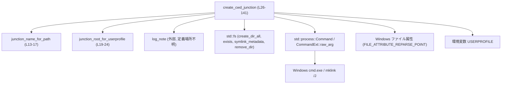
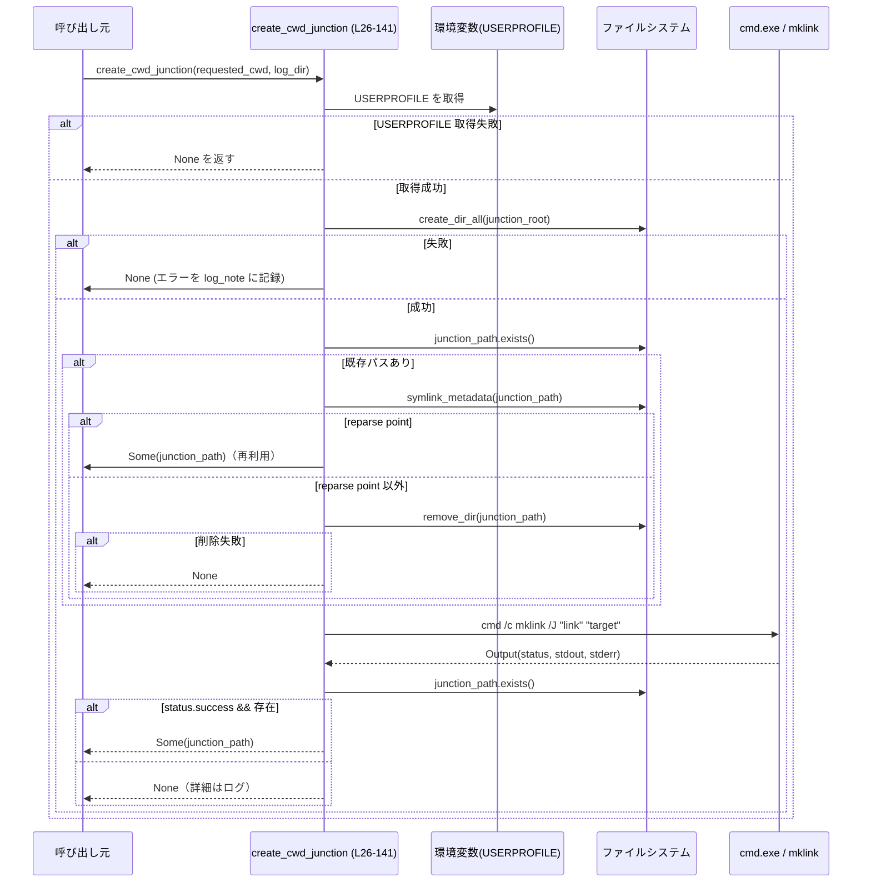

# windows-sandbox-rs/src/elevated/cwd_junction.rs

## 0. ざっくり一言

Windows 環境で、指定された作業ディレクトリ (`requested_cwd`) への **ディレクトリジャンクション（reparse point）** をユーザーごとの専用ディレクトリ配下に作成・再利用するユーティリティです（根拠: `cwd_junction.rs:L1,L19-24,L26-41`）。

---

## 1. このモジュールの役割

### 1.1 概要

- このモジュールは **Windows 上で sandbox 用の「現在の作業ディレクトリ (CWD)」ジャンクションを用意する** ための機能を提供します（根拠: `create_cwd_junction` の引数名とコメント `cwd_junction.rs:L26,L90-92`）。
- `USERPROFILE` 配下に `.codex/.sandbox/cwd` というルートディレクトリを作成し（根拠: `cwd_junction.rs:L19-24,L27-30`）、そこに `requested_cwd` から計算したハッシュ値を名前とするジャンクションを作ります（根拠: `cwd_junction.rs:L13-17,L40`）。
- すでに同じ場所に reparse point が存在する場合は、それを再利用して高速化します（根拠: コメントと分岐 `cwd_junction.rs:L40-51`）。

### 1.2 アーキテクチャ内での位置づけ

このファイル単体で見える依存関係は次の通りです。

- 内部関数
  - `create_cwd_junction` → `junction_name_for_path`（パスからハッシュ名を生成）（根拠: `cwd_junction.rs:L40`）
  - `create_cwd_junction` → `junction_root_for_userprofile`（ルートディレクトリを決定）（根拠: `cwd_junction.rs:L28`）
- 外部依存
  - `codex_windows_sandbox::log_note` によるログ出力（根拠: `cwd_junction.rs:L3,L29-36,L46-49,L55-61,L64-71,L76-82,L101-104,L115-116,L120-127,L132-139`）
  - 標準ライブラリのファイル／プロセス API（`std::fs`, `std::process::Command`）（根拠: `cwd_junction.rs:L29-30,L40-41,L44,L75,L105-112`）
  - Windows 固有 API
    - `std::os::windows::fs::MetadataExt`（`file_attributes()` を使うため）（根拠: `cwd_junction.rs:L7,L45`）
    - `std::os::windows::process::CommandExt::raw_arg`（Windows の quoting 問題回避）（根拠: `cwd_junction.rs:L8,L93-97,L105-111`）
    - `FILE_ATTRIBUTE_REPARSE_POINT` で reparse point かどうかを判定（根拠: `cwd_junction.rs:L11,L45`）
  - 外部プロセス `cmd /c mklink /J` を起動してジャンクションを作成（根拠: コメントと `Command` 呼び出し `cwd_junction.rs:L90-97,L101-112`）

Mermaid 図で整理すると、次のような構造になります。



> 呼び出し元（どこから `create_cwd_junction` が呼ばれるか）は、このチャンクには現れません。

### 1.3 設計上のポイント

- **Windows 専用モジュール**  
  冒頭に `#![cfg(target_os = "windows")]` があり、このファイル全体が Windows のみでコンパイルされます（根拠: `cwd_junction.rs:L1`）。

- **状態を持たない純粋なユーティリティ**  
  グローバル変数や構造体は定義されておらず、すべての関数は引数から結果を計算・返却するだけです（根拠: ファイル全体に構造体・静的変数が存在しない）。

- **永続的な「CWD ジャンクション」管理**  
  ジャンクションは `USERPROFILE/.codex/.sandbox/cwd/<ハッシュ>` というパスに作成されます。ユーザーごとに分離され、同じ `requested_cwd` なら同じパスが再利用されます（根拠: `cwd_junction.rs:L19-24,L28,L40`）。

- **ハッシュによるパス名決定**  
  パス文字列を `DefaultHasher` でハッシュし、16 進文字列にしてジャンクション名に使っています。これにより、長いパスや特殊文字を含むパスでも固定長でファイル名制限に収まります（根拠: `cwd_junction.rs:L13-17`）。

- **エラー処理方針: `Option<PathBuf>` とログ出力**  
  成功時は `Some(junction_path)` を返し、失敗時は `None` を返します。詳細なエラーは `log_note` 経由でログに残す方針です（根拠: `cwd_junction.rs:L26,L29-37,L64-71,L75-83,L115-117,L120-127,L132-141`）。

- **Windows の quoting / escaping に合わせたプロセス起動**  
  `cmd /c mklink /J "link" "target"` を構築しますが、`Command::args` に任せると Windows の quoting により失敗し得るため、`CommandExt::raw_arg` を使い、`cmd.exe` が期待する形でトークンを渡しています（根拠: コメントと呼び出し `cwd_junction.rs:L90-98,L105-111`）。

- **reparse point の再利用による高速化**  
  すでに同じパスに reparse point が存在すれば、そのまま再利用して `mklink` の実行を避け、ホットパスを安く保とうとしています（根拠: コメントと分岐 `cwd_junction.rs:L40-51`）。

---

## 2. 主要な機能一覧

- CWD ジャンクション名の生成: `requested_cwd` パスから安定したハッシュ名を生成します（根拠: `cwd_junction.rs:L13-17`）。
- ユーザープロファイル配下のジャンクションルートディレクトリ決定: `USERPROFILE/.codex/.sandbox/cwd` を構築します（根拠: `cwd_junction.rs:L19-24,L27-28`）。
- CWD ジャンクションの作成／再利用: 既存の reparse point を再利用するか、`cmd /c mklink /J` を使って新規にジャンクションを作成します（根拠: `cwd_junction.rs:L26-41,L44-51,L87-128`）。

### 2.1 コンポーネント一覧

| 名前 | 種別 | 公開 | 役割 / 用途 | 定義位置 |
|------|------|------|-------------|----------|
| `junction_name_for_path` | 関数 | 非公開 | パスをハッシュして 16 進文字列のジャンクション名を生成する | `cwd_junction.rs:L13-17` |
| `junction_root_for_userprofile` | 関数 | 非公開 | `USERPROFILE/.codex/.sandbox/cwd` 形式のルートディレクトリを構築する | `cwd_junction.rs:L19-24` |
| `create_cwd_junction` | 関数 | 公開 (`pub`) | 指定された `requested_cwd` へのジャンクションを作成または再利用し、そのパスを返す | `cwd_junction.rs:L26-141` |
| `log_note` | 外部関数 | 不明 | ログメッセージを `log_dir` に記録するために使われる | インポートのみ (`cwd_junction.rs:L3`), 定義場所はこのチャンクからは不明 |

---

## 3. 公開 API と詳細解説

### 3.1 型一覧（構造体・列挙体など）

このモジュール自身は **独自の公開型（構造体・列挙体など）を定義していません**。  

公開 API は関数 `create_cwd_junction` のみで、戻り値と引数は標準ライブラリの `Path` / `PathBuf` / `Option` を使用しています（根拠: `cwd_junction.rs:L9-10,L26`）。

---

### 3.2 関数詳細: `create_cwd_junction`

```rust
pub fn create_cwd_junction(requested_cwd: &Path, log_dir: Option<&Path>) -> Option<PathBuf>
```

（根拠: `cwd_junction.rs:L26`）

#### 概要

- 指定されたディレクトリ `requested_cwd` への **ディレクトリジャンクション** を、
  `USERPROFILE/.codex/.sandbox/cwd` 配下に作成または再利用し、そのジャンクションのパスを返します（根拠: `cwd_junction.rs:L19-24,L27-28,L40,L90-104,L120-128`）。
- 何らかの理由でジャンクション作成に失敗した場合は `None` を返し、詳細は `log_note` を通じてログ出力します（根拠: `cwd_junction.rs:L29-37,L64-71,L75-83,L115-117,L132-141`）。

#### 引数

| 引数名 | 型 | 説明 |
|--------|----|------|
| `requested_cwd` | `&Path` | ジャンクションが指すべき元のディレクトリ（CWD として利用したいディレクトリ）。（根拠: 変数名とコメント `cwd_junction.rs:L26,L90-92`） |
| `log_dir` | `Option<&Path>` | ログファイル出力先ディレクトリを表すオプション。`Some(path)` の場合はそこにログを書き、`None` の場合どう扱うかは `log_note` の実装に依存します（根拠: `log_note` 呼び出しでそのまま渡している `cwd_junction.rs:L29-36,L46-49,L55-61,L64-71,L76-82,L101-104,L115-116,L120-127,L132-139`）。 |

#### 戻り値

- `Option<PathBuf>`  
  - `Some(junction_path)`  
    作成または再利用されたジャンクションのパス（`USERPROFILE/.codex/.sandbox/cwd/<ハッシュ>`）（根拠: `cwd_junction.rs:L40,L120-128`）。
  - `None`  
    環境変数取得失敗、ディレクトリ作成失敗、既存パスの状態確認失敗、削除失敗、`cmd` の起動失敗、`mklink` のエラーなど、いずれかの失敗が発生した場合（根拠: `cwd_junction.rs:L27,L29-37,L64-71,L75-83,L115-117,L132-141`）。

#### 内部処理の流れ（アルゴリズム）

おおまかなステップは次の通りです。

1. **ユーザープロファイルの取得**  
   `USERPROFILE` 環境変数を取得し、失敗したら `None` を返します（根拠: `cwd_junction.rs:L27`）。

2. **ジャンクションルートディレクトリの決定と作成**  
   - `junction_root_for_userprofile(userprofile)` で `USERPROFILE/.codex/.sandbox/cwd` を得ます（根拠: `cwd_junction.rs:L19-24,L28`）。
   - `std::fs::create_dir_all(&junction_root)` で存在しない場合はディレクトリを再帰的に作成します。失敗時にはエラーログを出して `None` を返します（根拠: `cwd_junction.rs:L29-37`）。

3. **ジャンクションパスの決定と既存パスの扱い**  
   - `junction_name_for_path(requested_cwd)` でハッシュ化された名前を生成し、`junction_root` に `join` して完全なパス `junction_path` を作ります（根拠: `cwd_junction.rs:L13-17,L40`）。
   - `junction_path.exists()` が `true` の場合
     - `symlink_metadata(&junction_path)` を取得し、`file_attributes()` に `FILE_ATTRIBUTE_REPARSE_POINT` フラグが立っていれば、
       「既存の reparse point を再利用」としてログ出力し、そのまま `Some(junction_path)` を返します（根拠: `cwd_junction.rs:L40-51`）。
     - 属性に `FILE_ATTRIBUTE_REPARSE_POINT` が付いていない場合は、「通常のファイルやディレクトリがある想定外の状況」としてログし、
       既存パスを削除して作り直します（根拠: `cwd_junction.rs:L52-62,L75-84`）。
     - `symlink_metadata` がエラーならログ出力後、`None` を返します（根拠: `cwd_junction.rs:L63-71`）。
   - 削除処理では `std::fs::remove_dir(&junction_path)` を使い、失敗した場合はログ出力後に `None` を返します（根拠: `cwd_junction.rs:L75-83`）。

4. **`mklink /J` コマンドラインの構築**  
   - `junction_path` および `requested_cwd` を `to_string_lossy().to_string()` で UTF-8 文字列に変換し、それぞれ `link` / `target` とします（根拠: `cwd_junction.rs:L87-88`）。
   - それらを `"{...}"` 形式で明示的に二重引用符で囲み、`link_quoted` / `target_quoted` とします（根拠: `cwd_junction.rs:L99-100`）。
   - どのようなコマンドを実行するかをログ出力します（根拠: `cwd_junction.rs:L101-104`）。

5. **`cmd /c mklink /J` の実行**  
   - `Command::new("cmd")` を使い、`raw_arg("/c")`, `raw_arg("mklink")`, `raw_arg("/J")`, `raw_arg(&link_quoted)`, `raw_arg(&target_quoted)` の順にトークンを追加し、`output()` で同期的に実行結果を取得します（根拠: `cwd_junction.rs:L105-112`）。
   - `Command::output()` がエラーの場合はログ出力して `None` を返します（根拠: `cwd_junction.rs:L113-117`）。

6. **成功判定と結果の返却**  
   - `output.status.success()` が `true` であり、かつ `junction_path.exists()` が `true` であれば、
     「ジャンクションを作成した」とログし、`Some(junction_path)` を返します（根拠: `cwd_junction.rs:L119-128`）。
   - それ以外の場合、`stdout`／`stderr` を UTF-8（lossy）に変換し、ステータスと共にログ出力して `None` を返します（根拠: `cwd_junction.rs:L130-141`）。

この処理のシーケンスを Mermaid 図で表すと、次のようになります。



#### Examples（使用例）

以下は、既存ディレクトリへのジャンクションを作成し、その場所を標準出力に表示する簡単な例です。

```rust
use std::path::Path;

// create_cwd_junction は同一モジュール内、または適切に use 済みであるとします。

fn setup_cwd_junction() -> Option<()> {
    // ジャンクションのターゲットとしたいディレクトリ（CWD）
    let requested_cwd = Path::new("C:\\work\\project"); // 実在するディレクトリを指定する

    // ログ出力先ディレクトリを指定しない場合（log_dir = None）
    let junction_path = create_cwd_junction(requested_cwd, None)?; // 失敗したら None を返す

    println!("CWD junction created at: {}", junction_path.display()); // ジャンクションの場所を表示
    Some(())
}
```

想定される動作:

- `USERPROFILE` が設定されていて、`C:\work\project` が存在するディレクトリであれば、
  `C:\Users\<user>\.codex\.sandbox\cwd\<ハッシュ>` のようなジャンクションが作成されます（パスは環境に依存）。
- 何らかの理由でジャンクション作成に失敗した場合、`setup_cwd_junction` は `None` を返します。

ログ出力先を指定したい場合の例:

```rust
use std::path::Path;

fn setup_cwd_junction_with_log() -> Option<()> {
    let requested_cwd = Path::new("C:\\work\\project");
    let log_dir = Path::new("C:\\logs\\sandbox"); // log_note がこのディレクトリを使うことを想定

    let junction_path = create_cwd_junction(requested_cwd, Some(log_dir))?;

    println!("CWD junction created at: {}", junction_path.display());
    Some(())
}
```

`log_note` の具体的な挙動（ファイル名やフォーマット等）は、このチャンクからは分かりません。

#### Errors / Panics

**Err → None にマッピングされる条件（代表例）**

すべて「`None` を返す」形で扱われ、呼び出し元には詳細なエラー種別は伝えられません。

- `USERPROFILE` 環境変数が存在しない、または取得に失敗した場合（根拠: `cwd_junction.rs:L27`）。
- `junction_root` の作成に `create_dir_all` が失敗した場合（例: 権限不足）（根拠: `cwd_junction.rs:L29-37`）。
- `junction_path` が存在し、`symlink_metadata` の取得に失敗した場合（根拠: `cwd_junction.rs:L63-71`）。
- `junction_path` が存在し、reparse point ではないため削除しようとして `remove_dir` が失敗した場合
  （例: ファイルが存在する、非空ディレクトリである）（根拠: `cwd_junction.rs:L75-83`）。
- `cmd` プロセスの起動または `mklink` 実行のための `Command::output()` が `Err` を返した場合（根拠: `cwd_junction.rs:L113-117`）。
- `mklink` の終了ステータスが失敗、あるいはステータスが成功でも `junction_path.exists()` が `false` の場合
  （いずれもログを出して `None`）（根拠: `cwd_junction.rs:L119-128,L130-141`）。

**Panics**

- この関数内で明示的に `panic!` を呼び出している箇所はありません。
- 使用している API はすべて `Result` または `Option` を返す形でエラーがハンドリングされており、
  通常のエラー条件でパニックが発生するコードは見当たりません（根拠: ファイル全体）。

#### Edge cases（エッジケース）

- **`requested_cwd` が存在しない／ディレクトリでない場合**  
  - コード内で `requested_cwd` の存在や種類を直接チェックしていません（根拠: `cwd_junction.rs:L26-141`）。  
  - この場合、`mklink /J` が失敗する可能性が高く、その結果として `None` が返され、失敗内容はログに記録されます（根拠: `cwd_junction.rs:L119-128,L130-141`）。

- **`USERPROFILE` 未設定**  
  - `std::env::var("USERPROFILE").ok()?` により、即座に `None` が返ります（根拠: `cwd_junction.rs:L27`）。
  - このケースでは何もログが出ない点に注意が必要です。

- **ハッシュ衝突**  
  - `junction_name_for_path` は `DefaultHasher` による 64bit ハッシュを 16 進文字列化して使っています（根拠: `cwd_junction.rs:L13-17`）。
  - 非常に稀ですが、異なる `requested_cwd` が同じハッシュになる理論的可能性があります。その場合、既存の reparse point を誤って再利用する可能性がありますが、衝突確率は極めて低いと考えられます（確率評価は一般的なハッシュの性質からの推測）。

- **既存パスが通常のファイルや非空ディレクトリの場合**  
  - `remove_dir` は **空ディレクトリ** に対してのみ成功するため、ファイルや非空ディレクトリの場合は削除に失敗し `None` が返ります（根拠: `cwd_junction.rs:L75-83`）。
  - そのような状況はコメントで「Unexpected」と表現されており、異常系として扱われています（根拠: コメント `cwd_junction.rs:L52-54`）。

- **reparse point の種別やターゲットは検証しない**  
  - `file_attributes()` に `FILE_ATTRIBUTE_REPARSE_POINT` が立っていれば、その reparse point が何を指しているかに関わらず再利用します（根拠: `cwd_junction.rs:L44-51`）。
  - つまり、ターゲットが `requested_cwd` と一致しているかどうかはチェックしていません。

- **コマンドライン特殊文字（例: `%`）を含むパス**  
  - パス内の `"` は Windows ファイル名に使えないため、コメント通り問題になりません（根拠: コメント `cwd_junction.rs:L98`）。  
  - 一方、`mklink` を `cmd.exe` 経由で呼んでいるため、パス中に `%VAR%` 形式の文字列がある場合、
    `cmd.exe` による環境変数展開の影響を受ける可能性があります。この点はコード中では特別な対策をしていません
    （根拠: `%` に関する特別な処理がない `cwd_junction.rs:L87-100,L105-112`）。

- **並行実行時の競合**  
  - 同じ `requested_cwd` で同時に複数スレッドやプロセスから呼び出した場合、`exists` チェックと `mklink` 実行の間に他方が先に作成していると、
    後続の `mklink` が失敗し `None` が返る可能性があります（TOCTOU: Time-of-check, time-of-use）。  
  - コード上は、そのような失敗をログに記録し `None` を返すだけで、再試行などは行っていません（根拠: `cwd_junction.rs:L40-41,L105-112,L119-141`）。

#### 使用上の注意点

- **戻り値 `Option` の扱い**  
  - `None` が返り得る条件が多いため、呼び出し側では `expect` などで即パニックさせるより、`match` や `?` を使って丁寧にハンドリングするのが前提とされています。
  - 失敗理由の詳細を知りたい場合は `log_dir` を指定し、ログ出力を見る必要があります（根拠: `cwd_junction.rs:L29-37,L64-71,L75-83,L115-117,L132-141`）。

- **Windows 専用であること**  
  - `#![cfg(target_os = "windows")]` により、この関数は Windows 以外ではコンパイルされません。クロスプラットフォームなコードで利用する場合は、呼び出し側にも `#[cfg(target_os = "windows")]` が必要になります（根拠: `cwd_junction.rs:L1`）。

- **パフォーマンス上の注意**  
  - 成功パスであってもファイルシステムへのアクセスや `cmd.exe` の起動が含まれます。特に新規作成パスではプロセス起動が発生するため、短いループで頻繁に呼び出す用途には向きません（根拠: `cwd_junction.rs:L29-30,L40-41,L105-112`）。
  - ただし、既にジャンクションが存在し reparse point と判定される場合は、`mklink` を実行せずログだけで終了するため、ホットパスは比較的軽量です（根拠: コメントと分岐 `cwd_junction.rs:L40-51`）。

- **セキュリティ／信頼境界上の注意**  
  - ジャンクションルート `USERPROFILE/.codex/.sandbox/cwd` の中身を他プロセスが変更できる場合、意図しない reparse point を再利用する可能性があります（根拠: 再利用ロジック `cwd_junction.rs:L40-51`）。
  - `requested_cwd` や `USERPROFILE` は通常は同一ユーザーの制御下にあると想定されますが、外部から任意の値を注入できる場合は、「どのディレクトリにジャンクションが作られ得るか」を考慮する必要があります。

---

### 3.3 その他の関数

| 関数名 | 役割（1 行） | 定義位置 |
|--------|--------------|----------|
| `junction_name_for_path(path: &Path) -> String` | パス文字列を `DefaultHasher` でハッシュし、16 進文字列に変換してジャンクション名とする | `cwd_junction.rs:L13-17` |
| `junction_root_for_userprofile(userprofile: &str) -> PathBuf` | `userprofile/.codex/.sandbox/cwd` のパスを構築する | `cwd_junction.rs:L19-24` |

これらは `create_cwd_junction` の内部実装を簡潔に保つための補助関数であり、外部から直接呼び出されることは想定されていません（根拠: `pub` が付いていない `cwd_junction.rs:L13,L19`）。

---

## 4. データフロー

ここでは、`create_cwd_junction` を 1 回呼び出したときにデータがどのように流れるかをまとめます。

1. 呼び出し元が `requested_cwd` と `log_dir` を渡して `create_cwd_junction` を呼び出す（根拠: `cwd_junction.rs:L26`）。
2. 関数内では `USERPROFILE` を取得し、これを基に `junction_root` を計算する（根拠: `cwd_junction.rs:L27-28`）。
3. `junction_root` ディレクトリが作成され、`requested_cwd` から計算したハッシュを使って `junction_path` が決まる（根拠: `cwd_junction.rs:L29-30,L40`）。
4. `junction_path` の存在チェックと reparse point 判定により、再利用か再作成かが決定される（根拠: `cwd_junction.rs:L40-51`）。
5. 新規作成が必要な場合は、`link`／`target` 文字列を組み立て、`cmd /c mklink /J "link" "target"` を実行することでジャンクションが作成される（根拠: `cwd_junction.rs:L87-112`）。
6. 成功判定後、`Some(junction_path)` か `None` が呼び出し元に返される（根拠: `cwd_junction.rs:L119-128,L130-141`）。

---

## 5. 使い方（How to Use）

### 5.1 基本的な使用方法

典型的な利用フローは次のようになります。

```rust
use std::path::Path;

// create_cwd_junction は同一クレート内で適切に use されていると仮定します。

fn main() {
    // CWD として使いたいディレクトリ
    let requested_cwd = Path::new("C:\\work\\project");

    // ログ出力先を指定しない例
    match create_cwd_junction(requested_cwd, None) {
        Some(junction) => {
            println!("Junction created or reused at: {}", junction.display());
            // ここで junction を CWD として他の処理に渡す等の利用が想定される
        }
        None => {
            eprintln!("Failed to create CWD junction. See logs if configured.");
        }
    }
}
```

ポイント:

- **Windows 専用** の関数なので、呼び出し側も `#[cfg(target_os = "windows")]` などでガードする必要があります（根拠: `cwd_junction.rs:L1`）。
- 戻り値が `Option` のため、`match` もしくは `?` を使ってエラーケースを適切に処理する前提です。

### 5.2 よくある使用パターン

1. **起動時に一度だけジャンクションを作成し、以後再利用する**

   - アプリケーション起動時に `create_cwd_junction` を呼び出し、
     成功した `junction_path` を他のコンポーネントに共有して使うパターン。
   - 再起動時には既存の reparse point を再利用するため、起動コストを抑えられます（根拠: 再利用ロジック `cwd_junction.rs:L40-51`）。

2. **ログを有効にしてテレメトリ／デバッグ情報を集める**

   - `log_dir` にアプリケーションのログディレクトリを渡し、失敗時や再利用時のメッセージを残します（根拠: `cwd_junction.rs:L29-37,L46-49,L55-61,L64-71,L76-82,L101-104,L115-116,L120-127,L132-139`）。
   - 運用環境でジャンクション作成に関するトラブルシュートをしやすくなります。

### 5.3 よくある間違い

```rust
use std::path::Path;

fn bad_usage() {
    let requested_cwd = Path::new("C:\\nonexistent\\dir");

    // 間違い例: 戻り値を無視し、「必ず成功する」と仮定して使ってしまう
    let junction = create_cwd_junction(requested_cwd, None).unwrap(); // ここで panic する可能性が高い

    println!("Using junction at {}", junction.display());
}
```

```rust
use std::path::Path;

fn correct_usage() {
    let requested_cwd = Path::new("C:\\nonexistent\\dir");

    // 正しい例: Option を安全に扱う
    if let Some(junction) = create_cwd_junction(requested_cwd, None) {
        println!("Using junction at {}", junction.display());
    } else {
        eprintln!("CWD junction could not be created; requested_cwd may be invalid.");
        // 必要に応じてフォールバック処理を行う
    }
}
```

### 5.4 使用上の注意点（まとめ）

- **`requested_cwd` は存在するディレクトリであることが望ましい**  
  コード上の前提条件として明示されてはいませんが、`mklink /J` の挙動から実質的な前提となります。

- **`log_dir` は任意だが、運用時には指定が推奨される**  
  失敗時の原因が戻り値 `None` からは分からないため、ログを確認できるようにすることが実務上重要です。

- **高頻度呼び出しには注意**  
  特に新規作成パスでは `cmd.exe` の起動が含まれるため、頻繁な呼び出しはパフォーマンスに影響します。  
  「一度作って再利用する」前提の設計になっています（根拠: 再利用コメント `cwd_junction.rs:L42-43`）。

- **並行呼び出し時の競合を考慮**  
  同じ `requested_cwd` に対する並行呼び出しでは、一方が成功し他方が失敗して `None` になる可能性があります。必要なら呼び出し側で再試行や同期を検討します（競合はファイルシステムと `mklink` の性質からの推測であり、この関数は単に失敗として扱います）。

---

## 6. 変更の仕方（How to Modify）

### 6.1 新しい機能を追加する場合

例として、「既存ジャンクション再利用時にターゲットが `requested_cwd` と一致するか検証したい」などの機能追加を考える場合:

1. **既存ジャンクションの扱いの拡張**  
   - 変更箇所の入口は `create_cwd_junction` の `junction_path.exists()` ブロックです（根拠: `cwd_junction.rs:L40-51`）。
   - ここで `symlink_metadata` の結果や追加の Windows API を使って、reparse point のターゲットを調べるロジックを差し込むことになります。

2. **ジャンクションルートのカスタマイズ**  
   - ルートパスの構成方法を変える場合は `junction_root_for_userprofile` を修正するのが自然です（根拠: `cwd_junction.rs:L19-24,L28`）。
   - もしくは、新しい引数を `create_cwd_junction` に追加して、呼び出し元からルートディレクトリを指定できるようにする設計も考えられます。

3. **名前付け戦略の変更**  
   - ハッシュ以外に、より人間に分かりやすい名前を付けたい場合などは `junction_name_for_path` の実装を変更します（根拠: `cwd_junction.rs:L13-17`）。

### 6.2 既存の機能を変更する場合

変更時に注意すべき点:

- **コマンドライン構築ロジック (`raw_arg` と quoting)**  
  - コメントにある通り、`Command::args()` に任せず `raw_arg` を使う理由が明記されています（根拠: `cwd_junction.rs:L90-97`）。
  - コマンドラインを変更する際は、この仕様（`cmd.exe` の quoting／escaping ルール）を理解した上で変更する必要があります。

- **エラー処理のインターフェース (`Option` vs `Result`)**  
  - 現状は `Option<PathBuf>` で「成功／失敗のみ」を返し、詳細はログに出す設計です（根拠: `cwd_junction.rs:L26,L29-37,L64-71,L75-83,L115-117,L132-141`）。
  - `Result` に変更する場合は、この関数を呼んでいるすべての箇所でインターフェース変更が必要になります。影響範囲の確認にはクレート全体の検索が必要です（このチャンクからは呼び出し元が不明）。

- **再利用ロジックの前提条件**  
  - 「reparse point であれば再利用する」という前提に依存した呼び出し側がいる可能性があります（根拠: `cwd_junction.rs:L40-51`）。
  - ここを変更する場合は、既存の利用パターンに影響が出ないか確認が必要です。

---

## 7. 関連ファイル

このモジュールと密接に関係すると考えられる他の要素は、コードから次のように読み取れます。

| パス / シンボル | 役割 / 関係 |
|----------------|------------|
| `codex_windows_sandbox::log_note` | ログ出力用関数。ジャンクション作成の成功・失敗・再利用などの情報を記録するために `create_cwd_junction` から呼び出されます（根拠: `cwd_junction.rs:L3,L29-36,L46-49,L55-61,L64-71,L76-82,L101-104,L115-116,L120-127,L132-139`）。定義されているファイルパスはこのチャンクからは分かりません。 |
| `windows_sys::Win32::Storage::FileSystem::FILE_ATTRIBUTE_REPARSE_POINT` | Windows のファイル属性フラグ。`symlink_metadata().file_attributes()` と組み合わせて、既存パスが reparse point（シンボリックリンクやジャンクション）かどうかを判定するために使用されています（根拠: `cwd_junction.rs:L11,L45`）。 |

テストコードや、このジャンクションを実際に利用する側のコード（例えば elevated なプロセス起動処理など）は、このチャンクには含まれていません。
