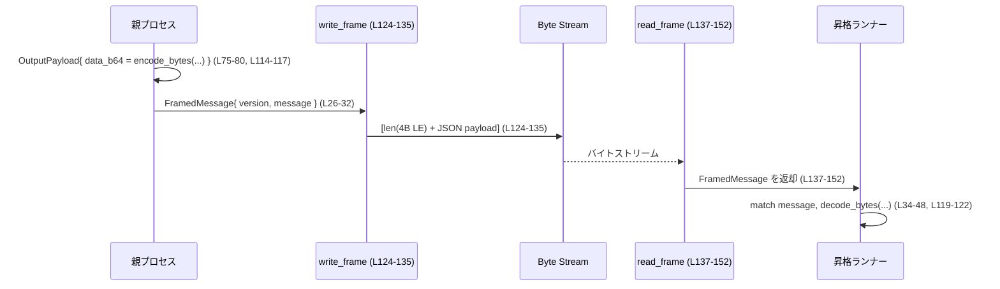

# windows-sandbox-rs/src/elevated/ipc_framed.rs

## 0. ざっくり一言

親プロセス（CLI）と昇格済みコマンドランナーの間で使う、**JSON ベースの IPC メッセージ形式と、長さプレフィックス付きフレーミング読書き関数**を定義するモジュールです（`FramedMessage` / `Message` と `write_frame` / `read_frame`）。  
（根拠: `ipc_framed.rs:L1-8, L26-32, L34-48, L124-152`）

---

## 1. このモジュールの役割

### 1.1 概要

- 昇格ランナーとの間でやり取りする IPC メッセージの **型（SpawnRequest/Output/Exit/Error など）と JSON スキーマ**を定義します。  
  （根拠: `ipc_framed.rs:L34-48, L50-112`）
- このメッセージを、長さ（4 バイト little-endian）＋ JSON 本体 という **長さプレフィックス付きフレーム**として、任意の `Read`/`Write` ストリーム上で送受信します。  
  （根拠: `ipc_framed.rs:L20-24, L124-152`）
- バイナリ I/O（stdout/stderr/stdin）は base64 文字列としてエンコード／デコードするヘルパー関数を提供します。  
  （根拠: `ipc_framed.rs:L75-80, L90-94, L114-122`）

### 1.2 アーキテクチャ内での位置づけ

親 CLI と昇格ランナーの間に挟まる **「メッセージ＋フレーミング層」**です。モジュール先頭のドキュコメントに、elevated-path 専用であることが明記されています。  
（根拠: `ipc_framed.rs:L1-8`）

```mermaid
graph LR
    ParentCLI["親 CLI プロセス<br/>(非昇格)"]
    Runner["昇格コマンドランナー"]
    IPCFramed["ipc_framed モジュール<br/>(L1-152)"]
    Pipe["Named pipe / byte stream"]

    ParentCLI -->|Message 構築, encode_bytes<br/>write_frame (L124-135)| IPCFramed
    IPCFramed -->|長さ付きバイト列| Pipe
    Pipe -->|長さ付きバイト列| IPCFramed
    IPCFramed -->|read_frame (L138-152), decode_bytes| Runner
```

### 1.3 設計上のポイント

- **型安全なメッセージ表現**  
  - `Message` enum によるバリアント（SpawnRequest/Output/Exit/Error など）と、対応する payload 構造体群を持ちます。  
    （根拠: `ipc_framed.rs:L34-48, L50-112`）
- **バージョンフィールド付きフレーム**  
  - `FramedMessage` が `version: u8` と `message: Message` を持ち、プロトコルのバージョン管理を想定した構造になっています。  
    （根拠: `ipc_framed.rs:L26-32`）
- **メモリ使用量の安全上限**  
  - 1 フレームあたり最大 8 MiB の上限 `MAX_FRAME_LEN` を設け、異常に大きなフレームを拒否してメモリ枯渇を防ぎます。  
    （根拠: `ipc_framed.rs:L20-24, L127-128, L145-147`）
- **シンプルな同期 I/O ベース**  
  - `std::io::Read` / `Write` トレイトを利用し、同期ストリーム上で動作します。並行性の制御は呼び出し側に委ねられています。  
    （根拠: `ipc_framed.rs:L16-17, L124-152`）
- **エラーハンドリングには anyhow::Result**  
  - すべての公開関数は `anyhow::Result` を返し、I/O エラー・JSON 変換エラー・base64 エラーなどを `?` で合成して返しています。  
    （根拠: `ipc_framed.rs:L10, L120-122, L124-135, L138-152`）

---

## 2. 主要な機能一覧（コンポーネントインベントリー・概要）

- IPC メッセージ共通フレーム `FramedMessage` の定義（version + Message）  
  （根拠: `ipc_framed.rs:L26-32`）
- メッセージ種別 enum `Message` と各種 payload 構造体群（SpawnRequest/SpawnReady/Output/Stdin/Exit/Error/Terminate）  
  （根拠: `ipc_framed.rs:L34-48, L50-112`）
- バイナリデータを base64 文字列に変換する `encode_bytes` / 逆変換する `decode_bytes`  
  （根拠: `ipc_framed.rs:L114-122`）
- 長さプレフィックス付き JSON フレームを書き出す `write_frame`  
  （根拠: `ipc_framed.rs:L124-135`）
- 長さプレフィックス付き JSON フレームを読み取る `read_frame`（EOF で `Ok(None)` を返す）  
  （根拠: `ipc_framed.rs:L137-152`）
- フレーム往復（write→read）と base64 encode/decode の結合テスト `framed_round_trip`  
  （根拠: `ipc_framed.rs:L155-183`）

---

## 3. 公開 API と詳細解説

### 3.1 型一覧（構造体・列挙体など）

| 名前 | 種別 | 役割 / 用途 | 根拠 |
|------|------|-------------|------|
| `FramedMessage` | 構造体 | プロトコルバージョンと、実際の `Message` をまとめたフレーム単位のメッセージ | `ipc_framed.rs:L26-32` |
| `Message` | enum | IPC メッセージのバリアント集合（SpawnRequest/Output/Exit など） | `ipc_framed.rs:L34-48` |
| `SpawnRequest` | 構造体 | ランナーに対するプロセス起動要求のパラメータ（コマンド・cwd・環境変数・ポリシーなど） | `ipc_framed.rs:L50-67` |
| `SpawnReady` | 構造体 | 子プロセス起動完了の通知（process_id） | `ipc_framed.rs:L69-73` |
| `OutputPayload` | 構造体 | ランナーからの stdout/stderr 出力（base64 データ + ストリーム種別） | `ipc_framed.rs:L75-80` |
| `OutputStream` | enum | `Stdout` / `Stderr` のどちらの出力かを示す識別子 | `ipc_framed.rs:L82-88` |
| `StdinPayload` | 構造体 | 親からランナーへの stdin データ（base64 文字列） | `ipc_framed.rs:L90-94` |
| `ExitPayload` | 構造体 | 子プロセスの終了コードとタイムアウト有無 | `ipc_framed.rs:L96-101` |
| `ErrorPayload` | 構造体 | ランナー側のエラー内容（メッセージとコード） | `ipc_framed.rs:L103-108` |
| `EmptyPayload` | 構造体 | payload を持たない制御メッセージ用の空構造体 | `ipc_framed.rs:L110-112` |

### 3.2 関数詳細

#### `encode_bytes(data: &[u8]) -> String`

**概要**

- 任意のバイト列を base64 文字列へエンコードし、IPC payload に載せるためのヘルパーです。  
  （根拠: `ipc_framed.rs:L114-117`）

**引数**

| 引数名 | 型 | 説明 |
|--------|----|------|
| `data` | `&[u8]` | エンコード対象のバイト列（所有権を移さず借用） |

**戻り値**

- `String`  
  - `data` を base64 でエンコードした ASCII 文字列。

**内部処理の流れ**

1. `base64::engine::general_purpose::STANDARD` エンジンに対し `encode(data)` を呼び出す。  
   （根拠: `ipc_framed.rs:L11-12, L114-117`）
2. 返された `String` をそのまま返す。

**Examples（使用例）**

```rust
use windows_sandbox_rs::elevated::ipc_framed::encode_bytes; // 想定モジュールパス（このチャンクには未記載）

// バイト列を base64 文字列に変換する
let raw = b"hello world";             // 生のバイト列
let encoded = encode_bytes(raw);      // "aGVsbG8gd29ybGQ=" のような base64 文字列
```

**Errors / Panics**

- この関数は `Result` を返さず、内部でも `panic` を起こしません。
- base64 エンコードは `STANDARD.encode` 内部で失敗要因がほぼなく、ここからはエラーは露出しません。  
  （根拠: `ipc_framed.rs:L114-117`）

**Edge cases（エッジケース）**

- `data` が空スライス `&[]` の場合  
  - 空文字列 `""` を返します（base64 の仕様）。  
- 非 ASCII データ（任意バイナリ）  
  - そのまま base64 エンコードされ、`String` として安全に扱えます。

**使用上の注意点**

- 逆変換には必ず `decode_bytes` を用いることで、一貫したエンコード方式を保てます。
- 大きなバイト列を渡すと、それに応じた長さの `String` がヒープ確保されます。メッセージサイズ上限はフレーミング側（`MAX_FRAME_LEN`）で制限されます。  
  （根拠: `ipc_framed.rs:L20-24, L127-128, L145-147`）

---

#### `decode_bytes(data: &str) -> Result<Vec<u8>>`

**概要**

- base64 文字列を元のバイト列に復元します。`encode_bytes` の逆変換です。  
  （根拠: `ipc_framed.rs:L119-122`）

**引数**

| 引数名 | 型 | 説明 |
|--------|----|------|
| `data` | `&str` | base64 エンコードされた文字列 |

**戻り値**

- `Result<Vec<u8>>`  
  - `Ok(Vec<u8>)`: 復号に成功したときのバイト列。  
  - `Err(anyhow::Error)`: base64 として不正な形式の場合など。

**内部処理の流れ**

1. `data.as_bytes()` で UTF-8 文字列をバイト列に変換。  
2. `STANDARD.decode(...)` を呼び、結果を `Ok(...)` でラップして返す。  
   （`?` により base64 エラーは `anyhow::Error` へ変換されます）。  
   （根拠: `ipc_framed.rs:L10, L120-122`）

**Examples（使用例）**

```rust
use windows_sandbox_rs::elevated::ipc_framed::{encode_bytes, decode_bytes};

// 正常な round-trip
let raw = b"hello world";
let encoded = encode_bytes(raw);
let decoded = decode_bytes(&encoded).expect("valid base64");
assert_eq!(decoded, raw);

// エラー例: 不正な base64
let invalid = "%%%";            // base64 ではない文字列
let result = decode_bytes(invalid);
assert!(result.is_err());       // Err(anyhow::Error) になる
```

**Errors / Panics**

- `Err` になる条件（base64 デコーダに依存）:
  - base64 に使えない文字が含まれる。
  - パディングなどの形式が不正。
- 関数自身は `panic` を起こしません。エラーは `anyhow::Error` として呼び出し元に伝播されます。  
  （根拠: `ipc_framed.rs:L120-122`）

**Edge cases**

- 空文字列 `""` は空の `Vec<u8>` としてデコードされます（base64 の仕様）。  
- `data` に Unicode 絵文字などを含めると、ほぼ確実に base64 として不正となり `Err` を返します。

**使用上の注意点**

- ネットワークや IPC から受け取った文字列は、そのまま `decode_bytes` に渡してエラーをチェックすることで、データ破損やプロトコル違反を検出できます。
- エラー内容（`anyhow::Error` のメッセージ）は base64 デコーダ由来です。ユーザー向けメッセージへ変換する必要があれば呼び出し側で行います。

---

#### `write_frame<W: Write>(writer: W, msg: &FramedMessage) -> Result<()>`

**概要**

- `FramedMessage` を JSON にシリアライズし、その長さ（4 バイト）と本体を順に `Write` へ出力します。  
  （根拠: `ipc_framed.rs:L124-135`）

**引数**

| 引数名 | 型 | 説明 |
|--------|----|------|
| `writer` | `W: Write` | 出力先ストリーム（名前付きパイプ、ソケット、メモリバッファなど）。所有権はこの呼び出しに move される |
| `msg` | `&FramedMessage` | 出力するメッセージ |

**戻り値**

- `Result<()>`  
  - `Ok(())`: フレームの書き出しと `flush()` が成功。  
  - `Err(anyhow::Error)`: JSON 変換エラー、I/O エラー、フレームサイズ超過など。

**内部処理の流れ（アルゴリズム）**

1. `serde_json::to_vec(msg)?` で `FramedMessage` を JSON バイト列に変換する。  
   （根拠: `ipc_framed.rs:L126`）
2. バイト列長 `payload.len()` が `MAX_FRAME_LEN` を超えていないかチェックし、超過していれば `anyhow::bail!` でエラーを返す。  
   （根拠: `ipc_framed.rs:L20-24, L127-128`）
3. 長さを `u32` にキャストし、`to_le_bytes()` で little-endian の 4 バイト配列に変換。  
   （根拠: `ipc_framed.rs:L130-131`）
4. `writer.write_all(&len_bytes)` で長さを書き出す。  
5. `writer.write_all(&payload)` で JSON 本体を書き出す。  
6. `writer.flush()` を呼び、バッファリングされているデータを実際のストリームへ送出する。  
7. すべて成功したら `Ok(())` を返す。  
   （根拠: `ipc_framed.rs:L130-135`）

**Examples（使用例）**

```rust
use std::io::Cursor;
use windows_sandbox_rs::elevated::ipc_framed::{
    FramedMessage, Message, OutputPayload, OutputStream, encode_bytes, write_frame,
};

// メモリ上のバッファにフレームを書き出す例
let msg = FramedMessage {
    version: 1,
    message: Message::Output {
        payload: OutputPayload {
            data_b64: encode_bytes(b"hello"),
            stream: OutputStream::Stdout,
        },
    },
};

let mut buf = Cursor::new(Vec::new());       // Write を実装するメモリバッファ
write_frame(&mut buf, &msg)?;               // フレームを書き出す
let written = buf.into_inner();             // [len(4バイト) + JSON本体] のバイト列が得られる
```

**Errors / Panics**

- `Err` になる条件:
  - `serde_json::to_vec` が失敗した場合（シリアライズ不可能な値など）。  
    （根拠: `ipc_framed.rs:L126`）
  - フレーム長が `MAX_FRAME_LEN` を超える場合（`frame too large` メッセージ）。  
    （根拠: `ipc_framed.rs:L20-24, L127-128`）
  - 下位の `Write::write_all` / `flush` が I/O エラーを返した場合。  
    （根拠: `ipc_framed.rs:L131-133`）
- 関数内部で `panic` を起こすコードはありません。

**Edge cases**

- ペイロードが 0 バイト（ほぼありえませんが）でも、長さ 0 のフレームとして書き出されます。
- `payload.len()` が `u32::MAX` を超えるような場合は、`as u32` のキャストで桁あふれが起こりえますが、その前に `MAX_FRAME_LEN` チェック（8 MiB）があるため、実際には発生しません。  
  （根拠: `ipc_framed.rs:L20-24, L127-130`）

**使用上の注意点**

- 同一ストリームに対して複数スレッドから同時に `write_frame` を呼ぶとフレームが混ざる可能性があります。スレッドセーフ性は呼び出し側で確保する必要があります（ミューテックスなど）。
- `flush()` まで含めて 1 フレームの出力が完了する点に注意が必要です。高頻度のフレーム送信では `flush` のコストを考慮する必要があります。

---

#### `read_frame<R: Read>(reader: R) -> Result<Option<FramedMessage>>`

**概要**

- ストリームから 4 バイトの長さと、その長さ分の JSON 本体を読み出し、`FramedMessage` にデコードします。EOF 時は `Ok(None)` を返します。  
  （根拠: `ipc_framed.rs:L137-152`）

**引数**

| 引数名 | 型 | 説明 |
|--------|----|------|
| `reader` | `R: Read` | 入力元ストリーム。所有権が move され、フレーム読み込みに使用される |

**戻り値**

- `Result<Option<FramedMessage>>`  
  - `Ok(Some(msg))`: 1 フレームの読み込みに成功。  
  - `Ok(None)`: ヘッダ長を読む段階で `UnexpectedEof` が発生した（EOF とみなす）。  
  - `Err(anyhow::Error)`: フレーム長超過、I/O エラー、JSON 解析エラーなど。

**内部処理の流れ**

1. 4 バイトの固定長バッファ `len_buf` を用意。  
   （根拠: `ipc_framed.rs:L139-140`）
2. `reader.read_exact(&mut len_buf)` を呼ぶ。  
   - `Ok(())` の場合はそのまま続行。  
   - `Err(err)` かつ `err.kind() == UnexpectedEof` のときは `Ok(None)` を返す（EOF）。  
   - それ以外のエラーは `Err(err.into())` として返す。  
   （根拠: `ipc_framed.rs:L140-144`）
3. `u32::from_le_bytes(len_buf)` で長さを little-endian から `usize` に変換。  
   （根拠: `ipc_framed.rs:L145`）
4. 長さが `MAX_FRAME_LEN` を超えている場合、`anyhow::bail!("frame too large: {len}")` でエラー。  
   （根拠: `ipc_framed.rs:L20-24, L145-147`）
5. 長さ `len` のベクタ `payload` を確保し、`read_exact` で JSON 本体を読み込む。  
   （根拠: `ipc_framed.rs:L149-150`）
6. `serde_json::from_slice(&payload)?` で `FramedMessage` にデシリアライズ。  
   （根拠: `ipc_framed.rs:L151`）
7. `Ok(Some(msg))` を返す。  
   （根拠: `ipc_framed.rs:L152`）

**Examples（使用例）**

```rust
use std::io::Cursor;
use windows_sandbox_rs::elevated::ipc_framed::{
    FramedMessage, Message, OutputPayload, OutputStream,
    encode_bytes, write_frame, read_frame,
};

// 1フレームを書いてから読み戻す例
let msg = FramedMessage {
    version: 1,
    message: Message::Output {
        payload: OutputPayload {
            data_b64: encode_bytes(b"hello"),
            stream: OutputStream::Stdout,
        },
    },
};

let mut buf = Vec::new();
write_frame(&mut buf, &msg)?;

// 読み取り側
let mut cursor = Cursor::new(buf);
if let Some(decoded) = read_frame(&mut cursor)? {
    assert_eq!(decoded.version, 1);
}
```

**Errors / Panics**

- `Err` になる主な条件:
  - ヘッダ読み込みで `UnexpectedEof` 以外の I/O エラー。  
    （根拠: `ipc_framed.rs:L140-144`）
  - フレーム長が `MAX_FRAME_LEN` を超える。  
    （根拠: `ipc_framed.rs:L145-147`）
  - ペイロード読み込みでの I/O エラー。  
    （根拠: `ipc_framed.rs:L149-150`）
  - `serde_json::from_slice` が JSON エラーを返す（不正な JSON / スキーマ不一致）。  
    （根拠: `ipc_framed.rs:L151`）
- `panic` を起こすコードはありません。

**Edge cases**

- ヘッダ 4 バイト読み込み時に `UnexpectedEof` が発生した場合  
  - トレーラーが途中で切れていても `Ok(None)` として扱われます。**完全なフレームの不足と通常の EOF を区別しません。**  
    （根拠: `ipc_framed.rs:L140-143`）
- ペイロード読み込み時の `UnexpectedEof` は `Err` として返されます（I/O エラーとして扱われる）。  
  （根拠: `ipc_framed.rs:L149-150`）
- 長さが 0 の場合は、空配列から JSON デコードを試みます。通常のプロトコルでは空 JSON は想定されないため、`serde_json` によってエラーになる可能性があります。

**使用上の注意点**

- 典型的にはループで使用します:

  ```rust
  use std::io::Read;
  use windows_sandbox_rs::elevated::ipc_framed::read_frame;

  fn process_stream<R: Read>(mut r: R) -> anyhow::Result<()> {
      while let Some(frame) = read_frame(&mut r)? {
          // frame.message を match して処理する
      }
      Ok(())
  }
  ```

- ヘッダ読み取りでの `UnexpectedEof` は「クリーンな接続終了」と同一視されるため、**通信路の切断とフレーム破損を区別したい場合は、上位レイヤで追加のチェックが必要**です。
- `write_frame` と同様、同一ストリームを複数スレッドで読み取るとフレーム境界が壊れるため、ストリームの排他制御が前提です。

---

### 3.3 その他の関数

このファイル内の公開関数は上記 4 つのみであり、それ以外のヘルパー関数は定義されていません。  
（根拠: `ipc_framed.rs:L114-152`）

---

## 4. データフロー

代表的なシナリオ: **親プロセスが Output メッセージを送信し、ランナーが受信する**。

1. 親プロセスが標準出力データ（バイト列）を `encode_bytes` で base64 化。  
   （根拠: `ipc_framed.rs:L75-80, L114-117`）
2. `Message::Output { payload: OutputPayload { ... } }` を構築し、`FramedMessage` に詰める。  
   （根拠: `ipc_framed.rs:L26-32, L34-48, L75-80`）
3. `write_frame` で長さ + JSON バイト列として named pipe 等へ送出。  
   （根拠: `ipc_framed.rs:L124-135`）
4. ランナー側は同じストリームを `read_frame` し、`FramedMessage` を復元。  
   （根拠: `ipc_framed.rs:L137-152`）
5. `Message::Output` をマッチし、必要であれば `decode_bytes` で base64 を復号してバイト列として扱う。  
   （根拠: `ipc_framed.rs:L75-80, L119-122`）



テスト `framed_round_trip` はまさにこの流れ（write → read → decode）をメモリ上で検証しています。  
（根拠: `ipc_framed.rs:L159-179`）

---

## 5. 使い方（How to Use）

### 5.1 基本的な使用方法

親側で **SpawnRequest を送る**最小例（概念的なコード）です。

```rust
use std::collections::HashMap;
use std::path::PathBuf;
use std::io::{Read, Write};
use windows_sandbox_rs::elevated::ipc_framed::{
    FramedMessage, Message, SpawnRequest, EmptyPayload,
    write_frame, read_frame,
};

// 親プロセス側の送信
fn send_spawn_request<W: Write>(mut w: W) -> anyhow::Result<()> {
    let req = SpawnRequest {
        command: vec!["cmd.exe".into(), "/C".into(), "echo hello".into()],
        cwd: PathBuf::from("C:\\"),
        env: HashMap::new(),
        policy_json_or_preset: "default".into(),
        sandbox_policy_cwd: PathBuf::from("C:\\sandbox"),
        codex_home: PathBuf::from("C:\\codex"),
        real_codex_home: PathBuf::from("C:\\codex_real"),
        cap_sids: vec![],
        timeout_ms: Some(30_000),
        tty: false,
        stdin_open: false,
        use_private_desktop: false,
    };

    let frame = FramedMessage {
        version: 1,
        message: Message::SpawnRequest { payload: Box::new(req) },
    };

    write_frame(&mut w, &frame)        // 長さ+JSONで送信
}

// ランナー側の受信
fn receive<R: Read>(mut r: R) -> anyhow::Result<()> {
    if let Some(frame) = read_frame(&mut r)? {
        match frame.message {
            Message::SpawnRequest { payload } => {
                // payload に基づいて子プロセスを起動する
            }
            _ => { /* 他のメッセージ種別はここでは無視 */ }
        }
    }
    Ok(())
}
```

### 5.2 よくある使用パターン

1. **イベントループ型の受信処理**

   ランナー側で複数メッセージ（SpawnRequest, Stdin, Terminate 等）を順次処理する想定です。

   ```rust
   use std::io::Read;
   use windows_sandbox_rs::elevated::ipc_framed::{read_frame, Message};

   fn event_loop<R: Read>(mut r: R) -> anyhow::Result<()> {
       while let Some(frame) = read_frame(&mut r)? {
           match frame.message {
               Message::SpawnRequest { payload } => {
                   // spawn
               }
               Message::Stdin { payload } => {
                   // stdin の base64 を decode_bytes で復号して標準入力へ書き込む
               }
               Message::Terminate { payload: _ } => {
                   // 終了処理
                   break;
               }
               _ => {}
           }
       }
       Ok(())
   }
   ```

2. **stdout/stderr のストリーミング**

   runner→parent の Output メッセージを `OutputStream` で振り分けるパターンです。  
   （根拠: `ipc_framed.rs:L75-80, L82-88`）

   ```rust
   use windows_sandbox_rs::elevated::ipc_framed::{Message, OutputStream, decode_bytes};

   fn handle_output(msg: Message) -> anyhow::Result<()> {
       if let Message::Output { payload } = msg {
           let data = decode_bytes(&payload.data_b64)?;
           match payload.stream {
               OutputStream::Stdout => {
                   // 標準出力側に書き出す
               }
               OutputStream::Stderr => {
                   // 標準エラー側に書き出す
               }
           }
       }
       Ok(())
   }
   ```

### 5.3 よくある間違い

このモジュールの API から想定される誤用パターンを挙げます（コードに直接は書かれていませんが、シグネチャと仕様から想定できるものです）。

```rust
use windows_sandbox_rs::elevated::ipc_framed::*;

// 誤り例1: 生バイト列をそのまま JSON に入れてしまう
// ※ OutputPayload::data_b64 は base64 文字列前提
let payload = OutputPayload {
    data_b64: String::from_utf8_lossy(b"\x01\x02").into_owned(), // NG: base64 ではない
    stream: OutputStream::Stdout,
};
// -> 受信側で decode_bytes が Err になる

// 誤り例2: read_frame の None を無視してループし続ける
while let Ok(frame_opt) = read_frame(&mut reader) {
    let frame = frame_opt.unwrap();      // EOF の場合に panic する可能性
}

// 正しい例: None を EOF として扱う
while let Some(frame) = read_frame(&mut reader)? {
    // ...
}
```

### 5.4 使用上の注意点（まとめ）

- **メッセージサイズ上限**  
  - 1 フレームは 8 MiB までです。これを超える JSON を送ると `frame too large` エラーになります。大きなバイナリは分割送信などの設計が必要です。  
    （根拠: `ipc_framed.rs:L20-24, L127-128, L145-147`）
- **EOF の扱い**  
  - ヘッダ読み取り時の `UnexpectedEof` は `Ok(None)` として扱われ、完全フレーム未満のデータとクリーン EOF が区別されません。接続切断時の整合性が重要な場合は上位で対処が必要です。  
    （根拠: `ipc_framed.rs:L140-143`）
- **スレッド安全性**  
  - このモジュール自体は共有状態を持たずスレッドセーフですが、`Read`/`Write` 実装がスレッドセーフとは限りません。同一ストリームを複数スレッドから同時に扱う場合は、ロックなどで排他制御が必要です。
- **検証/サニタイズ**  
  - ここではメッセージ構造の整合性とフレーム長のみをチェックし、`SpawnRequest` の内容（パスや環境変数の正当性など）は検証していません。その検証は上位レイヤの責務です。  
    （根拠: `ipc_framed.rs:L50-67, L124-152`）

---

## 6. 変更の仕方（How to Modify）

### 6.1 新しい機能を追加する場合

例: 新しいメッセージ種別 `Heartbeat` を追加する場合の手順（一般的な方針）。

1. **payload 構造体の追加**  
   - `ErrorPayload` や `ExitPayload` と同様に新しい構造体を定義します。  
     （参考: `ipc_framed.rs:L96-108`）
2. **`Message` enum にバリアントを追加**  
   - 既存バリアントと同様に `{ payload: 新構造体 }` 形式で追加します。  
     （根拠: `ipc_framed.rs:L40-47`）
   - `#[serde(tag = "type", rename_all = "snake_case")]` が付与されているため、JSON 上は `{"type": "heartbeat", "payload": {...}}` の形になります。
3. **両側（親・ランナー）の処理を実装**  
   - このモジュール外で、`Message::Heartbeat` を送る側・受ける側のロジックを追加します（このチャンクには現れません）。
4. **バージョン互換性の検討**  
   - `FramedMessage.version` を利用して、旧クライアント／新ランナー間の互換性を判断する設計が可能です。現状、このフィールドの扱いはこのチャンクには現れません。  
     （根拠: `ipc_framed.rs:L26-32`）

### 6.2 既存の機能を変更する場合

- **`SpawnRequest` にフィールドを追加**  
  - 新しいフィールドを追加する際は `#[serde(default)]` を付けるかどうかを検討します。付けない場合、古い JSON からのデシリアライズに影響が出る可能性があります。現状、`stdin_open` と `use_private_desktop` に `#[serde(default)]` が付与されています。  
    （根拠: `ipc_framed.rs:L63-66`）
- **`MAX_FRAME_LEN` の変更**  
  - この定数を変更すると、メモリ使用量と DoS 耐性のトレードオフが変わります。より大きくすると大きなメッセージを扱えますが、悪意あるピアに対して脆弱になりうる点に注意が必要です。  
    （根拠: `ipc_framed.rs:L20-24, L127-128, L145-147`）
- **シリアライズ形式の変更**  
  - `serde` 属性や enum タグ付け方式を変えると、既存の JSON 互換性が失われます。特に `#[serde(tag = "type", rename_all = "snake_case")]` を変更すると JSON の `type` フィールド名や値が変わるため、両側の更新が同時に必要になります。  
    （根拠: `ipc_framed.rs:L38-40`）
- 変更時は、このモジュールを利用している他ファイル（親 CLI・ランナー側コード）への影響を確認する必要がありますが、それらのファイルはこのチャンクには現れません。

---

## 7. 関連ファイル

このチャンク内には、他の具体的なファイルパスやモジュール名への参照は記述されていません。関連コンポーネントは概念的に以下の通りです。

| パス / コンポーネント | 役割 / 関係 |
|-----------------------|------------|
| 親 CLI 側コード（不明） | `SpawnRequest` / `Stdin` / `Terminate` を生成し、`write_frame` で送信する側。ドキュメントコメントに「parent (CLI)」と記述がありますが、具体的なファイル名はこのチャンクには現れません。<br/>（根拠: `ipc_framed.rs:L1-8`） |
| 昇格ランナー側コード（不明） | `read_frame` でフレームを受信し、`SpawnReady` / `Output` / `Exit` / `Error` を生成して返す側。ドキュメントコメントに「elevated command runner」と記述があります。<br/>（根拠: `ipc_framed.rs:L1-8`） |
| `mod tests`（同一ファイル内） | `framed_round_trip` テストで、`write_frame` / `read_frame` / `encode_bytes` / `decode_bytes` の往復動作を検証します。<br/>（根拠: `ipc_framed.rs:L155-183`） |

---

## Bugs / Security / Contracts / Edge Cases / Tests / Performance（まとめ）

### Bugs / Security 的な観点

- **フレーム長上限による DoS 緩和**  
  - 最大 8 MiB に制限することで、悪意あるピアが過大な長さを指定して OOM を誘発するリスクを軽減しています。  
    （根拠: `ipc_framed.rs:L20-24, L127-128, L145-147`）
- **ヘッダ読み込み時の `UnexpectedEof` の扱い**  
  - 途中までしか届いていないヘッダも `Ok(None)` として扱われるため、「正常終了」と「ヘッダ破損」を区別できません。これをバグと断定はできませんが、プロトコル上は仕様として認識しておく必要があります。  
    （根拠: `ipc_framed.rs:L140-143`）
- **入力内容の検証は行わない**  
  - `SpawnRequest` などのフィールド値（パス・環境変数・ポリシー文字列）は、この層では検証されません。セキュリティ・ポリシーの適用やサニタイズは上位レイヤの責務です。  
    （根拠: `ipc_framed.rs:L50-67`）

### Contracts / Edge Cases

- **プロトコル契約（Contract）**
  - JSON のトップレベルは `FramedMessage`（`version` + `message`）であること。  
    （根拠: `ipc_framed.rs:L26-32`）
  - `Message` enum の `type` フィールドは snake_case でシリアライズされること。  
    （根拠: `ipc_framed.rs:L38-40`）
  - `OutputPayload.data_b64` / `StdinPayload.data_b64` は有効な base64 文字列であること。  
    （根拠: `ipc_framed.rs:L75-80, L90-94, L114-122`）
- **代表的なエッジケース**
  - EOF: ヘッダ読み込みでの `UnexpectedEof` は `Ok(None)`。  
    （根拠: `ipc_framed.rs:L140-143`）
  - 長さ 0 / JSON 不正: `read_frame` が JSON デコード時にエラーを返す。  
    （根拠: `ipc_framed.rs:L151`）
  - 大きなメッセージ: `MAX_FRAME_LEN` 超過でエラー。  
    （根拠: `ipc_framed.rs:L20-24, L127-128, L145-147`）

### Tests

- `framed_round_trip` テスト  
  - `FramedMessage`（Output メッセージ）を `write_frame` でバッファに書き込み、`read_frame` で読み戻し、`encode_bytes` / `decode_bytes` を通じてデータが元通りであることを検証しています。  
    （根拠: `ipc_framed.rs:L159-179`）
  - `OutputStream::Stdout` の値が保持されることも確認しています。  
    （根拠: `ipc_framed.rs:L162-167, L173-177`）

### Performance / Scalability

- 1 フレーム読み込み時に `Vec<u8>` をフレームサイズ分だけ確保する実装であり、大きなフレームはメモリコピーのコストが高くなりますが、8 MiB 上限で制限されています。  
  （根拠: `ipc_framed.rs:L20-24, L149`）
- 各フレームごとに `serde_json` のシリアライズ／デシリアライズが行われるため、メッセージ単位での CPU コストが発生しますが、構造はシンプルです（追加のキャッシュなどはありません）。  
  （根拠: `ipc_framed.rs:L126, L151`）

このモジュールは、**メッセージ定義＋シンプルなフレーミング I/O**に責務が限定されており、上位層の設計次第で安全かつ拡張可能な IPC を構築できる構成になっています。
