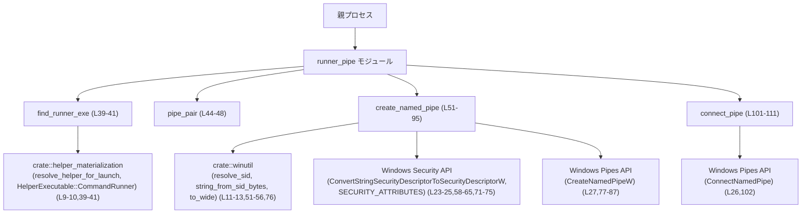
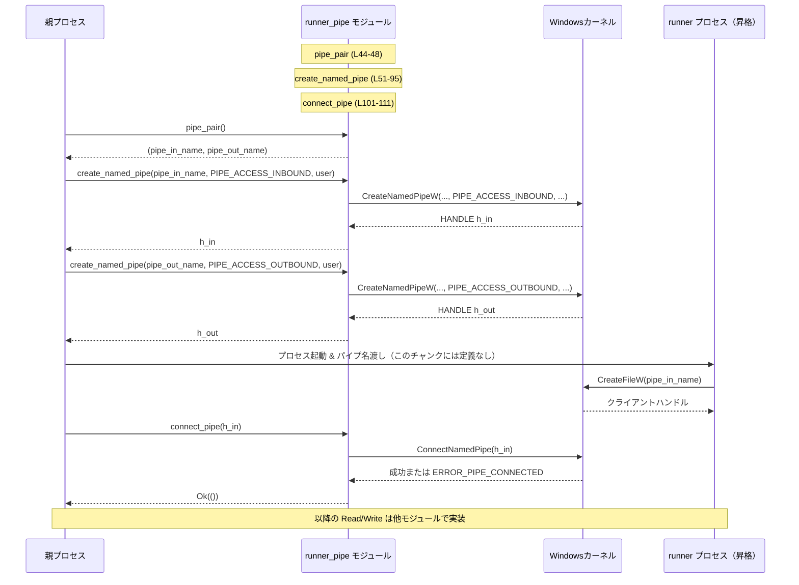

# windows-sandbox-rs/src/elevated/runner_pipe.rs

## 0. ざっくり一言

権限昇格された「runner」プロセスと親プロセスの間で通信するための **Windows 名前付きパイプの名前生成・作成・接続** を行うユーティリティモジュールです（elevated パス専用, runner_pipe.rs:L1-7）。

---

## 1. このモジュールの役割

### 1.1 概要

- このモジュールは、**昇格されたコマンドランナーと親プロセスの IPC（プロセス間通信）チャネル**を確立するために存在します（runner_pipe.rs:L1-7）。
- 主に次の機能を提供します。
  - runner 実行ファイルパスの解決（runner_pipe.rs:L37-41）
  - ランダムな名前付きパイプ名ペアの生成（runner_pipe.rs:L43-48）
  - サンドボックスユーザーだけが接続できる名前付きパイプの作成（runner_pipe.rs:L50-95）
  - runner からの接続完了を待つヘルパ（runner_pipe.rs:L97-111）

### 1.2 アーキテクチャ内での位置づけ

親プロセス側でのみ利用され、runner プロセス（昇格ヘルパ）との通信チャネルを事前に作成し、接続完了を待つ役割を持ちます（runner_pipe.rs:L1-7, L97-100）。  
外部モジュールや Windows API との関係は次のようになります。



- restricted-token（制限トークン）経路ではこのモジュールは使われず、elevated-path 専用であることが明記されています（runner_pipe.rs:L3-7）。

### 1.3 設計上のポイント

- **完全にステートレス**
  - すべてトップレベルの `pub fn` と `pub const` であり、構造体や内部状態を持ちません（runner_pipe.rs:L33-35, L39-41, L44-48, L51-95, L101-111）。
- **Windows 専用・生ハンドル扱い**
  - `windows_sys::Win32::Foundation::HANDLE` を直接返し、クローズ責務は呼び出し側にあります（runner_pipe.rs:L22, L51, L94, L101）。
- **アクセス制御に SDDL を利用**
  - サンドボックスユーザー SID のみを許可する DACL を SDDL 文字列で構成し、Windows API でセキュリティ記述子を生成しています（runner_pipe.rs:L50-57, L58-65）。
- **エラーハンドリング**
  - ユーザー名→SID 解決や SID→文字列変換の失敗は `io::ErrorKind::PermissionDenied` にマッピング（runner_pipe.rs:L51-55）。
  - Windows API の失敗は `GetLastError` を `io::Error::from_raw_os_error` に詰めて返します（runner_pipe.rs:L66-69, L89-92, L103-107）。
- **同期（ブロッキング）パイプ**
  - `CreateNamedPipeW` に `PIPE_WAIT` を指定し（runner_pipe.rs:L81）、`ConnectNamedPipe` もオーバーラップ I/O なしで呼び出されているため、接続待ち呼び出しはスレッドをブロックします（runner_pipe.rs:L101-103）。
- **ハンドル継承禁止**
  - `SECURITY_ATTRIBUTES.bInheritHandle` に 0 を設定し、作成されたハンドルが子プロセスに自動継承されないようにしています（runner_pipe.rs:L71-75）。  

---

## 2. 主要な機能一覧

- `PIPE_ACCESS_INBOUND`: Windows の `PIPE_ACCESS_INBOUND` 定数の値を提供（runner_pipe.rs:L32-33）。
- `PIPE_ACCESS_OUTBOUND`: Windows の `PIPE_ACCESS_OUTBOUND` 定数の値を提供（runner_pipe.rs:L34-35）。
- `find_runner_exe`: 昇格コマンドランナーの実行ファイルパスを解決（runner_pipe.rs:L37-41）。
- `pipe_pair`: ランダムな名前付きパイプ名のペア（in/out）を生成（runner_pipe.rs:L43-48）。
- `create_named_pipe`: 指定ユーザーだけが接続できるセキュアな名前付きパイプを作成し、`HANDLE` を返す（runner_pipe.rs:L50-95）。
- `connect_pipe`: 既に作成済みのサーバーパイプに対して `ConnectNamedPipe` を呼び、クライアント接続を待つ（runner_pipe.rs:L97-111）。

---

## 3. 公開 API と詳細解説

### 3.1 型・定数一覧

このモジュール独自の構造体・列挙体はありません。主に **定数** と Windows 型を公開・利用します。

#### 定数

| 名前 | 種別 | 役割 / 用途 | 定義位置 |
|------|------|-------------|----------|
| `PIPE_ACCESS_INBOUND` | `u32` 定数 | Windows の `PIPE_ACCESS_INBOUND` 値。サーバー側が「読み取り専用」で開くパイプのアクセスモードとして利用されます。 | runner_pipe.rs:L32-33 |
| `PIPE_ACCESS_OUTBOUND` | `u32` 定数 | Windows の `PIPE_ACCESS_OUTBOUND` 値。サーバー側が「書き込み専用」で開くパイプのアクセスモードとして利用されます。 | runner_pipe.rs:L34-35 |

#### 外部型（本モジュールが直接扱う主な型）

| 名前 | 種別 | 役割 / 用途 | 利用箇所 |
|------|------|-------------|----------|
| `HANDLE` | `type HANDLE = isize`（Windows ハンドル型, windows_sys） | 名前付きパイプなど、Windows カーネルオブジェクトを指すハンドル。`create_named_pipe` で生成され、`connect_pipe` で利用されます。 | インポート: runner_pipe.rs:L22; 利用: L51, L94, L101 |

---

### 3.2 関数詳細

#### `find_runner_exe(codex_home: &Path, log_dir: Option<&Path>) -> PathBuf`

**概要**

- 昇格コマンドランナーの実行ファイルパスを解決します。
- `.sandbox-bin` 配下のコピーを優先し、必要に応じて既存の兄弟バイナリを探すことがコメントで示されています（runner_pipe.rs:L37-38）。
- 実際の解決ロジックは `resolve_helper_for_launch` に委譲する薄いラッパーです（runner_pipe.rs:L39-41）。

**引数**

| 引数名 | 型 | 説明 |
|--------|----|------|
| `codex_home` | `&Path` | Codex のホームディレクトリ。helper 実行ファイルを探す基準ディレクトリとして渡されます（runner_pipe.rs:L39）。 |
| `log_dir` | `Option<&Path>` | ログ出力用ディレクトリ（存在すれば）。`resolve_helper_for_launch` にそのまま渡されます（runner_pipe.rs:L39-41）。 |

**戻り値**

- `PathBuf`: 解決された runner 実行ファイルへのパス（runner_pipe.rs:L39-41）。

**内部処理の流れ**

1. `HelperExecutable::CommandRunner` という識別子を用いて（runner_pipe.rs:L39-40）、
2. `resolve_helper_for_launch` に `codex_home` と `log_dir` を渡します（runner_pipe.rs:L39-41）。
3. `resolve_helper_for_launch` の戻り値をそのまま返します（runner_pipe.rs:L40）。

※ 具体的な探索順序・フォールバック戦略は `resolve_helper_for_launch` の実装に依存し、このチャンクには現れません。

**Examples（使用例）**

```rust
use std::path::Path;
use std::path::PathBuf;
use windows_sandbox_rs::elevated::runner_pipe::find_runner_exe;

fn resolve_runner() -> PathBuf {
    // Codex ホームディレクトリ（例）
    let codex_home = Path::new("C:\\Users\\me\\.codex");          // Codex ホームパスを Path で表現
    // ログディレクトリは指定しない例
    let runner_path = find_runner_exe(codex_home, None);         // runner 実行ファイルのパスを解決
    runner_path                                                   // 呼び出し元に返す
}
```

**Errors / Panics**

- 戻り値が `Result` ではなく `PathBuf` なので、この関数から直接エラーが返ることはありません（runner_pipe.rs:L39）。
- 実際にファイルが見つからない場合などにどう振る舞うか（パニック・デフォルト値・エラーログなど）は `resolve_helper_for_launch` の実装に依存し、このチャンクからは分かりません。

**Edge cases（エッジケース）**

- `codex_home` が存在しないディレクトリを指している場合の扱いは、このチャンクには現れません。
- `log_dir` に `Some` を渡しても `None` を渡しても、インターフェース上の違いはありません（単にオプションとして渡しているだけです, runner_pipe.rs:L39-41）。

**使用上の注意点**

- この関数は **パス解決だけ** を行い、実際のプロセス起動は行いません。
- 実行ファイルが存在するか、権限が足りているかなどは、呼び出し側で必要に応じて別途検証する必要があります。

---

#### `pipe_pair() -> (String, String)`

**概要**

- ランダムな名前付きパイプ名のペア（in / out）を生成します（runner_pipe.rs:L43-48）。
- ベースとなる名前に `-in` と `-out` を付けた 2 本のパイプ名を返します。

**引数**

- なし。

**戻り値**

- `(String, String)`:
  - 第 1 要素: `"{base}-in"` 形式のパイプ名（例: `\\.\pipe\codex-runner-abc...-in`）。
  - 第 2 要素: `"{base}-out"` 形式のパイプ名（runner_pipe.rs:L45-47）。

**内部処理の流れ**

1. `SmallRng::from_entropy()` で乱数生成器を初期化します（runner_pipe.rs:L45）。
2. `rng.gen::<u128>()` で 128 ビットの乱数を生成し、16 進数文字列として `\\.\pipe\codex-runner-<hex>` 形式のベース名に埋め込みます（runner_pipe.rs:L46）。
3. そのベースに対して `"{base}-in"` と `"{base}-out"` を作り、タプルで返します（runner_pipe.rs:L47）。

**Examples（使用例）**

```rust
use windows_sandbox_rs::elevated::runner_pipe::pipe_pair;

fn allocate_pipes() {
    // ランダムなパイプ名ペアを取得
    let (pipe_in, pipe_out) = pipe_pair();                      // 例: ("\\\\.\\pipe\\codex-runner-1a2b...-in", "...-out")
    println!("in  pipe: {}", pipe_in);                          // in 用パイプ名を表示
    println!("out pipe: {}", pipe_out);                         // out 用パイプ名を表示

    // 後続で create_named_pipe / ConnectNamedPipe に渡す想定
}
```

**Errors / Panics**

- この関数は `Result` を返しておらず、内部でも `unwrap` などを使用していないため、通常はパニックしません。
- 乱数生成器の初期化 `SmallRng::from_entropy()` がどのようなエラー条件を持つかは `rand` クレートの実装に依存しており、このチャンクからは分かりませんが、通常使用では失敗しない想定の API です（runner_pipe.rs:L45）。

**Edge cases（エッジケース）**

- **パイプ名の衝突**:
  - 極めて低確率ですが、同じホスト上で同一のランダム値が生成され、既存パイプと名前が衝突した場合、後続の `CreateNamedPipeW` はエラーを返します（runner_pipe.rs:L45-47, L77-87）。
  - `pipe_pair` 自体は衝突検出を行わず、ただ文字列を生成するだけです。
- Windows 名前付きパイプのパス形式（`\\.\pipe\...`）に従っているため、Windows 以外の OS では意味を持ちません（runner_pipe.rs:L46）。

**使用上の注意点**

- 返された文字列は、そのまま `CreateNamedPipeW` に渡せる形式（UTF-8 の `&str`）になっています（後続で `to_wide` に通しています, runner_pipe.rs:L76）。
- クライアント側（runner プロセス）にも同じ文字列を渡す必要があるため、生成後に変更しないようにする必要があります。

---

#### `create_named_pipe(name: &str, access: u32, sandbox_username: &str) -> io::Result<HANDLE>`

**概要**

- 指定された名前とアクセスモードで **サンドボックスユーザー専用** の名前付きパイプを作成し、その `HANDLE` を返します（runner_pipe.rs:L50-51）。
- DACL（Discretionary Access Control List）により、指定ユーザーのみ `GA` (Generic All) アクセスを許可します（runner_pipe.rs:L56）。

**引数**

| 引数名 | 型 | 説明 |
|--------|----|------|
| `name` | `&str` | `\\.\pipe\...` 形式のパイプ名文字列（runner_pipe.rs:L51, L76-79）。 |
| `access` | `u32` | `PIPE_ACCESS_INBOUND` または `PIPE_ACCESS_OUTBOUND` などのフラグを渡す想定のアクセスモード。`CreateNamedPipeW` の `dwOpenMode` に渡されます（runner_pipe.rs:L51, L80）。 |
| `sandbox_username` | `&str` | 接続を許可する Windows ユーザー名。`resolve_sid` を通じて SID に変換されます（runner_pipe.rs:L51-53）。 |

**戻り値**

- `io::Result<HANDLE>`:
  - `Ok(handle)`: 成功時、作成された名前付きパイプのハンドル（runner_pipe.rs:L94）。
  - `Err(io::Error)`: SID 解決や Windows API 呼び出しの失敗時（runner_pipe.rs:L52-55, L66-69, L89-92）。

**内部処理の流れ（アルゴリズム）**

1. **ユーザー名から SID を解決**  
   `resolve_sid(sandbox_username)` で SID のバイト列を取得し、失敗時は `PermissionDenied` を返します（runner_pipe.rs:L51-53）。
2. **SID バイト列を文字列表現に変換**  
   `string_from_sid_bytes(&sandbox_sid)` で SID の文字列表現に変換し、ここでも失敗時は `PermissionDenied` を返します（runner_pipe.rs:L54-55）。
3. **SDDL 文字列を構築**  
   `"D:(A;;GA;;;{sandbox_sid})"` という DACL 付き SDDL 文字列を作成し、UTF-16 への変換 (`to_wide`) を行います（runner_pipe.rs:L56）。
   - `D:`: DACL を示す
   - `(A;;GA;;;SID)`: 指定 SID に Generic All を許可
4. **セキュリティ記述子を生成**  
   `ConvertStringSecurityDescriptorToSecurityDescriptorW` を呼び出して SDDL 文字列から `PSECURITY_DESCRIPTOR` を生成します（runner_pipe.rs:L58-65）。
   - 失敗した場合 (`ok == 0`) は `GetLastError` を取得し、その OS エラーコードを `io::Error` にして返します（runner_pipe.rs:L66-69）。
5. **SECURITY_ATTRIBUTES を構築**  
   `SECURITY_ATTRIBUTES` 構造体に `lpSecurityDescriptor = sd` を格納し、`bInheritHandle = 0`（ハンドル継承禁止）を設定します（runner_pipe.rs:L71-75）。
6. **名前付きパイプを作成**  
   `name` を UTF-16 に変換したうえで `CreateNamedPipeW` を呼び出します（runner_pipe.rs:L76-87）。
   - `dwOpenMode` に `access` を渡します（runner_pipe.rs:L80）。
   - `dwPipeMode` には `PIPE_TYPE_BYTE | PIPE_READMODE_BYTE | PIPE_WAIT` を指定し、バイトストリームかつ同期ブロッキングモードで作成します（runner_pipe.rs:L81）。
   - インスタンス数は 1、本数ともにバッファサイズは 65536 に設定しています（runner_pipe.rs:L82-84）。
7. **ハンドルを検証して返却**  
   返ってきたハンドルが `0` または `INVALID_HANDLE_VALUE` の場合はエラーとして扱い、`GetLastError` を `io::Error` に変換して返します（runner_pipe.rs:L89-92）。  
   それ以外の場合は `Ok(h)` を返します（runner_pipe.rs:L94）。

**Examples（使用例）**

以下は、サンドボックスユーザーだけが接続できる読み取り専用パイプを作成する例です。

```rust
use std::io;
use windows_sandbox_rs::elevated::runner_pipe::{
    create_named_pipe, PIPE_ACCESS_INBOUND,
};

fn create_inbound_pipe(user: &str) -> io::Result<()> {
    // 名前付きパイプ名（実際は pipe_pair() を使うのが典型）
    let pipe_name = r"\\.\pipe\codex-runner-example-in";        // サーバー側で使うパイプ名

    // 読み取り専用 (INBOUND) のパイプハンドルを作成
    let h_in = create_named_pipe(pipe_name, PIPE_ACCESS_INBOUND, user)?; // パイプを作成

    // ここで h_in を connect_pipe に渡してクライアント接続を待つなどの処理を行う

    // 使用後は CloseHandle でハンドルを解放する必要があります（別モジュールや unsafe で実施）。
    // unsafe { windows_sys::Win32::Foundation::CloseHandle(h_in); }

    Ok(())
}
```

**Errors / Panics**

- `resolve_sid` 失敗  
  → `io::ErrorKind::PermissionDenied` で `Err` を返します（runner_pipe.rs:L51-53）。
- `string_from_sid_bytes` 失敗  
  → 同じく `PermissionDenied` で `Err` を返します（runner_pipe.rs:L54-55）。
- `ConvertStringSecurityDescriptorToSecurityDescriptorW` 失敗  
  → `GetLastError` の値を `io::Error::from_raw_os_error` に渡して `Err` を返します（runner_pipe.rs:L66-69）。
- `CreateNamedPipeW` 失敗（名前の衝突、パラメータ不正、リソース不足など）  
  → 同様に `GetLastError` を `io::Error` にして `Err` を返します（runner_pipe.rs:L89-92）。
- この関数内で `panic!` を直接呼んでいる箇所はありません。

**Edge cases（エッジケース）**

- **存在しないユーザー名**
  - `sandbox_username` が存在しない場合、`resolve_sid` がエラーを返し、`PermissionDenied` として上位に伝播します（runner_pipe.rs:L51-53）。
- **SID 文字列表現の変換失敗**
  - `string_from_sid_bytes` がエラーを返した場合、同じく `PermissionDenied` が返ります（runner_pipe.rs:L54-55）。
- **SDDL 文字列の問題**
  - `string_from_sid_bytes` が返す SID 文字列が SDDL として不正な場合、`ConvertStringSecurityDescriptorToSecurityDescriptorW` が失敗し OS エラーとなります（runner_pipe.rs:L58-65, L66-69）。
- **パイプ名の衝突**
  - 同じ名前のパイプが既に存在する場合など、`CreateNamedPipeW` がエラーを返す可能性があります（runner_pipe.rs:L77-87, L89-92）。
- **ハンドルリーク**
  - `ConvertStringSecurityDescriptorToSecurityDescriptorW` で確保されたセキュリティ記述子 `sd` を、この関数内では解放していません（runner_pipe.rs:L57-65, L71-75）。
    - Windows API の仕様では、呼び出し側が `LocalFree` で解放することが求められます。
    - この関数を大量に繰り返し呼ぶと、セキュリティ記述子分のメモリがプロセス内に残り続ける可能性があります。

**使用上の注意点**

- 戻り値の `HANDLE` は **必ず呼び出し側でクローズ** する必要があります（`CloseHandle` など）。本モジュールでは解放していません。
- `PIPE_TYPE_BYTE | PIPE_READMODE_BYTE` に固定されているため、メッセージ境界付きパイプではなくバイトストリームとして扱われます（runner_pipe.rs:L81）。
- `PIPE_WAIT` により同期パイプとして作成されるため、後続の `ConnectNamedPipe` 呼び出しはスレッドをブロックします（runner_pipe.rs:L81, L101-103）。
- `bInheritHandle` が 0 のため、プロセス起動時に自動的にハンドルを継承させたい場合は、別途明示的なハンドル継承設定が必要です（runner_pipe.rs:L71-75）。
- セキュリティ上、`sandbox_username` には「実際にサンドボックス内で実行されるユーザーアカウント」を指定する必要があります。誤ったユーザー名を指定すると、本来意図しないユーザーが接続できる、あるいは誰も接続できない状態になります。

---

#### `connect_pipe(h: HANDLE) -> io::Result<()>`

**概要**

- 親プロセス側で、既に `CreateNamedPipeW` で作成済みのサーバーパイプに対して `ConnectNamedPipe` を呼び出し、クライアント（runner）が接続するのを待ちます（runner_pipe.rs:L97-103）。
- クライアントがすでに接続済みで `ERROR_PIPE_CONNECTED` が返されるケースも成功として扱います（runner_pipe.rs:L103-107）。

**引数**

| 引数名 | 型 | 説明 |
|--------|----|------|
| `h` | `HANDLE` | `create_named_pipe` から返されたサーバー側パイプハンドル（runner_pipe.rs:L101）。 |

**戻り値**

- `io::Result<()>`:
  - `Ok(())`: 正常に接続完了、または「すでに接続済み」の場合（runner_pipe.rs:L103-107, L110）。
  - `Err(io::Error)`: その他のエラーコードを `io::Error` に変換して返します（runner_pipe.rs:L104-107）。

**内部処理の流れ（アルゴリズム）**

1. `ConnectNamedPipe(h, ptr::null_mut())` を呼び出します（runner_pipe.rs:L102）。
   - 第 2 引数に `NULL` を指定しているため、オーバーラップ I/O ではなく同期呼び出しです。
2. 戻り値 `ok` が 0（失敗）だった場合、`GetLastError()` でエラーコードを取得します（runner_pipe.rs:L102-104）。
3. エラーコードが `ERROR_PIPE_CONNECTED` (535) の場合は「すでに接続済み」とみなし、正常終了とします（runner_pipe.rs:L105-107）。
4. それ以外のエラーコードの場合は、`Err(io::Error::from_raw_os_error(err as i32))` を返します（runner_pipe.rs:L106-107）。
5. `ConnectNamedPipe` が成功（`ok != 0`）した場合は、そのまま `Ok(())` を返します（runner_pipe.rs:L110）。

**Examples（使用例）**

```rust
use std::io;
use windows_sys::Win32::Foundation::HANDLE;
use windows_sandbox_rs::elevated::runner_pipe::{connect_pipe, create_named_pipe, PIPE_ACCESS_INBOUND};

fn wait_for_client(user: &str) -> io::Result<()> {
    let pipe_name = r"\\.\pipe\codex-runner-example-in";        // サーバー側パイプ名
    let h: HANDLE = create_named_pipe(pipe_name, PIPE_ACCESS_INBOUND, user)?; // サーバーパイプ作成

    // クライアント（runner）が CreateFileW でパイプを開くまで待つ
    connect_pipe(h)?;                                           // 接続完了までブロック

    // ここから h を使って ReadFile/WriteFile などでデータ送受信を行う想定

    Ok(())
}
```

**Errors / Panics**

- `ConnectNamedPipe` が失敗し、`GetLastError` が `ERROR_PIPE_CONNECTED` 以外だった場合に `Err(io::Error)` を返します（runner_pipe.rs:L103-107）。
- この関数内では `panic!` を直接発生させるコードはありません。
- 代表的なエラー例（コード自体には現れませんが、Windows API の仕様上起こり得るもの）としては以下があります。
  - ハンドルが無効 (`ERROR_INVALID_HANDLE`)
  - パイプがすでに接続済みだが、別の状態でエラーが発生している場合など

**Edge cases（エッジケース）**

- **クライアントが既に接続済みのレース**  
  - クライアントが `CreateFileW` でパイプを開くタイミングと、親が `ConnectNamedPipe` を呼ぶタイミングが競合する場合、`ERROR_PIPE_CONNECTED` が返ることがあります。  
  - そのケースは想定済みとして成功扱いしています（runner_pipe.rs:L103-107）。
- **`ConnectNamedPipe` 呼び出し前にパイプが閉じられている**  
  - 無効な `HANDLE` を渡した場合は OS エラーとなり、`Err(io::Error)` で返されます（runner_pipe.rs:L102-107）。
- **ブロッキングによる待ち時間**  
  - `PIPE_WAIT` で作成されたパイプに対する同期 `ConnectNamedPipe` は、クライアントが接続するまでスレッドをブロックします（runner_pipe.rs:L81, L101-103）。
  - GUI スレッドやイベントループスレッドで呼び出すと UI フリーズなどの原因になります。

**使用上の注意点**

- `ConnectNamedPipe` を呼び出す前に、クライアント側にパイプ名を渡しておく必要があります（runner_pipe.rs:L99-100 で「runner は CreateFileW を呼ぶ」と説明）。
- 同じパイプハンドルに対して `connect_pipe` を複数回呼ぶことは想定されていません（Windows API の仕様上、接続済みパイプに対する再接続は行えません）。
- 非同期 I/O やタイムアウト付き接続を行いたい場合は、`Overlapped` I/O など別のパターンが必要になりますが、このモジュールはその用途には対応していません。

---

### 3.3 その他の関数

このファイルには、他に補助的な公開関数や単純なラッパー関数は定義されていません（runner_pipe.rs 全体を参照）。

---

## 4. データフロー

ここでは、代表的なシナリオとして「親プロセスが runner 用の名前付きパイプを用意し、接続を待つ流れ」を示します。

1. 親プロセスが `pipe_pair()` でランダムなパイプ名ペアを生成します（runner_pipe.rs:L44-48）。
2. 親プロセスが `create_named_pipe` を使って、`-in` / `-out` 用のサーバーパイプを作成します（runner_pipe.rs:L51-95）。
3. 親は runner プロセスを起動し、パイプ名をコマンドライン引数等で渡します（この処理は他モジュール側）。
4. 親は `connect_pipe` で各パイプへの接続完了を待ちます（runner_pipe.rs:L101-111）。
5. 接続完了後は、他モジュールで `ReadFile` / `WriteFile` 相当の処理を行います（このチャンクには登場しません）。



---

## 5. 使い方（How to Use）

### 5.1 基本的な使用方法

親プロセス側で、runner 用の 2 本の一方向パイプ（in/out）を作成し、接続完了まで待つ典型的なコード例です。

```rust
use std::io;
use std::path::Path;
use windows_sandbox_rs::elevated::runner_pipe::{
    find_runner_exe, pipe_pair, create_named_pipe, connect_pipe,
    PIPE_ACCESS_INBOUND, PIPE_ACCESS_OUTBOUND,
};

fn setup_elevated_runner(codex_home: &Path, sandbox_username: &str) -> io::Result<()> {
    // 1. runner 実行ファイルパスを解決する                              // find_runner_exe でヘルパーのパスを取得
    let runner_exe = find_runner_exe(codex_home, None);                // 実行ファイルのパス (PathBuf)

    // 2. ランダムなパイプ名ペアを生成する                              // in/out 2 本のパイプ名を取得
    let (pipe_in_name, pipe_out_name) = pipe_pair();                   // 例: "\\\\.\\pipe\\codex-runner-XXX-in", "...-out"

    // 3. サーバー側パイプを作成する                                   // サンドボックスユーザーだけが接続できるパイプ
    let h_in = create_named_pipe(&pipe_in_name, PIPE_ACCESS_INBOUND, sandbox_username)?;   // 読み取り専用パイプ
    let h_out = create_named_pipe(&pipe_out_name, PIPE_ACCESS_OUTBOUND, sandbox_username)?; // 書き込み専用パイプ

    // 4. runner プロセスを昇格して起動する（別モジュールの責務）        // パイプ名を runner に渡して起動
    // spawn_elevated_runner(&runner_exe, &pipe_in_name, &pipe_out_name)?;

    // 5. runner の接続を待つ                                           // ConnectNamedPipe で接続完了までブロック
    connect_pipe(h_in)?;                                               // in 側パイプの接続待ち
    connect_pipe(h_out)?;                                              // out 側パイプの接続待ち

    // 6. h_in / h_out を使ってデータ送受信を行う（別モジュール）         // 実際の Read/Write は他モジュールで行う

    // 7. 最終的には CloseHandle で h_in / h_out を解放する必要がある     // ハンドル解放は呼び出し側の責務

    Ok(())
}
```

### 5.2 よくある使用パターン

1. **一方向パイプ 2 本で全二重通信**
   - `pipe_pair` で `-in` / `-out` のパイプ名を生成し、
   - `PIPE_ACCESS_INBOUND` を親側の読み取り用、`PIPE_ACCESS_OUTBOUND` を親側の書き込み用に使うパターン（runner_pipe.rs:L43-48, L32-35）。
2. **単一パイプで一方向通信**
   - ログ収集など、片方向のストリームだけ必要な場合は、`pipe_pair` を使わずに固定名で `create_named_pipe` を 1 回だけ呼び、`connect_pipe` で接続を待つ。

### 5.3 よくある間違い

```rust
use windows_sandbox_rs::elevated::runner_pipe::{
    create_named_pipe, PIPE_ACCESS_INBOUND, PIPE_ACCESS_OUTBOUND, connect_pipe,
};

// 間違い例: アクセス方向を取り違える
fn wrong_access_direction(user: &str) {
    let name = r"\\.\pipe\example";

    // クライアント側が読み取る想定なのに、サーバー側も INBOUND で開いてしまう
    let _ = create_named_pipe(name, PIPE_ACCESS_INBOUND, user);  // サーバーも読み取り専用
    // -> クライアントも読み取り専用で開くと、どちらも書き込めない
}

// 正しい例: サーバーは OUTBOUND, クライアントは INBOUND で開く
fn correct_access_direction(user: &str) -> std::io::Result<()> {
    let name = r"\\.\pipe\example";

    // サーバー側: 書き込み専用パイプ
    let h = create_named_pipe(name, PIPE_ACCESS_OUTBOUND, user)?;      // サーバーは書き込む

    // クライアント（runner）側: 読み取り専用で CreateFileW する想定
    connect_pipe(h)?;                                                  // クライアント接続を待つ

    Ok(())
}
```

- **ユーザー名の指定ミス**
  - `sandbox_username` にホストユーザー（親プロセスのユーザー）を指定してしまうと、サンドボックス内ユーザーから接続できない可能性があります（runner_pipe.rs:L51）。
- **接続待ちを忘れる**
  - `create_named_pipe` の後に `connect_pipe` を呼ばないと、クライアントとの接続が正しく確立されません（runner_pipe.rs:L51-95, L101-111）。

### 5.4 使用上の注意点（まとめ）

- **ハンドル管理**
  - 生成された `HANDLE` は呼び出し側で `CloseHandle` により解放する必要があります。解放処理はこのモジュールには含まれていません（runner_pipe.rs:L51-95, L101-111）。
- **ブロッキング動作**
  - `connect_pipe` はクライアント接続までスレッドをブロックするため、I/O スレッドやワーカースレッドで呼ぶのが適切です（runner_pipe.rs:L101-103）。
- **セキュリティ**
  - パイプへのアクセスは `sandbox_username` による DACL 制限に依存します（runner_pipe.rs:L50-56, L58-65）。
  - 想定ユーザー以外からの接続を防ぐため、正しいユーザー名を指定することが前提です。
- **メモリリークの可能性**
  - `ConvertStringSecurityDescriptorToSecurityDescriptorW` で確保されたセキュリティ記述子は、この関数内では解放していません（runner_pipe.rs:L58-65, L71-75）。
  - 呼び出し頻度が非常に高い場合には、別途 `LocalFree` による解放処理が必要になる可能性があります。

---

## 6. 変更の仕方（How to Modify）

### 6.1 新しい機能を追加する場合

例: **全二重（フルデュプレックス）パイプを 1 本で扱うヘルパーを追加したい** 場合

1. **ファイル内の追加位置**
   - 現在の公開関数と同じく、トップレベル `pub fn` として `create_duplex_pipe` のような関数を `create_named_pipe` の近くに追加するのが自然です（runner_pipe.rs:L50-95 付近）。
2. **既存ロジックの再利用**
   - SDDL / SECURITY_ATTRIBUTES の構築部分は `create_named_pipe` と共通化できるため、内部ヘルパー関数として切り出すことが検討できます（runner_pipe.rs:L56-75）。
3. **Windows API 呼び出し**
   - `CreateNamedPipeW` の `dwOpenMode` に `PIPE_ACCESS_DUPLEX` 相当のフラグを指定するなど、`access` の扱いを拡張します（runner_pipe.rs:L77-83）。
4. **接続ヘルパーの再利用**
   - 接続待ちは既存の `connect_pipe` に `HANDLE` を渡すだけで済みます（runner_pipe.rs:L101-111）。

### 6.2 既存の機能を変更する場合

- **エラー契約の変更**
  - 例えば `create_named_pipe` のエラー種別を細かく分けたい場合、`resolve_sid` や `string_from_sid_bytes` のエラーに対する `PermissionDenied` マッピング（runner_pipe.rs:L51-55）を変更することになります。
  - その場合、呼び出し側で期待している `io::ErrorKind`（権限エラー扱いなど）との整合性に注意が必要です。
- **セキュリティポリシーの変更**
  - 現在は `GA`（Generic All）を付与していますが、権限を絞りたい場合は SDDL 文字列 `"D:(A;;GA;;;{sandbox_sid})"`（runner_pipe.rs:L56）を書き換えることになります。
  - 変更後は、runner 側が必要とする操作（読み取り、書き込み、接続）に必要な権限が残っているか確認する必要があります。
- **非同期化・タイムアウト対応**
  - 非同期 I/O に対応したい場合、`CreateNamedPipeW` に `FILE_FLAG_OVERLAPPED` フラグを追加するなどの変更が必要です（runner_pipe.rs:L77-83）。
  - それに合わせて `connect_pipe` の実装もオーバーラップ I/O を使う形に変更する必要があります（runner_pipe.rs:L101-103）。

---

## 7. 関連ファイル

このモジュールと密接に関係するモジュール・API は次の通りです（パスはモジュールパスで表記）。

| パス / モジュール | 役割 / 関係 |
|-------------------|------------|
| `crate::helper_materialization` | `HelperExecutable::CommandRunner` と `resolve_helper_for_launch` を提供し、`find_runner_exe` の実体となる runner 実行ファイルのパス解決を行います（runner_pipe.rs:L9-10, L39-41）。 |
| `crate::winutil` | `resolve_sid`, `string_from_sid_bytes`, `to_wide` など Windows 向けユーティリティを提供し、ユーザー名 → SID 解決や UTF-16 変換に利用されています（runner_pipe.rs:L11-13, L51-56, L76）。 |
| `windows_sys::Win32::System::Pipes` | `CreateNamedPipeW`, `ConnectNamedPipe`, `PIPE_TYPE_BYTE`, `PIPE_READMODE_BYTE`, `PIPE_WAIT` など、名前付きパイプ関連の Windows API を提供します（runner_pipe.rs:L26-30, L77-83, L102）。 |
| `windows_sys::Win32::Security` | `ConvertStringSecurityDescriptorToSecurityDescriptorW`, `PSECURITY_DESCRIPTOR`, `SECURITY_ATTRIBUTES` など、セキュリティ記述子とアクセス制御に関する API / 型を提供します（runner_pipe.rs:L23-25, L57-65, L71-75）。 |
| `windows_sys::Win32::Foundation` | `HANDLE`, `GetLastError`, `INVALID_HANDLE_VALUE` など、基本的な Windows カーネルオブジェクトとエラー処理の型・関数を提供します（runner_pipe.rs:L21-22, L67-69, L89-92, L104-107）。 |

---

### テスト・観測性について補足

- **テストコード**
  - このファイル内にはユニットテストやドキュメントテストは含まれていません（runner_pipe.rs 全体）。
- **ログ・観測性**
  - ログ出力やトレース用のコードは存在せず、失敗時は `io::Error` を返すのみです（runner_pipe.rs:L51-55, L66-69, L89-92, L103-107）。
  - 実運用でエラー状況を把握するには、呼び出し側で `io::Error` をログに吐くなどの観測手段を用意する必要があります。

このレポートは、runner_pipe.rs の 1 チャンク（runner_pipe.rs:L1-111）のみを根拠としており、それ以外のファイルや実装については「推測せず・不明な点は不明」として扱っています。
