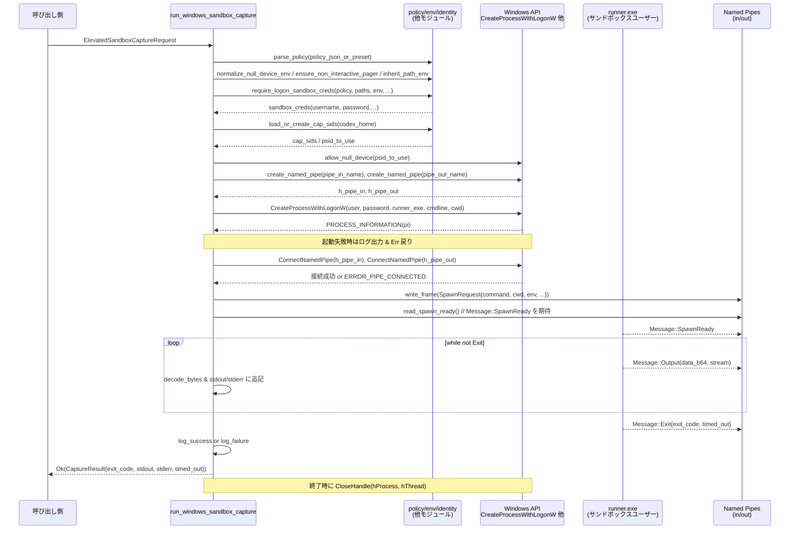

# windows-sandbox-rs/src/elevated_impl.rs

## 0. ざっくり一言

Windows 上で「サンドボックス用ユーザー」によるコマンド実行を行い、その標準出力・標準エラーと終了コードをキャプチャするためのエントリポイントを提供するモジュールです（Windows 以外ではエラーを返すスタブ実装になります）。`ElevatedSandboxCaptureRequest` で実行条件をまとめて指定し、`run_windows_sandbox_capture` で実行します。

---

## 1. このモジュールの役割

### 1.1 概要

- このモジュールは **権限分離された Windows サンドボックス環境でコマンドを実行し、その結果を収集する** 問題を扱います。
- 呼び出し側は `ElevatedSandboxCaptureRequest` 構造体でポリシー、作業ディレクトリ、環境変数、タイムアウト等を渡し、`run_windows_sandbox_capture` が
  - サンドボックス用ユーザー資格情報の取得
  - Named pipe による runner プロセスとの IPC（プロセス間通信）
  - ポリシーに基づく Capability SID の設定
  - 実行結果（標準出力・標準エラー・終了コード）の収集  
  をまとめて行います（`elevated_impl.rs:L225-483`）。

- Windows 以外のプラットフォームでは、同名の関数は単に「Windows でしか利用できない」旨のエラーを返すスタブとして実装されています（`elevated_impl.rs:L521-540`）。

### 1.2 アーキテクチャ内での位置づけ

このファイルは、以下のような構成になっています。

- 公開リクエスト型: `ElevatedSandboxCaptureRequest`（`elevated_impl.rs:L5-18`）
- Windows 向け実装: 内部モジュール `windows_impl` の `run_windows_sandbox_capture`（`elevated_impl.rs:L225-483`）
- 非 Windows 向けスタブ: モジュール `stub` の `run_windows_sandbox_capture`（`elevated_impl.rs:L521-540`）
- トップレベル再エクスポート:
  - Windows のとき `pub use windows_impl::run_windows_sandbox_capture;`（`elevated_impl.rs:L517-518`）
  - 非 Windows のとき `pub use stub::run_windows_sandbox_capture;`（`elevated_impl.rs:L543-544`）

依存関係の概要を Mermaid で図示します。

```mermaid
graph TD
    %% windows-sandbox-rs/src/elevated_impl.rs:L5-544
    A[呼び出し側<br/>他モジュール] --> B[run_windows_sandbox_capture<br/>(elevated_impl)]
    B --> C[ElevatedSandboxCaptureRequest]
    B --> D[windows_impl::run_windows_sandbox_capture<br/>(Windows)]
    B --> E[stub::run_windows_sandbox_capture<br/>(非 Windows)]
    D --> F[policy<br/>parse_policy / SandboxPolicy]
    D --> G[env<br/>normalize_* / inherit_path_env]
    D --> H[identity<br/>require_logon_sandbox_creds]
    D --> I[cap<br/>load_or_create_cap_sids 他]
    D --> J[ipc_framed + runner.exe<br/>FramedMessage / SpawnRequest]
    D --> K[Windows API<br/>CreateProcessWithLogonW, Named Pipe]
```

- `windows_impl::run_windows_sandbox_capture` は、他の内部モジュール（`policy`, `env`, `identity`, `cap`, `ipc_framed`, `helper_materialization`, `logging`, `winutil` など）と Windows API を橋渡しする位置づけになっています（`elevated_impl.rs:L20-77, L244-379, L407-472`）。
- 実際のサンドボックス処理の多くは、これら別モジュールに委譲されており、このファイルでは「実行フローのオーケストレーション」と「Windows ネイティブ API 呼び出し」が中心です。

### 1.3 設計上のポイント

コードから読み取れる特徴を列挙します。

- **プラットフォーム分岐**
  - Windows のみ実装があり、それ以外ではスタブが `bail!` する設計です（`elevated_impl.rs:L517-544`）。
- **入力の集約**
  - 実行に必要な情報（ポリシー文字列 / パス / コマンド / 環境変数 / タイムアウトなど）を `ElevatedSandboxCaptureRequest` にまとめ、関数引数を 1 つに集約しています（`elevated_impl.rs:L5-18, L225-243`）。
- **ポリシー駆動**
  - `SandboxPolicy` により、読み取り専用・ワークスペース書き込みなどの許可レベルを切り替え、Capability SID を付与しています（`elevated_impl.rs:L244, L272-299`）。
  - `DangerFullAccess` と `ExternalSandbox` は明示的に拒否しています（`elevated_impl.rs:L272-277`）。
- **プロセス分離と IPC**
  - 実際のコマンド実行は「runner」ヘルパー実行ファイルに委譲し、Named pipe を通じてメッセージをやり取りします（`elevated_impl.rs:L145-153, L305-308, L407-458`）。
  - IPC プロトコルは `FramedMessage` / `Message` / `SpawnRequest` 型と `read_frame` / `write_frame` により実装されています（`elevated_impl.rs:L30-36, L411-431, L437-458`）。
- **Windows ネイティブ API の利用と unsafe**
  - `CreateNamedPipeW`, `ConnectNamedPipe`, `CreateProcessWithLogonW`, `SetErrorMode`, `CloseHandle` など Windows FFI を `unsafe` で利用しています（`elevated_impl.rs:L63-77, L155-196, L199-209, L347-366, L380-403, L474-481`）。
- **エラーハンドリング**
  - 高レベルでは `anyhow::Result` を返しつつ、Windows エラーコードは `io::Error` に変換する箇所もあります（`elevated_impl.rs:L48-55, L156-195, L199-208, L266-270`）。
  - IPC のプロトコル違反や runner 側エラーは `anyhow::anyhow!` で即座にエラー化しています（`elevated_impl.rs:L213-223, L437-456`）。
- **スレッド / プロセスへの影響**
  - `SetErrorMode` はプロセス全体の設定を変更するため、この関数を呼び出すと他のスレッドにも影響しうる設計です（`elevated_impl.rs:L335`）。
  - `allow_null_device(psid_to_use)` は共有リソース（`NUL` デバイス）の ACL を変更する可能性があり、プロセス全体／システム全体に影響する動作の可能性がありますが、中身はこのチャンクには現れません（`elevated_impl.rs:L22, L301-303`）。

---

## 2. 主要な機能一覧

このモジュールが提供する主な機能は次の通りです。

- サンドボックス実行リクエストの表現:
  - `ElevatedSandboxCaptureRequest`: サンドボックス実行に必要な情報を 1 つの構造体に集約（`elevated_impl.rs:L5-18`）。
- Windows 向けサンドボックス実行:
  - `run_windows_sandbox_capture`（Windows 実装）: ポリシー適用、Capability SID 設定、Named pipe 準備、runner プロセス起動、IPC 経由の実行・結果取得（`elevated_impl.rs:L225-483`）。
- 非 Windows 向けスタブ:
  - `run_windows_sandbox_capture`（スタブ版）: 「Windows でしか利用できない」ことを示すエラーを返す（`elevated_impl.rs:L521-540`）。
- 補助機能（Windows 実装内部）
  - Git リポジトリ内での `safe.directory` 設定注入（`inject_git_safe_directory`、`elevated_impl.rs:L119-138`）。
  - サンドボックス用 Codex ホームディレクトリの作成（`ensure_codex_home_exists`、`elevated_impl.rs:L110-114`）。
  - Named pipe の生成および接続（`create_named_pipe` / `connect_pipe`、`elevated_impl.rs:L155-196, L198-208`）。
  - runner プロセスの起動と `spawn_ready` メッセージの待機（`read_spawn_ready`、`elevated_impl.rs:L213-223`）。

---

## 3. 公開 API と詳細解説

### 3.1 型一覧（構造体・列挙体など）

| 名前 | 種別 | 公開範囲 | 役割 / 用途 | 根拠 |
|------|------|----------|------------|------|
| `ElevatedSandboxCaptureRequest<'a>` | 構造体 | `pub`（モジュール外に公開） | サンドボックス実行に必要な全ての入力（ポリシー文字列 / 各種パス / 実行コマンド / 環境変数 / タイムアウト / パス制限など）をまとめる。`run_windows_sandbox_capture` の引数として利用される。 | `elevated_impl.rs:L5-18, L225-243` |
| `CaptureResult`（Windows 版） | 構造体 | `pub(crate)` 相当（`windows_impl` 内で `pub use crate::windows_impl::CaptureResult;`） | Windows 版 `run_windows_sandbox_capture` の戻り値型。フィールド `exit_code`, `stdout`, `stderr`, `timed_out` を持つことが構造体初期化から分かる。実際の定義は別モジュール `crate::windows_impl` に存在し、このチャンクには現れません。 | 再エクスポート: `elevated_impl.rs:L211`、初期化: `elevated_impl.rs:L466-471` |
| `stub::CaptureResult`（非 Windows） | 構造体 | `pub`（`stub` モジュール内） | 非 Windows 版 `run_windows_sandbox_capture` の戻り値型。`exit_code: i32`, `stdout: Vec<u8>`, `stderr: Vec<u8>`, `timed_out: bool` フィールドを持つ。実際にはエラーで早期リターンするため、通常の呼び出しでは使用されない。 | `elevated_impl.rs:L526-532, L535-540` |

> メモ: Windows 版 `CaptureResult` の正確な定義はこのファイルにはありませんが、フィールド名・意味は `CaptureResult { exit_code, stdout, stderr, timed_out }` の初期化から読み取れます（`elevated_impl.rs:L466-471`）。非 Windows 版の定義とは少なくとも論理的に整合しています。

---

### 3.2 関数詳細（最大 7 件）

以下では、特に重要な 7 関数についてテンプレート形式で説明します。

---

#### `run_windows_sandbox_capture(request: ElevatedSandboxCaptureRequest<'_>) -> Result<CaptureResult>`（Windows 実装）

**定義**

- `elevated_impl.rs:L225-483`（`windows_impl` モジュール内）
- Windows ビルドでのみ `pub use windows_impl::run_windows_sandbox_capture;` により公開されます（`elevated_impl.rs:L517-518`）。

**概要**

- サンドボックスポリシーと実行環境に基づいてサンドボックス用ユーザーで runner プロセスを起動し、指定されたコマンドを実行させ、その結果（終了コード・stdout・stderr・タイムアウト有無）を `CaptureResult` として返します。
- 内部では:
  - ポリシー解析・資格情報取得
  - Capability SID の選択
  - Named pipe の作成と接続
  - `CreateProcessWithLogonW` による runner 起動
  - フレーム化された IPC による出力の受信  
  を順に行います。

**引数**

| 引数名 | 型 | 説明 | 根拠 |
|--------|----|------|------|
| `request` | `ElevatedSandboxCaptureRequest<'_>` | サンドボックス実行に必要な全ての設定を含むリクエスト。パターンマッチでフィールドごとに分解されています。 | 分解: `elevated_impl.rs:L230-243` |

`ElevatedSandboxCaptureRequest` の各フィールドは以下のように使われます。

| フィールド | 用途 | 根拠 |
|-----------|------|------|
| `policy_json_or_preset` | サンドボックスポリシーの JSON 文字列またはプリセット名。`parse_policy` に渡されます。 | `elevated_impl.rs:L244, L418` |
| `sandbox_policy_cwd` | ポリシーファイルなどの基準ディレクトリ。spawn リクエストにも渡されます。 | `elevated_impl.rs:L232, L419` |
| `codex_home` | Codex のホームディレクトリ。`.sandbox` サブディレクトリ作成や Capability SID のロードに利用。 | `elevated_impl.rs:L233, L250-251, L278, L420-421` |
| `command` | 実行するコマンド（argv 形式）。ログ出力と IPC の SpawnRequest で使用。 | `elevated_impl.rs:L234, L254, L415` |
| `cwd` | 実行時カレントディレクトリ。ポリシー・資格情報の決定、git safe.directory 設定、runner 起動時の CWD に使用。 | `elevated_impl.rs:L235, L248, L255-259, L324, L416` |
| `env_map` | 環境変数マップ。正規化（PATH 継承・pager 非対話化・git safe.directory 注入）後に SpawnRequest に渡される。 | `elevated_impl.rs:L236, L245-248, L259, L417` |
| `timeout_ms` | タイムアウト（ミリ秒）。SpawnRequest に渡され、runner がタイムアウト処理を行う前提。 | `elevated_impl.rs:L237, L423` |
| `use_private_desktop` | プライベートデスクトップの使用有無。SpawnRequest に渡されます。 | `elevated_impl.rs:L238, L426` |
| `proxy_enforced` | プロキシ強制有無。`require_logon_sandbox_creds` へのパラメータとして利用されます。 | `elevated_impl.rs:L239, L265` |
| `read_roots_override`, `write_roots_override`, `deny_write_paths_override` | ポリシーの読み書きルートや書き込み禁止パスの上書き設定。資格情報決定処理に渡されます。 | `elevated_impl.rs:L240-243, L261-263` |

**戻り値**

- `Result<CaptureResult>` (`anyhow::Result` エイリアス)
  - `Ok(CaptureResult)`:
    - `exit_code`: runner が報告したプロセスの終了コード。
    - `stdout`: 実行中に受信した標準出力の全バイト列。
    - `stderr`: 実行中に受信した標準エラーの全バイト列。
    - `timed_out`: タイムアウトで終了したかどうか。
  - `Err(anyhow::Error)`:
    - ポリシー解析・資格情報取得・Named pipe 作成・プロセス起動・IPC などのどこかで失敗した場合。

**内部処理の流れ（アルゴリズム）**

高レベルの処理フローを 7 ステップに分解します。

1. **入力の準備と環境正規化**  
   - リクエスト構造体を分解し（`elevated_impl.rs:L230-243`）、ポリシー文字列をパース（`parse_policy`、`elevated_impl.rs:L244`）。
   - 環境変数に対して:
     - `normalize_null_device_env` で `NUL` デバイスなどを正規化（`elevated_impl.rs:L245`）。
     - `ensure_non_interactive_pager` で pager を非対話モードに設定（`elevated_impl.rs:L246`）。
     - `inherit_path_env` で PATH を継承（`elevated_impl.rs:L247`）。
     - `inject_git_safe_directory` で git の `safe.directory` 設定を注入（`elevated_impl.rs:L248`）。
   - Codex サンドボックスディレクトリ `.sandbox` を作成し、ログディレクトリとして利用（`elevated_impl.rs:L250-253`）。

2. **サンドボックス用資格情報と Capability SID の決定**  
   - `require_logon_sandbox_creds` によって、ポリシーや各種パスに基づいてサンドボックス用ユーザー名・パスワード等を取得（`elevated_impl.rs:L255-265`）。
   - そのユーザー名から `resolve_sid` と `string_from_sid_bytes` により文字列 SID を取得（`elevated_impl.rs:L266-270`）。
   - `SandboxPolicy` を検査し、`DangerFullAccess` と `ExternalSandbox` を禁止（`matches!` + `anyhow::bail!`、`elevated_impl.rs:L272-277`）。
   - `load_or_create_cap_sids` により Capability SID 群を読み込み、ポリシーに応じて使用する Capability SID と SID リストを決定（`elevated_impl.rs:L278-295`）。
   - `allow_null_device(psid_to_use)` を unsafe で呼び出し、`NUL` デバイスのアクセス許可を変更（`elevated_impl.rs:L301-303`）。

3. **Named pipe の作成**  
   - ランダムなパイプ名を `pipe_name("in")`, `pipe_name("out")` で生成（`elevated_impl.rs:L305-306`）。
   - ACL 付きの Named pipe を `create_named_pipe` で作成し、`h_pipe_in`（サーバー書き込み / クライアント読み込み）、`h_pipe_out`（サーバー読み取り / クライアント書き込み）として保持（`elevated_impl.rs:L305-308`）。

4. **runner プロセスの起動**  
   - `find_runner_exe` によって runner 実行ファイルパスを決定。存在しない場合はフォールバック名 `"codex-command-runner.exe"` を使用（`elevated_impl.rs:L310-315`）。
   - `--pipe-in=...`, `--pipe-out=...` を含むコマンドラインを構築し、UTF‑16 ワイド文字列バッファに変換（`elevated_impl.rs:L316-324`）。
   - `STARTUPINFOW` / `PROCESS_INFORMATION` 構造体をゼロ初期化し、`SetErrorMode` によりエラー UI を抑制（`elevated_impl.rs:L328-335`）。
   - ログに runner 起動パラメータを出力し（`log_note`、`elevated_impl.rs:L337-345`）、`CreateProcessWithLogonW` でサンドボックスユーザーとして runner を起動（`elevated_impl.rs:L347-366`）。
   - 起動に失敗した場合はエラーコードをログし、エラーを返す（`elevated_impl.rs:L367-377`）。

5. **Named pipe 接続**  
   - `connect_pipe(h_pipe_in)` と `connect_pipe(h_pipe_out)` でクライアント（runner）からの接続を待ちます（`elevated_impl.rs:L380-405`）。
   - いずれかの接続に失敗した場合、全てのハンドル（パイプ + プロセス／スレッドハンドル）を `CloseHandle` で解放し、エラーを返します（`elevated_impl.rs:L380-405`）。

6. **IPC による実行と出力の収集**  
   - `File::from_raw_handle` でパイプハンドルを `std::fs::File` にラップし（`elevated_impl.rs:L408-409`）、`SpawnRequest` を含む `FramedMessage` を作成して `write_frame` で送信（`elevated_impl.rs:L411-430`）。
   - `read_spawn_ready` によって runner からの `SpawnReady` メッセージを待機（`elevated_impl.rs:L431`）。
   - 書き込み側ファイルを `drop` して「EOF」を通知し、以降は `read_frame` で出力・終了情報をループ受信（`elevated_impl.rs:L432-458`）。
     - `Message::Output` の場合: `decode_bytes` で Base64 デコードし、`stdout` / `stderr` バッファに追記（`elevated_impl.rs:L441-446`）。
     - `Message::Exit` の場合: `(exit_code, timed_out)` を取得してループを終了（`elevated_impl.rs:L448`）。
     - `Message::Error` や想定外メッセージの場合: エラーとして即座に戻る（`elevated_impl.rs:L449-456`）。

7. **ログ出力と後処理**  
   - `exit_code` が 0 の場合は `log_success`、それ以外は `log_failure` を呼び出し、実行結果をログします（`elevated_impl.rs:L460-464`）。
   - `CaptureResult` を構築して返却します（`elevated_impl.rs:L466-471`）。
   - 外側のスコープに戻り、プロセス／スレッドハンドルを `CloseHandle` で解放（`elevated_impl.rs:L474-481`）。

**Examples（使用例）**

以下は、Windows 環境で単純なコマンドをサンドボックス実行するイメージコードです（関数パスは環境に依存するため、省略しています）。

```rust
use std::collections::HashMap;
use std::path::Path;

// 実際には crate の公開パスに応じて use する必要があります。
// use crate::{ElevatedSandboxCaptureRequest, run_windows_sandbox_capture};

fn run_ls_like_command() -> anyhow::Result<()> {
    let codex_home = Path::new(r"C:\Users\me\.codex");           // Codex ホーム
    let cwd = Path::new(r"C:\Users\me\project");                 // 作業ディレクトリ
    
    let mut env_map = HashMap::new();                            // 追加の環境変数（必要に応じて設定）

    let request = ElevatedSandboxCaptureRequest {
        policy_json_or_preset: "readonly",                       // プリセット名 or JSON
        sandbox_policy_cwd: cwd,                                 // ポリシーの基準ディレクトリ
        codex_home,                                              // Codex ホーム
        command: vec!["cmd.exe".into(), "/C".into(), "dir".into()],
        cwd,
        env_map,
        timeout_ms: Some(30_000),                                // 30 秒タイムアウト
        use_private_desktop: false,
        proxy_enforced: false,
        read_roots_override: None,
        write_roots_override: None,
        deny_write_paths_override: &[],
    };

    // 実際の呼び出し（パスはプロジェクトの構成に依存）
    let result = run_windows_sandbox_capture(request)?;          // Result<CaptureResult>

    println!("exit code: {}", result.exit_code);
    println!("stdout:\n{}", String::from_utf8_lossy(&result.stdout));
    eprintln!("stderr:\n{}", String::from_utf8_lossy(&result.stderr));
    Ok(())
}
```

このコードでは、`readonly` ポリシーを前提としたサンドボックスで `cmd /C dir` を実行し、その結果を表示しています。

**Errors / Panics**

- `Err` になる主な条件（コード上で明示されているもの）:
  - ポリシー文字列のパースに失敗した場合（`parse_policy` 内部、`elevated_impl.rs:L244`）。
  - `require_logon_sandbox_creds` による資格情報取得が失敗した場合（`elevated_impl.rs:L255-265`）。
  - `resolve_sid` または `string_from_sid_bytes` が `PermissionDenied` エラーを引き起こした場合（`elevated_impl.rs:L266-270`）。
  - ポリシーが `DangerFullAccess` または `ExternalSandbox` に該当した場合（`anyhow::bail!`、`elevated_impl.rs:L272-277`）。
  - `load_or_create_cap_sids` の内部エラー（`elevated_impl.rs:L278`）。
  - Named pipe 作成 (`create_named_pipe`) や接続 (`connect_pipe`) の失敗（`elevated_impl.rs:L305-308, L380-405`）。
  - `CreateProcessWithLogonW` の呼び出し失敗（`elevated_impl.rs:L347-377`）。
  - runner から `spawn_ready` / `exit` などの想定したメッセージが届かない、あるいはパイプが早期にクローズされた場合（`elevated_impl.rs:L213-223, L437-458`）。
  - `decode_bytes` や `read_frame` / `write_frame` の内部エラー（`elevated_impl.rs:L430, L437-443`）。

- **panic の可能性**
  - Capability SID 取得時に `convert_string_sid_to_sid(&caps.readonly).unwrap()` のように `unwrap` を使用しています（`elevated_impl.rs:L281-283, L286-287`）。`load_or_create_cap_sids` が異常な SID 文字列を返した場合には panic する可能性があります。
  - その他の panic はこのチャンクからは読み取れませんが、`unwrap` 利用箇所以外では明示的な `panic!` 呼び出しはありません。

**Edge cases（エッジケース）**

- `SandboxPolicy::DangerFullAccess` / `ExternalSandbox` が指定された場合:
  - 即座に `Err(anyhow::Error)` を返し、実行しません（`elevated_impl.rs:L272-277`）。
- runner からのメッセージ順序:
  - `read_spawn_ready` 呼び出し時点で `SpawnReady` の前に `Error` やその他メッセージが届いた場合、エラーとして終了します（`elevated_impl.rs:L213-223`）。
  - 出力ループ中に `Message::SpawnReady` が再度届いた場合は黙って無視します（`elevated_impl.rs:L440-441`）。
- パイプの早期クローズ:
  - `read_frame` が `None` を返す（EOF）場合、「exit 前にパイプがクローズされた」としてエラー扱いになります（`elevated_impl.rs:L214-215, L437-438`）。
- タイムアウト:
  - タイムアウト判定は runner 側の責務であり、本関数は `Message::Exit { timed_out }` をそのまま透過して返します（`elevated_impl.rs:L448, L466-471`）。タイムアウト時の挙動の詳細は `ipc_framed`/runner 実装側に依存し、このチャンクには現れません。

**使用上の注意点**

- この関数は **同期的**・ブロッキングに動作し、Named pipe I/O とプロセス起動・待機を行うため、長時間のコマンドを実行すると呼び出しスレッドがブロックされます。
- `SetErrorMode` はプロセス全体に影響するため、他スレッドで UI 表示前提のエラー処理を行っている場合に副作用となる可能性があります（`elevated_impl.rs:L335`）。
- `allow_null_device` は OS 全体で共有される `NUL` デバイスの ACL に関与していると想定され、他コンポーネントとの相互作用に注意が必要です（`elevated_impl.rs:L22, L301-303`）。ただし正確な挙動はこのチャンクには現れません。
- `ElevatedSandboxCaptureRequest` 内のパスやポリシー文字列がサンドボックスポリシーの期待と一致していない場合、`require_logon_sandbox_creds` などの内部処理が失敗する可能性があります。
- ポリシー JSON / プリセット名および Capability SID は、プロジェクト全体で一貫した設計が必要です。ここでは正当性チェックを内部モジュールに依存しています。

---

#### `run_windows_sandbox_capture(_request: ElevatedSandboxCaptureRequest<'_>) -> Result<CaptureResult>`（非 Windows スタブ）

**定義**

- `elevated_impl.rs:L535-540`（`stub` モジュール内）
- 非 Windows ビルド時に `pub use stub::run_windows_sandbox_capture;` として公開されます（`elevated_impl.rs:L543-544`）。

**概要**

- 非 Windows 環境でこの関数が呼び出された場合、常に「Windows sandbox は Windows でのみ利用可能」という内容のエラーを返すスタブ関数です。

**引数**

| 引数名 | 型 | 説明 | 根拠 |
|--------|----|------|------|
| `_request` | `ElevatedSandboxCaptureRequest<'_>` | Windows 実装とシグネチャを揃えるために定義されていますが、スタブでは未使用です（プレースホルダ）。 | `elevated_impl.rs:L536-538` |

**戻り値**

- `Result<CaptureResult>`（`anyhow::Result`）
  - 常に `Err(anyhow::Error)` を返します。
  - `CaptureResult` の値が返されることはありません。

**内部処理の流れ**

1. 受け取った `ElevatedSandboxCaptureRequest` を無視します（変数名が `_request` になっている点からも読み取れます、`elevated_impl.rs:L537`）。
2. `bail!("Windows sandbox is only available on Windows")` で即座にエラーを返します（`elevated_impl.rs:L539`）。

**Examples（使用例）**

非 Windows 環境では、この関数を直接呼び出すとエラーになるため、呼び出し側で OS 判定を行うことが想定されます。

```rust
fn maybe_run_in_sandbox(req: ElevatedSandboxCaptureRequest<'_>) -> anyhow::Result<()> {
    #[cfg(target_os = "windows")]
    {
        let result = run_windows_sandbox_capture(req)?;
        println!("exit code: {}", result.exit_code);
        Ok(())
    }

    #[cfg(not(target_os = "windows"))]
    {
        // 非 Windows の場合は別の実装にフォールバックするなどの対処が必要
        anyhow::bail!("Sandbox is only supported on Windows");
    }
}
```

**Errors / Panics**

- すべての呼び出しで `Err(anyhow::Error)` となります。
- panic を発生させるコードは含まれていません（`elevated_impl.rs:L535-540`）。

**Edge cases / 使用上の注意点**

- ビルドターゲットが非 Windows の際に誤ってサンドボックス依存の機能を利用しないよう、呼び出し側で `cfg` 属性やランタイムチェックを設ける必要があります。
- この関数の存在により、ビルドは通るが実行時にエラーになる可能性があるため、「Windows 専用機能」であることを利用側の API ドキュメントでも明示する必要があります。

---

#### `find_git_root(start: &Path) -> Option<PathBuf>`

**定義**

- `elevated_impl.rs:L81-108`

**概要**

- 指定したパスから上方向に辿り、`.git` ディレクトリまたはファイルを探して Git ワークツリーのルートディレクトリを特定します。
- `.git` が gitfile（ファイル）である場合は、その中の `gitdir:` 記述に従って実際の Git ディレクトリを解決します。

**引数**

| 引数名 | 型 | 説明 |
|--------|----|------|
| `start` | `&Path` | 探索開始パス。`dunce::canonicalize` により正規化されてから処理されます。 |

**戻り値**

- `Option<PathBuf>`
  - `Some(path)`: `.git` を見つけた場合の Git ワークツリールート。
  - `None`: ルートディレクトリまで遡っても `.git` が見つからなかった場合。

**内部処理の流れ**

1. `start` を `dunce::canonicalize` で正規化し、失敗した場合は `None` を返します（`elevated_impl.rs:L82`）。
2. ループを開始し、現在ディレクトリ `cur` に対して:
   - `cur.join(".git")` を `marker` として構築（`elevated_impl.rs:L84`）。
   - `marker.is_dir()` なら `cur` を Git ルートとして返す（`elevated_impl.rs:L85-87`）。
   - `marker.is_file()` の場合:
     - ファイル内容を読み、先頭に `gitdir:` があればそこから Git ディレクトリパスを取得（`elevated_impl.rs:L89-93`）。
     - 相対パスであれば `cur` からの相対に解決し、`resolved.parent()` を Git ルート候補として返す。親が無ければ `cur` を返す（`elevated_impl.rs:L93-99`）。
     - ファイル形式が想定外の場合でも、とりあえず `cur` をルートとして返す（`elevated_impl.rs:L100`）。
3. `.git` が存在しない場合は親ディレクトリに遡る。親が存在しないか、親と自分が同じ（ルート）に達した場合は `None` を返す（`elevated_impl.rs:L102-105`）。

**Examples（使用例）**

`inject_git_safe_directory` から利用され、`cwd` が Git リポジトリ内であればそのルートを見つけます（`elevated_impl.rs:L119-125`）。

```rust
let cwd = Path::new("C:/Users/me/project/src");
if let Some(git_root) = find_git_root(cwd) {
    println!("git root: {}", git_root.display());
}
```

**Errors / Panics**

- ファイル I/O や `canonicalize` のエラーはすべて `Option` の `None` として扱われ、panic には至りません（`elevated_impl.rs:L82, L89-90`）。
- 明示的な panic はありません。

**Edge cases**

- `.git` ファイルが存在し、その内容が `gitdir:` で始まらない場合:
  - 現在ディレクトリ `cur` を Git ルートとして返します（`elevated_impl.rs:L100`）。
- `start` が既にルートディレクトリで `.git` が無い場合:
  - 1 回のループ後に親が自分自身と等しいため `None` を返します（`elevated_impl.rs:L102-105`）。

**使用上の注意点**

- 返り値が `None` の場合、Git リポジトリ外とみなされます。呼び出し側で `Some` のときのみ Git 関連の処理を行う必要があります。
- シンボリックリンクが含まれるパスは `canonicalize` により解決されるため、見かけ上のパスと異なるディレクトリを返す可能性があります。

---

#### `inject_git_safe_directory(env_map: &mut HashMap<String, String>, cwd: &Path, _logs_base_dir: Option<&Path>)`

**定義**

- `elevated_impl.rs:L119-138`

**概要**

- カレントディレクトリが Git リポジトリ内である場合、`env_map` に Git の `safe.directory` 設定を追加します。
- これにより、所有者が異なるディレクトリでもサンドボックスユーザーで Git コマンドを実行できるようにする意図がコメントから読み取れます（`elevated_impl.rs:L116-118`）。

**引数**

| 引数名 | 型 | 説明 |
|--------|----|------|
| `env_map` | `&mut HashMap<String, String>` | 実行時に使用する環境変数マップ。必要に応じて `GIT_CONFIG_*` 変数が追加されます。 |
| `cwd` | `&Path` | 現在の作業ディレクトリ。Git ルート探索の起点に使われます。 |
| `_logs_base_dir` | `Option<&Path>` | ログディレクトリの情報と思われますが、この関数の中では未使用です（変数名の先頭に `_`）。 |

**戻り値**

- なし（`()`）。副作用として `env_map` を更新します。

**内部処理の流れ**

1. `find_git_root(cwd)` で Git ルートディレクトリを取得（`elevated_impl.rs:L124`）。
2. 見つかった場合:
   - `env_map` から `GIT_CONFIG_COUNT` を取得して `usize` にパース。存在しない場合は 0 とみなす（`elevated_impl.rs:L125-128`）。
   - Git ルートのパスから `"\\\\"` を `"/"` に置換して `git_path` とする（`elevated_impl.rs:L129`）。
   - 次の環境変数を設定:
     - `GIT_CONFIG_KEY_{cfg_count}` = `"safe.directory"`（`elevated_impl.rs:L130-133`）
     - `GIT_CONFIG_VALUE_{cfg_count}` = `git_path`（`elevated_impl.rs:L134`）
   - `GIT_CONFIG_COUNT` を `cfg_count + 1` に更新（`elevated_impl.rs:L135-136`）。

**Examples（使用例）**

`run_windows_sandbox_capture` から次のように呼び出されています（`elevated_impl.rs:L248`）。

```rust
let mut env_map = HashMap::new();
inject_git_safe_directory(&mut env_map, cwd, None);
// env_map には必要に応じて GIT_CONFIG_* が追加される
```

**Errors / Panics**

- `GIT_CONFIG_COUNT` のパースに失敗した場合は `unwrap_or(0)` により 0 として扱われ、エラーにはなりません（`elevated_impl.rs:L125-128`）。
- `.git` の探索に失敗しても、単に何も追加しないだけです。
- panic を発生させるコードはありません。

**Edge cases**

- 既に `GIT_CONFIG_*` が設定されている場合:
  - 既存の `GIT_CONFIG_COUNT` から次の番号を割り当てるため、追記される形になります（`elevated_impl.rs:L125-136`）。
- `cwd` が Git リポジトリ外の場合:
  - `find_git_root` が `None` を返すため、`env_map` は変更されません（`elevated_impl.rs:L124-137`）。

**使用上の注意点**

- この関数は Git の設定を環境変数レベルで追加します。既存の Git 設定ファイルではなく、プロセスローカルな設定として解釈されることが想定されます。
- `git_path` を `"\\\\"` → `"/"` に変換しているため、Windows ネイティブパス表記と異なる形式になる場合がありますが、Git が受け付けることを前提としているようです。

---

#### `pipe_name(suffix: &str) -> String`

**定義**

- `elevated_impl.rs:L146-153`

**概要**

- サンドボックス runner と通信するための Named pipe 名を一意に生成するユーティリティ関数です。
- `SmallRng::from_entropy()` により乱数を生成し、`\\.\pipe\codex-runner-<hex>-<suffix>` 形式のパスを返します。

**引数**

| 引数名 | 型 | 説明 |
|--------|----|------|
| `suffix` | `&str` | パイプの用途を区別するための短い文字列（例: `"in"`, `"out"`）。 |

**戻り値**

- `String`: 例として `\\.\pipe\codex-runner-1a2b3c...-in` のような Named pipe パス。

**内部処理の流れ**

1. `SmallRng::from_entropy()` でランダムジェネレータを初期化（`elevated_impl.rs:L147`）。
2. `rng.gen::<u128>()` で 128 ビットランダム値を生成し、16 進数でフォーマット（`elevated_impl.rs:L148-151`）。
3. `suffix` と合わせて `\\.\pipe\codex-runner-{:x}-{suffix}` 形式の文字列を生成して返す（`elevated_impl.rs:L148-152`）。

**Examples（使用例）**

`run_windows_sandbox_capture` 内で以下のように使用されています（`elevated_impl.rs:L305-306`）。

```rust
let pipe_in_name = pipe_name("in");    // 例: \\.\pipe\codex-runner-abc123-in
let pipe_out_name = pipe_name("out");  // 例: \\.\pipe\codex-runner-abc123-out
```

**Errors / Panics**

- エラーや panic を発生させるコードはありません。
- `from_entropy` / `gen` がパニックする状況は通常ありませんが、その詳細は `rand` クレートの実装に依存します。

**Edge cases / 使用上の注意点**

- 非常に低い確率ですが、同一プロセス内で短時間に大量に呼び出した場合、Named pipe 名の衝突が理論的にはあり得ます。ただし `u128` のランダム値を用いているため現実的には無視できるレベルです。
- `suffix` に不適切な文字（バックスラッシュ・NULL 文字など）を含めると Windows API 側で問題になる可能性がありますが、呼び出し側で適切な文字列を渡す前提です。

---

#### `create_named_pipe(name: &str, access: u32, sandbox_sid: &str) -> io::Result<HANDLE>`

**定義**

- `elevated_impl.rs:L155-196`

**概要**

- 指定した名前・アクセスモードで Named pipe を作成し、その DACL（アクセス制御リスト）を「指定された sandbox SID のみが接続可能」となるよう設定します。
- サンドボックスユーザー以外からの接続を防ぐ目的のセキュリティ機能です。

**引数**

| 引数名 | 型 | 説明 |
|--------|----|------|
| `name` | `&str` | `\\.\pipe\...` 形式の Named pipe 名。`pipe_name` から渡されることを想定。 |
| `access` | `u32` | パイプのアクセスフラグ。`PIPE_ACCESS_INBOUND` または `PIPE_ACCESS_OUTBOUND` を渡します（`elevated_impl.rs:L69-70, L307-308`）。 |
| `sandbox_sid` | `&str` | サンドボックスユーザーの文字列 SID。DACL 設定に使用されます。 |

**戻り値**

- `io::Result<HANDLE>`
  - `Ok(handle)`: 成功した場合のパイプハンドル。
  - `Err(io::Error)`: セキュリティディスクリプタの作成または Named pipe の作成に失敗した場合。

**内部処理の流れ**

1. SDDL 文字列の構築:
   - `format!("D:(A;;GA;;;{sandbox_sid})")` により、指定 SID に `GA`（GENERIC_ALL）を付与する DACL を生成（`elevated_impl.rs:L157`）。
   - これを `to_wide` で UTF‑16 に変換（`elevated_impl.rs:L157`）。

2. セキュリティディスクリプタの生成:
   - `ConvertStringSecurityDescriptorToSecurityDescriptorW` を `unsafe` で呼び出し、`sd: PSECURITY_DESCRIPTOR` を得ます（`elevated_impl.rs:L159-166`）。
   - 失敗した場合は `GetLastError` により OS のエラーコードを取得し、`io::Error::from_raw_os_error` でエラーに変換して返す（`elevated_impl.rs:L167-171`）。

3. `SECURITY_ATTRIBUTES` の設定:
   - `lpSecurityDescriptor` に `sd` を設定し、継承不可 (`bInheritHandle = 0`) として構築（`elevated_impl.rs:L172-176`）。

4. Named pipe の作成:
   - `CreateNamedPipeW` を使用してパイプを作成し、ハンドルを取得（`elevated_impl.rs:L177-188`）。
   - 失敗した場合（`h == 0` または `INVALID_HANDLE_VALUE`）は、再度 `GetLastError` を参照して `io::Error` を返す（`elevated_impl.rs:L190-194`）。

5. 成功した場合は `Ok(h)` を返す（`elevated_impl.rs:L195`）。

**Examples（使用例）**

`run_windows_sandbox_capture` 内で以下のように使用されています（`elevated_impl.rs:L305-308`）。

```rust
let h_pipe_in = create_named_pipe(&pipe_in_name, PIPE_ACCESS_OUTBOUND, &sandbox_sid)?;
let h_pipe_out = create_named_pipe(&pipe_out_name, PIPE_ACCESS_INBOUND, &sandbox_sid)?;
```

**Errors / Panics**

- `ConvertStringSecurityDescriptorToSecurityDescriptorW` が 0（失敗）を返す場合:
  - `io::Error` にラップして返します（`elevated_impl.rs:L167-171`）。
- `CreateNamedPipeW` が 0 または `INVALID_HANDLE_VALUE` を返す場合:
  - 再度 `GetLastError` を参照し、`io::Error` を返します（`elevated_impl.rs:L190-194`）。
- panic を発生させるコードはありませんが、すべての FFI 呼び出しは `unsafe` コンテキストであり、呼び出し側が正しいパラメータを渡すことが前提となっています。

**Edge cases / 使用上の注意点**

- `sandbox_sid` が無効な文字列（SID として解釈できない）である場合:
  - `ConvertStringSecurityDescriptorToSecurityDescriptorW` が失敗し、エラーになります（`elevated_impl.rs:L159-171`）。
- **メモリ解放の注意点**:
  - Windows のドキュメントによると、`ConvertStringSecurityDescriptorToSecurityDescriptorW` により割り当てられた `PSECURITY_DESCRIPTOR` は `LocalFree` で解放する必要がありますが、この関数内では `sd` の解放が行われていません（`elevated_impl.rs:L159-176`）。
  - 1 回の呼び出しにつき少量のメモリリークが発生する可能性があります。サンドボックス起動の頻度が少なければ実害は限定的ですが、設計上は留意が必要です。
- ハンドルはこの関数内では閉じられません。呼び出し側（`run_windows_sandbox_capture` や `File::from_raw_handle`）が所有権を持ち、適切にクローズする必要があります。

---

#### `connect_pipe(h: HANDLE) -> io::Result<()>`

**定義**

- `elevated_impl.rs:L199-208`

**概要**

- 指定された Named pipe ハンドルに対してクライアント接続を待機します。
- 既に接続済み（`ERROR_PIPE_CONNECTED`）である場合は成功として扱い、それ以外のエラーは `io::Error` として返します。

**引数**

| 引数名 | 型 | 説明 |
|--------|----|------|
| `h` | `HANDLE` | `CreateNamedPipeW` によって作成されたサーバー側パイプハンドル。 |

**戻り値**

- `io::Result<()>`
  - `Ok(())`: 接続が正常に確立された、または既にクライアント接続済みだった場合。
  - `Err(io::Error)`: 接続待機中に `ERROR_PIPE_CONNECTED` 以外のエラーが発生した場合。

**内部処理の流れ**

1. `ConnectNamedPipe(h, ptr::null_mut())` を `unsafe` で呼び出す（`elevated_impl.rs:L200`）。
2. 戻り値が 0（失敗）の場合:
   - `GetLastError` でエラーコードを取得（`elevated_impl.rs:L201-202`）。
   - エラーコードが `ERROR_PIPE_CONNECTED (535)` 以外であれば、`io::Error::from_raw_os_error` で `Err` を返す（`elevated_impl.rs:L203-206`）。
3. 問題がなければ `Ok(())` を返す（`elevated_impl.rs:L208`）。

**Examples（使用例）**

`run_windows_sandbox_capture` で以下のように利用されています（`elevated_impl.rs:L380-405`）。

```rust
if let Err(err) = connect_pipe(h_pipe_in) {
    // すべてのハンドルを CloseHandle してから Err を返す
}
if let Err(err) = connect_pipe(h_pipe_out) {
    // 同上
}
```

**Errors / Panics**

- `ConnectNamedPipe` が `ERROR_PIPE_CONNECTED` 以外のエラーコードで失敗したケースのみ `Err(io::Error)` を返します。
- panic を発生させるコードはありませんが、`h` が無効なハンドルである場合には未定義動作になる可能性がある点は Windows FFI 共通の注意事項です。

**Edge cases / 使用上の注意点**

- クライアント（runner）が `CreateFile` 等でパイプを開いた直後にこの関数が呼ばれた場合、`ERROR_PIPE_CONNECTED` が返ることがあり、その場合も問題ないものとして扱っています（`elevated_impl.rs:L203-205`）。
- 同じハンドルに対して複数回 `connect_pipe` を呼び出すことは想定されていません。`run_windows_sandbox_capture` 内でも各ハンドルに対して 1 回のみ呼ばれています。

---

#### `read_spawn_ready(pipe_read: &mut File) -> Result<()>`

**定義**

- `elevated_impl.rs:L213-223`

**概要**

- Named pipe 経由で runner から最初のメッセージフレームを読み出し、それが `Message::SpawnReady` であることを検証します。
- runner が `SpawnReady` 以外のメッセージを送った場合や、パイプが早期に閉じられた場合はエラーとなります。

**引数**

| 引数名 | 型 | 説明 |
|--------|----|------|
| `pipe_read` | `&mut File` | 読み取り用 Named pipe をラップした `File`。`read_frame` に渡されます。 |

**戻り値**

- `Result<()>` (`anyhow::Result<()>`)
  - `Ok(())`: 最初のメッセージが `Message::SpawnReady` であった場合。
  - `Err(anyhow::Error)`: runner 側エラー、想定外メッセージ、パイプ早期クローズなど。

**内部処理の流れ**

1. `read_frame(pipe_read)?` でメッセージフレームを読み取る（`elevated_impl.rs:L214`）。
2. `Option` を `ok_or_else` で変換し、`None` の場合は「runner pipe closed before spawn_ready」というエラーを生成（`elevated_impl.rs:L214-215`）。
3. 取得したメッセージに対して `match msg.message` を行う（`elevated_impl.rs:L216-221`）。
   - `Message::SpawnReady { .. }` の場合: `Ok(())`（`elevated_impl.rs:L217`）。
   - `Message::Error { payload }` の場合: `payload.message` を含むエラーを返す（`elevated_impl.rs:L218`）。
   - その他のメッセージの場合: 「expected spawn_ready from runner, got {other:?}」というエラーを返す（`elevated_impl.rs:L219-221`）。

**Examples（使用例）**

`run_windows_sandbox_capture` の中で SpawnRequest 送信後に呼び出されています（`elevated_impl.rs:L430-432`）。

```rust
write_frame(&mut pipe_write, &spawn_request)?;
read_spawn_ready(&mut pipe_read)?;   // runner が起動用準備完了を通知するのを待つ
```

**Errors / Panics**

- `read_frame` が `Err` を返した場合: そのまま `Err` が伝播します（`?` 演算子、`elevated_impl.rs:L214`）。
- パイプが EOF（runner 側が閉じた）になった場合: `anyhow!("runner pipe closed before spawn_ready")` が返されます（`elevated_impl.rs:L214-215`）。
- runner から `Message::Error` が届いた場合: `runner error: <message>` というエラーに変換されます（`elevated_impl.rs:L218`）。
- 想定外のメッセージ種別が届いた場合: `expected spawn_ready from runner, got ...` というエラーとなります（`elevated_impl.rs:L219-221`）。
- panic は発生しません。

**Edge cases / 使用上の注意点**

- runner の実装が `SpawnReady` を送らない設計になっていると、この関数は常にエラーになります。`ipc_framed` と runner 側のプロトコル定義との整合性が必須です。
- 1 回だけ最初のメッセージを検査する前提で利用されています。複数メッセージを連続で処理する用途には設計されていません。

---

### 3.3 その他の関数

上記以外の補助関数を一覧にまとめます。

| 関数名 | 定義位置 | 役割（1 行） |
|--------|----------|--------------|
| `ensure_codex_home_exists(p: &Path) -> Result<()>` | `elevated_impl.rs:L110-114` | 指定ディレクトリ（Codex ホーム内の `.sandbox` ディレクトリ）を再帰的に作成します。`std::fs::create_dir_all` の薄いラッパーです。 |
| `find_runner_exe(codex_home: &Path, log_dir: Option<&Path>) -> PathBuf` | `elevated_impl.rs:L140-143` | runner 実行ファイル（`HelperExecutable::CommandRunner`）のパスを、Codex ホームおよびログディレクトリ情報に基づいて解決します。実際の解決ロジックは別モジュールに委譲されています。 |
| `workspace_policy(network_access: bool) -> SandboxPolicy`（テスト用） | `elevated_impl.rs:L490-497` | テストで利用する補助関数として、`WorkspaceWrite` ポリシーを生成します。 |
| `applies_network_block_when_access_is_disabled()`（テスト） | `elevated_impl.rs:L501-503` | `network_access = false` の場合に `has_full_network_access()` が `false` になることを検証します。 |
| `skips_network_block_when_access_is_allowed()`（テスト） | `elevated_impl.rs:L505-507` | `network_access = true` の場合に `has_full_network_access()` が `true` になることを検証します。 |
| `applies_network_block_for_read_only()`（テスト） | `elevated_impl.rs:L510-513` | 読み取り専用ポリシー `new_read_only_policy()` では `has_full_network_access()` が `false` であることを検証します。 |

---

## 4. データフロー

ここでは、Windows 版 `run_windows_sandbox_capture` の代表的な処理フロー（`elevated_impl.rs:L225-483`）について、データとメッセージの流れを整理します。

### 4.1 フローの要点

- 呼び出し側は `ElevatedSandboxCaptureRequest` を構築し、`run_windows_sandbox_capture` を呼び出します。
- 本関数はポリシー解析・資格情報取得などを行った上で、Named pipe を準備し、サンドボックスユーザーで runner プロセスを起動します。
- その後、`SpawnRequest` を送信し、runner からの `Output` / `Exit` メッセージを順次受信しながら `stdout` / `stderr` バッファを構築します。
- 最終的に `CaptureResult` を返し、ハンドルをクリーンアップして終了します。

### 4.2 シーケンス図



- `policy` や `identity`・`cap` モジュールの詳細な処理内容はこのチャンクには現れませんが、データの流れとしては `run_windows_sandbox_capture` の補助を行う役割です（`elevated_impl.rs:L244-265, L278-295`）。
- IPC のプロトコル（`Message::SpawnReady` / `Output` / `Exit` / `Error`）は `ipc_framed` モジュールと runner 側の実装に依存し、このファイルではそのプロトコルに従って分岐処理のみを実装しています（`elevated_impl.rs:L213-223, L437-456`）。

---

## 5. 使い方（How to Use）

### 5.1 基本的な使用方法

Windows 環境での典型的なフローは次のようになります。

1. Codex ホームディレクトリや作業ディレクトリを決定する。
2. 実行したいコマンドと環境変数を用意する。
3. `ElevatedSandboxCaptureRequest` を構築する。
4. `run_windows_sandbox_capture` を呼び出し、`CaptureResult` を受け取る。
5. `exit_code` や `stdout` / `stderr` を参照する。

```rust
use std::collections::HashMap;
use std::path::Path;

// 仮のエラー型として anyhow を利用
// use anyhow::Result;

fn run_in_sandbox_example() -> anyhow::Result<()> {
    let codex_home = Path::new(r"C:\Users\me\.codex");
    let cwd = Path::new(r"C:\Users\me\project");

    let mut env_map = HashMap::new();
    env_map.insert("RUST_BACKTRACE".into(), "1".into());

    let request = ElevatedSandboxCaptureRequest {
        policy_json_or_preset: r#"{"kind":"ReadOnly"}"#, // 例: JSON 形式のポリシー
        sandbox_policy_cwd: cwd,
        codex_home,
        command: vec!["cmd.exe".into(), "/C".into(), "echo hello".into()],
        cwd,
        env_map,
        timeout_ms: Some(5_000),                          // 5 秒タイムアウト
        use_private_desktop: false,
        proxy_enforced: false,
        read_roots_override: None,
        write_roots_override: None,
        deny_write_paths_override: &[],
    };

    let result = run_windows_sandbox_capture(request)?;   // Windows 実装が呼ばれる

    println!("exit_code = {}", result.exit_code);
    println!("stdout = {}", String::from_utf8_lossy(&result.stdout));
    eprintln!("stderr = {}", String::from_utf8_lossy(&result.stderr));

    Ok(())
}
```

- ポリシーの具体的な JSON 形式やプリセット名はこのファイルからは分かりませんが、`parse_policy` によって解釈されます（`elevated_impl.rs:L244`）。
- `timeout_ms` を `None` にすると、タイムアウト無しで実行される前提です（タイムアウト処理は runner 側に依存）。

### 5.2 よくある使用パターン

1. **タイムアウト指定の有無で切り替える**

```rust
fn run_without_timeout(req_base: ElevatedSandboxCaptureRequest<'_>) -> anyhow::Result<()> {
    let mut req = req_base;
    req.timeout_ms = None;                          // タイムアウト無し
    let result = run_windows_sandbox_capture(req)?;
    println!("exit: {}", result.exit_code);
    Ok(())
}
```

1. **プライベートデスクトップの利用**

`use_private_desktop` を `true` にすると、runner 側がプライベートデスクトップを利用することを前提にした挙動になることが想定されます（詳細は runner 実装依存で、このチャンクには現れません）。

```rust
fn run_with_private_desktop(mut req: ElevatedSandboxCaptureRequest<'_>) -> anyhow::Result<()> {
    req.use_private_desktop = true;
    let _ = run_windows_sandbox_capture(req)?;
    Ok(())
}
```

1. **読み取り／書き込みルートの上書き**

`read_roots_override` や `write_roots_override` に特定のパスリストを渡すことで、ポリシーのデフォルト値を上書きできます（`elevated_impl.rs:L240-243, L261-263`）。

```rust
use std::path::PathBuf;

fn run_with_custom_roots(mut req: ElevatedSandboxCaptureRequest<'_>) -> anyhow::Result<()> {
    let read_root = PathBuf::from(r"C:\data\readonly");
    let write_root = PathBuf::from(r"C:\data\workspace");
    let read_roots = vec![read_root];
    let write_roots = vec![write_root];

    req.read_roots_override = Some(&read_roots);
    req.write_roots_override = Some(&write_roots);

    let _ = run_windows_sandbox_capture(req)?;
    Ok(())
}
```

> 注意: 上記のように一時ベクタを作る場合、ライフタイムに注意が必要です。実際には呼び出しスコープ全体で生きているコレクションを参照させる必要があります。

### 5.3 よくある間違い

```rust
// 間違い例: 非 Windows 環境でもそのまま呼び出してしまう
fn wrong_on_non_windows(req: ElevatedSandboxCaptureRequest<'_>) -> anyhow::Result<()> {
    // 非 Windows ビルドでは stub 実装が使われるため、必ず Err になります。
    let _ = run_windows_sandbox_capture(req)?;   // 実行時に "Windows sandbox is only available on Windows" で失敗
    Ok(())
}
```

```rust
// 正しい例: OS ごとに処理を分岐する
fn correct_os_split(req: ElevatedSandboxCaptureRequest<'_>) -> anyhow::Result<()> {
    #[cfg(target_os = "windows")]
    {
        let _ = run_windows_sandbox_capture(req)?;  // Windows では実際にサンドボックス実行
        return Ok(());
    }

    #[cfg(not(target_os = "windows"))]
    {
        // 別の実装や no-op などにフォールバック
        println!("Sandboxing is disabled on this platform");
        return Ok(());
    }
}
```

その他の注意点:

- サンドボックスポリシーに `DangerFullAccess` や `ExternalSandbox` を指定すると `bail!` されます（`elevated_impl.rs:L272-277`）。呼び出し前にポリシーの種類を確認すると安全です。
- `ElevatedSandboxCaptureRequest` の `env_map` は、最低限必要な環境変数に絞った上でこの関数に渡されますが、`inherit_path_env` によって PATH が追加されることを前提としています（`elevated_impl.rs:L247`）。

### 5.4 使用上の注意点（まとめ）

- **プラットフォーム依存**:  
  Windows 以外ではスタブ実装がエラーを返すため、呼び出し側で `cfg(target_os = "windows")` 等のガードを設ける必要があります（`elevated_impl.rs:L521-540`）。
- **ポリシーの制約**:  
  `DangerFullAccess` と `ExternalSandbox` はサポートされず、指定すると即座にエラーになります（`elevated_impl.rs:L272-277`）。
- **グローバルな副作用**:
  - `SetErrorMode` によるプロセス全体のエラーモード変更（`elevated_impl.rs:L335`）。
  - `allow_null_device` による `NUL` デバイスの ACL 操作（`elevated_impl.rs:L301-303`）。  
  これらは同一プロセス内の他コードにも影響しうるため、ライブラリ的に利用する場合には注意が必要です。
- **リソース管理**:
  - Named pipe ハンドルは `CreateNamedPipeW` → `CloseHandle` または `File::from_raw_handle` 経由で確実に解放されていますが（`elevated_impl.rs:L305-308, L380-403, L408-409`）、セキュリティディスクリプタ `sd` の解放は行われておらず、軽微なメモリリークの可能性があります（`elevated_impl.rs:L159-176`）。
- **ブロッキング I/O**:
  - 実行中は `read_frame` などブロッキング I/O を行うため、UI スレッドなど時間制約のあるスレッドから呼び出す場合には別スレッドへのオフロードや async ランタイムからの利用（spawn など）を検討する必要があります。

---

## 6. 変更の仕方（How to Modify）

### 6.1 新しい機能を追加する場合

例: runner に新しいオプションフラグを渡したい場合

1. **SpawnRequest へのフィールド追加**  
   - `SpawnRequest` の定義は `crate::ipc_framed` モジュールにあるため、そちらに新フィールドを追加する必要があります（このチャンクには定義は現れません）。
2. **spawn_request 構築箇所の変更**  
   - `run_windows_sandbox_capture` 内の `SpawnRequest` 初期化部分（`elevated_impl.rs:L411-427`）に新フィールドを付与し、適切な値をセットします。
3. **runner 側の対応**  
   - 実行ファイル（runner.exe）のコマンドライン・IPC 解釈ロジックで新フィールドを処理する必要があります（このチャンクには runner 実装は現れません）。
4. **テストの追加**  
   - 新機能に応じて `#[cfg(test)] mod tests` とは別に統合テストやモジュールテストを追加し、期待どおりに新フィールドが反映されることを確認します。

### 6.2 既存の機能を変更する場合

変更したい箇所ごとに注意点をまとめます。

- **ポリシー処理の変更**（例: 新しい SandboxPolicy バリアントの追加）
  - 影響箇所:
    - ポリシー解析 (`parse_policy`) 側（別モジュール）
    - `run_windows_sandbox_capture` 内の `match &policy` 分岐と `matches!` 判定（`elevated_impl.rs:L272-299`）
  - 注意点:
    - 新バリアントに対して Capability SID の割り当て方針を決める必要があります。
    - `DangerFullAccess` と同様に禁止したい場合は `matches!` の条件を拡張します。

- **Named pipe セキュリティの変更**
  - 影響箇所:
    - `create_named_pipe` の SDDL 文字列（`elevated_impl.rs:L157`）。
  - 注意点:
    - SDDL の変更はセキュリティに直結します。sandbox SID 以外にアクセスを許す場合は、その影響範囲と脅威モデルを明確にする必要があります。
    - 現状のメモリリーク懸念を解消するために `LocalFree(sd as HLOCAL)` のような解放処理を追加することも検討できます（Windows API の仕様に依存）。

- **ログ出力フォーマットの変更**
  - 影響箇所:
    - `log_start`, `log_note`, `log_success`, `log_failure` 呼び出し（`elevated_impl.rs:L254, L337-345, L460-464`）。
  - 注意点:
    - ログフォーマットを変更すると既存のログ解析ツールや運用フローへの影響がありうるため、互換性の確認が必要です。

- **テストの更新**
  - `SandboxPolicy` の `has_full_network_access` の意味を変更した場合は、テストモジュールの 3 つのテスト（`elevated_impl.rs:L501-513`）を合わせて更新する必要があります。

---

## 7. 関連ファイル

このモジュールと密接に関係する他のモジュール（ファイルパスはこのチャンクからは分かりません）を一覧にします。

| モジュール / パス | 役割 / 関係 |
|------------------|------------|
| `crate::windows_impl` | Windows サンドボックスの低レベル実装を提供し、`CaptureResult` 型を定義しているモジュールです。本ファイルの `windows_impl` サブモジュールから `pub use` されています（`elevated_impl.rs:L211`）。 |
| `crate::ipc_framed` | `FramedMessage`, `Message`, `OutputStream`, `SpawnRequest`, `read_frame`, `write_frame`, `decode_bytes` など IPC プロトコルと実装を提供します。runner との通信の中心となるモジュールです（`elevated_impl.rs:L30-36, L411-458`）。 |
| `crate::policy` | `SandboxPolicy` 列挙体と `parse_policy` 関数を提供し、どの Capability SID を使用するか等のポリシーを決定します（`elevated_impl.rs:L41-42, L244, L272-299`）。 |
| `crate::identity` | `require_logon_sandbox_creds` を通じてサンドボックスユーザーの資格情報（ユーザー名・パスワードなど）を取得します（`elevated_impl.rs:L29, L255-265`）。 |
| `crate::cap` | Capability SID の管理を行うモジュールで、`load_or_create_cap_sids` および `workspace_cap_sid_for_cwd` などを提供します（`elevated_impl.rs:L23, L278-295`）。 |
| `crate::env` | `normalize_null_device_env`, `ensure_non_interactive_pager`, `inherit_path_env` など、環境変数に関するユーティリティを提供します（`elevated_impl.rs:L24-26, L245-247`）。 |
| `crate::helper_materialization` | runner 実行ファイルの解決を行う `resolve_helper_for_launch` と `HelperExecutable` を提供します（`elevated_impl.rs:L27-28, L140-143, L310-315`）。 |
| `crate::logging` | `log_start`, `log_note`, `log_success`, `log_failure` など実行ログ出力を行います（`elevated_impl.rs:L37-40, L254, L337-345, L460-464`）。 |
| `crate::winutil` | `to_wide`, `quote_windows_arg`, `resolve_sid`, `string_from_sid_bytes` など、Windows 固有のユーティリティを提供します（`elevated_impl.rs:L44-47, L157, L177-178, L266-270, L310-324`）。 |

> 補足: 実際のファイルパス（例: `src/windows_impl.rs` など）はこのチャンクからは読み取れませんが、モジュール名から推測される役割を上記に記載しています。
