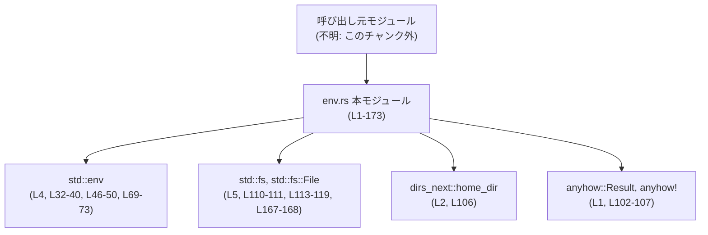
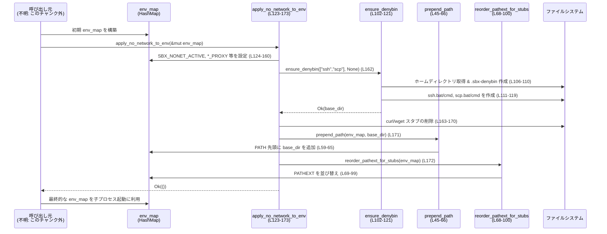

# windows-sandbox-rs/src/env.rs コード解説

---

## 0. ざっくり一言

Windows サンドボックス内で子プロセスに渡す環境変数 `HashMap<String, String>` を調整するユーティリティ群です。  
PATH/PATHEXT、ページャ設定、ネットワーク制限用の環境変数や「denybin」ディレクトリの生成を行います。

---

## 1. このモジュールの役割

### 1.1 概要

このモジュールは、Windows 上でサンドボックス化されたプロセスに対して安全な環境変数セットを用意するための関数を提供します（`windows-sandbox-rs/src/env.rs:L1-173`）。

具体的には次の問題を扱います。

- Linux 由来の `/dev/null` パスを Windows の `NUL` に正規化する（`normalize_null_device_env`、L9-19）。
- 対話的でないページャを強制するための環境変数を補完する（`ensure_non_interactive_pager`、L21-29）。
- 親プロセスの PATH/PATHEXT を必要に応じて引き継ぐ（`inherit_path_env`、L31-43）。
- ネットワークを実質的に無効化するために各種プロキシ・ツール関連の環境・スタブスクリプトを設定する（`apply_no_network_to_env`、L123-173）。

### 1.2 アーキテクチャ内での位置づけ

このファイルは「環境変数マップ（`HashMap<String, String>`）を加工する純粋なユーティリティ」として設計されており、プロセス起動自体は別モジュールが行う前提と思われます。ただし、呼び出し元の具体的なモジュール名はこのチャンクには現れません。

依存関係は下図のようになります。



- 呼び出し元は `HashMap<String, String>` を用意し、本モジュールの関数に渡して環境を加工した後、`std::process::Command` 等で子プロセスに渡す、という形が想定されます（ただしコードからは直接は分かりません）。

### 1.3 設計上のポイント

コードから読み取れる設計上の特徴を列挙します。

- **状態を持たないユーティリティ**
  - すべての関数はグローバル状態を持たず、引数の `&mut HashMap<String, String>` に対して破壊的変更を行います（例: `normalize_null_device_env`、L9-19）。
  - 外部状態にアクセスするのは OS の環境変数 (`std::env::var`) とファイルシステムのみです（L32-42, L46-50, L69-73, L110-119, L167-168）。

- **エラーハンドリング方針**
  - ファイルシステムやホームディレクトリ取得など OS 依存部分には `anyhow::Result` を用い、`?` 演算子でエラーを呼び出し元へ伝播します（`ensure_denybin`、L102-121、`apply_no_network_to_env`、L123-173）。
  - 環境変数加工だけの関数は `Result` を返さず、失敗しない（panic しない）実装になっています。

- **環境継承と上書きのバランス**
  - PATH/PATHEXT は、呼び出し元が明示的にセットしていない場合にだけ親プロセスの値を引き継ぎます（`inherit_path_env`、L31-43）。
  - ネットワーク制限では、既に設定済みのプロキシ環境変数を尊重し、未設定の場合のみデフォルト値を埋めます（`entry(...).or_insert_with(...)`、L125-160）。

- **Windows 特化の調整**
  - PATH 区切りに `;` を利用し、`PATHEXT` を `.BAT` / `.CMD` 優先に並び替えるなど、Windows コマンド検索の挙動を前提とした処理が行われます（L45-66, L68-100）。
  - Linux 由来の `/dev/null` と Windows の `NUL` を橋渡しする変換を提供します（L9-19）。

- **並行性の前提**
  - すべての公開関数は `&mut HashMap<_, _>` を要求するため、Rust の所有権・借用ルールにより、同じ環境マップに対する同時書き込みがコンパイル時に禁止されます。
  - ファイルシステム操作 (`ensure_denybin` 内) はプロセス間で共有され得ますが、その競合条件についての特別な制御は実装されていません（L110-119, L163-168）。

---

## 2. 主要な機能・コンポーネント一覧

### 2.1 関数・コンポーネントインベントリー

このファイルで定義されている主な関数の一覧です。

| 名前 | 種別 | 公開 | 役割 / 用途 | 定義位置 |
|------|------|------|-------------|----------|
| `normalize_null_device_env` | 関数 | 公開 (`pub`) | 環境変数値が `/dev/null` または `\\dev\\null` になっているものを Windows の `NUL` に正規化する | `windows-sandbox-rs/src/env.rs:L9-19` |
| `ensure_non_interactive_pager` | 関数 | 公開 (`pub`) | ページャ関連環境変数（`GIT_PAGER`, `PAGER`, `LESS`）を非対話的な設定に補完する | `windows-sandbox-rs/src/env.rs:L21-29` |
| `inherit_path_env` | 関数 | 公開 (`pub`) | 呼び出し元の `PATH` / `PATHEXT` を、`env_map` に未設定の場合のみコピーする | `windows-sandbox-rs/src/env.rs:L31-43` |
| `prepend_path` | 関数 | 非公開 (`fn`) | 指定ディレクトリを `PATH` の先頭に追加する（既に先頭なら何もしない） | `windows-sandbox-rs/src/env.rs:L45-66` |
| `reorder_pathext_for_stubs` | 関数 | 非公開 (`fn`) | `PATHEXT` 内の `.BAT` / `.CMD` を先頭に移動し、スタブスクリプトが優先されるように並び替える | `windows-sandbox-rs/src/env.rs:L68-100` |
| `ensure_denybin` | 関数 | 非公開 (`fn`) | 指定ツール名に対する失敗用スタブ（`.bat`/`.cmd`）を `denybin` ディレクトリに生成し、そのパスを返す | `windows-sandbox-rs/src/env.rs:L102-121` |
| `apply_no_network_to_env` | 関数 | 公開 (`pub`) | ネットワークアクセスを実質的に禁止するための環境変数やスタブ PATH/PATHEXT の設定を行う | `windows-sandbox-rs/src/env.rs:L123-173` |

独自の構造体・列挙体・型エイリアスは定義されていません（`use` はすべて外部/標準ライブラリのものです）。

### 2.2 主要な機能の一覧（機能レベル）

- `/dev/null` の正規化:  
  Linux で使われる `/dev/null` を Windows の `NUL` に自動変換します（L9-19）。
- 非対話的ページャのセットアップ:  
  `GIT_PAGER`, `PAGER`, `LESS` を `more.com` / 空文字に設定し、対話的ページャを抑制します（L21-29）。
- PATH / PATHEXT 継承と調整:  
  親プロセスから PATH/PATHEXT をコピーし、必要に応じてディレクトリを先頭に追加しつつ、`.BAT`/`.CMD` を PATHEXT の先頭に移動します（L31-43, L45-66, L68-100）。
- denybin ディレクトリの生成とスタブスクリプト作成:  
  ホームディレクトリ配下（または指定ディレクトリ）に `.sbx-denybin` を作成し、指定ツール名に対応する `.bat` / `.cmd` ファイルを書き出します（L102-121）。
- 「ネットワーク禁止」環境の構築:  
  各種プロキシ・パッケージマネージャ・Git 用の環境変数をオフラインモードにし、`ssh`/`scp` のスタブスクリプトを PATH 先頭に置いて実行を失敗させるようにします（L123-173）。

---

## 3. 公開 API と詳細解説

### 3.1 型一覧（構造体・列挙体など）

このファイルで新たに定義される公開構造体・列挙体はありません。

| 名前 | 種別 | 役割 / 用途 |
|------|------|-------------|
| なし | - | このファイルは関数のみを定義し、独自のデータ型は定義していません |

呼び出し側が主に扱うのは標準ライブラリの次の型です。

- `HashMap<String, String>`: 環境変数名と値を保持するマップ（`use std::collections::HashMap;`、L3）。
- `Result<T>`: `anyhow::Result` による汎用エラー型（L1）。
- `Path`, `PathBuf`: denybin ディレクトリのパス表現（L7, L102-121）。

### 3.2 関数詳細

#### `normalize_null_device_env(env_map: &mut HashMap<String, String>)`  

**定義位置:** `windows-sandbox-rs/src/env.rs:L9-19`

**概要**

環境変数マップ内の値のうち、`/dev/null` または `\\dev\\null`（大文字小文字を無視）になっているものを Windows の null デバイスである `"NUL"` に置き換えます（L9-19）。  
環境変数名は限定せず、すべてのエントリを対象にしています。

**引数**

| 引数名 | 型 | 説明 |
|--------|----|------|
| `env_map` | `&mut HashMap<String, String>` | 修正対象の環境変数マップ。キーは変数名、値は文字列化された値を表します。 |

**戻り値**

- 返り値はありません（ユニット型 `()`）。`env_map` がインプレースで更新されます。

**内部処理の流れ**

1. `env_map` の全キーをクローンして `Vec<String>` に収集します（L10）。  
   - これはイテレーション中にマップを書き換えても安全にするためです。
2. 収集したキーに対してループを回します（L11）。
3. 各キー `k` について、`env_map.get(&k)` で値を取得し、そのクローン `v` を得ます（L12）。
4. `v.trim().to_ascii_lowercase()` で前後の空白を削除しつつ小文字化し、比較用の文字列 `t` を作ります（L13）。
5. `t` が `"/dev/null"` または `"\\\\dev\\\\null"`（実際の文字列としては `\\dev\\null`）のどちらかと一致する場合、`env_map.insert(k, "NUL".to_string())` を行い、値を `"NUL"` に置き換えます（L14-16）。

**Examples（使用例）**

```rust
use std::collections::HashMap;
use windows_sandbox_rs::env::normalize_null_device_env; // 仮のモジュールパス

fn main() {
    let mut env_map = HashMap::new();                                   // 空の環境マップを作成
    env_map.insert("OUTPUT".into(), "/dev/null".into());                // Linux 風の null デバイス
    env_map.insert("LOG".into(), "\\dev\\null".into());                 // Windows 風だが /dev 互換パス

    normalize_null_device_env(&mut env_map);                            // 正規化を適用

    assert_eq!(env_map.get("OUTPUT").unwrap(), "NUL");                  // NUL に置き換わる
    assert_eq!(env_map.get("LOG").unwrap(), "NUL");                     // こちらも NUL に置き換わる
}
```

**Errors / Panics**

- この関数は `Result` を返さず、内部でも `unwrap` やインデックスアクセスを行っていないため、通常の使用で panic する可能性は見当たりません（L9-19）。
- I/O や OS 依存の処理は行っていません。

**Edge cases（エッジケース）**

- 空文字列や空白のみの値:  
  `trim()` により空文字となり、比較条件に合致しないため変更されません。
- `/DEV/NULL` のような大文字混じり:  
  `to_ascii_lowercase()` により `/dev/null` と等しくなるため置き換え対象になります（L13-14）。
- パスの前後に空白がある場合（例: `"  /dev/null  "`）:  
  `trim()` により空白が除去され、比較対象となります（L13）。
- `/dev/null` を部分文字列として含むが完全一致しない場合  
  例: `"/dev/null.log"` などは完全一致ではないため変更されません。

**使用上の注意点**

- すべての環境変数が対象になるため、`/dev/null` を値としてもつ他用途の変数も `"NUL"` に変わります。  
  その挙動が問題になる場合は、呼び出し側で対象としたい環境変数を絞ってから `env_map` を構築する必要があります。
- 並行性の観点では、`&mut HashMap` を取るため同一マップに対する同時呼び出しはコンパイル時に禁止されますが、複数スレッドで別々のマップを処理することは安全です。

---

#### `ensure_non_interactive_pager(env_map: &mut HashMap<String, String>)`  

**定義位置:** `windows-sandbox-rs/src/env.rs:L21-29`

**概要**

ページャ関連の環境変数を、対話的でない安全な値に補完します（L21-29）。

- `GIT_PAGER` が未設定なら `"more.com"` を設定。
- `PAGER` が未設定なら `"more.com"` を設定。
- `LESS` が未設定なら空文字列 `""` を設定。

**引数**

| 引数名 | 型 | 説明 |
|--------|----|------|
| `env_map` | `&mut HashMap<String, String>` | ページャ設定を注入する対象の環境変数マップ |

**戻り値**

- 返り値はありません。`env_map` に直接反映されます。

**内部処理の流れ**

1. `env_map.entry("GIT_PAGER".into()).or_insert_with(|| "more.com".into());`  
   - `GIT_PAGER` キーが存在しない場合は `"more.com"` を挿入します（L22-24）。
2. 同様に `PAGER` キーが未設定の場合 `"more.com"` を挿入します（L25-27）。
3. `LESS` キーが未設定の場合は空文字列を挿入します（L28）。

既に値がある場合は変更しません（`entry(...).or_insert_with(...)` の挙動）。

**Examples（使用例）**

```rust
use std::collections::HashMap;
use windows_sandbox_rs::env::ensure_non_interactive_pager;

fn main() {
    let mut env_map = HashMap::new();                               // 新しい環境マップ
    env_map.insert("PAGER".into(), "less".into());                  // 既に設定済みの PAGER

    ensure_non_interactive_pager(&mut env_map);                     // 非対話的設定を適用

    assert_eq!(env_map.get("GIT_PAGER").unwrap(), "more.com");      // 未設定だったので more.com
    assert_eq!(env_map.get("PAGER").unwrap(), "less");              // 既存値は維持される
    assert_eq!(env_map.get("LESS").unwrap(), "");                   // 未設定だったので空文字
}
```

**Errors / Panics**

- I/O を行わず、`HashMap::entry` だけを使っているため、panic 要因はありません（L21-29）。

**Edge cases**

- 既に `GIT_PAGER` / `PAGER` / `LESS` が設定されている場合は何も変更しません。
- キーの比較は完全一致かつ大文字小文字を区別します。  
  例: `"pager"` や `"Git_Pager"` などは別のキーとして扱われます。

**使用上の注意点**

- この関数はページャの対話的機能を抑制する目的で `LESS` を空にしています。`LESS` に特定のオプションを設定したい場合は、この関数呼び出し後に上書きする必要があります。
- ネットワーク制限とは独立した機能なので、必要に応じて `apply_no_network_to_env` とは別に呼び出す設計が考えられます（ただし、呼び出し順などはこのチャンクからは分かりません）。

---

#### `inherit_path_env(env_map: &mut HashMap<String, String>)`  

**定義位置:** `windows-sandbox-rs/src/env.rs:L31-43`

**概要**

`env_map` に `PATH` / `PATHEXT` が含まれていない場合に限り、現在のプロセス環境からそれらをコピーします（L31-43）。  
これにより、親プロセスの PATH/PATHEXT を「明示的に上書きしない限り」保持します。

**引数**

| 引数名 | 型 | 説明 |
|--------|----|------|
| `env_map` | `&mut HashMap<String, String>` | PATH/PATHEXT を補完する対象の環境マップ |

**戻り値**

- 返り値はありません。`env_map` が更新されます。

**内部処理の流れ**

1. `if !env_map.contains_key("PATH") && let Ok(path) = env::var("PATH") { ... }`（L32-36）
   - `env_map` に `PATH` が存在しないか確認します。
   - 存在しない場合、`std::env::var("PATH")` で OS の環境変数から取得を試みます。
   - 取得に成功したら `env_map.insert("PATH".into(), path);` で挿入します（L36）。
2. 同様に `PATHEXT` についてチェックし、未設定かつ `env::var("PATHEXT")` が成功したときのみ挿入します（L38-42）。

**Examples（使用例）**

```rust
use std::collections::HashMap;
use windows_sandbox_rs::env::inherit_path_env;

fn main() {
    let mut env_map = HashMap::new();                                // PATH/PATHEXT を含まないマップ

    inherit_path_env(&mut env_map);                                  // 親プロセスから継承

    // このアサーションは、呼び出し元プロセスに PATH が設定されていることを前提とします
    assert!(env_map.contains_key("PATH"));                           // PATH が補完されるはず
    // PATHEXT は OS によっては存在しないこともあるため、必須とは限りません
}
```

**Errors / Panics**

- `env::var` の戻り値は `Result` ですが、`if let Ok(...)` で成功時のみ使うため、失敗しても panic せず単に挿入しないだけです（L32-42）。
- 他に panic 要因となる処理はありません。

**Edge cases**

- OS 環境に `PATH` や `PATHEXT` が全く存在しない場合、`env_map` にも追加されません。
- `env_map` に既にキーが存在する場合は、その値を尊重し、OS からはコピーしません。
- キー名の大文字小文字は固定文字列 `"PATH"` / `"PATHEXT"` を使用しているため、Windows の環境変数が大文字・小文字混在であっても問題ありません（Windows はケースインセンシティブですが、`HashMap` 上では別物として扱われます）。

**使用上の注意点**

- サンドボックス内で PATH を完全に制御したい場合、`inherit_path_env` を呼ばずに手動で PATH を構築するほうが望ましいケースもありえます。  
  この関数は「既定では親の PATH を継承する」振る舞いを提供します。
- `apply_no_network_to_env` 自体は PATH を継承しません。PATH 継承が必要な場合は、呼び出し元で `inherit_path_env` と組み合わせる必要があります（呼び出し順は設計による）。

---

#### `prepend_path(env_map: &mut HashMap<String, String>, prefix: &str)`  

**定義位置:** `windows-sandbox-rs/src/env.rs:L45-66`（非公開ヘルパー）

**概要**

指定ディレクトリ `prefix` を `PATH` の先頭に付け加えます（L45-66）。  
既に `PATH` の先頭が `prefix`（大文字小文字無視）である場合は何もしません。

**引数**

| 引数名 | 型 | 説明 |
|--------|----|------|
| `env_map` | `&mut HashMap<String, String>` | PATH を変更する対象の環境マップ |
| `prefix` | `&str` | 先頭に追加したいディレクトリのパス文字列 |

**戻り値**

- 返り値はありません。`env_map` の `"PATH"` が更新されます。

**内部処理の流れ**

1. 既存 PATH を決定する（L46-50）。
   - `env_map.get("PATH").cloned()` で `env_map` 内の PATH を優先的に取得。
   - なければ `env::var("PATH").ok()` で OS 環境の PATH を参照。
   - どちらもなければ空文字列を採用（`unwrap_or_default()`）。
2. 既存 PATH を `';'` で分割して `Vec<String>` に格納（L51）。
3. 最初の要素が `prefix` と大文字小文字無視で一致するかを判定（L52-55）。
   - 一致する場合はすでに先頭にあるとみなし、早期リターン（L57）。
4. 新しい PATH 文字列を構築（L59-64）。
   - `new_path = prefix` とし、既存 PATH が空でなければ `";"` + 既存 PATH を連結。
5. `env_map.insert("PATH".into(), new_path);` で更新（L65）。

**Examples（使用例）**

この関数は非公開ですが、`apply_no_network_to_env` 内部で使用される形を簡略化して示します。

```rust
use std::collections::HashMap;
// prepend_path は非公開のため、ここでは擬似的な例として説明用にのみ記載します。

fn example_prepend_path_like(env_map: &mut HashMap<String, String>, prefix: &str) {
    // PATH を prefix;元PATH の形にするイメージ
    let existing = env_map.get("PATH").cloned().unwrap_or_default();  // 既存 PATH を取得
    let new_path = if existing.is_empty() {
        prefix.to_string()                                            // 既存 PATH が空なら prefix のみ
    } else {
        format!("{prefix};{existing}")                                // 先頭に prefix を追加
    };
    env_map.insert("PATH".into(), new_path);                          // PATH を更新
}
```

**Errors / Panics**

- `env::var("PATH")` の失敗は `ok()` により無視され、空文字列にフォールバックするため panic しません（L46-50）。
- ベクタへのインデックスアクセスは `.first()` のみで安全に扱っており、他に panic 要因はありません。

**Edge cases**

- PATH が空（または存在しない）場合  
  → `PATH` は `prefix` のみになります（L59-63）。
- PATH の先頭要素が、パス表現としては同じだが大文字小文字が異なる場合  
  → `eq_ignore_ascii_case` により同一とみなされるため、新規追加されません（L52-55）。
- PATH に `prefix` が 2 番目以降に存在していても、先頭にもう一度追加されます。重複を完全に排除する機能はありません。

**使用上の注意点**

- PATH の重複要素を避けたい場合、この関数だけでは不十分であり、別途重複除去ロジックが必要になります。
- `apply_no_network_to_env` は `prefix` として denybin ディレクトリを渡します（`to_string_lossy()` ベース、L171）。  
  そのため、パス文字列表現が OS 上の実パスと完全に一致している必要がありますが、これは通常 `PathBuf` → `String` 変換で満たされます。

---

#### `reorder_pathext_for_stubs(env_map: &mut HashMap<String, String>)`  

**定義位置:** `windows-sandbox-rs/src/env.rs:L68-100`（非公開ヘルパー）

**概要**

`PATHEXT` の値を解析し、`.BAT` と `.CMD` を先頭に移動します（L68-100）。  
これにより、`ssh` や `scp` のスタブ `.bat` / `.cmd` ファイルが、同名の `.exe` より優先されます。

**引数**

| 引数名 | 型 | 説明 |
|--------|----|------|
| `env_map` | `&mut HashMap<String, String>` | PATHEXT を並び替える対象の環境マップ |

**戻り値**

- 返り値はありません。`env_map["PATHEXT"]` が並び替え後の文字列で上書きされます。

**内部処理の流れ**

1. 初期 PATHEXT の決定（L69-73）。
   - `env_map.get("PATHEXT").cloned()` を優先。
   - なければ `env::var("PATHEXT")` を試み、成功すればその値。
   - どちらもなければデフォルトの `".COM;.EXE;.BAT;.CMD"` を使用。
2. `;` 区切りで分割し、空でないものだけを `Vec<String>` に格納（L74-78）。
3. `exts_norm` として、各要素を大文字化した別ベクタを作成（L79）。
4. `want = [".BAT", ".CMD"]` を順に見て、`exts_norm` 上での位置を検索し、見つかったら元の大文字小文字を保った拡張子を `front` ベクタに追加（L80-86）。
5. `rest` ベクタには、`.BAT` / `.CMD` 以外の拡張子だけを保持（L87-95）。
6. `combined = front + rest` とし、`;` で連結して `PATHEXT` として挿入（L96-99）。

**Examples（使用例）**

```rust
use std::collections::HashMap;
// reorder_pathext_for_stubs は非公開なので擬似コードとしてイメージを示します。

fn main() {
    let mut env_map = HashMap::new(); 
    env_map.insert("PATHEXT".into(), ".EXE;.BAT;.CMD;.COM".into());   // 元の PATHEXT

    // ここで reorder_pathext_for_stubs と同様の処理が行われると想定
    // 結果は ".BAT;.CMD;.EXE;.COM" のように .BAT/.CMD が先頭に移動する
}
```

**Errors / Panics**

- `env::var("PATHEXT")` は `ok()` で Result から値だけ取り出し、失敗時は無視するため panic しません（L69-73）。
- `exts_norm[*i]` の `*i` は `exts` の `enumerate()` から得た添え字であり、長さは一致しているため index out of bounds は生じません（L87-93）。
- 文字列操作のみで I/O は行われません。

**Edge cases**

- もともとの PATHEXT に `.BAT` や `.CMD` が含まれない場合  
  → `front` が空のままとなり、`rest` は元のリストとほぼ同じ順序になり、そのまま設定されます。
- `.bat` / `.cmd` のような小文字・混在ケース  
  → 大文字化して比較するため、位置は正しく拾われます。元の大文字小文字は保持されます（L79-86）。
- `.BAT` / `.CMD` が複数回出現する場合  
  → `position` は最初の位置のみ返し、`rest` では `.BAT` / `.CMD` をすべて除外するため、最終的には `.BAT` / `.CMD` はそれぞれ 1 回ずつに正規化されます（L83-85, L87-95）。

**使用上の注意点**

- この並び替えは `.BAT` / `.CMD` に特化しており、他の拡張子の優先順位は保持されますが `.BAT` / `.CMD` との相対順序は変化します。
- `apply_no_network_to_env` で denybin ディレクトリに置かれた `.bat` / `.cmd` を優先させるための前提処理なので、`PATHEXT` を別用途で厳密に制御したい場合は影響を考慮する必要があります。

---

#### `ensure_denybin(tools: &[&str], denybin_dir: Option<&Path>) -> Result<PathBuf>`  

**定義位置:** `windows-sandbox-rs/src/env.rs:L102-121`（非公開ヘルパー）

**概要**

指定されたツール名（例: `"ssh"`, `"scp"`）について、それぞれ `.bat` / `.cmd` 拡張子を持つ失敗用スタブスクリプトを作成し、そのディレクトリパスを返します（L102-121）。  
スタブは Windows バッチファイルとしてコマンド実行を失敗（終了コード 1）させることを意図していると解釈できます。

**引数**

| 引数名 | 型 | 説明 |
|--------|----|------|
| `tools` | `&[&str]` | スタブを生成したいツール名のスライス（例: `&["ssh", "scp"]`） |
| `denybin_dir` | `Option<&Path>` | スタブを配置するベースディレクトリ。`None` の場合はホームディレクトリ配下の `~/.sbx-denybin` が使われます。 |

**戻り値**

- `Result<PathBuf>`:
  - `Ok(base_dir)`: スタブが存在するベースディレクトリのパス。
  - `Err(e)`: ホームディレクトリ取得失敗やディレクトリ作成・ファイル作成・書き込みに失敗した場合などのエラー。

**内部処理の流れ**

1. ベースディレクトリの決定（L102-109）。
   - `denybin_dir` が `Some(p)` の場合は `p.to_path_buf()` をそのまま利用（L103-104）。
   - `None` の場合は `home_dir()` を呼び出し、`None` のときは `anyhow!("no home dir")` を返す（L106）。
   - 得られたホームディレクトリに `".sbx-denybin"` を結合して `base` とする（L107）。
2. `fs::create_dir_all(&base)?;` によりディレクトリを作成（既に存在していてもエラーになりません）（L110）。
3. 各ツール名について、`".bat"` と `".cmd"` の 2 種類の拡張子に対してループ（L111-118）。
   - `path = base.join(format!("{tool}{ext}"));` でファイルパスを構築（L113）。
   - `!path.exists()` の場合のみ新規作成（L114-116）。
   - `File::create(&path)?` でファイルを開き、`write_all` で内容を書き込み（L115-116）。
4. 最後に `Ok(base)` を返して終了（L120）。

**スタブ内容についての補足（文字列リテラル）**

```rust
f.write_all(b"@echo off\\r\\nexit /b 1\\r\\n")?;
```

- このバイト文字列では `\\r` / `\\n` と二重にバックスラッシュが書かれているため、実際のファイルには文字列 `\r\n` がそのまま書き込まれます（CR・LF の制御文字ではない）。  
- もし意図が「実際の改行（CRLF）を挿入すること」であれば、通常は `b"@echo off\r\nexit /b 1\r\n"` のように書きます。
- どちらが意図か、このチャンクだけからは断定できませんが、現在のコードでは 1 行に `@echo off\r\nexit /b 1\r\n` が記述されたバッチになると考えられます。

**Examples（使用例）**

この関数は非公開ですが、`apply_no_network_to_env` から `&["ssh", "scp"]` として利用されています（L162）。擬似的に使用例を示します。

```rust
use std::path::Path;
use windows_sandbox_rs::env::apply_no_network_to_env;  // 公開関数経由で利用される

fn main() -> anyhow::Result<()> {
    let mut env_map = std::collections::HashMap::new();          // 環境マップを用意
    apply_no_network_to_env(&mut env_map)?;                      // 内部で ensure_denybin が呼ばれる
    // この時点で、ホームディレクトリ配下に .sbx-denybin/ssh.bat などが生成されている
    Ok(())
}
```

**Errors / Panics**

- `home_dir()` が `None` を返した場合 `anyhow!("no home dir")` により `Err` が返されます（L106）。
- `create_dir_all`, `File::create`, `write_all` のいずれかが失敗した場合も `?` 演算子で `Err` を返します（L110, L115-116）。
- panic を明示的に発生させるコードはありません。

**Edge cases**

- `denybin_dir` に存在しないディレクトリを渡した場合  
  → `create_dir_all` により作成されます（L110）。
- 既に同名のファイルが存在する場合  
  → `path.exists()` が真になり、新規作成や上書きは行われません（L114-116）。そのため、手動で作成したスタブが維持されます。
- 同時に複数プロセスがこの関数を呼び出す場合  
  → `exists` チェックと `File::create` の間にレースコンディションはありますが、`File::create` 自体は既存ファイルを再作成（トランケート）するため、機能的には問題なく完了すると考えられます。どちらのプロセスが最後に書き込むかは未定です。

**使用上の注意点**

- この関数は `Result` を返すため、呼び出し側でエラー処理が必須です。`apply_no_network_to_env` ではそのまま `?` で伝播しています（L162）。
- `.sbx-denybin` ディレクトリの場所は `denybin_dir` で上書き可能ですが、現状の公開 API (`apply_no_network_to_env`) からは `None` 固定で呼ばれており、利用者側が変更することはできません。

---

#### `apply_no_network_to_env(env_map: &mut HashMap<String, String>) -> Result<()>`  

**定義位置:** `windows-sandbox-rs/src/env.rs:L123-173`

**概要**

環境変数マップを「ネットワークアクセス禁止」状態に近づけるための設定を一括で適用します（L123-173）。

主な効果:

- 各種プロキシ環境変数をループバックアドレス（`127.0.0.1:9`）に設定。
- Python/pip、npm、Cargo などのパッケージマネージャをオフラインモードに。
- Git に対して HTTP(S) プロキシ、SSH コマンド無効化、許可プロトコルの制限を設定。
- `ssh`/`scp` の実行を失敗させるスタブを作成し、そのディレクトリを PATH 先頭に設定。
- PATHEXT を再並び替えして `.BAT` / `.CMD` を優先。

**引数**

| 引数名 | 型 | 説明 |
|--------|----|------|
| `env_map` | `&mut HashMap<String, String>` | ネットワーク制限を適用する対象の環境変数マップ |

**戻り値**

- `Result<()>`:
  - `Ok(())`: すべての設定が成功した。
  - `Err(e)`: denybin ディレクトリの作成・スタブ作成などでエラーが発生した。

**内部処理の流れ**

1. フラグ環境変数のセット（L124）。
   - `env_map.insert("SBX_NONET_ACTIVE".into(), "1".into());`  
     ネットワーク制限が有効であることを示す内部用フラグと思われます。
2. HTTP プロキシ系の設定（L125-133, L150-154）。
   - `HTTP_PROXY`, `HTTPS_PROXY`, `ALL_PROXY` を `http://127.0.0.1:9` に設定（未設定時のみ）。
   - Git 用の `GIT_HTTP_PROXY`, `GIT_HTTPS_PROXY` にも同じ値を設定。
   - ポート 9 は discard ポートとして使われることが多く、実質的に接続が無効化されます。
3. NO_PROXY の設定（L135-136）。
   - `NO_PROXY` に `"localhost,127.0.0.1,::1"` を設定（未設定時のみ）。
   - ループバックへのアクセスだけは遮断しない意図と解釈できます。
4. パッケージマネージャ関連のオフライン設定（L138-148, L144-148）。
   - `PIP_NO_INDEX = "1"`
   - `PIP_DISABLE_PIP_VERSION_CHECK = "1"`
   - `NPM_CONFIG_OFFLINE = "true"`
   - `CARGO_NET_OFFLINE = "true"`
5. Git の追加制限（L156-160）。
   - `GIT_SSH_COMMAND = "cmd /c exit 1"`（Git が SSH を使おうとすると即失敗する）。
   - `GIT_ALLOW_PROTOCOLS = ""`（許可プロトコル空、効果は Git の実装依存）。
6. denybin ディレクトリと SSH/ SCP スタブの用意（L162）。
   - `let base = ensure_denybin(&["ssh", "scp"], None)?;`
   - ここで `Result` によるエラー伝播があり、失敗時はそれまでの環境変数変更はそのままで `Err` を返します。
7. curl / wget スタブの削除（L163-170）。
   - `for tool in ["curl", "wget"] { ... }`  
     denybin ディレクトリ内に存在する場合は削除を試み（`fs::remove_file(&p)`）、失敗してもエラーは無視（L167-168）。
8. PATH と PATHEXT の調整（L171-172）。
   - `prepend_path(env_map, &base.to_string_lossy());`  
     denybin ディレクトリを PATH の先頭に追加。
   - `reorder_pathext_for_stubs(env_map);`  
     `.BAT` / `.CMD` を PATHEXT の先頭に移動。
9. `Ok(())` を返して終了（L173）。

**Examples（使用例）**

```rust
use std::collections::HashMap;
use windows_sandbox_rs::env::{
    inherit_path_env,
    ensure_non_interactive_pager,
    normalize_null_device_env,
    apply_no_network_to_env,
};

fn main() -> anyhow::Result<()> {
    let mut env_map = HashMap::new();                             // 空の環境マップを用意

    inherit_path_env(&mut env_map);                               // 親プロセスから PATH/PATHEXT を継承
    ensure_non_interactive_pager(&mut env_map);                   // ページャを非対話的に
    normalize_null_device_env(&mut env_map);                      // /dev/null → NUL
    apply_no_network_to_env(&mut env_map)?;                       // ネットワーク制限を適用

    // ここで env_map を std::process::Command に渡せば、
    // ネットワーク制限された子プロセスを起動できる設計が考えられます
    // （実際の呼び出しコードはこのチャンクには含まれていません）

    Ok(())
}
```

**Errors / Panics**

- `ensure_denybin` で発生する可能性のあるエラーが `?` でそのまま返されます（L162）。
  - ホームディレクトリが取得できない（`"no home dir"`、L106）。
  - denybin ディレクトリ作成・ファイル作成・書き込みに失敗する場合（L110-116）。
- `fs::remove_file` でのエラーは `let _ = fs::remove_file(&p);` により明示的に無視されています（L167-168）。
- 環境変数の操作自体は panic 要因を含みません。

**Edge cases**

- 途中で `ensure_denybin` が失敗した場合  
  → それまで設定された環境変数（プロキシや PIP/Cargo の設定）は残ったまま `Err` が返されます。  
    呼び出し側がロールバックしない限り、部分的に「ネットワーク制限された」状態が残る可能性があります。
- 既にユーザが環境変数を設定している場合  
  → ほとんどのキーは `entry(...).or_insert_with(...)` で「未設定時のみ」設定されるため、ユーザ設定が優先されます（L125-160）。
  → ただし `SBX_NONET_ACTIVE` は常に `"1"` に上書きされます（L124）。
- denybin ディレクトリ内に既に ssh/scp のスタブ以外のファイルがある場合  
  → この関数は ssh/scp の `.bat`/`.cmd` の存在を保証するのみで、それ以外には触れません。
- curl / wget スタブの削除が失敗した場合（権限不足や他プロセスによるロックなど）  
  → エラーを無視するため、スタブが残ったままになることがあります（L166-168）。

**使用上の注意点**

- **安全性・セキュリティの観点**
  - この関数は環境変数と PATH/PATHEXT・スタブスクリプトによってネットワーク利用を抑制しますが、OS レベルの firewall のような完全な防御ではありません。
    - アプリケーションが環境変数を無視して自前のネットワーク設定を行う場合には効果がありません。
    - ユーザが絶対パス指定などで直接 `ssh.exe` を呼び出すと、denybin 経由のスタブを迂回する可能性があります。
  - したがって、「ベストエフォートの制限」であり、強制的な隔離が必要な場合には別の手段と組み合わせる必要があります。
- **並行性**
  - `env_map` は `&mut` で排他的に借用されるため、同じマップへの同時呼び出しはコンパイル時エラーになります。  
    ただし、denybin ディレクトリとスタブファイルを複数プロセスが共有することはあり得ます。
- **実行前提**
  - ホームディレクトリが存在しない環境（極端に制限されたランタイムなど）では `ensure_denybin` がエラーになりうる点に注意が必要です。

---

### 3.3 その他の関数

3.2 でこのファイル内のすべての関数を詳細に説明したため、追加で列挙すべき補助関数はありません。

---

## 4. データフロー

ここでは代表的な処理シナリオとして、`apply_no_network_to_env` を呼び出してネットワーク制限付き環境を構築する流れを示します。

### 4.1 処理の要点

- 呼び出し元はあらかじめ `HashMap<String, String>` 形式の環境マップを構築します。
- `apply_no_network_to_env` はそのマップに対して各種環境変数の設定を行い、`ensure_denybin` を使って denybin ディレクトリとスタブスクリプトを準備します（L123-173）。
- その後、`prepend_path` と `reorder_pathext_for_stubs` により PATH/PATHEXT が調整されます。
- 最終的に、この環境マップを使って子プロセスを起動する想定です（起動コード自体はこのファイルにはありません）。

### 4.2 シーケンス図



このシーケンスから分かるように、`apply_no_network_to_env` が中心となって内部ヘルパー関数とファイルシステムを連携させている構造になっています。

---

## 5. 使い方（How to Use）

### 5.1 基本的な使用方法

`env.rs` の機能を利用して Windows サンドボックス用の環境変数マップを構築し、`std::process::Command` などで子プロセスに渡す典型的な流れの例です。

```rust
use std::collections::HashMap;
use std::process::Command;

// 仮のパス: 実際には crate 名やモジュールパスに合わせて調整が必要です
use windows_sandbox_rs::env::{
    inherit_path_env,
    normalize_null_device_env,
    ensure_non_interactive_pager,
    apply_no_network_to_env,
};

fn main() -> anyhow::Result<()> {
    // 1. ベースとなる環境マップを準備する
    let mut env_map = HashMap::new();                                  // 空のマップを作成
    inherit_path_env(&mut env_map);                                    // 親プロセスの PATH/PATHEXT を継承

    // 2. 各種ユーティリティを順に適用する
    normalize_null_device_env(&mut env_map);                           // /dev/null → NUL
    ensure_non_interactive_pager(&mut env_map);                        // ページャを非対話的に
    apply_no_network_to_env(&mut env_map)?;                            // ネットワーク制限を適用

    // 3. 子プロセス起動時に env_map を渡す（例）
    let mut cmd = Command::new("cmd");                                 // 実行するプログラム
    cmd.arg("/c").arg("echo Hello");                                   // 引数を設定

    // env_map の内容を Command に反映
    cmd.env_clear();                                                   // 既存の OS 環境をクリア（任意）
    for (k, v) in &env_map {                                           // env_map の全ての key/value を
        cmd.env(k, v);                                                 // 子プロセスの環境に設定
    }

    let status = cmd.status()?;                                        // 子プロセスを起動
    println!("exit status: {status}");                                 // 終了ステータスの確認

    Ok(())
}
```

### 5.2 よくある使用パターン

1. **ネットワーク制限だけを適用する**

   既に環境マップを持っている場合、ネットワーク制限だけを後から追加することができます。

   ```rust
   let mut env_map = existing_env_map;                         // 既存のマップを引き継ぎ
   apply_no_network_to_env(&mut env_map)?;                     // ネットワーク制限だけ後付け
   ```

2. **ページャ設定のみを利用する**

   ネットワーク制限は不要で、VSCode のターミナル等で Git のページャだけを抑制したい場合など。

   ```rust
   let mut env_map = HashMap::new();                           // 任意の環境マップ
   ensure_non_interactive_pager(&mut env_map);                 // ページャだけ非対話に
   ```

3. **PATH を独自に構築しつつ denybin だけ利用する**

   現時点の API では `ensure_denybin` は非公開のため、denybin を単独で利用することはできません。  
   そのため、「PATH は完全に独自構成、denybin だけ利用」という使い方をするには、このファイルに対して機能追加（`pub fn` の追加）または別のラッパー関数の定義が必要になります。

### 5.3 よくある間違い（想定）

このコードから推測できる、「起こりそうな誤用」とその修正例です。

```rust
use std::collections::HashMap;
use windows_sandbox_rs::env::apply_no_network_to_env;

// 間違い例: env_map に変更を加えているが、それを子プロセスに渡していない
fn wrong_usage() -> anyhow::Result<()> {
    let mut env_map = HashMap::new();
    apply_no_network_to_env(&mut env_map)?;             // env_map はネットワーク制限付きに

    // ここで Command を起動するが、OS のデフォルト環境を使ってしまっている
    let status = std::process::Command::new("cmd")
        .arg("/c")
        .arg("echo Hello")
        .status()?;                                     // env_map は使われていない

    println!("status: {status}");
    Ok(())
}

// 正しい例: env_map の内容を Command に反映してから起動する
fn correct_usage() -> anyhow::Result<()> {
    let mut env_map = HashMap::new();
    apply_no_network_to_env(&mut env_map)?;             // env_map を構築

    let mut cmd = std::process::Command::new("cmd");
    cmd.arg("/c").arg("echo Hello");

    cmd.env_clear();                                    // 既存環境をクリア
    for (k, v) in &env_map {
        cmd.env(k, v);                                  // apply_no_network_to_env の結果をすべて設定
    }

    let status = cmd.status()?;
    println!("status: {status}");
    Ok(())
}
```

### 5.4 使用上の注意点（まとめ）

- **環境変数ベースの制限であること**
  - ネットワーク制限は主に環境変数（プロキシやオフラインフラグ）と PATH/PATHEXT によるものであり、OS レベルの防御ではありません。
  - セキュリティ的に「完全な隔離」を必要とする場合は、このモジュールだけには依存せず、他の制限機構と併用する必要があります。

- **部分的適用の可能性**
  - `apply_no_network_to_env` は途中でエラーが出た場合でも、一部の環境変数は既に変更された状態のままになります（L124-160, L162）。
  - そのため、呼び出し側で `Err` を受け取った場合、環境を破棄し直すなどの対応が必要になることがあります。

- **ホームディレクトリ依存**
  - denybin ディレクトリはホームディレクトリに作成されるため、存在しない／利用できない環境ではエラーになる可能性があります（L106-110）。
  - 特権分離されたサービスなどでは適用可否を確認する必要があります。

- **Windows 専用の前提**
  - `/dev/null` → `NUL` 変換や PATHEXT の扱いなど、すべて Windows を前提とした設計です。  
    他 OS で利用する場合、挙動が意味を持たない／意図しない結果になる可能性があります。

---

## 6. 変更の仕方（How to Modify）

### 6.1 新しい機能を追加する場合

例として、「別のパッケージマネージャ（例: `YARN`）用のオフライン設定を追加したい」とします。

1. **追加する環境変数の決定**
   - どの環境変数を設定すべきかを調査し、キー名と値を決めます。
2. **適切な関数に追記**
   - ネットワーク制限に関係するため、`apply_no_network_to_env`（L123-173）に `env_map.entry("YARN_OFFLINE".into()).or_insert_with(|| "true".into());` のように追記するのが自然です。
3. **既存のパターンに合わせる**
   - 既存の記述と同様に `entry(...).or_insert_with(...)` を用いて「既に利用者が設定している場合は尊重する」形に揃えます（L125-160 の既存パターンを参照）。
4. **テストまたは確認コードを用意**
   - このファイルにはテストコードが含まれていないため、別ファイルでユニットテストを追加するか、簡単な実行例で動作確認を行う必要があります。

### 6.2 既存の機能を変更する場合

1. **影響範囲の確認**
   - 変更したい関数がどこから呼ばれているか、このチャンクからは分からないため、リポジトリ全体で `apply_no_network_to_env` などのシンボル名検索が必要です。
2. **契約（前提条件・返り値）を守る**
   - 例えば `apply_no_network_to_env` のシグネチャ `fn(...) -> Result<()>` を変えると呼び出し元がコンパイルエラーになるため、可能であればシグネチャは保ったまま内部の詳細のみ変更するのが安全です。
   - `inherit_path_env` が「未設定時のみ継承する」契約を暗黙に持っているように、意味的な契約も変更前に明確化しておく必要があります（L31-43）。
3. **エラー処理の方針を維持**
   - 現在はファイルシステム関連の失敗を `Err` として返し、`remove_file` など一部のエラーは無視する、という方針です（L167-168）。
   - 新しい I/O 処理を追加する場合も、この方針に従うかどうかを検討し、一貫性を保つことが望ましいです。
4. **テスト・動作確認**
   - 特に PATH/PATHEXT の並びを変えるロジックは、Windows コマンドの解決順に敏感です。変更時には実際に Windows 上でコマンド解決が期待どおりになるか確認する必要があります。

---

## 7. 関連ファイル

このチャンクには、`env.rs` を直接呼び出す他のモジュールやテストコードへの参照は含まれていません。そのため、リポジトリ内の厳密な関連ファイル一覧は不明です。

このファイルから依存している外部クレート・標準ライブラリを参考として挙げます。

| パス / クレート | 役割 / 関係 |
|-----------------|------------|
| `anyhow` （`use anyhow::{anyhow, Result};`、L1） | エラー処理に `anyhow::Result` とエラーメッセージ生成用の `anyhow!` マクロを使用 |
| `dirs_next::home_dir` （L2） | ユーザのホームディレクトリパスを取得し、`.sbx-denybin` の作成ベースとして利用 |
| `std::env` （L4, L32-40, L46-50, L69-73） | 親プロセスの環境変数（PATH, PATHEXT）取得に使用 |
| `std::fs` / `std::fs::File` （L5, L110-111, L113-119, L167-168） | denybin ディレクトリの作成、スタブスクリプトの生成・削除に使用 |
| `std::path::{Path, PathBuf}` （L7, L102-121） | denybin ディレクトリとスタブファイルのパス表現に使用 |

内部的には、この `env.rs` が「環境変数加工」の中心モジュールとして、プロセス起動を扱うモジュール（例: `command.rs` や `sandbox.rs` などが存在する可能性がありますが、このチャンクからは名称・構造は分かりません）から呼び出される設計と解釈できます。
