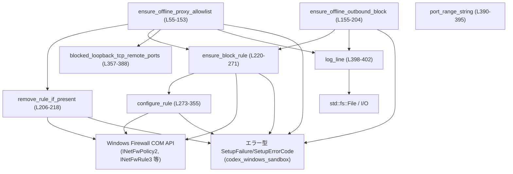
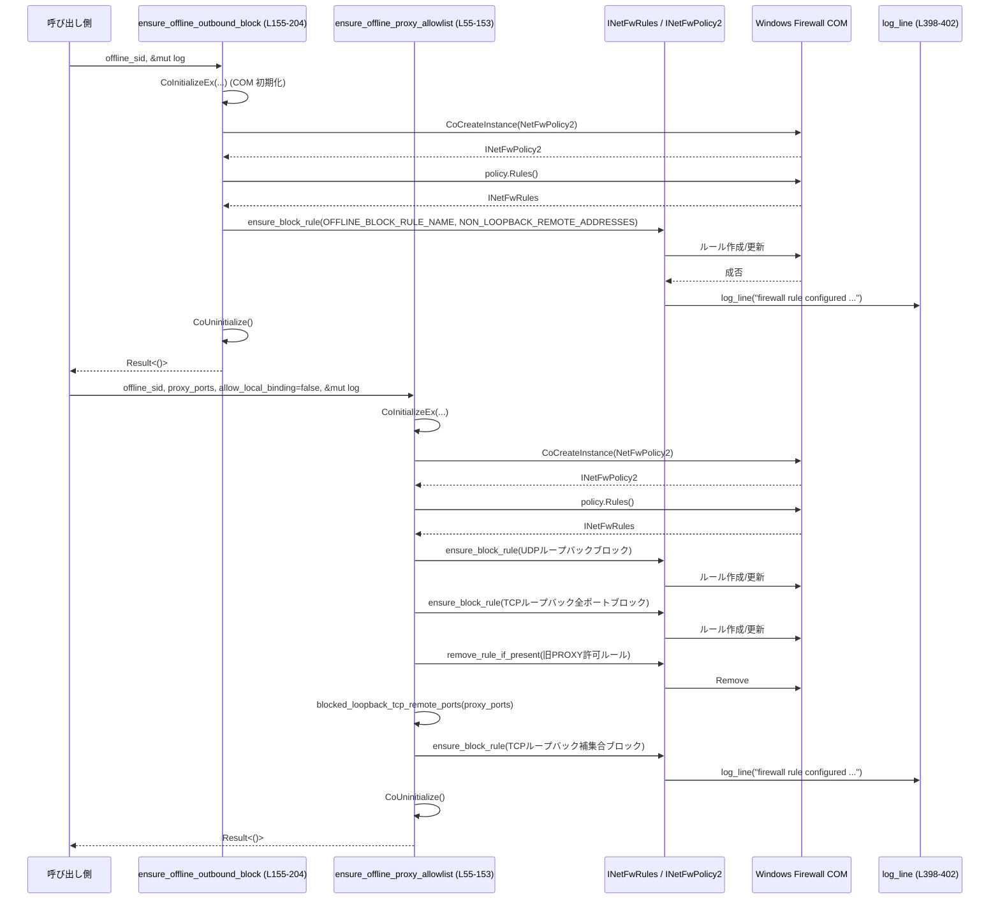

# windows-sandbox-rs/src/firewall.rs 解説

## 0. ざっくり一言

Windows のファイアウォール COM API を使って、特定ユーザー（サンドボックス用 SID）のアウトバウンド通信をブロック / 制限するルールを作成・更新・削除するモジュールです（`firewall.rs:L1-L43`）。

---

## 1. このモジュールの役割

### 1.1 概要

- このモジュールは **「オフラインサンドボックスユーザーのネットワーク接続を Windows ファイアウォールで制御する」** ために存在し、次の機能を提供します。
  - サンドボックスユーザーの **非ループバック宛ての全アウトバウンド通信をブロック** するルールの作成（`ensure_offline_outbound_block`、`firewall.rs:L155-L204`）。
  - サンドボックスユーザーの **ループバック宛て TCP/UDP を制御し、特定のプロキシポートだけ許可する/しない** 設定（`ensure_offline_proxy_allowlist`、`firewall.rs:L55-L153`）。
- これらの操作は Windows COM（`CoInitializeEx`, `CoCreateInstance`）と Windows Firewall COM インターフェイス（`INetFwPolicy2`, `INetFwRule3` など）を通じて行われます（`firewall.rs:L7-L23,L71-L85,L166-L180,L230-L237,L273-L335`）。

### 1.2 アーキテクチャ内での位置づけ

モジュール内コンポーネントと外部 API の依存関係は概ね次のようになっています。



- 公開 API は `ensure_offline_proxy_allowlist` と `ensure_offline_outbound_block` の 2 関数です（`firewall.rs:L55-L60,L155-L155`）。
- それらは内部のユーティリティ関数（`ensure_block_rule`, `remove_rule_if_present`, `configure_rule`, `blocked_loopback_tcp_remote_ports`, `log_line`）を組み合わせて動作します（`firewall.rs:L206-L218,L220-L271,L273-L355,L357-L388,L398-L402`）。
- エラーはすべて `SetupFailure` + `SetupErrorCode` にマッピングされ、`anyhow::Result` として外に返されます（`firewall.rs:L27-L28,L65-L68,L160-L163,L169-L173,L210-L213,L233-L236,L277-L280` など）。

### 1.3 設計上のポイント

- **Windows 専用モジュール**
  - ファイル先頭に `#![cfg(target_os = "windows")]` があり、このモジュールは Windows 以外ではコンパイルされません（`firewall.rs:L1-L1`）。

- **ルール名の安定性と冪等性**
  - ルールには固定の内部名（例: `OFFLINE_BLOCK_RULE_NAME`）を使い、「同じ名前のルールがあれば更新・なければ新規作成」という形で冪等に設定できます（`firewall.rs:L30-L34,L220-L255`）。
  - コメントでも「This is the stable identifier ...」と明示されています（`firewall.rs:L30-L31`）。

- **COM 利用とスレッドモデル**
  - 各公開関数は最初に `CoInitializeEx(None, COINIT_APARTMENTTHREADED)` を呼び、最後に `CoUninitialize()` で終了します（`firewall.rs:L63-L69,L149-L151,L158-L164,L200-L202`）。
  - これにより、**呼び出しスレッド単位** の COM 初期化 / 後始末が行われます（Windows COM の一般的な仕様に基づく）。

- **エラー処理の統一**
  - Windows API からの失敗はすべて `SetupFailure::new(code, message)` に変換し、その上に `anyhow::Error` を載せて返しています（`firewall.rs:L65-L68,L75-L78,L81-L84,L160-L163,L169-L173,L176-L179,L210-L213` など）。

- **安全性（Rust と OS の両方）**
  - Rust の型としてはすべて安全な関数シグネチャですが、内部では COM 呼び出しや BSTR 操作のために `unsafe` ブロックを明示的に区切っています（`firewall.rs:L63,L71,L80,L87,L96,L112,L130,L149,L158,L166,L175,L206-L215,L220-L239,L247,L273-L335,L338,L410,L418-L425,L428`）。
  - ファイアウォールルールは「広いブロック → 必要なら狭める」という順序で適用されており、狭める処理が失敗した場合も「閉じた」状態が維持されるようになっています（`firewall.rs:L110-L124,L130-L144`）。

- **ユーザー SID スコープの検証**
  - ルールの `LocalUserAuthorizedList` を設定した後、読み戻して `offline_sid` が文字列として含まれているか確認し、不一致ならエラーにします（`firewall.rs:L328-L335,L337-L352`）。

---

## 2. 主要な機能一覧

- サンドボックスユーザーのループバック TCP/UDP 通信制御:  
  `ensure_offline_proxy_allowlist` が、ループバックの TCP/UDP をブロックしつつ、指定されたプロキシポートのみを許可する/しない構成を行います（`firewall.rs:L55-L153,L357-L388`）。

- サンドボックスユーザーの非ループバック宛てアウトバウンド通信の一括ブロック:  
  `ensure_offline_outbound_block` が、すべての IP プロトコル・非ループバックアドレス向けアウトバウンド通信をブロックするルールを構成します（`firewall.rs:L155-L204,L32-L43`）。

- 任意のルールの作成 / 更新ロジック:  
  `ensure_block_rule` と `configure_rule` が、Windows Firewall COM の `INetFwRule3` を使ってルールを新規作成または再設定します（`firewall.rs:L220-L271,L273-L355`）。

- 既存ルールの安全な削除:  
  `remove_rule_if_present` が、指定内部名のルールが存在する場合のみ削除し、存在しない場合は何もしない挙動を提供します（`firewall.rs:L206-L218`）。

- プロキシポート補集合のレンジ文字列生成:  
  `blocked_loopback_tcp_remote_ports` と `port_range_string` が、「許可したいポート集合」に対する「ブロックすべきポートレンジ文字列」を作ります（`firewall.rs:L357-L388,L390-L395`）。

- ファイルベースの簡易ログ出力:  
  `log_line` が、タイムスタンプ付きでファイアウォール操作のログ行を `File` に書き込みます（`firewall.rs:L398-L402`）。

---

## 3. 公開 API と詳細解説

### 3.1 型一覧（構造体・列挙体など）

| 名前 | 種別 | 公開 | 役割 / 用途 | 根拠 |
|------|------|------|-------------|------|
| `BlockRuleSpec<'a>` | 構造体 | 非公開 | 1 つのファイアウォールルールを構成するための設定一式（内部名・説明・プロトコル・対象ユーザー SID など）をまとめるために使われます。`ensure_block_rule` と `configure_rule` の間で受け渡されます。 | `firewall.rs:L45-L53,L96-L107,L114-L122,L133-L141,L185-L193` |

主なフィールド:

- `internal_name`: ルールの内部識別子（`Rules.Item` で検索する際に使用、`firewall.rs:L46,L221-L223`）。
- `friendly_desc`: ファイアウォール UI に表示される説明文（`firewall.rs:L47,L36-L40,L275-L281`）。
- `protocol`: TCP/UDP/ANY を表す整数値（Windows API の定数 `NET_FW_IP_PROTOCOL_*` から取得、`firewall.rs:L48,L100-L102,L117-L118,L188-L188,L306-L311`）。
- `local_user_spec`: `LocalUserAuthorizedList` に設定する SDDL 文字列（`firewall.rs:L49,L61,L102-L103,L118-L119,L189-L190,L328-L333`）。
- `offline_sid`: 確認用 SID 文字列。設定後に `LocalUserAuthorizedList` に含まれているか検証するために使われます（`firewall.rs:L50,L337-L352`）。
- `remote_addresses`: リモートアドレスフィルタの文字列（`Some` の場合）または `"*"`（`None` の場合、`firewall.rs:L51,L104-L105,L120-L121,L191-L192,L312-L319`）。
- `remote_ports`: リモートポートフィルタの文字列（`Some` の場合）または `"*"`（`None` の場合、`firewall.rs:L52,L105-L106,L121-L122,L192-L193,L320-L327`）。

### 3.2 関数詳細（主要 7 件）

#### `ensure_offline_proxy_allowlist(offline_sid: &str, proxy_ports: &[u16], allow_local_binding: bool, log: &mut File) -> Result<()>`

**概要**

- サンドボックスユーザー（`offline_sid`）に対して、ループバック TCP/UDP のブロック / 許可設定を行います（`firewall.rs:L55-L60`）。
- `allow_local_binding` の値に応じて:
  - `true` の場合: 既存のオフライン用ルールを削除し、ローカルバインディングモードへ戻します（`firewall.rs:L87-L94`）。
  - `false` の場合: UDP ループバックブロック、TCP ループバックブロック（全ポート）、その後プロキシポート補集合のみをブロックするように再設定します（`firewall.rs:L96-L107,L110-L124,L130-L144`）。

**引数**

| 引数名 | 型 | 説明 |
|--------|----|------|
| `offline_sid` | `&str` | サンドボックスユーザーの Windows SID 文字列。`LocalUserAuthorizedList` に設定され、後で一致検証に使われます（`firewall.rs:L55-L56,L102-L103,L118-L119,L133-L138,L185-L190,L337-L352`）。 |
| `proxy_ports` | `&[u16]` | プロキシで使用するポート番号のリスト。`blocked_loopback_tcp_remote_ports` に渡され、ブロック対象ポートレンジ計算に使用されます（`firewall.rs:L57,L130-L141,L357-L388`）。 |
| `allow_local_binding` | `bool` | `true` の場合、オフライン用ルールを削除してローカルバインディングモードに戻すフラグ（`firewall.rs:L58,L87-L94`）。 |
| `log` | `&mut File` | 操作ログを書き出すためのファイルハンドル。ルールの削除や設定時に `log_line` 経由で使用されます（`firewall.rs:L59,L90-L92,L128-L129,L263-L269,L398-L402`）。 |

**戻り値**

- 成功時: `Ok(())`
- 失敗時: `Err(anyhow::Error)`（中身は `SetupFailure`）
  - COM 初期化、ポリシー取得、ルール操作などの各段階でエラーがあれば、その場で `Err` を返します（`firewall.rs:L63-L69,L73-L85,L96-L107,L112-L124,L130-L144`）。

**内部処理の流れ**

1. `offline_sid` を含む SDDL 文字列 `local_user_spec` を生成します（`firewall.rs:L61-L61`）。
2. `CoInitializeEx(None, COINIT_APARTMENTTHREADED)` で COM を初期化し、失敗したら `HelperFirewallComInitFailed` でエラーを返します（`firewall.rs:L63-L69`）。
3. `INetFwPolicy2` と `INetFwRules` を取得します（`firewall.rs:L71-L85`）。
4. `allow_local_binding == true` の場合:
   - `OFFLINE_PROXY_ALLOW_RULE_NAME`, `OFFLINE_BLOCK_LOOPBACK_UDP_RULE_NAME`, `OFFLINE_BLOCK_LOOPBACK_TCP_RULE_NAME` のルールがあれば削除し、即座に `Ok(())` で終了します（`firewall.rs:L87-L94,L206-L218`）。
5. `allow_local_binding == false` の場合:
   - UDP ループバックブロックルールを `ensure_block_rule` で構成します（`firewall.rs:L96-L107`）。
   - TCP ループバックブロックルールを「全ポート対象」として構成します（`firewall.rs:L110-L124`）。
   - レガシーな `OFFLINE_PROXY_ALLOW_RULE_NAME` を削除します（`firewall.rs:L126-L129`）。
   - `blocked_loopback_tcp_remote_ports(proxy_ports)` で、ブロックすべき TCP ポートレンジ文字列を計算し、`Some` の場合は TCP ルールを再度 `ensure_block_rule` で更新します（`firewall.rs:L130-L144,L357-L388`）。
6. 最後に必ず `CoUninitialize()` を呼び出して COM をクリーンアップします（`firewall.rs:L149-L151`）。

**Examples（使用例）**

サンドボックスユーザーのループバック通信を「プロキシの 8080 番だけ許可」にしたい場合の例です。

```rust
use std::fs::File;
use windows_sandbox_rs::firewall::ensure_offline_proxy_allowlist; // 仮のパス

fn configure_loopback() -> anyhow::Result<()> {
    // サンドボックスユーザーの SID（例）                         // 実際には OS から取得した SID を渡す
    let offline_sid = "S-1-5-21-...";

    // プロキシで使用するポート                                     // 8080 番ポートを許可
    let proxy_ports = [8080_u16];

    // ログファイルを開く                                           // append モードなど適宜
    let mut log = File::create("firewall.log")?;

    // allow_local_binding = false でプロキシ経由モードに設定        // UDP/TCP ループバックをブロックしつつ 8080 のみ許可
    ensure_offline_proxy_allowlist(offline_sid, &proxy_ports, false, &mut log)?;

    Ok(())
}
```

**Errors / Panics**

- エラー条件（主なもの）:
  - COM 初期化失敗: `HelperFirewallComInitFailed`（`firewall.rs:L63-L69`）。
  - `INetFwPolicy2` 生成失敗 / `Rules()` 取得失敗: `HelperFirewallPolicyAccessFailed`（`firewall.rs:L73-L85,L166-L180`）。
  - ルール削除・追加・設定失敗: `HelperFirewallRuleCreateOrAddFailed`（`firewall.rs:L210-L213,L233-L236,L239-L243,L247-L252,L277-L280,L283-L287,L288-L293,L294-L299,L300-L305,L306-L311,L313-L319,L321-L327,L328-L333`）。
  - SID スコープ検証失敗: `HelperFirewallRuleVerifyFailed`（`firewall.rs:L337-L352`）。
- パニック:
  - 本関数内には明示的な `panic!` はありません。`log_line` 内部での I/O エラーは `Result` で伝播します（`firewall.rs:L398-L402`）。

**Edge cases（エッジケース）**

- `allow_local_binding == true`:
  - ブロックルールとレガシー許可ルールを削除するだけで、新たなルール追加は行われません（`firewall.rs:L87-L94`）。
- `proxy_ports` が空、または 0 のみ:
  - `blocked_loopback_tcp_remote_ports` は `"1-65535"` を返し、全 TCP ポートをブロックする補集合を設定します（`firewall.rs:L361-L365,L367-L381`）。
  - ただし、この補集合計算は `if let Some(...)` で包まれているため、`Some("1-65535")` が返れば確実に narrow ルールが適用されます（`firewall.rs:L130-L144`）。
- `proxy_ports` に 1〜65535 全ポートが含まれる場合（理論上）:
  - 補集合は空になるため、`blocked_loopback_tcp_remote_ports` は `None` を返し、最初に設定した「全ポートブロック」の TCP ルールがそのまま残ります（`firewall.rs:L379-L387`）。
- `offline_sid` が実際の `LocalUserAuthorizedList` に含まれない SDDL 文字列であった場合:
  - `configure_rule` の検証でエラーになります（`firewall.rs:L337-L352`）。

**使用上の注意点**

- `offline_sid` は Windows SID 形式の文字列である必要があります。無効な SID を渡した場合、ファイアウォール側で `SetLocalUserAuthorizedList` が失敗したり、検証でエラーになります（`firewall.rs:L328-L335,L337-L352`）。
- 同じスレッド内での COM 初期化は `CoInitializeEx` により管理されますが、呼び出し元がすでに異なるスレッドモデルで COM を初期化している場合などはエラーになる可能性があります（`firewall.rs:L63-L69`）。
- `log` は `&mut File` なので、並行呼び出し時に同じファイルを共有する場合は、呼び出し側で排他制御（例: `Mutex<File>`）を行う必要があります（Rust の借用規則により、同時に複数の `&mut File` を持つことはできません）。
- この関数は複数回呼び出しても、同じ内部名のルールを上書きする設計になっており、冪等的に使えます（`firewall.rs:L220-L255,L257-L270`）。

---

#### `ensure_offline_outbound_block(offline_sid: &str, log: &mut File) -> Result<()>`

**概要**

- サンドボックスユーザー（`offline_sid`）に対して、**非ループバックアドレス向けのすべてのアウトバウンド通信（すべての IP プロトコル）をブロック** するルールを設定します（`firewall.rs:L155-L204,L32-L43`）。

**引数**

| 引数名 | 型 | 説明 |
|--------|----|------|
| `offline_sid` | `&str` | 対象サンドボックスユーザーの SID（`firewall.rs:L155-L156,L188-L190,L337-L352`）。 |
| `log` | `&mut File` | ルール設定ログを書き込むファイル（`firewall.rs:L155,L194-L195,L263-L269,L398-L402`）。 |

**戻り値**

- 成功時: `Ok(())`
- 失敗時: `Err(anyhow::Error)`（`SetupFailure` を内包）

**内部処理の流れ**

1. `offline_sid` を使って `local_user_spec` を作成します（`firewall.rs:L156-L156`）。
2. `CoInitializeEx` で COM を初期化し、エラーなら `HelperFirewallComInitFailed`（`firewall.rs:L158-L164`）。
3. `INetFwPolicy2` → `INetFwRules` を取得（`firewall.rs:L166-L180`）。
4. `ensure_block_rule` を用いて、以下を指定したルールを設定:
   - `internal_name = OFFLINE_BLOCK_RULE_NAME`（`firewall.rs:L185-L187`）
   - `friendly_desc = OFFLINE_BLOCK_RULE_FRIENDLY`（`firewall.rs:L185-L188,L37-L37`）
   - `protocol = NET_FW_IP_PROTOCOL_ANY`（`firewall.rs:L188-L188`）
   - `remote_addresses = Some(NON_LOOPBACK_REMOTE_ADDRESSES)`（`firewall.rs:L191-L191,L42-L43`）
5. 最後に `CoUninitialize()` を呼び出し、結果を返します（`firewall.rs:L200-L203`）。

**Examples（使用例）**

```rust
use std::fs::File;
use windows_sandbox_rs::firewall::ensure_offline_outbound_block; // 仮のパス

fn enforce_offline() -> anyhow::Result<()> {
    let offline_sid = "S-1-5-21-...";                        // サンドボックス用ユーザー SID
    let mut log = File::create("firewall.log")?;             // ログファイル

    // 非ループバック宛ての全アウトバウンドをブロック           // ループバック通信は別途 proxy_allowlist で制御
    ensure_offline_outbound_block(offline_sid, &mut log)?;

    Ok(())
}
```

**Errors / Panics**

- `ensure_offline_proxy_allowlist` と同様、COM 初期化 / ポリシー取得 / ルール設定・検証のどこかで失敗すると `Err` を返します（`firewall.rs:L158-L164,L166-L180,L183-L195`）。
- 本関数内に直接のパニックはありません。

**Edge cases**

- この関数単体ではループバックアドレス（`127.0.0.0/8`, `::1` など）はブロックせず、`NON_LOOPBACK_REMOTE_ADDRESSES` に含まれないため、ループバックは別の関数で制御する前提です（`firewall.rs:L42-L43,L182-L193`）。

**使用上の注意点**

- ループバック通信の制御と組み合わせる場合、`ensure_offline_outbound_block` と `ensure_offline_proxy_allowlist` の両方を同じ `offline_sid` で呼ぶ必要があります（`firewall.rs:L55-L60,L155-L156`）。
- ルール名 `OFFLINE_BLOCK_RULE_NAME` は固定のため、名前を変更すると既存環境のルールが更新されなくなります（`firewall.rs:L30-L32,L185-L187`）。

---

#### `ensure_block_rule(rules: &INetFwRules, spec: &BlockRuleSpec<'_>, log: &mut File) -> Result<()>`

**概要**

- `BlockRuleSpec` に従って、指定された内部名のファイアウォールルールを「存在すれば更新、なければ新規作成」します（`firewall.rs:L220-L271`）。

**引数**

| 引数名 | 型 | 説明 |
|--------|----|------|
| `rules` | `&INetFwRules` | `INetFwPolicy2::Rules()` から取得したルールコレクション（`firewall.rs:L80-L85,L175-L180,L220-L222`）。 |
| `spec` | `&BlockRuleSpec<'_>` | ルールの設定内容（内部名、説明、プロトコル、アドレス・ポート、ユーザー）を保持する構造体（`firewall.rs:L45-L53,L96-L107,L114-L122,L133-L141,L185-L193`）。 |
| `log` | `&mut File` | 構成結果をログ出力するためのファイル（`firewall.rs:L220,L263-L269,L398-L402`）。 |

**戻り値**

- 成功時: `Ok(())`
- 失敗時: `Err(anyhow::Error)`（ルール作成・キャスト・設定・追加のどれかが失敗）

**内部処理の流れ**

1. `spec.internal_name` から BSTR を作成します（`firewall.rs:L221-L221`）。
2. `rules.Item(&name)` で既存ルールを取得:
   - 成功した場合: `INetFwRule3` に `.cast()` し、失敗したらエラー（`firewall.rs:L222-L228`）。
   - 失敗した場合（ルールなし）:
     1. `CoCreateInstance(&NetFwRule, ...)` で新しいルールを作成（`firewall.rs:L230-L237`）。
     2. `SetName(&name)` で内部名を設定（`firewall.rs:L239-L244`）。
     3. `configure_rule(&new_rule, spec)` で全フィールドを設定（`firewall.rs:L245-L246,L273-L335`）。
     4. `rules.Add(&new_rule)` でルールコレクションに追加（`firewall.rs:L247-L252`）。
3. 既存ルール・新規ルールのどちらの場合も、最後にもう一度 `configure_rule(&rule, spec)` を呼び、最新の `spec` 内容で上書きします（`firewall.rs:L257-L258`）。
4. ログ用に `remote_addresses`・`remote_ports` を `"*"` デフォルト付きで取り出し、`log_line` で 1 行記録します（`firewall.rs:L260-L269,L398-L402`）。

**Examples（使用例）**

ループバック UDP をブロックするルールを直接設定したい場合の例です（通常は公開 API から呼び出されます）。

```rust
use std::fs::File;
use windows::Win32::NetworkManagement::WindowsFirewall::{INetFwPolicy2, NetFwPolicy2, INetFwRules, NET_FW_IP_PROTOCOL_UDP};
use windows::Win32::System::Com::{CoCreateInstance, CLSCTX_INPROC_SERVER};
use windows_sandbox_rs::firewall::{ensure_block_rule, BlockRuleSpec, LOOPBACK_REMOTE_ADDRESSES}; // 一部は非公開想定

fn example(rules: &INetFwRules, log: &mut File) -> anyhow::Result<()> {
    let offline_sid = "S-1-5-21-...";
    let local_user_spec = format!("O:LSD:(A;;CC;;;{offline_sid})");

    let spec = BlockRuleSpec {
        internal_name: "example_loopback_udp_block",           // 任意の内部名
        friendly_desc: "Example - Block Loopback UDP",         // UIに表示される説明
        protocol: NET_FW_IP_PROTOCOL_UDP.0,                    // UDP
        local_user_spec: &local_user_spec,                     // 対象ユーザー
        offline_sid,                                           // 検証用 SID
        remote_addresses: Some(LOOPBACK_REMOTE_ADDRESSES),     // ループバックのみ
        remote_ports: None,                                    // 全ポート
    };

    ensure_block_rule(rules, &spec, log)
}
```

**Errors / Panics**

- 新規作成経路の失敗:
  - `CoCreateInstance(NetFwRule)` 失敗: `HelperFirewallRuleCreateOrAddFailed`（`firewall.rs:L230-L237`）。
  - `SetName` 失敗: 同コード（`firewall.rs:L239-L244`）。
  - `rules.Add` 失敗: 同コード（`firewall.rs:L247-L252`）。
- 既存ルール経路の失敗:
  - `existing.cast::<INetFwRule3>()` 失敗: 同コード（`firewall.rs:L222-L228`）。
- どちらの経路でも `configure_rule` が失敗し得ます（`firewall.rs:L257-L258,L273-L335`）。

**Edge cases**

- `rules.Item(&name)` がエラー（ルールなし・権限不足など）の場合に「ルール新規作成」に進みますが、エラーの理由は区別していません（`firewall.rs:L222-L229`）。  
  実際には「存在しない」以外の理由（アクセス拒否など）でも新規作成を試みます。
- `spec.remote_addresses` / `spec.remote_ports` が `None` の場合、`"*"` として扱われ、全アドレス / 全ポート対象になります（`firewall.rs:L260-L261,L312-L313,L320-L321`）。

**使用上の注意点**

- `spec.internal_name` は Windows Firewall 内で一意であることが前提です。同じ名前を他の用途で使うと、本関数が上書きしてしまいます（`firewall.rs:L221-L223`）。
- `configure_rule` はルールのプロパティを逐次的に設定するため、中途で失敗した場合は、一部だけ書き換わった状態になる可能性があります（`firewall.rs:L273-L335`）。Windows ファイアウォールにはトランザクション機構がないための仕様です。

---

#### `configure_rule(rule: &INetFwRule3, spec: &BlockRuleSpec<'_>) -> Result<()>`

**概要**

- `INetFwRule3` オブジェクトに対して、`BlockRuleSpec` の内容をすべて書き込み、さらに `LocalUserAuthorizedList` を読み戻して `offline_sid` が含まれているか検証します（`firewall.rs:L273-L355`）。

**引数**

| 引数名 | 型 | 説明 |
|--------|----|------|
| `rule` | `&INetFwRule3` | 既に作成済みのファイアウォールルール COM オブジェクト（`firewall.rs:L230-L237,L245-L246,L257-L258`）。 |
| `spec` | `&BlockRuleSpec<'_>` | 設定する内容一式（説明文、方向、アクション、プロトコル、アドレス、ポート、ユーザー）を保持します（`firewall.rs:L45-L53`）。 |

**戻り値**

- 成功時: `Ok(())`
- 失敗時: `Err(anyhow::Error)`（プロパティ設定または検証の失敗）

**内部処理の流れ**

1. 以下のプロパティを順番に設定します（すべて `unsafe` & 結果を `map_err` で変換、`firewall.rs:L273-L335`）。
   - `Description`（`spec.friendly_desc`）
   - `Direction` = `NET_FW_RULE_DIR_OUT`（アウトバウンド）
   - `Action` = `NET_FW_ACTION_BLOCK`（ブロック）
   - `Enabled` = `VARIANT_TRUE`
   - `Profiles` = `NET_FW_PROFILE2_ALL`
   - `Protocol` = `spec.protocol`
   - `RemoteAddresses` = `spec.remote_addresses.unwrap_or("*")`
   - `RemotePorts` = `spec.remote_ports.unwrap_or("*")`
   - `LocalUserAuthorizedList` = `spec.local_user_spec`
2. `LocalUserAuthorizedList()` を読み戻し、`spec.offline_sid` を部分文字列として含んでいるか確認します（`firewall.rs:L337-L352`）。
   - 含まれていなければ `HelperFirewallRuleVerifyFailed` を返します。

**Examples（使用例）**

通常は直接呼び出さず、`ensure_block_rule` を通じて間接的に利用します。  
動作イメージを示す擬似コードです。

```rust
fn apply_spec(rule: &INetFwRule3, spec: &BlockRuleSpec<'_>) -> anyhow::Result<()> {
    // 方向・アクションなどを一括設定し、SID スコープも検証
    configure_rule(rule, spec)
}
```

**Errors / Panics**

- 各 `Set*` 呼び出しや `LocalUserAuthorizedList()` 読み戻しが失敗した場合、対応する `SetupErrorCode` を持つ `SetupFailure` を返します（`firewall.rs:L275-L281,L282-L287,L288-L293,L294-L299,L300-L305,L306-L311,L313-L319,L321-L327,L328-L333,L337-L342`）。
- パニックはありません。

**Edge cases**

- `spec.remote_addresses` / `spec.remote_ports` が `None` の場合、`"*"` として設定され、アドレス / ポートを制限しません（`firewall.rs:L312-L319,L320-L327`）。
- 検証は `actual_str.contains(spec.offline_sid)` という **部分一致** で行われているため、`LocalUserAuthorizedList` に余分な SID が含まれていても、ターゲット SID が含まれている限りエラーにはなりません（`firewall.rs:L344-L345`）。

**使用上の注意点**

- SID スコープを完全に固定したい場合、「部分一致」でよいかどうかを仕様として確認する必要があります（コード上は部分一致です、`firewall.rs:L345-L345`）。
- `Description` など UI に表示される文字列を変えると、ユーザー向けの表示が変わりますが、内部名（`internal_name`）は変わらないため、冪等性は維持されます（`firewall.rs:L239-L244,L275-L281`）。

---

#### `remove_rule_if_present(rules: &INetFwRules, internal_name: &str, log: &mut File) -> Result<()>`

**概要**

- 指定した内部名のファイアウォールルールが存在すれば削除し、存在しなければ何もせず成功を返します（`firewall.rs:L206-L218`）。

**引数**

| 引数名 | 型 | 説明 |
|--------|----|------|
| `rules` | `&INetFwRules` | ルールコレクション（`firewall.rs:L80-L85,L175-L180,L206-L207`）。 |
| `internal_name` | `&str` | `Rules.Item` で検索するルール名（`firewall.rs:L206-L207`）。 |
| `log` | `&mut File` | 削除した場合にログ行を書き込むファイル（`firewall.rs:L206,L215-L215,L398-L402`）。 |

**戻り値**

- 常に `Ok(())` か、削除操作中のエラーに伴う `Err(anyhow::Error)`。

**内部処理の流れ**

1. `internal_name` から BSTR を作成（`firewall.rs:L207-L207`）。
2. `rules.Item(&name)` を呼び、成功 (`is_ok()`) なら:
   - `rules.Remove(&name)` を呼び、エラーなら `HelperFirewallRuleCreateOrAddFailed` を返す（`firewall.rs:L208-L214`）。
   - `log_line` で削除ログを出力（`firewall.rs:L215-L215`）。
3. ルールが存在しない場合（`Item` がエラー）:
   - 何もせず `Ok(())` を返します（`firewall.rs:L218-L218`）。

**Examples（使用例）**

```rust
fn clean_legacy_proxy_rule(rules: &INetFwRules, log: &mut File) -> anyhow::Result<()> {
    // レガシーなプロキシ許可ルールを削除                       // ルールが存在しなくてもエラーにはならない
    remove_rule_if_present(rules, "codex_sandbox_offline_allow_loopback_proxy", log)
}
```

**Errors / Panics**

- `rules.Remove(&name)` が失敗した場合にのみ `Err` を返します（`firewall.rs:L209-L214`）。
- `Item` に対するエラーは「存在しない」と見なして無視されます。

**Edge cases**

- ルールが存在しない場合でも成功（`Ok(())`）となるため、呼び出し側は「削除できたかどうか」を区別できません（`firewall.rs:L208-L218`）。
- 権限不足などで `Item` が失敗した場合も「存在しない」と同じ扱いになる可能性があります。

**使用上の注意点**

- 「存在しなかったのか、削除に成功したのか」をログ以外で判別したい場合は、この関数の戻り値だけでは足りません（`firewall.rs:L215-L215`）。

---

#### `blocked_loopback_tcp_remote_ports(proxy_ports: &[u16]) -> Option<String>`

**概要**

- 許可したい TCP ポート集合 `proxy_ports` に対して、その **補集合**（1〜65535）のレンジを文字列で返します（`firewall.rs:L357-L388`）。
- 生成された文字列は Windows Firewall の `RemotePorts` に渡す形式（例: `"1-8079,8082-65535"`）です。

**引数**

| 引数名 | 型 | 説明 |
|--------|----|------|
| `proxy_ports` | `&[u16]` | 許可したい TCP ポート番号のリスト（`firewall.rs:L357-L362`）。 |

**戻り値**

- `Some(String)`:
  - ブロックすべきポートレンジが存在する場合。そのレンジをカンマ区切りで表した文字列（例: `"1-8079,8082-65535"`）。
- `None`:
  - 1〜65535 すべてが `proxy_ports` に含まれている場合（理論上）。つまり補集合が空の場合（`firewall.rs:L383-L387`）。

**内部処理の流れ**

1. `proxy_ports` を
   - `0` を除外し（`filter(|port| *port != 0)`）、
   - 昇順ソートし、
   - 重複を除去した `Vec<u16>` に変換します（`firewall.rs:L358-L364`）。
2. `start = 1` から始め、各 `port` について:
   - `port < start` の場合はスキップ（既にカバー済みの重複など、`firewall.rs:L370-L371`）。
   - `port > start` の場合は、`[start, port-1]` をブロックレンジとして `blocked_ranges` に追加（`firewall.rs:L373-L375`）。
   - `start = port + 1` に更新（`firewall.rs:L376-L376`）。
3. ループ後、`start <= 65535` の場合、`[start, 65535]` を追加（`firewall.rs:L379-L381`）。
4. `blocked_ranges` が空なら `None`、1 つ以上あるなら `join(",")` して `Some` を返します（`firewall.rs:L383-L387`）。

**Examples（使用例）**

```rust
fn example_ports() {
    let proxy_ports = [8080_u16, 8081];                      // 許可したいポート

    let blocked = blocked_loopback_tcp_remote_ports(&proxy_ports)
        .expect("少なくとも一つはブロックレンジがあるはず");

    assert_eq!(blocked, "1-8079,8082-65535".to_string());    // 8080,8081 以外をブロック
}
```

**Errors / Panics**

- 本関数は純粋な計算であり、エラーもパニックも発生しません（`firewall.rs:L357-L388`）。

**Edge cases**

- `proxy_ports` が空、または `0` しか含まない場合:
  - `allowed_ports` が空になり、`blocked_ranges = ["1-65535"]` となり、全ポートがブロックされます（`firewall.rs:L361-L365,L367-L381`）。
- `proxy_ports` に同じポートが重複していても、`sort_unstable` + `dedup` により 1 つとして扱われます（`firewall.rs:L363-L364`）。
- 1〜65535 のすべてが含まれている場合:
  - 補集合は空になり、`blocked_ranges.is_empty()` により `None` が返ります（`firewall.rs:L383-L387`）。

**使用上の注意点**

- 戻り値が `None` の場合、呼び出し側では narrow ルールを設定しない仕様となるため（`firewall.rs:L130-L144`）、事実上「全ポートブロック」のままになることに注意が必要です。

---

#### `log_line(log: &mut File, msg: &str) -> Result<()>`

**概要**

- 現在時刻（UTC）の RFC3339 文字列を付けたログ行を `File` に書き込みます（`firewall.rs:L398-L402`）。
- ファイアウォールルールの設定・削除状況の記録に使われます（`firewall.rs:L215-L215,L263-L269`）。

**引数**

| 引数名 | 型 | 説明 |
|--------|----|------|
| `log` | `&mut File` | 書き込み先のファイルハンドル。呼び出し元が開く必要があります（`firewall.rs:L398-L398`）。 |
| `msg` | `&str` | ログメッセージ本体（`firewall.rs:L398-L398`）。 |

**戻り値**

- 成功時: `Ok(())`
- I/O 失敗時: `Err(anyhow::Error)`（`writeln!` のエラーがそのまま伝播）

**内部処理の流れ**

1. `chrono::Utc::now().to_rfc3339()` で UTC 現在時刻を取得し、RFC3339 文字列に変換（`firewall.rs:L399-L399`）。
2. `writeln!(log, "[{ts}] {msg}")?;` でタイムスタンプ付きの行を出力（`firewall.rs:L400-L400`）。
3. `Ok(())` を返します（`firewall.rs:L401-L401`）。

**Examples（使用例）**

```rust
use std::fs::File;
use windows_sandbox_rs::firewall::log_line; // 非公開なら擬似コード

fn write_sample_log() -> anyhow::Result<()> {
    let mut log = File::create("firewall.log")?;
    log_line(&mut log, "firewall rule configured name=example")?;
    Ok(())
}
```

**Errors / Panics**

- `writeln!` が `io::Error` を返した場合、そのまま `Result` として伝播します（`firewall.rs:L400-L401`）。
- パニックはありません。

**Edge cases**

- ログファイルがクローズされている、または書き込み権限がない場合はエラーが返ります（`firewall.rs:L398-L401`）。
- 非同期に複数スレッドから書き込む場合は、呼び出し側で排他制御が必要です（Rust の所有権的には、同時に複数の `&mut File` を持てないため）。

**使用上の注意点**

- ログフォーマットは `[timestamp] message` 固定であり、解析用ツールなどで扱う前提であればこのフォーマットを前提としてよいです（`firewall.rs:L400-L400`）。

---

### 3.3 その他の関数

| 関数名 | 役割（1 行） | 根拠 |
|--------|--------------|------|
| `port_range_string(start: u32, end: u32) -> String` | `start == end` なら `"start"`, そうでなければ `"start-end"` 形式の文字列を返し、ポートレンジ表現を作るユーティリティです。`blocked_loopback_tcp_remote_ports` からのみ呼ばれます。 | `firewall.rs:L390-L395,L374-L375,L380-L380` |

---

## 4. データフロー

ここでは代表的なシナリオとして、「サンドボックスユーザーにオフライン + プロキシ経由のネットワーク制御を設定する」流れを示します。

### シナリオ: オフライン + プロキシポート許可

1. 呼び出し側は `offline_sid`, `proxy_ports`, `log` を用意し、`ensure_offline_outbound_block` を呼びます（`firewall.rs:L155-L204`）。
2. 次に `ensure_offline_proxy_allowlist` を `allow_local_binding = false` で呼び、ループバック制御を行います（`firewall.rs:L55-L153`）。
3. 両関数内で COM 初期化 → `INetFwPolicy2`/`INetFwRules` 取得 → ルール設定 → COM 終了、という流れを取り、途中の操作がすべて `log_line` でログされます（`firewall.rs:L63-L85,L96-L107,L110-L124,L130-L144,L158-L180,L183-L195,L263-L269,L398-L402`）。



要点:

- Outbound 全体ブロック（非ループバック）とループバックブロック（補集合ルール）は別々のルールとして設定されます。
- それぞれが独立して COM の初期化と後始末を行っており、呼び出し順序は任意ですが、実運用ではセットで呼ぶ前提と思われます（順序はコードからは強制されていません）。

---

## 5. 使い方（How to Use）

### 5.1 基本的な使用方法

オフラインサンドボックスユーザーを設定する典型的な流れの例です。

```rust
use std::fs::File;
// 仮想的なクレートパス
use windows_sandbox_rs::firewall::{
    ensure_offline_outbound_block,
    ensure_offline_proxy_allowlist,
};

fn setup_sandbox_firewall() -> anyhow::Result<()> {
    // サンドボックスユーザー SID（OS から取得）                   // 実際には適切な方法で SID を取得
    let offline_sid = "S-1-5-21-...";

    // プロキシポートを指定                                         // 8080 のみ許可する例
    let proxy_ports = [8080_u16];

    // ログファイルを準備                                           // アプリケーション側で管理
    let mut log = File::create("sandbox-firewall.log")?;

    // 非ループバック向けアウトバウンドをブロック                  // firewall.rs:L155-L204
    ensure_offline_outbound_block(offline_sid, &mut log)?;

    // ループバック向け TCP/UDP を制御                              // firewall.rs:L55-L153
    ensure_offline_proxy_allowlist(offline_sid, &proxy_ports, false, &mut log)?;

    Ok(())
}
```

### 5.2 よくある使用パターン

1. **オフラインモードへの切り替え**

   - 手順:  
     1. `ensure_offline_outbound_block(offline_sid, log)`  
     2. `ensure_offline_proxy_allowlist(offline_sid, proxy_ports, false, log)`
   - 目的:  
     - 非ループバック宛ての通信を全てブロックしつつ、ループバックはプロキシの指定ポート経由のみ許可する構成（`firewall.rs:L182-L193,L96-L107,L110-L124,L130-L144`）。

2. **ローカルバインディングモードへの戻し**

   - 手順:  
     - `ensure_offline_proxy_allowlist(offline_sid, proxy_ports, true, log)`
   - 挙動:
     - ループバックブロックルール（TCP/UDP）とレガシー PROXY 許可ルールを削除し、ローカルバインディングモードに戻ります（`firewall.rs:L87-L94`）。

3. **プロキシポートの追加 / 変更**

   - 手順:
     - 新しい `proxy_ports` を指定して `ensure_offline_proxy_allowlist(..., false, ...)` を再実行。
   - 挙動:
     - `ensure_block_rule` によって既存のルールが再設定され、プロキシポート補集合が再計算されます（`firewall.rs:L96-L107,L110-L124,L130-L144,L220-L271,L357-L388`）。

### 5.3 よくある間違い

```rust
// 間違い例: COM を自前で初期化して別のスレッドモデルを指定している
// （後の CoInitializeEx(COINIT_APARTMENTTHREADED) と衝突する可能性）
// unsafe { CoInitializeEx(None, COINIT_MULTITHREADED) } など

// 正しい例: firewall モジュールの関数に任せる
let mut log = File::create("sandbox-firewall.log")?;
ensure_offline_outbound_block(offline_sid, &mut log)?;
ensure_offline_proxy_allowlist(offline_sid, &proxy_ports, false, &mut log)?;
```

```rust
// 間違い例: log を &File のまま渡そうとする（コンパイルエラー）
// let log = File::create("sandbox-firewall.log")?;
// ensure_offline_outbound_block(offline_sid, &log)?;

// 正しい例: &mut File で渡す
let mut log = File::create("sandbox-firewall.log")?;
ensure_offline_outbound_block(offline_sid, &mut log)?;
```

### 5.4 使用上の注意点（まとめ）

- **Windows 限定**:  
  モジュール全体が `#[cfg(target_os = "windows")]` でガードされており、他 OS 用バイナリではコンパイルされません（`firewall.rs:L1-L1`）。

- **権限要件**:  
  `INetFwPolicy2` やルール追加には、OS 側で十分な権限（多くの場合管理者権限）が必要です。権限不足は `HelperFirewallPolicyAccessFailed` や `HelperFirewallRuleCreateOrAddFailed` として表面化する可能性があります（`firewall.rs:L73-L85,L166-L180,L210-L213,L233-L236,L247-L252`）。

- **ログと観測性**:  
  `ensure_block_rule` と `remove_rule_if_present` は、成功時に必ずログ行を出力するため、ファイルログを解析することでどのタイミングでどのルールが構成・削除されたか追跡できます（`firewall.rs:L215-L215,L263-L269,L398-L402`）。

- **繰り返し呼び出しの安全性**:  
  ルール名が固定で、既存ルールを再設定する設計のため、同じ `offline_sid` で繰り返し呼んでも矛盾が生じにくい構造になっています（`firewall.rs:L30-L34,L220-L255,L257-L270`）。

- **並行性**:  
  - 各関数は「1 呼び出し = 1 COM 初期化 / 終了」で完結しており、内部にスレッド生成はありません（`firewall.rs:L63-L69,L149-L151,L158-L164,L200-L202`）。
  - 同一プロセス内で複数スレッドから同時に呼び出す場合、Windows COM のスレッドモデル・ファイアウォール API のスレッドセーフ性に従いますが、モジュール側では特別な同期は行っていません。

---

## 6. 変更の仕方（How to Modify）

### 6.1 新しい機能を追加する場合

例: 新しい種類のブロックルール（たとえば特定ドメイン向けのブロック）を追加したい場合。

1. **定数の追加**
   - 新しいルール名および説明文をファイル先頭の定数群に追加します（`firewall.rs:L30-L43`）。

2. **BlockRuleSpec の利用**
   - 新関数を定義し、`BlockRuleSpec` を構築した上で `ensure_block_rule` を呼び出すのが自然です（`firewall.rs:L45-L53,L220-L271`）。
   - 必要に応じて `LOOPBACK_REMOTE_ADDRESSES` や `NON_LOOPBACK_REMOTE_ADDRESSES` のようなリモートアドレス文字列定数を追加します（`firewall.rs:L42-L43`）。

3. **COM まわり**
   - 公開関数から直接 COM を操作する場合、既存の `ensure_offline_*` を参考に:
     - `CoInitializeEx` → `CoCreateInstance(NetFwPolicy2)` → `policy.Rules()` → `ensure_block_rule` → `CoUninitialize` の順で呼ぶと一貫性があります（`firewall.rs:L63-L69,L71-L85,L166-L180,L182-L195`）。

4. **ログ・エラーコード**
   - 可能な限り既存の `SetupErrorCode` を再利用し、同じエラー分類に収まるようにします（`firewall.rs:L27-L28,L65-L68,L75-L78,L81-L84,L160-L163,L169-L173`）。
   - 新しいエラーコードが必要な場合は、`codex_windows_sandbox` 側に追加する必要があります（このチャンクには定義が現れません）。

### 6.2 既存の機能を変更する場合

- **ルール名を変えたい場合**
  - ルール名（`OFFLINE_*_RULE_NAME`）は冪等性のキーになっているため、変更すると既存環境のルールが「孤立」し、新しいルールが追加される形になります（`firewall.rs:L30-L34,L185-L187,L96-L99`）。
  - 互換性が重要な環境では注意が必要です。

- **リモートアドレス定数を変更する場合**
  - `LOOPBACK_REMOTE_ADDRESSES` や `NON_LOOPBACK_REMOTE_ADDRESSES` の文字列形式が COM に受理されるかどうかは、テスト `configured_remote_address_literals_are_accepted_by_firewall_com` で確認しています（`firewall.rs:L413-L417,L418-L426,L432-L437`）。
  - 変更のたびにテストを更新し、再度実行することが望ましいです。

- **SID 検証のロジックを変更したい場合**
  - 現状は部分一致 (`contains`) による検証です（`firewall.rs:L344-L345`）。
  - より厳密な検証（完全一致、SID リストの構文解析など）が必要であれば、この部分を変更することになりますが、`BlockRuleSpec.offline_sid` の意味も見直す必要があります（`firewall.rs:L50,L337-L352`）。

- **影響範囲の確認**
  - `ensure_offline_proxy_allowlist` と `ensure_offline_outbound_block` は公開 API なので、これらに対する変更は他モジュールからの呼び出し全体に影響します（`firewall.rs:L55-L60,L155-L155`）。
  - 内部ユーティリティ（`ensure_block_rule`, `configure_rule`, `blocked_loopback_tcp_remote_ports`）は複数箇所から呼ばれているため、シグネチャや振る舞いを変える場合は呼び出し元（`firewall.rs:L96-L107,L110-L124,L130-L144,L183-L195`）をすべて確認する必要があります。

---

## 7. 関連ファイル

このモジュールと特に関係が深いのは、エラー型とテストです。

| パス / クレート | 役割 / 関係 |
|-----------------|------------|
| `codex_windows_sandbox::SetupErrorCode` | ファイアウォール操作に関するエラーを分類するための列挙体。COM 初期化失敗、ポリシーアクセス失敗、ルール操作失敗、検証失敗などのコードが使われています（`firewall.rs:L27-L28,L65-L68,L75-L78,L81-L84,L160-L163,L169-L173,L176-L179,L210-L213,L233-L236,L241-L243,L249-L251,L277-L280,L283-L287,L288-L293,L294-L299,L300-L305,L306-L311,L313-L319,L321-L327,L331-L333,L340-L342,L347-L352`）。 |
| `codex_windows_sandbox::SetupFailure` | `SetupErrorCode` とメッセージ文字列を保持するエラー型で、`anyhow::Error` にラップされて返却されます（`firewall.rs:L27-L28,L65-L68,L75-L78,L81-L84` など）。 |
| `windows::Win32::NetworkManagement::WindowsFirewall` モジュール | `INetFwPolicy2`, `INetFwRule3`, `INetFwRules` など、Windows Firewall COM API の型と定数を提供します（`firewall.rs:L8-L18,L11-L16`）。 |
| `windows::Win32::System::Com` モジュール | `CoInitializeEx`, `CoUninitialize`, `CoCreateInstance`, `CLSCTX_INPROC_SERVER`, `COINIT_APARTMENTTHREADED` などの COM サポート（`firewall.rs:L19-L23`）。 |
| `windows-sandbox-rs/src/firewall.rs`（本ファイル） | Windows 専用のファイアウォール設定ロジックをカプセル化し、他のモジュールから `ensure_offline_proxy_allowlist` と `ensure_offline_outbound_block` を通じて利用されると想定されます。 |

テストコード:

- `mod tests` 内の `configured_remote_address_literals_are_accepted_by_firewall_com` は、本モジュールで使用している `LOOPBACK_REMOTE_ADDRESSES` と `NON_LOOPBACK_REMOTE_ADDRESSES` の文字列表現が COM に受理されるかを確認する回帰テストです（`firewall.rs:L404-L439`）。

---

以上が `windows-sandbox-rs/src/firewall.rs` の公開 API・コアロジック・データフロー・エッジケース・使用上の注意点を含む解説です。
