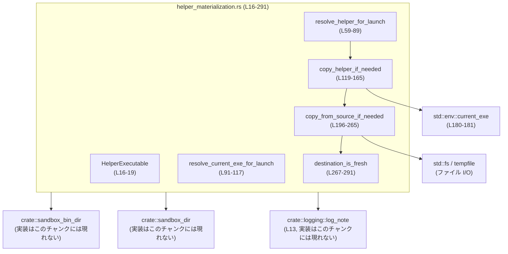
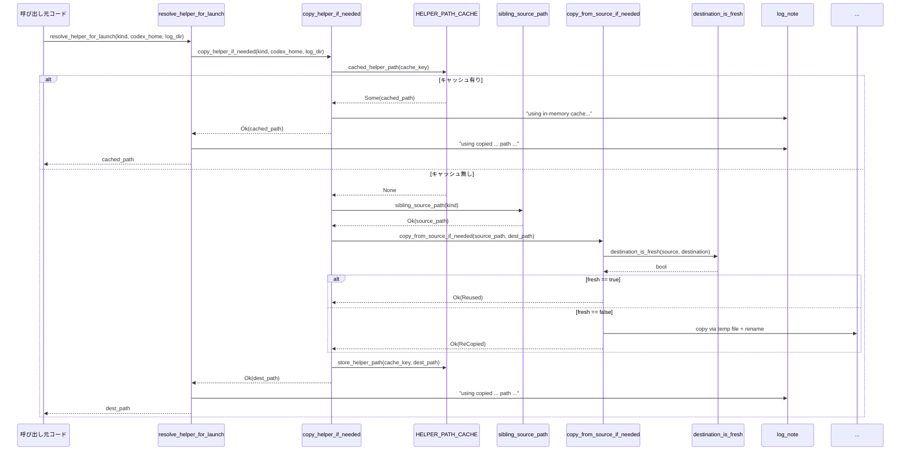

# windows-sandbox-rs/src/helper_materialization.rs コード解説

## 0. ざっくり一言

Windows サンドボックス内で使う「ヘルパー実行ファイル（例: command-runner）」や現在の実行ファイルを、共有ディレクトリ（`.sandbox-bin`）にコピー・再利用するためのヘルパー関数群です。  
コピーの必要性判定・排他制御付きキャッシュ・失敗時のフォールバックまでを一括で扱います。

---

## 1. このモジュールの役割

### 1.1 概要

このモジュールは、**サンドボックス環境で実行するヘルパー実行ファイルを適切な場所に配置し、そのパスを解決する問題**を扱います。

- `HelperExecutable` によって種類（現状は CommandRunner）の識別を行います（`helper_materialization.rs:L16-19`）。
- `.sandbox-bin` 配下へのコピー・更新判定・キャッシュを行い、起動時に使う実行パスを返します（`copy_helper_if_needed` など, `helper_materialization.rs:L119-165`）。
- コピーに失敗した場合でも、元の実行ファイル（または同ディレクトリ内のヘルパー）にフォールバックします（`resolve_helper_for_launch`, `resolve_current_exe_for_launch`, `helper_materialization.rs:L59-89, L91-117`）。

### 1.2 アーキテクチャ内での位置づけ

このモジュールは「ヘルパー実行ファイルの配置・解決」を専門に担当し、他のモジュールからは「実行可能ファイルのパス解決サービス」として利用されます。

依存関係（このチャンクで確認できる範囲）を簡略化して示します:



### 1.3 設計上のポイント

コードから読み取れる特徴を列挙します。

- **責務の分割**（`helper_materialization.rs:L16-291`）
  - パス解決の外部 API: `resolve_helper_for_launch`, `resolve_current_exe_for_launch`。
  - コピー要否とキャッシュ: `copy_helper_if_needed`, `cached_helper_path`, `store_helper_path`。
  - 実ファイル操作（I/O）: `copy_from_source_if_needed`, `destination_is_fresh`, `sibling_source_path`。
- **状態の扱い**
  - グローバルな `HELPER_PATH_CACHE: OnceLock<Mutex<HashMap<...>>>` により、ヘルパーのコピー先パスをプロセス内でキャッシュします（`helper_materialization.rs:L41, L167-178`）。
  - それ以外は基本的にステートレスで、引数から必要情報を受け取ります。
- **エラーハンドリング**
  - ファイル操作系は `anyhow::Result<T>` を返し、`Context` でエラーに説明文を付与します（`helper_materialization.rs:L180-193, L196-265, L267-291`）。
  - 外部公開 API 側では、コピーエラーをログ出力しつつ「安全なフォールバックパス」を返す設計です（`helper_materialization.rs:L59-89, L91-117`）。
- **並行性**
  - キャッシュへのアクセスは `Mutex` でガードされています（`helper_materialization.rs:L41, L167-178`）。
  - 実ファイルのコピー部分は排他ロックを取らず、`fs::rename` と更新判定でレースを吸収する構造になっています（`helper_materialization.rs:L196-265`）。
- **Windows 環境対応**
  - 実行ファイル名が `.exe` 固定であり、NamedTempFile もディレクトリ内に作成することで Windows の ACL 継承を意識したコメントがあります（`helper_materialization.rs:L229-231`）。

---

## 2. 主要な機能一覧

このモジュールが提供する主な機能です。

- ヘルパー実行ファイルの種類管理 (`HelperExecutable`)  
- サンドボックス用 bin ディレクトリの解決 (`helper_bin_dir`)
- ヘルパー実行ファイルのコピー＋パス解決 (`copy_helper_if_needed`, `resolve_helper_for_launch`)
- 現在の実行ファイルを `.sandbox-bin` にコピーして起動用パスを解決 (`resolve_current_exe_for_launch`)
- コピー済みヘルパーのパスキャッシュ（プロセス内）(`HELPER_PATH_CACHE`, `cached_helper_path`, `store_helper_path`)
- コピー要否の判定（サイズと mtime による更新判定）(`destination_is_fresh`)
- ヘルパー実行ファイルの探索（カレント exe の隣など）(`sibling_source_path`, `legacy_lookup`)
- ファイルコピー本体（テンポラリファイル＋アトミック rename）(`copy_from_source_if_needed`)

---

## 3. 公開 API と詳細解説

### 3.1 型・静的値一覧

#### 列挙体・構造体など

| 名前 | 種別 | 可視性 | 役割 / 用途 | 定義位置 |
|------|------|--------|-------------|----------|
| `HelperExecutable` | enum | `pub(crate)` | 利用可能なヘルパー実行ファイルの種類を表します。現状は `CommandRunner` のみです。 | `helper_materialization.rs:L16-19` |
| `CopyOutcome` | enum | private | ヘルパーコピー処理の結果を表します（`Reused` = 既存ファイル再利用, `ReCopied` = 再コピー済み）。 | `helper_materialization.rs:L35-38` |

#### グローバル状態

| 名前 | 種別 | 可視性 | 役割 / 用途 | 定義位置 |
|------|------|--------|-------------|----------|
| `HELPER_PATH_CACHE` | `OnceLock<Mutex<HashMap<String, PathBuf>>>` | private static | `<helperファイル名>|<codex_home>` をキーに、コピー済みヘルパーのフルパスをキャッシュするプロセス内共有キャッシュです。 | `helper_materialization.rs:L41` |

### 3.1.1 `HelperExecutable` の補足

`HelperExecutable` は、ヘルパーごとにファイル名・ラベルを返すメソッドを持ちます。

- `file_name(self) -> &'static str`（`helper_materialization.rs:L21-26`）
  - 例: `HelperExecutable::CommandRunner.file_name()` → `"codex-command-runner.exe"`.
- `label(self) -> &'static str`（`helper_materialization.rs:L28-32`）
  - ログ表示用の短いラベル。例: `"command-runner"`。

バリアント追加時は、この二つのメソッドにパターンを追加する必要があります。

---

### 3.2 関数詳細（7 件）

#### 1. `resolve_current_exe_for_launch(codex_home: &Path, fallback_executable: &str) -> PathBuf`

**概要**

現在動作中の実行ファイル（`std::env::current_exe()` で取得）を `.sandbox-bin` 配下にコピーし、そのパスを返します。  
コピーに失敗した場合は、フォールバックとして元のパスまたは `fallback_executable` を返します（`helper_materialization.rs:L91-117`）。

**引数**

| 引数名 | 型 | 説明 |
|--------|----|------|
| `codex_home` | `&Path` | Codex のホームディレクトリ。`.sandbox-bin` はこの直下に作られます。 |
| `fallback_executable` | `&str` | `current_exe()` 取得が失敗した場合に使用する、フォールバック実行ファイルパス（文字列）。 |

**戻り値**

- `PathBuf`  
  - 主に `.sandbox-bin` 配下にコピーされた現在の実行ファイルパス。
  - 失敗時は、元の `current_exe()` のパス、あるいは `fallback_executable` を `PathBuf` にしたもの。

**内部処理の流れ**

1. `std::env::current_exe()` を呼び、現在の実行ファイルパスを取得（`helper_materialization.rs:L95-97`）。
   - 失敗したら直ちに `PathBuf::from(fallback_executable)` を返す。
2. `source.file_name()` でファイル名部分を取得し（`helper_materialization.rs:L99-101`）、取れない場合は `source` をそのまま返す。
3. `helper_bin_dir(codex_home)` にファイル名を連結してコピー先 `destination` を決定（`helper_materialization.rs:L102`）。
4. `copy_from_source_if_needed(&source, &destination)` を呼び、コピーまたは再利用を実行（`helper_materialization.rs:L103-104`）。
5. 成功時は `destination` を返す（`helper_materialization.rs:L104`）。
6. エラー時は `crate::sandbox_dir(codex_home)` をログディレクトリとして `log_note` でエラーを記録し（`helper_materialization.rs:L106-113`）、元の `source` を返す（`helper_materialization.rs:L114`）。

**Examples（使用例）**

以下は、現在のバイナリをサンドボックス用にコピーして、起動パスとして使う例です。

```rust
use std::path::Path;
use windows_sandbox_rs::helper_materialization::resolve_current_exe_for_launch;

fn launch_self_in_sandbox() -> std::io::Result<()> {
    // Codex のホームディレクトリを決める
    let codex_home = Path::new(r"C:\Users\me\.codex"); // Codex ホーム

    // current_exe が取得できない場合のフォールバック実行ファイル
    let fallback = r"C:\Program Files\Codex\codex.exe";

    // サンドボックス用の実行ファイルパスを解決
    let exe_for_launch =
        resolve_current_exe_for_launch(codex_home, fallback); // コピー or フォールバック

    // あとは exe_for_launch を使ってプロセスを起動する
    // （起動処理はこのチャンクには現れません）
    println!("launch: {}", exe_for_launch.display());

    Ok(())
}
```

**Errors / Panics**

- 関数自体は `Result` を返さず、**エラー時にフォールバックパスを返す設計**です。
- 以下のケースで内部的にエラーが起き、ログが出力されます:
  - `copy_from_source_if_needed` 内でのファイル I/O エラー（`helper_materialization.rs:L196-265`）
  - `crate::sandbox_dir(codex_home)` の内部（実装はこのチャンクには現れません）
- パニックを起こすようなコードは、この関数内にはありません（`expect` や `unwrap` を使用していないのが根拠, `helper_materialization.rs:L91-117`）。

**Edge cases（エッジケース）**

- `std::env::current_exe()` が失敗する場合  
  → `fallback_executable` をそのまま `PathBuf` にして返します（`helper_materialization.rs:L95-98`）。
- `current_exe()` のパスからファイル名が取得できない場合  
  → コピーは行わず `source` をそのまま返します（`helper_materialization.rs:L99-101`）。
- `.sandbox-bin` へのコピーが失敗する場合  
  → ログを出した上で `source` を返します（`helper_materialization.rs:L105-115`）。

**使用上の注意点**

- `fallback_executable` は **実在する実行ファイルパス** を渡す前提です。存在しなくてもコンパイルは通りますが、結果として起動に失敗します。
- この関数は**常に何らかのパスを返す**ため、呼び出し側は戻り値を信頼してそのまま実行すると、フォールバックパスで起動する可能性があります。  
  → ログファイルを確認することで、コピー失敗を検知できます。
- 実行時のスレッドセーフ性  
  → グローバルな状態を更新するのは `copy_from_source_if_needed` が間接的に使うファイルシステムのみで、プロセス内のデータ競合は発生しません。

---

#### 2. `resolve_helper_for_launch(kind: HelperExecutable, codex_home: &Path, log_dir: Option<&Path>) -> PathBuf`

**概要**

指定された `HelperExecutable` を `.sandbox-bin` にコピー（必要なら）し、そのパスを返します。  
コピーに失敗した場合は、`legacy_lookup` で解決した従来のパスにフォールバックします（`helper_materialization.rs:L59-89`）。

**引数**

| 引数名 | 型 | 説明 |
|--------|----|------|
| `kind` | `HelperExecutable` | 解決したいヘルパーの種類。例: `HelperExecutable::CommandRunner`。 |
| `codex_home` | `&Path` | Codex ホームディレクトリ。`.sandbox-bin` の親ディレクトリ。 |
| `log_dir` | `Option<&Path>` | ログファイルを出力するディレクトリ。`None` の場合はログ出力先は不明（`log_note` 内での扱いはこのチャンクには現れません）。 |

**戻り値**

- `PathBuf`  
  - 正常時: `.sandbox-bin` 内にコピーされたヘルパー実行ファイルへのパス。
  - コピー処理が失敗した場合: `legacy_lookup(kind)` により解決されたパス。

**内部処理の流れ**

1. `copy_helper_if_needed(kind, codex_home, log_dir)` を呼び出し（`helper_materialization.rs:L64`）、コピーまたは再利用を行う。
2. 成功 (`Ok(path)`) の場合:
   - `log_note` に `"helper launch resolution: using copied ..."` というログを出力（`helper_materialization.rs:L66-73`）。
   - `path` をそのまま返す（`helper_materialization.rs:L74`）。
3. エラー (`Err(err)`) の場合:
   - `legacy_lookup(kind)` でフォールバックパスを解決（`helper_materialization.rs:L77`）。
   - エラー内容とフォールバック先を `log_note` に出力（`helper_materialization.rs:L78-85`）。
   - フォールバックパスを返す（`helper_materialization.rs:L86`）。

**Examples（使用例）**

```rust
use std::path::Path;
use windows_sandbox_rs::helper_materialization::{resolve_helper_for_launch, HelperExecutable};

fn get_command_runner_path() -> std::path::PathBuf {
    let codex_home = Path::new(r"C:\Users\me\.codex");

    // ログディレクトリ（例として Codex ホーム直下の logs）
    let log_dir = codex_home.join("logs");

    // CommandRunner の実行パスを取得
    resolve_helper_for_launch(
        HelperExecutable::CommandRunner, // ヘルパー種別
        codex_home,                      // Codex ホーム
        Some(&log_dir),                  // ログ出力先
    )
}
```

**Errors / Panics**

- この関数自身は `Result` ではなく `PathBuf` を返し、**エラーを内部で握りつぶしつつログにのみ記録**します。
- エラーが発生するのは主に `copy_helper_if_needed` 内のファイル I/O です（`helper_materialization.rs:L119-165`）。
- パニックを誘発する `unwrap` や `expect` はこの関数内では使われていません（`helper_materialization.rs:L59-89`）。

**Edge cases**

- `.sandbox-bin` やヘルパーファイルが書き込み不可・作成不可  
  → `copy_helper_if_needed` が `Err` を返し、ここで `legacy_lookup` にフォールバックします。
- `legacy_lookup` で返されるパスも存在しない場合  
  → この関数は気づかずそのパスを返します。実行時に起動失敗となる可能性があります。

**使用上の注意点**

- 戻り値が存在しないファイルを指す可能性があるため、呼び出し側で `Path::exists` を確認することが安全です。
- `log_dir` を `Some` にしておくと、コピー失敗時の原因調査がしやすくなります。
- プロセス内キャッシュが効くため、同じ `codex_home`・同じ `HelperExecutable` について、2 回目以降の呼び出しはファイルシステムにアクセスせずにパスを返す可能性があります（`helper_materialization.rs:L124-135, L167-171`）。

---

#### 3. `copy_helper_if_needed(kind: HelperExecutable, codex_home: &Path, log_dir: Option<&Path>) -> Result<PathBuf>`

**概要**

ヘルパー実行ファイルを `.sandbox-bin` にコピーするか、既存のコピーを再利用するかを決定し、そのパスを返します。  
プロセス内キャッシュを用いて、同じヘルパー・同じ codex_home での重複コピーを避けます（`helper_materialization.rs:L119-165`）。

**引数**

| 引数名 | 型 | 説明 |
|--------|----|------|
| `kind` | `HelperExecutable` | コピーしたいヘルパーの種類。 |
| `codex_home` | `&Path` | Codex ホームディレクトリ。 |
| `log_dir` | `Option<&Path>` | ログ出力先ディレクトリ。 |

**戻り値**

- `Result<PathBuf>` (`anyhow::Result`)  
  - `Ok(path)` : `.sandbox-bin` 内にあるヘルパー実行ファイルのパス。
  - `Err(e)` : コピー元が見つからない、コピーに失敗したなどのエラー。

**内部処理の流れ**

1. キャッシュキー `"<file_name>|<codex_home.display()>"` を作成（`helper_materialization.rs:L124`）。
2. `cached_helper_path(&cache_key)` によりメモリキャッシュを確認（`helper_materialization.rs:L125-135`）。
   - ヒットした場合:
     - ログに `"using in-memory cache"` と出力（`helper_materialization.rs:L126-133`）。
     - そのパスを `Ok` で返す。
3. キャッシュミスの場合:
   - `sibling_source_path(kind)?` でコピー元のパスを取得（`helper_materialization.rs:L137-138`）。
   - `helper_bin_dir(codex_home)` に `file_name` を連結してコピー先パスを得る（`helper_materialization.rs:L138`）。
   - コピー前の検証ログを出力（`helper_materialization.rs:L139-147`）。
   - `copy_from_source_if_needed(&source, &destination)` を呼び、`CopyOutcome` を受け取る（`helper_materialization.rs:L148`）。
   - `CopyOutcome` に応じて `"reused"` or `"recopied"` をログに出力（`helper_materialization.rs:L149-162`）。
   - `store_helper_path(cache_key, destination.clone())` でキャッシュに保存（`helper_materialization.rs:L163`）。
   - `Ok(destination)` を返す（`helper_materialization.rs:L164`）。

**Examples（使用例）**

`resolve_helper_for_launch` から使われるため、通常は直接呼び出しませんが、例として示します。

```rust
use std::path::Path;
use windows_sandbox_rs::helper_materialization::{copy_helper_if_needed, HelperExecutable};

fn ensure_command_runner_copied() -> anyhow::Result<std::path::PathBuf> {
    let codex_home = Path::new(r"C:\Users\me\.codex");
    let log_dir = codex_home.join("logs");

    // CommandRunner を .sandbox-bin にコピーしてパスを取得
    let path = copy_helper_if_needed(
        HelperExecutable::CommandRunner, // ヘルパー種別
        codex_home,                      // Codex ホーム
        Some(&log_dir),                  // ログ出力先
    )?;

    Ok(path)
}
```

**Errors / Panics**

- `sibling_source_path(kind)` が以下の場合に `Err` を返します（`helper_materialization.rs:L180-193`）。
  - `current_exe()` 取得失敗。
  - `current_exe()` の親ディレクトリが存在しない。
  - 親ディレクトリにヘルパーファイルが見つからない。
- `copy_from_source_if_needed` 内のファイル I/O 失敗も `Err` に伝播します（`helper_materialization.rs:L196-265`）。
- `Mutex` のロック取得失敗時（ポイズニング時）は、キャッシュを使わずに処理を続行し、パニックにはなりません（`helper_materialization.rs:L167-171, L173-177`）。

**Edge cases**

- ヘルパーファイルが `current_exe()` の隣に存在しない  
  → `sibling_source_path` がエラーになり、ここでも `Err` になります。
- すでに `.sandbox-bin` 内に古いヘルパーが存在する  
  → `copy_from_source_if_needed` がサイズ・mtime から再コピーするかどうかを決定します（`helper_materialization.rs:L267-291`）。
- キャッシュに登録されたパスが、あとから削除・変更された場合  
  → キャッシュはファイル存在を再検証しないため、不整合が生じる可能性があります。

**使用上の注意点**

- この関数は `Result` を返すので、直接使用する場合は呼び出し側で必ずエラー処理を行う必要があります。
- すでに `resolve_helper_for_launch` がコピー失敗時のフォールバックを提供しているため、外部からはそちらを使う方が挙動が安定します。
- キャッシュキーは文字列で、`codex_home.display()` を含むため、パス表現が OS 依存になり得ます。異なる形式（例: シンボリックリンク経由）のパスを渡すと別キーとして扱われます。

---

#### 4. `copy_from_source_if_needed(source: &Path, destination: &Path) -> Result<CopyOutcome>`

**概要**

`source` から `destination` へヘルパー実行ファイルをコピーします。ただし、`destination_is_fresh` が真を返す場合はコピーをスキップし、既存ファイルを再利用します（`helper_materialization.rs:L196-265`）。

**引数**

| 引数名 | 型 | 説明 |
|--------|----|------|
| `source` | `&Path` | コピー元の実行ファイルパス。 |
| `destination` | `&Path` | コピー先のパス（通常は `.sandbox-bin` 配下）。 |

**戻り値**

- `Result<CopyOutcome>`  
  - `Ok(CopyOutcome::Reused)` : コピー先が新鮮で、コピーを行わず再利用できた場合。
  - `Ok(CopyOutcome::ReCopied)` : コピー処理を実行し、destination を新たに作成した場合。
  - `Err(e)` : メタデータ取得・ファイル I/O・ディレクトリ作成・rename 等のエラー。

**内部処理の流れ**

1. `destination_is_fresh(source, destination)` を呼び、真なら `Ok(Reused)` を返す（`helper_materialization.rs:L197-199`）。
2. コピーが必要な場合:
   1. `destination.parent()` を取得し、失敗したらエラー（`helper_materialization.rs:L201-203`）。
   2. `fs::create_dir_all(destination_dir)` でディレクトリを作成（`helper_materialization.rs:L204-209`）。
   3. `NamedTempFile::new_in(destination_dir)` で一時ファイルを作成し、`.into_temp_path()` でパスに変換（`helper_materialization.rs:L211-219`）。
   4. `fs::File::open(source)` で読み込み用ファイルを開く（`helper_materialization.rs:L221-222`）。
   5. `fs::OpenOptions` で一時ファイルを開き、書き込み準備（`helper_materialization.rs:L223-227`）。
   6. `std::io::copy(&mut source_file, &mut temp_file)` で中身をコピー（`helper_materialization.rs:L229-237`）。
   7. `temp_file.flush()` でバッファをディスクに書き出し、`drop(temp_file)` でクローズ（`helper_materialization.rs:L238-241`）。
   8. `destination.exists()` なら `fs::remove_file(destination)` で削除（`helper_materialization.rs:L243-247`）。
   9. `fs::rename(&temp_path_buf, destination)` を実行（`helper_materialization.rs:L249-250`）。
3. `fs::rename` が成功した場合は `Ok(ReCopied)` を返す（`helper_materialization.rs:L249-251`）。
4. `fs::rename` が失敗した場合:
   - 再度 `destination_is_fresh(source, destination)` を確認（`helper_materialization.rs:L252-253`）。
   - 真であれば `Ok(Reused)` を返す（`helper_materialization.rs:L252-253`）。
   - 偽であれば `Err(rename_err)` に文脈をつけて返す（`helper_materialization.rs:L254-262`）。

**Examples（使用例）**

テストモジュールの一部が使用例となっています（`helper_materialization.rs:L305-317`）。

```rust
use std::fs;
use tempfile::TempDir;
use windows_sandbox_rs::helper_materialization::{copy_from_source_if_needed, CopyOutcome};

fn copy_example() -> anyhow::Result<()> {
    let tmp = TempDir::new()?;                                  // 一時ディレクトリ
    let source = tmp.path().join("source.exe");
    let dest = tmp.path().join("bin").join("helper.exe");

    fs::write(&source, b"runner-v1")?;                          // コピー元を書き込み

    let outcome = copy_from_source_if_needed(&source, &dest)?;   // コピー実行

    assert!(matches!(outcome, CopyOutcome::ReCopied));           // 初回は ReCopied が期待される

    Ok(())
}
```

**Errors / Panics**

- `destination.parent()` が `None` の場合（ルートなど）  
  → `anyhow!("helper destination has no parent: ...")` で `Err`（`helper_materialization.rs:L201-203`）。
- ディレクトリ作成・ファイルオープン・コピー・flush・削除・rename 等の I/O で OS エラーが発生すると、`with_context` により説明付き `Err` が返ります（`helper_materialization.rs:L204-209, L221-223, L223-227, L231-237, L238-240, L243-247, L254-262`）。
- 明示的な `panic!` はありません。

**Edge cases**

- `destination` が存在しない場合  
  → `destination_is_fresh` が `Ok(false)` を返し、通常のコピーが行われます（`helper_materialization.rs:L270-273`）。
- コピー後、`fs::rename` が失敗するが、別のスレッド/プロセスがすでに正しいファイルを配置済みのケース  
  → `destination_is_fresh` が真になれば `Reused` と見なされ、エラーにしません（`helper_materialization.rs:L252-253`）。
- `source` と異なるサイズの `destination` が存在する場合  
  → `destination_is_fresh` が偽となり、必ず再コピーされます（`helper_materialization.rs:L279-281`）。

**使用上の注意点**

- この関数はヘルパー以外の汎用ファイルコピーにも利用可能ですが、エラーメッセージが「helper ...」前提になっている点に留意する必要があります。
- `NamedTempFile::new_in` により、一時ファイルは `destination` のディレクトリに作られます。これにより Windows の ACL を適切に継承する意図がコメントされています（`helper_materialization.rs:L229-231`）。
- 競合コピー（並行実行）が発生しても大きな問題にならないような設計ですが、**複数プロセスが同一ファイルを同時に更新する**ような状況では TOCTTOU 的なレースは完全には排除されていません。

---

#### 5. `destination_is_fresh(source: &Path, destination: &Path) -> Result<bool>`

**概要**

コピー済みの `destination` が、`source` と比べて「サイズが同じ」かつ「destination の mtime が source 以上」であれば「新鮮 (fresh)」と判定し、再コピー不要とみなします（`helper_materialization.rs:L267-291`）。  

**引数**

| 引数名 | 型 | 説明 |
|--------|----|------|
| `source` | `&Path` | 元となるファイルパス。 |
| `destination` | `&Path` | 既にコピー済みのファイルパス。 |

**戻り値**

- `Result<bool>`  
  - `Ok(true)` : `destination` はサイズと mtime 的に `source` と同等以上であり、再コピー不要と判断。
  - `Ok(false)` : サイズが違う、または `destination` の mtime が `source` より古い。
  - `Err(e)` : メタデータ取得に失敗した場合。

**内部処理の流れ**

1. `fs::metadata(source)` を取得（`helper_materialization.rs:L268-269`）。失敗時は `Err`。
2. `fs::metadata(destination)` を `match` で取得（`helper_materialization.rs:L270-277`）。
   - `Ok(meta)` : そのまま利用。
   - `Err` かつ `ErrorKind::NotFound` : `Ok(false)` を返す。
   - その他のエラー : コンテキスト付き `Err`。
3. サイズ (`len()`) を比較し、異なれば `Ok(false)`（`helper_materialization.rs:L279-281`）。
4. 双方の `modified()`（mtime）を取得（`helper_materialization.rs:L283-288`）。
5. `destination_modified >= source_modified` なら `Ok(true)`、そうでなければ `Ok(false)`（`helper_materialization.rs:L290`）。

**Examples（使用例）**

テストでの使用例（`helper_materialization.rs:L319-332`）を簡略化します。

```rust
use std::fs;
use tempfile::TempDir;
use windows_sandbox_rs::helper_materialization::destination_is_fresh;

fn freshness_example() -> anyhow::Result<()> {
    let tmp = TempDir::new()?;
    let source = tmp.path().join("source.exe");
    let dest = tmp.path().join("dest.exe");

    // 先に destination を書く -> mtime は destination の方が古くなる
    fs::write(&dest, b"same-size")?;
    std::thread::sleep(std::time::Duration::from_secs(1));
    fs::write(&source, b"same-size")?;

    assert!(!destination_is_fresh(&source, &dest)?); // 古いので false

    // 再度 destination を書く -> mtime を新しくする
    fs::write(&dest, b"same-size")?;
    assert!(destination_is_fresh(&source, &dest)?);  // 新鮮なので true

    Ok(())
}
```

**Errors / Panics**

- `fs::metadata(source)` が失敗すると `Err` を返します（`helper_materialization.rs:L268-269`）。
- `destination` のメタデータ取得時に `NotFound` 以外のエラーが発生した場合も `Err` です（`helper_materialization.rs:L270-277`）。
- パニックを起こす記述はありません。

**Edge cases**

- `destination` が存在しない → `Ok(false)`（`helper_materialization.rs:L272-273`）。
- 非常に短い時間間隔での更新  
  → OS のタイムスタンプ分解能によっては、`source_modified` と `destination_modified` が同一になる場合があります。その場合、`>=` 判定なので新鮮とみなされます。
- 将来時刻に設定されたファイル  
  → `destination` の mtime が未来であっても、`>=` 判定のため新鮮とみなされます。

**使用上の注意点**

- 内容の完全一致を保証しない点に注意が必要です。**サイズと mtime のみ**を基準にしているため、同じサイズで別内容のファイルを誤って新鮮とみなす可能性があります。
- 高精度な判定が必要な場合は、ハッシュなどを利用する別の手段を用意する必要がありますが、このモジュールにはその機能は含まれていません。

---

#### 6. `sibling_source_path(kind: HelperExecutable) -> Result<PathBuf>`

**概要**

現在の実行ファイル (`current_exe`) と同じディレクトリ内にあるヘルパー実行ファイル（`kind.file_name()`）を探し、そのパスを返します。見つからない場合はエラーになります（`helper_materialization.rs:L180-193`）。

**引数**

| 引数名 | 型 | 説明 |
|--------|----|------|
| `kind` | `HelperExecutable` | 探索するヘルパーの種類。 |

**戻り値**

- `Result<PathBuf>`  
  - `Ok(path)` : 現在の実行ファイルと同じディレクトリ内に存在するヘルパー実行ファイルのパス。
  - `Err(e)` : 実行ファイルのディレクトリが分からない、またはヘルパーファイルが存在しない場合。

**内部処理の流れ**

1. `std::env::current_exe()` に `Context` を付与して実行（`helper_materialization.rs:L181`）。
2. `exe.parent()` を取得し、`None` なら `anyhow!("current executable has no parent directory")` を返す（`helper_materialization.rs:L182-184`）。
3. 親ディレクトリに `kind.file_name()` を連結して `candidate` を作成（`helper_materialization.rs:L185`）。
4. `candidate.exists()` が真なら `Ok(candidate)` を返す（`helper_materialization.rs:L186-187`）。
5. 偽なら `"helper not found next to current executable"` というエラーで `Err`（`helper_materialization.rs:L189-193`）。

**Examples（使用例）**

```rust
use windows_sandbox_rs::helper_materialization::{sibling_source_path, HelperExecutable};

fn find_runner_next_to_exe() -> anyhow::Result<std::path::PathBuf> {
    // 現在の exe と同じディレクトリにある codex-command-runner.exe を探す
    sibling_source_path(HelperExecutable::CommandRunner)
}
```

**Errors / Panics**

- `current_exe` の解決失敗。
- `current_exe` に親ディレクトリがない。
- 親ディレクトリにヘルパーファイルが見つからない。

これらはいずれも `anyhow::Error` として `Err` で返され、パニックは発生しません。

**Edge cases**

- シンボリックリンク経由で実行されている場合、`current_exe()` の指す場所に依存します。  
  実際にどのパスが返るかは OS 依存であり、このモジュールからは分かりません。
- 実行ファイルとヘルパーファイルのビルド／配置がずれていると、ここで必ずエラーになります。

**使用上の注意点**

- ビルドやインストールパス設計時に、「本体 exe とヘルパー exe を同じディレクトリに配置する」という前提が必要です。
- エラー時の扱いは呼び出し元に委ねられるため、外側では `resolve_helper_for_launch` のようにフォールバックパスを用意しておくことが推奨されます。

---

#### 7. `legacy_lookup(kind: HelperExecutable) -> PathBuf`

**概要**

現在の実行ファイルの隣、あるいはカレントディレクトリからヘルパーのパスを推測する「旧方式」の探索ロジックです。  
コピーに失敗したときのフォールバックとして使用されます（`helper_materialization.rs:L47-57`）。

**引数**

| 引数名 | 型 | 説明 |
|--------|----|------|
| `kind` | `HelperExecutable` | 探索したいヘルパーの種類。 |

**戻り値**

- `PathBuf`  
  - 現在の実行ファイルの親ディレクトリに `<file_name>` が見つかれば、そのパス。
  - 見つからない場合は `PathBuf::from(kind.file_name())`（相対パス）。

**内部処理の流れ**

1. `std::env::current_exe()` を実行し、成功したら `exe.parent()` を取得（`helper_materialization.rs:L47-49`）。
2. 親ディレクトリが取れた場合:
   - `dir.join(kind.file_name())` を `candidate` として作成（`helper_materialization.rs:L51`）。
   - `candidate.exists()` が真なら `candidate` を返す（`helper_materialization.rs:L52-54`）。
3. 上記条件に当てはまらない場合（`current_exe()` 失敗・親取得失敗・ファイル不存在）:
   - `PathBuf::from(kind.file_name())` を返す（`helper_materialization.rs:L56`）。

**Examples（使用例）**

通常は `resolve_helper_for_launch` からのフォールバックとして利用されますが、単独で使うことも可能です。

```rust
use windows_sandbox_rs::helper_materialization::{legacy_lookup, HelperExecutable};

fn legacy_runner_path() -> std::path::PathBuf {
    legacy_lookup(HelperExecutable::CommandRunner)
}
```

**Errors / Panics**

- 例外や `Result` は使用しておらず、常に `PathBuf` を返します。
- `current_exe()` 失敗など、どのケースでもパニックは発生しません。

**Edge cases**

- `current_exe()` から取得したディレクトリにヘルパーがない場合  
  → カレントディレクトリ解決に依存する相対パスが返ります。
- 相対パスを返した場合、呼び出し側がどのカレントディレクトリで実行されているかによって解決先が変わります。

**使用上の注意点**

- セキュリティ観点では、相対パスに対する実行は望ましくない場合があります。  
  ただし、本コードではより安全なコピー方式が優先され、ここは最終フォールバックとしてのみ利用されています（`resolve_helper_for_launch`, `helper_materialization.rs:L76-87`）。

---

### 3.3 その他の関数

#### 本体（非テスト）関数一覧

| 関数名 | 可視性 | 役割（1 行） | 定義位置 |
|--------|--------|--------------|----------|
| `helper_bin_dir(codex_home: &Path) -> PathBuf` | `pub(crate)` | Codex ホームからサンドボックス用 bin ディレクトリ (`.sandbox-bin`) のパスを返します。実装は `sandbox_bin_dir` の薄いラッパーです。 | `helper_materialization.rs:L43-45` |
| `cached_helper_path(cache_key: &str) -> Option<PathBuf>` | private | `HELPER_PATH_CACHE` から指定キーのパスを取り出します。ロックエラー時は `None` を返します。 | `helper_materialization.rs:L167-171` |
| `store_helper_path(cache_key: String, path: PathBuf)` | private | `HELPER_PATH_CACHE` に新しいキーとパスを保存します。ロックに失敗した場合は何もせず終了します。 | `helper_materialization.rs:L173-178` |

#### テスト関数一覧（`#[cfg(test)] mod tests`）

| 関数名 | 役割 / テスト対象 | 定義位置 |
|--------|-------------------|----------|
| `copy_from_source_if_needed_copies_missing_destination()` | 存在しない `destination` に対して `copy_from_source_if_needed` が `ReCopied` を返し、内容をコピーすることを確認します。 | `helper_materialization.rs:L305-317` |
| `destination_is_fresh_uses_size_and_mtime()` | `destination_is_fresh` がサイズと mtime を用いて判定することを検証します。 | `helper_materialization.rs:L319-332` |
| `copy_from_source_if_needed_reuses_fresh_destination()` | コピー済みの destination に対して、再呼び出し時に `Reused` が返ることを確認します。 | `helper_materialization.rs:L334-347` |
| `helper_bin_dir_is_under_sandbox_bin()` | `helper_bin_dir` が Codex ホーム配下の `.sandbox-bin` を返すことを確認します。 | `helper_materialization.rs:L351-357` |
| `copy_runner_into_shared_bin_dir()` | `copy_from_source_if_needed` が `.sandbox-bin` 相当ディレクトリにヘルパーをコピーできることを確認します。 | `helper_materialization.rs:L361-377` |

---

## 4. データフロー

ここでは、典型的な処理シナリオとして **ヘルパー実行ファイルのパス解決** の流れを説明します。

### 4.1 ヘルパー起動のためのパス解決フロー

シナリオ: 外部コードが `resolve_helper_for_launch` を呼び、`HelperExecutable::CommandRunner` の実行パスを得てプロセスを起動するケース。



**要点**

- 1 回目の呼び出しではファイルシステムを経由したコピーが行われます。
- 2 回目以降は `HELPER_PATH_CACHE` から即座にパスが返され、I/O は `destination` 実行時まで行われません。
- `copy_from_source_if_needed` は `destination_is_fresh` を用いてコピーの要否を判定し、不要な I/O を避けます。

### 4.2 `resolve_current_exe_for_launch` のデータフロー（概要）

こちらは簡略化します。

1. `std::env::current_exe()` から `source` を取得（`helper_materialization.rs:L95-97`）。
2. `helper_bin_dir(codex_home)` で `.sandbox-bin` パスを取得（`helper_materialization.rs:L102-103`）。
3. `copy_from_source_if_needed` でコピーを行うか判定（`helper_materialization.rs:L103-104`）。
4. エラー時は `crate::sandbox_dir(codex_home)` を使ってログを出し、`source` を返す（`helper_materialization.rs:L105-115`）。

---

## 5. 使い方（How to Use）

### 5.1 基本的な使用方法

典型的なフローは以下の通りです。

1. Codex ホームディレクトリ（`codex_home`）を指定する。
2. 起動したいヘルパーを `HelperExecutable` で指定する。
3. `resolve_helper_for_launch` もしくは `resolve_current_exe_for_launch` を呼んで、実行パスを得る。
4. 得られたパスを使ってプロセスを起動する。

```rust
use std::path::Path;
use windows_sandbox_rs::helper_materialization::{
    HelperExecutable,
    resolve_helper_for_launch,
    resolve_current_exe_for_launch,
};

fn main() -> anyhow::Result<()> {
    let codex_home = Path::new(r"C:\Users\me\.codex");      // Codex ホーム
    let log_dir = codex_home.join("logs");

    // 1. command-runner のパスを解決
    let runner_path = resolve_helper_for_launch(
        HelperExecutable::CommandRunner,
        codex_home,
        Some(&log_dir),
    );

    // 2. 現在の exe を .sandbox-bin にコピーして使う場合
    let fallback_exe = r"C:\Program Files\Codex\codex.exe";
    let self_path = resolve_current_exe_for_launch(
        codex_home,
        fallback_exe,
    );

    // 3. 実際の起動処理（例）
    println!("runner: {}", runner_path.display());
    println!("self  : {}", self_path.display());
    // 実際のプロセス起動はこのモジュール外で行う必要があります

    Ok(())
}
```

### 5.2 よくある使用パターン

1. **ヘルパー実行ファイルの一括初期化（ウォームアップ）**

   アプリケーション開始時に一度だけ `resolve_helper_for_launch` を呼び、以降はキャッシュされたパスを使用するパターンです。

   ```rust
   use std::path::Path;
   use windows_sandbox_rs::helper_materialization::{
       resolve_helper_for_launch, HelperExecutable,
   };

   fn init_helpers(codex_home: &Path) -> std::path::PathBuf {
       // ログディレクトリは省略可
       resolve_helper_for_launch(
           HelperExecutable::CommandRunner,
           codex_home,
           None,
       )
   }
   ```

2. **テスト環境でのコピー動作検証**

   実際のバイナリではなく、テスト用の小さなファイルを `copy_from_source_if_needed` に渡すパターンです（テストモジュールと同様, `helper_materialization.rs:L305-317`）。

### 5.3 よくある間違い

```rust
use std::path::Path;
use windows_sandbox_rs::helper_materialization::copy_helper_if_needed;
use windows_sandbox_rs::helper_materialization::HelperExecutable;

// 間違い例: Result を無視している
fn bad_usage(codex_home: &Path) {
    // コンパイルは通りますが、エラー時に何もログや対処ができません
    let _ = copy_helper_if_needed(
        HelperExecutable::CommandRunner,
        codex_home,
        None,
    );
}

// 正しい例: Result を確認し、必要ならフォールバックを用意する
fn good_usage(codex_home: &Path) {
    match copy_helper_if_needed(
        HelperExecutable::CommandRunner,
        codex_home,
        None,
    ) {
        Ok(path) => {
            println!("helper at {}", path.display());
        }
        Err(err) => {
            eprintln!("failed to copy helper: {:#}", err);
            // ここで legacy_lookup などのフォールバックを利用することもできます
        }
    }
}
```

### 5.4 使用上の注意点（まとめ）

- **パスの存在確認**  
  - `resolve_helper_for_launch` および `resolve_current_exe_for_launch` はフォールバックパスを返すため、戻り値の存在を呼び出し側でチェックすることが安全です。
- **ログ出力**  
  - 多くのエラーは `log_note` を通してログされます（`helper_materialization.rs:L66-73, L78-85, L107-113`）。運用ではログディレクトリを設定しておくことがトラブルシューティングに有用です。
- **スレッド安全性**  
  - キャッシュは `Mutex` によってスレッドセーフです（`helper_materialization.rs:L41, L167-178`）。
  - ファイルシステム操作は OS レベルでの競合があり得ますが、`copy_from_source_if_needed` が `destination_is_fresh` を再確認することである程度吸収しています。
- **セキュリティ**  
  - 最終フォールバックで相対パスを返す `legacy_lookup` は、カレントディレクトリに依存した実行になり得ます（`helper_materialization.rs:L47-57`）。  
    ただし通常は `.sandbox-bin` にコピーされた絶対パスを利用するため、危険度は限定的です。
  - `destination_is_fresh` は内容の完全性ではなくメタデータのみを基準とするため、悪意ある差し替えを完全には検出できません。

---

## 6. 変更の仕方（How to Modify）

### 6.1 新しい機能を追加する場合

#### 例: 新しいヘルパー実行ファイル種別を追加したい

1. **`HelperExecutable` にバリアントを追加**  
   例: `DataUploader` など（`helper_materialization.rs:L16-19`）。

   ```rust
   #[derive(Clone, Copy, Debug, Eq, Hash, PartialEq)]
   pub(crate) enum HelperExecutable {
       CommandRunner,
       DataUploader, // 新バリアント
   }
   ```

2. **`file_name` と `label` に対応ケースを追加**（`helper_materialization.rs:L21-32`）。

   ```rust
   impl HelperExecutable {
       fn file_name(self) -> &'static str {
           match self {
               Self::CommandRunner => "codex-command-runner.exe",
               Self::DataUploader  => "codex-data-uploader.exe",
           }
       }

       fn label(self) -> &'static str {
           match self {
               Self::CommandRunner => "command-runner",
               Self::DataUploader  => "data-uploader",
           }
       }
   }
   ```

3. **必要に応じてテスト追加**  
   - `.sandbox-bin` へのコピーが成功するかを `copy_from_source_if_needed` で検証するテストを追加する（既存の `copy_runner_into_shared_bin_dir` を参考, `helper_materialization.rs:L361-377`）。

4. **呼び出し側で利用**  
   - `resolve_helper_for_launch(HelperExecutable::DataUploader, ...)` のように利用します。

### 6.2 既存の機能を変更する場合

変更の際に確認すべきポイントを挙げます。

- **`copy_from_source_if_needed` の挙動を変えたい場合**（例: 判定基準を変更）
  - 影響範囲:
    - `copy_helper_if_needed` 経由で利用される全てのヘルパーコピー処理（`helper_materialization.rs:L119-165`）。
    - テスト `copy_from_source_if_needed_*`（`helper_materialization.rs:L305-317, L334-347`）。
  - 注意点:
    - `CopyOutcome` の意味（`Reused` / `ReCopied`）は外部コードにも利用されている可能性があり、契約変更になります。
    - `destination_is_fresh` の判定を変える場合、テストの期待値も合わせて変更する必要があります（`helper_materialization.rs:L319-332`）。
- **キャッシュ戦略を変更したい場合**
  - `HELPER_PATH_CACHE` と `cached_helper_path`／`store_helper_path` の挙動を変えることになります（`helper_materialization.rs:L41, L167-178`）。
  - 前提:
    - キーは `<file_name>|<codex_home>` で一意という設計になっており、これを変えると同じヘルパーでも複数コピーが作られるなど、振る舞いが変わります。
- **ログメッセージを変更したい場合**
  - `log_note` の呼び出し箇所を探し、メッセージを変更します（`helper_materialization.rs:L66-73, L78-85, L139-147, L153-161, L107-113`）。
  - ログ解析に依存したツールがある場合、影響に注意が必要です（このチャンクからは存在の有無は分かりません）。

---

## 7. 関連ファイル

このモジュールと密接に関連する他ファイル・モジュール（このチャンクから参照のみ確認できるもの）を示します。

| パス / シンボル | 役割 / 関係 |
|----------------|------------|
| `crate::sandbox_bin_dir` | Codex ホームディレクトリから `.sandbox-bin` のパスを計算する関数です。`helper_bin_dir` から呼び出されます（`helper_materialization.rs:L13, L43-45`）。実装はこのチャンクには現れません。 |
| `crate::sandbox_dir` | サンドボックス用ディレクトリ（ログディレクトリとしても使用される）を返す関数です。`resolve_current_exe_for_launch` でログ出力先として利用されています（`helper_materialization.rs:L106`）。実装はこのチャンクには現れません。 |
| `crate::logging::log_note` | ログメッセージを出力する関数です。ヘルパーコピー処理やフォールバック時にメッセージを記録するために使われています（`helper_materialization.rs:L13, L66-73, L78-85, L139-147, L153-161, L107-113`）。実装はこのチャンクには現れません。 |
| `pretty_assertions` クレート | テストで `assert_eq` を見やすくするために使われています（`helper_materialization.rs:L299`）。 |
| `tempfile` クレート | 一時ディレクトリ・一時ファイルの作成に使用されています。本モジュールの本体（`NamedTempFile`）とテスト（`TempDir`）の両方で利用されています（`helper_materialization.rs:L11, L303`）。 |

---

### Bugs / Security（このチャンクから読み取れる範囲）

最後に、明示的なセクションはテンプレートにありませんが、重要な観点なので簡潔にまとめます。

- **TOCTTOU の可能性**  
  - `destination_is_fresh` はメタデータ判定 → `copy_from_source_if_needed` でファイル操作 → `destination_is_fresh` 再確認という流れで、完全な競合排除は行っていません（`helper_materialization.rs:L196-265, L267-291`）。
  - 同一ファイルを複数プロセスで同時に操作する場合、意図しない内容のファイルが残る可能性があります。
- **内容同一性の保証なし**  
  - サイズと mtime のみを用いて「新鮮」と判定しているため（`helper_materialization.rs:L279-290`）、悪意ある差し替えや偶然の同サイズ異内容を検出できません。
- **相対パス実行のフォールバック**  
  - `legacy_lookup` が相対パスを返し得るため、カレントディレクトリによっては意図しない実行ファイルを起動する可能性があります（`helper_materialization.rs:L47-57`）。ただし、通常は `.sandbox-bin` の絶対パスが優先されます。

これらは設計上のトレードオフと見なされますが、厳密なセキュリティ要件がある環境では、上記の点を踏まえて追加の検証や制約（例: ハッシュ検証・絶対パス限定）を検討する余地があります。
