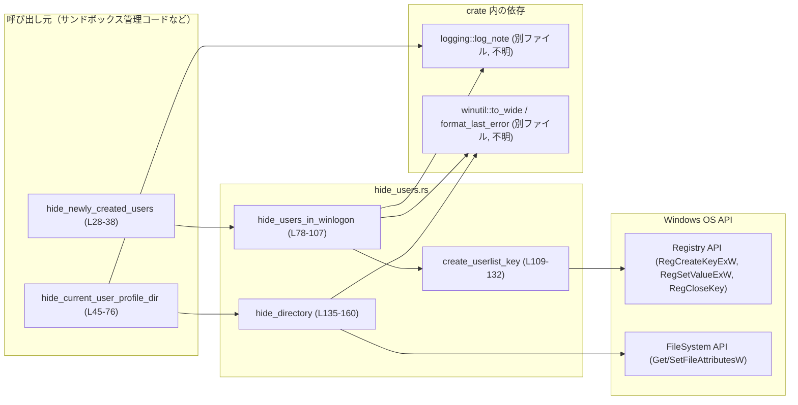
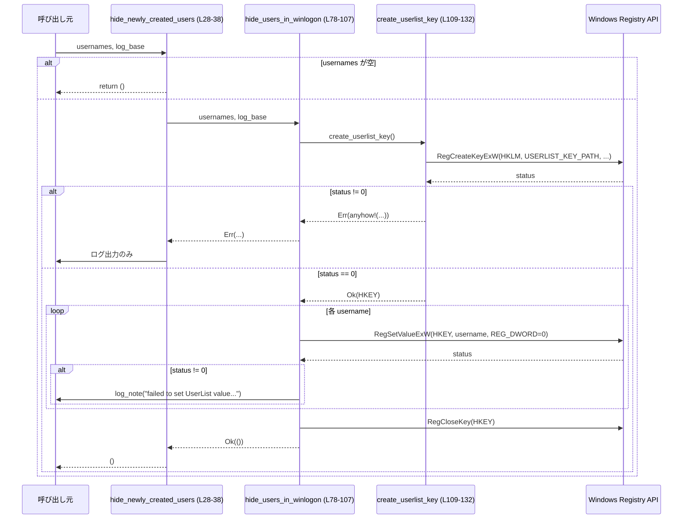
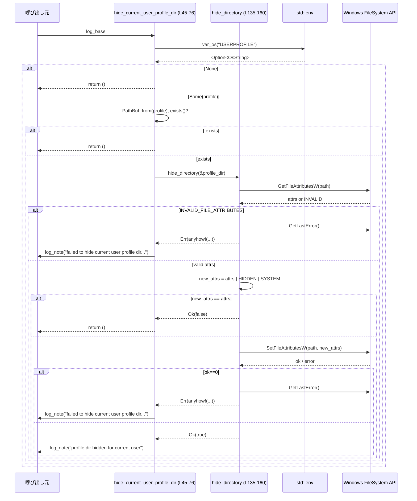

# windows-sandbox-rs/src/hide_users.rs

## 0. ざっくり一言

Windows サンドボックス用ユーザーをログオン画面やユーザープロファイルから目立たなくするために、  
レジストリ (`Winlogon\UserList`) とプロファイルディレクトリの属性を更新するモジュールです。  
（Windows 専用: `#![cfg(target_os = "windows")]`。根拠: windows-sandbox-rs/src/hide_users.rs:L1）

---

## 1. このモジュールの役割

### 1.1 概要

- 新規に作成したサンドボックスユーザーを、Windows の Winlogon 関連レジストリキーに登録し、「非表示」扱いにする機能を提供します。（根拠: `USERLIST_KEY_PATH`, 関数名・ログメッセージ。L25-26, L28-38, L78-107）
- 実際にログオンして作成されたカレントユーザーのプロファイルディレクトリに対して、`HIDDEN | SYSTEM` 属性を付与し、エクスプローラー等から見えにくくする機能を提供します。（根拠: コメントと `hide_current_user_profile_dir`, `hide_directory`. L40-45, L54-75, L134-160）
- いずれも「ベストエフォート」であり、失敗時にはログを出すだけで呼び出し元にはエラーを返さない設計になっています。（特に `hide_newly_created_users` の挙動。L28-38）

### 1.2 アーキテクチャ内での位置づけ

このモジュールは、サンドボックスユーザー管理ロジックの一部として、  
OS のレジストリ・ファイルシステム API と、crate 内のロギング・Windows ユーティリティ層に依存しています。



### 1.3 設計上のポイント

- **Windows 専用モジュール**  
  - ファイル先頭の `#![cfg(target_os = "windows")]` により、ビルド対象が Windows のときのみコンパイルされます。（L1）

- **責務の分割**
  - 公開 API:
    - `hide_newly_created_users`: 新規ユーザー群をレジストリに登録。（L28-38）
    - `hide_current_user_profile_dir`: カレントユーザーのプロファイルディレクトリ属性を変更。（L45-76）
  - 内部ヘルパー:
    - `hide_users_in_winlogon`: 実際のレジストリ値更新ループ。（L78-107）
    - `create_userlist_key`: 対象レジストリキーを開く／作成する。（L109-132）
    - `hide_directory`: ファイル属性を更新する純粋な Windows API ラッパー。（L135-160）

- **エラーハンドリング方針**
  - OS API 呼び出しはすべて `anyhow::Result` でラップし、詳細なエラーメッセージを構築します。（`anyhow!` の使用。L6, L125-130, L140-144, L153-157）
  - 公開 API のうち `hide_newly_created_users` / `hide_current_user_profile_dir` はともに戻り値 `()` で、内部エラーはログにのみ記録されます。（L28-38, L45-76）

- **安全性（Rust 観点）**
  - OS の生ポインタ API 呼び出し部分のみ `unsafe` ブロックを使用し、その外側の API はすべて safe 関数として提供されています。（L83-92, L103-105, L112-124, L137, L150）
  - `HKEY` ハンドルは `create_userlist_key` で取得し、`hide_users_in_winlogon` で必ず `RegCloseKey` により Close する構造になっています。（L79, L103-105, L109-132）

- **並行性**
  - このファイル内でマルチスレッドや非同期処理は使用していません。
  - ただし、レジストリやファイル属性というグローバル OS 状態を変更するため、他スレッド・別プロセスとの競合は OS の同期機構に依存します（コード内に独自ロックなどはありません）。

---

## 2. 主要な機能一覧

- 新規ユーザーの Winlogon `UserList` レジストリ値追加: 各ユーザー名を `REG_DWORD` 値（0）として書き込む。（L25-26, L78-107）
- カレントユーザーのプロファイルディレクトリの隠し属性設定: `HIDDEN | SYSTEM` ビットを付与。（L45-76, L134-160）
- `UserList` レジストリキー（`HKLM\...\UserList`）の作成・オープン。（L25-26, L109-132）
- 任意パスのファイル属性取得・更新（Win32 API ラッパー）。 （L134-160）

---

## 3. 公開 API と詳細解説

### 3.1 コンポーネントインベントリー

| 名称 | 種別 | 公開 | 位置（根拠） | 役割 / 用途 |
|------|------|------|-------------|------------|
| `USERLIST_KEY_PATH` | 定数 `&'static str` | - | windows-sandbox-rs/src/hide_users.rs:L25-26 | Winlogon `SpecialAccounts\UserList` レジストリキーのパス文字列。 |
| `hide_newly_created_users` | 関数 | `pub` | L28-38 | 新規に作成したユーザー名リストを受け取り、Winlogon UserList レジストリを更新する入口。 |
| `hide_current_user_profile_dir` | 関数 | `pub` | L45-76 | カレントユーザーの `USERPROFILE` ディレクトリを隠し属性にする入口。 |
| `hide_users_in_winlogon` | 関数 | 非公開 | L78-107 | UserList キーに対して `RegSetValueExW` を繰り返し呼び出すコア処理。 |
| `create_userlist_key` | 関数 | 非公開 | L109-132 | `HKLM\...\UserList` キーを作成／オープンし `HKEY` を返す。 |
| `hide_directory` | 関数 | 非公開 | L135-160 | 指定パスのファイル属性に `FILE_ATTRIBUTE_HIDDEN | FILE_ATTRIBUTE_SYSTEM` を追加する。 |

---

### 3.2 公開関数の詳細

#### `hide_newly_created_users(usernames: &[String], log_base: &Path)`

**概要**

新規に作成したユーザー名のスライスを受け取り、空でなければ Winlogon の UserList レジストリを更新します。  
内部で `hide_users_in_winlogon` を呼び出し、失敗時はログを出力しつつ、呼び出し元にはエラーを返しません。  
根拠: windows-sandbox-rs/src/hide_users.rs:L28-38, L78-107

**引数**

| 引数名 | 型 | 説明 |
|--------|----|------|
| `usernames` | `&[String]` | レジストリに登録したいユーザー名のリスト。空の場合は何もしません。（L28-31） |
| `log_base` | `&Path` | ログ出力のベースパスとして `log_note` に渡されます。（L33-36） |

**戻り値**

- `()`（何も返しません）
  - 処理成功／失敗にかかわらず、戻り値では区別されません。成功／失敗はログメッセージにのみ現れます。（L32-37）

**内部処理の流れ**

1. `usernames` が空なら即 return（何もしない）。（L29-31）
2. `hide_users_in_winlogon(usernames, log_base)` を呼び出す。（L32）
3. `hide_users_in_winlogon` が `Err(err)` を返した場合、  
   `"hide users: failed to update Winlogon UserList: {err}"` というメッセージを `log_note` によってログ出力する。（L32-36）
4. 戻り値は常に `()`。

**Examples（使用例）**

```rust
use std::path::Path;
use windows_sandbox_rs::hide_users::hide_newly_created_users; // モジュールパスは仮定

fn create_and_hide_users() {
    // サンドボックス用に作成したユーザー名のリスト
    let users = vec![
        "sandbox_user_1".to_string(),
        "sandbox_user_2".to_string(),
    ];

    let log_dir = Path::new("C:\\sandbox_logs"); // ログ出力用のディレクトリを仮定

    // UserList レジストリを更新し、ユーザーを「隠す」設定を試みる
    hide_newly_created_users(&users, log_dir);
    // 失敗してもパニックせず、ログにのみ記録される
}
```

**Errors / Panics**

- `hide_newly_created_users` 自体は `Result` を返さないため、呼び出し側からはエラーを検出できません。
- `hide_users_in_winlogon` 内で発生した OS API エラーは `anyhow::Result` 経由でこの関数に伝わり、  
  ここでログ出力されるだけです。（L32-37, L78-107）
- 明示的な `panic!` 呼び出しはありません。

**Edge cases（エッジケース）**

- `usernames` が空スライス: 早期 return し、レジストリ操作もログ出力も行いません。（L29-31）
- `hide_users_in_winlogon` がレジストリキー作成に失敗: エラーメッセージ付きでログ出力されます。（L32-37, L109-132）
- 一部のユーザーに対する `RegSetValueExW` のみ失敗: そのユーザー名について個別にログが出力されますが、他ユーザーの処理は継続します。（L80-101）

**使用上の注意点**

- 失敗時も戻り値では分からないため、「絶対にユーザーが隠れていなければならない」というセキュリティ要件がある場合は、  
  呼び出し元で別の検証手段を用意する必要があります。
- Windows レジストリ (`HKEY_LOCAL_MACHINE`) に書き込みを行うため、実行プロセスには管理者権限などの十分な権限が必要です。  
  権限不足は `create_userlist_key` の失敗としてログに現れます。（L109-132）

---

#### `hide_current_user_profile_dir(log_base: &Path)`

**概要**

環境変数 `USERPROFILE` で指されるカレントユーザーのプロファイルディレクトリを調べ、  
存在していれば `hide_directory` によって `HIDDEN | SYSTEM` 属性を付けます。  
成功・失敗に応じてログを出し、戻り値は `()` です。  
根拠: windows-sandbox-rs/src/hide_users.rs:L40-45, L46-76, L134-160

**引数**

| 引数名 | 型 | 説明 |
|--------|----|------|
| `log_base` | `&Path` | ログ出力のベースパスとして使用されます。（L57-63, L67-73） |

**戻り値**

- `()`（何も返しません）

**内部処理の流れ**

1. 環境変数 `USERPROFILE` を `std::env::var_os("USERPROFILE")` で取得。（L46）
   - 取得に失敗した場合（`None`）、何もせず return。（L46-48）
2. 得られたパスを `PathBuf` に変換。（L49）
3. `profile_dir.exists()` で存在チェックし、存在しなければ return。（L50-52）
4. `hide_directory(&profile_dir)` を呼び出して属性変更を試みる。（L54, L135-160）
5. 戻り値に応じて分岐:
   - `Ok(true)`: 実際に属性が変更されたので、1回だけログを出力。（L55-63）
   - `Ok(false)`: 既に必要な属性が付いており、変更なし。何もしない。（L65）
   - `Err(err)`: エラー内容を含むログを出力。（L66-73）

**Examples（使用例）**

```rust
use std::path::Path;
use windows_sandbox_rs::hide_users::hide_current_user_profile_dir; // モジュールパスは仮定

fn run_as_sandbox_user() {
    let log_dir = Path::new("C:\\sandbox_logs");

    // 現在のユーザー（サンドボックスユーザー想定）のプロファイルディレクトリを隠し属性にする
    hide_current_user_profile_dir(log_dir);

    // 失敗してもアプリケーション全体はそのまま進行し、詳細はログにのみ残る
}
```

**Errors / Panics**

- `USERPROFILE` が存在しない場合や、プロファイルディレクトリがまだ作成されていない場合は、  
  エラーとはみなさず即 return します（ログも出ません）。（L46-52）
- `hide_directory` が `Err` を返した場合にのみログ出力が行われますが、関数はパニックせず `()` を返します。（L66-73）

**Edge cases（エッジケース）**

- `USERPROFILE` が未設定: 早期 return。（L46-48）
- `USERPROFILE` が存在しないパスを指している: `exists()` が false となり早期 return。（L49-52）
- `hide_directory` 内で `GetFileAttributesW` が `INVALID_FILE_ATTRIBUTES` を返す（たとえば権限不足やパス不正など）:  
  `Err` となり、その内容がログ出力されます。（L135-145, L66-73）
- すでに `HIDDEN | SYSTEM` 属性が付いている: `hide_directory` が `Ok(false)` を返し、ログは出ません。（L146-148, L54-65）

**使用上の注意点**

- 環境変数 `USERPROFILE` に依存しているため、プロセスの実行ユーザーが想定と異なる場合、  
  隠されるディレクトリも異なります。
- この関数は「ベストエフォート」であり、セキュリティの最終防衛線としては設計されていません。  
  実際の隠蔽状態を必ず保証したい場合は、追加の検証ロジックが必要です。

---

### 3.3 内部関数の概要

ここでは補助関数を簡潔にまとめます。

| 関数名 | シグネチャ | 位置 | 役割（1 行） |
|--------|-----------|------|--------------|
| `hide_users_in_winlogon` | `fn hide_users_in_winlogon(usernames: &[String], log_base: &Path) -> anyhow::Result<()>` | L78-107 | `create_userlist_key` で開いた `UserList` キーに対して、各ユーザー名の `REG_DWORD` 値（0）を書き込む。 |
| `create_userlist_key` | `fn create_userlist_key() -> anyhow::Result<HKEY>` | L109-132 | `USERLIST_KEY_PATH` のレジストリキーを `RegCreateKeyExW` で作成・オープンし、`HKEY` を返す。 |
| `hide_directory` | `fn hide_directory(path: &Path) -> anyhow::Result<bool>` | L135-160 | 指定パスのファイル属性を取得し、`FILE_ATTRIBUTE_HIDDEN | FILE_ATTRIBUTE_SYSTEM` を追加して更新する。 |

#### `hide_users_in_winlogon(...)`

- `create_userlist_key()?` で `HKEY` を取得し、エラーなら即 `Err` を返します。（L79, L109-132）
- 各 `username` について `to_wide(OsStr::new(username))` で UTF-16 文字列に変換し、`RegSetValueExW` を呼び出します。（L80-92）
- `value` は常に `0u32` に固定で、`REG_DWORD` 型として登録しています。（L82, L88-90）
- `RegSetValueExW` が非 0 を返した場合、そのステータスと `format_last_error(status as i32)` をログ出力しますが、  
  `Result` としては成功扱いでループ継続します。（L93-101）
- 最後に `RegCloseKey` でハンドルを解放し、`Ok(())` を返します。（L103-107）

#### `create_userlist_key()`

- `USERLIST_KEY_PATH` を UTF-16 に変換し（`to_wide`）、`RegCreateKeyExW` に渡します。（L110-123）
- `REG_OPTION_NON_VOLATILE` と `KEY_WRITE` を指定し、書き込み可能な永続キーとして開きます。（L118-119）
- 戻り値 `status != 0`（＝エラー）の場合、`anyhow!` で詳細メッセージ付きの `Err` を返します。（L125-130）
- 成功時は `Ok(key)` で `HKEY` を返します。（L131）

#### `hide_directory(path: &Path)`

- `to_wide(path)` でパスを UTF-16 に変換。（L136）
- `GetFileAttributesW` で現在の属性を取得し、`INVALID_FILE_ATTRIBUTES` の場合には `GetLastError` を取得して `Err` を返します。（L137-145）
- 新しい属性 `new_attrs = attrs | FILE_ATTRIBUTE_HIDDEN | FILE_ATTRIBUTE_SYSTEM` を計算。（L146）
- 属性が変化しない（すでに両フラグが立っている）場合は `Ok(false)` を返します。（L147-148）
- `SetFileAttributesW` で属性を更新し、失敗した場合は `GetLastError` とともに `Err` を返します。（L150-157）
- 成功時は `Ok(true)` を返します。（L159）

---

## 4. データフロー

### 4.1 新規ユーザーを非表示扱いにするフロー



### 4.2 カレントユーザープロファイルを隠すフロー



---

## 5. 使い方（How to Use）

### 5.1 基本的な使用方法

サンドボックスユーザーを作成した直後、そしてそのユーザーとしてコマンドを実行する際に使う、というパターンが想定されます。

```rust
use std::path::Path;
use windows_sandbox_rs::hide_users::{
    hide_newly_created_users,
    hide_current_user_profile_dir,
}; // 実際のクレート名・モジュール階層はコードベース依存

fn main() {
    let log_dir = Path::new("C:\\sandbox_logs");

    // 1. 新規に作成したユーザーを Winlogon UserList に登録
    let new_users = vec!["sandbox_u1".to_string(), "sandbox_u2".to_string()];
    hide_newly_created_users(&new_users, log_dir);

    // 2. 実際にサンドボックスユーザーとしてログオンしているプロセス側で、
    //    プロファイルディレクトリを隠し属性にする
    hide_current_user_profile_dir(log_dir);
}
```

### 5.2 よくある使用パターン

- **ユーザー作成時の一括登録**
  - 複数のサンドボックスユーザーをまとめて作成した直後に、`hide_newly_created_users` に全て渡す。（L28-38, L80-101）
- **ログオン直後のプロファイル隠蔽**
  - 実際にサンドボックスユーザーとしてログオンしたプロセス（例: コマンドランナー）側で `hide_current_user_profile_dir` を呼ぶ。（L40-45）

### 5.3 よくある間違い（想定されるもの）

```rust
use std::path::Path;
use windows_sandbox_rs::hide_users::hide_newly_created_users;

// 誤り例: ユーザー名が空のまま呼び出してしまう
fn wrong_usage() {
    let log_dir = Path::new("C:\\logs");
    let users: Vec<String> = Vec::new();

    hide_newly_created_users(&users, log_dir); // 何も実行されない（L29-31）
}

// 正しい例: 実際に作成されたユーザー名を渡す
fn correct_usage() {
    let log_dir = Path::new("C:\\logs");
    let users = vec!["sandbox".to_string()];

    hide_newly_created_users(&users, log_dir); // UserList に値が追加される可能性がある
}
```

### 5.4 使用上の注意点（まとめ）

- **権限**
  - レジストリ `HKEY_LOCAL_MACHINE\...` に書き込むため、管理者権限などが必要です。（L109-132）
  - ファイル属性の変更も対象ディレクトリに対する書き込み権限が必要です。（L135-160）

- **エラーの扱い**
  - 公開関数は `Result` を返さず、失敗時もログ出力のみという設計です。（L28-38, L45-76）
  - エラーをプログラムフローに反映させたい場合、呼び出し元でログを解析する／別ルートで検証する必要があります。

- **OS 依存**
  - `#![cfg(target_os = "windows")]` により Windows 以外ではコンパイルされません。（L1）
  - Windows API の仕様変更や権限の制約に影響を受けます。

---

## 6. 変更の仕方（How to Modify）

### 6.1 新しい機能を追加する場合

- **他の属性を追加で設定したい場合**
  - `hide_directory` 内の `new_attrs` 計算箇所（L146）に新しいフラグ（例: 読み取り専用など）を OR する形で拡張できます。
  - 影響範囲は `hide_current_user_profile_dir` のみ（現状）です。

- **別のレジストリキーにも登録したい場合**
  - `USERLIST_KEY_PATH` と `create_userlist_key` を参考に、新しいキー用の定数と作成関数を追加すると構造が揃います。（L25-26, L109-132）

### 6.2 既存の機能を変更する場合の注意点

- **結果を `Result` として返すように変更する場合**
  - `hide_newly_created_users` / `hide_current_user_profile_dir` のシグネチャ変更は、呼び出し元への影響が大きいので、  
    まずこの 2 関数の利用箇所を全検索して影響範囲を確認する必要があります。
- **レジストリ値の型や値を変更する場合**
  - 現在は `REG_DWORD` で `0u32` を書き込んでいます（L82-89）。型や値を変えると、  
    既存の Windows 挙動や他コンポーネントとの互換性に影響があります。
- **Windows API 呼び出し**
  - `unsafe` ブロックの引数やポインタの生成方法を変える場合は、  
    対応する Windows API の仕様書を確認することが重要です。（L83-92, L112-124, L137, L150）

---

## 7. 関連ファイル

| パス / モジュール | 役割 / 関係 |
|-------------------|------------|
| `crate::logging::log_note`（パス不明; このチャンクには現れない） | ログメッセージを出力する関数。`hide_newly_created_users` / `hide_current_user_profile_dir` / `hide_users_in_winlogon` から呼び出されます。（L3, L33-36, L57-63, L67-73, L93-101） |
| `crate::winutil::to_wide`（パス不明） | Rust の文字列やパスを Windows API 用の UTF-16 ワイド文字列への変換を行うユーティリティ関数。（L5, L81, L110, L136） |
| `crate::winutil::format_last_error`（パス不明） | Windows エラーコードを人間が読める文字列へ整形するユーティリティ。（L4, L97-98, L127-129, L143-144, L156-157） |
| `windows_sys` クレート | Windows API（レジストリ・ファイルシステム）の FFI バインディングを提供し、本モジュールから直接使用されています。（L10-23） |

---

## 付録: 考えられる問題点・安全性の観点

※見出し名は変えていますが、内容は Bugs/Security / Contracts / Edge Cases の観点を含みます。

- **レジストリ更新に失敗した場合のリスク**
  - `hide_newly_created_users` は失敗しても戻り値で通知しないため、  
    呼び出し元が「ユーザーが隠れた」と仮定すると、実際にはレジストリ更新が行われないケースがあり得ます。（L32-37, L78-107）
- **部分失敗**
  - `hide_users_in_winlogon` 内では、あるユーザーの `RegSetValueExW` が失敗しても他ユーザーの更新は続行されます。（L93-101）
  - 一部のユーザーだけが隠蔽設定されない、という状態が発生しうる設計です。
- **入力検証**
  - `usernames` の内容について、長さや使用可能文字のバリデーションは行っていません。（L80-82）
  - Windows レジストリの値名として不適切な文字列が渡された場合、`RegSetValueExW` が失敗し（ログに残る）だけです。
- **ファイルシステムの競合**
  - `hide_directory` はファイル属性を読み取ってから書き戻しますが（L137-150）、  
    その間に別プロセス・別スレッドが属性を更新した場合の競合は考慮されていません（OS の挙動に依存）。
- **テスト観点**
  - このチャンクにはテストコードは含まれていません。
  - 実際のテストでは、実機の Windows 環境でレジストリ・ファイル属性の変化を検証する統合テストか、  
    Windows API をラップしたモジュールをモック化する形が現実的と考えられます（これは一般的な方針であり、このコードからは詳細不明です）。
