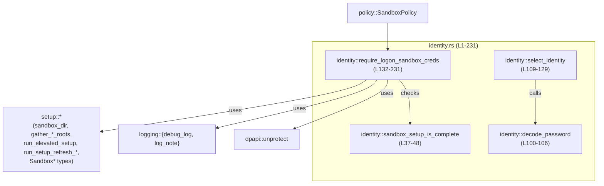
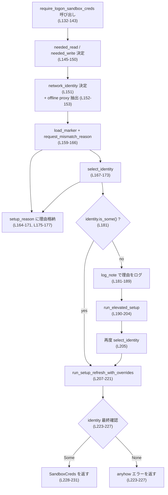
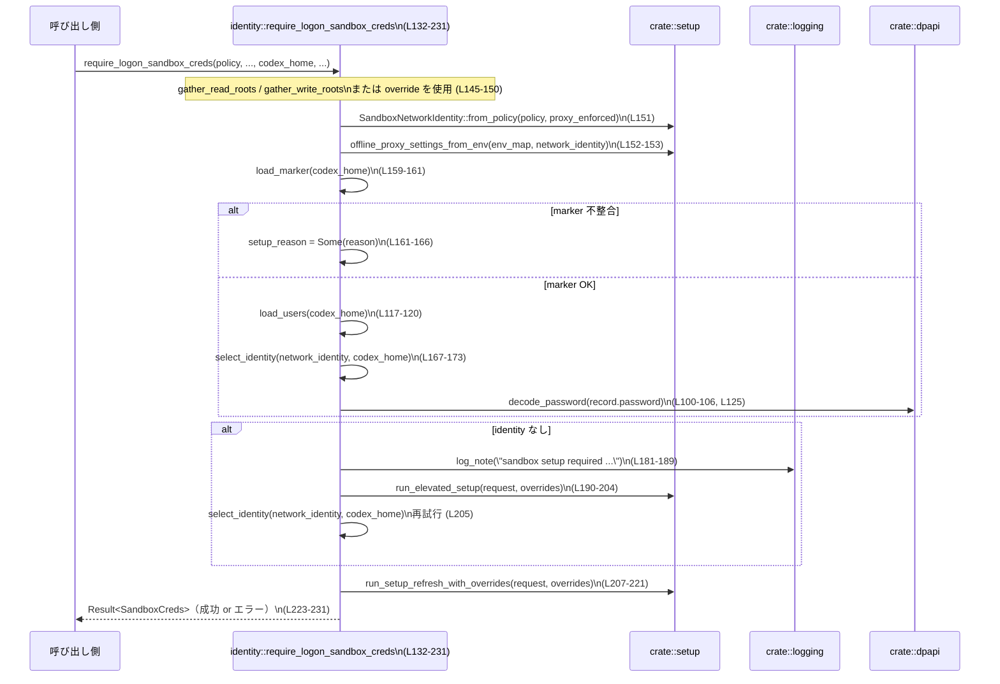

# windows-sandbox-rs/src/identity.rs コード解説

## 0. ざっくり一言

Windows サンドボックス用の「ユーザー名＋パスワード」を取得するためのモジュールです。  
ディスク上のセットアップ状態を確認し、必要なら外部のセットアップヘルパーを昇格実行したうえで、オンライン／オフライン用の資格情報を復号して返します（identity.rs:L25-35, L42-48, L132-231）。

---

## 1. このモジュールの役割

### 1.1 概要

- このモジュールは Windows サンドボックスの「セットアップが完了しているか」を判定し、必要に応じてセットアップを実行したうえで、ログオンに使う資格情報（ユーザー名とパスワード）を取得する役割を持ちます（identity.rs:L37-48, L132-231）。
- 資格情報は `SandboxUsersFile` 上のレコードから選択され、Base64 と DPAPI による暗号化を解除して復号されます（identity.rs:L100-106, L121-129）。
- セットアップ状態は `SetupMarker` と `SandboxUsersFile` の両方のバージョン整合性によって評価されます（identity.rs:L42-48, L113-120）。

### 1.2 アーキテクチャ内での位置づけ

このモジュールは「サンドボックス環境のセットアップ／管理」を行う `setup` モジュールと、「ポリシー定義」を行う `policy` モジュールの間に位置し、ポリシーに応じたネットワークアイデンティティを選んで資格情報を返します。



- `identity.rs` は外部から直接呼ばれる公開関数を提供し（`sandbox_setup_is_complete`, `require_logon_sandbox_creds`）、内部で `setup` / `dpapi` / `logging` に依存します（identity.rs:L1-23, L37-48, L132-231）。
- `SandboxPolicy` からネットワークアイデンティティなどを導出し、`setup` 側のヘルパーにセットアップ処理や ACL 更新を委譲します（identity.rs:L132-153, L190-221）。

### 1.3 設計上のポイント

- **ステップ分割**
  - セットアップ済み判定（`sandbox_setup_is_complete`）と、実際の資格情報取得＋必要時セットアップ（`require_logon_sandbox_creds`）を分離しています（identity.rs:L37-48, L132-231）。
  - ファイル読み込み・パース処理は `load_marker`, `load_users` に分離されています（identity.rs:L50-98）。
- **状態管理**
  - このモジュール内にはグローバル状態やキャッシュはなく、すべて引数経由で状態を受け取り、その場でファイルを読み直す構造です（identity.rs 全体）。
- **エラーハンドリング**
  - 外部向け API は `Result<T>` か `bool` を返します。`Result` のエラーには `anyhow::Error` が使われています（identity.rs:L50, L75, L100, L109, L133）。
  - マーカー／ユーザーファイルの読み取りやパースに失敗した場合はログに記録しつつ `Ok(None)` を返し、「セットアップ未完了」として扱います（identity.rs:L52-72, L77-87, L88-97）。
- **セキュリティ**
  - パスワードは Base64 からバイナリに戻した後、`dpapi::unprotect` で復号し、UTF-8 文字列に変換しています（identity.rs:L100-106）。
  - コメントで `.sandbox` ディレクトリを書き込みルートに含めないことが明示されており、制限付きトークンからの書き込みを防ぐ設計になっています（identity.rs:L154-156）。
- **並行性**
  - このモジュールは同期的（ブロッキング）なファイル I/O とプロセス実行（`run_elevated_setup`, `run_setup_refresh_with_overrides`）のみを行っており、スレッドや async は使用していません（identity.rs:L52-72, L77-87, L190-221）。

---

## 2. 主要な機能一覧

- サンドボックスセットアップ完了判定: `sandbox_setup_is_complete` でマーカーとユーザーファイルのバージョン整合性を確認（identity.rs:L37-48）。
- セットアップマーカーの読み込み: `load_marker` で JSON マーカーを読み取り／パース（identity.rs:L50-73）。
- サンドボックスユーザー一覧の読み込み: `load_users` でユーザーファイルを取得（identity.rs:L75-98）。
- パスワード復号: `decode_password` で Base64 と DPAPI を用いてパスワードを復号（identity.rs:L100-106）。
- ネットワークアイデンティティごとの資格情報選択: `select_identity` でオンライン／オフライン用アカウントを選択（identity.rs:L109-129）。
- ログオン用資格情報の取得＋セットアップ実行: `require_logon_sandbox_creds` で必要なルート・ポリシーに基づいてセットアップを行い、`SandboxCreds` を返却（identity.rs:L132-231）。

---

## 3. 公開 API と詳細解説

### 3.1 型一覧（構造体・列挙体など）

| 名前 | 種別 | 可視性 | 役割 / 用途 | 定義行 |
|------|------|--------|------------|--------|
| `SandboxIdentity` | 構造体 | モジュール内専用 | 復号済みの内部用資格情報（ユーザー名＋パスワード）を保持します。外部には公開されません（identity.rs:L25-29）。 | identity.rs:L25-29 |
| `SandboxCreds` | 構造体 | `pub` | 外部に返すサンドボックス資格情報（ユーザー名＋パスワード）を表します（identity.rs:L31-35）。 | identity.rs:L31-35 |

`SandboxCreds` は `require_logon_sandbox_creds` の戻り値として使われます（identity.rs:L133, L228-231）。

### 3.2 関数詳細

#### `sandbox_setup_is_complete(codex_home: &Path) -> bool`

**概要**

- ディスク上のセットアップマーカーとユーザーファイルが存在し、かつ現在のバージョンと一致しているかを判定する関数です（identity.rs:L37-48）。
- オフライン用ファイアウォール設定などの詳細な検証は行わず、あくまで「粗い準備完了チェック」です（コメントより, identity.rs:L37-41）。

**引数**

| 引数名 | 型 | 説明 |
|--------|----|------|
| `codex_home` | `&Path` | サンドボックス関連のファイル（マーカー・ユーザー情報など）が配置されるルートディレクトリへのパス（identity.rs:L42）。 |

**戻り値**

- `bool`  
  - `true`: マーカー／ユーザーファイルが存在し、両方とも `version_matches()` が `true` を返している場合（identity.rs:L42-48）。
  - `false`: 上記条件を満たさない場合。

**内部処理の流れ**

1. `load_marker(codex_home)` を呼び出し、`Ok(Some(marker))` かつ `marker.version_matches()` であれば `marker_ok = true` とする（identity.rs:L42-43）。
2. `marker_ok` が `false` であれば、即座に `false` を返す（identity.rs:L44-46）。
3. `load_users(codex_home)` を呼び出し、`Ok(Some(users))` かつ `users.version_matches()` の場合に `true`、それ以外は `false` を返す（identity.rs:L47）。

**Examples（使用例）**

```rust
use std::path::Path;
use windows_sandbox_rs::identity::sandbox_setup_is_complete; // 仮のパス

fn main() {
    let codex_home = Path::new(r"C:\Users\me\.codex"); // CODEX_HOME 相当のパス
    if sandbox_setup_is_complete(codex_home) {
        println!("sandbox setup is complete");
    } else {
        println!("sandbox setup is NOT complete");
    }
}
```

※ `windows_sandbox_rs::identity` などのパスは実際のクレート構成に依存するため、このチャンクからは正確なモジュールパスは分かりません。

**Errors / Panics**

- `sandbox_setup_is_complete` 自体は `Result` ではなく `bool` を返すため、内部で発生した I/O やパースエラーは `load_marker` / `load_users` 内で処理され、ここまで伝播しません（identity.rs:L42-48, L50-98）。
- パニックを発生させるコードは含まれていません。

**Edge cases（エッジケース）**

- マーカーファイルが存在しない場合  
  `load_marker` が `Ok(None)` を返し、`marker_ok == false` となるため `false` が返ります（identity.rs:L50-73, L42-46）。
- ユーザーファイルが存在しない・読み取り失敗・パース失敗の場合  
  `load_users` が `Ok(None)` を返し、`matches!(..., Ok(Some(users)) if ...)` にマッチしないため `false` が返ります（identity.rs:L75-98, L47）。
- どちらかの `version_matches()` が `false` の場合も `false` を返します。

**使用上の注意点**

- この関数が `true` を返しても、オフラインプロキシ／ファイアウォール設定などの詳細な整合性は検証されません。コメントに記載のとおり、追加検証は `require_logon_sandbox_creds` に任されています（identity.rs:L37-41）。
- 正確な準備確認が必要な場合は、この関数だけに頼るのではなく、実際に `require_logon_sandbox_creds` を呼び出して確認する必要があります。

---

#### `load_marker(codex_home: &Path) -> Result<Option<SetupMarker>>`

**概要**

- サンドボックスセットアップマーカー（JSON）の読み込みとパースを行い、`SetupMarker` を返します（identity.rs:L50-73）。
- 読み込み／パースに失敗した場合はログに記録しつつ `Ok(None)` を返し、エラーとしては扱いません。

**引数**

| 引数名 | 型 | 説明 |
|--------|----|------|
| `codex_home` | `&Path` | マーカーファイルの基準ディレクトリ（identity.rs:L50-51）。 |

**戻り値**

- `Result<Option<SetupMarker>>`
  - `Ok(Some(marker))`: 読み込みとパースに成功した場合（identity.rs:L52-55）。
  - `Ok(None)`: ファイルが存在しない、または読み込み／パースに失敗した場合（identity.rs:L56-71）。
  - `Err(_)`: この関数内では常に `Ok` を返しており、`Err` は使用していません（identity.rs:L72）。

**内部処理の流れ**

1. `setup_marker_path(codex_home)` でファイルパスを取得（identity.rs:L51）。
2. `fs::read_to_string(&path)` でファイルを読み込み、`match` でパターン分岐（identity.rs:L52）。
   - 成功: `serde_json::from_str::<SetupMarker>(&contents)` を試み、成功時は `Some(m)`、パース失敗時は `debug_log` にエラーメッセージを書いて `None`（identity.rs:L53-62）。
   - `NotFound` エラー: `None` を返す（identity.rs:L63）。
   - その他のエラー: `debug_log` に記録し `None`（identity.rs:L64-70）。
3. 最後に `Ok(marker)` として `Option<SetupMarker>` を返す（identity.rs:L72）。

**Examples（使用例）**

```rust
use std::path::Path;
use anyhow::Result;

fn example_load_marker(codex_home: &Path) -> Result<()> {
    let marker_opt = identity::load_marker(codex_home)?; // 実際には private 関数
    if let Some(marker) = marker_opt {
        println!("marker loaded: {:?}", marker);
    }
    Ok(())
}
```

※ `load_marker` は `pub` ではないため、実際には同モジュール内、あるいはテストからのみ呼び出されます（identity.rs:L50）。

**Errors / Panics**

- この関数は `anyhow::Result` を返しますが、内部で `Err` を返すことはなく、常に `Ok(Some(..))` または `Ok(None)` です（identity.rs:L50-73）。
- そのため、呼び出し側は「I/O やパースエラーが起きても `Err` ではなく `None` として扱われる」契約を前提として実装されています。

**Edge cases**

- ファイルが存在しない場合: `Ok(None)`（identity.rs:L63, L72）。
- ファイルはあるが JSON が壊れている場合: ログ出力後 `Ok(None)`（identity.rs:L53-62, L72）。
- 読み取り中に権限不足などのエラーが発生した場合: ログ出力後 `Ok(None)`（identity.rs:L64-70, L72）。

**使用上の注意点**

- 呼び出し側は `Err` ではなく `Ok(None)` でエラー状態が通知される点に注意する必要があります。  
  例: `sandbox_setup_is_complete` や `select_identity` は `None` を「セットアップ未完了」として扱っています（identity.rs:L42-48, L113-120）。

---

#### `load_users(codex_home: &Path) -> Result<Option<SandboxUsersFile>>`

**概要**

- サンドボックス用ユーザー情報（`SandboxUsersFile`）を JSON から読み込む関数です（identity.rs:L75-98）。
- 読み込み失敗やパース失敗時にはログを出力しつつ `Ok(None)` を返します。

**引数・戻り値**

- 引数 `codex_home: &Path` は `load_marker` と同様にベースディレクトリです（identity.rs:L75-76）。
- 戻り値は `Result<Option<SandboxUsersFile>>` で、意味は `load_marker` と同様（identity.rs:L75, L88-97）。

**内部処理の流れ**

1. `sandbox_users_path(codex_home)` からユーザーファイルのパスを取得（identity.rs:L76）。
2. `fs::read_to_string` で読み込み、`match` でパターン分岐（identity.rs:L77-87）。
   - 成功: 中身を `contents` として保持（identity.rs:L78）。
   - `NotFound`: `Ok(None)` を即座に返す（identity.rs:L79）。
   - その他のエラー: ログ出力後 `Ok(None)`（identity.rs:L80-86）。
3. 読み取った文字列を `serde_json::from_str::<SandboxUsersFile>` でパース（identity.rs:L88-97）。
   - 成功: `Ok(Some(users))`（identity.rs:L88-90）。
   - 失敗: ログ出力後 `Ok(None)`（identity.rs:L91-96）。

**使用上の注意点**

- こちらも `Err` ではなく `Ok(None)` でエラー状態を表すため、呼び出し側は `None` を適切に扱う必要があります（identity.rs:L88-97）。
- `SandboxUsersFile` の構造やフィールド（`offline`, `online`）は `select_identity` から使用されていますが、このチャンクには定義が現れません（identity.rs:L117-123）。

---

#### `decode_password(record: &SandboxUserRecord) -> Result<String>`

**概要**

- `SandboxUserRecord` の `password` フィールドに格納された文字列を、Base64 デコード＋DPAPI 復号＋UTF-8 文字列変換して返す関数です（identity.rs:L100-106）。

**引数**

| 引数名 | 型 | 説明 |
|--------|----|------|
| `record` | `&SandboxUserRecord` | パスワードを含むユーザーレコード。構造はこのチャンクには定義がありませんが、`record.password` が文字列として使用されています（identity.rs:L100-102）。 |

**戻り値**

- `Result<String>`  
  成功時は復号済みのパスワード文字列、失敗時は `anyhow::Error` を返します（identity.rs:L100-106）。

**内部処理の流れ**

1. `record.password.as_bytes()` を取り出し、Base64 標準エンコードとしてデコード（identity.rs:L100-103）。
   - デコード失敗時は `"base64 decode password"` というコンテキスト付きで `Err` を返す（`Context` 使用, identity.rs:L101-103）。
2. `dpapi::unprotect(&blob)` を呼び出してバイナリデータを復号（identity.rs:L104）。
   - `unprotect` の詳細挙動はこのチャンクには現れません。
3. 得られたバイトベクタを `String::from_utf8` で UTF-8 文字列に変換（identity.rs:L105）。
   - 失敗した場合は `"sandbox password not utf-8"` というメッセージ付きで `Err`（identity.rs:L105）。
4. 成功した文字列を `Ok(pwd)` として返す（identity.rs:L106）。

**Examples（使用例）**

実際には `select_identity` 経由での利用が主と考えられます。

```rust
fn example_decode_user(record: &SandboxUserRecord) -> anyhow::Result<String> {
    let pwd = decode_password(record)?; // private 関数のため実際には同モジュール内のみ
    Ok(pwd)
}
```

**Errors / Panics**

- Base64 デコード失敗（`record.password` が正しい Base64 でない）: `Err("base64 decode password: ...")`（identity.rs:L100-103）。
- `dpapi::unprotect` の失敗: そのまま `Err` として伝播します（identity.rs:L104）。
- UTF-8 変換失敗: `Err("sandbox password not utf-8")`（identity.rs:L105）。

**Edge cases**

- 空文字列のパスワード: Base64 デコードは成功しうるが、その後の DPAPI／UTF-8 に依存します（identity.rs:L100-106）。挙動は `dpapi::unprotect` の仕様次第であり、このチャンクだけでは断定できません。
- 非 Base64 文字を含む文字列: デコード時点で `Err` になります。

**使用上の注意点**

- この関数はエラーを `Result` として返すため、呼び出し側では `?` 演算子などで適切に扱う必要があります。`select_identity` では `?` によってそのまま上位に伝播しています（identity.rs:L125）。
- 復号されたパスワードは `String` としてメモリ上に平文で保持されます（identity.rs:L105-106）。これはセキュリティ上の一般的注意点です。

---

#### `select_identity(network_identity: SandboxNetworkIdentity, codex_home: &Path) -> Result<Option<SandboxIdentity>>`

**概要**

- ネットワークアイデンティティ（オンライン／オフライン）に応じて、適切な `SandboxUserRecord` を選択し、パスワードを復号して `SandboxIdentity` を返す関数です（identity.rs:L109-129）。
- マーカー／ユーザーファイルのバージョンが合わない、または存在しない場合は `Ok(None)` を返します（identity.rs:L113-120）。

**引数**

| 引数名 | 型 | 説明 |
|--------|----|------|
| `network_identity` | `SandboxNetworkIdentity` | `Offline` or `Online` などのネットワークアイデンティティ。詳細なバリアントはこのチャンクには現れませんが、少なくとも 2 種が存在します（identity.rs:L121-123）。 |
| `codex_home` | `&Path` | マーカー／ユーザーファイルの基準ディレクトリ（identity.rs:L109-112）。 |

**戻り値**

- `Result<Option<SandboxIdentity>>`
  - `Ok(Some(identity))`: 成功して資格情報を復号できた場合。
  - `Ok(None)`: マーカー／ユーザーが不在またはバージョン不一致の場合（identity.rs:L113-120）。
  - `Err(_)`: `decode_password` や `load_*` 内部のエラーが発生した場合（identity.rs:L113-120, L125）。

**内部処理の流れ**

1. `load_marker(codex_home)?` を呼び出し、`Some(m) if m.version_matches()` の場合のみ続行し、それ以外は `Ok(None)` を返す（identity.rs:L113-116）。
2. `load_users(codex_home)?` を呼び出し、`Some(u) if u.version_matches()` の場合のみ続行し、それ以外は `Ok(None)`（identity.rs:L117-120）。
3. `network_identity` に応じて `users.offline` または `users.online` を選択（identity.rs:L121-124）。
4. `decode_password(&chosen)?` でパスワードを復号（identity.rs:L125）。
5. `SandboxIdentity { username: chosen.username, password }` として `Some(...)` を返す（identity.rs:L126-129）。

**使用上の注意点**

- `SandboxUsersFile` 内の `offline` / `online` フィールドが所有権をどう扱うか（値か参照か）はこのチャンクからは分かりませんが、ここでは値としてムーブされているように記述されています（identity.rs:L121-123）。
- `decode_password` の失敗は `Err` として上位に伝播します。`require_logon_sandbox_creds` ではこれをそのままユーザーに返しています（identity.rs:L167-173, L133）。

---

#### `require_logon_sandbox_creds(...) -> Result<SandboxCreds>`

**概要**

- サンドボックスを実行する前に、必要なディレクトリ ACL やプロキシ設定などを含むセットアップ状態を確認し、必要であれば昇格されたセットアップバイナリを実行して環境を整えたうえで、ログオン用の資格情報 `SandboxCreds` を返す中核関数です（identity.rs:L132-231）。
- オフライン／オンラインのネットワークアイデンティティは `SandboxNetworkIdentity::from_policy` によりポリシーから導出されます（identity.rs:L151）。

**引数**

| 引数名 | 型 | 説明 |
|--------|----|------|
| `policy` | `&SandboxPolicy` | サンドボックスに適用するポリシー。ネットワークアイデンティティの決定などに使用されます（identity.rs:L133-135, L151）。 |
| `policy_cwd` | `&Path` | ポリシーファイルに対するカレントディレクトリ。書き込みルート収集に使用されます（identity.rs:L135, L148-150）。 |
| `command_cwd` | `&Path` | 実行コマンドのカレントディレクトリ。読み込みルート収集に使用されます（identity.rs:L136, L145-147）。 |
| `env_map` | `&HashMap<String, String>` | 環境変数マップ。書き込みルート収集やオフラインプロキシ設定の抽出に使用されます（identity.rs:L137, L148-153）。 |
| `codex_home` | `&Path` | サンドボックス関連ファイルのベースディレクトリ（identity.rs:L138, L144）。 |
| `read_roots_override` | `Option<&[PathBuf]>` | 読み取りルートの上書き指定。`Some` の場合、`gather_read_roots` は呼ばれず、この配列がそのまま使用されます（identity.rs:L139, L145-147）。 |
| `write_roots_override` | `Option<&[PathBuf]>` | 書き込みルートの上書き指定（identity.rs:L140, L148-150）。 |
| `deny_write_paths_override` | `&[PathBuf]` | 書き込みを拒否するパスのリスト（identity.rs:L141, L199-203, L218-220）。 |
| `proxy_enforced` | `bool` | プロキシが強制されているかどうか。ネットワークアイデンティティ決定やセットアップに影響します（identity.rs:L142, L151, L197, L215）。 |

**戻り値**

- `Result<SandboxCreds>`  
  成功時: サンドボックスログオンに使用するユーザー名・パスワード。  
  失敗時: セットアップ実行やファイル I/O、復号などのエラーを含む `anyhow::Error`（identity.rs:L133, L190-205, L208-227）。

**内部処理の流れ（アルゴリズム）**

1. サンドボックスディレクトリを取得  
   `sandbox_dir = crate::setup::sandbox_dir(codex_home)`（identity.rs:L144）。

2. 読み取りルート `needed_read` を決定（identity.rs:L145-147）。
   - `read_roots_override` が `Some(paths)` の場合: そのまま `paths.to_vec()`。
   - `None` の場合: `gather_read_roots(command_cwd, policy, codex_home)` を呼び出し、自動収集。

3. 書き込みルート `needed_write` を決定（identity.rs:L148-150）。
   - `write_roots_override` が `Some(paths)` の場合: `paths.to_vec()`。
   - `None` の場合: `gather_write_roots(policy, policy_cwd, command_cwd, env_map)` を呼ぶ。

4. ネットワークアイデンティティとオフラインプロキシ設定を決定（identity.rs:L151-153）。
   - `network_identity = SandboxNetworkIdentity::from_policy(policy, proxy_enforced)`。
   - `desired_offline_proxy_settings = offline_proxy_settings_from_env(env_map, network_identity)`。

5. `setup_reason: Option<String>` を初期化（identity.rs:L157）。

6. マーカーとユーザー情報から `identity: Option<SandboxIdentity>` を取得（identity.rs:L159-179）。
   - `load_marker(codex_home)?` でマーカーを読み込み、バージョン一致の場合のみ続行（identity.rs:L159-161）。
   - マーカーの `request_mismatch_reason` により、ネットワークアイデンティティやオフラインプロキシ設定との不整合があれば、その理由文字列を `setup_reason` に格納し、`identity = None`（identity.rs:L161-166）。
   - マッチしていれば `select_identity(network_identity, codex_home)?` を呼ぶ（identity.rs:L167-168）。
     - `selected` が `None` の場合: `setup_reason` に「sandbox users missing or incompatible ...」を格納（identity.rs:L168-171）。

7. マーカーが無い・バージョン不一致の場合  
   `setup_reason` に「sandbox setup marker missing or incompatible」を設定し、`identity = None`（identity.rs:L175-179）。

8. `identity.is_none()` なら昇格セットアップを実行（identity.rs:L181-206）。
   - `setup_reason` があれば `"sandbox setup required: {reason}"` を `log_note` に記録、なければデフォルトメッセージ（identity.rs:L181-189）。
   - `run_elevated_setup` を実行し、必要なルート情報やその他パラメータを渡す（identity.rs:L190-204）。
   - 実行後に再度 `select_identity(network_identity, codex_home)?` を呼び出し、`identity` をセット（identity.rs:L205）。

9. 常に ACL を非昇格で再設定（identity.rs:L207-221）。
   - `run_setup_refresh_with_overrides` を `needed_read`, `needed_write`, `deny_write_paths_override` とともに呼ぶ。

10. 最終的な `identity` を検証し、`None` ならエラー（identity.rs:L223-227）。

- `ok_or_else` で `"Windows sandbox setup is missing or out of date; ..."` というエラーメッセージ付きの `anyhow::Error` を生成。
- `Some(identity)` なら `SandboxCreds { username, password }` として返す（identity.rs:L228-231）。

**Mermaid フローチャート**



**Examples（使用例）**

```rust
use std::collections::HashMap;
use std::path::Path;
use anyhow::Result;

// SandboxPolicy や crate 構造はこのチャンクからは分からないため、ここでは仮の型・関数名です。
fn run_sandbox(policy: &SandboxPolicy) -> Result<()> {
    let policy_cwd = Path::new(r"C:\proj");
    let command_cwd = Path::new(r"C:\proj");
    let codex_home = Path::new(r"C:\Users\me\.codex");

    let mut env_map = HashMap::new();
    env_map.insert("HTTP_PROXY".to_string(), "http://proxy:8080".to_string());

    // 読み・書きルートは自動収集に任せ、deny_write_paths_override は空にする例
    let creds = require_logon_sandbox_creds(
        policy,
        policy_cwd,
        command_cwd,
        &env_map,
        codex_home,
        None,              // read_roots_override
        None,              // write_roots_override
        &[],               // deny_write_paths_override
        true,              // proxy_enforced
    )?;

    println!("will logon sandbox as {}", creds.username);
    // ここで creds.password を使ってサンドボックスログオンを行う想定です。
    Ok(())
}
```

**Errors / Panics**

- **エラー条件の例**
  - `load_marker` / `load_users` で `?` は使われておらず、これらは内部でエラーを `Ok(None)` に変換するため、この関数までエラーとしては伝播しません（identity.rs:L159-179）。
  - `select_identity` / `decode_password` / `dpapi::unprotect` 完了までの M→ユーザー復号過程でエラーが起きると `Err` が返り、`require_logon_sandbox_creds` も `Err` を返します（identity.rs:L167-173, L100-106）。
  - `run_elevated_setup` / `run_setup_refresh_with_overrides` が `Err` を返した場合、そのまま呼び出し元に `Err` として伝播します（identity.rs:L190-205, L208-221）。
  - 最終的に `identity` が `None` のままの場合、`anyhow!(...)` によるエラーが生成されます（identity.rs:L223-227）。
- パニックを引き起こすコード（`unwrap` 等）はありません。

**Edge cases（エッジケース）**

- マーカーはあるが `request_mismatch_reason` が返される場合  
  ネットワークアイデンティティやオフラインプロキシ設定が変わった場合などに、`setup_reason` に理由が記録され、再セットアップが必須と判断されます（identity.rs:L161-166）。
- ユーザーファイルが壊れている・パースできない場合  
  `select_identity` から `Ok(None)` が返され、その後の `identity.is_none()` により `run_elevated_setup` が実行されます（identity.rs:L167-173, L181-206）。
- 昇格セットアップ後も `select_identity` が `None` を返す場合  
  `run_setup_refresh_with_overrides` 実行後、`ok_or_else` により「setup is missing or out of date」エラーになります（identity.rs:L205, L223-227）。

**使用上の注意点**

- この関数は複数回呼ぶと、そのたびに ACL リフレッシュ（`run_setup_refresh_with_overrides`）が実行されます。これは安全性を重視した設計ですが、頻繁に呼び出すと I/O コストが増えます（identity.rs:L207-221）。
- コメントにある通り、`CODEX_HOME/.sandbox` は書き込みルートに含めない前提です。`needed_write` に手動で `.sandbox` を含めるような変更をすると、制限付きトークンから書き込み可能になってしまう可能性があると記されています（identity.rs:L154-156）。
- `policy`, `env_map`, `proxy_enforced` などがセットアップ内容と矛盾すると `request_mismatch_reason` により再セットアップが強制されます（identity.rs:L161-166）。

### 3.3 その他の関数

このファイルの関数はすべて上記 6 つであり、補助的な関数も含めてすべて説明しました。追加の関数はこのチャンクには存在しません。

---

## 4. データフロー

ここでは、代表的なシナリオとして「外部コードが `require_logon_sandbox_creds` を呼び出し、必要ならセットアップを実行して資格情報を取得する流れ」を示します。

### 資格情報取得シーケンス



この図から分かるポイント:

- ファイル読み込み（マーカー／ユーザー）や復号は `identity.rs` 内で完結しています（identity.rs:L50-98, L100-106, L109-129）。
- 実際のセットアップや ACL 設定は `setup` モジュールに委譲されています（identity.rs:L190-204, L208-221）。
- ログは `debug_log` / `log_note` を通じて出力され、トラブルシュートの手がかりになります（identity.rs:L56-59, L65-68, L82-84, L91-93, L181-189）。

---

## 5. 使い方（How to Use）

### 5.1 基本的な使用方法

典型的なフローは次のようになります。

1. `SandboxPolicy` や作業ディレクトリ、環境変数マップを準備する。
2. 必要なら `sandbox_setup_is_complete` で事前チェックする（任意）。
3. `require_logon_sandbox_creds` を呼び出して `SandboxCreds` を取得する。
4. 得られた資格情報でサンドボックスにログオンする。

```rust
use std::collections::HashMap;
use std::path::Path;
use anyhow::Result;

// 仮のパス・型名です。このチャンクからは実際のモジュール構成は分かりません。
use crate::policy::SandboxPolicy;
use crate::identity::{sandbox_setup_is_complete, require_logon_sandbox_creds};

fn main() -> Result<()> {
    let policy = SandboxPolicy::default();           // 実際の初期化方法は不明
    let policy_cwd = Path::new(r"C:\proj");
    let command_cwd = Path::new(r"C:\proj");
    let codex_home = Path::new(r"C:\Users\me\.codex");

    let mut env_map = HashMap::new();
    // 実際の環境変数から埋める想定
    env_map.insert("HTTP_PROXY".into(), "http://proxy:8080".into());

    // （任意）粗いセットアップ完了チェック
    if !sandbox_setup_is_complete(codex_home) {
        eprintln!("sandbox appears not fully set up, setup will be run if needed");
    }

    // 実際の資格情報取得
    let creds = require_logon_sandbox_creds(
        &policy,
        policy_cwd,
        command_cwd,
        &env_map,
        codex_home,
        None,    // read_roots_override
        None,    // write_roots_override
        &[],     // deny_write_paths_override
        true,    // proxy_enforced
    )?;

    println!("Sandbox will run as user {}", creds.username);
    Ok(())
}
```

### 5.2 よくある使用パターン

1. **自動ルート収集に任せる標準パターン**  
   - `read_roots_override`, `write_roots_override` を `None` にして、`gather_read_roots` / `gather_write_roots` に任せる（identity.rs:L145-150）。
   - 運用上、特別なディレクトリ構成が不要な場合に適しています。

2. **特定のルートだけを許可したいパターン**

```rust
let read_roots = vec![PathBuf::from(r"C:\data\readonly")];
let write_roots = vec![PathBuf::from(r"C:\data\writable")];

let creds = require_logon_sandbox_creds(
    &policy,
    policy_cwd,
    command_cwd,
    &env_map,
    codex_home,
    Some(&read_roots),   // 読み取りルートを明示
    Some(&write_roots),  // 書き込みルートを明示
    &deny_write_paths,
    proxy_enforced,
)?;
```

- この場合、`gather_*_roots` は呼ばれず、指定したルートのみがセットアップに反映されます（identity.rs:L145-150）。

1. **プロキシ設定が任意の場合**  
   - `proxy_enforced` を `false` にすると、`SandboxNetworkIdentity::from_policy` が異なる判定を行う可能性があります（identity.rs:L151）。  
   - 詳細な挙動は `SandboxNetworkIdentity` 実装側に依存し、このチャンクには現れません。

### 5.3 よくある間違い

コードとコメントから推測できる範囲で、起こりうる誤用例を挙げます。

```rust
// 誤りの可能性: CODEX_HOME/.sandbox を write_roots_override に含めてしまう
let write_roots = vec![
    PathBuf::from(r"C:\Users\me\.codex\.sandbox"), // ← コメントで禁止されている
];

let creds = require_logon_sandbox_creds(
    &policy,
    policy_cwd,
    command_cwd,
    &env_map,
    codex_home,
    None,
    Some(&write_roots),
    &[],
    proxy_enforced,
);
```

- コメントでは「`CODEX_HOME/.sandbox` を `needed_write` に追加しないこと」と明示されており（identity.rs:L154-156）、制限付きトークンからの書き込みを避けるために重要とされています。

**正しい例（コメントを尊重）:**

```rust
// .sandbox は write_roots には含めない。setup 側の lock_sandbox_dir に任せる。
let write_roots = vec![
    PathBuf::from(r"C:\data\writable"),
];

let creds = require_logon_sandbox_creds(
    &policy,
    policy_cwd,
    command_cwd,
    &env_map,
    codex_home,
    None,
    Some(&write_roots),
    &[],
    proxy_enforced,
)?;
```

### 5.4 使用上の注意点（まとめ）

- **セキュリティ**
  - パスワードは DPAPI で復号され、`String` としてプロセスメモリ上に平文で保持されます（identity.rs:L100-106, L228-231）。
  - `.sandbox` ディレクトリは書き込みルートに含めない前提であり、セットアップヘルパーの `lock_sandbox_dir` がアクセス制御を行うことがコメントに記されています（identity.rs:L154-156）。
- **エラー伝播**
  - ファイル I/O／パースエラーは `load_marker` / `load_users` 内で `Ok(None)` に変換されるため、「セットアップ未完了」として扱われます（identity.rs:L52-72, L77-97）。
  - 逆に、パスワード復号やセットアップヘルパーの実行失敗は `Err` としてそのまま呼び出し元に返されます（identity.rs:L100-106, L190-205, L208-221）。
- **並行性・パフォーマンス**
  - この関数は同期 I/O と外部プロセス実行を行うため、呼び出しスレッドをブロックします（identity.rs:L52-72, L77-87, L190-221）。
  - 毎回 ACL リフレッシュが実行されるため、極めて高頻度に呼び出すと I/O 負荷が増える可能性があります（identity.rs:L207-221）。
- **契約（Contracts）**
  - 呼び出し側は、セットアップが必要な場合に `run_elevated_setup` を実行できる環境（ユーザーに昇格権限があるなど）であることを前提としています（identity.rs:L181-206）。
  - `deny_write_paths_override` は `Some` として必ずセットアップヘルパーに渡される作りになっており（identity.rs:L199-203, L218-220）、空にしたい場合でも空リストを渡す必要があります。

---

## 6. 変更の仕方（How to Modify）

### 6.1 新しい機能を追加する場合

1. **新たなネットワークアイデンティティ種別の追加**

   - `SandboxNetworkIdentity` に新しいバリアントを追加する場合、`select_identity` の `match` にも対応する分岐を追加する必要があります（identity.rs:L121-124）。
   - 併せて `SandboxUsersFile` にそのバリアント用のフィールドが必要になる可能性がありますが、その定義はこのチャンクには現れません。

2. **追加のセットアップ条件を導入する場合**

   - 現在は `request_mismatch_reason` がネットワークアイデンティティとオフラインプロキシ設定を比較して理由を返しています（identity.rs:L161-163）。
   - 追加条件を導入する場合は、`SetupMarker` 側の `request_mismatch_reason` 実装と、その戻り値を受け取るこの関数のロジック（`setup_reason` の扱い）を拡張する形になると考えられます（identity.rs:L161-166）。

3. **追加のログ出力や監視機能**

   - ログはすでに `debug_log` と `log_note` が使われているため、同様のインターフェースを通してログを追加することで、トラブルシュートや観測性を高められます（identity.rs:L56-59, L65-68, L82-84, L91-93, L181-189）。

### 6.2 既存の機能を変更する場合

- **`load_marker` / `load_users` のエラーポリシー変更**

  - 現在は I/O／パースエラーを `Ok(None)` に変換していますが、これを `Err` に変えると `sandbox_setup_is_complete` や `select_identity`、ひいては `require_logon_sandbox_creds` の挙動が大きく変わります（identity.rs:L52-72, L77-97）。
  - 影響範囲として、これらの関数を呼び出しているすべての箇所（少なくともこのファイル内の 3 関数）は確認が必要です（identity.rs:L42-48, L109-120, L159-179）。

- **`require_logon_sandbox_creds` の引数追加・変更**

  - `SandboxSetupRequest` や `SetupRootOverrides` に渡しているフィールドを変更する場合は、`run_elevated_setup` および `run_setup_refresh_with_overrides` のシグネチャと契約を確認する必要があります（identity.rs:L190-204, L208-221）。
  - また、`SandboxNetworkIdentity::from_policy` のシグネチャ変更はこの関数にも影響します（identity.rs:L151）。

- **エラーメッセージの変更**

  - 最後に `identity` が `None` の場合のエラーメッセージ（identity.rs:L223-227）はユーザー向けのメッセージのため、変更する際は CLI やログの利用者への影響を考慮する必要があります。

---

## 7. 関連ファイル

このモジュールと密接に関係するコンポーネントをまとめます。いずれも定義はこのチャンクには現れません。

| パス / 型 | 役割 / 関係 | 根拠 |
|-----------|------------|------|
| `crate::dpapi` (`unprotect`) | パスワード復号に使用されるヘルパー。おそらく Windows DPAPI をラップしていると考えられますが、実装はこのチャンクには現れません（identity.rs:L1, L104）。 | identity.rs:L1, L100-106 |
| `crate::logging::{debug_log, log_note}` | マーカー／ユーザーファイルの読み込み・パース失敗や、セットアップ要求の理由をログ出力します（identity.rs:L2, L56-59, L65-68, L82-84, L91-93, L181-189）。 | identity.rs:L2, L56-59, L65-68, L82-84, L91-93, L181-189 |
| `crate::policy::SandboxPolicy` | サンドボックスの動作とネットワークアイデンティティを決定するポリシー。`require_logon_sandbox_creds` の主要引数として使用されます（identity.rs:L3, L133-135, L151）。 | identity.rs:L3, L133-135, L151 |
| `crate::setup::{gather_read_roots, gather_write_roots}` | 読み取り／書き込みルートの自動収集を行うヘルパー関数です（identity.rs:L4-5, L145-150）。 | identity.rs:L4-5, L145-150 |
| `crate::setup::{offline_proxy_settings_from_env, SandboxNetworkIdentity}` | ポリシーと環境変数からネットワークアイデンティティやオフラインプロキシ設定を決定します（identity.rs:L6, L11, L151-153）。 | identity.rs:L6, L11, L151-153 |
| `crate::setup::{sandbox_users_path, setup_marker_path, SandboxUsersFile, SandboxUserRecord, SetupMarker}` | マーカー・ユーザーファイルのパス生成およびデシリアライズ先の型です（identity.rs:L9-10, L12-14, L50-76, L88-90, L100-102）。 | identity.rs:L9-10, L12-14, L50-76, L88-90, L100-102 |
| `crate::setup::{run_elevated_setup, run_setup_refresh_with_overrides}` | 実際のセットアップおよび ACL リフレッシュを行う外部バイナリの呼び出しを抽象化する関数です（identity.rs:L7-8, L190-205, L207-221）。 | identity.rs:L7-8, L190-205, L207-221 |

### テストコードについて

- このファイル内にはテストモジュールやテスト関数（`#[cfg(test)]` 等）は存在しません（identity.rs 全体を確認）。テストは別ファイルに存在するか、まだ用意されていない可能性がありますが、このチャンクからは分かりません。

---

以上が `windows-sandbox-rs/src/identity.rs` の構造・データフロー・使用方法・注意点の整理です。
