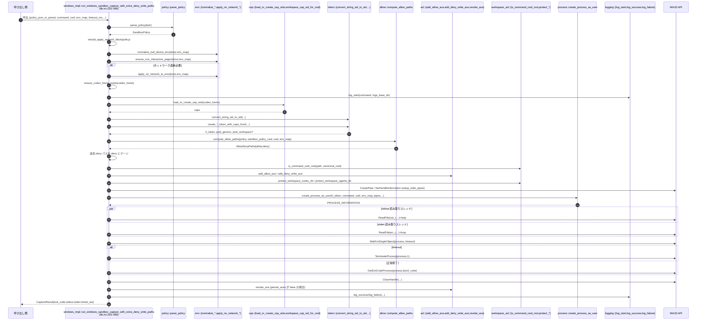

# windows-sandbox-rs/src/lib.rs コード解説

※行番号は、この回答冒頭に示されたファイル内容を上から順に数えたものです（例: `lib.rs:L321-585`）。

---

## 0. ざっくり一言

Windows 上でコマンドを制限付きサンドボックス環境で実行し、標準出力／標準エラーをキャプチャするための「窓口（ファサード）」となるクレートルートです。  
Windows では実際のサンドボックス実装を使い、非 Windows では「非対応」であることを明示的にエラーとして返します。

---

## 1. このモジュールの役割

### 1.1 概要

- このモジュールは **Windows サンドボックス実行・ACL 設定・セットアップ** などの機能をまとめて公開するクレートのエントリポイントです。
- OS が Windows の場合は `windows_impl` モジュールを中心に実際の Win32 API / ACL 操作を呼び出し、**ポリシーに基づいてプロセスを起動し、その出力を CaptureResult として返します**（`lib.rs:L208-585`）。
- OS が Windows 以外の場合は、同名 API を提供しつつ、**常に「Windows 専用」というエラーを返すスタブ実装**を提供します（`lib.rs:L673-721`）。

### 1.2 アーキテクチャ内での位置づけ

このファイルは「クレートルート」として、各サブモジュールを宣言・再エクスポートし、Windows / 非 Windows で異なる実装へ振り分けます。

```mermaid
graph TD
    Caller["呼び出し側アプリ"] -->|run_windows_sandbox_capture など| CrateRoot["crate (lib.rs)"]

    CrateRoot -->|cfg(windows)| WinImpl["windows_impl モジュール\n(lib.rs:L208-671)"]
    CrateRoot -->|cfg(not windows)| Stub["stub モジュール\n(lib.rs:L673-722)"]

    WinImpl --> Policy["policy モジュール\nSandboxPolicy, parse_policy"]
    WinImpl --> Env["env モジュール\n環境変数調整"]
    WinImpl --> Allow["allow モジュール\nAllowDenyPaths, compute_allow_paths"]
    WinImpl --> ACL["acl モジュール\nadd_allow_ace など"]
    WinImpl --> Cap["cap モジュール\ncap SID 読込"]
    WinImpl --> Token["token モジュール\n制限トークン生成"]
    WinImpl --> Proc["process モジュール\ncreate_process_as_user"]
    WinImpl --> WSACL["workspace_acl モジュール\nCWD 判定・保護"]
    WinImpl --> Log["logging モジュール\nlog_start/log_success 等"]
```

- `windows_modules!` マクロで多数のサブモジュールを宣言しています（`lib.rs:L5-9, L11-29`）。
- Windows 実装は `windows_impl` 内で、これらサブモジュールを `use super::...` で利用しています（`lib.rs:L210-232`）。
- 非 Windows では `stub` モジュールの API をトップレベルで `pub use` し、コンパイルは通るが実行時には明示的にエラーとなります（`lib.rs:L199-206, L673-721`）。

### 1.3 設計上のポイント

- **OS ごとの実装切り替え**  
  - `#[cfg(target_os = "windows")] mod windows_impl;` と `#[cfg(not(target_os = "windows"))] mod stub;` により、ビルドターゲット OS に応じて実装を切り替えています（`lib.rs:L208-209, L673-674`）。
  - 同名関数を top-level で再エクスポートすることで、呼び出し側は OS を意識せずに同一 API を利用できます（`lib.rs:L179-185, L199-206`）。
- **ポリシー駆動のサンドボックス設定**  
  - JSON やプリセット文字列から `SandboxPolicy` を構築し（`parse_policy`、`lib.rs:L332-333`）、  
    それに応じてネットワーク遮断、ACL 設定、トークン作成を切り替えます（`lib.rs:L333-357, L358-389, L404-447`）。
- **Win32 API をラップする unsafe 処理**  
  - パイプ作成 (`CreatePipe`)、ハンドルフラグ設定 (`SetHandleInformation`)、プロセス待機 (`WaitForSingleObject`) などを `unsafe fn setup_stdio_pipes` や本体関数内で行います（`lib.rs:L261-287, L451-545`）。
- **I/O の並行処理**  
  - 標準出力と標準エラーを別スレッドで読み取り、チャネルでメインスレッドに返しています（`lib.rs:L488-531`）。
- **一部 ACL をロールバック**  
  - `persist_aces` フラグが false の場合（通常の readonly 等）、終了後に `revoke_ace` で ACL を元に戻します（`lib.rs:L404, L572-577`）。

---

## 2. コンポーネント一覧（インベントリー）

### 2.1 このファイル内で定義されている主なコンポーネント

| 名前 | 種別 | 公開範囲 | 役割 / 用途 | 行番号 |
|------|------|----------|------------|--------|
| `windows_modules!` | マクロ | crate 内部 | Windows 向けサブモジュール群 (`acl`, `allow`, …) を一括宣言 | `lib.rs:L5-9` |
| `windows_impl` | モジュール | `cfg(windows)` 内部 | Windows 上でのサンドボックス実行ロジック本体 | `lib.rs:L208-671` |
| `PipeHandles` | 型エイリアス | `windows_impl` 内部 | `(stdin, stdout, stderr)` のパイプハンドル 3 組をまとめたタプル | `lib.rs:L250` |
| `should_apply_network_block` | 関数 | `windows_impl` 内部 | `SandboxPolicy` からネットワーク遮断が必要か判定 | `lib.rs:L252-254` |
| `ensure_codex_home_exists` | 関数 | `windows_impl` 内部 | `codex_home` ディレクトリ作成（存在しない場合） | `lib.rs:L256-259` |
| `setup_stdio_pipes` | 関数 (`unsafe`) | `windows_impl` 内部 | 子プロセスとの stdin/stdout/stderr 通信用パイプ生成と継承フラグ設定 | `lib.rs:L261-287` |
| `windows_impl::CaptureResult` | 構造体 | `pub`（上位から再エクスポート） | サンドボックスプロセスの exit code, stdout, stderr, timeout 状態を保持 | `lib.rs:L289-294, L179-179` |
| `run_windows_sandbox_capture` | 関数 | `pub`（上位から再エクスポート） | 追加 deny パスなしでサンドボックス実行する高レベル API | `lib.rs:L296-318, L181-181` |
| `run_windows_sandbox_capture_with_extra_deny_write_paths` | 関数 | `pub`（上位から再エクスポート） | 追加の書き込み禁止パスを指定してサンドボックス実行 | `lib.rs:L320-585, L182-183` |
| `run_windows_sandbox_legacy_preflight` | 関数 | `pub`（上位から再エクスポート） | 旧来の「事前 ACL 設定のみ」モードでの準備処理 | `lib.rs:L588-633, L184-185` |
| `windows_impl::tests` | モジュール（テスト） | `cfg(test)` | `should_apply_network_block` の挙動テスト | `lib.rs:L635-670` |
| `stub` | モジュール | `cfg(not windows)` 内部 | 非 Windows 用スタブ実装 | `lib.rs:L673-722` |
| `stub::CaptureResult` | 構造体 | `pub`（上位から再エクスポート） | Windows 実装と同じフィールドを持つ結果型（スタブ用） | `lib.rs:L681-687, L199-200` |
| `stub::run_windows_sandbox_capture` | 関数 | `pub`（上位から再エクスポート） | 非 Windows 時に「利用不可」エラーを返す同名 API | `lib.rs:L689-701, L203-204` |
| `stub::apply_world_writable_scan_and_denies` | 関数 | `pub`（上位から再エクスポート） | 同上、`apply_world_writable_scan_and_denies` のスタブ | `lib.rs:L703-711, L201-202` |
| `stub::run_windows_sandbox_legacy_preflight` | 関数 | `pub`（上位から再エクスポート） | `run_windows_sandbox_legacy_preflight` のスタブ | `lib.rs:L713-721, L205-206` |

### 2.2 トップレベルで再エクスポートされる主な API 群

このファイルは多くのサブモジュールの API を `pub use` しています。定義自体は他ファイルにあり、このチャンクからは詳細が分かりません。

代表的なグループだけ挙げます（いずれも `cfg(target_os="windows")`）:

| グループ | 再エクスポートされる主な項目 | 行番号 | 備考 |
|---------|------------------------------|--------|------|
| ACL 関連 | `add_deny_write_ace`, `allow_null_device`, `ensure_allow_mask_aces[_with_inheritance]`, `ensure_allow_write_aces`, `fetch_dacl_handle`, `path_mask_allows` | `lib.rs:L49-63` | ACL 操作ユーティリティ。定義は `acl` モジュールにあり、このチャンクには現れません。 |
| ポリシー関連 | `SandboxPolicy`, `parse_policy` | `lib.rs:L121-123` | サンドボックスポリシー表現と JSON/プリセットからのパース。 |
| プロセス起動 | `create_process_as_user`, `spawn_process_with_pipes`, `PipeSpawnHandles`, `StdinMode`, `StderrMode`, `read_handle_loop` | `lib.rs:L125-135` | ユーザトークンでのプロセス起動など。 |
| セットアップ関連 | `SandboxSetupRequest`, `SetupRootOverrides`, `SETUP_VERSION`, `run_elevated_setup`, `run_setup_refresh[_with_extra_read_roots]`, `sandbox_dir` など | `lib.rs:L137-153` | サンドボックスルートディレクトリの準備・更新。 |
| トークン関連 | `convert_string_sid_to_sid`, `create_readonly_token_with_cap[_from]`, `create_workspace_write_token_with_caps_from`, `get_current_token_for_restriction` | `lib.rs:L169-177` | Windows セキュリティトークンの生成と変換。 |
| IPC フレーム | `FramedMessage`, `SpawnRequest`, `SpawnReady`, `OutputPayload`, `ErrorPayload`, `ExitPayload`, `encode_bytes` など | `lib.rs:L91-113` | Elevation されたバックエンドとの IPC 用データ型とヘルパ。 |
| ログ | `LOG_FILE_NAME`, `log_note` | `lib.rs:L115-117` | ログファイル名と追加メッセージ用。 |
| パス・ワークスペース | `canonicalize_path`, `is_command_cwd_root`, `protect_workspace_codex_dir`, `protect_workspace_agents_dir` | `lib.rs:L119, L193-197` | パス正規化とワークスペースディレクトリの ACL 保護。 |
| サンドボックス実行 | `CaptureResult`, `run_windows_sandbox_capture`, `run_windows_sandbox_capture_with_extra_deny_write_paths`, `run_windows_sandbox_legacy_preflight` | `lib.rs:L179-185` | このファイルで実装される中核 API。 |

---

## 3. 公開 API と詳細解説

### 3.1 型一覧（構造体・列挙体など）

#### このファイルで定義され、トップレベルから公開される主な型

| 名前 | 種別 | 公開範囲 | 役割 / 用途 | 行番号 |
|------|------|----------|------------|--------|
| `windows_impl::CaptureResult` | 構造体 | `pub`（`pub use` で crate ルートから公開） | サンドボックス内で実行したプロセスの終了コード、stdout / stderr のバイト列、タイムアウト有無を格納します（`exit_code`, `stdout`, `stderr`, `timed_out` フィールド）。 | `lib.rs:L289-294, L179` |
| `stub::CaptureResult` | 構造体 | `pub`（`cfg(not windows)` 時のみ crate ルートから公開） | フィールド構成は上と同じですが、非 Windows 環境でのスタブ用です。実行は常にエラーになるため、通常は値が返ってくることはありません。 | `lib.rs:L681-687, L199-200` |

> その他 `SandboxPolicy` など多くの型は別モジュールで定義されており、このチャンクからは詳細が分かりません（`lib.rs:L121-123` など）。

---

### 3.2 重要な関数の詳細

#### 1. `should_apply_network_block(policy: &SandboxPolicy) -> bool`

**概要**

`SandboxPolicy` がフルネットワークアクセスを許可しているかどうかに応じて、環境変数レベルのネットワーク遮断を行うべきか判定します（`lib.rs:L252-254`）。

**引数**

| 引数名 | 型 | 説明 |
|--------|----|------|
| `policy` | `&SandboxPolicy` | 現在適用するサンドボックスポリシー |

**戻り値**

- `bool` : `true` の場合ネットワーク遮断を行うべき、`false` の場合は不要。

**内部処理の流れ**

1. `policy.has_full_network_access()` を呼び、完全なネットワークアクセス権限の有無を問い合わせます（`lib.rs:L253`）。
2. その否定 `!` を返却します。つまり「フルアクセスでなければ遮断する」という方針です。

**Edge cases**

- `SandboxPolicy::WorkspaceWrite` や `SandboxPolicy::ReadOnly` などで `network_access` フラグが `false` の場合 → `true` を返し、ネットワーク遮断を適用します（テストでも検証、`lib.rs:L640-655, L665-668`）。
- `has_full_network_access()` の実装詳細はこのチャンクにはないため、内部条件は不明です。

**使用上の注意点**

- 純粋な計算関数であり、副作用や I/O は持ちません。
- テストにより代表的なポリシーに対して期待どおりの値を返すことが確認されています（`lib.rs:L635-668`）。

---

#### 2. `unsafe fn setup_stdio_pipes() -> io::Result<PipeHandles>`

**概要**

子プロセスとやり取りするための stdin / stdout / stderr 向けの匿名パイプを作成し、継承可能フラグを設定してハンドルタプルを返します（`lib.rs:L261-287`）。

**引数**

- なし。

**戻り値**

- `io::Result<PipeHandles>`  
  - 成功時: `((in_r, in_w), (out_r, out_w), (err_r, err_w))` 形式のハンドルタプル。  
  - 失敗時: `io::Error`（`GetLastError()` の値から生成）。

**内部処理の流れ**

1. 6 本分の `HANDLE` 変数（`in_r`, `in_w`, `out_r`, `out_w`, `err_r`, `err_w`）を 0 で初期化（`lib.rs:L262-267`）。
2. `CreatePipe` を 3 回呼び出し、stdin/out/err 各ペアのパイプを作成（`lib.rs:L268-275`）。失敗した場合、その時点で `Err(io::Error::from_raw_os_error(GetLastError() as i32))` を返します（`lib.rs:L269, L272, L275`）。
3. `SetHandleInformation` を使い、子プロセスに継承させたいハンドルに `HANDLE_FLAG_INHERIT` を設定（`in_r`, `out_w`, `err_w`）（`lib.rs:L277-285`）。
4. いずれか `SetHandleInformation` が 0 を返す（失敗）の場合も同様に `Err(...)` を返します。
5. すべて成功したらタプルにまとめて `Ok(((in_r, in_w), (out_r, out_w), (err_r, err_w)))` を返却（`lib.rs:L286`）。

**Errors / Panics**

- 3 回の `CreatePipe` のどれか、または 3 回の `SetHandleInformation` のどれかが失敗すると、その場で `Err(io::Error)` を返します（`lib.rs:L268-285`）。
- パニックを起こす処理は含まれていません。

**Edge cases**

- パイプ生成に成功した後の途中失敗時に、すでに開いているハンドルを閉じずに関数を抜けるため、**エラー経路ではハンドルリークの可能性があります**（`lib.rs:L268-285` で `CloseHandle` が呼ばれていないため）。  
  → これはコードから読み取れる事実であり、他箇所での回収はこのチャンクからは確認できません。

**使用上の注意点**

- `unsafe` 関数であり、**呼び出し側はハンドルのクローズを必ず行う責任**があります。実際に `run_windows_sandbox_capture_with_extra_deny_write_paths` では、プロセス生成後やエラー時に `CloseHandle` を呼んでいます（`lib.rs:L451-486, L466-472`）。
- Windows 専用の FFI を行っており、他 OS ではコンパイルされません（`cfg(target_os="windows")` のモジュール内）。

---

#### 3. `pub fn run_windows_sandbox_capture(...) -> Result<CaptureResult>`

```rust
pub fn run_windows_sandbox_capture(
    policy_json_or_preset: &str,
    sandbox_policy_cwd: &Path,
    codex_home: &Path,
    command: Vec<String>,
    cwd: &Path,
    env_map: HashMap<String, String>,
    timeout_ms: Option<u64>,
    use_private_desktop: bool,
) -> Result<CaptureResult>
```

**概要**

最もシンプルなサンドボックス実行 API です。  
ポリシー文字列／プリセット、コマンド、作業ディレクトリ、環境変数、タイムアウトなどを指定して、**追加 deny パスなしで**プロセスを実行し、`CaptureResult` を返します（`lib.rs:L296-318`）。

**引数**

| 引数名 | 型 | 説明 |
|--------|----|------|
| `policy_json_or_preset` | `&str` | JSON 文字列またはプリセット名。`parse_policy` に渡されます（`lib.rs:L332-333`）。 |
| `sandbox_policy_cwd` | `&Path` | ポリシーファイルの基準ディレクトリ。`compute_allow_paths` などで使用。 |
| `codex_home` | `&Path` | サンドボックス用のルートディレクトリ (`.sandbox` など) を作成するベースパス（`lib.rs:L339-343`）。 |
| `command` | `Vec<String>` | 実行するコマンドライン（0 番目が実行ファイルパスと推測されますが、このチャンクからは断定できません）。 |
| `cwd` | `&Path` | サンドボックス内でのカレントディレクトリ。 |
| `env_map` | `HashMap<String, String>` | 環境変数のマップ。内部で書き換えられます。 |
| `timeout_ms` | `Option<u64>` | プロセス待機のタイムアウト（ミリ秒）。`None` の場合は無制限（`INFINITE`）です（`lib.rs:L533-534`）。 |
| `use_private_desktop` | `bool` | プライベートデスクトップを使うかどうかのフラグ。`create_process_as_user` に渡されています（`lib.rs:L451-460`）。 |

**戻り値**

- `anyhow::Result<CaptureResult>`  
  - 成功時: 実行したプロセスの exit code, stdout, stderr, timeout 状態。
  - 失敗時: 様々な段階（ポリシーパース、環境設定、ACL 設定、プロセス起動など）で発生したエラーを `anyhow::Error` として返します。

**内部処理の流れ**

1. 全ての引数をそのまま `run_windows_sandbox_capture_with_extra_deny_write_paths` に委譲し、`additional_deny_write_paths` として空スライス `&[]` を渡します（`lib.rs:L307-316`）。
2. 追加 deny パスを指定する機能を使わない場合のショートカットです。

**Errors / Panics**

- 実際のエラーパスは委譲先 `run_windows_sandbox_capture_with_extra_deny_write_paths` に依存します（後述）。

**使用上の注意点**

- 追加の書き込み禁止パスが不要な場合はこちらを使うとシグネチャが少し簡潔になります。
- Windows 以外では `stub::run_windows_sandbox_capture` が `bail!("Windows sandbox is only available on Windows")` を返すため、**常にエラー**になります（`lib.rs:L689-701`）。

---

#### 4. `pub fn run_windows_sandbox_capture_with_extra_deny_write_paths(...) -> Result<CaptureResult>`

```rust
pub fn run_windows_sandbox_capture_with_extra_deny_write_paths(
    policy_json_or_preset: &str,
    sandbox_policy_cwd: &Path,
    codex_home: &Path,
    command: Vec<String>,
    cwd: &Path,
    mut env_map: HashMap<String, String>,
    timeout_ms: Option<u64>,
    additional_deny_write_paths: &[PathBuf],
    use_private_desktop: bool,
) -> Result<CaptureResult>
```

**概要**

このクレートの **中核となるサンドボックス実行関数** です。  
ポリシー文字列を解釈し、CAP SID 読み込み、ACL 設定、トークン生成、プロセス起動、パイプ経由での stdout/stderr 取得、タイムアウト処理、ACL ロールバックまでを包括的に行います（`lib.rs:L321-585`）。

**引数**

| 引数名 | 型 | 説明 |
|--------|----|------|
| `policy_json_or_preset` | `&str` | ポリシーを表す JSON 文字列またはプリセット名。`parse_policy` に渡される（`lib.rs:L332-333`）。 |
| `sandbox_policy_cwd` | `&Path` | ポリシー解釈の基準ディレクトリ（`compute_allow_paths` で利用、`lib.rs:L405-406`）。 |
| `codex_home` | `&Path` | サンドボックス用のベースディレクトリ。`.sandbox` サブディレクトリが作られ、ログなどが出力される（`lib.rs:L339-343`）。 |
| `command` | `Vec<String>` | 実行するコマンドライン。 |
| `cwd` | `&Path` | 実行時のカレントディレクトリ。 |
| `env_map` | `HashMap<String, String>` | 環境変数マップ。ネットワーク遮断やページャ設定などで上書きされる（`lib.rs:L334-337`）。 |
| `timeout_ms` | `Option<u64>` | 子プロセス待機のタイムアウト（ミリ秒）。`None` の場合は `INFINITE` に変換（`lib.rs:L533-534`）。 |
| `additional_deny_write_paths` | `&[PathBuf]` | 追加で書き込み禁止にしたいパスのリスト。存在するものだけ ACL deny に追加（`lib.rs:L407-411`）。 |
| `use_private_desktop` | `bool` | プライベートデスクトップ使用フラグ。`create_process_as_user` に渡される（`lib.rs:L451-460`）。 |

**戻り値**

- `anyhow::Result<CaptureResult>`  
  - 成功時: `CaptureResult { exit_code, stdout, stderr, timed_out }` を返します（`lib.rs:L580-585`）。
  - 失敗時: 途中のいずれかのステップでのエラーを `Err` として返します。

**内部処理の流れ（高レベル）**

1. **ポリシー解釈 & ネットワーク制御**  
   - `parse_policy(policy_json_or_preset)?` で `SandboxPolicy` を生成（`lib.rs:L332-333`）。  
   - `should_apply_network_block(&policy)` で遮断要否を判定（`lib.rs:L333`）。  
   - `normalize_null_device_env`、`ensure_non_interactive_pager` により環境変数を調整（`lib.rs:L334-335`）。  
   - 必要なら `apply_no_network_to_env` でネットワーク関連環境変数を無効化（`lib.rs:L336-337`）。

2. **ワークスペースディレクトリ準備 & ログ**  
   - `ensure_codex_home_exists(codex_home)?` で `codex_home` を作成（`lib.rs:L339`）。  
   - `sandbox_base = codex_home.join(".sandbox")` を作成し、`create_dir_all`（`lib.rs:L341-343`）。  
   - `logs_base_dir` を `.sandbox` に設定し、`log_start(&command, logs_base_dir)` で実行開始をログ（`lib.rs:L343-345`）。

3. **ポリシー種別に応じた前段チェック**  
   - `DangerFullAccess` や `ExternalSandbox` の場合は `bail!` で即エラー（`lib.rs:L347-352`）。  
   - `policy.has_full_disk_read_access()` が false の場合も、「elevated backend が必要」として `bail!`（`lib.rs:L353-356`）。

4. **CAP SID 読込 & 制限トークン生成**  
   - `let caps = load_or_create_cap_sids(codex_home)?;` で各種 SID 文字列を取得（`lib.rs:L358`）。  
   - `match &policy` により:
     - `ReadOnly` → `convert_string_sid_to_sid(&caps.readonly)` から SID を作り、`create_readonly_token_with_cap` で制限トークンを生成（`lib.rs:L361-366`）。
     - `WorkspaceWrite` → workspace CAP 用 SID とカレントディレクトリに紐づく workspace SID を生成し、`create_workspace_write_token_with_caps_from` でトークンを作成（`lib.rs:L368-383`）。
   - これにより `h_token`（プロセス起動に用いるトークン）、`psid_generic`, `psid_workspace` を得ます（`lib.rs:L359-389`）。

5. **workspace_write サンドボックス向け追加設定**  
   - `is_workspace_write` が true かつ `get_current_token_for_restriction` に成功した場合、ログオン SID を取得し、その SID に対して `allow_null_device` を適用（`lib.rs:L391-401`）。

6. **ACL 設定（許可／拒否）**  
   - `AllowDenyPaths { allow, mut deny } = compute_allow_paths(...)` で対象パス集合を計算（`lib.rs:L404-406`）。  
   - `additional_deny_write_paths` で存在するものだけ `deny` に追加（`lib.rs:L407-411`）。  
   - `canonical_cwd` と `is_command_cwd_root` を用い、CWD に対応するパスには workspace SID を使うなど SID の割当てを決定（`lib.rs:L412-420`）。  
   - `add_allow_ace` と `add_deny_write_ace` を使って ACL を実際に変更し、ロールバック対象の `(PathBuf, sid)` を `guards` に蓄積（`lib.rs:L415-440`）。  
   - `persist_aces`（`is_workspace_write`）が true の場合は guards に積まず、ACL を残す方針（`lib.rs:L404, L424-430, L435-439`）。

7. **workspace_write 専用の追加保護**  
   - `allow_null_device(psid_generic)` は常に実行（`lib.rs:L441`）。  
   - `psid_workspace` があれば `allow_null_device(psid_workspace)` と、`protect_workspace_codex_dir` / `protect_workspace_agents_dir` を best-effort で呼ぶ（`lib.rs:L442-446`）。

8. **パイプ準備 & プロセス起動**  
   - `setup_stdio_pipes()?` でパイプ作成（`lib.rs:L449-450`）。  
   - `create_process_as_user(...)` を `unsafe` で呼び出し、`h_token` とパイプハンドルを渡して子プロセスを起動（`lib.rs:L451-460`）。  
   - 起動に失敗した場合は、全てのパイプハンドルと `h_token` をクローズしてエラーを返却（`lib.rs:L462-475`）。  
   - 成功時は不要なハンドル（`in_r`, `in_w`, `out_w`, `err_w`）をクローズ（`lib.rs:L480-486`）。

9. **stdout/stderr の並行読み取り**  
   - `std::sync::mpsc::channel::<Vec<u8>>()` を 2 組作り、stdout / stderr の読み取り結果用に利用（`lib.rs:L488-489`）。  
   - 2 本のスレッドを spawn し、それぞれ `ReadFile` をループして EOF まで読み込み、バッファをチャネルに送信（`lib.rs:L490-531`）。

10. **プロセス待機 & タイムアウト処理**  
    - `timeout_ms.map(|ms| ms as u32).unwrap_or(INFINITE)` で Win32 のタイムアウト値に変換（`lib.rs:L533-534`）。  
    - `WaitForSingleObject(pi.hProcess, timeout)` で待機し、`res == 0x0000_0102` ならタイムアウトと判定（`lib.rs:L534-535`）。  
    - タイムアウトでなければ `GetExitCodeProcess` で exit code を取得（`lib.rs:L536-540`）。  
    - タイムアウト時は `TerminateProcess(pi.hProcess, 1)` でプロセスを強制終了（`lib.rs:L541-545`）。

11. **ハンドルクローズ & スレッド join & 結果構築**  
    - プロセス／スレッドハンドルと `h_token` をクローズ（`lib.rs:L547-555`）。  
    - 読み取りスレッドを `join`（`lib.rs:L556-557`）。  
    - チャネルから stdout/stderr のバッファを受信し、受信失敗時は空ベクタ（`unwrap_or_default`）とする（`lib.rs:L558-559`）。  
    - `timed_out` が true の場合は exit code を `128 + 64` とし、それ以外は取得した exit code を使用（`lib.rs:L560-563`）。

12. **ログ & ACL ロールバック & 戻り値**  
    - exit code に応じて `log_success` または `log_failure` を呼び、ログに記録（`lib.rs:L566-570`）。  
    - `persist_aces` が false の場合は `guards` を走査し `revoke_ace` で ACL を元に戻す（`lib.rs:L572-577`）。  
    - 最後に `Ok(CaptureResult { ... })` を返します（`lib.rs:L580-585`）。

**Errors / Panics**

- `anyhow::bail!` を用いたエラーパス:
  - `DangerFullAccess` / `ExternalSandbox` ポリシーが指定された場合（`lib.rs:L347-352`）。
  - `policy.has_full_disk_read_access()` が false の場合（`lib.rs:L353-356`）。
- `?` によるエラー伝播:
  - `parse_policy`, 各種 `*_sid_*`, `load_or_create_cap_sids`, `compute_allow_paths`, `setup_stdio_pipes`, `create_process_as_user` などの失敗がそのまま `Err` になります（`lib.rs:L332-339, L358-366, L372-383, L404-406, L449-452` 等）。
- 明示的な `panic!` はありませんが、`expect("valid workspace SID")` などで SID 変換失敗時にパニックする可能性があります（`lib.rs:L362-365, L370-375, L603-608`）。

**Edge cases**

- **追加 deny パス**: `additional_deny_write_paths` のうち `path.exists()` が false のものは無視され、ACL は変更されません（`lib.rs:L407-411`）。
- **タイムアウト時**:
  - `timed_out` が true になり、exit code は固定値 `192`（`128 + 64`）となります（`lib.rs:L535, L560-562`）。
  - 実際に `TerminateProcess(..., 1)` で終了させているため、OS 側の exit code は 1 ですが、レポート上は 192 です（`lib.rs:L541-545`）。
- **ACL 失敗時の挙動**:
  - `add_allow_ace` / `add_deny_write_ace` は `if let Ok(added) = ... && added` のように扱われており、失敗してもエラーとしては扱わず ACL 変更をスキップします（`lib.rs:L421-423, L434-438`）。
  - `persist_aces` が true の場合（workspace_write）、成功した ACL 変更でも guards に入れず、ロールバックを行いません（`lib.rs:L404, L424-430`）。

**使用上の注意点**

- `policy_json_or_preset` に `DangerFullAccess` や `ExternalSandbox` を指定すると、サンドボックスは起動せず即座にエラーになります（`lib.rs:L347-352`）。
- `policy.has_full_disk_read_access()` が false なポリシーはこの関数ではサポートされず、「elevated backend」を求めるエラーとなります（`lib.rs:L353-356`）。
- タイムアウトを設定した場合、**プロセスは強制終了され、exit_code は 192 に上書き**されます。呼び出し側でこの値を特別扱いすることが前提と考えられます（コード上の事実として exit_code の計算がそうなっているため、`lib.rs:L560-562`）。
- 実行後に一部 ACL が元に戻されますが、`persist_aces` が true の場合は戻されないため、ファイルシステムに永続的な ACL 変更が残る可能性があります（`lib.rs:L404, L424-430, L572-577`）。

---

#### 5. `pub fn run_windows_sandbox_legacy_preflight(...) -> Result<()>`

**概要**

「レガシー」モードの事前処理として、workspace write ポリシーに対する ACL の付与や `allow_null_device`・ワークスペースディレクトリ保護などを行う関数です。  
ここではプロセス起動は行われず、**ACL 設定だけを行って終了**します（`lib.rs:L588-633`）。

**引数**

| 引数名 | 型 | 説明 |
|--------|----|------|
| `sandbox_policy` | `&SandboxPolicy` | 適用するポリシー。`WorkspaceWrite` でなければ何もしません。 |
| `sandbox_policy_cwd` | `&Path` | ポリシー基準ディレクトリ。`compute_allow_paths` に渡されます。 |
| `codex_home` | `&Path` | CAP SID 読み込みに利用するベースディレクトリ。 |
| `cwd` | `&Path` | ワークスペースのカレントディレクトリ。 |
| `env_map` | `&HashMap<String, String>` | 環境変数マップ。`compute_allow_paths` の入力として使われます。 |

**戻り値**

- `anyhow::Result<()>`  
  - 成功時: `Ok(())`  
  - 失敗時: ディレクトリ作成や SID 変換、ACL 設定などでのエラー。

**内部処理の流れ**

1. `sandbox_policy` が `WorkspaceWrite` でなければ直ちに `Ok(())` を返し、何もしません（`lib.rs:L595-597`）。
2. `ensure_codex_home_exists(codex_home)?` で `codex_home` を作成（`lib.rs:L600`）。
3. `load_or_create_cap_sids(codex_home)?` で CAP SID を取得し、workspace 用 SID を `convert_string_sid_to_sid` で作成（`lib.rs:L601-608`）。
4. `workspace_cap_sid_for_cwd(codex_home, cwd)?` でカレントディレクトリに紐づく workspace SID を取得し、同様に SID を生成（`lib.rs:L605-608`）。
5. `compute_allow_paths` で allow/deny パスを計算し、`canonicalize_path` で CWD の正規化パスを取得（`lib.rs:L609-612`）。
6. `allow` 集合に対し、CWD root かどうかで `psid_workspace` / `psid_generic` を切り替えて `add_allow_ace` を呼び出し（`lib.rs:L614-622`）。
7. `deny` 集合に対して `add_deny_write_ace(p, psid_generic)` を呼び出し（`lib.rs:L623-625`）。
8. `allow_null_device` を generic/workspace 両方に対して適用し、workspace の codex/agents ディレクトリを保護（`lib.rs:L626-629`）。
9. `Ok(())` を返却（`lib.rs:L632`）。

**Edge cases**

- `WorkspaceWrite` 以外のポリシーでは**完全に no-op** です（`lib.rs:L595-597`）。
- `add_allow_ace` / `add_deny_write_ace` の戻り値は `_ = ...` で捨てられており、失敗してもエラーとはされません（`lib.rs:L621-625`）。

**使用上の注意点**

- この関数は ACL をロールバックしません。したがって、実行後も ACL 変更は永続します。
- `run_windows_sandbox_capture_with_extra_deny_write_paths` 内の ACL 設定と似た処理を行なっていますが、`guards` によるロールバック処理はありません。

---

#### 6. `pub fn run_windows_sandbox_capture (stub, 非 Windows)`

```rust
pub fn run_windows_sandbox_capture(
    _policy_json_or_preset: &str,
    _sandbox_policy_cwd: &Path,
    _codex_home: &Path,
    _command: Vec<String>,
    _cwd: &Path,
    _env_map: HashMap<String, String>,
    _timeout_ms: Option<u64>,
    _use_private_desktop: bool,
) -> Result<CaptureResult>
```

**概要**

`cfg(not(target_os = "windows"))` の場合にコンパイルされるスタブ関数です。  
**常に「Windows sandbox is only available on Windows」エラーを返します**（`lib.rs:L689-701`）。

**戻り値**

- `anyhow::Result<CaptureResult>`  
  - すべての呼び出しで `Err(anyhow::Error)` を返します。`Ok` は返りません。

**内部処理**

- `bail!("Windows sandbox is only available on Windows")` を 1 行だけ実行しています（`lib.rs:L699-700`）。

**使用上の注意点**

- 実行時に OS が Windows かどうかで挙動が変わるため、**cross-platform なコードでこの API を直接呼ぶ場合、`cfg` やランタイムチェックが必要**です。
- 返される `CaptureResult` は `Default` 実装を持ちます（`lib.rs:L681-687`）が、この関数から `Ok` が返ることはありません。

---

#### 7. `pub fn apply_world_writable_scan_and_denies (stub)` / `run_windows_sandbox_legacy_preflight (stub)`

両者とも:

- 常に `bail!("Windows sandbox is only available on Windows")` を実行します（`lib.rs:L703-711, L713-721`）。
- 引数は Windows 版と同名・類似役割ですが、型は `codex_protocol::protocol::SandboxPolicy` を使用しています（`lib.rs:L677-678`）。
- 非 Windows 用の「明示的な非対応シグナル」として使う想定と考えられますが、詳細はコードからは分かりません。

---

### 3.3 その他の関数（一覧）

| 関数名 | 所属 | 役割（1 行） | 行番号 |
|--------|------|--------------|--------|
| `ensure_codex_home_exists` | `windows_impl` | 指定ディレクトリを `create_dir_all` で確実に作成するヘルパ | `lib.rs:L256-259` |
| `workspace_policy` | `windows_impl::tests` | テスト用に `WorkspaceWrite` ポリシーを構築する補助関数 | `lib.rs:L640-647` |
| `applies_network_block_when_access_is_disabled` など 3 つ | `windows_impl::tests` | `should_apply_network_block` の期待挙動を検証するテスト | `lib.rs:L651-668` |

---

## 4. データフロー

ここでは、もっとも重要なシナリオである  
`run_windows_sandbox_capture_with_extra_deny_write_paths` 呼び出し時のデータフローを示します（`lib.rs:L321-585`）。

### 4.1 処理の要点

- 入力: ポリシー文字列、コマンド、CWD、環境変数、タイムアウト、追加 deny パス。
- 中間ステップ:
  - ポリシー解析 → 環境変数調整 → CAP SID 読込 → トークン生成 → ACL 設定 → プロセス起動 → パイプで出力取得 → Wait/timeout → ACL ロールバック。
- 出力: `CaptureResult`（終了コード、stdout/stderr バイト列、タイムアウトフラグ）。

### 4.2 シーケンス図



---

## 5. 使い方（How to Use）

### 5.1 基本的な使用方法（Windows）

同じクレート内の別モジュールから、`run_windows_sandbox_capture` を利用する例です。

```rust
use std::collections::HashMap;
use std::path::Path;

// lib.rs で pub use されている API を想定
use crate::{run_windows_sandbox_capture, CaptureResult}; // lib.rs:L179-181

fn run_in_sandbox() -> anyhow::Result<CaptureResult> {
    // ポリシーは JSON 文字列やプリセット名（具体的形式は policy モジュール側に依存）
    let policy = r#"{"preset": "read-only"}"#;

    let sandbox_policy_cwd = Path::new("path/to/policies"); // ポリシーファイル基準
    let codex_home = Path::new("C:\\codex_home");           // Sandbox のベースディレクトリ
    let cwd = Path::new("C:\\workspace");                   // 実行時カレントディレクトリ

    // 実行コマンド（簡易例）
    let command = vec![
        "C:\\Windows\\System32\\cmd.exe".to_string(),
        "/C".to_string(),
        "echo hello".to_string(),
    ];

    // 環境変数マップ
    let mut env_map = HashMap::new();
    env_map.insert("PATH".into(), std::env::var("PATH")?);

    // 10 秒タイムアウト、プライベートデスクトップ不使用
    let timeout_ms = Some(10_000);
    let use_private_desktop = false;

    // サンドボックス実行
    let result = run_windows_sandbox_capture(
        policy,
        sandbox_policy_cwd,
        codex_home,
        command,
        cwd,
        env_map,
        timeout_ms,
        use_private_desktop,
    )?;

    // exit_code や stdout/stderr に応じて処理
    println!("exit = {}, timed_out = {}", result.exit_code, result.timed_out);
    println!("stdout = {}", String::from_utf8_lossy(&result.stdout));

    Ok(result)
}
```

- `CaptureResult` の構造はこのファイルから分かります（`lib.rs:L289-294`）。
- ポリシー JSON の詳細形式やプリセット名は `policy` モジュール側の仕様に依存し、このチャンクには現れません。

### 5.2 追加 deny パスを使う使用パターン

```rust
use std::collections::HashMap;
use std::path::{Path, PathBuf};

use crate::run_windows_sandbox_capture_with_extra_deny_write_paths; // lib.rs:L182-183

fn run_with_extra_denies() -> anyhow::Result<()> {
    let policy = r#"{"preset": "workspace-write"}"#;
    let cwd = Path::new("C:\\workspace");
    let codex_home = Path::new("C:\\codex_home");
    let sandbox_policy_cwd = Path::new("C:\\policies");

    let command = vec!["my_tool.exe".into()];
    let env_map = HashMap::new();

    // 追加で書き込み禁止にしたいディレクトリ
    let extra_denies = vec![
        PathBuf::from("C:\\sensitive_dir"),
    ];

    let result = run_windows_sandbox_capture_with_extra_deny_write_paths(
        policy,
        sandbox_policy_cwd,
        codex_home,
        command,
        cwd,
        env_map,
        None,              // タイムアウトなし
        &extra_denies,
        false,             // use_private_desktop
    )?;

    println!("exit = {}", result.exit_code);
    Ok(())
}
```

- `extra_denies` 内のパスが存在しない場合は無視されます（`lib.rs:L407-411`）。

### 5.3 非 Windows での挙動（スタブ）

非 Windows 環境では、同じシグネチャの関数がコンパイルされますが、実行は常にエラーになります。

```rust
use std::collections::HashMap;
use std::path::Path;

use crate::run_windows_sandbox_capture; // stub 版が選ばれる, lib.rs:L203-204

fn try_run_on_non_windows() {
    let result = run_windows_sandbox_capture(
        "preset",
        Path::new("."),
        Path::new("."),
        vec!["echo".into(), "hello".into()],
        Path::new("."),
        HashMap::new(),
        None,
        false,
    );

    match result {
        Ok(_) => unreachable!("非 Windows では Ok にならない想定"),
        Err(e) => eprintln!("Expected error: {e}"), // "Windows sandbox is only available on Windows"
    }
}
```

- スタブ版は `bail!("Windows sandbox is only available on Windows")` を呼ぶだけです（`lib.rs:L699-700`）。

### 5.4 よくある間違いと注意点

```rust
// 間違い例: DangerFullAccess ポリシーを渡してしまう
let result = run_windows_sandbox_capture(
    r#"{"preset": "danger-full-access"}"#,
    sandbox_policy_cwd,
    codex_home,
    command,
    cwd,
    env_map,
    None,
    false,
)?; // この呼び出しは `bail!` で Err になる可能性がある (lib.rs:L347-352)
```

```rust
// 正しい例: サポートされているポリシー (ReadOnly / WorkspaceWrite 等) を渡す
let result = run_windows_sandbox_capture(
    r#"{"preset": "read-only"}"#,
    sandbox_policy_cwd,
    codex_home,
    command,
    cwd,
    env_map,
    None,
    false,
)?;
```

**共通の注意点（まとめ）**

- **ポリシー値**:
  - `DangerFullAccess` / `ExternalSandbox` はこのバックエンドではサポートされず、即エラーになります（`lib.rs:L347-352`）。
  - `has_full_disk_read_access()` が false のポリシーも同様にエラーになります（`lib.rs:L353-356`）。
- **ACL の永続性**:
  - `WorkspaceWrite` ポリシーの場合（`is_workspace_write`）、ACL 変更が永続化され、処理終了時にロールバックされません（`lib.rs:L345, L404`）。
- **タイムアウト**:
  - タイムアウト時には `timed_out = true` かつ `exit_code = 192` になります（`lib.rs:L535, L560-562`）。
- **非 Windows**:
  - 非 Windows でこれらの関数を呼ぶと必ずエラーになります（`lib.rs:L689-721`）。cross-platform なコードでは OS ごとに分岐が必要です。

### 5.5 潜在的な不具合・セキュリティ観点（このファイルから読み取れる範囲）

- **パイプハンドルのリーク可能性**  
  - `setup_stdio_pipes` 内で途中の `CreatePipe` / `SetHandleInformation` が失敗した場合、すでに作成済みのハンドルをクローズせずに `Err` を返します（`lib.rs:L268-285`）。  
    → エラー経路で OS リソースリークが起こる可能性があります。
- **ACL 操作のベストエフォート性**  
  - `add_allow_ace` / `add_deny_write_ace` の失敗はエラーとして扱われず、単に ACL 変更をスキップするような実装です（`lib.rs:L421-423, L434-438, L621-625`）。  
    → 期待どおりの権限制限が行われないケースがあっても検知されません。
- **強制終了時の後処理**  
  - タイムアウトで `TerminateProcess` した後、stdout/stderr 読み取りスレッドを `join` していますが（`lib.rs:L541-545, L556-557`）、  
    強制終了後もパイプから読み取り可能であることを前提としています。通常の Win32 動作では問題ないと思われますが、コードだけからは挙動の保証は分かりません。

---

## 6. 変更の仕方（How to Modify）

### 6.1 新しい機能を追加する場合

例: 新しいポリシー種別を追加してサンドボックス起動をカスタマイズする場合。

1. **ポリシー定義の拡張**  
   - `policy::SandboxPolicy` に新しいバリアントを追加し、`has_full_network_access` や `has_full_disk_read_access` の実装も更新する必要があります（`lib.rs:L225-226, L252-254, L353-356`）。
2. **トークン生成ロジックの拡張**  
   - `run_windows_sandbox_capture_with_extra_deny_write_paths` の `match &policy` 部分に新バリアントの分岐を追加します（`lib.rs:L359-388`）。
3. **ACL 設定ポリシーの拡張**  
   - 必要に応じて `compute_allow_paths` の実装（`allow` モジュール）を拡張し、この関数が扱う `AllowDenyPaths` の使い方を調整します（`lib.rs:L404-407`）。
4. **非 Windows スタブの整合性**  
   - 非 Windows 側で同じバリアントを扱えるようにするには、`stub` モジュールが使用する `codex_protocol::protocol::SandboxPolicy` も拡張する必要があるかもしれません（`lib.rs:L677-678`）。

### 6.2 既存の機能を変更する場合の注意点

- **契約（前提条件）の維持**
  - `run_windows_sandbox_capture_with_extra_deny_write_paths` は「`DangerFullAccess` / `ExternalSandbox` は受け付けない」「フルディスク読み取り必須」という前提を持っています（`lib.rs:L347-356`）。  
    これを変更する場合、呼び出し元コードがこの前提に依存していないか確認が必要です。
- **ハンドル管理の一貫性**
  - `create_process_as_user` に渡したハンドルのうち、どれをどのタイミングで `CloseHandle` しているかは重要です（`lib.rs:L451-486, L547-555`）。  
    新しくハンドルを追加する場合は、すべてのエラーパスで確実に解放されるよう設計する必要があります。
- **ACL ロールバック**
  - `persist_aces` と `guards` によるロールバックの契約があり、これを変更するとファイルシステムの状態に影響します（`lib.rs:L404, L413-447, L572-577`）。  
    変更前後で ACL の最終状態がどう変わるかを確認する必要があります。

---

## 7. 関連ファイル

このファイルから参照される、密接に関係するファイル・モジュールの一覧です。  
いずれも中身はこのチャンクには現れないため、詳細は不明です。

| パス / モジュール | 役割 / 関係 | 根拠 |
|------------------|------------|------|
| `acl` モジュール | `add_allow_ace`, `add_deny_write_ace`, `revoke_ace` など ACL 操作用関数を提供し、サンドボックス実行時のファイル/ディレクトリアクセス制御に使われます。 | `use super::acl::*`（`lib.rs:L210-213`）、`pub use` 群（`lib.rs:L49-63`） |
| `allow` モジュール | `AllowDenyPaths`, `compute_allow_paths` を提供し、ポリシーから ACL を適用すべきパス集合を計算します。 | `lib.rs:L214-215, L404-407, L609-611` |
| `cap` モジュール | `load_or_create_cap_sids`, `workspace_cap_sid_for_cwd` で CAP SID 情報を扱います。 | `lib.rs:L216-217, L358-359, L601-608` |
| `env` モジュール | `apply_no_network_to_env`, `ensure_non_interactive_pager`, `normalize_null_device_env` で環境変数を調整します。 | `lib.rs:L218-220, L334-337` |
| `logging` モジュール | `log_start`, `log_success`, `log_failure`, `LOG_FILE_NAME`, `log_note` を提供し、サンドボックス実行のログを記録します。 | `lib.rs:L221-223, L115-117, L343-345, L566-570` |
| `path_normalization` モジュール | `canonicalize_path` でパスの正規化を行います。 | `lib.rs:L224, L412-412, L612-612` |
| `policy` モジュール | `SandboxPolicy`, `parse_policy` など、ポリシー定義とパース処理を提供します。 | `lib.rs:L225-226, L332-333, L588-597` |
| `process` モジュール | `create_process_as_user` など、Windows プロセス起動ロジックを提供します。 | `lib.rs:L227, L451-461` |
| `token` モジュール | `convert_string_sid_to_sid`, `create_workspace_write_token_with_caps_from`, `get_current_token_for_restriction`, `get_logon_sid_bytes` など、セキュリティトークン操作を行います。 | `lib.rs:L228-229, L359-389, L391-401` |
| `workspace_acl` モジュール | `is_command_cwd_root`, `protect_workspace_codex_dir`, `protect_workspace_agents_dir` を提供し、ワークスペースに対する特別な ACL 設定を行います。 | `lib.rs:L230-232, L416-417, L442-446, L628-629` |
| `setup_orchestrator.rs` | `setup` モジュールとしてインクルードされ、サンドボックスセットアップ API を提供します (`run_elevated_setup` など)。 | `#[path = "setup_orchestrator.rs"] mod setup;`（`lib.rs:L39-41`）, `pub use` 群（`lib.rs:L137-153`） |
| `elevated/ipc_framed.rs` | `ipc_framed` モジュールとして、Elevated サンドボックスとの IPC 用メッセージ型とフレーミング関数を提供します。 | `#[path = "elevated/ipc_framed.rs"]`（`lib.rs:L35-37`）, `pub use` 群（`lib.rs:L91-113`） |
| `conpty/mod.rs` | Pseudoconsole (`ConPTY`) を利用したプロセス起動機能 (`spawn_conpty_process_as_user`) を提供します。 | `#[path = "conpty/mod.rs"] mod conpty;`（`lib.rs:L31-33`）, `pub use`（`lib.rs:L71-71`） |

このチャンク単体ではこれ以上の詳細は分からないため、各モジュールの具体的な設計・挙動は対応するソースファイルを参照する必要があります。
