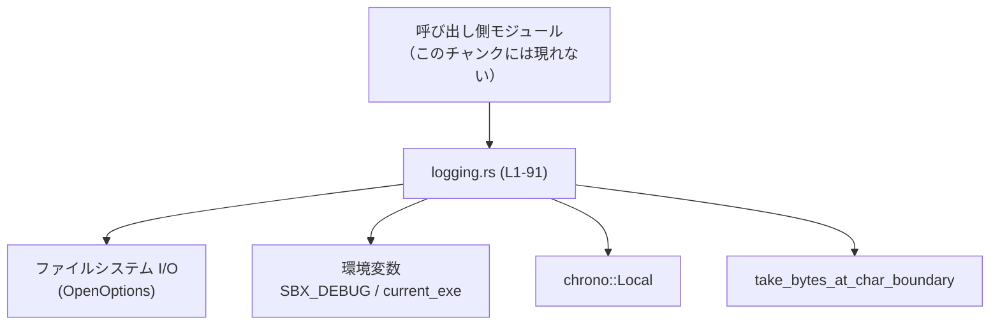

# windows-sandbox-rs/src/logging.rs

## 0. ざっくり一言

サンドボックス関連コマンドの開始・成功・失敗、およびデバッグ情報を、`sandbox.log` に追記するための小さなロギングユーティリティです（根拠: `logging.rs:L9-L10, L48-L60, L64-L75`）。

---

## 1. このモジュールの役割

### 1.1 概要

- このモジュールは、**サンドボックス実行のライフサイクル（START/SUCCESS/FAILURE）や任意メッセージをログとして記録する問題**を解決するために存在し、次の機能を提供します（根拠: `logging.rs:L48-L60, L64-L75`）。
  - コマンドライン引数の UTF-8 安全なプレビュー生成（`preview`）（`logging.rs:L22-L29`）
  - ログファイル `sandbox.log` のパス決定と追記（`log_file_path`, `append_line`）（`logging.rs:L31-L37, L39-L46`）
  - START / SUCCESS / FAILURE の標準化されたログ出力（`log_start`, `log_success`, `log_failure`）（`logging.rs:L48-L60`）
  - 環境変数 `SBX_DEBUG=1` によるデバッグログ出力制御（`debug_log`）（`logging.rs:L63-L69`）
  - タイムスタンプと実行ファイル名付きの汎用メッセージログ（`log_note`）（`logging.rs:L12-L20, L72-L75`）

### 1.2 アーキテクチャ内での位置づけ

このチャンクからは、**他モジュールがこのロギング機能を呼び出す側**であることは推測できますが、具体的な呼び出し元は現れません（「このチャンクには現れない」）。一方、次の外部コンポーネントに依存しています。

- ファイルシステム I/O（`std::fs::OpenOptions`, `std::io::Write`）（`logging.rs:L1-L2, L39-L46`）
- パス操作（`std::path::Path`, `PathBuf`）（`logging.rs:L3-L4, L31-L37, L39-L42`）
- スレッド安全な一度きりの初期化（`std::sync::OnceLock`）（`logging.rs:L5, L12-L19`）
- 文字列トリミングユーティリティ（`codex_utils_string::take_bytes_at_char_boundary`）（`logging.rs:L7, L22-L29`）
- ローカル時刻取得（`chrono::Local`）（`logging.rs:L73`）
- 環境変数取得（`std::env::current_exe`, `std::env::var`）（`logging.rs:L15, L64-L66`）

依存関係のイメージは次の通りです。



### 1.3 設計上のポイント

- **状態管理**
  - ロギング関数自体は状態を持たず、必要なときにファイルを開いて 1 行書き込む構造になっています（`append_line`）（`logging.rs:L39-L46`）。
  - 例外的に、実行ファイル名ラベルは `OnceLock<String>` にキャッシュされ、初回アクセス時のみ決定されます（`exe_label`）（`logging.rs:L12-L20`）。
- **エラーハンドリング方針**
  - ファイルオープンや書き込みエラーはすべて黙って無視されます。`append_line` は `Result` を返さず、失敗しても何もせず終了します（`logging.rs:L39-L46`）。
  - そのため、ログ出力はあくまで**ベストエフォート**であり、失敗してもメイン処理に影響しない設計になっています。
- **UTF-8 安全性**
  - コマンドのプレビュー生成時には、`take_bytes_at_char_boundary` を用いて、UTF-8 の文字境界を壊さないようにバイト数でトリミングしています（`logging.rs:L22-L29`）。
  - テストで、絵文字（4 バイト）を含むケースで panic しないことを確認しています（`logging.rs:L81-L90`）。
- **並行性**
  - `OnceLock` により `exe_label` の初期化はスレッド安全です（`logging.rs:L12-L19`）。
  - それ以外にグローバルなミュータブル状態は持たず、各ログ呼び出しは都度ファイルを開く構造のため、Rust のメモリ安全性の観点でのデータ競合はありません。
  - ただし、複数スレッド／プロセスから同じファイルに書き込むと、行が混ざる可能性はあります（OS 依存であり、このコードからは挙動の詳細は分かりません）。
- **デバッグログ制御**
  - デバッグログは環境変数 `SBX_DEBUG` が `"1"` のときにのみ有効になります（`logging.rs:L64-L66`）。

---

## 2. 主要な機能一覧

- コマンドのプレビュー生成: `preview` – 長いコマンドラインを最大 200 バイトに UTF-8 安全に短縮します（`logging.rs:L22-L29`）。
- ログファイルパスの決定: `log_file_path` – ベースディレクトリから `sandbox.log` へのパスを生成します（`logging.rs:L31-L37`）。
- ログファイルへの 1 行追記: `append_line` – ファイルを開き、1 行書き込んで閉じます（`logging.rs:L39-L46`）。
- START ログ: `log_start` – コマンドの開始を `"START: ..."` 形式でログに記録します（`logging.rs:L48-L51`）。
- SUCCESS ログ: `log_success` – 成功終了を `"SUCCESS: ..."` 形式で記録します（`logging.rs:L53-L55`）。
- FAILURE ログ: `log_failure` – 失敗時に `"FAILURE: ... (detail)"` 形式で記録します（`logging.rs:L58-L60`）。
- デバッグログ: `debug_log` – `SBX_DEBUG=1` のときだけ `"DEBUG: ..."` をファイルに追記し、標準エラーにも出力します（`logging.rs:L63-L69`）。
- 汎用ノートログ: `log_note` – タイムスタンプと実行ファイル名付きで任意メッセージを記録します（`logging.rs:L72-L75`）。
- 実行ファイルラベルの決定: `exe_label` – 実行ファイル名を 1 度だけ決定しキャッシュします（`logging.rs:L12-L20`）。

---

## 3. 公開 API と詳細解説

### 3.1 コンポーネント一覧（関数・定数）

| 名前 | 種別 | 公開範囲 | 役割 / 用途 | 定義位置 |
|------|------|----------|-------------|----------|
| `LOG_COMMAND_PREVIEW_LIMIT` | 定数 (`usize`) | 非公開 | コマンドプレビューの最大バイト数（200） | `logging.rs:L9` |
| `LOG_FILE_NAME` | 定数 (`&'static str`) | 公開 | ログファイル名 `"sandbox.log"` | `logging.rs:L10` |
| `exe_label` | 関数 `fn() -> &'static str` | 非公開 | 実行ファイル名（または `"proc"`）を一度だけ決定し、以後再利用 | `logging.rs:L12-L20` |
| `preview` | 関数 `fn(&[String]) -> String` | 非公開 | コマンド配列を結合し、必要なら UTF-8 安全に短縮 | `logging.rs:L22-L29` |
| `log_file_path` | 関数 `fn(&Path) -> Option<PathBuf>` | 非公開 | ベースディレクトリから `sandbox.log` のパスを作成 | `logging.rs:L31-L37` |
| `append_line` | 関数 `fn(&str, Option<&Path>)` | 非公開 | ログ行をファイルに追記（失敗時は黙って無視） | `logging.rs:L39-L46` |
| `log_start` | 関数 `pub fn(&[String], Option<&Path>)` | 公開 | コマンド開始を `"START: ..."` 形式でログ | `logging.rs:L48-L51` |
| `log_success` | 関数 `pub fn(&[String], Option<&Path>)` | 公開 | 成功終了を `"SUCCESS: ..."` 形式でログ | `logging.rs:L53-L55` |
| `log_failure` | 関数 `pub fn(&[String], &str, Option<&Path>)` | 公開 | 失敗を `"FAILURE: ... (detail)"` 形式でログ | `logging.rs:L58-L60` |
| `debug_log` | 関数 `pub fn(&str, Option<&Path>)` | 公開 | `SBX_DEBUG=1` のときのみデバッグログと標準エラー出力 | `logging.rs:L64-L69` |
| `log_note` | 関数 `pub fn(&str, Option<&Path>)` | 公開 | タイムスタンプ＋実行ファイル名付きの汎用ログ | `logging.rs:L72-L75` |
| `tests::preview_does_not_panic_on_utf8_boundary` | テスト関数 | テストのみ | `preview` が絵文字を含むケースで panic しないことを確認 | `logging.rs:L81-L90` |

---

### 3.2 関数詳細（重要な 7 件）

#### `preview(command: &[String]) -> String` （L22-L29）

**概要**

- 複数のコマンド引数を `" "` で結合し、長さが `LOG_COMMAND_PREVIEW_LIMIT`（200 バイト）を超える場合に UTF-8 の文字境界を維持したまま短縮した文字列を返します（根拠: `logging.rs:L22-L29`）。

**引数**

| 引数名 | 型 | 説明 |
|--------|----|------|
| `command` | `&[String]` | コマンドとその引数を表す文字列配列への参照 |

**戻り値**

- `String`: 結合されたコマンドラインのプレビュー。最大でも `LOG_COMMAND_PREVIEW_LIMIT` バイト以下になります（テストコードからの確認: `logging.rs:L89`）。

**内部処理の流れ**

1. `command.join(" ")` で `"arg1 arg2 ..."` の形式の文字列 `joined` を生成します（`logging.rs:L23`）。
2. `joined.len()`（バイト長）が `LOG_COMMAND_PREVIEW_LIMIT` 以下なら、そのまま `joined` を返します（`logging.rs:L24-L25`）。
3. 超える場合は `take_bytes_at_char_boundary(&joined, LOG_COMMAND_PREVIEW_LIMIT)` を呼び出し、文字境界を壊さない位置までバイト列を切り詰めて `.to_string()` します（`logging.rs:L27`）。

**Examples（使用例）**

```rust
// コマンド配列を用意する
let cmd: Vec<String> = vec![
    "powershell".to_string(),      // サンドボックスで実行するコマンド
    "-Command".to_string(),
    "Write-Host 'Hello, world'".to_string(),
];

// プレビュー文字列を生成する
let p: String = preview(&cmd);     // 長すぎる場合は200バイトで切り詰められる

// ログメッセージに埋め込むなどして利用できる
println!("Command preview: {p}");  // 画面出力の例
```

**Errors / Panics**

- 関数内で明示的に `panic!` を呼んでおらず、`join` や `len`、`to_string` は通常の使用では panic しません。
- `take_bytes_at_char_boundary` の内部挙動はこのチャンクには現れませんが、テストでは絵文字を含むケースで panic しないことが `catch_unwind` で確認されています（`logging.rs:L81-L90`）。
  - したがって、少なくともそのテストケースでは panic は発生しませんが、すべての入力に対して panic しないことまではこのコードからは断定できません。

**Edge cases（エッジケース）**

- `command` が空 (`&[]`) の場合: `joined` は空文字列 `""` となり、そのまま返されます（`logging.rs:L23-L25`）。
- 非 ASCII 文字を含む場合: `len()` と上限はバイト単位なので、文字数としては 200 未満でも 200 バイトを超えると切り詰められます。ただし `take_bytes_at_char_boundary` により文字が途中で切断されるのは防がれます（`logging.rs:L27`）。
- 非 UTF-8 は `String` としてそもそも生成できないため、この関数の入力前に排除されています。

**使用上の注意点**

- 戻り値の長さは「バイト数上限」であり「文字数上限」ではありません。ログの見た目上の長さが言語によって異なり得ます。
- 長さ 200 バイトを超えると末尾が切られるため、重要な情報（例えば長いフルパスやトークン）が末尾にある場合、それがログに現れない可能性があります。
- コマンド自体に秘密情報（トークン・パスワードなど）が含まれている場合、その一部がログに残る点に注意が必要です（セキュリティ上の観点）。

---

#### `append_line(line: &str, base_dir: Option<&Path>)` （L39-L46）

**概要**

- 指定されたベースディレクトリ配下の `sandbox.log` ファイルに、1 行の文字列を追記します。ディレクトリが不正、ファイルオープンや書き込みに失敗した場合は黙って何も行わず終了します（根拠: `logging.rs:L39-L46`）。

**引数**

| 引数名 | 型 | 説明 |
|--------|----|------|
| `line` | `&str` | ログファイルに追記したい 1 行分のテキスト |
| `base_dir` | `Option<&Path>` | ログファイルを置くベースディレクトリ。`None` の場合やディレクトリでない場合は何も行わない |

**戻り値**

- なし（`()`）。成否は返さず、呼び出し側からはログ出力の成功・失敗を判別できません。

**内部処理の流れ**

1. `if let` の連結パターンで、次の条件がすべて満たされた場合のみ書き込みを行います（`logging.rs:L40-L42`）。
   - `base_dir` が `Some(dir)` である。
   - `log_file_path(dir)` が `Some(path)` を返す（つまり `dir.is_dir()` が真）（`logging.rs:L31-L37`）。
   - `OpenOptions::new().create(true).append(true).open(path)` が `Ok(mut f)` を返す。
2. 条件をすべて満たした場合、`writeln!(f, "{line}")` で改行付きで書き込みます（`logging.rs:L44`）。
   - 戻り値は `_` に束縛され、結果は完全に無視されます。
3. いずれかの条件を満たさない場合、関数は何もせず終了します。

**Examples（使用例）**

```rust
use std::path::Path;                           // Path 型の導入

// ベースディレクトリ（例: サンドボックス用ディレクトリ）を指定する
let base_dir = Path::new("C:\\sandbox_dir");   // 実際には実在するディレクトリを指定する

// 1行のメッセージをログに追記する
append_line("raw log line", Some(base_dir));   // sandbox.log に "raw log line\n" が追記される（成功すれば）
```

**Errors / Panics**

- `OpenOptions::open` が失敗した場合（アクセス権限がない、ディレクトリが存在しないなど）、`if let` のパターンマッチが失敗し、書き込みは行われません（`logging.rs:L40-L43`）。
- `writeln!` による書き込みエラーも `_` に捨てられ、panic にはなりません（`logging.rs:L44`）。
- `append_line` 自身が panic するコードはありません。

**Edge cases（エッジケース）**

- `base_dir == None` の場合: 早期に `if let` が失敗し、何も書きません（`logging.rs:L40`）。
- `base_dir` がディレクトリではない（ファイルを指している）場合: `log_file_path` が `None` を返すため、書き込みは行われません（`logging.rs:L31-L37, L40-L42`）。
- ログファイルが存在しない場合: `create(true)` により新規作成が試みられます（`logging.rs:L42`）。
- 大量のログ行を高頻度で書き込むと、毎回ファイルオープンとクローズが行われるため I/O コストが高くなります。

**使用上の注意点**

- 成否が分からない設計のため、「ログが確実に残っていないといけない」用途には適していません。
- `base_dir` が不正でもエラーは返されないため、呼び出し側は事前にディレクトリの存在確認などを行う必要があります。
- マルチスレッド／マルチプロセスから同じファイルに書き込む場合、行順序や原子性は OS 依存であり、このコードだけでは保証されません。

---

#### `log_start(command: &[String], base_dir: Option<&Path>)` （L48-L51）

**概要**

- コマンドの開始を `"START: {プレビュー}"` という形式でログに記録します（根拠: `logging.rs:L48-L51`）。

**引数**

| 引数名 | 型 | 説明 |
|--------|----|------|
| `command` | `&[String]` | 実行しようとしているコマンドと引数 |
| `base_dir` | `Option<&Path>` | ログファイルを置くベースディレクトリ |

**戻り値**

- なし (`()`)。

**内部処理の流れ**

1. `preview(command)` でコマンドのプレビュー文字列 `p` を生成します（`logging.rs:L49`）。
2. `"START: {p}"` という文字列を `format!` で作成し、`log_note` を呼び出します（`logging.rs:L50`）。
3. `log_note` 内でタイムスタンプや実行ファイル名が付与され、実際のファイルへの書き込みは `append_line` によって行われます（`logging.rs:L72-L75, L39-L46`）。

**Examples（使用例）**

```rust
use std::path::Path;                                // Path 型を使用する

fn run_command_with_logging() {
    let cmd = vec!["cmd.exe".to_string(), "/C".to_string(), "echo hi".to_string()]; // 実行コマンド
    let base_dir = Path::new("C:\\sandbox_dir");                                    // ログディレクトリ

    log_start(&cmd, Some(base_dir));                                                // 実行前に開始ログを出す

    // ここで実際のコマンド実行処理を行う（省略）                              // ...
}
```

**Errors / Panics**

- `log_start` 自身は `Result` を返さず、内部の `log_note` / `append_line` の失敗もすべて無視されます。
- `preview` が panic しない限り（テストから少なくとも一部ケースでは安全）、`log_start` が panic する可能性は小さいです。

**Edge cases（エッジケース）**

- `command` が空の場合、ログメッセージは `"START: "` となります。
- `base_dir` が `None` の場合、`log_note` 内で `append_line` がスキップされるため、ログファイルには何も書き込まれません（`logging.rs:L39-L46`）。

**使用上の注意点**

- 実際の処理が開始する直前に呼び出すことを前提とした名前・フォーマットになっています。他の用途で使う場合はログの意味を混乱させないよう注意が必要です。
- `preview` により長いコマンドは切り詰められるため、全引数を完全にトレースしたい場合には別途フルログを残す必要があります。

---

#### `log_success(command: &[String], base_dir: Option<&Path>)` （L53-L55）

**概要**

- コマンドが成功裏に終了したことを `"SUCCESS: {プレビュー}"` 形式でログに記録します（根拠: `logging.rs:L53-L55`）。

**引数 / 戻り値**

- `log_start` と同一の形式・意味です。

**内部処理の流れ**

1. `preview(command)` でプレビュー文字列 `p` を生成（`logging.rs:L54`）。
2. `"SUCCESS: {p}"` を `log_note` に渡す（`logging.rs:L55`）。

**Examples（使用例）**

```rust
use std::path::Path;

fn run_command_with_logging() {
    let cmd = vec!["cmd.exe".to_string(), "/C".to_string(), "echo hi".to_string()];
    let base_dir = Path::new("C:\\sandbox_dir");

    log_start(&cmd, Some(base_dir));                  // 開始ログ
    // 実際のコマンド実行処理... (省略)

    // 成功したと判断できた場合
    log_success(&cmd, Some(base_dir));                // 成功ログ
}
```

**Errors / Panics / Edge cases**

- `log_start` と同様です。`command` が空の場合は `"SUCCESS: "` が記録されます。

**使用上の注意点**

- 成否の判定は呼び出し側の責任であり、この関数は結果の真偽を検証しません。

---

#### `log_failure(command: &[String], detail: &str, base_dir: Option<&Path>)` （L58-L60）

**概要**

- コマンドが失敗したことを、詳細メッセージ付きで `"FAILURE: {プレビュー} ({detail})"` としてログに記録します（根拠: `logging.rs:L58-L60`）。

**引数**

| 引数名 | 型 | 説明 |
|--------|----|------|
| `command` | `&[String]` | 実行したコマンドと引数 |
| `detail` | `&str` | 失敗理由やエラー内容の説明 |
| `base_dir` | `Option<&Path>` | ログディレクトリ |

**戻り値**

- なし (`()`)。

**内部処理の流れ**

1. `preview(command)` でプレビュー文字列 `p` 生成（`logging.rs:L59`）。
2. `"FAILURE: {p} ({detail})"` を `log_note` に渡す（`logging.rs:L60`）。

**Examples（使用例）**

```rust
use std::path::Path;

fn run_command_with_logging() {
    let cmd = vec!["cmd.exe".to_string(), "/C".to_string(), "exit 1".to_string()];
    let base_dir = Path::new("C:\\sandbox_dir");

    log_start(&cmd, Some(base_dir));                             // 開始ログ
    // コマンド実行... (省略)

    let exit_code = 1;                                           // 例: 結果として 1 を得たとする
    if exit_code != 0 {
        let detail = format!("exit code {}", exit_code);         // エラー内容を文字列化
        log_failure(&cmd, &detail, Some(base_dir));              // 失敗ログ
    }
}
```

**Errors / Panics**

- `detail` のフォーマットに特別な制約はありません。`log_note` / `append_line` の挙動は前述と同様です。

**Edge cases**

- `detail` が非常に長い場合でもそのままログに出力され、切り詰め処理は行われません（`preview` は `command` だけに適用）。

**使用上の注意点**

- ログには `detail` がそのまま記録されるため、スタックトレースや詳細なエラーメッセージに秘密情報が含まれる場合は注意が必要です。

---

#### `debug_log(msg: &str, base_dir: Option<&Path>)` （L64-L69）

**概要**

- 環境変数 `SBX_DEBUG` が `"1"` のときのみ、`"DEBUG: {msg}"` をログファイルに追記し、同じ `msg` を標準エラー出力にも書き出します（根拠: `logging.rs:L63-L69`）。

**引数**

| 引数名 | 型 | 説明 |
|--------|----|------|
| `msg` | `&str` | デバッグ用メッセージ |
| `base_dir` | `Option<&Path>` | ログファイル用ベースディレクトリ |

**戻り値**

- なし (`()`)。

**内部処理の流れ**

1. `std::env::var("SBX_DEBUG").ok()` で環境変数 `SBX_DEBUG` を取得し、`Result` を `Option<String>` に変換します（`logging.rs:L65`）。
2. `.as_deref() == Some("1")` で値が文字列 `"1"` のときだけブロック内を実行します（`logging.rs:L65`）。
3. `append_line(&format!("DEBUG: {msg}"), base_dir)` でファイルに書き込み（`logging.rs:L66`）。
4. `eprintln!("{msg}")` で標準エラーにメッセージを出力します（`logging.rs:L67`）。

**Examples（使用例）**

```rust
use std::path::Path;

fn something_to_debug() {
    let base_dir = Path::new("C:\\sandbox_dir");    // ログディレクトリ
    debug_log("about to start sandbox", Some(base_dir));  // SBX_DEBUG=1 の時だけ出力される
}
```

**Errors / Panics**

- `std::env::var` は `Result` を返し、`.ok()` によりエラーは無視されるため、環境変数が存在しなくても panic しません。
- `append_line` の I/O エラーは前述の通り無視されます。
- `eprintln!` は OS の標準エラーへの書き込み失敗時に panic する可能性がありますが、通常の環境では稀です（Rust 標準マクロの仕様に由来）。

**Edge cases**

- `SBX_DEBUG` が定義されていない、または `"1"` 以外の値の場合は何も出力されません（`logging.rs:L65-L68`）。
- `base_dir == None` の場合でも `eprintln!` による標準エラー出力は行われます（`append_line` のみスキップ）。

**使用上の注意点**

- デバッグログは本番環境では通常無効ですが、`SBX_DEBUG=1` を設定すると標準エラーに詳細情報が出力されるため、機密情報を含めないよう注意が必要です。
- `log_note` と異なりタイムスタンプや実行ファイル名は付与されません。必要な場合は呼び出し側で付与するか、`log_note` を使う設計に変更する必要があります。

---

#### `log_note(msg: &str, base_dir: Option<&Path>)` （L72-L75）

**概要**

- ローカル時刻と実行ファイル名のラベルを付与した上で、任意メッセージをログに 1 行として書き込みます（根拠: `logging.rs:L12-L20, L72-L75`）。

**引数**

| 引数名 | 型 | 説明 |
|--------|----|------|
| `msg` | `&str` | ログメッセージ |
| `base_dir` | `Option<&Path>` | ログディレクトリ |

**戻り値**

- なし (`()`)。

**内部処理の流れ**

1. `chrono::Local::now().format("%Y-%m-%d %H:%M:%S%.3f")` でミリ秒精度のローカル時刻をフォーマットしたオブジェクト `ts` を生成します（`logging.rs:L73`）。
2. `exe_label()` を呼び出して実行ファイルのラベル文字列を取得します（`logging.rs:L74`）。
   - 初回呼び出し時に `OnceLock` によりキャッシュされ、以降は再利用されます（`logging.rs:L12-L19`）。
3. `format!("[{ts} {}] {}", exe_label(), msg)` で、`[タイムスタンプ 実行ファイル名] メッセージ` 形式の文字列を生成します（`logging.rs:L74`）。
4. `append_line` によりファイルに書き込みます（`logging.rs:L74`）。

**Examples（使用例）**

```rust
use std::path::Path;

fn log_custom_note() {
    let base_dir = Path::new("C:\\sandbox_dir");  // ログディレクトリ
    log_note("sandbox initialized", Some(base_dir)); // 例: "[2026-04-12 10:00:00.123 exe.exe] sandbox initialized"
}
```

**Errors / Panics**

- `chrono::Local::now()` や `.format()` は通常の環境で panic しません。
- `exe_label` 内では `current_exe().ok()` と `unwrap_or_else` が使われていますが、`unwrap_or_else` の引数は Option が `None` のときに呼び出すクロージャであり、panic を起こしません（`logging.rs:L15-L19`）。
- それ以外の I/O エラーは `append_line` にて無視されます。

**Edge cases**

- `base_dir == None` の場合はファイルに出力されません。
- 実行ファイル名取得に失敗した場合は `"proc"` という固定文字列がラベルとして使用されます（`logging.rs:L18-L19`）。

**使用上の注意点**

- ログ形式（タイムスタンプ・実行ファイル名・メッセージの順序）はここで固定されています。変更すると既存のログ解析ツールとの互換性に影響する可能性があります。
- タイムゾーンはローカル時刻 (`chrono::Local`) に依存します。サーバーのタイムゾーン設定に注意が必要です。

---

#### `exe_label() -> &'static str` （L12-L20）※内部用

**概要**

- 実行中のバイナリのファイル名（例: `"sandbox.exe"`）を一度だけ取得してキャッシュし、以降 `'static` な `&str` として返します（根拠: `logging.rs:L12-L20`）。

**使用上の注意点（要点のみ）**

- スレッド安全な `OnceLock<String>` を使っており、並行アクセス時にも 1 度だけ初期化されます。
- 実行ファイル名が取得できない場合は `"proc"` が使われます。
- 公開 API ではないため、外部から直接呼び出すことは想定されていません。

---

### 3.3 その他の関数

| 関数名 | 役割（1 行） | 定義位置 |
|--------|--------------|----------|
| `log_file_path(base_dir: &Path) -> Option<PathBuf>` | `base_dir` がディレクトリであれば `sandbox.log` を指すパスを返し、そうでなければ `None` を返す補助関数 | `logging.rs:L31-L37` |

---

## 4. データフロー

ここでは、典型的な「コマンド開始ログ」のデータフローを示します。

1. 呼び出し側が `log_start(command, base_dir)` を呼ぶ（`logging.rs:L48-L51`）。
2. `preview` がコマンド配列からプレビュー文字列を生成する（`logging.rs:L22-L29`）。
3. `log_note` がタイムスタンプと実行ファイル名を付与し、`append_line` に委譲する（`logging.rs:L72-L75`）。
4. `append_line` が `log_file_path` でパスを決定し、ファイルに 1 行を書き込む（`logging.rs:L31-L37, L39-L46`）。

```mermaid
sequenceDiagram
    participant Caller as 呼び出し側
    participant Start as log_start (L48-51)
    participant Prev as preview (L22-29)
    participant Note as log_note (L72-75)
    participant Label as exe_label (L12-20)
    participant Append as append_line (L39-46)
    participant FS as ファイルシステム

    Caller->>Start: log_start(command, base_dir)
    Start->>Prev: preview(command)
    Prev-->>Start: プレビュー文字列 p
    Start->>Note: log_note("START: {p}", base_dir)
    Note->>Label: exe_label()
    Label-->>Note: 実行ファイルラベル
    Note->>Append: append_line("[{ts} label] START: {p}", base_dir)
    Append->>FS: OpenOptions::open(path) + writeln!
    FS-->>Append: 書き込み結果（無視）
```

- `base_dir == None` の場合、「append_line → FS」の部分は実行されず、ログファイルには何も書かれません（`logging.rs:L39-L46`）。
- エラーが発生しても呼び出し側には通知されず、処理フローは継続します。

---

## 5. 使い方（How to Use）

### 5.1 基本的な使用方法

サンドボックスでコマンドを実行する前後で、開始・終了・失敗をログに残す典型的なパターンです。

```rust
use std::path::Path;                       // Path 型の導入
// mod logging;                            // 実際には crate 構成に応じて logging モジュールを参照する
// use crate::logging::{log_start, log_success, log_failure};

fn run_sandboxed_command() {
    // 実行するコマンドと引数を準備する
    let command = vec![
        "cmd.exe".to_string(),             // 実行ファイル
        "/C".to_string(),                  // パラメータ
        "echo hello".to_string(),          // コマンド内容
    ];

    // ログを出力するディレクトリを指定する（事前に存在していることが前提）
    let base_dir = Path::new("C:\\sandbox_dir");

    // コマンド開始をログに記録する
    log_start(&command, Some(base_dir));

    // ここで実際のコマンド実行処理を行う（省略）
    let exit_code = 0;                     // 例として終了コード 0 を仮定

    // 成功か失敗かに応じてログを残す
    if exit_code == 0 {
        log_success(&command, Some(base_dir));     // 成功ログ
    } else {
        let detail = format!("exit code {}", exit_code); // 失敗理由
        log_failure(&command, &detail, Some(base_dir));  // 失敗ログ
    }
}
```

### 5.2 よくある使用パターン

1. **ベースディレクトリが未定のときに一時的にログを無効化**

```rust
// ベースディレクトリがまだ決まっていない場合
log_start(&command, None);          // 何もファイルに書かれない（開始ログを無視）
```

1. **デバッグ時のみ標準エラーに詳細を出す**

```rust
use std::path::Path;

// 環境変数 SBX_DEBUG=1 がセットされている前提
let base_dir = Path::new("C:\\sandbox_dir");
debug_log("spawning sandbox process", Some(base_dir)); // ファイルとstderrの両方に出力
```

1. **任意の地点でノートログを残す**

```rust
use std::path::Path;

let base_dir = Path::new("C:\\sandbox_dir");
log_note("sandbox environment prepared", Some(base_dir)); // 状態遷移のログなどに使える
```

### 5.3 よくある間違い

**例: ファイルパスを `base_dir` に渡してしまう**

```rust
use std::path::Path;

// 間違い例: base_dir に sandbox.log 自体のパスを渡している
let path = Path::new("C:\\sandbox_dir\\sandbox.log");
log_start(&command, Some(path));        // log_file_path が None を返し、何も書かれない
```

**正しい例: ディレクトリを渡す**

```rust
use std::path::Path;

// 正しい例: sandbox.log を置きたいディレクトリを指定する
let base_dir = Path::new("C:\\sandbox_dir");
log_start(&command, Some(base_dir));    // base_dir\\sandbox.log に追記される
```

### 5.4 使用上の注意点（まとめ）

- `base_dir` は**存在するディレクトリ**である必要があります。そうでない場合、ログは黙って破棄されます（`logging.rs:L31-L37, L39-L42`）。
- ログファイルへの書き込み失敗は呼び出し側に通知されません。ログの有無に依存したロジックを組まない前提で使用する必要があります。
- ログにコマンドやエラー詳細がそのまま出力されるため、**機密情報が含まれないように入力を設計する**ことが重要です。
- 並行な呼び出しに対してメモリ安全性は保たれますが、ログ行の順序や原子性は OS に依存します。
- このモジュールの関数はすべて同期 I/O を用いており、頻繁な呼び出しはパフォーマンスに影響する可能性があります。

---

## 6. 変更の仕方（How to Modify）

### 6.1 新しい機能を追加する場合

例: 「タイムアウト」を記録する `log_timeout` を追加したい場合。

1. **ログメッセージの形式を決める**
   - 例: `"TIMEOUT: {preview} after {seconds}s"` のようなフォーマット。
2. **`logging.rs` に新しい関数を追加する**
   - `log_start` / `log_success` / `log_failure` と同じパターンで `preview` と `log_note` を組み合わせるのが自然です（`logging.rs:L48-L60` を参考）。
3. **公開するかどうか決める**
   - ライブラリの外から使うなら `pub fn`、内部専用なら `fn` にします。
4. **テストを追加する**
   - 既存の `preview_does_not_panic_on_utf8_boundary` と同様に、フォーマットや panic しないことを確認するテストを `#[cfg(test)] mod tests` に追加します（`logging.rs:L77-L90`）。

### 6.2 既存の機能を変更する場合

- **ログフォーマットを変更したい場合**
  - `log_note` の `format!` 部分を変更すると、`log_start` / `log_success` / `log_failure` などすべてのログのヘッダが変わります（`logging.rs:L72-L75`）。
  - 既存のログ解析ツールやテストがフォーマットに依存していないか確認する必要があります。
- **プレビュー長さを変えたい場合**
  - `LOG_COMMAND_PREVIEW_LIMIT` を変更することで一括して制御できます（`logging.rs:L9, L22-L29, L84`）。
  - テスト `preview_does_not_panic_on_utf8_boundary` のロジックも `LOG_COMMAND_PREVIEW_LIMIT` に基づいているため、通常は追加変更は不要です（`logging.rs:L84`）。
- **ログファイル名を変えたい場合**
  - `LOG_FILE_NAME` を変更するだけで `log_file_path` 経由で全体に反映されます（`logging.rs:L10, L31-L34`）。
  - 既存システムやドキュメントが `sandbox.log` に依存していないか確認する必要があります。

変更時には次の点に注意します。

- `append_line` の挙動（エラー無視）を変える場合、**呼び出し側の前提が崩れる**可能性があります。`Result` を返す新しい関数を別名で用意し、既存関数はそのままにする方が安全です。
- 環境変数名 `SBX_DEBUG` の変更は運用方法にも影響するため、慎重に扱う必要があります（`logging.rs:L64-L66`）。

---

## 7. 関連ファイル

このチャンクには `logging.rs` 以外のファイルは現れません。他モジュールとの直接的な関係は不明です。

| パス | 役割 / 関係 |
|------|------------|
| `src/logging.rs` | サンドボックス実行周辺のログ出力機能を提供するモジュール（本レポートの対象）。 |
| その他のモジュール | このチャンクには現れないため、どのモジュールから `log_start` などが呼ばれているかは不明です。 |

以上が `windows-sandbox-rs/src/logging.rs` の構造と振る舞い、および安全に利用・変更するための要点です。
