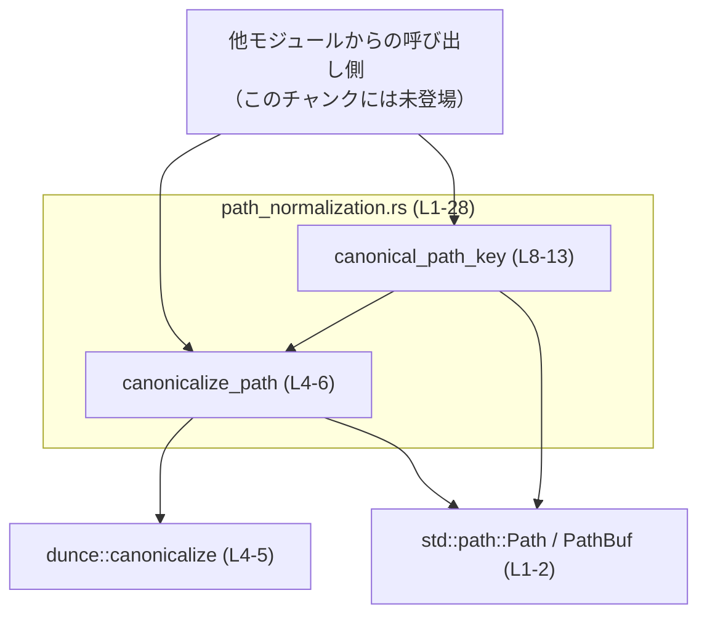
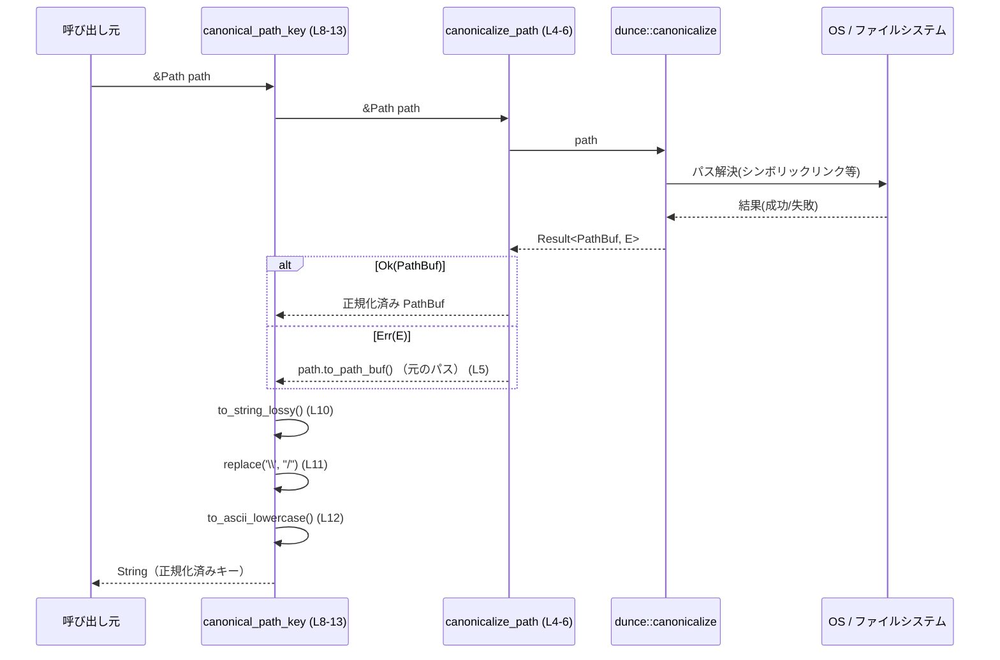

# windows-sandbox-rs/src/path_normalization.rs

## 0. ざっくり一言

ファイルパスを正規化し、パス同士の比較やキー用途に使いやすい「正規化済みパス」および「文字列キー」を生成するユーティリティ関数を提供するモジュールです（windows-sandbox-rs/src/path_normalization.rs:L4-13）。

---

## 1. このモジュールの役割

### 1.1 概要

- このモジュールは、**ファイルパスの正規化と比較用キー生成**という問題を解決するために存在します。
- `canonicalize_path` でパスを正規化し（可能な範囲で絶対パス・シンボリックリンク解決など）、失敗時には元のパスをそのまま使います（L4-6）。
- `canonical_path_key` でパスを文字列化し、**区切り文字を `/` に揃え、ASCII 小文字化**することで、表記ゆれの少ないキーを生成します（L8-12）。

### 1.2 アーキテクチャ内での位置づけ

このモジュールは、他のモジュールから「パスを正規化したい」「パスをキーとして扱いたい」場面で呼び出されるユーティリティという位置づけです（利用側はこのチャンクには現れません）。  
標準ライブラリ `std::path::Path` / `PathBuf` と外部クレート `dunce::canonicalize` に依存しています（L1-2, L4-5）。



> この図は windows-sandbox-rs/src/path_normalization.rs:L1-13 に基づく依存関係を表します。

### 1.3 設計上のポイント

- **ステートレスなユーティリティ**  
  グローバル状態や構造体を持たず、純粋関数として実装されています（L4-6, L8-13）。
- **ベストエフォート正規化**  
  `dunce::canonicalize(path)` が失敗した場合でも panic やエラーにはせず、元のパスを `PathBuf` にコピーして返します（L4-5）。  
  → 呼び出し側は「常に何らかのパス」を受け取れますが、「正規化が成功したかどうか」は分かりません。
- **比較用キーとしての正規化方針**  
  `canonical_path_key` は、  
  1. パスを正規化 (`canonicalize_path`)  
  2. 文字列化 (`to_string_lossy`)  
  3. `\` を `/` に統一 (`replace('\\', "/")`)  
  4. ASCII 小文字化 (`to_ascii_lowercase`)  
  という一連の変換で「表記ゆれに強い」キーを生成します（L8-12）。
- **Windows パス前提の正規化**  
  テストで Windows 風のパス表記とスラッシュ表記を比較しているため（L21-27）、Windows での利用を強く意識した設計と読めますが、このチャンクだけでは用途を断定できません。

---

## 2. 主要な機能一覧とコンポーネントインベントリー

### 2.1 機能一覧

- パスの正規化: `canonicalize_path` — 可能な範囲で OS 依存の正規化を行い、失敗時は元のパスを返す（L4-6）
- 比較用パスキーの生成: `canonical_path_key` — パスを正規化し、区切り文字と大文字小文字を統一した文字列キーを生成する（L8-12）

### 2.2 コンポーネント一覧

| 名前 | 種別 | 公開範囲 | シグネチャ / 役割 | 行範囲（根拠） | 備考 |
|------|------|----------|-------------------|----------------|------|
| `canonicalize_path` | 関数 | `pub` | `fn canonicalize_path(path: &Path) -> PathBuf`。dunce の `canonicalize` を呼び出し、失敗時は元のパスにフォールバックします。 | windows-sandbox-rs/src/path_normalization.rs:L4-6 | ステートレス・ノンジェネリック |
| `canonical_path_key` | 関数 | `pub` | `fn canonical_path_key(path: &Path) -> String`。`canonicalize_path` → 文字列化 → 区切り統一 → 小文字化でキー文字列を生成します。 | L8-13 | パス比較や HashMap のキーなどを想定した形の関数と解釈できます |
| `tests::canonical_path_key_normalizes_case_and_separators` | テスト関数 | `#[test]`（モジュール内のみ） | 2 種類の Windows 風パス表記が同じキーを生成することを検証します。 | L21-27 | `pretty_assertions::assert_eq` を使用 |

---

## 3. 公開 API と詳細解説

### 3.1 型一覧（構造体・列挙体など）

このモジュール内で新たに定義されている構造体・列挙体・型エイリアスはありません（L1-28）。  
使用している型は標準ライブラリの `std::path::Path` / `PathBuf` のみです（L1-2, L4, L8）。

---

### 3.2 関数詳細

#### `canonicalize_path(path: &Path) -> PathBuf`

**概要**

- 引数のパスを OS 依存の方法で正規化しようとし、成功すればその結果を、失敗した場合は元のパスを `PathBuf` として返します（L4-5）。
- エラーを外に伝播しない「ベストエフォート」な正規化関数です。

**引数**

| 引数名 | 型 | 説明 |
|--------|----|------|
| `path` | `&Path` | 正規化したいパスへの共有参照です（L4）。呼び出し側の所有権は移動しません。 |

**戻り値**

- `PathBuf`  
  - 正規化に成功した場合: `dunce::canonicalize(path)` が返す正規化済みパス（L4-5）。
  - 失敗した場合: `path.to_path_buf()` による、元のパスのコピー（L5）。

**内部処理の流れ**

1. `dunce::canonicalize(path)` を呼ぶ（L4-5）。  
   - 戻り値は `Result<PathBuf, E>` 型（E は外部クレート側のエラー型）と推測できますが、型名はこのチャンクでは明示されていません。
2. `unwrap_or_else(|_| path.to_path_buf())` を呼び、  
   - `Ok(PathBuf)` の場合は中身の `PathBuf` をそのまま返却。
   - `Err(_)` の場合はクロージャ `|_| path.to_path_buf()` を実行し、元のパスをコピーして返却（L5）。
3. これにより、関数としては必ず `PathBuf` を返し、`Result` 型は外に漏れません（L4-6）。

**Examples（使用例）**

```rust
use std::path::Path;
use windows_sandbox_rs::path_normalization::canonicalize_path;

fn main() {
    // 相対パス
    let relative = Path::new("../some/dir");            // 相対パスを作成
    let normalized = canonicalize_path(relative);       // 正規化を試みる（L4-6）

    println!("normalized: {}", normalized.display());  // 結果のパスを表示
}
```

> ここでは、`canonicalize_path` が常に `PathBuf` を返し、失敗時も panic せず元のパスにフォールバックする点が重要です（L4-6）。

**Errors / Panics**

- **Result を返さない設計**  
  - エラー状態は呼び出し側には通知されません。失敗した場合も「それらしいパス（元のパス）」が返ります（L5）。
- **panic について**  
  - この関数内では `unwrap` や `expect` を使用していないため、このコードから直接 panic する箇所はありません（L4-6）。
  - ただし、`dunce::canonicalize` 自体が内部で panic するかどうかは、このチャンクだけからは判断できません。

**Edge cases（エッジケース）**

- 存在しないパス  
  - 一般的に `canonicalize` 系関数は存在しないパスで `Err` を返すことが多いため、その場合は元のパスが返ると考えられます（L5）。
- 権限のないパス  
  - 権限不足により `dunce::canonicalize` が失敗した場合も、元のパスにフォールバックします（L5）。
- 相対パス  
  - 正規化に成功すれば絶対パスへ変換される可能性がありますが、失敗すると相対パスのまま返ります（L4-6）。
- 非 UTF-8 パス  
  - この関数内では文字列化が行われないため、非 UTF-8 パスも `PathBuf` としてそのまま扱われます（L4-6）。

**使用上の注意点**

- **正規化成功/失敗の判別ができない**  
  - 返された `PathBuf` が「正規化済みかどうか」を区別する手段は提供されていません（L4-6）。  
    「正規化に成功したこと」を前提にロジックを書くと、失敗ケースで挙動が変わる可能性があります。
- **存在確認には向かない**  
  - エラーを吸収してしまうため、「存在しないパスならエラー」というような用途には直接使えません。
- **スレッドセーフ性**  
  - グローバル状態を持たず、`&Path` のイミュータブル参照しか扱わないため、この関数の呼び出し自体は並行実行しても安全です（L4-6）。  
    ただし、実際の振る舞いは OS とファイルシステムの状態に依存します。

---

#### `canonical_path_key(path: &Path) -> String`

**概要**

- パスを `canonicalize_path` で正規化したうえで文字列化し、**区切り文字を `/` に統一し、ASCII 小文字に変換したキー文字列**を生成します（L8-12）。
- パス表記の違い（`\` vs `/`、大文字と小文字）を吸収して比較したい場合に使える関数です。

**引数**

| 引数名 | 型 | 説明 |
|--------|----|------|
| `path` | `&Path` | キーを生成したいパスへの共有参照です（L8）。 |

**戻り値**

- `String`  
  - 正規化・文字列変換・区切り統一・小文字化後のパス表現です（L8-12）。
  - 例: `r"C:\Users\Dev\Repo"` と `"c:/users/dev/repo"` は同じキーになります（テストより、L21-27）。

**内部処理の流れ（アルゴリズム）**

1. `canonicalize_path(path)` を呼び出し、`PathBuf` を取得します（L9）。
2. その `PathBuf` に対して `to_string_lossy()` を呼び、`Cow<str>` 型の文字列（非 UTF-8 部分は置換文字で補う）に変換します（L10）。
3. `.replace('\\', "/")` により、バックスラッシュ `\` をすべてスラッシュ `/` に置き換えます（L11）。  
   - Windows 風の `C:\Users\Dev\Repo` は `C:/Users/Dev/Repo` のような形になります。
4. `.to_ascii_lowercase()` により、英数字など ASCII 文字の大文字を小文字に変換します（L12）。
5. 最終的な `String` を返却します（L8-13）。

**Examples（使用例）**

1. パスの比較用キーとして利用する例:

```rust
use std::collections::HashSet;
use std::path::Path;
use windows_sandbox_rs::path_normalization::canonical_path_key;

fn main() {
    let mut seen = HashSet::new(); // 既に見たパスのキーを保持する集合

    let p1 = Path::new(r"C:\Users\Dev\Repo");      // Windows風の表記
    let p2 = Path::new("c:/users/dev/repo");       // スラッシュ・小文字表記

    let k1 = canonical_path_key(p1);               // キー生成（L8-12）
    let k2 = canonical_path_key(p2);               // キー生成（L8-12）

    println!("k1 = {}", &k1);
    println!("k2 = {}", &k2);

    assert_eq!(k1, k2);                            // 同一キーになる（テストと同じ性質, L21-27）
    seen.insert(k1);

    // 2つ目は「既に見たパス」と判定できる
    if !seen.insert(k2) {
        println!("同じ場所を指すパスです");
    }
}
```

1. 非 Windows 環境でも「Windows 風パス表記の差異」を吸収する例（テスト相当）:

```rust
use std::path::Path;
use windows_sandbox_rs::path_normalization::canonical_path_key;

fn main() {
    let windows_style = Path::new(r"C:\Users\Dev\Repo"); // バックスラッシュ
    let slash_style   = Path::new("c:/users/dev/repo");  // スラッシュ＋小文字

    assert_eq!(
        canonical_path_key(windows_style),
        canonical_path_key(slash_style),
    );                                                  // L21-27 と同じ検証
}
```

**Errors / Panics**

- **Result を返さない**  
  - `canonicalize_path` と同様、エラーは外へ出さず、常に何らかの文字列を返します（L8-12）。
- **panic の可能性**  
  - この関数内のメソッドチェーン（`to_string_lossy` → `replace` → `to_ascii_lowercase`）は、通常条件では panic しない API です（L9-12）。
  - したがって、ここで明示的に panic を起こすコードは存在しません（L8-13）。

**Edge cases（エッジケース）**

- **パスが非 UTF-8 の場合**  
  - `to_string_lossy()` は非 UTF-8 部分を `U+FFFD`（置換文字）などで置き換えるため、元のバイト列を完全には復元できません（L10）。  
  - 結果として、異なる非 UTF-8 パスが同じ文字列キーにマップされる可能性があります（衝突しうる）。
- **大文字・小文字だけが異なるパス**  
  - `to_ascii_lowercase()` によって同じキーになります（L12）。  
  - Windows のようにケース非区別のファイルシステムでは自然ですが、Linux のようにケース区別な環境では、`"File.txt"` と `"file.txt"` が同じキーとして扱われる点に注意が必要です。
- **区切り文字だけが異なるパス**  
  - `\` と `/` の違いは `replace('\\', "/")` で吸収され、同じキーになります（L11）。
- **パス正規化が失敗した場合**  
  - `canonicalize_path` がエラーになった場合でも、元のパスに対して上記の変換を行うため（L4-6, L8-12）、  
    「存在しないパス」や「権限のないパス」であってもキーは生成されます。

**使用上の注意点**

- **ファイルシステムの区別よりも粗いキーになる可能性**  
  - ASCII ベースの小文字化と区切り統一により、ファイルシステム上は別物のパスが同じキーになることがあります（L11-12）。  
    - 例: `Foo.txt` と `foo.txt`（ケース区別環境）  
    - 非 UTF-8 の細かな違い
- **セキュリティ的な観点**  
  - この関数はパスの検証やアクセス制御を行いません。パス・トラバーサル対策やアクセス権チェックは、別途ファイルシステム API などで行う必要があります（L8-12）。
- **キーをそのまま OS パスとして再利用しない方が安全**  
  - 区切りや大文字小文字が書き換えられているため、戻り値を OS に渡すパスとしてそのまま使用すると、意図しないパスに解決される可能性があります（L11-12）。  
    キーはあくまで「比較用」「マップのキー用」として扱うのが安全です。
- **スレッドセーフ性**  
  - `canonicalize_path` 同様、イミュータブルな参照とローカルな値のみを扱うため、この関数自体は複数スレッドから同時に呼び出しても安全です（L8-12）。

---

### 3.3 その他の関数（テスト）

| 関数名 | 役割（1 行） | 行範囲（根拠） |
|--------|--------------|----------------|
| `tests::canonical_path_key_normalizes_case_and_separators` | Windows 風とスラッシュ表記のパスが同じキーになることを検証するテストです。 | windows-sandbox-rs/src/path_normalization.rs:L21-27 |

**テスト内容の詳細**

- `windows_style = Path::new(r"C:\Users\Dev\Repo")` と `slash_style = Path::new("c:/users/dev/repo")` を用意（L23-24）。
- `assert_eq!(canonical_path_key(windows_style), canonical_path_key(slash_style));` を実行し、2 つの表記の差異（区切り・大文字小文字）が `canonical_path_key` により吸収されることを確認しています（L26）。

---

## 4. データフロー

ここでは、`canonical_path_key` 呼び出し時のデータフローを示します（windows-sandbox-rs/src/path_normalization.rs:L4-13）。

1. 呼び出し元が `&Path` を `canonical_path_key` に渡す（L8）。
2. `canonical_path_key` が `canonicalize_path` を呼び、`PathBuf` を受け取る（L9）。
3. 受け取った `PathBuf` を `to_string_lossy` で `Cow<str>` に変換する（L10）。
4. 文字列中の `\` を `/` に置換した `String` を生成する（L11）。
5. その `String` を ASCII 小文字化して最終的な `String` を返す（L12）。



> このシーケンス図は windows-sandbox-rs/src/path_normalization.rs:L4-13 に対応する処理の流れを表しています。

---

## 5. 使い方（How to Use）

### 5.1 基本的な使用方法

典型的なフローは、「Path を用意 → `canonical_path_key` でキー生成 → 比較やマップのキーとして利用」です。

```rust
use std::collections::HashMap;
use std::path::Path;
use windows_sandbox_rs::path_normalization::{canonicalize_path, canonical_path_key};

fn main() {
    let original = Path::new(r"C:\Users\Dev\Repo");      // 任意のパス（L23）
    
    // 1. 正規化された PathBuf を取得
    let normalized = canonicalize_path(original);        // L4-6
    println!("normalized path = {}", normalized.display());

    // 2. 比較用のキー文字列を生成
    let key = canonical_path_key(original);              // L8-12
    println!("key = {}", key);

    // 3. HashMap のキーとして利用
    let mut map = HashMap::new();
    map.insert(key.clone(), "some value");

    // 4. 表記ゆれのある別のパスから同じキーで引ける
    let another = Path::new("c:/users/dev/repo");
    let another_key = canonical_path_key(another);       // L8-12
    assert_eq!(key, another_key);
    assert_eq!(map.get(&another_key), Some(&"some value"));
}
```

### 5.2 よくある使用パターン

1. **パスの同一性チェック（Windows 前提）**

   - 目的: 複数のパス文字列が同じ場所を指しているか、大まかに判定したい場合。
   - パターン:

     ```rust
     fn logically_same_path(a: &Path, b: &Path) -> bool {
         canonical_path_key(a) == canonical_path_key(b)  // L8-12
     }
     ```

2. **キャッシュやインデックスのキーとして使用**

   - 例: ファイルごとのメタ情報をキャッシュするときに、`canonical_path_key` の戻り値でインデックスする。

### 5.3 よくある間違い

```rust
use std::fs::File;
use std::path::Path;
use windows_sandbox_rs::path_normalization::canonical_path_key;

// 間違い例: canonical_path_key の結果を OS パスとしてそのまま使う
fn wrong_use(path: &Path) {
    let key = canonical_path_key(path);     // 区切りや大文字小文字が変更される (L8-12)
    // ↓ これは推奨されない: OS にとって正しいパス表現とは限らない
    // let _file = File::open(&key).unwrap();
}

// 正しい例: OS へ渡すときは Path/PathBuf を使う
fn correct_use(path: &Path) {
    use windows_sandbox_rs::path_normalization::canonicalize_path;

    let normalized = canonicalize_path(path); // PathBuf として正規化 (L4-6)
    let _file = File::open(normalized).unwrap();
}
```

- **誤用のポイント**  
  - `canonical_path_key` の戻り値は比較用キーであり、OS が期待するパス表現ではない可能性があります（L11-12）。

### 5.4 使用上の注意点（まとめ）

- `canonicalize_path` はエラーを隠蔽して元のパスにフォールバックするため、**「存在確認」や「アクセス権の検証」用途にはそのまま使わない**ほうが安全です（L4-6）。
- `canonical_path_key` は  
  - 大文字小文字、区切り文字の差異を吸収するため、**ケース区別なファイルシステムでは異なるパスが同じキーになりうる**点に注意が必要です（L11-12）。
  - 非 UTF-8 パスでは情報が欠落する可能性があります（L10）。
- 両関数ともステートレスで `&Path` のイミュータブル参照のみ扱うため、**並行呼び出しは安全**です（L4-6, L8-12）。

---

## 6. 変更の仕方（How to Modify）

### 6.1 新しい機能を追加する場合

例として、「エラー内容も利用したい」「ケース区別なキーを追加したい」といった場合の考え方を示します。

1. **エラー情報付きの正規化関数を追加する**

   - 追加する場所: 本モジュール（同じファイル）内。
   - 方針:

     ```rust
     pub fn try_canonicalize_path(path: &Path) -> Result<PathBuf, dunce::Error> {
         // 実際のエラー型は dunce クレートの定義に依存します（このチャンクからは不明）
         dunce::canonicalize(path)
     }
     ```

   - 既存の `canonicalize_path` は、そのラッパーとして「エラーを握りつぶす」API のまま残す、という分割も考えられます（L4-5）。

2. **ケース区別のキー生成関数を追加する**

   - 追加案:

     ```rust
     pub fn canonical_path_key_case_sensitive(path: &Path) -> String {
         canonicalize_path(path)
             .to_string_lossy()
             .replace('\\', "/")
         // to_ascii_lowercase を呼ばない (L10-12 をベースに変更)
     }
     ```

   - 既存の `canonical_path_key` との違いが明確になるように命名するのが実務上は分かりやすくなります。

### 6.2 既存の機能を変更する場合

- **`canonicalize_path` の戻り値を `Result<PathBuf, E>` に変更する場合**

  - 影響:
    - この関数を呼んでいるすべてのコードが `Result` を扱うよう修正する必要があります。
    - `canonical_path_key` も実装を変更する必要があり、`.unwrap_or_else` 部分が削除されるか、`?` でエラーを伝播する形に変わります（L4-6, L8-12）。
  - 契約上の変更:
    - 「常に `PathBuf` を返す」という契約から、「エラーが返ることもある」という契約に変わるため、既存呼び出し側が想定している挙動が変わります。

- **`canonical_path_key` の正規化ルールを変更する場合**

  - 例: 小文字化をやめる、区切り変換を変えるなど（L11-12）。
  - 影響:
    - 生成されるキーの値が変わるため、これをキーにしているキャッシュや永続化されたデータとの互換性に注意が必要です。
    - テスト `canonical_path_key_normalizes_case_and_separators` の期待値も変わる可能性があります（L21-27）。

- **変更時の確認ポイント**

  - 本モジュールのテスト（L21-27）に加え、リポジトリ全体で `canonicalize_path` / `canonical_path_key` を呼んでいる箇所を洗い出し、前提としている挙動（例: 「必ず同じキーになる」など）との整合性を確認することが重要です。

---

## 7. 関連ファイル

このチャンクから直接参照されている・強く関連するファイル／コンポーネントは次の通りです。

| パス / コンポーネント | 役割 / 関係 |
|----------------------|------------|
| `std::path::Path` / `PathBuf` | パスの表現に用いる標準ライブラリの型です（L1-2, L4, L8）。 |
| `dunce::canonicalize` | パスの正規化を行う外部クレートの関数で、本モジュールの正規化ロジックの中核です（L4-5）。 |
| `pretty_assertions::assert_eq` | テストでキーの比較に使用されるアサーションマクロです（L18, L26）。 |
| `windows-sandbox-rs/src/path_normalization.rs` 内テストモジュール | `canonical_path_key` の挙動（区切り・大文字小文字の正規化）を検証しています（L15-27）。 |

このチャンクには、他の自前モジュール（例: 設定モジュールやファイル操作モジュール）への直接的な参照は存在しないため、より広い依存関係はリポジトリ全体を確認する必要があります。
