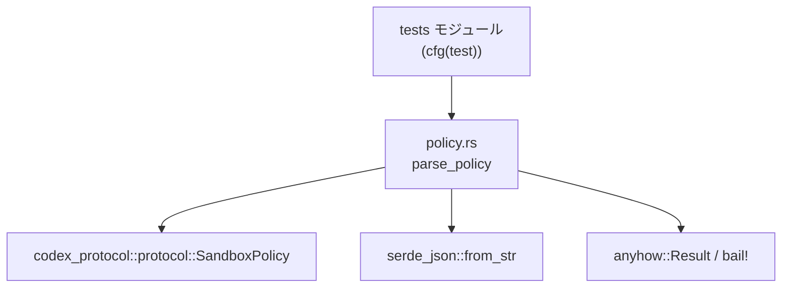
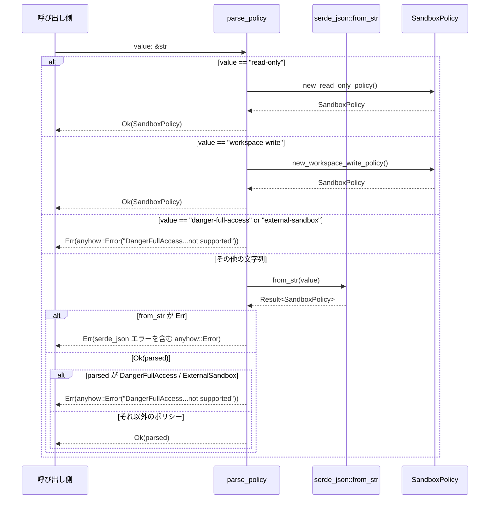

# windows-sandbox-rs/src/policy.rs

## 0. ざっくり一言

`sandbox` のポリシーを文字列から `SandboxPolicy` 型に変換しつつ、特定の危険なポリシーを明示的に拒否するモジュールです（JSON 文字列も受け付けます）。  
根拠: `windows-sandbox-rs/src/policy.rs:L2-23`

---

## 1. このモジュールの役割

### 1.1 概要

- このモジュールは、外部から渡されるポリシー指定文字列（プリセット名または JSON）を安全に解釈して `SandboxPolicy` に変換するために存在します。  
- その際、「危険」とみなしている `DangerFullAccess` と `ExternalSandbox` ポリシーを、プリセット指定・JSON のいずれの経路でも拒否します。  
根拠: `windows-sandbox-rs/src/policy.rs:L2-23`

### 1.2 アーキテクチャ内での位置づけ

- 依存関係:
  - `codex_protocol::protocol::SandboxPolicy` を再エクスポートし、ポリシー型として利用します。  
    根拠: `L2`
  - JSON 文字列からのパースに `serde_json::from_str` を使います。  
    根拠: `L12`
  - エラーハンドリングに `anyhow::Result` と `anyhow::bail!` を使います。  
    根拠: `L1, L8-9, L17-19`
- テストコード（`#[cfg(test)] mod tests`）から `parse_policy` が呼び出されています。  
  根拠: `L26-59`



### 1.3 設計上のポイント

- **責務の分割**
  - このファイルはポリシーの「文字列→型」変換と、安全性チェックのみに責務を絞っています。  
    根拠: `L4-23`
- **再利用性**
  - `SandboxPolicy` 型を `pub use` しており、モジュールの利用者は `policy.rs` 経由で同型を使えます。  
    根拠: `L2`
- **安全性（セキュリティ）**
  - 危険とみなす `DangerFullAccess` と `ExternalSandbox` を、プリセット文字列と JSON の両方の経路で拒否します。  
    根拠: `L8-9, L15-19`
- **エラーハンドリング**
  - `anyhow::Result` を返し、文字列パースエラーや危険ポリシー検出を `Err` として呼び出し元に返します。  
    根拠: `L1, L4, L8-9, L12, L17-19`
- **状態管理・並行性**
  - グローバル可変状態や `unsafe` ブロックはなく、関数は引数とローカル変数のみを扱う純粋な変換関数です。  
    根拠: ファイル全体に `static mut` や `unsafe` が存在しない `L1-59`

---

## 2. 主要な機能一覧（コンポーネントインベントリー）

このファイルに現れる主なコンポーネントの一覧です。

### 2.1 コンポーネント一覧

| 名前 | 種別 | 公開 | 役割 / 用途 | 根拠 |
|------|------|------|------------|------|
| `SandboxPolicy` | 再エクスポート（型） | 公開 (`pub use`) | サンドボックスの挙動を表すポリシー型。外部クレート `codex_protocol::protocol` から再エクスポートされます。型の中身はこのチャンクには現れません。 | `windows-sandbox-rs/src/policy.rs:L2` |
| `parse_policy` | 関数 | 公開 (`pub fn`) | 文字列（プリセット名または JSON）を `SandboxPolicy` に変換し、危険なポリシーを拒否します。 | `L4-23` |
| `tests` | モジュール（`#[cfg(test)]`） | 非公開 | テスト時のみコンパイルされるモジュールで、`parse_policy` の挙動（拒否ポリシー・プリセット解釈）を検証します。 | `L26-59` |
| `rejects_external_sandbox_preset` | テスト関数 | 非公開 | プリセット文字列 `"external-sandbox"` を拒否することを確認します。 | `L31-37` |
| `rejects_external_sandbox_json` | テスト関数 | 非公開 | JSON で表現された `ExternalSandbox` ポリシーを拒否することを確認します。 | `L39-51` |
| `parses_read_only_policy` | テスト関数 | 非公開 | プリセット `"read-only"` が `new_read_only_policy()` に対応していることを確認します。 | `L53-59` |

※ `SandboxPolicy` 自体の内部構造やトレイト実装（`Deserialize` など）は、このチャンクには現れません。

---

## 3. 公開 API と詳細解説

### 3.1 型一覧（構造体・列挙体など）

このファイルで「公開 API」として利用できるのは、再エクスポートされた `SandboxPolicy` 型です。

| 名前 | 種別 | 役割 / 用途 | 根拠 |
|------|------|-------------|------|
| `SandboxPolicy` | 列挙体と推測されますが、このチャンクには定義がないため不明 | サンドボックスの動作方針を表現する型で、`new_read_only_policy` などのコンストラクタ的メソッドを持ちます。内部のバリアント定義などはこのチャンクには現れません。 | `windows-sandbox-rs/src/policy.rs:L2, L6-7, L15-16, L42-43, L56-57` |

> 補足: `SandboxPolicy::DangerFullAccess`, `SandboxPolicy::ExternalSandbox { .. }` という記法から、`SandboxPolicy` は enum であり、少なくともこれらのバリアントを持つことが分かりますが、定義本体は別ファイル（`codex_protocol` クレート側）にあります。  
> 根拠: `L15-16, L42-43`

### 3.2 関数詳細：`parse_policy`

#### `parse_policy(value: &str) -> Result<SandboxPolicy>`

**概要**

- 入力文字列 `value` をサンドボックスポリシーとして解釈し、`SandboxPolicy` を返す関数です。  
- `"read-only"`・`"workspace-write"` といったプリセット文字列と、任意の JSON 文字列を受け付けます。  
- `DangerFullAccess` および `ExternalSandbox` ポリシーは、プリセット・JSON のいずれの形式でもエラーとして拒否します。  
根拠: `windows-sandbox-rs/src/policy.rs:L4-23`

**引数**

| 引数名 | 型 | 説明 | 根拠 |
|--------|----|------|------|
| `value` | `&str` | ポリシー指定文字列。プリセット名（例: `"read-only"`）または `SandboxPolicy` を表す JSON 文字列。 | `L4-5, L11-12` |

**戻り値**

- 型: `anyhow::Result<SandboxPolicy>`（`use anyhow::Result;` により単に `Result` と表記）  
  根拠: `L1, L4`
- 意味:
  - `Ok(policy)` の場合: 禁止されていないポリシーを表す `SandboxPolicy` が返されます。
  - `Err(e)` の場合:
    - 文字列が JSON として不正な場合のパースエラー。
    - `DangerFullAccess` または `ExternalSandbox` を意味するプリセット・JSON が指定された場合のエラー。  
  根拠: `L8-9, L12, L15-19`

**内部処理の流れ（アルゴリズム）**

1. `match value` で入力文字列を分岐します。  
   根拠: `L5`
2. `"read-only"` の場合:
   - `SandboxPolicy::new_read_only_policy()` を呼び出し、その結果を `Ok` で包んで返します。  
     根拠: `L6`
3. `"workspace-write"` の場合:
   - `SandboxPolicy::new_workspace_write_policy()` を呼び出し、その結果を `Ok` で包んで返します。  
     根拠: `L7`
4. `"danger-full-access"` または `"external-sandbox"` の場合:
   - `anyhow::bail!` マクロで即座にエラーを返し、処理を終了します。  
     エラーメッセージは `"DangerFullAccess and ExternalSandbox are not supported for sandboxing"` です。  
     根拠: `L8-9`
5. 上記以外の文字列（`other`）の場合:
   1. `serde_json::from_str(other)?` により、JSON として `SandboxPolicy` をパースします。  
      - ここでエラーが発生すると、`?` 演算子により `parse_policy` も `Err` を返して終了します。  
      根拠: `L11-12`
   2. パースされた値 `parsed` が `SandboxPolicy::DangerFullAccess` または `SandboxPolicy::ExternalSandbox { .. }` にマッチするかを `matches!` マクロで検査します。  
      根拠: `L13-16`
   3. もしマッチした場合は、やはり `anyhow::bail!` で同じエラーメッセージを返します。  
      根拠: `L17-19`
   4. それ以外の場合は、`Ok(parsed)` を返します。  
      根拠: `L21`

```mermaid
%% windows-sandbox-rs/src/policy.rs: parse_policy のフロー (L4-23)
flowchart TD
    A["入力 value: &str"] --> B{value は?}
    B -->|"\"read-only\""| C["SandboxPolicy::new_read_only_policy() を呼び出し<br/>Ok(...) を返す"]
    B -->|"\"workspace-write\""| D["SandboxPolicy::new_workspace_write_policy() を呼び出し<br/>Ok(...) を返す"]
    B -->|"\"danger-full-access\" または<br/>\"external-sandbox\""| E["anyhow::bail!(\"DangerFullAccess...not supported\")<br/>→ Err を返す"]
    B -->|"その他"| F["serde_json::from_str(value) で<br/>SandboxPolicy をパース"]
    F -->|パース失敗| G["serde_json のエラーとして<br/>Err を返す（? により伝播）"]
    F -->|パース成功 parsed| H{parsed は<br/>DangerFullAccess / ExternalSandbox?}
    H -->|Yes| I["anyhow::bail!(\"DangerFullAccess...not supported\")<br/>→ Err を返す"]
    H -->|No| J["Ok(parsed) を返す"]
```

**Examples（使用例）**

1. プリセット `"read-only"` を指定する例（正常系）

```rust
use anyhow::Result;                                              // anyhow::Result を使う
use windows_sandbox_rs::policy::{parse_policy, SandboxPolicy};   // parse_policy と SandboxPolicy をインポート

fn main() -> Result<()> {                                        // メイン関数も Result を返す
    // "read-only" プリセットをパースする
    let policy: SandboxPolicy = parse_policy("read-only")?;      // エラーなら ? で早期リターン

    // ここで policy をサンドボックス起動などに渡す想定
    println!("policy = {:?}", policy);                           // Debug 実装があると仮定したデバッグ出力

    Ok(())                                                       // 正常終了
}
```

1. JSON でポリシーを指定する例（正常系）

```rust
use anyhow::Result;
use windows_sandbox_rs::policy::{parse_policy, SandboxPolicy};

fn parse_custom_policy() -> Result<SandboxPolicy> {
    // ここでは SandboxPolicy の具体的な JSON 形式は不明なため、
    // 型名だけを使った仮の JSON 文字列例として示します。
    // 実際の JSON 構造は codex_protocol 側の定義に従います（このチャンクには現れません）。
    let json = r#"{
        "kind": "SomeSafePolicyVariant"
    }"#;

    let policy = parse_policy(json)?;      // JSON からポリシーをパースする
    Ok(policy)
}
```

1. 危険なプリセットを渡した場合（エラー系）

```rust
use windows_sandbox_rs::policy::parse_policy;

fn main() {
    let err = parse_policy("external-sandbox").unwrap_err(); // テストと同様に unwrap_err で取り出す
    let msg = err.to_string();
    assert!(msg.contains("DangerFullAccess and ExternalSandbox are not supported"));
}
```

**Errors / Panics**

- `Err` になる条件:
  - `"danger-full-access"` または `"external-sandbox"` が直接渡された場合。  
    根拠: `L8-9`
  - JSON 文字列として `SandboxPolicy` をパースできない場合（不正な JSON、または `SandboxPolicy` として不正）。  
    → `serde_json::from_str` が `Err` を返し、`?` により上位に伝播します。  
    根拠: `L12`
  - JSON の結果が `SandboxPolicy::DangerFullAccess` または `SandboxPolicy::ExternalSandbox { .. }` だった場合。  
    根拠: `L13-19`
- Panics の可能性:
  - この関数自身は `panic!` を呼んでおらず、`unwrap` なども使用していません。
  - よって、通常の呼び出しにおいて `parse_policy` がパニックを起こすコードは、このチャンクからは読み取れません。
  - テストコード内では `unwrap` / `unwrap_err` を使用しているため、テストの失敗時にはパニックが発生しますが、本番コードには影響しません。  
    根拠: `L33, L46-47, L56-57`

**Edge cases（エッジケース）**

- 空文字列 `""`:
  - いずれのプリセットにもマッチせず `other` ブランチに入り、`serde_json::from_str("")` が実行されます。
  - これは通常 JSON パースエラーになると考えられ、`Err` が返されます。  
    （挙動は serde_json の仕様に依存）  
    根拠: `L5, L11-12`
- 大文字小文字の違い:
  - `"Read-Only"` など大文字小文字が異なる場合はプリセットにマッチせず、JSON として扱われます。
  - JSON として不正であればパースエラーになります。  
    根拠: `L5-7, L11-12`
- `"DangerFullAccess"` （バリアント名と同じ文字列）:
  - プリセットとしては `"danger-full-access"` のみが特別扱いされており、`"DangerFullAccess"` は `other` ブランチで JSON として解釈されます。
  - 引用符のない文字列は JSON として不正であるため、パースエラーになると考えられます。  
    根拠: `L5, L8, L11-12`
- JSON での `DangerFullAccess` / `ExternalSandbox`:
  - テストから、`ExternalSandbox` バリアントの JSON を渡した場合にエラーとなることが確認できます。  
    根拠: `L39-51`
  - 同様に `DangerFullAccess` も `matches!` の条件に含まれており、JSON 表現からパースされた場合もエラーになります。  
    根拠: `L15-19`
- それ以外の（安全な）`SandboxPolicy` バリアント:
  - JSON として正しくパースされ、上記 2 バリアント以外であれば `Ok(parsed)` として返されます。  
    根拠: `L13-16, L21`

**使用上の注意点**

- **前提条件**
  - `value` に渡す JSON は `SandboxPolicy` の `Deserialize` 実装に適合した形式である必要があります。
    - 具体的な JSON スキーマは `codex_protocol` クレート側にあり、このチャンクには現れません。  
      根拠: `L2, L12`
- **禁止事項 / 制限**
  - `DangerFullAccess` および `ExternalSandbox` を意味するポリシーは、プリセット文字列・JSON のどちらの形でも使用できません。
    - この 2 つを使おうとすると、必ずエラーになります。  
      根拠: `L8-9, L15-19`
- **エラーメッセージ依存**
  - テストではエラーメッセージ文字列の一部を `contains(...)` で検証しているため、文言を変更するとテストが壊れます。  
    根拠: `L34-36, L48-50`
- **並行性**
  - 関数は引数とローカル変数のみを使用し、グローバル可変状態を持ちません。
    - したがって、複数スレッドから同時に呼び出してもデータ競合は発生しません。
  - `serde_json::from_str` もデフォルトでは共有状態を使わない純粋関数として設計されているため、このチャンクからはスレッド安全性上の問題は読み取れません。  
    根拠: `L4-23`
- **所有権 / ライフタイム**
  - `value: &str` は借用（参照）として受け取り、関数内では所有権を奪いません。
    - JSON パース結果 `SandboxPolicy` は所有権を持つ値として返され、`value` のライフタイムに依存しません。  
      根拠: `L4, L12, L21`

### 3.3 その他の関数（テスト）

| 関数名 | 役割（1 行） | 根拠 |
|--------|--------------|------|
| `rejects_external_sandbox_preset` | `"external-sandbox"` プリセットを指定した場合に、エラーとなりメッセージに `"DangerFullAccess and ExternalSandbox are not supported"` が含まれることを確認します。 | `windows-sandbox-rs/src/policy.rs:L31-37` |
| `rejects_external_sandbox_json` | `ExternalSandbox` バリアントを JSON で渡した場合に、同様に拒否されることを確認します。 | `L39-51` |
| `parses_read_only_policy` | `"read-only"` プリセットが `SandboxPolicy::new_read_only_policy()` と同値にパースされることを確認します。 | `L53-59` |

---

## 4. データフロー

ここでは、`parse_policy` が呼び出されたときに、データ（文字列→ポリシー）がどのように流れるかを示します。



要点:

- `"read-only"` / `"workspace-write"` は JSON パースを経由せず、`SandboxPolicy` の対応するコンストラクタを直接呼び出します。  
  根拠: `L6-7`
- それ以外はすべて JSON 文字列として扱われ、`serde_json::from_str` で `SandboxPolicy` に変換されます。  
  根拠: `L11-12`
- 危険ポリシー（`DangerFullAccess` / `ExternalSandbox`）はプリセット／JSON を問わずエラーになります。  
  根拠: `L8-9, L15-19`

---

## 5. 使い方（How to Use）

### 5.1 基本的な使用方法

プリセット文字列からポリシーを取得する基本的な流れです。

```rust
use anyhow::Result;                                              // エラーハンドリングに anyhow::Result を使う
use windows_sandbox_rs::policy::{parse_policy, SandboxPolicy};   // このモジュールの公開 API をインポート

fn main() -> Result<()> {
    // 1. 入力文字列を決める（プリセット名）
    let policy_str = "read-only";                                // 読み取り専用ポリシーを指定

    // 2. parse_policy で SandboxPolicy に変換する
    let policy: SandboxPolicy = parse_policy(policy_str)?;        // 失敗時は ? で Err を返す

    // 3. 変換結果をサンドボックス起動などに利用する想定
    println!("Got policy: {:?}", policy);                         // デバッグ表示

    Ok(())
}
```

### 5.2 よくある使用パターン

1. **プリセットと JSON の両対応**

```rust
use anyhow::Result;
use windows_sandbox_rs::policy::{parse_policy, SandboxPolicy};

fn load_policy_from_cli(arg: &str) -> Result<SandboxPolicy> {
    // CLI 引数 arg が "read-only" のようなプリセットか、
    // それとも JSON 文字列かを parse_policy に一任する
    let policy = parse_policy(arg)?;     // いずれの場合も同一の API で取得可能
    Ok(policy)
}
```

1. **エラー内容をログに残す**

```rust
use windows_sandbox_rs::policy::parse_policy;

fn try_parse_policy(value: &str) {
    match parse_policy(value) {
        Ok(policy) => {
            println!("policy = {:?}", policy);           // 正常時の処理
        }
        Err(e) => {
            eprintln!("Failed to parse policy: {e}");    // エラーメッセージを含めてログ出力
        }
    }
}
```

### 5.3 よくある間違い

```rust
use windows_sandbox_rs::policy::parse_policy;

// 間違い例: 危険なプリセットを許可される前提で書いてしまう
fn wrong_usage() {
    // "external-sandbox" を許可されると思い込んでいる
    let policy = parse_policy("external-sandbox").unwrap(); // 実際には Err になり、ここで panic する
}

// 正しい例: これらのプリセットはエラーになる前提で処理する
fn correct_usage() {
    let result = parse_policy("external-sandbox");
    assert!(result.is_err());                              // エラーであることを前提に扱う
}
```

```rust
use windows_sandbox_rs::policy::parse_policy;

// 間違い例: JSON 形式ではない文字列を JSON として解釈されることを期待する
fn wrong_usage2() {
    // これは JSON ではない（ダブルクォートで囲まれていない）
    let policy = parse_policy("DangerFullAccess");         // おそらく JSON パースエラーになる
    // エラー処理をしていないと、上位で panic する可能性がある
}

// 正しい例: JSON 文字列は必ず JSON として正しい形式にする
fn correct_usage2() {
    // 実際の JSON 形式は SandboxPolicy の定義に従う必要があります（このチャンクには現れません）
    let json = r#"{"kind": "SomeSafePolicyVariant"}"#;
    let result = parse_policy(json);                       // 成功すれば Ok(policy)、不正なら Err
    // match や ? 演算子で Result をきちんと扱う
}
```

### 5.4 使用上の注意点（まとめ）

- プリセット文字列は現状 `"read-only"` と `"workspace-write"` のみ明示的にサポートされています。  
  根拠: `L6-7`
- `"danger-full-access"` と `"external-sandbox"` は必ずエラーになります。  
  根拠: `L8-9`
- それ以外の文字列は JSON として扱われるため、JSON として正しい形式でなければなりません。  
  根拠: `L11-12`
- 危険ポリシーかどうかの判定は `SandboxPolicy` のバリアントに依存するため、新しい危険バリアントを追加する場合は `matches!` の条件も更新する必要があります（これはこのファイルを変更する場合の話であり、利用者にとっては実装詳細です）。  
  根拠: `L13-16`

---

## 6. 変更の仕方（How to Modify）

### 6.1 新しい機能を追加する場合

例として、「新しいプリセットポリシー文字列」を追加したい場合の観点です。

1. **プリセット文字列の追加**
   - `parse_policy` の `match value` に新しいアームを追加し、対応する `SandboxPolicy` のコンストラクタ（あるいはリテラル）を返すようにします。  
     例: `"read-write"` → `SandboxPolicy::new_read_write_policy()` のような形（実際のメソッド名はこのチャンクには現れません）。
   - 変更箇所: `windows-sandbox-rs/src/policy.rs:L5-7`

2. **危険ポリシーの追加**
   - 新たに危険とみなすバリアントを追加する場合は、`matches!` の条件にそのバリアントを追加します。  
     変更箇所: `L13-16`

3. **テストの追加**
   - 新プリセットの正常系／異常系について、`tests` モジュールに新しいテスト関数を追加します。  
     参考箇所: `L31-37, L39-51, L53-59`

### 6.2 既存の機能を変更する場合

- **影響範囲の確認**
  - `parse_policy` は公開関数であり、外部から広く呼ばれている可能性があります。
  - 仕様変更（たとえば `"danger-full-access"` を許可するなど）は、利用者側の安全性前提を壊す可能性があるため慎重に行う必要があります。  
    根拠: `L4-9`

- **契約（前提条件・返り値の意味）**
  - 現在の契約:
    - 危険ポリシーを必ず `Err` にする。
    - 有効な JSON からは、原則として `SandboxPolicy` を返す（ただし危険バリアントは除外）。
  - この契約を変更する場合は、呼び出し側のエラー処理やセキュリティ前提が崩れないか確認する必要があります。

- **テストと使用箇所の再確認**
  - テストコードはエラーメッセージや挙動に依存しているため、仕様変更に応じてテストを更新する必要があります。  
    根拠: `L31-37, L39-51, L53-59`
  - リポジトリ全体で `parse_policy` の呼び出し箇所を検索し、エラー発生条件の変化が影響しないか確認する必要があります（このチャンクからは呼び出し箇所は tests 以外不明です）。

---

## 7. 関連ファイル

このモジュールと密接に関係する外部モジュール・クレートです。

| パス / モジュール | 役割 / 関係 | 根拠 |
|-------------------|------------|------|
| `codex_protocol::protocol::SandboxPolicy` | サンドボックスポリシーの型定義。`policy.rs` から `pub use` によって再エクスポートされ、プリセット生成メソッド（`new_read_only_policy`, `new_workspace_write_policy`）やバリアント（`DangerFullAccess`, `ExternalSandbox { .. }`）が利用されています。型の定義本体はこのチャンクには現れません。 | `windows-sandbox-rs/src/policy.rs:L2, L6-7, L15-16, L42-43, L56-57` |
| `serde_json` クレート | JSON 文字列を `SandboxPolicy` に変換するために `from_str` 関数が使用されています。`SandboxPolicy` が `Deserialize` を実装していることが前提です（実装はこのチャンクには現れません）。 | `L12, L41-45` |
| `anyhow` クレート | エラーを一元的に扱うために `Result` 型エイリアスと `bail!` マクロが利用されています。 | `L1, L4, L8-9, L17-19` |
| `pretty_assertions` クレート（テストのみ） | テストで `assert_eq!` の出力を見やすくするために使用されています。 | `L28-29` |

このチャンクには、`SandboxPolicy` の定義ファイルや、`parse_policy` を実際に使用している本番コード（サンドボックス起動ロジックなど）は現れていません。そのため、それらの詳細な仕様や挙動についてはこのファイルからは分かりません。
