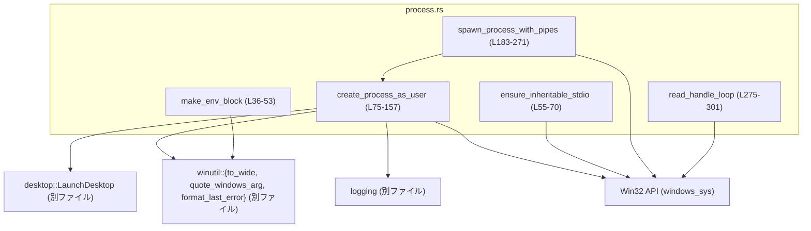
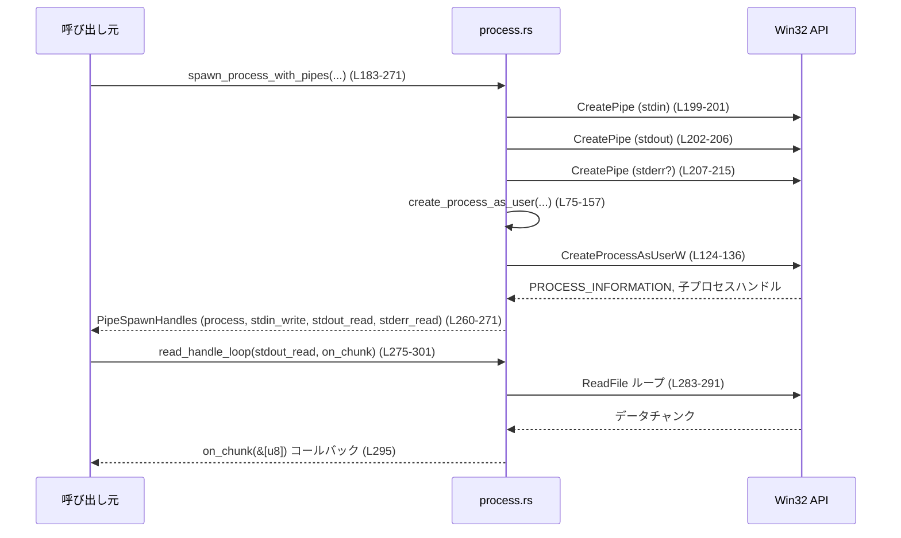

# windows-sandbox-rs/src/process.rs

## 0. ざっくり一言

Windows の `CreateProcessAsUserW` を直接呼び出して、任意ユーザーのプロセスを起動し、その標準入出力を匿名パイプや既存のハンドルに接続するためのラッパーモジュールです（`windows-sandbox-rs/src/process.rs:L30-301`）。

---

## 1. このモジュールの役割

### 1.1 概要

このモジュールは **Windows サンドボックス内で子プロセスを安全に起動・制御する** ための機能を提供します（`windows-sandbox-rs/src/process.rs:L30-301`）。

- 指定した環境変数マップから Windows 形式の UNICODE 環境ブロックを構築する（`make_env_block`）。
- 指定したトークン（ユーザー）で `CreateProcessAsUserW` を呼び出し、プロセスを起動する（`create_process_as_user`）。
- 匿名パイプを使って標準入出力／標準エラーを親プロセス側に接続する（`spawn_process_with_pipes`）。
- HANDLE から EOF まで読み取り、コールバックにデータを渡し続けるスレッドを生成する（`read_handle_loop`）。

### 1.2 アーキテクチャ内での位置づけ

このモジュールは、Win32 API と他の内部モジュールの間に位置する **薄い FFI ラッパ層** です。

依存関係は次の通りです：

- `crate::desktop::LaunchDesktop`  
  - プロセス起動時に使用するインタラクティブ／プライベート デスクトップを準備する（`create_process_as_user` 内で使用, `L96-97`）。
  - 実装は別ファイルで、このチャンクには現れません。

- `crate::logging`  
  - `CreateProcessAsUserW` 失敗時の詳細ログ出力に使用（`logging::debug_log`, `L139-149`）。
  - 詳細実装はこのチャンクには現れません。

- `crate::winutil::{to_wide, quote_windows_arg, format_last_error}`  
  - `quote_windows_arg`：コマンドライン引数を Windows 形式でクォート（`L84-88`）。
  - `to_wide`：UTF-16（Windows ワイド文字列）への変換（`L89-90, L121-122, L46`）。
  - `format_last_error`：Win32 エラーコードを人間可読な文字列に変換（`L139-143`）。
  - いずれも別ファイルで、このチャンクには定義が現れません。

- `windows_sys`  
  - Win32 API 群（`CreateProcessAsUserW`, `CreatePipe`, `ReadFile`, `GetStdHandle`, `CloseHandle` など）。

依存関係の概要（関数名に行範囲を明示）：



### 1.3 設計上のポイント

コードから読み取れる設計上の特徴を挙げます：

- **責務の分割**（`L30-301`）
  - プロセス起動（`create_process_as_user`）とパイプセットアップ（`spawn_process_with_pipes`）を分離。
  - 標準入出力の読み出しは別関数（`read_handle_loop`）に切り出し、スレッド単位で扱う。

- **状態管理**
  - `CreatedProcess` / `PipeSpawnHandles` で、プロセスと関連ハンドルのまとまりを表現（`L30-34, L175-179`）。
  - `CreatedProcess` は `_desktop: LaunchDesktop` を保持し、デスクトップオブジェクトの寿命をプロセスと結び付けていると解釈できます（RAII パターン）。ただし `LaunchDesktop` の実装はこのファイルにはありません（`L30-33, L96-97`）。

- **エラーハンドリング**
  - Rust 側の返り値は `anyhow::Result` で統一（`L75, L183, L55`）。
  - Win32 API 失敗時は `GetLastError` を取得し、`anyhow!` でエラーを生成（例：`L55-63, L199-215, L124-151`）。
  - プロセス起動失敗時のみ、追加でログ出力（`logging::debug_log`, `L139-150`）。

- **安全性と `unsafe` の扱い**
  - Win32 API 呼び出しやハンドル操作は `unsafe fn` または `unsafe` ブロックに閉じ込め（`L55-70, L75-157, L198-215, L223-231, L279-299`）、外側からは安全な API（`spawn_process_with_pipes`, `read_handle_loop` など）として提供。
  - `create_process_as_user` は `unsafe fn` として公開し、呼び出し側にトークンや引数ライフタイムの責任を明示（`L72-83`）。

- **ハンドル管理**
  - 成功・失敗パスともに `CloseHandle` を用いてパイプハンドルのリークを防ぐロジックが組まれている（`L199-215, L236-259, L297-298`）。
  - 子プロセス側に渡すハンドルと、親側で保持・返却するハンドルを明確に整理（`L192-221, L260-271`）。

---

## 2. 主要な機能一覧

このモジュールが提供する主な機能は次の通りです（関数行範囲は括弧内）。

- 環境ブロック構築: `make_env_block` – `HashMap<String, String>` から Windows UNICODE 環境ブロック (`Vec<u16>`) を作る（`L36-53`）。
- 標準入出力継承設定: `ensure_inheritable_stdio` – 親プロセスの標準入出力ハンドルを継承可能にする内部ヘルパー（`L55-70`）。
- プロセス生成（トークン指定）: `create_process_as_user` – 指定トークンと環境で `CreateProcessAsUserW` を呼ぶ unsafe 公開関数（`L75-157`）。
- パイプ付きプロセス生成: `spawn_process_with_pipes` – 匿名パイプで子プロセスの stdin/stdout/stderr を接続し、ハンドルを返す安全なラッパー（`L183-271`）。
- パイプ読み取りスレッド: `read_handle_loop` – HANDLE から EOF まで読み取り、コールバックにチャンクを渡すスレッドを生成（`L275-301`）。
- 標準入力モード指定: `StdinMode` – 子の stdin を開いたままにするか即座に閉じるかを指定（`L159-164`）。
- 標準エラーモード指定: `StderrMode` – stderr を stdout と統合するか、別パイプにするかを指定（`L166-171`）。
- 結果ハンドル集約: `CreatedProcess` / `PipeSpawnHandles` – 起動したプロセスと関連ハンドルをまとめる構造体（`L30-34, L173-179`）。

---

## 3. 公開 API と詳細解説

### 3.1 型一覧（構造体・列挙体など）／コンポーネントインベントリー（型）

| 名前 | 種別 | 公開 | 行範囲 | 役割 / 用途 |
|------|------|------|--------|-------------|
| `CreatedProcess` | 構造体 | 公開 (`pub`) | `windows-sandbox-rs/src/process.rs:L30-34` | `CreateProcessAsUserW` で起動したプロセスの `PROCESS_INFORMATION` と `STARTUPINFOW`、およびデスクトップ管理用 `LaunchDesktop` を保持する。 |
| `StdinMode` | enum | 公開 | `L159-164` | 子プロセスの標準入力パイプを開いたままにするか（`Open`）、即時に閉じるか（`Closed`）を指定。 |
| `StderrMode` | enum | 公開 | `L166-171` | 子プロセスの標準エラー出力を stdout と同じパイプにマージするか（`MergeStdout`）、別パイプに分けるか（`Separate`）を指定。 |
| `PipeSpawnHandles` | 構造体 | 公開 | `L173-179` | `spawn_process_with_pipes` が返すプロセス情報と stdin 書き込み／stdout 読み取り／stderr 読み取りハンドルを保持。 |

※ `LaunchDesktop`, `logging`, `winutil` は他ファイル定義で、このチャンクには現れません。

### 3.1.2 コンポーネントインベントリー（関数）

| 関数名 | 公開 | 行範囲 | 役割（1行） |
|--------|------|--------|-------------|
| `make_env_block` | `pub` | `L36-53` | 環境変数マップを Windows 用 UNICODE 環境ブロック（ダブルヌル終端）に変換する。 |
| `ensure_inheritable_stdio` | 非公開 (`unsafe fn`) | `L55-70` | 親プロセスの標準入出力ハンドルを継承可能に設定し、`STARTUPINFOW` にセットするヘルパー。 |
| `create_process_as_user` | `pub unsafe fn` | `L75-157` | トークン・環境・カレントディレクトリ・標準入出力設定を指定して `CreateProcessAsUserW` を呼び出す。 |
| `spawn_process_with_pipes` | `pub fn` | `L183-271` | 匿名パイプを生成し、それらを子プロセスの標準入出力／標準エラーに接続してプロセスを起動する高レベル API。 |
| `read_handle_loop` | `pub fn` | `L274-301` | HANDLE から同期的に読み取り続けるスレッドを生成し、読み取ったデータをコールバックに渡す。 |

---

### 3.2 関数詳細（テンプレート適用）

#### `make_env_block(env: &HashMap<String, String>) -> Vec<u16>`  

（`windows-sandbox-rs/src/process.rs:L36-53`）

**概要**

- `HashMap<String, String>` 形式の環境変数を、Windows の `CreateProcess*` 系 API が要求する **ソート済み UNICODE 環境ブロック**（各エントリ `KEY=VALUE\0`、最後は追加の `\0`）に変換します。

**引数**

| 引数名 | 型 | 説明 |
|--------|----|------|
| `env` | `&HashMap<String, String>` | 環境変数名と値のマップ。UTF-8 文字列が前提です。 |

**戻り値**

- `Vec<u16>`  
  - UTF-16 コード単位の配列。各エントリは `KEY=VALUE\0` で区切られ、最後にさらに `\0` が追加されたダブルヌル終端形式（`L44-52`）。

**内部処理の流れ**

1. `env` を `(key, value)` の `Vec` にコピー（`L37-38`）。
2. キーを
   - 大文字化したキーでソートし（`to_uppercase`）、  
   - それでも同じ場合は元のキーでソート（`L39-43`）。  
   これは Windows の環境ブロックの仕様に合わせたものと解釈できます。
3. 出力ベクタ `w: Vec<u16>` を用意（`L44`）。
4. 各 `(k, v)` に対し `"k=v"` という文字列を作り `to_wide` で UTF-16 に変換（`L45-47`）。
5. `to_wide` が末尾に付けたヌル終端を `pop` で取り除き（`L47`）、自身で `0` を 1 つ追加してエントリ終端とする（`L48-49`）。
6. 最後にさらに `0` を 1 つ追加し、環境ブロック全体の終端（ダブルヌル）とする（`L51`）。

**Examples（使用例）**

```rust
use std::collections::HashMap;
use windows_sandbox_rs::process::make_env_block;

fn build_env_block_example() {
    let mut env = HashMap::new();                          // 環境変数マップを作成
    env.insert("PATH".to_string(), "C:\\Windows".to_string());
    env.insert("FOO".to_string(), "BAR".to_string());

    let block: Vec<u16> = make_env_block(&env);           // UNICODE 環境ブロックを生成

    // block を CreateProcess* 系 API の lpEnvironment に渡して利用する想定
}
```

**Errors / Panics**

- この関数内で `Result` は使用されておらず、明示的にエラーを返しません（`L36-53`）。
- パニックが起きうる操作も見当たりません（通常の `Vec` 操作と文字列操作のみ）。

**Edge cases（エッジケース）**

- 環境変数が空 (`env.is_empty()`) の場合  
  - `w` には `w.push(0)` が 1 回だけ呼ばれ、結果は `vec![0]`（ダブルヌルのうち終端のみ）となります（`L51`）。
- キーや値に `=` が含まれる場合  
  - `"k=v"` の単純連結を行っているため、`KEY=VALUE` の形式内にさらに `=` が現れます（`L46`）。  
    これは Windows 環境変数名の仕様上、通常は発生しない想定ですが、本コードでは検証していません。
- Unicode 文字  
  - `to_wide` に任せています。`to_wide` の挙動は別ファイルで、このチャンクには定義がありません。

**使用上の注意点**

- Windows の仕様では環境ブロックはソート済みであることが推奨されており、本関数はその前提に従っています（`L39-43`）。
- `env` の内容は UTF-8 文字列である必要があります（`to_wide` の仕様に依存）。

---

#### `unsafe fn ensure_inheritable_stdio(si: &mut STARTUPINFOW) -> Result<()>`  

（`windows-sandbox-rs/src/process.rs:L55-70`）

**概要**

- 親プロセスの標準入力／標準出力／標準エラーのハンドルを取得し、それらを「子プロセスが継承できる」ようにし、`STARTUPINFOW` に設定します。

**引数**

| 引数名 | 型 | 説明 |
|--------|----|------|
| `si` | `&mut STARTUPINFOW` | 子プロセス起動時に渡す `STARTUPINFOW` 構造体。標準ハンドル関連フィールドが上書きされます。 |

**戻り値**

- `Result<()>`（`anyhow::Result`）
  - 全ての標準ハンドルの取得と `SetHandleInformation` に成功すれば `Ok(())`。
  - いずれかが失敗した場合、`GetLastError()` を含む `anyhow!` で `Err` を返します（`L59-63`）。

**内部処理の流れ**

1. `[STD_INPUT_HANDLE, STD_OUTPUT_HANDLE, STD_ERROR_HANDLE]` をループ（`L55-56`）。
2. `GetStdHandle` で各標準ハンドルを取得（`L57`）。
   - 0 または `INVALID_HANDLE_VALUE` ならエラーとして `Err(anyhow!(...))` を返す（`L58-60`）。
3. `SetHandleInformation(h, HANDLE_FLAG_INHERIT, HANDLE_FLAG_INHERIT)` により、ハンドルを継承可能に設定（`L61-62`）。
4. ループ終了後、`si.dwFlags` に `STARTF_USESTDHANDLES` を OR し、標準ハンドルが使用されることを示す（`L65`）。
5. `si.hStdInput` / `hStdOutput` / `hStdError` に取得した標準ハンドルをセット（`L66-68`）。

**Examples（使用例）**

通常は直接呼ぶのではなく、`create_process_as_user` が内部で標準ハンドル未指定時に呼び出します（`L116-118`）。

明示的に使う場合のイメージ：

```rust
use windows_sys::Win32::System::Threading::STARTUPINFOW;
use windows_sandbox_rs::process::ensure_inheritable_stdio; // 実際には非公開関数なので別モジュールからは呼べません

unsafe fn prepare_startupinfo() -> anyhow::Result<STARTUPINFOW> {
    let mut si: STARTUPINFOW = std::mem::zeroed();         // STARTUPINFOW をゼロ初期化
    si.cb = std::mem::size_of::<STARTUPINFOW>() as u32;

    ensure_inheritable_stdio(&mut si)?;                    // 標準ハンドルを継承可能にセット
    Ok(si)
}
```

※ 実際には `ensure_inheritable_stdio` は非公開のため、モジュール外からは利用できません。

**Errors / Panics**

- `GetStdHandle` が失敗した場合：  
  `Err(anyhow!("GetStdHandle failed: {}", GetLastError()))` を返します（`L59-60`）。
- `SetHandleInformation` が失敗した場合：  
  `Err(anyhow!("SetHandleInformation failed: {}", GetLastError()))` を返します（`L61-63`）。

**Edge cases**

- 標準ハンドルが無効（リダイレクトされた環境など）な場合  
  - 0 または `INVALID_HANDLE_VALUE` で検出され、エラーになります（`L58-60`）。

**使用上の注意点**

- `unsafe fn` であり、呼び出し側は `STARTUPINFOW` の有効性と、呼び出し環境が Windows であることを保証する必要があります。
- この関数は親プロセスの標準ハンドルを前提としているため、コンソール無しプロセスなどで呼ぶとエラーになる可能性があります。

---

#### `pub unsafe fn create_process_as_user(...) -> Result<CreatedProcess>`  

（`windows-sandbox-rs/src/process.rs:L75-157`）

**シグネチャ（簡略）**

```rust
pub unsafe fn create_process_as_user(
    h_token: HANDLE,
    argv: &[String],
    cwd: &Path,
    env_map: &HashMap<String, String>,
    logs_base_dir: Option<&Path>,
    stdio: Option<(HANDLE, HANDLE, HANDLE)>,
    use_private_desktop: bool,
) -> Result<CreatedProcess>
```

**概要**

- 指定したユーザートークン `h_token` の権限で、`CreateProcessAsUserW` を用いて新しいプロセスを起動します。
- コマンドライン、カレントディレクトリ、環境変数ブロック、標準入出力ハンドル、デスクトップ（通常／プライベート）を細かく制御できます。

**引数**

| 引数名 | 型 | 説明 |
|--------|----|------|
| `h_token` | `HANDLE` | 有効な「プライマリトークン」ハンドル。呼び出し側が取得・管理します（`L76`）。 |
| `argv` | `&[String]` | コマンドライン引数配列。最初の要素に実行ファイルパスを含める想定（`L77, L84-88`）。 |
| `cwd` | `&Path` | 子プロセスのカレントディレクトリ（`L78, L121-123`）。 |
| `env_map` | `&HashMap<String, String>` | 子プロセスの環境変数（`L79, L90-91`）。 |
| `logs_base_dir` | `Option<&Path>` | 失敗時のデバッグログ出力先ディレクトリ。`None` ならログ出力は実装依存（`L80, L139-149`）。 |
| `stdio` | `Option<(HANDLE, HANDLE, HANDLE)>` | `(stdin, stdout, stderr)` として子プロセスに渡すハンドル。`None` なら呼び出し元の標準ハンドルを継承（`L81, L100-120`）。 |
| `use_private_desktop` | `bool` | プライベートデスクトップを使うかどうか（`L82, L96`）。 |

**戻り値**

- `Result<CreatedProcess>`  
  - 成功時：`CreatedProcess { process_info, startup_info, _desktop }` を返します（`L152-156`）。
  - 失敗時：`anyhow!("CreateProcessAsUserW failed: {err}")` を返します（`L138-151`）。

**内部処理の流れ**

1. `argv` を Windows 形式のコマンドライン文字列に変換（`quote_windows_arg` を利用、`L84-88`）。
2. コマンドライン文字列を UTF-16 (`Vec<u16>`) に変換（`to_wide`, `L89`）。
3. `env_map` から UNICODE 環境ブロックを生成（`make_env_block`, `L90`）。
4. `STARTUPINFOW` と `PROCESS_INFORMATION` を `zeroed` で初期化し、`si.cb` にサイズを設定（`L91-92, L98`）。
5. `LaunchDesktop::prepare` を呼び出し、起動用デスクトップを準備（`use_private_desktop` と `logs_base_dir` を渡す, `L96`）。  
   - 呼び出し結果 `desktop` から `lpDesktop` 用のポインタを取得して `si` にセット（`L97`）。
6. 標準入出力ハンドル設定（`L99-120`）：
   - `Some((stdin_h, stdout_h, stderr_h))` が指定されていれば：
     - `si.dwFlags |= STARTF_USESTDHANDLES`（`L102`）。
     - `si.hStdInput/Output/Error` に指定ハンドルを設定（`L103-105`）。
     - 各ハンドルに対して `SetHandleInformation(...HANDLE_FLAG_INHERIT...)` を呼び、継承可能に設定（`L106-113`）。
   - `None` なら `ensure_inheritable_stdio(&mut si)?` を呼び出し、親プロセスの標準ハンドルを継承可能にする（`L116-118`）。
7. `CREATE_UNICODE_ENVIRONMENT` フラグを設定（`L121`）。
8. `cwd` を UTF-16 に変換し（`L121-123`）、環境ブロック長を保持（ログ用, `L123`）。
9. `CreateProcessAsUserW` を `unsafe` で呼び出し（`L124-136`）。
10. 失敗 (`ok == 0`) の場合：
    - `GetLastError` を取得（`L138`）。
    - 詳細メッセージを構築し、`logging::debug_log` でログ出力（`L139-149`）。
    - `Err(anyhow!(...))` を返す（`L150-151`）。
11. 成功 (`ok != 0`) の場合：
    - `CreatedProcess` 構造体に `pi`, `si`, `desktop` を詰めて返す（`L152-156`）。

**Examples（使用例）**

```rust
use std::collections::HashMap;
use std::path::Path;
use windows_sys::Win32::Foundation::HANDLE;
use windows_sandbox_rs::process::create_process_as_user;

// h_token の取得方法はこのファイルには書かれていないため、ここでは既に有効な HANDLE があると仮定します。
unsafe fn spawn_example(h_token: HANDLE) -> anyhow::Result<()> {
    let argv = vec![
        "C:\\Windows\\System32\\cmd.exe".to_string(),     // 実行ファイル
        "/C".to_string(),
        "echo hello".to_string(),
    ];

    let cwd = Path::new("C:\\");                         // 子プロセスのカレントディレクトリ

    let mut env = HashMap::new();
    env.insert("FOO".into(), "BAR".into());             // 環境変数

    let created = create_process_as_user(
        h_token,
        &argv,
        cwd,
        &env,
        None,                                           // ログディレクトリ指定なし
        None,                                           // 親の標準ハンドルを継承
        false,                                          // 既存デスクトップ上で起動
    )?;

    // created.process_info からプロセス/スレッド HANDLE を取得して Wait するなどの処理を行う想定です。
    Ok(())
}
```

**安全性 (`unsafe` の理由)**

コメントでも明記されている通り（`L72-74`）：

- `h_token` は有効なプライマリトークンである必要があります。
- `argv`, `cwd`, `env_map` から作られたデータ（`cmdline`, `env_block`, `cwd_wide`）は `CreateProcessAsUserW` 呼び出し中有効ですが、関数内で完結しているため、外側から見たライフタイム上の危険は主に `HANDLE` の妥当性にあります。
- `stdio` に渡したハンドルは、`SetHandleInformation` により継承フラグが付与されるため、ハンドル所有権とクローズタイミングに注意が必要です（`L100-114`）。

**Errors / Panics**

- Win32 API に起因するエラー：
  - コマンドラインの組み立てや UTF-16 変換自体ではエラーを返していません。
  - `LaunchDesktop::prepare` が `Result` を返し、失敗時にはそのまま伝播します（`?`, `L96`）。
  - 標準ハンドル設定で `SetHandleInformation` が失敗した場合は `Err(anyhow!(...))`（`L106-113`）。
  - `CreateProcessAsUserW` が 0 を返した場合は `Err(anyhow!("CreateProcessAsUserW failed: {err}"))`（`L137-151`）。
- パニック：
  - 明示的な `panic!` はなく、通常は発生しません。

**Edge cases**

- `argv` が空の場合
  - コード上はエラーにしていません（`L84-89`）。空文字列のコマンドラインで `CreateProcessAsUserW` を呼ぶことになり、Win32 側で失敗する可能性があります。この挙動はこのファイルからは分かりません。
- `env_map` が空の場合
  - `make_env_block` によるブロックは `0` のみとなり（`L36-53`）、これは「空の環境」として扱われます。
- `logs_base_dir` が `Some` の場合
  - 失敗時にのみ `logging::debug_log` に渡されます（`L139-149`）。成功時には特別なログは出しません。

**使用上の注意点**

- この関数は `unsafe` であるため、呼び出し側は：
  - `h_token` の有効性（クローズされていないか / プライマリトークンか / 十分な権限があるか）、
  - 渡すハンドルが子プロセスに継承されても問題ないか、
  - セキュリティコンテキストが期待通りであるか  
  を保証する必要があります。
- 戻り値 `CreatedProcess.process_info` に含まれるプロセス／スレッドハンドルは、**このモジュールではクローズしていない** ため、呼び出し側で適切に `CloseHandle` する必要があります。

---

#### `pub fn spawn_process_with_pipes(...) -> Result<PipeSpawnHandles>`  

（`windows-sandbox-rs/src/process.rs:L183-271`）

**概要**

- 子プロセスの標準入出力（および必要に応じて標準エラー）を **匿名パイプ** 経由で親プロセスに接続し、そのためのハンドルセットを返します。
- 上位レベルの安全な API であり、`create_process_as_user` を内部で呼びます。

**シグネチャ（簡略）**

```rust
pub fn spawn_process_with_pipes(
    h_token: HANDLE,
    argv: &[String],
    cwd: &Path,
    env_map: &HashMap<String, String>,
    stdin_mode: StdinMode,
    stderr_mode: StderrMode,
    use_private_desktop: bool,
) -> Result<PipeSpawnHandles>
```

**引数**

| 引数名 | 型 | 説明 |
|--------|----|------|
| `h_token` | `HANDLE` | 子プロセスに使用するユーザートークン（`L184`）。 |
| `argv` | `&[String]` | 実行ファイルと引数リスト（`L185`）。 |
| `cwd` | `&Path` | 子プロセスのカレントディレクトリ（`L186`）。 |
| `env_map` | `&HashMap<String, String>` | 子プロセスの環境変数（`L187`）。 |
| `stdin_mode` | `StdinMode` | 親からの stdin 書き込みを可否設定（`L188`）。 |
| `stderr_mode` | `StderrMode` | stderr を stdout と統合するか別パイプにするか（`L189`）。 |
| `use_private_desktop` | `bool` | プライベートデスクトップ使用有無（`L190`）。 |

**戻り値**

- `Result<PipeSpawnHandles>`（`L260-271`）
  - 成功時：
    - `process`: `PROCESS_INFORMATION`（作成されたプロセス・スレッドのハンドルなど）。
    - `stdin_write`: `Option<HANDLE>` – `StdinMode::Open` の場合に親が書き込むためのハンドル。
    - `stdout_read`: `HANDLE` – 親が標準出力を読み取るためのハンドル。
    - `stderr_read`: `Option<HANDLE>` – `StderrMode::Separate` の場合に親が標準エラーを読むためのハンドル。
  - 失敗時：パイプ作成やプロセス作成に失敗した理由を含む `anyhow::Error`。

**内部処理の流れ**

1. パイプハンドルの変数を 0 で初期化（`L192-197`）。
2. `CreatePipe` で stdin 用パイプ `in_r`, `in_w` を作成（親が書くのは `in_w`、子が読むのは `in_r`, `L199-201`）。
   - 失敗時、エラーを返す（`L199-201`）。
3. stdout 用パイプ `out_r`, `out_w` を作成（`L202-205`）。
   - 失敗時、stdin 用パイプをクローズしてエラーを返す（`L202-205`）。
4. `stderr_mode` が `Separate` の場合のみ、stderr 用パイプ `err_r`, `err_w` を作成（`L207-215`）。
   - 失敗時、これまでのパイプを全てクローズしてエラーを返す（`L210-215`）。
5. 子プロセスに渡す `stderr_handle` を決定（`L217-220`）：
   - `MergeStdout` → `out_w`（stdout と同じパイプ）。
   - `Separate` → `err_w`。
6. 子プロセス側標準ハンドルとして `(in_r, out_w, stderr_handle)` を束ね、`stdio` として `create_process_as_user` を呼び出す（`L221-231`）。
7. `create_process_as_user` がエラーを返した場合：
   - すべてのパイプハンドルをクローズしてからエラーをそのまま返す（`L233-247`）。
8. 成功した場合：
   - `created.process_info` を取得（`L249`）。
   - 子プロセスに渡した側のハンドル（`in_r`, `out_w`, `err_w`）をクローズ（`L250-255`）。
   - `stdin_mode` に応じて、親側の書き込みハンドル `in_w` を残すかクローズする（`L256-258`）。
9. 最終的に `PipeSpawnHandles` を構築して返す（`L260-271`）。

**Examples（使用例）**

```rust
use std::collections::HashMap;
use std::path::Path;
use windows_sys::Win32::Foundation::HANDLE;
use windows_sandbox_rs::process::{
    spawn_process_with_pipes, StdinMode, StderrMode, read_handle_loop,
};

unsafe fn spawn_with_pipes_example(h_token: HANDLE) -> anyhow::Result<()> {
    let argv = vec![
        "C:\\Windows\\System32\\cmd.exe".to_string(),
        "/C".to_string(),
        "dir".to_string(),
    ];
    let cwd = Path::new("C:\\");
    let env = HashMap::new();

    let handles = spawn_process_with_pipes(
        h_token,
        &argv,
        cwd,
        &env,
        StdinMode::Closed,                // 親からの入力は不要
        StderrMode::MergeStdout,          // stderr も stdout にマージ
        false,
    )?;

    // stdout を別スレッドで読み取る
    let stdout_thread = read_handle_loop(handles.stdout_read, |chunk| {
        // chunk は UTF-8 とは限らないのでエンコーディングに注意
        println!("child stdout: {} bytes", chunk.len());
    });

    // プロセスの終了待ちなどを行う想定
    stdout_thread.join().ok();

    // handles.stdin_write は Closed なので None
    Ok(())
}
```

**Errors / Panics**

- `CreatePipe` 失敗時（`L199-201, L202-206, L207-215`）：
  - その時点までに作成済みのハンドルをすべてクローズし、`Err(anyhow!("CreatePipe ... failed: {}", GetLastError()))` を返します。
- `create_process_as_user` がエラーを返した場合：
  - 全パイプハンドルをクローズ後、そのエラーをそのまま返します（`L233-247`）。
- パニック：
  - この関数自体はパニックを起こしません。

**Edge cases**

- `stdin_mode == StdinMode::Closed` の場合（`L256-258`）：
  - 親側の `in_w` を即座にクローズするため、子プロセスの標準入力はすぐに EOF になります。
- `stderr_mode == StderrMode::MergeStdout` の場合（`L217-219, L267-270`）：
  - `stderr_read` は `None` が返り、標準エラー出力は stdout 側のパイプのみから受け取ることになります。

**使用上の注意点**

- 戻り値の `stdin_write` / `stdout_read` / `stderr_read` は **生の `HANDLE`** であり、自動的にはクローズされません。
  - `stdout_read` / `stderr_read` は通常 `read_handle_loop` に渡すと、そのスレッド終了時に `CloseHandle` されます（`L297-298`）。
  - `stdin_write` は明示的に `CloseHandle` する必要があります（このファイル内に専用のヘルパーはありません）。
- `h_token` や `argv` などに関する安全性・権限は `create_process_as_user` の注意点と同じです。

---

#### `pub fn read_handle_loop<F>(handle: HANDLE, on_chunk: F) -> JoinHandle<()>`  

（`windows-sandbox-rs/src/process.rs:L274-301`）

**概要**

- 指定された `HANDLE` から EOF まで繰り返し `ReadFile` を実行し、読み取ったデータをコールバック `on_chunk` に渡す **専用スレッド** を生成します。
- 読み取り終了後、その `HANDLE` を `CloseHandle` します。

**引数**

| 引数名 | 型 | 説明 |
|--------|----|------|
| `handle` | `HANDLE` | 読み取り対象の Win32 ハンドル（通常はパイプの読み取り側）。（`L275`） |
| `on_chunk` | `F` | `FnMut(&[u8]) + Send + 'static` を満たすコールバック（`L276-277`）。 |

**戻り値**

- `std::thread::JoinHandle<()>`（`L275, L279-300`）  
  - バックグラウンドで `ReadFile` を実行するスレッドのハンドル。

**内部処理の流れ**

1. `std::thread::spawn` で新しいスレッドを生成（`L279`）。
2. スレッド内で 8192 バイトの固定バッファを確保（`L280`）。
3. ループ内で `ReadFile` を呼び出し（`L283-291`）：
   - `read_bytes` に実際の読み取りバイト数が書き込まれる。
   - `ok == 0` または `read_bytes == 0`（EOF / エラー）ならループ終了（`L292-293`）。
4. 正常に読み取れた場合、`buf[..read_bytes as usize]` をスライスとして `on_chunk` に渡す（`L295`）。
5. ループ終了後、`CloseHandle(handle)` でハンドルをクローズ（`L297-298`）。

**Examples（使用例）**

上記 `spawn_process_with_pipes` の例のように、パイプの読み取り側ハンドルに対して用います（`L260-271` と組み合わせ）。

```rust
use windows_sys::Win32::Foundation::HANDLE;
use windows_sandbox_rs::process::read_handle_loop;

fn read_pipe_example(handle: HANDLE) {
    let t = read_handle_loop(handle, |chunk: &[u8]| {
        // ここでチャンクをログに書き出したり、バッファに蓄積したりできる
        eprintln!("got {} bytes", chunk.len());
    });
    // t.join().unwrap(); などでスレッドが終了するのを待つ
}
```

**Errors / Panics**

- `ReadFile` の失敗検出方法
  - `ok == 0` を「失敗または EOF」と見なしてループを抜けています（`L292`）。
  - 失敗と EOF を区別して処理するロジックはありません。
- パニック
  - `on_chunk` 内でパニックが起これば、スレッドはそのままパニック終了します（ラップしていません）。

**Edge cases**

- `handle` が書き込み側 (`PIPE_WRITE` 側) の場合
  - `ReadFile` の挙動は未定義（通常はエラー）であり、すぐにループを抜けて `CloseHandle` されます。
- 読み取りデータが 8192 バイトを超える場合
  - チャンクサイズごとに複数回 `on_chunk` が呼ばれます（`L280-281`）。

**使用上の注意点**

- `on_chunk` は `Send + 'static` 制約があるため、スタック上の借用参照を捕捉することはできません。
  - 所有権を持つ値（`Arc<Mutex<...>>` など）をクローズオーバする形になります。
- ハンドルはスレッド内でクローズされるため、呼び出し側は同じ `HANDLE` を他で使い回すべきではありません。

---

### 3.3 その他の関数

このファイルには、上記以外のヘルパー関数はありません（`windows-sandbox-rs/src/process.rs:L30-301`）。

---

## 4. データフロー

典型的なシナリオ：**パイプ付きで子プロセスを起動し、その標準出力を非同期に読み取る**。

### 処理の要点

1. 呼び出し元が `spawn_process_with_pipes` を呼び出す（`L183-271`）。
2. `spawn_process_with_pipes` が `CreatePipe` でパイプを作成し、`create_process_as_user` を呼んで子プロセスを起動する（`L199-215, L223-231`）。
3. 戻り値 `PipeSpawnHandles.stdout_read` を `read_handle_loop` に渡して専用スレッドで読み取る（`L260-271, L275-301`）。

### シーケンス図（行範囲付き）



---

## 5. 使い方（How to Use）

### 5.1 基本的な使用方法

**目的**：指定トークンで子プロセスを起動し、標準出力を読み取る。

```rust
use std::collections::HashMap;
use std::path::Path;
use windows_sys::Win32::Foundation::{HANDLE, CloseHandle};
use windows_sandbox_rs::process::{
    spawn_process_with_pipes, read_handle_loop, StdinMode, StderrMode,
};

// h_token の取得はこのファイルにはないため、外部で準備されていると仮定します。
unsafe fn run_child_and_capture_output(h_token: HANDLE) -> anyhow::Result<()> {
    let argv = vec![
        "C:\\Windows\\System32\\cmd.exe".to_string(),
        "/C".to_string(),
        "echo hello".to_string(),
    ];
    let cwd = Path::new("C:\\");
    let env = HashMap::new();

    let handles = spawn_process_with_pipes(
        h_token,
        &argv,
        cwd,
        &env,
        StdinMode::Closed,            // 入力は不要
        StderrMode::MergeStdout,      // stderr も stdout に統合
        false,
    )?;

    // stdout を別スレッドで読み取る
    let t = read_handle_loop(handles.stdout_read, |chunk| {
        // 実際にはエンコーディング変換などが必要です
        println!("child wrote {} bytes", chunk.len());
    });

    // TODO: handles.process.process_handle を Wait し、CloseHandle するなどの処理を行う
    // SAFETY: PROCESS_INFORMATION 内のハンドルも呼び出し側で CloseHandle する必要がある
    unsafe {
        CloseHandle(handles.process.hProcess);
        CloseHandle(handles.process.hThread);
    }

    t.join().ok();
    Ok(())
}
```

### 5.2 よくある使用パターン

1. **標準入力を開いたまま、インタラクティブな子プロセスを起動**

```rust
let handles = spawn_process_with_pipes(
    h_token,
    &argv,
    cwd,
    &env,
    StdinMode::Open,                // stdin_write が Some(HANDLE) で返る
    StderrMode::Separate,           // stderr は別パイプ
    false,
)?;

// handles.stdin_write に対して WriteFile で入力を送信する設計が想定されます。
// stdout_read / stderr_read は read_handle_loop で別スレッド読み取り。
```

1. **ログ専用プロセスとして stderr を stdout にマージ**

```rust
let handles = spawn_process_with_pipes(
    h_token,
    &argv,
    cwd,
    &env,
    StdinMode::Closed,
    StderrMode::MergeStdout,        // stderr_read は None
    true,                           // プライベートデスクトップ上で起動
)?;

// stdout_read のみ read_handle_loop で読み取れば、stdout + stderr がまとめて取得できます。
```

### 5.3 よくある間違い

```rust
// 間違い例: stdout_read を自前で CloseHandle したあとに read_handle_loop に渡す
// これでは ReadFile が即失敗し、データが読めない。
unsafe {
    // Windows API で CloseHandle(stdout_read);
}
let t = read_handle_loop(handles.stdout_read, |chunk| {
    // ここはほとんど呼ばれないか、0 バイトで即終了する
});

// 正しい例: CloseHandle は read_handle_loop に任せる
let t = read_handle_loop(handles.stdout_read, |chunk| {
    // 正常にデータを受け取れる
});
// スレッド終了後に JoinHandle を捨てれば良い
```

```rust
// 間違い例: stdin_mode::Open で stdin_write を Close し忘れて子プロセスが EOF を受け取れない
let handles = spawn_process_with_pipes(
    h_token,
    &argv,
    cwd,
    &env,
    StdinMode::Open,
    StderrMode::MergeStdout,
    false,
)?;

// ... 子プロセスへの入力をすべて書き終わった後 ...
// CloseHandle(handles.stdin_write.unwrap()); を呼ばないと、子プロセス側は EOF を検知できない。
```

### 5.4 使用上の注意点（まとめ）

**ハンドルと所有権**

- `spawn_process_with_pipes` で生成されたハンドルのうち、
  - 子プロセス側に渡したもの（`in_r`, `out_w`, `err_w`）は関数内でクローズしています（`L250-255`）。
  - 親側で使うもの（`stdin_write`, `stdout_read`, `stderr_read`）は呼び出し側の責任でクローズする必要があります（`L260-271`）。
  - `read_handle_loop` に渡した `HANDLE` はスレッド終了時にクローズされます（`L297-298`）。

**並行性（スレッド安全性）**

- `read_handle_loop` は新たに OS スレッドを生成し、ブロッキング I/O (`ReadFile`) を実行します（`L279-291`）。
  - 多数の子プロセスを並列に起動する場合、パイプ 1 本ごとにスレッド 1 本が増えるため、スレッド数に注意が必要です。
- コールバック `on_chunk` 内でロックや重い処理をすると、パイプ読み取りスループットに影響します。

**エラーとロギング**

- パイプ作成やハンドル継承の失敗は `Result` で即座に返されますが、ログ出力されるのは `CreateProcessAsUserW` 失敗時のみです（`L139-149`）。
- 詳細なトラブルシュートが必要な場合は、`logging::debug_log` の実装側でログレベルや出力先を調整する必要があります（このファイルには実装が現れません）。

**セキュリティ上の注意**

- `h_token` の権限次第で高権限プロセスを起動できるため、呼び出し側でトークン取得／管理を慎重に行う必要があります。
- `env_map` によって PATH やその他重要な環境変数を任意に上書きできるため、悪意ある値が混入しないようにする必要があります。
- デスクトップの分離 (`use_private_desktop`) は GUI プロセスの隔離に関わるため、その使用方針はアプリケーション全体設計に依存します（`L96`）。

**テストに関する観点**

- このファイル内に `#[cfg(test)]` などのテストコードは存在しません（`L30-301`）。
- 実際の動作確認は統合テストや実行環境上での動作検証に依存していると考えられますが、詳細はこのチャンクには現れません。

---

## 6. 変更の仕方（How to Modify）

### 6.1 新しい機能を追加する場合

**例：プロセス生成フラグ（例: `CREATE_NEW_CONSOLE`）を追加で指定したい**

1. `create_process_as_user` 内の `creation_flags` 定義を拡張（`L121`）：
   - 現状は `let creation_flags = CREATE_UNICODE_ENVIRONMENT;` のみ。  
   - ここに追加フラグを OR する形で拡張するのが自然です。
2. 新しい挙動を制御するフラグを関数引数に追加するか、別のラッパー関数を作成するかは API 設計次第です。

**例：stdin/stdout/stderr 以外のハンドルを子プロセスに渡したい**

- 現状の設計では、標準ハンドル以外は想定していません（`STARTF_USESTDHANDLES`, `L65, L102`）。
- 拡張方針としては：
  - 別の API で `PROC_THREAD_ATTRIBUTE_HANDLE_LIST` を使う設計にする、または
  - このモジュールとは別のモジュールに責務を分離する  
  といった方向が考えられますが、このファイルからはこれ以上の設計意図は読み取れません。

### 6.2 既存の機能を変更する場合

**影響範囲の確認方法**

- `make_env_block` の仕様（ソート順や文字列形式）を変更する場合：
  - `create_process_as_user` のみがこの関数を使っているため（`L90`）、影響は子プロセスの環境変数の順序と内容に限定されます。
- `StdinMode` / `StderrMode` にバリアントを追加する場合：
  - `spawn_process_with_pipes` 内の `match` 式（`L217-220, L262-269`）も更新する必要があります。

**注意すべき契約**

- `create_process_as_user` の `unsafe` 契約（`L72-74`）は、呼び出し側コードに強く依存しているため、シグネチャ変更や引数意味の変更には特に注意が必要です。
- `read_handle_loop` は与えられた `HANDLE` を必ずクローズする、という契約があります（`L297-298`）。  
  - この挙動を変えると既存コード側で二重クローズやリークが発生する可能性があるため、変更時はグローバルな検索で利用箇所を確認する必要があります。

---

## 7. 関連ファイル

このモジュールと密接に関係するファイルやコンポーネント（このチャンクにシンボル名のみ現れるもの）：

| パス / モジュール | 役割 / 関係 |
|-------------------|------------|
| `crate::desktop::LaunchDesktop` | プライベート／インタラクティブ デスクトップの準備・クリーンアップを行うヘルパーと推測されますが、このファイルには定義がなく詳細は不明です。`create_process_as_user` から呼び出され、`CreatedProcess` 内で寿命管理に使われています（`L30-33, L96-97, L152-156`）。 |
| `crate::logging` | `logging::debug_log` が `CreateProcessAsUserW` 失敗時の詳細ログ出力に使用されています（`L139-149`）。 |
| `crate::winutil::{to_wide, quote_windows_arg, format_last_error}` | コマンドライン引数のクォート（`quote_windows_arg`, `L84-88`）、UTF-16 変換（`to_wide`, `L46, L89, L121-122`）、エラーコードの文字列化（`format_last_error`, `L139-143`）などのユーティリティを提供します。実装はこのチャンクには現れません。 |
| `windows_sys` | Win32 API (`CreateProcessAsUserW`, `CreatePipe`, `ReadFile`, `GetStdHandle`, `CloseHandle`, など) を提供するクレートで、このモジュールのすべての OS レベル処理の基盤となっています（`L12-28, L124-136, L199-215, L283-291, L297-298`）。 |

このファイルは Win32 プロセス生成とパイプ制御の「窓口」として機能しているため、サンドボックス全体のプロセスライフサイクルを理解するうえで中心的なモジュールになっています。
