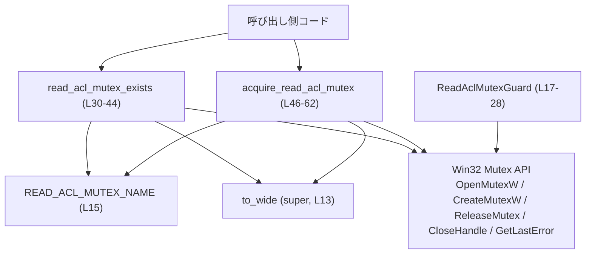
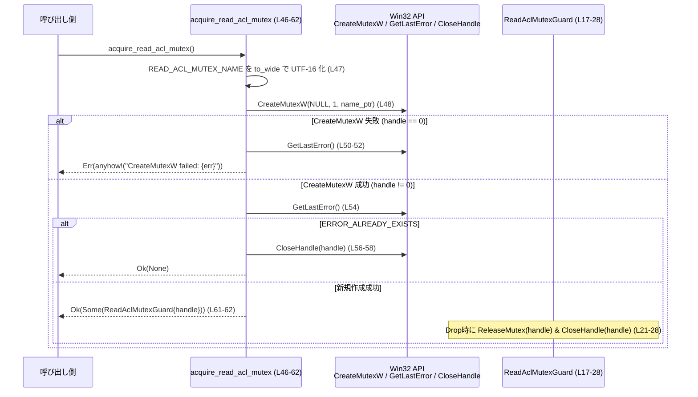

# windows-sandbox-rs/src/read_acl_mutex.rs

## 0. ざっくり一言

`Local\CodexSandboxReadAcl` という名前の **Windows named mutex** の存在確認と「非ブロッキングな取得」を行う、小さなユーティリティモジュールです（`ReadAclMutexGuard` により RAII で解放されます）。

---

## 1. このモジュールの役割

### 1.1 概要

- このモジュールは、Windows の **named mutex（命名付きミューテックス）** を使って、特定名 `Local\CodexSandboxReadAcl` の排他オブジェクトを扱います（`READ_ACL_MUTEX_NAME` 定数）  
  根拠: `windows-sandbox-rs/src/read_acl_mutex.rs:L15`
- 主な機能は:
  - その mutex が現在存在しているかを確認する（`read_acl_mutex_exists`）。
  - その mutex を「新規作成できた場合のみ」取得し、スコープ終了時に自動解放するガードを返す（`acquire_read_acl_mutex` と `ReadAclMutexGuard`）。

### 1.2 アーキテクチャ内での位置づけ

このモジュールは、上位モジュール（`super`）から提供される文字列変換関数 `to_wide` と、Windows API（`OpenMutexW`, `CreateMutexW`, `ReleaseMutex`, `CloseHandle`, `GetLastError`）に依存しています。



- `to_wide` の定義自体はこのチャンクには現れません（`super::to_wide` のみ）。  
  根拠: `windows-sandbox-rs/src/read_acl_mutex.rs:L13`
- `ReadAclMutexGuard` の `Drop` 実装の中で `ReleaseMutex` と `CloseHandle` が呼ばれます。  
  根拠: `windows-sandbox-rs/src/read_acl_mutex.rs:L21-28`

### 1.3 設計上のポイント

- **RAII によるリソース管理**
  - `ReadAclMutexGuard` の `Drop` 実装で `ReleaseMutex` と `CloseHandle` を呼び出し、スコープ終了時に mutex を解放します。  
    根拠: `windows-sandbox-rs/src/read_acl_mutex.rs:L21-28`
- **非ブロッキングな取得**
  - `acquire_read_acl_mutex` は「新規に mutex を作成できた場合のみ」`Some(guard)` を返し、既に存在する場合は `Ok(None)` を返します。待機（WaitForSingleObject 等）は行いません。  
    根拠: `windows-sandbox-rs/src/read_acl_mutex.rs:L46-62`
- **エラー処理**
  - すべての関数は `anyhow::Result` を返し、Windows API のエラーコードを文字列に埋め込んで返します。  
    根拠: `windows-sandbox-rs/src/read_acl_mutex.rs:L1,L38,L50-52`
- **安全な外側 API + 内部 `unsafe`**
  - パブリック関数自体は `unsafe` ではなく、内部でのみ `unsafe` ブロックを用いて Win32 API を呼び出しています。  
    根拠: `windows-sandbox-rs/src/read_acl_mutex.rs:L32,L40,L48,L50,L54,L57`

---

## 2. 主要な機能一覧

- `READ_ACL_MUTEX_NAME` 定数: 使用する named mutex の名前文字列 (`"Local\\CodexSandboxReadAcl"`) を定義する。
- `ReadAclMutexGuard`: mutex ハンドルを保持し、`Drop` 時に `ReleaseMutex` と `CloseHandle` を呼ぶ RAII ガード。
- `read_acl_mutex_exists`: 指定した named mutex を `OpenMutexW` で開き、存在するかどうかを `bool` で返す。
- `acquire_read_acl_mutex`: `CreateMutexW` により named mutex を作成し、新規作成できた場合だけガードを返す「try-lock」風の関数。

---

## 3. 公開 API と詳細解説

### 3.1 型一覧（構造体・定数など）

| 名前 | 種別 | 役割 / 用途 | 定義位置 |
|------|------|-------------|----------|
| `READ_ACL_MUTEX_NAME` | 定数 `&'static str` | 使用する Windows named mutex の名前（`Local\CodexSandboxReadAcl`） | `read_acl_mutex.rs:L15` |
| `ReadAclMutexGuard` | 構造体 | Windows mutex ハンドルを保持し、`Drop` で `ReleaseMutex` と `CloseHandle` を呼ぶ RAII ガード | `read_acl_mutex.rs:L17-19` |
| `impl Drop for ReadAclMutexGuard` | トレイト実装 | ガードのスコープ終了時に mutex を解放する | `read_acl_mutex.rs:L21-28` |

※ `HANDLE` 型は `windows_sys::Win32::Foundation::HANDLE` であり、本ファイルでは単にフィールド型として利用されています。  
根拠: `windows-sandbox-rs/src/read_acl_mutex.rs:L7,L18`

### 3.2 関数詳細

#### `read_acl_mutex_exists() -> Result<bool>`

**定義位置**  
`windows-sandbox-rs/src/read_acl_mutex.rs:L30-44`

**概要**

- 名前 `READ_ACL_MUTEX_NAME` の mutex を `OpenMutexW` で開き、存在するかどうかを `bool` で返す関数です。
- **存在しない場合**は `Ok(false)`、**存在し開けた場合**は `Ok(true)`、それ以外のエラーは `Err` を返します。

**引数**

- なし（名前は内部定数 `READ_ACL_MUTEX_NAME` を使用）。

**戻り値**

- `Result<bool>` (`anyhow::Result<bool>`)
  - `Ok(true)`: `OpenMutexW` によって mutex ハンドルを取得できた場合。  
    根拠: `read_acl_mutex.rs:L30-43`
  - `Ok(false)`: `OpenMutexW` が `ERROR_FILE_NOT_FOUND` を返した場合（mutex が存在しない）。  
    根拠: `read_acl_mutex.rs:L33-37`
  - `Err(_)`: その他のエラーコードを返した場合（アクセス拒否など詳細な理由は GetLastError の値のみ）。  
    根拠: `read_acl_mutex.rs:L33-39`

**内部処理の流れ（アルゴリズム）**

1. `READ_ACL_MUTEX_NAME` から OS 文字列 `OsStr` を生成し、`to_wide` で UTF-16 ワイド文字列に変換する。  
   根拠: `read_acl_mutex.rs:L31`
2. `OpenMutexW(MUTEX_ALL_ACCESS, 0, name.as_ptr())` を呼び出して mutex を開く。  
   根拠: `read_acl_mutex.rs:L32`
3. 返された `handle == 0` の場合:
   - `GetLastError()` を取得。  
     根拠: `read_acl_mutex.rs:L34`
   - エラーコードが `ERROR_FILE_NOT_FOUND` であれば `Ok(false)` を返す（「存在しない」）。  
     根拠: `read_acl_mutex.rs:L35-37`
   - それ以外のエラーコードの場合は `anyhow!("OpenMutexW failed: {err}")` で `Err` を返す。  
     根拠: `read_acl_mutex.rs:L38`
4. `handle != 0` の場合:
   - `CloseHandle(handle)` でハンドルを閉じる。  
     根拠: `read_acl_mutex.rs:L40-41`
   - `Ok(true)` を返す。  
     根拠: `read_acl_mutex.rs:L43`

**Examples（使用例）**

```rust
use anyhow::Result;

// mutex が存在するかどうかをログに出す例
fn log_mutex_existence() -> Result<()> {
    // named mutex の存在確認を行う
    let exists = read_acl_mutex_exists()?; // Result<bool> を ? で展開

    if exists {
        println!("CodexSandboxReadAcl mutex は存在します");
    } else {
        println!("CodexSandboxReadAcl mutex はまだ存在しません");
    }

    Ok(())
}
```

**Errors / Panics**

- `Err(anyhow!(...))` になるパターン:
  - `OpenMutexW` が失敗し、`GetLastError()` が `ERROR_FILE_NOT_FOUND` 以外の値だった場合。  
    例: アクセス権が足りず `ERROR_ACCESS_DENIED` などが返るケース。  
    根拠: `read_acl_mutex.rs:L33-39`
- この関数内には `panic!` を起こすコードはありません。

**Edge cases（エッジケース）**

- **mutex が存在しない**:
  - `OpenMutexW` が 0 を返し、`GetLastError() == ERROR_FILE_NOT_FOUND` となり `Ok(false)`。  
    根拠: `read_acl_mutex.rs:L33-37`
- **mutex は存在するがフルアクセス権がない**:
  - `OpenMutexW(MUTEX_ALL_ACCESS, ...)` を要求しているため、権限不足で失敗した場合は `ERROR_FILE_NOT_FOUND` 以外のエラーとなり `Err` が返ります（「存在しない」ではなくエラー扱い）。  
    根拠: `read_acl_mutex.rs:L32-39`
- **存在して開けたが、その直後に他プロセスが削除する**:
  - 存在確認は瞬間的な状態であり、その後の状態については保証されません。この点は一般的な並行プログラミングの注意点であり、コード上からも「その後の存在」を保証する処理はありません。

**使用上の注意点**

- 「存在するかどうか」を知りたいだけであれば便利ですが、**存在確認と取得を原子的に行うものではありません**。
  - 即後に `acquire_read_acl_mutex` を呼んだ場合でも、並行実行によって結果が変わる可能性があります。
- フルアクセス（`MUTEX_ALL_ACCESS`）で開けない場合は `Err` になるため、「存在するが権限がない」の区別が必要な場合はエラーコードの解釈が必要です。

---

#### `acquire_read_acl_mutex() -> Result<Option<ReadAclMutexGuard>>`

**定義位置**  
`windows-sandbox-rs/src/read_acl_mutex.rs:L46-62`

**概要**

- 名前 `READ_ACL_MUTEX_NAME` の mutex を `CreateMutexW` で作成し、
  - **新規作成できたときのみ** `Some(ReadAclMutexGuard)` を返し、
  - すでに存在していたときは `Ok(None)` を返す、
 という「非ブロッキングな try-lock」風の関数です。

**引数**

- なし（名前は内部定数 `READ_ACL_MUTEX_NAME` を使用）。

**戻り値**

- `Result<Option<ReadAclMutexGuard>>`
  - `Ok(Some(guard))`: mutex を新規に作成できた場合。ガード保持中は mutex を保持している前提です。  
    根拠: `read_acl_mutex.rs:L46-48,L61-62`
  - `Ok(None)`: `CreateMutexW` が成功したものの `GetLastError() == ERROR_ALREADY_EXISTS` で、mutex が既に存在していたと判断した場合（ハンドルはすぐに `CloseHandle` される）。  
    根拠: `read_acl_mutex.rs:L54-59`
  - `Err(_)`: `CreateMutexW` 自体が失敗した場合。  
    根拠: `read_acl_mutex.rs:L49-52`

**内部処理の流れ（アルゴリズム）**

1. `READ_ACL_MUTEX_NAME` を `OsStr` 化した上で `to_wide` に渡し、UTF-16 ワイド文字列を得る。  
   根拠: `read_acl_mutex.rs:L47`
2. `CreateMutexW(null_mut(), 1, name.as_ptr())` を呼び出す。  
   - 第 2 引数 `1` により、**新規作成時に呼び出しスレッドを初期所有者にする**よう指定しています（Win32 API の仕様による）。  
   根拠: `read_acl_mutex.rs:L48`
3. `handle == 0`（失敗）の場合:
   - `GetLastError()` を取得し、その値を含むエラーメッセージで `Err` を返す。  
     根拠: `read_acl_mutex.rs:L49-52`
4. `handle != 0`（成功）の場合:
   - `GetLastError()` を取得し、エラーコードが `ERROR_ALREADY_EXISTS` かどうかを判定。  
     根拠: `read_acl_mutex.rs:L54-55`
   - `ERROR_ALREADY_EXISTS` の場合:
     - `CloseHandle(handle)` でハンドルを閉じる。  
       根拠: `read_acl_mutex.rs:L56-58`
     - `Ok(None)` を返す。  
       根拠: `read_acl_mutex.rs:L59`
   - それ以外（新規作成できたケース）:
     - `ReadAclMutexGuard { handle }` を構築し、それを `Some` で包んで返す。  
       根拠: `read_acl_mutex.rs:L61-62`

**Examples（使用例）**

典型的には「この mutex を取れたときだけ、ある処理を実行する」ような使い方になります。

```rust
use anyhow::Result;

// mutex を取れたプロセス（またはスレッド）だけが、ある処理を実行する例
fn do_if_acquired() -> Result<()> {
    // mutex の取得を試みる（非ブロッキング）
    if let Some(_guard) = acquire_read_acl_mutex()? {
        // ここに排他したい処理を書く
        // _guard がスコープから抜けると Drop により ReleaseMutex + CloseHandle が呼ばれる
        println!("mutex を取得できたので排他処理を実行します");
    } else {
        // 既に mutex が存在していた（別プロセス/スレッドが使用中）
        println!("mutex が既に存在するため、処理をスキップします");
    }

    Ok(())
}
```

**Errors / Panics**

- `Err(anyhow!(...))` になるパターン:
  - `CreateMutexW` が 0 を返した場合（mutex の作成/取得に失敗）。  
    根拠: `read_acl_mutex.rs:L48-52`
- `ERROR_ALREADY_EXISTS` の場合は **エラーではなく** `Ok(None)` として扱われます。  
  根拠: `read_acl_mutex.rs:L54-59`
- `panic!` は使用していません。

**Edge cases（エッジケース）**

- **mutex がまだ存在しない状態で複数プロセスが同時に呼ぶ**
  - Windows の `CreateMutexW` の仕様上、1 つだけが新規作成に成功し、他は `ERROR_ALREADY_EXISTS` になります。
  - この関数の結果としては、1 つだけが `Some(guard)` を受け取り、他は次々に `Ok(None)` となることが期待されます。
- **mutex は存在するが、呼び出しプロセスに十分な権限がない**
  - `CreateMutexW` は、既存の named mutex を「オープン」する役割も持ちますが、権限が不足している場合は 0 を返してエラーになります。この場合、本関数は `Err` を返します。  
    根拠: `read_acl_mutex.rs:L48-52`
- **GetLastError の値が `ERROR_ALREADY_EXISTS` 以外（ただし `CreateMutexW` は成功）**
  - コード上は `ERROR_ALREADY_EXISTS` のみ特別扱いしており、その他の値は「新規作成成功」と同じ扱い（`Some(guard)` を返す）になります。  
    根拠: `read_acl_mutex.rs:L54-62`
  - Win32 の公式仕様では、成功時の `GetLastError` は `ERROR_ALREADY_EXISTS` か 0 のいずれかなので、通常運用では問題になりにくい設計です。

**使用上の注意点**

- `Some(guard)` が返ってきた場合、そのスコープから出るまで mutex は保持され続けます。
  - 長時間ブロックする処理を実行すると、他プロセス/スレッドが永く `Ok(None)` を受け取り続けることになります。
- `Ok(None)` の場合は mutex 取得に失敗したのではなく、「すでに存在しているため**非ブロッキングに諦めた**」という意味です。
- `ReadAclMutexGuard` を別スレッドに移動させた場合の挙動には注意が必要です:
  - Windows の mutex は **所有スレッド単位** のため、所有していないスレッドから `ReleaseMutex` を呼ぶと失敗します。
  - このファイルには `ReadAclMutexGuard` の `Send`/`Sync` 実装に関する記述はありませんが、フィールドは `HANDLE` 一つだけであり、`HANDLE` は `isize` の型エイリアスとして定義されているため、Rust の自動導出により `ReadAclMutexGuard` も `Send`/`Sync` になりうる点に注意が必要です（この点は `windows-sys` の仕様に依存します）。
  - そのため **「取得したスレッドと同じスレッドでガードを破棄する」** という運用が安全です。

---

#### `impl Drop for ReadAclMutexGuard { fn drop(&mut self) }`

**定義位置**  
`windows-sandbox-rs/src/read_acl_mutex.rs:L21-28`

**概要**

- `ReadAclMutexGuard` がスコープから抜けるときに実行される `Drop` 実装です。
- 内部で `ReleaseMutex(handle)` と `CloseHandle(handle)` を呼び出し、mutex の所有権解除とハンドル解放を行います。

**引数**

| 引数名 | 型 | 説明 |
|--------|----|------|
| `&mut self` | `&mut ReadAclMutexGuard` | ガード自身への可変参照 |

**戻り値**

- なし（`Drop` の仕様として戻り値型は `()` 固定）。

**内部処理の流れ**

1. `unsafe` ブロック内で `ReleaseMutex(self.handle)` を呼び出し、その戻り値は `_` に束縛して無視する。  
   根拠: `read_acl_mutex.rs:L23-25`
2. 続けて `CloseHandle(self.handle)` を呼ぶ。  
   根拠: `read_acl_mutex.rs:L24-25`
3. 例外やエラーは捕捉せず、そのまま破棄処理を終了する。

**使用上の注意点**

- 呼び出し側が `Drop` を直接意識する必要はありませんが、
  - `std::mem::forget(guard)` のように `Drop` を抑制すると mutex が解放されないため、デッドロックやリソースリークの原因になります。
- `ReleaseMutex` の戻り値を無視しているため、**エラーが発生しても検知されません**。
  - たとえば所有していないスレッドから解放しようとした場合、`ReleaseMutex` は失敗しますが、その情報は呼び出し側には伝わりません。

---

### 3.3 その他の関数

このファイル内で定義されている公開・非公開関数は、前述の 2 つのみです。

`use super::to_wide;` により `to_wide` が参照されていますが、その実装はこのチャンクには現れません。  
根拠: `windows-sandbox-rs/src/read_acl_mutex.rs:L13`

---

## 4. データフロー

ここでは、`acquire_read_acl_mutex` を呼び出して mutex を取得し、`ReadAclMutexGuard` の `Drop` により解放されるまでの典型的なデータフローを示します。



`read_acl_mutex_exists` のデータフローも比較的単純で、`OpenMutexW` で開いて存在確認し、`CloseHandle` で閉じるだけです。

---

## 5. 使い方（How to Use）

### 5.1 基本的な使用方法

このモジュールの典型的な利用フローは、「mutex を取得できたプロセス／スレッドだけが、ある処理を実行する」というものです。

```rust
use anyhow::Result;

// 何らかの排他処理を行う関数の例
fn run_exclusive_task() -> Result<()> {
    // named mutex の取得を試みる
    if let Some(_guard) = acquire_read_acl_mutex()? {
        // ここからこのスコープの終わりまでが排他区間
        // _guard がスコープを抜けると Drop が走り、ReleaseMutex + CloseHandle される
        println!("排他区間: このプロセス(またはスレッド)のみが実行しています");

        // 排他したい処理を書く
        // ...

    } else {
        // mutex が既に存在したため、今回は排他権を取得できなかった
        println!("他のプロセス/スレッドが既に mutex を保持しているためスキップします");
    }

    Ok(())
}
```

ポイント:

- `acquire_read_acl_mutex()` の戻り値は `Result<Option<ReadAclMutexGuard>>` であることに注意します。
- `Some(guard)` のときだけ排他処理を実行し、`guard` の寿命で排他範囲をコントロールできます。

### 5.2 よくある使用パターン

1. **単純な「一度だけ実行」制御**

```rust
fn main() -> anyhow::Result<()> {
    if let Some(_guard) = acquire_read_acl_mutex()? {
        // 最初に起動したプロセスだけがここを通る想定
        println!("初回起動処理を実行します");
    } else {
        println!("すでに別インスタンスが初回処理を行ったか、実行中です");
    }
    Ok(())
}
```

1. **存在だけを確認したい場合**

```rust
fn is_someone_running() -> anyhow::Result<bool> {
    // mutex が存在するかどうかを確認
    let exists = read_acl_mutex_exists()?;
    Ok(exists)
}
```

### 5.3 よくある間違い

```rust
use anyhow::Result;

// 間違い例: Option を無視してしまう
fn wrong_usage() -> Result<()> {
    // acquire_read_acl_mutex の戻り値を unwrap してしまう
    let _guard = acquire_read_acl_mutex()?; // 型は Option<ReadAclMutexGuard>
    // _guard が None の場合もあり得るので、ここで mutex を保持しているとは限らない

    Ok(())
}
```

正しい例:

```rust
use anyhow::Result;

// 正しい例: Option をパターンマッチ
fn correct_usage() -> Result<()> {
    match acquire_read_acl_mutex()? {
        Some(_guard) => {
            // mutex を保持している
            println!("排他処理を実行");
            // Drop により解放される
        }
        None => {
            // mutex を取得できなかった（既に存在）
            println!("別の実行があるためスキップ");
        }
    }
    Ok(())
}
```

### 5.4 使用上の注意点（まとめ）

- `ReadAclMutexGuard` は、**取得したスレッドで Drop される前提**で使用すると安全です。
- `std::mem::forget` などで Drop を抑制すると mutex が開放されず、他プロセス/スレッドに影響します。
- `read_acl_mutex_exists` は **存在確認と同時にフルアクセス権を試みる** 実装です。そのため権限不足は `Err` になり、単純な「存在チェック」としては振る舞いに注意が必要です。
- いずれの関数も、Windows の named mutex を前提としているため、他 OS では利用できません（コードからはプラットフォーム条件付きコンパイルの有無は分かりませんが、`windows_sys` の使用から Windows 前提と解釈できます）。

---

## 6. 変更の仕方（How to Modify）

### 6.1 新しい機能を追加する場合

例として、「mutex を取得できるまで待機する blocking 版」を追加したい場合の方針:

1. 現在の `acquire_read_acl_mutex` のロジックを参考に、新しい関数（例: `wait_for_read_acl_mutex`）を本ファイルに追加する。
2. `CreateMutexW` ないし `OpenMutexW` でハンドルを取得した後、`WaitForSingleObject` などの Win32 API を呼び出して待機する。
3. 取得に成功した場合は、`ReadAclMutexGuard` を返すようにする（既存のガード構造体を再利用できる）。
4. 既存コードとの整合性のために、「非ブロッキング版（acquire）」と「ブロッキング版」を明確に区別した名前・ドキュメントにする。

### 6.2 既存の機能を変更する場合

- **mutex 名を変更したい場合**
  - `READ_ACL_MUTEX_NAME` 定数のみを変更すれば、両関数に反映されます。  
    根拠: `read_acl_mutex.rs:L15,L31,L47`
  - ただし、他プロセスとの互換性が失われるため、既存の利用者がいる場合は注意が必要です。
- **エラー処理方針を変えたい場合**
  - たとえば `read_acl_mutex_exists` で `ERROR_ACCESS_DENIED` を「存在するが権限なし」として `Ok(true)` にしたい場合は、`GetLastError` の値に応じた分岐を追加する必要があります。  
    根拠: `read_acl_mutex.rs:L34-39`
- 変更時に確認すべき点:
  - `ReadAclMutexGuard` を受け取る呼び出し側コードが、`Drop` の挙動に依存していないか。
  - `acquire_read_acl_mutex` が `Option` で返している契約（Some=取得, None=既に存在）を前提としたロジックがないか。

---

## 7. 関連ファイル

このモジュールと密接に関係する要素は、コードから次のように読み取れます。

| パス / シンボル | 役割 / 関係 |
|----------------|------------|
| `super::to_wide` | `READ_ACL_MUTEX_NAME` 文字列を Windows API 用の UTF-16 ワイド文字列に変換する関数。実装はこのチャンクには現れませんが、`read_acl_mutex_exists` / `acquire_read_acl_mutex` の双方が利用しています（L31, L47）。 |
| `windows_sys::Win32::Foundation` / `System::Threading` | `HANDLE`, `CloseHandle`, `GetLastError`, `OpenMutexW`, `CreateMutexW`, `ReleaseMutex` などの Win32 API を提供する外部クレート。同期オブジェクトの実体はこれら API に依存しています。 |

このチャンク内にはテストコードや、他の高レベルモジュールとの直接の紐付けは現れていません。そのため、どのコンポーネントからこのモジュールが呼ばれているかは、このファイル単体からは分かりません。
