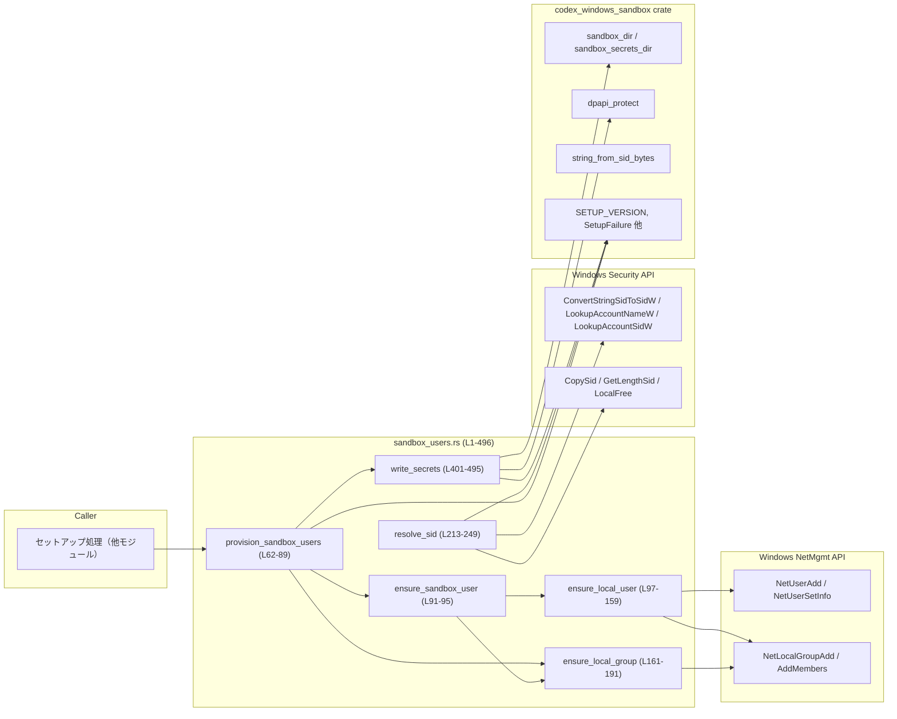
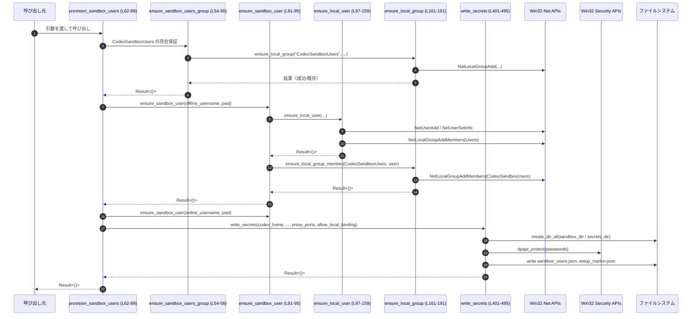

# windows-sandbox-rs\src\sandbox_users.rs

## 0. ざっくり一言

Windows 上で Codex 用の「サンドボックスユーザー」と専用ローカルグループを作成し、その認証情報を DPAPI で保護した JSON ファイルとして保存するためのヘルパーモジュールです（windows-sandbox-rs\src\sandbox_users.rs:L1-496）。

---

## 1. このモジュールの役割

### 1.1 概要

- このモジュールは **Windows ローカルユーザー／グループと SID の管理** を行い、Codex が使うサンドボックス用ユーザーを自動的に準備するために存在します。
- 具体的には、以下を行います（windows-sandbox-rs\src\sandbox_users.rs:L46-52, L54-89, L161-211, L213-360, L401-495）。
  - Codex 専用ローカルグループ `CodexSandboxUsers` の作成
  - オフライン／オンライン用サンドボックスユーザーの作成・更新・グループ所属
  - アカウント名から SID バイト列への解決、および逆変換
  - 生成したパスワードを DPAPI で暗号化し、JSON ファイルに保存

### 1.2 アーキテクチャ内での位置づけ

主な依存関係と呼び出し元／先を簡略化すると次のようになります。



- 呼び出し元（CLI やサービスなど）は主に `provision_sandbox_users` を入口として利用すると考えられます（windows-sandbox-rs\src\sandbox_users.rs:L62-89）。
- Windows のローカルユーザーやグループ操作は `windows_sys` 経由で Win32 API を呼び出しています（NetUserAdd, NetLocalGroupAdd, LookupAccountNameW 等）。
- DPAPI やディレクトリパス、エラー型は `codex_windows_sandbox` クレートに委譲されています（windows-sandbox-rs\src\sandbox_users.rs:L37-44, L430-441）。

### 1.3 設計上のポイント

コードから読み取れる特徴を列挙します。

- **Windows 限定モジュール**  
  - ファイル先頭で `#![cfg(target_os = "windows")]` が付いており、Windows 以外ではコンパイルされません（L1）。
- **エラー処理の方針**
  - 公開関数はすべて `anyhow::Result` を返します（L3, L54, L58, L62, L91, L97, L161, L193, L213, L349, L401）。
  - Windows API や I/O の失敗を `SetupFailure` + `SetupErrorCode` にマッピングして、エラーコードを分類しています（例: L131-134, L184-187, L412-418, L422-428）。
  - 一部の Windows API 失敗は `anyhow::anyhow!` で汎用エラーとして扱っています（例: L245-247, L266-269, L319-320, L341-343）。
- **unsafe ブロックによる FFI 呼び出し**
  - Win32 API 呼び出しはすべて `unsafe` ブロック内に閉じ込め、外側の関数シグネチャは安全関数 (`pub fn`) として公開されています（例: L100-157, L167-189, L224-247, L265-285, L301-335, L353-359）。
  - ポインタのライフタイムは `to_wide` で作る UTF-16 バッファをローカル変数に保持することで安全性を確保しています（例: L97-99, L165-166, L217-221）。
- **ローカルユーザーの冪等な作成／更新**
  - `NetUserAdd` が失敗した場合に `NetUserSetInfo`（レベル1003）でパスワード更新を試みる構造になっています（L111-117, L119-128）。
- **グループメンバー追加のエラー非致命扱い**
  - グループへの追加で既にメンバーになっている場合などのエラーは無視しています（L193-210, L144-150 のコメント）。
- **パスワード生成**
  - `SmallRng::from_entropy()` と固定文字集合から 24 文字のパスワードを生成しています（L362-373）。
- **シークレットファイルの構造**
  - DPAPI で保護したパスワードを Base64 し、`sandbox_users.json` と `setup_marker.json` の 2 ファイルとして書き出します（L442-452, L453-462, L463-494）。

---

## 2. 主要な機能一覧（コンポーネントインベントリー）

このモジュールが提供する主な機能を箇条書きで整理します。

- サンドボックス用ローカルグループ `CodexSandboxUsers` の作成・存在保証  
  - `SANDBOX_USERS_GROUP` 定数と `ensure_sandbox_users_group`（L46-47, L54-56）
- サンドボックスユーザー（オフライン／オンライン）の作成とグループ所属  
  - `provision_sandbox_users`, `ensure_sandbox_user`, `ensure_local_user`, `ensure_local_group_member`（L62-95, L97-159, L193-210）
- ローカルグループの作成・存在保証  
  - `ensure_local_group`（L161-191）
- アカウント名から SID バイト列への解決  
  - `resolve_sid`, `well_known_sid_str`, `sid_bytes_from_string`, `lookup_account_name_for_sid`（L213-260, L262-287, L289-347）
- SID バイト列から Windows API 用 `PSID` への変換  
  - `sid_bytes_to_psid`（L349-359）
- ランダムパスワードの生成  
  - `random_password`（L362-373）
- サンドボックスユーザー情報・セットアップ情報の JSON 出力  
  - `SandboxUserRecord`, `SandboxUsersFile`, `SetupMarker`, `write_secrets`（L376-399, L401-495）

後続のセクションで、型と関数を詳細に整理します。

---

## 3. 公開 API と詳細解説

### 3.1 型一覧（構造体）

このファイル内の構造体はすべてシリアライズ専用で、外部 API には直接公開されていません（L376-399）。

| 名前 | 種別 | 役割 / 用途 | 定義位置 |
|------|------|-------------|----------|
| `SandboxUserRecord` | 構造体 | 1 ユーザー分の `username` と DPAPI で保護したパスワード文字列を保持します。`SandboxUsersFile` 内部で使用されます。 | windows-sandbox-rs\src\sandbox_users.rs:L376-380 |
| `SandboxUsersFile` | 構造体 | オフライン／オンライン 2 ユーザー分の認証情報とフォーマットバージョン `version` をまとめた JSON 用データ構造です。 | windows-sandbox-rs\src\sandbox_users.rs:L382-387 |
| `SetupMarker` | 構造体 | セットアップ状態を記録するマーカーで、バージョン・ユーザー名・作成日時・プロキシポート・ローカルバインド可否・読み書きルートなどを保持します。 | windows-sandbox-rs\src\sandbox_users.rs:L389-399 |

### 3.2 関数詳細（7 件）

以下では重要度の高い関数を 7 個選び、詳細を記載します。

---

#### `ensure_sandbox_users_group(log: &mut File) -> Result<()>`

**概要**

- Codex 専用のローカルグループ `CodexSandboxUsers` が存在することを保証します（windows-sandbox-rs\src\sandbox_users.rs:L46-47, L54-56）。
- 実体は `ensure_local_group` への薄いラッパーです。

**引数**

| 引数名 | 型 | 説明 |
|--------|----|------|
| `log` | `&mut File` | ログ出力に使用するファイルハンドル。`super::log_line` で利用されます。 |

**戻り値**

- `Result<()>`  
  - 成功時: `Ok(())`  
  - 失敗時: グループ作成に失敗した場合の `SetupFailure(HelperUsersGroupCreateFailed)` などを含む `Err`（内部の `ensure_local_group` に依存）。

**内部処理の流れ**

1. 定数 `SANDBOX_USERS_GROUP` と `SANDBOX_USERS_GROUP_COMMENT` を渡して `ensure_local_group` を呼び出します（L54-55）。
2. `ensure_local_group` 側でグループ作成または既存確認とエラー処理を行います。

**Examples（使用例）**

```rust
use std::fs::OpenOptions;
use std::path::Path;

// ログファイルを開く
let mut log = OpenOptions::new()
    .create(true)
    .append(true)
    .open(Path::new("setup.log"))?;

// CodexSandboxUsers グループを作成／存在保証
windows_sandbox_rs::sandbox_users::ensure_sandbox_users_group(&mut log)?;
```

**Errors / Panics**

- この関数自身は panic しません。
- `ensure_local_group` 内で Windows API が失敗した場合に `Err` を返します（L161-191）。

**Edge cases**

- グループが既に存在する場合でも成功として扱われます（詳細は `ensure_local_group` の `ERROR_ALIAS_EXISTS` / `NERR_GROUP_EXISTS` 処理に依存, L161-189）。

**使用上の注意点**

- 実行にはローカルグループを作成できる十分な権限（通常は管理者権限）が必要です。権限不足は Windows API レベルのエラーとして扱われます。

---

#### `provision_sandbox_users(codex_home: &Path, offline_username: &str, online_username: &str, proxy_ports: &[u16], allow_local_binding: bool, log: &mut File) -> Result<()>`

**概要**

- Codex サンドボックスの初期セットアップの中心となる関数で、以下をまとめて行います（windows-sandbox-rs\src\sandbox_users.rs:L62-89）。
  - グループ `CodexSandboxUsers` の存在保証
  - オフライン・オンラインユーザーの作成とグループ所属
  - ランダムパスワード生成
  - 認証情報・セットアップ情報の JSON ファイル書き出し

**引数**

| 引数名 | 型 | 説明 |
|--------|----|------|
| `codex_home` | `&Path` | Codex ホームディレクトリ。サンドボックス用ディレクトリとシークレット格納ディレクトリの基準パスとして利用されます（L80, L401-421）。 |
| `offline_username` | `&str` | オフライン用サンドボックスユーザー名（L64）。 |
| `online_username` | `&str` | オンライン用サンドボックスユーザー名（L65）。 |
| `proxy_ports` | `&[u16]` | プロキシとして利用するポートリスト。後続の `SetupMarker` に記録されます（L66, L453-459）。 |
| `allow_local_binding` | `bool` | サンドボックスからローカルバインドを許可するかどうかのフラグ（L67, L458-459）。 |
| `log` | `&mut File` | ログ出力用ファイル（L68）。 |

**戻り値**

- `Result<()>`  
  - 成功時: `Ok(())`  
  - 失敗時: ユーザー／グループ作成、DPAPI 保護、ファイル書き込み等のどこかで発生した `SetupFailure` や `anyhow::Error` を含む。

**内部処理の流れ**

1. `ensure_sandbox_users_group(log)` でグループを作成／存在保証（L70）。
2. `super::log_line` で対象ユーザー名をログ出力（L71-74）。
3. `random_password()` を 2 回呼び、オフライン・オンラインユーザーのパスワードを生成（L75-76, L362-373）。
4. `ensure_sandbox_user` を使って、それぞれのユーザーを作成し、グループ所属も行う（L77-78, L91-95）。
5. `write_secrets` を呼び出し、パスワードを DPAPI+Base64 で暗号化し、JSON ファイルに書き出す（L79-87, L401-495）。
6. すべて成功したら `Ok(())` を返す（L88）。

**Examples（使用例）**

```rust
use std::fs::OpenOptions;
use std::path::Path;

// Windows 環境を前提に cfg でガードする
#[cfg(target_os = "windows")]
fn setup_sandbox() -> anyhow::Result<()> {
    let codex_home = Path::new("C:\\Users\\User\\AppData\\Local\\Codex"); // Codex ホーム
    let mut log = OpenOptions::new()
        .create(true)
        .append(true)
        .open(codex_home.join("setup.log"))?; // ログファイル

    // オフライン／オンライン用ユーザーをまとめてプロビジョニング
    windows_sandbox_rs::sandbox_users::provision_sandbox_users(
        codex_home,
        "codex_offline",
        "codex_online",
        &[8080, 8081],
        true,
        &mut log,
    )
}
```

**Errors / Panics**

- この関数自身は panic を起こすコードを含みません。
- 主なエラー要因:
  - グループ作成失敗: `HelperUsersGroupCreateFailed`（L161-187 経由）。
  - ユーザー作成／更新失敗: `HelperUserCreateOrUpdateFailed`（L131-134）。
  - DPAPI 保護失敗: `HelperDpapiProtectFailed`（L430-441）。
  - ディレクトリ作成失敗・ファイル書き込み失敗・シリアライズ失敗など: `HelperUsersFileWriteFailed` / `HelperSetupMarkerWriteFailed`（L410-429, L465-494）。

**Edge cases**

- 既にユーザーやグループが存在している場合  
  - グループ: `ensure_local_group` 側で「既存グループ」として成功扱いにしています（L161-189）。
  - ユーザー: `NetUserAdd` 失敗後に `NetUserSetInfo` でパスワード更新を試みるため、既存ユーザーのパスワード更新として振る舞います（L111-135）。
- 同名ユーザーを繰り返しプロビジョニングした場合  
  - パスワードが毎回変わり、それに応じて JSON ファイルも上書きされます（L75-78, L463-494）。

**使用上の注意点**

- 実行にはローカルユーザー・グループの管理と DPAPI 利用が可能な権限が必要です。
- パスワードは `SmallRng` で生成されており（L362-373）、暗号学的に強い乱数を必須とする要件がある場合には RNG の選択を検討する必要があります（セキュリティポリシーに依存）。
- JSON ファイルには暗号化済みとはいえ認証情報が含まれるため、ファイルのアクセス権限管理は別途考慮が必要です（権限設定はこのモジュールでは行っていません）。

---

#### `ensure_sandbox_user(username: &str, password: &str, log: &mut File) -> Result<()>`

**概要**

- 指定したユーザー名とパスワードでローカルユーザーを作成／更新し、サンドボックス用グループ `CodexSandboxUsers` に追加します（L91-95）。

**引数**

| 引数名 | 型 | 説明 |
|--------|----|------|
| `username` | `&str` | 作成／更新するローカルユーザー名。 |
| `password` | `&str` | ユーザーのパスワード。 |
| `log` | `&mut File` | ログ出力用ファイル。 |

**戻り値**

- `Result<()>`  
  - 成功時: `Ok(())`  
  - 失敗時: 主に `ensure_local_user` からのエラー（`HelperUserCreateOrUpdateFailed` など）。

**内部処理の流れ**

1. `ensure_local_user(username, password, log)` を呼び出し、ローカルユーザーを作成／更新（L92）。
2. `ensure_local_group_member(SANDBOX_USERS_GROUP, username)` を呼び出し、Codex 専用グループに追加（L93）。
3. いずれも成功と見なせば `Ok(())` を返す（L94）。

**Examples（使用例）**

```rust
use std::fs::OpenOptions;

#[cfg(target_os = "windows")]
fn create_additional_user() -> anyhow::Result<()> {
    let mut log = OpenOptions::new()
        .create(true)
        .append(true)
        .open("extra_setup.log")?;

    // 任意のサンドボックスユーザーを追加
    windows_sandbox_rs::sandbox_users::ensure_sandbox_user(
        "extra_codex_user",
        "MySecurePassw0rd!",
        &mut log,
    )
}
```

**Errors / Panics**

- `ensure_local_user` が失敗した場合に `Err` が返ります（L97-159）。
- `ensure_local_group_member` 内部ではエラーコードを無視しているため、グループ追加失敗が直接 `Err` になることはありません（L193-210）。

**Edge cases**

- `ensure_sandbox_users_group` が呼ばれていない状態で `ensure_sandbox_user` を直接呼ぶと、グループが存在しない可能性があります。
  - その場合 `ensure_local_group_member` の Windows API 呼び出しは失敗しますが、戻り値は `Ok(())` のままなので、グループに所属していないユーザーが作成される可能性があります（L193-210）。

**使用上の注意点**

- サンドボックス用の完全なセットアップを行う場合は、通常 `provision_sandbox_users` を通して呼ぶのが安全です。  
- グループへの追加に失敗してもエラーにはなりません。そのため、グループメンバーシップが必須であれば、別途検証が必要です。

---

#### `ensure_local_user(name: &str, password: &str, log: &mut File) -> Result<()>`

**概要**

- Windows のローカルユーザーを作成し、失敗した場合は既存ユーザーとみなしてパスワードを更新します（L97-159）。
- さらに、「Users」グループ（通常のローカルユーザー用グループ）への所属も試みます。

**引数**

| 引数名 | 型 | 説明 |
|--------|----|------|
| `name` | `&str` | ローカルユーザー名（L97）。 |
| `password` | `&str` | パスワード（L97）。 |
| `log` | `&mut File` | ログ出力用ファイル。 |

**戻り値**

- `Result<()>`  
  - 成功時: `Ok(())`  
  - 失敗時: ユーザー作成／更新に失敗した場合の `SetupFailure(HelperUserCreateOrUpdateFailed)` など。

**内部処理の流れ（アルゴリズム）**

1. `to_wide` でユーザー名とパスワードを UTF-16 のワイド文字列に変換（L98-99）。
2. `USER_INFO_1` 構造体を構築し、`NetUserAdd` に渡してユーザー作成を試みます（L101-116）。
3. `NetUserAdd` が `NERR_Success` 以外を返した場合:
   1. `USER_INFO_1003` を作り、レベル 1003 で `NetUserSetInfo` を呼び出してパスワード更新を試みます（L119-128）。
   2. それも失敗した場合はログを出力し（L129-131）、`HelperUserCreateOrUpdateFailed` を含むエラーを返します（L131-134）。
4. 成功した場合またはパスワード更新が成功した場合:
   1. `SID_USERS`（`"S-1-5-32-545"`）から `lookup_account_name_for_sid` で「Users」グループ名を取得（L138-140, L251-260, L289-347）。
   2. そのグループに対して `NetLocalGroupAddMembers` を呼び出し、ユーザーをメンバーとして追加しようとします（L141-150）。
   3. この追加操作の結果はチェックせず、失敗しても無視します。
   4. もし `lookup_account_name_for_sid` 自体が失敗した場合は、ログに警告を出すのみで処理を継続します（L151-156）。
5. 最終的に `Ok(())` を返します（L158）。

**Examples（使用例）**

```rust
use std::fs::OpenOptions;

#[cfg(target_os = "windows")]
fn ensure_local_only() -> anyhow::Result<()> {
    let mut log = OpenOptions::new()
        .create(true)
        .append(true)
        .open("local_user.log")?;

    // ローカルユーザー "worker" を作成／更新し、Users グループにも所属させることを試みる
    windows_sandbox_rs::sandbox_users::ensure_local_user("worker", "Work3rPass!", &mut log)
}
```

**Errors / Panics**

- Windows API 呼び出しが失敗し、パスワード更新もできない場合に `Err` となります（L129-135）。
- ログ出力 `super::log_line` が I/O エラーを起こした場合も `Err` になります。

**Edge cases**

- ユーザーが既に存在する場合
  - `NetUserAdd` がエラーを返しますが、`NetUserSetInfo` によるパスワード更新が成功すれば全体として成功扱いです（L117-135）。
- 「Users」グループが何らかの理由で名前解決できない場合
  - `lookup_account_name_for_sid` が `Err` を返し、ログにメッセージを出して「Users」グループへの追加をスキップします（L138-156）。
  - それでも関数自体は `Ok(())` を返します。

**使用上の注意点**

- `NetUserAdd`／`NetUserSetInfo` を利用するため、プロセスはユーザー管理が許可されたアカウントで実行されている必要があります。
- 「Users」グループへの追加はあくまでベストエフォートで、失敗しても通知されません。そのため、必要であれば別途グループメンバーシップを検証する必要があります。
- `unsafe` 内でポインタを扱っていますが、ワイド文字列バッファは関数スコープ内で保持されており、Win32 API 呼び出し中は有効です（L97-110）。

---

#### `ensure_local_group(name: &str, comment: &str, log: &mut File) -> Result<()>`

**概要**

- 指定したローカルグループが存在することを保証し、存在しない場合は作成します（L161-191）。

**引数**

| 引数名 | 型 | 説明 |
|--------|----|------|
| `name` | `&str` | 作成／確認するローカルグループ名。 |
| `comment` | `&str` | グループの説明コメント。 |
| `log` | `&mut File` | ログ出力用ファイル。 |

**戻り値**

- `Result<()>`  
  - 成功時: `Ok(())`  
  - 失敗時: グループ作成に失敗した場合の `SetupFailure(HelperUsersGroupCreateFailed)`。

**内部処理の流れ**

1. `to_wide` でグループ名とコメントを UTF-16 に変換（L165-166）。
2. `LOCALGROUP_INFO_1` を作成し `NetLocalGroupAdd` をレベル 1 で呼び出す（L167-177）。
3. 戻り値 `status` が以下のいずれかなら成功扱い（L179-188）。
   - `NERR_Success` : 新規作成成功
   - `ERROR_ALIAS_EXISTS` : エイリアス（グループ）が既に存在
   - `NERR_GROUP_EXISTS` : グループが既に存在
4. それ以外のエラーコードの場合、ログに詳細を出力し（L180-183）、`HelperUsersGroupCreateFailed` エラーを返す（L184-187）。
5. 成功した場合は `Ok(())` を返す（L190）。

**Examples（使用例）**

```rust
use std::fs::OpenOptions;

#[cfg(target_os = "windows")]
fn ensure_custom_group() -> anyhow::Result<()> {
    let mut log = OpenOptions::new()
        .create(true)
        .append(true)
        .open("group_setup.log")?;

    windows_sandbox_rs::sandbox_users::ensure_local_group(
        "MyCustomGroup",
        "Custom group for special tasks",
        &mut log,
    )
}
```

**Errors / Panics**

- `NetLocalGroupAdd` が予期しないエラーコードを返した場合に `Err` となります（L179-188）。
- ログ出力失敗も `Err` になります。

**Edge cases**

- グループが既に存在する場合
  - `ERROR_ALIAS_EXISTS` または `NERR_GROUP_EXISTS` として成功扱いです（L162-163, L179-188）。
- グループ名やコメントが長すぎるなど、Windows 側制約に起因するエラーはそのままステータスコードとしてログに出力されます（L180-183）。

**使用上の注意点**

- グループ作成に必要な権限がない場合、Windows API レベルでエラーになります。
- グループが存在しないことを事前確認する必要はなく、この関数自体が冪等に振る舞うようになっています。

---

#### `resolve_sid(name: &str) -> Result<Vec<u8>>`

**概要**

- アカウント名または特定の well-known 名称（Administrators, Users, Authenticated Users, Everyone, SYSTEM）を Windows の SID バイト列に解決します（L213-249, L251-260, L262-287）。

**引数**

| 引数名 | 型 | 説明 |
|--------|----|------|
| `name` | `&str` | アカウント名または well-known 名称（例: `"Users"`, `"Administrators"`）。 |

**戻り値**

- `Result<Vec<u8>>`  
  - 成功時: SID の生バイト列を含む `Vec<u8>`。  
  - 失敗時: `LookupAccountNameW` での解決失敗を表す `anyhow::Error`。

**内部処理の流れ**

1. `well_known_sid_str(name)` で `"Administrators"`, `"Users"` などに対して事前定義された SID 文字列を返すか確認（L213-216, L251-260）。
   - 該当する場合は `sid_bytes_from_string` を用いて SID バイト列に変換し、その結果を返します（L214-215, L262-287）。
2. well-known に該当しない場合:
   1. `to_wide` で `name` を UTF-16 に変換（L217）。
   2. SID バッファとドメイン名バッファを初期化（L218-222）。
   3. ループ内で `LookupAccountNameW` を呼び出し、SID とドメイン文字列を取得（L223-234）。
   4. 成功 (`ok != 0`) なら、`sid_buffer` を実際の長さで `truncate` し返却（L235-237）。
   5. 失敗した場合は `GetLastError` を取得（L239）。
   6. エラーが `ERROR_INSUFFICIENT_BUFFER` なら、Windows が要求したサイズにバッファを `resize` し、ループを継続（L240-243）。
   7. それ以外のエラーなら `Err(anyhow::anyhow!(...))` として終了（L245-247）。

**Examples（使用例）**

```rust
#[cfg(target_os = "windows")]
fn print_users_sid() -> anyhow::Result<()> {
    // "Users" グループの SID 生バイト列を取得（well-known 経由）
    let sid_bytes = windows_sandbox_rs::sandbox_users::resolve_sid("Users")?;
    println!("Users SID length: {}", sid_bytes.len());
    Ok(())
}
```

**Errors / Panics**

- `well_known_sid_str` 経由の場合:
  - `ConvertStringSidToSidW`, `GetLengthSid`, `CopySid` のいずれかが失敗すると `Err` を返します（L262-287）。
- 通常のアカウント名解決の場合:
  - `LookupAccountNameW` がバッファ不足以外の理由で失敗した場合に `Err` になります（L245-247）。
- panic を行うコードは含まれていません。

**Edge cases**

- 存在しないアカウント名を指定した場合
  - `LookupAccountNameW` が失敗し、`"LookupAccountNameW failed for {name}: {err}"` というメッセージ付きのエラーになります（L245-247）。
- バッファサイズが初期値 68 バイトより大きな SID を返すアカウントの場合
  - `ERROR_INSUFFICIENT_BUFFER` が返され、必要サイズに合わせてバッファ再確保を行うロジックが実装されています（L218-222, L240-243）。

**使用上の注意点**

- 戻り値は Windows の SID バイト列であり、そのまま文字列として扱うことはできません。文字列表現が必要な場合は、`string_from_sid_bytes` などの補助関数（別モジュール）を利用する必要があります（L43, L349-351）。
- SID バイト列は `'static` なものではなく、`Vec<u8>` として所有権が呼び出し元に移るため、必要に応じてクローンすることができます（Rust の所有権モデル上、安全）。

---

#### `write_secrets(…) -> Result<()>`

```rust
fn write_secrets(
    codex_home: &Path,
    offline_user: &str,
    offline_pwd: &str,
    online_user: &str,
    online_pwd: &str,
    proxy_ports: &[u16],
    allow_local_binding: bool,
) -> Result<()>
```

**概要**

- サンドボックスユーザーの認証情報とセットアップ情報を JSON ファイルに書き出す内部関数です（windows-sandbox-rs\src\sandbox_users.rs:L401-495）。
- パスワードは DPAPI で保護したバイト列を Base64 でエンコードして保存します。

**引数**

| 引数名 | 型 | 説明 |
|--------|----|------|
| `codex_home` | `&Path` | Codex ホームディレクトリ。`sandbox_dir` と `sandbox_secrets_dir` の基準（L401-402, L410, L420）。 |
| `offline_user` | `&str` | オフライン用ユーザー名（L403, L444-445, L455）。 |
| `offline_pwd` | `&str` | オフライン用パスワード（L404, L430-435）。 |
| `online_user` | `&str` | オンライン用ユーザー名（L405, L448-449, L456）。 |
| `online_pwd` | `&str` | オンライン用パスワード（L406, L436-441）。 |
| `proxy_ports` | `&[u16]` | プロキシポート。`SetupMarker.proxy_ports` に保存（L407, L458）。 |
| `allow_local_binding` | `bool` | ローカルバインド可否。`SetupMarker.allow_local_binding` に保存（L408, L459）。 |

**戻り値**

- `Result<()>`  
  - 成功時: `Ok(())`  
  - 失敗時: ディレクトリ作成、DPAPI 保護、シリアライズ、ファイル書き込みに関する `SetupFailure` いずれか。

**内部処理の流れ**

1. `sandbox_dir(codex_home)` を取得し、そのディレクトリを `create_dir_all` で作成（L410-419）。
   - 失敗時は `HelperUsersFileWriteFailed` エラーを返す。
2. `sandbox_secrets_dir(codex_home)` を取得し、同様に `create_dir_all`（L420-429）。
3. `dpapi_protect` で `offline_pwd` / `online_pwd` のバイト列を保護（L430-441）。
   - 失敗時は `HelperDpapiProtectFailed` エラーを返す。
4. `SandboxUsersFile` インスタンスを構築（L442-452）。
   - `password` フィールドには Base64 エンコードされた DPAPI 保護バイト列を格納。
5. `SetupMarker` インスタンスを構築（L453-462）。
   - `created_at` には `chrono::Utc::now().to_rfc3339()` を格納（L457）。
6. `users_path = secrets_dir.join("sandbox_users.json")` と `marker_path = sandbox_dir.join("setup_marker.json")` を計算（L463-464）。
7. `serde_json::to_vec_pretty(&users)` でユーザー情報を JSON にシリアライズし、`std::fs::write` で `users_path` に書き出す（L465-479）。
8. 同様に `marker` をシリアライズして `marker_path` に書き出す（L480-494）。
9. すべて成功したら `Ok(())` を返す（L495）。

**Examples（使用例）**

この関数は `provision_sandbox_users` からのみ呼び出されており直接公開されていません（L79-87）。直接利用したい場合のイメージコードは次の通りです。

```rust
use std::path::Path;

#[cfg(target_os = "windows")]
fn write_only_secrets() -> anyhow::Result<()> {
    let home = Path::new("C:\\CodexHome");

    // 既にユーザーが作成済みであると想定し、その認証情報だけ保存する想定例
    windows_sandbox_rs::sandbox_users::provision_sandbox_users(
        home,
        "codex_offline",
        "codex_online",
        &[],
        false,
        &mut std::fs::File::create(home.join("dummy.log"))?,
    )?;
    Ok(())
}
```

（実際には `write_secrets` は private なので、直接呼ばずに `provision_sandbox_users` を利用する想定です。）

**Errors / Panics**

- ディレクトリ作成失敗 → `HelperUsersFileWriteFailed`（L410-429）。
- DPAPI 保護失敗 → `HelperDpapiProtectFailed`（L430-441）。
- JSON シリアライズ失敗 → `HelperUsersFileWriteFailed` または `HelperSetupMarkerWriteFailed`（L465-470, L480-485）。
- ファイル書き込み失敗 → 同上のコードでエラー（L471-479, L486-494）。
- panic を起こすコードは含まれていません。

**Edge cases**

- 既にディレクトリやファイルが存在する場合
  - `create_dir_all` は既存ディレクトリに対しても成功扱いです（標準ライブラリの仕様）。
  - `std::fs::write` は既存ファイルを上書きします（L471-479, L486-494）。
- `proxy_ports` が空のスライスでも、そのまま空の `Vec` として `SetupMarker.proxy_ports` に保存されます（L458）。

**使用上の注意点**

- DPAPI の動作は Windows プロファイルやマシン状態に依存するため、これらの JSON を別マシンへコピーしても復号できるとは限りません（`dpapi_protect` の仕様に依存; このチャンクには詳細実装は現れません）。
- ファイルのアクセス権限は標準の `std::fs::write` に任されており、特別な ACL 設定等は行っていません。

---

### 3.3 その他の関数

詳細解説対象外とした補助関数・ラッパー関数の一覧です。

| 関数名 | シグネチャ | 役割（1 行） | 定義位置 |
|--------|------------|--------------|----------|
| `resolve_sandbox_users_group_sid` | `pub fn resolve_sandbox_users_group_sid() -> Result<Vec<u8>>` | `CodexSandboxUsers` グループ名を `resolve_sid` で SID バイト列に解決します。 | windows-sandbox-rs\src\sandbox_users.rs:L58-60 |
| `ensure_local_group_member` | `pub fn ensure_local_group_member(group_name: &str, member_name: &str) -> Result<()>` | 指定ユーザー（またはアカウント）を指定グループに `NetLocalGroupAddMembers` で追加しようとします。エラーは無視します。 | windows-sandbox-rs\src\sandbox_users.rs:L193-210 |
| `sid_bytes_to_psid` | `pub fn sid_bytes_to_psid(sid: &[u8]) -> Result<*mut c_void>` | SID バイト列を文字列化した上で `ConvertStringSidToSidW` に渡し、Win32 API 用の `PSID` ポインタを返します（呼び出し側で `LocalFree` が必要）。 | windows-sandbox-rs\src\sandbox_users.rs:L349-359 |
| `well_known_sid_str` | `fn well_known_sid_str(name: &str) -> Option<&'static str>` | `"Users"` などの well-known 名称を事前定義された SID 文字列にマッピングします。 | windows-sandbox-rs\src\sandbox_users.rs:L251-260 |
| `sid_bytes_from_string` | `fn sid_bytes_from_string(sid_str: &str) -> Result<Vec<u8>>` | SID 文字列から `ConvertStringSidToSidW`→`GetLengthSid`→`CopySid` で SID バイト列を取得します。 | windows-sandbox-rs\src\sandbox_users.rs:L262-287 |
| `lookup_account_name_for_sid` | `fn lookup_account_name_for_sid(sid_str: &str) -> Result<String>` | SID 文字列から `LookupAccountSidW` を使ってアカウント名（`name@domain` 形式に近い）を取得します。 | windows-sandbox-rs\src\sandbox_users.rs:L289-347 |
| `random_password` | `fn random_password() -> String` | `SmallRng` と固定文字集合を用いて 24 文字のランダムパスワードを生成します。 | windows-sandbox-rs\src\sandbox_users.rs:L362-373 |

---

## 4. データフロー

代表的なシナリオとして `provision_sandbox_users` 実行時のフローを示します（windows-sandbox-rs\src\sandbox_users.rs:L62-89）。

### 処理の要点

- 呼び出し元は Codex ホームディレクトリとユーザー名などを渡して `provision_sandbox_users` を呼びます。
- 関数内でユーザー／グループ作成とシークレットファイル書き出しまでを一括で実行します。
- Windows API とファイルシステム／DPAPI の組み合わせで完結します。

### シーケンス図



---

## 5. 使い方（How to Use）

### 5.1 基本的な使用方法

典型的には、セットアップ用バイナリから `provision_sandbox_users` を呼び出します。

```rust
use std::fs::OpenOptions;
use std::path::Path;

#[cfg(target_os = "windows")]
fn main() -> anyhow::Result<()> {
    let codex_home = Path::new("C:\\Users\\User\\AppData\\Local\\Codex"); // Codex ホームパス

    // セットアップログファイル
    let mut log = OpenOptions::new()
        .create(true)
        .append(true)
        .open(codex_home.join("sandbox_setup.log"))?;

    // オフライン／オンラインユーザーとポート設定をまとめてプロビジョニング
    windows_sandbox_rs::sandbox_users::provision_sandbox_users(
        codex_home,
        "codex_offline",
        "codex_online",
        &[8080, 8081],
        false,
        &mut log,
    )?;

    Ok(())
}
```

このコードにより、次の状態になります。

- ローカルグループ `CodexSandboxUsers` が存在する（なければ作成）。
- `codex_offline` / `codex_online` ユーザーが作成され、それぞれ `Users` グループおよび `CodexSandboxUsers` グループに所属している可能性が高い。
- `codex_home` 配下に `sandbox_users.json` と `setup_marker.json` が作成される。

### 5.2 よくある使用パターン

1. **追加のサンドボックスユーザーを個別に追加する**

```rust
use std::fs::OpenOptions;

#[cfg(target_os = "windows")]
fn add_extra_sandbox_user(name: &str, password: &str) -> anyhow::Result<()> {
    let mut log = OpenOptions::new()
        .create(true)
        .append(true)
        .open("extra_user.log")?;

    // 事前に ensure_sandbox_users_group を呼んでおくとグループが確実に存在
    windows_sandbox_rs::sandbox_users::ensure_sandbox_users_group(&mut log)?;
    windows_sandbox_rs::sandbox_users::ensure_sandbox_user(name, password, &mut log)
}
```

1. **グループ SID を解決して ACL 設定に利用する**

```rust
#[cfg(target_os = "windows")]
fn get_sandbox_group_sid() -> anyhow::Result<Vec<u8>> {
    let sid_bytes = windows_sandbox_rs::sandbox_users::resolve_sandbox_users_group_sid()?;
    // ここで ACL 設定などに sid_bytes を利用する
    Ok(sid_bytes)
}
```

### 5.3 よくある間違い

```rust
// 間違い例: サンドボックスグループを作成せずにユーザーだけ作成する
#[cfg(target_os = "windows")]
fn wrong() -> anyhow::Result<()> {
    let mut log = std::fs::File::create("setup.log")?;
    // グループが存在しない可能性がある
    windows_sandbox_rs::sandbox_users::ensure_sandbox_user("user", "pass", &mut log)?;
    Ok(())
}

// 正しい例: グループの存在を先に保証してからユーザーを作成する
#[cfg(target_os = "windows")]
fn correct() -> anyhow::Result<()> {
    let mut log = std::fs::File::create("setup.log")?;
    windows_sandbox_rs::sandbox_users::ensure_sandbox_users_group(&mut log)?;
    windows_sandbox_rs::sandbox_users::ensure_sandbox_user("user", "pass", &mut log)?;
    Ok(())
}
```

- 間違い例では、グループが存在しない場合 `ensure_local_group_member` の内部でエラーが起きても黙って無視されるため、期待通りのグループメンバーシップが得られない可能性があります（L193-210）。

### 5.4 使用上の注意点（まとめ）

- **権限**
  - ローカルユーザー／グループの作成と DPAPI 利用には十分な権限（一般に管理者権限）が必要です。
- **エラー処理**
  - ほとんどの Windows API エラーは `Result` で通知されますが、グループへのメンバー追加失敗など一部は無視されます（L193-210, L144-150）。
- **SID ポインタの解放**
  - `sid_bytes_to_psid` が返す `*mut c_void` は `ConvertStringSidToSidW` により確保されており、Win32 API の仕様上、呼び出し側で `LocalFree` による解放が必要です（L349-359）。この解放処理はこのファイル内には現れません。
- **乱数とセキュリティ**
  - `random_password` は `SmallRng` を使用しており、高速・軽量な疑似乱数生成器です（L365-367）。暗号学的強度が必須な場合は、よりセキュアな RNG への置き換えを設計上検討する余地があります。
- **並行性**
  - このモジュールは明示的なスレッド同期を行っていません。Rust の型システム上はすべて通常の `pub fn` と `Result` であり、スレッド安全性は主に Windows のユーザー／グループ管理 API に委ねられています。
  - 複数プロセスや複数スレッドから同時にユーザー／グループ作成を行うと、OS レベルの競合により一時的なエラーが生じる可能性があります。

---

## 6. 変更の仕方（How to Modify）

### 6.1 新しい機能を追加する場合

例として、「追加の well-known グループをサポートしたい」場合の手順を示します。

1. **SID 定数の追加**
   - ファイル冒頭の SID 定数群に新しい SID を追加します（L48-52 の形式に倣う）。

2. **`well_known_sid_str` の拡張**
   - 対応する名称を `match` 式に追加し、新しい SID 定数を返す分岐を追加します（L251-260）。

3. **上位 API からの利用**
   - 新しいグループの SID が必要な関数（たとえば ACL 設定処理）があれば、`resolve_sid("NewGroupName")` を呼び出して利用します。

4. **テスト・検証**
   - このファイル内にテストコードは存在しないため（このチャンクには現れません）、別ファイルに統合テストや手動検証の手順を追加することが望ましいです。

### 6.2 既存の機能を変更する場合

- **パスワードポリシーを変更したい**
  - 文字種や長さを変えたい場合は `random_password` の `CHARS` 定数と `buf` サイズを変更します（L362-373）。
  - 変更後は OS のパスワード強度ポリシーに違反しないことを確認する必要があります。失敗すると `NetUserAdd`／`NetUserSetInfo` がエラーを返します（L111-117, L119-128）。

- **エラー無視をやめて厳密にチェックしたい**
  - `ensure_local_group_member` や `ensure_local_user` 内で `NetLocalGroupAddMembers` の戻り値を無視している箇所があります（L144-150, L199-208）。
  - ここでステータスコードを確認し、失敗時にログ＋`Err` を返すように変更すれば、グループメンバーシップの保証が強くなります。
  - 影響範囲として、`ensure_sandbox_user` や `provision_sandbox_users` の挙動（失敗条件）が変わるため、呼び出し側のエラー処理ロジックも見直す必要があります。

- **ファイルフォーマットを拡張したい**
  - `SandboxUsersFile` または `SetupMarker` にフィールドを追加する場合（L382-387, L389-399）:
    - シリアライズ／デシリアライズ側（このファイルには書き込み側のみが存在）との互換性を考慮します。
    - バージョン番号 `SETUP_VERSION` の扱いが別モジュールで決まっている可能性があるため、このチャンク外の仕様を確認する必要があります（L37, L443, L454）。

---

## 7. 関連ファイル

このモジュールと密接に関連する要素を整理します。

| パス / シンボル | 役割 / 関係 |
|-----------------|------------|
| `codex_windows_sandbox::dpapi_protect` | パスワードバイト列を DPAPI で保護する関数として呼び出されていますが、実装はこのチャンクには現れません（L40, L430-441）。 |
| `codex_windows_sandbox::sandbox_dir` | サンドボックス用ディレクトリパスを計算する関数。`write_secrets` 内で使用されます（L41, L410）。 |
| `codex_windows_sandbox::sandbox_secrets_dir` | シークレット格納ディレクトリパスを計算する関数。`write_secrets` 内で使用されます（L42, L420）。 |
| `codex_windows_sandbox::string_from_sid_bytes` | SID バイト列から SID 文字列への変換に利用されます。実装はこのチャンクには現れません（L43, L349-351）。 |
| `codex_windows_sandbox::SETUP_VERSION` | JSON フォーマットのバージョン番号として使用されています（L37, L443, L454）。 |
| `codex_windows_sandbox::SetupFailure`, `SetupErrorCode` | エラー分類用の型であり、このモジュールからのエラーは主にこれらを経由して構造化されています（L38-39, L131-134, L184-187, L412-418 など）。 |
| `super::log_line` | ログ出力に使用される関数ですが、定義は別ファイルで、このチャンクには現れません（L71-74, L130-131, L152-156, L180-183）。 |

このファイル単体ではテストコードや呼び出し元の実装は確認できないため、「どこから `provision_sandbox_users` が呼ばれているか」「シークレット JSON をどのように読み戻しているか」といった情報は **このチャンクには現れない** ことに注意が必要です。
