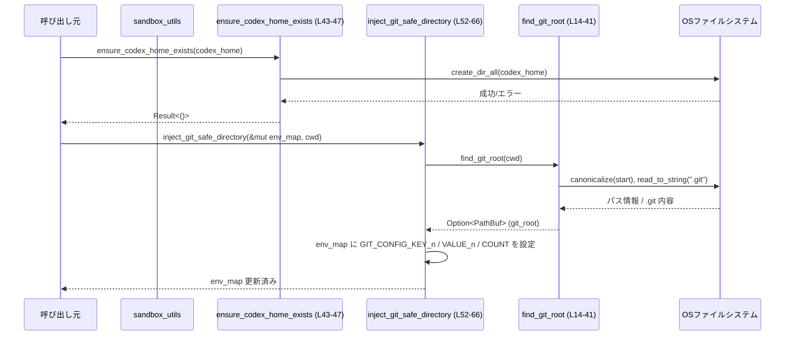

# windows-sandbox-rs/src/sandbox_utils.rs

## 0. ざっくり一言

Windows サンドボックス実行時の共通セットアップ処理として、

- Codex 用ホームディレクトリの作成  
- Git リポジトリに対する `safe.directory` 設定の環境変数注入  

を行う小さなユーティリティ関数群です（根拠: `//!` モジュールコメントと関数定義 `sandbox_utils.rs:L1-6, L43-47, L49-66`）。

---

## 1. このモジュールの役割

### 1.1 概要

このモジュールは、Windows サンドボックス環境での Git 利用や Codex 関連処理の前提条件を整えるために存在し、次の機能を提供します。

- Codex ホームディレクトリの存在を保証する（ディレクトリがなければ作成する）（`sandbox_utils.rs:L43-47`）。
- 現在ディレクトリから Git ワークツリーのルートを探索し、そのパスを Git の `safe.directory` 設定として環境変数に追加する（`sandbox_utils.rs:L13-41, L49-66`）。

### 1.2 アーキテクチャ内での位置づけ

このファイルは、サンドボックスを起動する上位レイヤ（「legacy / elevated paths」や `unified_exec` など、コメントに現れる概念）が呼び出すヘルパーとして機能し、標準ライブラリおよび外部クレートに依存しています（根拠: モジュールコメントと `use` 文 `sandbox_utils.rs:L1-6, L8-11`）。

```mermaid
flowchart TD
    Caller["サンドボックス呼び出し元\n（legacy/elevated 経路; このチャンクには定義なし）"]
    Utils["sandbox_utils モジュール\n(このファイル)"]
    FindRoot["find_git_root (L14-41)"]
    FS["std::fs / OS\n(create_dir_all, read_to_string)"]
    Dunce["dunce::canonicalize (L15)"]
    GitEnv["Git プロセス\n(GIT_CONFIG_* 環境変数)"]

    Caller -->|Codexホーム作成| Utils
    Utils -->|ensure_codex_home_exists (L43-47)| FS
    Caller -->|環境変数構築| Utils
    Utils -->|inject_git_safe_directory (L52-66)| FindRoot
    FindRoot --> Dunce
    FindRoot --> FS
    Utils -->|GIT_CONFIG_* を設定| GitEnv
```

### 1.3 設計上のポイント

- **ステートレスなヘルパー**  
  - グローバル状態や構造体を持たず、すべて関数単位で完結しています（`sandbox_utils.rs:L14-66`）。
- **単純なエラーハンドリング**  
  - ディレクトリ作成は `anyhow::Result<()>` を返し、`?` 演算子で I/O エラーをそのまま上位に伝搬します（`sandbox_utils.rs:L8, L45`）。
  - Git ルート探索は `Option<PathBuf>` を返し、失敗時は `None` で表現します（`sandbox_utils.rs:L14, L15, L35-37`）。
- **副作用の局所化**  
  - ファイルシステムへの副作用は `std::fs::create_dir_all` と `std::fs::read_to_string` の呼び出しに限定されています（`sandbox_utils.rs:L22, L45`）。
  - 環境変数の変更は呼び出し元から渡される `HashMap<String, String>` のみに対して行われ、実プロセス環境を直接書き換えてはいません（`sandbox_utils.rs:L52-65`）。
- **Git の `.git` ファイル／ディレクトリ両対応**  
  - `.git` がディレクトリかファイルかで分岐し、ファイルの場合は `gitdir:` 形式のリダイレクトも扱っています（`sandbox_utils.rs:L17-33`）。

---

## 2. 主要な機能一覧

- Codex ホームディレクトリ作成: 指定パスにディレクトリツリーを作成し、存在を保証します（`ensure_codex_home_exists`、`sandbox_utils.rs:L43-47`）。
- Git ワークツリールート探索: 任意の開始パスから上方向に `.git` を探索し、ワークツリールートを特定します（`find_git_root`、`sandbox_utils.rs:L13-41`）。
- Git `safe.directory` 環境変数注入: 見つかった Git ルートを Git の `GIT_CONFIG_*` 環境変数形式で `safe.directory` として登録します（`inject_git_safe_directory`、`sandbox_utils.rs:L49-66`）。

---

## 3. 公開 API と詳細解説

### 3.1 型一覧（構造体・列挙体など）

このファイル内で新しい構造体・列挙体は定義されていません。利用している主な型は次のとおりです。

| 名前 | 種別 | 役割 / 用途 | 根拠 |
|------|------|-------------|------|
| `Result<T>` (`anyhow::Result`) | 型エイリアス | エラー情報付きの汎用的な結果型。`ensure_codex_home_exists` の戻り値に使われます。 | `sandbox_utils.rs:L8, L43-47` |
| `Path` | 構造体 | ファイルシステム上のパスを借用参照として表現します。関数引数に広く使用。 | `sandbox_utils.rs:L10, L14, L43, L52` |
| `PathBuf` | 構造体 | 所有権を持つパス型。Git ルート探索の戻り値や内部計算に使用。 | `sandbox_utils.rs:L11, L14, L15, L25-30` |
| `HashMap<String, String>` | 構造体 | 環境変数名と値のマップとして利用されます。`inject_git_safe_directory` の引数。 | `sandbox_utils.rs:L9, L52` |
| `Option<T>` | 列挙体 | Git ルート探索結果の有無を表現します。 | `sandbox_utils.rs:L14, L15, L35, L37` |

### 3.2 関数詳細

#### `find_git_root(start: &Path) -> Option<PathBuf>`

**概要**

開始パス `start` から親ディレクトリ方向に遡りながら `.git` を探し、Git ワークツリーのルートディレクトリを返します。`.git` がファイルの場合は `gitdir:` リダイレクトに対応します（`sandbox_utils.rs:L13-41`）。

**引数**

| 引数名 | 型 | 説明 |
|--------|----|------|
| `start` | `&Path` | 探索開始位置となるパス。通常はカレントディレクトリなどを渡します。 |

**戻り値**

- `Option<PathBuf>`  
  - `Some(path)`: Git ワークツリーのルートディレクトリが見つかった場合のパス。  
  - `None`: `.git` を見つけられなかった場合、またはパスの正規化に失敗した場合（`sandbox_utils.rs:L15, L35-37`）。

**内部処理の流れ（アルゴリズム）**

1. `dunce::canonicalize(start)` で `start` を正規化し、`cur` として保持します。エラー時は `None` を返します（`ok()?` による早期リターン）（`sandbox_utils.rs:L15`）。
2. 無限ループ内で、現在の `cur` に対し `cur.join(".git")` を `marker` として構築します（`sandbox_utils.rs:L16-17`）。
3. `marker.is_dir()` なら、`.git` ディレクトリが存在するディレクトリとして `cur` を返します（`Some(cur)`）（`sandbox_utils.rs:L18-20`）。
4. `marker.is_file()` の場合:
   - `.git` ファイルを `read_to_string` で読み込み、`gitdir:` で始まる記述を探します（`sandbox_utils.rs:L21-24`）。
   - `gitdir:` プレフィックスが見つかった場合、その後ろに続くパスを `gitdir` として取り出します（`sandbox_utils.rs:L23-24`）。
   - `gitdir` が絶対パスなら `PathBuf::from(gitdir)`、相対パスなら `cur.join(gitdir)` で解決し、その親ディレクトリをワークツリールートとして返します（親が取得できない場合は `cur` を返します）（`sandbox_utils.rs:L25-30`）。
   - `gitdir:` 行がない、または読み込みに失敗した場合は、`.git` を含む `cur` 自体を Git ルートとみなして返します（`sandbox_utils.rs:L22-24, L33`）。
5. `.git` が見つからなかった場合:
   - `cur.parent()` を取得し、親が存在しない（ルートに到達）なら `None` を返します（`sandbox_utils.rs:L35-37`）。
   - 親が存在する場合は `cur` を親ディレクトリに更新し、ループを継続します（`sandbox_utils.rs:L39-40`）。

**Examples（使用例）**

現在の作業ディレクトリから Git ルートを探す例です。

```rust
use std::path::Path;
use std::env;

fn current_git_root() -> Option<std::path::PathBuf> {
    let cwd = env::current_dir().ok()?;                 // カレントディレクトリを取得
    windows_sandbox_rs::sandbox_utils::find_git_root(&cwd)
}
```

※ 実際のモジュールパスはプロジェクト構成に依存します。この例ではクレート名を `windows_sandbox_rs` と仮定しています（このチャンクからは実際のクレート名は分かりません）。

**Errors / Panics**

- パニックを起こすコードは使用していません。`read_to_string` の失敗は `if let Ok(..)` で無視されます（`sandbox_utils.rs:L22`）。
- エラーは `Option::None` として表現されます。
  - `dunce::canonicalize(start)` が失敗した場合（存在しないパスや権限不足など）、`ok()?` により `None` を返します（`sandbox_utils.rs:L15`）。
  - ルートディレクトリまで辿っても `.git` が見つからなかった場合、`parent()?` により `None` を返します（`sandbox_utils.rs:L35-37`）。

**Edge cases（エッジケース）**

- `.git` ファイルだが、内容に `gitdir:` 行がない場合  
  → `.git` を含むディレクトリ `cur` をそのままルートとして返します（`sandbox_utils.rs:L22-24, L33`）。
- `.git` がファイルで、`gitdir:` のパスがルートパス等で親ディレクトリを持たない場合  
  → `resolved.parent()` が `None` となり、`or(Some(cur))` により `cur` を返します（`sandbox_utils.rs:L25-30`）。
- `start` がそもそも存在しない、あるいはアクセス不可な場合  
  → `canonicalize` が失敗し、`None` を返します（`sandbox_utils.rs:L15`）。
- ファイルシステムのルートに到達するまで `.git` が見つからない場合  
  → 最終的に `None` を返します（`sandbox_utils.rs:L35-37`）。

**使用上の注意点**

- Git ルートが見つからなくても `None` になるだけで、エラー詳細は残りません。必要なら呼び出し元でログを追加するなどの対応が必要になります。
- `canonicalize` によりシンボリックリンクが解決されるため、「見かけ上のパス」と「実際に扱われるパス」が異なる場合があります（`sandbox_utils.rs:L15`）。セキュリティ上、実パスに基づいた判定を行うという設計と解釈できますが、コードからはそれ以上の意図は読み取れません。

---

#### `ensure_codex_home_exists(p: &Path) -> Result<()>`

**概要**

指定されたパス `p` に対応するディレクトリツリーを作成し、Codex 用のホームディレクトリが必ず存在する状態にします。既に存在するディレクトリに対しては成功として扱います（`sandbox_utils.rs:L43-47`）。

**引数**

| 引数名 | 型 | 説明 |
|--------|----|------|
| `p` | `&Path` | 作成する Codex ホームディレクトリのパス。 |

**戻り値**

- `Result<()>` (`anyhow::Result<()>`)  
  - `Ok(())`: ディレクトリの作成に成功したか、既に存在していた場合。  
  - `Err(anyhow::Error)`: `std::fs::create_dir_all` がエラーを返した場合。その具体的な型は `std::io::Error` ですが、`anyhow` によってラップされます（`sandbox_utils.rs:L8, L45`）。

**内部処理の流れ**

1. `std::fs::create_dir_all(p)?` を呼び出し、`p` 以下のディレクトリツリーをすべて作成します（`sandbox_utils.rs:L45`）。
2. `?` により、失敗した場合は `Err` をそのまま呼び出し元に返します（`sandbox_utils.rs:L45`）。
3. 成功した場合は `Ok(())` を返して終了します（`sandbox_utils.rs:L46`）。

**Examples（使用例）**

サンドボックス起動前に Codex ホームディレクトリを準備する例です。

```rust
use std::path::Path;
use anyhow::Result;
use crate::sandbox_utils::ensure_codex_home_exists;      // 同じクレート内の前提

fn prepare_codex_home() -> Result<()> {
    let codex_home = Path::new("C:\\sandbox\\codex_home"); // Codex ホームディレクトリのパス
    ensure_codex_home_exists(codex_home)?;                // ディレクトリを作成（既に存在していれば何もしない）
    Ok(())
}
```

**Errors / Panics**

- `std::fs::create_dir_all` が返す `std::io::Error` が `anyhow::Error` としてそのまま伝搬します（`sandbox_utils.rs:L45`）。
  - 例として、権限不足、パスが既にファイルとして存在する、パスが長すぎる等が考えられますが、具体的条件はこのチャンクからは分かりません。
- パニックを起こす可能性のあるコード（`unwrap` 等）は使用していません（`sandbox_utils.rs:L43-47`）。

**Edge cases（エッジケース）**

- `p` が既に存在するディレクトリの場合  
  → `create_dir_all` は成功として返るため、`Ok(())` となります。
- `p` が既に存在する「ファイル」の場合  
  → `create_dir_all` はエラーを返すため、`Err(anyhow::Error)` となります（`sandbox_utils.rs:L45`）。
- パスが空、もしくは不正な形式（Windows で無効な文字など）の場合  
  → `create_dir_all` がエラーを返します。詳細な条件は標準ライブラリ側の仕様に依存し、このチャンクからは分かりません。

**使用上の注意点**

- 大量のディレクトリ作成を伴う場合、ファイルシステムのパフォーマンスに影響する可能性があります。通常の Codex ホームディレクトリでは深い階層は想定されないと考えられますが、コードからは明示されていません。
- サンドボックス内部と外部でパスの意味が異なる場合、どの環境で実行しているかに注意する必要があります（この関数は渡されたパスをそのまま OS に渡します）。

---

#### `inject_git_safe_directory(env_map: &mut HashMap<String, String>, cwd: &Path)`

**概要**

`cwd` を起点として Git ワークツリールートを探索し、見つかった場合には Git の環境変数 `GIT_CONFIG_*` を用いて、`safe.directory` にそのパスを追加する設定を `env_map` に書き込みます。これにより、所有者の異なるリポジトリ内でもサンドボックスユーザーが Git コマンドを実行できるようにします（`sandbox_utils.rs:L49-66`）。

**引数**

| 引数名 | 型 | 説明 |
|--------|----|------|
| `env_map` | `&mut HashMap<String, String>` | 起動予定のプロセスに渡す環境変数マップ。関数内で `GIT_CONFIG_*` 系のキーが追加・更新されます。 |
| `cwd` | `&Path` | Git ルート探索の開始ディレクトリ。通常はサンドボックス内から見たカレントディレクトリ相当のパスを渡します。 |

**戻り値**

- なし（`()`）。  
  Git ルートが見つかった場合のみ `env_map` を更新し、見つからなかった場合は何も変更しません（`sandbox_utils.rs:L52-53`）。

**内部処理の流れ（アルゴリズム）**

1. `find_git_root(cwd)` を呼び出し、Git ルートディレクトリ `git_root` を取得します（`sandbox_utils.rs:L52-53`）。
   - 見つからなかった場合（`None`）はそのまま終了し、`env_map` は変更されません。
2. `GIT_CONFIG_COUNT` の現在値を読み取ります（`sandbox_utils.rs:L54-57`）。
   - `env_map.get("GIT_CONFIG_COUNT")` が返す文字列を `usize` にパースし、成功すればその値を `cfg_count` とします（`sandbox_utils.rs:L54-57`）。
   - 取得できない場合、あるいはパースに失敗した場合は `cfg_count = 0` とします（`unwrap_or(0)`、`sandbox_utils.rs:L57`）。
3. `git_root.to_string_lossy()` によりパスを文字列化し、`"\\\\"` を `"/"` に置換して `git_path` を生成します（`sandbox_utils.rs:L58`）。
   - これは文字列中の「連続した 2 つのバックスラッシュ（UNC パスの先頭など）」を `/` に置き換える処理です。
4. 次の 2 つのキーを `env_map` に挿入します（`sandbox_utils.rs:L59-63`）。
   - `GIT_CONFIG_KEY_{cfg_count}` → `"safe.directory"`  
   - `GIT_CONFIG_VALUE_{cfg_count}` → `git_path`
5. `cfg_count` を 1 増やし、新しい値を `GIT_CONFIG_COUNT` に設定します（`sandbox_utils.rs:L64-65`）。

この処理により、Git プロセス起動時に「`safe.directory = <git_root>`」が追加の設定として読み込まれるようになります。

**Examples（使用例）**

既存の環境変数に `safe.directory` 設定を追加し、サンドボックスで Git を実行する準備をする例です。

```rust
use std::collections::HashMap;
use std::path::Path;
use anyhow::Result;
use crate::sandbox_utils::{ensure_codex_home_exists, inject_git_safe_directory};

fn build_sandbox_env(codex_home: &Path, cwd: &Path) -> Result<HashMap<String, String>> {
    // ベースとなる環境変数を収集する
    let mut env_map: HashMap<String, String> =
        std::env::vars().collect();                     // 現在プロセスの環境変数を HashMap にコピー

    // Codex ホームディレクトリを確実に作成する
    ensure_codex_home_exists(codex_home)?;              // 失敗した場合は Result Err として伝搬

    // Git safe.directory を環境変数に追加する
    inject_git_safe_directory(&mut env_map, cwd);       // Git ルートが見つからなければ何もしない

    Ok(env_map)                                         // 構築した env_map を返す
}
```

**Errors / Panics**

- この関数自体は `Result` を返さず、パニックを起こすコードも含んでいません（`sandbox_utils.rs:L52-66`）。
- 内部で呼んでいる `find_git_root` の失敗は `None` として扱われ、`env_map` を変更しないだけです（`sandbox_utils.rs:L52-53`）。
- `GIT_CONFIG_COUNT` の値が非数値であっても、`parse::<usize>().ok()` により無視され、`0` として扱われます（`sandbox_utils.rs:L54-57`）。

**Edge cases（エッジケース）**

- `cwd` が Git リポジトリ外である場合  
  → `find_git_root` が `None` を返し、`env_map` は変更されません（`sandbox_utils.rs:L52-53`）。
- `env_map` に既に `GIT_CONFIG_COUNT` が設定されているが、数値にパースできない文字列である場合  
  → `cfg_count` は `0` になり、`GIT_CONFIG_KEY_0` と `GIT_CONFIG_VALUE_0` が上書き／新規挿入されます（`sandbox_utils.rs:L54-57, L59-63`）。
- 既存の `GIT_CONFIG_KEY_{n}` / `GIT_CONFIG_VALUE_{n}` と `GIT_CONFIG_COUNT` の整合性が取れていない場合  
  → この関数は一貫して「`GIT_CONFIG_COUNT` を信頼して次のインデックスを決める」ため、不整合があれば既存の設定を上書きする可能性があります（`sandbox_utils.rs:L54-65`）。  
    この挙動はコードから読み取れる事実ですが、呼び出し側がどのように値を用意しているかはこのチャンクからは分かりません。
- Windows の UNC パス (`\\server\share\repo` など) の場合  
  → `to_string_lossy()` の結果中の連続した 2 つのバックスラッシュが `/` に置換され、先頭が `/server…` 形式になると考えられます（`sandbox_utils.rs:L58`）。  
    一方、通常の `C:\path\to\repo` のような 1 つのバックスラッシュは置換されません。Git がこれをどのように解釈するかは、このコードからは分かりません。

**使用上の注意点**

- `env_map` はミュータブル参照であり、関数呼び出し中は他スレッドから同じマップを同時に操作してはいけません。Rust の借用規則により、コンパイル時に同時可変参照は防がれますが、`env_map` の所有者側での共有方法には注意が必要です（`sandbox_utils.rs:L52`）。
- `GIT_CONFIG_*` 系の環境変数を他の箇所でも操作している場合、この関数が前提としている「`GIT_CONFIG_COUNT` は最後に使ったインデックス＋1」という契約が崩れると、既存設定が上書きされる可能性があります（`sandbox_utils.rs:L54-65`）。
- Git ルートの検出は `.git` ディレクトリ／ファイルの存在に依存しているため、ワークツリーでないサブディレクトリに対してこの関数を呼んでも何も起こりません（`sandbox_utils.rs:L17-21, L35-37, L52-53`）。

### 3.3 その他の関数

- このファイルには上記 3 つ以外の関数は存在しません（`sandbox_utils.rs:L13-66`）。

---

## 4. データフロー

代表的なシナリオとして、「サンドボックスプロセスを起動する前に Codex ホームディレクトリと Git safe.directory をセットアップする」場合のデータフローを示します。



要点:

- ファイルシステムへのアクセスは `create_dir_all` と `.git` 探索時の `canonicalize` / `read_to_string` に限定されています（`sandbox_utils.rs:L15, L22, L45`）。
- Git に関する設定は、実際には Git コマンドを直接呼び出すのではなく、環境変数 `GIT_CONFIG_*` によって間接的に行われます（`sandbox_utils.rs:L54-65`）。
- `find_git_root` が `None` を返した場合、`inject_git_safe_directory` は `env_map` に一切変更を加えずに終了します（`sandbox_utils.rs:L52-53`）。

---

## 5. 使い方（How to Use）

### 5.1 基本的な使用方法

サンドボックス内で動かすプロセスの環境変数を組み立てる典型的な例です。

```rust
use std::collections::HashMap;                          // 環境変数を格納するためのマップ型
use std::path::Path;                                    // パス表現用
use anyhow::Result;                                     // エラー伝搬用
use crate::sandbox_utils::{                             // 同一クレート内のユーティリティをインポート
    ensure_codex_home_exists,
    inject_git_safe_directory,
};

fn setup_sandbox_environment() -> Result<HashMap<String, String>> {
    // Codex ホームディレクトリのパスを決定する
    let codex_home = Path::new("C:\\sandbox\\codex_home"); // 実際のパスは環境に応じて変更

    // Codex ホームディレクトリを作成する
    ensure_codex_home_exists(codex_home)?;              // 失敗すると Err を返して終了

    // ベースとなる環境変数をコピーする
    let mut env_map: HashMap<String, String> =
        std::env::vars().collect();                     // 現在のプロセス環境から生成

    // Git safe.directory を環境変数に注入する
    let cwd = Path::new("C:\\sandbox\\workdir");        // サンドボックス内での作業ディレクトリ
    inject_git_safe_directory(&mut env_map, cwd);       // Git リポジトリでなければ env_map は変更されない

    // 構築した環境変数マップを返す
    Ok(env_map)
}
```

この関数を通じて生成された `env_map` を、実際にサンドボックス内で起動するプロセスの環境として渡すことを想定した設計と解釈できます（呼び出し側はこのチャンクには現れません）。

### 5.2 よくある使用パターン

- **同一環境マップに対して複数回 `inject_git_safe_directory` を呼ぶ**  
  - 例えば、異なる `cwd` から複数のリポジトリを `safe.directory` に追加したい場合、同じ `env_map` に対して複数回呼び出すことができます。
  - `GIT_CONFIG_COUNT` は前回の値から増分されるため、設定が追記されます（`sandbox_utils.rs:L54-65`）。

- **Git を使わない場合の軽量な呼び出し**  
  - `cwd` が Git リポジトリ外であれば `env_map` に変更が入らないため、Git を利用しないケースでも `inject_git_safe_directory` を無条件に呼ぶことができます（`sandbox_utils.rs:L52-53`）。

### 5.3 よくある間違い

```rust
use std::collections::HashMap;
use std::path::Path;
use crate::sandbox_utils::inject_git_safe_directory;

fn wrong_usage() {
    let mut env_map = HashMap::new();

    // 間違い例: GIT_CONFIG_* を手動で設定し、COUNT を不整合な値にしてしまう
    env_map.insert("GIT_CONFIG_KEY_0".into(), "user.name".into());
    env_map.insert("GIT_CONFIG_VALUE_0".into(), "sandbox".into());
    env_map.insert("GIT_CONFIG_COUNT".into(), "10".into()); // 実際には 1 エントリしかない

    // この状態で inject_git_safe_directory を呼ぶと...
    inject_git_safe_directory(&mut env_map, Path::new(".")); // sandbox_utils.rs:L52-66

    // GIT_CONFIG_KEY_10 / VALUE_10 に safe.directory が設定され、
    // 0〜9 のインデックスが未定義のままになる可能性がある
}
```

上記は「必ずしも誤りである」とは限りませんが、`GIT_CONFIG_COUNT` の値と実際の `GIT_CONFIG_KEY_n` / `VALUE_n` の整合性を呼び出し側が壊してしまうと、意図しないインデックスに設定が追加されることが分かります（根拠: `sandbox_utils.rs:L54-65`）。

### 5.4 使用上の注意点（まとめ）

- ディレクトリ作成 (`ensure_codex_home_exists`) は I/O を伴うため、頻繁に呼び出す処理の中に入れる場合はコストを考慮する必要があります（`sandbox_utils.rs:L45`）。
- `inject_git_safe_directory` は Git ルートが見つからない場合に黙って何もしないため、「なぜ safe.directory が設定されていないのか」をデバッグする場合は、呼び出し元で `find_git_root` を直接呼ぶ／ログを追加するなどの工夫が必要です（`sandbox_utils.rs:L52-53`）。
- `env_map` に対して他のコードも `GIT_CONFIG_*` キーを使う場合、インデックス管理の責任範囲を明確に分離しておかないと、設定の上書きやギャップが発生する可能性があります（`sandbox_utils.rs:L54-65`）。

---

## 6. 変更の仕方（How to Modify）

### 6.1 新しい機能を追加する場合

このファイルは「Windows サンドボックスにおけるセットアップ用の小さなヘルパー」を集約する目的で使われていると解釈できます（モジュールコメント `sandbox_utils.rs:L1-6`）。

新しい機能を追加する場合の例:

1. **Git 関連の追加設定を行いたい場合**  
   - 例: `core.autocrlf` や `user.name` の設定を追加したい。  
   - 既存の `inject_git_safe_directory` と似た処理（`GIT_CONFIG_COUNT` を読み取り、`GIT_CONFIG_KEY_n` / `VALUE_n` を追加する）を別関数として実装し、重複処理はヘルパー関数に分離することが考えられます（`sandbox_utils.rs:L54-65`）。
2. **別種のディレクトリ準備処理を追加したい場合**  
   - 例: 一時ディレクトリの作成、ログディレクトリの作成等。  
   - `ensure_codex_home_exists` と同様に小さな関数としてこのファイルに追加し、`std::fs::create_dir_all` などの呼び出しパターンを揃えると読みやすくなります（`sandbox_utils.rs:L43-47`）。

### 6.2 既存の機能を変更する場合

変更時に注意すべき点:

- **`find_git_root` の契約**  
  - 現状は「見つかれば `Some(root)`、見つからなければ `None`」という非常に単純な契約です（`sandbox_utils.rs:L14-41`）。
  - 戻り値の意味を変える（例えば `Result<Option<PathBuf>, Error>` にする等）場合は、`inject_git_safe_directory` を含む全呼び出し元の修正が必要です（`sandbox_utils.rs:L52-53`）。
- **`inject_git_safe_directory` のインデックス管理ロジック**  
  - `GIT_CONFIG_COUNT` を読み・書きするロジックを変更する場合、他の箇所で同じ環境変数を扱っていないかをプロジェクト全体で検索して確認する必要があります（`sandbox_utils.rs:L54-65`）。
- **エラーハンドリング方針**  
  - 現在 `inject_git_safe_directory` はエラーを返さない設計です。これを `Result<()>` などに変える場合、呼び出し元にエラー処理を追加する必要があります（`sandbox_utils.rs:L52-66`）。
- **テスト**  
  - このチャンクにはテストコードは含まれていないため、変更時には別ファイルのテスト（存在すれば）を確認し、必要に応じて追加・更新する必要があります。このファイル単体からはテストの有無や場所は分かりません。

---

## 7. 関連ファイル

このチャンクには、プロジェクト内の他ファイルへの直接の参照（`mod` 宣言など）は存在しません（`sandbox_utils.rs:L1-67`）。外部クレートおよび標準ライブラリとの関係をまとめると次のとおりです。

| パス / モジュール | 役割 / 関係 |
|-------------------|------------|
| `anyhow::Result` | エラー情報付きの結果型を提供し、`ensure_codex_home_exists` の戻り値型として使われます（`sandbox_utils.rs:L8, L43-47`）。 |
| `dunce::canonicalize` | Windows を含むプラットフォームでのパス正規化を行う関数で、`find_git_root` の開始パス正規化に利用されています（`sandbox_utils.rs:L15`）。 |
| `std::fs` | ディレクトリ作成 (`create_dir_all`) と `.git` ファイル読み込み (`read_to_string`) に利用されています（`sandbox_utils.rs:L22, L45`）。 |
| `std::collections::HashMap` | 環境変数マップの表現として使用されています（`sandbox_utils.rs:L9, L52`）。 |
| `std::path::{Path, PathBuf}` | ファイルシステムパスの表現として、引数および内部処理で用いられています（`sandbox_utils.rs:L10-11, L14-15, L25-30, L43, L52`）。 |

プロジェクト内の具体的な呼び出し元（例: `unified_exec` セッションや capture フローを実装するファイル）は、このチャンクには現れず、不明です（モジュールコメントに名前だけ言及あり `sandbox_utils.rs:L3-4`）。
