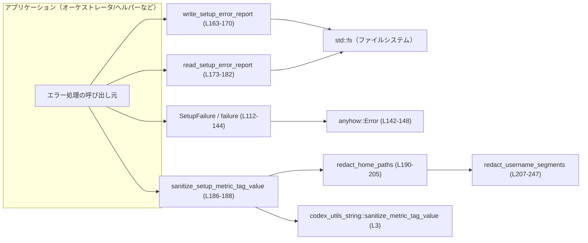
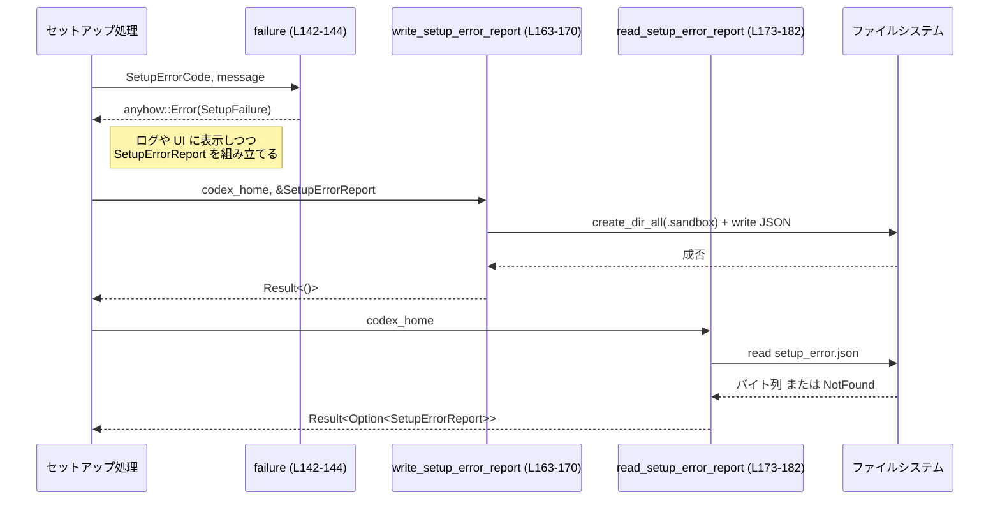
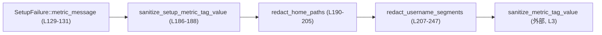

# windows-sandbox-rs/src/setup_error.rs

---

## 0. ざっくり一言

Elevated な Windows サンドボックスセットアップ処理の **エラーコード定義・エラーレポートの JSON 永続化・メトリクスタグ用メッセージのマスキング** を行うユーティリティモジュールです（`SetupFailure` 型と周辺関数が中心）。（`setup_error.rs:L16-183`）

---

## 1. このモジュールの役割

### 1.1 概要

このモジュールは、Windows サンドボックスのセットアップ処理における失敗を扱うために存在し、次の機能を提供します。

- セットアップの失敗内容を分類する **列挙体 `SetupErrorCode`**（`setup_error.rs:L16-68`）
- コードとメッセージからなる **構造化エラーレポート `SetupErrorReport` / ランタイムエラー型 `SetupFailure`**（`setup_error.rs:L105-115`）
- エラーレポートを `codex_home/.sandbox/setup_error.json` として **読み書き/削除する関数群**（`setup_error.rs:L150-182`）
- エラーメッセージからユーザー名をマスクし、メトリクスタグ向けにサニタイズする **文字列処理関数**（`setup_error.rs:L185-247`）

### 1.2 アーキテクチャ内での位置づけ

このモジュール自身だけから分かる依存関係を簡略化して示します。



- アプリケーションコードから `SetupFailure` を通じて `anyhow::Error` に統合し（`failure` / `extract_failure`）、必要に応じて JSON ファイルに書き出します（`write_setup_error_report`）。  
- メトリクス送信時には `sanitize_setup_metric_tag_value` を経由し、ユーザー名などを伏せたタグ値を作ります。（`setup_error.rs:L186-205`）

### 1.3 設計上のポイント

コードから読み取れる設計上の特徴です。

- **エラー分類の一元化**  
  - 失敗パターンは `SetupErrorCode` に集約されており、オーケストレータ側／ヘルパー側のどちらで発生したかも区別しています（`setup_error.rs:L17-68`）。
- **anyhow との統合**  
  - `failure` と `extract_failure` により、`SetupFailure` を `anyhow::Error` に包んだり、逆に取り出したりできます（`setup_error.rs:L142-148`）。
- **ディスク上の構造化レポート**  
  - `SetupErrorReport` を JSON として保存・読込することで、elevated プロセスと非 elevated プロセスの間でエラー情報を共有できる構造になっています（`setup_error.rs:L150-182`）。
- **プライバシー考慮のメトリクスサニタイズ**  
  - メッセージ中のユーザー名を `<user>` に置換し、さらに外部ユーティリティでメトリクスタグとして安全な形式に変換しています（`setup_error.rs:L186-188`）。
- **エラー処理ポリシー**  
  - ファイル読み書きでは `anyhow::Context` を用いてエラーにパス情報を付加しつつ、NotFound だけは非エラーとして扱うなど、呼び出し元が扱いやすい API になっています（`setup_error.rs:L154-161`,`L173-179`）。
- **安全性・並行性**  
  - `unsafe` は使用しておらず、全ての型は `String` とコピー可能な enum のみから構成されるため、スレッド間共有 (`Send`/`Sync`) も可能な設計です。

---

## 2. 主要な機能一覧

- `SetupErrorCode`: サンドボックスセットアップの失敗種別を表す列挙体
- `SetupErrorReport`: エラーコードとメッセージからなる構造化レポート
- `SetupFailure`: ランタイムで使うカスタムエラー型（`std::error::Error` 実装）
- `failure`: `SetupErrorCode` + メッセージから `anyhow::Error` を生成
- `extract_failure`: `anyhow::Error` から `SetupFailure` を取り出すダウンキャストヘルパー
- `setup_error_path`: `codex_home/.sandbox/setup_error.json` のパスを構築
- `clear_setup_error_report`: JSON エラーレポートファイルを削除（なければ無視）
- `write_setup_error_report`: `SetupErrorReport` を JSON でディスクに書き出し
- `read_setup_error_report`: JSON から `SetupErrorReport` を読み出す（なければ `None`）
- `sanitize_setup_metric_tag_value`: メトリクスタグ向けにメッセージをマスク & サニタイズ
- `redact_home_paths`: 環境変数から得たユーザー名を元にメッセージ中のパスをマスク
- `redact_username_segments`: 文字列中のパスセグメントからユーザー名部分を `<user>` に置換

---

## 3. 公開 API と詳細解説

### 3.1 型一覧（構造体・列挙体など）

| 名前 | 種別 | 役割 / 用途 | 定義位置 |
|------|------|-------------|----------|
| `SetupErrorCode` | `enum` | サンドボックスセットアップ時の代表的な失敗パターンを列挙します。オーケストレータ側・ヘルパー側のどちらで起きたかも区別します。 | `windows-sandbox-rs/src/setup_error.rs:L16-68` |
| `SetupErrorReport` | 構造体 | `code` と `message` を持つシリアライズ可能なレポート。JSON で永続化されます。 | `windows-sandbox-rs/src/setup_error.rs:L105-109` |
| `SetupFailure` | 構造体 | ランタイムで利用するカスタムエラー型。`std::error::Error` を実装し、`anyhow::Error` と組み合わせて使用されます。 | `windows-sandbox-rs/src/setup_error.rs:L112-115` |

#### `SetupErrorCode` の主なバリエーション

- オーケストレータ側失敗（`Orchestrator*` 系、例: ディレクトリ作成失敗、ヘルパープロセス起動失敗など）（`setup_error.rs:L17-31`）
- ヘルパー側失敗（`Helper*` 系、例: ログ書込・ユーザー作成・FW 設定・ACL 設定など）（`setup_error.rs:L32-68`）

これらはメトリクスのタグや JSON レポート内で使用されます。

---

### 3.2 関数詳細（重要な 7 件）

#### `SetupErrorCode::as_str(self) -> &'static str`  

（定義: `windows-sandbox-rs/src/setup_error.rs:L71-102`）

**概要**

`SetupErrorCode` の各バリアントを、スネークケースの文字列に変換します。メトリクスタグやログ出力に使うための安定した識別子です。

**引数**

| 引数名 | 型 | 説明 |
|--------|----|------|
| `self` | `SetupErrorCode` | 変換対象のエラーコード |

**戻り値**

- `&'static str`: 対応するスネークケースの静的文字列（例: `HelperSandboxDirCreateFailed` → `"helper_sandbox_dir_create_failed"`）。

**内部処理の流れ**

1. `match self` で全バリアントを列挙（`setup_error.rs:L73-100`）。
2. 各バリアントに対応する固定文字列を返す。
3. すべてのバリアントが網羅されており、`match` はコンパイル時に完全性チェックされます。

**Examples（使用例）**

```rust
let code = SetupErrorCode::HelperSandboxDirCreateFailed; // enum バリアントを選択
let tag = code.as_str();                                 // "helper_sandbox_dir_create_failed" を取得
println!("metric tag = {}", tag);
```

**Errors / Panics**

- エラーもパニックも発生しません（純粋なマッピングです）。

**Edge cases（エッジケース）**

- 追加された新バリアントには `as_str` 側の `match` も必ず追従する必要があります。追従しない場合はコンパイルエラーになるため、ランタイムの挙動不整合は起きません。

**使用上の注意点**

- 文字列は固定でありローカライズされていないため、そのままユーザー向け UI に表示するには向きません。メトリクスやログ検索キー向けの用途に適しています。

---

#### `failure(code: SetupErrorCode, message: impl Into<String>) -> anyhow::Error`  

（定義: `windows-sandbox-rs/src/setup_error.rs:L142-144`）

**概要**

`SetupFailure` を生成し、それを `anyhow::Error` で包んで返すユーティリティです。`anyhow` ベースのエラー処理とこのモジュールのカスタムエラーを橋渡しします。

**引数**

| 引数名 | 型 | 説明 |
|--------|----|------|
| `code` | `SetupErrorCode` | 失敗の種別 |
| `message` | `impl Into<String>` | 任意のエラーメッセージ（`String`/`&str` など） |

**戻り値**

- `anyhow::Error`: 内部に `SetupFailure` を保持したエラーオブジェクト。

**内部処理の流れ**

1. `SetupFailure::new(code, message)` を呼び出し `SetupFailure` を生成（`setup_error.rs:L118-123`）。
2. `anyhow::Error::new` に渡して `anyhow::Error` に変換（`setup_error.rs:L143`）。

**Examples（使用例）**

```rust
use anyhow::Result;

fn do_something(codex_home: &std::path::Path) -> Result<()> {
    // 何らかの条件でサンドボックスディレクトリ作成に失敗したと仮定
    Err(failure(
        SetupErrorCode::HelperSandboxDirCreateFailed,
        "failed to create sandbox directory",
    ))
}
```

**Errors / Panics**

- この関数自身は常に `anyhow::Error` を返すだけで、内部でパニックはしません。

**Edge cases**

- `message` に極端に長い文字列を渡した場合でも、そのまま `String` に格納されます。サイズ制限はありません。

**使用上の注意点**

- 後で `extract_failure` でダウンキャストして詳細を取得したい場合、この関数経由で生成したエラーを返す必要があります（`setup_error.rs:L146-148`）。
- `anyhow::Error` にラップすることで、他のエラーと同様に `?` 演算子と相性よく扱えます。

---

#### `clear_setup_error_report(codex_home: &Path) -> Result<()>`  

（定義: `windows-sandbox-rs/src/setup_error.rs:L154-161`）

**概要**

`codex_home/.sandbox/setup_error.json` を削除し、古いエラーレポートをクリアします。ファイルが存在しない場合は成功扱いにします。

**引数**

| 引数名 | 型 | 説明 |
|--------|----|------|
| `codex_home` | `&Path` | Codex のホームディレクトリパス |

**戻り値**

- `Result<()>`:  
  - `Ok(())`: 削除成功、もしくはファイルが存在しなかった場合  
  - `Err(anyhow::Error)`: その他の I/O エラー

**内部処理の流れ**

1. `setup_error_path(codex_home)` で JSON ファイルパスを取得（`setup_error.rs:L155`,`L150-152`）。
2. `fs::remove_file(&path)` を呼び出す（`setup_error.rs:L156`）。
3. 結果を `match` で分岐（`setup_error.rs:L156-160`）:
   - `Ok(())` → そのまま `Ok(())`
   - `Err` かつ `ErrorKind::NotFound` → `Ok(())`（ファイルがないことは問題としない）
   - それ以外の `Err` → `with_context` で `"remove {path}"` を付加して `Err` として返す

**Examples（使用例）**

```rust
fn reset_error_state(codex_home: &std::path::Path) -> anyhow::Result<()> {
    clear_setup_error_report(codex_home)?; // 古いエラーレポートを削除
    Ok(())
}
```

**Errors / Panics**

- `fs::remove_file` が `PermissionDenied` などを返した場合、`anyhow::Error` に変換されて `Err` になります。
- パニックは発生しません。

**Edge cases**

- ファイルが存在しない場合（初回起動や既に別プロセスが削除した場合）は、明示的に `Ok(())` となります（`setup_error.rs:L158`）。
- 他プロセスと競合して削除を試みている場合、タイミングによって `NotFound` か他のエラーとなる可能性があります。

**使用上の注意点**

- idempotent な API になっているため、セットアップ開始前に毎回呼び出しても安全です。
- ただし複数プロセスが同時にエラーレポートを扱う場合、どのプロセスがいつ削除するかの運用ルールを別途決める必要があります。

---

#### `write_setup_error_report(codex_home: &Path, report: &SetupErrorReport) -> Result<()>`  

（定義: `windows-sandbox-rs/src/setup_error.rs:L163-170`）

**概要**

`SetupErrorReport` を JSON にシリアライズし、`codex_home/.sandbox/setup_error.json` に保存します。ディレクトリが存在しない場合は作成します。

**引数**

| 引数名 | 型 | 説明 |
|--------|----|------|
| `codex_home` | `&Path` | Codex ホームディレクトリ |
| `report` | `&SetupErrorReport` | 保存したいエラーレポート |

**戻り値**

- `Result<()>`:  
  - `Ok(())`: 書き込み成功  
  - `Err(anyhow::Error)`: ディレクトリ作成・シリアライズ・書き込みのいずれかで失敗

**内部処理の流れ**

1. `sandbox_dir = codex_home.join(".sandbox")` を生成（`setup_error.rs:L164`）。
2. `fs::create_dir_all(&sandbox_dir)` でディレクトリを再帰的に作成し、`with_context` で `"create sandbox dir {sandbox_dir}"` を付加（`setup_error.rs:L165-166`）。
3. `path = setup_error_path(codex_home)` でファイルパスを取得（`setup_error.rs:L167`,`L150-152`）。
4. `serde_json::to_vec_pretty(report)` で JSON バイト列に変換（`setup_error.rs:L168`）。
5. `fs::write(&path, json)` でファイルへ書き込み、`with_context` で `"write {path}"` を付加（`setup_error.rs:L169`）。

**Examples（使用例）**

```rust
fn report_failure(codex_home: &std::path::Path, err: &SetupFailure) -> anyhow::Result<()> {
    let report = SetupErrorReport {
        code: err.code,
        message: err.message.clone(),
    };                                                      // 構造体に詰める
    write_setup_error_report(codex_home, &report)           // JSON に保存
}
```

**Errors / Panics**

- ディレクトリ作成失敗（権限不足など）、ディスクフル、`report` のシリアライズ失敗など、いずれも `Err(anyhow::Error)` になります。
- パニックは使用していません。`?` によりエラーが即座に伝播します（`setup_error.rs:L165-170`）。

**Edge cases**

- `codex_home` が存在しないパスでも、親ディレクトリが書き込み可能であれば `.sandbox` ディレクトリは作られます。
- 極端に大きな `message` を含むレポートでは、ファイルサイズが大きくなりますが、特別な制限はありません。

**使用上の注意点**

- 複数プロセスが同じ `codex_home` を共有している場合、同時に書き込みを行うと、最後に書いた方だけが残ります。ファイルロック等は行っていません。
- JSON フォーマットは `to_vec_pretty` を使っているため人間にも読みやすい形ですが、その分ファイルサイズはやや増えます（`setup_error.rs:L168`）。

---

#### `read_setup_error_report(codex_home: &Path) -> Result<Option<SetupErrorReport>>`  

（定義: `windows-sandbox-rs/src/setup_error.rs:L173-182`）

**概要**

`codex_home/.sandbox/setup_error.json` を読み込み、`SetupErrorReport` として返します。ファイルが存在しない場合は `Ok(None)` を返し、エラーとは見なしません。

**引数**

| 引数名 | 型 | 説明 |
|--------|----|------|
| `codex_home` | `&Path` | Codex ホームディレクトリ |

**戻り値**

- `Result<Option<SetupErrorReport>>`:
  - `Ok(Some(report))`: 読み込みと JSON パース成功
  - `Ok(None)`: ファイルが存在しない
  - `Err(anyhow::Error)`: 読み込み/パースに失敗

**内部処理の流れ**

1. `setup_error_path` からファイルパスを取得（`setup_error.rs:L174`）。
2. `fs::read(&path)` を `match` で処理（`setup_error.rs:L175-179`）:
   - `Ok(bytes)` → 続行
   - `Err` かつ `ErrorKind::NotFound` → `Ok(None)` を即返す（`setup_error.rs:L177`）
   - その他の `Err` → `with_context("read {path}")` で包んで `Err`
3. `serde_json::from_slice::<SetupErrorReport>(&bytes)` でパース（`setup_error.rs:L180`）。
4. 成功した `report` を `Ok(Some(report))` として返す（`setup_error.rs:L182`）。

**Examples（使用例）**

```rust
fn print_last_setup_error(codex_home: &std::path::Path) -> anyhow::Result<()> {
    if let Some(report) = read_setup_error_report(codex_home)? {
        eprintln!("Last setup error: {} ({})",
                  report.code.as_str(),            // コード文字列
                  report.message);                 // メッセージ
    } else {
        eprintln!("No setup error report found.");
    }
    Ok(())
}
```

**Errors / Panics**

- ファイルは存在するが読み取りに失敗（権限不足・I/O エラーなど）した場合、`Err` を返します（`setup_error.rs:L178`）。
- JSON の形式がおかしい場合（例えば手動編集など）は、パースエラーにコンテキスト `"parse {path}"` が付加され `Err` になります（`setup_error.rs:L180-181`）。
- パニックは行っていません。

**Edge cases**

- ファイルが空、または壊れた JSON の場合は `Err` となり、再トライやファイル削除などを呼び出し側で判断する必要があります。
- 別プロセスがファイルを書き込み中に読み取ろうとした場合、一時的に壊れた JSON を読む可能性があります。

**使用上の注意点**

- セットアップ結果を UI などで表示する場合は、この関数が返す `Option` を正しく解釈する必要があります（`None` は「エラーがなかった」ではなく「レポートが存在しない」）。
- 失敗レポートが古い可能性があるため、セットアップのタイムスタンプなどが必要なら別途フィールドを追加する必要があります（現状のコードにはタイムスタンプはありません）。

---

#### `sanitize_setup_metric_tag_value(value: &str) -> String`  

（定義: `windows-sandbox-rs/src/setup_error.rs:L185-188`）

**概要**

メトリクスタグとして送信する前提で、エラーメッセージ文字列からユーザー名をマスクし、さらに外部ユーティリティでタグ用にサニタイズした文字列を返します。

**引数**

| 引数名 | 型 | 説明 |
|--------|----|------|
| `value` | `&str` | 元のエラーメッセージ |

**戻り値**

- `String`: ユーザー名が `<user>` に置換された上で、`sanitize_metric_tag_value` によりタグ向けに整形された文字列。

**内部処理の流れ**

1. `redact_home_paths(value)` で、パス中のユーザー名を `<user>` に置換した新しい文字列を得る（`setup_error.rs:L187`,`L190-205`）。
2. その文字列の `&str` を取り出し、`sanitize_metric_tag_value`（外部クレート）へ渡して最終的なサニタイズ結果を得る（`setup_error.rs:L187`）。

**Examples（使用例）**

```rust
let failure = SetupFailure::new(
    SetupErrorCode::HelperUsersFileWriteFailed,
    "failed to write C:\\Users\\Alice\\secrets.json",
);
let metric_value = failure.metric_message(); // 内部で sanitize_setup_metric_tag_value を使用
// metric_value には "C:\\Users\\<user>\\secrets.json" のようなマスク済み文字列が含まれる
```

※ `metric_message` は `SetupFailure` のメソッドで、この関数をラップしています（`setup_error.rs:L129-131`）。

**Errors / Panics**

- この関数自身は I/O を行わず、パニックも発生させません。
- `sanitize_metric_tag_value` の挙動詳細はこのファイルには書かれていません（`setup_error.rs:L3`）。ここでは「メトリクスタグとして使いやすくするためのサニタイズ」を行うユーティリティと解釈できますが、正確な仕様は不明です。

**Edge cases**

- `value` が空文字列の場合もそのまま処理され、空文字列か、それに準ずるサニタイズ結果が返ると考えられます。
- 既に `<user>` が含まれている文字列でも、追加の処理は特に行われません。

**使用上の注意点**

- メッセージにユーザー名以外の機密情報（メールアドレスなど）が含まれる場合、それらは `redact_home_paths` ではマスクされません。そのような情報はメッセージに含めない設計が望ましいです。
- メトリクスタグとして長すぎる文字列になると、メトリクスバックエンドによっては切り捨てやエラーになる可能性がありますが、長さ制限はこの関数では設けていません。

---

#### `redact_home_paths(value: &str) -> String`  

（定義: `windows-sandbox-rs/src/setup_error.rs:L190-205`）

**概要**

環境変数 `USERNAME` と `USER` から取得したユーザー名候補のリストを使い、文字列 `value` 内のパスセグメントから該当するユーザー名を `<user>` にマスクした文字列を返します。

**引数**

| 引数名 | 型 | 説明 |
|--------|----|------|
| `value` | `&str` | エラーメッセージなど任意の文字列 |

**戻り値**

- `String`: `value` に含まれるパスセグメントのうち、現在のユーザー名と一致する部分が `<user>` に置換された結果。

**内部処理の流れ**

1. 空の `usernames: Vec<String>` を用意（`setup_error.rs:L191`）。
2. `std::env::var("USERNAME")` を取得し、成功かつ空白を除いて非空ならリストに追加（`setup_error.rs:L192-195`）。
3. `std::env::var("USER")` を同様に取得し、非空かつ既に `usernames` に大小文字無視で存在しない場合のみ追加（`setup_error.rs:L197-201`）。
4. 最後に `redact_username_segments(value, &usernames)` を呼び出し、その結果を返す（`setup_error.rs:L203-204`）。

**Examples（使用例）**

```rust
// 環境変数 USERNAME=Alice の環境を想定
let msg = "failed to write C:\\Users\\Alice\\file.txt";
let redacted = redact_home_paths(msg);
// redacted は "failed to write C:\\Users\\<user>\\file.txt" になる
```

**Errors / Panics**

- 環境変数取得に失敗しても `Err` は無視され、単にユーザー名リストに追加されないだけです（`setup_error.rs:L192`,`L197`）。
- パニックは行いません。

**Edge cases**

- 環境変数が設定されていない／空文字の場合は、ユーザー名リストが空になり、`redact_username_segments` は `value` をそのまま返します（`setup_error.rs:L208-210`）。
- `USERNAME` と `USER` が同じ名前を指す場合でも、大小文字無視で重複を排除しており、ユーザー名が二重登録されることはありません（`setup_error.rs:L197-201`）。

**使用上の注意点**

- これらの環境変数が実際のホームディレクトリ名と一致していることが前提となっています。特殊な環境設定では完全にマスクできない可能性があります。
- この関数は OS による大小文字の扱いを考慮しておらず、大小文字の判定は **後段の `redact_username_segments` 内** で行われます。

---

#### `redact_username_segments(value: &str, usernames: &[String]) -> String`  

（定義: `windows-sandbox-rs/src/setup_error.rs:L207-247`）

**概要**

与えられた `usernames` のいずれかと一致するパスセグメントを `<user>` に置換して返します。パス区切り文字 `'\\'` と `'/'` をセグメント境界として扱います。

**引数**

| 引数名 | 型 | 説明 |
|--------|----|------|
| `value` | `&str` | 入力文字列（パスを含むメッセージ想定） |
| `usernames` | `&[String]` | マスク対象とするユーザー名のリスト |

**戻り値**

- `String`: 該当するセグメントが `<user>` に置換された文字列。

**内部処理の流れ**

1. `usernames` が空なら `value.to_string()` をそのまま返す（`setup_error.rs:L208-210`）。
2. `segments: Vec<String>` と `separators: Vec<char>`、作業用 `current` を用意（`setup_error.rs:L212-214`）。
3. `value.chars()` をループし、`'\\'` または `'/'` を見つけるたびに:
   - `current` を `segments` に push（`std::mem::take` で空にする）（`setup_error.rs:L216-219`）
   - セパレータ文字を `separators` に push（`setup_error.rs:L219`）
   - それ以外の文字は `current` に追加（`setup_error.rs:L220-222`）
4. ループ終了後、最後の `current` を `segments` に push（`setup_error.rs:L224`）。
5. 各 `segment` について、`usernames` に含まれるか判定し、一致すれば `<user>` に置換（`setup_error.rs:L226-236`）。
   - `cfg!(windows)` が `true` の場合は `eq_ignore_ascii_case` で大小文字無視比較（`setup_error.rs:L227-231`）。
   - それ以外の OS では完全一致による比較（`setup_error.rs:L232-233`）。
6. 最後に `segments` と `separators` を交互に連結して `out` を作り、返す（`setup_error.rs:L239-246`）。

**Examples（使用例）**

テストコードからの例です（`setup_error.rs:L255-278`）。

```rust
let usernames = vec!["Alice".to_string(), "Bob".to_string()];
let msg = "failed to write C:\\Users\\Alice\\file.txt; fallback D:\\Profiles\\Bob\\x";
let redacted = redact_username_segments(msg, &usernames);
assert_eq!(
    redacted,
    "failed to write C:\\Users\\<user>\\file.txt; fallback D:\\Profiles\\<user>\\x"
);
```

**Errors / Panics**

- 標準ライブラリの操作のみで、パニックの可能性はほぼありません（インデックス演算は `Vec::get` を使用、`setup_error.rs:L242-243`）。

**Edge cases**

- `usernames` が空のときは `value` がそのまま返されます（`setup_error.rs:L208-210`）。
- パス区切りの前後が空文字列になるケース（文字列先頭に区切り文字がある場合）も、そのまま空セグメントとして扱われます。
- Windows ビルド (`cfg!(windows)` が `true`) では `Alice` と `ALICE` を同一と見なしますが、Unix ビルドでは大文字小文字を区別します（`setup_error.rs:L227-233`）。

**使用上の注意点**

- この関数はパスの文法には踏み込まず、単純に `'\\'` / `'/'` を区切りとするだけです。例えば URL などでも同様の処理になります。
- `<user>` 文字列そのものをユーザー名として渡した場合、自分自身も `<user>` に置換されるため、二重にマスクされます（結果の意味は変わりませんが、意図しない場合があります）。

---

### 3.3 その他の関数

| 関数名 | シグネチャ | 役割（1 行） | 定義位置 |
|--------|------------|--------------|----------|
| `SetupFailure::new` | `fn new(code: SetupErrorCode, message: impl Into<String>) -> Self` | コードとメッセージから `SetupFailure` を生成します。 | `windows-sandbox-rs/src/setup_error.rs:L118-123` |
| `SetupFailure::from_report` | `fn from_report(report: SetupErrorReport) -> Self` | `SetupErrorReport` から `SetupFailure` を復元します。 | `windows-sandbox-rs/src/setup_error.rs:L125-127` |
| `SetupFailure::metric_message` | `fn metric_message(&self) -> String` | 自身のメッセージを `sanitize_setup_metric_tag_value` でメトリクスタグ向けに変換します。 | `windows-sandbox-rs/src/setup_error.rs:L129-131` |
| `extract_failure` | `fn extract_failure(err: &anyhow::Error) -> Option<&SetupFailure>` | `anyhow::Error` にラップされた `SetupFailure` をダウンキャストして参照を取得します。 | `windows-sandbox-rs/src/setup_error.rs:L146-148` |
| `setup_error_path` | `fn setup_error_path(codex_home: &Path) -> PathBuf` | `codex_home/.sandbox/setup_error.json` のパスを組み立てます。 | `windows-sandbox-rs/src/setup_error.rs:L150-152` |

---

## 4. データフロー

### 4.1 エラーレポートの生成から読み出しまで

ここでは、典型的なフローとして「セットアップ失敗 → JSON レポート書き込み → 後段で読み出し」を示します。



- `failure` を通じて `SetupFailure` を `anyhow::Error` に統合し（`setup_error.rs:L142-144`）、必要に応じて `SetupErrorReport` を構築した上で `write_setup_error_report` を呼び出します。
- 別のプロセスや後続処理では `read_setup_error_report` を用いて、最後のセットアップエラー内容を取得します。

### 4.2 メトリクスタグ向けサニタイズ



- `SetupFailure::metric_message` がエラーメッセージを `sanitize_setup_metric_tag_value` に渡し（`setup_error.rs:L129-131`）、
- ユーザー名マスク → メトリクスタグ向けのサニタイズ、という順で処理されます。

---

## 5. 使い方（How to Use）

### 5.1 基本的な使用方法

ここでは、セットアップ処理内でのエラー発生から、レポート書き込み・読み出し・メトリクス用タグ生成までを一連の例として示します。

```rust
use std::path::Path;
use anyhow::Result;
use windows_sandbox_rs::setup_error::{
    SetupErrorCode, SetupErrorReport, SetupFailure,
    failure, write_setup_error_report, read_setup_error_report,
};

// セットアップ処理内での利用例
fn run_setup(codex_home: &Path) -> Result<()> {
    // 何らかのセットアップ処理 …
    let err: anyhow::Error = failure(                        // SetupFailure を anyhow::Error に
        SetupErrorCode::HelperSandboxDirCreateFailed,        // エラーコード
        "failed to create sandbox directory",                // メッセージ
    );

    // ログなどに出す
    eprintln!("setup failed: {err}");

    // レポートを書き出す
    let failure = windows_sandbox_rs::setup_error::extract_failure(&err)
        .expect("failure should wrap SetupFailure");         // ダウンキャスト
    let report = SetupErrorReport {
        code: failure.code,
        message: failure.message.clone(),
    };
    write_setup_error_report(codex_home, &report)?;          // JSON に保存

    Err(err)                                                // 呼び出し元へ伝播
}

// 後続処理での読み出しとメトリクスタグ生成
fn report_metrics(codex_home: &Path) -> Result<()> {
    if let Some(report) = read_setup_error_report(codex_home)? {
        let failure = SetupFailure::from_report(report);      // レポートから復元
        let tag_value = failure.metric_message();             // ユーザー名をマスクしたタグ
        // ここでメトリクス送信クライアントに tag_value を渡す …
        println!("metric tag: {}", tag_value);
    }
    Ok(())
}
```

### 5.2 よくある使用パターン

1. **elevated ヘルパー → 非 elevated オーケストレータ**

   - ヘルパー側で `SetupFailure` 発生 → `SetupErrorReport` を `write_setup_error_report` で保存。
   - オーケストレータ側で `read_setup_error_report` を呼んで詳細を取得し、UI/ログ/メトリクスで利用。

2. **メトリクスタグ生成**

   - 既に `SetupFailure` オブジェクトを持っている場合は、`metric_message` を直接呼ぶのが最も簡単です（`setup_error.rs:L129-131`）。

### 5.3 よくある間違い

```rust
// 間違い例: anyhow::Error を直接作ってしまう
fn bad_usage() -> anyhow::Result<()> {
    // これでは SetupErrorCode/SetupFailure の情報を後から取り出せない
    Err(anyhow::anyhow!("failed to create sandbox directory"))
}

// 正しい例: failure 経由で SetupFailure を包む
fn good_usage() -> anyhow::Result<()> {
    Err(failure(
        SetupErrorCode::HelperSandboxDirCreateFailed,
        "failed to create sandbox directory",
    ))
}
```

```rust
// 間違い例: エラーがないのにレポートを削除しない
fn forget_clear(codex_home: &Path) -> anyhow::Result<()> {
    // 新しいセットアップ前に古いレポートが残ってしまう
    // clear_setup_error_report を呼んでいない
    Ok(())
}

// 正しい例: セットアップ開始前にクリアしておく
fn proper_clear(codex_home: &Path) -> anyhow::Result<()> {
    clear_setup_error_report(codex_home)?; // NotFound は成功扱い
    Ok(())
}
```

### 5.4 使用上の注意点（まとめ）

- **前提条件**
  - `codex_home` は書き込み可能なディレクトリである必要があります（`write_setup_error_report` / `clear_setup_error_report` / `read_setup_error_report`）。
- **エラー処理**
  - NotFound は「レポートが存在しないだけ」として成功扱いにしているため、存在チェックを別途行う必要はありません（`setup_error.rs:L158`,`L177`）。
- **並行性**
  - このモジュールはファイルロックを行っていないため、複数プロセスが同じ `setup_error.json` を同時に書き換える場合は、最終的な内容は未定義です。
- **セキュリティ / プライバシー**
  - ユーザー名は `<user>` でマスクされますが、その他の機密情報（パス全体、ファイル名、エラーメッセージに埋め込まれたトークンなど）はそのまま残ります。メッセージ生成側の設計も重要です。
- **Rust 言語特有の安全性**
  - `unsafe` を含まない純粋な安全 Rust で実装されており、所有権・借用・ライフタイムはすべてコンパイラにより検査されます。
  - `SetupFailure` は `SetupErrorCode` と `String` のみをフィールドに持つため、`Send`/`Sync` なエラーとしてスレッド間で共有できます。

---

## 6. 変更の仕方（How to Modify）

### 6.1 新しい機能を追加する場合

**例: 新しいエラーコードと対応する JSON レポート項目を追加する**

1. `SetupErrorCode` に新しいバリアントを追加する（`setup_error.rs:L16-68`）。
2. `SetupErrorCode::as_str` の `match` にも同名のマッピングを追加する（`setup_error.rs:L71-102`）。  
   → 追加し忘れた場合はコンパイルエラーになるため検出しやすい構造です。
3. 必要であれば、呼び出し側コードで新しいバリアントを使った `failure` 呼び出しを追加する。
4. メトリクスや UI ログで新しいコードがどのように扱われるかを確認する。

**例: レポートに追加フィールド（タイムスタンプなど）を持たせたい場合**

1. `SetupErrorReport` にフィールドを追加する（`setup_error.rs:L105-109`）。
2. JSON 互換性を保つため、追加フィールドはオプショナル (`Option<T>`) にするか、デフォルト値を考慮する。
3. レポート生成側と読み出し側の両方で新フィールドを設定・利用するコードを追加する。

### 6.2 既存の機能を変更する場合

- **影響範囲の確認**
  - `SetupErrorCode` のバリアント名や `as_str` の文字列を変更すると、メトリクスタグ値や JSON の内容が変わり、既存ダッシュボード・アラートに影響します。
- **契約事項**
  - `read_setup_error_report` は「NotFound → `Ok(None)`」という契約を持っているため、これを変えると呼び出し側のロジック（エラー扱いにするかどうか）が崩れます（`setup_error.rs:L177`）。
  - `sanitize_setup_metric_tag_value` は「ユーザー名を `<user>` にマスクする」という前提の上で設計されていると考えられます。挙動を変えるとダッシュボード上での粒度が変わる可能性があります。
- **テストの確認**
  - `redact_username_segments` のテストが 3 つ用意されているため（`setup_error.rs:L255-278`）、この関数や関連ロジックを変更した場合はテストがどのように変わるかを確認する必要があります。

---

## 7. 関連ファイル

このチャンクから直接分かる範囲での関連ファイル・コンポーネントです。

| パス / コンポーネント | 役割 / 関係 |
|------------------------|------------|
| `codex_utils_string::sanitize_metric_tag_value` | メトリクスタグ用の文字列サニタイズユーティリティ。`sanitize_setup_metric_tag_value` から呼び出されています（`setup_error.rs:L3`,`L186-188`）。内部実装はこのチャンクには現れません。 |
| `anyhow` クレート | `Result` 型・`Error` ラッパー・`Context` トレイトを提供し、このモジュールのエラーラッピングとコンテキスト付与に使用されています（`setup_error.rs:L1-2`,`L154-161`,`L173-182`）。 |
| `serde` / `serde_json` | `SetupErrorReport` のシリアライズ・デシリアライズに利用され、JSON ファイルとの橋渡しをします（`setup_error.rs:L4-5`,`L105-109`,`L168`,`L180`）。 |
| （オーケストレータ / ヘルパー側コード） | コメントから、CLI オーケストレータおよび elevated ヘルパープロセスが存在することが読み取れますが、それらの実装ファイルはこのチャンクには現れません（`setup_error.rs:L17-68` のコメント）。 |

---

## テストと信頼性に関する補足

- `#[cfg(test)] mod tests` 内で `redact_username_segments` の挙動が 3 ケース検証されています（`setup_error.rs:L249-280`）。
  - ユーザー名セグメントのマスク動作（`sanitize_tag_value_redacts_username_segments`、`setup_error.rs:L255-263`）。
  - 未知のセグメントは変更されないこと（`sanitize_tag_value_leaves_unknown_segments`、`setup_error.rs:L265-271`）。
  - 同一ユーザー名が複数回出現する場合に全てマスクされること（`sanitize_tag_value_redacts_multiple_occurrences`、`setup_error.rs:L273-278`）。
- これらのテストにより、ユーザー名マスクロジックが意図通りである程度保証されていますが、環境変数の取得や `cfg!(windows)` の分岐などはテストからは直接確認できません（このチャンクにはプラットフォームごとのテストは現れていません）。

---

## 潜在的なバグ・セキュリティに関する観点（コードから読み取れる範囲）

- **情報漏えいリスクの低減**
  - ユーザー名を `<user>` に置換することで、メトリクスタグに OS アカウント名が直接載ることを避けています（`setup_error.rs:L226-236`）。
- **残存リスク**
  - パス全体やファイル名自体はそのまま残るため、環境によっては機密情報（プロジェクト名など）が推測される可能性があります。
- **競合状態**
  - 同一ファイルへの同時書き込み・削除・読み込みについては特別な同期を行っておらず、他プロセスとの競合による一時的な不整合（壊れた JSON を読み取る等）の可能性があります。
- **プラットフォーム依存の比較**
  - `cfg!(windows)` による大小文字無視比較は Windows ビルド時にのみ有効であり、クロスビルド環境などで OS と実際の挙動が食い違う可能性はありますが、通常の利用では問題になりにくい構造です（`setup_error.rs:L227-233`）。
