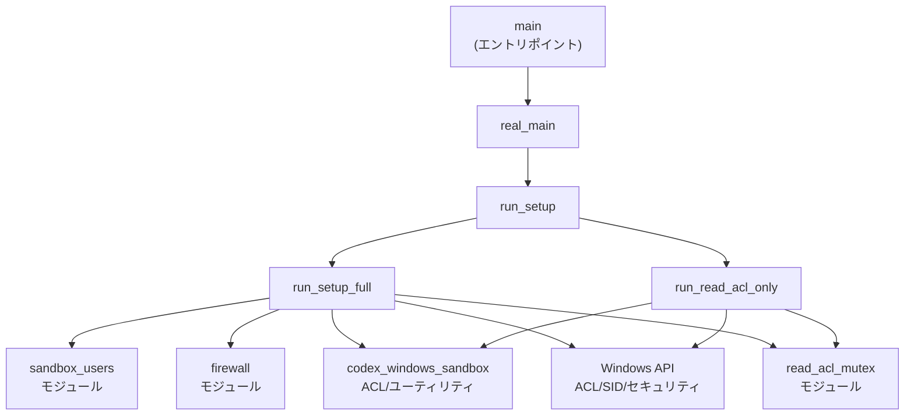
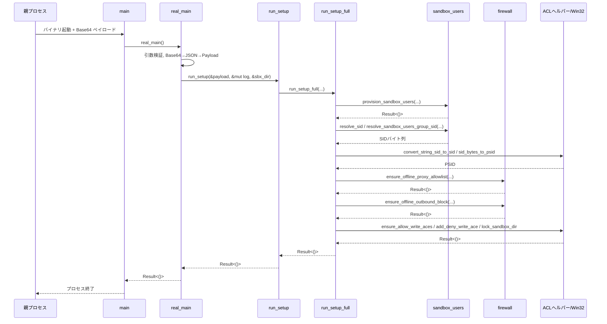

## windows-sandbox-rs/src/setup_main_win.rs

---

## 0. ざっくり一言

Windows 専用の「セットアップヘルパー」バイナリのメイン処理で、  
ACL（アクセス制御）、ファイアウォール、サンドボックス用ユーザー／ディレクトリの設定を行うモジュールです。  
すべての記述は `setup_main_win.rs` 内（おおよそ L1–L918）にあります。

※ このチャンクには行番号情報が含まれていないため、以下の「L1–L918」は「このファイル全体」を指す粗い範囲として扱います。

---

## 1. このモジュールの役割

### 1.1 概要

このモジュールは、Codex の Windows サンドボックス環境を準備・更新するための「セットアップバイナリ」のエントリポイントとコアロジックを提供します（`setup_main_win.rs:L1-918`）。

- CLI 引数で受け取った Base64 文字列を JSON にデコードし、`Payload` として解釈します。
- `Payload` に基づいて、以下を行います:
  - サンドボックス用ユーザー・グループのプロビジョニング（作成・設定）
  - ファイアウォールルール（オフラインユーザーのプロキシ用許可と外向き通信ブロック）
  - 読み取り・書き込みルートに対する ACL（Allow/Deny ACE）の付与
  - サンドボックスディレクトリ（bin / main / secrets）とワークスペースの `.codex` / `.agents` の保護

### 1.2 アーキテクチャ内での位置づけ

このモジュールは「Windows セットアップヘルパー」バイナリの `main` を提供し、内部で複数のサブモジュールや外部クレート／Win32 API を呼び出します。

- エントリポイント: `pub fn main() -> Result<()>`
- コアドライバ: `real_main` → `run_setup` → `run_setup_full` / `run_read_acl_only`
- サブモジュール:
  - `firewall` … ファイアウォールルールの作成・更新（`mod firewall;`）
  - `read_acl_mutex` … 読み取り ACL 更新の並行実行抑止用のミューテックス
  - `sandbox_users` … サンドボックス用ユーザーとグループの操作（SID 取得・プロビジョニング）
- 外部クレート `codex_windows_sandbox` … ACL 操作やログ、パスユーティリティなどを提供
- Win32 API（`windows_sys`） … ACL / SID 操作（`ConvertStringSidToSidW`, `SetEntriesInAclW`, `SetNamedSecurityInfoW` 等）



### 1.3 設計上のポイント

- **設定駆動**  
  - 実行時の振る舞いはほぼすべて `Payload` の JSON で指定（バージョン番号、ユーザー名、ルートパス、モード、フラグ等）。
- **エラーコードの明示化**  
  - 失敗は `SetupFailure`（`SetupErrorCode` とメッセージ）にラップし、上位層が機械的に扱えるようにしています（例: `real_main`, `run_setup_full` 内）。
- **安全性重視の ACL 設計**  
  - 読み取り／書き込み権限を明示的に付与し、必要に応じて deny ACE を追加することで、サンドボックスからの逸脱を防ぐ構造になっています。
- **並行・再入防止**  
  - 読み取り ACL の更新は、専用プロセス (`spawn_read_acl_helper`) とミューテックス (`read_acl_mutex`) で直列化しています。
  - 書き込み ACE 付与は `std::thread::scope` とチャンネルで並列化しつつ、結果を集約してエラーを管理しています。
- **Win32 FFI の利用**  
  - `lock_sandbox_dir` などで `unsafe` ブロックを使用し、Win32 の ACL API を直接呼び出します。  
  - 取得したポインタ（ACL / SID）は `LocalFree` で解放することでメモリ管理を行っています。

---

## 2. 主要な機能一覧（コンポーネントインベントリー）

### 2.1 型・定数

| 名前 | 種別 | 役割 / 用途 | 定義位置 |
|------|------|-------------|----------|
| `Payload` | 構造体 | セットアップヘルパーの設定ペイロード（ユーザー名・ルートパス・モード等）。JSON からデシリアライズされます。 | `setup_main_win.rs:L1-918` |
| `SetupMode` | enum | セットアップのモード（`Full` / `ReadAclsOnly`）。ペイロードで指定。 | 同上 |
| `ReadAclSubjects<'a>` | 構造体 | 読み取り ACL をチェック・付与する対象 SID 群（サンドボックスグループ + 既存 SID 群）。 | 同上 |
| `DENY_ACCESS` | 定数 `i32` | Win32 の `ACCESS_MODE::DENY_ACCESS` 相当（3）。`lock_sandbox_dir` で deny ACE を付与するために使用。 | 同上 |

### 2.2 関数

| 名前 | 役割 / 用途 | 公開/非公開 | 定義位置 |
|------|-------------|------------|----------|
| `main() -> Result<()>` | バイナリのエントリポイント。`real_main` を呼び出し、トップレベルエラーをログに書き出します。 | 公開 | `setup_main_win.rs:L1-918` |
| `real_main() -> Result<()>` | CLI 引数からペイロードを復元し、バージョンチェック・ログファイル準備・`run_setup` 実行・エラーレポート出力を行う中核関数。 | 非公開 | 同上 |
| `run_setup(payload, log, sbx_dir)` | `SetupMode` に応じて `run_read_acl_only` または `run_setup_full` を呼び分けるディスパッチ関数。 | 非公開 | 同上 |
| `run_read_acl_only(payload, log)` | 読み取り ACL のみを更新する簡易モード。ミューテックスで排他し、`apply_read_acls` を実行します。 | 非公開 | 同上 |
| `run_setup_full(payload, log, sbx_dir)` | フルセットアップ：ユーザープロビジョニング、ファイアウォール設定、ACL 付与、ディレクトリ保護等をまとめて実行します。 | 非公開 | 同上 |
| `log_line(log, msg)` | タイムスタンプ付きでログファイルに 1 行書き込みます。失敗時は `SetupFailure::HelperLogFailed`。 | 非公開 | 同上 |
| `spawn_read_acl_helper(payload, log)` | 自身と同じバイナリを `ReadAclsOnly` + `refresh_only=true` で非表示ウィンドウとして再起動します。 | 非公開 | 同上 |
| `apply_read_acls(...)` | 読み取りルートごとに、対象 SID に対する読み取り系 ACE を確認／付与します。 | 非公開 | 同上 |
| `read_mask_allows_or_log(...)` | `path_mask_allows` のラッパー。エラー時にログと `refresh_errors` への蓄積を行い、`false` を返します。 | 非公開 | 同上 |
| `lock_sandbox_dir(...)` | 指定ディレクトリに対し、サンドボックスグループ・SYSTEM・Administrators・実ユーザー向けの ACL を Win32 API で設定します。 | 非公開 | 同上 |

### 2.3 サブモジュール

| モジュール名 | 役割 / 関係 | 定義場所 |
|-------------|------------|----------|
| `firewall` | オフラインユーザーのファイアウォールルール管理。`run_setup_full` から呼ばれます。 | `mod firewall;` によりこのモジュール配下の別ファイル |
| `read_acl_mutex` | 読み取り ACL 更新の排他制御を行うミューテックス。`acquire_read_acl_mutex`, `read_acl_mutex_exists` を提供。 | `mod read_acl_mutex;` |
| `sandbox_users` | サンドボックス用ユーザーとグループのプロビジョニング・SID 解決・PSID 変換。 | `mod sandbox_users;` |

---

## 3. 公開 API と詳細解説

### 3.1 型一覧（構造体・列挙体など）

#### `Payload`

| フィールド | 型 | 説明 |
|-----------|----|------|
| `version` | `u32` | ペイロードフォーマット／セットアップバージョン。`SETUP_VERSION` と一致必須。 |
| `offline_username` | `String` | オフライン実行用サンドボックスユーザー名。 |
| `online_username` | `String` | オンライン実行用サンドボックスユーザー名。 |
| `codex_home` | `PathBuf` | Codex のホームディレクトリ。サンドボックスディレクトリのベース。 |
| `command_cwd` | `PathBuf` | コマンド実行時のカレントディレクトリ。ワークスペース識別や deny ACE 適用に使用。 |
| `read_roots` | `Vec<PathBuf>` | 読み取り専用アクセスを確保したいルートディレクトリ群。 |
| `write_roots` | `Vec<PathBuf>` | 書き込みアクセスを与えるルートディレクトリ群。 |
| `deny_write_paths` | `Vec<PathBuf>` | 書き込み禁止（deny-write ACE）を付与する個別パス群（読み取り専用のカーブアウト）。デフォルト空。 |
| `proxy_ports` | `Vec<u16>` | プロキシ用ポート番号リスト（ファイアウォール許可に利用）。 |
| `allow_local_binding` | `bool` | ローカルバインドを許可するかどうかのフラグ。 |
| `real_user` | `String` | 実際に Codex を操作している Windows ユーザー名。サンドボックス dir へのフルアクセスを確保。 |
| `mode` | `SetupMode` | セットアップモード（`Full` / `ReadAclsOnly`）。デフォルト `Full`。 |
| `refresh_only` | `bool` | リフレッシュ実行かどうか。`true` の場合、ユーザープロビジョニングや一部ロック処理をスキップ。 |

#### `SetupMode`

- `Full`（デフォルト）  
  フルセットアップ（ユーザー、ファイアウォール、ACL、ディレクトリ保護等）を実行。

- `ReadAclsOnly`  
  読み取り ACL の更新のみを行う軽量モード。

#### `ReadAclSubjects<'a>`

- フィールド:
  - `sandbox_group_psid: *mut c_void`  
    サンドボックス用 Windows グループの SID（ポインタ）。
  - `rx_psids: &'a [*mut c_void]`  
    既存の読み取り権限を持つことが期待される SID 群（Users, Authenticated Users, Everyone など）。

### 3.2 関数詳細（7 件）

#### `pub fn main() -> Result<()>`

**概要**

- Windows 用セットアップヘルパーバイナリのエントリポイントです。
- 内部で `real_main()` を呼び出し、トップレベルで発生したエラーを `CODEX_HOME` 配下のログにベストエフォートで記録します（`setup_main_win.rs:L1-918`）。

**引数**

- なし（標準的な `main` 関数として OS から呼ばれます）。

**戻り値**

- `Result<()>` (`anyhow::Result<()>`)  
  - 成功時: `Ok(())`
  - 失敗時: `Err(anyhow::Error)`（多くは `SetupFailure` にラップ済み）

**内部処理の流れ**

1. `real_main()` を呼び出して結果を `ret` に保持。
2. `ret` が `Err` の場合のみ:
   - 環境変数 `CODEX_HOME` を取得。
   - そこから `sandbox_dir` → `LOG_FILE_NAME` を組み立て、可能なら追記オープン。
   - 現在時刻とエラーメッセージを 1 行ログに書く（エラーは無視）。
3. `ret` をそのまま呼び出し元（ランタイム）に返す。

**Examples（使用例）**

この関数は直接呼び出すのではなく、ビルドされたバイナリとして起動されます。

```powershell
# 例: 外部プロセスから起動（概念的な例）
$payload = @{
  version = 1
  offline_username = "codex_offline"
  online_username  = "codex_online"
  codex_home       = "C:\Users\you\.codex"
  command_cwd      = "C:\work\project"
  read_roots       = @("C:\Program Files")
  write_roots      = @("C:\work\project")
  deny_write_paths = @("C:\work\project\readonly")
  proxy_ports      = @(8080)
  allow_local_binding = $true
  real_user        = "you"
  mode             = "full"
  refresh_only     = $false
} | ConvertTo-Json -Compress

$payloadBytes = [System.Text.Encoding]::UTF8.GetBytes($payload)
$payloadB64   = [System.Convert]::ToBase64String($payloadBytes)

& ".\windows-sandbox-setup.exe" $payloadB64
```

**Errors / Panics**

- ここではパニックを起こさず、`real_main` からの `Err` をそのまま返すだけです。
- ログ出力はベストエフォートであり、失敗してもエラーに影響しません。

**Edge cases（エッジケース）**

- `CODEX_HOME` が設定されていない場合:
  - ログ出力をスキップし、そのまま `ret` を返します。
- サンドボックスディレクトリやログファイルが作成できない場合:
  - ログ出力に失敗しますが、エラーには影響しません。

**使用上の注意点**

- ライブラリとしてではなく、バイナリとして利用されることを前提とした `main` です。
- エラーコードは `anyhow::Error` を通じて返されるため、呼び出し側（親プロセス）はプロセスの終了コード・標準出力／標準エラーを別途解釈する必要があります。

---

#### `fn real_main() -> Result<()>`

**概要**

- CLI 引数からペイロードを復元し、バージョンチェック・ログファイルのオープン・`run_setup` 呼び出し・エラーレポート生成までを一括で行う中核関数です。

**引数 / 戻り値**

- 引数: なし（`std::env::args()` を内部で取得）。
- 戻り値: `Result<()>`（`SetupFailure` にラップされた `anyhow::Error` を返す可能性あり）。

**内部処理の流れ**

1. `std::env::args()` を `Vec<String>` に収集し、要素数が 2（プログラム名 + ペイロード）であることを検証。
   - 違う場合は `SetupErrorCode::HelperRequestArgsFailed` でエラー。
2. 第 2 引数を Base64 デコード → JSON デシリアライズし、`Payload` に変換。
   - 失敗時はいずれも `HelperRequestArgsFailed`。
3. `payload.version` と `SETUP_VERSION` を比較し、異なればエラー。
4. `sandbox_dir(payload.codex_home)` を作成し、その配下にある `LOG_FILE_NAME` を append モードで開いて `log` とする。
5. `run_setup(&payload, &mut log, &sbx_dir)` を呼び出し、結果を `result` に保持。
6. `result` が `Err` の場合:
   - ログに書き出し、`log_note` にも通知。
   - `extract_setup_failure(err)` が Some の場合はコードをそのまま引き継ぎ、それ以外は `HelperUnknownError` として `SetupErrorReport` を生成。
   - `write_setup_error_report` を `codex_home` に出力（失敗してもログに書くだけ）。
7. 最終的に `result` を返す。

**Examples（使用例）**

ライブラリ的に使う場合の擬似例:

```rust
// 他モジュール内でのテスト/デバッグ目的の呼び出し例（概念）
fn debug_run() -> anyhow::Result<()> {
    std::env::set_var("CODEX_HOME", r"C:\Users\you\.codex");

    // env::args() を差し替えられないので、実際には integration test などで
    // コマンドライン引数を与えるのが現実的です。
    // ここでは構造だけ示します。
    crate::setup_main_win::real_main()
}
```

**Errors / Panics**

- 主なエラーコード:
  - `HelperRequestArgsFailed` … 引数個数不正、Base64 デコード／JSON 解析エラー、バージョン不一致。
  - `HelperSandboxDirCreateFailed` … サンドボックスディレクトリ作成失敗。
  - `HelperLogFailed` … ログファイルのオープン失敗。
- パニックは想定されておらず、エラーはすべて `anyhow::Error` 経由で返されます。

**Edge cases**

- ペイロードのバージョンが古い／新しい場合は即エラーとなります。
- `write_setup_error_report` に失敗しても、元のセットアップエラーより重く扱われることはなく、ログに記録されるのみです。

**使用上の注意点**

- `real_main` は直接公開されていませんが、振る舞いの変更はセットアップ全体に影響するため、エラーコードやログメッセージの契約（他コンポーネントがパースしている可能性）に注意が必要です。

---

#### `fn run_setup(payload: &Payload, log: &mut File, sbx_dir: &Path) -> Result<()>`

**概要**

- `Payload.mode` に応じて `run_read_acl_only` か `run_setup_full` を呼び分けるシンプルなディスパッチャです。

**引数**

| 引数名 | 型 | 説明 |
|--------|----|------|
| `payload` | `&Payload` | セットアップ設定。モードやルートパスなどを含む。 |
| `log` | `&mut File` | ログ出力先。 |
| `sbx_dir` | `&Path` | サンドボックスディレクトリのパス。 |

**戻り値**

- `Result<()>`  
  - サブ関数 (`run_read_acl_only` / `run_setup_full`) の結果をそのまま返します。

**内部処理の流れ**

1. `match payload.mode` で分岐。
2. `SetupMode::ReadAclsOnly` の場合は `run_read_acl_only(payload, log)` を呼び出す。
3. `SetupMode::Full` の場合は `run_setup_full(payload, log, sbx_dir)` を呼び出す。

**使用上の注意点**

- `sbx_dir` は `Full` モードでのみ使用されますが、呼び出し側（`real_main`）では常に事前に作成されている前提です。

---

#### `fn run_read_acl_only(payload: &Payload, log: &mut File) -> Result<()>`

**概要**

- 読み取りルート (`payload.read_roots`) に対してのみ、必要な読み取り ACE を付与するモードです。
- `read_acl_mutex` による排他制御を行い、並列実行による ACL 競合を防ぎます。

**引数**

| 引数名 | 型 | 説明 |
|--------|----|------|
| `payload` | `&Payload` | `read_roots` 等を含むペイロード。 |
| `log` | `&mut File` | ログ出力先。 |

**戻り値**

- `Result<()>`  
  - 読み取り ACL 更新が成功した場合は `Ok(())`。  
  - `refresh_only == true` かつ ACL 更新にエラーがあった場合は `Err(anyhow::Error)` で失敗を返します。

**内部処理の流れ**

1. `acquire_read_acl_mutex()?` でミューテックス取得を試みる。
   - `Ok(None)` の場合は既に他プロセスが実行中とみなし、ログを残して `Ok(())` で終了。
   - `Ok(Some(guard))` の場合はガードを `_read_acl_guard` に束縛し、スコープ終了時まで保持。
2. ログに「read-acl-only mode: applying read ACLs」を出力。
3. `sandbox_users` モジュールを用いてサンドボックスグループ SID や `Users` / `Authenticated Users` / `Everyone` の SID を取得し、PSID に変換。
4. `ReadAclSubjects` を構築し、`apply_read_acls` を呼び出して読み取り ACE を付与/チェック。
5. 最後に取得した PSID を `LocalFree` で解放。
6. `refresh_errors` にエラーが溜まっており、`payload.refresh_only` が `true` の場合はエラーとして終了。
7. それ以外の場合はログ「read ACL run completed」を書いて `Ok(())` で終了。

**Errors / Panics**

- ミューテックス取得や SID 解決に失敗した場合は即エラー。
- `apply_read_acls` 内でのエラーは `refresh_errors` に集約され、最後に `refresh_only` フラグに応じてエラーに昇格します。

**Edge cases**

- ミューテックス取得に失敗（`None`）した場合は、処理をスキップして成功扱いになります。
- `read_roots` が空であってもエラーにはならず、`apply_read_acls` のループが何もせずに終わります。

**使用上の注意点**

- この関数は `spawn_read_acl_helper` からの子プロセスで使用されることを想定しており、`refresh_only` は `true` として呼ばれるのが標準的です。
- PSID の解放は `unsafe` で行われているため、`sid_bytes_to_psid` の契約（LocalAlloc されたメモリを返す等）が崩れると未定義動作になる可能性があります。

---

#### `fn apply_read_acls(...) -> Result<()>`

**概要**

- `read_roots` の各ディレクトリに対し、指定されたアクセス権 (`access_mask`) を、既存の SID (`rx_psids`) またはサンドボックスグループ SID が持っているかを確認し、必要なら ACE を追加する関数です。

**引数（抜粋）**

| 引数名 | 型 | 説明 |
|--------|----|------|
| `read_roots` | `&[PathBuf]` | 読み取り権限を保証したいディレクトリ群。 |
| `subjects` | `&ReadAclSubjects` | サンドボックスグループ PSID と、既存 RX SID 群。 |
| `log` | `&mut File` | ログ出力先。 |
| `refresh_errors` | `&mut Vec<String>` | 本関数内で発生したエラーのメッセージを蓄積するバッファ。 |
| `access_mask` | `u32` | 必要なアクセスマスク（例: `FILE_GENERIC_READ | FILE_GENERIC_EXECUTE`）。 |
| `access_label` | `&str` | ログメッセージ用のラベル（例: `"read"`）。 |
| `inheritance` | `u32` | `OBJECT_INHERIT_ACE | CONTAINER_INHERIT_ACE` など、継承フラグ。 |

**戻り値**

- `Result<()>`… 個々のルートでの失敗は `refresh_errors` に記録しつつ処理継続し、関数としては `Ok(())` を返す設計です（ただし、ログ書き込み自体に失敗した場合は `Err`）。

**内部処理の流れ**

1. 各 `root` について:
   - `exists()` しない場合はログに「root missing; skipping」を書いて continue。
2. `read_mask_allows_or_log` を使って `rx_psids`（Users / Authenticated Users / Everyone）に `access_mask` が許可されているかを確認。
   - ここで true なら何もせず次の `root` へ。
3. サンドボックスグループ (`subjects.sandbox_group_psid`) について同様にチェック。
4. どちらも許可されていない場合は:
   - ログに「granting {access_label} ACE to {root} for sandbox users」と書き、
   - `ensure_allow_mask_aces_with_inheritance` を `unsafe` で呼び出して ACE を追加。
   - 失敗した場合は `refresh_errors` とログにメッセージを追記。

**使用上の注意点**

- 実際の ACL 変更は `unsafe` な外部関数 (`ensure_allow_mask_aces_with_inheritance`) に依存しており、その実装契約に従う必要があります。
- `path_mask_allows` がエラーを返した場合も、ここでは「許可されていない」とみなして ACE を付与しようとします（`refresh_errors` に記録されます）。

---

#### `fn lock_sandbox_dir(...) -> Result<()>`

**概要**

- 指定されたディレクトリに対し、サンドボックスグループ・`SYSTEM`・`Administrators`・実ユーザー向けの ACL を設定する、低レベルの Win32 ACL 操作関数です。

**引数（簡略）**

| 引数名 | 型 | 説明 |
|--------|----|------|
| `dir` | `&Path` | 対象ディレクトリ。なければ作成されます。 |
| `real_user` | `&str` | 実ユーザー名。 |
| `sandbox_group_sid` | `&[u8]` | サンドボックスグループ SID のバイト列。 |
| `sandbox_group_access_mode` | `i32` | `GRANT_ACCESS` もしくは `DENY_ACCESS` 等。 |
| `sandbox_group_mask` | `u32` | サンドボックスグループに対するアクセスマスク。 |
| `real_user_mask` | `u32` | 実ユーザーに対するアクセスマスク。 |
| `_log` | `&mut File` | ログ用引数ですが、現状では未使用です。 |

**戻り値**

- `Result<()>` … Win32 API 呼び出しに失敗した場合は `Err`。成功時は `Ok(())`。

**内部処理の流れ（要約）**

1. `std::fs::create_dir_all(dir)` でディレクトリを作成。
2. `resolve_sid("SYSTEM")`, `resolve_sid("Administrators")`, `resolve_sid(real_user)` で SID バイト列を取得。
3. 4 エントリ（サンドボックスグループ / SYSTEM / Administrators / 実ユーザー）の `(sid_bytes, mask, access_mode)` 配列を構築。
4. `unsafe` ブロック内で:
   - 各エントリについて:
     - `string_from_sid_bytes(sid_bytes)` → SID 文字列
     - `to_wide` で UTF-16 に変換
     - `ConvertStringSidToSidW` で PSID を取得し、`EXPLICIT_ACCESS_W` を構築
   - `SetEntriesInAclW` で新しい DACL を構築。
   - `SetNamedSecurityInfoW` でディレクトリの DACL を更新。
   - `LocalFree` で DACL と PSID を解放。

**Examples（使用例）**

`run_setup_full` からの典型的な呼び出し:

```rust
lock_sandbox_dir(
    &sandbox_bin_dir(&payload.codex_home),  // サンドボックスの bin ディレクトリ
    &payload.real_user,                     // 実ユーザー（フルアクセス）
    &sandbox_group_sid,                     // サンドボックスグループ SID
    GRANT_ACCESS,                           // グループは Grant
    FILE_GENERIC_READ | FILE_GENERIC_EXECUTE,
    FILE_GENERIC_READ | FILE_GENERIC_WRITE | FILE_GENERIC_EXECUTE | DELETE,
    log,
)?;
```

**Errors / Panics**

- `ConvertStringSidToSidW` が 0 を返した場合、`GetLastError()` を含むエラーを返します。
- `SetEntriesInAclW` や `SetNamedSecurityInfoW` が非 0 の場合は、それぞれの戻り値コードを含むエラー文字列を生成します。
- `unsafe` ブロック内であり、API 契約が守られないと UB の危険があります。

**Edge cases / バグ候補**

- ループ途中で `ConvertStringSidToSidW` に失敗した場合、それ以前に取得した PSID は解放されずに関数が `Err` で終了するため、小さな一時的メモリリークが発生します。  
  - このプロセスは短命であり、かつエントリ数は最大 4 つなので実害は小さいですが、設計上は留意点です。

**使用上の注意点**

- `sandbox_group_access_mode` に `DENY_ACCESS` を渡すことで「完全 deny」の ACE を作れます。`run_setup_full` では secrets ディレクトリに対しこれを使用しています。
- 実ユーザーの SID 解決が失敗するとディレクトリをロックできないため、呼び出し側ではエラーコードを `HelperSandboxLockFailed` にマッピングしています。

---

#### `fn run_setup_full(payload: &Payload, log: &mut File, sbx_dir: &Path) -> Result<()>`

**概要**

- フルセットアップパスで実行されるメインロジックです。
- ユーザー作成・ファイアウォール設定・ACL 設定・ディレクトリ保護・ワークスペース保護まで、セットアップに必要な処理を一括して行います。

**引数**

| 引数名 | 型 | 説明 |
|--------|----|------|
| `payload` | `&Payload` | セットアップペイロード。 |
| `log` | `&mut File` | ログ出力先。 |
| `sbx_dir` | `&Path` | サンドボックスディレクトリ。 |

**戻り値**

- `Result<()>` … いずれかの重要なステップで失敗するとエラー（多くは `SetupFailure` ラップ）を返します。

**内部処理の主なステップ**

1. `refresh_only` フラグの確認。
   - `false` の場合のみユーザープロビジョニングとファイアウォール設定を行う。
2. **サンドボックスユーザーのプロビジョニング（`refresh_only == false`）**
   - `provision_sandbox_users` を呼び出し、オフライン／オンラインユーザー・プロキシ設定を作成／更新。
   - `extract_setup_failure` が Some ならそのエラーをそのまま返す。
   - それ以外のエラーは `HelperUserProvisionFailed` にラップ。
   - その後、`hide_newly_created_users` でユーザーを隠しアカウント扱いにする。
3. **SID 関連の取得**
   - オフラインユーザー SID (`resolve_sid`) → 文字列化。
   - サンドボックスグループ SID とその PSID。
   - 能力 SID (`load_or_create_cap_sids`) の `workspace` を文字列から PSID に変換。
   - 現在のワークスペースに紐づく capability SID (`workspace_cap_sid_for_cwd`) → PSID。
4. **ファイアウォール設定（`refresh_only == false`）**
   - `firewall::ensure_offline_proxy_allowlist` でプロキシ用ポートへのアクセスを許可。
   - `firewall::ensure_offline_outbound_block` でオフラインユーザーのアウトバウンド通信をブロック。
   - いずれも `extract_setup_failure` の有無を確認し、その他のエラーは `HelperFirewallRuleCreateOrAddFailed` にラップ。
5. **read_roots に対するヘルパー起動制御**
   - `read_roots` が空ならログに「skipping read ACL helper」。
   - 空でない場合:
     - `read_acl_mutex_exists` が `Ok(true)` → 既にヘルパー実行中とみなし、spawn せずにログのみ。
     - `Ok(false)` → `spawn_read_acl_helper` を呼び、失敗なら `HelperReadAclHelperSpawnFailed`。
     - `Err(e)` → エラーをログしつつ、あえて `spawn_read_acl_helper` を試みる。
6. **write_roots の処理**
   - 各 root について:
     - 二重登録を `seen_write_roots` で排除。
     - ディレクトリ不存在ならログしてスキップ。
     - `is_command_cwd_root` でワークスペースルートか判定し、適切な capability SID（全体 or workspace）を選択。
     - サンドボックスグループと capability SID それぞれについて `path_mask_allows` で `write_mask` が許可されているか確認し、足りない場合は `grant_tasks` に追加。
   - その後、`std::thread::scope` と `mpsc::channel` を使って `grant_tasks` ごとにスレッドを立ち上げ:
     - スレッド内で SID 文字列を PSID に変換.
     - `ensure_allow_write_aces` を `unsafe` で呼び出して ACE を付与。
     - PSID を `LocalFree` で解放。
     - 成否をチャンネル経由で親に返す。
   - 親スレッドで結果を受け取り、失敗は `refresh_errors` とログに記録。
7. **deny_write_paths の処理**
   - 二重登録を `seen_deny_paths` で排除。
   - パスが存在しなければ `create_dir_all` でディレクトリとして作成（後の作成によるバイパスを防ぐため）。
   - `canonical_path` が `canonical_command_cwd` 以下かどうかで deny する SID（workspace or global）を選択。
   - `add_deny_write_ace` を呼び出し:
     - `Ok(true)` → deny ACE を適用できたことをログ。
     - `Err` → `refresh_errors` とログに記録。
8. **サンドボックスディレクトリのロック**
   - `sandbox_bin_dir(codex_home)` を `lock_sandbox_dir` でロック（常に実行）。
   - `refresh_only == false` の場合:
     - `sandbox_dir(codex_home)` をロック。
     - `sandbox_secrets_dir(codex_home)` に対しては `DENY_ACCESS` を用いてサンドボックスグループのアクセスを deny。
     - 旧レイアウト `sandbox_users.json` が存在すれば削除。
9. **ワークスペース `.codex` / `.agents` ディレクトリ保護**
   - `protect_workspace_codex_dir` / `protect_workspace_agents_dir` を `unsafe` で呼び出し、成功時にはログ。
   - 失敗時は `refresh_errors` に記録。
10. **PSID の解放とエラー集約**
    - `sandbox_group_psid`, `cap_psid`, `workspace_psid` を `LocalFree`。
    - `refresh_only == true` かつ `refresh_errors` 非空ならログに「setup refresh completed with errors」を書き、`anyhow::bail!("setup refresh had errors")`。
    - それ以外は `log_note("setup binary completed", Some(sbx_dir))` を呼び、`Ok(())` で終了。

**並行性と安全性**

- 書き込み ACE 付与はスレッドごとに `root` を分担し、チャンネルで結果を集約しており、Rust の型システムによりデータ競合は防がれています。
- `std::thread::scope` を利用することで、クロージャ内から外部変数（特に `root`）を安全に借用しています。
- Win32 API 呼び出し (`unsafe`) は PSID / ACL のポインタ管理が正しく行われていることを前提としており、ラッパー関数の契約が重要です。

**Edge cases**

- `write_roots` / `deny_write_paths` に重複が含まれる場合は `HashSet` により自動的に除外されます。
- 書き込みや deny ACE の付与に一部失敗しても、`refresh_only == false` の場合は処理を続行し、最終的なエラーとはなりません（`refresh_errors` にのみ記録）。
- `refresh_only == true` の場合は、`refresh_errors` の有無により全体を失敗扱いにします。

**使用上の注意点**

- 管理者権限など、ACL・ファイアウォールを変更するための十分な権限が必要です。
- `payload` に与えるパスが多い場合、書き込み ACE 付与のために多くのスレッドが生成される点に留意が必要です（`grant_tasks.len()` 個だけスレッドが立ちます）。
- 外部クレート `codex_windows_sandbox` の関数（`ensure_allow_write_aces` 等）が `unsafe` であるため、それらの実装に依存したセキュリティ・安全性の前提があります。

---

#### `fn spawn_read_acl_helper(payload: &Payload, _log: &mut File) -> Result<()>`

**概要**

- 現在のバイナリ自身を、`SetupMode::ReadAclsOnly` + `refresh_only = true` のペイロードを渡してバックグラウンド起動するヘルパーです。

**ポイント**

- `payload` を `clone()` し、`mode = ReadAclsOnly`, `refresh_only = true` にセット。
- JSON → Base64 にエンコードして `Command::new(current_exe)` の引数に設定。
- `creation_flags(0x08000000)` によりウィンドウを表示せず（`CREATE_NO_WINDOW` 相当）スパウン。
- 標準入出力・エラーは `Stdio::null()` にリダイレクトされます。

**使用上の注意点**

- エラー時は `SetupErrorCode::HelperReadAclHelperSpawnFailed` にラップされます（呼び出し元の `run_setup_full` 参照）。
- `_log` 引数は現時点で使用されていません。

---

### 3.3 その他の関数一覧

| 関数名 | 役割（1 行） | 備考 |
|--------|--------------|------|
| `fn log_line(log: &mut File, msg: &str) -> Result<()>` | タイムスタンプ付きログ 1 行を書き込み。失敗時は `HelperLogFailed`。 | ログ書き込みは多くの箇所で使用。 |
| `fn read_mask_allows_or_log(...) -> Result<bool>` | `path_mask_allows` を呼び、エラー時にはログと `refresh_errors` 記録を行いつつ `false` を返す。 | `apply_read_acls` から利用。 |

---

## 4. データフロー（代表シナリオ）

ここでは、典型的な「フルセットアップ（初回）」のデータフローを示します。  
すべて `setup_main_win.rs:L1-918` 内の関数です。



**要点**

- ペイロードは最初に `Payload` に復元され、その後すべての処理の入力となります。
- ユーザー／グループ／SID 関連の処理は `sandbox_users` および `codex_windows_sandbox` のヘルパーに委譲されます。
- ACL 操作は、Win32 FFI ラッパーと `unsafe` コードを介して実行されます。
- 重大なエラーは `SetupFailure` として `real_main` まで伝播し、エラーレポートとログにまとめられます。

---

## 5. 使い方（How to Use）

このモジュールは通常、他コンポーネントから「ヘルパーバイナリ」として起動される想定です。

### 5.1 基本的な使用方法（呼び出し側のイメージ）

1. 呼び出し側で `Payload` と同じ構造の JSON を組み立てる。
2. JSON を UTF-8 バイト列 → Base64 文字列に変換。
3. ヘルパーバイナリ（このモジュールを含む exe）を引数 1 つで起動。

Rust からの概念的な例:

```rust
use std::process::Command;
use serde::Serialize;
use std::path::PathBuf;

#[derive(Serialize)]
struct SetupPayload {
    version: u32,
    offline_username: String,
    online_username: String,
    codex_home: PathBuf,
    command_cwd: PathBuf,
    read_roots: Vec<PathBuf>,
    write_roots: Vec<PathBuf>,
    #[serde(default)]
    deny_write_paths: Vec<PathBuf>,
    proxy_ports: Vec<u16>,
    #[serde(default)]
    allow_local_binding: bool,
    real_user: String,
    #[serde(default)]
    mode: String,      // "full" または "read-acls-only"
    #[serde(default)]
    refresh_only: bool,
}

fn invoke_helper(exe: &str, payload: &SetupPayload) -> std::io::Result<()> {
    let json = serde_json::to_vec(payload).unwrap();               // JSON 化
    let b64  = base64::engine::general_purpose::STANDARD.encode(json); // Base64 文字列

    let status = Command::new(exe)
        .arg(b64)                                                 // 引数は 1 つだけ
        .status()?;
    if !status.success() {
        eprintln!("setup helper failed: {:?}", status);
    }
    Ok(())
}
```

### 5.2 よくある使用パターン

1. **初回フルセットアップ**
   - `mode = "full"`, `refresh_only = false`。
   - サンドボックスユーザー作成、ファイアウォール設定、ACL 設定をすべて実行。
2. **定期的なリフレッシュ**
   - `mode = "full"`, `refresh_only = true`。
   - ユーザー／ファイアウォールは再構築せず、ACL やワークスペース保護を再適用。
3. **読み取り ACL のみの更新**
   - `mode = "read-acls-only"`, `refresh_only = true`。
   - これは主に `spawn_read_acl_helper` により内部で使われます。

### 5.3 よくある間違いと正しい例

```rust
// 間違い例: 引数を 2 つ以上渡してしまう
Command::new(exe)
    .arg("extra")        // 余分な引数
    .arg(payload_b64)
    .status()?;
// -> real_main が HelperRequestArgsFailed でエラー

// 正しい例: ペイロードのみ 1 つ渡す
Command::new(exe)
    .arg(payload_b64)
    .status()?;
```

```rust
// 間違い例: version を SETUP_VERSION と合わせていない
let payload = SetupPayload {
    version: 0, // 古い値 / 適当な値
    // ...
};
// -> real_main が "setup version mismatch" でエラー

// 正しい例: 呼び出し側も SETUP_VERSION を共有して合わせる
let payload = SetupPayload {
    version: codex_windows_sandbox::SETUP_VERSION,
    // ...
};
```

### 5.4 使用上の注意点（まとめ）

- **前提条件**
  - 呼び出し側は、`SETUP_VERSION` を合わせたペイロードを渡す必要があります。
  - ACL やファイアウォールを変更するために十分な権限（通常は管理者権限）が必要です。
- **禁止事項・注意事項**
  - 任意の文字列をユーザー名やパスに入れると、`resolve_sid` や `create_dir_all` が失敗する可能性があります。
  - 非 Windows 環境ではこのバイナリはコンパイルも実行もされません（`#![cfg(target_os = "windows")]`）。
- **エラーの扱い**
  - 多くのエラーは `SetupFailure` としてコード付きで分類されており、外部のオーケストレーターはエラーレポートファイル（`write_setup_error_report`）を読むことで原因を特定できます。
- **並行性**
  - 読み取り ACL 更新はミューテックスで排他されるため、複数のヘルパーが同時に read ACL を変更することは原則避けられます。
  - 書き込み ACE 付与は並列化されますが、それぞれ独立したディレクトリを扱う設計になっています。

---

## 6. 変更の仕方（How to Modify）

### 6.1 新しい機能を追加する場合

例: 新しい種類のディレクトリ保護（例えばログディレクトリ）を追加したい場合。

1. **ペイロードの拡張**
   - `Payload` 構造体に新しいフィールド（例: `log_roots: Vec<PathBuf>`）を追加し、`serde` 属性でデフォルト等を定義します。
2. **run_setup_full 内での処理追加**
   - `write_roots` / `deny_write_paths` と類似のロジックを `run_setup_full` 内に追加し、必要な ACL 設定を行います。
3. **エラーコードの整理**
   - 新しい操作に固有の失敗がある場合は `SetupErrorCode`（外部クレート側）に新コードを追加し、`SetupFailure::new` でラップします。
4. **ログとエラーレポート**
   - 他の処理と同様に `log_line` / `log_note` を適宜追加し、失敗時には `refresh_errors` にもメッセージを追加します。

### 6.2 既存の機能を変更する場合の注意点

- **引数契約**
  - `run_setup_full` や `run_read_acl_only` の振る舞いは他コンポーネントから期待されている可能性があるため、以下を確認します:
    - `refresh_only` の扱い（`true` のときに何がスキップされるか）
    - `read_roots` / `write_roots` の欠如をエラーとせずスキップしている点
- **エラーコードの互換性**
  - `SetupErrorCode` のマッピングを変更すると、呼び出し側のエラーハンドリングに影響する可能性があります。
- **unsafe コードの修正**
  - `lock_sandbox_dir` や Win32 API 呼び出し周りを変更する場合、ポインタのライフタイムと解放 (`LocalFree`) を慎重に扱う必要があります。
- **並行性**
  - 書き込み ACE のスレッド数や処理方法を変更する場合、`std::thread::scope` と `mpsc::channel` の契約（スレッド終了前に送信完了させる等）を維持する必要があります。

---

## 7. 関連ファイル

| パス / モジュール | 役割 / 関係 |
|------------------|------------|
| `firewall` モジュール | `run_setup_full` から `ensure_offline_proxy_allowlist` / `ensure_offline_outbound_block` を提供し、オフラインユーザーのネットワークアクセス制御を行います。 |
| `read_acl_mutex` モジュール | `acquire_read_acl_mutex` / `read_acl_mutex_exists` を提供し、読取り ACL 更新の排他制御に利用されます。 |
| `sandbox_users` モジュール | `provision_sandbox_users`, `resolve_sandbox_users_group_sid`, `resolve_sid`, `sid_bytes_to_psid` を提供し、ユーザー／グループ／SID 管理の中核を担います。 |
| `codex_windows_sandbox` クレート | 本モジュールが多用するユーティリティ群（`sandbox_dir`, `sandbox_bin_dir`, `protect_workspace_codex_dir`, `ensure_allow_write_aces` 等）およびエラー型 (`SetupFailure`, `SetupErrorCode`) を定義しています。 |
| Windows API (`windows_sys`) | `ConvertStringSidToSidW`, `SetEntriesInAclW`, `SetNamedSecurityInfoW`, `LocalFree` など、ACL／セキュリティ情報を直接操作するために使用されます。 |

---

### セキュリティとバグ面の補足（まとめ）

- **セキュリティ強化点**
  - サンドボックスユーザーのアウトバウンド通信をファイアウォールでブロック。
  - 能力 SID を使ったワークスペース固有の deny ACE により、`.codex` / `.agents` ディレクトリを保護。
  - 明示的な deny-write ACE を用いて、読み取り専用カーブアウトが後から作成されることによるバイパスを防止。

- **潜在的な注意点**
  - `lock_sandbox_dir` 内で一部エラー時に PSID を解放しないケースがあり、わずかなメモリリークがありえます（短命プロセスなので重大ではないが設計上留意）。
  - `unsafe` な Win32 API 呼び出しと外部クレートの FFI ラッパーに依存しているため、これらの契約が破られるとメモリ破壊や権限設定ミスのリスクがあります。

この説明は、与えられた `setup_main_win.rs` のコード内容（L1–L918 相当）だけに基づいており、それ以外のファイルの挙動については推測を避けています。
