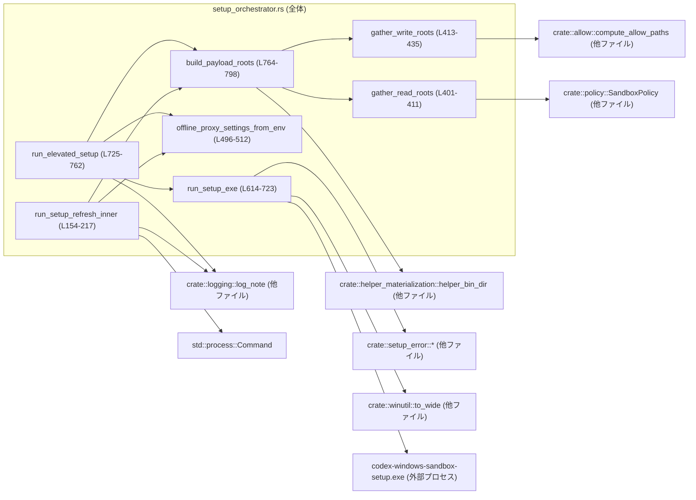
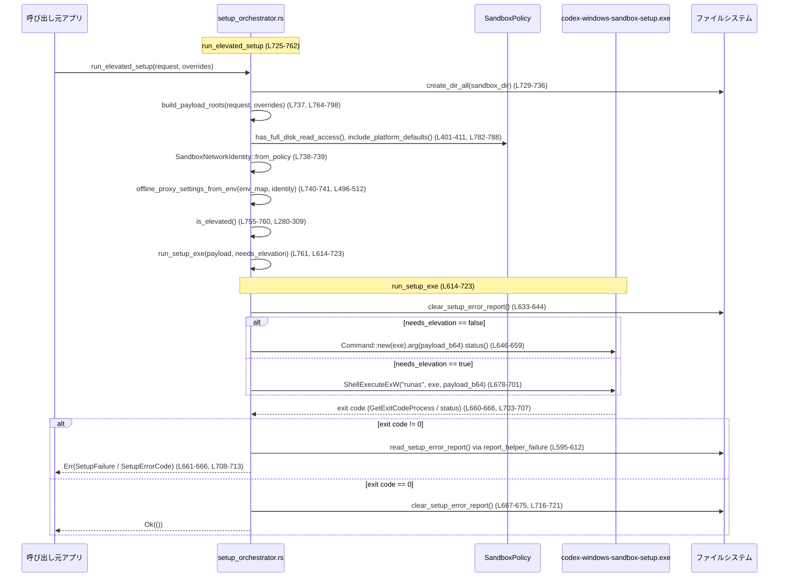

# windows-sandbox-rs/src/setup_orchestrator.rs

## 0. ざっくり一言

Windows 用のサンドボックス環境をセットアップ／リフレッシュするために、  
「許可されたファイルシステムルート」「プロキシ設定」「必要な権限（昇格の有無）」などを計算し、  
外部のセットアップ helper 実行ファイル（`codex-windows-sandbox-setup.exe`）を安全に呼び出すオーケストレーターです。  
（根拠: `run_setup_refresh_inner`・`run_elevated_setup`・`run_setup_exe` の処理内容  
`setup_orchestrator.rs:L154-217`, `L725-762`, `L614-723`）

---

## 1. このモジュールの役割

### 1.1 概要

- このモジュールは **Windows サンドボックスの初期設定・更新処理を統括するオーケストレーター** です。
- 具体的には、
  - サンドボックスがアクセスできる **読み取り／書き込みルートパス** の決定
  - オフラインプロキシ利用時の **ポート抽出と設定（firewall 設定）**
  - 実際に OS 上でセットアップを行う **外部 helper exe の起動（昇格あり／なし）**
  - helper が出力する **エラー情報（`setup_error.json`）の処理**
  を担当します。（`run_setup_refresh_inner`, `run_elevated_setup`, `build_payload_roots`,  
  `offline_proxy_settings_from_env`, `run_setup_exe`  
  `setup_orchestrator.rs:L154-217`, `L725-762`, `L764-798`, `L496-512`, `L614-723`）

### 1.2 アーキテクチャ内での位置づけ

このモジュールは「ポリシー」や「パス計算」モジュールと連携し、最終的に **Windows の外部 helper exe** を起動します。



- `SandboxPolicy`・`compute_allow_paths` からファイルシステムルートを導出し（`L401-435`）、  
- `offline_proxy_settings_from_env` で環境変数からプロキシ情報を抽出し（`L496-523`）、  
- それらを含む `ElevationPayload` を JSON + Base64 化して helper exe に渡します（`L437-454`, `L614-632`）。

### 1.3 設計上のポイント

- **責務の分割**
  - ルートパス計算: `gather_read_roots`, `gather_write_roots`, `build_payload_roots`（`L401-435`, `L764-798`）
  - ネットワーク／プロキシ設定: `SandboxNetworkIdentity`, `offline_proxy_settings_from_env`, `proxy_ports_from_env`, `loopback_proxy_port_from_url`（`L462-545`）
  - 昇格有無の判定と helper 実行: `is_elevated`, `run_setup_exe`, `run_setup_refresh_inner`, `run_elevated_setup`（`L280-309`, `L614-723`, `L154-217`, `L725-762`）
  - サンドボックスユーザー／バージョン管理: `SetupMarker`, `SandboxUsersFile`（`L219-278`）
- **状態管理**
  - このモジュール自体は状態を持たず、すべて **引数ベースの純粋関数** または **外部プロセス起動** です。状態はファイルシステム (`codex_home/.sandbox*`、`setup_error.json`) およびサンドボックス helper 側にあります。（`L62-80`, `L595-612`）
- **エラーハンドリング方針**
  - 公開関数は基本的に `anyhow::Result<()>` を返し、詳細なエラー種別は `crate::setup_error::failure` による **独自エラーコード (`SetupErrorCode`)** にマッピングされる場合があります。（`L19-23`, `L595-612`, `L614-723`, `L725-762`）
  - helper exe 実行時の失敗は、`setup_error.json` を読むことで詳細を補完します。（`report_helper_failure`, `L595-612`）
- **安全性（Rust/Windows 特有）**
  - Win32 API 呼び出しは `windows_sys` と `unsafe` ブロック内に閉じ込め、ハンドル解放 (`FreeSid`, `CloseHandle`) を適切に行っています。（`L280-309`, `L703-707`）
  - サンドボックスが書き込み可能なディレクトリから **`codex_home` および `.sandbox*` ディレクトリ群を必ず除外** し、helper バイナリや制御状態の改ざんを防いでいます。（`filter_sensitive_write_roots`, `L800-823`）
- **並行性**
  - このモジュール内の処理は基本的に **同期的（blocking）** です。  
    外部 helper プロセスを起動し、`WaitForSingleObject` で終了を待機します。（`run_setup_exe`, `L704-705`）

---

## 2. 主要な機能一覧

- サンドボックス用ディレクトリのパス計算:
  - `sandbox_dir`, `sandbox_bin_dir`, `sandbox_secrets_dir`, `setup_marker_path`, `sandbox_users_path`（`L62-80`）
- サンドボックス setup のリフレッシュ（非昇格での helper 呼び出し）:
  - `run_setup_refresh`, `run_setup_refresh_with_overrides`, `run_setup_refresh_with_extra_read_roots`, `run_setup_refresh_inner`（`L98-152`, `L154-217`）
- サンドボックス setup の初回／昇格付き実行:
  - `run_elevated_setup`, `run_setup_exe`, `is_elevated`（`L725-762`, `L614-723`, `L280-309`）
- 読み取り／書き込みルートパスの決定:
  - `gather_read_roots`, `gather_legacy_full_read_roots`, `gather_restricted_read_roots`,
    `gather_write_roots`, `build_payload_roots`, `filter_sensitive_write_roots`（`L356-411`, `L413-435`, `L764-798`, `L800-823`）
- プロキシ／ネットワークアイデンティティ設定:
  - `SandboxNetworkIdentity`, `offline_proxy_settings_from_env`, `proxy_ports_from_env`, `loopback_proxy_port_from_url`（`L462-545`）
- Setup 状態のバージョン管理とユーザー情報:
  - `SetupMarker`, `SandboxUsersFile` とそれぞれの `version_matches`／`request_mismatch_reason`（`L219-258`, `L267-278`）
- helper exe 呼び出し補助:
  - `ElevationPayload`, `quote_arg`, `find_setup_exe`, `report_helper_failure`（`L437-454`, `L547-581`, `L583-593`, `L595-612`）

### 2.1 コンポーネント一覧（インベントリー）

プロダクションコードに限定した関数・型の一覧です（テスト関数は 7 章で別途整理）。  
行番号は `windows-sandbox-rs/src/setup_orchestrator.rs:Ln-Lm` 形式で記載します。

#### 型（構造体・列挙体）

| 名前 | 種別 | 可視性 | 行範囲 | 役割 / 用途 |
|------|------|--------|--------|-------------|
| `SandboxSetupRequest<'a>` | 構造体 | `pub` | `L82-89` | setup 実行に必要なポリシー・パス・環境変数・`codex_home` などを 1 つにまとめたリクエストコンテナ。 |
| `SetupRootOverrides` | 構造体 | `pub` | `L91-96` | 読み取り／書き込みルートおよび deny 書き込みパスのオーバーライドを保持。`Default` 実装あり。 |
| `SetupMarker` | 構造体 | `pub` | `L219-230` | setup のバージョンやオフライン／オンラインユーザー名、プロキシ設定を記録するマーカー。おそらく `setup_marker.json` 用。（保存パスは `setup_marker_path` から推測、`L74-76`） |
| `SandboxUserRecord` | 構造体 | `pub` | `L260-265` | サンドボックスユーザー 1 名分の `username` と DPAPI 暗号化済みパスワード（Base64）のレコード。 |
| `SandboxUsersFile` | 構造体 | `pub` | `L267-272` | オフライン／オンラインユーザー分の `SandboxUserRecord` とバージョンをまとめたファイル用構造体。 |
| `ElevationPayload` | 構造体 | `Serialize` | `L437-454` | helper exe に渡す JSON ペイロード。ルートパス・ユーザー名・プロキシポート・実行ユーザー・refresh フラグなどを含む。 |
| `OfflineProxySettings` | 構造体 | `pub(crate)` | `L456-460` | オフラインアイデンティティ用のプロキシポートと `allow_local_binding` フラグ。 |
| `SandboxNetworkIdentity` | enum | `pub(crate)` | `L462-466` | サンドボックスが Offline/Online のどちらのネットワークアイデンティティを使うかを表す。 |

#### 関数（主要）

| 関数名 | 可視性 | 行範囲 | 役割（1 行） |
|--------|--------|--------|--------------|
| `sandbox_dir` | `pub` | `L62-64` | `codex_home/.sandbox` のパスを返す。 |
| `sandbox_bin_dir` | `pub` | `L66-68` | `codex_home/.sandbox-bin` のパスを返す。 |
| `sandbox_secrets_dir` | `pub` | `L70-72` | `codex_home/.sandbox-secrets` のパスを返す。 |
| `setup_marker_path` | `pub` | `L74-76` | `sandbox_dir` 配下の `setup_marker.json` のパスを返す。 |
| `sandbox_users_path` | `pub` | `L78-80` | `.sandbox-secrets/sandbox_users.json` のパスを返す。 |
| `run_setup_refresh` | `pub` | `L98-117` | デフォルトの root オーバーライド無しで setup refresh を実行。 |
| `run_setup_refresh_with_overrides` | `pub` | `L119-124` | `SandboxSetupRequest` と `SetupRootOverrides` を直接指定して refresh を実行。 |
| `run_setup_refresh_with_extra_read_roots` | `pub` | `L126-152` | 追加の read roots を与えて refresh を実行。書き込みルートは空に固定。 |
| `run_setup_refresh_inner` | `fn` | `L154-217` | refresh 共通ロジック。ポリシーに応じて payload を作成し、**非昇格** helper を同期実行。 |
| `SetupMarker::version_matches` | `pub fn` | `L233-235` | マーカーの `version` が `SETUP_VERSION` と一致するか判定。 |
| `SetupMarker::request_mismatch_reason` | `pub(crate) fn` | `L237-257` | オフライン identity 時に、保存されている firewall 設定と要求設定がズレている場合、その理由を文字列で返す。 |
| `SandboxUsersFile::version_matches` | `pub fn` | `L275-277` | ユーザーファイルの `version` が `SETUP_VERSION` と一致するか判定。 |
| `is_elevated` | `fn` | `L280-309` | 現在プロセスが Administrators グループに属しているか Win32 API で判定。 |
| `canonical_existing` | `fn` | `L312-321` | 存在するパスのみを `dunce::canonicalize` して返す。 |
| `profile_read_roots` | `fn` | `L324-341` | `USERPROFILE` 配下の特定ディレクトリを除外した read roots を列挙。失敗時はプロフィールディレクトリそのもののみ。 |
| `gather_helper_read_roots` | `fn` | `L343-353` | 現行 exe のディレクトリと `helper_bin_dir(codex_home)` を read roots として返す。 |
| `gather_legacy_full_read_roots` | `fn` | `L356-377` | helper roots に Windows デフォルト、`USERPROFILE` 下、`command_cwd`、書き込みルート等を加えたフル read roots を作成。 |
| `gather_restricted_read_roots` | `fn` | `L379-399` | helper roots＋必要に応じて Windows デフォルト＋ポリシー指定の readable roots を read roots として集約。 |
| `gather_read_roots` | `pub(crate)` | `L401-411` | ポリシーがフルディスク読み取りかどうかで `gather_legacy_full_read_roots` / `gather_restricted_read_roots` を切替。 |
| `gather_write_roots` | `pub(crate)` | `L413-435` | WorkspaceWrite ポリシーの CWD と `compute_allow_paths` の allow パスを canonical 化・重複排除して書き込みルートにする。 |
| `offline_proxy_settings_from_env` | `pub(crate)` | `L496-512` | オフライン identity 時のみ、環境変数からプロキシポートと `allow_local_binding` を抽出。 |
| `proxy_ports_from_env` | `pub(crate)` | `L514-523` | 各種 `*_PROXY` 環境変数から loopback のみを許可してポート番号集合を生成（ソート＋重複排除）。 |
| `loopback_proxy_port_from_url` | `fn` | `L526-545` | URL 文字列から「localhost/127.0.0.1/[::1] かつ port ≠ 0」の場合に限ってポート番号を取り出す。 |
| `quote_arg` | `fn` | `L547-581` | Windows コマンドラインのクォート規則に沿って、引数を安全にダブルクォート付き文字列へエスケープ。 |
| `find_setup_exe` | `fn` | `L583-593` | 現在の exe と同ディレクトリ内の helper exe を優先的に探し、見つからなければカレントディレクトリ名を返す。 |
| `report_helper_failure` | `fn` | `L595-612` | helper プロセスの非 0 終了時に、`setup_error.json` を読み込んだうえで適切な `SetupFailure` エラーへ変換。 |
| `run_setup_exe` | `fn` | `L614-723` | `ElevationPayload` を JSON+Base64 し、昇格の有無に応じて helper exe を起動・終了コードと error report を処理。 |
| `run_elevated_setup` | `pub` | `L725-762` | サンドボックスディレクトリを作成し、payload を構築して `run_setup_exe` を呼び出すメイン entry point。 |
| `build_payload_roots` | `fn` | `L764-798` | overrides / ポリシーに基づき read/write roots を計算し、書き込みルートを read から除外。 |
| `filter_sensitive_write_roots` | `fn` | `L800-823` | 書き込みルートから `codex_home` と各 `.sandbox*` ディレクトリ配下をすべて除外。 |

---

## 3. 公開 API と詳細解説

### 3.1 型一覧（構造体・列挙体）

公開（`pub` / `pub(crate)`）型のみを整理します。

| 名前 | 種別 | 可視性 | フィールド概要 | 関連関数 / メソッド |
|------|------|--------|----------------|----------------------|
| `SandboxSetupRequest<'a>` | 構造体 | `pub` | `policy`, `policy_cwd`, `command_cwd`, `env_map`, `codex_home`, `proxy_enforced`（すべて参照またはコピー可能な設定値）`L82-89` | `run_setup_refresh_with_overrides`, `run_elevated_setup`, `build_payload_roots` の引数として利用（`L119-124`, `L725-762`, `L764-777`） |
| `SetupRootOverrides` | 構造体 | `pub` | 任意指定の `read_roots`, `write_roots`, `deny_write_paths`。`None` の場合はポリシーから計算。`L91-96` | `run_setup_refresh_with_overrides`, `run_setup_refresh_with_extra_read_roots`, `run_elevated_setup`, `build_payload_roots` |
| `SetupMarker` | 構造体 | `pub` | setup バージョンと offline/online username, `created_at`, `proxy_ports`, `allow_local_binding`。`L219-230` | `version_matches`, `request_mismatch_reason` |
| `SandboxUserRecord` | 構造体 | `pub` | `username` と `password`（DPAPI-encrypted & Base64）。`L260-265` | `SandboxUsersFile` 内で使用。 |
| `SandboxUsersFile` | 構造体 | `pub` | `version` と offline/online の `SandboxUserRecord`。`L267-272` | `version_matches` |
| `OfflineProxySettings` | 構造体 | `pub(crate)` | プロキシポート配列と `allow_local_binding` フラグ。`L456-460` | `offline_proxy_settings_from_env` の戻り値、`SetupMarker::request_mismatch_reason` の引数。 |
| `SandboxNetworkIdentity` | enum | `pub(crate)` | `Offline` / `Online` の 2 値。`L462-466` | `from_policy` / `uses_offline_identity` により、ポリシーと `proxy_enforced` から identity を決定。 |

### 3.2 関数詳細（7 件）

#### 1. `run_setup_refresh(...) -> Result<()>`（`L98-117`）

```rust
pub fn run_setup_refresh(
    policy: &SandboxPolicy,
    policy_cwd: &Path,
    command_cwd: &Path,
    env_map: &HashMap<String, String>,
    codex_home: &Path,
    proxy_enforced: bool,
) -> Result<()> { /* ... */ }
```

**概要**

- サンドボックスの設定ファイルやポリシーが変更された場合などに、  
  **既存のサンドボックス環境を「リフレッシュ」するためのエントリポイント** です。
- 常に **非昇格** helper 実行を前提とし（`run_setup_refresh_inner` 内で elevation を行わない）、  
  `SetupRootOverrides::default()` を使ってルートオーバーライド無しで実行します。  
  （根拠: `run_setup_refresh` → `run_setup_refresh_inner` 呼び出し `L98-117`, `L154-217`）

**引数**

| 引数名 | 型 | 説明 |
|--------|----|------|
| `policy` | `&SandboxPolicy` | サンドボックスのアクセス制御ポリシー。`has_full_disk_read_access` などのメソッドで read roots 計算に利用（`L401-411`）。 |
| `policy_cwd` | `&Path` | ポリシーファイルの基準ディレクトリ。`gather_write_roots` で `compute_allow_paths` に渡される（`L413-425`）。 |
| `command_cwd` | `&Path` | ユーザーコマンドの作業ディレクトリ。read/write roots の一部として使われる（`L356-377`, `L413-423`）。 |
| `env_map` | `&HashMap<String,String>` | 環境変数のスナップショット。プロキシ設定等に利用（`offline_proxy_settings_from_env`, `L496-512`）。 |
| `codex_home` | `&Path` | Codex のホームディレクトリ。`.sandbox*` ディレクトリの基準。 |
| `proxy_enforced` | `bool` | ネットワークアイデンティティ判定で優先される「プロキシ強制」フラグ（`SandboxNetworkIdentity::from_policy`, `L468-475`）。 |

**戻り値**

- `Result<()>`:
  - 成功時: `Ok(())`
  - 失敗時: helper 実行の失敗などをラップした `anyhow::Error`（`run_setup_refresh_inner` 内で生成、`L199-215`）

**内部処理の流れ**

- `SandboxSetupRequest` を構築し、`SetupRootOverrides::default()` と共に `run_setup_refresh_inner` を呼び出します。（`L106-116`）
- 実際のルート計算・helper 起動は `run_setup_refresh_inner` に委譲されます（後述）。

**Examples（使用例）**

```rust
use std::collections::HashMap;
use std::path::Path;
use windows_sandbox_rs::policy::SandboxPolicy;
use windows_sandbox_rs::setup_orchestrator::run_setup_refresh;

fn refresh_sandbox() -> anyhow::Result<()> {
    let policy = SandboxPolicy::new_read_only_policy();          // 何らかのポリシーを用意する
    let policy_cwd = Path::new("path/to/policy");
    let command_cwd = Path::new("path/to/workspace");
    let env_map = std::env::vars().collect::<HashMap<_, _>>();   // 現在の環境変数をコピー
    let codex_home = Path::new("C:\\Users\\me\\.codex");

    run_setup_refresh(
        &policy,
        policy_cwd,
        command_cwd,
        &env_map,
        codex_home,
        false,                                                   // プロキシ強制なし
    )
}
```

※ 上記は概念的な例です。実際のクレート名等はプロジェクト構成に依存します。

**Errors / Panics**

- `run_setup_refresh_inner` からのエラーをそのまま返します。
  - helper exe の起動失敗: `anyhow!("setup refresh failed with status {status}")` など（`L199-215`）。
- panic を発生させるコードは、この関数自身には含まれていません。

**Edge cases（エッジケース）**

- ポリシーが `SandboxPolicy::DangerFullAccess` または `ExternalSandbox` の場合、refresh は **スキップされ即時 `Ok(())`** になります（`run_setup_refresh_inner`, `L158-163`）。
- `codex_home` が存在しない場合でも、refresh 時に特別なディレクトリ作成はしていません（昇格 setup と違い、`run_elevated_setup` のような `create_dir_all` 呼び出しはなし）。

**使用上の注意点**

- この関数は **昇格を行わない** ため、初回セットアップや権限変更を伴う操作には `run_elevated_setup` を使う必要があります。
- `env_map` にはプロキシ設定用の環境変数が含まれている必要があります（`HTTP_PROXY` など）。  
  ここに渡した値以外を後から参照しないため、「どの環境変数がサンドボックス構成に影響するか」を制御できます。

---

#### 2. `run_elevated_setup(request, overrides) -> Result<()>`（`L725-762`）

**概要**

- サンドボックスを **初期構築／再構築** するためのメインエントリポイントです。
- 必要に応じて **管理者権限で helper exe（`codex-windows-sandbox-setup.exe`）を起動**し、  
  ファイルシステム・ユーザー・ネットワーク設定を行わせます。（`L725-762`, `L614-723`）

**引数**

| 引数名 | 型 | 説明 |
|--------|----|------|
| `request` | `SandboxSetupRequest<'_>` | ポリシー・パス・環境変数など setup に必要な情報。`L82-89` |
| `overrides` | `SetupRootOverrides` | read/write roots や deny パスを上書きするための設定。`L91-96` |

**戻り値**

- `Result<()>`:
  - 成功時: helper が 0 終了し、`setup_error.json` のエラー情報も存在しない／クリアされた場合。
  - 失敗時: `SetupErrorCode::Orchestrator*` 系エラーや `SetupFailure` を内包した `anyhow::Error`。

**内部処理の流れ**

1. `sandbox_dir(codex_home)` を作成 (`create_dir_all`) し、失敗時には `SetupErrorCode::OrchestratorSandboxDirCreateFailed` を返す。（`L729-736`）
2. `build_payload_roots(&request, &overrides)` で read/write roots を計算する。（`L737`）
3. `SandboxNetworkIdentity::from_policy` と `offline_proxy_settings_from_env` からプロキシ設定を求める。（`L738-741`, `L468-475`, `L496-512`）
4. `ElevationPayload` を組み立てる。`refresh_only` は `false`。（`L741-754`）
5. `is_elevated()` で現在プロセスの昇格状態をチェックし、その結果から `needs_elevation` を計算。失敗時は `SetupErrorCode::OrchestratorElevationCheckFailed`。（`L755-760`, `L280-309`）
6. `run_setup_exe(&payload, needs_elevation, request.codex_home)` を呼び出し、helper exe を起動・終了を待ち、エラー処理を行う。（`L761`）

**Examples（使用例）**

```rust
use std::collections::HashMap;
use std::path::Path;
use windows_sandbox_rs::policy::SandboxPolicy;
use windows_sandbox_rs::setup_orchestrator::{
    SandboxSetupRequest, SetupRootOverrides, run_elevated_setup,
};

fn initial_setup() -> anyhow::Result<()> {
    let policy = SandboxPolicy::new_read_only_policy();
    let policy_cwd = Path::new("path/to/policy");
    let command_cwd = Path::new("path/to/workspace");
    let env_map = std::env::vars().collect::<HashMap<_, _>>();
    let codex_home = Path::new("C:\\Users\\me\\.codex");

    let request = SandboxSetupRequest {
        policy: &policy,
        policy_cwd,
        command_cwd,
        env_map: &env_map,
        codex_home,
        proxy_enforced: false,
    };

    let overrides = SetupRootOverrides::default();  // 特にルートの上書きなし

    run_elevated_setup(request, overrides)
}
```

**Errors / Panics**

- `create_dir_all` 失敗:
  - `SetupErrorCode::OrchestratorSandboxDirCreateFailed` として `failure(...)` を返す（`L731-736`）。
- `is_elevated()` の内部エラー:
  - `SetupErrorCode::OrchestratorElevationCheckFailed`（`L755-760`）。
- `run_setup_exe` 内部でのエラー:
  - helper 起動失敗 → `SetupErrorCode::OrchestratorHelperLaunchFailed` または `OrchestratorHelperLaunchCanceled` 等（`L646-659`, `L691-701`）。
  - helper exit code ≠ 0 → `report_helper_failure` により `SetupFailure` or `OrchestratorHelperExitNonzero` 等へ変換（`L661-666`, `L595-612`）。
- panic を明示的に起こしている箇所はありません。

**Edge cases**

- 実行プロセスが既に昇格済み（管理者権限）なら `needs_elevation` は `false` となり、`run_setup_exe` は `ShellExecuteExW("runas")` を使わず、非昇格モードで直接実行します（`L755-762`, `L646-659`）。
- `USERNAME` 環境変数が取得できない場合、`"Administrators"` を `real_user` に採用します（`L752-753`）。

**使用上の注意点**

- **ブロッキング**: helper プロセスが終了するまで待つため、UI スレッドで直接呼ぶと UI がブロックされます（`WaitForSingleObject`, `L704-705`）。
- **権限昇格ダイアログ**: 非昇格プロセスから `needs_elevation = true` で呼ばれると、UAC ダイアログが表示されます（`ShellExecuteExW` に `runas` を指定、`L681-688`）。
- **書き込み可能ディレクトリの安全性**: `filter_sensitive_write_roots` により `codex_home` 直下などへの書き込み権限が削除される前提で設計されています（`L800-823`）。

---

#### 3. `gather_read_roots(command_cwd, policy, codex_home) -> Vec<PathBuf>`（`L401-411`）

**概要**

- サンドボックスが **読み取り可能** とすべきディレクトリのルート集合を計算します。
- ポリシーがフルディスク read を許すかどうかで、`gather_legacy_full_read_roots` と `gather_restricted_read_roots` を切り替えます。（`L406-410`）

**引数**

| 引数名 | 型 | 説明 |
|--------|----|------|
| `command_cwd` | `&Path` | ユーザーコマンドの作業ディレクトリ。 |
| `policy` | `&SandboxPolicy` | read ポリシーを決定するために使用（`has_full_disk_read_access` 等）。 |
| `codex_home` | `&Path` | helper ディレクトリ（`helper_bin_dir`）の位置決定に使用。 |

**戻り値**

- `Vec<PathBuf>`: canonicalized 済みの read root パス（`canonical_existing` により存在しないパスは除外, `L356-377`, `L379-399`）。

**内部処理の流れ**

- `policy.has_full_disk_read_access()` が `true` の場合: `gather_legacy_full_read_roots` を呼び出す（`L406-408`）。
- `false` の場合: `gather_restricted_read_roots` を呼び出す（`L408-410`）。

`gather_legacy_full_read_roots`（`L356-377`）は以下を含みます:

1. helper roots（`gather_helper_read_roots`, `L343-353`）
2. Windows デフォルト read roots（`WINDOWS_PLATFORM_DEFAULT_READ_ROOTS`, `L55-60`）
3. `USERPROFILE` 配下の除外されていない子エントリ（`profile_read_roots`, `L324-341`）
4. `command_cwd`
5. `SandboxPolicy::WorkspaceWrite` の `writable_roots`（存在すれば）

`gather_restricted_read_roots`（`L379-399`）は:

1. helper roots
2. `policy.include_platform_defaults()` が `true` のときのみ Windows デフォルト read roots
3. `policy.get_readable_roots_with_cwd(command_cwd)` の結果

**Errors / Panics**

- この関数および関連関数は `Result` を返さず、エラーを返さない設計です。
- 内部で利用している `std::fs::read_dir` 等のエラーは `profile_read_roots` 内で捕捉され、フォールバック動作を取ります（`L324-328`）。

**Edge cases**

- `USERPROFILE` が環境変数に存在しなかったり、`read_dir` が失敗する場合、`profile_read_roots` は `user_profile`（パスそのもの）だけを read root とします（`L324-328`, テスト `profile_read_roots_falls_back_to_profile_root_when_enumeration_fails`, `L1011-1018`）。
- Restricted ポリシーで `include_platform_defaults = false` の場合、Windows デフォルト read roots は含まれません（テスト `restricted_read_roots_skip_platform_defaults_when_disabled`, `L1036-1070`）。

**使用上の注意点**

- helper バイナリディレクトリ（`helper_bin_dir(codex_home)`）は常に read roots に含まれるよう設計されています（`gather_helper_read_roots`, `L343-353`）。  
  テスト `gather_read_roots_includes_helper_bin_dir` で保証されています（`L1021-1034`）。
- この関数は **書き込み権限ではなく読み取り権限** の計算専用であり、書き込み可能ディレクトリは別途 `gather_write_roots` で決定されます。

---

#### 4. `gather_write_roots(policy, policy_cwd, command_cwd, env_map) -> Vec<PathBuf>`（`L413-435`）

**概要**

- サンドボックスの **書き込み可能ルートディレクトリ** を計算します。
- ポリシーに基づき workspace の CWD と `compute_allow_paths` が返す allow パスを canonical 化・重複排除します。

**引数**

| 引数名 | 型 | 説明 |
|--------|----|------|
| `policy` | `&SandboxPolicy` | 書き込みポリシー（特に `WorkspaceWrite` 変種）確認用。 |
| `policy_cwd` | `&Path` | `compute_allow_paths` へ渡され、ポリシーの相対パス解決に使われると考えられます（行から読み取れる範囲）。 |
| `command_cwd` | `&Path` | `WorkspaceWrite` ポリシー時に常に書き込み可能とするためルートに追加（`L419-423`）。 |
| `env_map` | `&HashMap<String,String>` | `compute_allow_paths` の入力。どの環境変数が使用されるかはこのチャンクには現れません。 |

**戻り値**

- `Vec<PathBuf>`: canonical 化された書き込みルート（重複無し）。

**内部処理の流れ**

1. 空の `roots` ベクタを作成（`L419`）。
2. `policy` が `SandboxPolicy::WorkspaceWrite { .. }` の場合、`command_cwd` を `roots` に追加（`L421-423`）。
3. `compute_allow_paths(policy, policy_cwd, command_cwd, env_map)` を呼び出し、戻り値 `AllowDenyPaths { allow, .. }` から `allow` パスを `roots` に追加（`L424-426`）。
4. `canonical_existing(&roots)` で存在するパスだけを canonical 化し、HashSet で重複排除した結果を `out` として返す（`L427-434`）。

**Errors / Panics**

- エラー型は返さず、fs のエラーは `canonical_existing` 内部で `unwrap_or_else(|_| p.clone())` により無視されます（`L319-320`）。
- パスが存在しない場合は単に除外されます（`L316-317`）。

**Edge cases**

- `WorkspaceWrite` でなくても `allow` パスが存在すれば書き込みルートは存在し得ます（`L421-426`）。
- `compute_allow_paths` が deny パスも返している可能性がありますが、この関数では **allow のみ** を扱っています（`AllowDenyPaths { allow, .. }`, `L424-425`）。

**使用上の注意点**

- 実際に helper に渡される書き込みルートは、この後 `filter_sensitive_write_roots` によってさらに絞り込まれます（`build_payload_roots`, `L778-779`）。
- 単に `gather_write_roots` だけを見ると `codex_home` や `.sandbox*` への書き込みも許可され得ますが、**最終的には必ず除外** されます（`filter_sensitive_write_roots`, `L800-823`）。

---

#### 5. `build_payload_roots(request, overrides) -> (Vec<PathBuf>, Vec<PathBuf>)`（`L764-798`）

**概要**

- helper に渡す `ElevationPayload` 用の **最終的な read_roots / write_roots** を計算します。
- オーバーライドが指定されている場合といない場合で処理を分岐し、  
  最後に「write roots に含まれるパスを read roots から除外」して、重複する能力（read+write）を調整します。

**引数**

| 引数名 | 型 | 説明 |
|--------|----|------|
| `request` | `&SandboxSetupRequest<'_>` | ポリシー・各種パス・環境変数など。 |
| `overrides` | `&SetupRootOverrides` | read/write roots 上書き・deny write paths の情報。 |

**戻り値**

- `(Vec<PathBuf>, Vec<PathBuf>)`: `(read_roots, write_roots)` のタプル。

**内部処理の流れ**

1. **write_roots の決定**（`L768-777`）
   - `overrides.write_roots` が `Some` ならそれを `canonical_existing` に通す。
   - `None` なら `gather_write_roots(request.policy, request.policy_cwd, request.command_cwd, request.env_map)` を用いる。
   - 結果を `filter_sensitive_write_roots` に通し、`codex_home` / `.sandbox*` / `.sandbox-bin*` / `.sandbox-secrets*` を除外（`L778-779`）。
2. **read_roots の決定**（`L779-792`）
   - `overrides.read_roots` が `Some` の場合:
     - helper roots と（ポリシーが許せば）Windows プラットフォームデフォルト read roots を先頭に付加（`gather_helper_read_roots`, `WINDOWS_PLATFORM_DEFAULT_READ_ROOTS`; `L782-789`）。
     - さらに `overrides.read_roots` の中身を追加し、`canonical_existing` で正規化（`L790-791`）。
   - `None` の場合:
     - `gather_read_roots(request.command_cwd, request.policy, request.codex_home)` の結果を使用（`L793-794`）。
3. **read/write の重複調整**（`L795-797`）
   - `write_roots` を `HashSet` に入れ、`read_roots` から同じパスを削除。

**Errors / Panics**

- この関数自体は `Result` を返さず、エラーは返さない設計です。
- canonicalization や `gather_*` 内のエラーは、前述のとおりフォールバック挙動を取ります。

**Edge cases**

- `read_roots` override を与えると、**「ポリシー由来の read roots を無効化し、helper/platform roots + override のみに置換」** する挙動になります（テスト参照: `build_payload_roots_preserves_helper_roots_when_read_override_is_provided`, `build_payload_roots_replaces_full_read_policy_when_read_override_is_provided`, `L1173-1267`）。
- 書き込みルートに含まれるディレクトリが read_roots から除外されるため、  
  「書き込み可能＝読み取りも可能」でなくなる点に注意が必要です（意図的な capability 分離と読み取れます）。

**使用上の注意点**

- `overrides.read_roots` を使っている場合でも、helper 実行に必須な helper/platform roots は常に追加されます（`L780-789`）。
- 「ワークスペース CWD は read だが、書き込み権限を与えたくない」などの制御を行うには、  
  `overrides.write_roots` の指定と `SetupRootOverrides` の組み合わせが必要です。

---

#### 6. `filter_sensitive_write_roots(roots, codex_home) -> Vec<PathBuf>`（`L800-823`）

**概要**

- サンドボックスに与える **書き込み可能ルートのうち、セキュリティ上危険な領域を除外** します。
- 具体的には `codex_home` と、その配下の `.sandbox`, `.sandbox-bin`, `.sandbox-secrets` 配下をすべて外します。

**引数**

| 引数名 | 型 | 説明 |
|--------|----|------|
| `roots` | `Vec<PathBuf>` | 書き込み可能候補ルートのリスト。 |
| `codex_home` | `&Path` | Codex ホームディレクトリ。ここから sandbox 系ディレクトリのプレフィックスキーを作成。 |

**戻り値**

- `Vec<PathBuf>`: 危険な領域を除外した書き込みルート。

**内部処理の流れ**

1. `canonical_path_key` を使って以下のキー／prefix を作成（`L804-810`）:
   - `codex_home_key`
   - `sbx_dir_key` (`sandbox_dir(codex_home)` のキー) と `"{sbx_dir_key}/"` prefix
   - `sbx_bin_dir_key` (`sandbox_bin_dir`) と prefix
   - `secrets_dir_key` (`sandbox_secrets_dir`) と prefix
2. `roots.retain(|root| { ... })` で以下の条件を満たすものだけ残す（`L812-821`）:
   - `key != codex_home_key`
   - `key != sbx_dir_key` かつ `!key.starts_with(sbx_dir_prefix)`
   - `key != sbx_bin_dir_key` かつ `!key.starts_with(sbx_bin_dir_prefix)`
   - `key != secrets_dir_key` かつ `!key.starts_with(secrets_dir_prefix)`

**安全性・セキュリティ上の意味**

- `canonical_path_key` を使うことで、単純な文字列パスではなく「正規化されたキー」で prefix 判定を行っています。
  - これにより、**シンボリックリンクや相対パスを使ったバイパスのリスクを軽減**していると解釈できます（`canonical_path_key` の定義は別ファイルですが、名前と使われ方から）。`L804-810`
- `.sandbox*` や `.sandbox-secrets` は「sandbox control/state and helper binaries and must remain tamper-resistant」とコメントされており、**攻撃者に書き換えられると大きな影響が出る領域**です（`L800-803`）。

**Edge cases**

- `codex_home` が `roots` に含まれている場合も、完全に除外されます（`key != codex_home_key`, `L813-821`）。
- sandbox ディレクトリの prefix に一致するサブディレクトリもすべて除外されます（`starts_with` 判定、`L815-821`）。

**使用上の注意点**

- 書き込みルートの制御はこの関数が最終フィルタなので、**安全上重要なディレクトリを追加する場合はここに条件を追加する必要があります**。
- 逆に、この関数により除外されるディレクトリに書き込み権限を与えることはできない（オーバーライドを使っても `build_payload_roots` 内で必ず通る）点を前提に設計する必要があります。

---

#### 7. `run_setup_exe(payload, needs_elevation, codex_home) -> Result<()>`（`L614-723`）

**概要**

- `ElevationPayload` を JSON + Base64 にシリアライズし、  
  `codex-windows-sandbox-setup.exe` を **昇格あり／なしで起動して終了を待つ** 関数です。
- helper の終了コードと `setup_error.json` を元に、詳細なエラーを返却します。

**引数**

| 引数名 | 型 | 説明 |
|--------|----|------|
| `payload` | `&ElevationPayload` | helper に渡す構成情報。`L437-454` |
| `needs_elevation` | `bool` | `true` の場合は UAC 昇格付きで `ShellExecuteExW("runas")` を使う。 |
| `codex_home` | `&Path` | `setup_error.json` の場所や `sandbox_dir` パス決定に使用。 |

**戻り値**

- `Result<()>`:
  - 成功時: helper 終了コードが 0 かつ `setup_error.json` が成功後に削除されている（もしくは存在しない）場合。
  - 失敗時: `SetupErrorCode` / `SetupFailure` を含む `anyhow::Error`。

**内部処理の流れ（概略）**

1. `find_setup_exe()` で helper exe のパスを決定（`L625-625`, `L583-593`）。
2. `serde_json::to_string(payload)` → Base64 エンコード（`L626-632`）。
   - シリアライズ失敗時は `SetupErrorCode::OrchestratorPayloadSerializeFailed`（`L626-631`）。
3. `clear_setup_error_report(codex_home)` を呼び出し、事前に `setup_error.json` を削除しようと試みる。（`L633-644`）
   - 失敗時はログを出すが、実行自体は続行（`L636-643`）。
4. `needs_elevation == false` の場合（`L646-676`）:
   - `Command::new(exe)` で helper を非昇格 + ウィンドウ非表示（`creation_flags(0x08000000)`）で起動。
   - `stdin/stdout/stderr` は `Stdio::null()` に接続。
   - 起動失敗時は `SetupErrorCode::OrchestratorHelperLaunchFailed`（`L654-659`）。
   - 終了コード ≠ 0 の場合は `report_helper_failure` を呼び出し（`L660-666`）。
   - 成功時は `clear_setup_error_report` を再度試み、失敗してもログのみ（`L667-675`）。
5. `needs_elevation == true` の場合（`L678-721`）:
   - `crate::winutil::to_wide` で exe パス・パラメータ・verb("runas") を UTF-16 に変換（`L678-682`）。
   - `SHELLEXECUTEINFOW` を zero 初期化＆設定し、`ShellExecuteExW` を呼ぶ（`L682-690`）。
   - 呼び出し失敗／プロセスハンドル取得失敗時は `GetLastError()` に基づき `OrchestratorHelperLaunchCanceled` （ERROR_CANCELLED）または `OrchestratorHelperLaunchFailed`（`L691-701`）。
   - 成功時は `WaitForSingleObject(hProcess, INFINITE)` → `GetExitCodeProcess` → `CloseHandle` で終了待ち（`L703-707`）。
   - 終了コード ≠ 0 なら `report_helper_failure`（`L708-713`）。
   - 成功時は再度 `clear_setup_error_report` を試み、失敗してもログのみ（`L716-721`）。

**安全性（unsafe / Win32 API）**

- `ShellExecuteExW` 呼び出し周辺は `unsafe` ブロック内ですが、以下を守っています（`L683-690`, `L703-707`）:
  - `sei` を `zeroed()` で初期化し、`cbSize` に構造体サイズを設定。
  - `SEE_MASK_NOCLOSEPROCESS` を指定し、`hProcess` のライフタイムを `CloseHandle` で明示的に閉じる。
  - `ShellExecuteExW` が失敗した場合や `sei.hProcess == 0` の場合はすぐにエラーを返す。
- これにより、**リソースリークや未初期化メモリ読み取りのリスクを抑えている**設計になっています。

**Errors / Panics**

- 各種 Windows API 失敗時は `GetLastError()` を組み込んだメッセージを生成（`L691-701`）。
- panic を発生させるコードは見当たりません。

**Edge cases**

- `needs_elevation == false` でも `ShellExecuteExW` ではなく `Command` を使っているため、**UAC ダイアログが出ない**ことが保証されます（コメント `L646-653`）。
- `setup_error.json` が存在しない場合、`report_helper_failure` は exit code 情報だけを含む `SetupErrorCode::OrchestratorHelperExitNonzero` を返します（`L605-607`）。

**使用上の注意点**

- この関数は **同期的かつブロッキング** であり、helper の処理時間が長いと呼び出し元もその分ブロックされます。
- `payload` に含めるパスは、先に `build_payload_roots` などでフィルタ済みである前提です。  
  生のユーザー入力を直接 `ElevationPayload` に詰めると、安全性が損なわれる可能性があります。

---

### 3.3 その他の関数（概要のみ）

| 関数名 | 役割（1 行） | 根拠 |
|--------|--------------|------|
| `sandbox_dir` / `sandbox_bin_dir` / `sandbox_secrets_dir` | `codex_home` 以下の固定サブディレクトリパスを構築するユーティリティ。 | `L62-72` |
| `setup_marker_path` / `sandbox_users_path` | `.sandbox` / `.sandbox-secrets` 配下の JSON ファイルパスを返す。 | `L74-80` |
| `run_setup_refresh_with_overrides` / `_with_extra_read_roots` | refresh 流れに対してルートオーバーライドを行うバリエーション。 | `L119-152` |
| `SetupMarker::request_mismatch_reason` | オフライン identity において、保存済み firewall 設定と要求設定の差分を説明する。 | `L237-257` |
| `SandboxUsersFile::version_matches` | セットアップバージョンとの一致を確認。 | `L275-277` |
| `is_elevated` | 現プロセスが Administrators SID に属するか判定。 | `L280-309` |
| `canonical_existing` | 既存パスのみ `dunce::canonicalize` して返すヘルパー。 | `L312-321` |
| `profile_read_roots` | ユーザープロファイル下の特定トップレベルディレクトリを除外して read roots を作る。 | `L324-341` |
| `gather_helper_read_roots` | 現行 exe ディレクトリと `helper_bin_dir` を read roots として返す。 | `L343-353` |
| `gather_legacy_full_read_roots` / `gather_restricted_read_roots` | フル read / 制限 read モード別の read roots 構築。 | `L356-399` |
| `offline_proxy_settings_from_env` | オフライン identity のときだけ env から `OfflineProxySettings` を組み立てる。 | `L496-512` |
| `proxy_ports_from_env` | 各種 `*_PROXY` 環境変数から loopback 経由のポートだけを収集し、ソート＋重複排除。 | `L514-523` |
| `loopback_proxy_port_from_url` | URL 文字列から localhost/127.0.0.1/[::1] かつ port≠0 のときだけポート番号を返す。 | `L526-545` |
| `quote_arg` | Windows コマンドラインの quoting ルールに従い、`\` と `"` をエスケープ。 | `L547-581` |
| `find_setup_exe` | 現行 exe ディレクトリ内の helper exe を探し、無ければファイル名のみを返す。 | `L583-593` |
| `report_helper_failure` | exit code と `setup_error.json` の内容から適切な `anyhow::Error` を構成。 | `L595-612` |

---

## 4. データフロー

### 4.1 代表的なシナリオ: `run_elevated_setup` による初回セットアップ

このシナリオでは、アプリケーションが `run_elevated_setup` を呼び出して  
Windows サンドボックスを初期構築する様子を示します。



- ファイルシステム (`FS`) には `.sandbox*` ディレクトリと `setup_error.json` の作成／削除が行われます。
- helper exe とは **Base64 エンコードされた JSON ペイロード文字列** で通信します（コマンドライン経由, `L626-632`, `L648-652`, `L678-688`）。

---

## 5. 使い方（How to Use）

### 5.1 基本的な使用方法

典型的なフローは「初回の昇格セットアップ → 変更時のリフレッシュ」です。

```rust
use std::collections::HashMap;
use std::path::Path;
use windows_sandbox_rs::policy::SandboxPolicy;
use windows_sandbox_rs::setup_orchestrator::{
    SandboxSetupRequest, SetupRootOverrides,
    run_elevated_setup, run_setup_refresh,
};

fn main() -> anyhow::Result<()> {
    let policy = SandboxPolicy::new_read_only_policy();         // 読み取り専用ポリシーを仮定
    let policy_cwd = Path::new("path/to/policy");
    let command_cwd = Path::new("path/to/workspace");
    let env_map = std::env::vars().collect::<HashMap<_, _>>();
    let codex_home = Path::new("C:\\Users\\me\\.codex");

    // 初回セットアップ（昇格あり）
    let request = SandboxSetupRequest {
        policy: &policy,
        policy_cwd,
        command_cwd,
        env_map: &env_map,
        codex_home,
        proxy_enforced: false,
    };
    run_elevated_setup(request, SetupRootOverrides::default())?;

    // ポリシーや環境の変更後に、昇格不要なリフレッシュを行う
    run_setup_refresh(
        &policy,
        policy_cwd,
        command_cwd,
        &env_map,
        codex_home,
        false,
    )?;

    Ok(())
}
```

### 5.2 よくある使用パターン

1. **追加の読み取りルートを一時的に許可したい場合**

```rust
use std::path::PathBuf;
use windows_sandbox_rs::setup_orchestrator::run_setup_refresh_with_extra_read_roots;

let extra = vec![PathBuf::from("C:\\extra\\docs")];
run_setup_refresh_with_extra_read_roots(
    &policy, policy_cwd, command_cwd, &env_map, codex_home,
    extra,
    false,  // proxy_enforced
)?;
```

- 書き込みルートは空 (`write_roots: Some(Vec::new())`) に固定されるため、  
  **読み取り専用アクセスを追加で許可したい** ケースに適しています（`L146-151`）。

1. **split ポリシーで read/write roots を完全に制御する場合**

```rust
use windows_sandbox_rs::setup_orchestrator::{SandboxSetupRequest, SetupRootOverrides};

let overrides = SetupRootOverrides {
    read_roots: Some(vec![PathBuf::from("C:\\readonly")]),
    write_roots: Some(vec![PathBuf::from("C:\\writable")]),
    deny_write_paths: None,
};

let request = SandboxSetupRequest { /* ... */ };

run_elevated_setup(request, overrides)?;
```

- `build_payload_roots` が helper/platform roots を追加しつつ、指定した roots を優先して適用します（`L778-792`）。

### 5.3 よくある間違い

```rust
// 間違い例: 直接 run_setup_exe を呼び出す（パスやポリシー計算を飛ばしている）
fn wrong() -> anyhow::Result<()> {
    let payload = ElevationPayload { /* フィールド不十分 */ }; // コンパイルすら難しい
    // run_setup_exe は pub でなく、このファイル内のヘルパーなので外部から呼べない
    Ok(())
}

// 正しい例: 公開エントリポイント経由で呼び出し、
// ルート計算やプロキシ設定をすべて build_payload_roots / offline_proxy_settings_from_env に委ねる
fn correct() -> anyhow::Result<()> {
    // 必要なリクエストを作成
    let request = SandboxSetupRequest { /* ... */ };
    let overrides = SetupRootOverrides::default();
    run_elevated_setup(request, overrides)
}
```

### 5.4 使用上の注意点（まとめ）

- **昇格 vs 非昇格**:
  - 初期構築やユーザー作成など管理者権限が必要な作業は `run_elevated_setup` を使用し、  
    それ以外の軽量な更新には `run_setup_refresh*` 系を使用します。
- **ブロッキング動作**:
  - helper exe の実行はブロッキングのため、非同期処理が必要な場合は別スレッド／プロセスから呼び出す設計が必要です。
- **環境変数の扱い**:
  - プロキシ関連環境変数は `env_map` によって明示的に渡されるため、「どの値がサンドボックスに影響するか」を呼び出し側で管理できます。
- **安全なファイルシステム権限**:
  - 書き込みルートから `codex_home` および `.sandbox*` 配下を除外していることを前提に設計されているため、  
    これらのディレクトリをユーザーが直接書き換えることはできません。

---

## 6. 変更の仕方（How to Modify）

### 6.1 新しい機能を追加する場合

例: 「特定の追加ディレクトリを常に read roots に含めたい」

1. **エントリポイントの選定**
   - `build_payload_roots` または `gather_*_read_roots` が read roots の集約ポイントです（`L764-798`, `L356-411`）。
2. **処理場所の選定**
   - 「ポリシーに応じて変わる」場合は `SandboxPolicy` 側のメソッド（`include_platform_defaults`, `get_readable_roots_with_cwd` など）にロジックを足し、  
     このモジュールでは新メソッドを呼び出すだけにするのが自然です。
   - 「常に含める」場合は `gather_helper_read_roots` のように、共通ヘルパーを追加して `gather_*` から呼び出す形が一貫しています。
3. **テスト追加**
   - 既存のテスト群（`mod tests` 内）に倣って、`TempDir` を使いながら期待する roots が含まれている／いないことを検証します（`L1021-1285`）。

### 6.2 既存の機能を変更する場合

- **影響範囲の確認**
  - read/write roots 関連の変更は `build_payload_roots`, `gather_read_roots`, `gather_write_roots`, `filter_sensitive_write_roots` に波及します。
  - helper exe とのインターフェース変更は `ElevationPayload` と helper 側（別ファイル／別プロジェクト）に影響します（`L437-454`）。
- **前提条件・契約の確認**
  - `SetupMarker::version_matches` / `SandboxUsersFile::version_matches` は `SETUP_VERSION` に依存しているため、  
    フィールドを追加した場合などは `SETUP_VERSION` を更新する必要があると考えられます（命名と使われ方から、`L37`, `L219-230`, `L267-278`）。
- **テストの更新**
  - ルート集合を変えると多くのテストが失敗する可能性があるため、  
    特に `gather_*` と `build_payload_roots_*` 系のテストを確認し、必要に応じて期待値を書き換えます（`L1021-1285`）。

---

## 7. 関連ファイル

このモジュールと密接に関係する他ファイル（型名と使用箇所から分かる範囲）です。

| パス | 役割 / 関係 |
|------|------------|
| `crate::policy` | `SandboxPolicy` を提供。read/write/network access のポリシー情報をカプセル化し、`has_full_disk_read_access`, `has_full_network_access`, `include_platform_defaults`, `get_readable_roots_with_cwd` などを提供（呼び出しは本ファイル内 `L401-411`, `L468-475`, `L782-788` に現れる）。 |
| `crate::allow` | `AllowDenyPaths` と `compute_allow_paths` を提供。書き込み許可／禁止パス集合を計算する（`gather_write_roots`, `L413-426`）。 |
| `crate::helper_materialization` | `helper_bin_dir` を提供。helper バイナリディレクトリのパスを決定する（`gather_helper_read_roots`, `L343-353`）。 |
| `crate::logging` | `log_note` を提供。helper 起動・エラー処理時のログ出力に使用（`L190-205`, `L636-643`, `L667-675`, `L716-721`）。 |
| `crate::path_normalization` | `canonical_path_key` を提供。書き込みルートから重要ディレクトリを除外する際のキー生成に使用（`filter_sensitive_write_roots`, `L804-810`）。 |
| `crate::setup_error` | `SetupErrorCode`, `SetupFailure`, `clear_setup_error_report`, `read_setup_error_report`, `failure` を提供。helper 実行の失敗をエラーコードにマッピングし、`setup_error.json` の読み書きを行う（`L19-23`, `L595-612`, `L614-659`）。 |
| `crate::winutil` | `to_wide` を提供。Windows のワイド文字 API 呼び出しに必要な UTF-16 変換に使用（`run_setup_exe`, `L678-682`）。 |

---

## 付録: テスト・エッジケース・バグ/セキュリティの観点（概要）

### テスト（`mod tests`）

- プロキシ関連:
  - `loopback_proxy_url_parsing_supports_common_forms` / `..._rejects_non_loopback_and_zero_port`（`L853-877`）
  - `proxy_ports_from_env_dedupes_and_sorts`（`L879-897`）
  - `offline_proxy_settings_*` 系テストで Online/Offline identity による env 解釈の差を検証（`L899-943`）。
- `SetupMarker::request_mismatch_reason`:
  - Online identity 時は差分を無視、Offline identity 時は差分が報告されることを確認（`L945-988`）。
- read roots 関連:
  - `profile_read_roots_*` 2 件で除外パターンとフォールバック動作を確認（`L990-1019`）。
  - `gather_read_roots_includes_helper_bin_dir` など複数のテストで helper dir や platform defaults の有無を検証（`L1021-1093`）。
- `build_payload_roots_*` 系:
  - override あり／なし、FullAccess ポリシーの場合の挙動を詳細に検証（`L1124-1267`）。

### セキュリティ上のポイント（コードから読み取れる範囲）

- **書き込み権限の強制的な制限**:
  - `filter_sensitive_write_roots` によって、`codex_home` と各 `.sandbox*` ディレクトリ配下の書き込みが禁止されている（`L800-823`）。
- **プロキシ設定の制限**:
  - `loopback_proxy_port_from_url` が localhost/127.0.0.1/[::1] かつ port≠0 のみに限定しているため、  
    offline identity で設定されるプロキシはローカルホストに限られます（`L526-545`）。
- **権限昇格の確認**:
  - `is_elevated` が SID ベースで Administrators グループ所属をチェックし、それに基づいて `ShellExecuteExW("runas")` の使用有無を切り替えています（`L280-309`, `L755-762`）。

### 並行性・パフォーマンス

- すべての処理は同期的であり、外部 helper プロセスの実行時間がそのまま呼び出し元の待ち時間になります（`WaitForSingleObject`, `L704-705`）。
- ファイルシステム操作（`read_dir`, `canonicalize`, `create_dir_all` 等）は、主にセットアップ時に一度だけ呼ばれる想定のため、  
  高頻度呼び出しには向きませんが、その想定はテストからも読み取れます（ほとんどがセットアップシナリオを対象、`L1021-1285`）。

以上が `windows-sandbox-rs/src/setup_orchestrator.rs` の公開 API とコアロジックの整理、および  
コンポーネント一覧・データフロー・安全性／エラー処理・エッジケースの概要です。
