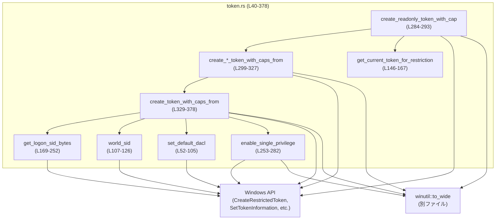
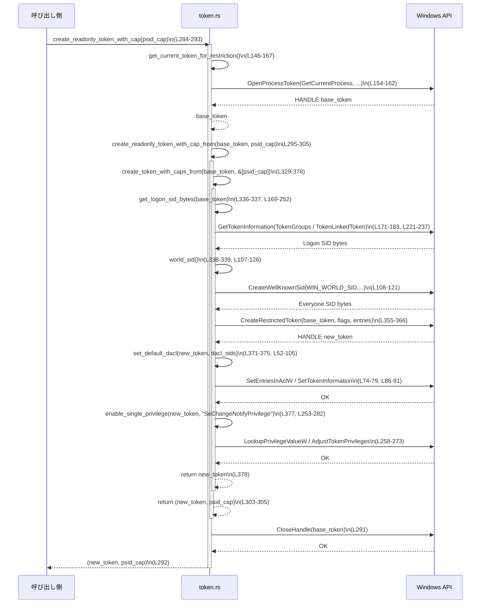

# windows-sandbox-rs/src/token.rs

## 0. ざっくり一言

Windows のアクセストークンに対して、  
「制限付きトークン」（restricted token）を生成したり、既存トークンからログオン SID を取り出したり、既定 DACL を設定したりする低レベルユーティリティ群です（`token.rs:L40-L45, L52-L55, L329-L378`）。

---

## 1. このモジュールの役割

### 1.1 概要

- このモジュールは **Windows サンドボックス内で使う制限付きトークンを構成する** 問題を扱い、次の機能を提供します。
  - 「Everyone」などの既知 SID の生成（`world_sid`）と文字列 SID の変換（`convert_string_sid_to_sid`）（`token.rs:L107-L142`）
  - 現プロセスのトークン取得と、トークンからログオン SID を抽出する処理（`get_current_token_for_restriction`, `get_logon_sid_bytes`）（`token.rs:L146-L167, L169-L252`）
  - 与えた Capability SID 群を含む制限付きトークンの生成と、DACL・特権の調整（`create_*token*`, `create_token_with_caps_from`）（`token.rs:L284-L327, L329-L378`）
  - デフォルト DACL の書き換え（`set_default_dacl`）（`token.rs:L52-L105`）

### 1.2 アーキテクチャ内での位置づけ

このモジュールは、Windows API を直接呼び出す層として振る舞います。`crate::winutil::to_wide` に依存しつつ、上位のサンドボックス構築ロジックから呼び出されることが想定されます（呼び出し側はこのチャンクには現れません）。



- 上位の「サンドボックス起動」などのモジュールからは、主に `create_*token*` 系の関数が利用されると考えられますが、このチャンクには呼び出し元は現れていません。

### 1.3 設計上のポイント

- **低レベル・unsafe ベース**
  - ほぼすべての公開関数が `unsafe` として定義されており、Windows API (`CreateRestrictedToken`, `SetTokenInformation` など) を直接呼び出します（`token.rs:L52-L55, L107-L107, L146-L146, L169-L169, L284-L286, L299-L300, L311-L311, L322-L323, L329-L330`）。
- **OS リソースとメモリ管理の手動制御**
  - トークンハンドル (`HANDLE`) と SID メモリは、呼び出し側が `CloseHandle` や `LocalFree` で解放する必要があります（`token.rs:L52-L55, L128-L131, L144-L146, L284-L292`）。
- **エラー処理**
  - 失敗時は `anyhow::Result` で `Err(anyhow!(...))` を返し、Windows のエラーコードは `GetLastError()` の戻り値としてメッセージに含めています（`token.rs:L80-L82, L122-L124, L163-L165, L260-L261, L275-L280, L367-L369`）。
- **権限の絞り込み**
  - `CreateRestrictedToken` に `DISABLE_MAX_PRIVILEGE | LUA_TOKEN | WRITE_RESTRICTED` を渡し、能力 SID + ログオン SID + Everyone SID だけを持つ制限トークンにしています（`token.rs:L40-L42, L355-L358`）。
- **DACL の緩和**
  - サンドボックス内プロセスがパイプなど IPC オブジェクトを作れるように、既定 DACL を「許可寄り」に再設定しています（`set_default_dacl` のコメント, `token.rs:L52-L53`）。

---

## 2. 主要な機能一覧

### 2.1 コンポーネント一覧（定数・構造体・関数）

#### 定数

| 名前 | 種別 | 役割 / 用途 | 根拠 |
|------|------|-------------|------|
| `DISABLE_MAX_PRIVILEGE` | `u32` | `CreateRestrictedToken` のフラグ。最大特権を無効化するために使用（`flags` に OR）（`token.rs:L40, L355-L358`） | `token.rs:L40` |
| `LUA_TOKEN` | `u32` | 制限付き「LUA トークン」を作成するフラグ（`CreateRestrictedToken` 用）（`token.rs:L41, L355-L358`） | `token.rs:L41` |
| `WRITE_RESTRICTED` | `u32` | 書き込み制限トークンとして扱うためのフラグ（`CreateRestrictedToken` 用）（`token.rs:L42, L355-L358`） | `token.rs:L42` |
| `GENERIC_ALL` | `u32` | DACL のアクセス権として「フルアクセス」を表す値（`set_default_dacl` 内で使用）（`token.rs:L43, L61`） | `token.rs:L43` |
| `WIN_WORLD_SID` | `i32` | `CreateWellKnownSid` で Everyone（World）SID を生成するための識別子（`token.rs:L44, L110, L117`） | `token.rs:L44` |
| `SE_GROUP_LOGON_ID` | `u32` | ログオン SID を識別するための属性フラグ（`get_logon_sid_bytes` で使用）（`token.rs:L45, L196-L197`） | `token.rs:L45` |

#### 構造体

| 名前 | 種別 | 役割 / 用途 | 根拠 |
|------|------|-------------|------|
| `TokenDefaultDaclInfo` | `#[repr(C)] struct` | `SetTokenInformation(TokenDefaultDacl)` に渡すための単純なラッパー。`default_dacl: *mut ACL` を持つ（`token.rs:L47-L50, L83-L90`） | `token.rs:L47-L50` |
| `TOKEN_LINKED_TOKEN` | `#[repr(C)] struct` (ローカル) | リンクトークン（通常/昇格トークンペアの片方）を取得するために `GetTokenInformation` のバッファとして使用（`get_logon_sid_bytes` 内部）（`token.rs:L216-L219, L239-L245`） | `token.rs:L216-L219` |

#### 関数（モジュール内）

| 関数名 | 公開 | 概要 | 根拠 |
|--------|------|------|------|
| `set_default_dacl(h_token, sids)` | 非公開・`unsafe` | 指定した SID 群に `GENERIC_ALL` を付与した DACL を構成し、トークンの既定 DACL として設定する（`TokenDefaultDacl`）（`token.rs:L52-L105`） | `token.rs:L52-L105` |
| `world_sid()` | `pub unsafe` | Well-known SID「Everyone (World)」を表す SID を生成し、そのバイト列を `Vec<u8>` として返す（`token.rs:L107-L126`） | `token.rs:L107-L126` |
| `convert_string_sid_to_sid(s)` | `pub unsafe` | `"S-1-1-0"` などの文字列 SID を `ConvertStringSidToSidW` で `*mut c_void` (SID) に変換して返す。呼び出し側で `LocalFree` により解放が必要（`token.rs:L128-L142`） | `token.rs:L128-L142` |
| `get_current_token_for_restriction()` | `pub unsafe` | 現在のプロセスのアクセストークンを、制限トークン作成に十分な権限で開く（`OpenProcessToken`）（`token.rs:L146-L167`） | `token.rs:L146-L167` |
| `get_logon_sid_bytes(h_token)` | `pub unsafe` | トークンのグループ一覧からログオン SID を探し、その SID 内容を `Vec<u8>` として返す。必要に応じてリンクトークンも参照（`token.rs:L169-L252`） | `token.rs:L169-L252` |
| `enable_single_privilege(h_token, name)` | 非公開・`unsafe` | 指定された特権名（例: `"SeChangeNotifyPrivilege"`）を `LookupPrivilegeValueW` と `AdjustTokenPrivileges` を使ってトークン上で有効化する（`token.rs:L253-L282`） | `token.rs:L253-L282` |
| `create_readonly_token_with_cap(psid_capability)` | `pub unsafe` | 現プロセストークンを基に、1 つの Capability SID を含む制限付きトークンを作成して返す。ベーストークンは関数内で `CloseHandle` される（`token.rs:L284-L293`） | `token.rs:L284-L293` |
| `create_readonly_token_with_cap_from(base_token, psid_capability)` (1) | `pub unsafe` | 与えられたベーストークンと単一 Capability SID から、制限付きトークンを作成して返すラッパー（`create_token_with_caps_from` 呼び出し）（`token.rs:L295-L305`） | `token.rs:L295-L305` |
| `create_workspace_write_token_with_caps_from(base_token, psid_capabilities)` | `pub unsafe` | 複数の Capability SID を含む「workspace write」用制限トークンを作成するラッパー（`create_token_with_caps_from` 呼び出し）（`token.rs:L307-L315`） | `token.rs:L307-L315` |
| `create_readonly_token_with_caps_from(base_token, psid_capabilities)` (2) | `pub unsafe` | 複数 Capability SID を含む「read-only」トークンを作成するラッパー。中身は workspace 版と同じく `create_token_with_caps_from` を呼ぶ（`token.rs:L318-L327`） | `token.rs:L318-L327` |
| `create_token_with_caps_from(base_token, psid_capabilities)` | 非公開・`unsafe` | Capability SID 群 + ログオン SID + Everyone SID を組み合わせた制限付きトークンを生成し、既定 DACL と特権を調整して返すコア実装（`token.rs:L329-L378`） | `token.rs:L329-L378` |
| `scan_token_groups_for_logon(h)` | 非公開・`unsafe`（内部ネスト） | `get_logon_sid_bytes` 内部のヘルパーとしてトークンのグループ一覧を走査し、ログオン SID を見つけてコピーする（`token.rs:L170-L210`） | `token.rs:L170-L210` |

> 注: 同一モジュール内に `pub unsafe fn create_readonly_token_with_caps_from` が 2 回定義されています（単一 Capability 版と複数 Capability 版、`token.rs:L299-L305` と `token.rs:L322-L326`）。Rust では同一シグネチャ名の重複定義はコンパイルエラーとなるため、この点はバグであると判断できます。

### 2.2 主要な機能（観点別）

- SID 生成・変換
  - `world_sid`: Everyone SID のバイト列取得（`token.rs:L107-L126`）
  - `convert_string_sid_to_sid`: 文字列表現 → SID ポインタ（`token.rs:L128-L142`）
- トークン取得・解析
  - `get_current_token_for_restriction`: 現プロセスのトークンを必要権限で取得（`token.rs:L146-L167`）
  - `get_logon_sid_bytes`: トークンからログオン SID のコピーを取り出す（`token.rs:L169-L252`）
- トークン構成
  - `create_token_with_caps_from`: Capability SID 群を含む制限付きトークンを生成し、DACL と特権を調整（`token.rs:L329-L378`）
  - 上記を呼び出すラッパー: `create_readonly_token_with_cap`, `create_*_token_with_caps_from`（`token.rs:L284-L327`）
- DACL・特権の調整
  - `set_default_dacl`: デフォルト DACL を「許可寄り」に書き換え（`token.rs:L52-L105`）
  - `enable_single_privilege`: 必要な特権を 1 つだけ有効化（`token.rs:L253-L282`）

---

## 3. 公開 API と詳細解説

### 3.1 型一覧（構造体・列挙体など）

| 名前 | 種別 | 公開 | 役割 / 用途 |
|------|------|------|-------------|
| `TokenDefaultDaclInfo` | 構造体 (`#[repr(C)]`) | 非公開 | `SetTokenInformation(TokenDefaultDacl, ...)` に渡す構造体。`default_dacl: *mut ACL` の 1 フィールドのみを持つ（`token.rs:L47-L50, L83-L90`）。 |
| `TOKEN_LINKED_TOKEN` | 構造体 (`#[repr(C)]`, ローカル) | 非公開・関数ローカル | リンクトークン (`HANDLE`) を `GetTokenInformation` で取得するためのレイアウト定義。`get_logon_sid_bytes` 内のみで使用（`token.rs:L216-L219`）。 |

### 3.2 関数詳細（7 件）

#### `unsafe fn set_default_dacl(h_token: HANDLE, sids: &[*mut c_void]) -> Result<()>`

**定義箇所**: `token.rs:L52-L105`

**概要**

- 指定したトークン `h_token` に対し、与えられた SID 配列 `sids` を `GENERIC_ALL` で許可する ACL を生成し、それをトークンの「既定 DACL (TokenDefaultDacl)」として設定します。
- コメントにある通り、PowerShell のパイプラインなどでサンドボックス内プロセスがパイプ/IPC オブジェクトを作成する際の `ACCESS_DENIED` を避ける目的があります（`token.rs:L52-L53`）。

**引数**

| 引数名 | 型 | 説明 |
|--------|----|------|
| `h_token` | `HANDLE` | 既定 DACL を設定したいトークンハンドル。呼び出し側が有効性を保証する必要があります。 |
| `sids` | `&[*mut c_void]` | DACL に追加する SID ポインタの配列。各要素は有効な SID を指している必要があります。 |

**戻り値**

- 成功時: `Ok(())`
- 失敗時: `Err(anyhow!(...))`。`SetEntriesInAclW` または `SetTokenInformation` のエラーコードを含みます（`token.rs:L80-L82, L97-L99`）。

**内部処理の流れ**

1. `sids` が空なら何も変更せず `Ok(())` を返す（`token.rs:L55-L57`）。
2. `sids` 各要素から `EXPLICIT_ACCESS_W` 配列 `entries` を生成し、`GENERIC_ALL` を許可する ACE を構築する（`token.rs:L58-L71`）。
3. `SetEntriesInAclW` を呼び出し、新しい ACL (`p_new_dacl`) を構成する（`token.rs:L73-L79`）。
4. 結果が `ERROR_SUCCESS` でない場合、エラーとして返す（`token.rs:L80-L82`）。
5. `TokenDefaultDaclInfo` 構造体に `p_new_dacl` をセットし、`SetTokenInformation(TokenDefaultDacl)` を呼び出す（`token.rs:L83-L91`）。
6. `SetTokenInformation` が失敗した場合:
   - `GetLastError()` を取得し、
   - `p_new_dacl` が非 NULL なら `LocalFree` で解放した上でエラーとして返す（`token.rs:L92-L100`）。
7. 成功の場合も `p_new_dacl` が非 NULL なら `LocalFree` で解放する（`token.rs:L101-L103`）。

**Examples（使用例）**

サンドボックス用トークンを作成した後、Everyone + Capability SID で DACL を緩和する例です。

```rust
use windows_sys::Win32::Foundation::HANDLE;
use std::ffi::c_void;

// h_token: どこかで作成した制限付きトークン（HANDLE）とする
unsafe fn relax_dacl_example(h_token: HANDLE, capability_sid: *mut c_void) -> anyhow::Result<()> {
    // Everyone SID を取得（Vec<u8> の所有権はこの関数内）
    let mut everyone_sid = crate::token::world_sid()?;                   // token.rs:L107-L126
    let psid_everyone = everyone_sid.as_mut_ptr() as *mut c_void;

    // DACL に含める SID の配列を構成
    let dacl_sids = [psid_everyone, capability_sid];

    // 既定 DACL を設定
    crate::token::set_default_dacl(h_token, &dacl_sids)?;               // token.rs:L52-L105

    Ok(())
}
```

**Errors / Panics**

- `SetEntriesInAclW` が `ERROR_SUCCESS` 以外を返した場合、`"SetEntriesInAclW failed: {res}"` のメッセージで `Err` を返します（`token.rs:L80-L82`）。
- `SetTokenInformation` が 0 を返した場合（失敗）、`"SetTokenInformation(TokenDefaultDacl) failed: {err}"` のメッセージで `Err` を返します（`token.rs:L92-L99`）。
- パニックは使用していません。

**Edge cases（エッジケース）**

- `sids` が空 (`&[]`) の場合:
  - 早期に `Ok(())` を返します。トークンの DACL は変更されません（`token.rs:L55-L57`）。
- `SetEntriesInAclW` が ACL を返さずエラーになる場合:
  - `p_new_dacl` は NULL のままなので、解放を試みず直ちにエラー終了します（`token.rs:L73-L82`）。

**使用上の注意点**

- `h_token` は `TokenDefaultDacl` を変更する権限を持っている必要があります。権限が不足していると `SetTokenInformation` が失敗します。
- `sids` の各要素は、呼び出し時点で有効な SID を指していなければなりません。無効なポインタを渡すと未定義動作になります。
- この関数自体は `unsafe` であり、呼び出し側がトークンと SID ポインタの正当性・ライフタイムを保証する必要があります。

---

#### `pub unsafe fn world_sid() -> Result<Vec<u8>>`

**定義箇所**: `token.rs:L107-L126`

**概要**

- Windows の well-known SID「Everyone (World)」を `CreateWellKnownSid` で生成し、その SID の生バイト列を `Vec<u8>` として返します。

**引数**

- なし。

**戻り値**

- 成功時: `Ok(Vec<u8>)`。`Vec` 内の内容は SID 構造体のバイト列です（`token.rs:L115-L121, L125`）。
- 失敗時: `Err(anyhow!(...))`。`CreateWellKnownSid` のエラーコードを含むメッセージ（`token.rs:L122-L124`）。

**内部処理の流れ**

1. `size` を 0 にして `CreateWellKnownSid` を呼び出し、必要なバッファサイズを取得する（`token.rs:L108-L114`）。
2. `size` 分の `Vec<u8>` を確保し、そこをバッファとして再度 `CreateWellKnownSid` を呼ぶ（`token.rs:L115-L121`）。
3. 2 回目の呼び出しが失敗 (`ok == 0`) の場合、`GetLastError()` を取得してエラーにする（`token.rs:L122-L124`）。
4. 成功時は `buf` を返す（`token.rs:L125`）。

**Examples（使用例）**

```rust
unsafe fn print_world_sid_hex() -> anyhow::Result<()> {
    let sid_bytes = crate::token::world_sid()?;   // SID の生バイト列
    // 表示用に 16 進表記にする
    println!("{:x?}", sid_bytes);
    Ok(())
}
```

**Errors / Panics**

- `CreateWellKnownSid` が失敗すると `Err(anyhow!("CreateWellKnownSid failed: {}", GetLastError()))` を返します（`token.rs:L122-L124`）。
- パニックはありません。

**Edge cases**

- `CreateWellKnownSid` の最初の呼び出しで `size` が 0 のままになるようなケースは想定されていませんが、その場合は 0 サイズの `Vec` を確保し、2 回目の呼び出しが失敗する可能性があります。このような異常系ではエラーとして返ります。

**使用上の注意点**

- 返される `Vec<u8>` は Rust の所有権で管理されるため、呼び出し側で `LocalFree` などの解放操作は不要です。
- 得られるのは SID のバイト列であり、Windows API に渡す場合は `as_mut_ptr() as *mut c_void` などのキャストが必要です（`token.rs:L337-L339`）。

---

#### `pub unsafe fn convert_string_sid_to_sid(s: &str) -> Option<*mut c_void>`

**定義箇所**: `token.rs:L128-L142`

**概要**

- `"S-1-1-0"` のような SID の文字列表現を、Windows API `ConvertStringSidToSidW` を用いて実際の SID（ヒープ上に確保された構造体）へのポインタに変換します。
- 呼び出し側が `LocalFree` により解放する必要があります（コメントに明記, `token.rs:L128-L130`）。

**引数**

| 引数名 | 型 | 説明 |
|--------|----|------|
| `s` | `&str` | 文字列表現の SID（例: `"S-1-5-32-544"`）。 |

**戻り値**

- 成功時: `Some(*mut c_void)`。実際は `PSID` ですが、汎用ポインタとして返しています（`token.rs:L135-L138`）。
- 失敗時: `None`。

**内部処理の流れ**

1. `advapi32` から `ConvertStringSidToSidW` を FFI で宣言（`token.rs:L131-L134`）。
2. `psid` を NULL で初期化（`token.rs:L135`）。
3. `to_wide(s)`（別モジュール）で UTF-16 に変換し、`ConvertStringSidToSidW` に渡して呼び出し（`token.rs:L136`）。
4. 戻り値 `ok` が非 0 なら `Some(psid)`、0 なら `None` を返す（`token.rs:L137-L140`）。

**Examples（使用例）**

```rust
use std::ffi::c_void;
use windows_sys::Win32::Foundation::LocalFree;

unsafe fn use_sid_from_string() {
    if let Some(psid) = crate::token::convert_string_sid_to_sid("S-1-1-0") {
        // psid を Windows API に渡して利用する
        // ...

        // 使い終わったら LocalFree で解放する必要がある
        LocalFree(psid as _);
    } else {
        eprintln!("SID 文字列の変換に失敗しました");
    }
}
```

**Errors / Panics**

- エラーを `Result` ではなく `Option` で返します。Windows のエラーコード (`GetLastError`) は取得していません。
- パニックはありません。

**Edge cases**

- `s` が無効な SID 文字列（フォーマット違反など）の場合、`None` が返ります。

**使用上の注意点**

- 返されたポインタは Windows ヒープ上に確保されており、**必ず `LocalFree` で解放する必要があります**（コメント, `token.rs:L128-L130`）。
- このポインタを `create_*token*` 系に渡しても、`CreateRestrictedToken` は SID 内容をコピーするため、トークン生成後は解放して問題ありません（Windows API の仕様による）。

---

#### `pub unsafe fn get_current_token_for_restriction() -> Result<HANDLE>`

**定義箇所**: `token.rs:L146-L167`

**概要**

- 現在のプロセスハンドル（`GetCurrentProcess()`）に対して `OpenProcessToken` を呼び出し、制限付きトークン作成に必要なアクセス権を持つトークンハンドルを取得します。

**引数**

- なし。

**戻り値**

- 成功時: `Ok(HANDLE)`。呼び出し側が `CloseHandle` によってクローズする必要のあるトークンハンドル（コメント, `token.rs:L144-L146`）。
- 失敗時: `Err(anyhow!(...))`。`GetLastError()` の値を含めたメッセージ（`token.rs:L163-L165`）。

**内部処理の流れ**

1. `desired` に必要な権限を OR で構成:
   - `TOKEN_DUPLICATE | TOKEN_QUERY | TOKEN_ASSIGN_PRIMARY | TOKEN_ADJUST_DEFAULT | TOKEN_ADJUST_SESSIONID | TOKEN_ADJUST_PRIVILEGES`（`token.rs:L147-L152`）。
2. `advapi32` から `OpenProcessToken` を宣言（`token.rs:L154-L160`）。
3. `GetCurrentProcess()` を渡して `OpenProcessToken` を呼び出し、トークンハンドルを `h` に受け取る（`token.rs:L153-L162`）。
4. `ok == 0` の場合は失敗として `Err(anyhow!("OpenProcessToken failed: {}", GetLastError()))` を返す（`token.rs:L163-L165`）。
5. 成功なら `Ok(h)` を返す（`token.rs:L166`）。

**Examples（使用例）**

```rust
use windows_sys::Win32::Foundation::CloseHandle;

unsafe fn with_restriction_base_token() -> anyhow::Result<()> {
    let h_token = crate::token::get_current_token_for_restriction()?;   // token.rs:L146-L167
    // h_token を元に制限付きトークンを作成する
    // ...

    CloseHandle(h_token);                                               // 呼び出し側で必ずクローズ
    Ok(())
}
```

**Errors / Panics**

- `OpenProcessToken` が 0 を返した場合、Windows のエラーコード付きで `Err` を返します（`token.rs:L163-L165`）。
- パニックはありません。

**Edge cases**

- カレントプロセスに十分な権限がない場合（権限不足など）、`OpenProcessToken` が失敗し `Err` になります。

**使用上の注意点**

- 返される `HANDLE` は RAII では管理されていないため、必ず `CloseHandle` を呼び出す必要があります。
- この関数は `unsafe` ですが、主な理由は Windows API の FFI 呼び出しとハンドル管理であり、引数がないため呼び出し条件は比較的単純です。ただしマルチスレッド環境で同一トークンを共有する場合、別スレッドでクローズされないように設計上の注意が必要です。

---

#### `pub unsafe fn get_logon_sid_bytes(h_token: HANDLE) -> Result<Vec<u8>>`

**定義箇所**: `token.rs:L169-L252`

**概要**

- 指定されたトークン `h_token` に含まれる SID グループを列挙し、ログオン SID (`SE_GROUP_LOGON_ID` 属性を持つ SID) を探して、その SID をコピーしたバイト列 (`Vec<u8>`) を返します。
- トークンに直接ログオン SID が見つからない場合、リンクトークン（通常/昇格のペア）を取得して再度探します。

**引数**

| 引数名 | 型 | 説明 |
|--------|----|------|
| `h_token` | `HANDLE` | ログオン SID を取得したいトークンハンドル。`TOKEN_QUERY` が必要です。 |

**戻り値**

- 成功時: `Ok(Vec<u8>)`。SID の生バイト列。
- 失敗時: `Err(anyhow!("Logon SID not present on token"))`（`token.rs:L251`）。

**内部処理の流れ**

1. 関数内にヘルパー `scan_token_groups_for_logon(h: HANDLE)` を定義（`token.rs:L170-L210`）。
   - `GetTokenInformation(TokenGroups)` で必要バッファサイズ `needed` を取得（`token.rs:L171-L173`）。
   - `needed` バイトの `Vec<u8>` を確保し、再度 `GetTokenInformation` で `TOKEN_GROUPS` データを取得（`token.rs:L176-L183`）。
   - グループ数 `GroupCount` を `buf` 先頭から読み出す（`token.rs:L187`）。
   - `SID_AND_ATTRIBUTES` 配列のアラインメントを考慮しながら `groups_ptr` を計算（`token.rs:L188-L193`）。
   - 各グループを走査し、`entry.Attributes & SE_GROUP_LOGON_ID == SE_GROUP_LOGON_ID` のエントリを探す（`token.rs:L194-L197`）。
   - 見つかった SID に対して `GetLengthSid` → `CopySid` でバイト列コピーを行い、`Some(Vec<u8>)` を返す（`token.rs:L197-L206`）。
   - 見つからなければ `None`（`token.rs:L209`）。
2. まず `scan_token_groups_for_logon(h_token)` を呼び、`Some(v)` なら `Ok(v)` を返す（`token.rs:L212-L214`）。
3. 見つからなかった場合、`TOKEN_LINKED_TOKEN_CLASS = 19`（`TokenLinkedToken`）として `GetTokenInformation` を呼び、リンクトークンを取得（`token.rs:L216-L228`）。
4. 十分なバッファサイズが返ってくれば、`ln_buf` を確保して `GetTokenInformation` を再度呼び、`TOKEN_LINKED_TOKEN` を読み出す（`token.rs:L229-L240`）。
5. `lt.linked_token != 0` ならそのトークンに対して再び `scan_token_groups_for_logon` を呼び、終わったら `CloseHandle` でクローズ（`token.rs:L241-L244`）。
6. リンクトークンからログオン SID が見つかれば `Ok(v)` を返す（`token.rs:L243-L246`）。
7. どこにもログオン SID が存在しない場合、最後に `Err(anyhow!("Logon SID not present on token"))` を返す（`token.rs:L251`）。

**Examples（使用例）**

```rust
use windows_sys::Win32::Foundation::HANDLE;

unsafe fn logon_sid_from_current_token() -> anyhow::Result<Vec<u8>> {
    // ベーストークンを取得
    let h_token = crate::token::get_current_token_for_restriction()?;        // token.rs:L146-L167

    // ログオン SID のバイト列を取得
    let logon_sid = crate::token::get_logon_sid_bytes(h_token)?;             // token.rs:L169-L252

    // h_token は呼び出し側で CloseHandle する想定
    windows_sys::Win32::Foundation::CloseHandle(h_token);

    Ok(logon_sid)
}
```

**Errors / Panics**

- ログオン SID がトークンにもリンクトークンにも存在しない場合、`Err(anyhow!("Logon SID not present on token"))` を返します（`token.rs:L251`）。
- `GetTokenInformation` の失敗については、エラーコードを直接返さず、「ログオン SID が見つからない」ケースとして処理しています（`needed == 0` や `ok == 0` の場合に `None` を返す, `token.rs:L171-L176, L184-L186`）。
- パニックはありません。

**Edge cases**

- `GetTokenInformation` (TokenGroups) で `needed == 0` の場合:
  - グループ情報がないため `None` とみなし、次のステップへ進む（`token.rs:L171-L175`）。
- `needed` が `u32` サイズ未満（`(needed as usize) < size_of::<u32>()`）の場合:
  - `GroupCount` を読み出せないと判断し、`None` を返します（`token.rs:L184-L186`）。
- リンクトークン情報 (`TOKEN_LINKED_TOKEN`) の取得に失敗した場合:
  - そのまま `Err("Logon SID not present on token")` に落ちます（`token.rs:L221-L251`）。

**使用上の注意点**

- `h_token` は `TOKEN_QUERY` アクセス権を持つ有効なトークンハンドルである必要があります。
- 内部でリンクトークンを取得した場合には自前で `CloseHandle` していますが、引数 `h_token` 自身のクローズは呼び出し側の責任です。
- ログオン SID が存在しないような特殊なトークンに対してはエラーとなるため、その場合のフォールバック戦略が必要な場合があります。

---

#### `unsafe fn enable_single_privilege(h_token: HANDLE, name: &str) -> Result<()>`

**定義箇所**: `token.rs:L253-L282`

**概要**

- 指定された特権名（例: `"SeChangeNotifyPrivilege"`）を、有効化された状態でトークン `h_token` に設定します。
- `create_token_with_caps_from` では、生成した制限トークンに対して `"SeChangeNotifyPrivilege"` を有効化するために使用されています（`token.rs:L377-L378`）。

**引数**

| 引数名 | 型 | 説明 |
|--------|----|------|
| `h_token` | `HANDLE` | 特権を変更したいトークンハンドル。`TOKEN_ADJUST_PRIVILEGES` 権限が必要です。 |
| `name` | `&str` | 特権名（例: `"SeChangeNotifyPrivilege"`）。Unicode 文字列として `LookupPrivilegeValueW` に渡されます。 |

**戻り値**

- 成功時: `Ok(())`
- 失敗時: `Err(anyhow!(...))`。`LookupPrivilegeValueW` または `AdjustTokenPrivileges` のエラー、および `GetLastError()` の結果を含みます（`token.rs:L258-L261, L274-L280`）。

**内部処理の流れ**

1. `LUID` 構造体を 0 で初期化し、`LookupPrivilegeValueW` に `name` を渡して LUID を取得（`token.rs:L253-L259`）。
2. `TOKEN_PRIVILEGES` 構造体 `tp` を `zeroed()` で初期化し、`PrivilegeCount = 1`、`Privileges[0]` に LUID と `SE_PRIVILEGE_ENABLED` (0x2) を設定（`token.rs:L262-L265`）。
3. `AdjustTokenPrivileges` を呼び出して特権を設定（`token.rs:L266-L273`）。
4. `ok2 == 0` の場合、`"AdjustTokenPrivileges failed: {}"` としてエラー（`token.rs:L274-L276`）。
5. さらに `GetLastError()` を呼び、0 でなければ `"AdjustTokenPrivileges error {err}"` としてエラー（`token.rs:L277-L280`）。
   - これは `ERROR_NOT_ALL_ASSIGNED` などの「部分成功」を検出するためです。

**Examples（使用例）**

```rust
use windows_sys::Win32::Foundation::HANDLE;

unsafe fn ensure_change_notify_privilege(h_token: HANDLE) -> anyhow::Result<()> {
    crate::token::enable_single_privilege(h_token, "SeChangeNotifyPrivilege")?;
    Ok(())
}
```

**Errors / Panics**

- `LookupPrivilegeValueW` 失敗時: `Err(anyhow!("LookupPrivilegeValueW failed: {}", GetLastError()))`（`token.rs:L258-L261`）。
- `AdjustTokenPrivileges` 失敗時: `Err(anyhow!("AdjustTokenPrivileges failed: {}", GetLastError()))`（`token.rs:L274-L276`）。
- `AdjustTokenPrivileges` 成功後でも `GetLastError() != 0` の場合（例えば `ERROR_NOT_ALL_ASSIGNED`）、`Err(anyhow!("AdjustTokenPrivileges error {err}"))`（`token.rs:L277-L280`）。
- パニックはありません。

**Edge cases**

- 指定した特権名が存在しない、または現在のプロセスに割り当てられていない場合、`LookupPrivilegeValueW` もしくは `AdjustTokenPrivileges` が失敗し、エラーになります。

**使用上の注意点**

- 特権の変更はセキュリティ上の意味が大きいため、必要な特権のみを有効化する設計が重要です。本関数は「1 つだけ」を対象にしています。
- この関数は制限トークンに最低限必要な特権だけを付与する用途で使用されており、追加で他の特権を有効化するとサンドボックスの強度が下がる可能性があります。

---

#### `unsafe fn create_token_with_caps_from(base_token: HANDLE, psid_capabilities: &[*mut c_void]) -> Result<HANDLE>`

**定義箇所**: `token.rs:L329-L378`

**概要**

- 与えられたベーストークン `base_token` に対して、指定された Capability SID 群 `psid_capabilities` に加え、ログオン SID と Everyone SID を含む制限付きトークンを `CreateRestrictedToken` で生成します。
- 生成後のトークンに対して、既定 DACL を設定し、`SeChangeNotifyPrivilege` を有効化します。
- ラッパー関数 `create_readonly_token_with_cap[_from]`, `create_workspace_write_token_with_caps_from`, `create_readonly_token_with_caps_from` の「コア実装」です（`token.rs:L284-L327`）。

**引数**

| 引数名 | 型 | 説明 |
|--------|----|------|
| `base_token` | `HANDLE` | 元となるトークン。`CreateRestrictedToken` を呼び出すのに十分な権限を持ち、かつ有効でなければなりません。 |
| `psid_capabilities` | `&[*mut c_void]` | Capability SID のポインタ配列。少なくとも 1 要素必要です（空はエラー）。 |

**戻り値**

- 成功時: `Ok(HANDLE)`。新しく作成された制限付きトークンハンドル。呼び出し側が `CloseHandle` で解放する必要があります。
- 失敗時: `Err(anyhow!(...))`。`CreateRestrictedToken`, `set_default_dacl`, `enable_single_privilege` のいずれかのエラー。

**内部処理の流れ**

1. `psid_capabilities.is_empty()` の場合、`Err(anyhow!("no capability SIDs provided"))` を返す（`token.rs:L333-L335`）。
2. `get_logon_sid_bytes(base_token)` を呼び、ベーストークンからログオン SID バイト列を取得し、`psid_logon` ポインタを得る（`token.rs:L336-L337`）。
3. `world_sid()` を呼び、Everyone SID を取得し、`psid_everyone` ポインタを得る（`token.rs:L338-L339`）。
4. SID と属性を格納する `entries: Vec<SID_AND_ATTRIBUTES>` を `psid_capabilities.len() + 2` 要素で初期化し、
   - `entries[0..len_cap)` に Capability SID 群をコピー、
   - `entries[logon_idx]` に `psid_logon`,
   - `entries[logon_idx + 1]` に `psid_everyone` をセット（`token.rs:L341-L352`）。
5. `flags = DISABLE_MAX_PRIVILEGE | LUA_TOKEN | WRITE_RESTRICTED` として `CreateRestrictedToken` を呼び出し、新しいトークン `new_token` を生成（`token.rs:L354-L366`）。
   - `DisableSidCount`, `DeletePrivilegeCount` などは 0 として渡しており、`SidsToRestrict` に `entries` を渡しています（`token.rs:L359-L364`）。
6. `CreateRestrictedToken` が 0 を返した場合、`Err(anyhow!("CreateRestrictedToken failed: {}", GetLastError()))` を返す（`token.rs:L367-L369`）。
7. DACL 用の SID リスト `dacl_sids` を作成:
   - ログオン SID (`psid_logon`)、Everyone SID (`psid_everyone`)、Capability SID 群を順に格納（`token.rs:L371-L374`）。
8. `set_default_dacl(new_token, &dacl_sids)?;` を呼び、既定 DACL を設定（`token.rs:L375`）。
9. `enable_single_privilege(new_token, "SeChangeNotifyPrivilege")?;` を呼び、特権を 1 つだけ有効化（`token.rs:L377`）。
10. 最後に `Ok(new_token)` を返す（`token.rs:L378`）。

**Examples（使用例）**

```rust
use std::ffi::c_void;
use windows_sys::Win32::Foundation::{HANDLE, CloseHandle, LocalFree};

unsafe fn create_restricted_with_capability_string(
    base_token: HANDLE,
    capability_sid_str: &str,
) -> anyhow::Result<HANDLE> {
    // 文字列 SID から PSID を生成
    let psid_cap = crate::token::convert_string_sid_to_sid(capability_sid_str)
        .ok_or_else(|| anyhow::anyhow!("Invalid capability SID string"))?;   // token.rs:L128-L142

    // Capability SID 配列
    let caps = [psid_cap];

    // 制限付きトークンを作成
    let h_restricted = crate::token::create_token_with_caps_from(base_token, &caps)?; // token.rs:L329-L378

    // 元の SID はもう不要であれば解放
    LocalFree(psid_cap as _);

    Ok(h_restricted)
}
```

**Errors / Panics**

- Capability SID 配列が空の場合、必ず `Err(anyhow!("no capability SIDs provided"))` を返します（`token.rs:L333-L335`）。
- `get_logon_sid_bytes` が失敗した場合、そのエラーを伝播します（`token.rs:L336-L337`）。
- `world_sid` が失敗した場合、そのエラーを伝播します（`token.rs:L338-L339`）。
- `CreateRestrictedToken`, `set_default_dacl`, `enable_single_privilege` がいずれかで失敗した場合、対応する `anyhow!` エラーを伝播します（`token.rs:L367-L369, L375, L377`）。
- パニックはありません。

**Edge cases**

- ベーストークンにログオン SID が存在しない場合:
  - `get_logon_sid_bytes` がエラーとなり、この関数もエラーで終了します（`token.rs:L336-L337`）。
- Capability SID 群が多い場合:
  - `entries` や `dacl_sids` の `Vec` 生成だけがコストとなりますが、特別な制限はコードからは読み取れません。

**使用上の注意点**

- 返される `HANDLE` は呼び出し側で必ず `CloseHandle` する必要があります。
- 引数の `psid_capabilities` に含まれる SID ポインタは、呼び出し時に有効であれば十分であり、`CreateRestrictedToken` 呼び出し後は解放しても問題ありません（SID 内容はトークン内部にコピーされます）。
- この関数は DACL と特権も設定するため、サンドボックス設計上、どの SID に `GENERIC_ALL` を与えているか（ログオン・Everyone・Capability）を把握しておく必要があります（`token.rs:L371-L375`）。

---

### 3.3 その他の関数

公開 API のうち、上記で詳細に扱っていないラッパー関数をまとめます。

| 関数名 | 役割（1 行） | 根拠 |
|--------|--------------|------|
| `pub unsafe fn create_readonly_token_with_cap(psid_capability: *mut c_void) -> Result<(HANDLE, *mut c_void)>` | 現プロセストークンをベースに、単一 Capability SID を含む制限付きトークンを作成する。ベーストークンの取得・クローズを内部で行う（`token.rs:L284-L293`）。戻り値タプルの第 2 要素は引数と同じ SID ポインタをそのまま返す。 | `token.rs:L284-L293` |
| `pub unsafe fn create_readonly_token_with_cap_from(base_token: HANDLE, psid_capability: *mut c_void) -> Result<(HANDLE, *mut c_void)>` | 指定ベーストークン + 単一 Capability SID から制限付きトークンを作るラッパー。内部で `create_token_with_caps_from(base_token, &[psid_capability])` を呼び、トークンと Capability SID をタプルで返す（`token.rs:L295-L305`）。 | `token.rs:L295-L305` |
| `pub unsafe fn create_workspace_write_token_with_caps_from(base_token: HANDLE, psid_capabilities: &[*mut c_void]) -> Result<HANDLE>` | Capability SID 群を含む「workspace write」用トークンを作るラッパー。実装は `create_token_with_caps_from` をそのまま呼んでいる（`token.rs:L307-L315`）。 | `token.rs:L307-L315` |
| `pub unsafe fn create_readonly_token_with_caps_from(base_token: HANDLE, psid_capabilities: &[*mut c_void]) -> Result<HANDLE>` | Capability SID 群を含む「read-only」トークンを作るラッパー。実装は workspace 版と同じく `create_token_with_caps_from` を呼ぶ（`token.rs:L318-L327`）。関数名が既出の `create_readonly_token_with_caps_from` と重複しており、コンパイル上の衝突が生じる。 | `token.rs:L318-L327` |

**バグに関する補足**

- `create_readonly_token_with_caps_from` が 2 度定義されている（シグネチャも異なる）点は、Rust の言語仕様上コンパイルエラーとなるため、修正が必要です（`token.rs:L295-L305, L318-L327`）。

---

## 4. データフロー

ここでは、「現在のプロセストークンから単一 Capability SID を持つ read-only 制限トークンを作成する」ケースのデータフローを示します。対象は `create_readonly_token_with_cap` を起点とした流れです（`token.rs:L284-L293, L295-L305, L329-L378`）。

### 4.1 処理の要点

1. 呼び出し側は、Capability SID (`*mut c_void`) を用意した上で `create_readonly_token_with_cap` を呼ぶ。
2. 関数内で、`get_current_token_for_restriction` によりベーストークンを取得し、`create_readonly_token_with_cap_from` 経由で `create_token_with_caps_from` を呼ぶ。
3. `create_token_with_caps_from` 内で、ベーストークンからログオン SID (`get_logon_sid_bytes`) と Everyone SID (`world_sid`) を取得し、Capability + Logon + Everyone の SID 群を使って `CreateRestrictedToken` を呼ぶ。
4. 新トークンに対して DACL を設定 (`set_default_dacl`) し、必要な特権を有効化 (`enable_single_privilege`) してから返す。
5. `create_readonly_token_with_cap` はベーストークンを `CloseHandle` し、新トークンと Capability SID を返す。

### 4.2 シーケンス図



---

## 5. 使い方（How to Use）

### 5.1 基本的な使用方法

ここでは、文字列で指定した Capability SID を用いて、現在のプロセストークンから read-only 制限トークンを作成し、そのトークンで新しいプロセスを起動する、という典型的フローの例を示します。  
（プロセス起動部分は疑似コードです。実際のプロセス作成は他モジュールが担当していると考えられます。）

```rust
use std::ffi::c_void;
use anyhow::Result;
use windows_sys::Win32::Foundation::{CloseHandle, LocalFree};

unsafe fn create_restricted_process_with_capability(cap_sid_str: &str) -> Result<()> {
    // 1. Capability SID を文字列から PSID に変換する
    let psid_cap: *mut c_void = crate::token::convert_string_sid_to_sid(cap_sid_str)
        .ok_or_else(|| anyhow::anyhow!("Invalid capability SID string"))?;       // token.rs:L128-L142

    // 2. 現在のプロセストークンから read-only 制限トークンを作成する
    let (h_restricted, _psid_cap): (windows_sys::Win32::Foundation::HANDLE, *mut c_void) =
        crate::token::create_readonly_token_with_cap(psid_cap)?;                 // token.rs:L284-L293

    // 3. h_restricted を使って新しいプロセスを起動する（疑似コード）
    //    create_process_with_token(h_restricted, ...);

    // 4. リソースのクリーンアップ
    CloseHandle(h_restricted);                                                  // トークンハンドルのクローズ
    LocalFree(psid_cap as _);                                                   // SID の解放（convert_string_sid_to_sid の仕様）

    Ok(())
}
```

ポイント:

- `create_readonly_token_with_cap` はベーストークンの取得とクローズを内部で行うため、呼び出し側は返されるトークンハンドルと Capability SID の解放だけを意識すれば足ります（`token.rs:L284-L293`）。
- すべて `unsafe` な API であるため、上記コード自体も `unsafe fn` として宣言しています。

### 5.2 よくある使用パターン

1. **自プロセスベースの制限トークン作成（簡易）**

   - `create_readonly_token_with_cap` を使い、ベーストークン取得を自動化する（`token.rs:L284-L293`）。
   - Capability SID が 1 つだけのケースに適しています。

   ```rust
   unsafe fn simple_readonly_token(psid_cap: *mut c_void) -> anyhow::Result<windows_sys::Win32::Foundation::HANDLE> {
       let (h_token, _psid) = crate::token::create_readonly_token_with_cap(psid_cap)?;
       Ok(h_token)
   }
   ```

2. **外部から渡されたトークンをベースに使う**

   - すでに別のモジュールで開かれているトークンがある場合、`create_*_token_with_caps_from` 系を使います（`token.rs:L307-L315, L318-L327`）。

   ```rust
   unsafe fn restricted_from_given_token(
       base_token: windows_sys::Win32::Foundation::HANDLE,
       caps: &[*mut c_void],
   ) -> anyhow::Result<windows_sys::Win32::Foundation::HANDLE> {
       crate::token::create_workspace_write_token_with_caps_from(base_token, caps)
   }
   ```

3. **ログオン SID のみ独立に取得**

   - トークン解析だけをしたい場合は `get_logon_sid_bytes` を単独で呼び出し、返された SID バイト列を他の用途に利用できます（`token.rs:L169-L252`）。

   ```rust
   unsafe fn dump_logon_sid(h_token: windows_sys::Win32::Foundation::HANDLE) -> anyhow::Result<()> {
       let sid = crate::token::get_logon_sid_bytes(h_token)?;
       println!("Logon SID bytes: {:x?}", sid);
       Ok(())
   }
   ```

### 5.3 よくある間違い

```rust
use windows_sys::Win32::Foundation::{HANDLE, CloseHandle};
use std::ffi::c_void;

unsafe fn wrong_usage(psid_cap: *mut c_void) -> anyhow::Result<()> {
    // 間違い例 1: 返されたトークンハンドルをクローズしない
    let (h_token, _psid) = crate::token::create_readonly_token_with_cap(psid_cap)?;
    // CloseHandle(h_token); // ← 呼び出し側でクローズしないとハンドルリーク

    Ok(())
}

// 正しい例
unsafe fn correct_usage(psid_cap: *mut c_void) -> anyhow::Result<()> {
    let (h_token, _psid) = crate::token::create_readonly_token_with_cap(psid_cap)?;
    // h_token を使った処理
    // ...
    CloseHandle(h_token); // ← 必ずクローズする
    Ok(())
}
```

```rust
// 間違い例 2: Capability SID 配列が空のまま呼び出す
unsafe fn wrong_empty_caps(base_token: HANDLE) -> anyhow::Result<HANDLE> {
    let caps: [*mut c_void; 0] = [];
    // エラー: "no capability SIDs provided"
    crate::token::create_token_with_caps_from(base_token, &caps)               // token.rs:L333-L335
}

// 正しい例: 1 つ以上の Capability SID を渡す
unsafe fn correct_non_empty_caps(base_token: HANDLE, cap: *mut c_void) -> anyhow::Result<HANDLE> {
    let caps = [cap];
    crate::token::create_token_with_caps_from(base_token, &caps)
}
```

### 5.4 使用上の注意点（まとめ）

- **ハンドルの管理**
  - `get_current_token_for_restriction` や `create_*token*` から返される `HANDLE` は RAII ではないため、**必ず `CloseHandle` でクローズ**する必要があります（`token.rs:L144-L146, L284-L293`）。
- **SID メモリの管理**
  - `convert_string_sid_to_sid` の戻り値や、Windows API から直接返される SID は、原則 `LocalFree` で解放する必要があります（`token.rs:L128-L130`）。
  - `world_sid` や `get_logon_sid_bytes` の戻り値は `Vec<u8>` であり、Rust の所有権機構で自動解放されます。
- **unsafe 呼び出しの前提条件**
  - 全ての `unsafe` 関数は、渡されるハンドルや SID ポインタが有効であることを前提としています。
  - 無効なポインタやクローズ済みハンドルを渡すと、未定義動作や OS 例外の原因になります。
- **セキュリティ面**
  - `set_default_dacl` により、Capability SID・ログオン SID・Everyone に対して `GENERIC_ALL` を付与しているため、DACL の緩和がサンドボックス設計に与える影響を理解する必要があります（`token.rs:L371-L375`）。
  - `enable_single_privilege` で付与する特権の種類も、最小権限の原則に沿って慎重に選ぶべきです。
- **スレッド安全性**
  - Windows のトークンハンドル自体は OS レベルでスレッドセーフに扱われますが、本モジュールでは共有や同期の制御は行っていません。複数スレッドから同じハンドルを操作する場合、クローズタイミングなどは呼び出し側で調整する必要があります。

---

## 6. 変更の仕方（How to Modify）

### 6.1 新しい機能を追加する場合

例: 「特定の Capability セットをプリセットとして簡単に指定できる関数」を追加する場合。

1. **エントリポイントの選定**
   - 既存のコア実装 `create_token_with_caps_from`（`token.rs:L329-L378`）を再利用し、新しいラッパー関数を同じファイル内に `pub unsafe fn` として追加すると、一貫した設計になります。
2. **Capability SID の生成**
   - 文字列 SID から動的に生成するなら `convert_string_sid_to_sid` を再利用し、それらを配列にまとめて `create_token_with_caps_from` に渡します（`token.rs:L128-L142`）。
3. **DACL/特権の方針**
   - `create_token_with_caps_from` 内で DACL と特権の設定を行っているため、基本方針を変えない限り、ラッパー側で追加設定は不要です。
4. **安全性のドキュメント**
   - 新しい `unsafe` 関数を追加する場合は、既存関数と同様に「# Safety」コメントで呼び出し側の責任範囲（ハンドルの管理、SID ポインタのライフタイムなど）を明示します。

### 6.2 既存の機能を変更する場合

- **影響範囲の確認**
  - `create_token_with_caps_from` を変更する場合、それを呼び出している全てのラッパー関数（`create_readonly_token_with_cap`, `create_readonly_token_with_cap_from`, `create_workspace_write_token_with_caps_from`, `create_readonly_token_with_caps_from`）に影響します（`token.rs:L284-L327, L329-L378`）。
  - IDE の参照検索や `rg create_token_with_caps_from` などで使用箇所を洗い出すことが有効です。
- **契約（前提条件・返り値）の維持**
  - 例: `psid_capabilities` が空の場合はエラーにする、という契約（`token.rs:L333-L335`）を変更すると、呼び出し側の前提が崩れます。契約を変える場合は、呼び出し側のコードとドキュメントの更新が必要です。
- **DACL/特権の変更**
  - `set_default_dacl` に渡す SID の集合や、`enable_single_privilege` で有効化する特権名を変更すると、サンドボックスの権限モデルが変わります。セキュリティレビューを伴う変更とみなすのが適切です（`token.rs:L371-L377`）。
- **重複関数名の修正**
  - `create_readonly_token_with_caps_from` が 2 回定義されている問題は、片方の関数名を変更するか統合することで解消できます（`token.rs:L295-L305, L322-L326`）。
  - シグネチャや用途に基づいて、「単一 Capability 用」と「複数 Capability 用」で名前を分けると読解しやすくなります。

---

## 7. 関連ファイル

このモジュールと密接に関係すると推測されるファイル・モジュールをまとめます。

| パス / モジュール | 役割 / 関係 |
|-------------------|------------|
| `crate::winutil::to_wide` | UTF-8 の `&str` を Windows API 用の UTF-16 ワイド文字配列に変換する関数と推測されます。本モジュールの `convert_string_sid_to_sid` と `enable_single_privilege` で使用されています（`token.rs:L1, L136, L258`）。コード本体はこのチャンクには現れません。 |
| サンドボックス起動関係のモジュール（例: `process.rs`, `sandbox.rs` など） | 制限付きトークンを使って新プロセスを起動するロジックが存在すると考えられますが、このチャンクには参照は現れません。不明です。 |
| テストコード | このチャンクにはテストモジュールやテスト関数は現れません（`#[cfg(test)]` などは見当たりません）。テストは別ファイルにあるか、まだ用意されていない可能性があります。 |

---

### まとめ

- `token.rs` は、Windows サンドボックス環境で使う制限付きトークンを構成するための低レベルなユーティリティ群を提供しており、SID・DACL・特権・トークンの生成を一手に担うモジュールです（`token.rs:L40-L45, L52-L55, L329-L378`）。
- 全体的に、Windows API に直接アクセスする unsafe コードで構成されているため、呼び出し側はハンドルや SID ポインタのライフタイム管理、およびセキュリティ上の前提（どの SID/特権を持つトークンを作るか）を理解したうえで利用する必要があります。
