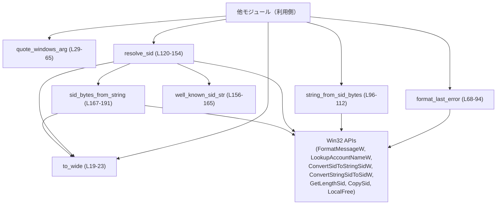
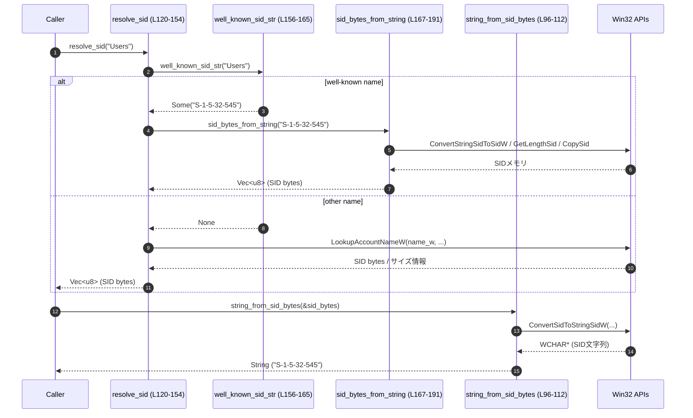

# windows-sandbox-rs/src/winutil.rs コード解説

## 0. ざっくり一言

Windows 専用のユーティリティ関数群で、以下を扱うモジュールです。

- UTF-16（NUL 終端）への変換、Windows コマンドライン引数のクオート
- Win32 エラーコードの文字列化
- SID（Security Identifier）の文字列⇔バイナリ変換、およびアカウント名からの SID 解決  

（すべての記述の根拠は `winutil.rs` 内のコードに基づきます）

---

## 1. このモジュールの役割

### 1.1 概要

このモジュールは、**Windows API を呼び出すために必要な文字列や SID の整形・変換処理**をまとめたユーティリティです。

- Unix とは異なる Windows の文字列表現（UTF-16 / NUL 終端）との橋渡しを行います（`to_wide`、`quote_windows_arg`）（`winutil.rs:L19-23, L29-65`）。
- Win32 のエラーコードを読みやすいエラーメッセージに変換します（`format_last_error`）（`winutil.rs:L68-94`）。
- アカウント名や SID 文字列から SID バイナリを取得し、逆に SID バイナリから SID 文字列を得る関数を提供します（`resolve_sid`、`string_from_sid_bytes`、`sid_bytes_from_string`）（`winutil.rs:L96-112, L114-191`）。

### 1.2 アーキテクチャ内での位置づけ

このファイル単体で見ると、**状態を持たない純粋なヘルパー群**であり、他のモジュールから呼び出されることを前提に設計されています。  
内部では `windows_sys` クレート経由で多数の Win32 API を直接呼び出します（`winutil.rs:L4-17`）。

以下は、本ファイル内の関数と外部依存の関係を簡略化した図です。



> この図は `windows-sandbox-rs/src/winutil.rs:L19-191` の関数間および Win32 API との依存を表しています。

### 1.3 設計上のポイント

- **責務の分割**
  - 文字列⇔UTF-16 変換は `to_wide` に集約（`winutil.rs:L19-23`）。
  - 引数のクオート、エラーコードの文字列化、SID 関連処理が関数ごとに分かれています。
- **状態を持たない**
  - グローバルな可変状態はなく、すべての関数は入力から出力を計算するだけです。
  - これにより、Rust 側の観点では関数は再入可能であり、並行呼び出しによる競合は発生しません（Win32 API 側のスレッド安全性まではこのチャンクからは判断できません）。
- **FFI と unsafe の局所化**
  - Win32 API 呼び出しは `unsafe` ブロック内に閉じ込められており（例: `format_last_error` の `FormatMessageW` 呼び出し `winutil.rs:L68-93`）、呼び出し元は安全な関数として利用できます。
  - `LocalFree` によるメモリ解放を各関数内で行い、利用者がハンドルの解放を意識しなくてよい構造になっています。
- **エラーハンドリング**
  - SID 文字列→バイト列やアカウント名→SID では `anyhow::Result<Vec<u8>>` を返し、Win32 のエラーコードを含むメッセージを `anyhow::Error` に包んで返します（`winutil.rs:L1, L120-154, L167-191`）。
  - SID バイト列→文字列では `Result<String, String>`（標準ライブラリの `Result`）を用いており、エラーは文字列メッセージとして返します（`winutil.rs:L96-112`）。

---

## 2. 主要な機能一覧

- Windows 文字列変換: `to_wide` で `OsStr` を UTF-16 / NUL 終端のベクタに変換（`winutil.rs:L19-23`）
- Windows コマンドライン引数のクオート: `quote_windows_arg`（Windows の CommandLineToArgvW 互換）（`winutil.rs:L25-65`）
- Win32 エラーコードのメッセージ化: `format_last_error`（`winutil.rs:L68-94`）
- SID バイト列→SID 文字列変換: `string_from_sid_bytes`（`winutil.rs:L96-112`）
- アカウント名→SID バイト列解決: `resolve_sid` と、その内部で使う `well_known_sid_str` / `sid_bytes_from_string`（`winutil.rs:L114-191`）

### 2.1 コンポーネント一覧（関数・定数）

#### 関数一覧

| 名前 | 種別 | 公開 | 役割 / 用途 | 定義位置 |
|------|------|------|------------|----------|
| `to_wide` | 関数 | `pub` | `OsStr` を UTF-16（NUL 終端）`Vec<u16>` に変換し、Win32 API 呼び出しに使える形にする | `winutil.rs:L19-23` |
| `quote_windows_arg` | 関数 | `pub`（`cfg(target_os="windows")`） | Windows のコマンドライン引数 1 個を、CRT/CommandLineToArgvW ルールに従ってクオートする | `winutil.rs:L25-65` |
| `format_last_error` | 関数 | `pub` | Win32 エラーコード（`i32`）を、人間可読なエラーメッセージ文字列に変換する | `winutil.rs:L68-94` |
| `string_from_sid_bytes` | 関数 | `pub` | SID バイト列から SID 文字列表現（`"S-1-..."`）を取得する | `winutil.rs:L96-112` |
| `resolve_sid` | 関数 | `pub` | アカウント名文字列から SID バイト列を解決する。既知のグループ名は事前定義の SID 文字列から変換し、それ以外は Win32 `LookupAccountNameW` を用いる | `winutil.rs:L120-154` |
| `well_known_sid_str` | 関数 | `fn`（非公開） | 一部のよく使われるアカウント名を SID 文字列にマッピングする | `winutil.rs:L156-165` |
| `sid_bytes_from_string` | 関数 | `fn`（非公開） | SID 文字列 `"S-1-..."` から SID バイト列を生成する（Win32 API `ConvertStringSidToSidW` 等を利用） | `winutil.rs:L167-191` |

#### 定数一覧

| 名前 | 種別 | 公開 | 役割 / 用途 | 定義位置 |
|------|------|------|------------|----------|
| `SID_ADMINISTRATORS` | `const &str` | 非公開 | `"Administrators"` グループの SID 文字列 `"S-1-5-32-544"` | `winutil.rs:L114` |
| `SID_USERS` | `const &str` | 非公開 | `"Users"` グループの SID 文字列 `"S-1-5-32-545"` | `winutil.rs:L115` |
| `SID_AUTHENTICATED_USERS` | `const &str` | 非公開 | `"Authenticated Users"` グループの SID 文字列 `"S-1-5-11"` | `winutil.rs:L116` |
| `SID_EVERYONE` | `const &str` | 非公開 | `"Everyone"` グループの SID 文字列 `"S-1-1-0"` | `winutil.rs:L117` |
| `SID_SYSTEM` | `const &str` | 非公開 | `"SYSTEM"` アカウントの SID 文字列 `"S-1-5-18"` | `winutil.rs:L118` |

---

## 3. 公開 API と詳細解説

### 3.1 型一覧（構造体・列挙体など）

このファイルには、ユーザー定義の構造体・列挙体・トレイトは定義されていません（`winutil.rs:L1-191`）。  
公開 API はすべて自由関数（`pub fn`）です。

---

### 3.2 関数詳細（7 件）

#### `to_wide<S: AsRef<OsStr>>(s: S) -> Vec<u16>`

**概要**

`OsStr` またはそれに変換可能な値を、Windows API が期待する **UTF-16 / NUL 終端** の `Vec<u16>` に変換します（`winutil.rs:L19-23`）。

**引数**

| 引数名 | 型 | 説明 |
|--------|----|------|
| `s` | `S: AsRef<OsStr>` | 変換対象のパスや文字列。`&str` や `&OsStr` などを渡せます。 |

**戻り値**

- `Vec<u16>`: UTF-16 エンコードされたコード単位列に、末尾に `0`（NUL）を 1 つ追加したもの。  
  Win32 API の `LPCWSTR` / `LPWSTR` パラメータに渡すのに適した形式です。

**内部処理の流れ**

1. `s.as_ref().encode_wide().collect()` で `OsStr` を UTF-16 の `Vec<u16>` として収集します（`winutil.rs:L20`）。
2. `v.push(0);` で NUL 終端（`0u16`）を追加します（`winutil.rs:L21`）。
3. ベクタ `v` を返します（`winutil.rs:L22`）。

**Examples（使用例）**

```rust
use std::ffi::OsStr;

// Windows API に渡すための UTF-16 / NUL 終端のバッファを生成する例
let wide_path = winutil::to_wide(OsStr::new(r"C:\Temp\file.txt")); // パスを UTF-16 に変換

// wide_path.as_ptr() を Win32 API の LPCWSTR パラメータに渡せる
assert_eq!(*wide_path.last().unwrap(), 0); // 末尾が NUL で終わっている
```

※ ここでは `winutil` モジュールが `winutil::to_wide` というパスで利用可能であると仮定しています（実際のモジュールパスはこのチャンクからは分かりません）。

**Errors / Panics**

- この関数は `Result` を返さず、明示的なエラーにはなりません。
- 実行時に起こりうるのはメモリ確保失敗などの一般的なパニックのみです（コードからは特別なパニック条件は読み取れません）。

**Edge cases（エッジケース）**

- 空文字列: 入力が空でもベクタは `[0]` となり、NUL 終端だけの文字列になります。
- NUL 文字を含む入力: 中間に `0u16` が含まれても、そのまま UTF-16 にエンコードされます。Win32 API によっては最初の NUL で切れるため注意が必要です。

**使用上の注意点**

- 末尾の NUL は自動で付くため、呼び出し側で二重に NUL を追加しないようにする必要があります。
- 返された `Vec<u16>` は所有型なので、`as_ptr()` などでポインタを渡す場合、**Win32 API 呼び出し中はベクタをドロップしない**ようにする必要があります（Rust の所有権・ライフタイムの一般的な注意点）。

---

#### `quote_windows_arg(arg: &str) -> String`（Windows 限定）

**概要**

単一のコマンドライン引数を、Windows の `CommandLineToArgvW` / CRT が使用するルールに従ってクオートします（`winutil.rs:L25-65`）。  
これにより、スペース・タブ・改行・クォート・バックスラッシュを含む引数を、**1 つの引数として正しく解釈**させることができます。

**引数**

| 引数名 | 型 | 説明 |
|--------|----|------|
| `arg` | `&str` | クオート対象のコマンドライン引数文字列。 |

**戻り値**

- `String`: Windows のコマンドライン規則に従ってクオートされた文字列。

**内部処理の流れ**

1. 引数が空、または空白・制御文字（`' '`, `'\t'`, `'\n'`, `'\r'`）か `'"'` を含むかどうかを判定し、**クオートが必要か**を決めます（`winutil.rs:L30-35`）。
2. クオート不要なら、そのまま `arg.to_string()` を返します（`winutil.rs:L34-36`）。
3. クオートが必要な場合、`"` を先頭に追加し、`backslashes` カウンタを 0 で初期化します（`winutil.rs:L38-40`）。
4. 文字ごとに次のように処理します（`winutil.rs:L41-58`）。
   - `\` の場合: `backslashes` をインクリメント。
   - `"` の場合:
     - 現在までに見たバックスラッシュを `backslashes * 2 + 1` 個だけ出力し（`repeat`）、`"` を追加してから `backslashes` を 0 にリセット。
   - その他の文字の場合:
     - 溜まっているバックスラッシュがあればそのまま出力し、`backslashes` を 0 にリセット。
     - その文字自体を追加。
5. ループ終了後に、末尾に余っているバックスラッシュがあれば、それらを **倍にして**出力します（閉じるクォート前のバックスラッシュの扱い）（`winutil.rs:L60-62`）。
6. 最後に閉じる `"` を追加し、完成した文字列を返します（`winutil.rs:L63-64`）。

**Examples（使用例）**

```rust
// 単純な引数（空白なし）はそのまま
assert_eq!(winutil::quote_windows_arg("foo"), "foo");

// スペースを含む引数はクオートされる
assert_eq!(winutil::quote_windows_arg("C:\\Program Files\\App"),
           "\"C:\\Program Files\\App\"");

// クォートとバックスラッシュを含むパス
let arg = r#"C:\path with spaces\file "name".txt"#;
let quoted = winutil::quote_windows_arg(arg);
// quoted をそのまま Windows のコマンドラインに渡すと、元の arg が 1 引数として復元される
```

**Errors / Panics**

- 明示的なエラーは返しません。
- 一般的な `String` のメモリ確保失敗以外のパニック要因はコードからは読み取れません。

**Edge cases（エッジケース）**

- 空文字列: `"\"\""`（二重引用符で囲んだ空文字列）になります（`needs_quotes` が `true` のため）（`winutil.rs:L30-36`）。
- バックスラッシュのみ・バックスラッシュで終わる場合: 末尾のバックスラッシュは閉じる `"` を正しく解釈させるために倍加されます（`winutil.rs:L60-62`）。
- すでにクオートされている文字列: この関数は中身をそのままクオートし直すだけで、「二重クオート」を意識した特別処理はありません。

**使用上の注意点**

- `#[cfg(target_os = "windows")]` でガードされているため、**非 Windows ではこの関数自体がコンパイルされません**（`winutil.rs:L28`）。  
  利用する側も `cfg` で条件付きコンパイルにする必要があります。
- Windows のコマンドライン解釈に依存しているため、PowerShell のように独自のシェル解釈を行う場面では期待通りにならないことがあります（コードからは PowerShell などへの対応は読み取れません）。

---

#### `format_last_error(err: i32) -> String`

**概要**

Win32 エラーコード（数値）から、システムが持つエラーメッセージ文字列を取得し、読みやすい形で返します（`winutil.rs:L68-94`）。  
`FormatMessageW` を `FORMAT_MESSAGE_FROM_SYSTEM` フラグで呼び出しています。

**引数**

| 引数名 | 型 | 説明 |
|--------|----|------|
| `err` | `i32` | Win32 エラーコード（例: `GetLastError() as i32`）。 |

**戻り値**

- `String`: エラーコードに対応するシステムメッセージ。  
  取得に失敗した場合は `"Win32 error {err}"` というフォールバック文字列を返します（`winutil.rs:L85-87`）。

**内部処理の流れ**

1. `buf_ptr: *mut u16` を `null_mut()` で初期化（`winutil.rs:L70`）。
2. `FORMAT_MESSAGE_ALLOCATE_BUFFER | FORMAT_MESSAGE_FROM_SYSTEM | FORMAT_MESSAGE_IGNORE_INSERTS` のフラグを設定（`winutil.rs:L71-73`）。
3. `FormatMessageW` を呼び出し、エラーメッセージを `buf_ptr` に確保させます（`winutil.rs:L74-84`）。
   - `FORMAT_MESSAGE_ALLOCATE_BUFFER` により、システムが `LocalAlloc` を用いてメモリを確保します。
4. 戻り値 `len` が 0、または `buf_ptr` がヌルポインタの場合は、取得失敗とみなし `"Win32 error {err}"` を返します（`winutil.rs:L85-87`）。
5. `std::slice::from_raw_parts` で `[u16]` スライスを作り、`String::from_utf16_lossy` で Rust の `String` に変換（`winutil.rs:L88-89`）。
6. `s.trim().to_string()` で前後の空白や改行を除去（`winutil.rs:L90`）。
7. `LocalFree(buf_ptr as HLOCAL)` でシステムが確保したメモリを解放（`winutil.rs:L91`）。
8. 整形された文字列を返却（`winutil.rs:L92`）。

**Examples（使用例）**

```rust
use windows_sys::Win32::Foundation::GetLastError;

// ある Win32 API 呼び出しが失敗した直後
unsafe {
    // エラーコードを取得
    let err_code = GetLastError() as i32; // スレッドローカルなエラーコード
    let msg = winutil::format_last_error(err_code); // 人間可読なメッセージに変換
    eprintln!("Win32 error {}: {}", err_code, msg);
}
```

**Errors / Panics**

- この関数は `Result` を返さず、内部で失敗した場合には既定の `"Win32 error {err}"` 文字列にフォールバックします（`winutil.rs:L85-87`）。
- `unsafe` ブロック内で FFI を使っていますが、ポインタのチェックと `LocalFree` 呼び出しは行われており、**成功時には必ず解放**されます（`winutil.rs:L85-92`）。
- 特別なパニック条件はなく、`String` の確保失敗など一般的な要因のみが考えられます。

**Edge cases（エッジケース）**

- 未定義のエラーコード: `FormatMessageW` が失敗した場合でも `"Win32 error {err}"` が返るため、少なくとも数値は失われません。
- ロケール: `FormatMessageW` のロケールは第 4 引数 `0` によりシステム既定の言語が使用されます（コード上、ロケール変更の仕組みはありません）（`winutil.rs:L78`）。

**使用上の注意点**

- `GetLastError()` は **直前の Win32 API 呼び出しと同じスレッド** で呼ぶ必要があるため、`err` に渡す値を取得する部分は注意が必要です（本関数自体は単に数値を文字列に変換するだけです）。
- エラーメッセージをログやユーザー表示に使う際は、環境によって言語が異なる可能性があります。

---

#### `string_from_sid_bytes(sid: &[u8]) -> Result<String, String>`

**概要**

SID バイト列を、文字列表現 `"S-1-..."` に変換します（`winutil.rs:L96-112`）。  
Win32 の `ConvertSidToStringSidW` を使用し、`LocalFree` で解放しています。

**引数**

| 引数名 | 型 | 説明 |
|--------|----|------|
| `sid` | `&[u8]` | SID バイト列。典型的には `resolve_sid` などから得られる値。 |

**戻り値**

- `Ok(String)`: 変換に成功した場合、SID 文字列（例: `"S-1-5-32-545"`）。
- `Err(String)`: 変換に失敗した場合、`std::io::Error::last_os_error()` を用いて生成されたエラーメッセージ文字列（`winutil.rs:L100-102`）。

**内部処理の流れ**

1. `str_ptr: *mut u16` をヌルで初期化（`winutil.rs:L98`）。
2. `ConvertSidToStringSidW` に `sid.as_ptr()` を `*mut c_void` にキャストして渡し、SID 文字列のバッファを `str_ptr` に確保させます（`winutil.rs:L99`）。
3. `ok == 0` または `str_ptr.is_null()` の場合、失敗として `Err(format!("ConvertSidToStringSidW failed: {}", std::io::Error::last_os_error()))` を返します（`winutil.rs:L100-102`）。
4. 成功時、`str_ptr` を 0 終端の UTF-16 文字列として扱うため、`while *str_ptr.add(len) != 0 { len += 1; }` で長さを手動で数えます（`winutil.rs:L103-106`）。
5. `from_raw_parts` と `String::from_utf16_lossy` で Rust の `String` に変換（`winutil.rs:L107-108`）。
6. `LocalFree(str_ptr as HLOCAL)` で確保されたメモリを解放（`winutil.rs:L109`）。
7. 得られた文字列を `Ok(out)` として返します（`winutil.rs:L110-111`）。

**Examples（使用例）**

```rust
// resolve_sid で取得した SID バイト列を文字列に変換する例
let sid_bytes = winutil::resolve_sid("Users")?;        // アカウント名から SID を取得
let sid_str = winutil::string_from_sid_bytes(&sid_bytes)
    .map_err(|e| anyhow::anyhow!("string_from_sid_bytes failed: {}", e))?;
// 例: sid_str == "S-1-5-32-545"
```

**Errors / Panics**

- `ConvertSidToStringSidW` が 0 を返す（失敗）か、`str_ptr` がヌルの場合に `Err(String)` を返します（`winutil.rs:L99-102`）。
- エラー文字列は `std::io::Error::last_os_error().to_string()` から得られます（`winutil.rs:L101`）。
- `LocalFree` は成功・失敗にかかわらず破棄されるため、メモリリークは避けられています（`winutil.rs:L109`）。

**Edge cases（エッジケース）**

- `sid` が空、または不正な SID 形式: `ConvertSidToStringSidW` が失敗し、`Err(...)` になります（Win32 API の仕様に依存）。
- 非 NULL で終端されていないケース: バイト列は引数として渡すだけで、終端や長さは Win32 API 側の判定に依存しています。

**使用上の注意点**

- エラー型が `String` であり、他の関数（`resolve_sid` など）の `anyhow::Result` とは異なるため、`?` 演算子でそのまま伝播させるには型変換が必要です。
- SID バイト列がどのように取得されたか（別プロセス/別マシン由来など）に応じて、Win32 API が解釈できない可能性があります。

---

#### `resolve_sid(name: &str) -> anyhow::Result<Vec<u8>>`

**概要**

アカウント名（例: `"Users"`, `"Everyone"`, `"SYSTEM"`）から SID バイト列を解決する関数です（`winutil.rs:L120-154`）。  
以下の二段構えになっています。

1. 事前定義された「よく知られた名前」の場合は、対応する SID 文字列から直接 SID バイト列を生成。
2. それ以外は `LookupAccountNameW` による名前解決。

**引数**

| 引数名 | 型 | 説明 |
|--------|----|------|
| `name` | `&str` | アカウント名またはグループ名。例: `"Users"`, `"Administrators"`。 |

**戻り値**

- `Ok(Vec<u8>)`: SID バイト列。
- `Err(anyhow::Error)`: Win32 API 呼び出しまたは文字列→SID 変換に失敗した場合のエラー。

**内部処理の流れ**

1. `well_known_sid_str(name)` で、事前定義の SID 文字列があるかを確認（`winutil.rs:L120-122`）。
   - 見つかった場合は `sid_bytes_from_string(sid_str)` を呼び出して結果をそのまま返します（`winutil.rs:L121-123`）。
2. 見つからない場合:
   1. `to_wide(OsStr::new(name))` でアカウント名を UTF-16 / NUL 終端のワイド文字列に変換（`winutil.rs:L124`）。
   2. `sid_buffer` を長さ 68 のゼロ初期化された `Vec<u8>` として用意し、`sid_len` にその長さを設定（`winutil.rs:L125-126`）。  
      （68 は典型的な SID 最大サイズに対応した初期値です。）
   3. ドメイン名を受け取る `domain: Vec<u16>` と `domain_len: u32`、`use_type: SID_NAME_USE` を初期化（`winutil.rs:L127-129`）。
   4. `loop { ... }` 内で `LookupAccountNameW` を呼び出し、SID を解決（`winutil.rs:L130-141`）。
      - 成功 (`ok != 0`) の場合:
        - `sid_buffer.truncate(sid_len as usize)` で実際の長さに切り詰め、`Ok(sid_buffer)` として返します（`winutil.rs:L142-145`）。
      - 失敗の場合:
        - `GetLastError()` でエラーコードを取得（`winutil.rs:L146`）。
        - エラーコードが `ERROR_INSUFFICIENT_BUFFER` の場合:
          - `sid_buffer.resize(sid_len as usize, 0)` と `domain.resize(domain_len as usize, 0)` でバッファを拡張し、`continue` で再試行（`winutil.rs:L147-150`）。
        - それ以外のエラーの場合:
          - `anyhow::anyhow!("LookupAccountNameW failed for {name}: {err}")` を返す（`winutil.rs:L152`）。

**Examples（使用例）**

```rust
// "Users" グループの SID を取得し、人間可読な文字列に変換する例
fn show_users_sid() -> anyhow::Result<()> {
    let sid_bytes = winutil::resolve_sid("Users")?; // well_known_sid_str 経由または LookupAccountNameW 経由で解決
    let sid_str = winutil::string_from_sid_bytes(&sid_bytes)
        .map_err(|e| anyhow::anyhow!("string_from_sid_bytes failed: {}", e))?;
    println!("Users SID: {}", sid_str);
    Ok(())
}
```

**Errors / Panics**

- `well_known_sid_str` で SID 文字列を得て `sid_bytes_from_string` を呼ぶ場合:
  - `ConvertStringSidToSidW`, `GetLengthSid`, `CopySid` のいずれかの内部 Win32 API エラーがあると `Err(anyhow::Error)` になります（`winutil.rs:L167-191`）。
- `LookupAccountNameW` 経由の場合:
  - 必要なバッファサイズが足りない場合は `ERROR_INSUFFICIENT_BUFFER` を検出し、バッファを拡張して再試行するため、そのケースではエラーになりません（`winutil.rs:L147-150`）。
  - それ以外のエラーコードの場合は `Err(anyhow::Error)` にラップして返します（`winutil.rs:L152`）。
- パニック要因としては、主にメモリ確保失敗や `Vec::resize` の内部パニックのみで、明示的な `panic!` はありません。

**Edge cases（エッジケース）**

- `name` が `"Administrators"`, `"Users"`, `"Authenticated Users"`, `"Everyone"`, `"SYSTEM"` のいずれか:
  - `well_known_sid_str` が対応する SID 文字列を返し、`sid_bytes_from_string` 経由で SID を取得します（`winutil.rs:L156-163`）。
- それ以外の名前:
  - `LookupAccountNameW` による名前解決が試みられます。
  - 存在しないアカウント名、権限不足などによりエラーになった場合、`Err(anyhow::Error)` を返します（`winutil.rs:L152`）。
- ドメイン名:
  - `LookupAccountNameW` は `domain` バッファにも情報を書き込みますが、本関数はそれを呼び出し元には返しません（`winutil.rs:L127-139`）。

**使用上の注意点**

- 名前解決は Windows ローカルマシンまたはドメイン設定に依存するため、環境によって同じ `name` でも異なる SID またはエラーになる可能性があります。
- エラー内容は `anyhow::Error` にエラーコードのみを含めたメッセージとして格納されるため、より詳細な情報が必要であれば呼び出し側で `GetLastError` と `format_last_error` を組み合わせることも検討できます（ただし、その場合の実装はこのチャンクには現れません）。

---

#### `well_known_sid_str(name: &str) -> Option<&'static str>`

**概要**

一部の「よく知られた」アカウント名から、対応する SID 文字列を返す内部ヘルパーです（`winutil.rs:L156-165`）。

**引数**

| 引数名 | 型 | 説明 |
|--------|----|------|
| `name` | `&str` | アカウント名。大文字小文字はほぼリテラル通り（例: `"Administrators"`, `"Users"`, `"SYSTEM"`）。 |

**戻り値**

- `Some(&'static str)`: 該当する定数 SID 文字列（`SID_ADMINISTRATORS` など）。
- `None`: 対応する定義がない場合。

**内部処理の流れ**

- `match name` で文字列マッチし、対応する定数を返すだけです（`winutil.rs:L156-163`）。

**使用上の注意点**

- 大文字小文字はコード上で固定されているため、`"administrators"` のような表記揺れには一致しません。
- 外部には公開されておらず、`resolve_sid` の内部でのみ使用されています（`winutil.rs:L120-123`）。

---

#### `sid_bytes_from_string(sid_str: &str) -> anyhow::Result<Vec<u8>>`

**概要**

SID 文字列 `"S-1-..."` から SID バイト列を生成する内部関数です（`winutil.rs:L167-191`）。  
`ConvertStringSidToSidW`, `GetLengthSid`, `CopySid` を用いています。

**引数**

| 引数名 | 型 | 説明 |
|--------|----|------|
| `sid_str` | `&str` | SID 文字列（例: `"S-1-5-32-545"`）。 |

**戻り値**

- `Ok(Vec<u8>)`: SID バイト列。
- `Err(anyhow::Error)`: Win32 API 呼び出しが失敗した場合。

**内部処理の流れ**

1. `to_wide(OsStr::new(sid_str))` で SID 文字列を UTF-16 / NUL 終端に変換（`winutil.rs:L168`）。
2. `psid: *mut c_void` をヌルで初期化（`winutil.rs:L169`）。
3. `ConvertStringSidToSidW` を呼び出し、`psid` に SID のメモリを確保させます（`winutil.rs:L170`）。
   - 失敗 (`== 0`) の場合、`GetLastError()` を含むエラーメッセージで `Err(anyhow::Error)` を返します（`winutil.rs:L171-174`）。
4. `GetLengthSid(psid)` で SID のバイト長を取得（`winutil.rs:L176`）。
   - 戻り値が 0 の場合は `LocalFree(psid)` の後、`Err(...)` を返します（`winutil.rs:L177-181`）。
5. `vec![0u8; sid_len as usize]` で出力用バッファを確保し、`CopySid` で `psid` の内容をコピー（`winutil.rs:L183-184`）。
6. `LocalFree(psid as _)` で `ConvertStringSidToSidW` が確保したメモリを解放（`winutil.rs:L185-186`）。
7. `CopySid` が 0（失敗）の場合は `Err(anyhow::Error)` を返し（`winutil.rs:L188-189`）、成功の場合は `Ok(out)` を返します（`winutil.rs:L191`）。

**Errors / Panics**

- 3 段階の Win32 API のいずれかが失敗した場合、それぞれ異なるメッセージで `Err(anyhow::Error)` を返します。
- `LocalFree` は成功・失敗にかかわらず呼ばれており、メモリリークは避けられています。

**Edge cases（エッジケース）**

- `sid_str` が不正フォーマット（`"S-"` で始まらないなど）の場合は `ConvertStringSidToSidW` が失敗し、エラーになります（`winutil.rs:L170-174`）。
- 非常に長い SID 文字列: `GetLengthSid` が 0 を返すような異常ケースではエラーになります（`winutil.rs:L176-181`）。

**使用上の注意点**

- `resolve_sid` 内部でしか使われていませんが、同様の用途で再利用する場合も **必ず Windows 環境で実行**される前提です。
- `psid` の生ポインタを扱うため、`unsafe` ブロック内でのみ使用され、呼び出し側からは安全な API (`resolve_sid`) を通じて利用する設計になっています。

---

### 3.3 その他の関数

3.2 ですべての関数をカバーしているため、特別な補助関数の追加一覧はありません。

---

## 4. データフロー

ここでは、**アカウント名から SID バイト列を取得し、文字列表現に戻す**典型的なフローを示します。  
対象となるのは `resolve_sid`（`winutil.rs:L120-154`）と `string_from_sid_bytes`（`winutil.rs:L96-112`）です。



> この図は `windows-sandbox-rs/src/winutil.rs:L96-191` の関数呼び出しと Win32 API のやり取りを表しています。

要点:

- 既知のアカウント名は `well_known_sid_str` によるテーブルルックアップで高速に処理されます。
- 未知のアカウント名は `LookupAccountNameW` により実際のアカウント情報から SID を解決します。
- バイト列→文字列の変換は別関数 `string_from_sid_bytes` が担い、どこで SID を取得したかに依存しません。

---

## 5. 使い方（How to Use）

### 5.1 基本的な使用方法

以下は、アカウント名から SID を取得し、文字列表現をログに出す例です。  
`winutil` モジュールが `crate::winutil` というパスで利用できると仮定しています（実際のパスはこのチャンクからは不明です）。

```rust
use anyhow::Result;

fn main() -> Result<()> {                                   // anyhow::Result を返す main
    // "Users" グループの SID を取得
    let sid_bytes = crate::winutil::resolve_sid("Users")?; // アカウント名→SID バイト列

    // SID バイト列を人間可読な文字列に変換
    let sid_str = crate::winutil::string_from_sid_bytes(&sid_bytes)
        .map_err(|e| anyhow::anyhow!("string_from_sid_bytes failed: {}", e))?; // Err(String) を anyhow::Error に変換

    println!("Users SID: {}", sid_str);                    // 結果を表示

    Ok(())
}
```

### 5.2 よくある使用パターン

1. **コマンドライン引数クオート**

```rust
#[cfg(target_os = "windows")]
fn spawn_with_quoted_arg(arg: &str) {
    use std::process::Command;

    let quoted = crate::winutil::quote_windows_arg(arg);   // 単一引数を Windows ルールでクオート
    let cmdline = format!("my_program {}", quoted);        // シンプルな例として文字列結合

    // 実際には CreateProcessW 等で cmdline を渡すケースが想定されるが、
    // ここでは Command::new の例示に留める
    let _child = Command::new("cmd")
        .args(["/C", &cmdline])
        .spawn()
        .expect("failed to spawn");
}
```

1. **Win32 エラーコードのログ出力**

```rust
use windows_sys::Win32::Foundation::GetLastError;

fn log_last_error_context(context: &str) {
    unsafe {
        let code = GetLastError() as i32;                  // 直前の Win32 API のエラーコード取得
        let msg = crate::winutil::format_last_error(code); // メッセージに変換
        eprintln!("[{}] Win32 error {}: {}", context, code, msg);
    }
}
```

### 5.3 よくある間違い

```rust
// 間違い例: 非 Windows でも quote_windows_arg を呼ぼうとする
// fn build_command(arg: &str) {
//     let quoted = crate::winutil::quote_windows_arg(arg); // 非 Windows ではコンパイルエラー
// }

// 正しい例: Windows のみで使用するように条件付きコンパイル
#[cfg(target_os = "windows")]
fn build_command_windows(arg: &str) {
    let quoted = crate::winutil::quote_windows_arg(arg);   // Windows なら利用可能
    // ...
}
```

```rust
// 間違い例: string_from_sid_bytes の Err(String) をそのまま ? で返そうとする
// fn foo() -> anyhow::Result<()> {
//     let sid_bytes = crate::winutil::resolve_sid("Users")?;
//     let sid_str = crate::winutil::string_from_sid_bytes(&sid_bytes)?; // 型が合わずコンパイルエラー
//     Ok(())
// }

// 正しい例: Err(String) を anyhow::Error に変換する
fn foo() -> anyhow::Result<()> {
    let sid_bytes = crate::winutil::resolve_sid("Users")?;
    let sid_str = crate::winutil::string_from_sid_bytes(&sid_bytes)
        .map_err(|e| anyhow::anyhow!("string_from_sid_bytes failed: {}", e))?;
    Ok(())
}
```

### 5.4 使用上の注意点（まとめ）

- **プラットフォーム依存**
  - `quote_windows_arg` を含め、本モジュールは Windows 固有の API に依存しています。  
    特に `quote_windows_arg` は `#[cfg(target_os = "windows")]` で定義そのものが抑制されます（`winutil.rs:L28-29`）。
- **FFI の安全性**
  - `unsafe` を内部に閉じ込めており、公開関数はすべて安全関数ですが、Win32 側の仕様（エラーコード、スレッドローカルな `GetLastError` など）には従う必要があります。
- **エラー型の違い**
  - `resolve_sid`, `sid_bytes_from_string` は `anyhow::Result<Vec<u8>>`、`string_from_sid_bytes` は `Result<String, String>` という異なるエラー型を用いています。呼び出し側で統一的に扱う場合は変換処理が必要です。
- **並行性**
  - このモジュールは Rust 側ではグローバルな共有可変状態を持たず、関数は再入可能です。  
    ただし、`GetLastError` を使用するパターンでは「**同じスレッドで直前の Win32 API 呼び出し後に取得する**」という一般的な制約があります。

---

## 6. 変更の仕方（How to Modify）

### 6.1 新しい機能を追加する場合

- **新たな「よく知られた SID」を追加したい場合**
  1. 対応する SID 文字列定数を本ファイルに追加します（`SID_...` と同様の形式）（`winutil.rs:L114-118`）。
  2. `well_known_sid_str` の `match` に新しいアカウント名→定数の分岐を追加します（`winutil.rs:L156-163`）。
  3. これにより、`resolve_sid` は自動的にその SID 文字列から `sid_bytes_from_string` を経由して SID を返すようになります（`winutil.rs:L120-123`）。

- **別種の Win32 エラー処理ヘルパーを追加したい場合**
  - `format_last_error` と同じパターンで、`FormatMessageW`＋`LocalFree` を用いた関数を追加するのが自然です（`winutil.rs:L68-94` を参照）。
  - すべてを 1 つの関数に詰め込まず、用途別（例えば「エラーコード＋コンテキスト文字列をまとめたログ用関数」など）に分けると再利用性が高くなります。

### 6.2 既存の機能を変更する場合

- **エラー型を統一したい場合（例: すべて `anyhow::Result` に揃えるなど）**
  - 影響範囲:
    - `string_from_sid_bytes` のシグネチャおよび、それを呼び出す全箇所（このチャンクでは見えているのは利用側がないため不明）。
  - 注意点:
    - 既存コードが `Result<String, String>` に依存している場合、コンパイルエラーで検知できます。
    - `?` 演算子の挙動が変わるため、呼び出し側のエラーハンドリングも合わせて確認する必要があります。
- **SID 解決ロジックを変更する場合**
  - `resolve_sid` は `well_known_sid_str` → `sid_bytes_from_string` → `LookupAccountNameW` という流れになっているため（`winutil.rs:L120-154`）、どこを変更するかに応じて影響範囲が異なります。
  - `LookupAccountNameW` の扱いを変える場合は、`GetLastError` の扱いと `ERROR_INSUFFICIENT_BUFFER` リトライロジック（`winutil.rs:L147-150`）を崩さないよう注意が必要です。

- **テスト観点**
  - 変更時には以下のような観点でテストを追加・更新すると安全です（テストコード自体はこのチャンクには現れません）。
    - `quote_windows_arg`: 空文字列、スペース・クォート・バックスラッシュの組み合わせなどのパターンテスト。
    - `resolve_sid`: 既知の名前（"Users" など）と存在しない名前の扱い。
    - `string_from_sid_bytes` / `sid_bytes_from_string`: 相互変換して元に戻ること（ラウンドトリップテスト）。

---

## 7. 関連ファイル

このチャンクには、`winutil` モジュールをどこから呼び出しているかの情報は現れません。そのため、利用側の具体的なファイルパスは不明です。

本ファイルと関連が明確に分かるものとしては、外部 crate への依存があります。

| パス / クレート | 役割 / 関係 |
|-----------------|------------|
| `windows_sys` クレート | Win32 API（`FormatMessageW`, `LookupAccountNameW`, `ConvertSidToStringSidW`, `ConvertStringSidToSidW`, `GetLengthSid`, `CopySid`, `LocalFree`, `GetLastError` など）への FFI を提供しており、本モジュールから直接利用されています（`winutil.rs:L4-17`）。 |
| 利用側モジュール | このチャンクには登場しないため不明です。`to_wide` や `resolve_sid` などの公開関数から、他ファイルで呼ばれていることが想定されますが、コードからは特定できません。 |

---

### Bugs / Security（まとめ）

- コードから明確に読み取れる **重大なメモリ安全性の問題** はありません。
  - FFI で確保したメモリは、成功・失敗に応じて必ず `LocalFree` で解放されています（`winutil.rs:L91, L109, L179-180, L185-186`）。
- セキュリティ面では、`quote_windows_arg` が Windows の標準仕様に合わせて引数をクオートするため、**スペースやクォートを含む引数を 1 つの引数として安全に渡す**ことに寄与します。
  - ただし、全体のコマンドライン組み立てやシェルの挙動まで含めた完全な防御については、このファイルだけでは判断できません。
- 並行実行時に共有 mutable 状態はなく、Rust 側のデータ競合はありません。`GetLastError` のようなスレッドローカルな値の扱いは、Win32 の一般的制約に従います。
