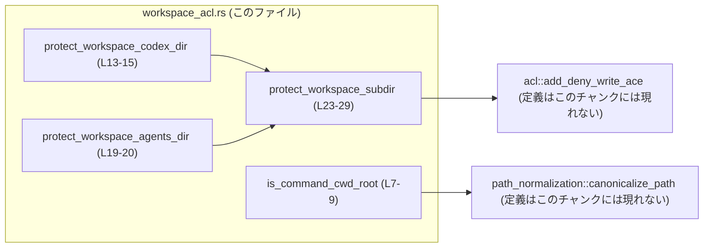
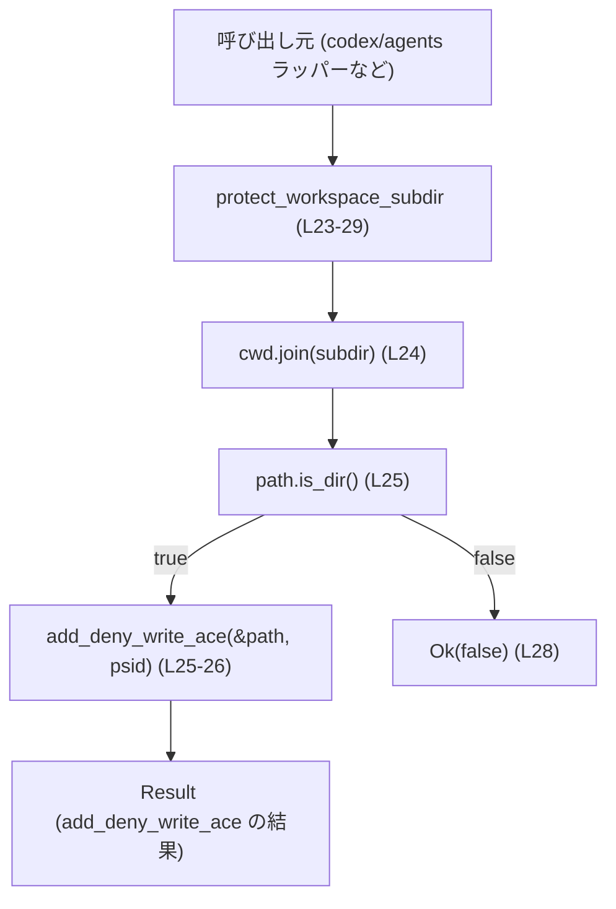
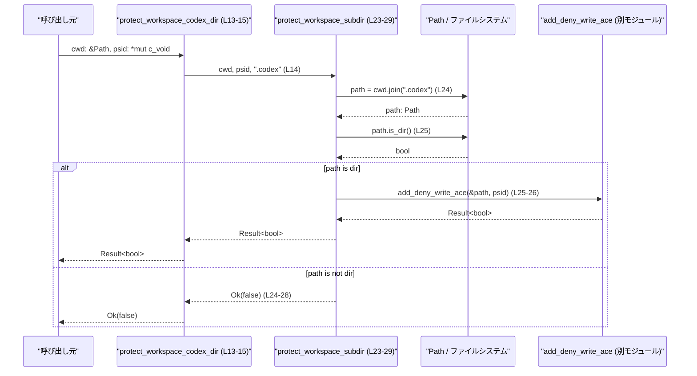

# windows-sandbox-rs\src\workspace_acl.rs

## 0. ざっくり一言

ワークスペースのルートディレクトリ判定と、ワークスペース配下の特定サブディレクトリ（`.codex`, `.agents`）に「書き込み禁止」の ACL（アクセス制御）を設定するための小さなユーティリティ群です（`windows-sandbox-rs\src\workspace_acl.rs:L7-29`）。

---

## 1. このモジュールの役割

### 1.1 概要

- このモジュールは **ワークスペースの CWD（カレントディレクトリ）が期待したルートかどうかを判定**し（`is_command_cwd_root`）、  
  さらに **その配下の一部サブディレクトリを Windows ACL で保護する**ための関数を提供します（`protect_workspace_*` 系関数）（`L7-29`）。
- 実際の ACL 操作は `crate::acl::add_deny_write_ace` に委譲しており（`L1`）、ここではパスの組み立てと存在確認のみを行います（`L23-28`）。

### 1.2 アーキテクチャ内での位置づけ

このファイルは、他モジュールのユーティリティを薄くラップして「ワークスペース ACL 操作」という用途に特化させる役割を持ちます。

- 依存している主なコンポーネント:
  - `crate::path_normalization::canonicalize_path`: ルートパスの正規化に使用（`L2`, `L7-8`）。
  - `crate::acl::add_deny_write_ace`: 実際に ACL を設定する関数に委譲（`L1`, `L25-26`）。



### 1.3 設計上のポイント

- **責務の分割**
  - パス正規化とルート比較は `is_command_cwd_root` に分離（`L7-9`）。
  - サブディレクトリ保護の共通処理は `protect_workspace_subdir` にまとめ、`.codex` / `.agents` 用の関数は薄いラッパーにしています（`L13-15`, `L19-20`, `L23-29`）。
- **状態を持たない構造**
  - グローバル状態や構造体は定義されておらず、すべて **引数のみを使う関数** です（ファイル全体に struct / static なし）。
- **安全性（unsafe の取り扱い）**
  - ACL 操作に必要な SID ポインタ `psid: *mut c_void` を受け取る関数は `unsafe fn` として定義され、**「SID ポインタが有効であることは呼び出し側の責任」** と明示されています（`L11-13`, `L17-20`）。
  - 実際の不安全操作は `add_deny_write_ace` 内にあると推測され、ここではそれをラップする形になっています（呼び出しのみ `L25-26`）。
- **エラーハンドリング**
  - ACL 設定関数は `anyhow::Result<bool>` を返し（`L3`, `L13`, `L19`, `L23`）、ファイルシステムや ACL 操作のエラーを `Result` で表現しています。
  - ディレクトリが存在しない場合は `Ok(false)` を返すことで「エラーではないが何もしなかった」ことを区別しています（`L24-28`）。
- **並行性**
  - このファイルには共有可変状態や同期原語はなく、**関数自体はスレッドセーフに呼び出せる構造**になっています。
  - 実際の並行実行時の挙動は、OS の ACL 操作実装（`add_deny_write_ace`）に依存し、このチャンクからは判断できません。

---

## 2. 主要な機能一覧

- ルートディレクトリ判定: 与えられた CWD がワークスペースルートと一致するかを正規化して判定する（`is_command_cwd_root`, `L7-9`）。
- `.codex` ディレクトリの ACL 保護: ワークスペース CWD 配下の `.codex` ディレクトリに対して書き込み禁止 ACE を追加する（`protect_workspace_codex_dir`, `L13-15`）。
- `.agents` ディレクトリの ACL 保護: 同様に `.agents` ディレクトリを保護する（`protect_workspace_agents_dir`, `L19-20`）。
- 共通サブディレクトリ ACL 保護: 任意のサブディレクトリ名を受け取り、存在する場合にのみ ACL を設定する共通関数（`protect_workspace_subdir`, `L23-29`）。

### コンポーネントインベントリー（関数）

| 名前 | 種別 | 公開範囲 | 役割 / 用途 | 定義位置 |
|------|------|----------|-------------|----------|
| `is_command_cwd_root` | 関数 | `pub` | ルートディレクトリと CWD の正規化パスを比較して、一致するか判定する | `windows-sandbox-rs\src\workspace_acl.rs:L7-9` |
| `protect_workspace_codex_dir` | 関数 (`unsafe`) | `pub` | CWD 配下の `.codex` ディレクトリが存在すれば、そのディレクトリに書き込み禁止 ACE を追加する | `windows-sandbox-rs\src\workspace_acl.rs:L13-15` |
| `protect_workspace_agents_dir` | 関数 (`unsafe`) | `pub` | CWD 配下の `.agents` ディレクトリに対して同様の ACL 保護を行う | `windows-sandbox-rs\src\workspace_acl.rs:L19-20` |
| `protect_workspace_subdir` | 関数 (`unsafe`) | 非公開 | 任意のサブディレクトリ名を受け取り、存在する場合のみ `add_deny_write_ace` を呼び出す共通処理 | `windows-sandbox-rs\src\workspace_acl.rs:L23-29` |

---

## 3. 公開 API と詳細解説

### 3.1 型一覧（構造体・列挙体など）

このファイル内で新たに定義される構造体・列挙体はありません。

使用している主な型（外部定義）:

| 名前 | 種別 | 役割 / 用途 | 出典 / 根拠 |
|------|------|-------------|-------------|
| `Path` | 構造体 | ファイルシステム上のパスを表す。全関数の引数として使用 | `use std::path::Path;`（`L5`） |
| `c_void` | 型エイリアス | 生ポインタ `*mut c_void` として Windows SID を表現するために使用 | `use std::ffi::c_void;`（`L4`）と Safety コメント（`L11-12`, `L17-18`） |
| `Result<bool>` | 列挙体 | ACL 操作の成否・エラーを表す。`bool` で追加の状態（変更有無など）を持つ可能性がある | `use anyhow::Result;`（`L3`）、戻り値型（`L13`, `L19`, `L23`） |

### 3.2 関数詳細

#### `is_command_cwd_root(root: &Path, canonical_command_cwd: &Path) -> bool`

**概要**

- `root` を正規化したパスと、既に正規化済みとみなされている `canonical_command_cwd` を比較し、  
  コマンドの CWD がワークスペースのルートディレクトリかどうかを判定する関数です（`L7-9`）。

**引数**

| 引数名 | 型 | 説明 |
|--------|----|------|
| `root` | `&Path` | ワークスペースのルートディレクトリを表すパス。`canonicalize_path` で正規化されます（`L7-8`）。 |
| `canonical_command_cwd` | `&Path` | すでに正規化済みのコマンド実行時 CWD を想定したパス。`canonicalize_path` の戻り値と比較されます（`L7-8`）。 |

**戻り値**

- `bool`:
  - `true`: `canonicalize_path(root)` と `canonical_command_cwd` が等しい場合（`L8`）。
  - `false`: それ以外の場合。

**内部処理の流れ**

1. `canonicalize_path(root)` を呼び出して、`root` の正規化されたパスを得る（`L8`）。
2. その結果を `canonical_command_cwd` と `==` で比較する（`L8`）。
3. 比較結果（`bool`）をそのまま返す（`L8-9`）。

`canonicalize_path` は `Result` を返していないことがコードから分かるため（`L8`で直接 `==` 比較されている）、  
**エラーがあればパニックするか、内部で処理して Path 互換の値を返す関数**であると考えられます。ただし、詳細な挙動はこのチャンクには現れません。

**Examples（使用例）**

以下は同一モジュール内、または適切な `use` を行った前提の擬似コード例です。

```rust
use std::path::Path;
// use crate::path_normalization::canonicalize_path; // 実際のパスはクレート構成に依存する

fn check_root_example() {
    // ワークスペースルートを表すパス
    let root = Path::new("C:\\sandbox\\workspace");           // ルート候補

    // コマンド実行時 CWD を正規化したものとする（実際には canonicalize_path などで正規化する）
    let canonical_cwd = crate::path_normalization::canonicalize_path(root); // 型は Path 互換と推測

    // ルート判定を行う
    let is_root = is_command_cwd_root(root, canonical_cwd.as_path());       // 一致すれば true

    println!("CWD is root? {}", is_root);                                   // 結果の表示
}
```

※ `crate::path_normalization::canonicalize_path` へのパスは、このチャンクからは正確には分からないため一例です。

**Errors / Panics**

- この関数自体は `Result` を返さず、明示的なエラーはありません。
- ただし、`canonicalize_path` が内部でパニックを起こす可能性は否定できませんが、その有無や条件はこのチャンクには現れません。

**Edge cases（エッジケース）**

- `root` が存在しないパスの場合:
  - `canonicalize_path` の設計に依存します。このコードからは、存在しない場合の扱いは不明です。
- `canonical_command_cwd` が `canonicalize_path(root)` と同じ表現で正規化されていない場合:
  - 実際には同じディレクトリを指していても、文字列表現の違いにより `false` が返る可能性があります。
- 大文字・小文字の扱い:
  - Windows のファイルシステムは通常大文字小文字を区別しませんが、  
    その扱いも `canonicalize_path` の実装に依存し、このチャンクからは判断できません。

**使用上の注意点**

- `canonical_command_cwd` は **必ず `canonicalize_path` と同じ規則で正規化された値**を渡す必要があります。そうでないと期待と異なる `false` が返る可能性があります。
- パスの比較は純粋に等価性のみであり、サブディレクトリや親ディレクトリの関係は考慮しません。

---

#### `unsafe fn protect_workspace_codex_dir(cwd: &Path, psid: *mut c_void) -> Result<bool>`

**概要**

- CWD（ワークスペースのベースディレクトリと想定）配下の `.codex` ディレクトリについて、
  そのディレクトリが存在する場合にのみ `add_deny_write_ace` を呼び出し、ACL に書き込み拒否 ACE を追加します（`L13-15`, `L23-29`）。
- `.codex` ディレクトリが存在しなければ何もせず、`Ok(false)` を返します（`L24-28`）。

**安全性（Safety コメント）**

- `/// Caller must ensure psid is a valid SID pointer.` というコメントが付いており（`L11-12`）、  
  **`psid` が有効な SID を指していることは呼び出し側の責任**であると明示されています。
- そのため関数は `unsafe fn` として定義されています（`L13`）。

**引数**

| 引数名 | 型 | 説明 |
|--------|----|------|
| `cwd` | `&Path` | ワークスペース CWD を表すパス。実際の `.codex` サブディレクトリのベースとなります（`L13-14`, `L23-24`）。 |
| `psid` | `*mut c_void` | Windows の SID を指すとされる生ポインタ。`add_deny_write_ace` に渡されます（`L13-14`, `L25-26`）。 |

**戻り値**

- `Result<bool>`（`L13`）:
  - `Ok(true)` といった正の値: `.codex` ディレクトリが存在し、`add_deny_write_ace` が成功した際に返されると考えられます（`L24-26`）。
  - `Ok(false)`: `.codex` ディレクトリが存在しなかった場合（`L24-28`）。
  - `Err(_)`: `add_deny_write_ace` がエラーを返した場合（`L25-26`）。具体的なエラー型は `anyhow::Error` に包まれます。

**内部処理の流れ**

1. `protect_workspace_subdir(cwd, psid, ".codex")` を呼び出すだけのラッパーです（`L14`）。
2. 実際の処理は `protect_workspace_subdir` に委譲されます（`L23-29` 参照）。

**Examples（使用例）**

```rust
use std::path::Path;
use std::ffi::c_void;
// use crate::workspace_acl::protect_workspace_codex_dir; // 実際には適切な use が必要

fn protect_codex_example() -> anyhow::Result<()> {
    // ワークスペース CWD
    let cwd = Path::new("C:\\sandbox\\workspace");            // CWD を表すパス

    // Windows API などから取得した SID ポインタを想定（実際の取得方法はこのチャンクには現れない）
    let psid: *mut c_void = get_some_sid_pointer();           // 擬似的な関数

    // unsafe 関数なので unsafe ブロック内で呼び出す
    unsafe {
        let changed = protect_workspace_codex_dir(cwd, psid)?; // ディレクトリが存在し ACL が変更された場合 true を想定
        println!("codex ACL changed? {}", changed);            // 結果表示
    }

    Ok(())
}

// ダミーの SID 取得関数（実際には Windows API 呼び出し等が必要）
fn get_some_sid_pointer() -> *mut c_void {
    std::ptr::null_mut()                                      // 例なので null を返す（実際には NG な値）
}
```

※ `get_some_sid_pointer` のような関数はこのファイルには存在せず、あくまで説明用の擬似コードです。

**Errors / Panics**

- `Err(_)`:
  - `protect_workspace_subdir` 内で呼ばれる `add_deny_write_ace` がエラーを返した場合に `Err` になります（`L25-26`）。
  - 具体的なエラー条件（例えば権限不足、パスが不正など）は `add_deny_write_ace` の実装に依存し、このチャンクには現れません。
- Panics:
  - この関数自身はパニックを起こすコードを含んでいません（`L13-15`）。
  - ただし、`cwd.join(".codex")` や `path.is_dir()` は通常パニックしない想定ですが、最終的に呼び出される `add_deny_write_ace` がパニックする可能性は、このチャンクからは不明です。

**Edge cases（エッジケース）**

- `.codex` ディレクトリが存在しない:
  - `is_dir()` が `false` を返し（`L24-25`）、`Ok(false)` が返されます（`L24-28`）。
- `.codex` がファイル（通常ファイル）として存在する:
  - `is_dir()` は `false` となり、ディレクトリとしては扱われないため ACL は変更されず、`Ok(false)` になります。
- `psid` が無効なポインタ:
  - Rust の型システムでは検出できず、`unsafe` コントラクト違反になります。
  - その場合の挙動（アクセス違反、予期せぬ ACL 設定など）は未定義であり、重大なバグ・セキュリティ問題につながりえます。

**使用上の注意点**

- **必ず有効な SID ポインタを渡すこと**:
  - Safety コメントにもある通り（`L11-12`）、`psid` の妥当性は呼び出し側の責任です。
- マルチスレッド環境でも関数自体は再入可能と考えられますが、**同じディレクトリに対し複数スレッドから同時に ACL 変更を行う場合の挙動は OS に依存**し、このチャンクからは判断できません。
- `.codex` ディレクトリを「必ず保護したい」場合でも、この関数は **ディレクトリを新規作成しません**。ディレクトリ生成は別途行う必要があります。

---

#### `unsafe fn protect_workspace_agents_dir(cwd: &Path, psid: *mut c_void) -> Result<bool>`

**概要**

- `protect_workspace_codex_dir` の `.agents` 版です。CWD 配下の `.agents` ディレクトリに対して、存在する場合のみ書き込み禁止 ACE を追加するラッパーです（`L19-20`, `L23-29`）。

**引数・戻り値**

- 引数・戻り値の型・意味は `protect_workspace_codex_dir` と同様で、異なるのはサブディレクトリ名が `.agents` である点のみです（`L20`, `L23`）。

**内部処理の流れ**

1. `protect_workspace_subdir(cwd, psid, ".agents")` を呼び出すだけです（`L20`）。
2. それ以外の処理は `protect_workspace_subdir` に委譲されます（`L23-29`）。

**Examples（使用例）**

```rust
use std::path::Path;
use std::ffi::c_void;
// use crate::workspace_acl::protect_workspace_agents_dir;

fn protect_agents_example(psid: *mut c_void) -> anyhow::Result<()> {
    let cwd = Path::new("C:\\sandbox\\workspace");           // ワークスペース CWD

    unsafe {
        let changed = protect_workspace_agents_dir(cwd, psid)?; // .agents ディレクトリを保護
        if changed {
            println!(".agents directory ACL updated");        // 変更があった場合の処理
        } else {
            println!(".agents directory not present");        // ディレクトリが存在しなかった可能性
        }
    }

    Ok(())
}
```

**Errors / Panics, Edge cases, 使用上の注意点**

- `protect_workspace_codex_dir` と同様の考慮事項が当てはまります。
- `.agents` が存在しない、もしくはディレクトリでない場合は `Ok(false)` が返ります。

---

#### `unsafe fn protect_workspace_subdir(cwd: &Path, psid: *mut c_void, subdir: &str) -> Result<bool>`

**概要**

- 任意のサブディレクトリ名 `subdir` を受け取り、`cwd.join(subdir)` がディレクトリとして存在する場合にのみ `add_deny_write_ace` を呼び出して ACL を変更する共通関数です（`L23-29`）。
- `.codex` / `.agents` 用関数はこの関数を利用して実装されています（`L14`, `L20`）。

**引数**

| 引数名 | 型 | 説明 |
|--------|----|------|
| `cwd` | `&Path` | ベースとなる CWD パス（`L23-24`）。 |
| `psid` | `*mut c_void` | SID を指す生ポインタ。呼び出し側が有効性を保証する必要があります（`L23`, Safety コメントは公開ラッパー側 `L11-12`, `L17-18`）。 |
| `subdir` | `&str` | CWD からの相対サブディレクトリ名（例: `.codex`, `.agents`）（`L23-24`）。 |

**戻り値**

- `Result<bool>`（`L23`）:
  - `Ok(true)` など: `add_deny_write_ace` が成功し、ACL に変化があったことを示す可能性があります（`L25-26`）。
  - `Ok(false)`: サブディレクトリが存在しなかった場合（`L24-28`）。
  - `Err(_)`: `add_deny_write_ace` の呼び出しがエラーになった場合（`L25-26`）。

**内部処理の流れ（アルゴリズム）**

1. `cwd.join(subdir)` により、対象サブディレクトリの絶対（または CWD 基準の）パスを生成する（`L24`）。
2. `path.is_dir()` で、そのパスが既存のディレクトリかどうかを確認する（`L25`）。
3. `true` の場合:
   - `add_deny_write_ace(&path, psid)` を呼び出し、その結果の `Result<bool>` をそのまま返す（`L25-26`）。
4. `false` の場合:
   - `Ok(false)` を返し、「ディレクトリが存在しないため何もしなかった」ことを示す（`L24-28`）。

**処理フロー図**



**Examples（使用例）**

```rust
use std::path::Path;
use std::ffi::c_void;
// use crate::workspace_acl::protect_workspace_subdir;

unsafe fn protect_custom_subdir_example(psid: *mut c_void) -> anyhow::Result<()> {
    let cwd = Path::new("C:\\sandbox\\workspace");           // ベース CWD
    let subdir = "logs";                                     // 任意のサブディレクトリ名

    let changed = protect_workspace_subdir(cwd, psid, subdir)?; // "logs" ディレクトリに ACL を設定
    if changed {
        println!("logs ACL updated");
    } else {
        println!("logs dir not found, ACL not changed");
    }

    Ok(())
}
```

**Errors / Panics**

- `Err(_)`:
  - `add_deny_write_ace` がエラーを返す場合に、そのまま上位に伝播します（`L25-26`）。
- パニック:
  - この関数内に明示的な `panic!` や `unwrap` はないため、Rust コードとしてはパニック要因はありません（`L23-29`）。
  - ただし、低レベルの FFI や OS 呼び出しを行っている `add_deny_write_ace` がパニックするかどうかは、このチャンクからは分かりません。

**Edge cases（エッジケース）**

- `subdir` にスラッシュなどを含む場合:
  - `cwd.join(subdir)` の振る舞いに依存しますが、一般にはサブディレクトリの階層として解釈されます。  
    セキュリティ上、意図しないパスにならないよう、呼び出し側で `subdir` を制限する必要がある可能性があります。
- `cwd` が存在しない／アクセス不能なパス:
  - `join` や `is_dir` は通常エラーではなく単に `false` を返すか、OS によってはエラーとなることもありますが、  
    具体的な挙動はこのチャンクからは判断できません。
- `psid` が `null_mut()` など明らかに不正なポインタ:
  - `unsafe` コントラクト違反であり、未定義動作を引き起こす可能性があります。

**使用上の注意点**

- `subdir` を外部入力からそのまま渡すとパストラバーサル的な問題が起こりうるため、  
  実運用では `.codex` や `.agents` のように**固定文字列**を使うパターンが安全です（このファイルの利用例がその形です: `L14`, `L20`）。
- ディレクトリの作成までは行わないため、「保護対象が存在しないこと」自体はエラーと見なさない設計になっています（`Ok(false)`, `L24-28`）。

### 3.3 その他の関数

- このファイルには、上記 4 関数以外の関数は定義されていません。

---

## 4. データフロー

ここでは、代表的なシナリオとして「`.codex` ディレクトリを保護する」場合のデータフローを示します。

1. 呼び出し元が CWD パスと SID ポインタを用意し、`protect_workspace_codex_dir` を呼び出す（`L13-14`）。
2. `protect_workspace_codex_dir` は `protect_workspace_subdir` に処理を委譲する（`L14`）。
3. `protect_workspace_subdir` が `cwd.join(".codex")` でパスを生成し（`L24`）、`.is_dir()` で存在・種別を確認する（`L25`）。
4. ディレクトリが存在する場合にのみ `add_deny_write_ace` を呼び出し、`Result<bool>` を返す（`L25-26`）。存在しない場合は `Ok(false)` を返す（`L24-28`）。



このデータフローから分かる通り、**ディレクトリの存在確認を行った上で ACL を変更する**ことで、  
存在しないパスやファイルに対する ACL 変更を避けています。

---

## 5. 使い方（How to Use）

### 5.1 基本的な使用方法

ワークスペースのルート判定と `.codex` / `.agents` の ACL 保護を行う典型的なフローの例です。

```rust
use std::path::Path;
use std::ffi::c_void;
// use crate::workspace_acl::{is_command_cwd_root, protect_workspace_codex_dir, protect_workspace_agents_dir};
// use crate::path_normalization::canonicalize_path;

fn main() -> anyhow::Result<()> {
    // ワークスペースルートパス
    let root = Path::new("C:\\sandbox\\workspace");              // ルート候補

    // 実際の CWD を正規化したと仮定
    let canonical_cwd = crate::path_normalization::canonicalize_path(root); // 実装は別モジュール

    // CWD がルートかどうか確認
    if !is_command_cwd_root(root, canonical_cwd.as_path()) {     // ルートでなければ処理を中止するなど
        eprintln!("Not running from workspace root");
        return Ok(());
    }

    // SID ポインタをどこかから取得（擬似コード）
    let psid: *mut c_void = get_valid_sid_pointer();             // 実際には Windows API 等で取得

    unsafe {
        // .codex ディレクトリの ACL を保護
        let codex_changed = protect_workspace_codex_dir(root, psid)?;
        // .agents ディレクトリの ACL を保護
        let agents_changed = protect_workspace_agents_dir(root, psid)?;

        println!(".codex ACL changed: {}", codex_changed);
        println!(".agents ACL changed: {}", agents_changed);
    }

    Ok(())
}

// 実際の実装はこのチャンクには存在しない
fn get_valid_sid_pointer() -> *mut c_void {
    unimplemented!()
}
```

※ `get_valid_sid_pointer` や `canonicalize_path` の実装はこのチャンクには存在しないため、上記はあくまで利用イメージです。

### 5.2 よくある使用パターン

- **サブディレクトリの追加保護**
  - `.codex`, `.agents` 以外にも、同様のパターンで保護したいディレクトリがある場合は、  
    新しいラッパー関数を作って `protect_workspace_subdir(cwd, psid, "subdir_name")` を呼ぶのが自然です（`L23-29`）。
- **条件付き保護**
  - 設定値に応じて、あるディレクトリだけ保護をスキップする場合なども、ラッパー側で条件分岐する構成が適しています。  
    コアロジックが `protect_workspace_subdir` に集約されているため、条件分岐はラッパーに集中させやすいです。

### 5.3 よくある間違い

```rust
use std::path::Path;
use std::ffi::c_void;

// 間違い例: SID ポインタが無効なまま呼び出している
unsafe fn wrong_usage() -> anyhow::Result<()> {
    let cwd = Path::new("C:\\sandbox\\workspace");

    let psid: *mut c_void = std::ptr::null_mut();           // 無効なポインタ

    // これは Safety コメントに反する利用（未定義動作の可能性）
    let _ = protect_workspace_codex_dir(cwd, psid)?;        // 危険

    Ok(())
}

// 正しい例: SID ポインタの有効性を呼び出し側で保証する
unsafe fn correct_usage(psid: *mut c_void) -> anyhow::Result<()> {
    let cwd = Path::new("C:\\sandbox\\workspace");

    // psid が有効な SID を指すことを、呼び出し側のコードで保証してから呼び出す
    let _ = protect_workspace_codex_dir(cwd, psid)?;        // Safety 契約を満たした呼び出し

    Ok(())
}
```

- 誤用のポイント:
  - `psid` が `null_mut()` や解放済みメモリを指していると、`add_deny_write_ace` 内で予期せぬクラッシュやセキュリティホールになります。
  - これは `unsafe fn` の Safety 契約違反です（`L11-12`, `L17-18`）。

### 5.4 使用上の注意点（まとめ）

- **所有権・安全性（Rust 特有の観点）**
  - `psid: *mut c_void` は **所有権・ライフタイムがコンパイラでチェックされない生ポインタ**です。
  - このポインタが有効な SID を指し、関数呼び出し中に解放されないことを呼び出し側で保証する必要があります（Safety コメント `L11-12`, `L17-18`）。
- **エラーハンドリング**
  - `Result<bool>` の `bool` 部分は、「保護対象が存在しなかった」ケース（`Ok(false)`）と、「ACL が実際に変更された／されなかった」といった状態を区別するために使われている可能性があります。
  - 少なくとも `.codex` / `.agents` が存在しない場合には `Ok(false)` が返ることがコードから分かります（`L24-28`）。
- **並行性**
  - 関数自体は純粋関数に近く、共有可変状態を持たないため、**Rust レベルではスレッドセーフに呼び出せます**。
  - しかし、同じパスに対して複数スレッドから同時に ACL 操作を行うと、OS の ACL 実装に依存した結果になる可能性があります。
- **観測性（ログなど）**
  - このファイル内にはログ出力やメトリクス送信はありません。
  - ACL 変更の可視化が必要な場合は、`protect_workspace_*` を呼び出す側でログを追加する必要があります。

---

## 6. 変更の仕方（How to Modify）

### 6.1 新しい機能を追加する場合

例: 新しいサブディレクトリ `.logs` を保護対象に追加したい場合。

1. **新しいラッパー関数を追加**
   - `protect_workspace_codex_dir` / `protect_workspace_agents_dir` と同様のパターンで  
     `pub unsafe fn protect_workspace_logs_dir(cwd: &Path, psid: *mut c_void) -> Result<bool>` を追加し、  
     本文で `protect_workspace_subdir(cwd, psid, ".logs")` を呼びます。
2. **Safety コメントを忘れずに追加**
   - 既存関数と同様に `psid` に関する Safety コメントを付け、呼び出し側の責任範囲を明示します（`L11-12`, `L17-18` を参考）。
3. **呼び出し側の変更**
   - 新しいラッパーを適切な場所から呼び出し、必要に応じて設定値などで有効／無効を分岐させます。

このように、**ロジックを `protect_workspace_subdir` に集約している設計**のため、新しいサブディレクトリの追加は比較的局所的な変更で済みます。

### 6.2 既存の機能を変更する場合

- `is_command_cwd_root` の判定ロジックを変更する場合:
  - `canonicalize_path(root)` との単純な等価比較が前提になっているため（`L8`）、  
    例えば「サブディレクトリも許可したい」などの仕様変更がある場合は、比較ロジックを変更するだけでなく、  
    呼び出し側の期待やテストコードも合わせて見直す必要があります。
- `protect_workspace_subdir` のディレクトリ存在条件を変更する場合:
  - 現在は「ディレクトリが存在しない → `Ok(false)`」という仕様です（`L24-28`）。
  - ディレクトリを自動生成したい場合などは、`is_dir` が `false` の分岐に `create_dir_all` を追加する、  
    あるいは「存在しない場合は `Err` とする」などの仕様に変えることになります。
  - その場合、`.codex` / `.agents` の上位呼び出し側でのエラー処理も確認する必要があります。
- SID ポインタの型をラップ型に変更したい場合:
  - セーフラッパー型（例: `struct Sid(*mut c_void);`）を導入し、  
    `unsafe` をその型のメソッド内に閉じ込める設計も考えられますが、これはこのファイルだけでは判断できず、  
    crate 全体の設計方針を踏まえる必要があります。

---

## 7. 関連ファイル

このモジュールと密接に関係するモジュール／機能は次の通りです。

| パス / モジュール | 役割 / 関係 |
|------------------|------------|
| `crate::acl::add_deny_write_ace` | 指定パスと SID に対して「書き込み禁止」の ACE を ACL に追加すると考えられる関数です。`protect_workspace_subdir` から呼び出され、実際の ACL 操作を担当します（`windows-sandbox-rs\src\workspace_acl.rs:L1`, `L25-26`）。定義本体はこのチャンクには現れません。 |
| `crate::path_normalization::canonicalize_path` | パスの正規化を行うユーティリティ関数で、`is_command_cwd_root` からのみ呼び出されています（`L2`, `L7-8`）。戻り値は `Path` 互換の型であり、`Result` ではないことがこのチャンクから分かります。 |

このファイル内にはテストコードは含まれていません（`#[cfg(test)]` や `mod tests` などは存在しないため）。
